# OkHttp性能优化深度分析

## 1. 概述

OkHttp作为现代HTTP客户端库，在性能优化方面采用了多种先进技术，包括连接复用、请求合并、内存管理和高效IO操作等。本文将深入分析这些优化策略的设计思想和实现细节。

### 1.1 性能优化核心特性

- **连接池管理**：智能的HTTP/HTTPS连接复用机制
- **HTTP/2支持**：多路复用和流控制优化
- **异步处理**：高效的异步请求调度
- **内存优化**：合理的缓冲区管理和对象复用
- **IO优化**：基于Okio的高效流处理
- **线程池管理**：优化的线程资源分配

## 2. 连接复用架构

### 2.1 连接池整体架构

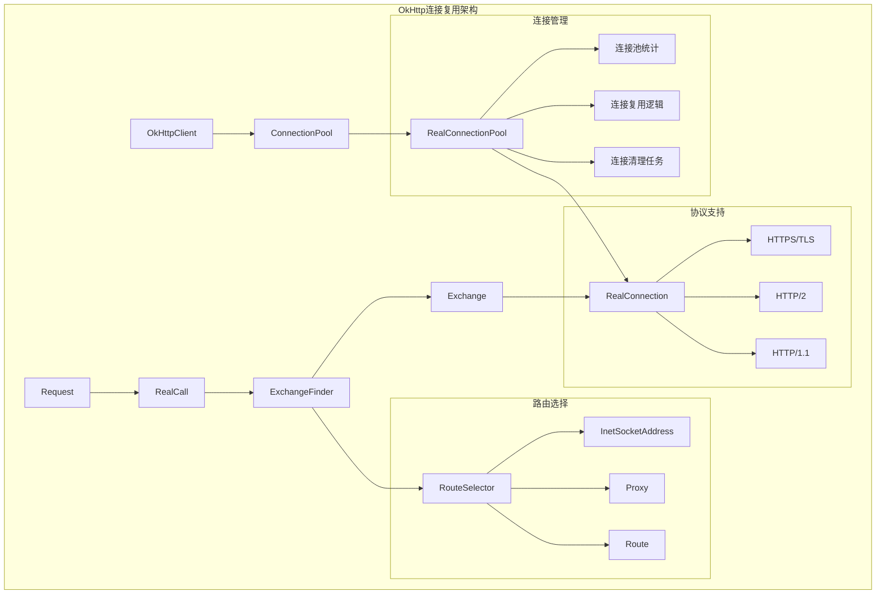

### 2.2 连接池核心组件

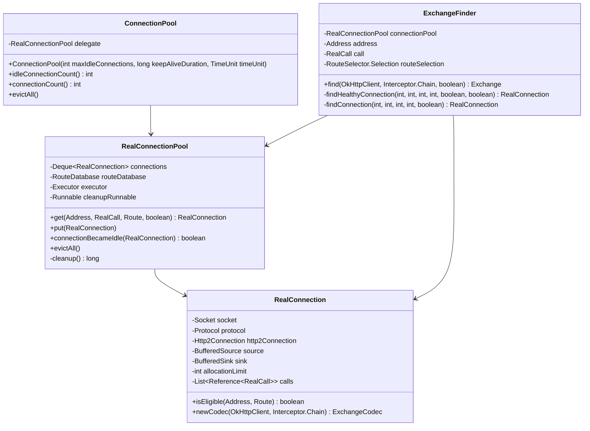

## 3. 连接复用机制详解

### 3.1 连接复用决策流程

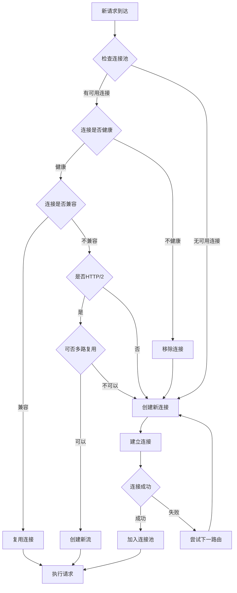

### 3.2 连接池管理算法

基于源码分析，RealConnectionPool实现了高效的连接管理：

```java
// 连接池核心管理逻辑
public final class RealConnectionPool {
    private static final long KEEP_ALIVE_DURATION_NS = 5 * 60 * 1000 * 1000 * 1000L; // 5分钟
    
    private final Deque<RealConnection> connections = new ArrayDeque<>();
    private final RouteDatabase routeDatabase = new RouteDatabase();
    private final int maxIdleConnections;
    private final long keepAliveDurationNs;
    private final Runnable cleanupRunnable = () -> {
        while (true) {
            long waitNanos = cleanup(System.nanoTime());
            if (waitNanos == -1) return;
            if (waitNanos > 0) {
                synchronized (RealConnectionPool.this) {
                    try {
                        RealConnectionPool.this.wait(TimeUnit.NANOSECONDS.toMillis(waitNanos));
                    } catch (InterruptedException ignored) {
                    }
                }
            }
        }
    };
    
    // 获取可复用连接
    @Nullable RealConnection get(Address address, RealCall call, @Nullable Route route, boolean requireMultiplexed) {
        assert (Thread.holdsLock(this));
        for (RealConnection connection : connections) {
            if (requireMultiplexed && !connection.isMultiplexed()) continue;
            if (!connection.isEligible(address, route)) continue;
            call.acquireConnectionNoEvents(connection);
            return connection;
        }
        return null;
    }
    
    // 连接清理算法
    long cleanup(long now) {
        int inUseConnectionCount = 0;
        int idleConnectionCount = 0;
        RealConnection longestIdleConnection = null;
        long longestIdleDurationNs = Long.MIN_VALUE;
        
        // 遍历所有连接，找出空闲时间最长的连接
        synchronized (this) {
            for (Iterator<RealConnection> i = connections.iterator(); i.hasNext(); ) {
                RealConnection connection = i.next();
                
                // 检查连接是否正在使用
                if (pruneAndGetAllocationCount(connection, now) > 0) {
                    inUseConnectionCount++;
                    continue;
                }
                
                idleConnectionCount++;
                
                // 计算空闲时间
                long idleDurationNs = now - connection.idleAtNanos;
                if (idleDurationNs > longestIdleDurationNs) {
                    longestIdleDurationNs = idleDurationNs;
                    longestIdleConnection = connection;
                }
            }
            
            // 清理策略：超过保活时间或超过最大空闲连接数
            if (longestIdleDurationNs >= this.keepAliveDurationNs
                || idleConnectionCount > this.maxIdleConnections) {
                connections.remove(longestIdleConnection);
            } else if (idleConnectionCount > 0) {
                // 返回下次清理时间
                return keepAliveDurationNs - longestIdleDurationNs;
            } else if (inUseConnectionCount > 0) {
                // 所有连接都在使用，等待保活时间后再检查
                return keepAliveDurationNs;
            } else {
                // 没有连接，停止清理任务
                cleanupRunning = false;
                return -1;
            }
        }
        
        // 关闭被清理的连接
        closeQuietly(longestIdleConnection.socket());
        return 0;
    }
}
```

## 4. HTTP/2多路复用优化

### 4.1 HTTP/2连接架构

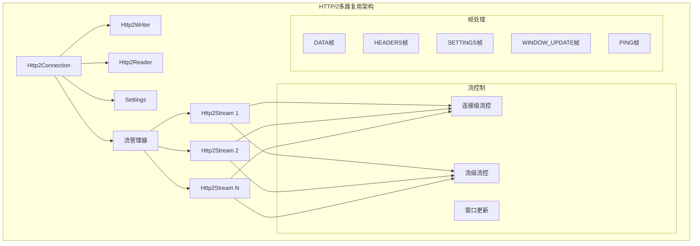

### 4.2 HTTP/2流管理

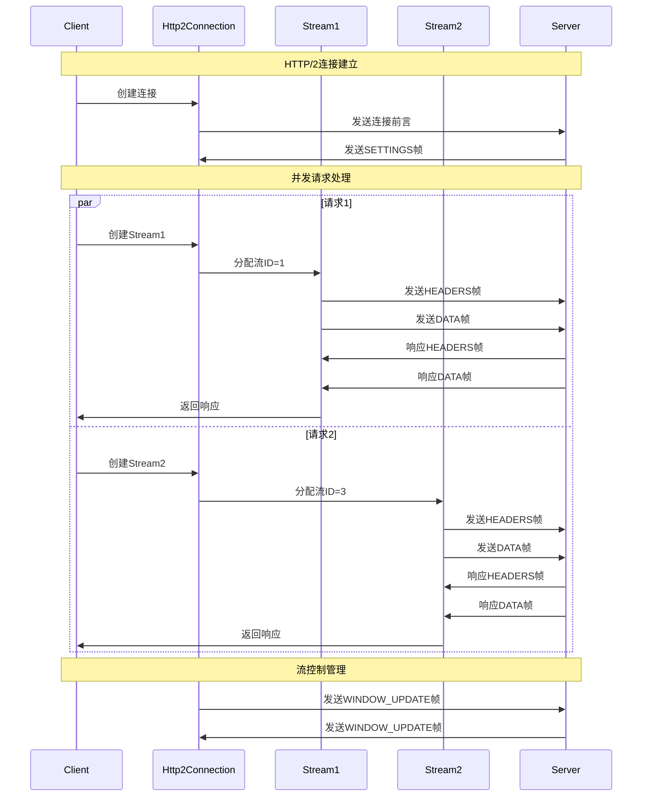

### 4.3 HTTP/2性能优化实现

```java
// HTTP/2连接管理核心逻辑
public final class Http2Connection implements Closeable {
    private final Map<Integer, Http2Stream> streams = new LinkedHashMap<>();
    private final String connectionName;
    private int lastGoodStreamId;
    private int nextStreamId;
    private boolean shutdown;
    
    // 流控制窗口
    private long unacknowledgedBytesRead = 0;
    private long bytesLeftInWriteWindow;
    
    // 创建新流（多路复用核心）
    public Http2Stream newStream(List<Header> requestHeaders, boolean out) throws IOException {
        return newStream(0, requestHeaders, out);
    }
    
    private Http2Stream newStream(int associatedStreamId, List<Header> requestHeaders, boolean out) throws IOException {
        boolean outFinished = !out;
        boolean inFinished = false;
        Http2Stream stream;
        int streamId;
        
        synchronized (writer) {
            synchronized (this) {
                if (nextStreamId > Integer.MAX_VALUE / 2) {
                    shutdown(REFUSED_STREAM);
                }
                if (shutdown) {
                    throw new ConnectionShutdownException();
                }
                streamId = nextStreamId;
                nextStreamId += 2;
                stream = new Http2Stream(streamId, this, outFinished, inFinished, null);
                if (stream.isOpen()) {
                    streams.put(streamId, stream);
                }
            }
            if (associatedStreamId == 0) {
                writer.headers(outFinished, streamId, requestHeaders);
            } else if (client) {
                throw new IllegalArgumentException("client cannot push");
            } else {
                writer.pushPromise(associatedStreamId, streamId, requestHeaders);
            }
        }
        
        if (!out) {
            writer.flush();
        }
        
        return stream;
    }
    
    // 流控制窗口管理
    void updateConnectionFlowControl(long read) {
        assert (!Thread.holdsLock(Http2Connection.this));
        synchronized (Http2Connection.this) {
            unacknowledgedBytesRead += read;
            if (unacknowledgedBytesRead >= okHttpSettings.getInitialWindowSize() / 2) {
                writeWindowUpdateLater(0, unacknowledgedBytesRead);
                unacknowledgedBytesRead = 0;
            }
        }
    }
}
```

## 5. 异步处理和请求调度

### 5.1 Dispatcher调度架构

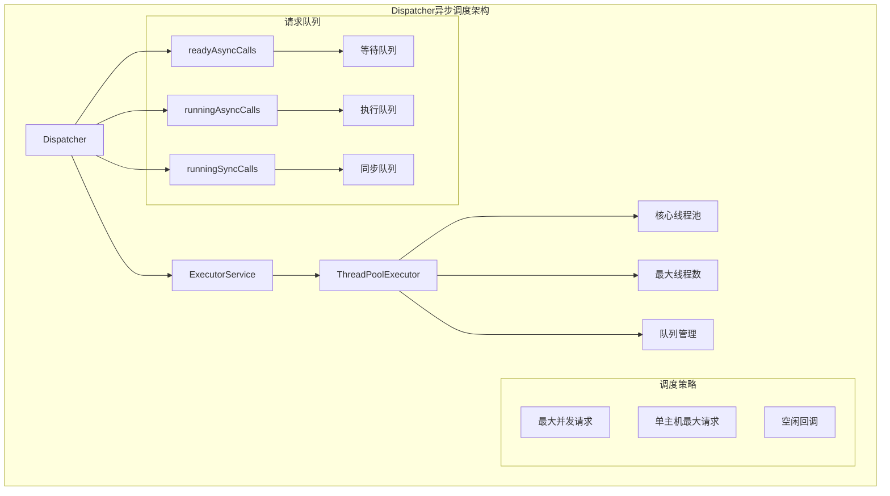

### 5.2 异步调度流程

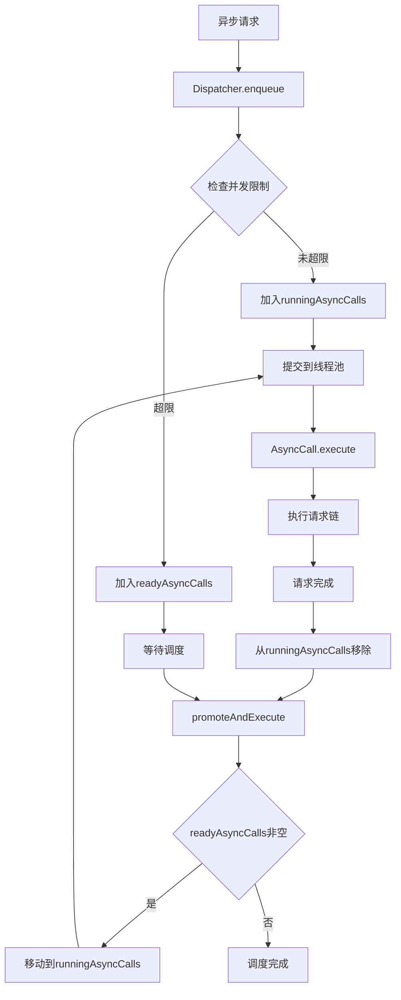

### 5.3 Dispatcher核心实现

```java
public final class Dispatcher {
    private int maxRequests = 64;
    private int maxRequestsPerHost = 5;
    private @Nullable Runnable idleCallback;
    
    /** 准备执行的异步请求 */
    private final Deque<AsyncCall> readyAsyncCalls = new ArrayDeque<>();
    
    /** 正在执行的异步请求 */
    private final Deque<AsyncCall> runningAsyncCalls = new ArrayDeque<>();
    
    /** 正在执行的同步请求 */
    private final Deque<RealCall> runningSyncCalls = new ArrayDeque<>();
    
    public synchronized ExecutorService executorService() {
        if (executorService == null) {
            executorService = new ThreadPoolExecutor(0, Integer.MAX_VALUE, 60, TimeUnit.SECONDS,
                new SynchronousQueue<>(), Util.threadFactory("OkHttp Dispatcher", false));
        }
        return executorService;
    }
    
    void enqueue(AsyncCall call) {
        synchronized (this) {
            readyAsyncCalls.add(call);
            
            // 如果是同一主机的重复请求，共享AtomicInteger计数器
            if (!call.get().forWebSocket) {
                AsyncCall existingCall = findExistingCallWithHost(call.host());
                if (existingCall != null) call.reuseCallsPerHostFrom(existingCall);
            }
        }
        promoteAndExecute();
    }
    
    /**
     * 将ready队列中的请求提升到running队列并执行
     */
    private boolean promoteAndExecute() {
        assert (!Thread.holdsLock(this));
        
        List<AsyncCall> executableCalls = new ArrayList<>();
        boolean isRunning;
        synchronized (this) {
            for (Iterator<AsyncCall> i = readyAsyncCalls.iterator(); i.hasNext(); ) {
                AsyncCall asyncCall = i.next();
                
                if (runningAsyncCalls.size() >= maxRequests) break; // 达到最大并发数
                if (asyncCall.callsPerHost().get() >= maxRequestsPerHost) continue; // 单主机达到最大并发数
                
                i.remove();
                asyncCall.callsPerHost().incrementAndGet();
                executableCalls.add(asyncCall);
                runningAsyncCalls.add(asyncCall);
            }
            isRunning = runningCallsCount() > 0;
        }
        
        for (int i = 0, size = executableCalls.size(); i < size; i++) {
            AsyncCall asyncCall = executableCalls.get(i);
            asyncCall.executeOn(executorService());
        }
        
        return isRunning;
    }
}
```

## 6. 内存管理优化

### 6.1 内存管理架构

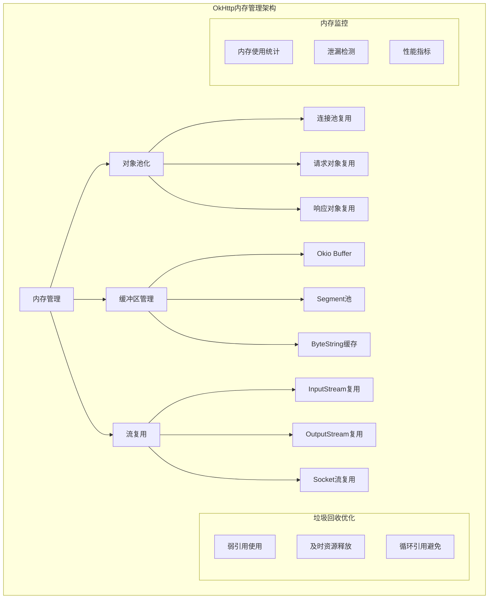

### 6.2 Okio高效IO实现

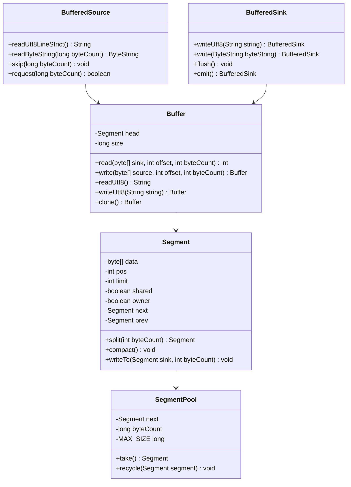

### 6.3 内存优化策略实现

```java
// Segment池化实现
final class SegmentPool {
    /** 最大池大小：64KB */
    static final long MAX_SIZE = 64 * 1024;
    
    static @Nullable Segment next;
    static long byteCount;
    
    static Segment take() {
        synchronized (SegmentPool.class) {
            if (next != null) {
                Segment result = next;
                next = result.next;
                result.next = null;
                byteCount -= Segment.SIZE;
                return result;
            }
        }
        return new Segment(); // 池为空时创建新对象
    }
    
    static void recycle(Segment segment) {
        if (segment.next != null || segment.prev != null) throw new IllegalArgumentException();
        if (segment.shared) return; // 共享的segment不能回收
        
        synchronized (SegmentPool.class) {
            if (byteCount + Segment.SIZE > MAX_SIZE) return; // 池已满
            byteCount += Segment.SIZE;
            segment.next = next;
            segment.pos = segment.limit = 0;
            next = segment;
        }
    }
}

// Buffer高效实现
public final class Buffer implements BufferedSource, BufferedSink, Cloneable, ByteChannel {
    private static final byte[] DIGITS = {'0', '1', '2', '3', '4', '5', '6', '7', '8', '9', 'a', 'b', 'c', 'd', 'e', 'f'};
    
    @Nullable Segment head;
    long size;
    
    @Override public long read(Buffer sink, long byteCount) {
        if (sink == null) throw new IllegalArgumentException("sink == null");
        if (byteCount < 0) throw new IllegalArgumentException("byteCount < 0: " + byteCount);
        if (size == 0) return -1L;
        
        if (byteCount > size) byteCount = size;
        sink.write(this, byteCount);
        return byteCount;
    }
    
    @Override public Buffer write(Buffer source, long byteCount) {
        // 移动segment而不是复制数据，提高性能
        if (source == null) throw new IllegalArgumentException("source == null");
        if (source == this) throw new IllegalArgumentException("source == this");
        checkOffsetAndCount(source.size, 0, byteCount);
        
        while (byteCount > 0) {
            // 如果可以移动整个segment，直接移动
            if (byteCount >= (source.head.limit - source.head.pos)) {
                Segment segmentToMove = source.head;
                long segmentBytes = segmentToMove.limit - segmentToMove.pos;
                source.head = segmentToMove.pop();
                
                if (head == null) {
                    head = segmentToMove;
                    head.next = head.prev = head;
                } else {
                    head.prev.push(segmentToMove).compact();
                }
                
                source.size -= segmentBytes;
                size += segmentBytes;
                byteCount -= segmentBytes;
            } else {
                // 部分复制
                int toCopy = (int) Math.min(byteCount, source.head.limit - source.head.pos);
                writableSegment(1).writeTo(source.head, toCopy);
                source.head.pos += toCopy;
                source.size -= toCopy;
                size += toCopy;
                byteCount -= toCopy;
            }
        }
        
        return this;
    }
}
```

## 7. 高效IO操作

### 7.1 IO操作架构

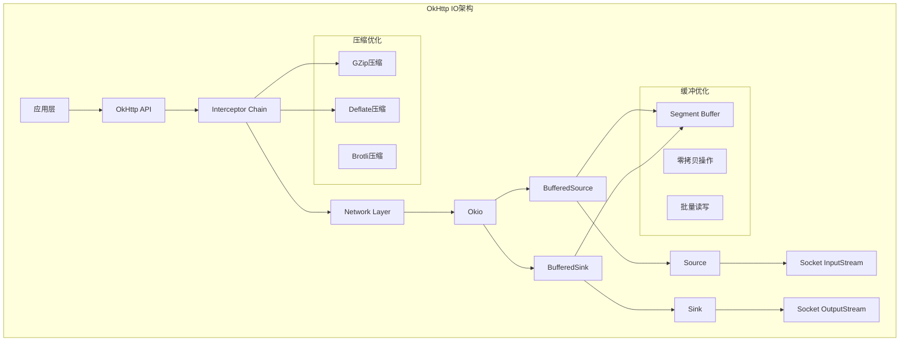

### 7.2 IO性能优化时序

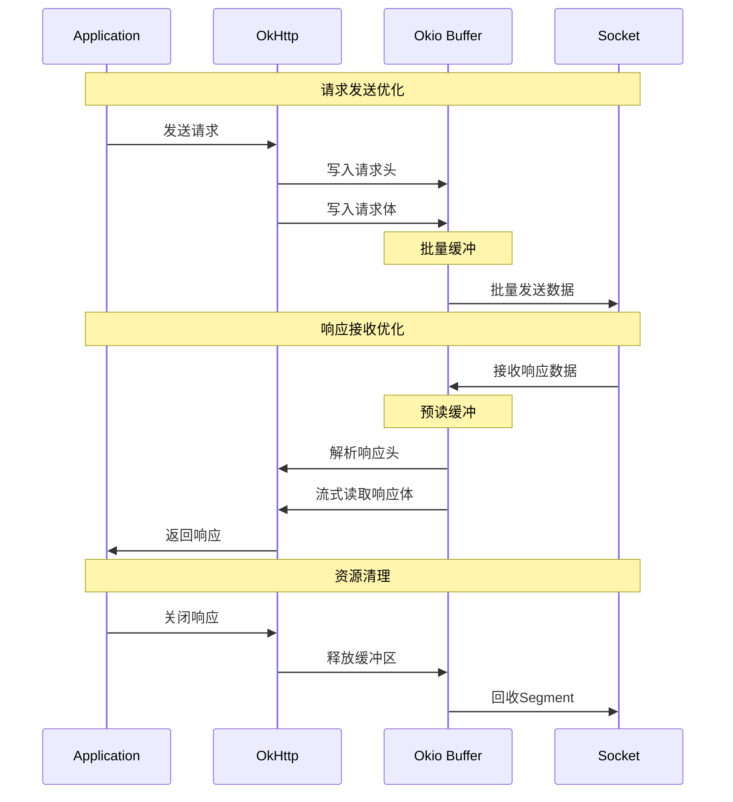

### 7.3 IO优化实现细节

```java
// 高效的HTTP编解码器
public final class Http1ExchangeCodec implements ExchangeCodec {
    private static final int HEADER_LIMIT = 256 * 1024;
    
    private final OkHttpClient client;
    private final BufferedSource source;
    private final BufferedSink sink;
    
    // 优化的请求写入
    @Override public void writeRequest(Headers headers, String requestLine) throws IOException {
        if (state != STATE_IDLE) throw new IllegalStateException("state: " + state);
        sink.writeUtf8(requestLine).writeUtf8("\\r\\n");
        for (int i = 0, size = headers.size(); i < size; i++) {
            sink.writeUtf8(headers.name(i))
                .writeUtf8(": ")
                .writeUtf8(headers.value(i))
                .writeUtf8("\\r\\n");
        }
        sink.writeUtf8("\\r\\n");
        state = STATE_OPEN_REQUEST_BODY;
    }
    
    // 优化的响应读取
    @Override public Response.Builder readResponseHeaders(boolean expectContinue) throws IOException {
        if (state != STATE_OPEN_REQUEST_BODY && state != STATE_READ_RESPONSE_HEADERS) {
            throw new IllegalStateException("state: " + state);
        }
        
        try {
            StatusLine statusLine = StatusLine.parse(readHeaderLine());
            
            Response.Builder responseBuilder = new Response.Builder()
                .protocol(statusLine.protocol)
                .code(statusLine.code)
                .message(statusLine.message);
            
            Headers.Builder headersBuilder = new Headers.Builder();
            readHeaders(headersBuilder);
            responseBuilder.headers(headersBuilder.build());
            
            if (expectContinue && statusLine.code == HTTP_CONTINUE) {
                return null;
            } else if (statusLine.code == HTTP_CONTINUE) {
                state = STATE_READ_RESPONSE_HEADERS;
                return responseBuilder;
            }
            
            state = STATE_OPEN_RESPONSE_BODY;
            return responseBuilder;
        } catch (EOFException e) {
            // Provide more context if the server ends the stream before sending a response.
            String address = "unknown";
            if (realConnection != null) {
                address = realConnection.route().address().url().redact();
            }
            throw new IOException("unexpected end of stream on " + address, e);
        }
    }
    
    // 流式响应体处理
    @Override public ResponseBody openResponseBody(Response response) throws IOException {
        streamAllocation.eventListener.responseBodyStart(streamAllocation.call);
        String contentType = response.header("Content-Type");
        
        if (!HttpHeaders.hasBody(response)) {
            Source source = newFixedLengthSource(0);
            return new RealResponseBody(contentType, 0, Okio.buffer(source));
        }
        
        if ("chunked".equalsIgnoreCase(response.header("Transfer-Encoding"))) {
            Source source = newChunkedSource(response.request().url());
            return new RealResponseBody(contentType, -1L, Okio.buffer(source));
        }
        
        long contentLength = HttpHeaders.contentLength(response);
        if (contentLength != -1) {
            Source source = newFixedLengthSource(contentLength);
            return new RealResponseBody(contentType, contentLength, Okio.buffer(source));
        }
        
        return new RealResponseBody(contentType, -1L, Okio.buffer(newUnknownLengthSource()));
    }
}
```

## 8. 路由选择和负载均衡

### 8.1 路由选择架构

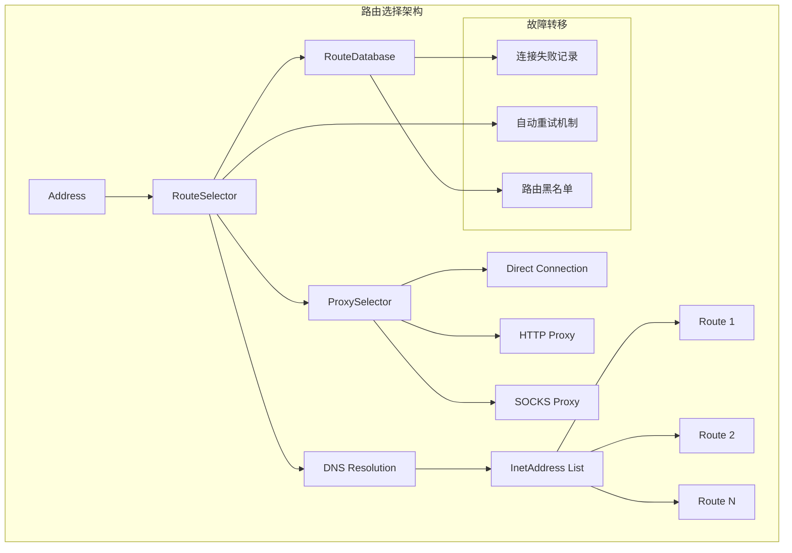

### 8.2 路由选择流程

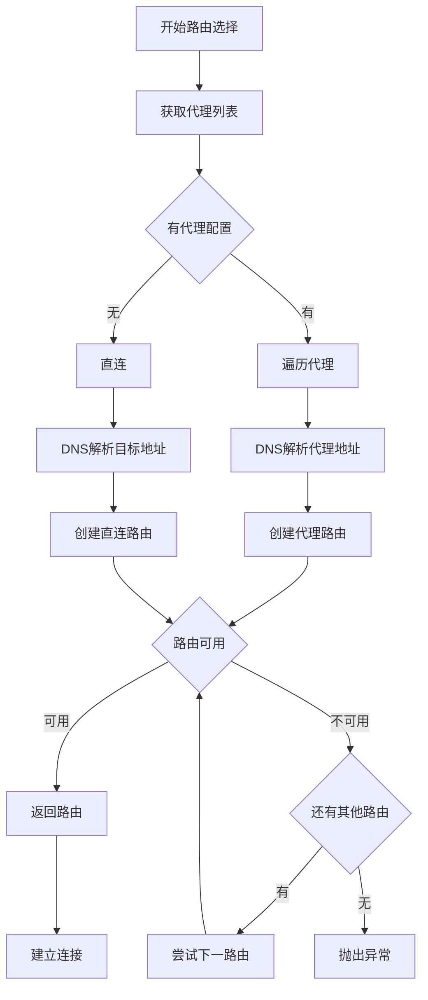

### 8.3 RouteSelector实现

```java
public final class RouteSelector {
    private final Address address;
    private final RouteDatabase routeDatabase;
    private final Call call;
    private final EventListener eventListener;
    
    /* State for negotiating the next proxy to use. */
    private List<Proxy> proxies = Collections.emptyList();
    private int nextProxyIndex;
    
    /* State for negotiating the next socket address to use. */
    private List<InetSocketAddress> inetSocketAddresses = Collections.emptyList();
    
    public RouteSelector(Address address, RouteDatabase routeDatabase, Call call, EventListener eventListener) {
        this.address = address;
        this.routeDatabase = routeDatabase;
        this.call = call;
        this.eventListener = eventListener;
        
        resetNextProxy(address.url(), address.proxy());
    }
    
    /**
     * 返回下一组路由进行尝试
     */
    public Selection next() throws IOException {
        if (!hasNext()) {
            throw new NoSuchElementException();
        }
        
        // 计算下一组要尝试的路由
        List<Route> routes = new ArrayList<>();
        while (hasNextProxy()) {
            // 延迟的DNS查询直到我们确实需要它
            Proxy proxy = nextProxy();
            for (int i = 0, size = inetSocketAddresses.size(); i < size; i++) {
                Route route = new Route(address, proxy, inetSocketAddresses.get(i));
                if (routeDatabase.shouldPostpone(route)) {
                    postponedRoutes.add(route);
                } else {
                    routes.add(route);
                }
            }
            
            if (!routes.isEmpty()) {
                break;
            }
        }
        
        if (routes.isEmpty()) {
            // 我们已经用完了好的路由，尝试被推迟的路由
            routes.addAll(postponedRoutes);
            postponedRoutes.clear();
        }
        
        return new Selection(routes);
    }
    
    /**
     * 获取下一个代理进行尝试。可能是DIRECT、HTTP或SOCKS代理
     */
    private Proxy nextProxy() throws IOException {
        if (!hasNextProxy()) {
            throw new SocketException("No route to " + address.url().host()
                + "; exhausted proxy configurations: " + proxies);
        }
        Proxy result = proxies.get(nextProxyIndex++);
        resetNextInetSocketAddress(result);
        return result;
    }
    
    /**
     * 获取要连接的socket地址。如果URL的主机是一个IP地址，这将返回一个条目的列表。
     * 否则，它返回DNS查找的地址列表。
     */
    private void resetNextInetSocketAddress(Proxy proxy) throws IOException {
        // 清除之前查找的地址
        inetSocketAddresses = new ArrayList<>();
        
        String socketHost;
        int socketPort;
        if (proxy.type() == Proxy.Type.DIRECT || proxy.type() == Proxy.Type.SOCKS) {
            socketHost = address.url().host();
            socketPort = address.url().port();
        } else {
            SocketAddress proxyAddress = proxy.address();
            if (!(proxyAddress instanceof InetSocketAddress)) {
                throw new IllegalArgumentException(
                    "Proxy.address() is not an InetSocketAddress: " + proxyAddress.getClass());
            }
            InetSocketAddress proxySocketAddress = (InetSocketAddress) proxyAddress;
            socketHost = getHostString(proxySocketAddress);
            socketPort = proxySocketAddress.getPort();
        }
        
        if (socketPort < 1 || socketPort > 65535) {
            throw new SocketException("No route to " + socketHost + ":" + socketPort
                + "; port is out of range");
        }
        
        if (proxy.type() == Proxy.Type.SOCKS) {
            inetSocketAddresses.add(InetSocketAddress.createUnresolved(socketHost, socketPort));
        } else {
            eventListener.dnsStart(call, socketHost);
            
            // 尝试每个地址直到找到一个我们可以连接的
            List<InetAddress> addresses = address.dns().lookup(socketHost);
            if (addresses.isEmpty()) {
                throw new UnknownHostException(address.dns() + " returned no addresses for " + socketHost);
            }
            
            eventListener.dnsEnd(call, socketHost, addresses);
            
            for (int i = 0, size = addresses.size(); i < size; i++) {
                InetAddress inetAddress = addresses.get(i);
                inetSocketAddresses.add(new InetSocketAddress(inetAddress, socketPort));
            }
        }
    }
}
```

## 9. 性能监控和指标

### 9.1 性能监控架构

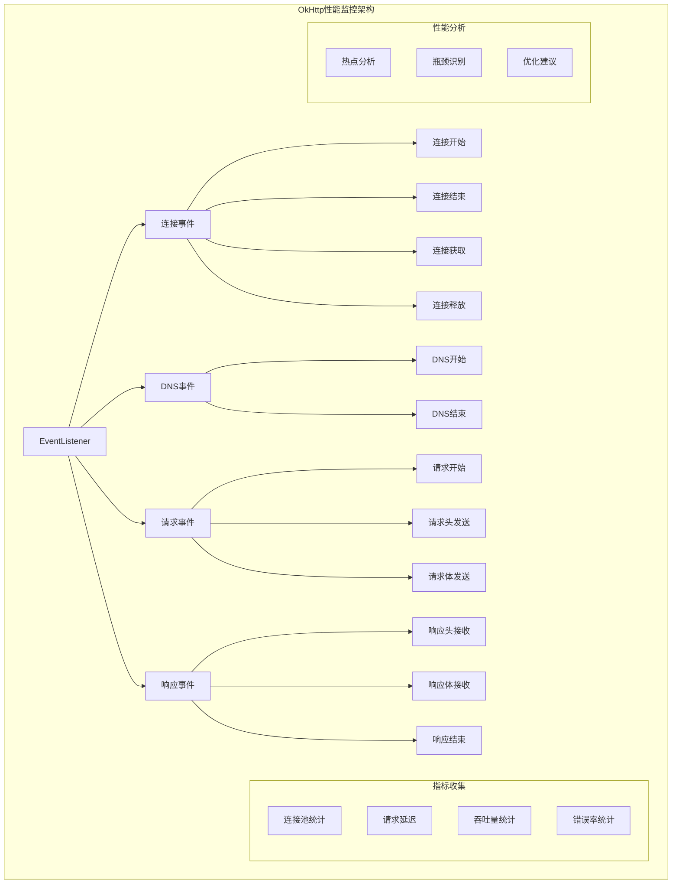

### 9.2 EventListener实现

```java
// 性能监控事件监听器
public abstract class EventListener {
    public static final EventListener NONE = new EventListener() {
    };
    
    /**
     * 工厂接口用于创建EventListener实例
     */
    public interface Factory {
        EventListener create(Call call);
    }
    
    public static Factory factory(EventListener listener) {
        return call -> listener;
    }
    
    // 连接相关事件
    public void connectStart(Call call, InetSocketAddress inetSocketAddress, Proxy proxy) {
    }
    
    public void secureConnectStart(Call call) {
    }
    
    public void secureConnectEnd(Call call, @Nullable Handshake handshake) {
    }
    
    public void connectEnd(Call call, InetSocketAddress inetSocketAddress, Proxy proxy,
        @Nullable Protocol protocol) {
    }
    
    public void connectFailed(Call call, InetSocketAddress inetSocketAddress, Proxy proxy,
        @Nullable Protocol protocol, IOException ioe) {
    }
    
    public void connectionAcquired(Call call, Connection connection) {
    }
    
    public void connectionReleased(Call call, Connection connection) {
    }
    
    // DNS相关事件
    public void dnsStart(Call call, String domainName) {
    }
    
    public void dnsEnd(Call call, String domainName, List<InetAddress> inetAddressList) {
    }
    
    // 请求相关事件
    public void requestHeadersStart(Call call) {
    }
    
    public void requestHeadersEnd(Call call, Request request) {
    }
    
    public void requestBodyStart(Call call) {
    }
    
    public void requestBodyEnd(Call call, long byteCount) {
    }
    
    // 响应相关事件
    public void responseHeadersStart(Call call) {
    }
    
    public void responseHeadersEnd(Call call, Response response) {
    }
    
    public void responseBodyStart(Call call) {
    }
    
    public void responseBodyEnd(Call call, long byteCount) {
    }
    
    public void callEnd(Call call) {
    }
    
    public void callFailed(Call call, IOException ioe) {
    }
}

// 性能统计EventListener实现示例
public class PerformanceEventListener extends EventListener {
    private final Map<Call, CallMetrics> callMetrics = new ConcurrentHashMap<>();
    
    private static class CallMetrics {
        long callStart;
        long dnsStart;
        long dnsEnd;
        long connectStart;
        long connectEnd;
        long requestStart;
        long requestEnd;
        long responseStart;
        long responseEnd;
        long callEnd;
        
        long getTotalTime() {
            return callEnd - callStart;
        }
        
        long getDnsTime() {
            return dnsEnd - dnsStart;
        }
        
        long getConnectTime() {
            return connectEnd - connectStart;
        }
        
        long getRequestTime() {
            return requestEnd - requestStart;
        }
        
        long getResponseTime() {
            return responseEnd - responseStart;
        }
    }
    
    @Override
    public void callStart(Call call) {
        CallMetrics metrics = new CallMetrics();
        metrics.callStart = System.nanoTime();
        callMetrics.put(call, metrics);
    }
    
    @Override
    public void dnsStart(Call call, String domainName) {
        CallMetrics metrics = callMetrics.get(call);
        if (metrics != null) {
            metrics.dnsStart = System.nanoTime();
        }
    }
    
    @Override
    public void dnsEnd(Call call, String domainName, List<InetAddress> inetAddressList) {
        CallMetrics metrics = callMetrics.get(call);
        if (metrics != null) {
            metrics.dnsEnd = System.nanoTime();
        }
    }
    
    @Override
    public void connectStart(Call call, InetSocketAddress inetSocketAddress, Proxy proxy) {
        CallMetrics metrics = callMetrics.get(call);
        if (metrics != null) {
            metrics.connectStart = System.nanoTime();
        }
    }
    
    @Override
    public void connectEnd(Call call, InetSocketAddress inetSocketAddress, Proxy proxy, Protocol protocol) {
        CallMetrics metrics = callMetrics.get(call);
        if (metrics != null) {
            metrics.connectEnd = System.nanoTime();
        }
    }
    
    @Override
    public void callEnd(Call call) {
        CallMetrics metrics = callMetrics.get(call);
        if (metrics != null) {
            metrics.callEnd = System.nanoTime();
            
            // 输出性能指标
            System.out.printf("Call Performance: Total=%dms, DNS=%dms, Connect=%dms, Request=%dms, Response=%dms%n",
                TimeUnit.NANOSECONDS.toMillis(metrics.getTotalTime()),
                TimeUnit.NANOSECONDS.toMillis(metrics.getDnsTime()),
                TimeUnit.NANOSECONDS.toMillis(metrics.getConnectTime()),
                TimeUnit.NANOSECONDS.toMillis(metrics.getRequestTime()),
                TimeUnit.NANOSECONDS.toMillis(metrics.getResponseTime()));
            
            callMetrics.remove(call);
        }
    }
}
```

## 10. 最佳实践和优化建议

### 10.1 连接池优化配置

```java
// 生产环境连接池优化配置
public class OptimizedOkHttpClient {
    
    public static OkHttpClient createOptimizedClient() {
        // 自定义连接池配置
        ConnectionPool connectionPool = new ConnectionPool(
            50,  // 最大空闲连接数
            5,   // 连接保活时间
            TimeUnit.MINUTES
        );
        
        // 自定义调度器配置
        Dispatcher dispatcher = new Dispatcher();
        dispatcher.setMaxRequests(100);        // 最大并发请求数
        dispatcher.setMaxRequestsPerHost(10);  // 单主机最大并发数
        
        // 自定义线程池
        ThreadPoolExecutor executor = new ThreadPoolExecutor(
            10,                      // 核心线程数
            50,                      // 最大线程数
            60L,                     // 线程空闲时间
            TimeUnit.SECONDS,
            new LinkedBlockingQueue<>(200),  // 任务队列
            new ThreadFactory() {
                private final AtomicInteger threadNumber = new AtomicInteger(1);
                @Override
                public Thread newThread(Runnable r) {
                    Thread t = new Thread(r, "OkHttp-" + threadNumber.getAndIncrement());
                    t.setDaemon(false);
                    return t;
                }
            }
        );
        dispatcher.setExecutorService(executor);
        
        return new OkHttpClient.Builder()
            .connectionPool(connectionPool)
            .dispatcher(dispatcher)
            .connectTimeout(10, TimeUnit.SECONDS)
            .readTimeout(30, TimeUnit.SECONDS)
            .writeTimeout(30, TimeUnit.SECONDS)
            .retryOnConnectionFailure(true)
            .protocols(Arrays.asList(Protocol.HTTP_2, Protocol.HTTP_1_1))
            .build();
    }
}
```

### 10.2 内存优化最佳实践

```java
// 内存优化配置
public class MemoryOptimizedConfig {
    
    // 1. 合理配置缓存大小
    public static Cache createOptimizedCache(Context context) {
        File cacheDir = new File(context.getCacheDir(), "okhttp_cache");
        long cacheSize = Math.min(
            50 * 1024 * 1024,  // 最大50MB
            context.getCacheDir().getFreeSpace() / 10  // 可用空间的10%
        );
        return new Cache(cacheDir, cacheSize);
    }
    
    // 2. 请求体优化
    public static RequestBody createStreamingRequestBody(File file) {
        return new RequestBody() {
            @Override
            public MediaType contentType() {
                return MediaType.parse("application/octet-stream");
            }
            
            @Override
            public long contentLength() {
                return file.length();
            }
            
            @Override
            public void writeTo(BufferedSink sink) throws IOException {
                try (Source source = Okio.source(file)) {
                    sink.writeAll(source);
                }
            }
        };
    }
    
    // 3. 响应体流式处理
    public static void processLargeResponse(Response response) throws IOException {
        try (ResponseBody body = response.body()) {
            if (body != null) {
                try (BufferedSource source = body.source()) {
                    // 流式处理，避免将整个响应加载到内存
                    while (!source.exhausted()) {
                        String line = source.readUtf8LineStrict();
                        // 处理每一行数据
                        processLine(line);
                    }
                }
            }
        }
    }
    
    private static void processLine(String line) {
        // 处理单行数据的逻辑
    }
}
```

### 10.3 性能监控实现

```java
// 完整的性能监控实现
public class ComprehensivePerformanceMonitor {
    
    public static class PerformanceMetrics {
        private final AtomicLong totalRequests = new AtomicLong();
        private final AtomicLong successfulRequests = new AtomicLong();
        private final AtomicLong failedRequests = new AtomicLong();
        private final AtomicLong totalResponseTime = new AtomicLong();
        private final AtomicLong connectionPoolHits = new AtomicLong();
        private final AtomicLong connectionPoolMisses = new AtomicLong();
        
        public void recordRequest(long responseTimeMs, boolean success, boolean connectionReused) {
            totalRequests.incrementAndGet();
            totalResponseTime.addAndGet(responseTimeMs);
            
            if (success) {
                successfulRequests.incrementAndGet();
            } else {
                failedRequests.incrementAndGet();
            }
            
            if (connectionReused) {
                connectionPoolHits.incrementAndGet();
            } else {
                connectionPoolMisses.incrementAndGet();
            }
        }
        
        public double getAverageResponseTime() {
            long total = totalRequests.get();
            return total > 0 ? (double) totalResponseTime.get() / total : 0;
        }
        
        public double getSuccessRate() {
            long total = totalRequests.get();
            return total > 0 ? (double) successfulRequests.get() / total : 0;
        }
        
        public double getConnectionReuseRate() {
            long totalConnections = connectionPoolHits.get() + connectionPoolMisses.get();
            return totalConnections > 0 ? (double) connectionPoolHits.get() / totalConnections : 0;
        }
        
        public void printStats() {
            System.out.printf("Performance Stats:%n" +
                "  Total Requests: %d%n" +
                "  Success Rate: %.2f%%%n" +
                "  Average Response Time: %.2fms%n" +
                "  Connection Reuse Rate: %.2f%%%n",
                totalRequests.get(),
                getSuccessRate() * 100,
                getAverageResponseTime(),
                getConnectionReuseRate() * 100);
        }
    }
    
    public static class MonitoringEventListener extends EventListener {
        private final PerformanceMetrics metrics;
        private final Map<Call, Long> callStartTimes = new ConcurrentHashMap<>();
        private final Map<Call, Boolean> connectionReused = new ConcurrentHashMap<>();
        
        public MonitoringEventListener(PerformanceMetrics metrics) {
            this.metrics = metrics;
        }
        
        @Override
        public void callStart(Call call) {
            callStartTimes.put(call, System.currentTimeMillis());
        }
        
        @Override
        public void connectionAcquired(Call call, Connection connection) {
            // 检查连接是否被复用（简化实现）
            connectionReused.put(call, true);
        }
        
        @Override
        public void connectStart(Call call, InetSocketAddress inetSocketAddress, Proxy proxy) {
            // 新连接建立，标记为未复用
            connectionReused.put(call, false);
        }
        
        @Override
        public void callEnd(Call call) {
            recordCallCompletion(call, true);
        }
        
        @Override
        public void callFailed(Call call, IOException ioe) {
            recordCallCompletion(call, false);
        }
        
        private void recordCallCompletion(Call call, boolean success) {
            Long startTime = callStartTimes.remove(call);
            Boolean reused = connectionReused.remove(call);
            
            if (startTime != null) {
                long responseTime = System.currentTimeMillis() - startTime;
                metrics.recordRequest(responseTime, success, reused != null ? reused : false);
            }
        }
    }
}
```

## 11. 总结

OkHttp的性能优化体现在多个层面：

### 11.1 核心优化策略

1. **连接复用**：通过连接池实现HTTP连接的高效复用，减少连接建立开销
2. **HTTP/2支持**：多路复用技术实现单连接并发请求处理
3. **异步处理**：智能的请求调度和线程池管理
4. **内存优化**：基于Okio的高效缓冲区管理和对象池化
5. **IO优化**：流式处理和零拷贝技术减少内存占用

### 11.2 设计亮点

- **分层架构**：清晰的职责分离和模块化设计
- **智能调度**：基于负载的动态请求调度策略
- **资源管理**：自动化的连接清理和内存回收机制
- **性能监控**：完整的事件监听和指标收集体系
- **扩展性**：良好的可配置性和可扩展性

### 11.3 实际应用价值

通过深入理解OkHttp的性能优化策略，开发者可以：
- 合理配置连接池参数提升应用性能
- 利用HTTP/2特性优化网络通信
- 实现高效的内存管理避免OOM
- 建立完善的性能监控体系
- 针对特定场景进行定制化优化

这些优化策略不仅适用于OkHttp本身，也为其他网络库的设计和优化提供了宝贵的参考。