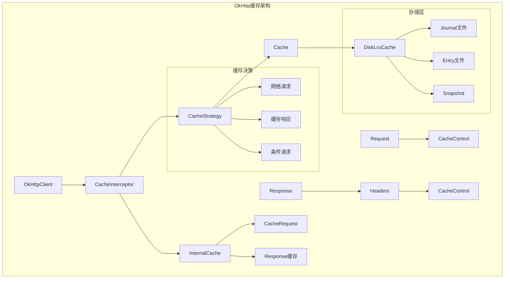
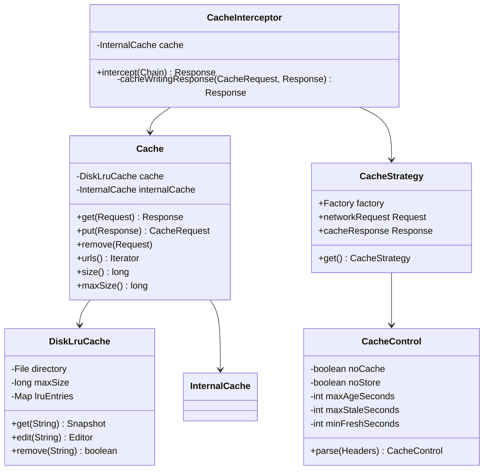
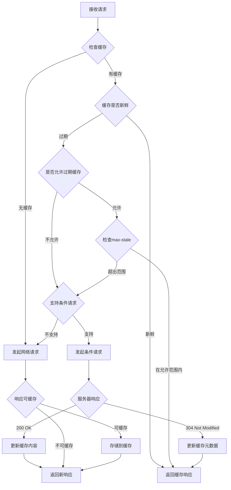
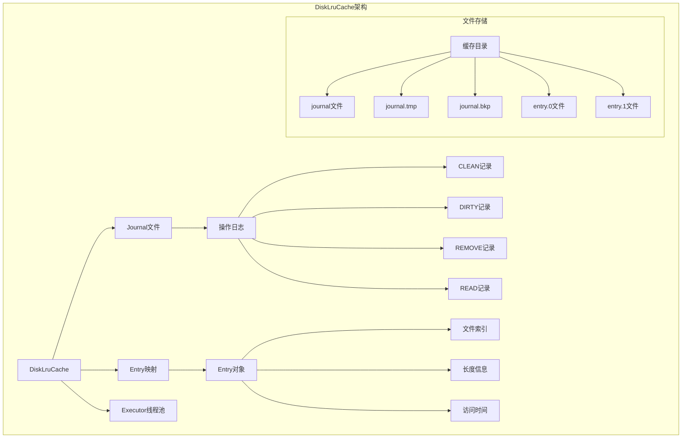
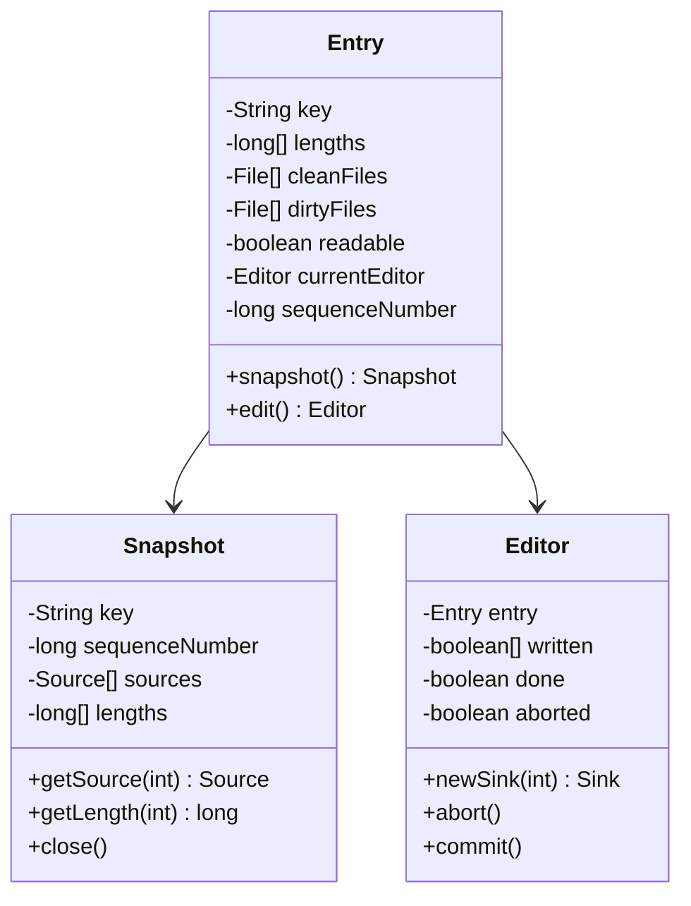
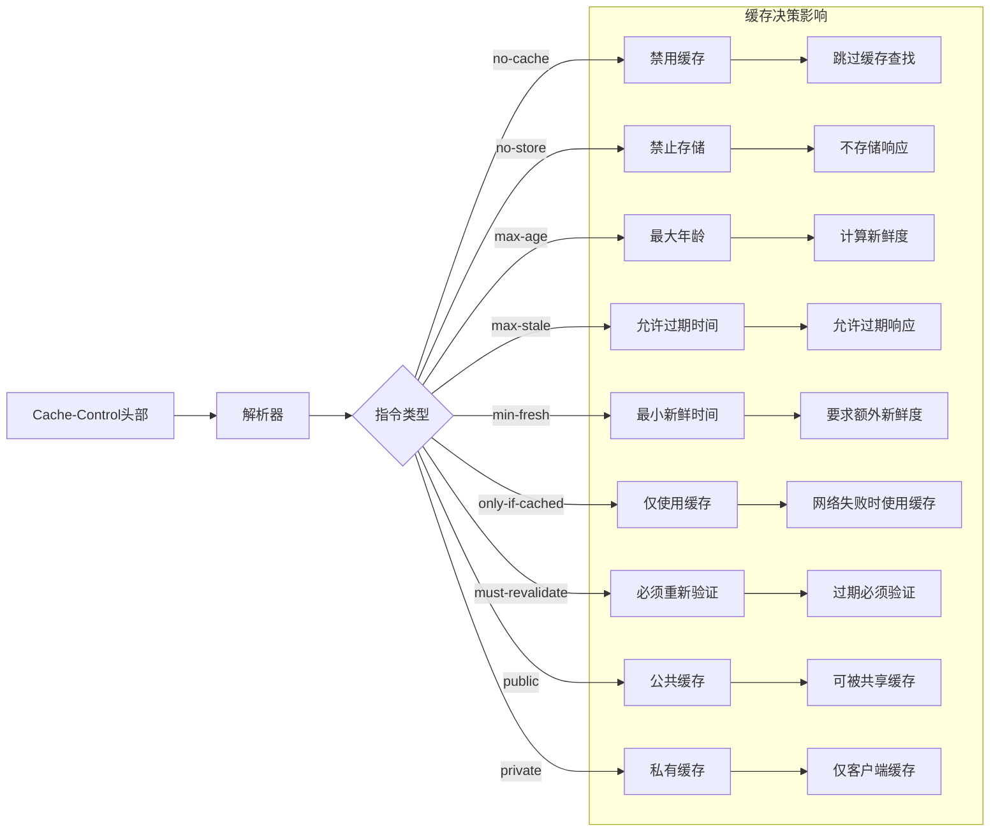
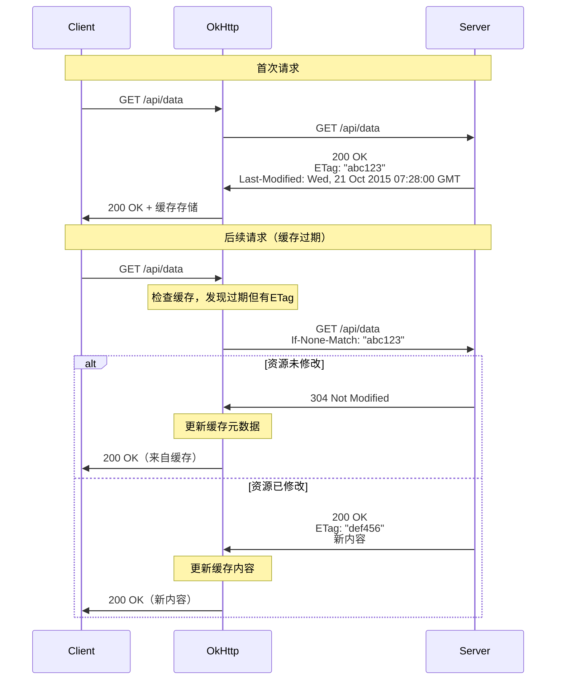
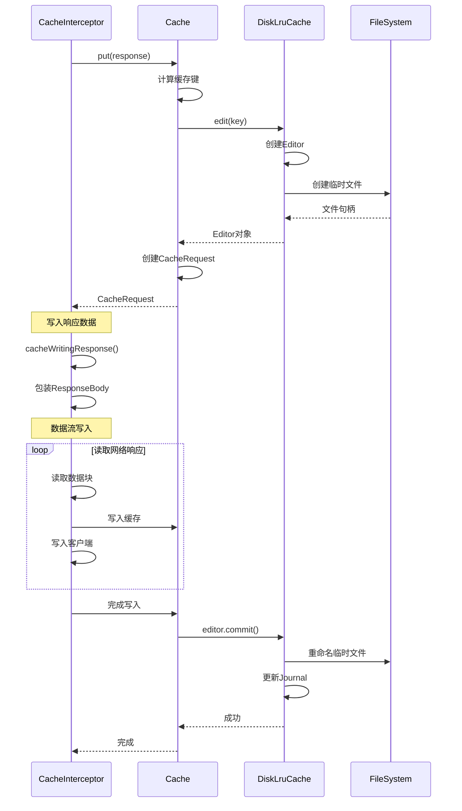

# OkHttp缓存设计深度分析

## 1. 概述

OkHttp的缓存系统是一个完整的HTTP缓存实现，严格遵循RFC 7234 HTTP缓存规范。它提供了透明的缓存机制，能够显著提升应用性能，减少网络请求，改善用户体验。

### 1.1 缓存系统核心特性

- **RFC 7234兼容**：完全符合HTTP缓存标准
- **透明缓存**：对应用层透明，无需修改业务逻辑
- **智能策略**：基于HTTP头部的智能缓存决策
- **磁盘存储**：基于DiskLruCache的高效磁盘缓存
- **并发安全**：支持多线程并发访问
- **内存优化**：合理的内存使用和垃圾回收

## 2. 缓存架构设计

### 2.1 整体架构



### 2.2 核心组件关系



## 3. 缓存策略设计

### 3.1 缓存决策流程



### 3.2 CacheStrategy核心逻辑

基于源码分析，CacheStrategy.Factory类实现了复杂的缓存决策逻辑：

```java
// 核心决策方法
public CacheStrategy get() {
    CacheStrategy candidate = getCandidate();
    
    if (candidate.networkRequest != null && request.cacheControl().onlyIfCached()) {
        // 只使用缓存，但需要网络请求，返回504
        return new CacheStrategy(null, null);
    }
    
    return candidate;
}

private CacheStrategy getCandidate() {
    // 1. 无缓存响应，必须使用网络
    if (cacheResponse == null) {
        return new CacheStrategy(request, null);
    }
    
    // 2. HTTPS请求但缺少握手信息
    if (request.isHttps() && cacheResponse.handshake() == null) {
        return new CacheStrategy(request, null);
    }
    
    // 3. 检查响应是否可缓存
    if (!isCacheable(cacheResponse, request)) {
        return new CacheStrategy(request, null);
    }
    
    // 4. 请求包含no-cache或条件头部
    CacheControl requestCaching = request.cacheControl();
    if (requestCaching.noCache() || hasConditions(request)) {
        return new CacheStrategy(request, null);
    }
    
    // 5. 计算缓存年龄和新鲜度
    CacheControl responseCaching = cacheResponse.cacheControl();
    long ageMillis = cacheResponseAge();
    long freshMillis = computeFreshnessLifetime();
    
    if (requestCaching.maxAgeSeconds() != -1) {
        freshMillis = Math.min(freshMillis, SECONDS.toMillis(requestCaching.maxAgeSeconds()));
    }
    
    long minFreshMillis = 0;
    if (requestCaching.minFreshSeconds() != -1) {
        minFreshMillis = SECONDS.toMillis(requestCaching.minFreshSeconds());
    }
    
    long maxStaleMillis = 0;
    if (!responseCaching.mustRevalidate() && requestCaching.maxStaleSeconds() != -1) {
        maxStaleMillis = SECONDS.toMillis(requestCaching.maxStaleSeconds());
    }
    
    // 6. 判断缓存是否新鲜
    if (!responseCaching.noCache() && ageMillis + minFreshMillis < freshMillis + maxStaleMillis) {
        Response.Builder builder = cacheResponse.newBuilder();
        if (ageMillis + minFreshMillis >= freshMillis) {
            builder.addHeader("Warning", "110 HttpURLConnection \"Response is stale\"");
        }
        long oneDayMillis = 24 * 60 * 60 * 1000L;
        if (ageMillis > oneDayMillis && isFreshnessLifetimeHeuristic()) {
            builder.addHeader("Warning", "113 HttpURLConnection \"Heuristic expiration\"");
        }
        return new CacheStrategy(null, builder.build());
    }
    
    // 7. 尝试条件请求
    String conditionName;
    String conditionValue;
    if (etag != null) {
        conditionName = "If-None-Match";
        conditionValue = etag;
    } else if (lastModified != null) {
        conditionName = "If-Modified-Since";
        conditionValue = lastModifiedString;
    } else if (servedDate != null) {
        conditionName = "If-Modified-Since";
        conditionValue = servedDateString;
    } else {
        return new CacheStrategy(request, null);
    }
    
    Headers.Builder conditionalRequestHeaders = request.headers().newBuilder();
    Internal.instance.addLenient(conditionalRequestHeaders, conditionName, conditionValue);
    
    Request conditionalRequest = request.newBuilder()
        .headers(conditionalRequestHeaders.build())
        .build();
    return new CacheStrategy(conditionalRequest, cacheResponse);
}
```

## 4. 磁盘缓存实现

### 4.1 DiskLruCache设计

DiskLruCache是OkHttp缓存的核心存储引擎，采用LRU（Least Recently Used）算法：



### 4.2 缓存条目结构



### 4.3 Journal文件格式

Journal文件记录了所有缓存操作，格式如下：

```
libcore.io.DiskLruCache
1
100
2

CLEAN 3400330d1dfc7f3f7f4b8d4d803dfcf6 832 21054
DIRTY 335c4c6028171cfddfbaae1a9c313c52
CLEAN 335c4c6028171cfddfbaae1a9c313c52 3934 2342
REMOVE 335c4c6028171cfddfbaae1a9c313c52
DIRTY 1ab96a171faeeee38496d8b330771a7a
CLEAN 1ab96a171faeeee38496d8b330771a7a 1600 234
READ 335c4c6028171cfddfbaae1a9c313c52
READ 3400330d1dfc7f3f7f4b8d4d803dfcf6
```

- **CLEAN**：条目已清理，可以读取
- **DIRTY**：条目正在编辑
- **REMOVE**：条目已删除
- **READ**：条目被读取（用于LRU排序）

## 5. HTTP缓存头部处理

### 5.1 CacheControl解析



### 5.2 条件请求处理



## 6. 缓存拦截器实现

### 6.1 CacheInterceptor核心流程

```java
@Override public Response intercept(Chain chain) throws IOException {
    Response cacheCandidate = cache != null
        ? cache.get(chain.request())
        : null;

    long now = System.currentTimeMillis();

    CacheStrategy strategy = new CacheStrategy.Factory(now, chain.request(), cacheCandidate).get();
    Request networkRequest = strategy.networkRequest;
    Response cacheResponse = strategy.cacheResponse;

    if (cache != null) {
        cache.trackResponse(strategy);
    }

    if (cacheCandidate != null && cacheResponse == null) {
        closeQuietly(cacheCandidate.body()); // 缓存候选不适用，关闭资源
    }

    // 如果被禁止使用网络且没有缓存响应，返回504错误
    if (networkRequest == null && cacheResponse == null) {
        return new Response.Builder()
            .request(chain.request())
            .protocol(Protocol.HTTP_1_1)
            .code(504)
            .message("Unsatisfiable Request (only-if-cached)")
            .body(Util.EMPTY_RESPONSE)
            .sentRequestAtMillis(-1L)
            .receivedResponseAtMillis(System.currentTimeMillis())
            .build();
    }

    // 如果不需要网络请求，返回缓存响应
    if (networkRequest == null) {
        return cacheResponse.newBuilder()
            .cacheResponse(stripBody(cacheResponse))
            .build();
    }

    Response networkResponse = null;
    try {
        networkResponse = chain.proceed(networkRequest);
    } finally {
        // 如果网络请求失败且有缓存响应，关闭网络响应
        if (networkResponse == null && cacheCandidate != null) {
            closeQuietly(cacheCandidate.body());
        }
    }

    // 如果有缓存响应，需要处理条件请求的结果
    if (cacheResponse != null) {
        if (networkResponse.code() == HTTP_NOT_MODIFIED) {
            Response response = cacheResponse.newBuilder()
                .headers(combine(cacheResponse.headers(), networkResponse.headers()))
                .sentRequestAtMillis(networkResponse.sentRequestAtMillis())
                .receivedResponseAtMillis(networkResponse.receivedResponseAtMillis())
                .cacheResponse(stripBody(cacheResponse))
                .networkResponse(stripBody(networkResponse))
                .build();
            networkResponse.body().close();

            // 更新缓存
            cache.trackConditionalCacheHit();
            cache.update(cacheResponse, response);
            return response;
        } else {
            closeQuietly(cacheResponse.body());
        }
    }

    Response response = networkResponse.newBuilder()
        .cacheResponse(stripBody(cacheResponse))
        .networkResponse(stripBody(networkResponse))
        .build();

    if (cache != null) {
        if (HttpHeaders.hasBody(response) && CacheStrategy.isCacheable(response, networkRequest)) {
            // 将响应写入缓存
            CacheRequest cacheRequest = cache.put(response);
            return cacheWritingResponse(cacheRequest, response);
        }

        if (HttpMethod.invalidatesCache(networkRequest.method())) {
            try {
                cache.remove(networkRequest);
            } catch (IOException ignored) {
                // 删除缓存失败不影响响应
            }
        }
    }

    return response;
}
```

### 6.2 缓存写入流程



## 7. 缓存性能优化

### 7.1 内存使用优化

```java
// 缓存大小计算
private long size() {
    long size = 0L;
    for (Entry entry : lruEntries.values()) {
        for (int i = 0; i < valueCount; i++) {
            size += entry.lengths[i];
        }
    }
    return size;
}

// LRU淘汰机制
private void trimToSize() throws IOException {
    while (size > maxSize) {
        Entry toEvict = lruEntries.values().iterator().next();
        remove(toEvict.key);
    }
}
```

### 7.2 并发控制

```java
// 线程安全的缓存操作
public synchronized Snapshot get(String key) throws IOException {
    checkNotClosed();
    Entry entry = lruEntries.get(key);
    if (entry == null || !entry.readable) return null;

    Snapshot snapshot = entry.snapshot();
    if (snapshot == null) return null;

    redundantOpCount++;
    journalWriter.writeUtf8(READ).writeByte(' ').writeUtf8(key).writeByte('\n');
    if (journalRebuildRequired()) {
        executor.execute(cleanupRunnable);
    }

    return snapshot;
}
```

### 7.3 缓存命中率统计

```java
public final class CacheStats {
    private final AtomicLong requestCount = new AtomicLong();
    private final AtomicLong networkCount = new AtomicLong();
    private final AtomicLong hitCount = new AtomicLong();
    
    void trackResponse(CacheStrategy cacheStrategy) {
        requestCount.incrementAndGet();
        
        if (cacheStrategy.networkRequest != null) {
            networkCount.incrementAndGet();
        } else if (cacheStrategy.cacheResponse != null) {
            hitCount.incrementAndGet();
        }
    }
    
    public double hitRate() {
        long requestCount = this.requestCount.get();
        return requestCount == 0 ? 1.0 : (double) hitCount.get() / requestCount;
    }
}
```

## 8. 缓存配置和使用

### 8.1 基础缓存配置

```java
// 创建缓存目录
File cacheDirectory = new File(context.getCacheDir(), "http_cache");

// 配置缓存大小（10MB）
Cache cache = new Cache(cacheDirectory, 10 * 1024 * 1024);

// 创建OkHttpClient
OkHttpClient client = new OkHttpClient.Builder()
    .cache(cache)
    .build();
```

### 8.2 自定义缓存策略

```java
// 强制使用缓存
Request request = new Request.Builder()
    .url("https://api.example.com/data")
    .cacheControl(new CacheControl.Builder()
        .onlyIfCached()
        .build())
    .build();

// 强制网络请求
Request request = new Request.Builder()
    .url("https://api.example.com/data")
    .cacheControl(new CacheControl.Builder()
        .noCache()
        .build())
    .build();

// 设置最大过期时间
Request request = new Request.Builder()
    .url("https://api.example.com/data")
    .cacheControl(new CacheControl.Builder()
        .maxStale(1, TimeUnit.HOURS)
        .build())
    .build();
```

### 8.3 缓存拦截器自定义

```java
public class CustomCacheInterceptor implements Interceptor {
    @Override
    public Response intercept(Chain chain) throws IOException {
        Request request = chain.request();
        
        // 离线时强制使用缓存
        if (!isNetworkAvailable()) {
            request = request.newBuilder()
                .cacheControl(new CacheControl.Builder()
                    .onlyIfCached()
                    .maxStale(7, TimeUnit.DAYS)
                    .build())
                .build();
        }
        
        Response response = chain.proceed(request);
        
        // 为没有缓存头的响应添加缓存控制
        if (response.header("Cache-Control") == null) {
            response = response.newBuilder()
                .header("Cache-Control", "public, max-age=300")
                .build();
        }
        
        return response;
    }
}
```

## 9. 缓存监控和调试

### 9.1 缓存状态监控

```java
public class CacheMonitor {
    private final Cache cache;
    
    public CacheMonitor(Cache cache) {
        this.cache = cache;
    }
    
    public CacheInfo getCacheInfo() {
        return new CacheInfo(
            cache.size(),
            cache.maxSize(),
            cache.hitCount(),
            cache.requestCount(),
            cache.networkCount()
        );
    }
    
    public void logCacheStats() {
        CacheInfo info = getCacheInfo();
        Log.d("Cache", String.format(
            "Size: %d/%d bytes, Hit Rate: %.2f%%, Requests: %d, Network: %d",
            info.size, info.maxSize, info.hitRate() * 100,
            info.requestCount, info.networkCount
        ));
    }
}
```

### 9.2 缓存调试工具

```java
public class CacheDebugger {
    public static void dumpCache(Cache cache) {
        try {
            Iterator<String> urls = cache.urls();
            while (urls.hasNext()) {
                String url = urls.next();
                System.out.println("Cached URL: " + url);
            }
        } catch (IOException e) {
            System.err.println("Failed to dump cache: " + e.getMessage());
        }
    }
    
    public static void clearCache(Cache cache) {
        try {
            cache.evictAll();
            System.out.println("Cache cleared successfully");
        } catch (IOException e) {
            System.err.println("Failed to clear cache: " + e.getMessage());
        }
    }
}
```

## 10. 最佳实践和注意事项

### 10.1 缓存配置最佳实践

1. **合理设置缓存大小**
   ```java
   // 根据设备存储空间动态设置
   long cacheSize = Math.min(
       50 * 1024 * 1024, // 最大50MB
       context.getCacheDir().getFreeSpace() / 10 // 可用空间的10%
   );
   ```

2. **选择合适的缓存目录**
   ```java
   // 使用应用缓存目录，系统会自动管理
   File cacheDir = new File(context.getCacheDir(), "okhttp_cache");
   ```

3. **处理缓存异常**
   ```java
   try {
       Cache cache = new Cache(cacheDir, cacheSize);
       // 使用缓存
   } catch (IOException e) {
       // 缓存初始化失败，继续无缓存运行
       Log.w("Cache", "Failed to initialize cache", e);
   }
   ```

### 10.2 性能优化建议

1. **避免频繁的缓存操作**
2. **合理设置缓存过期时间**
3. **使用条件请求减少数据传输**
4. **监控缓存命中率**
5. **定期清理过期缓存**

### 10.3 常见问题和解决方案

1. **缓存不生效**
   - 检查服务器响应头
   - 验证缓存配置
   - 确认请求方法支持缓存

2. **缓存占用过多空间**
   - 调整缓存大小限制
   - 实现自定义清理策略
   - 监控缓存使用情况

3. **缓存数据不一致**
   - 使用适当的缓存验证机制
   - 实现缓存失效策略
   - 处理并发访问问题

## 11. 总结

OkHttp的缓存系统是一个设计精良、功能完整的HTTP缓存实现。它通过以下几个方面实现了高效的缓存机制：

1. **标准兼容**：严格遵循HTTP缓存规范
2. **智能决策**：基于多种因素的缓存策略
3. **高效存储**：LRU算法和磁盘缓存
4. **透明使用**：对应用层完全透明
5. **性能优化**：多线程安全和内存优化
6. **灵活配置**：丰富的配置选项和自定义能力

这个缓存系统不仅提升了应用性能，还减少了网络流量消耗，为用户提供了更好的体验。通过深入理解其设计原理和实现细节，开发者可以更好地利用这个强大的缓存系统。