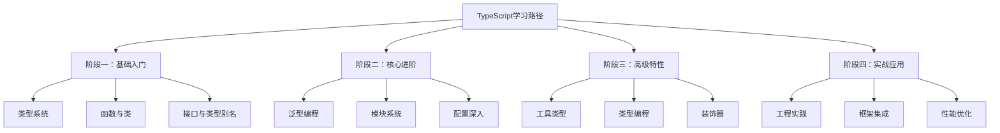

# 专栏笔记总结大全


## 四阶段学习路径



## 📅 学习计划表

| 周期 | 重点内容 | 实践项目 | 目标 |
|------|----------|----------|------|
| **第1周** | 基础类型、函数、接口 | 个人记账应用 | 掌握TS基础语法 |
| **第2周** | 类、泛型、模块 | TODO应用增强版 | 理解OOP和模块化 |
| **第3周** | 高级类型、配置 | 工具库开发 | 掌握工程化配置 |
| **第4周** | 类型编程、装饰器 | 状态管理库 | 深入类型系统 |
| **第5-8周** | 框架集成、实战 | 完整项目开发 | 企业级应用能力 |

## 🚀 进阶学习资源

1. **官方文档**：https://www.typescriptlang.org/
2. **深入理解TypeScript**（书籍）
3. **TypeScript Challenges**（GitHub 练习库）
4. **React TypeScript Cheatsheet**（实用备忘单）


以下是 TypeScript 语言基础中 **第 3 章** 的内容概述，涵盖了变量、注释、数据类型、字面量、对象和数组等核心概念：

---

### **3.1 变量**
#### **3.1.1 变量名**

#### **3.1.2 变量声明**

---

### **3.2 注释**
#### **3.2.1 单行注释与多行注释**
- 单行注释：以 `//` 开头。
  ```typescript
  // 这是一个单行注释
  ```
- 多行注释：以 `/*` 开头，以 `*/` 结尾。
  ```typescript
  /*
  这是一个
  多行注释
  */
  ```

#### **3.2.2 区域注释**
- 使用 `//#region` 和 `//#endregion` 标记代码区域，便于折叠和阅读。
  ```typescript
  //#region 用户相关函数
  function getUser() {}
  function updateUser() {}
  //#endregion
  ```

---

### **3.3 数据类型**
#### **3.3.1 Undefined**
- 表示未定义的值。
  ```typescript
  let value: undefined;
  ```

#### **3.3.2 Null**
- 表示空值。
  ```typescript
  let value: null = null;
  ```

#### **3.3.3 Boolean**
- 表示布尔值（`true` 或 `false`）。
  ```typescript
  let isDone: boolean = false;
  ```

#### **3.3.4 String**
- 表示字符串。
  ```typescript
  let name: string = "Alice";
  ```

#### **3.3.5 Number**
- 表示数字（整数或浮点数）。
  ```typescript
  let age: number = 25;
  ```

#### **3.3.6 Symbol**
- 表示唯一的值。
  ```typescript
  const key: symbol = Symbol("unique");
  ```

#### **3.3.7 Object**
- 表示非原始类型的值（对象、数组、函数等）。
  ```typescript
  let user: object = { name: "Alice" };
  ```

---

### **3.4 字面量**
#### **3.4.1 Null 字面量**
- 直接使用 `null`。
  ```typescript
  let value = null;
  ```

#### **3.4.2 Boolean 字面量**
- 直接使用 `true` 或 `false`。
  ```typescript
  let isDone = true;
  ```

#### **3.4.3 Number 字面量**
- 直接使用数字。
  ```typescript
  let age = 25;
  ```

#### **3.4.4 字符串字面量**
- 直接使用字符串。
  ```typescript
  let name = "Alice";
  ```

#### **3.4.5 模板字面量**
- 使用反引号（`` ` ``）和 `${}` 嵌入表达式。
  ```typescript
  let message = `Hello, ${name}!`;
  ```

---

### **3.5 对象**
#### **3.5.1 对象字面量**
- 使用 `{}` 定义对象。
  ```typescript
  let user = {
      name: "Alice",
      age: 25,
  };
  ```

#### **3.5.2 原型对象**
- 使用 `Object.create()` 创建基于原型的对象。
  ```typescript
  let person = { name: "Alice" };
  let user = Object.create(person);
  ```

---

### **3.6 数组**
#### **3.6.1 数组字面量**
- 使用 `[]` 定义数组。
  ```typescript
  let numbers: number[] = [1, 2, 3];
  ```

#### **3.6.2 数组中的元素**
- 数组元素可以是任意类型。
  ```typescript
  let mixed: (number | string)[] = [1, "two", 3];
  ```

---

### **总结**
本章介绍了 TypeScript 的基础语法，包括变量声明、注释、数据类型、字面量、对象和数组。这些内容是 TypeScript 编程的基础，掌握它们对于后续学习高级特性和开发实践至关重要。