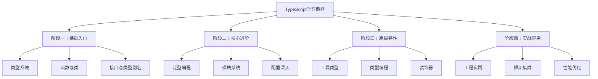

# 专栏笔记总结大全

## 四阶段学习路径

## 📅 学习计划表

| 周期 | 重点内容 | 实践项目 | 目标 |
|------|----------|----------|------|
| **第1周** | 基础类型、函数、接口 | 个人记账应用 | 掌握TS基础语法 |
| **第2周** | 类、泛型、模块 | TODO应用增强版 | 理解OOP和模块化 |
| **第3周** | 高级类型、配置 | 工具库开发 | 掌握工程化配置 |
| **第4周** | 类型编程、装饰器 | 状态管理库 | 深入类型系统 |
| **第5-8周** | 框架集成、实战 | 完整项目开发 | 企业级应用能力 |

## 🚀 进阶学习资源

1. **官方文档**：https://www.typescriptlang.org/
2. **深入理解TypeScript**（书籍）
3. **TypeScript Challenges**（GitHub 练习库）
4. **React TypeScript Cheatsheet**（实用备忘单）
5. 推荐书籍：https://book.douban.com/subject/35300876/
6. 推荐博客：https://wangdoc.com/typescript/any

