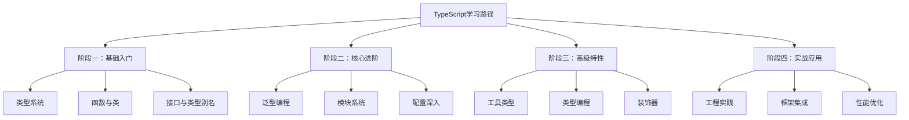

# 专栏笔记总结大全


## 四阶段学习路径



## 📅 学习计划表

| 周期 | 重点内容 | 实践项目 | 目标 |
|------|----------|----------|------|
| **第1周** | 基础类型、函数、接口 | 个人记账应用 | 掌握TS基础语法 |
| **第2周** | 类、泛型、模块 | TODO应用增强版 | 理解OOP和模块化 |
| **第3周** | 高级类型、配置 | 工具库开发 | 掌握工程化配置 |
| **第4周** | 类型编程、装饰器 | 状态管理库 | 深入类型系统 |
| **第5-8周** | 框架集成、实战 | 完整项目开发 | 企业级应用能力 |

## 🚀 进阶学习资源

1. **官方文档**：https://www.typescriptlang.org/
2. **深入理解TypeScript**（书籍）
3. **TypeScript Challenges**（GitHub 练习库）
4. **React TypeScript Cheatsheet**（实用备忘单）
5. 推荐书籍：https://book.douban.com/subject/35300876/
6. 推荐博客：https://wangdoc.com/typescript/any


## 2. 数组类型声明方式


### 2.2 只读数组

```typescript
// 只读数组 - 创建后不能修改
const readOnlyNumbers: readonly number[] = [1, 2, 3];
// readOnlyNumbers.push(4); // 错误：push 不存在于类型 'readonly number[]'
// readOnlyNumbers[0] = 10; // 错误：索引签名只允许读取

// 其他只读数组声明方式
const ro1: ReadonlyArray<number> = [1, 2, 3];
const ro2: Readonly<number[]> = [1, 2, 3];

// 在函数参数中使用只读数组
function processNumbers(nums: readonly number[]): number {
    return nums.reduce((sum, num) => sum + num, 0);
    // nums.push(10); // 错误：只读数组
}
```

## 3. 数组方法类型安全

### 3.1 常用数组方法

```typescript
const numbers: number[] = [1, 2, 3, 4, 5];

// map - 类型安全的转换
const doubled = numbers.map((num: number): number => num * 2);
const asStrings = numbers.map((num: number): string => num.toString());

// filter - 类型收窄
const mixedArray: (number | string)[] = [1, "hello", 2, "world", 3];
const onlyNumbers = mixedArray.filter((item): item is number => 
    typeof item === "number"
); // 类型收窄为 number[]

const onlyStrings = mixedArray.filter((item): item is string => 
    typeof item === "string"
); // 类型收窄为 string[]

// reduce - 明确的初始值和返回类型
const sum = numbers.reduce((acc: number, curr: number): number => acc + curr, 0);
const grouped = numbers.reduce((acc: Record<string, number[]>, curr: number) => {
    const key = curr % 2 === 0 ? "even" : "odd";
    if (!acc[key]) acc[key] = [];
    acc[key].push(curr);
    return acc;
}, {});
```

### 3.2 自定义类型保护

```typescript
// 类型保护函数
function isStringArray(arr: any[]): arr is string[] {
    return arr.every(item => typeof item === "string");
}

function processArray(arr: any[]): void {
    if (isStringArray(arr)) {
        // 这里 arr 被识别为 string[]
        arr.forEach(str => console.log(str.toUpperCase()));
    } else {
        console.log("不是字符串数组");
    }
}
```

## 4. 元组（Tuple）类型

### 4.1 固定长度和类型的数组

```typescript
// 基本元组
let person: [string, number, boolean] = ["Alice", 30, true];

// 可选元素的元组
let optionalTuple: [string, number?] = ["hello"]; // 第二个元素可选
optionalTuple = ["hello", 42];

// 带标签的元组（TypeScript 4.0+）
type HttpSuccess = [status: number, data: any, message: string];
const response: HttpSuccess = [200, { id: 1 }, "Success"];

// 剩余元素的元组
type StringNumberBooleans = [string, number, ...boolean[]];
const snb: StringNumberBooleans = ["hello", 1, true, false, true];
```

### 4.2 元组操作

```typescript
// 元组解构
function useTuple(): [string, number] {
    return ["result", 100];
}

const [message, value] = useTuple();

// 元组作为函数参数
function processCoordinates(...args: [number, number, string]): void {
    const [x, y, label] = args;
    console.log(`${label}: (${x}, ${y})`);
}

processCoordinates(10, 20, "点A");
```

## 5. 只读元组和 const 断言

### 5.1 只读元组

```typescript
// 只读元组
const readOnlyPoint: readonly [number, number] = [10, 20];
// readOnlyPoint[0] = 5; // 错误：只读

// 函数返回只读元组
function getPoint(): readonly [number, number] {
    return [Math.random(), Math.random()];
}

const point = getPoint();
// point[0] = 100; // 错误：只读
```

### 5.2 const 断言

```typescript
// 使用 as const 创建字面量类型
const colors = ["red", "green", "blue"] as const;
// 类型：readonly ["red", "green", "blue"]

const point = [10, 20] as const;
// 类型：readonly [10, 20]

// 对象数组的 const 断言
const users = [
    { name: "Alice", age: 25 },
    { name: "Bob", age: 30 }
] as const;
// 所有属性都变成只读字面量类型
```

## 6. 二维和多维数组

```typescript
// 二维数组
type Matrix = number[][];
const matrix: Matrix = [
    [1, 2, 3],
    [4, 5, 6],
    [7, 8, 9]
];

// 三维数组
type Tensor = number[][][];
const tensor: Tensor = [
    [[1, 2], [3, 4]],
    [[5, 6], [7, 8]]
];

// 带接口的多维数组
interface Cell {
    value: number;
    visited: boolean;
}

type Grid = Cell[][];
const gameGrid: Grid = [
    [{ value: 1, visited: false }, { value: 2, visited: true }],
    [{ value: 3, visited: false }, { value: 4, visited: true }]
];
```

## 7. 数组工具类型

### 7.1 内置工具类型

```typescript
// 从元组/数组类型中提取元素类型
type ArrayElement<T> = T extends (infer U)[] ? U : never;

// 使用示例
type NumberArray = number[];
type NumberType = ArrayElement<NumberArray>; // number

type StringArray = string[];
type StringType = ArrayElement<StringArray>; // string

// 更复杂的工具类型
type FlattenArray<T> = T extends (infer U)[] ? FlattenArray<U> : T;

type NestedArray = number[][][];
type FlatNumber = FlattenArray<NestedArray>; // number
```

### 7.2 自定义数组工具类型

```typescript
// 非空数组类型
type NonEmptyArray<T> = [T, ...T[]];

// 使用示例
function processNonEmpty<T>(arr: NonEmptyArray<T>): T {
    return arr[0]; // 安全，因为数组非空
}

// processNonEmpty([]); // 错误：空数组
processNonEmpty([1, 2, 3]); // 正确

// 排序后的数组类型（名义上的，运行时无影响）
type SortedArray<T> = T[] & { __sorted: true };

function sortArray<T>(arr: T[]): SortedArray<T> {
    const sorted = [...arr].sort() as any;
    sorted.__sorted = true;
    return sorted;
}
```

## 8. 实际应用示例

### 8.1 表单验证

```typescript
interface ValidationError {
    field: string;
    message: string;
}

class FormValidator {
    private errors: ValidationError[] = [];

    addError(field: string, message: string): void {
        this.errors.push({ field, message });
    }

    getErrors(): ReadonlyArray<ValidationError> {
        return this.errors;
    }

    isValid(): boolean {
        return this.errors.length === 0;
    }

    clear(): void {
        this.errors = [];
    }
}

// 使用示例
const validator = new FormValidator();
validator.addError("email", "邮箱格式不正确");
validator.addError("password", "密码太短");

if (!validator.isValid()) {
    console.log("验证错误:", validator.getErrors());
}
```

### 8.2 API 数据处理

```typescript
interface ApiResponse<T> {
    data: T[];
    total: number;
    page: number;
    pageSize: number;
}

// 分页数据处理器
class PaginatedData<T> {
    constructor(private data: T[], private total: number) {}

    getPage(page: number, pageSize: number): ApiResponse<T> {
        const start = (page - 1) * pageSize;
        const end = start + pageSize;
        const pageData = this.data.slice(start, end);

        return {
            data: pageData,
            total: this.total,
            page,
            pageSize
        };
    }

    // 使用泛型进行数据转换
    map<U>(transform: (item: T) => U): PaginatedData<U> {
        const transformedData = this.data.map(transform);
        return new PaginatedData(transformedData, this.total);
    }
}

// 使用示例
const userData = new PaginatedData(
    [{ id: 1, name: "Alice" }, { id: 2, name: "Bob" }],
    2
);

const response = userData.getPage(1, 10);
const nameData = userData.map(user => user.name);
```

### 8.3 React 组件中的数组使用

```typescript
import React, { useState } from 'react';

interface Todo {
    id: number;
    text: string;
    completed: boolean;
}

const TodoList: React.FC = () => {
    const [todos, setTodos] = useState<Todo[]>([]);
    const [inputValue, setInputValue] = useState<string>('');

    // 类型安全的数组操作
    const addTodo = (text: string): void => {
        if (text.trim() === '') return;
        
        const newTodo: Todo = {
            id: Date.now(),
            text: text.trim(),
            completed: false
        };
        
        setTodos(prev => [...prev, newTodo]);
        setInputValue('');
    };

    const toggleTodo = (id: number): void => {
        setTodos(prev => 
            prev.map(todo => 
                todo.id === id ? { ...todo, completed: !todo.completed } : todo
            )
        );
    };

    const deleteTodo = (id: number): void => {
        setTodos(prev => prev.filter(todo => todo.id !== id));
    };

    return (
        <div>
            <input
                type="text"
                value={inputValue}
                onChange={e => setInputValue(e.target.value)}
                onKeyPress={e => e.key === 'Enter' && addTodo(inputValue)}
            />
            <button onClick={() => addTodo(inputValue)}>添加</button>
            
            <ul>
                {todos.map(todo => (
                    <li key={todo.id}>
                        <input
                            type="checkbox"
                            checked={todo.completed}
                            onChange={() => toggleTodo(todo.id)}
                        />
                        <span style={{ 
                            textDecoration: todo.completed ? 'line-through' : 'none' 
                        }}>
                            {todo.text}
                        </span>
                        <button onClick={() => deleteTodo(todo.id)}>删除</button>
                    </li>
                ))}
            </ul>
        </div>
    );
};
```

## 9. 高级技巧和最佳实践

### 9.1 性能优化

```typescript
// 使用 const 断言避免不必要的类型推断
const LARGE_ARRAY = [1, 2, 3, 4, 5] as const; // 编译时已知的常量

// 使用 ReadonlyArray 避免意外修改
function processLargeData(data: ReadonlyArray<number>): number {
    // 不能修改原数组，保证数据安全
    return data.reduce((sum, num) => sum + num, 0);
}

// 使用 Set 进行快速去重
function removeDuplicates<T>(arr: T[]): T[] {
    return Array.from(new Set(arr));
}
```

### 9.2 错误处理模式

```typescript
// 安全数组访问
function safeArrayAccess<T>(arr: T[], index: number): T | undefined {
    return index >= 0 && index < arr.length ? arr[index] : undefined;
}

// 带错误处理的数组操作
class SafeArray<T> {
    constructor(private array: T[] = []) {}

    get(index: number): T | undefined {
        if (index < 0 || index >= this.array.length) {
            console.warn(`索引 ${index} 越界`);
            return undefined;
        }
        return this.array[index];
    }

    set(index: number, value: T): boolean {
        if (index < 0 || index >= this.array.length) {
            console.warn(`索引 ${index} 越界`);
            return false;
        }
        this.array[index] = value;
        return true;
    }
}
```

## 10. 总结

TypeScript 数组的核心优势：

1. **类型安全**：编译时发现类型错误
2. **智能提示**：更好的开发体验
3. **不可变性支持**：readonly 和 const 断言
4. **复杂结构支持**：元组、多维数组等
5. **工具类型**：强大的类型操作能力

**最佳实践建议**：
- 优先使用 `readonly` 修饰符，除非确实需要修改
- 使用 const 断言处理字面量数组
- 为复杂数据结构定义明确的接口
- 利用类型保护函数进行类型收窄
- 在函数参数和返回值中使用最具体的类型

掌握 TypeScript 数组的使用，能显著提升代码的可靠性和可维护性。


