# JavaScript 设计哲学与语言特性

## 目录
1. [概述](#概述)
2. [原型继承 (Prototypal Inheritance)](#原型继承-prototypal-inheritance)
3. [函数一等公民 (First-class Functions)](#函数一等公民-first-class-functions)
4. [事件驱动与非阻塞 I/O (Event-driven, Non-blocking)](#事件驱动与非阻塞-io-event-driven-non-blocking)
5. [动态弱类型与执行时类型推断](#动态弱类型与执行时类型推断)
6. [基于原型的原型链查找机制](#基于原型的原型链查找机制)
7. [函数闭包与词法作用域](#函数闭包与词法作用域)
8. [总结](#总结)

## 概述

JavaScript 是一门多范式的动态编程语言，其设计哲学体现了灵活性、简洁性和表达力的完美结合。本文档将深入探讨 JavaScript 的核心设计理念和语言特性，帮助开发者更好地理解和运用这门语言。

### JavaScript 核心设计哲学

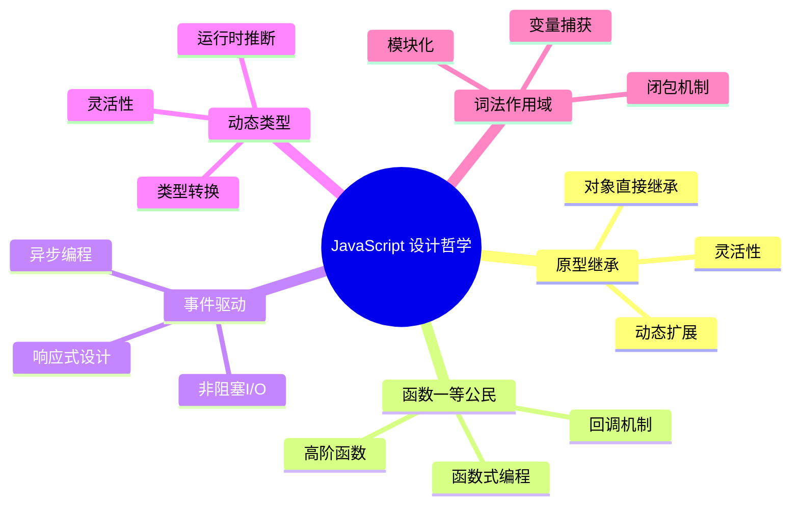

## 原型继承 (Prototypal Inheritance)

### 设计理念

JavaScript 采用基于原型的继承模型，这与传统的基于类的继承有本质区别。每个对象都有一个内部链接指向另一个对象（原型），形成原型链。

### 原型继承架构图

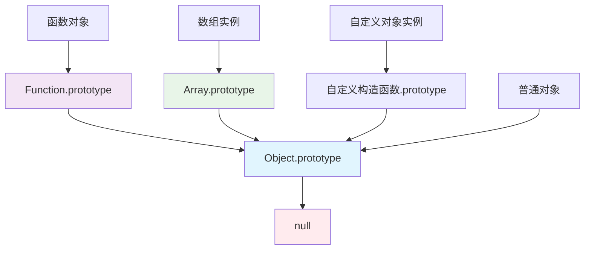

### 原型继承实现机制

```javascript
// 原型继承的核心实现
function createObject(proto) {
    function F() {}
    F.prototype = proto;
    return new F();
}

// 构造函数继承示例
function Animal(name) {
    this.name = name;
}

Animal.prototype.speak = function() {
    return `${this.name} makes a sound`;
};

function Dog(name, breed) {
    Animal.call(this, name); // 调用父构造函数
    this.breed = breed;
}

// 设置原型链
Dog.prototype = Object.create(Animal.prototype);
Dog.prototype.constructor = Dog;

// 添加子类特有方法
Dog.prototype.bark = function() {
    return `${this.name} barks loudly!`;
};

// 使用示例
const myDog = new Dog("Buddy", "Golden Retriever");
console.log(myDog.speak()); // "Buddy makes a sound"
console.log(myDog.bark());  // "Buddy barks loudly!"
```

### 原型继承时序图

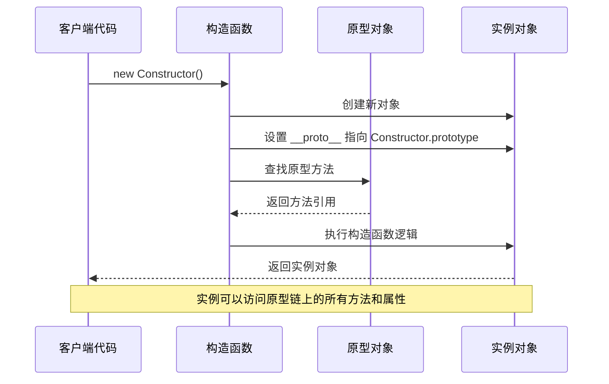

### 动态原型修改示例

```javascript
// 动态修改原型的强大功能
function Person(name) {
    this.name = name;
}

const person1 = new Person("Alice");
const person2 = new Person("Bob");

// 动态添加方法到原型
Person.prototype.greet = function() {
    return `Hello, I'm ${this.name}`;
};

// 所有实例立即获得新方法
console.log(person1.greet()); // "Hello, I'm Alice"
console.log(person2.greet()); // "Hello, I'm Bob"

// 原型链污染检测
function hasOwnProperty(obj, prop) {
    return Object.prototype.hasOwnProperty.call(obj, prop);
}
```

## 函数一等公民 (First-class Functions)

### 设计理念

在 JavaScript 中，函数是一等公民，意味着函数可以像其他值一样被传递、赋值、作为参数和返回值使用。

### 函数一等公民架构图

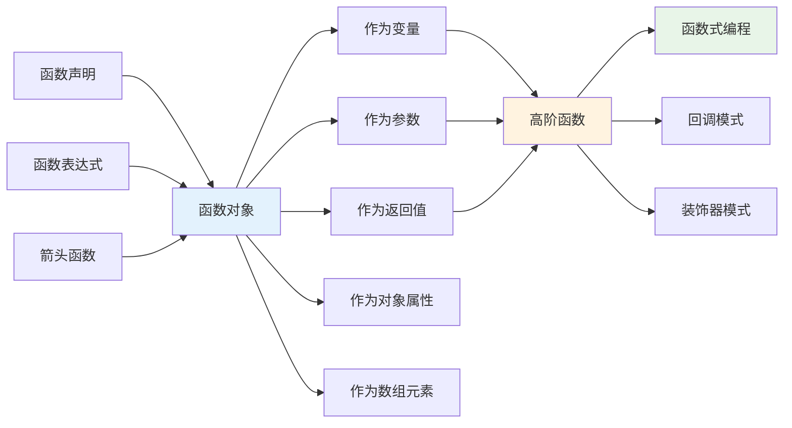

### 函数一等公民的实现机制

```javascript
// 函数作为值的各种用法
const FunctionUtils = {
    // 函数作为对象属性
    add: function(a, b) { return a + b; },
    
    // 箭头函数
    multiply: (a, b) => a * b,
    
    // 函数作为数组元素
    operations: [
        (x) => x * 2,
        (x) => x + 1,
        (x) => x / 2
    ],
    
    // 高阶函数 - 返回函数
    createMultiplier: function(factor) {
        return function(number) {
            return number * factor;
        };
    },
    
    // 高阶函数 - 接受函数作为参数
    applyOperation: function(numbers, operation) {
        return numbers.map(operation);
    },
    
    // 函数组合
    compose: function(...functions) {
        return function(value) {
            return functions.reduceRight((acc, fn) => fn(acc), value);
        };
    }
};

// 使用示例
const double = FunctionUtils.createMultiplier(2);
const numbers = [1, 2, 3, 4, 5];
const doubled = FunctionUtils.applyOperation(numbers, double);

// 函数组合示例
const addOne = x => x + 1;
const square = x => x * x;
const pipeline = FunctionUtils.compose(square, double, addOne);
console.log(pipeline(3)); // ((3 + 1) * 2)² = 64
```

### 函数式编程模式时序图

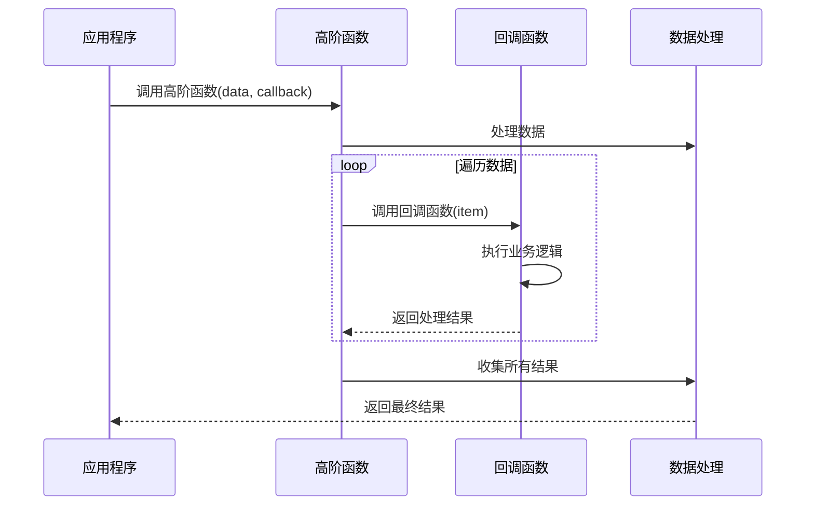

### 装饰器模式实现

```javascript
// 装饰器模式 - 增强函数功能
function withLogging(fn) {
    return function(...args) {
        console.log(`调用函数 ${fn.name}，参数:`, args);
        const result = fn.apply(this, args);
        console.log(`函数 ${fn.name} 返回:`, result);
        return result;
    };
}

function withTiming(fn) {
    return function(...args) {
        const start = performance.now();
        const result = fn.apply(this, args);
        const end = performance.now();
        console.log(`函数 ${fn.name} 执行时间: ${end - start}ms`);
        return result;
    };
}

// 原始函数
function calculateSum(numbers) {
    return numbers.reduce((sum, num) => sum + num, 0);
}

// 装饰后的函数
const enhancedCalculateSum = withTiming(withLogging(calculateSum));
enhancedCalculateSum([1, 2, 3, 4, 5]);
```

## 事件驱动与非阻塞 I/O (Event-driven, Non-blocking)

### 设计理念

JavaScript 采用事件驱动的编程模型，特别是在 Node.js 环境中，通过事件循环机制实现非阻塞 I/O 操作。

### 事件循环架构图

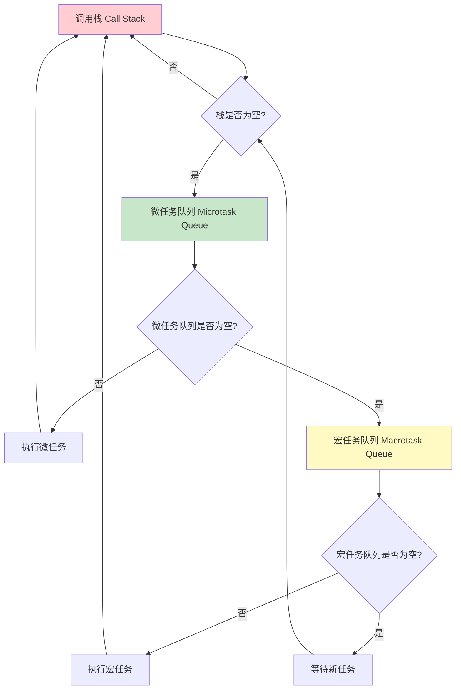

### 事件循环详细流程图

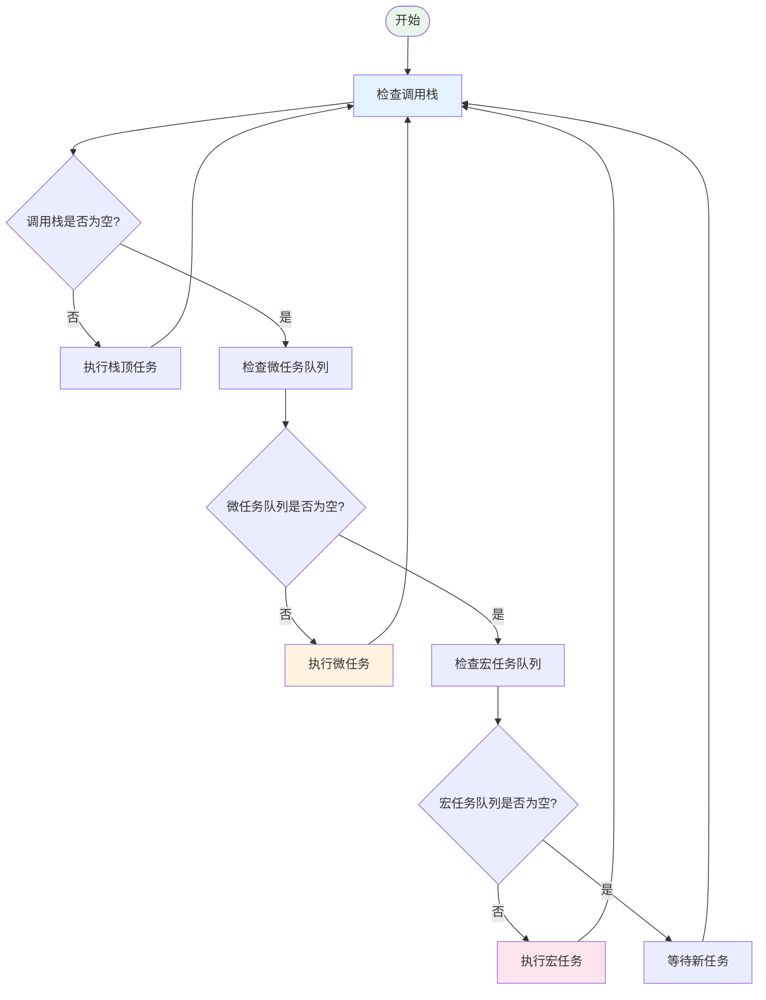

### 事件驱动编程模型实现

```javascript
// 事件驱动编程示例
class EventEmitter {
    constructor() {
        this.events = {};
        this.maxListeners = 10;
    }
    
    // 注册事件监听器
    on(event, listener) {
        if (!this.events[event]) {
            this.events[event] = [];
        }
        
        if (this.events[event].length >= this.maxListeners) {
            console.warn(`警告: 事件 ${event} 的监听器数量超过限制`);
        }
        
        this.events[event].push(listener);
        return this;
    }
    
    // 注册一次性监听器
    once(event, listener) {
        const onceWrapper = (...args) => {
            listener.apply(this, args);
            this.off(event, onceWrapper);
        };
        
        return this.on(event, onceWrapper);
    }
    
    // 触发事件
    emit(event, ...args) {
        if (!this.events[event]) return false;
        
        // 复制监听器数组，防止在执行过程中被修改
        const listeners = [...this.events[event]];
        
        listeners.forEach(listener => {
            try {
                // 异步执行监听器，避免阻塞
                setImmediate(() => listener.apply(this, args));
            } catch (error) {
                console.error(`事件监听器执行错误:`, error);
            }
        });
        
        return true;
    }
    
    // 移除监听器
    off(event, listenerToRemove) {
        if (!this.events[event]) return this;
        
        this.events[event] = this.events[event].filter(
            listener => listener !== listenerToRemove
        );
        
        return this;
    }
    
    // 移除所有监听器
    removeAllListeners(event) {
        if (event) {
            delete this.events[event];
        } else {
            this.events = {};
        }
        return this;
    }
}

// 使用示例
const dataProcessor = new EventEmitter();

// 注册多个监听器
dataProcessor.on('data', (data) => {
    console.log('处理数据:', data);
});

dataProcessor.on('data', (data) => {
    console.log('备份数据:', data);
});

dataProcessor.on('error', (error) => {
    console.error('处理错误:', error);
});

// 模拟异步数据处理
function processAsyncData(data) {
    setTimeout(() => {
        if (data && data.valid) {
            dataProcessor.emit('data', data);
        } else {
            dataProcessor.emit('error', new Error('无效数据'));
        }
    }, Math.random() * 1000);
}

// 测试
processAsyncData({ id: 1, message: 'Hello World', valid: true });
processAsyncData({ id: 2, message: 'Invalid', valid: false });
```

### 非阻塞 I/O 时序图

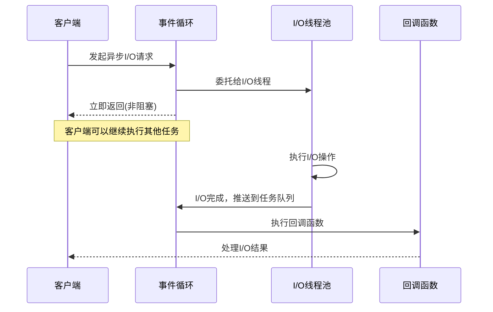

### 异步编程模式演进

```javascript
// 异步编程模式的演进

// 1. 回调函数模式
function fetchDataCallback(url, callback) {
    setTimeout(() => {
        if (url && url.startsWith('http')) {
            callback(null, { data: 'success', url });
        } else {
            callback(new Error('Invalid URL'), null);
        }
    }, 1000);
}

// 2. Promise 模式
function fetchDataPromise(url) {
    return new Promise((resolve, reject) => {
        setTimeout(() => {
            if (url && url.startsWith('http')) {
                resolve({ data: 'success', url });
            } else {
                reject(new Error('Invalid URL'));
            }
        }, 1000);
    });
}

// 3. async/await 模式
async function fetchDataAsync(url) {
    return new Promise((resolve, reject) => {
        setTimeout(() => {
            if (url && url.startsWith('http')) {
                resolve({ data: 'success', url });
            } else {
                reject(new Error('Invalid URL'));
            }
        }, 1000);
    });
}

// 4. 并发控制
class AsyncQueue {
    constructor(concurrency = 3) {
        this.concurrency = concurrency;
        this.running = 0;
        this.queue = [];
    }
    
    async add(asyncFunction) {
        return new Promise((resolve, reject) => {
            this.queue.push({
                asyncFunction,
                resolve,
                reject
            });
            this.process();
        });
    }
    
    async process() {
        if (this.running >= this.concurrency || this.queue.length === 0) {
            return;
        }
        
        this.running++;
        const { asyncFunction, resolve, reject } = this.queue.shift();
        
        try {
            const result = await asyncFunction();
            resolve(result);
        } catch (error) {
            reject(error);
        } finally {
            this.running--;
            this.process();
        }
    }
}

// 使用示例
async function example() {
    const queue = new AsyncQueue(2);
    
    const urls = [
        'https://api1.example.com',
        'https://api2.example.com',
        'https://api3.example.com'
    ];
    
    const promises = urls.map(url => 
        queue.add(() => fetchDataAsync(url))
    );
    
    try {
        const results = await Promise.all(promises);
        console.log('所有请求完成:', results);
    } catch (error) {
        console.error('请求失败:', error);
    }
}
```

## 动态弱类型与执行时类型推断

### 设计理念

JavaScript 是动态弱类型语言，变量的类型在运行时确定，并且支持隐式类型转换。这种设计提供了极大的灵活性，但也需要开发者深入理解类型转换机制。

### 类型系统架构图

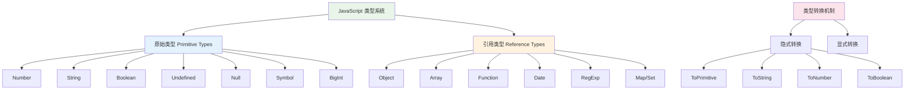

### 类型推断与转换机制实现

```javascript
// JavaScript 类型推断引擎模拟
class TypeInference {
    static getType(value) {
        if (value === null) return 'null';
        if (value === undefined) return 'undefined';
        
        const type = typeof value;
        if (type === 'object') {
            if (Array.isArray(value)) return 'array';
            if (value instanceof Date) return 'date';
            if (value instanceof RegExp) return 'regexp';
            if (value instanceof Map) return 'map';
            if (value instanceof Set) return 'set';
            return 'object';
        }
        
        return type;
    }
    
    // ToPrimitive 抽象操作的实现
    static toPrimitive(input, preferredType = 'default') {
        if (typeof input !== 'object' || input === null) {
            return input;
        }
        
        const hint = preferredType === 'string' ? 'string' : 
                    preferredType === 'number' ? 'number' : 'default';
        
        // 查找 Symbol.toPrimitive 方法
        if (input[Symbol.toPrimitive]) {
            const result = input[Symbol.toPrimitive](hint);
            if (typeof result !== 'object') return result;
            throw new TypeError('Cannot convert object to primitive value');
        }
        
        // 默认转换逻辑
        if (hint === 'string') {
            return this.ordinaryToPrimitive(input, 'string');
        } else {
            return this.ordinaryToPrimitive(input, 'number');
        }
    }
    
    static ordinaryToPrimitive(obj, hint) {
        const methodNames = hint === 'string' ? 
            ['toString', 'valueOf'] : ['valueOf', 'toString'];
        
        for (const name of methodNames) {
            const method = obj[name];
            if (typeof method === 'function') {
                const result = method.call(obj);
                if (typeof result !== 'object') {
                    return result;
                }
            }
        }
        
        throw new TypeError('Cannot convert object to primitive value');
    }
    
    static toString(value) {
        if (value === null) return 'null';
        if (value === undefined) return 'undefined';
        if (typeof value === 'boolean') return value ? 'true' : 'false';
        if (typeof value === 'number') {
            if (value === 0 && 1/value === -Infinity) return '-0';
            return String(value);
        }
        if (typeof value === 'string') return value;
        if (typeof value === 'symbol') {
            throw new TypeError('Cannot convert a Symbol value to a string');
        }
        if (typeof value === 'object') {
            const primitive = this.toPrimitive(value, 'string');
            return this.toString(primitive);
        }
        return String(value);
    }
    
    static toNumber(value) {
        if (value === null) return 0;
        if (value === undefined) return NaN;
        if (typeof value === 'boolean') return value ? 1 : 0;
        if (typeof value === 'number') return value;
        if (typeof value === 'string') {
            const trimmed = value.trim();
            if (trimmed === '') return 0;
            if (trimmed === 'Infinity') return Infinity;
            if (trimmed === '-Infinity') return -Infinity;
            const num = Number(trimmed);
            return num;
        }
        if (typeof value === 'symbol') {
            throw new TypeError('Cannot convert a Symbol value to a number');
        }
        if (typeof value === 'object') {
            const primitive = this.toPrimitive(value, 'number');
            return this.toNumber(primitive);
        }
        return NaN;
    }
    
    static toBoolean(value) {
        if (typeof value === 'boolean') return value;
        if (value === null || value === undefined) return false;
        if (typeof value === 'number') {
            return !(value === 0 || value === -0 || isNaN(value));
        }
        if (typeof value === 'string') return value.length > 0;
        if (typeof value === 'symbol') return true;
        if (typeof value === 'object') return true;
        return Boolean(value);
    }
}

// 类型转换示例和测试
console.log('=== 类型推断测试 ===');
console.log(TypeInference.getType(123));           // "number"
console.log(TypeInference.getType("hello"));       // "string"
console.log(TypeInference.getType([]));            // "array"
console.log(TypeInference.getType({}));            // "object"
console.log(TypeInference.getType(null));          // "null"

console.log('=== 类型转换测试 ===');
console.log(TypeInference.toString(123));          // "123"
console.log(TypeInference.toNumber("456"));        // 456
console.log(TypeInference.toNumber(""));           // 0
console.log(TypeInference.toNumber("abc"));        // NaN
console.log(TypeInference.toBoolean(0));           // false
console.log(TypeInference.toBoolean(""));          // false
console.log(TypeInference.toBoolean([]));          // true
```

### 类型转换时序图

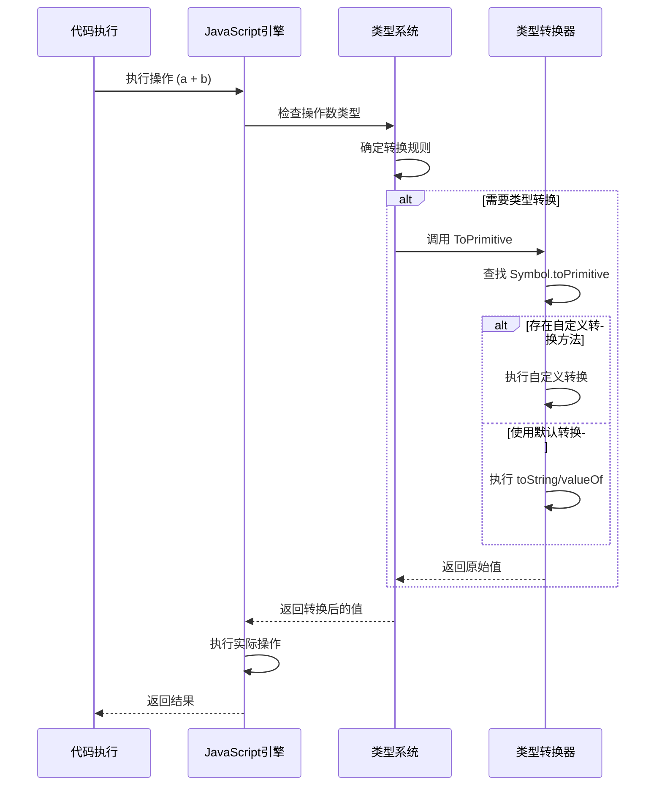

### 动态类型的实际应用

```javascript
// 动态类型的灵活性和陷阱
class DynamicTypeHandler {
    // 类型安全的操作函数
    static safeAdd(a, b) {
        const numA = this.toSafeNumber(a);
        const numB = this.toSafeNumber(b);
        
        if (isNaN(numA) || isNaN(numB)) {
            throw new TypeError(`无法将 ${a} 和 ${b} 转换为数字`);
        }
        
        return numA + numB;
    }
    
    static toSafeNumber(value) {
        if (typeof value === 'number') return value;
        if (typeof value === 'string') {
            const trimmed = value.trim();
            if (trimmed === '') return 0;
            const num = Number(trimmed);
            return num;
        }
        if (typeof value === 'boolean') return value ? 1 : 0;
        if (value === null) return 0;
        if (value === undefined) return NaN;
        
        // 对象类型的处理
        if (typeof value === 'object') {
            const primitive = TypeInference.toPrimitive(value, 'number');
            return this.toSafeNumber(primitive);
        }
        
        return NaN;
    }
    
    // 类型守卫函数
    static isString(value) {
        return typeof value === 'string';
    }
    
    static isNumber(value) {
        return typeof value === 'number' && !isNaN(value);
    }
    
    static isArray(value) {
        return Array.isArray(value);
    }
    
    static isObject(value) {
        return value !== null && typeof value === 'object' && !Array.isArray(value);
    }
    
    // 多态函数示例
    static process(input) {
        switch (TypeInference.getType(input)) {
            case 'string':
                return input.toUpperCase();
            case 'number':
                return input * 2;
            case 'boolean':
                return !input;
            case 'array':
                return input.map(item => this.process(item));
            case 'object':
                const result = {};
                for (const [key, value] of Object.entries(input)) {
                    result[key] = this.process(value);
                }
                return result;
            default:
                return input;
        }
    }
}

// 测试动态类型处理
console.log('=== 动态类型处理测试 ===');
console.log(DynamicTypeHandler.process("hello"));     // "HELLO"
console.log(DynamicTypeHandler.process(5));           // 10
console.log(DynamicTypeHandler.process(true));        // false
console.log(DynamicTypeHandler.process([1, "test"])); // [2, "TEST"]
console.log(DynamicTypeHandler.process({a: 1, b: "hi"})); // {a: 2, b: "HI"}
```

## 基于原型的原型链查找机制

### 设计理念

JavaScript 的原型链是一种对象属性查找机制，当访问对象属性时，如果对象本身没有该属性，就会沿着原型链向上查找。

### 原型链查找架构图

```mermaid
graph TD
    A[实例对象] --> B[构造函数.prototype]
    B --> C[Object.prototype]
    C --> D[null]
    
    E[属性查找过程] --> F[1. 检查实例自身属性]
    F --> G[2. 检查构造函数原型]
    G --> H[3. 检查 Object.prototype]
    H --> I[4. 返回 undefined]
    
    J[方法查找示例] --> K[obj.method()]
    K --> L{obj 有 method?}
    L -->|是| M[执行方法]
    L -->|否| N[查找 obj.__proto__]
    N --> O{原型有 method?}
    O -->|是| M
    O -->|否| P[继续向上查找]
    P --> Q[直到找到或到达 null]
    
    style A fill:#e8f5e8
    style E fill:#e3f2fd
    style J fill:#fff3e0
```

### 原型链查找算法实现

```javascript
// 原型链查找算法的完整实现
class PrototypeChain {
    // 获取对象的原型
    static getPrototypeOf(obj) {
        if (obj === null || obj === undefined) {
            throw new TypeError('Cannot convert undefined or null to object');
        }
        
        // 使用标准方法
        if (Object.getPrototypeOf) {
            return Object.getPrototypeOf(obj);
        }
        
        // 回退到 __proto__ 属性
        if (obj.__proto__) {
            return obj.__proto__;
        }
        
        // 最后回退到 constructor.prototype
        if (obj.constructor && obj.constructor.prototype) {
            return obj.constructor.prototype;
        }
        
        return null;
    }
    
    // 属性查找算法
    static getProperty(obj, property) {
        let current = obj;
        const visited = new Set(); // 防止循环引用
        let depth = 0;
        
        while (current !== null && current !== undefined) {
            // 防止循环引用
            if (visited.has(current)) {
                console.warn('检测到原型链循环引用');
                break;
            }
            visited.add(current);
            
            // 检查当前对象是否有该属性
            if (Object.prototype.hasOwnProperty.call(current, property)) {
                return {
                    value: current[property],
                    found: true,
                    source: current,
                    depth: depth,
                    isOwnProperty: depth === 0
                };
            }
            
            // 沿原型链向上查找
            current = this.getPrototypeOf(current);
            depth++;
            
            // 防止无限循环
            if (depth > 100) {
                console.warn('原型链查找深度超过限制');
                break;
            }
        }
        
        return {
            value: undefined,
            found: false,
            source: null,
            depth: -1,
            isOwnProperty: false
        };
    }
    
    // 设置属性（只在对象自身设置）
    static setProperty(obj, property, value) {
        if (obj === null || obj === undefined) {
            throw new TypeError('Cannot set property on null or undefined');
        }
        
        // 直接在对象上设置属性，不影响原型链
        Object.defineProperty(obj, property, {
            value: value,
            writable: true,
            enumerable: true,
            configurable: true
        });
        
        return true;
    }
    
    // 获取完整的原型链
    static getPrototypeChain(obj) {
        const chain = [];
        let current = obj;
        const visited = new Set();
        
        while (current !== null && current !== undefined) {
            if (visited.has(current)) {
                chain.push('[循环引用]');
                break;
            }
            
            visited.add(current);
            chain.push({
                object: current,
                constructor: current.constructor ? current.constructor.name : 'Unknown',
                isPrototype: current !== obj
            });
            
            current = this.getPrototypeOf(current);
            
            if (chain.length > 50) {
                chain.push('[链过长，已截断]');
                break;
            }
        }
        
        return chain;
    }
    
    // 检查属性是否存在于原型链中
    static hasProperty(obj, property) {
        return this.getProperty(obj, property).found;
    }
    
    // 检查属性是否为对象自身属性
    static hasOwnProperty(obj, property) {
        return Object.prototype.hasOwnProperty.call(obj, property);
    }
}

// 原型链查找示例
function Animal(name) {
    this.name = name;
}

Animal.prototype.speak = function() {
    return `${this.name} makes a sound`;
};

Animal.prototype.type = 'animal';

function Dog(name, breed) {
    Animal.call(this, name);
    this.breed = breed;
}

Dog.prototype = Object.create(Animal.prototype);
Dog.prototype.constructor = Dog;
Dog.prototype.bark = function() {
    return `${this.name} barks!`;
};

const myDog = new Dog("Buddy", "Golden Retriever");

// 测试原型链查找
console.log('=== 原型链查找测试 ===');
console.log('查找 name:', PrototypeChain.getProperty(myDog, 'name'));
console.log('查找 bark:', PrototypeChain.getProperty(myDog, 'bark'));
console.log('查找 speak:', PrototypeChain.getProperty(myDog, 'speak'));
console.log('查找 type:', PrototypeChain.getProperty(myDog, 'type'));
console.log('查找 toString:', PrototypeChain.getProperty(myDog, 'toString'));

console.log('=== 原型链结构 ===');
const chain = PrototypeChain.getPrototypeChain(myDog);
chain.forEach((item, index) => {
    if (typeof item === 'string') {
        console.log(`${index}: ${item}`);
    } else {
        console.log(`${index}: ${item.constructor} ${item.isPrototype ? '(原型)' : '(实例)'}`);
    }
});
```

### 原型链查找时序图

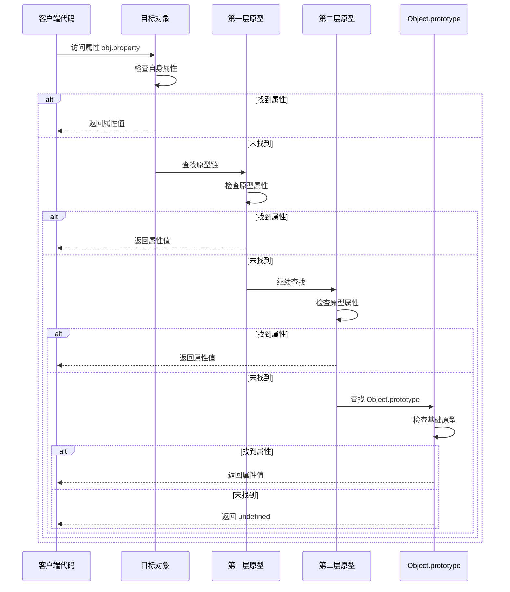

### 原型链的实际应用

```javascript
// 原型链的高级应用
class PrototypeUtils {
    // 创建一个干净的对象（没有原型）
    static createCleanObject() {
        return Object.create(null);
    }
    
    // 安全的属性访问
    static safeGet(obj, path, defaultValue = undefined) {
        const keys = path.split('.');
        let current = obj;
        
        for (const key of keys) {
            if (current === null || current === undefined) {
                return defaultValue;
            }
            
            const result = PrototypeChain.getProperty(current, key);
            if (!result.found) {
                return defaultValue;
            }
            
            current = result.value;
        }
        
        return current;
    }
    
    // 混入模式实现
    static mixin(target, ...sources) {
        sources.forEach(source => {
            const descriptors = Object.getOwnPropertyDescriptors(source);
            Object.defineProperties(target, descriptors);
        });
        return target;
    }
    
    // 创建代理对象，记录属性访问
    static createLoggingProxy(obj, name = 'Object') {
        return new Proxy(obj, {
            get(target, property, receiver) {
                const result = PrototypeChain.getProperty(target, property);
                console.log(`[${name}] 访问属性 ${String(property)}: ${result.found ? '找到' : '未找到'} (深度: ${result.depth})`);
                return Reflect.get(target, property, receiver);
            },
            
            set(target, property, value, receiver) {
                console.log(`[${name}] 设置属性 ${String(property)} = ${value}`);
                return Reflect.set(target, property, value, receiver);
            }
        });
    }
}

// 测试原型链工具
const cleanObj = PrototypeUtils.createCleanObject();
cleanObj.name = "Clean Object";
console.log('干净对象的原型链:', PrototypeChain.getPrototypeChain(cleanObj));

// 测试安全属性访问
const testObj = {
    user: {
        profile: {
            name: "John",
            age: 30
        }
    }
};

console.log('安全访问:', PrototypeUtils.safeGet(testObj, 'user.profile.name')); // "John"
console.log('安全访问:', PrototypeUtils.safeGet(testObj, 'user.profile.email', 'N/A')); // "N/A"

// 测试代理对象
const proxyObj = PrototypeUtils.createLoggingProxy(myDog, 'MyDog');
console.log(proxyObj.name);  // 记录属性访问
console.log(proxyObj.speak()); // 记录方法访问
```

## 函数闭包与词法作用域

### 设计理念

JavaScript 采用词法作用域（静态作用域），函数的作用域在定义时确定。闭包是指函数能够访问其外部作用域中变量的特性，即使外部函数已经执行完毕。

### 词法作用域架构图

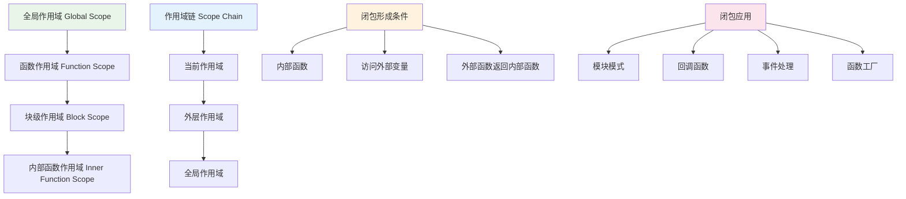

### 词法作用域与闭包实现机制

```javascript
// 词法作用域和闭包的详细实现
class ScopeManager {
    constructor() {
        this.scopes = new Map();
        this.currentScopeId = 0;
    }
    
    // 创建新的作用域
    createScope(parentScopeId = null) {
        const scopeId = ++this.currentScopeId;
        this.scopes.set(scopeId, {
            id: scopeId,
            parentId: parentScopeId,
            variables: new Map(),
            functions: new Map()
        });
        return scopeId;
    }
    
    // 在作用域中声明变量
    declareVariable(scopeId, name, value) {
        const scope = this.scopes.get(scopeId);
        if (scope) {
            scope.variables.set(name, value);
        }
    }
    
    // 查找变量（沿作用域链向上查找）
    lookupVariable(scopeId, name) {
        let currentScope = this.scopes.get(scopeId);
        const searchPath = [];
        
        while (currentScope) {
            searchPath.push(currentScope.id);
            
            if (currentScope.variables.has(name)) {
                return {
                    value: currentScope.variables.get(name),
                    scopeId: currentScope.id,
                    searchPath: searchPath
                };
            }
            
            // 向上查找父作用域
            currentScope = currentScope.parentId ? 
                this.scopes.get(currentScope.parentId) : null;
        }
        
        return {
            value: undefined,
            scopeId: null,
            searchPath: searchPath
        };
    }
    
    // 获取作用域链
    getScopeChain(scopeId) {
        const chain = [];
        let currentScope = this.scopes.get(scopeId);
        
        while (currentScope) {
            chain.push({
                id: currentScope.id,
                variables: Array.from(currentScope.variables.keys()),
                functions: Array.from(currentScope.functions.keys())
            });
            
            currentScope = currentScope.parentId ? 
                this.scopes.get(currentScope.parentId) : null;
        }
        
        return chain;
    }
}

// 闭包实现示例
function createClosureExample() {
    const scopeManager = new ScopeManager();
    
    // 模拟外部函数作用域
    const outerScopeId = scopeManager.createScope();
    scopeManager.declareVariable(outerScopeId, 'outerVar', 'I am from outer scope');
    scopeManager.declareVariable(outerScopeId, 'counter', 0);
    
    // 模拟内部函数作用域
    const innerScopeId = scopeManager.createScope(outerScopeId);
    scopeManager.declareVariable(innerScopeId, 'innerVar', 'I am from inner scope');
    
    // 模拟变量查找
    console.log('=== 作用域链查找演示 ===');
    console.log('查找 innerVar:', scopeManager.lookupVariable(innerScopeId, 'innerVar'));
    console.log('查找 outerVar:', scopeManager.lookupVariable(innerScopeId, 'outerVar'));
    console.log('查找 counter:', scopeManager.lookupVariable(innerScopeId, 'counter'));
    console.log('查找 globalVar:', scopeManager.lookupVariable(innerScopeId, 'globalVar'));
    
    console.log('=== 作用域链结构 ===');
    const chain = scopeManager.getScopeChain(innerScopeId);
    chain.forEach((scope, index) => {
        console.log(`作用域 ${scope.id}: 变量 [${scope.variables.join(', ')}]`);
    });
}

createClosureExample();
```

### 闭包形成时序图

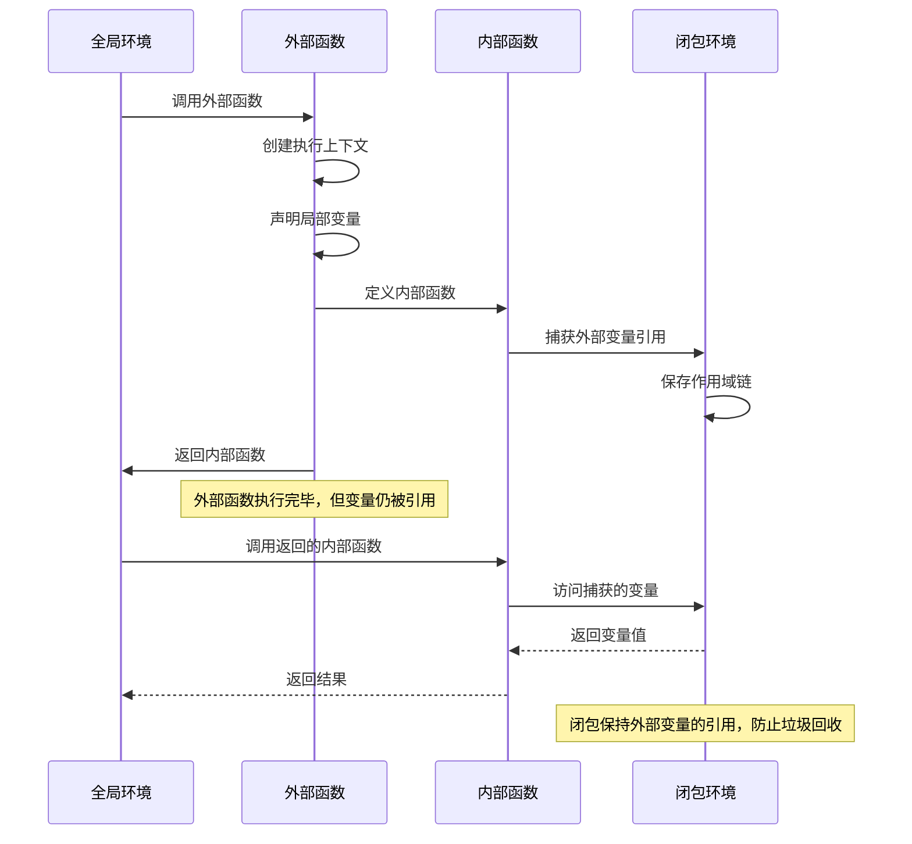

### 闭包的实际应用

```javascript
// 1. 模块模式 - 创建私有变量和方法
function createModule(name) {
    // 私有变量
    let privateCounter = 0;
    const privateData = new Map();
    
    // 私有方法
    function privateMethod(data) {
        console.log(`[${name}] 私有方法处理:`, data);
        return data.toUpperCase();
    }
    
    // 返回公共接口
    return {
        // 公共方法
        increment() {
            privateCounter++;
            return privateCounter;
        },
        
        decrement() {
            privateCounter--;
            return privateCounter;
        },
        
        getCount() {
            return privateCounter;
        },
        
        setData(key, value) {
            privateData.set(key, privateMethod(value));
        },
        
        getData(key) {
            return privateData.get(key);
        },
        
        // 获取模块信息
        getInfo() {
            return {
                name: name,
                counter: privateCounter,
                dataSize: privateData.size
            };
        }
    };
}

// 2. 函数工厂 - 创建特定功能的函数
function createValidator(rules) {
    // 闭包捕获验证规则
    return function validate(data) {
        const errors = [];
        
        for (const [field, rule] of Object.entries(rules)) {
            const value = data[field];
            
            if (rule.required && (value === undefined || value === null || value === '')) {
                errors.push(`${field} 是必填字段`);
                continue;
            }
            
            if (value !== undefined && rule.type) {
                const actualType = typeof value;
                if (actualType !== rule.type) {
                    errors.push(`${field} 应该是 ${rule.type} 类型，实际是 ${actualType}`);
                }
            }
            
            if (value !== undefined && rule.validator) {
                if (!rule.validator(value)) {
                    errors.push(`${field} 验证失败`);
                }
            }
        }
        
        return {
            valid: errors.length === 0,
            errors: errors
        };
    };
}

// 3. 记忆化函数 - 缓存计算结果
function createMemoizedFunction(fn) {
    const cache = new Map();
    
    return function memoized(...args) {
        const key = JSON.stringify(args);
        
        if (cache.has(key)) {
            console.log('从缓存获取结果:', key);
            return cache.get(key);
        }
        
        console.log('计算新结果:', key);
        const result = fn.apply(this, args);
        cache.set(key, result);
        
        return result;
    };
}

// 4. 防抖和节流函数
function createDebounce(fn, delay) {
    let timeoutId;
    
    return function debounced(...args) {
        // 清除之前的定时器
        clearTimeout(timeoutId);
        
        // 设置新的定时器
        timeoutId = setTimeout(() => {
            fn.apply(this, args);
        }, delay);
    };
}

function createThrottle(fn, interval) {
    let lastCallTime = 0;
    let timeoutId;
    
    return function throttled(...args) {
        const now = Date.now();
        
        if (now - lastCallTime >= interval) {
            // 立即执行
            lastCallTime = now;
            fn.apply(this, args);
        } else {
            // 延迟执行
            clearTimeout(timeoutId);
            timeoutId = setTimeout(() => {
                lastCallTime = Date.now();
                fn.apply(this, args);
            }, interval - (now - lastCallTime));
        }
    };
}

// 5. 状态机实现
function createStateMachine(initialState, transitions) {
    let currentState = initialState;
    const listeners = new Map();
    
    return {
        getState() {
            return currentState;
        },
        
        transition(action, payload) {
            const stateTransitions = transitions[currentState];
            if (!stateTransitions || !stateTransitions[action]) {
                throw new Error(`无效的状态转换: ${currentState} -> ${action}`);
            }
            
            const newState = stateTransitions[action](payload);
            const oldState = currentState;
            currentState = newState;
            
            // 触发状态变化监听器
            if (listeners.has(newState)) {
                listeners.get(newState).forEach(listener => {
                    listener(oldState, newState, payload);
                });
            }
            
            return newState;
        },
        
        onState(state, listener) {
            if (!listeners.has(state)) {
                listeners.set(state, []);
            }
            listeners.get(state).push(listener);
        }
    };
}

// 使用示例
console.log('=== 闭包应用示例 ===');

// 模块模式测试
const myModule = createModule('TestModule');
console.log('模块计数:', myModule.increment()); // 1
console.log('模块计数:', myModule.increment()); // 2
myModule.setData('test', 'hello world');
console.log('模块数据:', myModule.getData('test')); // "HELLO WORLD"
console.log('模块信息:', myModule.getInfo());

// 验证器测试
const userValidator = createValidator({
    name: { required: true, type: 'string' },
    age: { required: true, type: 'number', validator: (age) => age >= 0 && age <= 150 },
    email: { required: false, type: 'string', validator: (email) => email.includes('@') }
});

console.log('验证结果:', userValidator({ name: 'John', age: 25, email: 'john@example.com' }));
console.log('验证结果:', userValidator({ name: 'John', age: -5 }));

// 记忆化函数测试
const fibonacci = createMemoizedFunction(function(n) {
    if (n <= 1) return n;
    return fibonacci(n - 1) + fibonacci(n - 2);
});

console.log('斐波那契数列:', fibonacci(10));
console.log('斐波那契数列:', fibonacci(10)); // 从缓存获取

// 防抖函数测试
const debouncedLog = createDebounce((message) => {
    console.log('防抖输出:', message);
}, 1000);

debouncedLog('第一次调用');
debouncedLog('第二次调用');
debouncedLog('第三次调用'); // 只有这次会执行

// 状态机测试
const lightStateMachine = createStateMachine('off', {
    off: {
        turnOn: () => 'on'
    },
    on: {
        turnOff: () => 'off',
        dim: () => 'dimmed'
    },
    dimmed: {
        brighten: () => 'on',
        turnOff: () => 'off'
    }
});

lightStateMachine.onState('on', (oldState, newState) => {
    console.log(`灯光状态变化: ${oldState} -> ${newState}`);
});

console.log('当前状态:', lightStateMachine.getState()); // 'off'
lightStateMachine.transition('turnOn');
console.log('当前状态:', lightStateMachine.getState()); // 'on'
```

### 闭包的内存管理

```javascript
// 闭包内存管理和性能优化
class ClosureMemoryManager {
    static createOptimizedClosure(data) {
        // 只捕获必要的变量，避免整个作用域被保留
        const necessaryData = {
            id: data.id,
            name: data.name
        };
        
        return function(action) {
            switch (action) {
                case 'getId':
                    return necessaryData.id;
                case 'getName':
                    return necessaryData.name;
                default:
                    return null;
            }
        };
    }
    
    static createWeakRefClosure(obj) {
        // 使用 WeakRef 避免强引用
        const weakRef = new WeakRef(obj);
        
        return function() {
            const target = weakRef.deref();
            if (target) {
                return target.someMethod();
            } else {
                console.log('对象已被垃圾回收');
                return null;
            }
        };
    }
    
    // 闭包清理函数
    static createCleanableClosure(initialValue) {
        let value = initialValue;
        let isDestroyed = false;
        
        const closure = function(newValue) {
            if (isDestroyed) {
                throw new Error('闭包已被销毁');
            }
            
            if (newValue !== undefined) {
                value = newValue;
            }
            return value;
        };
        
        // 添加清理方法
        closure.destroy = function() {
            value = null;
            isDestroyed = true;
        };
        
        return closure;
    }
}

// 测试内存管理
const optimizedClosure = ClosureMemoryManager.createOptimizedClosure({
    id: 1,
    name: 'Test',
    largeData: new Array(1000000).fill('data') // 这个不会被捕获
});

console.log('优化闭包测试:', optimizedClosure('getId'));

const cleanableClosure = ClosureMemoryManager.createCleanableClosure('initial');
console.log('可清理闭包:', cleanableClosure()); // 'initial'
cleanableClosure('updated');
console.log('可清理闭包:', cleanableClosure()); // 'updated'
cleanableClosure.destroy();
// console.log(cleanableClosure()); // 会抛出错误
```

## 总结

JavaScript 的设计哲学体现了现代编程语言的核心理念：**灵活性、表达力和实用性的完美平衡**。通过深入理解这些核心特性，我们可以更好地利用 JavaScript 的强大功能：

### 核心特性总结

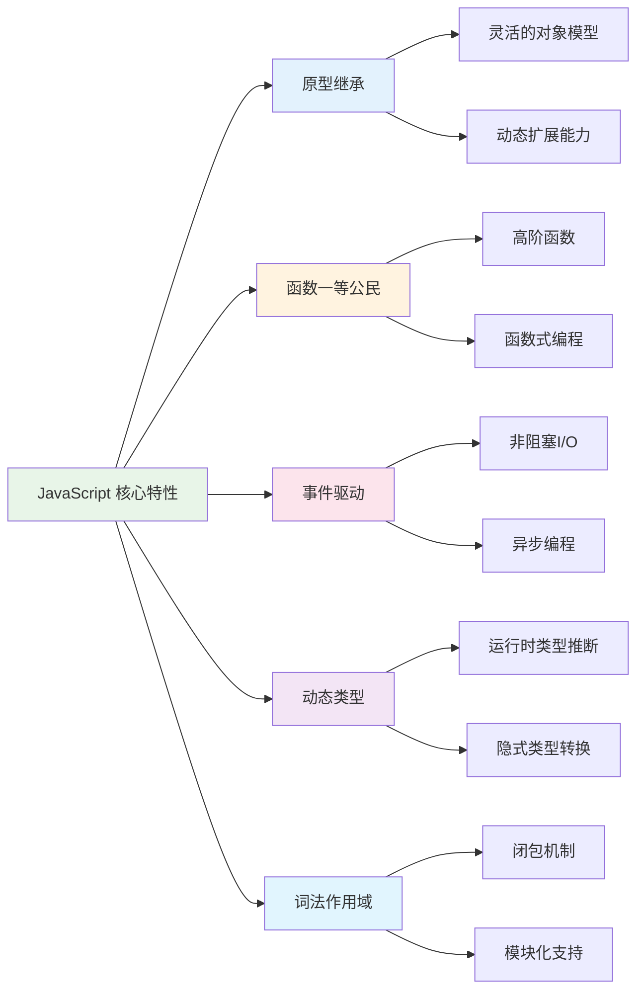

### 最佳实践建议

1. **原型继承**: 理解原型链，合理使用继承，避免原型污染
2. **函数式编程**: 充分利用函数一等公民特性，编写可复用的高阶函数
3. **异步编程**: 掌握事件循环机制，合理使用 Promise 和 async/await
4. **类型安全**: 虽然是动态类型，但要注意类型检查和转换
5. **作用域管理**: 理解闭包机制，避免内存泄漏，合理使用模块模式

### 性能优化要点

```javascript
// 性能优化示例
const PerformanceOptimization = {
    // 1. 原型方法共享
    sharePrototypeMethods: true,
    
    // 2. 避免频繁的类型转换
    useTypeGuards: true,
    
    // 3. 合理使用闭包，避免内存泄漏
    manageClosureMemory: true,
    
    // 4. 优化事件监听器
    useEventDelegation: true,
    
    // 5. 利用浏览器优化
    useBuiltinMethods: true
};
```

JavaScript 的这些设计特性使其成为了一门既适合初学者入门，又能支撑大型应用开发的强大语言。深入理解这些核心概念，将帮助开发者写出更高效、更优雅的代码。

