# JavaScript 执行模型
#### 目录介绍
- 1.整体概述
  - 1.1 执行模型组件


## 1.整体概述

JavaScript 执行模型是理解这门语言运行机制的核心。它涉及代码解析、编译、执行、内存管理等多个层面。本文档将深入探讨 JavaScript 的执行模型，帮助开发者更好地理解代码的运行原理。

### 1.1 执行模型组件

JavaScript 执行模型核心组件

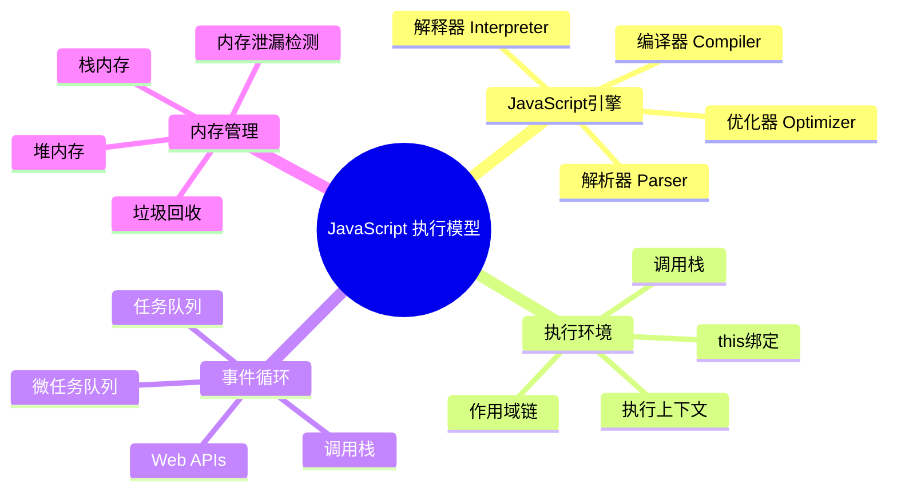

## JavaScript引擎架构

### 引擎整体架构

JavaScript 引擎是执行 JavaScript 代码的核心组件，不同的引擎有不同的实现方式，但基本架构相似。

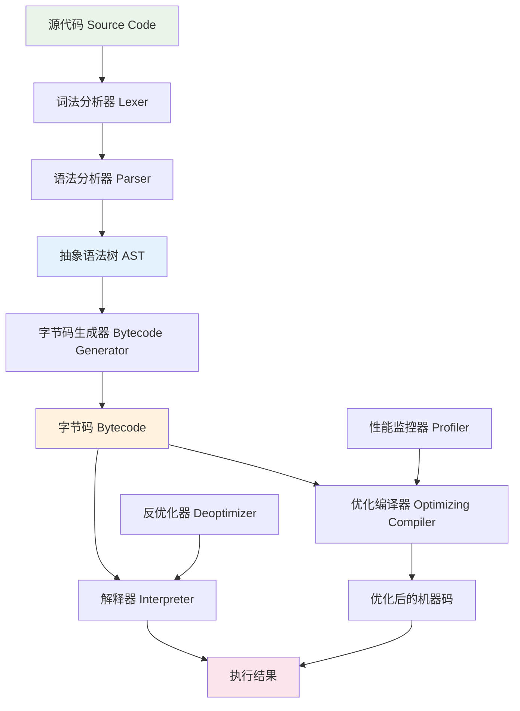

### V8引擎详细架构

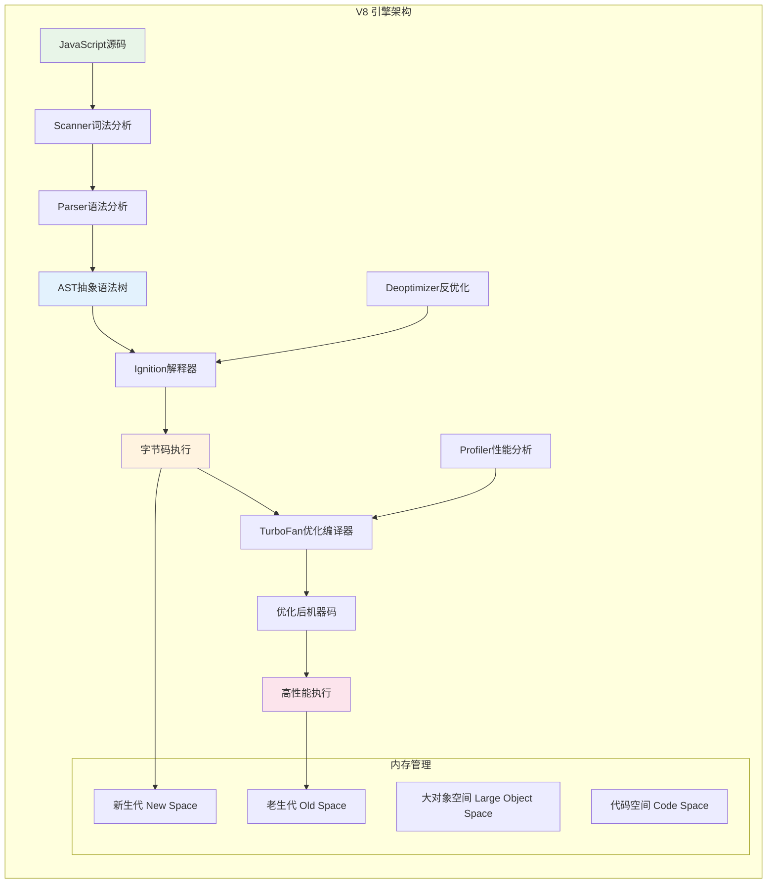

### 引擎执行流程实现

```javascript
// JavaScript 引擎执行流程模拟
class JavaScriptEngine {
    constructor() {
        this.parser = new Parser();
        this.interpreter = new Interpreter();
        this.compiler = new OptimizingCompiler();
        this.profiler = new Profiler();
        this.memoryManager = new MemoryManager();
        this.executionContext = null;
    }
    
    // 执行 JavaScript 代码的主流程
    execute(sourceCode) {
        try {
            console.log('[Engine] 开始执行代码');
            
            // 1. 词法分析和语法分析
            const tokens = this.parser.tokenize(sourceCode);
            const ast = this.parser.parse(tokens);
            
            // 2. 生成字节码
            const bytecode = this.generateBytecode(ast);
            
            // 3. 创建执行上下文
            this.executionContext = new ExecutionContext();
            
            // 4. 执行字节码
            const result = this.interpreter.execute(bytecode, this.executionContext);
            
            // 5. 性能监控和优化
            this.profiler.monitor(bytecode, result);
            if (this.profiler.shouldOptimize(bytecode)) {
                const optimizedCode = this.compiler.optimize(bytecode);
                return this.executeOptimized(optimizedCode);
            }
            
            return result;
            
        } catch (error) {
            this.handleError(error);
            throw error;
        } finally {
            this.cleanup();
        }
    }
    
    generateBytecode(ast) {
        const bytecodeGenerator = new BytecodeGenerator();
        return bytecodeGenerator.generate(ast);
    }
    
    executeOptimized(optimizedCode) {
        return this.compiler.executeOptimized(optimizedCode, this.executionContext);
    }
    
    handleError(error) {
        console.error('[Engine] 执行错误:', error);
        this.memoryManager.cleanup();
    }
    
    cleanup() {
        this.memoryManager.garbageCollect();
        this.executionContext = null;
    }
}

// 词法分析器
class Parser {
    tokenize(sourceCode) {
        const tokens = [];
        const tokenPatterns = [
            { type: 'KEYWORD', pattern: /\b(function|var|let|const|if|else|for|while|return)\b/ },
            { type: 'IDENTIFIER', pattern: /\b[a-zA-Z_$][a-zA-Z0-9_$]*\b/ },
            { type: 'NUMBER', pattern: /\b\d+(\.\d+)?\b/ },
            { type: 'STRING', pattern: /"([^"\\]|\\.)*"|'([^'\\]|\\.)*'/ },
            { type: 'OPERATOR', pattern: /[+\-*/=<>!&|]/ },
            { type: 'PUNCTUATION', pattern: /[{}()\[\];,.]/ },
            { type: 'WHITESPACE', pattern: /\s+/ }
        ];
        
        let position = 0;
        while (position < sourceCode.length) {
            let matched = false;
            
            for (const { type, pattern } of tokenPatterns) {
                const match = sourceCode.slice(position).match(pattern);
                if (match && match.index === 0) {
                    if (type !== 'WHITESPACE') {
                        tokens.push({
                            type,
                            value: match[0],
                            position
                        });
                    }
                    position += match[0].length;
                    matched = true;
                    break;
                }
            }
            
            if (!matched) {
                throw new SyntaxError(`Unexpected character at position ${position}: ${sourceCode[position]}`);
            }
        }
        
        return tokens;
    }
    
    parse(tokens) {
        return {
            type: 'Program',
            body: this.parseStatements(tokens),
            tokens: tokens
        };
    }
    
    parseStatements(tokens) {
        return tokens.filter(token => token.type !== 'WHITESPACE');
    }
}
```

## 执行上下文与调用栈

### 执行上下文架构

执行上下文是 JavaScript 代码执行的环境，包含了变量、函数声明、作用域链等信息。

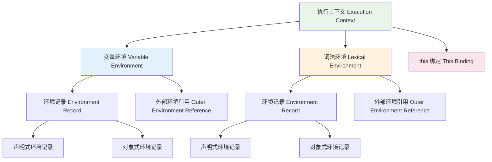

### 调用栈结构

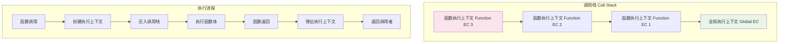

### 执行上下文创建时序图

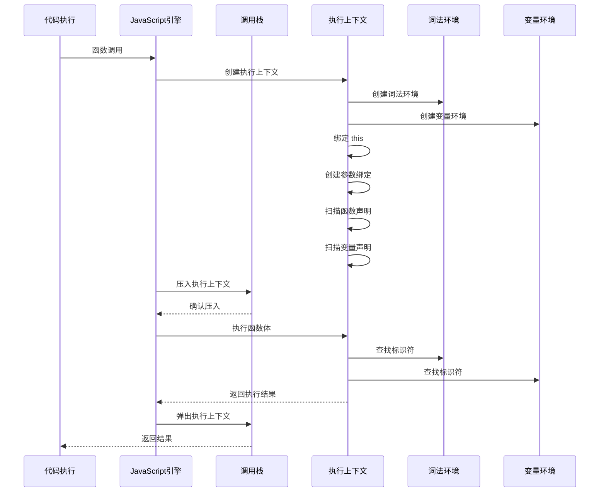

## 事件循环机制

### 事件循环架构

事件循环是 JavaScript 异步编程的核心机制，它协调调用栈、任务队列和微任务队列的执行。

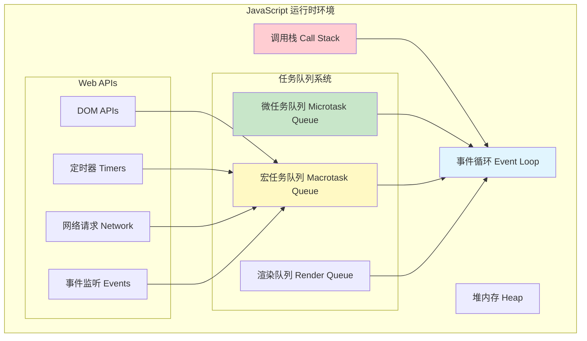

### 事件循环详细流程

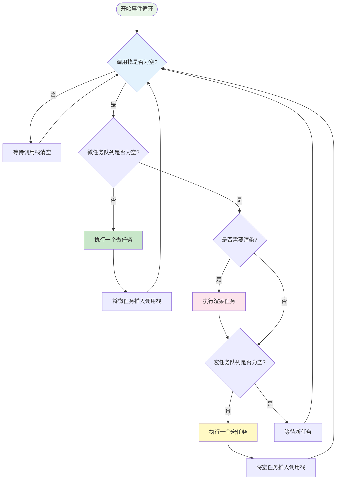

### 事件循环执行时序图

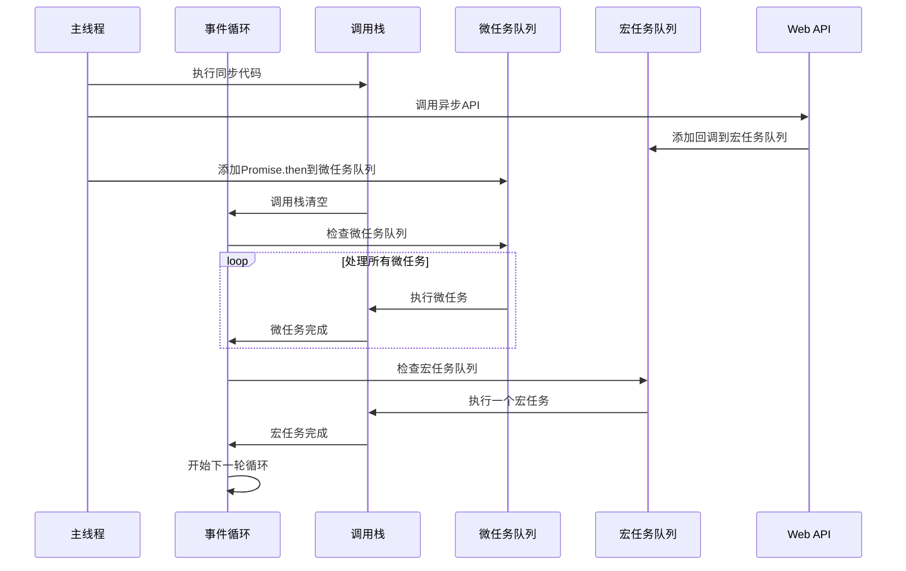

## 内存管理与垃圾回收

### 内存布局架构

JavaScript 的内存管理包括堆内存和栈内存，以及复杂的垃圾回收机制。

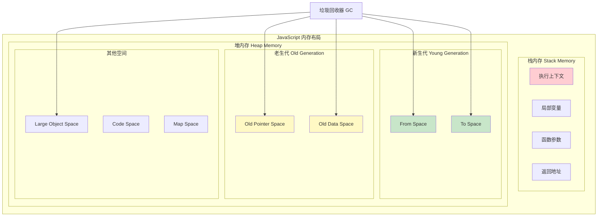

### 垃圾回收算法

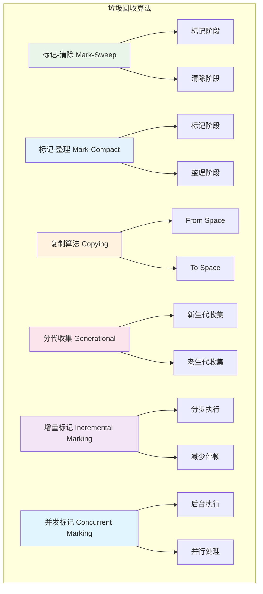

### 垃圾回收时序图

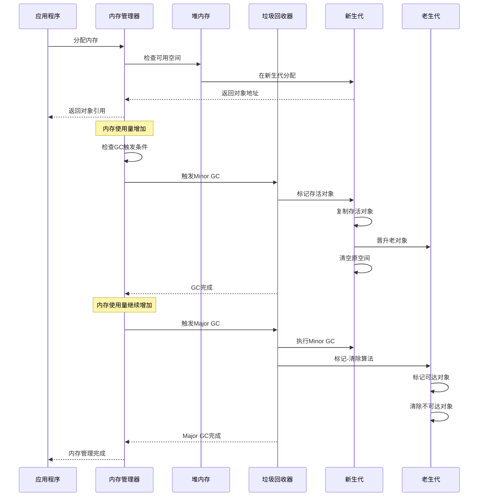

## 编译与优化

### 编译流程架构

现代 JavaScript 引擎采用多层编译架构，结合解释执行和即时编译（JIT）。

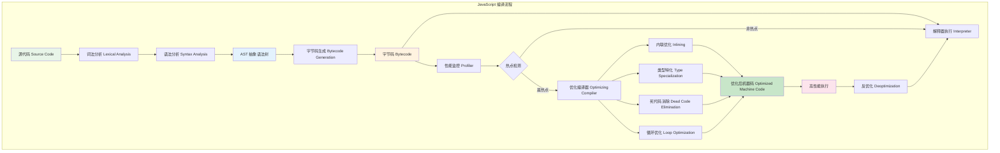

### 优化技术详解

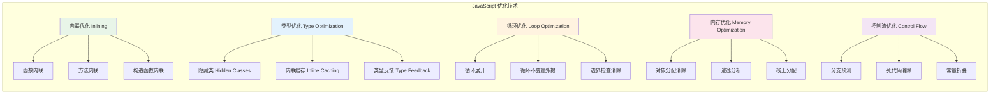

### 编译优化时序图

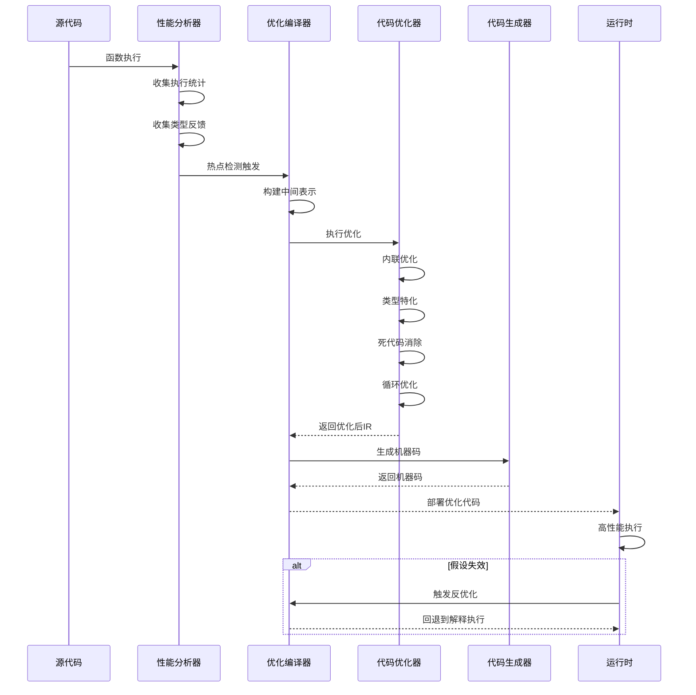

## 异步执行模型

### 异步架构概览

JavaScript 的异步执行模型是其最重要的特性之一，涉及 Promise、async/await、生成器等多种机制。

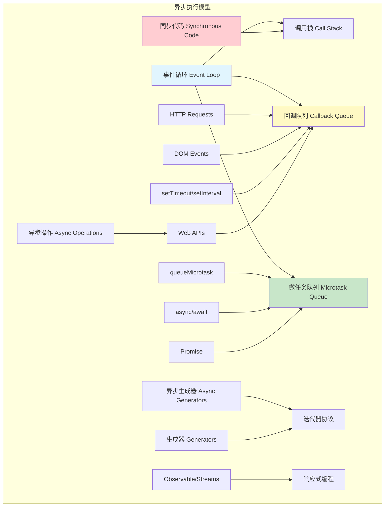

### Promise 状态机

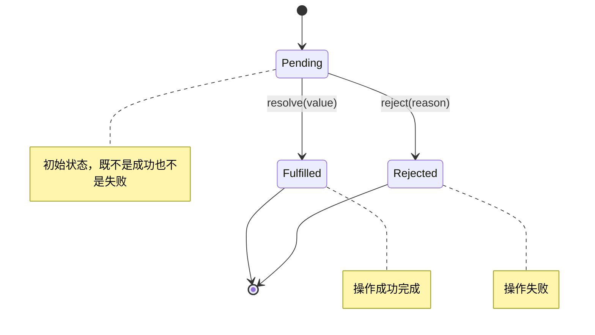

## 性能优化策略

### 性能优化架构

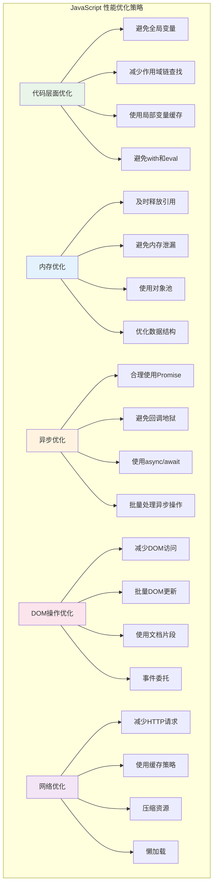

### 性能监控指标

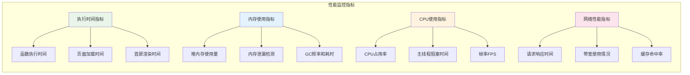

## 总结

JavaScript 执行模型是一个复杂而精密的系统，涉及多个层面的协调工作：

### 核心特点

1. **单线程执行**: JavaScript 主线程是单线程的，通过事件循环实现并发
2. **异步非阻塞**: 通过回调、Promise、async/await 实现异步编程
3. **动态编译**: 现代引擎采用解释执行和即时编译相结合的方式
4. **自动内存管理**: 通过垃圾回收机制自动管理内存
5. **事件驱动**: 基于事件循环的异步执行模型

### 性能优化要点

1. **理解执行上下文**: 合理使用作用域，避免不必要的查找
2. **优化异步操作**: 正确使用 Promise 和 async/await
3. **内存管理**: 及时释放不需要的引用，避免内存泄漏
4. **代码优化**: 编写引擎友好的代码，利用 JIT 编译优化
5. **性能监控**: 使用工具监控和分析性能瓶颈

### 发展趋势

1. **WebAssembly 集成**: 与 WebAssembly 的深度集成
2. **并发模型演进**: Worker 线程和 SharedArrayBuffer 的发展
3. **编译优化**: 更智能的 JIT 编译和优化策略
4. **内存管理**: 更高效的垃圾回收算法
5. **开发工具**: 更强大的调试和性能分析工具

理解 JavaScript 执行模型对于编写高性能、可维护的代码至关重要。随着技术的不断发展，JavaScript 的执行模型也在持续演进，为开发者提供更好的性能和开发体验。


