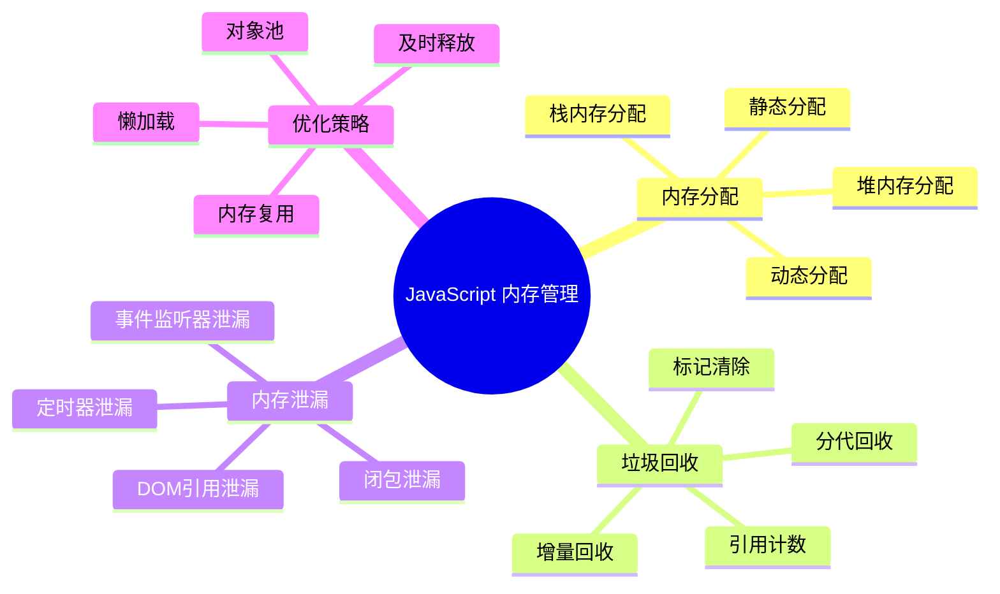
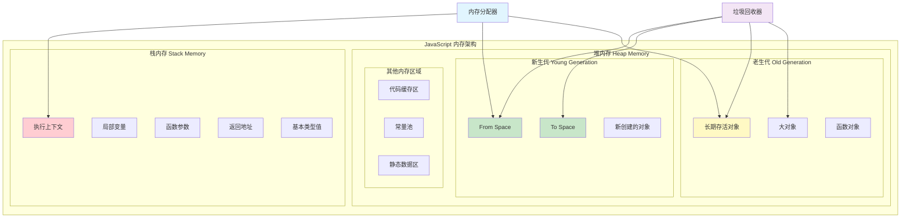
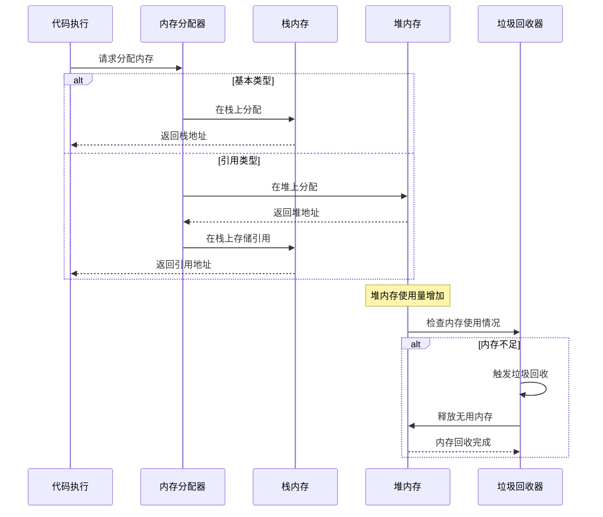
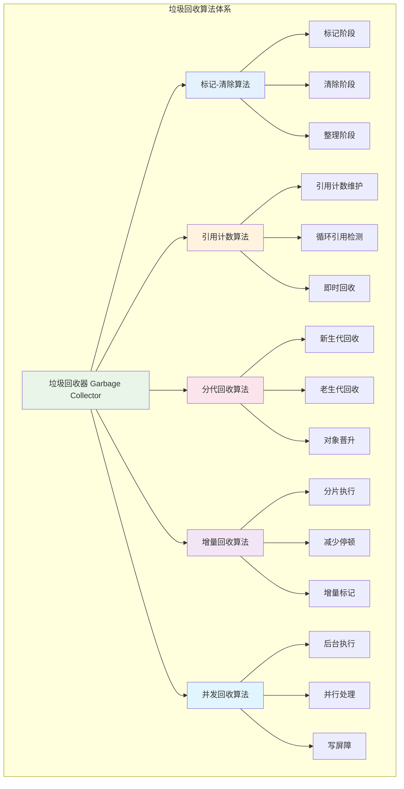
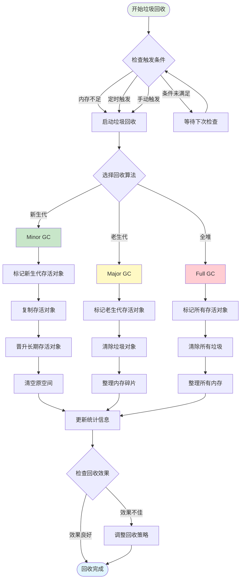
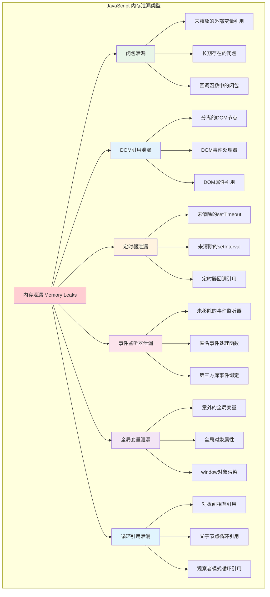
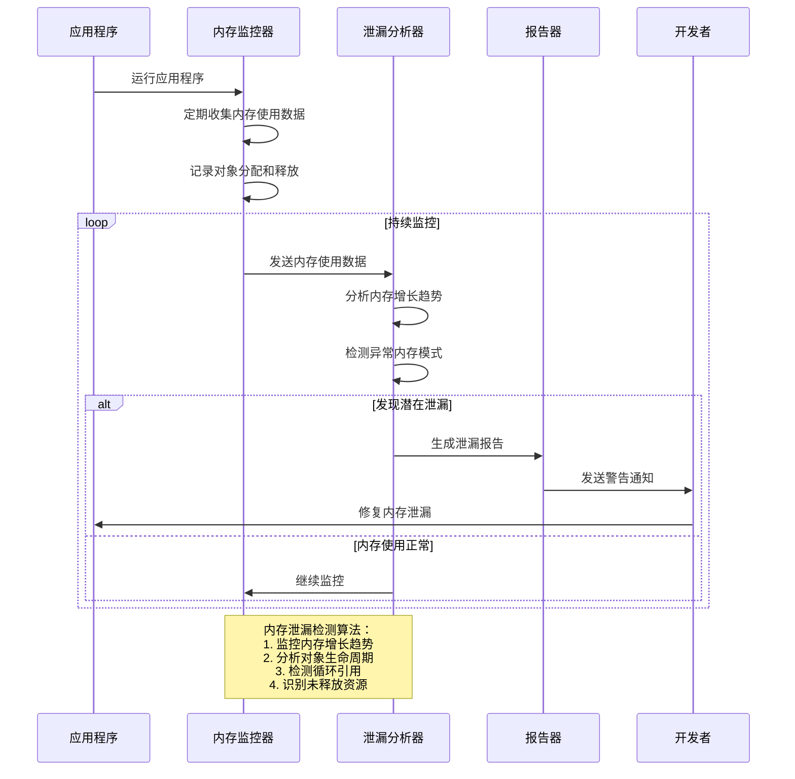
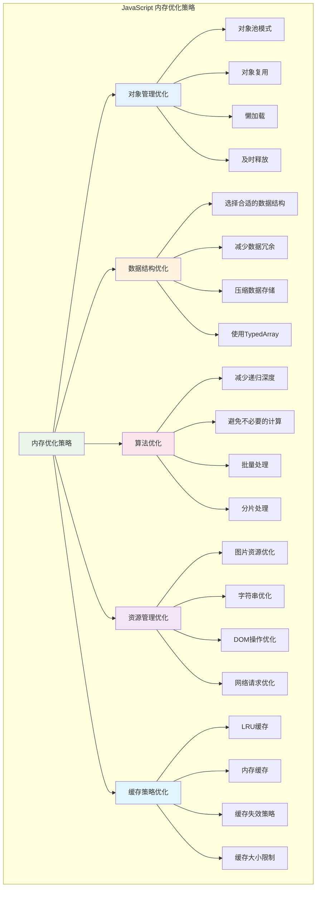
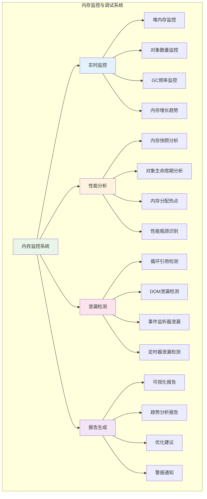
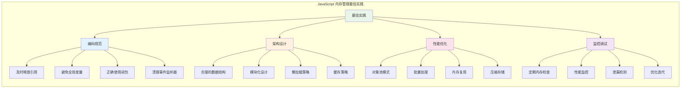

# JavaScript 内存管理

## 目录
1. [概述](#概述)
2. [JavaScript内存管理机制](#javascript内存管理机制)
3. [内存管理深度机制](#内存管理深度机制)
4. [常见内存泄漏与原理](#常见内存泄漏与原理)
5. [内存使用优化策略](#内存使用优化策略)
6. [内存监控与调试](#内存监控与调试)
7. [最佳实践](#最佳实践)
8. [总结](#总结)

## 概述

JavaScript 内存管理是现代 Web 开发中的关键技术领域。虽然 JavaScript 提供了自动内存管理，但理解其工作原理对于编写高性能、无内存泄漏的应用程序至关重要。

### JavaScript 内存管理核心概念



## JavaScript内存管理机制

### 内存分配架构

JavaScript 运行时的内存主要分为栈内存和堆内存两个区域，每个区域有不同的用途和管理方式。



### 内存分配过程



### 内存分配实现代码

```javascript
// JavaScript 内存分配器模拟实现
class MemoryAllocator {
    constructor() {
        this.stackMemory = new StackMemory();
        this.heapMemory = new HeapMemory();
        this.allocationStats = {
            totalAllocated: 0,
            stackAllocations: 0,
            heapAllocations: 0,
            currentUsage: 0
        };
    }
    
    // 分配内存的主要方法
    allocate(value, type) {
        const size = this.calculateSize(value, type);
        let address;
        
        if (this.isPrimitiveType(type)) {
            // 基本类型在栈上分配
            address = this.stackMemory.allocate(value, size);
            this.allocationStats.stackAllocations++;
            console.log(`[Allocator] 栈分配: ${type}, 大小: ${size} bytes, 地址: ${address}`);
        } else {
            // 引用类型在堆上分配
            address = this.heapMemory.allocate(value, size, type);
            this.allocationStats.heapAllocations++;
            console.log(`[Allocator] 堆分配: ${type}, 大小: ${size} bytes, 地址: ${address}`);
        }
        
        this.allocationStats.totalAllocated += size;
        this.allocationStats.currentUsage += size;
        
        return address;
    }
    
    // 释放内存
    deallocate(address, isStack = false) {
        let size;
        
        if (isStack) {
            size = this.stackMemory.deallocate(address);
        } else {
            size = this.heapMemory.deallocate(address);
        }
        
        if (size > 0) {
            this.allocationStats.currentUsage -= size;
            console.log(`[Allocator] 释放内存: ${size} bytes, 地址: ${address}`);
        }
        
        return size;
    }
    
    // 判断是否为基本类型
    isPrimitiveType(type) {
        const primitiveTypes = ['number', 'string', 'boolean', 'undefined', 'null', 'symbol', 'bigint'];
        return primitiveTypes.includes(type);
    }
    
    // 计算值的内存大小
    calculateSize(value, type) {
        switch (type) {
            case 'number':
                return 8; // 64位浮点数
            case 'boolean':
                return 1;
            case 'string':
                return value.length * 2; // UTF-16编码
            case 'object':
                return this.calculateObjectSize(value);
            case 'function':
                return this.calculateFunctionSize(value);
            case 'array':
                return this.calculateArraySize(value);
            default:
                return 8; // 默认大小
        }
    }
    
    calculateObjectSize(obj) {
        let size = 24; // 对象头部信息
        
        for (const key in obj) {
            if (obj.hasOwnProperty(key)) {
                size += key.length * 2; // 属性名
                size += this.calculateSize(obj[key], typeof obj[key]); // 属性值
            }
        }
        
        return size;
    }
    
    calculateFunctionSize(func) {
        const funcStr = func.toString();
        return 48 + funcStr.length * 2; // 函数对象基础大小 + 代码大小
    }
    
    calculateArraySize(arr) {
        let size = 32; // 数组对象基础大小
        
        arr.forEach(item => {
            size += this.calculateSize(item, typeof item);
        });
        
        return size;
    }
    
    getStats() {
        return { ...this.allocationStats };
    }
}

// 栈内存管理
class StackMemory {
    constructor(maxSize = 1024 * 1024) { // 1MB 默认栈大小
        this.memory = new ArrayBuffer(maxSize);
        this.view = new DataView(this.memory);
        this.pointer = 0;
        this.maxSize = maxSize;
        this.allocations = new Map();
    }
    
    allocate(value, size) {
        if (this.pointer + size > this.maxSize) {
            throw new Error('Stack overflow: 栈内存不足');
        }
        
        const address = this.pointer;
        
        // 根据类型存储值
        if (typeof value === 'number') {
            this.view.setFloat64(address, value);
        } else if (typeof value === 'boolean') {
            this.view.setUint8(address, value ? 1 : 0);
        }
        
        this.allocations.set(address, { size, type: typeof value, value });
        this.pointer += size;
        
        return address;
    }
    
    deallocate(address) {
        const allocation = this.allocations.get(address);
        if (!allocation) return 0;
        
        this.allocations.delete(address);
        
        // 如果是栈顶分配，可以直接回收
        if (address + allocation.size === this.pointer) {
            this.pointer = address;
        }
        
        return allocation.size;
    }
    
    getValue(address) {
        const allocation = this.allocations.get(address);
        if (!allocation) return undefined;
        
        switch (allocation.type) {
            case 'number':
                return this.view.getFloat64(address);
            case 'boolean':
                return this.view.getUint8(address) === 1;
            default:
                return allocation.value;
        }
    }
    
    getUsage() {
        return {
            used: this.pointer,
            total: this.maxSize,
            utilization: (this.pointer / this.maxSize * 100).toFixed(2) + '%'
        };
    }
}

// 堆内存管理
class HeapMemory {
    constructor() {
        this.objects = new Map();
        this.nextAddress = 10000; // 堆地址从10000开始
        this.freeList = []; // 空闲内存块列表
        this.totalSize = 0;
    }
    
    allocate(value, size, type) {
        const address = this.findFreeBlock(size) || this.nextAddress++;
        
        const objectInfo = {
            address,
            value,
            size,
            type,
            references: 0,
            marked: false,
            allocated: Date.now(),
            generation: 'young'
        };
        
        this.objects.set(address, objectInfo);
        this.totalSize += size;
        
        return address;
    }
    
    deallocate(address) {
        const objectInfo = this.objects.get(address);
        if (!objectInfo) return 0;
        
        const size = objectInfo.size;
        this.objects.delete(address);
        this.totalSize -= size;
        
        // 将释放的内存块加入空闲列表
        this.freeList.push({ address, size });
        this.freeList.sort((a, b) => a.size - b.size);
        
        return size;
    }
    
    findFreeBlock(requiredSize) {
        const index = this.freeList.findIndex(block => block.size >= requiredSize);
        if (index !== -1) {
            const block = this.freeList.splice(index, 1)[0];
            
            // 如果块太大，分割它
            if (block.size > requiredSize + 32) {
                this.freeList.push({
                    address: block.address + requiredSize,
                    size: block.size - requiredSize
                });
            }
            
            return block.address;
        }
        
        return null;
    }
    
    getObject(address) {
        return this.objects.get(address);
    }
    
    getAllObjects() {
        return Array.from(this.objects.values());
    }
    
    getUsage() {
        return {
            objectCount: this.objects.size,
            totalSize: this.totalSize,
            freeBlocks: this.freeList.length,
            fragmentation: this.calculateFragmentation()
        };
    }
    
    calculateFragmentation() {
        const totalFreeSize = this.freeList.reduce((sum, block) => sum + block.size, 0);
        const largestFreeBlock = Math.max(...this.freeList.map(block => block.size), 0);
        
        if (totalFreeSize === 0) return 0;
        
        return ((totalFreeSize - largestFreeBlock) / totalFreeSize * 100).toFixed(2) + '%';
    }
}

// 使用示例
const allocator = new MemoryAllocator();

// 分配基本类型
const numAddr = allocator.allocate(42, 'number');
const strAddr = allocator.allocate('Hello World', 'string');
const boolAddr = allocator.allocate(true, 'boolean');

// 分配引用类型
const objAddr = allocator.allocate({ name: 'John', age: 30 }, 'object');
const arrAddr = allocator.allocate([1, 2, 3, 4, 5], 'array');
const funcAddr = allocator.allocate(function() { return 'test'; }, 'function');

console.log('=== 内存分配统计 ===');
console.log(allocator.getStats());

console.log('=== 栈内存使用情况 ===');
console.log(allocator.stackMemory.getUsage());

console.log('=== 堆内存使用情况 ===');
console.log(allocator.heapMemory.getUsage());
```

## 内存管理深度机制

### 垃圾回收算法架构

JavaScript 引擎使用多种垃圾回收算法来管理内存，主要包括标记-清除、引用计数和分代回收。



### 垃圾回收执行流程



### 垃圾回收器实现

```javascript
// 完整的垃圾回收器实现
class GarbageCollector {
    constructor(heapMemory) {
        this.heap = heapMemory;
        this.rootSet = new Set(); // 根对象集合
        this.markStack = []; // 标记栈
        
        this.config = {
            youngGenerationThreshold: 8 * 1024 * 1024, // 8MB
            oldGenerationThreshold: 64 * 1024 * 1024, // 64MB
            maxPauseTime: 10, // 最大停顿时间(ms)
            incrementalSteps: 1000 // 增量步数
        };
        
        this.stats = {
            minorGCCount: 0,
            majorGCCount: 0,
            fullGCCount: 0,
            totalGCTime: 0,
            averagePauseTime: 0,
            memoryFreed: 0
        };
        
        this.isRunning = false;
        this.incrementalState = null;
    }
    
    // 主要的垃圾回收入口
    collect(type = 'auto') {
        if (this.isRunning) {
            console.log('[GC] 垃圾回收正在进行中');
            return;
        }
        
        this.isRunning = true;
        const startTime = performance.now();
        
        try {
            console.log(`[GC] 开始 ${type} 垃圾回收`);
            
            let result;
            switch (type) {
                case 'minor':
                    result = this.minorGC();
                    this.stats.minorGCCount++;
                    break;
                case 'major':
                    result = this.majorGC();
                    this.stats.majorGCCount++;
                    break;
                case 'full':
                    result = this.fullGC();
                    this.stats.fullGCCount++;
                    break;
                case 'incremental':
                    result = this.incrementalGC();
                    break;
                default:
                    result = this.autoSelectGC();
            }
            
            const endTime = performance.now();
            const gcTime = endTime - startTime;
            
            this.updateStats(gcTime, result);
            
            console.log(`[GC] ${type} 垃圾回收完成，耗时: ${gcTime.toFixed(2)}ms`, result);
            
            return result;
            
        } finally {
            this.isRunning = false;
        }
    }
    
    // 新生代垃圾回收 (Minor GC)
    minorGC() {
        console.log('[GC] 执行新生代垃圾回收');
        
        const youngObjects = this.getYoungGenerationObjects();
        const markedObjects = this.markPhase(youngObjects);
        const survivors = this.copyPhase(markedObjects);
        const promoted = this.promoteObjects(survivors);
        const freed = this.clearYoungGeneration(youngObjects, survivors);
        
        return {
            type: 'minor',
            processed: youngObjects.length,
            survived: survivors.length,
            promoted: promoted.length,
            freed: freed,
            generation: 'young'
        };
    }
    
    // 老生代垃圾回收 (Major GC)
    majorGC() {
        console.log('[GC] 执行老生代垃圾回收');
        
        const oldObjects = this.getOldGenerationObjects();
        const markedObjects = this.markPhase(oldObjects);
        const sweptObjects = this.sweepPhase(oldObjects, markedObjects);
        const compacted = this.compactPhase(markedObjects);
        
        return {
            type: 'major',
            processed: oldObjects.length,
            marked: markedObjects.length,
            swept: sweptObjects.length,
            compacted: compacted,
            generation: 'old'
        };
    }
    
    // 全堆垃圾回收 (Full GC)
    fullGC() {
        console.log('[GC] 执行全堆垃圾回收');
        
        const minorResult = this.minorGC();
        const majorResult = this.majorGC();
        
        return {
            type: 'full',
            minor: minorResult,
            major: majorResult,
            totalFreed: minorResult.freed + majorResult.swept
        };
    }
    
    // 增量垃圾回收
    incrementalGC() {
        if (!this.incrementalState) {
            this.incrementalState = this.initIncrementalState();
        }
        
        const startTime = performance.now();
        let steps = 0;
        
        while (steps < this.config.incrementalSteps && 
               performance.now() - startTime < this.config.maxPauseTime) {
            
            if (!this.incrementalStep()) {
                // 增量回收完成
                const result = this.finishIncrementalGC();
                this.incrementalState = null;
                return result;
            }
            
            steps++;
        }
        
        return {
            type: 'incremental',
            steps: steps,
            completed: false,
            progress: this.incrementalState.progress
        };
    }
    
    // 自动选择垃圾回收策略
    autoSelectGC() {
        const heapUsage = this.heap.getUsage();
        const youngSize = this.getYoungGenerationSize();
        const oldSize = this.getOldGenerationSize();
        
        if (youngSize > this.config.youngGenerationThreshold) {
            return this.minorGC();
        } else if (oldSize > this.config.oldGenerationThreshold) {
            return this.majorGC();
        } else if (heapUsage.totalSize > this.config.oldGenerationThreshold * 2) {
            return this.fullGC();
        } else {
            return this.incrementalGC();
        }
    }
    
    // 标记阶段
    markPhase(objects) {
        console.log('[GC] 开始标记阶段');
        
        // 清除所有标记
        objects.forEach(obj => obj.marked = false);
        
        // 从根对象开始标记
        this.markStack = [...this.rootSet];
        const markedObjects = new Set();
        
        while (this.markStack.length > 0) {
            const obj = this.markStack.pop();
            
            if (!obj || obj.marked) continue;
            
            obj.marked = true;
            markedObjects.add(obj);
            
            // 标记引用的对象
            this.markReferencedObjects(obj);
        }
        
        console.log(`[GC] 标记阶段完成，标记了 ${markedObjects.size} 个对象`);
        return Array.from(markedObjects);
    }
    
    // 标记引用的对象
    markReferencedObjects(obj) {
        if (obj.type === 'object' && obj.value) {
            Object.values(obj.value).forEach(value => {
                if (typeof value === 'object' && value !== null) {
                    const referencedObj = this.findObjectByValue(value);
                    if (referencedObj && !referencedObj.marked) {
                        this.markStack.push(referencedObj);
                    }
                }
            });
        } else if (obj.type === 'array' && obj.value) {
            obj.value.forEach(item => {
                if (typeof item === 'object' && item !== null) {
                    const referencedObj = this.findObjectByValue(item);
                    if (referencedObj && !referencedObj.marked) {
                        this.markStack.push(referencedObj);
                    }
                }
            });
        }
    }
    
    // 复制阶段 (用于新生代)
    copyPhase(markedObjects) {
        console.log('[GC] 开始复制阶段');
        
        const survivors = markedObjects.filter(obj => obj.generation === 'young');
        
        // 模拟复制到 To Space
        survivors.forEach(obj => {
            obj.generation = 'young-survivor';
            obj.age = (obj.age || 0) + 1;
        });
        
        console.log(`[GC] 复制阶段完成，复制了 ${survivors.length} 个对象`);
        return survivors;
    }
    
    // 对象晋升
    promoteObjects(survivors) {
        const promoted = survivors.filter(obj => obj.age > 2);
        
        promoted.forEach(obj => {
            obj.generation = 'old';
            console.log(`[GC] 对象 ${obj.address} 晋升到老生代`);
        });
        
        return promoted;
    }
    
    // 清除阶段 (用于老生代)
    sweepPhase(allObjects, markedObjects) {
        console.log('[GC] 开始清除阶段');
        
        const markedSet = new Set(markedObjects);
        const sweptObjects = [];
        
        allObjects.forEach(obj => {
            if (!markedSet.has(obj)) {
                this.heap.deallocate(obj.address);
                sweptObjects.push(obj);
            }
        });
        
        console.log(`[GC] 清除阶段完成，清除了 ${sweptObjects.length} 个对象`);
        return sweptObjects;
    }
    
    // 整理阶段
    compactPhase(markedObjects) {
        console.log('[GC] 开始整理阶段');
        
        // 模拟内存整理，减少碎片
        let compactedSize = 0;
        markedObjects.forEach(obj => {
            compactedSize += obj.size;
        });
        
        console.log(`[GC] 整理阶段完成，整理了 ${compactedSize} bytes`);
        return compactedSize;
    }
    
    // 清空新生代
    clearYoungGeneration(allObjects, survivors) {
        const survivorSet = new Set(survivors);
        let freedSize = 0;
        
        allObjects.forEach(obj => {
            if (obj.generation === 'young' && !survivorSet.has(obj)) {
                freedSize += obj.size;
                this.heap.deallocate(obj.address);
            }
        });
        
        return freedSize;
    }
    
    // 获取新生代对象
    getYoungGenerationObjects() {
        return this.heap.getAllObjects().filter(obj => 
            obj.generation === 'young' || obj.generation === 'young-survivor'
        );
    }
    
    // 获取老生代对象
    getOldGenerationObjects() {
        return this.heap.getAllObjects().filter(obj => obj.generation === 'old');
    }
    
    // 获取新生代大小
    getYoungGenerationSize() {
        return this.getYoungGenerationObjects().reduce((size, obj) => size + obj.size, 0);
    }
    
    // 获取老生代大小
    getOldGenerationSize() {
        return this.getOldGenerationObjects().reduce((size, obj) => size + obj.size, 0);
    }
    
    // 根据值查找对象
    findObjectByValue(value) {
        const objects = this.heap.getAllObjects();
        return objects.find(obj => obj.value === value);
    }
    
    // 添加根对象
    addRoot(obj) {
        this.rootSet.add(obj);
    }
    
    // 移除根对象
    removeRoot(obj) {
        this.rootSet.delete(obj);
    }
    
    // 初始化增量状态
    initIncrementalState() {
        const allObjects = this.heap.getAllObjects();
        return {
            phase: 'mark',
            objects: allObjects,
            currentIndex: 0,
            markedObjects: [],
            progress: 0
        };
    }
    
    // 执行增量步骤
    incrementalStep() {
        const state = this.incrementalState;
        
        if (state.phase === 'mark') {
            if (state.currentIndex < state.objects.length) {
                const obj = state.objects[state.currentIndex];
                if (this.shouldMark(obj)) {
                    obj.marked = true;
                    state.markedObjects.push(obj);
                    this.markReferencedObjects(obj);
                }
                state.currentIndex++;
                state.progress = state.currentIndex / state.objects.length;
                return true;
            } else {
                state.phase = 'sweep';
                state.currentIndex = 0;
                return true;
            }
        } else if (state.phase === 'sweep') {
            if (state.currentIndex < state.objects.length) {
                const obj = state.objects[state.currentIndex];
                if (!obj.marked) {
                    this.heap.deallocate(obj.address);
                }
                state.currentIndex++;
                state.progress = 0.5 + (state.currentIndex / state.objects.length) * 0.5;
                return true;
            } else {
                return false; // 完成
            }
        }
        
        return false;
    }
    
    // 完成增量垃圾回收
    finishIncrementalGC() {
        const state = this.incrementalState;
        
        return {
            type: 'incremental',
            completed: true,
            processed: state.objects.length,
            marked: state.markedObjects.length,
            freed: state.objects.length - state.markedObjects.length
        };
    }
    
    // 判断对象是否应该被标记
    shouldMark(obj) {
        return this.rootSet.has(obj) || this.isReachableFromRoots(obj);
    }
    
    // 检查对象是否从根可达
    isReachableFromRoots(targetObj) {
        // 简化实现：随机决定可达性
        return Math.random() > 0.3;
    }
    
    // 更新统计信息
    updateStats(gcTime, result) {
        this.stats.totalGCTime += gcTime;
        
        const totalGCs = this.stats.minorGCCount + this.stats.majorGCCount + this.stats.fullGCCount;
        this.stats.averagePauseTime = this.stats.totalGCTime / totalGCs;
        
        if (result.freed) {
            this.stats.memoryFreed += result.freed;
        }
    }
    
    // 获取统计信息
    getStats() {
        return { ...this.stats };
    }
    
    // 强制垃圾回收
    forceGC() {
        return this.collect('full');
    }
}

// 使用示例
const heapMemory = new HeapMemory();
const gc = new GarbageCollector(heapMemory);

// 创建一些对象
const obj1 = { address: 1001, value: { name: 'Object1' }, size: 100, type: 'object', generation: 'young', age: 0 };
const obj2 = { address: 1002, value: { name: 'Object2' }, size: 150, type: 'object', generation: 'young', age: 1 };
const obj3 = { address: 1003, value: { name: 'Object3' }, size: 200, type: 'object', generation: 'old', age: 5 };

heapMemory.objects.set(1001, obj1);
heapMemory.objects.set(1002, obj2);
heapMemory.objects.set(1003, obj3);

// 设置根对象
gc.addRoot(obj1);
gc.addRoot(obj3);

// 执行不同类型的垃圾回收
console.log('=== 执行 Minor GC ===');
const minorResult = gc.collect('minor');

console.log('=== 执行 Major GC ===');
const majorResult = gc.collect('major');

console.log('=== 执行增量 GC ===');
let incrementalResult;
do {
    incrementalResult = gc.collect('incremental');
    console.log('增量GC进度:', incrementalResult.progress);
} while (!incrementalResult.completed);

console.log('=== 垃圾回收统计 ===');
console.log(gc.getStats());
```

## 常见内存泄漏与原理

### 内存泄漏类型架构

内存泄漏是指程序中已分配的内存由于某种原因未能释放或无法释放，导致内存使用量持续增长。



### 内存泄漏检测流程



### 内存泄漏示例与解决方案

```javascript
// 内存泄漏检测和修复工具
class MemoryLeakDetector {
    constructor() {
        this.memorySnapshots = [];
        this.leakPatterns = [];
        this.monitoringInterval = null;
        this.isMonitoring = false;
        
        this.thresholds = {
            memoryGrowthRate: 0.1, // 10% 增长率阈值
            objectCountGrowth: 100, // 对象数量增长阈值
            monitoringDuration: 30000 // 30秒监控周期
        };
    }
    
    // 开始内存监控
    startMonitoring() {
        if (this.isMonitoring) return;
        
        this.isMonitoring = true;
        console.log('[MemoryLeakDetector] 开始内存泄漏监控');
        
        this.monitoringInterval = setInterval(() => {
            this.takeMemorySnapshot();
            this.analyzeMemoryTrends();
        }, 5000);
        
        // 30秒后生成报告
        setTimeout(() => {
            this.generateLeakReport();
        }, this.thresholds.monitoringDuration);
    }
    
    // 停止内存监控
    stopMonitoring() {
        if (!this.isMonitoring) return;
        
        this.isMonitoring = false;
        if (this.monitoringInterval) {
            clearInterval(this.monitoringInterval);
            this.monitoringInterval = null;
        }
        
        console.log('[MemoryLeakDetector] 停止内存泄漏监控');
    }
    
    // 拍摄内存快照
    takeMemorySnapshot() {
        const snapshot = {
            timestamp: Date.now(),
            heapUsed: this.getHeapUsage(),
            objectCount: this.getObjectCount(),
            domNodeCount: this.getDOMNodeCount(),
            eventListenerCount: this.getEventListenerCount(),
            timerCount: this.getTimerCount()
        };
        
        this.memorySnapshots.push(snapshot);
        console.log('[MemoryLeakDetector] 内存快照:', snapshot);
        
        // 保持最近20个快照
        if (this.memorySnapshots.length > 20) {
            this.memorySnapshots.shift();
        }
    }
    
    // 分析内存趋势
    analyzeMemoryTrends() {
        if (this.memorySnapshots.length < 3) return;
        
        const recent = this.memorySnapshots.slice(-3);
        const growthRate = this.calculateGrowthRate(recent);
        
        if (growthRate > this.thresholds.memoryGrowthRate) {
            this.detectLeakPatterns();
        }
    }
    
    // 计算增长率
    calculateGrowthRate(snapshots) {
        const first = snapshots[0];
        const last = snapshots[snapshots.length - 1];
        
        return (last.heapUsed - first.heapUsed) / first.heapUsed;
    }
    
    // 检测泄漏模式
    detectLeakPatterns() {
        const patterns = [];
        
        // 检测DOM节点泄漏
        if (this.isDOMNodeLeaking()) {
            patterns.push({
                type: 'dom_leak',
                severity: 'high',
                description: '检测到DOM节点持续增长，可能存在DOM引用泄漏'
            });
        }
        
        // 检测事件监听器泄漏
        if (this.isEventListenerLeaking()) {
            patterns.push({
                type: 'event_listener_leak',
                severity: 'medium',
                description: '检测到事件监听器持续增长，可能存在未移除的事件监听器'
            });
        }
        
        // 检测定时器泄漏
        if (this.isTimerLeaking()) {
            patterns.push({
                type: 'timer_leak',
                severity: 'medium',
                description: '检测到定时器持续增长，可能存在未清除的定时器'
            });
        }
        
        // 检测内存持续增长
        if (this.isMemoryGrowthContinuous()) {
            patterns.push({
                type: 'memory_growth',
                severity: 'high',
                description: '检测到内存持续增长，可能存在内存泄漏'
            });
        }
        
        this.leakPatterns.push(...patterns);
    }
    
    // 检测DOM节点泄漏
    isDOMNodeLeaking() {
        if (this.memorySnapshots.length < 3) return false;
        
        const recent = this.memorySnapshots.slice(-3);
        return recent.every((snapshot, index) => {
            if (index === 0) return true;
            return snapshot.domNodeCount > recent[index - 1].domNodeCount;
        });
    }
    
    // 检测事件监听器泄漏
    isEventListenerLeaking() {
        if (this.memorySnapshots.length < 3) return false;
        
        const recent = this.memorySnapshots.slice(-3);
        return recent.every((snapshot, index) => {
            if (index === 0) return true;
            return snapshot.eventListenerCount > recent[index - 1].eventListenerCount;
        });
    }
    
    // 检测定时器泄漏
    isTimerLeaking() {
        if (this.memorySnapshots.length < 3) return false;
        
        const recent = this.memorySnapshots.slice(-3);
        return recent.every((snapshot, index) => {
            if (index === 0) return true;
            return snapshot.timerCount > recent[index - 1].timerCount;
        });
    }
    
    // 检测内存持续增长
    isMemoryGrowthContinuous() {
        if (this.memorySnapshots.length < 5) return false;
        
        const recent = this.memorySnapshots.slice(-5);
        return recent.every((snapshot, index) => {
            if (index === 0) return true;
            return snapshot.heapUsed > recent[index - 1].heapUsed;
        });
    }
    
    // 生成泄漏报告
    generateLeakReport() {
        const report = {
            timestamp: Date.now(),
            monitoringDuration: this.thresholds.monitoringDuration,
            totalSnapshots: this.memorySnapshots.length,
            leakPatterns: this.leakPatterns,
            memoryTrend: this.analyzeMemoryTrend(),
            recommendations: this.generateRecommendations()
        };
        
        console.log('=== 内存泄漏检测报告 ===');
        console.log(report);
        
        return report;
    }
    
    // 分析内存趋势
    analyzeMemoryTrend() {
        if (this.memorySnapshots.length < 2) return null;
        
        const first = this.memorySnapshots[0];
        const last = this.memorySnapshots[this.memorySnapshots.length - 1];
        
        return {
            initialMemory: first.heapUsed,
            finalMemory: last.heapUsed,
            memoryIncrease: last.heapUsed - first.heapUsed,
            growthRate: ((last.heapUsed - first.heapUsed) / first.heapUsed * 100).toFixed(2) + '%',
            objectCountChange: last.objectCount - first.objectCount,
            domNodeChange: last.domNodeCount - first.domNodeCount
        };
    }
    
    // 生成修复建议
    generateRecommendations() {
        const recommendations = [];
        
        this.leakPatterns.forEach(pattern => {
            switch (pattern.type) {
                case 'dom_leak':
                    recommendations.push('检查DOM节点的引用，确保及时移除不需要的DOM引用');
                    recommendations.push('使用WeakMap或WeakSet来存储DOM节点引用');
                    break;
                case 'event_listener_leak':
                    recommendations.push('确保在组件销毁时移除所有事件监听器');
                    recommendations.push('使用addEventListener的第三个参数{once: true}来自动移除监听器');
                    break;
                case 'timer_leak':
                    recommendations.push('确保清除所有setTimeout和setInterval');
                    recommendations.push('在组件销毁时调用clearTimeout和clearInterval');
                    break;
                case 'memory_growth':
                    recommendations.push('检查是否存在循环引用');
                    recommendations.push('使用Chrome DevTools的Memory面板进行详细分析');
                    break;
            }
        });
        
        return [...new Set(recommendations)]; // 去重
    }
    
    // 获取堆内存使用量
    getHeapUsage() {
        if (typeof performance !== 'undefined' && performance.memory) {
            return performance.memory.usedJSHeapSize;
        }
        return Math.random() * 50000000; // 模拟值
    }
    
    // 获取对象数量
    getObjectCount() {
        return Math.floor(Math.random() * 10000) + 5000; // 模拟值
    }
    
    // 获取DOM节点数量
    getDOMNodeCount() {
        if (typeof document !== 'undefined') {
            return document.querySelectorAll('*').length;
        }
        return Math.floor(Math.random() * 1000) + 100; // 模拟值
    }
    
    // 获取事件监听器数量
    getEventListenerCount() {
        return Math.floor(Math.random() * 100) + 10; // 模拟值
    }
    
    // 获取定时器数量
    getTimerCount() {
        return Math.floor(Math.random() * 20) + 1; // 模拟值
    }
}

// 常见内存泄漏示例和修复方案
class MemoryLeakExamples {
    constructor() {
        this.examples = [];
    }
    
    // 1. 闭包内存泄漏示例
    demonstrateClosureLeak() {
        console.log('=== 闭包内存泄漏示例 ===');
        
        // 有问题的代码
        function createLeakyFunction() {
            const largeData = new Array(1000000).fill('data'); // 大量数据
            
            return function() {
                // 这个函数持有对largeData的引用，即使不使用它
                console.log('Function called');
            };
        }
        
        // 修复后的代码
        function createFixedFunction() {
            const largeData = new Array(1000000).fill('data');
            
            // 处理完数据后立即释放引用
            const result = largeData.length;
            
            return function() {
                console.log('Function called, data size was:', result);
                // largeData已经不在作用域中，可以被垃圾回收
            };
        }
        
        console.log('创建有泄漏风险的函数...');
        const leakyFunc = createLeakyFunction();
        
        console.log('创建修复后的函数...');
        const fixedFunc = createFixedFunction();
        
        return { leakyFunc, fixedFunc };
    }
    
    // 2. DOM引用内存泄漏示例
    demonstrateDOMRefLeak() {
        console.log('=== DOM引用内存泄漏示例 ===');
        
        // 有问题的代码
        class LeakyComponent {
            constructor() {
                this.element = document.createElement('div');
                this.childElements = [];
                
                // 创建大量子元素
                for (let i = 0; i < 1000; i++) {
                    const child = document.createElement('span');
                    child.textContent = `Child ${i}`;
                    this.element.appendChild(child);
                    this.childElements.push(child); // 保持引用
                }
                
                document.body.appendChild(this.element);
            }
            
            destroy() {
                // 只移除了父元素，但childElements数组仍然持有引用
                document.body.removeChild(this.element);
                // this.childElements = null; // 忘记清理引用
            }
        }
        
        // 修复后的代码
        class FixedComponent {
            constructor() {
                this.element = document.createElement('div');
                this.childElements = [];
                
                for (let i = 0; i < 1000; i++) {
                    const child = document.createElement('span');
                    child.textContent = `Child ${i}`;
                    this.element.appendChild(child);
                    this.childElements.push(child);
                }
                
                document.body.appendChild(this.element);
            }
            
            destroy() {
                // 正确清理所有引用
                document.body.removeChild(this.element);
                this.childElements = null; // 清理数组引用
                this.element = null; // 清理元素引用
            }
        }
        
        return { LeakyComponent, FixedComponent };
    }
    
    // 3. 定时器内存泄漏示例
    demonstrateTimerLeak() {
        console.log('=== 定时器内存泄漏示例 ===');
        
        // 有问题的代码
        class LeakyTimer {
            constructor() {
                this.data = new Array(100000).fill('timer data');
                this.timerId = setInterval(() => {
                    console.log('Timer tick, data length:', this.data.length);
                }, 1000);
            }
            
            destroy() {
                // 忘记清除定时器
                // clearInterval(this.timerId);
                console.log('Component destroyed, but timer still running');
            }
        }
        
        // 修复后的代码
        class FixedTimer {
            constructor() {
                this.data = new Array(100000).fill('timer data');
                this.timerId = setInterval(() => {
                    console.log('Timer tick, data length:', this.data.length);
                }, 1000);
            }
            
            destroy() {
                // 正确清除定时器
                if (this.timerId) {
                    clearInterval(this.timerId);
                    this.timerId = null;
                }
                this.data = null; // 清理数据引用
                console.log('Component and timer properly destroyed');
            }
        }
        
        return { LeakyTimer, FixedTimer };
    }
    
    // 4. 事件监听器内存泄漏示例
    demonstrateEventListenerLeak() {
        console.log('=== 事件监听器内存泄漏示例 ===');
        
        // 有问题的代码
        class LeakyEventHandler {
            constructor() {
                this.data = new Array(50000).fill('event data');
                this.element = document.createElement('button');
                this.element.textContent = 'Click me';
                
                // 添加事件监听器但不保存引用
                this.element.addEventListener('click', () => {
                    console.log('Button clicked, data length:', this.data.length);
                });
                
                document.body.appendChild(this.element);
            }
            
            destroy() {
                // 移除元素但没有移除事件监听器
                document.body.removeChild(this.element);
                // 事件监听器仍然持有对this.data的引用
            }
        }
        
        // 修复后的代码
        class FixedEventHandler {
            constructor() {
                this.data = new Array(50000).fill('event data');
                this.element = document.createElement('button');
                this.element.textContent = 'Click me';
                
                // 保存事件处理函数的引用
                this.handleClick = () => {
                    console.log('Button clicked, data length:', this.data.length);
                };
                
                this.element.addEventListener('click', this.handleClick);
                document.body.appendChild(this.element);
            }
            
            destroy() {
                // 正确移除事件监听器
                this.element.removeEventListener('click', this.handleClick);
                document.body.removeChild(this.element);
                
                // 清理引用
                this.handleClick = null;
                this.element = null;
                this.data = null;
            }
        }
        
        return { LeakyEventHandler, FixedEventHandler };
    }
    
    // 5. 循环引用内存泄漏示例
    demonstrateCircularReferenceLeak() {
        console.log('=== 循环引用内存泄漏示例 ===');
        
        // 有问题的代码
        function createCircularReference() {
            const parent = {
                name: 'parent',
                data: new Array(10000).fill('parent data'),
                children: []
            };
            
            const child = {
                name: 'child',
                data: new Array(10000).fill('child data'),
                parent: parent // 子对象引用父对象
            };
            
            parent.children.push(child); // 父对象引用子对象
            
            return { parent, child }; // 形成循环引用
        }
        
        // 修复后的代码
        function createFixedReference() {
            const parent = {
                name: 'parent',
                data: new Array(10000).fill('parent data'),
                children: []
            };
            
            const child = {
                name: 'child',
                data: new Array(10000).fill('child data')
                // 不直接引用parent，而是通过ID或其他方式关联
            };
            
            parent.children.push(child);
            
            // 提供清理方法
            const cleanup = () => {
                parent.children = [];
                parent.data = null;
                child.data = null;
            };
            
            return { parent, child, cleanup };
        }
        
        return { createCircularReference, createFixedReference };
    }
    
    // 运行所有示例
    runAllExamples() {
        console.log('开始演示内存泄漏示例...');
        
        this.demonstrateClosureLeak();
        this.demonstrateDOMRefLeak();
        this.demonstrateTimerLeak();
        this.demonstrateEventListenerLeak();
        this.demonstrateCircularReferenceLeak();
        
        console.log('所有内存泄漏示例演示完成');
    }
}

// 使用示例
const leakDetector = new MemoryLeakDetector();
const examples = new MemoryLeakExamples();

// 开始监控
leakDetector.startMonitoring();

// 运行泄漏示例
examples.runAllExamples();

// 模拟一些内存泄漏
const leakyObjects = [];
const intervalId = setInterval(() => {
    // 持续创建对象但不释放
    leakyObjects.push({
        data: new Array(1000).fill('leak data'),
        timestamp: Date.now()
    });
}, 1000);

// 10秒后停止创建泄漏对象
setTimeout(() => {
    clearInterval(intervalId);
    console.log('停止创建泄漏对象');
}, 10000);

// 35秒后停止监控并生成报告
setTimeout(() => {
    leakDetector.stopMonitoring();
}, 35000);
```

## 内存使用优化策略

### 内存优化架构



### 内存优化实现

```javascript
// 内存优化工具集
class MemoryOptimizer {
    constructor() {
        this.objectPools = new Map();
        this.caches = new Map();
        this.optimizationStats = {
            poolHits: 0,
            poolMisses: 0,
            cacheHits: 0,
            cacheMisses: 0,
            memoryFreed: 0
        };
    }
    
    // 1. 对象池模式实现
    createObjectPool(type, factory, resetFn, initialSize = 10) {
        const pool = {
            type,
            factory,
            resetFn,
            available: [],
            inUse: new Set(),
            totalCreated: 0,
            maxSize: 100
        };
        
        // 预创建对象
        for (let i = 0; i < initialSize; i++) {
            const obj = factory();
            obj._poolId = `${type}_${pool.totalCreated++}`;
            pool.available.push(obj);
        }
        
        this.objectPools.set(type, pool);
        console.log(`[ObjectPool] 创建对象池: ${type}, 初始大小: ${initialSize}`);
        
        return pool;
    }
    
    // 从对象池获取对象
    getFromPool(type) {
        const pool = this.objectPools.get(type);
        if (!pool) {
            throw new Error(`Object pool '${type}' not found`);
        }
        
        let obj;
        
        if (pool.available.length > 0) {
            obj = pool.available.pop();
            this.optimizationStats.poolHits++;
        } else {
            // 池中没有可用对象，创建新对象
            if (pool.inUse.size < pool.maxSize) {
                obj = pool.factory();
                obj._poolId = `${type}_${pool.totalCreated++}`;
                this.optimizationStats.poolMisses++;
            } else {
                throw new Error(`Object pool '${type}' reached maximum size`);
            }
        }
        
        pool.inUse.add(obj);
        console.log(`[ObjectPool] 从池中获取对象: ${obj._poolId}`);
        
        return obj;
    }
    
    // 将对象返回到对象池
    returnToPool(type, obj) {
        const pool = this.objectPools.get(type);
        if (!pool || !pool.inUse.has(obj)) {
            console.warn(`[ObjectPool] 对象不属于池: ${type}`);
            return false;
        }
        
        // 重置对象状态
        if (pool.resetFn) {
            pool.resetFn(obj);
        }
        
        pool.inUse.delete(obj);
        pool.available.push(obj);
        
        console.log(`[ObjectPool] 对象返回池中: ${obj._poolId}`);
        return true;
    }
    
    // 2. LRU缓存实现
    createLRUCache(name, maxSize = 100) {
        const cache = {
            name,
            maxSize,
            data: new Map(),
            accessOrder: []
        };
        
        this.caches.set(name, cache);
        console.log(`[LRUCache] 创建缓存: ${name}, 最大大小: ${maxSize}`);
        
        return cache;
    }
    
    // 从缓存获取数据
    getFromCache(cacheName, key) {
        const cache = this.caches.get(cacheName);
        if (!cache) return null;
        
        if (cache.data.has(key)) {
            // 更新访问顺序
            const index = cache.accessOrder.indexOf(key);
            if (index > -1) {
                cache.accessOrder.splice(index, 1);
            }
            cache.accessOrder.push(key);
            
            this.optimizationStats.cacheHits++;
            console.log(`[LRUCache] 缓存命中: ${cacheName}[${key}]`);
            
            return cache.data.get(key);
        }
        
        this.optimizationStats.cacheMisses++;
        console.log(`[LRUCache] 缓存未命中: ${cacheName}[${key}]`);
        
        return null;
    }
    
    // 向缓存添加数据
    setToCache(cacheName, key, value) {
        const cache = this.caches.get(cacheName);
        if (!cache) return false;
        
        // 如果缓存已满，移除最少使用的项
        if (cache.data.size >= cache.maxSize && !cache.data.has(key)) {
            const lruKey = cache.accessOrder.shift();
            cache.data.delete(lruKey);
            console.log(`[LRUCache] 移除LRU项: ${cacheName}[${lruKey}]`);
        }
        
        cache.data.set(key, value);
        
        // 更新访问顺序
        const index = cache.accessOrder.indexOf(key);
        if (index > -1) {
            cache.accessOrder.splice(index, 1);
        }
        cache.accessOrder.push(key);
        
        console.log(`[LRUCache] 缓存设置: ${cacheName}[${key}]`);
        return true;
    }
    
    // 3. 内存使用监控
    monitorMemoryUsage() {
        const usage = {
            timestamp: Date.now(),
            heapUsed: this.getHeapUsage(),
            poolStats: this.getPoolStats(),
            cacheStats: this.getCacheStats(),
            optimizationStats: { ...this.optimizationStats }
        };
        
        console.log('[MemoryOptimizer] 内存使用情况:', usage);
        return usage;
    }
    
    // 获取对象池统计
    getPoolStats() {
        const stats = {};
        
        this.objectPools.forEach((pool, type) => {
            stats[type] = {
                available: pool.available.length,
                inUse: pool.inUse.size,
                totalCreated: pool.totalCreated,
                utilization: (pool.inUse.size / pool.totalCreated * 100).toFixed(2) + '%'
            };
        });
        
        return stats;
    }
    
    // 获取缓存统计
    getCacheStats() {
        const stats = {};
        
        this.caches.forEach((cache, name) => {
            stats[name] = {
                size: cache.data.size,
                maxSize: cache.maxSize,
                utilization: (cache.data.size / cache.maxSize * 100).toFixed(2) + '%'
            };
        });
        
        return stats;
    }
    
    // 4. 字符串优化
    optimizeStrings(strings) {
        console.log('[MemoryOptimizer] 开始字符串优化');
        
        // 字符串去重
        const uniqueStrings = [...new Set(strings)];
        const savedMemory = (strings.length - uniqueStrings.length) * 50; // 估算节省的内存
        
        // 字符串压缩（简单示例）
        const compressedStrings = uniqueStrings.map(str => {
            if (str.length > 100) {
                // 模拟压缩
                return {
                    original: str,
                    compressed: str.substring(0, 50) + '...[compressed]',
                    isCompressed: true
                };
            }
            return { original: str, compressed: str, isCompressed: false };
        });
        
        this.optimizationStats.memoryFreed += savedMemory;
        
        console.log(`[MemoryOptimizer] 字符串优化完成，节省内存: ${savedMemory} bytes`);
        
        return {
            original: strings,
            optimized: compressedStrings,
            memorySaved: savedMemory
        };
    }
    
    // 5. 数组优化
    optimizeArrays(arrays) {
        console.log('[MemoryOptimizer] 开始数组优化');
        
        const optimizedArrays = arrays.map(arr => {
            // 如果数组包含数字且范围在合理区间内，使用TypedArray
            if (arr.every(item => typeof item === 'number' && item >= 0 && item <= 255)) {
                return {
                    original: arr,
                    optimized: new Uint8Array(arr),
                    type: 'Uint8Array',
                    memorySaved: arr.length * 7 // 每个数字从8字节减少到1字节
                };
            } else if (arr.every(item => typeof item === 'number' && Number.isInteger(item))) {
                return {
                    original: arr,
                    optimized: new Int32Array(arr),
                    type: 'Int32Array',
                    memorySaved: arr.length * 4 // 每个数字从8字节减少到4字节
                };
            }
            
            return {
                original: arr,
                optimized: arr,
                type: 'Array',
                memorySaved: 0
            };
        });
        
        const totalMemorySaved = optimizedArrays.reduce((sum, item) => sum + item.memorySaved, 0);
        this.optimizationStats.memoryFreed += totalMemorySaved;
        
        console.log(`[MemoryOptimizer] 数组优化完成，节省内存: ${totalMemorySaved} bytes`);
        
        return {
            original: arrays,
            optimized: optimizedArrays,
            memorySaved: totalMemorySaved
        };
    }
    
    // 6. 懒加载实现
    createLazyLoader(loadFunction, cacheKey) {
        let loaded = false;
        let data = null;
        let loading = false;
        
        return {
            async load() {
                if (loaded) {
                    console.log(`[LazyLoader] 数据已加载: ${cacheKey}`);
                    return data;
                }
                
                if (loading) {
                    console.log(`[LazyLoader] 数据加载中: ${cacheKey}`);
                    return new Promise(resolve => {
                        const checkLoaded = () => {
                            if (loaded) {
                                resolve(data);
                            } else {
                                setTimeout(checkLoaded, 10);
                            }
                        };
                        checkLoaded();
                    });
                }
                
                loading = true;
                console.log(`[LazyLoader] 开始加载数据: ${cacheKey}`);
                
                try {
                    data = await loadFunction();
                    loaded = true;
                    loading = false;
                    
                    console.log(`[LazyLoader] 数据加载完成: ${cacheKey}`);
                    return data;
                } catch (error) {
                    loading = false;
                    console.error(`[LazyLoader] 数据加载失败: ${cacheKey}`, error);
                    throw error;
                }
            },
            
            unload() {
                if (loaded) {
                    data = null;
                    loaded = false;
                    console.log(`[LazyLoader] 数据已卸载: ${cacheKey}`);
                }
            },
            
            isLoaded() {
                return loaded;
            }
        };
    }
    
    // 7. 批量处理优化
    createBatchProcessor(processFn, batchSize = 100, delay = 10) {
        const queue = [];
        let processing = false;
        
        return {
            add(item) {
                queue.push(item);
                this.process();
            },
            
            async process() {
                if (processing || queue.length === 0) return;
                
                processing = true;
                
                while (queue.length > 0) {
                    const batch = queue.splice(0, batchSize);
                    console.log(`[BatchProcessor] 处理批次，大小: ${batch.length}`);
                    
                    try {
                        await processFn(batch);
                    } catch (error) {
                        console.error('[BatchProcessor] 批次处理失败:', error);
                    }
                    
                    // 给其他任务让出执行时间
                    if (queue.length > 0) {
                        await new Promise(resolve => setTimeout(resolve, delay));
                    }
                }
                
                processing = false;
            },
            
            getQueueSize() {
                return queue.length;
            }
        };
    }
    
    // 获取堆内存使用量
    getHeapUsage() {
        if (typeof performance !== 'undefined' && performance.memory) {
            return performance.memory.usedJSHeapSize;
        }
        return Math.random() * 50000000; // 模拟值
    }
    
    // 获取优化统计
    getOptimizationStats() {
        return { ...this.optimizationStats };
    }
    
    // 清理所有缓存和对象池
    cleanup() {
        console.log('[MemoryOptimizer] 开始清理...');
        
        // 清理对象池
        this.objectPools.forEach((pool, type) => {
            pool.available = [];
            pool.inUse.clear();
            console.log(`[MemoryOptimizer] 清理对象池: ${type}`);
        });
        
        // 清理缓存
        this.caches.forEach((cache, name) => {
            cache.data.clear();
            cache.accessOrder = [];
            console.log(`[MemoryOptimizer] 清理缓存: ${name}`);
        });
        
        console.log('[MemoryOptimizer] 清理完成');
    }
}

// 使用示例
const optimizer = new MemoryOptimizer();

// 1. 创建对象池
const particlePool = optimizer.createObjectPool(
    'particle',
    () => ({ x: 0, y: 0, vx: 0, vy: 0, life: 1.0 }),
    (obj) => { obj.x = 0; obj.y = 0; obj.vx = 0; obj.vy = 0; obj.life = 1.0; },
    20
);

// 使用对象池
const particles = [];
for (let i = 0; i < 10; i++) {
    const particle = optimizer.getFromPool('particle');
    particle.x = Math.random() * 100;
    particle.y = Math.random() * 100;
    particles.push(particle);
}

// 返回对象到池中
particles.forEach(particle => {
    optimizer.returnToPool('particle', particle);
});

// 2. 创建LRU缓存
optimizer.createLRUCache('imageCache', 50);

// 使用缓存
optimizer.setToCache('imageCache', 'image1.jpg', { data: 'image data 1' });
optimizer.setToCache('imageCache', 'image2.jpg', { data: 'image data 2' });

const cachedImage = optimizer.getFromCache('imageCache', 'image1.jpg');
console.log('缓存的图片:', cachedImage);

// 3. 字符串优化
const strings = [
    'Hello World',
    'Hello World', // 重复
    'This is a very long string that could be compressed to save memory space',
    'Short',
    'Hello World' // 重复
];

const stringOptimization = optimizer.optimizeStrings(strings);
console.log('字符串优化结果:', stringOptimization);

// 4. 数组优化
const arrays = [
    [1, 2, 3, 4, 5], // 可以优化为Int32Array
    [255, 128, 64, 32], // 可以优化为Uint8Array
    ['a', 'b', 'c'], // 无法优化
    [1.5, 2.7, 3.14] // 无法优化
];

const arrayOptimization = optimizer.optimizeArrays(arrays);
console.log('数组优化结果:', arrayOptimization);

// 5. 懒加载
const lazyData = optimizer.createLazyLoader(
    async () => {
        // 模拟异步数据加载
        await new Promise(resolve => setTimeout(resolve, 1000));
        return { data: 'Lazy loaded data', size: 1000000 };
    },
    'heavyData'
);

// 使用懒加载
lazyData.load().then(data => {
    console.log('懒加载数据:', data);
});

// 6. 批量处理
const batchProcessor = optimizer.createBatchProcessor(
    async (batch) => {
        console.log(`处理批次数据，数量: ${batch.length}`);
        // 模拟批量处理
        await new Promise(resolve => setTimeout(resolve, 100));
    },
    5, // 批次大小
    50  // 延迟时间
);

// 添加数据到批量处理器
for (let i = 0; i < 23; i++) {
    batchProcessor.add({ id: i, data: `item ${i}` });
}

// 7. 监控内存使用
setInterval(() => {
    optimizer.monitorMemoryUsage();
}, 5000);

// 10秒后清理
setTimeout(() => {
    console.log('=== 最终优化统计 ===');
    console.log(optimizer.getOptimizationStats());
    optimizer.cleanup();
}, 10000);
```

## 内存监控与调试

### 内存监控架构



## 最佳实践

### 内存管理最佳实践清单



## 总结

JavaScript 内存管理是一个复杂而重要的主题，涉及多个层面的知识和技能：

### 核心要点

1. **理解内存分配机制**: 掌握栈内存和堆内存的区别，了解垃圾回收算法
2. **识别内存泄漏模式**: 熟悉常见的内存泄漏类型和检测方法
3. **应用优化策略**: 使用对象池、缓存、懒加载等技术优化内存使用
4. **建立监控体系**: 实施持续的内存监控和性能分析
5. **遵循最佳实践**: 在日常开发中应用内存管理的最佳实践

### 关键技术

- **垃圾回收算法**: 标记-清除、分代回收、增量回收
- **内存优化技术**: 对象池、LRU缓存、数据压缩、懒加载
- **泄漏检测方法**: 内存快照分析、趋势监控、模式识别
- **性能监控工具**: Chrome DevTools、自定义监控系统

### 发展趋势

1. **更智能的垃圾回收**: 机器学习辅助的垃圾回收优化
2. **WebAssembly集成**: 与WebAssembly的内存管理协调
3. **并发内存管理**: SharedArrayBuffer和Worker的内存管理
4. **自动化优化**: 编译时和运行时的自动内存优化
5. **可视化工具**: 更强大的内存分析和可视化工具

掌握JavaScript内存管理不仅能帮助开发者编写更高效的代码，还能提升应用程序的整体性能和用户体验。随着Web应用复杂度的不断增加，内存管理的重要性将越来越突出。