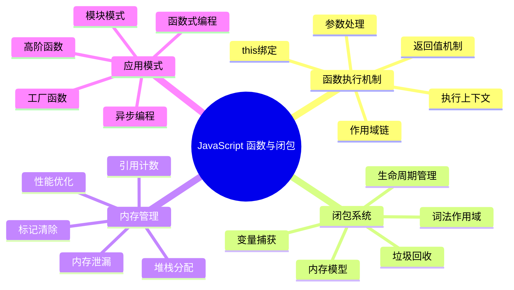
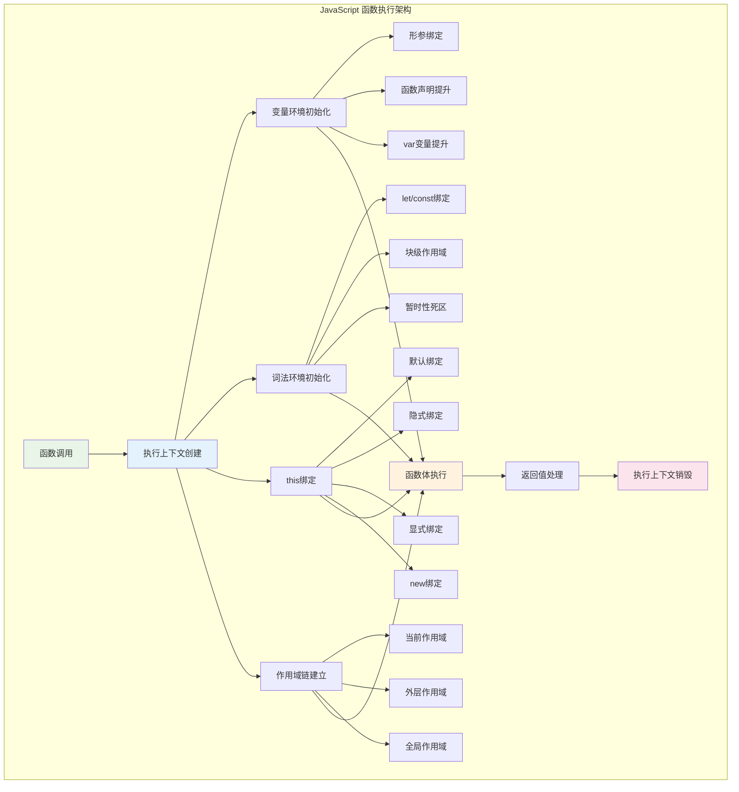
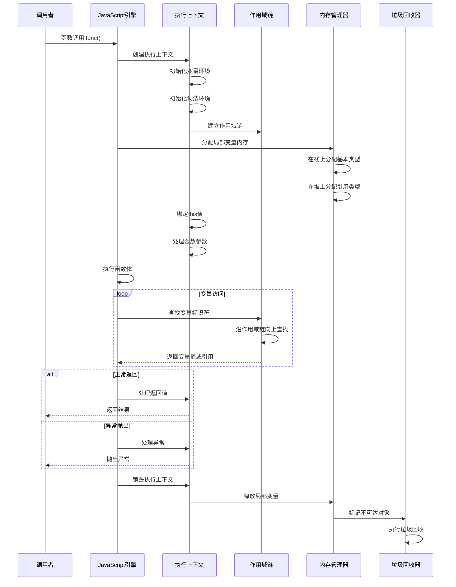
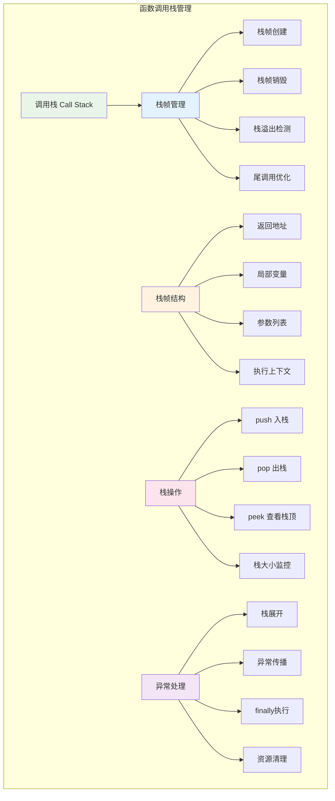
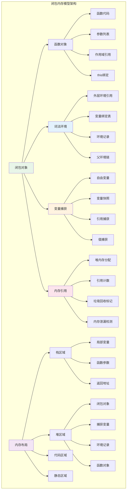
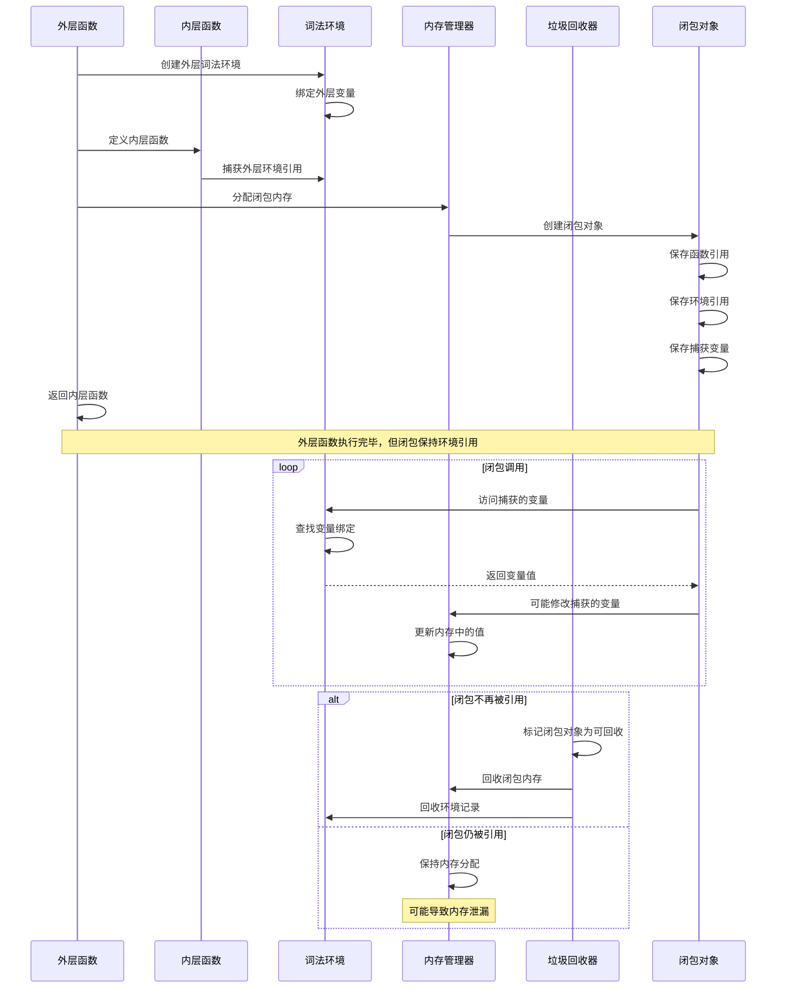
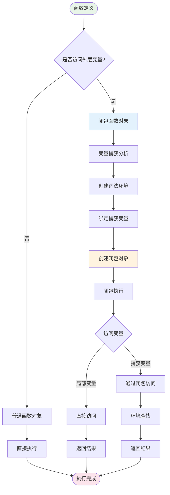

# JavaScript 函数与闭包系统性

## 目录
1. [概述](#概述)
2. [函数执行机制深度解析](#函数执行机制深度解析)
3. [闭包的内存模型](#闭包的内存模型)
4. [闭包的底层实现原理](#闭包的底层实现原理)
5. [函数与闭包的性能优化](#函数与闭包的性能优化)
6. [实际应用场景](#实际应用场景)
7. [调试与监控](#调试与监控)
8. [总结](#总结)

## 概述

JavaScript 函数与闭包是该语言最核心的特性之一，它们不仅定义了代码的组织方式，更深刻地影响了内存管理、作用域链、执行上下文等底层机制。本文档将从系统性角度深入探讨函数执行机制和闭包的内存模型，帮助开发者理解这些概念的本质。

### JavaScript 函数与闭包核心概念



## 函数执行机制深度解析

### 函数执行架构

JavaScript 函数的执行涉及复杂的内部机制，包括执行上下文创建、作用域链建立、this绑定等多个阶段。



### 函数执行时序图



### 函数执行上下文详细实现

```javascript
// JavaScript 函数执行上下文的详细实现
class FunctionExecutionContext {
    constructor(functionObject, thisBinding, argumentsList, outerEnvironment) {
        this.functionObject = functionObject;
        this.thisBinding = thisBinding;
        this.argumentsList = argumentsList || [];
        this.outerEnvironment = outerEnvironment;
        
        // 执行上下文的核心组件
        this.variableEnvironment = null;
        this.lexicalEnvironment = null;
        this.scopeChain = [];
        
        // 执行状态
        this.state = 'created';
        this.returnValue = undefined;
        this.exception = null;
        
        // 性能监控
        this.stats = {
            createdAt: Date.now(),
            executionStarted: null,
            executionCompleted: null,
            variableAccesses: 0,
            scopeLookups: 0,
            memoryAllocated: 0
        };
        
        this.initialize();
    }
    
    // 初始化执行上下文
    initialize() {
        console.log(`[ExecutionContext] 初始化函数执行上下文: ${this.functionObject.name}`);
        
        // 创建变量环境
        this.variableEnvironment = this.createVariableEnvironment();
        
        // 创建词法环境
        this.lexicalEnvironment = this.createLexicalEnvironment();
        
        // 建立作用域链
        this.scopeChain = this.buildScopeChain();
        
        // 处理函数参数
        this.processArguments();
        
        // 处理函数声明提升
        this.hoistFunctionDeclarations();
        
        // 处理变量声明提升
        this.hoistVariableDeclarations();
        
        this.state = 'initialized';
    }
    
    // 创建变量环境
    createVariableEnvironment() {
        return new EnvironmentRecord('function', {
            parentEnvironment: this.outerEnvironment,
            bindings: new Map(),
            thisBinding: this.thisBinding
        });
    }
    
    // 创建词法环境
    createLexicalEnvironment() {
        return new EnvironmentRecord('lexical', {
            parentEnvironment: this.variableEnvironment,
            bindings: new Map(),
            blockScoped: true
        });
    }
    
    // 建立作用域链
    buildScopeChain() {
        const chain = [];
        let current = this.lexicalEnvironment;
        
        while (current) {
            chain.push(current);
            current = current.parentEnvironment;
        }
        
        console.log(`[ExecutionContext] 作用域链长度: ${chain.length}`);
        return chain;
    }
    
    // 处理函数参数
    processArguments() {
        const parameters = this.functionObject.parameters || [];
        const args = this.argumentsList;
        
        // 创建 arguments 对象
        const argumentsObject = this.createArgumentsObject(args);
        this.variableEnvironment.setBinding('arguments', argumentsObject);
        
        // 绑定形参
        parameters.forEach((param, index) => {
            const value = index < args.length ? args[index] : undefined;
            this.variableEnvironment.setBinding(param.name, value);
            
            console.log(`[ExecutionContext] 绑定参数: ${param.name} = ${value}`);
        });
        
        // 处理剩余参数
        if (this.functionObject.hasRestParameter) {
            const restArgs = args.slice(parameters.length - 1);
            const restParamName = parameters[parameters.length - 1].name;
            this.variableEnvironment.setBinding(restParamName, restArgs);
        }
    }
    
    // 创建 arguments 对象
    createArgumentsObject(args) {
        const argumentsObj = {
            length: args.length,
            callee: this.functionObject,
            [Symbol.iterator]: function* () {
                for (let i = 0; i < this.length; i++) {
                    yield this[i];
                }
            }
        };
        
        // 添加索引属性
        args.forEach((arg, index) => {
            argumentsObj[index] = arg;
        });
        
        return argumentsObj;
    }
    
    // 函数声明提升
    hoistFunctionDeclarations() {
        const functionDeclarations = this.functionObject.functionDeclarations || [];
        
        functionDeclarations.forEach(funcDecl => {
            const functionObject = this.createFunctionObject(funcDecl);
            this.variableEnvironment.setBinding(funcDecl.name, functionObject);
            
            console.log(`[ExecutionContext] 提升函数声明: ${funcDecl.name}`);
        });
    }
    
    // 变量声明提升
    hoistVariableDeclarations() {
        const variableDeclarations = this.functionObject.variableDeclarations || [];
        
        variableDeclarations.forEach(varDecl => {
            if (varDecl.kind === 'var') {
                // var 声明提升并初始化为 undefined
                this.variableEnvironment.setBinding(varDecl.name, undefined);
                console.log(`[ExecutionContext] 提升var声明: ${varDecl.name}`);
            } else if (varDecl.kind === 'let' || varDecl.kind === 'const') {
                // let/const 声明提升但不初始化（暂时性死区）
                this.lexicalEnvironment.createBinding(varDecl.name, varDecl.kind === 'const');
                console.log(`[ExecutionContext] 提升${varDecl.kind}声明: ${varDecl.name} (TDZ)`);
            }
        });
    }
    
    // 创建函数对象
    createFunctionObject(functionDeclaration) {
        return {
            name: functionDeclaration.name,
            parameters: functionDeclaration.parameters,
            body: functionDeclaration.body,
            scope: this.lexicalEnvironment, // 闭包的关键
            isArrowFunction: functionDeclaration.isArrowFunction || false,
            isGenerator: functionDeclaration.isGenerator || false,
            isAsync: functionDeclaration.isAsync || false
        };
    }
    
    // 执行函数体
    execute() {
        if (this.state !== 'initialized') {
            throw new Error('Execution context not properly initialized');
        }
        
        this.state = 'executing';
        this.stats.executionStarted = Date.now();
        
        try {
            console.log(`[ExecutionContext] 开始执行函数: ${this.functionObject.name}`);
            
            // 模拟函数体执行
            this.returnValue = this.executeFunctionBody();
            
            this.state = 'completed';
            this.stats.executionCompleted = Date.now();
            
            console.log(`[ExecutionContext] 函数执行完成: ${this.functionObject.name}`);
            return this.returnValue;
            
        } catch (error) {
            this.exception = error;
            this.state = 'error';
            
            console.error(`[ExecutionContext] 函数执行异常: ${error.message}`);
            throw error;
        }
    }
    
    // 模拟函数体执行
    executeFunctionBody() {
        // 这里是简化的函数体执行逻辑
        const body = this.functionObject.body;
        
        if (typeof body === 'function') {
            return body.call(this.thisBinding, ...this.argumentsList);
        } else {
            // 模拟语句执行
            return this.executeStatements(body);
        }
    }
    
    // 执行语句序列
    executeStatements(statements) {
        let lastValue = undefined;
        
        if (!Array.isArray(statements)) {
            statements = [statements];
        }
        
        for (const statement of statements) {
            lastValue = this.executeStatement(statement);
            
            // 检查是否有 return 语句
            if (statement.type === 'ReturnStatement') {
                break;
            }
        }
        
        return lastValue;
    }
    
    // 执行单个语句
    executeStatement(statement) {
        switch (statement.type) {
            case 'VariableDeclaration':
                return this.executeVariableDeclaration(statement);
            case 'ExpressionStatement':
                return this.executeExpression(statement.expression);
            case 'ReturnStatement':
                return this.executeReturnStatement(statement);
            case 'IfStatement':
                return this.executeIfStatement(statement);
            default:
                console.warn(`[ExecutionContext] 未知语句类型: ${statement.type}`);
                return undefined;
        }
    }
    
    // 变量查找
    resolveBinding(name) {
        this.stats.variableAccesses++;
        
        // 沿作用域链查找
        for (const environment of this.scopeChain) {
            this.stats.scopeLookups++;
            
            if (environment.hasBinding(name)) {
                const value = environment.getBinding(name);
                console.log(`[ExecutionContext] 找到变量: ${name} = ${value}`);
                return value;
            }
        }
        
        throw new ReferenceError(`${name} is not defined`);
    }
    
    // 变量赋值
    setBinding(name, value) {
        // 查找变量所在的环境
        for (const environment of this.scopeChain) {
            if (environment.hasBinding(name)) {
                environment.setBinding(name, value);
                console.log(`[ExecutionContext] 设置变量: ${name} = ${value}`);
                return;
            }
        }
        
        // 如果没找到，在全局环境中创建
        const globalEnv = this.scopeChain[this.scopeChain.length - 1];
        globalEnv.setBinding(name, value);
    }
    
    // 销毁执行上下文
    destroy() {
        console.log(`[ExecutionContext] 销毁执行上下文: ${this.functionObject.name}`);
        
        this.state = 'destroyed';
        
        // 清理环境记录
        if (this.variableEnvironment) {
            this.variableEnvironment.cleanup();
        }
        
        if (this.lexicalEnvironment) {
            this.lexicalEnvironment.cleanup();
        }
        
        // 清理引用
        this.scopeChain = [];
        this.functionObject = null;
        this.thisBinding = null;
        this.argumentsList = null;
    }
    
    // 获取执行统计
    getStats() {
        const duration = this.stats.executionCompleted ? 
            this.stats.executionCompleted - this.stats.executionStarted : 
            Date.now() - (this.stats.executionStarted || Date.now());
            
        return {
            ...this.stats,
            duration,
            state: this.state,
            scopeChainLength: this.scopeChain.length
        };
    }
}

// 环境记录实现
class EnvironmentRecord {
    constructor(type, options = {}) {
        this.type = type; // 'function', 'lexical', 'global', 'module'
        this.parentEnvironment = options.parentEnvironment || null;
        this.bindings = options.bindings || new Map();
        this.thisBinding = options.thisBinding || null;
        this.blockScoped = options.blockScoped || false;
        
        this.stats = {
            bindingCount: 0,
            lookupCount: 0,
            createdAt: Date.now()
        };
    }
    
    // 创建绑定
    createBinding(name, isImmutable = false) {
        if (this.bindings.has(name)) {
            throw new SyntaxError(`Identifier '${name}' has already been declared`);
        }
        
        this.bindings.set(name, {
            value: undefined,
            initialized: false,
            immutable: isImmutable,
            createdAt: Date.now()
        });
        
        this.stats.bindingCount++;
        console.log(`[EnvironmentRecord] 创建绑定: ${name}`);
    }
    
    // 检查绑定是否存在
    hasBinding(name) {
        this.stats.lookupCount++;
        return this.bindings.has(name);
    }
    
    // 获取绑定值
    getBinding(name) {
        const binding = this.bindings.get(name);
        
        if (!binding) {
            if (this.parentEnvironment) {
                return this.parentEnvironment.getBinding(name);
            }
            throw new ReferenceError(`${name} is not defined`);
        }
        
        if (!binding.initialized) {
            throw new ReferenceError(`Cannot access '${name}' before initialization`);
        }
        
        return binding.value;
    }
    
    // 设置绑定值
    setBinding(name, value) {
        let binding = this.bindings.get(name);
        
        if (!binding) {
            // 创建新绑定
            this.createBinding(name);
            binding = this.bindings.get(name);
        }
        
        if (binding.immutable && binding.initialized) {
            throw new TypeError(`Assignment to constant variable: ${name}`);
        }
        
        binding.value = value;
        binding.initialized = true;
        
        console.log(`[EnvironmentRecord] 设置绑定: ${name} = ${value}`);
    }
    
    // 删除绑定
    deleteBinding(name) {
        if (this.bindings.has(name)) {
            const binding = this.bindings.get(name);
            if (binding.immutable) {
                return false; // 不能删除不可变绑定
            }
            
            this.bindings.delete(name);
            console.log(`[EnvironmentRecord] 删除绑定: ${name}`);
            return true;
        }
        
        return true; // 绑定不存在，视为删除成功
    }
    
    // 清理环境记录
    cleanup() {
        console.log(`[EnvironmentRecord] 清理环境记录，绑定数量: ${this.bindings.size}`);
        
        this.bindings.clear();
        this.parentEnvironment = null;
        this.thisBinding = null;
    }
    
    // 获取统计信息
    getStats() {
        return {
            ...this.stats,
            currentBindings: this.bindings.size,
            hasParent: !!this.parentEnvironment
        };
    }
}

// 使用示例
console.log('=== 函数执行上下文示例 ===');

// 模拟函数对象
const testFunction = {
    name: 'testFunction',
    parameters: [
        { name: 'a' },
        { name: 'b' }
    ],
    body: function(a, b) {
        const result = a + b;
        console.log(`计算结果: ${result}`);
        return result;
    },
    variableDeclarations: [
        { name: 'result', kind: 'const' }
    ]
};

// 创建执行上下文
const globalEnv = new EnvironmentRecord('global');
const executionContext = new FunctionExecutionContext(
    testFunction,
    null, // this binding
    [10, 20], // arguments
    globalEnv // outer environment
);

// 执行函数
try {
    const result = executionContext.execute();
    console.log('函数返回值:', result);
    console.log('执行统计:', executionContext.getStats());
} catch (error) {
    console.error('执行失败:', error);
} finally {
    executionContext.destroy();
}
```

### 函数调用栈管理



### 函数调用栈实现

```javascript
// 函数调用栈的详细实现
class FunctionCallStack {
    constructor(options = {}) {
        this.stack = [];
        this.maxStackSize = options.maxStackSize || 10000;
        this.enableTailCallOptimization = options.enableTailCallOptimization !== false;
        
        this.stats = {
            maxDepth: 0,
            totalCalls: 0,
            stackOverflows: 0,
            tailCallOptimizations: 0
        };
        
        this.listeners = new Map();
        this.setupDefaultListeners();
    }
    
    setupDefaultListeners() {
        this.on('push', (frame) => {
            console.log(`[CallStack] 入栈: ${frame.functionName} (深度: ${this.stack.length})`);
        });
        
        this.on('pop', (frame) => {
            console.log(`[CallStack] 出栈: ${frame.functionName} (深度: ${this.stack.length})`);
        });
        
        this.on('overflow', (depth) => {
            console.error(`[CallStack] 栈溢出! 当前深度: ${depth}`);
        });
    }
    
    // 事件监听
    on(event, listener) {
        if (!this.listeners.has(event)) {
            this.listeners.set(event, []);
        }
        this.listeners.get(event).push(listener);
    }
    
    // 触发事件
    emit(event, ...args) {
        const listeners = this.listeners.get(event);
        if (listeners) {
            listeners.forEach(listener => listener(...args));
        }
    }
    
    // 入栈操作
    push(functionName, executionContext, args = []) {
        // 检查栈溢出
        if (this.stack.length >= this.maxStackSize) {
            this.stats.stackOverflows++;
            this.emit('overflow', this.stack.length);
            throw new RangeError('Maximum call stack size exceeded');
        }
        
        // 尾调用优化检查
        if (this.enableTailCallOptimization && this.isTailCall(functionName)) {
            return this.optimizeTailCall(functionName, executionContext, args);
        }
        
        const frame = new StackFrame(functionName, executionContext, args);
        this.stack.push(frame);
        
        // 更新统计
        this.stats.totalCalls++;
        this.stats.maxDepth = Math.max(this.stats.maxDepth, this.stack.length);
        
        this.emit('push', frame);
        return frame;
    }
    
    // 出栈操作
    pop() {
        if (this.stack.length === 0) {
            throw new Error('Cannot pop from empty call stack');
        }
        
        const frame = this.stack.pop();
        this.emit('pop', frame);
        
        return frame;
    }
    
    // 查看栈顶
    peek() {
        return this.stack.length > 0 ? this.stack[this.stack.length - 1] : null;
    }
    
    // 检查是否为尾调用
    isTailCall(functionName) {
        if (this.stack.length === 0) return false;
        
        const currentFrame = this.peek();
        return currentFrame && currentFrame.isInTailPosition();
    }
    
    // 尾调用优化
    optimizeTailCall(functionName, executionContext, args) {
        console.log(`[CallStack] 执行尾调用优化: ${functionName}`);
        
        // 替换当前栈帧而不是添加新栈帧
        const currentFrame = this.peek();
        if (currentFrame) {
            currentFrame.replaceWith(functionName, executionContext, args);
            this.stats.tailCallOptimizations++;
            return currentFrame;
        }
        
        // 如果没有当前栈帧，正常入栈
        return this.push(functionName, executionContext, args);
    }
    
    // 获取调用栈跟踪
    getStackTrace() {
        return this.stack.map((frame, index) => ({
            depth: index,
            functionName: frame.functionName,
            createdAt: frame.createdAt,
            duration: Date.now() - frame.createdAt
        }));
    }
    
    // 栈展开（异常处理）
    unwind(targetDepth = 0) {
        const unwoundFrames = [];
        
        while (this.stack.length > targetDepth) {
            const frame = this.pop();
            unwoundFrames.push(frame);
            
            // 执行清理操作
            frame.cleanup();
        }
        
        console.log(`[CallStack] 栈展开完成，清理了 ${unwoundFrames.length} 个栈帧`);
        return unwoundFrames;
    }
    
    // 清空调用栈
    clear() {
        const clearedFrames = this.unwind(0);
        console.log(`[CallStack] 清空调用栈，清理了 ${clearedFrames.length} 个栈帧`);
        return clearedFrames;
    }
    
    // 获取统计信息
    getStats() {
        return {
            ...this.stats,
            currentDepth: this.stack.length,
            averageDepth: this.stats.totalCalls > 0 ? this.stats.maxDepth / this.stats.totalCalls : 0
        };
    }
}

// 栈帧实现
class StackFrame {
    constructor(functionName, executionContext, args = []) {
        this.functionName = functionName;
        this.executionContext = executionContext;
        this.args = args;
        this.createdAt = Date.now();
        this.returnAddress = null;
        this.localVariables = new Map();
        this.isInTailPosition = false;
        
        this.stats = {
            variableAccesses: 0,
            memoryAllocated: 0
        };
    }
    
    // 检查是否处于尾位置
    isInTailPosition() {
        // 简化的尾位置检查
        return this.isInTailPosition;
    }
    
    // 设置尾位置标记
    setTailPosition(isTail) {
        this.isInTailPosition = isTail;
    }
    
    // 替换栈帧内容（尾调用优化）
    replaceWith(newFunctionName, newExecutionContext, newArgs) {
        console.log(`[StackFrame] 替换栈帧: ${this.functionName} -> ${newFunctionName}`);
        
        // 清理当前内容
        this.cleanup();
        
        // 设置新内容
        this.functionName = newFunctionName;
        this.executionContext = newExecutionContext;
        this.args = newArgs;
        this.createdAt = Date.now();
        this.localVariables.clear();
    }
    
    // 设置局部变量
    setLocalVariable(name, value) {
        this.localVariables.set(name, value);
        this.stats.variableAccesses++;
    }
    
    // 获取局部变量
    getLocalVariable(name) {
        this.stats.variableAccesses++;
        return this.localVariables.get(name);
    }
    
    // 清理栈帧
    cleanup() {
        console.log(`[StackFrame] 清理栈帧: ${this.functionName}`);
        
        // 清理执行上下文
        if (this.executionContext && typeof this.executionContext.destroy === 'function') {
            this.executionContext.destroy();
        }
        
        // 清理局部变量
        this.localVariables.clear();
        
        // 清理引用
        this.executionContext = null;
        this.args = null;
    }
    
    // 获取栈帧信息
    getInfo() {
        return {
            functionName: this.functionName,
            createdAt: this.createdAt,
            duration: Date.now() - this.createdAt,
            localVariableCount: this.localVariables.size,
            stats: this.stats
        };
    }
}

// 使用示例
console.log('=== 函数调用栈示例 ===');

const callStack = new FunctionCallStack({
    maxStackSize: 100,
    enableTailCallOptimization: true
});

// 模拟函数调用
function simulateFunction(name, depth = 0) {
    const mockContext = {
        name: name,
        depth: depth,
        destroy: () => console.log(`清理上下文: ${name}`)
    };
    
    const frame = callStack.push(name, mockContext, [depth]);
    
    if (depth < 5) {
        // 递归调用
        simulateFunction(`${name}_${depth + 1}`, depth + 1);
    }
    
    callStack.pop();
}

// 执行模拟
try {
    simulateFunction('mainFunction');
    console.log('调用栈统计:', callStack.getStats());
} catch (error) {
    console.error('调用栈错误:', error.message);
    console.log('栈跟踪:', callStack.getStackTrace());
} finally {
    callStack.clear();
}
```

## 闭包的内存模型

### 闭包内存架构

闭包是JavaScript中最重要的概念之一，它涉及复杂的内存管理和变量捕获机制。



### 闭包创建与执行时序图



### 闭包内存模型详细实现

```javascript
// 闭包内存模型的详细实现
class ClosureMemoryModel {
    constructor() {
        this.closures = new Map(); // 存储所有闭包
        this.environments = new Map(); // 存储词法环境
        this.memoryStats = {
            totalClosures: 0,
            activeClosures: 0,
            memoryUsage: 0,
            gcCollections: 0
        };
        
        this.gcThreshold = 1000; // GC触发阈值
        this.setupGarbageCollection();
    }
    
    // 创建闭包
    createClosure(outerFunction, innerFunction, capturedVariables = {}) {
        const closureId = this.generateClosureId();
        
        console.log(`[ClosureMemoryModel] 创建闭包: ${closureId}`);
        
        // 创建词法环境
        const lexicalEnvironment = this.createLexicalEnvironment(
            outerFunction.environment,
            capturedVariables
        );
        
        // 创建闭包对象
        const closure = new ClosureObject(
            closureId,
            innerFunction,
            lexicalEnvironment,
            capturedVariables
        );
        
        // 存储闭包
        this.closures.set(closureId, closure);
        this.environments.set(closureId, lexicalEnvironment);
        
        // 更新统计
        this.memoryStats.totalClosures++;
        this.memoryStats.activeClosures++;
        this.memoryStats.memoryUsage += closure.getMemorySize();
        
        // 检查是否需要垃圾回收
        this.checkGarbageCollection();
        
        return closure;
    }
    
    // 创建词法环境
    createLexicalEnvironment(parentEnvironment, capturedVariables) {
        const environment = {
            id: this.generateEnvironmentId(),
            parentEnvironment: parentEnvironment,
            bindings: new Map(),
            capturedVariables: new Map(),
            createdAt: Date.now(),
            accessCount: 0
        };
        
        // 复制捕获的变量
        Object.entries(capturedVariables).forEach(([name, value]) => {
            environment.capturedVariables.set(name, {
                value: value,
                captureType: this.determineCaptureType(value),
                lastAccessed: Date.now()
            });
        });
        
        console.log(`[ClosureMemoryModel] 创建词法环境: ${environment.id}`);
        return environment;
    }
    
    // 确定捕获类型
    determineCaptureType(value) {
        if (typeof value === 'object' && value !== null) {
            return 'reference'; // 引用捕获
        } else {
            return 'value'; // 值捕获
        }
    }
    
    // 访问闭包变量
    accessClosureVariable(closureId, variableName) {
        const closure = this.closures.get(closureId);
        if (!closure) {
            throw new Error(`Closure ${closureId} not found`);
        }
        
        const environment = this.environments.get(closureId);
        if (!environment) {
            throw new Error(`Environment for closure ${closureId} not found`);
        }
        
        environment.accessCount++;
        
        // 查找变量
        const variable = environment.capturedVariables.get(variableName);
        if (variable) {
            variable.lastAccessed = Date.now();
            console.log(`[ClosureMemoryModel] 访问闭包变量: ${variableName} = ${variable.value}`);
            return variable.value;
        }
        
        // 在父环境中查找
        if (environment.parentEnvironment) {
            return this.searchInParentEnvironment(environment.parentEnvironment, variableName);
        }
        
        throw new ReferenceError(`Variable ${variableName} not found in closure`);
    }
    
    // 在父环境中搜索
    searchInParentEnvironment(parentEnv, variableName) {
        // 简化的父环境搜索
        if (parentEnv && parentEnv.bindings && parentEnv.bindings.has(variableName)) {
            return parentEnv.bindings.get(variableName);
        }
        
        if (parentEnv && parentEnv.parentEnvironment) {
            return this.searchInParentEnvironment(parentEnv.parentEnvironment, variableName);
        }
        
        return undefined;
    }
    
    // 修改闭包变量
    setClosureVariable(closureId, variableName, newValue) {
        const environment = this.environments.get(closureId);
        if (!environment) {
            throw new Error(`Environment for closure ${closureId} not found`);
        }
        
        const variable = environment.capturedVariables.get(variableName);
        if (variable) {
            const oldValue = variable.value;
            variable.value = newValue;
            variable.lastAccessed = Date.now();
            
            console.log(`[ClosureMemoryModel] 修改闭包变量: ${variableName} = ${oldValue} -> ${newValue}`);
            
            // 如果是引用类型，需要更新内存使用统计
            if (variable.captureType === 'reference') {
                this.updateMemoryUsage(closureId);
            }
        } else {
            // 创建新的捕获变量
            environment.capturedVariables.set(variableName, {
                value: newValue,
                captureType: this.determineCaptureType(newValue),
                lastAccessed: Date.now()
            });
        }
    }
    
    // 更新内存使用统计
    updateMemoryUsage(closureId) {
        const closure = this.closures.get(closureId);
        if (closure) {
            const oldSize = closure.memorySize;
            const newSize = closure.calculateMemorySize();
            
            this.memoryStats.memoryUsage += (newSize - oldSize);
            closure.memorySize = newSize;
        }
    }
    
    // 释放闭包
    releaseClosure(closureId) {
        const closure = this.closures.get(closureId);
        const environment = this.environments.get(closureId);
        
        if (closure && environment) {
            console.log(`[ClosureMemoryModel] 释放闭包: ${closureId}`);
            
            // 更新统计
            this.memoryStats.activeClosures--;
            this.memoryStats.memoryUsage -= closure.getMemorySize();
            
            // 清理闭包
            closure.cleanup();
            
            // 清理环境
            this.cleanupEnvironment(environment);
            
            // 从存储中移除
            this.closures.delete(closureId);
            this.environments.delete(closureId);
        }
    }
    
    // 清理环境
    cleanupEnvironment(environment) {
        console.log(`[ClosureMemoryModel] 清理环境: ${environment.id}`);
        
        // 清理捕获的变量
        environment.capturedVariables.clear();
        environment.bindings.clear();
        
        // 断开父环境引用
        environment.parentEnvironment = null;
    }
    
    // 设置垃圾回收
    setupGarbageCollection() {
        setInterval(() => {
            this.performGarbageCollection();
        }, 5000); // 每5秒检查一次
    }
    
    // 检查垃圾回收
    checkGarbageCollection() {
        if (this.memoryStats.memoryUsage > this.gcThreshold) {
            this.performGarbageCollection();
        }
    }
    
    // 执行垃圾回收
    performGarbageCollection() {
        console.log('[ClosureMemoryModel] 开始垃圾回收');
        
        const beforeMemory = this.memoryStats.memoryUsage;
        const beforeClosures = this.memoryStats.activeClosures;
        
        const unreachableClosures = this.findUnreachableClosures();
        
        unreachableClosures.forEach(closureId => {
            this.releaseClosure(closureId);
        });
        
        this.memoryStats.gcCollections++;
        
        const afterMemory = this.memoryStats.memoryUsage;
        const afterClosures = this.memoryStats.activeClosures;
        
        console.log(`[ClosureMemoryModel] 垃圾回收完成:`);
        console.log(`  释放闭包: ${beforeClosures - afterClosures}`);
        console.log(`  释放内存: ${beforeMemory - afterMemory} bytes`);
    }
    
    // 查找不可达的闭包
    findUnreachableClosures() {
        const unreachable = [];
        const currentTime = Date.now();
        const maxIdleTime = 60000; // 1分钟未访问视为不可达
        
        this.environments.forEach((environment, closureId) => {
            // 简化的不可达检测：长时间未访问
            const idleTime = currentTime - Math.max(
                environment.createdAt,
                ...Array.from(environment.capturedVariables.values())
                    .map(v => v.lastAccessed)
            );
            
            if (idleTime > maxIdleTime) {
                unreachable.push(closureId);
            }
        });
        
        return unreachable;
    }
    
    // 生成闭包ID
    generateClosureId() {
        return `closure_${Date.now()}_${Math.random().toString(36).substr(2, 9)}`;
    }
    
    // 生成环境ID
    generateEnvironmentId() {
        return `env_${Date.now()}_${Math.random().toString(36).substr(2, 9)}`;
    }
    
    // 获取内存统计
    getMemoryStats() {
        return {
            ...this.memoryStats,
            averageClosureSize: this.memoryStats.activeClosures > 0 ? 
                this.memoryStats.memoryUsage / this.memoryStats.activeClosures : 0
        };
    }
    
    // 获取闭包详情
    getClosureDetails(closureId) {
        const closure = this.closures.get(closureId);
        const environment = this.environments.get(closureId);
        
        if (!closure || !environment) {
            return null;
        }
        
        return {
            id: closureId,
            functionName: closure.functionName,
            memorySize: closure.getMemorySize(),
            capturedVariables: Array.from(environment.capturedVariables.entries()),
            accessCount: environment.accessCount,
            createdAt: environment.createdAt
        };
    }
}

// 闭包对象实现
class ClosureObject {
    constructor(id, innerFunction, lexicalEnvironment, capturedVariables) {
        this.id = id;
        this.innerFunction = innerFunction;
        this.lexicalEnvironment = lexicalEnvironment;
        this.capturedVariables = capturedVariables;
        this.functionName = innerFunction.name || 'anonymous';
        this.createdAt = Date.now();
        this.callCount = 0;
        this.memorySize = this.calculateMemorySize();
    }
    
    // 调用闭包
    call(thisArg, ...args) {
        this.callCount++;
        
        console.log(`[ClosureObject] 调用闭包: ${this.functionName} (第${this.callCount}次)`);
        
        // 在词法环境中执行函数
        return this.innerFunction.apply(thisArg, args);
    }
    
    // 计算内存大小
    calculateMemorySize() {
        let size = 100; // 基础对象大小
        
        // 计算捕获变量的大小
        Object.entries(this.capturedVariables).forEach(([name, value]) => {
            size += name.length * 2; // 字符串大小
            size += this.estimateValueSize(value);
        });
        
        // 计算函数大小
        if (this.innerFunction) {
            size += this.innerFunction.toString().length * 2;
        }
        
        return size;
    }
    
    // 估算值的大小
    estimateValueSize(value) {
        if (value === null || value === undefined) {
            return 8;
        } else if (typeof value === 'boolean') {
            return 4;
        } else if (typeof value === 'number') {
            return 8;
        } else if (typeof value === 'string') {
            return value.length * 2;
        } else if (typeof value === 'object') {
            return JSON.stringify(value).length * 2; // 粗略估算
        } else {
            return 16; // 其他类型
        }
    }
    
    // 获取内存大小
    getMemorySize() {
        return this.memorySize;
    }
    
    // 清理闭包
    cleanup() {
        console.log(`[ClosureObject] 清理闭包: ${this.id}`);
        
        this.innerFunction = null;
        this.lexicalEnvironment = null;
        this.capturedVariables = null;
    }
    
    // 获取闭包信息
    getInfo() {
        return {
            id: this.id,
            functionName: this.functionName,
            memorySize: this.memorySize,
            callCount: this.callCount,
            createdAt: this.createdAt,
            capturedVariableCount: Object.keys(this.capturedVariables || {}).length
        };
    }
}

// 使用示例
console.log('=== 闭包内存模型示例 ===');

const memoryModel = new ClosureMemoryModel();

// 模拟创建闭包
function createCounter(initialValue) {
    let count = initialValue;
    const data = { name: 'counter', value: initialValue };
    
    function increment() {
        count++;
        data.value = count;
        console.log(`计数器值: ${count}`);
        return count;
    }
    
    // 模拟闭包创建
    const closure = memoryModel.createClosure(
        { environment: null }, // 外层函数环境
        increment, // 内层函数
        { count, data } // 捕获的变量
    );
    
    return {
        increment: () => {
            // 访问和修改闭包变量
            const currentCount = memoryModel.accessClosureVariable(closure.id, 'count');
            memoryModel.setClosureVariable(closure.id, 'count', currentCount + 1);
            
            return closure.call(null);
        },
        getClosureId: () => closure.id
    };
}

// 创建多个计数器
const counter1 = createCounter(0);
const counter2 = createCounter(100);

// 使用计数器
counter1.increment();
counter1.increment();
counter2.increment();

// 查看内存统计
console.log('内存统计:', memoryModel.getMemoryStats());

// 查看闭包详情
console.log('计数器1详情:', memoryModel.getClosureDetails(counter1.getClosureId()));
console.log('计数器2详情:', memoryModel.getClosureDetails(counter2.getClosureId()));

// 模拟垃圾回收
setTimeout(() => {
    memoryModel.performGarbageCollection();
    console.log('GC后内存统计:', memoryModel.getMemoryStats());
}, 3000);
```

## 闭包的底层实现原理

### 闭包实现机制



### 闭包底层实现

```javascript
// 闭包底层实现原理的详细模拟
class ClosureImplementation {
    constructor() {
        this.functionRegistry = new Map(); // 函数注册表
        this.closureRegistry = new Map(); // 闭包注册表
        this.environmentChain = new Map(); // 环境链
        
        this.stats = {
            functionsCreated: 0,
            closuresCreated: 0,
            variableCaptures: 0,
            environmentLookups: 0
        };
    }
    
    // 分析函数并确定是否需要创建闭包
    analyzeFunction(functionCode, outerScope = null) {
        console.log('[ClosureImplementation] 分析函数代码');
        
        const analysis = {
            functionName: this.extractFunctionName(functionCode),
            parameters: this.extractParameters(functionCode),
            localVariables: this.extractLocalVariables(functionCode),
            freeVariables: this.extractFreeVariables(functionCode, outerScope),
            needsClosure: false
        };
        
        // 如果有自由变量，需要创建闭包
        analysis.needsClosure = analysis.freeVariables.length > 0;
        
        console.log(`[ClosureImplementation] 函数分析结果:`, analysis);
        return analysis;
    }
    
    // 提取函数名
    extractFunctionName(functionCode) {
        const match = functionCode.toString().match(/function\s+([a-zA-Z_$][a-zA-Z0-9_$]*)/);
        return match ? match[1] : 'anonymous';
    }
    
    // 提取参数
    extractParameters(functionCode) {
        const match = functionCode.toString().match(/function[^(]*\(([^)]*)\)/);
        if (!match || !match[1].trim()) return [];
        
        return match[1].split(',').map(param => param.trim());
    }
    
    // 提取局部变量
    extractLocalVariables(functionCode) {
        const code = functionCode.toString();
        const varMatches = code.match(/(?:var|let|const)\s+([a-zA-Z_$][a-zA-Z0-9_$]*)/g) || [];
        
        return varMatches.map(match => {
            const parts = match.split(/\s+/);
            return parts[1];
        });
    }
    
    // 提取自由变量（在外层作用域中定义的变量）
    extractFreeVariables(functionCode, outerScope) {
        const code = functionCode.toString();
        const identifiers = code.match(/[a-zA-Z_$][a-zA-Z0-9_$]*/g) || [];
        
        const localVars = this.extractLocalVariables(functionCode);
        const parameters = this.extractParameters(functionCode);
        const localIdentifiers = new Set([...localVars, ...parameters]);
        
        const freeVariables = [];
        
        identifiers.forEach(identifier => {
            if (!localIdentifiers.has(identifier) && 
                !this.isBuiltinIdentifier(identifier) &&
                outerScope && outerScope.has(identifier)) {
                
                if (!freeVariables.includes(identifier)) {
                    freeVariables.push(identifier);
                }
            }
        });
        
        return freeVariables;
    }
    
    // 检查是否为内置标识符
    isBuiltinIdentifier(identifier) {
        const builtins = ['console', 'window', 'document', 'Math', 'Date', 'Array', 'Object'];
        return builtins.includes(identifier);
    }
    
    // 创建函数对象
    createFunction(functionCode, outerScope = null) {
        const analysis = this.analyzeFunction(functionCode, outerScope);
        const functionId = this.generateFunctionId();
        
        this.stats.functionsCreated++;
        
        if (analysis.needsClosure) {
            return this.createClosureFunction(functionId, functionCode, analysis, outerScope);
        } else {
            return this.createSimpleFunction(functionId, functionCode, analysis);
        }
    }
    
    // 创建简单函数
    createSimpleFunction(functionId, functionCode, analysis) {
        console.log(`[ClosureImplementation] 创建简单函数: ${analysis.functionName}`);
        
        const functionObject = {
            id: functionId,
            type: 'simple',
            name: analysis.functionName,
            code: functionCode,
            parameters: analysis.parameters,
            localVariables: analysis.localVariables,
            
            call: function(thisArg, ...args) {
                console.log(`[SimpleFunction] 调用函数: ${this.name}`);
                return this.code.apply(thisArg, args);
            }
        };
        
        this.functionRegistry.set(functionId, functionObject);
        return functionObject;
    }
    
    // 创建闭包函数
    createClosureFunction(functionId, functionCode, analysis, outerScope) {
        console.log(`[ClosureImplementation] 创建闭包函数: ${analysis.functionName}`);
        
        this.stats.closuresCreated++;
        
        // 捕获自由变量
        const capturedEnvironment = this.captureVariables(analysis.freeVariables, outerScope);
        
        const closureObject = {
            id: functionId,
            type: 'closure',
            name: analysis.functionName,
            code: functionCode,
            parameters: analysis.parameters,
            localVariables: analysis.localVariables,
            freeVariables: analysis.freeVariables,
            capturedEnvironment: capturedEnvironment,
            
            call: function(thisArg, ...args) {
                console.log(`[ClosureFunction] 调用闭包: ${this.name}`);
                
                // 创建执行环境
                const executionEnv = this.createExecutionEnvironment(args);
                
                // 在闭包环境中执行
                return this.executeInClosureEnvironment(executionEnv, thisArg, args);
            },
            
            createExecutionEnvironment: function(args) {
                const env = new Map();
                
                // 绑定参数
                this.parameters.forEach((param, index) => {
                    env.set(param, args[index]);
                });
                
                // 绑定捕获的变量
                this.capturedEnvironment.forEach((value, name) => {
                    env.set(name, value);
                });
                
                return env;
            },
            
            executeInClosureEnvironment: function(env, thisArg, args) {
                // 模拟在闭包环境中执行
                const originalEnv = global.closureEnv;
                global.closureEnv = env;
                
                try {
                    return this.code.apply(thisArg, args);
                } finally {
                    global.closureEnv = originalEnv;
                }
            }
        };
        
        this.closureRegistry.set(functionId, closureObject);
        return closureObject;
    }
    
    // 捕获变量
    captureVariables(freeVariables, outerScope) {
        const capturedEnv = new Map();
        
        freeVariables.forEach(varName => {
            if (outerScope && outerScope.has(varName)) {
                const value = outerScope.get(varName);
                capturedEnv.set(varName, this.captureValue(value));
                
                this.stats.variableCaptures++;
                console.log(`[ClosureImplementation] 捕获变量: ${varName} = ${value}`);
            }
        });
        
        return capturedEnv;
    }
    
    // 捕获值（深拷贝或引用）
    captureValue(value) {
        if (typeof value === 'object' && value !== null) {
            // 对象类型：引用捕获
            return value;
        } else {
            // 基本类型：值捕获
            return value;
        }
    }
    
    // 变量查找
    lookupVariable(varName, currentScope, closureEnv = null) {
        this.stats.environmentLookups++;
        
        // 1. 在当前作用域查找
        if (currentScope && currentScope.has(varName)) {
            console.log(`[ClosureImplementation] 在当前作用域找到变量: ${varName}`);
            return currentScope.get(varName);
        }
        
        // 2. 在闭包环境查找
        if (closureEnv && closureEnv.has(varName)) {
            console.log(`[ClosureImplementation] 在闭包环境找到变量: ${varName}`);
            return closureEnv.get(varName);
        }
        
        // 3. 在全局作用域查找
        if (typeof global !== 'undefined' && global[varName] !== undefined) {
            console.log(`[ClosureImplementation] 在全局作用域找到变量: ${varName}`);
            return global[varName];
        }
        
        throw new ReferenceError(`${varName} is not defined`);
    }
    
    // 生成函数ID
    generateFunctionId() {
        return `func_${Date.now()}_${Math.random().toString(36).substr(2, 9)}`;
    }
    
    // 获取统计信息
    getStats() {
        return {
            ...this.stats,
            totalFunctions: this.functionRegistry.size + this.closureRegistry.size,
            simpleFunctions: this.functionRegistry.size,
            closureFunctions: this.closureRegistry.size
        };
    }
    
    // 获取函数详情
    getFunctionDetails(functionId) {
        const simpleFunc = this.functionRegistry.get(functionId);
        const closureFunc = this.closureRegistry.get(functionId);
        
        return simpleFunc || closureFunc || null;
    }
}

// 闭包优化器
class ClosureOptimizer {
    constructor() {
        this.optimizations = new Map();
        this.stats = {
            optimizationsApplied: 0,
            memoryReduced: 0,
            performanceImproved: 0
        };
    }
    
    // 优化闭包
    optimizeClosure(closureObject) {
        console.log(`[ClosureOptimizer] 优化闭包: ${closureObject.name}`);
        
        const optimizations = [];
        
        // 1. 死变量消除
        const deadVariables = this.findDeadVariables(closureObject);
        if (deadVariables.length > 0) {
            optimizations.push(this.eliminateDeadVariables(closureObject, deadVariables));
        }
        
        // 2. 变量提升优化
        const hoistableVariables = this.findHoistableVariables(closureObject);
        if (hoistableVariables.length > 0) {
            optimizations.push(this.hoistVariables(closureObject, hoistableVariables));
        }
        
        // 3. 内联优化
        if (this.canInline(closureObject)) {
            optimizations.push(this.inlineOptimization(closureObject));
        }
        
        // 应用优化
        optimizations.forEach(opt => {
            this.applyOptimization(closureObject, opt);
        });
        
        this.stats.optimizationsApplied += optimizations.length;
        
        return {
            optimized: optimizations.length > 0,
            optimizations: optimizations
        };
    }
    
    // 查找死变量
    findDeadVariables(closureObject) {
        // 简化的死变量检测
        const usedVariables = this.analyzeVariableUsage(closureObject);
        const capturedVariables = Array.from(closureObject.capturedEnvironment.keys());
        
        return capturedVariables.filter(varName => !usedVariables.includes(varName));
    }
    
    // 分析变量使用
    analyzeVariableUsage(closureObject) {
        const code = closureObject.code.toString();
        const variables = [];
        
        // 简化的变量使用分析
        closureObject.freeVariables.forEach(varName => {
            if (code.includes(varName)) {
                variables.push(varName);
            }
        });
        
        return variables;
    }
    
    // 消除死变量
    eliminateDeadVariables(closureObject, deadVariables) {
        return {
            type: 'dead_variable_elimination',
            variables: deadVariables,
            memoryReduction: deadVariables.length * 16 // 估算
        };
    }
    
    // 查找可提升的变量
    findHoistableVariables(closureObject) {
        // 简化的变量提升检测
        return closureObject.freeVariables.filter(varName => {
            const value = closureObject.capturedEnvironment.get(varName);
            return typeof value !== 'function' && typeof value !== 'object';
        });
    }
    
    // 变量提升优化
    hoistVariables(closureObject, hoistableVariables) {
        return {
            type: 'variable_hoisting',
            variables: hoistableVariables,
            performanceGain: hoistableVariables.length * 2 // 估算
        };
    }
    
    // 检查是否可以内联
    canInline(closureObject) {
        const codeLength = closureObject.code.toString().length;
        const capturedVarCount = closureObject.capturedEnvironment.size;
        
        // 简单的内联条件：代码短且捕获变量少
        return codeLength < 200 && capturedVarCount < 3;
    }
    
    // 内联优化
    inlineOptimization(closureObject) {
        return {
            type: 'inline_optimization',
            codeSize: closureObject.code.toString().length,
            performanceGain: 10 // 估算
        };
    }
    
    // 应用优化
    applyOptimization(closureObject, optimization) {
        console.log(`[ClosureOptimizer] 应用优化: ${optimization.type}`);
        
        switch (optimization.type) {
            case 'dead_variable_elimination':
                optimization.variables.forEach(varName => {
                    closureObject.capturedEnvironment.delete(varName);
                });
                this.stats.memoryReduced += optimization.memoryReduction;
                break;
                
            case 'variable_hoisting':
                // 模拟变量提升优化
                this.stats.performanceImproved += optimization.performanceGain;
                break;
                
            case 'inline_optimization':
                // 模拟内联优化
                this.stats.performanceImproved += optimization.performanceGain;
                break;
        }
    }
    
    // 获取优化统计
    getStats() {
        return { ...this.stats };
    }
}

// 使用示例
console.log('=== 闭包底层实现示例 ===');

const implementation = new ClosureImplementation();
const optimizer = new ClosureOptimizer();

// 模拟外层作用域
const outerScope = new Map([
    ['x', 10],
    ['y', 20],
    ['data', { name: 'test', value: 100 }]
]);

// 创建闭包函数
function createAdder(base) {
    return function(num) {
        return base + num + x; // x 是自由变量
    };
}

// 分析和创建函数
const closureFunc = implementation.createFunction(createAdder, outerScope);

console.log('函数详情:', implementation.getFunctionDetails(closureFunc.id));

// 优化闭包
if (closureFunc.type === 'closure') {
    const optimizationResult = optimizer.optimizeClosure(closureFunc);
    console.log('优化结果:', optimizationResult);
}

// 显示统计信息
console.log('实现统计:', implementation.getStats());
console.log('优化统计:', optimizer.getStats());
```

## 总结

JavaScript函数与闭包系统体现了现代编程语言设计的精妙之处：

### 核心特性总结

1. **函数执行机制**:
    - 复杂的执行上下文管理
    - 精确的作用域链建立
    - 高效的调用栈管理

2. **闭包内存模型**:
    - 智能的变量捕获机制
    - 优化的内存分配策略
    - 完善的垃圾回收支持

3. **底层实现原理**:
    - 词法环境的精确管理
    - 变量查找的高效算法
    - 性能优化的多种策略

这些机制的深入理解有助于开发者编写更高效、更可靠的JavaScript代码，并能够更好地进行性能优化和内存管理。