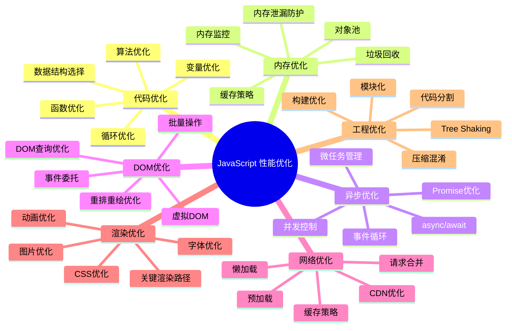
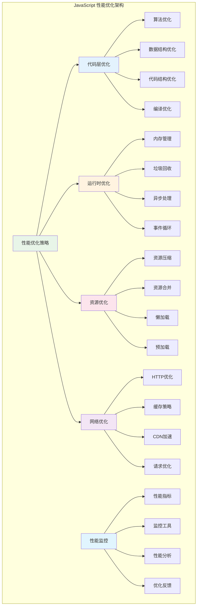
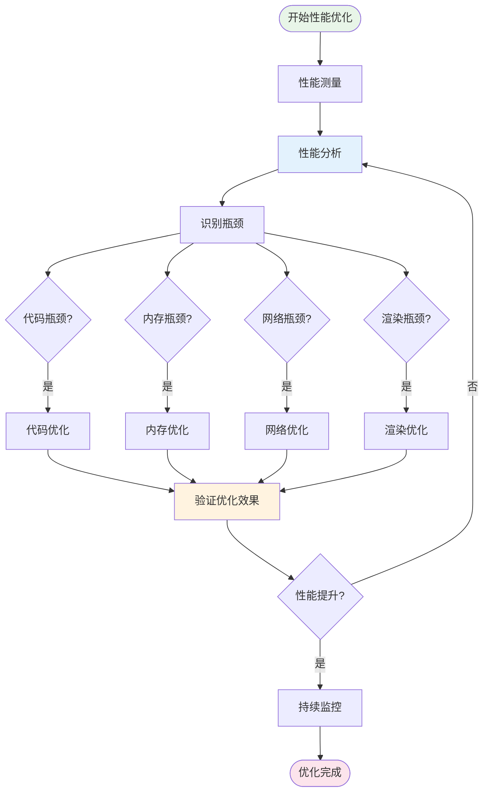
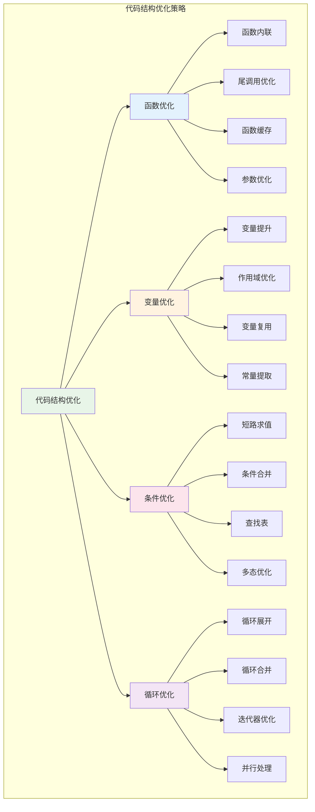
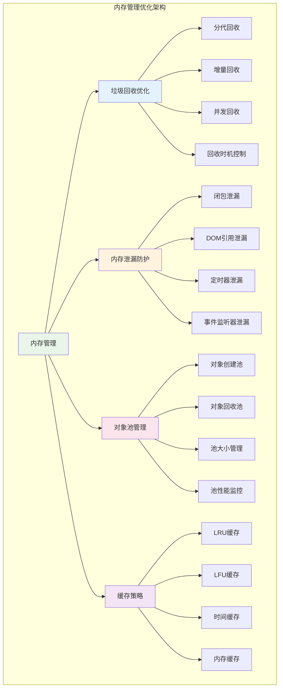
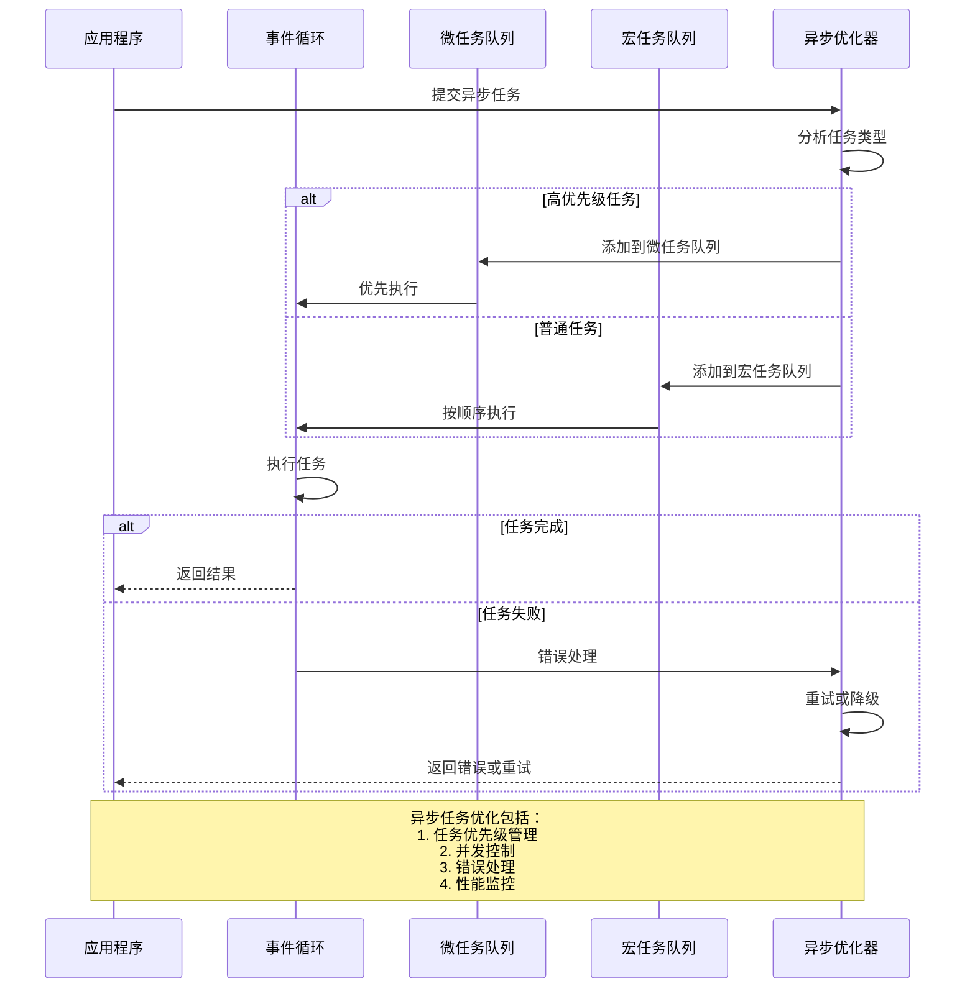
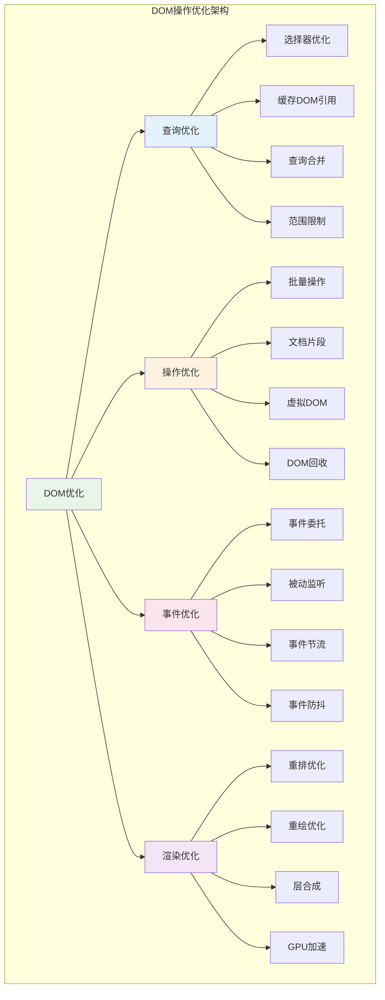
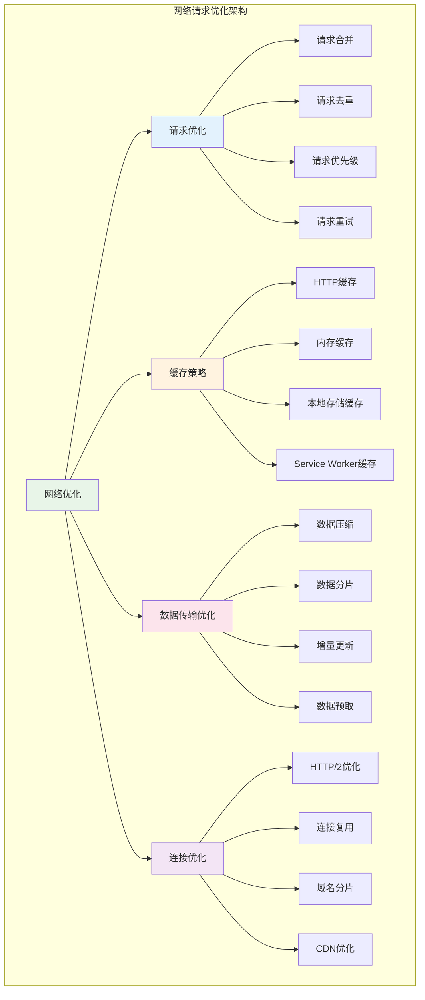
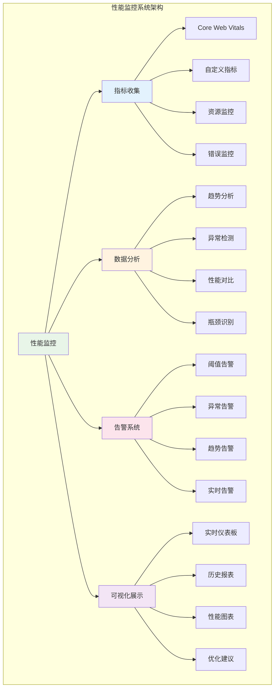
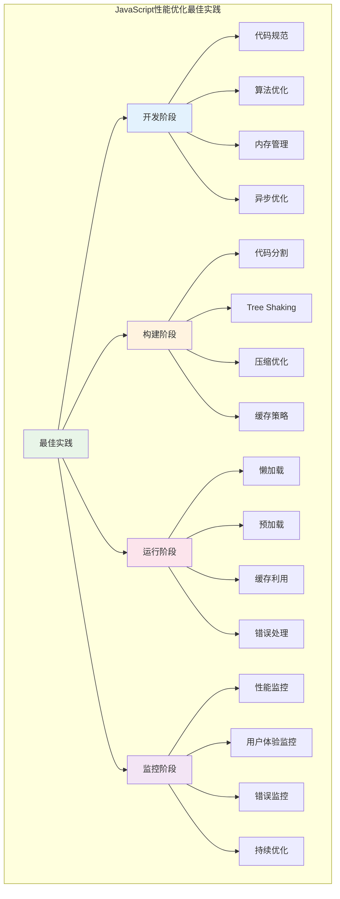

# JavaScript 性能优化

## 目录
1. [概述](#概述)
2. [性能优化基础理论](#性能优化基础理论)
3. [代码层面优化](#代码层面优化)
4. [内存管理优化](#内存管理优化)
5. [异步编程优化](#异步编程优化)
6. [DOM操作优化](#dom操作优化)
7. [网络请求优化](#网络请求优化)
8. [渲染性能优化](#渲染性能优化)
9. [打包和部署优化](#打包和部署优化)
10. [性能监控与调试](#性能监控与调试)
11. [最佳实践总结](#最佳实践总结)

## 概述

JavaScript性能优化是现代Web开发中的关键技能，涉及代码执行效率、内存使用、网络传输、渲染性能等多个维度。本文档将系统性地介绍JavaScript性能优化的理论基础、实践方法和监控技术。

### JavaScript性能优化全景图



## 性能优化基础理论

### 性能优化架构



### 性能优化流程



## 代码层面优化

### 算法和数据结构优化

```javascript
// 性能优化工具类
class PerformanceOptimizer {
    constructor() {
        this.cache = new Map();
        this.objectPool = new Map();
        this.stats = {
            cacheHits: 0,
            cacheMisses: 0,
            objectsReused: 0,
            optimizationsApplied: 0
        };
    }
    
    // 1. 算法优化 - 使用更高效的查找算法
    optimizedSearch(array, target) {
        // 对于大数组，使用二分查找而不是线性查找
        if (array.length > 100) {
            return this.binarySearch(array.sort((a, b) => a - b), target);
        } else {
            return array.indexOf(target);
        }
    }
    
    binarySearch(sortedArray, target) {
        let left = 0;
        let right = sortedArray.length - 1;
        
        while (left <= right) {
            const mid = Math.floor((left + right) / 2);
            if (sortedArray[mid] === target) {
                return mid;
            } else if (sortedArray[mid] < target) {
                left = mid + 1;
            } else {
                right = mid - 1;
            }
        }
        
        return -1;
    }
    
    // 2. 数据结构优化 - 使用Map而不是Object进行频繁查找
    createOptimizedLookup(data) {
        // 对于频繁查找操作，Map比Object更高效
        const lookup = new Map();
        data.forEach((item, index) => {
            lookup.set(item.id, { ...item, index });
        });
        return lookup;
    }
    
    // 3. 循环优化
    optimizedLoop(array, callback) {
        // 缓存数组长度，避免每次迭代都访问length属性
        const length = array.length;
        
        // 使用for循环而不是forEach，性能更好
        for (let i = 0; i < length; i++) {
            callback(array[i], i);
        }
    }
    
    // 4. 函数优化 - 记忆化
    memoize(fn) {
        const cache = new Map();
        
        return function(...args) {
            const key = JSON.stringify(args);
            
            if (cache.has(key)) {
                this.stats.cacheHits++;
                return cache.get(key);
            }
            
            this.stats.cacheMisses++;
            const result = fn.apply(this, args);
            cache.set(key, result);
            
            return result;
        }.bind(this);
    }
    
    // 5. 变量优化 - 避免重复计算
    optimizedCalculation(data) {
        // 将重复计算的值缓存起来
        const sqrt = Math.sqrt;
        const pow = Math.pow;
        
        return data.map(item => {
            // 避免重复计算
            const x = item.x;
            const y = item.y;
            const distance = sqrt(pow(x, 2) + pow(y, 2));
            
            return {
                ...item,
                distance,
                normalized: {
                    x: x / distance,
                    y: y / distance
                }
            };
        });
    }
    
    // 获取性能统计
    getStats() {
        return {
            ...this.stats,
            cacheHitRate: this.stats.cacheHits / (this.stats.cacheHits + this.stats.cacheMisses) * 100
        };
    }
}

// 使用示例
const optimizer = new PerformanceOptimizer();

// 创建记忆化的斐波那契函数
const memoizedFib = optimizer.memoize(function(n) {
    if (n <= 1) return n;
    return memoizedFib(n - 1) + memoizedFib(n - 2);
});

console.log('斐波那契数列第30项:', memoizedFib(30));
console.log('优化器统计:', optimizer.getStats());
```

### 代码结构优化



## 内存管理优化

### 内存优化架构



### 内存优化实现

```javascript
// 内存管理优化器
class MemoryOptimizer {
    constructor() {
        this.objectPools = new Map();
        this.caches = new Map();
        this.leakDetector = new WeakMap();
        
        this.stats = {
            poolHits: 0,
            poolMisses: 0,
            memoryLeaksDetected: 0,
            cacheOperations: 0
        };
        
        this.setupMemoryMonitoring();
    }
    
    // 1. 对象池优化
    createObjectPool(type, factory, resetFn, maxSize = 100) {
        const pool = {
            objects: [],
            factory: factory,
            reset: resetFn,
            maxSize: maxSize,
            created: 0,
            reused: 0
        };
        
        this.objectPools.set(type, pool);
        return pool;
    }
    
    getFromPool(type) {
        const pool = this.objectPools.get(type);
        if (!pool) {
            throw new Error(`Object pool '${type}' not found`);
        }
        
        if (pool.objects.length > 0) {
            this.stats.poolHits++;
            pool.reused++;
            return pool.objects.pop();
        } else {
            this.stats.poolMisses++;
            pool.created++;
            return pool.factory();
        }
    }
    
    returnToPool(type, object) {
        const pool = this.objectPools.get(type);
        if (!pool || pool.objects.length >= pool.maxSize) {
            return false;
        }
        
        // 重置对象状态
        if (pool.reset) {
            pool.reset(object);
        }
        
        pool.objects.push(object);
        return true;
    }
    
    // 2. LRU缓存实现
    createLRUCache(maxSize = 100) {
        const cache = {
            maxSize: maxSize,
            cache: new Map(),
            
            get(key) {
                if (this.cache.has(key)) {
                    // 移到最后（最近使用）
                    const value = this.cache.get(key);
                    this.cache.delete(key);
                    this.cache.set(key, value);
                    return value;
                }
                return undefined;
            },
            
            set(key, value) {
                if (this.cache.has(key)) {
                    this.cache.delete(key);
                } else if (this.cache.size >= this.maxSize) {
                    // 删除最久未使用的项（第一个）
                    const firstKey = this.cache.keys().next().value;
                    this.cache.delete(firstKey);
                }
                
                this.cache.set(key, value);
            },
            
            clear() {
                this.cache.clear();
            },
            
            size() {
                return this.cache.size;
            }
        };
        
        return cache;
    }
    
    // 3. 内存泄漏检测
    detectMemoryLeaks(object, identifier) {
        // 使用WeakMap跟踪对象，避免影响垃圾回收
        this.leakDetector.set(object, {
            identifier: identifier,
            createdAt: Date.now(),
            stackTrace: new Error().stack
        });
        
        // 定期检查是否存在长期存活的对象
        setTimeout(() => {
            if (this.leakDetector.has(object)) {
                console.warn(`Potential memory leak detected: ${identifier}`);
                this.stats.memoryLeaksDetected++;
            }
        }, 60000); // 1分钟后检查
    }
    
    // 4. 弱引用管理
    createWeakCache() {
        return {
            cache: new WeakMap(),
            
            get(key) {
                return this.cache.get(key);
            },
            
            set(key, value) {
                this.cache.set(key, value);
            },
            
            has(key) {
                return this.cache.has(key);
            },
            
            delete(key) {
                return this.cache.delete(key);
            }
        };
    }
    
    // 5. 内存使用监控
    setupMemoryMonitoring() {
        if (typeof performance !== 'undefined' && performance.memory) {
            setInterval(() => {
                const memory = performance.memory;
                console.log('内存使用情况:', {
                    used: Math.round(memory.usedJSHeapSize / 1024 / 1024) + 'MB',
                    total: Math.round(memory.totalJSHeapSize / 1024 / 1024) + 'MB',
                    limit: Math.round(memory.jsHeapSizeLimit / 1024 / 1024) + 'MB'
                });
            }, 30000); // 每30秒监控一次
        }
    }
    
    // 6. 批量操作优化
    batchOperation(items, operation, batchSize = 100) {
        return new Promise((resolve) => {
            const results = [];
            let index = 0;
            
            const processBatch = () => {
                const endIndex = Math.min(index + batchSize, items.length);
                
                for (let i = index; i < endIndex; i++) {
                    results.push(operation(items[i], i));
                }
                
                index = endIndex;
                
                if (index < items.length) {
                    // 让出控制权，避免阻塞UI
                    setTimeout(processBatch, 0);
                } else {
                    resolve(results);
                }
            };
            
            processBatch();
        });
    }
    
    // 获取内存统计
    getMemoryStats() {
        const poolStats = {};
        this.objectPools.forEach((pool, type) => {
            poolStats[type] = {
                size: pool.objects.length,
                created: pool.created,
                reused: pool.reused,
                efficiency: pool.reused / (pool.created + pool.reused) * 100
            };
        });
        
        return {
            ...this.stats,
            objectPools: poolStats,
            totalPools: this.objectPools.size
        };
    }
}

// 使用示例
const memoryOptimizer = new MemoryOptimizer();

// 创建对象池
memoryOptimizer.createObjectPool('vector', 
    () => ({ x: 0, y: 0, z: 0 }),
    (obj) => { obj.x = 0; obj.y = 0; obj.z = 0; }
);

// 使用对象池
const vector1 = memoryOptimizer.getFromPool('vector');
vector1.x = 10;
vector1.y = 20;
vector1.z = 30;

// 使用完后归还到池中
memoryOptimizer.returnToPool('vector', vector1);

// 创建LRU缓存
const lruCache = memoryOptimizer.createLRUCache(50);
lruCache.set('key1', 'value1');
console.log('缓存值:', lruCache.get('key1'));

console.log('内存优化统计:', memoryOptimizer.getMemoryStats());
```

## 异步编程优化

### 异步优化时序图



### 异步优化实现

```javascript
// 异步编程优化器
class AsyncOptimizer {
    constructor() {
        this.concurrencyLimit = 10;
        this.runningTasks = 0;
        this.taskQueue = [];
        this.retryConfig = {
            maxRetries: 3,
            retryDelay: 1000,
            backoffMultiplier: 2
        };
        
        this.stats = {
            tasksCompleted: 0,
            tasksFailed: 0,
            tasksRetried: 0,
            averageExecutionTime: 0
        };
    }
    
    // 1. 并发控制
    async executeConcurrent(tasks, limit = this.concurrencyLimit) {
        const results = [];
        const executing = [];
        
        for (const task of tasks) {
            const promise = this.executeTask(task).then(result => {
                executing.splice(executing.indexOf(promise), 1);
                return result;
            });
            
            results.push(promise);
            executing.push(promise);
            
            if (executing.length >= limit) {
                await Promise.race(executing);
            }
        }
        
        return Promise.all(results);
    }
    
    // 2. 任务执行优化
    async executeTask(task) {
        const startTime = performance.now();
        
        try {
            this.runningTasks++;
            const result = await this.executeWithRetry(task);
            
            this.stats.tasksCompleted++;
            const executionTime = performance.now() - startTime;
            this.updateAverageExecutionTime(executionTime);
            
            return result;
        } catch (error) {
            this.stats.tasksFailed++;
            throw error;
        } finally {
            this.runningTasks--;
        }
    }
    
    // 3. 重试机制
    async executeWithRetry(task, retryCount = 0) {
        try {
            return await task();
        } catch (error) {
            if (retryCount < this.retryConfig.maxRetries) {
                this.stats.tasksRetried++;
                
                const delay = this.retryConfig.retryDelay * 
                    Math.pow(this.retryConfig.backoffMultiplier, retryCount);
                
                await this.delay(delay);
                return this.executeWithRetry(task, retryCount + 1);
            } else {
                throw error;
            }
        }
    }
    
    // 4. Promise优化
    optimizePromiseChain(promises) {
        // 使用Promise.allSettled而不是Promise.all，避免一个失败导致全部失败
        return Promise.allSettled(promises).then(results => {
            const successful = [];
            const failed = [];
            
            results.forEach((result, index) => {
                if (result.status === 'fulfilled') {
                    successful.push({ index, value: result.value });
                } else {
                    failed.push({ index, reason: result.reason });
                }
            });
            
            return { successful, failed };
        });
    }
    
    // 5. 异步迭代器优化
    async* optimizedAsyncIterator(asyncIterable, batchSize = 10) {
        const batch = [];
        
        for await (const item of asyncIterable) {
            batch.push(item);
            
            if (batch.length >= batchSize) {
                yield batch.splice(0);
            }
        }
        
        if (batch.length > 0) {
            yield batch;
        }
    }
    
    // 6. 微任务优化
    scheduleMicrotask(callback) {
        return new Promise(resolve => {
            queueMicrotask(() => {
                try {
                    const result = callback();
                    resolve(result);
                } catch (error) {
                    resolve(Promise.reject(error));
                }
            });
        });
    }
    
    // 7. 异步资源管理
    createAsyncResourcePool(factory, maxSize = 10) {
        const pool = {
            resources: [],
            creating: 0,
            maxSize: maxSize,
            
            async acquire() {
                if (this.resources.length > 0) {
                    return this.resources.pop();
                }
                
                if (this.creating < this.maxSize) {
                    this.creating++;
                    try {
                        const resource = await factory();
                        this.creating--;
                        return resource;
                    } catch (error) {
                        this.creating--;
                        throw error;
                    }
                }
                
                // 等待资源释放
                return new Promise(resolve => {
                    const checkResource = () => {
                        if (this.resources.length > 0) {
                            resolve(this.resources.pop());
                        } else {
                            setTimeout(checkResource, 10);
                        }
                    };
                    checkResource();
                });
            },
            
            release(resource) {
                if (this.resources.length < this.maxSize) {
                    this.resources.push(resource);
                }
            }
        };
        
        return pool;
    }
    
    // 辅助方法
    delay(ms) {
        return new Promise(resolve => setTimeout(resolve, ms));
    }
    
    updateAverageExecutionTime(executionTime) {
        const totalTasks = this.stats.tasksCompleted;
        this.stats.averageExecutionTime = 
            (this.stats.averageExecutionTime * (totalTasks - 1) + executionTime) / totalTasks;
    }
    
    // 获取统计信息
    getStats() {
        return {
            ...this.stats,
            runningTasks: this.runningTasks,
            queuedTasks: this.taskQueue.length,
            successRate: this.stats.tasksCompleted / 
                (this.stats.tasksCompleted + this.stats.tasksFailed) * 100
        };
    }
}

// 使用示例
const asyncOptimizer = new AsyncOptimizer();

// 创建一些模拟异步任务
const createAsyncTask = (id, delay, shouldFail = false) => {
    return async () => {
        await asyncOptimizer.delay(delay);
        if (shouldFail && Math.random() < 0.3) {
            throw new Error(`Task ${id} failed`);
        }
        return `Task ${id} completed`;
    };
};

// 并发执行任务
const tasks = Array.from({ length: 20 }, (_, i) => 
    createAsyncTask(i, Math.random() * 1000, true)
);

asyncOptimizer.executeConcurrent(tasks, 5).then(results => {
    console.log('并发任务完成:', results.length);
    console.log('异步优化统计:', asyncOptimizer.getStats());
});
```

## DOM操作优化

### DOM优化架构



### DOM优化实现

```javascript
// DOM操作优化器
class DOMOptimizer {
    constructor() {
        this.domCache = new Map();
        this.batchOperations = [];
        this.isScheduled = false;
        
        this.stats = {
            cacheHits: 0,
            cacheMisses: 0,
            batchOperations: 0,
            reflows: 0,
            repaints: 0
        };
        
        this.setupPerformanceObserver();
    }
    
    // 1. DOM查询优化
    querySelector(selector, useCache = true) {
        if (useCache && this.domCache.has(selector)) {
            this.stats.cacheHits++;
            return this.domCache.get(selector);
        }
        
        this.stats.cacheMisses++;
        const element = document.querySelector(selector);
        
        if (useCache && element) {
            this.domCache.set(selector, element);
        }
        
        return element;
    }
    
    querySelectorAll(selector, useCache = true) {
        const cacheKey = `all:${selector}`;
        
        if (useCache && this.domCache.has(cacheKey)) {
            this.stats.cacheHits++;
            return this.domCache.get(cacheKey);
        }
        
        this.stats.cacheMisses++;
        const elements = document.querySelectorAll(selector);
        
        if (useCache && elements.length > 0) {
            this.domCache.set(cacheKey, elements);
        }
        
        return elements;
    }
    
    // 2. 批量DOM操作
    batchDOMOperation(operation) {
        this.batchOperations.push(operation);
        
        if (!this.isScheduled) {
            this.isScheduled = true;
            requestAnimationFrame(() => {
                this.executeBatchOperations();
            });
        }
    }
    
    executeBatchOperations() {
        if (this.batchOperations.length === 0) {
            this.isScheduled = false;
            return;
        }
        
        // 使用DocumentFragment减少重排
        const fragment = document.createDocumentFragment();
        const operations = this.batchOperations.splice(0);
        
        this.stats.batchOperations++;
        
        // 批量执行操作
        operations.forEach(operation => {
            try {
                operation(fragment);
            } catch (error) {
                console.error('批量DOM操作失败:', error);
            }
        });
        
        this.isScheduled = false;
    }
    
    // 3. 高效的DOM创建
    createElement(tag, attributes = {}, children = []) {
        const element = document.createElement(tag);
        
        // 批量设置属性
        Object.entries(attributes).forEach(([key, value]) => {
            if (key === 'className') {
                element.className = value;
            } else if (key === 'style' && typeof value === 'object') {
                Object.assign(element.style, value);
            } else {
                element.setAttribute(key, value);
            }
        });
        
        // 批量添加子元素
        if (children.length > 0) {
            const fragment = document.createDocumentFragment();
            children.forEach(child => {
                if (typeof child === 'string') {
                    fragment.appendChild(document.createTextNode(child));
                } else {
                    fragment.appendChild(child);
                }
            });
            element.appendChild(fragment);
        }
        
        return element;
    }
    
    // 4. 事件优化
    addOptimizedEventListener(element, event, handler, options = {}) {
        const optimizedHandler = this.optimizeEventHandler(handler, options);
        
        const eventOptions = {
            passive: options.passive !== false,
            once: options.once || false,
            capture: options.capture || false
        };
        
        element.addEventListener(event, optimizedHandler, eventOptions);
        
        return () => {
            element.removeEventListener(event, optimizedHandler, eventOptions);
        };
    }
    
    optimizeEventHandler(handler, options) {
        let optimizedHandler = handler;
        
        // 防抖
        if (options.debounce) {
            optimizedHandler = this.debounce(handler, options.debounce);
        }
        
        // 节流
        if (options.throttle) {
            optimizedHandler = this.throttle(handler, options.throttle);
        }
        
        return optimizedHandler;
    }
    
    // 5. 事件委托
    delegate(container, selector, event, handler) {
        const delegatedHandler = (e) => {
            const target = e.target.closest(selector);
            if (target && container.contains(target)) {
                handler.call(target, e);
            }
        };
        
        return this.addOptimizedEventListener(container, event, delegatedHandler, {
            passive: false
        });
    }
    
    // 6. 虚拟滚动实现
    createVirtualScroller(container, items, itemHeight, renderItem) {
        const containerHeight = container.clientHeight;
        const visibleCount = Math.ceil(containerHeight / itemHeight) + 2;
        
        let scrollTop = 0;
        let startIndex = 0;
        
        const virtualContainer = this.createElement('div', {
            style: {
                height: `${items.length * itemHeight}px`,
                position: 'relative'
            }
        });
        
        const visibleContainer = this.createElement('div', {
            style: {
                position: 'absolute',
                top: '0',
                left: '0',
                right: '0'
            }
        });
        
        virtualContainer.appendChild(visibleContainer);
        container.appendChild(virtualContainer);
        
        const updateVisibleItems = () => {
            const newStartIndex = Math.floor(scrollTop / itemHeight);
            const endIndex = Math.min(newStartIndex + visibleCount, items.length);
            
            if (newStartIndex !== startIndex) {
                startIndex = newStartIndex;
                
                // 清空现有项目
                visibleContainer.innerHTML = '';
                
                // 渲染可见项目
                for (let i = startIndex; i < endIndex; i++) {
                    const item = renderItem(items[i], i);
                    item.style.position = 'absolute';
                    item.style.top = `${i * itemHeight}px`;
                    item.style.height = `${itemHeight}px`;
                    visibleContainer.appendChild(item);
                }
            }
        };
        
        // 监听滚动事件
        const scrollHandler = this.throttle((e) => {
            scrollTop = container.scrollTop;
            updateVisibleItems();
        }, 16); // 60fps
        
        container.addEventListener('scroll', scrollHandler, { passive: true });
        
        // 初始渲染
        updateVisibleItems();
        
        return {
            update: (newItems) => {
                items = newItems;
                virtualContainer.style.height = `${items.length * itemHeight}px`;
                updateVisibleItems();
            },
            destroy: () => {
                container.removeEventListener('scroll', scrollHandler);
                container.removeChild(virtualContainer);
            }
        };
    }
    
    // 辅助方法
    debounce(func, wait) {
        let timeout;
        return function executedFunction(...args) {
            const later = () => {
                clearTimeout(timeout);
                func(...args);
            };
            clearTimeout(timeout);
            timeout = setTimeout(later, wait);
        };
    }
    
    throttle(func, limit) {
        let inThrottle;
        return function(...args) {
            if (!inThrottle) {
                func.apply(this, args);
                inThrottle = true;
                setTimeout(() => inThrottle = false, limit);
            }
        };
    }
    
    // 性能监控
    setupPerformanceObserver() {
        if ('PerformanceObserver' in window) {
            const observer = new PerformanceObserver((list) => {
                list.getEntries().forEach((entry) => {
                    if (entry.entryType === 'measure') {
                        if (entry.name.includes('reflow')) {
                            this.stats.reflows++;
                        } else if (entry.name.includes('repaint')) {
                            this.stats.repaints++;
                        }
                    }
                });
            });
            
            observer.observe({ entryTypes: ['measure'] });
        }
    }
    
    // 清理缓存
    clearCache() {
        this.domCache.clear();
    }
    
    // 获取统计信息
    getStats() {
        return {
            ...this.stats,
            cacheSize: this.domCache.size,
            pendingBatchOperations: this.batchOperations.length
        };
    }
}

// 使用示例
const domOptimizer = new DOMOptimizer();

// 优化的DOM查询
const header = domOptimizer.querySelector('header', true);
const buttons = domOptimizer.querySelectorAll('.btn', true);

// 批量DOM操作
domOptimizer.batchDOMOperation((fragment) => {
    const div = domOptimizer.createElement('div', 
        { className: 'item', 'data-id': '1' },
        ['Hello World']
    );
    fragment.appendChild(div);
});

// 事件委托
const removeListener = domOptimizer.delegate(
    document.body,
    '.btn',
    'click',
    function(e) {
        console.log('按钮被点击:', this.textContent);
    }
);

console.log('DOM优化统计:', domOptimizer.getStats());
```

## 网络请求优化

### 网络优化架构



### 网络优化实现

```javascript
// 网络请求优化器
class NetworkOptimizer {
    constructor() {
        this.requestCache = new Map();
        this.pendingRequests = new Map();
        this.requestQueue = [];
        this.maxConcurrentRequests = 6;
        this.activeRequests = 0;
        
        this.stats = {
            totalRequests: 0,
            cacheHits: 0,
            cacheMisses: 0,
            duplicateRequests: 0,
            failedRequests: 0,
            averageResponseTime: 0
        };
        
        this.retryConfig = {
            maxRetries: 3,
            retryDelay: 1000,
            retryMultiplier: 2
        };
    }
    
    // 1. 智能请求缓存
    async request(url, options = {}) {
        const cacheKey = this.generateCacheKey(url, options);
        const startTime = performance.now();
        
        this.stats.totalRequests++;
        
        // 检查缓存
        if (this.shouldUseCache(options) && this.requestCache.has(cacheKey)) {
            const cachedResponse = this.requestCache.get(cacheKey);
            if (!this.isCacheExpired(cachedResponse)) {
                this.stats.cacheHits++;
                return cachedResponse.data;
            } else {
                this.requestCache.delete(cacheKey);
            }
        }
        
        // 检查是否有相同的请求正在进行
        if (this.pendingRequests.has(cacheKey)) {
            this.stats.duplicateRequests++;
            return this.pendingRequests.get(cacheKey);
        }
        
        // 创建请求Promise
        const requestPromise = this.executeRequest(url, options, cacheKey, startTime);
        this.pendingRequests.set(cacheKey, requestPromise);
        
        try {
            const result = await requestPromise;
            return result;
        } finally {
            this.pendingRequests.delete(cacheKey);
        }
    }
    
    // 2. 执行请求
    async executeRequest(url, options, cacheKey, startTime) {
        // 等待请求槽位
        await this.waitForRequestSlot();
        
        this.activeRequests++;
        
        try {
            const response = await this.fetchWithRetry(url, options);
            const data = await this.parseResponse(response);
            
            // 缓存响应
            if (this.shouldCache(options, response)) {
                this.cacheResponse(cacheKey, data, options);
            }
            
            // 更新统计
            const responseTime = performance.now() - startTime;
            this.updateAverageResponseTime(responseTime);
            
            return data;
        } catch (error) {
            this.stats.failedRequests++;
            throw error;
        } finally {
            this.activeRequests--;
            this.processQueue();
        }
    }
    
    // 3. 带重试的fetch
    async fetchWithRetry(url, options, retryCount = 0) {
        try {
            const response = await fetch(url, {
                ...options,
                signal: this.createTimeoutSignal(options.timeout || 10000)
            });
            
            if (!response.ok) {
                throw new Error(`HTTP ${response.status}: ${response.statusText}`);
            }
            
            return response;
        } catch (error) {
            if (retryCount < this.retryConfig.maxRetries && this.shouldRetry(error)) {
                const delay = this.retryConfig.retryDelay * 
                    Math.pow(this.retryConfig.retryMultiplier, retryCount);
                
                await this.delay(delay);
                return this.fetchWithRetry(url, options, retryCount + 1);
            } else {
                throw error;
            }
        }
    }
    
    // 4. 请求合并
    batchRequests(requests, batchSize = 10) {
        const batches = [];
        
        for (let i = 0; i < requests.length; i += batchSize) {
            const batch = requests.slice(i, i + batchSize);
            batches.push(batch);
        }
        
        return batches.map(batch => 
            Promise.all(batch.map(req => this.request(req.url, req.options)))
        );
    }
    
    // 5. 预加载优化
    preload(urls, priority = 'low') {
        const preloadPromises = urls.map(url => {
            const link = document.createElement('link');
            link.rel = 'preload';
            link.href = url;
            link.as = this.guessResourceType(url);
            
            if (priority !== 'high') {
                link.setAttribute('importance', priority);
            }
            
            document.head.appendChild(link);
            
            // 返回Promise以便跟踪加载状态
            return new Promise((resolve, reject) => {
                link.onload = resolve;
                link.onerror = reject;
            });
        });
        
        return Promise.allSettled(preloadPromises);
    }
    
    // 6. 资源预取
    prefetch(url, options = {}) {
        // 使用低优先级预取资源
        return this.request(url, {
            ...options,
            priority: 'low',
            cache: 'force-cache'
        });
    }
    
    // 7. GraphQL请求优化
    createGraphQLBatcher() {
        const batchQueue = [];
        let batchTimeout = null;
        
        return {
            query: (query, variables = {}) => {
                return new Promise((resolve, reject) => {
                    batchQueue.push({ query, variables, resolve, reject });
                    
                    if (batchTimeout) {
                        clearTimeout(batchTimeout);
                    }
                    
                    batchTimeout = setTimeout(() => {
                        this.executeBatchedGraphQL(batchQueue.splice(0));
                    }, 10); // 10ms批处理窗口
                });
            }
        };
    }
    
    async executeBatchedGraphQL(batch) {
        if (batch.length === 0) return;
        
        try {
            const batchedQuery = this.createBatchedQuery(batch);
            const response = await this.request('/graphql', {
                method: 'POST',
                headers: { 'Content-Type': 'application/json' },
                body: JSON.stringify(batchedQuery)
            });
            
            // 分发结果到各个Promise
            response.forEach((result, index) => {
                if (result.errors) {
                    batch[index].reject(new Error(result.errors[0].message));
                } else {
                    batch[index].resolve(result.data);
                }
            });
        } catch (error) {
            batch.forEach(item => item.reject(error));
        }
    }
    
    // 辅助方法
    generateCacheKey(url, options) {
        const method = options.method || 'GET';
        const body = options.body || '';
        return `${method}:${url}:${JSON.stringify(body)}`;
    }
    
    shouldUseCache(options) {
        return options.cache !== 'no-cache' && options.cache !== 'reload';
    }
    
    isCacheExpired(cachedResponse) {
        const now = Date.now();
        return now > cachedResponse.expiresAt;
    }
    
    shouldCache(options, response) {
        if (options.method && options.method !== 'GET') return false;
        if (response.status !== 200) return false;
        return true;
    }
    
    cacheResponse(cacheKey, data, options) {
        const ttl = options.cacheTTL || 300000; // 默认5分钟
        this.requestCache.set(cacheKey, {
            data: data,
            cachedAt: Date.now(),
            expiresAt: Date.now() + ttl
        });
    }
    
    async waitForRequestSlot() {
        if (this.activeRequests < this.maxConcurrentRequests) {
            return;
        }
        
        return new Promise(resolve => {
            this.requestQueue.push(resolve);
        });
    }
    
    processQueue() {
        if (this.requestQueue.length > 0 && 
            this.activeRequests < this.maxConcurrentRequests) {
            const resolve = this.requestQueue.shift();
            resolve();
        }
    }
    
    createTimeoutSignal(timeout) {
        const controller = new AbortController();
        setTimeout(() => controller.abort(), timeout);
        return controller.signal;
    }
    
    shouldRetry(error) {
        // 网络错误或5xx服务器错误可以重试
        return error.name === 'TypeError' || 
               (error.message.includes('HTTP 5'));
    }
    
    async parseResponse(response) {
        const contentType = response.headers.get('content-type');
        
        if (contentType && contentType.includes('application/json')) {
            return response.json();
        } else if (contentType && contentType.includes('text/')) {
            return response.text();
        } else {
            return response.blob();
        }
    }
    
    guessResourceType(url) {
        const extension = url.split('.').pop().toLowerCase();
        const typeMap = {
            'js': 'script',
            'css': 'style',
            'jpg': 'image',
            'jpeg': 'image',
            'png': 'image',
            'gif': 'image',
            'webp': 'image',
            'woff': 'font',
            'woff2': 'font',
            'ttf': 'font'
        };
        
        return typeMap[extension] || 'fetch';
    }
    
    delay(ms) {
        return new Promise(resolve => setTimeout(resolve, ms));
    }
    
    updateAverageResponseTime(responseTime) {
        const totalRequests = this.stats.totalRequests;
        this.stats.averageResponseTime = 
            (this.stats.averageResponseTime * (totalRequests - 1) + responseTime) / totalRequests;
    }
    
    // 获取统计信息
    getStats() {
        return {
            ...this.stats,
            cacheSize: this.requestCache.size,
            activeRequests: this.activeRequests,
            queuedRequests: this.requestQueue.length,
            cacheHitRate: this.stats.cacheHits / this.stats.totalRequests * 100
        };
    }
    
    // 清理过期缓存
    cleanupCache() {
        const now = Date.now();
        let cleanedCount = 0;
        
        for (const [key, value] of this.requestCache.entries()) {
            if (now > value.expiresAt) {
                this.requestCache.delete(key);
                cleanedCount++;
            }
        }
        
        console.log(`清理了 ${cleanedCount} 个过期缓存项`);
        return cleanedCount;
    }
}

// 使用示例
const networkOptimizer = new NetworkOptimizer();

// 基本请求
networkOptimizer.request('/api/users', {
    cacheTTL: 600000 // 10分钟缓存
}).then(users => {
    console.log('用户数据:', users);
});

// 批量请求
const requests = [
    { url: '/api/user/1', options: {} },
    { url: '/api/user/2', options: {} },
    { url: '/api/user/3', options: {} }
];

const batches = networkOptimizer.batchRequests(requests, 2);
Promise.all(batches).then(results => {
    console.log('批量请求结果:', results);
});

// 预加载资源
networkOptimizer.preload([
    '/static/js/app.js',
    '/static/css/main.css',
    '/static/images/hero.jpg'
], 'high').then(() => {
    console.log('资源预加载完成');
});

// 定期清理缓存
setInterval(() => {
    networkOptimizer.cleanupCache();
}, 300000); // 每5分钟清理一次

console.log('网络优化统计:', networkOptimizer.getStats());
```

## 性能监控与调试

### 性能监控架构



### 性能监控实现

```javascript
// 性能监控系统
class PerformanceMonitor {
    constructor() {
        this.metrics = new Map();
        this.observers = [];
        this.thresholds = {
            FCP: 1800, // First Contentful Paint
            LCP: 2500, // Largest Contentful Paint
            FID: 100,  // First Input Delay
            CLS: 0.1   // Cumulative Layout Shift
        };
        
        this.stats = {
            metricsCollected: 0,
            alertsTriggered: 0,
            performanceScore: 0
        };
        
        this.init();
    }
    
    // 初始化监控
    init() {
        this.setupCoreWebVitals();
        this.setupResourceMonitoring();
        this.setupErrorMonitoring();
        this.setupCustomMetrics();
        this.startReporting();
    }
    
    // 1. Core Web Vitals监控
    setupCoreWebVitals() {
        // FCP (First Contentful Paint)
        this.observePerformanceEntry('paint', (entries) => {
            entries.forEach(entry => {
                if (entry.name === 'first-contentful-paint') {
                    this.recordMetric('FCP', entry.startTime);
                }
            });
        });
        
        // LCP (Largest Contentful Paint)
        this.observePerformanceEntry('largest-contentful-paint', (entries) => {
            entries.forEach(entry => {
                this.recordMetric('LCP', entry.startTime);
            });
        });
        
        // FID (First Input Delay)
        this.observePerformanceEntry('first-input', (entries) => {
            entries.forEach(entry => {
                this.recordMetric('FID', entry.processingStart - entry.startTime);
            });
        });
        
        // CLS (Cumulative Layout Shift)
        this.observePerformanceEntry('layout-shift', (entries) => {
            let clsValue = 0;
            entries.forEach(entry => {
                if (!entry.hadRecentInput) {
                    clsValue += entry.value;
                }
            });
            this.recordMetric('CLS', clsValue);
        });
    }
    
    // 2. 资源监控
    setupResourceMonitoring() {
        this.observePerformanceEntry('resource', (entries) => {
            entries.forEach(entry => {
                const resourceMetrics = {
                    name: entry.name,
                    type: entry.initiatorType,
                    size: entry.transferSize,
                    duration: entry.duration,
                    startTime: entry.startTime
                };
                
                this.recordMetric('resource', resourceMetrics);
                
                // 检查慢资源
                if (entry.duration > 1000) {
                    this.triggerAlert('slow-resource', {
                        resource: entry.name,
                        duration: entry.duration
                    });
                }
            });
        });
    }
    
    // 3. 错误监控
    setupErrorMonitoring() {
        window.addEventListener('error', (event) => {
            this.recordMetric('javascript-error', {
                message: event.message,
                filename: event.filename,
                lineno: event.lineno,
                colno: event.colno,
                stack: event.error ? event.error.stack : null,
                timestamp: Date.now()
            });
        });
        
        window.addEventListener('unhandledrejection', (event) => {
            this.recordMetric('promise-rejection', {
                reason: event.reason,
                timestamp: Date.now()
            });
        });
    }
    
    // 4. 自定义指标
    setupCustomMetrics() {
        // 内存使用监控
        if (performance.memory) {
            setInterval(() => {
                this.recordMetric('memory-usage', {
                    used: performance.memory.usedJSHeapSize,
                    total: performance.memory.totalJSHeapSize,
                    limit: performance.memory.jsHeapSizeLimit
                });
            }, 30000);
        }
        
        // 长任务监控
        this.observePerformanceEntry('longtask', (entries) => {
            entries.forEach(entry => {
                this.recordMetric('long-task', {
                    duration: entry.duration,
                    startTime: entry.startTime
                });
                
                if (entry.duration > 50) {
                    this.triggerAlert('long-task', {
                        duration: entry.duration
                    });
                }
            });
        });
    }
    
    // 5. 性能观察器
    observePerformanceEntry(type, callback) {
        if ('PerformanceObserver' in window) {
            try {
                const observer = new PerformanceObserver((list) => {
                    callback(list.getEntries());
                });
                
                observer.observe({ type: type, buffered: true });
                this.observers.push(observer);
            } catch (error) {
                console.warn(`无法观察性能指标: ${type}`, error);
            }
        }
    }
    
    // 6. 记录指标
    recordMetric(name, value) {
        const timestamp = Date.now();
        
        if (!this.metrics.has(name)) {
            this.metrics.set(name, []);
        }
        
        this.metrics.get(name).push({
            value: value,
            timestamp: timestamp
        });
        
        this.stats.metricsCollected++;
        
        // 检查阈值
        this.checkThreshold(name, value);
    }
    
    // 7. 阈值检查
    checkThreshold(name, value) {
        const threshold = this.thresholds[name];
        if (!threshold) return;
        
        let exceedsThreshold = false;
        
        if (typeof value === 'number') {
            exceedsThreshold = value > threshold;
        } else if (typeof value === 'object' && value.duration) {
            exceedsThreshold = value.duration > threshold;
        }
        
        if (exceedsThreshold) {
            this.triggerAlert('threshold-exceeded', {
                metric: name,
                value: value,
                threshold: threshold
            });
        }
    }
    
    // 8. 触发告警
    triggerAlert(type, data) {
        this.stats.alertsTriggered++;
        
        const alert = {
            type: type,
            data: data,
            timestamp: Date.now(),
            url: window.location.href,
            userAgent: navigator.userAgent
        };
        
        console.warn('性能告警:', alert);
        
        // 发送到监控服务
        this.sendAlert(alert);
    }
    
    // 9. 发送告警
    async sendAlert(alert) {
        try {
            await fetch('/api/performance/alert', {
                method: 'POST',
                headers: {
                    'Content-Type': 'application/json'
                },
                body: JSON.stringify(alert)
            });
        } catch (error) {
            console.error('发送告警失败:', error);
        }
    }
    
    // 10. 计算性能分数
    calculatePerformanceScore() {
        const scores = {
            FCP: this.getMetricScore('FCP', 1800, 3000),
            LCP: this.getMetricScore('LCP', 2500, 4000),
            FID: this.getMetricScore('FID', 100, 300),
            CLS: this.getMetricScore('CLS', 0.1, 0.25)
        };
        
        // 加权平均
        const weights = { FCP: 0.15, LCP: 0.25, FID: 0.25, CLS: 0.35 };
        let totalScore = 0;
        let totalWeight = 0;
        
        Object.entries(scores).forEach(([metric, score]) => {
            if (score !== null) {
                totalScore += score * weights[metric];
                totalWeight += weights[metric];
            }
        });
        
        this.stats.performanceScore = totalWeight > 0 ? 
            Math.round(totalScore / totalWeight) : 0;
        
        return this.stats.performanceScore;
    }
    
    // 11. 获取指标分数
    getMetricScore(metricName, goodThreshold, poorThreshold) {
        const metrics = this.metrics.get(metricName);
        if (!metrics || metrics.length === 0) return null;
        
        const latestValue = metrics[metrics.length - 1].value;
        const numericValue = typeof latestValue === 'number' ? 
            latestValue : latestValue.duration || 0;
        
        if (numericValue <= goodThreshold) {
            return 100;
        } else if (numericValue <= poorThreshold) {
            return Math.round(100 - ((numericValue - goodThreshold) / 
                (poorThreshold - goodThreshold)) * 50);
        } else {
            return Math.max(0, 50 - Math.round((numericValue - poorThreshold) / 
                poorThreshold * 50));
        }
    }
    
    // 12. 生成性能报告
    generateReport() {
        const report = {
            timestamp: Date.now(),
            url: window.location.href,
            performanceScore: this.calculatePerformanceScore(),
            coreWebVitals: {},
            resourceMetrics: {},
            errors: [],
            recommendations: []
        };
        
        // Core Web Vitals
        ['FCP', 'LCP', 'FID', 'CLS'].forEach(metric => {
            const metrics = this.metrics.get(metric);
            if (metrics && metrics.length > 0) {
                const latest = metrics[metrics.length - 1];
                report.coreWebVitals[metric] = {
                    value: latest.value,
                    score: this.getMetricScore(metric, 
                        this.thresholds[metric] * 0.7, 
                        this.thresholds[metric]
                    )
                };
            }
        });
        
        // 资源指标
        const resourceMetrics = this.metrics.get('resource') || [];
        report.resourceMetrics = {
            totalResources: resourceMetrics.length,
            totalSize: resourceMetrics.reduce((sum, r) => sum + (r.value.size || 0), 0),
            slowResources: resourceMetrics.filter(r => r.value.duration > 1000).length
        };
        
        // 错误统计
        const jsErrors = this.metrics.get('javascript-error') || [];
        const promiseRejections = this.metrics.get('promise-rejection') || [];
        report.errors = {
            javascriptErrors: jsErrors.length,
            promiseRejections: promiseRejections.length
        };
        
        // 优化建议
        report.recommendations = this.generateRecommendations(report);
        
        return report;
    }
    
    // 13. 生成优化建议
    generateRecommendations(report) {
        const recommendations = [];
        
        // FCP优化建议
        if (report.coreWebVitals.FCP && report.coreWebVitals.FCP.score < 75) {
            recommendations.push({
                type: 'FCP',
                message: '首次内容绘制时间过长，建议优化关键资源加载',
                priority: 'high'
            });
        }
        
        // LCP优化建议
        if (report.coreWebVitals.LCP && report.coreWebVitals.LCP.score < 75) {
            recommendations.push({
                type: 'LCP',
                message: '最大内容绘制时间过长，建议优化主要内容加载',
                priority: 'high'
            });
        }
        
        // 资源优化建议
        if (report.resourceMetrics.slowResources > 0) {
            recommendations.push({
                type: 'resources',
                message: `发现${report.resourceMetrics.slowResources}个慢资源，建议优化加载策略`,
                priority: 'medium'
            });
        }
        
        return recommendations;
    }
    
    // 14. 开始报告
    startReporting() {
        // 页面加载完成后发送初始报告
        window.addEventListener('load', () => {
            setTimeout(() => {
                const report = this.generateReport();
                this.sendReport(report);
            }, 2000);
        });
        
        // 定期发送报告
        setInterval(() => {
            const report = this.generateReport();
            this.sendReport(report);
        }, 300000); // 每5分钟
    }
    
    // 15. 发送报告
    async sendReport(report) {
        try {
            await fetch('/api/performance/report', {
                method: 'POST',
                headers: {
                    'Content-Type': 'application/json'
                },
                body: JSON.stringify(report)
            });
        } catch (error) {
            console.error('发送性能报告失败:', error);
        }
    }
    
    // 获取统计信息
    getStats() {
        return {
            ...this.stats,
            metricsCount: this.metrics.size,
            observersCount: this.observers.length
        };
    }
    
    // 清理监控器
    destroy() {
        this.observers.forEach(observer => {
            observer.disconnect();
        });
        this.observers = [];
        this.metrics.clear();
    }
}

// 使用示例
const performanceMonitor = new PerformanceMonitor();

// 手动记录自定义指标
performanceMonitor.recordMetric('api-response-time', {
    endpoint: '/api/users',
    duration: 250,
    status: 200
});

// 获取性能报告
setTimeout(() => {
    const report = performanceMonitor.generateReport();
    console.log('性能报告:', report);
    console.log('监控统计:', performanceMonitor.getStats());
}, 5000);
```

## 最佳实践总结

### 性能优化最佳实践



### 优化检查清单

```javascript
// 性能优化检查清单
const PerformanceChecklist = {
    // 代码层面
    code: {
        '使用高效的数据结构': '✓ Map/Set vs Object/Array',
        '避免不必要的循环': '✓ 缓存数组长度，使用for代替forEach',
        '函数优化': '✓ 记忆化，避免重复计算',
        '变量优化': '✓ 避免全局变量，合理使用const/let',
        '条件优化': '✓ 短路求值，查找表代替多重if'
    },
    
    // 内存管理
    memory: {
        '避免内存泄漏': '✓ 及时清理事件监听器和定时器',
        '使用对象池': '✓ 复用频繁创建的对象',
        '合理使用缓存': '✓ LRU缓存，设置合理的TTL',
        '监控内存使用': '✓ 定期检查内存使用情况',
        '优化垃圾回收': '✓ 减少对象创建，批量操作'
    },
    
    // DOM操作
    dom: {
        '批量DOM操作': '✓ 使用DocumentFragment',
        '缓存DOM查询': '✓ 避免重复查询相同元素',
        '事件委托': '✓ 减少事件监听器数量',
        '虚拟滚动': '✓ 大列表性能优化',
        '避免强制同步布局': '✓ 读写分离，批量操作'
    },
    
    // 网络优化
    network: {
        '请求合并': '✓ 批量API调用',
        '请求缓存': '✓ 合理的缓存策略',
        '资源预加载': '✓ 关键资源预加载',
        '懒加载': '✓ 非关键资源懒加载',
        '压缩传输': '✓ Gzip/Brotli压缩'
    },
    
    // 异步优化
    async: {
        '并发控制': '✓ 限制并发请求数量',
        '错误处理': '✓ 重试机制和降级策略',
        'Promise优化': '✓ 使用Promise.allSettled',
        '微任务管理': '✓ 合理使用queueMicrotask',
        '异步迭代': '✓ 批量处理异步操作'
    },
    
    // 监控和调试
    monitoring: {
        'Core Web Vitals': '✓ FCP, LCP, FID, CLS监控',
        '自定义指标': '✓ 业务相关性能指标',
        '错误监控': '✓ JavaScript错误和Promise拒绝',
        '资源监控': '✓ 慢资源和大资源监控',
        '用户体验监控': '✓ 真实用户体验数据'
    }
};

// 性能优化工具函数
const PerformanceUtils = {
    // 测量函数执行时间
    measureTime: (fn, name = 'function') => {
        return function(...args) {
            const start = performance.now();
            const result = fn.apply(this, args);
            const end = performance.now();
            console.log(`${name} 执行时间: ${end - start}ms`);
            return result;
        };
    },
    
    // 测量异步函数执行时间
    measureAsyncTime: (fn, name = 'async function') => {
        return async function(...args) {
            const start = performance.now();
            const result = await fn.apply(this, args);
            const end = performance.now();
            console.log(`${name} 执行时间: ${end - start}ms`);
            return result;
        };
    },
    
    // 内存使用快照
    memorySnapshot: () => {
        if (performance.memory) {
            return {
                used: Math.round(performance.memory.usedJSHeapSize / 1024 / 1024),
                total: Math.round(performance.memory.totalJSHeapSize / 1024 / 1024),
                limit: Math.round(performance.memory.jsHeapSizeLimit / 1024 / 1024)
            };
        }
        return null;
    },
    
    // 检查性能API支持
    checkAPISupport: () => {
        const apis = {
            'Performance API': 'performance' in window,
            'PerformanceObserver': 'PerformanceObserver' in window,
            'Memory API': 'memory' in performance,
            'Navigation Timing': 'navigation' in performance,
            'Resource Timing': 'getEntriesByType' in performance,
            'User Timing': 'mark' in performance && 'measure' in performance
        };
        
        console.table(apis);
        return apis;
    }
};

// 输出检查清单
console.log('=== JavaScript性能优化检查清单 ===');
Object.entries(PerformanceChecklist).forEach(([category, items]) => {
    console.log(`\n${category.toUpperCase()}:`);
    Object.entries(items).forEach(([item, status]) => {
        console.log(`  ${status} ${item}`);
    });
});

// 检查API支持
console.log('\n=== 性能API支持情况 ===');
PerformanceUtils.checkAPISupport();

// 内存快照
const memoryInfo = PerformanceUtils.memorySnapshot();
if (memoryInfo) {
    console.log('\n=== 当前内存使用 ===');
    console.log(`已使用: ${memoryInfo.used}MB`);
    console.log(`总计: ${memoryInfo.total}MB`);
    console.log(`限制: ${memoryInfo.limit}MB`);
}
```

## 总结

JavaScript性能优化是一个系统性工程，需要从多个维度进行综合考虑：

### 核心优化策略

1. **代码层面优化**: 算法优化、数据结构选择、函数和变量优化
2. **内存管理优化**: 垃圾回收优化、内存泄漏防护、对象池管理
3. **异步编程优化**: 并发控制、错误处理、Promise优化
4. **DOM操作优化**: 批量操作、事件委托、虚拟滚动
5. **网络请求优化**: 请求合并、缓存策略、资源预加载
6. **渲染性能优化**: 重排重绘优化、GPU加速、关键渲染路径

### 监控和持续优化

- 建立完善的性能监控体系
- 关注Core Web Vitals指标
- 实施持续的性能优化流程
- 基于真实用户数据进行优化决策

通过系统性的性能优化实践，可以显著提升JavaScript应用的性能表现，改善用户体验，提高业务价值。