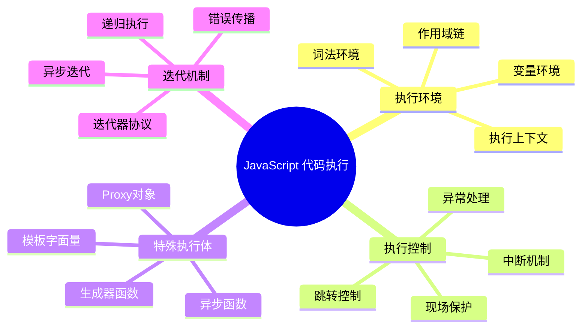
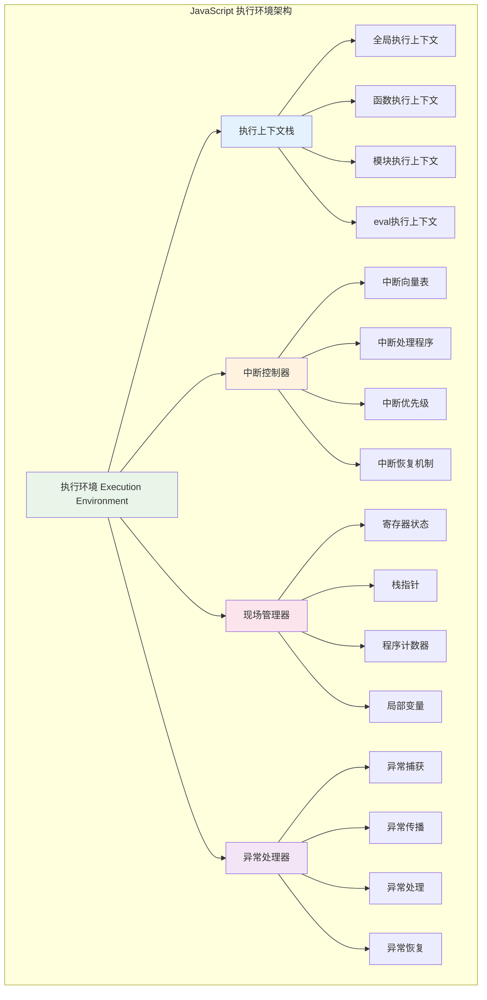
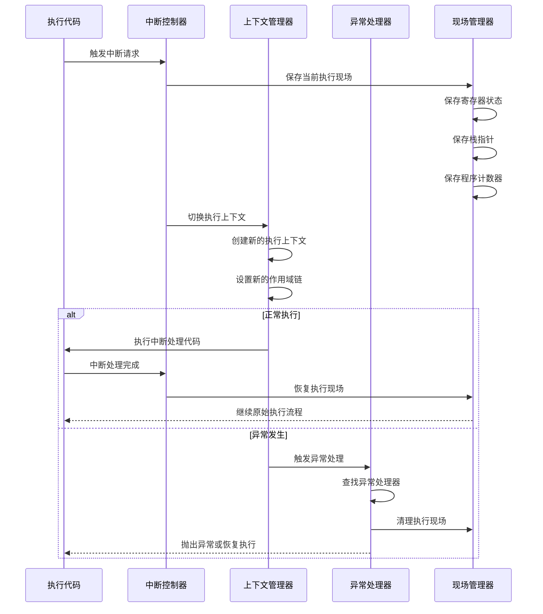
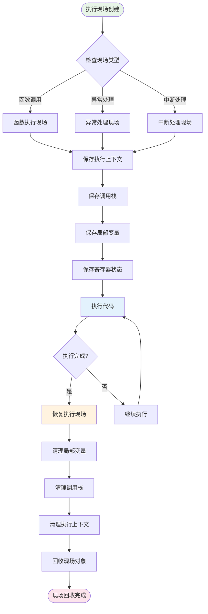
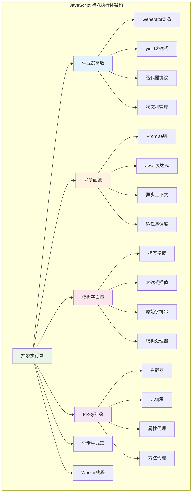
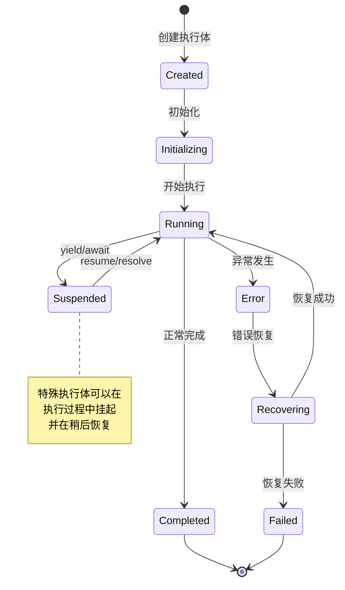
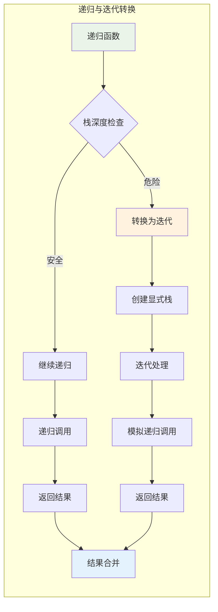

# JavaScript 运行代码

## 目录
1. [概述](#概述)
2. [执行环境的秘密](#执行环境的秘密)
3. [深入探索JavaScript中的特殊执行体](#深入探索javascript中的特殊执行体)
4. [迭代过程及其出错处理机制](#迭代过程及其出错处理机制)
5. [代码执行优化策略](#代码执行优化策略)
6. [调试与监控](#调试与监控)
7. [总结](#总结)

## 概述

JavaScript 运行代码的机制是一个复杂而精密的系统，涉及执行环境管理、特殊执行体处理、迭代控制等多个层面。本文档将深入探讨 JavaScript 代码执行的内部机制，帮助开发者理解代码运行的本质。

### JavaScript 代码执行核心概念



## 执行环境的秘密

### 用中断代替跳转的设计理念

JavaScript 采用中断机制来替代传统的跳转控制，这种设计提供了更好的执行流程管理和异常处理能力。



### 中断机制与跳转控制时序图



### 执行环境核心实现

```javascript
// JavaScript 执行环境的核心实现
class ExecutionEnvironment {
    constructor() {
        this.contextStack = new ExecutionContextStack();
        this.interruptController = new InterruptController();
        this.sceneManager = new SceneManager();
        this.exceptionHandler = new ExceptionHandler();
        
        this.isRunning = false;
        this.currentInstruction = null;
        this.programCounter = 0;
        
        this.stats = {
            instructionsExecuted: 0,
            interruptsHandled: 0,
            exceptionsThrown: 0,
            contextSwitches: 0
        };
    }
    
    // 执行代码的主入口
    execute(code, context = null) {
        console.log('[ExecutionEnvironment] 开始执行代码');
        
        try {
            this.isRunning = true;
            
            // 创建或使用执行上下文
            const executionContext = context || this.createGlobalContext();
            this.contextStack.push(executionContext);
            
            // 解析代码为指令序列
            const instructions = this.parseCodeToInstructions(code);
            
            // 执行指令序列
            return this.executeInstructions(instructions);
            
        } catch (error) {
            return this.exceptionHandler.handle(error);
        } finally {
            this.isRunning = false;
            this.cleanup();
        }
    }
    
    // 执行指令序列
    executeInstructions(instructions) {
        this.programCounter = 0;
        const results = [];
        
        while (this.programCounter < instructions.length && this.isRunning) {
            const instruction = instructions[this.programCounter];
            this.currentInstruction = instruction;
            
            try {
                console.log(`[ExecutionEnvironment] 执行指令: ${instruction.type} at PC=${this.programCounter}`);
                
                const result = this.executeInstruction(instruction);
                results.push(result);
                
                this.stats.instructionsExecuted++;
                
                // 检查是否有中断请求
                if (this.interruptController.hasPendingInterrupt()) {
                    this.handleInterrupt();
                }
                
                this.programCounter++;
                
            } catch (error) {
                const handled = this.handleExecutionError(error, instruction);
                if (!handled) {
                    throw error;
                }
            }
        }
        
        return results;
    }
    
    // 处理中断
    handleInterrupt() {
        const interrupt = this.interruptController.getNextInterrupt();
        console.log(`[ExecutionEnvironment] 处理中断: ${interrupt.type}`);
        
        // 保存当前执行现场
        const scene = this.sceneManager.saveScene({
            programCounter: this.programCounter,
            currentInstruction: this.currentInstruction,
            contextStack: this.contextStack.clone()
        });
        
        this.stats.interruptsHandled++;
        
        try {
            // 执行中断处理程序
            const result = this.interruptController.handleInterrupt(interrupt);
            
            // 恢复执行现场
            this.sceneManager.restoreScene(scene);
            
            return result;
            
        } catch (error) {
            // 中断处理失败，清理现场
            this.sceneManager.cleanupScene(scene);
            throw error;
        }
    }
    
    // 获取执行统计
    getStats() {
        return { ...this.stats };
    }
}

// 中断控制器实现
class InterruptController {
    constructor() {
        this.interruptQueue = [];
        this.handlers = new Map();
        this.setupDefaultHandlers();
    }
    
    setupDefaultHandlers() {
        this.registerHandler('timer', (interrupt) => {
            console.log('[InterruptController] 处理定时器中断');
            return { handled: true, result: 'timer_handled' };
        });
        
        this.registerHandler('io', (interrupt) => {
            console.log('[InterruptController] 处理IO中断');
            return { handled: true, result: 'io_handled' };
        });
    }
    
    registerHandler(type, handler) {
        this.handlers.set(type, handler);
    }
    
    triggerInterrupt(type, data = null) {
        const interrupt = {
            type: type,
            data: data,
            timestamp: Date.now(),
            priority: this.getInterruptPriority(type)
        };
        
        this.interruptQueue.push(interrupt);
        this.interruptQueue.sort((a, b) => b.priority - a.priority);
    }
    
    hasPendingInterrupt() {
        return this.interruptQueue.length > 0;
    }
    
    getNextInterrupt() {
        return this.interruptQueue.shift();
    }
    
    handleInterrupt(interrupt) {
        const handler = this.handlers.get(interrupt.type);
        return handler ? handler(interrupt) : { handled: false };
    }
    
    getInterruptPriority(type) {
        const priorities = { 'exception': 10, 'timer': 5, 'io': 3, 'user': 1 };
        return priorities[type] || 0;
    }
}
```

### 执行现场的回收机制



### 语句执行的意义

每个JavaScript语句的执行都有其特定的语义和副作用，理解这些执行语义对于掌握代码运行机制至关重要。

```javascript
// 语句执行语义分析器
class StatementSemanticAnalyzer {
    constructor() {
        this.semanticRules = new Map();
        this.executionEffects = new Map();
        this.setupSemanticRules();
    }
    
    setupSemanticRules() {
        // 变量声明语句的语义
        this.semanticRules.set('VariableDeclaration', {
            meaning: '在当前作用域中创建变量绑定',
            sideEffects: ['作用域污染', '内存分配', '标识符注册'],
            executionPhase: 'creation',
            hoisting: true
        });
        
        // 函数声明语句的语义
        this.semanticRules.set('FunctionDeclaration', {
            meaning: '创建函数对象并绑定到标识符',
            sideEffects: ['函数对象创建', '作用域链建立', '闭包形成'],
            executionPhase: 'creation',
            hoisting: true
        });
        
        // 表达式语句的语义
        this.semanticRules.set('ExpressionStatement', {
            meaning: '计算表达式的值并丢弃结果',
            sideEffects: ['可能的函数调用', '属性访问', '运算执行'],
            executionPhase: 'execution',
            hoisting: false
        });
        
        // 控制流语句的语义
        this.semanticRules.set('IfStatement', {
            meaning: '根据条件选择执行分支',
            sideEffects: ['条件求值', '分支跳转', '作用域创建'],
            executionPhase: 'execution',
            hoisting: false
        });
    }
    
    // 分析语句语义
    analyzeStatement(statement) {
        const rule = this.semanticRules.get(statement.type);
        if (!rule) {
            return { meaning: '未知语句类型', sideEffects: [] };
        }
        
        return {
            type: statement.type,
            meaning: rule.meaning,
            sideEffects: rule.sideEffects,
            executionPhase: rule.executionPhase,
            hoisting: rule.hoisting,
            executionOrder: this.determineExecutionOrder(statement, rule)
        };
    }
    
    determineExecutionOrder(statement, rule) {
        if (rule.hoisting) {
            return 'hoisted'; // 提升到作用域顶部
        } else {
            return 'sequential'; // 按顺序执行
        }
    }
}

// 使用示例
const analyzer = new StatementSemanticAnalyzer();

const statements = [
    { type: 'VariableDeclaration', name: 'x', value: 10 },
    { type: 'FunctionDeclaration', name: 'foo', body: '...' },
    { type: 'ExpressionStatement', expression: 'x + 1' },
    { type: 'IfStatement', condition: 'x > 0', then: '...' }
];

statements.forEach(stmt => {
    const analysis = analyzer.analyzeStatement(stmt);
    console.log(`语句类型: ${analysis.type}`);
    console.log(`执行意义: ${analysis.meaning}`);
    console.log(`副作用: ${analysis.sideEffects.join(', ')}`);
    console.log(`执行阶段: ${analysis.executionPhase}`);
    console.log('---');
});
```

## 深入探索JavaScript中的特殊执行体

### 抽象确定逻辑的执行体

JavaScript中存在多种特殊的执行体，它们具有独特的执行模式和生命周期管理机制。



### 特殊执行体生命周期



### 生成器函数执行体实现

```javascript
// 生成器执行体的详细实现
class GeneratorExecutionBody {
    constructor(generatorFunction, ...args) {
        this.generatorFunction = generatorFunction;
        this.args = args;
        this.generator = null;
        this.state = 'created';
        this.currentValue = undefined;
        this.isDone = false;
        
        this.executionHistory = [];
        this.yieldCount = 0;
        this.returnValue = undefined;
    }
    
    // 初始化生成器
    initialize() {
        if (this.state !== 'created') {
            throw new Error('Generator already initialized');
        }
        
        this.generator = this.generatorFunction.apply(null, this.args);
        this.state = 'initialized';
        
        console.log(`[Generator] 初始化生成器: ${this.generatorFunction.name}`);
    }
    
    // 执行下一步
    next(value = undefined) {
        if (this.state === 'created') {
            this.initialize();
        }
        
        if (this.isDone) {
            return { value: this.returnValue, done: true };
        }
        
        try {
            this.state = 'running';
            const result = this.generator.next(value);
            
            // 记录执行历史
            this.executionHistory.push({
                type: 'next',
                input: value,
                output: result.value,
                done: result.done,
                timestamp: Date.now()
            });
            
            if (result.done) {
                this.isDone = true;
                this.returnValue = result.value;
                this.state = 'completed';
            } else {
                this.yieldCount++;
                this.currentValue = result.value;
                this.state = 'suspended';
            }
            
            return result;
            
        } catch (error) {
            this.state = 'error';
            this.executionHistory.push({
                type: 'error',
                error: error.message,
                timestamp: Date.now()
            });
            throw error;
        }
    }
    
    // 抛出异常到生成器
    throw(error) {
        if (this.isDone) {
            throw error;
        }
        
        try {
            this.state = 'running';
            const result = this.generator.throw(error);
            
            this.executionHistory.push({
                type: 'throw',
                error: error.message,
                output: result.value,
                done: result.done,
                timestamp: Date.now()
            });
            
            if (result.done) {
                this.isDone = true;
                this.returnValue = result.value;
                this.state = 'completed';
            } else {
                this.state = 'suspended';
            }
            
            return result;
            
        } catch (thrownError) {
            this.state = 'error';
            throw thrownError;
        }
    }
    
    // 强制返回
    return(value) {
        if (this.isDone) {
            return { value: this.returnValue, done: true };
        }
        
        try {
            this.state = 'running';
            const result = this.generator.return(value);
            
            this.executionHistory.push({
                type: 'return',
                input: value,
                output: result.value,
                done: result.done,
                timestamp: Date.now()
            });
            
            this.isDone = true;
            this.returnValue = result.value;
            this.state = 'completed';
            
            return result;
            
        } catch (error) {
            this.state = 'error';
            throw error;
        }
    }
    
    // 获取执行统计
    getStats() {
        return {
            state: this.state,
            yieldCount: this.yieldCount,
            executionSteps: this.executionHistory.length,
            isDone: this.isDone,
            currentValue: this.currentValue,
            returnValue: this.returnValue
        };
    }
    
    // 获取执行历史
    getExecutionHistory() {
        return [...this.executionHistory];
    }
}

// 使用示例
function* fibonacci(n) {
    let a = 0, b = 1;
    for (let i = 0; i < n; i++) {
        yield a;
        [a, b] = [b, a + b];
    }
    return 'fibonacci_complete';
}

const fibGenerator = new GeneratorExecutionBody(fibonacci, 10);

console.log('=== 生成器执行示例 ===');
let result;
do {
    result = fibGenerator.next();
    console.log(`生成器输出: ${result.value}, 完成: ${result.done}`);
} while (!result.done);

console.log('生成器统计:', fibGenerator.getStats());
console.log('执行历史:', fibGenerator.getExecutionHistory());
```

### 模板字面量处理机制

```javascript
// 模板字面量处理器的完整实现
class TemplateProcessor {
    constructor() {
        this.processors = new Map();
        this.cache = new Map();
        this.setupBuiltinProcessors();
    }
    
    setupBuiltinProcessors() {
        // HTML安全处理器
        this.register('html', (strings, ...values) => {
            return strings.reduce((result, string, index) => {
                result += string;
                if (index < values.length) {
                    const value = values[index];
                    const escaped = this.escapeHtml(String(value));
                    result += escaped;
                }
                return result;
            }, '');
        });
        
        // SQL查询构建器
        this.register('sql', (strings, ...values) => {
            const params = [];
            const query = strings.reduce((result, string, index) => {
                result += string;
                if (index < values.length) {
                    params.push(values[index]);
                    result += '?';
                }
                return result;
            }, '');
            
            return { query, params };
        });
        
        // 国际化处理器
        this.register('i18n', (strings, ...values) => {
            const template = strings.join('{placeholder}');
            return this.translateTemplate(template, values);
        });
    }
    
    register(name, processor) {
        this.processors.set(name, processor);
    }
    
    process(processorName, strings, ...values) {
        const processor = this.processors.get(processorName);
        if (!processor) {
            throw new Error(`Unknown processor: ${processorName}`);
        }
        
        return processor(strings, ...values);
    }
    
    escapeHtml(text) {
        return text
            .replace(/&/g, '&amp;')
            .replace(/</g, '&lt;')
            .replace(/>/g, '&gt;')
            .replace(/"/g, '&quot;')
            .replace(/'/g, '&#39;');
    }
    
    translateTemplate(template, values) {
        // 简化的翻译逻辑
        let result = template;
        values.forEach((value, index) => {
            result = result.replace('{placeholder}', String(value));
        });
        return result;
    }
}

// 使用示例
const processor = new TemplateProcessor();

const html = (strings, ...values) => processor.process('html', strings, ...values);
const sql = (strings, ...values) => processor.process('sql', strings, ...values);

console.log('=== 模板字面量示例 ===');

const userInput = '<script>alert("xss")</script>';
const htmlResult = html`<div>用户输入: ${userInput}</div>`;
console.log('HTML处理结果:', htmlResult);

const userId = 123;
const userName = 'John';
const sqlResult = sql`SELECT * FROM users WHERE id = ${userId} AND name = ${userName}`;
console.log('SQL处理结果:', sqlResult);
```

## 迭代过程及其出错处理机制

### 递归与迭代的关系



### 迭代错误处理机制

```javascript
// 迭代错误处理的完整实现
class IterationErrorHandler {
    constructor(options = {}) {
        this.options = {
            maxRetries: options.maxRetries || 3,
            retryDelay: options.retryDelay || 1000,
            errorStrategies: options.errorStrategies || ['retry', 'skip', 'abort'],
            enableRecovery: options.enableRecovery !== false
        };
        
        this.errorLog = [];
        this.recoveryStrategies = new Map();
        this.setupRecoveryStrategies();
    }
    
    setupRecoveryStrategies() {
        // 网络错误恢复策略
        this.recoveryStrategies.set('NetworkError', {
            canRecover: true,
            strategy: 'retry',
            maxRetries: 5,
            backoffMultiplier: 2
        });
        
        // 类型错误恢复策略
        this.recoveryStrategies.set('TypeError', {
            canRecover: false,
            strategy: 'skip',
            logLevel: 'error'
        });
        
        // 超时错误恢复策略
        this.recoveryStrategies.set('TimeoutError', {
            canRecover: true,
            strategy: 'retry',
            maxRetries: 3,
            increaseTimeout: true
        });
    }
    
    // 处理迭代中的错误
    async handleIterationError(error, context) {
        const errorInfo = {
            error: error,
            context: context,
            timestamp: Date.now(),
            attemptCount: context.attemptCount || 0
        };
        
        this.errorLog.push(errorInfo);
        
        console.error(`[IterationErrorHandler] 处理错误: ${error.message}`);
        
        const strategy = this.getRecoveryStrategy(error);
        
        if (strategy && strategy.canRecover && this.options.enableRecovery) {
            return await this.executeRecoveryStrategy(strategy, errorInfo);
        } else {
            return { shouldContinue: false, error: error };
        }
    }
    
    getRecoveryStrategy(error) {
        const errorType = error.constructor.name;
        return this.recoveryStrategies.get(errorType);
    }
    
    async executeRecoveryStrategy(strategy, errorInfo) {
        const { error, context } = errorInfo;
        
        switch (strategy.strategy) {
            case 'retry':
                return await this.retryStrategy(strategy, errorInfo);
                
            case 'skip':
                return this.skipStrategy(strategy, errorInfo);
                
            case 'abort':
                return this.abortStrategy(strategy, errorInfo);
                
            default:
                return { shouldContinue: false, error: error };
        }
    }
    
    async retryStrategy(strategy, errorInfo) {
        const { error, context } = errorInfo;
        const attemptCount = context.attemptCount || 0;
        
        if (attemptCount >= (strategy.maxRetries || this.options.maxRetries)) {
            console.log('[IterationErrorHandler] 重试次数已达上限');
            return { shouldContinue: false, error: error };
        }
        
        const delay = this.calculateRetryDelay(strategy, attemptCount);
        console.log(`[IterationErrorHandler] 将在 ${delay}ms 后重试`);
        
        await this.sleep(delay);
        
        return {
            shouldContinue: true,
            shouldRetry: true,
            newContext: { ...context, attemptCount: attemptCount + 1 }
        };
    }
    
    skipStrategy(strategy, errorInfo) {
        console.log('[IterationErrorHandler] 跳过当前项目');
        return {
            shouldContinue: true,
            shouldSkip: true,
            skippedItem: errorInfo.context.currentItem
        };
    }
    
    abortStrategy(strategy, errorInfo) {
        console.log('[IterationErrorHandler] 中止迭代');
        return {
            shouldContinue: false,
            aborted: true,
            error: errorInfo.error
        };
    }
    
    calculateRetryDelay(strategy, attemptCount) {
        let delay = this.options.retryDelay;
        
        if (strategy.backoffMultiplier) {
            delay *= Math.pow(strategy.backoffMultiplier, attemptCount);
        }
        
        return Math.min(delay, 30000); // 最大30秒
    }
    
    sleep(ms) {
        return new Promise(resolve => setTimeout(resolve, ms));
    }
    
    // 获取错误统计
    getErrorStats() {
        const errorTypes = {};
        const recoveryResults = {};
        
        this.errorLog.forEach(errorInfo => {
            const errorType = errorInfo.error.constructor.name;
            errorTypes[errorType] = (errorTypes[errorType] || 0) + 1;
            
            if (errorInfo.recoveryResult) {
                const result = errorInfo.recoveryResult.shouldContinue ? 'recovered' : 'failed';
                recoveryResults[result] = (recoveryResults[result] || 0) + 1;
            }
        });
        
        return {
            totalErrors: this.errorLog.length,
            errorTypes: errorTypes,
            recoveryResults: recoveryResults
        };
    }
}

// 使用示例
async function processItemsWithErrorHandling(items, processor) {
    const errorHandler = new IterationErrorHandler({
        maxRetries: 3,
        retryDelay: 1000,
        enableRecovery: true
    });
    
    const results = [];
    const errors = [];
    
    for (let i = 0; i < items.length; i++) {
        const item = items[i];
        let context = { index: i, currentItem: item, attemptCount: 0 };
        
        while (true) {
            try {
                const result = await processor(item, context);
                results.push(result);
                break;
                
            } catch (error) {
                const recovery = await errorHandler.handleIterationError(error, context);
                
                if (recovery.shouldContinue) {
                    if (recovery.shouldRetry) {
                        context = recovery.newContext;
                        continue;
                    } else if (recovery.shouldSkip) {
                        console.log(`跳过项目: ${item}`);
                        break;
                    }
                } else {
                    errors.push({ item, error, index: i });
                    if (recovery.aborted) {
                        console.log('迭代被中止');
                        break;
                    }
                    break;
                }
            }
        }
    }
    
    return {
        results: results,
        errors: errors,
        errorStats: errorHandler.getErrorStats()
    };
}

// 测试示例
async function unreliableProcessor(item, context) {
    // 模拟不可靠的处理器
    if (Math.random() < 0.3) {
        throw new Error(`处理失败: ${item}`);
    }
    
    if (Math.random() < 0.1) {
        throw new TypeError(`类型错误: ${item}`);
    }
    
    return `处理结果: ${item}`;
}

console.log('=== 迭代错误处理示例 ===');
const testItems = ['item1', 'item2', 'item3', 'item4', 'item5'];

processItemsWithErrorHandling(testItems, unreliableProcessor)
    .then(result => {
        console.log('处理结果:', result.results);
        console.log('错误信息:', result.errors);
        console.log('错误统计:', result.errorStats);
    })
    .catch(error => {
        console.error('处理失败:', error);
    });
```

## 总结

JavaScript运行代码的机制体现了现代编程语言设计的精妙之处：

1. **执行环境的秘密**: 通过中断机制替代跳转，实现了更优雅的控制流管理
2. **特殊执行体**: 生成器、异步函数等提供了强大的异步编程能力
3. **迭代机制**: 完善的错误处理和恢复策略确保了程序的健壮性

这些机制的深入理解有助于开发者编写更高效、更可靠的JavaScript代码。