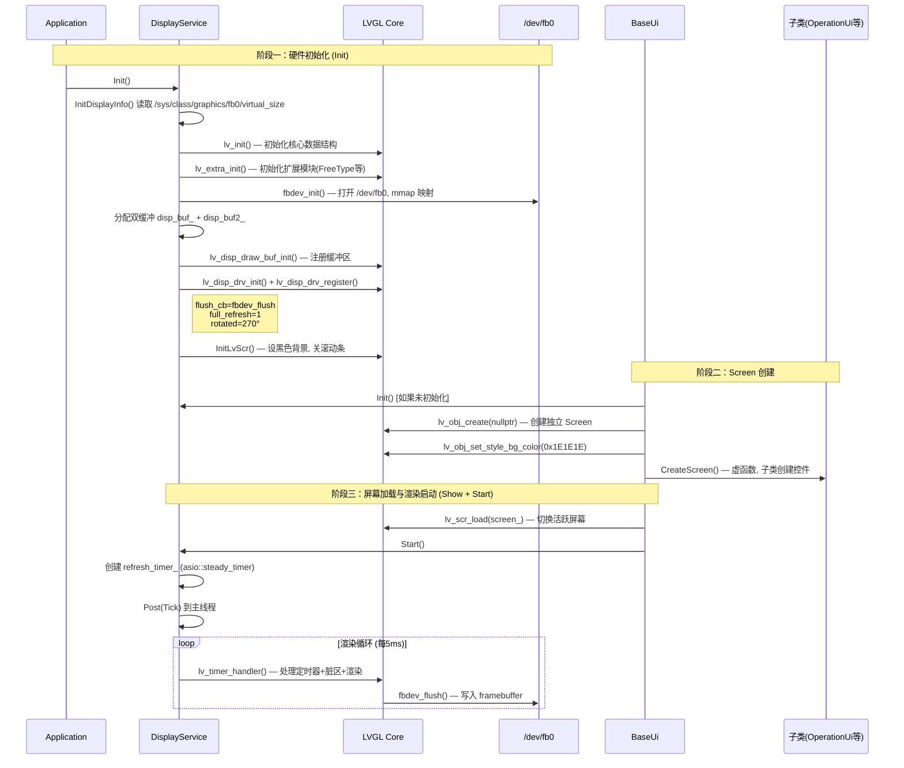
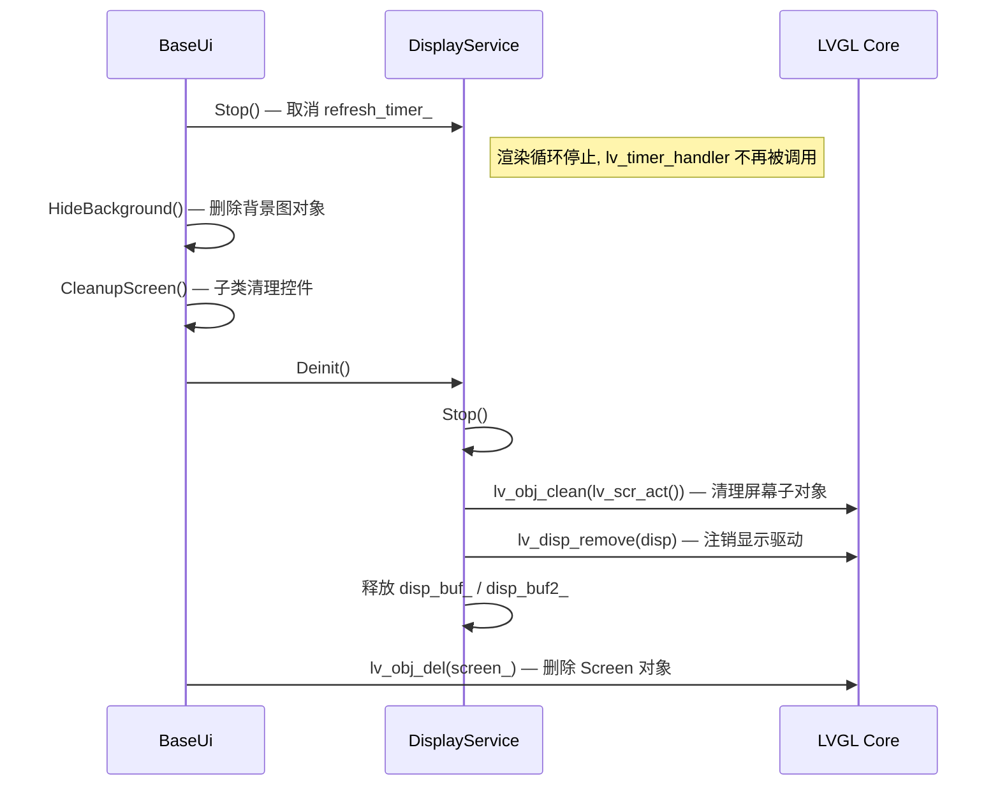
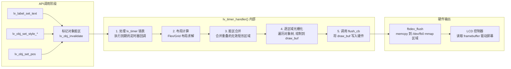

#### 目录介绍
- 1.UI系统架构设计
  - 1.1 LVGL框架定位
  - 1.2 LVGL核心组件
- 2.LVGL基础使用
  - 2.1 对象的模型
  - 2.2 常用控件创建
  - 2.3 样式系统设计
- 3.UI启动与退出
  - 3.1 LVGL启动
  - 3.2 LVGL退出
- 4.LVGL绘制原理
  - 4.1 渲染管线
  - 4.2 脏区机制
  - 4.3 双缓冲原理
  - 4.4 flush_cb原理
- 5.LVGL线程模型
  - 5.1 单线程
  - 5.2 跨线程机制
  - 5.3 渲染和事件
  - 5.4 lv_timer_handler


## 1.UI系统架构设计

### 1.1 LVGL框架定位

LVGL (Light and Versatile Graphics Library) 是一个开源的嵌入式图形库。

提供了创建 GUI 所需的一切要素：可视控件、高级图形效果、低内存占用、支持多种输入设备、多语言等。

其核心设计理念是**硬件无关**——LVGL 本身不直接操作任何硬件，而是通过抽象的驱动接口（Display Driver、Input Driver）与底层硬件通信。

### 1.2 LVGL核心组件

LVGL 内部由以下核心子系统构成：

| 子系统 | 职责 | 项目中的体现 |
|--------|------|-------------|
| **Object System (lv_obj)** | 所有可视元素的基类，树形父子结构 | `lv_obj_create(nullptr)` 创建 Screen，`lv_obj_create(parent)` 创建子对象 |
| **Display Driver (lv_disp_drv)** | 硬件显示抽象层，定义分辨率、flush 回调、旋转等 | `DisplayService::InitHal()` 中注册 |
| **Draw Buffer (lv_disp_draw_buf)** | 渲染缓冲区管理，支持单/双/全屏缓冲 | 双全屏缓冲 `disp_buf_` + `disp_buf2_` |
| **Timer System (lv_timer)** | 内置定时器，驱动动画、脏区刷新等周期任务 | `lv_timer_handler()` 每 5ms 调用一次 |
| **Style System (lv_style)** | 类 CSS 的样式属性系统，支持 Part + State 组合 | `lv_obj_set_style_*()` 系列内联样式 API |
| **File System (lv_fs)** | 虚拟文件系统抽象，支持多种后端 | POSIX 后端 `LV_FS_POSIX_LETTER`='P' |
| **Font Engine** | 位图字体 + FreeType 矢量字体 | 内置 `lv_font_montserrat_*` + FreeType 动态加载 |
| **Image Decoder** | 图片解码管线（PNG/JPG/BMP/内存描述符） | `lv_img_set_src()` 支持文件路径和 `lv_img_dsc_t` |
| **Layout Engine** | Flex/Grid 布局系统 | `lv_obj_set_flex_flow()` 在 ListViewWidget 中使用 |

## 2.LVGL基础使用

### 2.1 对象的模型

LVGL 的一切可视元素都是 `lv_obj_t` 对象。对象通过**父子关系**形成树状结构，子对象的坐标相对于父对象，父对象被删除时子对象自动递归删除。

```
Screen (lv_obj_create(nullptr))        ← 独立屏幕，无父对象
  ├── bg_image (lv_img_create(screen))  ← 背景图片
  ├── container (lv_obj_create(screen)) ← 容器
  │   ├── label (lv_label_create(container))
  │   └── image (lv_img_create(container))
  └── spinner (lv_spinner_create(screen))
```

**Screen 是特殊的 `lv_obj_t`**：通过 `lv_obj_create(nullptr)` 创建（传入 `nullptr` 表示无父对象），通过 `lv_scr_load(screen)` 切换为当前活跃屏幕。LVGL 同一时刻只有一个活跃 Screen，但可以创建多个 Screen 在内存中待命。

### 2.2 常用控件创建

```cpp
// 1. 创建标签
lv_obj_t* label = lv_label_create(parent);           // 创建
lv_label_set_text(label, "Hello");                     // 设置文本
lv_obj_set_style_text_font(label, &lv_font_montserrat_24, LV_PART_MAIN);
lv_obj_set_style_text_color(label, lv_color_white(), LV_PART_MAIN);
lv_obj_set_style_text_align(label, LV_TEXT_ALIGN_CENTER, LV_PART_MAIN);
lv_obj_align(label, LV_ALIGN_CENTER, 0, 0);          // 居中对齐

// 2. 创建图片
lv_obj_t* img = lv_img_create(parent);
std::string path = LvRes("image/icon.png");            // 转为 LVGL 文件路径
lv_img_set_src(img, path.c_str());
lv_img_set_size_mode(img, LV_IMG_SIZE_MODE_REAL);
lv_obj_align(img, LV_ALIGN_CENTER, 0, 0);

// 3. 创建 Spinner 加载动画
lv_obj_t* spinner = lv_spinner_create(parent, 1000, 60); // 1000ms周期, 60度弧长
lv_obj_set_size(spinner, 80, 80);
lv_obj_set_style_arc_color(spinner, lv_color_hex(0x07C160), LV_PART_MAIN);
lv_obj_set_style_arc_color(spinner, lv_color_hex(0x333333), LV_PART_INDICATOR);
```

### 2.3 样式系统设计

LVGL v8 的样式通过 **Part + State** 二维选择器精确控制。Part 指对象的子部分（主体、指示器、旋钮等），State 指交互状态（默认、按下、聚焦等）。

```
┌─────────────────────────────────────┐
│  lv_obj_set_style_xxx(obj, value,   │
│                        selector)     │
│                                     │
│  selector = LV_PART_xxx | LV_STATE_xxx
│                                     │
│  常用 Part:                          │
│    LV_PART_MAIN      - 对象主体     │
│    LV_PART_INDICATOR  - 指示器部分   │
│    LV_PART_KNOB       - 旋钮/滑块   │
│    LV_PART_SCROLLBAR  - 滚动条      │
│                                     │
│  常用 State:                         │
│    LV_STATE_DEFAULT   - 默认(0)     │
│    LV_STATE_PRESSED   - 按下        │
│    LV_STATE_FOCUSED   - 聚焦        │
└─────────────────────────────────────┘
```

本项目全部使用 **内联样式**（`lv_obj_set_style_*` 系列 API），不使用 `lv_style_t` 样式对象。

这种方式的优势是简洁直观，劣势是无法样式复用。对于嵌入式小屏幕 UI 场景（控件数量少），内联样式是更实用的选择。

## 3.UI启动与退出

### 3.1 LVGL启动

LVGL 的启动是一个严格有序的多步过程，任何步骤的缺失或顺序颠倒都会导致黑屏或崩溃。



**关键细节**：

- `lv_init()` 是 LVGL 所有功能的前提，它初始化内部内存池、对象链表、定时器链表等核心数据结构
- `lv_extra_init()` 加载扩展模块，包括 FreeType 字体引擎、额外的控件（spinner 等）
- `fbdev_init()` 打开 `/dev/fb0` 设备，通过 `mmap` 将 framebuffer 映射到用户空间
- `lv_disp_drv_register()` 是让 LVGL "知道"有一块屏幕存在的关键步骤，注册后 LVGL 自动创建默认 Screen
- `lv_scr_load()` 切换活跃屏幕时，LVGL 会标记整个屏幕为"脏区"，触发全屏重绘

### 3.2 LVGL退出



**退出顺序至关重要**：

1. **先停渲染循环** — 防止 `lv_timer_handler` 在对象已删除后继续访问
2. **再清子对象** — 通过子类虚函数 `CleanupScreen()` 清理业务控件
3. **注销驱动前清理屏幕** — `lv_obj_clean` 在驱动还存在时执行，避免 UAF
4. **注销驱动** — `lv_disp_remove` 让 LVGL 忘记这块屏幕
5. **释放缓冲** — 在驱动已注销后安全释放
6. **最后删 Screen** — Screen 对象在驱动注销后删除

如果顺序颠倒（如先删 Screen 再停渲染），会导致 `lv_timer_handler` 访问已释放的 `lv_obj_t` 指针，产生 Use-After-Free 崩溃。

## 4.LVGL绘制原理

### 4.1 渲染管线

LVGL 的渲染不是即时的。当调用 `lv_label_set_text` 等 API 时，LVGL 仅**标记对象为"脏"**，真正的绘制在 `lv_timer_handler()` 被调用时才发生。



### 4.2 脏区机制

脏区是 LVGL 性能优化的核心。当对象的属性（位置、大小、文本、样式等）发生变化时，LVGL 计算该对象在屏幕上的覆盖矩形，加入**无效区域列表**。

下次 `lv_timer_handler` 执行时，只重绘这些脏矩形区域，而非整个屏幕。

**但在本项目中**，由于配置了 `full_refresh = 1`：

```cpp
disp_drv_.full_refresh = 1;  // display_service.cpp:54
```

这意味着**每帧都全屏刷新**，脏区优化被禁用。原因是小尺寸屏幕（240×280 = 67200 像素 × 2 字节/像素 ≈ 131KB）全屏刷新的开销很小，且硬件旋转（270°）要求一次性写入完整帧。

### 4.3 双缓冲原理

```
┌──────────────────────────────────────────────┐
│  LVGL 渲染到 draw_buf 的过程                    │
│                                              │
│  disp_buf_   ┌─────────┐  ← LVGL 正在绘制    │
│              │ Buffer A │                     │
│              └─────────┘                      │
│                                              │
│  disp_buf2_  ┌─────────┐  ← fbdev_flush 正在  │
│              │ Buffer B │    写入 framebuffer  │
│              └─────────┘                      │
│                                              │
│  每帧绘制完成后 A/B 角色互换                      │
│  实现渲染和输出的流水线并行                        │
└──────────────────────────────────────────────┘
```

本项目分配了两块**全屏大小**的缓冲区：

```cpp
auto buf_px_cnt = screen_width_ * screen_height_;  // 240 * 280 = 67200 像素
disp_buf_ = std::make_unique<lv_color_t[]>(buf_px_cnt);   // ~131 KB
disp_buf2_ = std::make_unique<lv_color_t[]>(buf_px_cnt);  // ~131 KB
```

双缓冲的优势：LVGL 可以在绘制下一帧的同时，将上一帧通过 `flush_cb` 输出到硬件，避免撕裂和卡顿。

### 4.4 flush_cb原理

`fbdev_flush` 是 LVGL 官方提供的 Linux framebuffer 刷新函数：

```
lv_timer_handler()
  └─ 渲染完成后调用 flush_cb(drv, area, color_p)
       │
       ├─ area: 需要刷新的屏幕矩形区域 {x1, y1, x2, y2}
       ├─ color_p: 指向 draw_buf 中该区域的像素数据
       │
       └─ fbdev_flush 的实现:
            1. 计算目标在 mmap 区域中的偏移
            2. 逐行 memcpy color_p → framebuffer mmap 区域
            3. 调用 lv_disp_flush_ready(drv) 通知 LVGL 刷新完成
```

`lv_disp_flush_ready()` 是**必须调用**的——它告知 LVGL 缓冲区已经安全地输出到硬件，可以切换到另一个缓冲区继续渲染下一帧。如果不调用，LVGL 会永远等待，屏幕冻结。

## 5.LVGL线程模型

### 5.1 单线程

**LVGL 不是线程安全的。** 这是使用 LVGL 最重要的约束。所有 `lv_*` API 调用必须在**同一个线程**中进行——本项目中是 MainThread。

```
┌─────────────────────────────────────────────────────┐
│  MainThread (= UI Thread)                            │
│                                                     │
│  boost::asio::io_context.run()                      │
│    │                                                │
│    ├── Tick() → lv_timer_handler()  [每5ms]          │
│    │     └── 处理 lv_timer 回调                      │
│    │     └── 布局计算                                │
│    │     └── 渲染 + flush                            │
│    │                                                │
│    ├── 业务逻辑回调 (Post 过来的)                      │
│    │     └── lv_label_set_text(...)                  │
│    │     └── lv_obj_set_style_*(...)                 │
│    │     └── lv_obj_del(...)                         │
│    │                                                │
│    └── asio::steady_timer 回调                       │
│          └── 倒计时更新、自动关闭等                    │
└─────────────────────────────────────────────────────┘

┌─────────────────────┐     ┌─────────────────────┐
│  IoT Thread         │     │  Network Thread      │
│                     │     │                      │
│  设备指令处理         │     │  HTTP 请求           │
│  操作码验签          │     │  图片下载            │
│                     │     │                      │
│  ⚠️ 不能直接调       │     │  ⚠️ 不能直接调       │
│    lv_* API         │     │    lv_* API          │
│                     │     │                      │
│  必须 Post 到        │     │  必须 Post 到        │
│  MainThread         │     │  MainThread          │
└─────────────────────┘     └─────────────────────┘
```

### 5.2 跨线程机制

当非 UI 线程需要更新 UI 时，必须通过 `Threads::MainThread()->Post()` 将操作投递到主线程：

```cpp
// IoT 线程中：设备信息获取完成
DeviceOpcodeManager::Instance()->GetFirmwareInfo(
    [this, callback](error_code ec, const FirmwareInfo& info) {
        // ⚠️ 当前在 IoT 线程，不能直接操作 UI
        Threads::MainThread()->Post([this, ec, info, callback]() {
            // ✅ 现在在 MainThread 中，安全操作 UI
            if (ec) {
                operation_ui_->ShowFailed("Error", std::to_string(ec.value()));
            } else {
                operation_ui_->ShowListView(BuildFirmwareItems(info));
            }
        });
    });
```

### 5.3 渲染和事件

本项目的一个重要设计决策是：**LVGL 渲染循环与 Boost.Asio 事件循环运行在同一个 `io_context` 上**。

```
io_context.run()
  │
  ├── [t=0ms]   Tick() → lv_timer_handler() → flush
  ├── [t=1ms]   处理网络响应回调
  ├── [t=3ms]   处理 Post 过来的 UI 更新
  ├── [t=5ms]   Tick() → lv_timer_handler() → flush
  ├── [t=7ms]   倒计时 timer 到期回调
  ├── [t=10ms]  Tick() → lv_timer_handler() → flush
  └── ...
```

这意味着：

- **优势**：不需要额外的锁和线程同步，所有 UI 操作天然串行化
- **风险**：如果某个 Post 回调或 timer 回调执行时间过长，会阻塞渲染循环，导致 UI 卡顿
- **实践**：耗时操作（网络请求、文件IO）必须在其他线程执行，只在回调中做轻量 UI 更新

### 5.4 lv_timer_handler

```cpp
void DisplayService::Tick() {
    auto interval_ms = lv_timer_handler();  // 返回值是建议的下次调用间隔
    refresh_timer_->expires_after(std::chrono::milliseconds(5));  // 固定 5ms
    refresh_timer_->async_wait([this](const auto& ec) {
        if (ec == asio::error::operation_aborted) return;
        Tick();
    });
}
```

`lv_timer_handler()` 返回值是 LVGL 建议的下次调用间隔（通常 1~30ms），但项目中固定使用 5ms。这意味着理论最大帧率为 200 FPS，但实际帧率取决于：

- 脏区大小和渲染复杂度
- `fbdev_flush` 的 memcpy 耗时
- 主线程上其他任务的抢占时间

对于 240×280 全屏刷新，实际帧率通常在 30~60 FPS。


