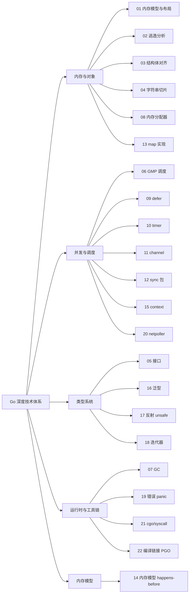

# 🚀 Go 深度技术原理专栏

> 深入解析 Go 语言核心机制与 runtime 实现，构建完整的 Go 知识体系。
> 本卷共 **22 篇**，全部基于 **Go 1.22** 源码基线，单篇平均 1.5–2 万字，对标 Russ Cox / draveness / 曹大等顶级 Go 技术博客的深度。

## 📖 专栏概览

| 模块 | 文章数量 | 难度 | 重点内容 |
|------|---------|------|---------|
| 模块一：语言机制 | 5 篇 | ★★★★ | 内存模型、逃逸分析、对齐、字符串切片、接口 |
| 模块二：runtime 内核 | 8 篇 | ★★★★★ | GMP、GC、内存分配器、defer、timer、channel、sync、map |
| 模块三：内存模型与并发安全 | 2 篇 | ★★★★★ | Go 内存模型与 happens-before、context |
| 模块四：现代特性 | 3 篇 | ★★★★ | 泛型、反射 unsafe、迭代器（range over func） |
| 模块五：工程化与运行时支撑 | 4 篇 | ★★★★★ | 错误 panic、netpoller、cgo/syscall、编译链接与 PGO |
| **合计** | **22 篇** | — | **~40 万字** |

> 本次对原 16 篇做了一次重大扩展，理由见本卷末尾「📌 22 篇结构调整说明」。

## 🎯 学习路径

### 基础入门 → 进阶掌握 → 专家深度

阅读顺序建议：

```
基础入门：01 → 02 → 03 → 04 → 05（语言机制 5 篇）
进阶掌握：06 → 07 → 08 → 09 → 10 → 11 → 12 → 13（runtime 内核 8 篇）
并发深度：14 → 15（内存模型 2 篇）
专家深度：16 → 17 → 18 → 19 → 20 → 21 → 22（现代特性 + 工程化）
```

## 📚 文章目录

### 模块一：语言机制（5 篇）

- [01.内存模型与栈堆布局](./01.内存模型与布局.md) ⭐⭐⭐⭐
  - 进程地址空间、Go 的栈段管理（连续栈 / 分段栈历史）、栈扩容机制（`morestack`/`copystack`）、堆的 `mspan`/`mcache`/`mcentral`/`mheap` 三级分配器总览
- [02.指针与逃逸分析](./02.指针与逃逸分析.md) ⭐⭐⭐⭐
  - 指针的本质、`unsafe.Pointer`、逃逸分析的判定规则、`-gcflags="-m"` 实战、内联与逃逸的关系
- [03.结构体与对齐](./03.结构体与对齐.md) ⭐⭐⭐⭐
  - 字段对齐规则、`unsafe.Sizeof`/`Alignof`/`Offsetof`、字段重排省内存、`structlayout` 工具、嵌入字段对内存的影响
- [04.字符串与切片底层](./04.字符串与切片底层.md) ⭐⭐⭐⭐
  - `stringHeader` / `sliceHeader`、`append` 扩容算法（旧 2 倍 / 1.18 阈值版）、底层数组共享陷阱、`strings.Builder` 优化、零拷贝转换的合法/非法用法
- [05.接口与类型系统](./05.接口与类型系统.md) ⭐⭐⭐⭐⭐
  - `iface` / `eface` 双指针结构、`itab` 的生成与缓存、类型断言的汇编、空接口零值与 nil 接口的差异、类型 switch 的优化

### 模块二：runtime 内核（8 篇）

- [06.GMP 调度器原理](./06.GMP调度器原理.md) ⭐⭐⭐⭐⭐
  - G/M/P 三件套、本地队列与全局队列、work stealing、抢占机制（信号 vs 协作）、`sysmon` 后台监控、Go 1.14 异步抢占；含 **Go runtime 启动流程**（`rt0_go` → `schedinit` → `main goroutine`）
- [07.GC 三色标记演进](./07.GC三色标记演进.md) ⭐⭐⭐⭐⭐
  - GC 历史（Go 1.3 STW → 1.5 并发 → 1.8 混合屏障）、三色不变性、Dijkstra/Yuasa 屏障、写屏障实现、GC pacer、Go 1.19 软内存限制（`GOMEMLIMIT`）
- [08.内存分配器深挖](./08.内存分配器深挖.md) ⭐⭐⭐⭐⭐ 🆕
  - `mspan` 状态机、67 个 size class、`mcache`/`mcentral`/`mheap` 三级分配路径、tiny allocator、大对象与 huge page、`runtime/sizeclasses.go` 速查表、与 jemalloc/tcmalloc 的对照
- [09.defer 实现机制](./09.defer实现机制.md) ⭐⭐⭐⭐⭐ 🆕
  - 三代演进：堆分配 defer（≤1.12）→ 栈分配 defer（1.13）→ **开放编码 defer**（1.14+）、性能从 ~50ns 到 ~1ns 的飞跃、`_defer` 链表与 `deferreturn`、`recover` 的栈展开协作、Go 1.22 编译器决策机制
- [10.time 与 timer 实现](./10.time与timer实现.md) ⭐⭐⭐⭐ 🆕
  - 全局四叉堆 → P 本地四叉堆（Go 1.10 重构）、`addtimer`/`deltimer`/`adjusttimers`、`timer.when` 的相对时间设计、`time.Sleep`/`time.After`/`time.Ticker` 区别、Go 1.23 timer 池化优化
- [11.channel 源码剖析](./11.channel源码剖析.md) ⭐⭐⭐⭐⭐
  - `hchan` 结构体、`sendq` / `recvq`、`sudog` 等待队列、有缓冲 vs 无缓冲实现差异、`select` 随机化、`close` 的语义保证、关闭已关闭 channel 的崩溃路径
- [12.sync 包源码剖析](./12.sync包源码剖析.md) ⭐⭐⭐⭐⭐
  - `Mutex` 状态机（饥饿模式 / 正常模式）、`RWMutex` 读偏向与写者饥饿、`WaitGroup` 64 位双计数器、`Once` 双重检查、`sync.Pool` GC 协作（victim cache）
- [13.map 与哈希实现](./13.map与哈希实现.md) ⭐⭐⭐⭐
  - `hmap` / `bmap` 结构、tophash 加速、增量扩容（同等扩容 / 倍增扩容）、装载因子触发、并发写崩溃机制、Go 1.22 的 `clear` 内置、为什么 map 迭代乱序

### 模块三：内存模型与并发安全（2 篇）

- [14.Go 内存模型与 happens-before](./14.Go内存模型与happens-before.md) ⭐⭐⭐⭐⭐ 🆕
  - 2022 年重写后的 Go 内存模型、program order vs synchronized order、channel/mutex/atomic 的 happens-before 规则、数据竞争 (data race) 与 race detector 实现、典型并发陷阱（双重检查锁、单字撕裂）、与 Java/C++11 内存模型的对照
- [15.context 与取消传播](./15.context与取消传播.md) ⭐⭐⭐⭐
  - 四种 Context、`cancelCtx` 子树取消机制、`timerCtx` 定时器、`valueCtx` 链表查找、`WithCancelCause`（1.20+）、`AfterFunc`（1.21+）、context 反模式与最佳实践

### 模块四：现代特性（3 篇）

- [16.泛型与类型约束](./16.泛型与类型约束.md) ⭐⭐⭐⭐
  - 泛型语法、类型参数、`comparable`、`~T` 底层类型约束、**GC shape stenciling 与字典传递**、性能权衡（vs C++ 模板 / Java 擦除）
- [17.反射与 unsafe](./17.反射与unsafe.md) ⭐⭐⭐⭐
  - `Type` / `Value` 双视图、`Kind`、设值的可寻址性、性能开销、`unsafe.Pointer` 六大合法转换、Go 1.20 `unsafe.Slice`/`String`、`reflect.TypeFor`（1.22+）
- [18.迭代器与 range over func](./18.迭代器与range_over_func.md) ⭐⭐⭐⭐ 🆕
  - Go 1.22 实验、Go 1.23 稳定的迭代器协议（`iter.Seq` / `iter.Seq2` / `iter.Pull`）、编译器如何把 `for k, v := range f` 改写为 yield 调用、与 Python/Rust/JS 迭代器对照、性能与可组合性

### 模块五：工程化与运行时支撑（4 篇）

- [19.错误与 panic 机制](./19.错误与panic机制.md) ⭐⭐⭐⭐
  - `error` 接口、`%w` 包装链、`errors.Join`（1.20+）、`panic` 栈展开、`defer` 链执行、`recover` 边界、`runtime.Error` 内置错误
- [20.网络 IO 与 netpoller](./20.网络IO与netpoller.md) ⭐⭐⭐⭐⭐
  - 同步编程模型 + 异步 IO 多路复用、netpoller 与 GMP 协作、epoll/kqueue/iocp 抽象、连接的 G 挂起与唤醒、HTTP 长连接的 G 池、Go 1.21 起的 netpoller 优化
- [21.cgo 与 syscall 切换](./21.cgo与syscall切换.md) ⭐⭐⭐⭐ 🆕
  - syscall 阻塞导致 P 解绑（`entersyscall`/`exitsyscall`）、cgo 调用如何切到系统栈、cgo 的性能开销分解、`runtime.LockOSThread` 的应用、cgo 与 GMP 的互操作陷阱
- [22.编译链接与 PGO](./22.编译链接与PGO.md) ⭐⭐⭐⭐⭐
  - 编译流水线（parse → typecheck → SSA → asm）、链接器、Go 内置汇编（plan9）、`go:linkname` / `go:noescape`、ABI 兼容、**PGO 原理与实战**（1.21+）、二进制瘦身与符号丢失

## 🎓 知识图谱



## 📐 单篇专栏写作模板（七段式）

为保证 22 篇风格统一，每篇按以下结构写作（总字数 ~1.5–2 万字）：

| # | 段落 | 字数 | 作用 |
|---|------|------|------|
| 1 | 开篇钩子 | 500 | 用一个真实线上问题或经典面试题切入 |
| 2 | 历史演进 | 2000 | 该机制从 Go 1.0 → 1.22 的演化路径 |
| 3 | 核心原理图解 | 3000 | mermaid / ASCII 图 + 数据结构关系 |
| 4 | 源码逐行剖析 | 5000 | 引用 `runtime/xxx.go:Lxxx`，标注 commit 短哈希 |
| 5 | 实战观测 | 3000 | `GODEBUG` / `dlv` / `pprof` / `go test -bench` 操作步骤 |
| 6 | 常见陷阱 Top 5 | 2500 | 每条 500 字：现象 → 根因 → 修复 |
| 7 | 跨卷衔接 + 参考资料 | 500 | 链接卷一/卷二/卷四对应章节，列出官方设计文档 |

> 文末统一附「📌 与 C++ 对照」表，便于双语读者建立心智模型。

## 📈 学习建议

1. **按模块顺序学习**：建议从语言机制开始，逐步深入到 runtime 内核，最后看工程化
2. **看源码 + 看汇编**：每篇都会引用 Go 1.22 源码行号；建议在本机 `git clone https://github.com/golang/go` 后跟着翻
3. **用 dlv 调试**：runtime 章节建议用 Delve 单步调试，`step` 进入 runtime 函数能看到调度过程
4. **用 `go build -gcflags="-m -l"` 看逃逸**：02 章实战必备
5. **用 `GOMAXPROCS=1 GODEBUG=schedtrace=1000 ./yourprogram` 看调度**：06 章实战必备
6. **用 `go test -race` 验证并发正确性**：14 章实战必备
7. **延伸阅读**：每篇文章末尾提供相关参考资料（Russ Cox / Dmitry Vyukov / Ian Lance Taylor 的设计文档）

## 🔗 与其他卷的衔接

| 本卷章节 | 卷一语法卷 | 卷二工程卷 | 卷四实战卷 |
|---------|-----------|-----------|-----------|
| 01 内存模型 | 第 5、8 章 | 第 12 案例 | 01 OOM 排查、09 性能优化 |
| 02 逃逸分析 | 第 8 章 | 第 11 案例 | 09 性能优化、10 缓存友好 |
| 04 字符串切片 | 第 5 章 | 全部 | 09 性能优化 |
| 05 接口 | 第 10 章 | 第 3、6 案例 | — |
| 06 GMP | 第 12 章 | 第 9 案例 | 05 goroutine 泄漏、07 trace |
| 07 GC | — | — | 06 pprof（heap）、09 性能优化 |
| 08 内存分配器 | 第 8 章 | 第 12 案例 | 01 OOM 排查、09 性能优化 |
| 09 defer | 第 7、11 章 | — | 02 panic、09 性能优化 |
| 10 timer | 第 12、14 章 | 第 8 案例 | 07 trace |
| 11 channel | 第 13 章 | 第 9、12 案例 | 05 goroutine 泄漏 |
| 12 sync | 第 14 章 | 第 4、7 案例 | — |
| 13 map | 第 5 章 | 第 4 案例 | 09 性能优化 |
| 14 内存模型 | 第 14 章 | 第 9 案例 | 17 故障复盘 |
| 15 context | 第 12 章 | 第 9、12 案例 | 17 故障复盘 |
| 18 迭代器 | 第 16 章 | — | — |
| 19 错误 panic | 第 11 章 | 全部 | 02 panic、17 故障复盘 |
| 20 netpoller | 第 15 章 | 第 12 案例 | 06 pprof（block）、07 trace |
| 21 cgo/syscall | 第 17 章 | — | 17 故障复盘 |
| 22 编译链接 PGO | 第 17 章 | — | 11 PGO、12 编译链接 |

## 📌 22 篇结构调整说明

本次将原 16 篇扩展为 22 篇，新增 6 篇，并对模块切分做了重组：

| 变化类型 | 篇目 | 理由 |
|---------|------|------|
| 🆕 新增 | 08 内存分配器深挖 | 三级分配器 + 67 个 size class 是面试高频，挂在 01 章会冲淡布局主线 |
| 🆕 新增 | 09 defer 实现机制 | 三代演进（堆 / 栈 / 开放编码）独立成篇，是 panic/recover 的前置 |
| 🆕 新增 | 10 time 与 timer 实现 | Go 1.10 P 本地 timer 重构是调度系统大改，单独成篇 |
| 🆕 新增 | 14 Go 内存模型与 happens-before | 2022 年重写后的内存模型是并发正确性根基，必须单独成篇 |
| 🆕 新增 | 18 迭代器与 range over func | Go 1.23 稳定的现代特性，与泛型并列为 Go 现代化两大里程碑 |
| 🆕 新增 | 21 cgo 与 syscall 切换 | 工程问题诊断（cgo 卡死、P 耗尽）必备，挂在 06 章会过厚 |
| 🔁 重排 | 09→11 channel、10→13 map、12→15 context、13→17 反射、14→19 错误、15→20 netpoller、16→22 编译链接 | 模块重组导致的编号变化 |
| ➕ 增容 | 22 编译链接与 PGO | 把 PGO 从卷四提升到卷三（PGO 涉及编译器 SSA 内联决策，更适合放在原理卷） |

> 调整后结构与 BOOK_PLAN.md 卷三规划同步更新。

## 🔮 未来扩展

- Go 1.23+ 新特性深度解析（如新调度器优化、新 GC 算法）
- 协程切换汇编全流程（`runtime·gogo` 拆解）
- WASM 后端实现差异
- arena 实验特性深挖（如稳定后）

---

> 本专栏持续更新中，欢迎关注和贡献！

---

## 📚 推荐参考资料

- [The Go Programming Language Specification](https://go.dev/ref/spec)
- [The Go Memory Model](https://go.dev/ref/mem) — 看 channel/sync 必读，2022 年大改后的版本
- [Russ Cox: Go's Concurrency Patterns](https://research.swtch.com/) — Go 并发原语的设计文档
- [Dmitry Vyukov: Scalable Go Scheduler Design Doc](https://docs.google.com/document/d/1TTj4T2JO42uD5ID9e89oa0sLKhJYD0Y_kqxDv3I3XMw) — GMP 调度器设计原稿
- [Ian Lance Taylor: Generics in Go](https://go.dev/blog/intro-generics) — 泛型设计原文
- [Austin Clements: Go GC Pacer Redesign](https://github.com/golang/proposal/blob/master/design/44167-gc-pacer-redesign.md) — Go 1.18 GC pacer 重写设计
- [draveness 《Go 语言设计与实现》](https://draveness.me/golang/) — runtime 源码解读
- [《Go 语言高级编程》](https://chai2010.cn/advanced-go-programming-book/) — cgo / 汇编 / 反射
- Go 源码：[golang/go](https://github.com/golang/go) `runtime/` 目录
