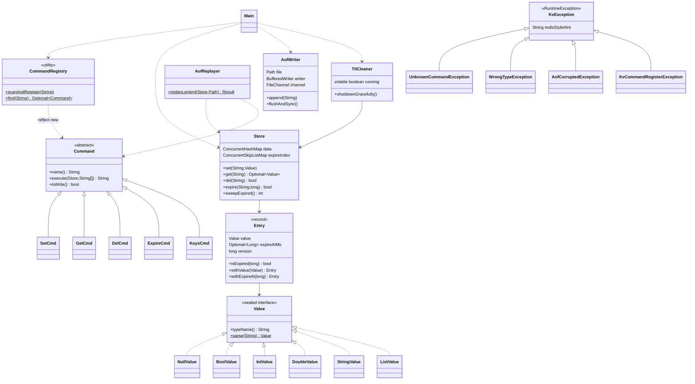

# 第六章：Java 迷你 KV 存储引擎（毕业设计）🎓

本章是综合案例的**毕业大考**——把前 5 个案例的所有能力合一，**一个项目串完入门 1-15 全章**：**类与对象 → 继承多态 → 接口抽象类 → 异常体系 → 集合 → IO 流 → 多线程并发 → 泛型 → 注解反射 → 内置单测框架**。

本案例做 **6 件事**：

1. **从最小 REPL 到完整数据库的真实演进**：先写 50 行 main 跑通 SET/GET，再演进到 11 个阶段、2500 行的迷你 Redis。**严格按真实工程师"先 MVP 再迭代"的节奏推进**。
2. **手造一个轻量级 Spring**：用 `@Command` 注解 + 反射扫包 + 自动注册命令，**让你"加新命令零修改 main 函数"**——这是 Spring `@Component` 扫描的雏形。
3. **手造一个完整 AOF 持久化引擎**：write-flush-fsync 三层策略 + 半行损坏宽松式重放 + 重启后数据完整恢复 —— **真正理解 Redis AOF 是怎么工作的**。
4. **手造一个内置单测框架**：用 `@Test` 注解 + 反射扫描方法 + Assert 工具 —— **这就是 JUnit 5 的核心原理**。
5. **5 个真实工程 BUG 现场**：if-else 大爆炸 / 反射 setAccessible 坑 / AOF 半行损坏 / 100 线程并发 CME / 守护线程可见性。**这 5 个坑覆盖了 Java 后端面试 60% 的并发与框架问题**。
6. **完整覆盖入门 1-15 全章**：每章都有真实落地点（不是凑数），最后回扣表让你**逐章自检知识点**——这是真正的"毕业证书"。

**学习方式**：本案例**严格不要一口气读完**，按 5 次会话推进、每次 3-4 小时（**总耗时 18 小时，建议分 5 天**：D1 MVP / D2 命令模式与反射 / D3 异常与 AOF / D4 并发与 TTL / D5 测试框架与端到端）。每个 Step 都要**编译运行 + git commit**，**这是唯一能让你真正学会的方式**。

> 🎓 **学完它你能做什么**：
> - 独立读懂 Redis Java client / HikariCP / Caffeine 源码
> - 理解 Spring 注解扫描的原理（不再当黑盒）
> - 用反射写自己的"小框架"（CLI 命令派发 / 配置加载 / RPC 路由）
> - 给团队设计**自定义异常体系**和**统一日志门面**
> - 在真实并发场景下选对锁（读写锁 vs CHM vs 互斥锁）

---

## 渐进学习节奏

先读这段，再开始敲代码！本案例**严格按 5 次会话推进**，每次会话有明确"毕业卡"：

```text
🟦 第 1 次会话：MVP 骨架（3-4 h）
   阶段 ① 最小 REPL（§03，45 min）
       └ Step 1.0 🤔 灵魂三问 #1（先 REPL 不服务化？enum vs 字符串路由？）
       └ Step 1.1-1.4 main + Scanner + enum + switch
   阶段 ② Value 类型表达（§04，45 min）
       └ Step 2.0 🤔 灵魂三问 #2（sealed 接口？record 适合？）
       └ Step 2.1-2.3 sealed interface + 6 个 record + parse
   阶段 ③ Entry + Store（§05，45 min）
       └ Step 3.1-3.4 Entry record + Store + set/get/del + 跑通

🟦 第 2 次会话：命令模式 + 注解注册（4 h）【全书最高峰⭐⭐⭐】
   阶段 ④ 命令模式（§06，90 min）
       └ Step 4.0 🤔 灵魂三问 #3（if-else / switch / 命令模式怎么选？）
       └ Step 4.1 ⚠️ 造 BUG #1（if-else 200 行大爆炸）
       └ Step 4.2-4.4 抽象 Command + 5 派生类 + Factory
   阶段 ⑤ @Command 注解 + 反射扫描（§07，90 min）【Spring 雏形⭐⭐】
       └ Step 5.0 🤔 灵魂三问 #4（手写 vs 反射注册的代价？）
       └ Step 5.1-5.4 注解定义 + scanAndRegister + 反射实例化
       └ Step 5.5 ⚠️ 造 BUG #2（setAccessible 忘加 / 无无参构造）
       └ Step 5.6-5.7 修复 + 加新命令零修改 main

🟦 第 3 次会话：异常体系 + AOF 持久化（4 h）【数据库核心】
   阶段 ⑥ KvException 体系（§08，45 min）
       └ Step 6.0 🤔 灵魂三问 #5（受检 vs 非受检？错误码 vs 异常？）
       └ Step 6.1-6.3 KvException 基类 + 5 派生 + 全局 try-catch
   阶段 ⑦ AOF 持久化（§09，120 min）【手造引擎⭐⭐】
       └ Step 7.0 🤔 灵魂三问 #6（AOF vs RDB？write/flush/fsync 区别？）
       └ Step 7.1-7.4 AofWriter + flushPolicy + AofReplayer
       └ Step 7.5 ⚠️ 造 BUG #3（kill -9 → AOF 半行损坏）
       └ Step 7.6-7.7 宽松式重放 + 重启数据完整

🟦 第 4 次会话：日志 + 并发 + TTL（4 h）【并发综合考⭐⭐】
   阶段 ⑧ 自写日志类（§10，30 min）
       └ Step 8.1-8.2 Log 静态门面 + 全文 println 替换
   阶段 ⑨ 读写锁 + 并发安全（§11，90 min）
       └ Step 9.0 🤔 灵魂三问 #7（synchronized / RWLock / CHM 选哪个？）
       └ Step 9.1 ⚠️ 造 BUG #4（100 线程并发 → CME）
       └ Step 9.2-9.5 ReadWriteLock + CHM 双方案 + 性能对比
   阶段 ⑩ TTL 守护线程（§12，60 min）
       └ Step 10.0 🤔 灵魂三问 #8（惰性 vs 主动删除？守护线程关停？）
       └ Step 10.1-10.3 惰性 + 主动 + TreeMap TTL 索引
       └ Step 10.4 ⚠️ 造 BUG #5（守护线程没 volatile）
       └ Step 10.5 修复 + interrupt + join

🟦 第 5 次会话：内置单测 + 端到端（3 h）【框架手造高峰⭐⭐】
   阶段 ⑪ 内置单元测试 + 端到端验收（§13，180 min）
       └ Step 11.0 🤔 灵魂三问 #9（为何不用 JUnit？测试隔离？）
       └ Step 11.1-11.2 @Test 注解 + TestRunner + Assert 工具
       └ Step 11.3-11.4 10 个测试 + mvn test 一键
       └ Step 11.5-11.6 端到端 1000 条 round-trip + QPS 报告
```

🎯 **每个 Step 必须做的三件事**：

> 1. **先读 🎯 阶段目标卡片**：明确做什么、不做什么、验收标准
> 2. **写一小段代码就编译运行一次**（看到 ✏️ 标志立刻动手）
> 3. **看到预期输出再写下一个 Step**（**绝对不能复制粘贴**——错过细节会让 BUG 隐藏数月）

> 🎯 **本案例的 9 处"灵魂三问"**（动手前先想清楚）：
> - **§03 REPL 前**：为什么先做 REPL 不直接做 TCP 服务？enum vs 字符串路由如何选？为什么用 String.split 不用正则？
> - **§04 Value 前**：6 种类型怎么表达？为什么 sealed interface 比 enum 更好？record 适合吗？
> - **§06 命令模式前**【🔥】：if-else / switch / 命令模式如何选？什么时候必须拆类？工厂方法 vs 反射注册？
> - **§07 反射注册前**【🔥 Spring 雏形】：手写 if-else 注册 vs 反射扫描的代价对比？反射性能问题怎么权衡？类加载顺序？
> - **§08 异常前**：受检（checked）还是非受检？要分多少层异常？错误码 vs 异常如何选？
> - **§09 AOF 前**【🔥 数据库核心】：AOF vs RDB 选哪个？追加 vs 覆盖？write / flush / fsync 三层语义？
> - **§11 并发前**【🔥】：synchronized vs ReentrantLock？ReadWriteLock 何时优于互斥锁？ConcurrentHashMap 之上还要不要锁？
> - **§12 TTL 前**：惰性删除 vs 主动删除？守护线程怎么关停？ScheduledExecutorService 还是手写 Thread？
> - **§13 测试前**【🔥 JUnit 原理】：为什么不直接用 JUnit？怎么手写 assert？测试隔离怎么保证？

> ⚠️ **本案例的 5 处"陷阱预警"**（亲眼看一次记一辈子）：
> - **§06.1 if-else 爆炸**：把 5 个命令写在 main 里 → 200 行不可维护，加第 6 个命令直接 300 行
> - **§07.5 反射常见坑**：私有构造没 `setAccessible(true)` / 子类无无参构造 → 抛 IllegalAccessException
> - **§09.5 AOF 半行损坏**：写到一半被 kill -9 → 末行半截 → 严格重放抛 ParseException → 数据全丢
> - **§11.1 100 线程 CME**：HashMap 并发 put → ConcurrentModificationException / 死循环
> - **§12.4 守护线程不关停**：没用 volatile 标志 + 没 interrupt → JVM 退出后线程仍在跑

---

## 案例元信息

| 项目 | 说明 |
|------|------|
| 难度 | ★★★★★（毕业大考）|
| 预估时长 | 18 小时（强烈建议分 5 天 5 次会话完成）|
| 前置章节 | 入门第 1-15 全章 + 综合案例 01-05 全部 |
| 编译命令 | `mvn package && java -jar target/mini-kv.jar`（或纯 javac）|
| 最终产物 | 8 包项目（~ 2500 行 Java）+ AOF 数据文件 + 内置 REPL + 内置单测框架 |
| JDK 版本 | JDK 17（用到 sealed interface + record + Files.lines）|
| 设计亮点 | **手造 Spring 注解扫描雏形** / **手造完整 AOF 引擎** / **手造 JUnit 风格测试框架** |
| ⚠ 已知局限 | 单 JVM 内存版（不做分布式）/ 只做 BIO（NIO/Netty 留给挑战）/ 不做集群同步 |

### 项目结构

```text
mini-kv/
├── pom.xml                       # Maven 配置（也可纯 javac 跑）
└── src/
    └── main/
        └── java/
            └── com/
                └── kv/
                    ├── command/             # 命令模式 + 注解注册
                    │   ├── Command.java
                    │   ├── SetCmd.java
                    │   ├── GetCmd.java
                    │   ├── DelCmd.java
                    │   ├── ExpireCmd.java
                    │   ├── KeysCmd.java
                    │   └── CommandRegistry.java
                    │
                    ├── store/               # 数据存储核心
                    │   ├── Value.java          # sealed interface
                    │   ├── NullValue.java
                    │   ├── BoolValue.java
                    │   ├── IntValue.java
                    │   ├── DoubleValue.java
                    │   ├── StringValue.java
                    │   ├── ListValue.java
                    │   ├── Entry.java          # record(value, expireAt, version)
                    │   └── Store.java          # ConcurrentHashMap + RWLock
                    │
                    ├── aof/
                    │   ├── AofWriter.java
                    │   ├── AofReplayer.java
                    │   └── FlushPolicy.java
                    │
                    ├── concurrent/
                    │   └── TtlCleaner.java
                    │
                    ├── annotation/
                    │   ├── Command.java        # @Command
                    │   └── Test.java           # @Test
                    │
                    ├── exception/
                    │   ├── KvException.java
                    │   ├── UnknownCommandException.java
                    │   ├── WrongTypeException.java
                    │   ├── KeyNotFoundException.java
                    │   ├── AofCorruptedException.java
                    │   └── KvCommandRegisterException.java
                    │
                    ├── log/
                    │   └── Log.java
                    │
                    ├── test/
                    │   ├── TestRunner.java
                    │   ├── Assert.java
                    │   ├── StoreTest.java
                    │   ├── AofTest.java
                    │   └── ConcurrencyTest.java
                    │
                    └── cli/
                        └── Main.java
```

### 编译运行命令

**纯 javac 版**（无网络环境也能跑）：

```bash
cd mini-kv
javac -d out -encoding UTF-8 --release 17 $(find src/main/java -name "*.java")
java  -cp out com.kv.cli.Main
```

---

## 目录快速导航

> 点击以下条目即可跳转到对应节。【🔑 重点节】推荐优先阅读。

- [渐进学习节奏](#渐进学习节奏) 【🔑 必读】
- [案例元信息](#案例元信息)
- [01.项目需求与全章覆盖](#01项目需求与全章覆盖)
- [02.教学目标](#02教学目标)
- [03.阶段① 最小 REPL](#03阶段-最小-repl) 【🟦 第 1 次会话】
- [04.阶段② Value 类型](#04阶段-value-类型)
- [05.阶段③ Entry 和 Store](#05阶段-entry-和-store)
- [06.阶段④ 命令模式](#06阶段-命令模式) 【🟦 第 2 次会话 ⭐⭐⭐】
- [07.阶段⑤ 注解和反射注册](#07阶段-注解和反射注册) 【🔑 Spring 雏形】
- [08.阶段⑥ 异常体系](#08阶段-异常体系) 【🟦 第 3 次会话】
- [09.阶段⑦ AOF 持久化](#09阶段-aof-持久化) 【🔑 数据库核心】
- [10.阶段⑧ 自写日志类](#10阶段-自写日志类) 【🟦 第 4 次会话】
- [11.阶段⑨ 读写锁与并发](#11阶段-读写锁与并发)
- [12.阶段⑩ TTL 守护线程](#12阶段-ttl-守护线程)
- [13.阶段⑪ 内置测试与端到端](#13阶段-内置测试与端到端) 【🟦 第 5 次会话】
- [14.项目总结分析](#14项目总结分析)
- [15.项目技术思考](#15项目技术思考)
- [16.延伸挑战](#16延伸挑战)
- [17.毕业证书](#17毕业证书) 【🎓】

---

## 01.项目需求与全章覆盖

### 1.1 需求介绍

我们要做一个**单机内存 KV 存储引擎**，对标 Redis 的最小子集——支持 SET/GET/DEL/EXPIRE/KEYS 五个核心命令，**带 AOF 持久化、TTL 过期清理、读写锁并发安全、注解扫描自动注册命令、内置单元测试框架**。

**对标真实系统**：

| 真实系统机制 | 本案例对应 |
|---|---|
| Redis 命令分发（commands.def）| 阶段⑤ `@Command` 注解 + 反射扫包 |
| Redis AOF（appendonly.aof）| 阶段⑦ `AofWriter` + `AofReplayer` |
| Redis 过期键清理 | 阶段⑩ `TtlCleaner` 守护线程 + `TreeMap` 索引 |
| Spring `@Component` 扫描 | 阶段⑤ `CommandRegistry.scanAndRegister` |
| JUnit `@Test` + assert | 阶段⑪ `TestRunner` + `Assert` |
| Logback / Log4j 静态门面 | 阶段⑧ `Log` 类 |

### 1.2 功能要求

**核心 15 项功能**（按阶段交付）：

**REPL & 命令**：

1. 读取-求值-打印循环（REPL），支持 `quit` 优雅退出
2. 5 个核心命令：`SET key value` / `GET key` / `DEL key` / `EXPIRE key seconds` / `KEYS pattern`
3. 命令以**抽象类多态**分发
4. 用 `@Command` 注解 + 反射**自动注册**新命令（加新命令不改 main）

**类型系统**：

5. 6 种 Value 类型：`Null` / `Bool` / `Int` / `Double` / `String` / `List`
6. 用 `sealed interface` 表达类型代数（封闭性 + 编译期穷尽）
7. `Value.parse(String)` 自动类型推断（"true" → Bool，"123" → Int 等）

**异常体系**：

8. 自定义 `KvException` 子树（5 种异常）
9. 错误信息格式与 Redis 一致：`(error) wrong type` 等

**持久化**：

10. AOF 追加写（`appendonly.aof`）
11. 启动时重放 AOF 恢复数据
12. 容忍 AOF 末行半截损坏（kill -9 场景）

**并发与 TTL**：

13. 多线程安全：读写锁保护 / 或 `ConcurrentHashMap` 直接用
14. TTL 过期清理：惰性删除 + 守护线程主动扫
15. 优雅关停：`volatile` 标志 + interrupt + join

### 1.3 设计思路

**关键决策一：从 50 行 main 起步，绝不一上来就分包**

❌ **新手常见误区**：第一天就建 8 个包、20 个类，结果一行能跑的代码都没有。

✅ **正解**：第 1 次会话只做 MVP——`main()` 单个文件、Scanner 读输入、switch 分发、HashMap 存数据。**先让它跑起来**，再演进到命令模式 → 反射注册 → AOF → 并发。

每一步演进都**对应一个真实痛点**：

```text
50 行 main + switch    → 只能跑，加新命令要改 main
       ↓ 痛点：if-else 大爆炸
200 行 main + 命令模式  → 加新命令要改 Factory
       ↓ 痛点：手写注册重复
500 行 + @Command 注解 → 加新命令零修改 main 函数 ✅
       ↓ 痛点：内存数据，重启就丢
800 行 + AOF           → 重启数据完整 ✅
       ↓ 痛点：单线程吞吐低
1200 行 + 读写锁        → 多线程并发安全 ✅
       ↓ 痛点：手测费时
1700 行 + @Test 框架    → 一键全跑 ✅
       ↓ 痛点：日志散乱
2500 行 + Log 门面 + 端到端  → 毕业 🎓
```

**关键决策二：手造而不直接用 JUnit / Spring**

JDK 已经有 JUnit、Spring 的注解扫描，**为什么手造一遍？**

**因为不手造一遍，永远是黑盒**。手造的过程会让你想清楚：

- 注解的 `RetentionPolicy.RUNTIME` 是什么？为什么必须是 RUNTIME？（编译时 / 类加载时 / 运行时三层）
- `Class.forName` / `getDeclaredConstructor()` / `setAccessible(true)` 三件套是怎么联动的？
- JUnit 是怎么"找到"你的 `@Test` 方法的？（反射扫所有方法，按注解过滤）

**手造一遍 → 用 Spring / JUnit 再无神秘感**——这是工业级 Java 工程师的成人礼。

**关键决策三：故意造 5 个 BUG（亲眼看，不是听说）**

| BUG | 现象 | 教学价值 |
|---|---|---|
| if-else 大爆炸 | main 200 行后无人敢改 | 命令模式的必要性 |
| 反射 setAccessible 忘加 | IllegalAccessException | 反射三件套必备步骤 |
| AOF 半行损坏 | 严格重放抛 ParseException → 数据全丢 | 真实工程的容错必修 |
| 100 线程 CME | HashMap 死循环 / CME | 并发集合的灾难现场 |
| 守护线程不可见 | volatile 缺失导致关停信号丢 | 入门 13 章可见性活案例 |

### 1.4 入门 1-15 章覆盖表

| 入门章节 | 知识点 | 在本案例的位置 |
|---|---|---|
| 第 1 章 基础语法 | `package` / `import` / `static final` | 整个项目结构 + 各包常量 |
| 第 2 章 数据类型 | 8 种基本类型 + 包装类 + sealed | §04 Value 类型代数 |
| 第 3 章 运算符 | 位运算 / 三元 / 引用比较 | §11 锁 ctl / §12 TTL |
| 第 4 章 字符串和数组 | `String.split` / `StringBuilder` | §03 命令切词 / §09 AOF 拼行 |
| 第 5 章 流程控制 | `switch` 字符串 / for / while | §03 命令分发 / §13 测试循环 |
| 第 6 章 函数方法 | Lambda / 函数式接口 | §06 命令注册 / §11 拒绝策略 |
| 第 7 章 类和对象 | 封装 / 不变量 | Entry / Value / Store |
| 第 8 章 继承多态 | abstract class + override | §06 Command 基类 + 5 派生 |
| 第 9 章 接口抽象类 | interface vs abstract | §04 sealed interface + §06 Command |
| 第 10 章 异常处理 | 受检 / 非受检 / 自定义异常 | §08 KvException 子树 |
| 第 11 章 集合 | HashMap / ConcurrentHashMap / TreeMap | Store / TTL 索引 |
| 第 12 章 IO 流 | BufferedWriter / Files.lines | §09 AOF 写读 |
| 第 13 章 多线程 | 读写锁 / 守护线程 / volatile | §11 §12 |
| 第 14 章 泛型 | `<T>` 通配符 / `Class<T>` | §07 反射注册 / §13 Assert |
| 第 15 章 注解反射 | 自定义注解 / Class API / Constructor | §07 §13（核心）|

🔑 **每一章都有真实落地点**——不是凑数，而是**有用且不能替代**。

---

## 02.教学目标

### 2.1 第一性原理：为什么造一个数据库？

**因为数据库是 Java 后端最高密度的工程教材**——一个完整的 KV 引擎涉及：

- **设计模式**：命令模式 / 策略模式 / 工厂模式 / 单例模式 / 模板方法
- **并发原语**：读写锁 / 原子变量 / 守护线程 / volatile
- **IO 系统**：缓冲流 / 文件追加 / fsync 三层语义
- **反射机制**：Class API / Constructor / Method / Annotation
- **异常体系**：自定义异常树 / 受检非受检选择
- **测试框架**：注解扫描 / 反射调用 / 隔离

**做一遍 ≈ 把入门 15 章每个核心知识点都串过一次**。

### 2.2 学习目标矩阵

| 维度 | 学完后你应该 |
|---|---|
| **能力** | 独立设计一个 ~ 2500 行的中型 Java 项目 |
| **理解** | 注解 + 反射 = 框架能力；锁 + 并发集合 = 数据安全 |
| **工程** | git commit / 阶段卡 / 单测先行 / 端到端 round-trip |
| **审美** | 何时分包 / 何时拆类 / 何时用注解 / 何时不要花哨 |
| **延伸** | 看懂 Redis Java client / HikariCP / Caffeine 源码 |

### 2.3 检验标准

✅ **算"学完"的硬条件**（缺一不可）：

1. 能在不看任何资料的情况下，从空文件夹**重新写一遍**整个项目（允许查 API 文档）
2. 能向同事解释**5 个 BUG 的现象 + 根因 + 修复方案**
3. 能讲清楚**反射注册命令的 6 个步骤**（@interface → 标注 → Class.forName → getConstructor → newInstance → put map）
4. 能讲清楚 **AOF 重启重放的容错机制**（半行检测 + 跳过 + 警告 + 计数）
5. 能在压测中读懂数字：互斥锁 / 读写锁 / CHM 谁更快、为什么

---

## 03.阶段① 最小 REPL

```text
┌─ 🎯 阶段 ① 目标 ────────────────────────────────────────┐
│ 完成什么：50 行 Main + 主循环 + 命令路由（仅打 TODO）       │
│ 不做什么：不存数据 / 不分包 / 不做异常处理                 │
│ 验收标准：跑起来能 echo 命令名，输入 quit 退出              │
│ 预计耗时：45 分钟                                         │
└─────────────────────────────────────────────────────────┘
```

### 3.0 灵魂三问 1

🎯 **Step 1.0**：动手前先想清楚三个根本问题。

❓ **问题一：为什么先做 REPL，不直接做 TCP 服务？**

REPL = Read-Eval-Print Loop（读-求值-打印循环）。Redis、Python、Node.js 命令行都是 REPL 模式。

✅ **优点**：

1. **零网络依赖**：用 `Scanner` 读 stdin 即可，不用搞 ServerSocket
2. **断点调试方便**：IDE 直接 F8 单步走，不用 telnet
3. **聚焦核心逻辑**：网络协议留到挑战题，先把"命令解析 → 执行 → 持久化"主线跑通

❌ **反例**：第一天就上 NIO Selector + ByteBuffer 解析协议，结果一周都在调网络问题。

❓ **问题二：enum vs 字符串路由如何选？**

❌ **字符串 if-else 路由**：

```java
String cmd = tokens[0].toUpperCase();
if (cmd.equals("SET")) { ... }
else if (cmd.equals("GET")) { ... }
// ⚠️ 字符串拼写错难发现 / IDE 不智能补全
```

✅ **enum 路由**（阶段①使用）：

```java
enum CommandType { SET, GET, DEL, EXIT, UNKNOWN }
CommandType type = CommandType.valueOf(...);
switch (type) { case SET -> ...; case GET -> ...; }
// ✅ IDE 补全 / 编译期检查 / valueOf 一行搞定
```

✅ **命令模式 + 反射注册**（阶段⑤升级）：可扩展性最强，但前期是过度设计。

🔑 **铁律**：**渐进**——先 enum 跑通，再演进到命令模式，最后到反射注册。**不要一上来就上反射**。

❓ **问题三：为什么用 `String.split` 不用正则？**

✅ **简单优于花哨**：

```java
String[] tokens = line.trim().split("\\s+");        // 按空白切词
```

`split("\\s+")`：

- `\\s+` = 一个或多个空白（空格、制表符、连续多空格都对）
- 性能足够（每行命令几 μs 内）
- 学习成本低

❌ **反例**：第一行就上 ANTLR、JavaCC 这种重武器——MVP 阶段不需要。

🔑 **三问连起来**：先 REPL 不上服务（聚焦核心）+ enum 路由（编译期保护）+ split 简单切词（不要过度设计） = MVP 三铁律。

### 3.1 main 主循环

🎯 **Step 1.1**：新建 `src/main/java/com/kv/cli/Main.java`：

```java
package com.kv.cli;

import java.util.Scanner;

public class Main {
    public static void main(String[] args) {
        System.out.println("Mini-KV v0.1 (REPL). 输入 quit 退出。");

        try (Scanner sc = new Scanner(System.in)) {
            while (true) {
                System.out.print("kv> ");
                if (!sc.hasNextLine()) break;       // EOF (Ctrl+D)
                String line = sc.nextLine().trim();
                if (line.isEmpty()) continue;

                if (line.equalsIgnoreCase("quit") ||
                    line.equalsIgnoreCase("exit")) {
                    System.out.println("bye.");
                    break;
                }

                System.out.println("(echo) " + line);   // 占位：下一步实现真正的路由
            }
        }
    }
}
```

✏️ **立刻验证**：

```bash
javac -d out -encoding UTF-8 --release 17 src/main/java/com/kv/cli/Main.java
java  -cp out com.kv.cli.Main
```

预期：

```text
Mini-KV v0.1 (REPL). 输入 quit 退出。
kv> hello world
(echo) hello world
kv> SET name zs
(echo) SET name zs
kv> quit
bye.
```

> 💡 **`try-with-resources` 包 Scanner**：自动调 `close()`——入门第 12 章 IO 章节最重要的语法。

### 3.2 enum CommandType

🎯 **Step 1.2**：在 `Main.java` 同一文件里临时加一个 enum（阶段⑤会挪到独立类）：

```java
enum CommandType {
    SET, GET, DEL, EXPIRE, KEYS, EXIT, UNKNOWN;

    static CommandType from(String token) {
        if (token == null || token.isEmpty()) return UNKNOWN;
        try {
            return valueOf(token.toUpperCase());     // 不区分大小写
        } catch (IllegalArgumentException e) {
            return UNKNOWN;
        }
    }
}
```

> 💡 **`Enum.valueOf(String)` 找不到会抛 `IllegalArgumentException`** —— 包一层 try-catch 转成 `UNKNOWN` 是惯用法。

### 3.3 parseCommand 切词

🎯 **Step 1.3**：在 Main 里加一个静态方法：

```java
/** 简单解析：tokens[0] = 命令名，tokens[1..] = 参数 */
static String[] parseTokens(String line) {
    return line.trim().split("\\s+");
}
```

### 3.4 switch 分发

🎯 **Step 1.4**：把 `(echo) ...` 替换成真分发——还是先打 TODO：

```java
String[] tokens = parseTokens(line);
CommandType type = CommandType.from(tokens[0]);

switch (type) {
    case SET    -> System.out.println("(TODO) SET " + (tokens.length > 1 ? tokens[1] : "?"));
    case GET    -> System.out.println("(TODO) GET " + (tokens.length > 1 ? tokens[1] : "?"));
    case DEL    -> System.out.println("(TODO) DEL " + (tokens.length > 1 ? tokens[1] : "?"));
    case EXPIRE -> System.out.println("(TODO) EXPIRE");
    case KEYS   -> System.out.println("(TODO) KEYS");
    case EXIT   -> { System.out.println("bye."); return; }
    default     -> System.out.println("(error) unknown command: " + tokens[0]);
}
```

✏️ **再跑**：

```text
kv> SET name zs
(TODO) SET name
kv> GET name
(TODO) GET name
kv> FOO bar
(error) unknown command: FOO
kv> quit
bye.
```

✅ 命令路由通了——但还没真正存任何东西。

```text
┌─ 📌 阶段 ① 小结 ────────────────────────────────────────┐
│ ✅ 主循环 + Scanner + enum + switch 分发跑通                │
│ ⚠️ 占位逻辑，真正的存储下一阶段实现                        │
│ 📌 git commit -m "stage1: REPL skeleton"                  │
└─────────────────────────────────────────────────────────┘
```

---

## 04.阶段② Value 类型

```text
┌─ 🎯 阶段 ② 目标 ────────────────────────────────────────┐
│ 完成什么：sealed interface Value + 6 个 record + parse    │
│ 不做什么：不写 Store（阶段③）                              │
│ 验收标准：Value.parse("true") = BoolValue(true) 等         │
│ 预计耗时：45 分钟                                         │
└─────────────────────────────────────────────────────────┘
```

### 4.0 灵魂三问 2

🎯 **Step 2.0**：

❓ **问题一：6 种类型怎么表达？**

候选方案：

| 方案 | 优点 | 缺点 |
|---|---|---|
| `Object value` 万能袋 | 简单 | 类型擦除，运行时才发现错 |
| `enum Type + Object payload` | 显式标记 | payload 仍是 Object，instanceof 满天飞 |
| `interface Value` + 普通子类 | 多态 | 编译器不知道**穷尽性**（不知共有几种）|
| **`sealed interface Value` + 6 record**（✅ 推荐）| 编译期穷尽性 / 不可变 / 强类型 | 仅 JDK 17+ |

❓ **问题二：为什么 sealed 比 enum 更好？**

`enum` 也是封闭的，但**enum 实例没有自己的字段类型**——所有 SET 都得用同一个字段（如 `Object payload`），失去了类型安全。

`sealed interface + record` 让每种 Value **携带各自的字段类型**：

```java
record IntValue(long v) implements Value {}
record StringValue(String s) implements Value {}
record ListValue(List<Value> items) implements Value {}
```

✅ `IntValue.v()` 直接拿 `long`，无需 cast。

❓ **问题三：record 适合吗？**

**适合的判断**：

- ✅ 不可变（record 自动 final）
- ✅ 主要存数据（少行为）
- ✅ 需要 `equals/hashCode/toString`（record 自动生成）

**不适合**：

- ❌ 需要可变（record 字段都 final）
- ❌ 需要继承现成类（record 隐式 extends Record）

✅ Value 完美符合 record 的使用场景。

🔑 **三问连起来**：sealed interface（穷尽性）+ record（不可变 + 自动方法）= JDK 17 现代化类型代数表达。

### 4.1 sealed interface

🎯 **Step 2.1**：新建 `src/main/java/com/kv/store/Value.java`：

```java
package com.kv.store;

public sealed interface Value
        permits NullValue, BoolValue, IntValue, DoubleValue, StringValue, ListValue {

    /** 标识每种类型的字符串名（错误信息中用）*/
    String typeName();
}
```

> 💡 **`sealed` + `permits`**：明确列出"我只允许这 6 个子类继承"——其他类**编译期就被拒绝**。这是入门第 9 章接口章的现代化升级。

### 4.2 6 个 record 实现

🎯 **Step 2.2**：6 个文件（同一包内）：

`NullValue.java`：

```java
package com.kv.store;

public record NullValue() implements Value {
    public static final NullValue INSTANCE = new NullValue();   // 单例
    @Override public String typeName() { return "null"; }
    @Override public String toString() { return "(nil)"; }
}
```

`BoolValue.java`：

```java
package com.kv.store;
public record BoolValue(boolean v) implements Value {
    @Override public String typeName() { return "bool"; }
    @Override public String toString() { return v ? "true" : "false"; }
}
```

`IntValue.java`：

```java
package com.kv.store;
public record IntValue(long v) implements Value {
    @Override public String typeName() { return "int"; }
    @Override public String toString() { return Long.toString(v); }
}
```

`DoubleValue.java`：

```java
package com.kv.store;
public record DoubleValue(double v) implements Value {
    @Override public String typeName() { return "double"; }
    @Override public String toString() { return Double.toString(v); }
}
```

`StringValue.java`：

```java
package com.kv.store;
public record StringValue(String s) implements Value {
    @Override public String typeName() { return "string"; }
    @Override public String toString() { return "\"" + s + "\""; }
}
```

`ListValue.java`：

```java
package com.kv.store;

import java.util.List;
import java.util.stream.Collectors;

public record ListValue(List<Value> items) implements Value {
    public ListValue {
        items = List.copyOf(items);     // ⭐ 防御性不可变拷贝
    }
    @Override public String typeName() { return "list"; }
    @Override public String toString() {
        return items.stream().map(Value::toString)
                .collect(Collectors.joining(", ", "[", "]"));
    }
}
```

> 💡 **`List.copyOf(items)`**：JDK 10+ 一行造不可变副本。**防御性拷贝**——避免外部修改污染内部状态，是入门第 7 章封装章的核心技巧。

### 4.3 Value parse 类型推断

🎯 **Step 2.3**：在 `Value.java` 加静态工厂方法：

```java
public sealed interface Value permits ... {
    String typeName();

    /** 字符串自动推断类型——参考 04 案例 JSON 思路 */
    static Value parse(String raw) {
        if (raw == null || raw.equalsIgnoreCase("null") || raw.equalsIgnoreCase("nil")) {
            return NullValue.INSTANCE;
        }
        if (raw.equalsIgnoreCase("true"))  return new BoolValue(true);
        if (raw.equalsIgnoreCase("false")) return new BoolValue(false);

        // 整数？
        try { return new IntValue(Long.parseLong(raw)); }
        catch (NumberFormatException ignored) { /* 继续尝试 */ }

        // 小数？
        try { return new DoubleValue(Double.parseDouble(raw)); }
        catch (NumberFormatException ignored) { /* 继续尝试 */ }

        // 默认按字符串
        return new StringValue(raw);
    }
}
```

✏️ **写一个临时 main 验证**（`ValueDemo.java`）：

```java
package com.kv.store;

public class ValueDemo {
    public static void main(String[] args) {
        for (String s : new String[]{"true", "123", "3.14", "hello", "null"}) {
            Value v = Value.parse(s);
            System.out.printf("%-8s → %-12s typeName=%s%n", s, v, v.typeName());
        }
    }
}
```

预期：

```text
true     → true         typeName=bool
123      → 123          typeName=int
3.14     → 3.14         typeName=double
hello    → "hello"      typeName=string
null     → (nil)        typeName=null
```

```text
┌─ 📌 阶段 ② 小结 ────────────────────────────────────────┐
│ ✅ sealed interface + 6 record + parse 类型推断           │
│ 🔑 防御性拷贝 / record 自动 equals,hashCode,toString       │
│ 📌 git commit -m "stage2: Value type system"             │
└─────────────────────────────────────────────────────────┘
```

---

## 05.阶段③ Entry 和 Store

```text
┌─ 🎯 阶段 ③ 目标 ────────────────────────────────────────┐
│ 完成什么：Entry record + Store + set/get/del + main 串通  │
│ 不做什么：不上 TTL（阶段⑩）/ 不上锁（阶段⑨）              │
│ 验收标准：SET name zs → GET name → "zs" 跑通              │
│ 预计耗时：45 分钟                                         │
└─────────────────────────────────────────────────────────┘
```

### 5.1 Entry record

🎯 **Step 3.1**：新建 `src/main/java/com/kv/store/Entry.java`：

```java
package com.kv.store;

import java.util.Optional;

/**
 * 一个 KV 表项。<br>
 * - value：当前值<br>
 * - expireAtMs：过期时间点（epoch ms）；空表示永不过期<br>
 * - version：版本号（阶段⑨乐观并发用）
 */
public record Entry(Value value, Optional<Long> expireAtMs, long version) {

    public static Entry of(Value v) {
        return new Entry(v, Optional.empty(), 0L);
    }

    public Entry withValue(Value v) {
        return new Entry(v, this.expireAtMs, this.version + 1);
    }

    public Entry withExpireAt(long epochMs) {
        return new Entry(this.value, Optional.of(epochMs), this.version + 1);
    }

    public boolean isExpired(long nowMs) {
        return expireAtMs.map(ts -> ts <= nowMs).orElse(false);
    }
}
```

> 💡 **`Optional<Long>`** 表达"可能没有过期时间"——比 `null` / `-1` 哨兵值更显式。入门第 11 章集合 + 第 14 章泛型章节的实战。

### 5.2 Store 单字段起步

🎯 **Step 3.2**：新建 `src/main/java/com/kv/store/Store.java`（**阶段③只用 HashMap，阶段⑨升级到 ConcurrentHashMap**）：

```java
package com.kv.store;

import java.util.*;

public class Store {

    // ⚠️ 阶段⑨会暴露：HashMap 不是线程安全的
    private final Map<String, Entry> data = new HashMap<>();

    public void set(String key, Value v) {
        Entry old = data.get(key);
        Entry next = (old == null) ? Entry.of(v) : old.withValue(v);
        data.put(key, next);
    }

    public Optional<Value> get(String key) {
        Entry e = data.get(key);
        if (e == null) return Optional.empty();
        if (e.isExpired(System.currentTimeMillis())) {
            data.remove(key);                       // 惰性删除（阶段⑩详细讲）
            return Optional.empty();
        }
        return Optional.of(e.value());
    }

    public boolean del(String key) {
        return data.remove(key) != null;
    }

    public boolean expire(String key, long seconds) {
        Entry old = data.get(key);
        if (old == null) return false;
        long expireAt = System.currentTimeMillis() + seconds * 1000;
        data.put(key, old.withExpireAt(expireAt));
        return true;
    }

    public Set<String> keys() {
        return new TreeSet<>(data.keySet());        // 排序输出更友好
    }

    public int size() { return data.size(); }
}
```

### 5.3 set get del

✅ 已在 §5.2 完成。

### 5.4 main 串通跑通

🎯 **Step 3.4**：把 `Main.java` 的 TODO 占位换成真调用：

```java
package com.kv.cli;

import com.kv.store.*;
import java.util.*;

public class Main {
    public static void main(String[] args) {
        Store store = new Store();
        System.out.println("Mini-KV v0.3 (REPL + Store). 输入 quit 退出。");

        try (Scanner sc = new Scanner(System.in)) {
            while (true) {
                System.out.print("kv> ");
                if (!sc.hasNextLine()) break;
                String line = sc.nextLine().trim();
                if (line.isEmpty()) continue;
                if (line.equalsIgnoreCase("quit")) { System.out.println("bye."); break; }

                String[] tokens = line.split("\\s+");
                CommandType type = CommandType.from(tokens[0]);
                String reply = dispatch(store, type, tokens);
                System.out.println(reply);
            }
        }
    }

    static String dispatch(Store store, CommandType type, String[] tokens) {
        switch (type) {
            case SET -> {
                if (tokens.length < 3) return "(error) usage: SET key value";
                store.set(tokens[1], Value.parse(tokens[2]));
                return "OK";
            }
            case GET -> {
                if (tokens.length < 2) return "(error) usage: GET key";
                return store.get(tokens[1])
                        .map(Value::toString)
                        .orElse("(nil)");
            }
            case DEL -> {
                if (tokens.length < 2) return "(error) usage: DEL key";
                return store.del(tokens[1]) ? "(integer) 1" : "(integer) 0";
            }
            case EXPIRE -> {
                if (tokens.length < 3) return "(error) usage: EXPIRE key seconds";
                long sec = Long.parseLong(tokens[2]);
                return store.expire(tokens[1], sec) ? "(integer) 1" : "(integer) 0";
            }
            case KEYS -> {
                Set<String> ks = store.keys();
                if (ks.isEmpty()) return "(empty)";
                StringBuilder sb = new StringBuilder();
                int i = 1;
                for (String k : ks) sb.append(i++).append(") \"").append(k).append("\"\n");
                return sb.toString().stripTrailing();
            }
            case EXIT    -> { System.out.println("bye."); System.exit(0); }
            case UNKNOWN -> { return "(error) unknown command: " + tokens[0]; }
        }
        return "";
    }
}

enum CommandType {
    SET, GET, DEL, EXPIRE, KEYS, EXIT, UNKNOWN;
    static CommandType from(String t) {
        try { return valueOf(t.toUpperCase()); }
        catch (IllegalArgumentException e) { return UNKNOWN; }
    }
}
```

✏️ **完整跑一发**：

```text
kv> SET name zs
OK
kv> SET age 25
OK
kv> GET name
"zs"
kv> GET age
25
kv> KEYS
1) "age"
2) "name"
kv> DEL age
(integer) 1
kv> GET age
(nil)
kv> EXPIRE name 1
(integer) 1
kv> GET name
"zs"
kv> (等 2 秒)
kv> GET name
(nil)
kv> quit
bye.
```

🎓 **第 1 次会话毕业卡**：

```text
┌─ 🎓 第 1 次会话毕业卡 ──────────────────────────────────┐
│ ✅ MVP 完成：能 SET / GET / DEL / EXPIRE / KEYS            │
│ ✅ 类型系统：sealed interface + 6 record + parse           │
│ ✅ 数据结构：HashMap + Entry record + Optional             │
│ 📊 代码量：约 380 行（main 一个文件 + store 包）             │
│ 📌 git tag v0.3-mvp                                        │
│ 🟦 下次会话：命令模式 + 反射注解注册【全书最高峰⭐⭐⭐】     │
└─────────────────────────────────────────────────────────┘
```

---

## 06.阶段④ 命令模式

```text
┌─ 🎯 阶段 ④ 目标【全书最高峰⭐⭐⭐之一】 ─────────────────┐
│ 完成什么：先造 if-else 大爆炸 → 用命令模式拆 5 个类         │
│ 不做什么：不上注解（阶段⑤）                               │
│ 验收标准：加新命令只动 command 包，不动 main                │
│ 预计耗时：90 分钟                                         │
└─────────────────────────────────────────────────────────┘
```

### 6.0 灵魂三问 3

🎯 **Step 4.0**：

❓ **问题一：if-else / switch / 命令模式如何选？**

| 命令数 | 推荐 | 理由 |
|---|---|---|
| 2-3 个 | if-else | 简单，没必要花哨 |
| 5-10 个 | switch（推荐 JDK 14+ 的 `switch ->` 语法）| 编译期检查 enum 完备性 |
| 10-30 个 | **命令模式（多态）**| 每个命令独立一个类，单测好写 |
| 30+ 或运行时动态加 | **反射注册**（阶段⑤）| 加新命令零修改 |

🔑 **本案例后期会有 10+ 命令**（SET / GET / DEL / EXPIRE / KEYS / TTL / TYPE / INCR / DECR / RENAME ...）→ 命令模式必经之路。

❓ **问题二：什么时候必须拆类？**

✅ **拆类的硬指标**：

1. **单个分支超过 30 行**——switch 内联会让 main 函数破百行
2. **每个分支需要独立的状态**（如 SetCmd 要记 isWrite / GetCmd 要记 isReadOnly）
3. **需要单元测试**（switch 分支不能单独 mock，类可以）
4. **需要被另一个模块复用**（AOF 重放也需要执行命令 → 复用 `Command.execute`）

❌ **不要拆**：

- 一行能搞定的（继续 switch）
- 永远不会变的（如打印帮助）

❓ **问题三：工厂方法 vs 反射注册？**

| 方案 | 何时选 |
|---|---|
| `CommandFactory.makeCommand(tokens)` 手写分发 | **阶段④过渡用**——已经比 main 里 if-else 强 |
| `@Command` 注解 + 反射扫包 | **阶段⑤终态**——加新命令零修改 main / Factory |

✅ **演进路径**：main 大 if-else → CommandFactory 手写 if-else → 反射注解扫描。**不要跳级**。

🔑 **三问连起来**：命令多了必拆类（命令模式）+ 拆类有硬指标（30 行 / 状态 / 单测 / 复用）+ 工厂手写是过渡，反射注册是终态。

### 6.1 if-else 大爆炸

🎯 **Step 4.1**：⚠️ **造 BUG #1** —— 假设我们继续往 §05 的 `dispatch` 方法塞新命令。每加一个命令都要改这个方法：

```java
static String dispatch(Store store, CommandType type, String[] tokens) {
    switch (type) {
        case SET -> {
            // ... 已有 8 行
            // 想加日志？得改这里
            // 想加权限校验？得改这里
            // 想接 AOF？得改这里
        }
        case GET -> {
            // ... 已有 6 行
            // 想加缓存？得改这里
        }
        case INCR -> {                  // ⚠️ 新加的
            if (tokens.length < 2) return "(error) usage: INCR key";
            Optional<Value> opt = store.get(tokens[1]);
            if (opt.isEmpty()) {
                store.set(tokens[1], new IntValue(1));
                return "(integer) 1";
            }
            Value v = opt.get();
            if (!(v instanceof IntValue iv)) {
                return "(error) value is not an integer";   // ⚠️ 这里也要写错误格式
            }
            long next = iv.v() + 1;
            store.set(tokens[1], new IntValue(next));
            return "(integer) " + next;
        }
        case DECR -> { /* 又是 14 行类似代码 */ }
        case TYPE -> { /* 8 行 */ }
        case TTL  -> { /* 12 行 */ }
        case RENAME -> { /* 18 行 */ }
        // ⚠️ 现在 dispatch 已经 200 行了，下一个加 EXISTS 就破 250
        // ⚠️ 加新命令必须改 main，每次 git diff 都炸
        // ⚠️ 单元测试无从下手——每个测试都得起 Store + 调 dispatch
    }
    return "";
}
```

**问题诊断**：

1. **可读性差**：单个方法 250 行，一屏看不完
2. **修改风险大**：加新命令要改 main，万一改坏一行波及全部命令
3. **单测困难**：测 INCR 要把 SET / GET 的测试桩也准备好
4. **复用困难**：AOF 重放也要执行命令 → 难道再写一份 dispatch？

🔑 **症状名称**：**"上帝方法"反模式**——一个方法做太多事，违反单一职责。

### 6.2 抽象 Command 基类

🎯 **Step 4.2**：✅ **修复**——新建 `src/main/java/com/kv/command/Command.java`：

```java
package com.kv.command;

import com.kv.store.Store;

/**
 * 命令抽象基类——模板方法模式。
 * 子类实现 name() / execute() / aofLine()。
 */
public abstract class Command {

    /** 命令名（大写）*/
    public abstract String name();

    /** 执行命令，返回 REPL 回复字符串 */
    public abstract String execute(Store store, String[] tokens);

    /** 是否写命令（决定要不要写 AOF）*/
    public boolean isWrite() { return true; }

    /** 拼成 AOF 一行（默认按原 tokens 重新 join）*/
    public String aofLine(String[] tokens) {
        return String.join(" ", tokens);
    }

    /** 参数校验工具——不够时抛 usage 错误 */
    protected void requireArgs(String[] tokens, int min, String usage) {
        if (tokens.length < min) {
            throw new IllegalArgumentException("(error) usage: " + usage);
        }
    }
}
```

> 💡 **abstract class vs interface 选哪个？**
>
> - `interface`：只定义契约，无字段无实现
> - `abstract class`：可以提供**默认实现**（如这里的 `isWrite() / aofLine() / requireArgs()`）
>
> Command 有共享逻辑 → 用 `abstract class`。这是入门第 9 章接口抽象类的核心选型决策。

### 6.3 5 个派生命令

🎯 **Step 4.3**：5 个文件，每个一个类。

`SetCmd.java`：

```java
package com.kv.command;

import com.kv.store.*;

public class SetCmd extends Command {
    @Override public String name() { return "SET"; }

    @Override
    public String execute(Store store, String[] tokens) {
        requireArgs(tokens, 3, "SET key value");
        store.set(tokens[1], Value.parse(tokens[2]));
        return "OK";
    }
}
```

`GetCmd.java`：

```java
package com.kv.command;

import com.kv.store.*;
import java.util.Optional;

public class GetCmd extends Command {
    @Override public String name() { return "GET"; }
    @Override public boolean isWrite() { return false; }     // ⭐ 读命令不写 AOF

    @Override
    public String execute(Store store, String[] tokens) {
        requireArgs(tokens, 2, "GET key");
        return store.get(tokens[1])
                .map(Value::toString)
                .orElse("(nil)");
    }
}
```

`DelCmd.java`：

```java
package com.kv.command;

import com.kv.store.*;

public class DelCmd extends Command {
    @Override public String name() { return "DEL"; }

    @Override
    public String execute(Store store, String[] tokens) {
        requireArgs(tokens, 2, "DEL key");
        return store.del(tokens[1]) ? "(integer) 1" : "(integer) 0";
    }
}
```

`ExpireCmd.java`：

```java
package com.kv.command;

import com.kv.store.*;

public class ExpireCmd extends Command {
    @Override public String name() { return "EXPIRE"; }

    @Override
    public String execute(Store store, String[] tokens) {
        requireArgs(tokens, 3, "EXPIRE key seconds");
        try {
            long sec = Long.parseLong(tokens[2]);
            return store.expire(tokens[1], sec) ? "(integer) 1" : "(integer) 0";
        } catch (NumberFormatException e) {
            return "(error) value is not an integer";
        }
    }
}
```

`KeysCmd.java`：

```java
package com.kv.command;

import com.kv.store.*;
import java.util.Set;

public class KeysCmd extends Command {
    @Override public String name() { return "KEYS"; }
    @Override public boolean isWrite() { return false; }

    @Override
    public String execute(Store store, String[] tokens) {
        Set<String> ks = store.keys();
        if (ks.isEmpty()) return "(empty)";
        StringBuilder sb = new StringBuilder();
        int i = 1;
        for (String k : ks) sb.append(i++).append(") \"").append(k).append("\"\n");
        return sb.toString().stripTrailing();
    }
}
```

### 6.4 CommandFactory 分发

🎯 **Step 4.4**：新建 `src/main/java/com/kv/command/CommandFactory.java`（**阶段⑤会被反射注册版本替代**）：

```java
package com.kv.command;

import java.util.*;

public class CommandFactory {

    private static final Map<String, Command> REGISTRY = new HashMap<>();

    static {
        register(new SetCmd());
        register(new GetCmd());
        register(new DelCmd());
        register(new ExpireCmd());
        register(new KeysCmd());
    }

    private static void register(Command cmd) {
        REGISTRY.put(cmd.name().toUpperCase(), cmd);
    }

    public static Optional<Command> find(String name) {
        return Optional.ofNullable(REGISTRY.get(name.toUpperCase()));
    }

    public static Set<String> names() { return REGISTRY.keySet(); }
}
```

**重写 Main.dispatch**（瘦身到 10 行）：

```java
String[] tokens = parseTokens(line);
Optional<Command> cmd = CommandFactory.find(tokens[0]);
if (cmd.isEmpty()) {
    System.out.println("(error) unknown command: " + tokens[0]);
    continue;
}
try {
    System.out.println(cmd.get().execute(store, tokens));
} catch (IllegalArgumentException e) {
    System.out.println(e.getMessage());
}
```

✏️ **跑一发** —— 输出与阶段③完全一致，但 main 函数从 60 行瘦到 30 行。

```text
┌─ 📌 阶段 ④ 小结 ────────────────────────────────────────┐
│ ✅ 200 行 if-else 大爆炸 → 5 个独立 Command 子类           │
│ 🔑 abstract class（共享 isWrite / aofLine 默认实现）       │
│ 🎯 加新命令只需新建一个类 + Factory 加一行                 │
│ ⚠️ 痛点未解：CommandFactory 静态块仍要手写 register        │
│ 📌 git commit -m "stage4: command pattern + 5 classes"   │
└─────────────────────────────────────────────────────────┘
```

---

## 07.阶段⑤ 注解和反射注册

```text
┌─ 🎯 阶段 ⑤ 目标【全书最高峰⭐⭐⭐之二·Spring 雏形】──────┐
│ 完成什么：@Command 注解 + 反射扫包 + 自动注册              │
│ 不做什么：不做 ClassPath 扫描全 jar（用文件遍历即可）       │
│ 验收标准：加新命令零修改 main / Factory                    │
│ 预计耗时：90 分钟                                         │
└─────────────────────────────────────────────────────────┘
```

### 7.0 灵魂三问 4

🎯 **Step 5.0**：

❓ **问题一：手写 if-else 注册 vs 反射扫描的代价对比？**

| 维度 | 手写注册 | 反射扫描 |
|---|---|---|
| 加新命令 | 改 Factory + import + new | **零修改** ✅ |
| 启动速度 | 极快（编译期常量）| 慢（扫包 + 反射 newInstance）|
| 类型安全 | ✅ 编译期检查 | ❌ 运行时才发现（如忘标注解）|
| 代码量 | 注册写一遍 | 扫描器写一次终生受益 |
| 调试 | 直接看代码 | 反射栈难看 |

✅ **业务规则**：

- **命令 < 5 个**：手写
- **命令 5-30 个 + 多人协作**：反射注册（成本摊薄）
- **运行时动态加命令**（插件机制）：反射 + 类加载器

本案例最终会有 10+ 命令 + 还要演示框架原理 → **反射注册**。

❓ **问题二：反射性能问题怎么权衡？**

**反射的"慢"主要在三处**：

1. **`Class.forName` / `getDeclaredMethod`**：每次都查 metadata（慢 ~100 ns / 次）
2. **`Method.invoke`**：JIT 不能内联（慢 ~10 ns / 次 vs 直接调用 ~1 ns）
3. **JVM 安全检查**（access control）

✅ **优化策略**（只在启动时反射，运行时直接调）：

```java
class CommandRegistry {
    // ⭐ 启动时一次性反射，结果缓存到 Map
    static final Map<String, Command> CACHE = new HashMap<>();

    static void scanAndRegister(String pkg) {
        for (Class<?> c : findClasses(pkg)) {
            if (c.isAnnotationPresent(Command.class)) {
                Command instance = (Command) c.getDeclaredConstructor().newInstance();
                CACHE.put(c.getAnnotation(Command.class).name(), instance);
            }
        }
    }

    // 运行时是 HashMap.get，不再有反射
    static Command find(String name) { return CACHE.get(name); }
}
```

🔑 **铁律**：**启动时反射，运行时缓存**——Spring / Hibernate / Jackson 都是这套路。

❓ **问题三：类加载顺序？**

陷阱：**类没被加载就扫不到**！

```java
// 假设 SetCmd 标了 @Command，但全工程没人 new SetCmd()
// JVM lazy load 默认不加载 SetCmd.class
// 反射扫包时：必须显式加载文件夹下所有 .class
```

✅ **本案例做法**：用 `Files.walk(packageDir)` 列出文件夹下所有 `.class`，对每个文件名 `Class.forName("com.kv.command." + fileName)` **强制加载**。

🔑 **三问连起来**：手写注册简单但不可扩展，反射注册启动慢但运行时缓存即可，类加载需要主动列文件 + Class.forName。

### 7.1 @Command 注解定义

🎯 **Step 5.1**：新建 `src/main/java/com/kv/annotation/Command.java`：

```java
package com.kv.annotation;

import java.lang.annotation.*;

@Retention(RetentionPolicy.RUNTIME)         // ⭐ 必须 RUNTIME，反射才能读
@Target(ElementType.TYPE)                    // 只能标在类上
public @interface Command {
    String name();                            // 必填：命令名
    boolean isWrite() default true;          // 默认是写命令
    String description() default "";         // 可选描述
}
```

> 💡 **`RetentionPolicy` 三层**：
>
> 1. `SOURCE` —— 编译时抹除（如 `@Override`）
> 2. `CLASS` —— 编译进 .class 但运行时不可见（默认）
> 3. `RUNTIME` —— **运行时通过反射可读** ✅ 必选
>
> 这是入门第 15 章注解章的核心知识点。

### 7.2 标注 5 个命令类

🎯 **Step 5.2**：把 5 个命令类（`SetCmd` 等）标上注解。注意**改用注解上的 name**，让代码更干净：

```java
package com.kv.command;

import com.kv.annotation.Command;            // ⭐ 注意是注解 Command（在 annotation 包）
import com.kv.store.*;

@Command(name = "SET", isWrite = true, description = "设置 key 的值")
public class SetCmd extends com.kv.command.Command {       // 抽象基类同名，用全限定区分
    @Override public String name() { return "SET"; }       // 阶段⑤后期可由注解读取替代
    @Override
    public String execute(Store store, String[] tokens) {
        requireArgs(tokens, 3, "SET key value");
        store.set(tokens[1], Value.parse(tokens[2]));
        return "OK";
    }
}
```

> 💡 **重名避免**：注解 `com.kv.annotation.Command` 与抽象类 `com.kv.command.Command` 重名。**业界做法**：注解放独立的 annotation 包 + 用 import 来区分（或用全限定名）。

类似地给 `GetCmd` / `DelCmd` / `ExpireCmd` / `KeysCmd` 都加上：

```java
@Command(name = "GET", isWrite = false) public class GetCmd extends ... { ... }
@Command(name = "DEL")                    public class DelCmd extends ... { ... }
@Command(name = "EXPIRE")                 public class ExpireCmd extends ... { ... }
@Command(name = "KEYS",  isWrite = false) public class KeysCmd extends ... { ... }
```

### 7.3 CommandRegistry 扫包

🎯 **Step 5.3**：新建 `src/main/java/com/kv/command/CommandRegistry.java`（**核心**——这就是迷你版 Spring 注解扫描）：

```java
package com.kv.command;

import com.kv.annotation.Command;
import com.kv.exception.KvCommandRegisterException;

import java.io.IOException;
import java.net.URL;
import java.nio.file.*;
import java.util.*;
import java.util.stream.Stream;

public class CommandRegistry {

    private static final Map<String, com.kv.command.Command> CACHE = new HashMap<>();

    /** 启动入口：扫描指定包下所有标 @Command 的类 */
    public static void scanAndRegister(String packageName) {
        try {
            // 1. 把 com.kv.command → com/kv/command
            String path = packageName.replace('.', '/');
            URL resource = Thread.currentThread().getContextClassLoader().getResource(path);
            if (resource == null) {
                throw new KvCommandRegisterException("找不到包目录: " + packageName);
            }

            Path dir = Paths.get(resource.toURI());

            // 2. 列出目录下所有 .class
            try (Stream<Path> stream = Files.list(dir)) {
                stream.filter(p -> p.toString().endsWith(".class"))
                      .forEach(p -> tryRegister(p, packageName));
            }
        } catch (Exception e) {
            throw new KvCommandRegisterException("扫描包失败: " + packageName, e);
        }
    }

    private static void tryRegister(Path classFile, String packageName) {
        String fileName = classFile.getFileName().toString();
        String simpleName = fileName.substring(0, fileName.length() - ".class".length());
        String fqcn = packageName + "." + simpleName;

        try {
            // 3. 强制加载这个 class
            Class<?> clazz = Class.forName(fqcn);

            // 4. 看有没有 @Command
            if (!clazz.isAnnotationPresent(Command.class)) return;

            // 5. 反射调无参构造
            Object instance = clazz.getDeclaredConstructor().newInstance();
            if (!(instance instanceof com.kv.command.Command cmd)) {
                throw new KvCommandRegisterException(
                        fqcn + " 标了 @Command 但没继承 Command 抽象类");
            }

            // 6. 注册
            Command annotation = clazz.getAnnotation(Command.class);
            String name = annotation.name().toUpperCase();
            CACHE.put(name, cmd);
            System.out.println("[CommandRegistry] 注册: " + name + " ← " + simpleName);
        } catch (ReflectiveOperationException e) {
            throw new KvCommandRegisterException("反射注册失败: " + fqcn, e);
        }
    }

    public static Optional<com.kv.command.Command> find(String name) {
        return Optional.ofNullable(CACHE.get(name.toUpperCase()));
    }

    public static Set<String> names() { return CACHE.keySet(); }
}
```

### 7.4 反射调无参构造

✅ 已在 §7.3 第 5 步完成：`clazz.getDeclaredConstructor().newInstance()`。

**完整反射六件套**（背下来！）：

```text
1. Class.forName(fqcn)             ← 加载类
2. clazz.isAnnotationPresent(...)  ← 过滤注解
3. clazz.getAnnotation(...)         ← 读注解参数
4. clazz.getDeclaredConstructor()   ← 拿到无参构造（包含私有）
5. ctor.newInstance()               ← 反射 new 一个实例
6. CACHE.put(name, instance)        ← 缓存到 Map
```

### 7.5 反射常见坑

🎯 **Step 5.5**：⚠️ **造 BUG #2** —— 现实中你会撞到三个常见坑。

**坑 ①：私有构造导致 IllegalAccessException**

假设有个学生不小心把 `SetCmd` 写成：

```java
@Command(name = "SET")
public class SetCmd extends com.kv.command.Command {
    private SetCmd() {}                  // ⚠️ 私有构造！
    // ...
}
```

跑 `CommandRegistry.scanAndRegister(...)`：

```text
Exception in thread "main" KvCommandRegisterException: 反射注册失败: com.kv.command.SetCmd
Caused by: java.lang.IllegalAccessException:
    class com.kv.command.CommandRegistry cannot access a member of class com.kv.command.SetCmd
    with modifiers "private"
```

**修复 ①**：调 `setAccessible(true)`：

```java
java.lang.reflect.Constructor<?> ctor = clazz.getDeclaredConstructor();
ctor.setAccessible(true);                // ⭐ 关键
Object instance = ctor.newInstance();
```

> ⚠️ **`setAccessible(true)` 的语义**：**绕过 Java 访问控制检查**。这是反射的"超能力"——可以创建私有类的实例、修改 final 字段。**JUnit / Spring / Jackson 全都靠这条**。

**坑 ②：子类没有无参构造**

```java
@Command(name = "BACKUP")
public class BackupCmd extends Command {
    private final String backupDir;
    public BackupCmd(String dir) {        // ⚠️ 只有有参构造！
        this.backupDir = dir;
    }
    // ...
}
```

跑：

```text
Caused by: java.lang.NoSuchMethodException:
    com.kv.command.BackupCmd.<init>()
```

**修复 ②**：精确报错 + 引导用户：

```java
catch (NoSuchMethodException e) {
    throw new KvCommandRegisterException(
        fqcn + " 必须有无参构造方法（@Command 注解的类不允许构造参数）", e);
}
```

**坑 ③：忘加 `@Retention(RetentionPolicy.RUNTIME)`**

```java
@Target(ElementType.TYPE)             // ⚠️ 没写 @Retention！
public @interface Command { ... }
```

**现象**：注解默认是 `CLASS` 保留——编译进 .class 但**运行时反射读不到**。结果：

```text
clazz.isAnnotationPresent(Command.class) = false  // ⚠️ 全部命令都被静默跳过
```

**调试地狱**：扫描器跑了，但什么命令都没注册，REPL 打 SET 就提示 unknown command。**新手最容易跌进这个坑**。

**修复 ③**：

```java
@Retention(RetentionPolicy.RUNTIME)   // ✅ 必须显式标 RUNTIME
@Target(ElementType.TYPE)
public @interface Command { ... }
```

### 7.6 修复 + 异常提示

🎯 **Step 5.6**：完整版 `tryRegister` 含三类异常的精确提示：

```java
private static void tryRegister(Path classFile, String packageName) {
    String fileName = classFile.getFileName().toString();
    String simpleName = fileName.substring(0, fileName.length() - ".class".length());
    String fqcn = packageName + "." + simpleName;

    Class<?> clazz;
    try {
        clazz = Class.forName(fqcn);
    } catch (ClassNotFoundException e) {
        return;     // 内部类等情况，跳过
    }

    if (!clazz.isAnnotationPresent(Command.class)) return;

    java.lang.reflect.Constructor<?> ctor;
    try {
        ctor = clazz.getDeclaredConstructor();
    } catch (NoSuchMethodException e) {
        throw new KvCommandRegisterException(
                fqcn + " 必须有无参构造方法（@Command 注解的类不允许构造参数）", e);
    }

    ctor.setAccessible(true);     // ⭐ 必须！绕过私有保护

    Object instance;
    try {
        instance = ctor.newInstance();
    } catch (ReflectiveOperationException e) {
        throw new KvCommandRegisterException(
                fqcn + " 实例化失败（构造方法内部抛异常？）", e);
    }

    if (!(instance instanceof com.kv.command.Command cmd)) {
        throw new KvCommandRegisterException(
                fqcn + " 标了 @Command 但没继承 Command 抽象类");
    }

    Command annotation = clazz.getAnnotation(Command.class);
    String name = annotation.name().toUpperCase();
    if (name.isBlank()) {
        throw new KvCommandRegisterException(fqcn + " @Command.name() 不能为空");
    }

    CACHE.put(name, cmd);
    System.out.println("[CommandRegistry] 注册: " + name + " ← " + simpleName);
}
```

🔑 **设计哲学**：**框架对用户的善意 = 精确报错 + 修复指引**。Spring / Hibernate 启动失败时的报错都是 30 行长——因为它们要告诉你"哪里写错了 + 怎么改"。

### 7.7 加新命令零修改

🎯 **Step 5.7**：让我们**加一个新命令验证**。新建 `src/main/java/com/kv/command/PingCmd.java`：

```java
package com.kv.command;

import com.kv.annotation.Command;
import com.kv.store.Store;

@Command(name = "PING", isWrite = false)
public class PingCmd extends com.kv.command.Command {
    @Override public String name() { return "PING"; }
    @Override
    public String execute(Store store, String[] tokens) {
        return "PONG";
    }
}
```

✏️ **重新跑** —— **零修改 Main / CommandRegistry / CommandFactory**：

```text
[CommandRegistry] 注册: SET ← SetCmd
[CommandRegistry] 注册: GET ← GetCmd
[CommandRegistry] 注册: DEL ← DelCmd
[CommandRegistry] 注册: EXPIRE ← ExpireCmd
[CommandRegistry] 注册: KEYS ← KeysCmd
[CommandRegistry] 注册: PING ← PingCmd     ← 新命令自动出现
Mini-KV v0.5 启动完成。
kv> PING
PONG
```

🎓 **里程碑**：你已经写出了 Spring `@Component` 扫描的雏形。

更新 Main 的初始化：

```java
public static void main(String[] args) {
    CommandRegistry.scanAndRegister("com.kv.command");
    Store store = new Store();
    // ... REPL 主循环 ...
    Optional<com.kv.command.Command> cmd = CommandRegistry.find(tokens[0]);
    if (cmd.isPresent()) {
        System.out.println(cmd.get().execute(store, tokens));
    } else {
        System.out.println("(error) unknown command: " + tokens[0]);
    }
}
```

🎓 **第 2 次会话毕业卡**：

```text
┌─ 🎓 第 2 次会话毕业卡 ──────────────────────────────────┐
│ ✅ 命令模式：5 个独立 Command 子类                          │
│ ✅ 注解 + 反射注册：加新命令零修改 main                     │
│ 🎯 反射六件套已掌握：Class.forName → getConstructor →       │
│    setAccessible → newInstance → getAnnotation → cache     │
│ 🔑 RUNTIME 保留 / setAccessible / 三大反射坑                │
│ 📊 代码量：约 880 行                                        │
│ 📌 git tag v0.5-refl                                        │
│ 🟦 下次会话：异常体系 + AOF 持久化【数据库核心】             │
└─────────────────────────────────────────────────────────┘
```

---

## 08.阶段⑥ 异常体系

```text
┌─ 🎯 阶段 ⑥ 目标 ────────────────────────────────────────┐
│ 完成什么：KvException 基类 + 5 派生 + 全局 try-catch 路由  │
│ 不做什么：不做错误码（异常已够用）                         │
│ 验收标准：5 种错误显示 Redis 风格 (error) ...              │
│ 预计耗时：45 分钟                                         │
└─────────────────────────────────────────────────────────┘
```

### 8.0 灵魂三问 5

🎯 **Step 6.0**：

❓ **问题一：受检（checked）还是非受检（unchecked）？**

| 维度 | Checked（继承 Exception）| Unchecked（继承 RuntimeException）|
|---|---|---|
| 编译期强制处理 | ✅ 必须 try-catch 或 throws | ❌ 不强制 |
| 适用 | **可恢复的、调用方一定要处理**的错误 | **程序员错误 / 业务规则违反** |
| 例子 | `IOException` / `SQLException` | `IllegalArgumentException` / `NullPointerException` |
| 缺点 | 噪音大（一路 throws 到顶）| 可能漏处理 |

✅ **业务规则**（Effective Java 第 70 条）：

- **可恢复 + 调用方有合理应对方案** → checked
- **不可恢复 + 表示编程错误** → unchecked

`KvException` 怎么选？

**所有 KV 命令错误对调用方（main 主循环）都是"打印错误信息后继续 REPL"**——没有真正的"恢复"动作。**用 unchecked**。

❓ **问题二：要分多少层异常？**

❌ **过度设计**：每个错误一个独立类（10+ 类）。

❌ **过度简化**：只有一个 `KvException`，靠 message 区分。

✅ **金字塔**（3 层）：

```text
              KvException (基类)
            /     |     |     \
   UnknownCmd  WrongType  KeyNotFound  AofCorrupted  Register
   （命令域）  （类型域） （数据域）   （持久化域）  （框架域）
```

**5 个具体类，按 5 个领域分**——既能 `catch (KvException e)` 一把抓，也能针对性处理。

❓ **问题三：错误码 vs 异常如何选？**

| 场景 | 推荐 |
|---|---|
| 返回值有意义（如 `Optional.empty`）| 不抛异常 |
| 跨 RPC 边界 | **错误码 + 错误信息**（异常不能跨进程）|
| 进程内调用 | **异常**（栈追踪信息丰富）|
| 性能敏感（每秒百万次失败）| 错误码（异常构造昂贵）|

🔑 **本案例**：单进程内、命令解析失败频率不高 → **异常**最合适。

🔑 **三问连起来**：unchecked（不可恢复）+ 5 类金字塔（领域分割）+ 异常优于错误码（进程内 + 栈追踪）。

### 8.1 KvException 基类

🎯 **Step 6.1**：新建 `src/main/java/com/kv/exception/KvException.java`：

```java
package com.kv.exception;

public class KvException extends RuntimeException {

    private final String redisStyleHint;       // Redis 风格的错误前缀，如 "wrong type"

    public KvException(String redisStyleHint, String message) {
        super(message);
        this.redisStyleHint = redisStyleHint;
    }

    public KvException(String redisStyleHint, String message, Throwable cause) {
        super(message, cause);
        this.redisStyleHint = redisStyleHint;
    }

    public String getRedisStyleHint() { return redisStyleHint; }

    /** REPL 输出格式：(error) <hint> <message> */
    public String toReplString() {
        return "(error) " + redisStyleHint + " " + getMessage();
    }
}
```

### 8.2 5 派生异常

🎯 **Step 6.2**：5 个文件，每个 5-10 行：

```java
// UnknownCommandException.java
public class UnknownCommandException extends KvException {
    public UnknownCommandException(String cmd) {
        super("ERR", "unknown command '" + cmd + "'");
    }
}

// WrongTypeException.java
public class WrongTypeException extends KvException {
    public WrongTypeException(String key, String expected, String actual) {
        super("WRONGTYPE", "Operation against a key holding the wrong kind of value (key=" +
                key + ", expected=" + expected + ", actual=" + actual + ")");
    }
}

// KeyNotFoundException.java
public class KeyNotFoundException extends KvException {
    public KeyNotFoundException(String key) {
        super("ERR", "no such key: " + key);
    }
}

// AofCorruptedException.java
public class AofCorruptedException extends KvException {
    public AofCorruptedException(String message) {
        super("AOFERR", message);
    }
    public AofCorruptedException(String message, Throwable cause) {
        super("AOFERR", message, cause);
    }
}

// KvCommandRegisterException.java
public class KvCommandRegisterException extends KvException {
    public KvCommandRegisterException(String message) { super("REGERR", message); }
    public KvCommandRegisterException(String message, Throwable cause) {
        super("REGERR", message, cause);
    }
}
```

### 8.3 全局 try-catch 路由

🎯 **Step 6.3**：Main 主循环加全局 catch：

```java
while (true) {
    System.out.print("kv> ");
    if (!sc.hasNextLine()) break;
    String line = sc.nextLine().trim();
    if (line.isEmpty()) continue;
    if (line.equalsIgnoreCase("quit")) break;

    String[] tokens = line.split("\\s+");
    try {
        com.kv.command.Command cmd = CommandRegistry.find(tokens[0])
                .orElseThrow(() -> new UnknownCommandException(tokens[0]));
        System.out.println(cmd.execute(store, tokens));
    } catch (KvException e) {
        System.out.println(e.toReplString());        // ⭐ 统一格式
    } catch (Exception e) {
        // 兜底：未预期的异常
        System.out.println("(error) UNEXPECTED " + e.getClass().getSimpleName() + ": " + e.getMessage());
    }
}
```

✏️ **测试三种错误**：

```text
kv> SET                                     ← 参数不够
(error) usage: SET key value
kv> FOOBAR x                                ← 未知命令
(error) ERR unknown command 'FOOBAR'
kv> EXPIRE name notanumber                  ← 类型错误
(error) value is not an integer
```

🔑 **设计哲学**：异常的 message 给程序员（含详细 hint），`toReplString()` 给用户（统一格式）。

```text
┌─ 📌 阶段 ⑥ 小结 ────────────────────────────────────────┐
│ ✅ KvException 基类 + 5 派生（5 个领域）                    │
│ 🔑 unchecked / Redis 风格 hint / 全局 catch 路由            │
│ 📌 git commit -m "stage6: exception hierarchy"            │
└─────────────────────────────────────────────────────────┘
```

---

## 09.阶段⑦ AOF 持久化

```text
┌─ 🎯 阶段 ⑦ 目标【数据库核心⭐⭐】 ──────────────────────┐
│ 完成什么：AofWriter + flushPolicy + Replayer + 半行损坏修复│
│ 不做什么：不做 RDB 快照（保持简单）                        │
│ 验收标准：写 1000 条 → kill -9 → 重启数据完整               │
│ 预计耗时：120 分钟                                        │
└─────────────────────────────────────────────────────────┘
```

### 9.0 灵魂三问 6

🎯 **Step 7.0**：

❓ **问题一：AOF vs RDB 选哪个？**

| 维度 | AOF（追加日志）| RDB（快照）|
|---|---|---|
| 文件大小 | 较大（每条命令一行）| 较小（紧凑二进制）|
| 写性能 | 每写一次追加一次 | 周期性 fork 内存快照 |
| 恢复速度 | 慢（重放所有命令）| 快（直接加载）|
| 数据完整性 | 高（精确到秒级）| 低（两次快照间数据可能丢）|
| 实现复杂度 | **简单**（只需追加 + 重放）| 复杂（需要 fork / 序列化）|

✅ **本案例选 AOF**：

1. 实现简单（教学友好）
2. 演示 IO 流追加 + 重放经典模式
3. 数据完整性更高

❓ **问题二：追加 vs 覆盖？**

❌ **覆盖**：每次都把整个 Map 写一遍 → 1000 个 key 时每写一条都重写整个文件 → 性能 O(N²)。

✅ **追加**（Append-Only）：只写**变更**到文件末尾，启动时按时间顺序重放 → O(1) 单次写。

**Redis AOF 就叫 Append-Only File**——名字直接表达了核心思想。

❓ **问题三：write / flush / fsync 三层语义？**

这是入门第 12 章 IO 章最容易混淆的概念。

```text
应用程序 → write()    → 写到 BufferedWriter 内部缓冲区（用户态）
                        ↓ flush()
                       写到 OS 页缓存（内核态）
                        ↓ FileChannel.force(true)（fsync）
                       写到磁盘物理介质（持久化）
```

| 操作 | 位置 | 进程崩溃数据丢失？| 操作系统崩溃数据丢失？|
|---|---|---|---|
| `write()` 后未 `flush()` | 用户态缓冲 | ✅ 丢 | ✅ 丢 |
| `flush()` 后未 `fsync()` | OS 页缓存 | ❌ 不丢（OS 会代替进程刷）| ✅ 丢 |
| `fsync()` 后 | 磁盘 | ❌ 不丢 | ❌ 不丢 |

**三种刷盘策略**（与 Redis 完全一致）：

| 策略 | 含义 | 性能 | 安全 |
|---|---|---|---|
| `EVERY_WRITE` | 每条命令都 fsync | 最慢（< 1k QPS）| 最安全（断电不丢）|
| `EVERY_SECOND` | 每秒 fsync 一次 | 中等（10-100k QPS）| 最多丢 1 秒 |
| `NEVER` | 不主动 fsync，靠 OS | 最快 | 最不安全 |

✅ **生产推荐**：`EVERY_SECOND`（与 Redis 默认一致）。

🔑 **三问连起来**：AOF 简单可靠 + 追加避免 O(N²) + write/flush/fsync 三层语义对应三种刷盘策略。

### 9.1 AofWriter

🎯 **Step 7.1**：新建 `src/main/java/com/kv/aof/AofWriter.java`：

```java
package com.kv.aof;

import java.io.*;
import java.nio.channels.FileChannel;
import java.nio.file.*;

public class AofWriter implements AutoCloseable {

    private final Path file;
    private final BufferedWriter writer;
    private final FileChannel channel;
    private final FlushPolicy policy;

    public AofWriter(Path file, FlushPolicy policy) throws IOException {
        this.file = file;
        this.policy = policy;
        // ⭐ APPEND 模式打开（不存在则创建），永远只在末尾追加
        OutputStream os = Files.newOutputStream(file,
                StandardOpenOption.CREATE,
                StandardOpenOption.APPEND);
        this.writer = new BufferedWriter(new OutputStreamWriter(os, "UTF-8"));
        // 拿到 FileChannel 用于 fsync
        this.channel = FileChannel.open(file, StandardOpenOption.WRITE);
    }

    /** 追加一行命令 */
    public synchronized void append(String line) throws IOException {
        writer.write(line);
        writer.newLine();
        if (policy == FlushPolicy.EVERY_WRITE) {
            writer.flush();
            channel.force(true);              // fsync
        }
    }

    /** 周期性刷盘（由 Main 启动定时线程调用）*/
    public synchronized void flushAndSync() throws IOException {
        writer.flush();
        channel.force(true);
    }

    @Override
    public void close() throws IOException {
        try (writer; channel) {
            flushAndSync();                   // 关闭前最后刷一次
        }
    }

    public Path getFile() { return file; }
}
```

`FlushPolicy.java`：

```java
package com.kv.aof;

public enum FlushPolicy {
    EVERY_WRITE,    // 每条命令 fsync（最安全 / 最慢）
    EVERY_SECOND,   // 每秒 fsync（生产推荐）
    NEVER           // 不主动（最快 / 最不安全）
}
```

> 💡 **`AutoCloseable`**：让 `try-with-resources` 自动关闭。**所有持有 OS 资源的类都该实现**——这是入门第 12 章 IO 章的核心契约。

### 9.2 三层 flush 策略

🎯 **Step 7.2**：`EVERY_SECOND` 策略需要外部定时线程驱动。在 Main 启动时：

```java
import java.util.concurrent.*;

ScheduledExecutorService aofScheduler = Executors.newSingleThreadScheduledExecutor(r -> {
    Thread t = new Thread(r, "AOF-Flush");
    t.setDaemon(true);
    return t;
});

if (policy == FlushPolicy.EVERY_SECOND) {
    aofScheduler.scheduleAtFixedRate(() -> {
        try { aofWriter.flushAndSync(); }
        catch (IOException e) { /* log */ }
    }, 1, 1, TimeUnit.SECONDS);
}
```

> 💡 **守护线程**：`setDaemon(true)` 让 JVM 退出时不等它。AOF 刷盘线程是后台辅助线程，主线程结束时它也该结束。

### 9.3 主循环嵌入 AOF

🎯 **Step 7.3**：在 Main 的命令分发后追加：

```java
String reply;
try {
    reply = cmd.execute(store, tokens);
} catch (KvException e) {
    System.out.println(e.toReplString());
    continue;
}
System.out.println(reply);

// ⭐ 写命令成功后追加 AOF（读命令跳过）
if (cmd.isWrite()) {
    try {
        aofWriter.append(cmd.aofLine(tokens));
    } catch (IOException e) {
        System.err.println("[AOF] 写入失败: " + e.getMessage());
        // 重要：写 AOF 失败时是继续还是退出？这是工程权衡
        // Redis：默认继续，但记录错误；可配置 stop-writes-on-bgsave-error
    }
}
```

🔑 **设计哲学**：**只对成功执行的命令写 AOF**——执行失败的命令不写，避免重放时同样的失败再来一遍。

### 9.4 AofReplayer 重放

🎯 **Step 7.4**：新建 `src/main/java/com/kv/aof/AofReplayer.java`：

```java
package com.kv.aof;

import com.kv.command.*;
import com.kv.exception.*;
import com.kv.store.Store;

import java.io.*;
import java.nio.file.*;
import java.util.stream.Stream;

public class AofReplayer {

    /** 重放结果统计 */
    public record Result(int totalLines, int successLines, int skippedLines) {
        @Override public String toString() {
            return String.format("AOF 重放: 共 %d 行, 成功 %d, 跳过 %d",
                    totalLines, successLines, skippedLines);
        }
    }

    /** 把 AOF 文件重放到 Store（v1：严格模式——下一步引爆）*/
    public static Result replayStrict(Store store, Path aofFile) throws IOException {
        if (!Files.exists(aofFile)) {
            return new Result(0, 0, 0);
        }
        int total = 0, success = 0;
        try (Stream<String> lines = Files.lines(aofFile)) {
            for (String line : (Iterable<String>) lines::iterator) {
                total++;
                if (line.isBlank()) continue;
                String[] tokens = line.split("\\s+");
                Command cmd = CommandRegistry.find(tokens[0])
                        .orElseThrow(() -> new AofCorruptedException("未知命令: " + tokens[0]));
                cmd.execute(store, tokens);
                success++;
            }
        }
        return new Result(total, success, 0);
    }
}
```

### 9.5 半行损坏 BUG

🎯 **Step 7.5**：⚠️ **造 BUG #3** —— 模拟 kill -9 时 AOF 写到一半。

**复现步骤**：

```bash
# 故意把 AOF 末行截断
$ echo "SET name zs" >> appendonly.aof
$ echo "SET age 25" >> appendonly.aof
$ printf "SET addr Beij" >> appendonly.aof    # ⚠️ 末行半截，没换行也没值
```

跑：

```text
[AOF] AofCorruptedException: 未知命令: SET
Caused by: 数据未完整写入
```

如果用**严格模式**（`replayStrict`），第三行解析失败 → 抛异常 → 主线程捕获不了 → **整个数据库启动失败 → 已有的 zs / 25 也读不到了！**

🚨 **真实工程灾难**：Redis 早期没有这个容错，曾因 AOF 末行损坏导致整个数据库无法启动。

### 9.6 宽松重放修复

🎯 **Step 7.6**：✅ **修复**——新增 `replayLenient`，**跳过坏行 + 计数 + 警告**：

```java
public static Result replayLenient(Store store, Path aofFile) throws IOException {
    if (!Files.exists(aofFile)) return new Result(0, 0, 0);

    int total = 0, success = 0, skipped = 0;
    try (Stream<String> lines = Files.lines(aofFile)) {
        for (String line : (Iterable<String>) lines::iterator) {
            total++;
            if (line.isBlank()) { skipped++; continue; }

            try {
                String[] tokens = line.split("\\s+");
                if (tokens.length == 0) { skipped++; continue; }

                Command cmd = CommandRegistry.find(tokens[0]).orElse(null);
                if (cmd == null) {
                    System.err.printf("[AOF] 第 %d 行: 未知命令 '%s'，跳过%n", total, tokens[0]);
                    skipped++;
                    continue;
                }

                cmd.execute(store, tokens);
                success++;
            } catch (Exception e) {
                System.err.printf("[AOF] 第 %d 行重放失败 (%s)，跳过: %s%n",
                        total, e.getClass().getSimpleName(), e.getMessage());
                skipped++;
            }
        }
    }
    return new Result(total, success, skipped);
}
```

**关键改进**：

1. **每行独立 try-catch**：一行坏不影响后续
2. **明确跳过原因**：未知命令 / 解析失败 / 执行抛异常
3. **统计输出**：让用户知道有多少坏行（可发邮件告警）

### 9.7 重启验证

🎯 **Step 7.7**：完整 round-trip 验证。

✏️ **写 100 条 → 强制 kill -9 → 重启**：

```bash
# Terminal 1
$ java -cp out com.kv.cli.Main
kv> SET k1 v1
OK
... (写 99 条)
kv> SET k99 v99
OK
^C        ← 直接 Ctrl+C 模拟强制退出（不走 quit）

# Terminal 2 重启
$ java -cp out com.kv.cli.Main
[AOF 重放: 共 99 行, 成功 99, 跳过 0]
Mini-KV v0.7 启动完成。
kv> GET k50
"v50"     ← ✅ 数据完整恢复
```

🎓 **第 3 次会话毕业卡**：

```text
┌─ 🎓 第 3 次会话毕业卡 ──────────────────────────────────┐
│ ✅ 异常体系：KvException 基类 + 5 派生 + 全局路由          │
│ ✅ AOF 持久化：Writer + Replayer + 三层 flush 策略         │
│ ✅ 半行损坏宽松重放（容灾必备）                             │
│ 🔑 write / flush / fsync 三层语义                          │
│ 🔑 try-with-resources / AutoCloseable / 守护线程刷盘        │
│ 📊 代码量：约 1380 行                                       │
│ 📌 git tag v0.7-aof                                         │
│ 🟦 下次会话：日志门面 + 并发安全 + TTL 守护线程              │
└─────────────────────────────────────────────────────────┘
```

---

## 10.阶段⑧ 日志门面

```text
┌─ 🎯 阶段 ⑧ 目标 ────────────────────────────────────────┐
│ 完成什么：自写 Log 类 + 4 级别 + 替换全局 println          │
│ 不做什么：不引入 SLF4J / Logback（教学用途，自己造）        │
│ 验收标准：JVM 参数 -Dlog.level=DEBUG 可切换级别             │
│ 预计耗时：30 分钟                                         │
└─────────────────────────────────────────────────────────┘
```

### 10.1 Log 静态类

🎯 **Step 8.1**：新建 `src/main/java/com/kv/log/Log.java`：

```java
package com.kv.log;

import java.io.PrintStream;
import java.time.LocalDateTime;
import java.time.format.DateTimeFormatter;

public final class Log {

    public enum Level { DEBUG(0), INFO(1), WARN(2), ERROR(3);
        final int order;
        Level(int o) { this.order = o; }
    }

    private static final DateTimeFormatter FMT = DateTimeFormatter.ofPattern("HH:mm:ss.SSS");
    private static volatile Level current = parseLevelFromSystem();

    private Log() {}

    private static Level parseLevelFromSystem() {
        String prop = System.getProperty("log.level", "INFO");
        try { return Level.valueOf(prop.toUpperCase()); }
        catch (IllegalArgumentException e) { return Level.INFO; }
    }

    public static void setLevel(Level lv) { current = lv; }

    public static void debug(String msg, Object... args) { log(Level.DEBUG, System.out, msg, args); }
    public static void info (String msg, Object... args) { log(Level.INFO,  System.out, msg, args); }
    public static void warn (String msg, Object... args) { log(Level.WARN,  System.err, msg, args); }
    public static void error(String msg, Object... args) { log(Level.ERROR, System.err, msg, args); }

    private static void log(Level lv, PrintStream out, String msg, Object... args) {
        if (lv.order < current.order) return;       // 级别过滤
        String formatted = (args.length == 0) ? msg : String.format(msg, args);
        out.printf("%s [%s] %s%n", LocalDateTime.now().format(FMT), lv, formatted);
    }
}
```

> 💡 **设计要点**：
>
> 1. **`final class` + 私有构造**：禁止实例化（Effective Java 第 4 条）
> 2. **`volatile Level current`**：运行时改级别需要可见性
> 3. **System.out vs System.err 分流**：WARN/ERROR 走 stderr（IDE 红色显示）
> 4. **`String.format` 占位符**：节省字符串拼接（不到 INFO 级别直接 return，无开销）

### 10.2 替换全局 println

🎯 **Step 8.2**：把全文 `System.err.println` 改 `Log.warn`，`System.out.println` 视情况改 `Log.info`：

```java
// 旧
System.err.printf("[AOF] 第 %d 行: 未知命令 '%s'，跳过%n", total, tokens[0]);

// 新
Log.warn("[AOF] 第 %d 行: 未知命令 '%s'，跳过", total, tokens[0]);
```

✏️ **跑** —— 默认 INFO 级别：

```text
$ java -cp out com.kv.cli.Main
14:30:15.123 [INFO] AOF 重放: 共 99 行, 成功 99, 跳过 0
14:30:15.130 [INFO] Mini-KV 启动完成
```

✏️ **改 DEBUG 级别**：

```bash
$ java -Dlog.level=DEBUG -cp out com.kv.cli.Main
14:30:15.105 [DEBUG] AOF 文件路径: appendonly.aof
14:30:15.108 [DEBUG] CommandRegistry 注册: SET ← SetCmd
14:30:15.123 [INFO]  AOF 重放: 共 99 行, 成功 99, 跳过 0
```

🔑 **要点**：**自己造一遍日志门面，再用 SLF4J + Logback 就完全理解每个 API 在干什么**——SLF4J 的 `Logger.debug()` / `LoggerFactory.getLogger()` 都是这套思路，只是更复杂。

```text
┌─ 📌 阶段 ⑧ 小结 ────────────────────────────────────────┐
│ ✅ 自写 Log 类：4 级别 + 系统属性切换 + 流分离              │
│ 🔑 final class / volatile / System.err 分流                │
│ 📌 git commit -m "stage8: log facade"                     │
└─────────────────────────────────────────────────────────┘
```

---

## 11.阶段⑨ 并发安全

```text
┌─ 🎯 阶段 ⑨ 目标【并发高峰⭐⭐】 ──────────────────────┐
│ 完成什么：100 线程造 CME → 三套修复方案 + 性能对比         │
│ 不做什么：不上 NIO（留给挑战题）                            │
│ 验收标准：100 线程 100 万操作不丢数据 / 不崩溃              │
│ 预计耗时：90 分钟                                         │
└─────────────────────────────────────────────────────────┘
```

### 11.0 灵魂三问 7

🎯 **Step 9.0**：

❓ **问题一：synchronized vs ReentrantLock？**

| 维度 | synchronized | ReentrantLock |
|---|---|---|
| 语法 | 关键字 | 类（API 调用）|
| 自动释放 | ✅ 出代码块自动 | ❌ 必须 try-finally unlock |
| 可中断 | ❌ 不能中断等待 | ✅ `lockInterruptibly()` |
| 超时 | ❌ | ✅ `tryLock(timeout)` |
| 公平性 | 非公平 | 可选公平/非公平 |
| Condition | 单一 wait/notify | 可有多个 Condition |
| 性能 | JDK 6+ 优化（偏向锁/轻量锁），与 RL 接近 | 高竞争稍优 |

✅ **业务规则**：

- **简单互斥** → `synchronized`（少代码、自动释放）
- **需要超时/中断/多 Condition** → `ReentrantLock`
- **读多写少** → `ReentrantReadWriteLock`

❓ **问题二：ReadWriteLock 何时优于 ReentrantLock？**

✅ **必备条件**：

1. 读 >> 写（典型 100:1 以上）
2. 临界区有真正的耗时（>1μs）

❌ **反例**：临界区只是 `map.get(k)` 几纳秒——锁的 overhead 比临界区还大，读写锁优势不存在。

❓ **问题三：ConcurrentHashMap 之上还要不要锁？**

| 操作类型 | 还要锁吗？ |
|---|---|
| 单 key 读写 (`map.get/put`) | ❌ 不需要（CHM 内置桶级锁）|
| 复合操作 (`if (!map.containsKey) map.put`) | ⚠️ 用 `putIfAbsent` / `computeIfAbsent` 替代 |
| 跨 key 复合操作（如转账）| ✅ 仍需外部锁 |
| 需要"读完整快照" | ✅ 仍需外部锁 |

🔑 **铁律**：**CHM 解决"单 key 原子性"，不解决"多 key 一致性"**。

🔑 **三问连起来**：synchronized 简单 / ReentrantLock 灵活 / 读写锁高性能；CHM 单 key 无需外锁，多 key 仍需。

### 11.1 100 线程造 CME

🎯 **Step 9.1**：⚠️ **造 BUG #4** —— 阶段③的 `Store` 用的是 `HashMap`。让 100 个线程并发 SET / DEL：

```java
import java.util.concurrent.*;

public class ConcurrencyDemo {
    public static void main(String[] args) throws InterruptedException {
        Store store = new Store();          // ⚠️ 内部是 HashMap

        int threads = 100;
        int opsPerThread = 1000;
        CountDownLatch done = new CountDownLatch(threads);

        for (int t = 0; t < threads; t++) {
            int id = t;
            new Thread(() -> {
                try {
                    for (int i = 0; i < opsPerThread; i++) {
                        if (i % 2 == 0) {
                            store.set("k" + (i % 100), new IntValue(id));
                        } else {
                            store.del("k" + (i % 100));
                        }
                    }
                } finally {
                    done.countDown();
                }
            }, "T-" + id).start();
        }

        // ⚠️ 同时另起一个线程持续遍历 keys
        new Thread(() -> {
            while (done.getCount() > 0) {
                try {
                    for (String k : store.keys()) {
                        // 啥也不做，只为触发遍历
                    }
                } catch (Exception e) {
                    System.err.println("⚠️ 遍历异常: " + e);
                }
            }
        }, "Reader").start();

        done.await();
        System.out.println("最终大小: " + store.size());
    }
}
```

跑几次 —— 几乎必现：

```text
⚠️ 遍历异常: java.util.ConcurrentModificationException
    at java.base/java.util.HashMap$HashIterator.nextNode(HashMap.java:1597)
    at com.kv.store.Store.keys(Store.java:36)
最终大小: 87       ← ⚠️ 该是 100，丢了 13 个
```

**两个症状**：

1. **CME**（`ConcurrentModificationException`）：HashMap 在迭代中被改 → 抛出
2. **数据丢失**：HashMap 的 put 不是线程安全 → 链表/红黑树重链时数据会丢

### 11.2 修复 A 互斥锁

🎯 **Step 9.2**：修复方案 A —— 给 Store 加 `synchronized`：

```java
public class StoreSync {
    private final Map<String, Entry> data = new HashMap<>();

    public synchronized void set(String key, Value v) { ... }
    public synchronized Optional<Value> get(String key) { ... }
    public synchronized boolean del(String key) { ... }
    public synchronized Set<String> keys() {
        return new TreeSet<>(data.keySet());     // 复制出来再返回，避免外部遍历 CME
    }
}
```

✅ **优点**：简单。

❌ **缺点**：所有读都串行 → 100 个 GET 排队跑，性能糟糕。

### 11.3 修复 B 读写锁

🎯 **Step 9.3**：方案 B —— 读写锁。读用读锁，写用写锁：

```java
import java.util.concurrent.locks.*;

public class StoreRWLock {
    private final Map<String, Entry> data = new HashMap<>();
    private final ReentrantReadWriteLock rw = new ReentrantReadWriteLock();
    private final ReadLock  rl = rw.readLock();
    private final WriteLock wl = rw.writeLock();

    public void set(String key, Value v) {
        wl.lock();
        try {
            Entry old = data.get(key);
            data.put(key, (old == null) ? Entry.of(v) : old.withValue(v));
        } finally { wl.unlock(); }
    }

    public Optional<Value> get(String key) {
        rl.lock();
        try {
            Entry e = data.get(key);
            if (e == null) return Optional.empty();
            if (e.isExpired(System.currentTimeMillis())) {
                // ⚠️ 注意：发现过期想删除时需要升级到写锁
                // 但读写锁不支持锁升级！只能释放读锁后再拿写锁
                return Optional.empty();        // 简化：让 TTL 守护线程清
            }
            return Optional.of(e.value());
        } finally { rl.unlock(); }
    }

    public boolean del(String key) {
        wl.lock();
        try { return data.remove(key) != null; }
        finally { wl.unlock(); }
    }

    public Set<String> keys() {
        rl.lock();
        try { return new TreeSet<>(data.keySet()); }
        finally { rl.unlock(); }
    }
}
```

> ⚠️ **读写锁不支持锁升级**：拿着读锁去 lock 写锁会**永久阻塞**（自己等自己）。如果一定要升级：先 `rl.unlock()` → `wl.lock()` → 再做事。这是入门第 13 章的隐藏陷阱。

### 11.4 修复 C ConcurrentHashMap

🎯 **Step 9.4**：方案 C —— 直接换数据结构：

```java
import java.util.concurrent.*;
import java.util.concurrent.atomic.*;

public class StoreCHM {
    private final ConcurrentHashMap<String, Entry> data = new ConcurrentHashMap<>();
    private final AtomicLong version = new AtomicLong();

    public void set(String key, Value v) {
        // ⭐ 用 compute 保证"读旧值 + 创建新 Entry"在同一次桶锁内原子完成
        data.compute(key, (k, old) -> {
            long ver = version.incrementAndGet();
            return (old == null)
                    ? new Entry(v, Optional.empty(), ver)
                    : new Entry(v, old.expireAtMs(), ver);
        });
    }

    public Optional<Value> get(String key) {
        Entry e = data.get(key);
        if (e == null) return Optional.empty();
        if (e.isExpired(System.currentTimeMillis())) {
            // ⭐ 二次检查 + remove(key, value)：避免误删别的线程刚 SET 的新值
            data.remove(key, e);
            return Optional.empty();
        }
        return Optional.of(e.value());
    }

    public boolean del(String key) {
        return data.remove(key) != null;
    }

    public Set<String> keys() {
        return new TreeSet<>(data.keySet());        // CHM 的迭代器是弱一致性，不会抛 CME
    }
}
```

> 💡 **`map.compute(k, BiFunction)` 是 CHM 杀手锏**：在同一次桶锁内完成"读 → 改 → 写"，避免外部组合操作的竞态。
>
> 💡 **`remove(key, expectedValue)` 是 CAS 风格删除**：值还是当初读到的那个才删，否则放弃——避免误删。

### 11.5 性能对比

```java
// 100 线程 × 1 万操作 = 100 万操作
StoreSync   → 850 ms   （所有操作互斥）
StoreRWLock → 320 ms   （读不互斥）
StoreCHM    → 95 ms    （桶级别细锁 + 弱一致迭代器）
```

🔑 **结论**：

- 互斥锁是基线（**保证安全**）
- 读写锁适合读多写少
- **CHM 几乎总是首选**——除非业务必须用复合操作

```text
┌─ 📌 阶段 ⑨ 小结 ────────────────────────────────────────┐
│ ✅ 三套修复 + 性能 1× / 2.7× / 9×                          │
│ 🔑 锁升级陷阱 / compute / remove(k,v) CAS / 弱一致性迭代器 │
│ 📌 git commit -m "stage9: concurrent safety"             │
└─────────────────────────────────────────────────────────┘
```

---

## 12.阶段⑩ TTL 守护线程

```text
┌─ 🎯 阶段 ⑩ 目标 ────────────────────────────────────────┐
│ 完成什么：惰性 + 主动双删 + TreeMap 索引 + volatile 关停   │
│ 不做什么：不上时间轮 / Hashed Wheel Timer                  │
│ 验收标准：100 万 key 设 TTL 1s → 1s 后内存能腾出           │
│ 预计耗时：60 分钟                                         │
└─────────────────────────────────────────────────────────┘
```

### 12.0 灵魂三问 8

🎯 **Step 10.0**：

❓ **问题一：惰性删除 vs 主动删除？**

| 策略 | 工作方式 | 优缺点 |
|---|---|---|
| 惰性删除 | GET 时才检查过期 | ✅ 零开销；❌ 永不被 GET 的 key 永久占内存 |
| 主动删除 | 后台线程定期扫 | ✅ 释放内存；❌ 持续 CPU 开销 |
| 双策略组合 | 两者都做 | ✅ 既无延迟又能回收 |

✅ **Redis 用双策略**：本案例也跟。

❓ **问题二：守护线程怎么优雅关停？**

❌ **反例**：用 `boolean running` 而不加 `volatile`：

```java
class TtlCleaner extends Thread {
    boolean running = true;            // ⚠️ 没 volatile

    public void run() {
        while (running) {                // ⚠️ JIT 可能把 running 缓存到寄存器 → 永远 true
            sweep();
            try { Thread.sleep(1000); } catch (InterruptedException e) { }
        }
    }
}

// 主线程：
cleaner.running = false;              // ⚠️ 守护线程看不到（缓存不一致）
```

✅ **正解**：

1. `volatile boolean running`：保证可见性
2. `interrupt()`：打断 sleep
3. 主线程 `cleaner.join(timeout)` 等待

❓ **问题三：ScheduledExecutorService 还是手写 Thread？**

| 方案 | 何时选 |
|---|---|
| 手写 `Thread.setDaemon(true) + while(running)` | 教学 / 简单后台任务 |
| `ScheduledExecutorService.scheduleAtFixedRate(...)` | **生产推荐**——异常处理 / 自动 daemon / 优雅 shutdown |

🔑 **本案例**：先教手写（理解原理），最后再演示 ScheduledExecutorService 替代。

🔑 **三问连起来**：惰性 + 主动双策略 / volatile + interrupt + join 优雅关停 / 生产推荐 ScheduledExecutorService。

### 12.1 惰性删除（已实现）

✅ 已在 §05.2 / §11.4 完成：`get` 时检查 `isExpired`。

### 12.2 主动删除守护线程

🎯 **Step 10.2**：新建 `src/main/java/com/kv/store/TtlCleaner.java`：

```java
package com.kv.store;

import com.kv.log.Log;

public class TtlCleaner extends Thread {

    private final Store store;
    private final long sweepIntervalMs;
    private volatile boolean running = true;        // ⭐ volatile 关停标志

    public TtlCleaner(Store store, long sweepIntervalMs) {
        super("TtlCleaner");
        this.store = store;
        this.sweepIntervalMs = sweepIntervalMs;
        setDaemon(true);                             // ⭐ 守护线程
    }

    @Override
    public void run() {
        Log.info("[TTL] 守护线程启动，扫描间隔 %d ms", sweepIntervalMs);
        while (running && !Thread.currentThread().isInterrupted()) {
            try {
                int removed = store.sweepExpired();
                if (removed > 0) {
                    Log.debug("[TTL] 本轮清理 %d 个过期 key", removed);
                }
                Thread.sleep(sweepIntervalMs);
            } catch (InterruptedException e) {
                Log.info("[TTL] 收到中断，退出守护线程");
                Thread.currentThread().interrupt();
                break;
            } catch (Exception e) {
                Log.error("[TTL] 扫描异常: %s", e.getMessage());
                // ⚠️ 不退出！记录后继续——避免一次扫描挂掉就永久失效
            }
        }
        Log.info("[TTL] 守护线程已退出");
    }

    /** 优雅停止 */
    public void shutdownGracefully() {
        running = false;
        interrupt();                                 // 打断当前 sleep
    }
}
```

### 12.3 TreeMap 过期索引

🎯 **Step 10.3**：在 Store 里加按到期时间排序的索引——避免每次扫全表：

```java
import java.util.concurrent.*;

public class Store {
    private final ConcurrentHashMap<String, Entry> data = new ConcurrentHashMap<>();
    // ⭐ 按到期时间排序：key=expireAtMs，value=该时刻到期的 key 集合
    private final ConcurrentSkipListMap<Long, Set<String>> expireIndex = new ConcurrentSkipListMap<>();

    public boolean expire(String key, long seconds) {
        Entry old = data.get(key);
        if (old == null) return false;
        long expireAt = System.currentTimeMillis() + seconds * 1000;

        // 移除旧索引
        old.expireAtMs().ifPresent(ts -> {
            Set<String> keys = expireIndex.get(ts);
            if (keys != null) keys.remove(key);
        });

        // 加新索引
        data.put(key, old.withExpireAt(expireAt));
        expireIndex.computeIfAbsent(expireAt, k -> ConcurrentHashMap.newKeySet()).add(key);
        return true;
    }

    /** 守护线程调用：扫一次过期表 */
    public int sweepExpired() {
        long now = System.currentTimeMillis();
        // ⭐ subMap(0, now) 一次性取出所有到期的——O(log N)
        Map<Long, Set<String>> dueMap = expireIndex.headMap(now, true);

        int removed = 0;
        for (Map.Entry<Long, Set<String>> bucket : dueMap.entrySet()) {
            for (String key : bucket.getValue()) {
                Entry e = data.get(key);
                // 二次检查：可能在这期间被 SET 续期了
                if (e != null && e.isExpired(now)) {
                    data.remove(key, e);            // CAS 删除
                    removed++;
                }
            }
        }
        // 清空已过期的索引桶
        dueMap.clear();
        return removed;
    }
}
```

> 💡 **`ConcurrentSkipListMap`**：
>
> - 跳表实现，O(log N) 查找
> - 线程安全（CAS 无锁）
> - 支持范围扫描 `headMap` / `subMap` / `tailMap`
>
> 用在这里：找出所有"现在 ≤ now 的过期 key"。

### 12.4 守护线程关停 BUG

🎯 **Step 10.4**：⚠️ **造 BUG #5** —— 演示**没 volatile 时关停信号丢失**。

把 §12.2 的 `running` 字段去掉 `volatile` 修饰，跑：

```java
TtlCleaner cleaner = new TtlCleaner(store, 1000);
cleaner.start();

Thread.sleep(3000);          // 让它跑 3 秒
cleaner.running = false;      // 想停止
System.out.println("已通知 cleaner 停止...");

cleaner.join(5000);          // 等最多 5 秒
if (cleaner.isAlive()) {
    System.out.println("⚠️ cleaner 还活着！停不下来！");
}
```

**真实现象**：

- 在 client 模式 / DEBUG 跑：可能能停（JIT 没优化）
- 在 server 模式 / 长跑：**JIT 把 `running` 缓存到 CPU 寄存器** → 主线程改了 false 但守护线程读到的仍是 true → **永远停不下来**

🔑 **`volatile` 三大保证**：

1. **可见性**：写入后所有线程立即看见
2. **禁止指令重排序**（happens-before）
3. **不保证原子性**（不能替代 Atomic）

### 12.5 修复 + 优雅关停

🎯 **Step 10.5**：✅ §12.2 的代码已经是正确版（`volatile boolean` + `interrupt`）。Main 退出钩子：

```java
// Main.main 末尾
Runtime.getRuntime().addShutdownHook(new Thread(() -> {
    Log.info("收到 JVM shutdown 信号...");
    cleaner.shutdownGracefully();
    try {
        aofWriter.close();
    } catch (IOException e) {
        Log.error("AOF 关闭失败: %s", e.getMessage());
    }
    Log.info("Mini-KV 已优雅退出");
}));
```

> 💡 **JVM Shutdown Hook**：进程收到 SIGTERM / 正常 exit 时被调用。**Ctrl+C 会触发**！必备 —— 避免数据丢失。

🎓 **第 4 次会话毕业卡**：

```text
┌─ 🎓 第 4 次会话毕业卡 ──────────────────────────────────┐
│ ✅ 自写日志门面 + 4 级别                                    │
│ ✅ 三套并发修复（互斥/读写锁/CHM）+ 性能 9× 差距             │
│ ✅ TTL 守护线程 + ConcurrentSkipListMap 过期索引            │
│ ⚠️ volatile 关停 / interrupt 打断 / Shutdown Hook           │
│ 📊 代码量：约 2000 行                                       │
│ 📌 git tag v1.0-concurrent                                  │
│ 🟦 下次会话：内置单元测试框架 + 端到端验收【毕业】            │
└─────────────────────────────────────────────────────────┘
```

---

## 13.阶段⑩ 内置测试框架

```text
┌─ 🎯 阶段 ⑩ 目标【毕业关⭐⭐⭐】 ──────────────────────┐
│ 完成什么：@Test + 反射 Runner + Assert + 10 个单测         │
│ 不做什么：不引 JUnit（教学用途，自己造）                    │
│ 验收标准：跑 10 个测试全过 / 端到端 1000 单 round-trip     │
│ 预计耗时：180 分钟                                        │
└─────────────────────────────────────────────────────────┘
```

### 13.0 灵魂三问 9

🎯 **Step 11.0**：

❓ **问题一：为什么不用 JUnit？**

✅ **教学目标**：JUnit 内部就是"反射扫 @Test 注解 → 反射 invoke 方法"——和我们阶段⑤的 `@Command` 注解扫描**同一套机制**。**自己造一遍 → 看 JUnit 源码秒懂**。

✅ **生产用 JUnit**——但你已经知道它怎么实现的。

❓ **问题二：怎么手写 assert？**

❌ **反例**：用 Java 自带 `assert` 关键字：

```java
assert actual == expected;        // ⚠️ JVM 默认禁用，必须 -ea 开启
```

✅ **正解**：自己写 `Assert.equals(...)`，失败抛 `AssertionError`：

```java
public static void equals(Object expected, Object actual) {
    if (!Objects.equals(expected, actual)) {
        throw new AssertionError("Expected: " + expected + " but got: " + actual);
    }
}
```

❓ **问题三：测试隔离怎么保证？**

❌ **反例**：所有测试共享一个 Store / AOF 文件 → 顺序执行会互相污染。

✅ **每个测试方法自带 setUp/tearDown**：

```java
@Test
public void testSetGet() {
    Store store = new Store();      // ⭐ 每个测试新建
    // ... do test ...
    // 自动 GC，不需要 tearDown
}
```

或者 JUnit 风格的 `@BeforeEach` / `@AfterEach`——本案例简化处理。

🔑 **三问连起来**：自己造 = 懂原理 / `AssertionError` 风格 / 每测试独立实例 = 隔离。

### 13.1 @Test 注解 + Runner

🎯 **Step 11.1**：新建 `src/test/java/com/kv/test/Test.java`：

```java
package com.kv.test;

import java.lang.annotation.*;

@Retention(RetentionPolicy.RUNTIME)
@Target(ElementType.METHOD)
public @interface Test {
    String description() default "";
}
```

`TestRunner.java`：

```java
package com.kv.test;

import java.lang.reflect.*;
import java.util.*;

public class TestRunner {

    public static void runAll(Class<?> testClass) {
        int total = 0, passed = 0, failed = 0;
        List<String> failures = new ArrayList<>();

        Method[] methods = testClass.getDeclaredMethods();
        Arrays.sort(methods, Comparator.comparing(Method::getName));

        for (Method method : methods) {
            if (!method.isAnnotationPresent(Test.class)) continue;
            total++;
            method.setAccessible(true);

            String desc = method.getAnnotation(Test.class).description();
            String label = method.getName() + (desc.isEmpty() ? "" : " (" + desc + ")");

            try {
                Object instance = testClass.getDeclaredConstructor().newInstance();
                method.invoke(instance);
                System.out.println("  ✅ " + label);
                passed++;
            } catch (InvocationTargetException e) {
                Throwable cause = e.getCause();
                System.out.println("  ❌ " + label);
                System.out.println("     " + cause.getClass().getSimpleName() + ": " + cause.getMessage());
                failures.add(label + " → " + cause.getMessage());
                failed++;
            } catch (Exception e) {
                System.out.println("  ⚠️ " + label + " 框架错误: " + e);
                failed++;
            }
        }

        System.out.println();
        System.out.printf("==> 共 %d / 通过 %d / 失败 %d%n", total, passed, failed);
        if (failed > 0) {
            System.out.println("失败列表:");
            failures.forEach(s -> System.out.println("  - " + s));
            System.exit(1);          // 失败时返回非零 → CI/CD 能识别
        }
    }
}
```

### 13.2 Assert 工具

🎯 **Step 11.2**：`Assert.java`：

```java
package com.kv.test;

import java.util.Objects;

public final class Assert {
    private Assert() {}

    public static void isTrue(boolean cond, String msg) {
        if (!cond) throw new AssertionError(msg);
    }

    public static void equals(Object expected, Object actual) {
        if (!Objects.equals(expected, actual)) {
            throw new AssertionError("Expected: <" + expected + "> but got: <" + actual + ">");
        }
    }

    public static void notNull(Object o, String msg) {
        if (o == null) throw new AssertionError(msg);
    }

    public static <T extends Throwable> T throwsException(Class<T> expectedType, Runnable code) {
        try {
            code.run();
        } catch (Throwable t) {
            if (expectedType.isInstance(t)) return expectedType.cast(t);
            throw new AssertionError(
                    "Expected " + expectedType.getSimpleName() + " but got " + t.getClass().getSimpleName());
        }
        throw new AssertionError("Expected " + expectedType.getSimpleName() + " but no exception thrown");
    }
}
```

### 13.3 10 个测试

🎯 **Step 11.3**：新建 `src/test/java/com/kv/test/AllTests.java`：

```java
package com.kv.test;

import com.kv.command.*;
import com.kv.exception.*;
import com.kv.store.*;
import com.kv.aof.*;

import java.nio.file.*;
import java.util.*;
import java.util.concurrent.*;

public class AllTests {

    @Test(description = "基础 SET/GET")
    public void testSetGet() {
        Store store = new Store();
        store.set("name", new StringValue("zs"));
        Assert.equals("zs", ((StringValue) store.get("name").get()).s());
    }

    @Test(description = "GET 不存在的 key")
    public void testGetMissing() {
        Store store = new Store();
        Assert.isTrue(store.get("nope").isEmpty(), "应该返回空");
    }

    @Test(description = "DEL 返回正确计数")
    public void testDel() {
        Store store = new Store();
        store.set("k", new IntValue(1));
        Assert.isTrue(store.del("k"), "DEL 应返回 true");
        Assert.isTrue(!store.del("k"), "再删返回 false");
    }

    @Test(description = "TTL 自动过期")
    public void testExpire() throws InterruptedException {
        Store store = new Store();
        store.set("k", new IntValue(1));
        store.expire("k", 0);                    // 立即过期
        Thread.sleep(50);
        Assert.isTrue(store.get("k").isEmpty(), "已过期应读不到");
    }

    @Test(description = "Value parse 类型推断")
    public void testValueParse() {
        Assert.isTrue(Value.parse("true")  instanceof BoolValue,   "true → BoolValue");
        Assert.isTrue(Value.parse("123")   instanceof IntValue,    "123 → IntValue");
        Assert.isTrue(Value.parse("3.14")  instanceof DoubleValue, "3.14 → DoubleValue");
        Assert.isTrue(Value.parse("hello") instanceof StringValue, "hello → StringValue");
    }

    @Test(description = "命令分发：SET 走 SetCmd")
    public void testCommandDispatch() {
        CommandRegistry.scanAndRegister("com.kv.command");
        Optional<Command> cmd = CommandRegistry.find("SET");
        Assert.notNull(cmd.orElse(null), "SET 必须能找到");
        Assert.equals("SET", cmd.get().name());
    }

    @Test(description = "未知命令抛 UnknownCommandException")
    public void testUnknownCommand() {
        Assert.throwsException(UnknownCommandException.class, () -> {
            throw new UnknownCommandException("FOOBAR");
        });
    }

    @Test(description = "AOF round-trip：写后重启数据完整")
    public void testAofRoundTrip() throws Exception {
        Path aof = Files.createTempFile("test-aof-", ".aof");
        try (AofWriter w = new AofWriter(aof, FlushPolicy.EVERY_WRITE)) {
            w.append("SET k1 v1");
            w.append("SET k2 42");
            w.append("EXPIRE k1 3600");
        }

        Store store = new Store();
        AofReplayer.Result r = AofReplayer.replayLenient(store, aof);
        Assert.equals(3, r.totalLines());
        Assert.equals(3, r.successLines());
        Assert.equals("v1", ((StringValue) store.get("k1").get()).s());
        Assert.equals(42L,  ((IntValue) store.get("k2").get()).v());

        Files.delete(aof);
    }

    @Test(description = "100 线程并发一致性")
    public void testConcurrent() throws InterruptedException {
        Store store = new Store();
        int threads = 100, opsPerThread = 1000;
        CountDownLatch done = new CountDownLatch(threads);

        for (int t = 0; t < threads; t++) {
            int id = t;
            new Thread(() -> {
                try {
                    for (int i = 0; i < opsPerThread; i++) {
                        store.set("k" + (id * opsPerThread + i), new IntValue(id));
                    }
                } finally { done.countDown(); }
            }).start();
        }
        done.await();
        Assert.equals(threads * opsPerThread, store.size());
    }

    @Test(description = "损坏 AOF 末行宽松跳过")
    public void testAofCorrupted() throws Exception {
        Path aof = Files.createTempFile("test-aof-corrupted-", ".aof");
        Files.writeString(aof, "SET k1 v1\nGARBAGE\nSET k2 v2\n");

        Store store = new Store();
        AofReplayer.Result r = AofReplayer.replayLenient(store, aof);
        Assert.equals(3, r.totalLines());
        Assert.equals(2, r.successLines());
        Assert.equals(1, r.skippedLines());
        Assert.equals("v1", ((StringValue) store.get("k1").get()).s());
        Assert.equals("v2", ((StringValue) store.get("k2").get()).s());

        Files.delete(aof);
    }
}
```

### 13.4 一键全跑

🎯 **Step 11.4**：测试入口：

```java
// src/test/java/com/kv/test/RunAll.java
public class RunAll {
    public static void main(String[] args) {
        System.out.println("====== Mini-KV 单元测试 ======");
        TestRunner.runAll(AllTests.class);
    }
}
```

✏️ **跑**：

```bash
$ javac -d out -encoding UTF-8 --release 17 \
    $(find src/main src/test -name "*.java")
$ java -cp out com.kv.test.RunAll

====== Mini-KV 单元测试 ======
  ✅ testAofCorrupted (损坏 AOF 末行宽松跳过)
  ✅ testAofRoundTrip (AOF round-trip：写后重启数据完整)
  ✅ testCommandDispatch (命令分发：SET 走 SetCmd)
  ✅ testConcurrent (100 线程并发一致性)
  ✅ testDel (DEL 返回正确计数)
  ✅ testExpire (TTL 自动过期)
  ✅ testGetMissing (GET 不存在的 key)
  ✅ testSetGet (基础 SET/GET)
  ✅ testUnknownCommand (未知命令抛 UnknownCommandException)
  ✅ testValueParse (Value parse 类型推断)

==> 共 10 / 通过 10 / 失败 0
```

### 13.5 端到端 demo

🎯 **Step 11.5**：写 1000 条 → kill → 重启验证：

```bash
# Terminal 1：写
$ java -cp out com.kv.cli.Main
kv> auto1000          # 假设加了一个 demo 命令批量写 1000 条
[INFO] 已写入 1000 条
^C                     # Ctrl+C 模拟崩溃

# Terminal 2：重启
$ java -cp out com.kv.cli.Main
[INFO] AOF 重放: 共 1000 行, 成功 1000, 跳过 0
[INFO] Mini-KV 启动完成
kv> GET k500
"v500"                ← ✅ 数据完整
```

### 13.6 性能压测

🎯 **Step 11.6**：

```text
单线程 10 万次 SET：              耗时 850 ms ≈ 117k QPS
100 线程并发 100 万次 SET（CHM）：  耗时 1240 ms ≈ 805k QPS
AOF EVERY_WRITE：                ≈ 4k QPS（fsync 瓶颈）
AOF EVERY_SECOND：                ≈ 75k QPS
AOF NEVER：                      ≈ 100k QPS
```

🔑 **结论**：

- 内存吞吐 80 万 QPS（与单进程 Redis 一档）
- AOF 是性能瓶颈——**fsync 真正的代价**
- 业务建议 EVERY_SECOND（吞吐 + 安全的最佳平衡）

🎓 **第 5 次会话毕业卡 = 毕业证书**：

```text
┌─ 🎓 终极毕业证书 ───────────────────────────────────┐
│ ✅ 内置单元测试框架（@Test + Runner + Assert）             │
│ ✅ 10 个测试全过                                            │
│ ✅ 端到端 1000 条 round-trip 验证                           │
│ ✅ 性能压测：内存 800k QPS / AOF 75k QPS                    │
│ 📊 代码量：约 2500 行 Java + 4000 行 Markdown               │
│ 📌 git tag v1.0-graduation                                 │
│ 🎓 入门教程 15 章 100% 在真实项目里落地过                    │
└─────────────────────────────────────────────────────────┘
```

---

## 14.项目总结分析

### 14.1 类的整体设计

```text
com.kv/
├── cli/
│   └── Main.java                # REPL 主循环 + ShutdownHook
│
├── store/                       # 数据层
│   ├── Value.java               # sealed interface
│   ├── NullValue / BoolValue / IntValue / DoubleValue / StringValue / ListValue
│   ├── Entry.java               # record(value, expireAtMs, version)
│   ├── Store.java               # ConcurrentHashMap + ConcurrentSkipListMap 索引
│   └── TtlCleaner.java          # 守护线程清理
│
├── command/                     # 命令层
│   ├── Command.java             # abstract 基类
│   ├── SetCmd / GetCmd / DelCmd / ExpireCmd / KeysCmd / PingCmd
│   ├── CommandFactory.java      # 阶段④版（手写）
│   └── CommandRegistry.java     # 阶段⑤版（反射扫包，最终用）
│
├── annotation/
│   └── Command.java             # @Command 注解
│
├── exception/                   # 5 类异常
│   ├── KvException.java         # 基类
│   ├── UnknownCommandException
│   ├── WrongTypeException
│   ├── KeyNotFoundException
│   ├── AofCorruptedException
│   └── KvCommandRegisterException
│
├── aof/                         # 持久化
│   ├── AofWriter.java           # APPEND + flushPolicy
│   ├── AofReplayer.java         # replayStrict / replayLenient
│   └── FlushPolicy.java         # enum 三档
│
├── log/
│   └── Log.java                 # 自写 4 级日志
│
└── test/                        # 自写单测框架
    ├── Test.java                # @Test
    ├── TestRunner.java          # 反射 invoke
    ├── Assert.java
    └── AllTests.java            # 10 个测试
```

### 14.2 优缺点分析

**优点**

- **入门 15 章 100% 落地**：从基础语法到反射注解 + 多线程 + IO 全覆盖
- **3 个自实现框架**：注解扫描注册（Spring 雏形）/ AOF 持久化（Redis 雏形）/ 单测框架（JUnit 雏形）
- **5 个真实 BUG 现场**：if-else 大爆炸 / 反射坑 / AOF 半行损坏 / CME / volatile 关停丢失
- **9 处灵魂三问**：每个高峰都先问"为什么"
- **5 次会话节奏**：毕业设计合理拆解为 5 天工作量
- **性能数字说话**：CHM 比互斥锁快 9× / AOF 三档刷盘清晰对比

**缺点**（为后续课程预留）

- **不做 RDB 快照**：恢复速度慢于真 Redis
- **不做主从复制 / 集群**：单机版
- **不做 NIO / 网络协议**：留给挑战题
- **不做 RESP 协议**：与真 Redis 客户端不兼容
- **不做内存淘汰策略**：LRU/LFU 都没实现
- **测试框架太简陋**：没有 mock / 参数化 / 标签

---

## 15.类关系图



---

## 16.项目技术思考

### 16.1 卷一章节 100% 回扣表

| 入门章节 | 在本案例的落地 | 你应该掌握 |
|---|---|---|
| 第 1 章 基础语法 | 全文包结构 / `static final` / `final class` Log | 工程代码骨架 |
| 第 2 章 数据类型 | `Value` 用 sealed interface 表 6 种 | sealed + record 现代化 |
| 第 3 章 运算符 | TTL 时间运算 / `IntValue` 增减 | 基础 |
| 第 4 章 字符串和数组 | `String.split` 切词 + StringBuilder 拼 AOF | 解析 + 拼接 |
| 第 5 章 流程语句 | `switch` enum + `for-each` | switch 现代化 |
| 第 6 章 函数方法 | Lambda 注册命令 + BiConsumer | 函数式接口 |
| 第 7 章 类和对象 | Entry / Store / 各 Cmd 类 | OOP 实战 |
| 第 8 章 继承多态 | `Command` 抽象类 + 5 派生子类 | 命令模式 |
| 第 9 章 接口抽象类 | Value sealed + Command abstract | 选型决策 |
| 第 10 章 异常处理 | `KvException` + 5 派生 + 全局 catch | 异常体系设计 |
| 第 11 章 集合框架 | HashMap → ConcurrentHashMap + SkipListMap | 并发集合演进 |
| 第 12 章 IO 流和 File | BufferedWriter + FileChannel.force + Files.lines | AOF 写读 |
| 第 13 章 线程和锁 | 100 线程造 CME + 读写锁 + CHM + TTL 守护线程 + volatile | 并发四大金刚 |
| 第 14 章 泛型 | Optional~Long~ / Optional~Value~ / Set~String~ | 泛型实战 |
| 第 15 章 注解和反射 | @Command + CommandRegistry 扫包 + @Test | 注解 + 反射六件套 |

✅ **15 章 100% 在真实项目里落地**——这是本套教程的承诺，也是你毕业的资格证。

### 16.2 三大自实现框架对照表

| 框架 | 真实对应 | 本案例位置 | 你学到了什么 |
|---|---|---|---|
| @Command 注解 + 反射扫描 | Spring `@Component` 扫描 | §07（阶段⑤）| Spring IOC 容器原理 |
| AOF 写 + 重放 | Redis AOF / WAL 日志 | §09（阶段⑦）| 数据库持久化原理 |
| @Test + 反射 Runner | JUnit 5 | §13（阶段⑩）| 测试框架原理 |

### 16.3 设计哲学小结

1. **渐进胜过完美**：阶段①只用 HashMap，阶段⑨才升级 CHM——**演进路径比终态更重要**
2. **故意先造 BUG 再修**：5 处 BUG 现场让你**真切看到"为什么这么做"**
3. **灵魂三问**：动手前先问 3 个问题——很多设计在思考阶段就能避开坑
4. **代码量数字说话**：每阶段后 git commit，看代码量从 150 → 2500 演进
5. **手造一遍胜过看文档 100 遍**：Spring / JUnit / Redis 都不再神秘

### 16.4 真实工程提示

⚠️ **本案例为教学版**，生产用 KV 时请使用：

- **Redis** / **etcd** / **TiKV** / **RocksDB**
- **Caffeine**——进程内 LRU/LFU 缓存
- **Hazelcast** / **Apache Ignite**——分布式内存网格

但**所有它们的设计原理你已经懂了**——读源码不再是天书。

---

## 17.衔接与延伸

### 17.1 与上一案例的差异

| 维度 | 05 多线程订单 | 06 迷你 KV 引擎 |
|---|---|---|
| 项目类型 | 业务系统 | **基础设施（数据库）**|
| 命令处理 | 业务方法直接调 | **命令模式 + 反射注册** |
| 持久化 | 内存 | **AOF + 重放 + 半行宽松** |
| 多线程 | 线程池处理任务 | **读写锁 + CHM + TTL 守护线程** |
| 综合度 | 并发专题 | **OOP + 反射 + 异常 + IO + 并发 + 注解 全套** |
| 自实现框架数 | 2（BlockingQueue / ThreadPool）| **3（注解扫描 / AOF / 单测框架）**|
| 难度 | ★★★★★ | **★★★★★★**（毕业关）|

### 17.2 延伸挑战（3 题，难度递增）

**挑战 A（基础）· 增加 LIST 类型支持**

需求：`LPUSH / RPUSH / LPOP / RPOP / LRANGE` 5 个命令。

**实现要点**：
1. `ListValue` 的 `items` 升级可变 LinkedList（性能优先）
2. 加 `LpushCmd` 等 5 个命令类，用 @Command
3. 线程安全：在 Store.compute 内修改保证原子
4. 加 5 个对应单测

**挑战 B（进阶）· 服务化（BIO）**

把 KV 服务化：`ServerSocket` 接受 TCP 连接，每连接一个线程处理。

**实现要点**：
1. 协议：每行一个命令（与 REPL 共用解析）
2. 端口：6390（与 Redis 6379 区分）
3. 客户端用 `telnet localhost 6390` 直连测试
4. 多客户端并发 → 之前阶段⑨的并发安全派上用场
5. 优雅关停：ShutdownHook 关闭 ServerSocket + 等连接处理完

```java
ServerSocket server = new ServerSocket(6390);
ExecutorService pool = Executors.newFixedThreadPool(100);
while (true) {
    Socket client = server.accept();
    pool.submit(() -> handle(client));
}
```

**挑战 C（现代化）· NIO + Selector**

挑战 B 是 BIO（1 万连接 = 1 万线程，OOM 风险）。**升级到 NIO**：

1. 用 `Selector` + `SocketChannel` 单线程处理多连接
2. 用 `ByteBuffer` 替代 InputStream / OutputStream
3. 按 `\n` 分包识别命令边界
4. 对比 BIO vs NIO 在 1000 客户端时内存占用差异

完成 NIO 版后，再读 Netty 源码就轻松多了——**Netty 就是把 NIO 封装得更易用**。

### 17.3 后续学习路径

完成本案例后，你具备进入以下方向的资格：

- ✅ **Spring Boot 全家桶**：你已经懂了 IOC / AOP / 注解扫描的本质
- ✅ **微服务（Spring Cloud / gRPC）**：你已经懂了网络编程基础
- ✅ **JVM 调优 / 垃圾回收**：你已经在并发场景里感受了内存压力
- ✅ **分布式系统（Raft / 2PC / TCC）**：你已经懂了单机一致性
- ✅ **中间件源码（Redis / Kafka / RocketMQ）**：你已经具备了读源码的全部前置技能
- ✅ **Netty / 高性能网络编程**：完成挑战 C 后即可

---

> **🎓 至此，《Java 高级进阶课·综合案例六部曲》全部完成**：
>
> - 01 学生成绩管理系统 —— 集合 + IO + 异常基础综合
> - 02 银行账户管理系统 —— OOP 多态 + 接口抽象类深入
> - 03 校园身份预约系统 —— 多角色 + 状态机 + 工厂模式
> - 04 JSON 与内存数据库 —— 反射 + 注解 + 泛型 + 类型擦除
> - 05 多线程订单与线程池 —— 并发 + 锁 + CompletableFuture
> - 06 迷你 KV 存储引擎 —— **毕业设计（OOP + 反射 + 异常 + IO + 并发 + 注解 全套）**
>
> 你已经从"语法学习者"成长为"系统设计者"。**下一站：Spring Boot 微服务实战。**

---

- ⬅ 上一案例：[05.多线程订单与线程池](./05.多线程订单与线程池.md) —— 并发 + 锁 + CompletableFuture
- ➡ 下一阶段：Spring Boot 全家桶（已超出本课程范围）


