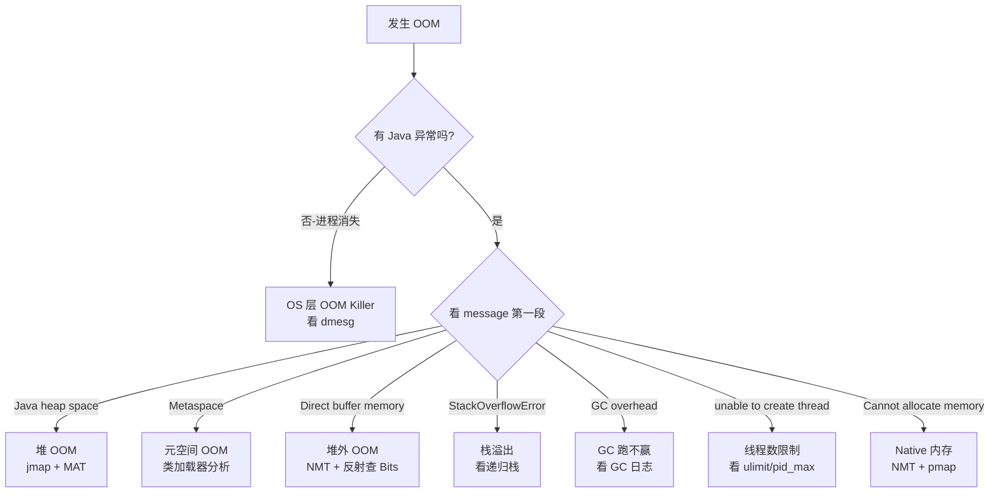

# 08.OOM八大现场全景剖析

#### 目录介绍
- [1. 案例引入](#1-案例引入)
  - [1.1 一夜八连OOM](#11-一夜八连oom)
  - [1.2 八张面孔之谜](#12-八张面孔之谜)
  - [1.3 我们要回答什么](#13-我们要回答什么)
- [2. OOM全景地图](#2-oom全景地图)
  - [2.1 OOM定义与分类](#21-oom定义与分类)
  - [2.2 八大现场总览](#22-八大现场总览)
  - [2.3 诊断决策树](#23-诊断决策树)
- [3. 堆OOM现场](#3-堆oom现场)
  - [3.1 错误信息识别](#31-错误信息识别)
  - [3.2 触发条件推导](#32-触发条件推导)
  - [3.3 三种典型成因](#33-三种典型成因)
  - [3.4 排查实战路径](#34-排查实战路径)
- [4. 元空间OOM](#4-元空间oom)
  - [4.1 永久代到元空间](#41-永久代到元空间)
  - [4.2 类加载器泄漏](#42-类加载器泄漏)
  - [4.3 动态代理失控](#43-动态代理失控)
  - [4.4 排查实战路径](#44-排查实战路径)
- [5. 直接内存OOM](#5-直接内存oom)
  - [5.1 堆外世界规则](#51-堆外世界规则)
  - [5.2 Cleaner回收机制](#52-cleaner回收机制)
  - [5.3 典型泄漏场景](#53-典型泄漏场景)
  - [5.4 排查实战路径](#54-排查实战路径)
- [6. 栈溢出现场](#6-栈溢出现场)
  - [6.1 StackOverflow真相](#61-stackoverflow真相)
  - [6.2 栈帧大小推导](#62-栈帧大小推导)
  - [6.3 线程数与栈](#63-线程数与栈)
  - [6.4 调优与避坑](#64-调优与避坑)
- [7. GC开销超限](#7-gc开销超限)
  - [7.1 错误本质拆解](#71-错误本质拆解)
  - [7.2 临界状态分析](#72-临界状态分析)
  - [7.3 假死与真死](#73-假死与真死)
- [8. Native内存泄漏](#8-native内存泄漏)
  - [8.1 进程RSS之谜](#81-进程rss之谜)
  - [8.2 NMT定位思路](#82-nmt定位思路)
  - [8.3 glibc碎片陷阱](#83-glibc碎片陷阱)
- [9. 容器与系统级OOM](#9-容器与系统级oom)
  - [9.1 线程数超限](#91-线程数超限)
  - [9.2 进程级OOMKiller](#92-进程级oomkiller)
  - [9.3 容器cgroup限制](#93-容器cgroup限制)
- [10. 综合案例串讲](#10-综合案例串讲)
  - [10.1 案例真相揭晓](#101-案例真相揭晓)
  - [10.2 一次OOM的一生](#102-一次oom的一生)
  - [10.3 设计哲学回扣](#103-设计哲学回扣)
  - [10.4 OOM速查表](#104-oom速查表)


## 1. 案例引入

### 1.1 一夜八连OOM

某电商平台大促前一周，压测环境出现"诡异连环 OOM"——同一个服务在不同压力下，**报出了 8 种完全不同的错误信息**，运维团队一夜没睡：

```
20:17  java.lang.OutOfMemoryError: Java heap space
21:33  java.lang.OutOfMemoryError: Metaspace
22:48  java.lang.OutOfMemoryError: Direct buffer memory
23:12  java.lang.StackOverflowError
00:25  java.lang.OutOfMemoryError: GC overhead limit exceeded
01:04  java.lang.OutOfMemoryError: unable to create new native thread
02:18  java.lang.OutOfMemoryError: Cannot allocate memory (mmap failed)
03:50  Killed                              # 容器被 OOMKiller 干掉，没有任何 Java 异常
```

研发同事拿到错误日志一脸懵：**"这 8 个不都是 OOM 吗？为什么解决方法完全不一样？"**

这就是本篇的源头疑问——**OutOfMemoryError 不是一种错误，而是一族错误**。每一种背后对应**完全不同的内存区域、完全不同的根因、完全不同的修复方式**。

### 1.2 八张面孔之谜

把上面 8 条错误按照"内存归属"画成一张图：

```
                 ┌────────────── Linux 进程 RSS ──────────────┐
                 │                                              │
                 │  ┌─── JVM 管控内存 ───┐  ┌─── 非 JVM 内存 ──┐│
                 │  │                    │  │                   ││
                 │  │  Java Heap         │  │  DirectByteBuffer ││
                 │  │  ① heap space      │  │  ③ Direct buffer  ││
                 │  │                    │  │                   ││
                 │  │  Metaspace         │  │  Thread Stacks    ││
                 │  │  ② Metaspace       │  │  ④ StackOverflow  ││
                 │  │                    │  │  ⑥ 创建线程失败    ││
                 │  │  GC 元数据/CodeCache│  │                   ││
                 │  │  ⑤ GC overhead     │  │  JNI / glibc       ││
                 │  │                    │  │  ⑦ Cannot allocate ││
                 │  └────────────────────┘  └───────────────────┘│
                 │                                                │
                 │  ⑧ 进程级 OOM Killer  ← 整个进程被内核杀死       │
                 └────────────────────────────────────────────────┘
```

**8 张面孔背后的 8 个独立问题**：

```
① 堆对象增长失控        → 业务代码、缓存、集合类
② 类加载泄漏            → 动态代理、热部署、CGLIB
③ 堆外缓冲区泄漏        → Netty、NIO、第三方库
④ 单线程递归过深        → 算法 / JSON 互引用 / 序列化
⑤ GC 跑赢不了分配速度    → 业务峰值 / 堆设置过小
⑥ 线程数突破系统限制     → 线程池失控 / 短连接风暴
⑦ glibc/JNI 内存碎片    → mmap 失败 / native 库 bug
⑧ 容器内存超限被杀       → 没设 -Xmx / 没考虑非堆
```

### 1.3 我们要回答什么

第 16 篇要把**这 8 张面孔**逐一讲透，每一种现场都按"错误信息识别 → 触发条件推导 → 典型成因 → 排查实战"四步法拆解。读完之后再遇到任意一种 OOM，**你能在 1 分钟内识别现场、5 分钟内圈定根因方向**。

带着这个目标，要回答 8 个核心问题：

```
① 堆 OOM 一定是"对象太多"吗？为什么有时候堆没满也会 OOM？        → 第3章
② Metaspace 没有最大限制吗？为什么 OOM 总在动态代理场景出？        → 第4章
③ DirectBuffer 不归 GC 管，那由谁回收？为什么会泄漏？             → 第5章
④ StackOverflowError 算不算 OOM？栈大小怎么算？                  → 第6章
⑤ "GC overhead limit"是 JVM 的"提前认输"吗？                    → 第7章
⑥ 进程 RSS 远超 -Xmx，多出来的内存哪去了？                       → 第8章
⑦ "unable to create new native thread"为什么不是 JVM 的错？     → 第9.1节
⑧ 容器里的进程为什么会"无声死亡"？OOMKiller 是怎么决定的？         → 第9.2节
```

本篇路线：

```
OOM 全景地图 (第2章)
    ↓
堆 OOM (第3章)              ─→ 最常见，但不一定最难
元空间 OOM (第4章)          ─→ 类加载视角
直接内存 OOM (第5章)        ─→ 堆外的特殊规则
栈溢出 (第6章)              ─→ 单线程视角
GC overhead (第7章)         ─→ 临界状态识别
Native 内存 (第8章)         ─→ NMT + pmap 协作
容器/系统级 (第9章)         ─→ Linux/cgroup 视角
    ↓
综合案例串讲 (第10章)
```


## 2. OOM全景地图

### 2.1 OOM定义与分类

**疑惑**：在 JDK 文档里搜索 `OutOfMemoryError`，能找到 8 种以上的子消息——它们都属于同一个 Java 类，但语义截然不同。这种设计合理吗？

**论证**：

1. **类型层面**：`OutOfMemoryError extends VirtualMachineError extends Error`——属于"不可恢复错误"，**理论上不应该 catch**
2. **错误来源**：JVM 在堆/元空间/直接内存等不同位置抛同一个异常类，靠 message 字符串区分
3. **历史包袱**：JDK 1.0 时只有"堆 OOM"，后续每加一种内存区域就复用同一个异常类——保持向下兼容
4. **替代方案**：理论上可以为每种 OOM 设计独立子类（`HeapOOM`、`MetaspaceOOM`），但破坏兼容性，且大部分用户根本不区分

**结论**：`OutOfMemoryError` 是一个**伞型异常**——共享类型、靠 message 区分子类型。这要求我们排查时**第一动作是看 message**，而不是看堆栈。

```java
// JDK 源码 java.lang.OutOfMemoryError
public class OutOfMemoryError extends VirtualMachineError {
    public OutOfMemoryError() { super(); }
    public OutOfMemoryError(String s) { super(s); }    // ← 全部秘密在 s 里
}
```

### 2.2 八大现场总览

| # | Error message | 内存区域 | JVM 内 / 外 | 典型根因 | 章节 |
|---|---|---|---|---|---|
| ① | `Java heap space` | Java Heap | JVM 内 | 对象泄漏、缓存失控 | §3 |
| ② | `Metaspace` | Metaspace | JVM 内 | 类加载泄漏 | §4 |
| ③ | `Direct buffer memory` | Direct Memory | JVM 外 | DirectByteBuffer 泄漏 | §5 |
| ④ | `StackOverflowError` | Thread Stack | JVM 外 | 递归 / 大局部变量 | §6 |
| ⑤ | `GC overhead limit exceeded` | Java Heap | JVM 内 | GC 跑不赢分配 | §7 |
| ⑥ | `unable to create new native thread` | Native | JVM 外 | 系统线程数限 | §9.1 |
| ⑦ | `Cannot allocate memory (mmap failed)` | Native | JVM 外 | glibc / JNI 泄漏 | §8 |
| ⑧ | OOM Killer (无 Java 异常) | OS / cgroup | OS 层 | 容器内存超限 | §9.2 |

**关键观察**：8 种现场中，**只有 ①②⑤ 真正属于 JVM 堆/类区**——其他 5 种都是"JVM 之外"的内存压力。这就是为什么很多线上 OOM 单看堆 dump 找不出原因的根本理由。

### 2.3 诊断决策树



**遵循这条决策树**，可以在看到错误的第一时间就把方向圈到 1/8——后续章节按这个顺序展开。


## 3. 堆OOM现场

### 3.1 错误信息识别

```
java.lang.OutOfMemoryError: Java heap space
    at java.util.Arrays.copyOf(Arrays.java:3210)
    at java.util.ArrayList.grow(ArrayList.java:265)
    at java.util.ArrayList.ensureExplicitCapacity(...)
    at com.foo.OrderCache.put(OrderCache.java:42)
```

最常见、最经典——**80% 的线上 OOM 是这一种**。

### 3.2 触发条件推导

**疑惑**：堆 OOM 一定是"对象太多"吗？

**论证**：HotSpot 在分配对象时，会按以下顺序尝试：

```
对象分配请求
    ↓
Eden TLAB 中分配 → 成功就返回
    ↓ 失败
触发 Young GC
    ↓
Eden + Survivor 仍不够大对象 → 直接进 Old
    ↓
Old 也放不下
    ↓
触发 Full GC
    ↓
Full GC 后还是放不下 ← 这一步才抛 Java heap space
```

**所以堆 OOM 的精确触发条件是**：

> **Full GC 后**，老年代仍然没有足够连续空间容纳本次分配请求。

注意三个关键词：**Full GC 后**、**没有足够空间**、**本次分配**。这意味着堆 OOM **不一定要"堆全满"**——分配一个 100 MB 大数组时，即使堆里有 200 MB 空闲但都是碎片，照样 OOM（CMS 时代的常见痛）。

**结论**：堆 OOM 的本质是"**Full GC 之后仍无法满足当次分配**"——它既可能是"对象太多"，也可能是"碎片太多"，还可能是"单次分配过大"。

### 3.3 三种典型成因

**成因 A：业务对象泄漏（最常见）**

```java
public class OrderCache {
    private static final Map<Long, Order> CACHE = new HashMap<>();   // 静态、永不淘汰
    
    public static void put(Long id, Order order) {
        CACHE.put(id, order);                                         // 只 put 不 remove
    }
}
// 一周下来缓存涨到几百万，堆撑爆
```

**成因 B：单次大对象分配**

```java
List<byte[]> blocks = new ArrayList<>();
blocks.add(new byte[1_000_000_000]);    // 单次申请 1 GB
// 即使堆里有 800MB 空闲，也直接 OOM
```

**成因 C：堆设置过小**

```bash
java -Xmx512m -jar app.jar
# 业务正常需要 2GB，启动几分钟就 OOM
```

### 3.4 排查实战路径

```bash
# 1. 启动参数加上自动 dump
-XX:+HeapDumpOnOutOfMemoryError
-XX:HeapDumpPath=/var/log/heap-${pid}-${timestamp}.hprof

# 2. 触发后用 MAT 打开 hprof
#    看 Leak Suspects → 直接给可疑大对象
#    看 Dominator Tree → 按 Retained Heap 排序

# 3. 应急复盘
jmap -histo:live <pid> | head -30      # 不导整堆，先看 Top30
jstat -gc <pid> 1000                   # 看 OU 是不是持续上涨
```

**MAT 三大杀招**（详见 15 篇 §8）：
1. **Dominator Tree**：找"删了能省多少"的真正大户
2. **Path to GC Roots**：选中可疑对象，查谁让它活着
3. **OQL**：精准定位"长度 > 阈值"的异常实例


## 4. 元空间OOM

### 4.1 永久代到元空间

**疑惑**：JDK 8 把永久代（PermGen）改成元空间（Metaspace），**问题是不是就解决了**？

**论证**：

1. PermGen 的核心问题是**固定大小**——`-XX:MaxPermSize` 一旦设定就吃死了，且和堆共享物理内存
2. Metaspace **改用本地内存**（Native Memory），默认**不限制**——这看似解决了问题
3. 但"不限制"的代价是**会一直涨到把 OS 内存吃光**——所以 JVM 加了 `-XX:MaxMetaspaceSize` 兜底，默认是无限
4. 大多数生产部署**不显式设这个参数**——一旦类加载失控，OS 就会先 OOMKill 进程

**结论**：Metaspace 不是"无敌"，它把"硬限制 OOM"换成了"软限制内存吃满 OOM"。**线上必须显式设置 `-XX:MaxMetaspaceSize`**——这是头号最佳实践。

### 4.2 类加载器泄漏

```
java.lang.OutOfMemoryError: Metaspace
```

**根本原因 99% 是类加载器泄漏**——某个 ClassLoader 加载了一批类后，本应被卸载，但被某根强引用拽住，导致：

```
ClassLoader 不死
    ↓
它加载的所有 Class 不死
    ↓
Class 对应的 Metaspace klass meta 不死
    ↓
Metaspace 越涨越大 → OOM
```

**典型反例**：

```java
public class LeakedHandler {
    private static final List<Object> HOLDER = new ArrayList<>();
    
    public static void register(Object instance) {
        HOLDER.add(instance);     // ← 引用了某个临时 ClassLoader 加载的对象
    }
}
// 临时 ClassLoader 加载完类、用完即弃
// 但 HOLDER 里持有它加载的实例 → ClassLoader 永不卸载
```

**为什么是 99%**：因为单纯"类太多"已经几乎不可能撑爆 Metaspace——一个类的 klass meta 大约几 KB，1 GB Metaspace 能装 20 万个类。**真出问题，必是类加载器在循环创建却卸载不掉**。

### 4.3 动态代理失控

第二大根因是**动态代理类的循环生成**：

```java
// 典型反例：每次调用都创建新的代理
public Object getProxy(Object target) {
    return Enhancer.create(target.getClass(), handler);   // CGLIB 每次生成新类
}

// 调用 100 万次 → Metaspace 里堆 100 万个 EnhancerByCGLIB$$xxx 类
```

CGLIB / Javassist / ByteBuddy 都会触发这种泄漏（见 32 篇）。**正确做法**是**复用代理类**——同一个目标类的代理只生成一次。

**Spring AOP 怎么避坑**：Spring 用 `ConcurrentHashMap<Class, Class>` 缓存代理类，同一个 target class 永远只生成一份代理。

### 4.4 排查实战路径

```bash
# 1. 启动开元空间监控
-XX:MaxMetaspaceSize=256m
-XX:+HeapDumpOnOutOfMemoryError

# 2. 看类加载速度
jstat -class <pid> 1000

  Loaded  Bytes  Unloaded  Bytes     Time
  100234  120MB    312       0.5MB   12.3
  100456  121MB    312       0.5MB   12.4    ← Loaded 持续涨
  100678  122MB    312       0.5MB   12.5    ← Unloaded 几乎不动

# 3. 看到底加载了什么类
jcmd <pid> VM.classloader_stats
jcmd <pid> GC.class_histogram | grep -i "EnhancerByCGLIB\|FastClassByCGLIB"

# 4. dump 一份分析
jcmd <pid> GC.heap_dump /tmp/m.hprof
# MAT 里看 ClassLoader 实例数和保留集
```

**MAT 视角排查**：在 MAT 里输入 OQL：

```sql
SELECT classloader, classloader.@retainedHeapSize 
FROM INSTANCEOF java.lang.ClassLoader classloader
ORDER BY classloader.@retainedHeapSize DESC
```

排在前面的 ClassLoader 通常就是泄漏源。


## 5. 直接内存OOM

### 5.1 堆外世界规则

```
java.lang.OutOfMemoryError: Direct buffer memory
```

**疑惑**：DirectByteBuffer 不在堆里，那它由谁限制？由谁回收？

**论证**：

```java
// JDK 源码 java.nio.Bits 简化版
static void reserveMemory(long size, int cap) {
    long maxMemory = MAX_MEMORY;        // 默认值 ≈ -Xmx
    long totalCap = TOTAL_CAPACITY.get();
    if (totalCap + cap > maxMemory) {
        // 触发一次 System.gc() 试图回收
        System.gc();
        // 再判断一次，还不够就抛 OOM
        if (TOTAL_CAPACITY.get() + cap > maxMemory) {
            throw new OutOfMemoryError("Direct buffer memory");
        }
    }
}
```

关键点：
1. **总量限制**：默认 `MAX_DIRECT_MEMORY ≈ -Xmx`，可通过 `-XX:MaxDirectMemorySize` 显式设
2. **超限时强 GC**：DirectByteBuffer 没满时会主动调 `System.gc()`——这是少数 JDK 自己调 System.gc 的地方
3. **回收靠 Cleaner**：DirectByteBuffer 不被引用后，附带的 Cleaner 在它的 `referent` 被回收时调 `Deallocator.run()` 释放堆外

**结论**：堆外内存**回收靠 GC 间接驱动**——这个设计存在天然的"GC 不来 → 堆外永不释放"风险。

### 5.2 Cleaner回收机制

```java
public class DirectByteBuffer {
    private final Cleaner cleaner;
    
    DirectByteBuffer(int cap) {
        long base = unsafe.allocateMemory(cap);                         // 调 malloc
        cleaner = Cleaner.create(this, new Deallocator(base, cap));     // 注册清理器
    }
    
    private static class Deallocator implements Runnable {
        public void run() {
            unsafe.freeMemory(address);                                 // 调 free
        }
    }
}
```

**回收路径**：

```
DirectByteBuffer 实例不再被引用
    ↓
Young/Full GC 把它当成垃圾
    ↓
JVM 检测它有附带 Cleaner（PhantomReference）
    ↓
Cleaner 进入 ReferenceQueue
    ↓
ReferenceHandler 线程拿出来执行 cleaner.clean()
    ↓
Deallocator.run() → unsafe.freeMemory() → 堆外内存归还
```

**问题点**：
- 如果 DirectByteBuffer 始终被某个强引用拽住（比如长生命周期对象的字段），**永远进不了 ReferenceQueue**
- 如果应用很少触发 GC（堆很大、对象生命周期长），**Cleaner 永远不被驱动**

### 5.3 典型泄漏场景

**场景 A：长生命周期对象持有 DirectByteBuffer**

```java
public class FileSender {
    private static final ByteBuffer BUF = ByteBuffer.allocateDirect(100 * 1024 * 1024);
    // 100 MB 永久占用堆外
}
```

**场景 B：Netty ByteBuf 忘记 release**

```java
public void channelRead(ChannelHandlerContext ctx, Object msg) {
    ByteBuf buf = (ByteBuf) msg;
    process(buf);
    // 忘了 buf.release()！PooledByteBuf 池化后无法归还
}
// PooledByteBufAllocator 内部维护 PoolArena，泄漏一段时间后池满，分配新的 → 堆外膨胀
```

**场景 C：第三方库使用堆外不当**

- RocksDB / LevelDB JNI 占用堆外
- gRPC / Netty 默认使用 PooledByteBufAllocator
- Kafka client 启动 socket buffer 堆外

### 5.4 排查实战路径

```bash
# 1. 显式限定堆外大小
-XX:MaxDirectMemorySize=512m

# 2. NMT 看堆外分布
jcmd <pid> VM.native_memory summary
# 找 "Internal" / "Other" 段，DirectByteBuffer 在 Internal

# 3. 反射看 Bits 当前已用
jcmd <pid> JFR.start duration=30s settings=profile
# 在 JMC 里看 jdk.DirectBufferStatistics 事件

# 4. Netty 专属：开 leak detector
-Dio.netty.leakDetection.level=PARANOID
```

**应急释放**：手动触发 GC 强制 Cleaner 跑一遍：

```java
System.gc();
Thread.sleep(1000);     // 等 ReferenceHandler 处理
```

但这是**应急止血**——根因还是要找到泄漏点修。


## 6. 栈溢出现场

### 6.1 StackOverflow真相

**疑惑**：`StackOverflowError` 是 OOM 吗？

**论证**：从类型上看：

```
StackOverflowError extends VirtualMachineError
OutOfMemoryError    extends VirtualMachineError
```

**它们是兄弟，不是父子**——StackOverflow 不属于 OutOfMemoryError 体系。但从语义看，"栈空间不够用"也是一种内存不足，所以本篇把它纳入"广义 OOM 现场"。

**结论**：StackOverflow 是**单线程的、栈帧维度的**内存不足；OOM 是**进程维度的、堆/类区/堆外**的内存不足。区分它们的关键点：

| 维度 | StackOverflowError | OutOfMemoryError |
|---|---|---|
| 内存归属 | 单个线程的栈 | 全进程共享区域 |
| 大小 | 默认 ≈ 1 MB（`-Xss`） | 由 -Xmx 等控制 |
| 表现 | 单次调用链过深 | 整体内存压力 |
| 影响 | 该线程崩溃，其他正常 | 全 JVM 受影响 |

### 6.2 栈帧大小推导

栈空间被分成一个个**栈帧**（Stack Frame），每次方法调用就压一帧。每帧大小由：

```
栈帧 ≈ 局部变量表 + 操作数栈 + 返回地址 + 额外信息
     ≈ (参数槽位 + 局部变量槽位) × 4 字节 + 固定开销
```

**实测数据**：一个普通方法栈帧约 **30~80 字节**；带大局部变量数组的方法可能上 KB。

```java
public static void recurse() {
    byte[] big = new byte[800];     // 局部变量在栈上占 800B + 栈帧自身约 50B
    recurse();
}
// 1 MB / 850B ≈ 1234 层就 StackOverflow
```

如果换成普通递归：

```java
public static void recurse(int n) {
    recurse(n + 1);
}
// 1 MB / 50B ≈ 20000 层
```

**典型公式**：`max_depth ≈ -Xss / 平均栈帧大小`

### 6.3 线程数与栈

**关键认知**：每个 Java 线程都独占一份栈空间。所以：

```
线程总栈消耗 ≈ Thread 数 × -Xss
```

`-Xss=1m` + 1000 线程 = **1 GB 堆外内存**——这部分**不属于堆**，但实实在在吃进程 RSS。这也是为什么 NMT 里 Thread 段经常占大头。

**反向决策**：如果某个微服务承诺要支撑 5000 线程，但堆外内存预算只有 2 GB——那 `-Xss` 必须压到 384 KB 以下，否则要么栈不够，要么 RSS 超标。

### 6.4 调优与避坑

**避坑 A：JSON 互相引用导致序列化栈爆**

```java
class Department { List<Employee> emps; }
class Employee   { Department dept; }
// new ObjectMapper().writeValueAsString(dept)
// → toString 里互相引用，无限递归 → StackOverflow
```

解决：`@JsonIgnore` 或 `@JsonBackReference` 切断回引。

**避坑 B：递归未设终止条件 / 终止条件错误**

```java
public int factorial(int n) {
    return n * factorial(n - 1);   // 缺 if (n <= 1) return 1;
}
```

**避坑 C：错误捕获 StackOverflowError**

```java
try {
    deepRecurse();
} catch (StackOverflowError e) {
    log.error("recovered", e);     // 错误的"恢复"
}
```

`StackOverflowError` 属于 `Error`，**不应该 catch**——它意味着栈状态已经污染，任何 Java 代码都不安全。

**调优**：

```bash
-Xss512k                          # 单线程栈减半，能容纳更多线程
-XX:ThreadStackSize=512           # 等价（单位 KB）
```


## 7. GC开销超限

### 7.1 错误本质拆解

```
java.lang.OutOfMemoryError: GC overhead limit exceeded
```

**疑惑**：堆还没满，为什么 JVM 自己"提前认输"？

**论证**：这是 JVM 的**自我保护机制**。触发条件：

> **连续 5 次 Full GC**，且**总 GC 时间占程序总时间 ≥ 98%**，但**堆释放量 < 2%**。

JVM 检测到这种状态时主动抛出，**避免应用陷入"GC 风暴 + 假死"的状态无法自拔**。

```c
// HotSpot 源码 gcOverheadChecker.cpp 简化版
if (gc_count_since_last_throw >= 5 &&
    gc_time_ratio >= 0.98 &&
    heap_freed_ratio < 0.02) {
    throw_oom("GC overhead limit exceeded");
}
```

**结论**：这是 JVM 的"举白旗信号"——**它告诉你：再不修，应用就要彻底假死了**。

### 7.2 临界状态分析

举一个临界场景：

```
堆 4 GB，已用 3.95 GB（98.75%）
↓
分配新对象 → Full GC
↓
回收掉 50 MB（仅 1.27%）
↓
分配 + 回收持续撞临界线
↓
连续 5 次 Full GC 后，单次 Full GC 耗时 8s，应用线程几乎不跑
↓
JVM: "再这样下去你这进程就废了" → 主动抛 OOM
```

如果没有这个保护，应用会陷入**"99% 时间都在 Full GC、1% 时间在响应业务"**——P99 飙到分钟级，看起来"还活着"，实际已经事实死亡。**这种"假死比真死还可怕"**。

### 7.3 假死与真死

| 状态 | 表现 | 应对 |
|---|---|---|
| **真 OOM** | 异常立即抛、监控明显 | 重启 + 修复 |
| **GC overhead** | 异常前已假死数分钟 | 同上 + 警惕 |
| **未保护的假死** | 慢成龟、监控可能漏报 | 必须开此保护 |

**关闭这个保护是反模式**：

```bash
-XX:-UseGCOverheadLimit       # ← 不要这么干！会让应用陷入更可怕的假死
```

**正确做法**：留着保护，把 OOM 当信号，扩堆 / 优化代码 / 换 GC（G1 / ZGC 见 03 篇 / 17 篇）。


## 8. Native内存泄漏

### 8.1 进程RSS之谜

```
ps aux | grep java
# RSS = 12 GB   ← 实际进程占内存
# -Xmx = 4 GB   ← 堆上限
```

**疑惑**：堆只 4 GB，那剩下 8 GB 在哪儿？

**论证**：Linux 进程 RSS 是**所有内存映射的总和**：

```
RSS = Java Heap                    ← 由 -Xmx 控制
    + Metaspace                    ← 由 -XX:MaxMetaspaceSize
    + Thread Stacks                ← Thread 数 × -Xss
    + CodeCache                    ← 由 -XX:ReservedCodeCacheSize
    + GC 元数据                    ← G1/ZGC 元数据可达堆 10%~20%
    + DirectByteBuffer             ← MaxDirectMemorySize
    + JNI 库 malloc                ← 不受 JVM 管控
    + glibc 内存碎片               ← 同样不受 JVM 管控
    + mmap 文件                    ← FileChannel.map / Unsafe.allocateMemory
```

**典型分布**（4 GB 堆的微服务）：

```
Java Heap         4096 MB  ━━━━━━━━━━━━━━━━━━━━━━━━━━━━━━
Metaspace          256 MB  ━━
Thread Stacks      512 MB  ━━━━ (512 线程 × 1MB)
CodeCache          240 MB  ━━
GC 元数据          400 MB  ━━━
DirectByteBuffer   512 MB  ━━━━
JNI / glibc       1024 MB  ━━━━━━━━ ← 黑洞
─────────────────────────
进程 RSS         ≈ 7 GB
```

**结论**：堆只占 RSS 的 50%~60% 是常态——理解这个基线，才能避免"堆没满但容器被杀"的困惑。

### 8.2 NMT定位思路

```bash
# 启动开 NMT
-XX:NativeMemoryTracking=detail

# 跑一段时间后做基线
jcmd <pid> VM.native_memory baseline

# 再过一段时间，看差量
jcmd <pid> VM.native_memory summary.diff

# 输出
- Java Heap (reserved=4194304KB +0KB, committed=4194304KB +0KB)
- Class      (reserved=1099912KB +5120KB, committed=78912KB +12288KB)  ← 在涨
- Thread     (reserved=132588KB +0KB, committed=132588KB +0KB)
- Internal   (reserved=523456KB +102400KB, committed=523456KB +102400KB) ← 大涨
```

**Internal 段大涨**：通常对应 DirectByteBuffer / Unsafe.allocateMemory。**Class 段大涨**：类加载泄漏。**Thread 段大涨**：线程数失控。

### 8.3 glibc碎片陷阱

NMT 只能看见 JVM 内部分配——**JNI 调用 malloc 的部分 NMT 看不到**。这部分要靠：

```bash
# 1. pmap 查看进程内存映射
pmap -x <pid> | sort -k 3 -n -r | head

# 看到大量 [anon] 段 → JNI 库或 glibc 碎片

# 2. 切换到 jemalloc 看分配 profile
LD_PRELOAD=/usr/lib/libjemalloc.so MALLOC_CONF="prof:true,prof_active:true" \
    java -jar app.jar
# 然后用 jeprof 分析 heap profile
```

**glibc 碎片**：glibc 的 malloc 在大量小对象分配释放后会产生碎片，**进程 RSS 涨上去就下不来了**——即使应用层"释放"了，glibc 也不归还给 OS。**应对**：
- 切换到 jemalloc / tcmalloc，碎片率显著低
- `MALLOC_ARENA_MAX=2` 限制 glibc arena 数量（多 arena 会放大碎片）


## 9. 容器与系统级OOM

### 9.1 线程数超限

```
java.lang.OutOfMemoryError: unable to create new native thread
```

**疑惑**：这到底是 Java 的内存问题，还是系统的限制？

**论证**：JVM 创建线程的底层路径是：

```
new Thread().start()
    ↓
JVM_StartThread (JNI)
    ↓
pthread_create()           ← Linux 系统调用
    ↓
内核分配 task_struct + 栈
    ↓
失败可能原因：
  ① ulimit -u 限制（用户最大进程/线程数）
  ② /proc/sys/kernel/pid_max 总 PID 上限
  ③ 物理内存不够分栈空间
  ④ 容器 cgroup pids.max 限制
```

**结论**：这个 OOM 名字带"OutOfMemory"，但**根因常常是 OS 限制而非内存不足**。所以 message 里说 "unable to create new native thread" 而不是 "Java heap"。

**排查**：

```bash
# 当前线程数
ps -o nlwp <pid>
cat /proc/<pid>/status | grep Threads

# 系统限制
ulimit -u                         # 单用户线程数限
cat /proc/sys/kernel/threads-max  # 系统级
cat /proc/sys/kernel/pid_max      # PID 上限

# 容器限制
cat /sys/fs/cgroup/pids/pids.max
```

### 9.2 进程级OOMKiller

最可怕的现场——**没有任何 Java 异常**，进程"无声死亡"：

```bash
$ dmesg | tail
[12345.6789] Out of memory: Kill process 1234 (java) score 985 or sacrifice child
[12345.6790] Killed process 1234 (java) total-vm:8245760kB, anon-rss:7892480kB
```

**触发逻辑**：当 OS 整体内存不够时，内核启动 OOMKiller，按"badness score"排序杀进程：

```
score = RSS + (其他因子)
     ↑
   占内存越多，分数越高，越容易被杀
```

**Java 进程因为常年 RSS 大，是 OOMKiller 的头号目标**。

**关键认知**：

```
JVM 抛 OutOfMemoryError 的前提：JVM 还活着
OS 杀进程：JVM 已经没机会抛任何异常
```

所以容器场景下**最危险的不是看到 OOM 异常，而是没看到任何异常进程突然消失**——必须查 `dmesg` 或 K8s 的 `kubectl describe pod`。

### 9.3 容器cgroup限制

K8s 设置 `resources.limits.memory: 4Gi` 时：

```
JVM 看到的物理内存 ← 取决于 -XX:+UseContainerSupport
RSS 上限          = 4 GB（cgroup 硬限制）
内核行为          = 超限就 OOMKill
```

**OOMKill 不抛 OutOfMemoryError**——cgroup 是硬限制，进程被信号 9 杀死，连 finally 都来不及跑。

**最佳实践**：

```bash
# 容器内启动参数
-XX:+UseContainerSupport                # JDK 10+ 默认
-XX:MaxRAMPercentage=70.0               # 堆只取容器内存 70%
-XX:MaxMetaspaceSize=256m               # 必设
-XX:MaxDirectMemorySize=512m            # 必设
-Xss512k                                # 减小线程栈
```

留 30% 给：Metaspace + DirectBuffer + Thread Stacks + CodeCache + GC 元数据 + JNI。**否则就是用堆撞 cgroup 上限**——必死。


## 10. 综合案例串讲

### 10.1 案例真相揭晓

回到第 1 章那次"一夜八连 OOM"，逐条揭晓：

**① `Java heap space`**（20:17）→ 第 3 章。压测流量上来后，业务缓存 OrderCache 用了 `static HashMap` 永不淘汰——典型的**对象泄漏**。MAT 一看 Dominator Tree，HashMap 占 2.8 GB Retained Heap。**修复**：换 Caffeine 加 LRU + 最大容量限制。

**② `Metaspace`**（21:33）→ 第 4 章。压测期间反复重启发现 Metaspace 持续涨——后端用 CGLIB 给每个 RPC 调用动态生成代理，**没有缓存复用**。`jcmd VM.classloader_stats` 显示 5 万个 EnhancerByCGLIB 类。**修复**：复用代理类。

**③ `Direct buffer memory`**（22:48）→ 第 5 章。Netty 业务忘了 `release()`，`PooledByteBufAllocator` 池满后向系统申请新内存撑爆。开 `io.netty.leakDetection.level=PARANOID` 后立即报告泄漏栈。**修复**：所有 ByteBuf 走 try-finally release。

**④ `StackOverflowError`**（23:12）→ 第 6 章。Jackson 序列化时 Department ⇄ Employee 互引用。**修复**：`@JsonIgnore` 切断回引。

**⑤ `GC overhead limit exceeded`**（00:25）→ 第 7 章。堆 4 GB，业务真实需要 8 GB，连续 5 次 Full GC 释放都不到 2%。**修复**：扩堆到 8 GB，同时换 G1。

**⑥ `unable to create new native thread`**（01:04）→ 第 9.1 节。线程池 corePoolSize 配错为 Integer.MAX_VALUE，被打满后系统 ulimit 拒绝创建。`ulimit -u` 显示 4096，但程序想开 8000+。**修复**：限制线程池 + 调高 ulimit。

**⑦ `Cannot allocate memory (mmap failed)`**（02:18）→ 第 8 章。某 JNI 库（调用第三方加解密）有 native 内存泄漏，glibc 碎片严重。pmap 看到上千个 [anon] 段。**修复**：切换 jemalloc + 升级 native 库版本。

**⑧ Killed (OOM Killer)**（03:50）→ 第 9.2 节。容器 limit 设 4Gi，但 -Xmx=4g 没留任何余地——堆没溢出，但 Metaspace + 线程栈 + DirectBuffer 加起来突破 cgroup 上限，被内核 SIGKILL。**修复**：`-XX:MaxRAMPercentage=70.0` 留余地。

**根本症结**：这台压测机器**从配置上就是个炸药桶**——OrderCache 没限容、CGLIB 不复用、Netty 漏 release、JSON 循环引用、堆配置过小、线程池不限、JNI 库有 bug、容器参数不留余地——任意一个被压到极致，都会触发不同颜色的 OOM。**8 种 OOM 不是 8 个 bug，是 1 个系统级失误的 8 种投影**。

### 10.2 一次OOM的一生

把堆 OOM 这一类（最经典的 ①）从触发到崩溃的完整时间线串起来，回扣 01~15 篇要素：

```
T 0     OrderCache.put() 调用
        [01篇] 在 Eden TLAB 中分配 Order 对象
        [13篇] 字节码 invokevirtual HashMap.put
        [04篇] HashMap 内部 hash 散列、定位桶
        
T+1ms   Order 对象大小超过 TLAB 剩余 → 新申请 TLAB
        [01篇] Eden 中创建新的 TLAB
        
T+2s    Eden 满 → 触发 Young GC
        [03篇] 复制算法：存活对象到 Survivor
        Order 对象因被 OrderCache 强引用 → 存活
        
T+30s   存活对象多次 Young GC 后晋升 Old
        [03篇] 分代年龄达到阈值（默认 15）
        OrderCache 的 HashMap 数据结构在 Old
        
T+10min Old 区使用率超 IHOP 阈值 → 并发标记
        [03篇] G1 / CMS 启动并发回收
        但 OrderCache 是强引用，无法回收
        
T+30min Old 区接近满，分配压力剧增
        [03篇] Mixed GC 频率上升
        [本篇 §7] GC overhead 接近临界
        
T+45min Old 区无可用空间 → Full GC
        STW 8 秒，回收量 < 2%
        
T+50min 连续 5 次 Full GC 触发保护
        [本篇 §3] 抛出 OutOfMemoryError: Java heap space
        
T+50min+ -XX:+HeapDumpOnOutOfMemoryError 触发
        [15篇 §3.4] hprof 文件落盘
        
事后    [15篇 §8] MAT 打开 hprof
        Dominator Tree → OrderCache 占 2.8 GB
        Path to GC Roots → static 字段
        OQL 查 HashMap 的 size → 270 万条
        
        定位修复：换 Caffeine（22 篇预告）
```

这条时间线串起本册前 15 篇 80% 的关键概念——从对象分配到 TLAB、从 Young GC 到 Full GC、从字节码到 GC overhead 保护，**最终被本篇的"OOM 全景"框架定位**。

### 10.3 设计哲学回扣

跳出技术细节，提炼三条贯穿全册的设计哲学：

1. **失败要可识别**：`OutOfMemoryError` 用 message 区分 8 种现场——而不是吞掉错误返回 null。这是 Java "**Fail-Fast 原则**" 的极致体现。同样的思想见 04 篇 ConcurrentModificationException、09 篇 volatile 的可见性保证。**结论**：**让错误暴露在最早、最近的位置**。

2. **保护性设计**：`GC overhead limit exceeded` 是 JVM 主动放弃——它宁可让进程崩溃，也不让进程"假死"。这种"**主动失败优于被动假死**"的哲学在 03 篇 GC 暂停阈值、08 篇锁的快速失败、10 篇线程池 RejectedExecutionHandler 上反复出现。

3. **分层负责**：8 种 OOM 对应 8 个不同的内存区域——每个区域有自己的限制参数、自己的回收机制、自己的 OOM 信号。**没有一处"统一管理所有内存"的代码**——每个层都只对自己负责。这种"**机制策略分离**"的思想后续在 36 篇 AQS 框架（机制）vs 各种 Lock（策略）、43 篇 Netty Pipeline 上还会重现。

### 10.4 OOM速查表

最后一张表，建议截图保存：

| OOM 类型 | 关键词 | 主因 | 必备参数 | 排查工具 |
|---|---|---|---|---|
| 堆 OOM | `Java heap space` | 对象泄漏 | `-Xmx` `+HeapDumpOnOOM` | jmap + MAT |
| 元空间 | `Metaspace` | ClassLoader 泄漏 | `-XX:MaxMetaspaceSize` | jstat -class + MAT |
| 直接内存 | `Direct buffer memory` | DirectBuffer/Netty 泄漏 | `-XX:MaxDirectMemorySize` | NMT + JFR |
| 栈溢出 | `StackOverflowError` | 递归 / 互引用 | `-Xss` | jstack |
| GC 超限 | `GC overhead limit` | 堆配置过小 | 留着别关 | GC 日志 |
| 线程数 | `unable to create thread` | 线程池失控 / ulimit | 业务限流 | ps -L / ulimit |
| Native | `Cannot allocate memory` | JNI / glibc 碎片 | `-XX:NativeMemoryTracking` | NMT + pmap |
| OOMKiller | 进程消失无异常 | 容器超 cgroup | `-XX:MaxRAMPercentage` | dmesg |

**线上必备的 6 个启动参数模板**（容器场景）：

```bash
-Xmx4g -Xms4g                                  # 锁死堆大小
-XX:MaxMetaspaceSize=256m                      # 限制元空间
-XX:MaxDirectMemorySize=512m                   # 限制堆外
-XX:MaxRAMPercentage=70.0                      # 容器留 30% 余地
-XX:NativeMemoryTracking=summary               # 开 NMT
-XX:+HeapDumpOnOutOfMemoryError                # 自动 dump
-XX:HeapDumpPath=/var/log/heap-${pid}.hprof
```

**这套参数能在出事时**给你 3 个礼物：堆 dump、NMT 报告、容器留有缓冲。

掌握 OOM 全景图，才算真正"看懂"JVM 的边界——下一篇我们顺着"知道了 8 种现场，那这些参数到底怎么调"这条线，进入 **第 17 篇：JVM 参数调优全景图**——把堆/GC/JIT/诊断四大类参数体系一次讲透，并附真实线上调优案例。
