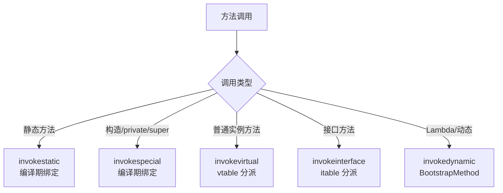

# 13.字节码指令集与javap实战

#### 目录介绍
- [1. 案例引入](#1-案例引入)
  - [1.1 一段诡异计数](#11-一段诡异计数)
  - [1.2 顺藤摸到字节码](#12-顺藤摸到字节码)
  - [1.3 我们要回答什么](#13-我们要回答什么)
- [2. Class文件全貌](#2-class文件全貌)
  - [2.1 十大组件结构](#21-十大组件结构)
  - [2.2 魔数与版本号](#22-魔数与版本号)
  - [2.3 为何如此设计](#23-为何如此设计)
- [3. 常量池入口](#3-常量池入口)
  - [3.1 17种常量类型](#31-17种常量类型)
  - [3.2 符号引用本质](#32-符号引用本质)
  - [3.3 常量池索引](#33-常量池索引)
  - [3.4 javap读常量池](#34-javap读常量池)
- [4. 方法字节码结构](#4-方法字节码结构)
  - [4.1 方法表与属性](#41-方法表与属性)
  - [4.2 Code属性详解](#42-code属性详解)
  - [4.3 操作数栈机制](#43-操作数栈机制)
  - [4.4 局部变量表](#44-局部变量表)
- [5. 字节码指令家族](#5-字节码指令家族)
  - [5.1 加载存储指令](#51-加载存储指令)
  - [5.2 算术运算指令](#52-算术运算指令)
  - [5.3 类型转换指令](#53-类型转换指令)
  - [5.4 对象操作指令](#54-对象操作指令)
  - [5.5 控制转移指令](#55-控制转移指令)
- [6. 方法调用四指令](#6-方法调用四指令)
  - [6.1 invokestatic](#61-invokestatic)
  - [6.2 invokespecial](#62-invokespecial)
  - [6.3 invokevirtual](#63-invokevirtual)
  - [6.4 invokeinterface](#64-invokeinterface)
  - [6.5 invokedynamic](#65-invokedynamic)
- [7. 异常表与栈映射](#7-异常表与栈映射)
  - [7.1 异常表机制](#71-异常表机制)
  - [7.2 StackMapTable](#72-stackmaptable)
- [8. javap实战手册](#8-javap实战手册)
  - [8.1 常用参数速查](#81-常用参数速查)
  - [8.2 读懂helper方法](#82-读懂helper方法)
  - [8.3 还原源码意图](#83-还原源码意图)
- [9. 字节码常见陷阱](#9-字节码常见陷阱)
  - [9.1 自增非原子性](#91-自增非原子性)
  - [9.2 字符串拼接坑](#92-字符串拼接坑)
  - [9.3 finally吞返回值](#93-finally吞返回值)
- [10. 综合案例串讲](#10-综合案例串讲)
  - [10.1 案例真相揭晓](#101-案例真相揭晓)
  - [10.2 一行代码的一生](#102-一行代码的一生)
  - [10.3 设计哲学回扣](#103-设计哲学回扣)
  - [10.4 指令速查表](#104-指令速查表)


## 1. 案例引入

### 1.1 一段诡异计数

先看一段在面试和生产里都坑过人的代码：

```java
public class CounterDemo {
    private int count = 0;

    public int increment() {
        return count++;        // 看似原子的"自增并返回"
    }

    public static void main(String[] args) throws InterruptedException {
        CounterDemo demo = new CounterDemo();
        Thread[] threads = new Thread[10];
        for (int i = 0; i < 10; i++) {
            threads[i] = new Thread(() -> {
                for (int j = 0; j < 10000; j++) {
                    demo.increment();
                }
            });
            threads[i].start();
        }
        for (Thread t : threads) t.join();
        System.out.println("最终值: " + demo.count);
        // 期望值 100000，实际可能是 78321、85234……每次都不同
    }
}
```

**现象**：10 个线程各 +1 一万次，预期 `count` 应当是 100000，**实际几乎从来达不到**。

**直觉怀疑**：是不是 `count++` 漏了某次执行？打印 `increment()` 的调用次数，**正好是 100000**——一次都没漏。

那问题出在哪？

### 1.2 顺藤摸到字节码

光看 Java 源码看不出问题，因为 `count++` 在源码层面就是**一个表达式**。但 JVM 不是直接执行 Java 源码的，它执行的是**字节码**。我们用 `javap -c` 反汇编一下：

```bash
$ javac CounterDemo.java
$ javap -c -p CounterDemo
```

```
public int increment();
    Code:
       0: aload_0           // 把 this 压入操作数栈
       1: dup               // 复制栈顶（此时栈：[this, this]）
       2: getfield   #2     // 取 count，弹出一个 this（栈：[this, count]）
       5: dup_x1            // 复制 count，插到 this 下面（栈：[count, this, count]）
       6: iconst_1          // 压入常量 1（栈：[count, this, count, 1]）
       7: iadd              // 弹出栈顶两个相加（栈：[count, this, count+1]）
       8: putfield   #2     // 把 count+1 写回字段（栈：[count]）
      11: ireturn           // 返回栈顶的旧 count
```

看到了吗？`count++` 在字节码层面**不是 1 步，是 6 步**：读 → 复制旧值 → 加 1 → 写回。这 6 步之间任何一步都可能被另一个线程打断：

```
时间线 ──────────────────────────────────────────────→
线程 A: getfield(读到5) ─────── iadd(算出6) ─── putfield(写6)
线程 B:        getfield(也读到5) ─── iadd(算出6) ── putfield(写6)
                                                       ↑
                                              两个线程都把 5 改成了 6
                                              本应 +2 实际只 +1
```

这就是丢更新的字节码层证据。表面看 `count++` 是"一行代码"，**字节码层面它根本不是原子操作**。

我们带着这个真相，至少可以挖出 7 个问题：

```
① Class 文件凭什么能被 JVM 认出来？魔数从哪来？        → 第2章
② 字节码里那些 #2 #4 之类的索引是什么？             → 第3章
③ 操作数栈和局部变量表怎么协作的？                 → 第4章
④ aload_0 / iload_1 这堆指令到底有多少种？           → 第5章
⑤ 调方法为什么有 invokestatic/special/virtual 几种？   → 第6章
⑥ try-catch 在字节码里长什么样？没看到 catch 指令？     → 第7章
⑦ 怎么用 javap 真正读懂一段陌生代码的字节码？         → 第8章
```

### 1.3 我们要回答什么

第 13 篇就是要把这 7 个问题逐一回答，**让你从此能用 `javap` 当 X 光机**。读完之后再回头看 `count++`，你不仅能解释它为什么不是原子的，还能给出 4 种修复方案并讲清各自的字节码差异。

本篇路线：

```
Class 文件全貌 (第2章)
    ↓
常量池 (第3章) ─→ 解开"#2 #4 索引"之谜
    ↓
方法字节码结构 (第4章) ─→ 看清操作数栈与局部变量表
    ↓
指令家族 + 方法调用 (第5-6章) ─→ 200+ 条指令分类速记
    ↓
异常表 + StackMap (第7章) ─→ try-catch 的真相
    ↓
javap 实战手册 (第8章) ─→ 武器库
    ↓
常见陷阱 (第9章) + 综合案例 (第10章)
```


## 2. Class文件全貌

### 2.1 十大组件结构

Class 文件是一种**严格定义的二进制格式**，由 10 个部分按固定顺序排列。它没有任何分隔符，全靠**长度字段**和**位置约定**寻址：

```
┌────────────────────────────────────┐
│ ① 魔数 magic            u4 (CAFEBABE) │
├────────────────────────────────────┤
│ ② 副版本号 minor_version u2          │
│ ③ 主版本号 major_version u2          │
├────────────────────────────────────┤
│ ④ 常量池计数 + 常量池                  │
│   constant_pool_count   u2          │
│   constant_pool[count-1]            │
├────────────────────────────────────┤
│ ⑤ 访问标志 access_flags  u2          │
│   (PUBLIC/FINAL/SUPER/INTERFACE...) │
├────────────────────────────────────┤
│ ⑥ 类索引、父类、接口表                  │
│   this_class    u2                  │
│   super_class   u2                  │
│   interfaces[]                      │
├────────────────────────────────────┤
│ ⑦ 字段表 fields[]                    │
├────────────────────────────────────┤
│ ⑧ 方法表 methods[]    ←──── 字节码    │
│   就藏在每个 method 的                │
│   Code 属性里                       │
├────────────────────────────────────┤
│ ⑨ 属性表 attributes[]                │
│   (SourceFile / InnerClasses ...)    │
└────────────────────────────────────┘
```

**关键认知**：字节码不是孤立存在的，它寄生在**方法表的 Code 属性**里。要看字节码，必须先穿过常量池和方法表两层。

### 2.2 魔数与版本号

打开任何一个 `.class` 文件，前 4 个字节永远是 `CA FE BA BE`：

```bash
$ xxd CounterDemo.class | head -3
00000000: cafe babe 0000 0041 0024 0a00 0700 1709  .......A.$......
00000010: 0006 0018 0a00 1900 1a09 001b 001c 0a00  ................
00000020: 0019 001d 0700 1e07 001f 0100 0563 6f75  .............cou
```

- **魔数 `0xCAFEBABE`**：JVM 拿到任何文件，先看前 4 字节，不是这个就直接拒绝（防止把 JPEG 喂给 JVM）
- **副版本号** `0x0000`、**主版本号** `0x0041`（十进制 65 = JDK 21）

Java 版本号映射：

| 主版本号 | JDK 版本 | 主版本号 | JDK 版本 |
|---|---|---|---|
| 52 | JDK 8 | 61 | JDK 17 |
| 55 | JDK 11 | 65 | JDK 21 |
| 58 | JDK 14 | 67 | JDK 23 |

```bash
# 一行命令看 class 文件版本
$ javap -v CounterDemo.class | grep "major version"
  major version: 65
```

### 2.3 为何如此设计

**疑惑**：为什么不像 JSON 那样自描述？为什么用紧凑的二进制？

**论证**：
1. **解析速度**：JVM 启动要加载几千个类，每个类都要解析。固定偏移 + 定长字段，解析复杂度是 O(n)，不需要词法分析。如果用 JSON，光启动就慢 10 倍以上。
2. **空间紧凑**：rt.jar 里有上万个类。二进制比文本省 5~8 倍空间，对手机/嵌入式设备至关重要（早年 Java 立足之本是嵌入式）。
3. **版本前置**：主/副版本号紧跟魔数后面，**校验失败可以最早返回**。"高版本 class 跑在低版本 JVM" 是最常见的故障，前置版本检查让错误来得越早越好。
4. **常量池前置**：后续所有引用都用常量池索引表达。一次解析、多处复用，**避免字符串重复存储**。

**结论**：Class 文件结构不是"想怎么定就怎么定"，每一个字段位置都被"启动速度 + 空间占用 + 错误前置 + 引用复用"四个目标共同驱动。这种"机制与策略分离 + 紧凑表达"的思想会贯穿整个 JVM。


## 3. 常量池入口

### 3.1 17种常量类型

常量池是 Class 文件的**心脏**——它占了整个文件 60%+ 的体积，也是后续所有指令引用的"字典"。

JVM 规范定义了 17 种常量类型（截至 JDK 21）：

| Tag | 类型 | 描述 |
|---|---|---|
| 1 | CONSTANT_Utf8 | UTF-8 编码字符串（**所有字面量、名字最终都归到它**） |
| 3 | CONSTANT_Integer | int 字面量 |
| 4 | CONSTANT_Float | float 字面量 |
| 5 | CONSTANT_Long | long 字面量 |
| 6 | CONSTANT_Double | double 字面量 |
| 7 | CONSTANT_Class | 类或接口的符号引用 |
| 8 | CONSTANT_String | String 字面量 |
| 9 | CONSTANT_Fieldref | 字段的符号引用 |
| 10 | CONSTANT_Methodref | 普通方法的符号引用 |
| 11 | CONSTANT_InterfaceMethodref | 接口方法的符号引用 |
| 12 | CONSTANT_NameAndType | 名字+类型描述符 |
| 15 | CONSTANT_MethodHandle | 方法句柄（invokedynamic 用） |
| 16 | CONSTANT_MethodType | 方法类型 |
| 17 | CONSTANT_Dynamic | 动态计算常量（JDK 11+） |
| 18 | CONSTANT_InvokeDynamic | invokedynamic 指令 |
| 19 | CONSTANT_Module | 模块（JDK 9+） |
| 20 | CONSTANT_Package | 包（JDK 9+） |

### 3.2 符号引用本质

**疑惑**：为什么字段、方法、类要分别用不同的常量类型？为什么不直接存"完整名字"？

**论证**：考虑一个 `System.out.println("hi")` 调用，涉及：
- 类 `java/lang/System`
- 字段 `out`，类型 `Ljava/io/PrintStream;`
- 方法 `println`，签名 `(Ljava/lang/String;)V`
- 字符串字面量 `"hi"`

如果每次都把这些字符串拼成一个长串存储，rt.jar 里会有几十万次重复。**常量池采用"分层引用"——上层常量引用下层常量**：

```
CONSTANT_Methodref (方法引用)
    ├── 类引用 → CONSTANT_Class
    │              └── UTF-8 "java/io/PrintStream"
    └── 名字+类型 → CONSTANT_NameAndType
                     ├── UTF-8 "println"
                     └── UTF-8 "(Ljava/lang/String;)V"
```

**结论**：所有"名字"最终都归到 `CONSTANT_Utf8`，每个字符串只存一份；上层引用通过索引嵌套表达。这是**字符串驻留**和**符号引用解析**的物理基础。

### 3.3 常量池索引

常量池从 **索引 1** 开始（不是 0），索引 0 用作"无引用"的特殊值。这是 JVM 规范刻意设计的——"0 = 不存在"语义。

字节码指令引用常量池时，用 1 字节或 2 字节索引。比如 `ldc #5` 表示加载常量池第 5 项。

### 3.4 javap读常量池

```bash
$ javap -v -p CounterDemo
```

输出的常量池长这样：

```
Constant pool:
   #1 = Methodref          #7.#23         // java/lang/Object."<init>":()V
   #2 = Fieldref           #6.#24         // CounterDemo.count:I
   #3 = String             #25            // 最终值:
   #4 = Class              #26            // java/lang/StringBuilder
   #5 = Methodref          #4.#27         // java/lang/StringBuilder."<init>":()V
   #6 = Class              #28            // CounterDemo
   #7 = Class              #29            // java/lang/Object
   ...
  #23 = NameAndType        #30:#31        // "<init>":()V
  #24 = NameAndType        #32:#33        // count:I
  #25 = Utf8               最终值:
  #26 = Utf8               java/lang/StringBuilder
```

读法心法：**先看注释（//），看不懂再回追索引**。比如 `#2 = Fieldref #6.#24` 读作"字段引用，由类 #6 和名字类型 #24 组成"，再对照注释 `// CounterDemo.count:I` 立刻明白这就是 `CounterDemo.count` 字段。


## 4. 方法字节码结构

### 4.1 方法表与属性

方法表里每个方法是一个结构体：

```
method_info {
    u2  access_flags;       // public/static/final ...
    u2  name_index;         // → 常量池中方法名
    u2  descriptor_index;   // → 常量池中方法描述符
    u2  attributes_count;
    attribute_info attributes[];   // ← Code 属性藏在这里
}
```

**方法描述符**（descriptor）是 JVM 表达"参数列表 + 返回值"的紧凑写法：

```
public int add(int a, long b)
    ↓
描述符: (IJ)I
        ↑   ↑
   参数(int+long)  返回值int

public String concat(String[] args)
    ↓
描述符: ([Ljava/lang/String;)Ljava/lang/String;
```

| 描述符 | Java 类型 |
|---|---|
| B | byte |
| C | char |
| D | double |
| F | float |
| I | int |
| J | long（不是 L，避免和引用冲突） |
| S | short |
| Z | boolean |
| V | void（仅返回值用） |
| L 全限定名 ; | 引用类型 |
| [ + 元素描述符 | 数组 |

### 4.2 Code属性详解

Code 属性是方法的灵魂，存放真正的字节码：

```
Code_attribute {
    u2  attribute_name_index;       // → "Code"
    u4  attribute_length;
    u2  max_stack;                  // 操作数栈最大深度
    u2  max_locals;                 // 局部变量表大小
    u4  code_length;
    u1  code[code_length];          // ← 字节码指令流
    u2  exception_table_length;
    exception_info exception_table[];
    u2  attributes_count;
    attribute_info attributes[];    // LineNumberTable / LocalVariableTable / StackMapTable
}
```

`javap -c` 看到的就是这里：

```
public int increment();
  descriptor: ()I
  flags: (0x0001) ACC_PUBLIC
  Code:
    stack=3, locals=1, args_size=1
    //  ↑ max_stack       ↑ max_locals
       0: aload_0
       1: dup
       2: getfield   #2
       ...
```

### 4.3 操作数栈机制

**疑惑**：为什么 JVM 用栈而不是寄存器？Android Dalvik 用寄存器啊。

**论证**：
1. **跨平台**：寄存器数量因 CPU 不同（x86 16 个，ARM 31 个），栈是抽象概念，与硬件无关
2. **代码紧凑**：栈机指令不需要操作数（隐式从栈顶取），1 字节就能编码大部分操作；寄存器机要写 `add r1, r2, r3` 至少 4 字节
3. **生成简单**：编译器把表达式翻译成栈机代码非常容易（后序遍历即可）
4. **代价**：栈机指令更多。同样 `a+b`，栈机要 3 条（push a / push b / add），寄存器机 1 条
5. **JIT 解决性能**：HotSpot 在热点代码上把栈机字节码 JIT 成寄存器形式的本地码，相当于**两全其美**——分发用栈机，执行用寄存器

**结论**：JVM 的"栈机+JIT"组合不是落后于寄存器机，而是**用栈机解决可移植性，用 JIT 解决性能**——这是分层设计的典范。

操作数栈是方法执行时的**计算工作台**：

```java
int c = a + b;
```

```
执行 iload_1 (压入 a):
┌───┐
│ a │ ← 栈顶
└───┘

执行 iload_2 (压入 b):
┌───┐
│ b │ ← 栈顶
├───┤
│ a │
└───┘

执行 iadd (弹出两数相加):
┌─────┐
│ a+b │ ← 栈顶
└─────┘

执行 istore_3 (弹出存入局部变量 slot 3):
（栈空）
```

### 4.4 局部变量表

局部变量表是方法的**寄存器**——存方法参数和局部变量。它由若干 slot 组成：

| 类型 | 占用 slot |
|---|---|
| boolean / byte / short / char / int / float / 引用 | 1 个 |
| long / double | 2 个 |

**实例方法的 slot[0] 永远是 `this`**：

```java
public int add(int a, long b) {
    // slot[0]  = this
    // slot[1]  = a (int)
    // slot[2-3]= b (long, 占 2 slot)
    int c = a + 1;  // slot[4]
    return c;
}
```

**slot 复用**：一旦变量出作用域，其 slot 可被后续变量占用，这能减少 max_locals。

```java
public void demo() {
    {
        int x = 1;     // slot[1]
    }   // x 出作用域
    int y = 2;         // slot[1]，复用了 x 的 slot
}
```


## 5. 字节码指令家族

JVM 总共定义了约 200 条指令。看着多，其实**按操作类型分 5 大类**就一目了然。

### 5.1 加载存储指令

操作数栈 ↔ 局部变量表的搬运工：

```
iload_n  / iload  → 把 int 局部变量压栈     (i = int, l = long, f = float, d = double, a = 引用)
istore_n / istore → 弹出栈顶存到局部变量
ldc / ldc_w       → 把常量池的常量压栈
bipush / sipush   → 直接把 1/2 字节常量压栈
iconst_m1 ~ iconst_5 → 把 -1, 0, 1, 2, 3, 4, 5 压栈（高频，编码进指令本身）
```

**节省字节的小心机**：iload_0/1/2/3 这种"嵌入索引"的指令是 1 字节，而 iload N（N≥4）是 2 字节。前 4 个 slot 访问最频繁，专门设计 4 条无操作数指令。

### 5.2 算术运算指令

```
iadd / ladd / fadd / dadd  → 加（int/long/float/double）
isub / imul / idiv / irem  → 减/乘/除/取余
ineg                        → 取反
ishl / ishr / iushr         → 位移
iand / ior / ixor           → 位运算
iinc local, const           → 局部变量自增（不经过栈！）
```

**iinc 是个例外**：它直接对局部变量表里的 int 做加减，**不经过操作数栈**。这是为了优化 `i++` 在循环里的常见场景。但**注意**：`i++` 作为表达式（要返回旧值）时仍然要经过栈，只有"独立的 `i++;` 语句"才会被优化成单条 iinc。

```java
for (int i = 0; i < 10; i++) {  // i++ → iinc 1, 1（一条指令）
    sum += i++;                  // i++ 这里要返回旧值 → 走栈
}
```

### 5.3 类型转换指令

```
i2l / i2f / i2d   → int 转 long/float/double（隐式转换，无损）
l2i / f2i / d2i   → 反向（窄化转换，可能丢精度）
i2b / i2c / i2s   → int 转 byte/char/short（必须，因为 JVM 计算用 int）
```

**冷知识**：byte/short/char 在操作数栈上**全都按 int 处理**。所以两个 byte 相加结果是 int：

```java
byte a = 1, b = 2;
byte c = a + b;     // 编译错！需要强转 (byte)(a+b)
                    // 因为 a+b 结果是 int
```

### 5.4 对象操作指令

```
new                  → 创建对象，分配内存（不调用构造器）
newarray / anewarray → 创建数组
getfield / putfield  → 读写实例字段
getstatic / putstatic → 读写静态字段
arraylength          → 数组长度
checkcast            → 强制类型转换
instanceof           → 类型检查
```

**经典对照**：`new` 后必须紧跟 `invokespecial <init>`，因为 `new` 只分配内存，构造器要单独调用：

```
0: new       #2   // class User      ← 分配内存
3: dup            //                  ← 复制引用（一份给构造器，一份给变量）
4: invokespecial #3   // <init>      ← 调用构造器
7: astore_1       //                  ← 存入局部变量
```

### 5.5 控制转移指令

```
ifeq / ifne / iflt / ifge        → 与 0 比较跳转
if_icmpeq / if_icmpne / if_icmplt → 两个 int 比较跳转
if_acmpeq / if_acmpne            → 两个引用比较
ifnull / ifnonnull               → 与 null 比较
goto                              → 无条件跳转
tableswitch / lookupswitch       → switch 实现（密集用 table，稀疏用 lookup）
ireturn / lreturn / areturn / return → 返回
```

**switch 的字节码玄机**：

```java
switch (n) {
    case 1: return "a";
    case 2: return "b";
    case 100: return "c";
}
```

如果 case 值密集（1,2,3,4），编译为 `tableswitch`（O(1) 查表）。
如果稀疏（1,2,100），编译为 `lookupswitch`（O(log n) 二分）。

```bash
$ javap -c
  tableswitch { // 1 to 100
      1: 24
      2: 30
      ...                # 中间 97 个空槽指向 default
      100: 36
      default: 42
  }
  
# vs 稀疏改用 lookupswitch
  lookupswitch { // 3
      1: 24
      2: 30
      100: 36
      default: 42
  }
```

JVM 不是傻读 case 数量决定的，是计算"如果用 table 会浪费多少空间 vs 性能收益"，权衡后选择。


## 6. 方法调用四指令

JVM 用 5 条不同指令调用方法，每一条对应一种**分派语义**。这是字节码里**最容易混淆**的一节，但理解它就理解了 Java 多态的实现。

### 6.1 invokestatic

调用**静态方法**。最简单——编译期就能确定调用的是哪个方法（没有 `this`，没有继承覆盖问题）：

```java
Math.max(1, 2);
```

```
0: iconst_1
1: iconst_2
2: invokestatic #2   // Method java/lang/Math.max:(II)I
```

### 6.2 invokespecial

调用**不需要动态分派**的实例方法：
1. 构造器 `<init>`
2. `private` 方法
3. `super.method()` 父类方法

为什么这三类放一起？因为它们**编译期就能确定调用目标**——构造器不被继承、private 不被覆盖、super 明确指定父类。

```java
class Child extends Parent {
    Child() {
        super();           // invokespecial Parent.<init>
    }
    private void p() {}
    void test() {
        p();              // invokespecial Child.p（private）
        super.foo();      // invokespecial Parent.foo
    }
}
```

### 6.3 invokevirtual

调用**虚方法**（普通实例方法），运行时根据**对象实际类型**分派——**这就是 Java 多态的实现**。

```java
List<String> list = new ArrayList<>();
list.add("hi");      // 编译期 list 是 List 类型
                     // 运行期分派到 ArrayList.add
```

```
... 
4: invokevirtual #6  // Method java/util/List.add:(Ljava/lang/Object;)Z
```

JVM 看到 `invokevirtual` 后：
1. 从操作数栈取出对象引用，找到对象的实际类（通过对象头的 Klass Pointer，回顾第 01 篇 5.1 节）
2. 在该类的方法表里查找匹配的方法
3. 找不到就到父类继续找
4. **vtable（虚方法表）**用来加速查找——编译期就给每个虚方法分配固定 slot

### 6.4 invokeinterface

调用**接口方法**，运行时分派——和 invokevirtual 看似一样，但底层不同：

**疑惑**：为什么不直接用 invokevirtual？

**论证**：
- invokevirtual 假设方法在固定 vtable slot（编译期分配）
- 接口可以被任意类实现，**同一个接口方法在不同类的 vtable 里 slot 不同**
- 因此需要专门的 **itable（接口方法表）+ 哈希查找**机制

JDK 9 之后引入 **invokeinterface 的优化**：单实现类时直接走 invokevirtual，叫做"单态调用站"（monomorphic inline cache）。

### 6.5 invokedynamic

JDK 7 引入，**最特殊**的一条：调用目标在运行时由 BootstrapMethod 决定。

**典型用途**：
1. **Lambda 表达式**：每次 lambda 都生成一个 invokedynamic 调用 LambdaMetafactory
2. **字符串拼接**（JDK 9+）：`"a" + b + "c"` 编译为 invokedynamic + StringConcatFactory，比之前 StringBuilder 链快 3~5 倍
3. **Switch 模式匹配**（JDK 21+）

```java
// JDK 8 写法
Runnable r = () -> System.out.println("hi");

// 字节码
0: invokedynamic #2, 0  // InvokeDynamic #0:run:()Ljava/lang/Runnable;
//  ↑ 不再 new 匿名内部类，运行时由 LambdaMetafactory 决定
```

**结论**：5 条调用指令对应 5 种分派语义。Java 多态、接口、Lambda、动态语言互操作，全靠它们撑起来。




## 7. 异常表与栈映射

### 7.1 异常表机制

**疑惑**：`try-catch` 在字节码里我怎么没看到 `try` 指令？

**论证**：JVM **没有 try 指令**。异常处理通过 Code 属性中的**异常表**实现：

```java
public int divide(int a, int b) {
    try {
        return a / b;
    } catch (ArithmeticException e) {
        return -1;
    }
}
```

```
public int divide(int, int);
  Code:
     0: iload_1
     1: iload_2
     2: idiv
     3: ireturn          ← 正常分支
     4: astore_3         ← catch 块入口
     5: iconst_m1
     6: ireturn

  Exception table:
     from    to  target type
       0     3      4   Class java/lang/ArithmeticException
   //  ↑     ↑      ↑
   //  保护起点  保护终点  异常处理器入口
```

**机制**：方法体只是顺序字节码 + 一张异常表。运行时如果 0~3 这段抛出 `ArithmeticException`，PC 直接跳到 4 继续执行。**没有任何运行时开销**——只要不抛异常，try 块和普通代码无差别。

**这就是为什么 `try-catch` 本身性能极低，但抛异常很贵**：异常对象创建、栈展开、查异常表都是开销。

### 7.2 StackMapTable

JDK 6 引入的属性，是**字节码验证器**的"地图"。

**疑惑**：为什么需要这玩意？

**论证**：JVM 加载 class 时要做**字节码验证**，确保操作数栈的类型在每个跳转点上一致。比如：

```
分支 A: iload_1   → 栈：[int]
分支 B: aload_2   → 栈：[Object]
        合流点 →   栈是什么？？？
```

JDK 6 之前的验证器靠"数据流分析"自己推算，复杂度 O(n²) 甚至更高。JDK 6 让编译器（javac）**预先计算每个跳转目标的栈状态**，写进 StackMapTable，验证器只需做 O(n) 检查。

**代价**：class 文件多一两 KB，但启动验证速度显著提升（10x 量级）。

JDK 7 之后，**Class 文件版本 ≥ 50.0 必须提供 StackMapTable**，否则验证失败。这也是为什么手写 ASM 时不能漏掉这块。


## 8. javap实战手册

### 8.1 常用参数速查

```bash
javap                # 默认：只看 public 成员签名
javap -p             # 显示所有成员（含 private）
javap -c             # 反汇编字节码（最常用）
javap -v             # verbose：常量池+访问标志+异常表+所有属性
javap -s             # 显示方法和字段的描述符
javap -l             # 显示行号表和局部变量表
javap -constants     # 显示 final 常量值
javap -classpath libs/*.jar com.xxx.Foo   # 指定类路径

# 最常用组合
javap -v -p -c CounterDemo.class
```

### 8.2 读懂helper方法

`StringBuilder` 是字节码里最常出现的"幽灵"。看这段：

```java
String s = "x=" + a + ", y=" + b;
```

JDK 8 编译为：

```
 0: new           #2     // class StringBuilder
 3: dup
 4: invokespecial #3     // StringBuilder."<init>"
 7: ldc           #4     // String "x="
 9: invokevirtual #5     // StringBuilder.append:(LString;)LStringBuilder;
12: iload_1
13: invokevirtual #6     // StringBuilder.append:(I)LStringBuilder;
16: ldc           #7     // String ", y="
18: invokevirtual #5     // StringBuilder.append:(LString;)LStringBuilder;
21: iload_2
22: invokevirtual #6     // StringBuilder.append:(I)LStringBuilder;
25: invokevirtual #8     // StringBuilder.toString
```

要点：
- 每个 `+` 都对应一次 `append` 调用
- 链式 append 靠 `invokevirtual` 返回 `this` 实现
- **循环里拼字符串千万要手动 StringBuilder**——否则每次循环都 new 一个

JDK 9+ 改用 `invokedynamic + StringConcatFactory`，整段塌陷成 1 条指令。

### 8.3 还原源码意图

练一个：拿到下面这段陌生字节码，你能反推出 Java 源码吗？

```
public java.lang.String greet(int);
  Code:
     0: iload_1
     1: ifle          18
     4: new           #2     // class StringBuilder
     7: dup
     8: invokespecial #3
    11: ldc           #4     // "Hi #"
    13: invokevirtual #5     // append(String)
    16: iload_1
    17: invokevirtual #6     // append(int)
    20: invokevirtual #7     // toString
    23: areturn
    24: ldc           #8     // "Bye"
    26: areturn
```

**心法**：
1. 看 ireturn/areturn → 知道有几个返回点
2. 看 ifle → "if (x <= 0) goto 24"
3. 拼起来：

```java
public String greet(int n) {
    if (n > 0) {
        return "Hi #" + n;
    }
    return "Bye";
}
```

熟练之后，看 javap 输出和看源码差不多快。这是排查"诡异 bug"的终极武器——比如查 Lombok 生成了什么、查 javac 优化掉了什么、查 try-with-resources 的真实控制流。


## 9. 字节码常见陷阱

### 9.1 自增非原子性

回到开篇案例：`count++` 在字节码层是 6 条指令（getfield → dup_x1 → iconst_1 → iadd → putfield → ireturn 中的前 5 条）。**非原子性是字节码层面的客观事实**，无关 Java 关键字。

**4 种修复方案的字节码差异**：

```java
// 方案 1：synchronized
public synchronized int incSync() { return count++; }
// 字节码：方法访问标志多了 ACC_SYNCHRONIZED；JVM 在方法入口/出口插 monitorenter/exit

// 方案 2：AtomicInteger
private AtomicInteger c = new AtomicInteger(0);
public int incAtomic() { return c.getAndIncrement(); }
// 字节码：底层 invokevirtual → Unsafe.compareAndSwapInt（CAS）

// 方案 3：LongAdder（高竞争场景更快）
private LongAdder la = new LongAdder();
public void incAdder() { la.increment(); }
// 字节码：分段 cell + base，写不冲突，读时合并

// 方案 4：volatile（×不行！只保证可见性，不保证原子）
private volatile int countV;
public int incV() { return countV++; }   // 仍然丢更新！
// 字节码：getfield/putfield 加内存屏障，但 6 条指令依然非原子
```

### 9.2 字符串拼接坑

```java
// 反例：循环里拼字符串
String s = "";
for (int i = 0; i < 10000; i++) {
    s = s + i;     // 每次循环 new 一个 StringBuilder！
}
// 字节码会发现循环体内部有 new StringBuilder, 时间复杂度 O(n²)

// 正解：循环外建 StringBuilder
StringBuilder sb = new StringBuilder();
for (int i = 0; i < 10000; i++) {
    sb.append(i);
}
String s = sb.toString();
```

### 9.3 finally吞返回值

```java
public int test() {
    try {
        return 1;
    } finally {
        return 2;     // ← 永远返回 2！
    }
}
```

**字节码真相**：`finally` 不是简单的"最后执行"，javac **把 finally 块的字节码复制到所有出口**——正常 return 前、catch 块 return 前、异常抛出前各复制一次。

```
0: iconst_1     // 准备 return 1
1: istore_1     // 暂存
2: iconst_2     // finally 块代码
3: ireturn      // ← 这里 return 2，覆盖了 1
```

**结论**：永远不要在 finally 里 return，也不要在 finally 里改返回值。这条规则的字节码依据就在这。


## 10. 综合案例串讲

### 10.1 案例真相揭晓

回到第 1 章那个 `count++` 丢更新案例。我们在第 1 章列了 7 个疑问，现在逐条作答：

**疑问 ①：Class 文件凭什么能被 JVM 认出来？**
→ 第 2.2 节，魔数 `0xCAFEBABE`。JVM 加载第一步就是 4 字节校验。版本号紧跟其后让"高低版本不兼容"问题最早暴露。

**疑问 ②：字节码里 #2 #4 这些索引是什么？**
→ 第 3 章常量池索引。每个类共享一张常量池，所有名字、字面量、引用都通过索引引用。`getfield #2` 中的 #2 指向 `Fieldref → Class CounterDemo + NameAndType count:I`，符号引用在解析阶段才转为实际地址。

**疑问 ③：操作数栈和局部变量表怎么协作的？**
→ 第 4.3、4.4 节。局部变量表存"持久值"（参数、本地变量），操作数栈是"工作台"。`iload` 把变量搬上栈做计算，`istore` 把结果放回。回看 `count++` 的字节码：getfield 把字段值压栈（搬到工作台）→ iadd 加 1 → putfield 写回字段（放回仓库）。**6 条指令、6 次栈和字段间搬运，每一步都可能被打断**——这就是非原子性的字节码证据。

**疑问 ④：aload_0 / iload_1 这堆指令到底有多少种？**
→ 第 5 章，约 200 条按 5 大类分。频繁使用的 0~3 索引特化为 `iload_0` 单字节指令，是 JVM 设计者**对常见用例的极致压榨**。

**疑问 ⑤：调方法为什么有 invokestatic/special/virtual 这些？**
→ 第 6 章的 5 条指令对应 5 种分派语义。回看修复方案：`AtomicInteger.getAndIncrement` 是 `invokevirtual`（虚方法），它内部走到 `Unsafe.compareAndSwapInt`——CAS 通过硬件指令保证原子，**绕开了字节码非原子的本质问题**。

**疑问 ⑥：try-catch 在字节码里长什么样？**
→ 第 7.1 节异常表。没有 try 指令，只是一张 (from, to, target, type) 表。这也解释了为什么 `try-catch` 本身零开销——只要不抛，跟普通代码完全一样。

**疑问 ⑦：怎么用 javap 真正读懂字节码？**
→ 第 8 章三步法：
1. `javap -v -p -c` 一把梭
2. 看注释（//）反推源码
3. 在常量池里查 # 索引

**根本症结**：`count++` 是 Java 表达式层的"一行代码"，但 **字节码层不存在"一行代码"概念**——一切都是指令序列，指令序列在多线程下天然非原子。要保证原子性，要么向上（`synchronized` 加锁让指令序列变成临界区），要么向下（`AtomicInteger` 借硬件 CAS 把多步压成一步）。

### 10.2 一行代码的一生

把 `count++` 的完整生命链路串起来，回扣 01 篇至 13 篇所有要素：

```
源码:  return count++;
   ↓ javac
字节码: aload_0 / dup / getfield / dup_x1 / iconst_1 / iadd / putfield / ireturn

【加载】
  [01篇] CounterDemo.class 被类加载器读入
  [01篇] 元空间分配，存放方法表/常量池
  [13篇] JVM 校验魔数 → 验证字节码 → 检查 StackMapTable

【链接&解析】
  [13篇] 字节码中 #2 这个 Fieldref 被解析为 count 字段的实际偏移量
  [13篇] count 字段在 CounterDemo 实例对象的偏移量被记录

【执行 - 解释器】
  [13篇] aload_0:    把 this（slot[0]）压入操作数栈
  [13篇] dup:        复制栈顶 → 栈：[this, this]
  [01篇] getfield:   通过对象头 Klass Pointer 找到字段偏移，读 count
                     ★ 关键步骤：字段读和写之间，CPU 时间片可能切走 ★
  [13篇] dup_x1:     复制 count 旧值到下层（为 ireturn 留底）
  [13篇] iconst_1:   压栈 1
  [13篇] iadd:       栈顶两个相加
  [01篇] putfield:   写回 count 字段（共享堆内存）
                     ★ 这里如果其他线程刚好也写完 → 丢更新 ★
  [13篇] ireturn:    返回最初保存的 count 旧值

【JIT 优化（可选）】
  [14篇预告] 热点检测发现 increment 调用频次超阈值
  [14篇预告] C2 编译器把这段字节码 JIT 成本地汇编
  [14篇预告] 但 JIT 不会让非原子操作变原子——它只优化指令顺序

【修复方案对比】
  方案 A: synchronized → 方法字节码标志 ACC_SYNCHRONIZED
                       → 入口 monitorenter / 出口 monitorexit
                       → 整段 6 条指令变成临界区（08 篇详细讲）
  方案 B: AtomicInteger → invokevirtual getAndIncrement
                       → 内部 CAS 自旋直到成功（38 篇深挖）
  方案 C: LongAdder    → 分段 cell，写时不冲突（38 篇深挖）
```

如果你能对每一行字节码说出**它在哪本书、哪一节、对应哪个 JVM 区域**，那这一篇就吃透了。

### 10.3 设计哲学回扣

跳出指令本身，提炼三条**会贯穿整本专栏**的设计哲学：

1. **抽象与压榨并存**：JVM 用栈机指令做抽象（与 CPU 解耦），但又用 `iload_0/1/2/3`、`iinc` 这种"嵌入索引/绕过栈"的特殊指令做压榨。**抽象用于可移植，特化用于性能**——这条原则在 GC 算法选择、锁状态升级、线程池调度里反复出现。

2. **延迟决策**：`invokevirtual` 不在编译期决定调谁，留到运行时根据对象类型分派——多态的代价就是运行期开销，但带来无穷的扩展性。`invokedynamic` 把决策延迟到第一次调用时，让 Lambda、字符串拼接、模式匹配能各自演进。**能延迟就延迟**，这是开放系统的根本。

3. **代码与数据合流**：异常表不是一段代码，是一张数据表；StackMapTable 不是指令，是验证地图；常量池更是纯数据。**JVM 通过把"控制流信息"沉淀为表格，把"代价昂贵的运行时分析"前移到编译期/加载期**。后续看 GC Roots 维护的记忆集（Remembered Set）、AQS 的 CLH 队列，都是同一个思路。

### 10.4 指令速查表

最后一张表，建议截图保存，**后续每篇文章引用字节码时都会回扣这张表**：

| 类别 | 代表指令 | 作用 | 本篇章节 |
|---|---|---|---|
| 加载存储 | iload / istore / ldc | 操作数栈 ↔ 局部变量表 | 5.1 |
| 算术运算 | iadd / iinc / imul | 数值计算 | 5.2 |
| 类型转换 | i2l / d2i / checkcast | 类型变换 | 5.3 |
| 对象操作 | new / getfield / putfield | 对象创建与字段读写 | 5.4 |
| 控制转移 | ifeq / goto / tableswitch | 分支与跳转 | 5.5 |
| 方法调用 | invokestatic | 静态方法 | 6.1 |
|  | invokespecial | 构造/private/super | 6.2 |
|  | invokevirtual | 虚方法（多态） | 6.3 |
|  | invokeinterface | 接口方法 | 6.4 |
|  | invokedynamic | 动态绑定（Lambda/拼接） | 6.5 |
| 异常处理 | athrow + 异常表 | 异常抛出与捕获 | 7.1 |
| 返回 | ireturn / areturn / return | 方法返回 | 5.5 |

掌握字节码，是理解 JIT 编译、并发原语、字节码增强（AOP/Mock/Agent）的基础。下一篇我们顺着"字节码什么时候被 JIT 成本地码、为什么会被去优化"这条线，进入**第 14 篇：JIT 编译原理与去优化机制**。
