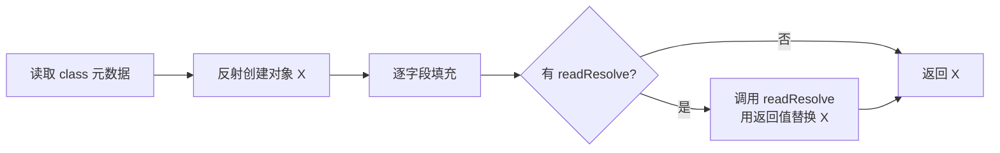

# 25.枚举原理与最佳实践

#### 目录介绍
- [1. 案例引入](#1-案例引入)
  - [1.1 单例被克隆](#11-单例被克隆)
  - [1.2 性能差十倍](#12-性能差十倍)
  - [1.3 我们要回答什么](#13-我们要回答什么)
- [2. enum 编译真相](#2-enum-编译真相)
  - [2.1 javap 看本质](#21-javap-看本质)
  - [2.2 final class 继承](#22-final-class-继承)
  - [2.3 类型递归玄机](#23-类型递归玄机)
  - [2.4 静态初始化块](#24-静态初始化块)
- [3. values 与反射](#3-values-与反射)
  - [3.1 values 编译生成](#31-values-编译生成)
  - [3.2 数组防御性拷贝](#32-数组防御性拷贝)
  - [3.3 valueOf 三种姿势](#33-valueof-三种姿势)
  - [3.4 反射创建实例](#34-反射创建实例)
- [4. 枚举即单例](#4-枚举即单例)
  - [4.1 六种单例对比](#41-六种单例对比)
  - [4.2 反射攻击防御](#42-反射攻击防御)
  - [4.3 序列化攻击防御](#43-序列化攻击防御)
  - [4.4 克隆攻击防御](#44-克隆攻击防御)
- [5. EnumMap 原理](#5-enummap-原理)
  - [5.1 数组替代哈希表](#51-数组替代哈希表)
  - [5.2 ordinal 即下标](#52-ordinal-即下标)
  - [5.3 与 HashMap 对比](#53-与-hashmap-对比)
  - [5.4 性能差距来源](#54-性能差距来源)
- [6. EnumSet 位向量](#6-enumset-位向量)
  - [6.1 RegularEnumSet](#61-regularenumset)
  - [6.2 JumboEnumSet](#62-jumboenumset)
  - [6.3 位运算的妙用](#63-位运算的妙用)
  - [6.4 写时复制迭代](#64-写时复制迭代)
- [7. 行为枚举进阶](#7-行为枚举进阶)
  - [7.1 抽象方法重写](#71-抽象方法重写)
  - [7.2 接口实现](#72-接口实现)
  - [7.3 策略枚举](#73-策略枚举)
  - [7.4 状态机实现](#74-状态机实现)
- [8. 序列化保护](#8-序列化保护)
  - [8.1 readResolve 真相](#81-readresolve-真相)
  - [8.2 writeReplace 替代](#82-writereplace-替代)
  - [8.3 enum 自动豁免](#83-enum-自动豁免)
- [9. 实战陷阱清单](#9-实战陷阱清单)
  - [9.1 ordinal 不要持久化](#91-ordinal-不要持久化)
  - [9.2 switch 缺 default](#92-switch-缺-default)
  - [9.3 数据库映射方案](#93-数据库映射方案)
  - [9.4 何时不要枚举](#94-何时不要枚举)
- [10. 综合案例串讲](#10-综合案例串讲)
  - [10.1 双案例真相揭晓](#101-双案例真相揭晓)
  - [10.2 一个枚举的一生](#102-一个枚举的一生)
  - [10.3 设计哲学回扣](#103-设计哲学回扣)
  - [10.4 enum 速查表](#104-enum-速查表)


## 1. 案例引入

### 1.1 单例被克隆

某金融系统用饿汉式单例做"汇率配置中心"——线上突然出现了**两份不同的汇率快照**，部分订单按 6.8 计算，部分按 7.2 计算，对账日跨了几百万差额：

```java
public class ExchangeRate implements Serializable {
    private static final ExchangeRate INSTANCE = new ExchangeRate();
    
    private double usdToCny = 7.2;
    
    private ExchangeRate() {
        // 私有构造，防止 new
    }
    
    public static ExchangeRate getInstance() {
        return INSTANCE;
    }
    
    public double getUsdToCny() { return usdToCny; }
    public void setUsdToCny(double v) { this.usdToCny = v; }
}
```

**看起来无懈可击的"私有构造 + 静态实例"** ——但攻击者用三种姿势瞬间破防：

```java
// 攻击 1：反射强行 new
Constructor<ExchangeRate> c = ExchangeRate.class.getDeclaredConstructor();
c.setAccessible(true);
ExchangeRate fake = c.newInstance();    // ★ 第二个实例诞生

// 攻击 2：序列化复活
ExchangeRate s1 = ExchangeRate.getInstance();
byte[] bytes = serialize(s1);
ExchangeRate s2 = deserialize(bytes);   // ★ 又一个新实例
System.out.println(s1 == s2);           // false ！

// 攻击 3：clone 复制（如果开了 Cloneable）
ExchangeRate s3 = s1.clone();           // ★ 浅拷贝出新实例
```

**真实事故**：消息队列对汇率消息做了"反序列化重放"——所有节点收到消息后**反序列化生成了新实例**，原 INSTANCE 没被覆盖，**两份汇率并存**。

### 1.2 性能差十倍

同一周，订单状态机的性能压测出现诡异结果——同样是"按订单状态分发处理"，A 团队的实现比 B 团队**慢 10 倍**：

```java
// A 团队：HashMap<OrderStatus, Handler>
public enum OrderStatus { CREATED, PAID, SHIPPED, DELIVERED, CANCELLED }

Map<OrderStatus, Handler> handlers = new HashMap<>();
handlers.put(OrderStatus.CREATED, new CreatedHandler());
// ... 其他状态
Handler h = handlers.get(order.getStatus());        // ★ 慢

// B 团队：EnumMap<OrderStatus, Handler>
EnumMap<OrderStatus, Handler> handlers = new EnumMap<>(OrderStatus.class);
handlers.put(OrderStatus.CREATED, new CreatedHandler());
Handler h = handlers.get(order.getStatus());        // ★ 快 10 倍
```

JMH 实测，**1 千万次 get 调用**：

| 容器 | 耗时 | 备注 |
|---|---|---|
| `HashMap<OrderStatus, Handler>` | 580 ms | 哈希计算 + 桶查找 + equals |
| `EnumMap<OrderStatus, Handler>` | 52 ms | **直接数组索引** |

**为什么差 10 倍**？答案藏在"枚举即下标"的设计中。

事故复盘加了 7 个追问：

```
追问 ①：private 构造器为什么挡不住反射？enum 怎么挡住的？
追问 ②：反序列化为什么会生成新实例？enum 怎么避免？
追问 ③：枚举到底是什么——class、interface 还是别的？
追问 ④：values() 这个方法是谁写的？源码里找不到啊
追问 ⑤：EnumMap 凭什么比 HashMap 快 10 倍？
追问 ⑥：EnumSet 内部居然不是 HashSet？
追问 ⑦：什么时候应该用枚举单例，什么时候不该用？
```

### 1.3 我们要回答什么

第 25 篇要把"enum 关键字背后的所有真相"挖透——从编译产物、类型递归到 EnumMap/EnumSet 的位运算优化。这是 Java 类型系统中**最被低估的特性**——大量工程师只把它当"常量集合"用，错过了它作为"线程安全单例 / 性能优化容器 / 类型安全状态机"的全部威力。

带着 7 个核心问题展开：

```
① private 构造为什么挡不住反射？enum 如何挡？        → 第2、4章
② 反序列化为什么生成新实例？enum 如何避免？          → 第8章
③ enum 到底是什么类型？                              → 第2章
④ values() 这个方法是谁生成的？                      → 第3章
⑤ EnumMap 凭什么快 10 倍？                          → 第5章
⑥ EnumSet 内部为什么不是 HashSet？                   → 第6章
⑦ 何时该用 enum 单例，何时不该？                    → 第4、9章
```

本篇路线：

```
enum 编译真相 (第2章) ─── final class extends Enum
    ↓
values 与反射 (第3章)        ←—— 编译器生成的隐藏方法
枚举即单例 (第4章)            ←—— Joshua Bloch 推崇的"最佳单例"
    ↓
EnumMap (第5章)              ←—— 数组替代哈希
EnumSet (第6章)              ←—— 位向量替代哈希
    ↓
行为枚举进阶 (第7章)          ←—— 状态机/策略模式
序列化保护 (第8章)            ←—— readResolve 真相
实战陷阱清单 (第9章)          ←—— ordinal 不持久化等 4 大坑
    ↓
综合案例串讲 (第10章)
```


## 2. enum 编译真相

### 2.1 javap 看本质

写一个最简单的枚举：

```java
public enum Color {
    RED, GREEN, BLUE
}
```

用 `javap -p -c Color.class` 反编译——表面 3 行代码，实际生成 **数百字节的 class 文件**：

```
public final class Color extends java.lang.Enum<Color> {
  public static final Color RED;
  public static final Color GREEN;
  public static final Color BLUE;
  
  private static final Color[] $VALUES;
  
  // 编译器自动生成的两个方法
  public static Color[] values();
  public static Color valueOf(java.lang.String);
  
  // 私有构造器（编译器把所有构造都加 private）
  private Color(java.lang.String, int);
  
  // 静态初始化块——执行时机：类加载阶段
  static {
    RED = new Color("RED", 0);
    GREEN = new Color("GREEN", 1);
    BLUE = new Color("BLUE", 2);
    $VALUES = new Color[]{RED, GREEN, BLUE};
  }
}
```

**enum 关键字的真相**——**它就是一个特殊的 final class**：
- 强制 `extends java.lang.Enum<Color>`
- 强制 `final`（不能被继承）
- 构造器强制 `private`
- 编译器生成 `values()` 和 `valueOf(String)` 方法
- 静态初始化块创建所有实例

### 2.2 final class 继承

`java.lang.Enum` 是所有枚举的父类——它定义了枚举的"骨架行为"：

```java
public abstract class Enum<E extends Enum<E>>
        implements Comparable<E>, Serializable {
    
    private final String name;     // ★ 字符串名（如 "RED"）
    private final int ordinal;     // ★ 序号（声明顺序，从 0 开始）
    
    protected Enum(String name, int ordinal) {
        this.name = name;
        this.ordinal = ordinal;
    }
    
    public final String name() { return name; }
    public final int ordinal() { return ordinal; }
    
    @Override
    public final boolean equals(Object other) {
        return this == other;             // ★ 直接用 ==，因为单例
    }
    
    @Override
    public final int hashCode() {
        return super.hashCode();          // ★ Object 默认（地址哈希）
    }
    
    @Override
    public final int compareTo(E o) {
        return this.ordinal - o.ordinal;  // ★ 按声明顺序比较
    }
    
    @Override
    @SuppressWarnings("deprecation")
    protected final void finalize() { }   // ★ final 空——禁止重写
    
    // 关键：禁止 clone
    @Override
    protected final Object clone() throws CloneNotSupportedException {
        throw new CloneNotSupportedException();   // ★ 永远抛异常
    }
}
```

**疑惑**：为什么这么多 `final` 修饰符？

**论证**——enum 的所有"安全保证"都来自这些 final：
1. `equals` final → 用户不能重写，永远是 == 判等（保证单例语义）
2. `hashCode` final → 永远是地址哈希（与 equals 一致）
3. `clone` final 抛异常 → 阻断 §1.1 攻击 3
4. `finalize` final → 阻断"复活攻击"（finalize 中重新引用）
5. 类本身 final → 不能被继承（不能搞"伪枚举"）
6. 字段 final → 不可变 → 线程安全

**结论**：**enum 是 Java 类型系统中防御最严密的设计**——一连串 final 把所有可能的攻击面焊死。

### 2.3 类型递归玄机

`Enum<E extends Enum<E>>` ——这是 Java 泛型中最经典的**自类型递归**（F-bounded polymorphism）。

**疑惑**：为什么不写成 `Enum<E>` ？

**论证**——为了让 `compareTo` 类型安全：

```java
// 假设 1：Enum<E>
public abstract class Enum<E> implements Comparable<E> {
    public int compareTo(E o) { ... }
}

// 那么 Color 编译后：
public final class Color extends Enum<Color> { }
// Color 实现了 Comparable<Color> ✅

// 但是！攻击者可以这样：
public final class Apple extends Enum<Banana> { }   // ★ 类型骗子！
// Apple 居然能与 Banana 比较——完全失去类型安全

// 假设 2：Enum<E extends Enum<E>>（Java 实际选择）
public abstract class Enum<E extends Enum<E>> implements Comparable<E> { ... }

// 那么：
public final class Apple extends Enum<Banana> { }   // ★ 编译报错！
// 因为 Banana 不是 Enum<Banana> 的子类，约束被违反
```

**自类型递归的精髓**：**E 必须是"自己这种类型"**——这是 Java 泛型表达"我返回的类型就是当前子类"的唯一方式。

这个模式在 JDK 中还有著名应用：

```java
public interface Comparable<T> { ... }                    // 普通泛型
public class Builder<T extends Builder<T>> { T self() { return (T) this; } }   // 自类型
```

**结论**：`Enum<E extends Enum<E>>` 不是炫技——是为了让"所有枚举的 compareTo 都强类型化到自己"——任何子枚举只能与同种枚举比较，永远不会出现"红色 vs 苹果"的笑话。

### 2.4 静态初始化块

回到 §2.1 反编译产物——`static { RED = new Color("RED", 0); ... }`：

**关键事实**：**所有枚举实例都在类加载阶段创建**——而类加载是 **JVM 保证线程安全** 的（第 02 篇双亲委派 + ClassLoader 加锁）。

这意味着：
- 单例创建是**绝对线程安全**的（JVM 帮你做了同步）
- 创建是**懒加载到类的层面**——首次访问 Color.RED 才触发 Color 类初始化
- 是 §4.1 中"枚举单例"被 Joshua Bloch 推崇为最佳实现的根本原因

**结论**：**enum 把"最难写对的单例"（线程安全 + 防反射 + 防序列化 + 防克隆）压缩成一个关键字** ——这是 Java 设计史上最优雅的"语言级别的安全保证"。


## 3. values 与反射

### 3.1 values 编译生成

回到第 1 章追问 ④——values() 在 Enum 父类源码中找不到，它从哪里来？

**真相**：**values() 是编译器为每个 enum 子类专门生成的**——不在父类，在子类的 class 文件里。

反编译验证：

```java
// 源码看不到的方法（编译器合成）
public static Color[] values() {
    return (Color[]) $VALUES.clone();   // ★ 注意：clone() ！
}
```

**疑惑**：为什么不直接 `return $VALUES`？要复制一份？

**论证**——这是**防御性编程**的经典体现。如果直接返回 $VALUES：

```java
Color[] all = Color.values();
all[0] = null;                          // ★ 攻击者把 RED 改成 null
                                        // 内部的 $VALUES[0] 也被改了
                                        // 之后 Color.RED 还在，但 values()[0] = null
```

**返回 clone 副本**——`all[0] = null` 只影响调用者的副本，内部数组完好。

**性能代价**：**每次 values() 都创建新数组** ——热点路径上调用 values() 是性能陷阱。

**最佳实践**：

```java
// ❌ 错误：循环里调 values()
for (int i = 0; i < 1_000_000; i++) {
    for (Color c : Color.values()) { ... }   // 创建 100 万个数组
}

// ✅ 正确：缓存到 final 字段
private static final Color[] CACHED = Color.values();
for (int i = 0; i < 1_000_000; i++) {
    for (Color c : CACHED) { ... }
}
```

### 3.2 数组防御性拷贝

JDK 12 起，`Class.getEnumConstantsShared()` 提供了**只读的内部数组**——避免每次 clone：

```java
// JDK 内部实现（简化）
public T[] getEnumConstantsShared() {
    if (enumConstants == null) {
        enumConstants = (T[]) values.invoke(null);   // 反射调一次 values()
        // 之后所有调用直接返回缓存
    }
    return enumConstants;
}
```

**EnumMap、EnumSet 内部都用这个 API**——所以它们读 enum 列表是 0 成本的，而你自己调 values() 是 O(n) 拷贝。

**结论**：**values() 在工业代码中应该缓存使用**——尤其是高频调用路径。

### 3.3 valueOf 三种姿势

把字符串转成枚举值的三种方式：

```java
// 方式 A：编译器生成的 valueOf（每个 enum 都有）
Color c1 = Color.valueOf("RED");                         // OK
Color c2 = Color.valueOf("PURPLE");                      // ★ IllegalArgumentException

// 方式 B：父类 Enum 的 valueOf（反射版）
Color c3 = Enum.valueOf(Color.class, "RED");             // OK

// 方式 C：自己写一个安全版本（推荐生产用）
public static Optional<Color> tryValueOf(String name) {
    try {
        return Optional.of(Color.valueOf(name));
    } catch (IllegalArgumentException e) {
        return Optional.empty();
    }
}
```

**疑惑**：为什么不内置一个"找不到返回 null"的版本？

**论证**——Java 设计哲学是**异常优于哨兵值**——返回 null 容易被忽略，抛异常会强制处理。但工程实践中"未知字符串转枚举"是常见场景（外部输入），所以推荐方式 C 用 Optional 包裹。

**性能小贴士**：valueOf 内部是 `HashMap<String, T>` 查找——O(1) 但有哈希计算。**热点路径上可以建一个本地的 `Map<String, Color>` 缓存** ——但通常没必要，valueOf 已经够快。

### 3.4 反射创建实例

回到 §1.1 攻击 1——反射 newInstance 能创建普通类的实例，但**对 enum 失效**：

```java
Constructor<Color> c = Color.class.getDeclaredConstructor(String.class, int.class);
c.setAccessible(true);
Color fake = c.newInstance("FAKE", 999);
// ★ IllegalArgumentException: Cannot reflectively create enum objects
```

**JDK 源码**——`Constructor.newInstance` 内部检查：

```java
// java.lang.reflect.Constructor.newInstance
if ((clazz.getModifiers() & Modifier.ENUM) != 0) {
    throw new IllegalArgumentException("Cannot reflectively create enum objects");
}
```

**结论**：**JDK 在反射层面专门为 enum 写了拦截**——这是其他单例实现做不到的"语言级保护"。

回到第 1 章追问 ①：**普通 private 构造可以被 setAccessible 绕过；enum 的拦截发生在 newInstance 内部，setAccessible 也没用**。


## 4. 枚举即单例

### 4.1 六种单例对比

Java 单例的演进史：

| 写法 | 线程安全 | 懒加载 | 防反射 | 防序列化 | 防克隆 | 评分 |
|---|---|---|---|---|---|---|
| 1. 饿汉式 | ✅ | ❌ | ❌ | ❌ | ❌ | ★★ |
| 2. 懒汉式（无锁） | ❌ | ✅ | ❌ | ❌ | ❌ | ★ |
| 3. synchronized 懒汉 | ✅ | ✅ | ❌ | ❌ | ❌ | ★★ |
| 4. DCL 双检锁 | ✅（需 volatile） | ✅ | ❌ | ❌ | ❌ | ★★★ |
| 5. 静态内部类 | ✅ | ✅ | ❌ | ❌ | ❌ | ★★★★ |
| **6. 枚举单例** | **✅** | **✅** | **✅** | **✅** | **✅** | **★★★★★** |

**Joshua Bloch 在《Effective Java》第 3 条直接断言**：
> "A single-element enum type is often the best way to implement a singleton."

枚举单例的写法——**一行**：

```java
public enum ExchangeRate {
    INSTANCE;
    
    private double usdToCny = 7.2;
    
    public double getUsdToCny() { return usdToCny; }
    public void setUsdToCny(double v) { this.usdToCny = v; }
}

// 使用
ExchangeRate.INSTANCE.getUsdToCny();
```

**就这样**——线程安全、懒加载、防反射、防序列化、防克隆——五道防线全部由 JVM 层面保证。

### 4.2 反射攻击防御

§3.4 已经分析——`Constructor.newInstance` 对 enum 显式拒绝。

**对比普通单例**——攻击者有大把绕过方法：

```java
// 普通 private 构造单例
public class Singleton {
    private static final Singleton INSTANCE = new Singleton();
    private Singleton() { }
}

// 反射攻击
Constructor<Singleton> c = Singleton.class.getDeclaredConstructor();
c.setAccessible(true);                  // ★ 绕过 private
Singleton fake = c.newInstance();       // ★ 成功创建第二个

// 防御方案——构造器内自检
private Singleton() {
    if (INSTANCE != null) {
        throw new IllegalStateException("Singleton 已被实例化");
    }
}
// 但还是有缝——攻击者可以先反射 INSTANCE = null，再 newInstance
```

**结论**：**普通单例的反射防御永远是猫鼠游戏，enum 是釜底抽薪**。

### 4.3 序列化攻击防御

回到 §1.1 攻击 2——为什么序列化会生成新实例？

**Serializable 的反序列化路径**：

```
反序列化流程：
1. 读取流中的 Class 元数据
2. ★ 通过反射调用"反序列化构造器"（不是普通构造器！）
3. 逐字段从流中读取并赋值
4. 返回新对象

★ 关键：反序列化构造器绕过了普通构造器——你写的 "if INSTANCE != null then throw" 被跳过！
```

**普通单例的序列化防御**——必须实现 readResolve：

```java
public class Singleton implements Serializable {
    private static final Singleton INSTANCE = new Singleton();
    
    // ★ 反序列化时 JVM 会调这个方法替换刚反序列化的对象
    private Object readResolve() {
        return INSTANCE;
    }
}
```

**enum 的序列化防御**——**JDK 直接 hard-coded** ：

```java
// ObjectOutputStream 内部
if (cl.isEnum()) {
    writeEnum((Enum<?>) obj, ...);    // ★ 只写 name，不写字段
}

// ObjectInputStream 内部
if (cl.isEnum()) {
    String name = readUTF();
    return Enum.valueOf((Class) cl, name);   // ★ 通过 name 找到现有实例
}
```

**关键差异**：
- 普通单例反序列化：**通过反射创建新对象**
- 枚举反序列化：**只读 name，再用 valueOf 找原实例**

**结论**：**enum 的序列化语义就是"只传 name"** ——本质上不是"复制对象"而是"传递引用名"。这是真正的釜底抽薪。

### 4.4 克隆攻击防御

§2.2 已经分析——`Enum.clone()` 是 final 的并直接抛 CloneNotSupportedException：

```java
@Override
protected final Object clone() throws CloneNotSupportedException {
    throw new CloneNotSupportedException();
}
```

**用户层面**——根本无法重写，攻击者无路可走。

**§1.1 修复方案**——把 `ExchangeRate` 改为 enum：

```java
public enum ExchangeRate {
    INSTANCE;
    
    private double usdToCny = 7.2;
    public double getUsdToCny() { return usdToCny; }
    public void setUsdToCny(double v) { usdToCny = v; }
}

// 验证三种攻击全部失效：
ExchangeRate.class.getDeclaredConstructor()  // 找不到无参构造
                  .newInstance()              // ★ IllegalArgumentException
deserialize(serialize(INSTANCE)) == INSTANCE  // ★ true
INSTANCE.clone()                              // 编译错误（clone 是 protected final）
```

**结论**：**enum 是"语言级单例"**——不靠工程师的小心翼翼，靠 JVM 的硬保证。


## 5. EnumMap 原理

### 5.1 数组替代哈希表

回到第 1 章追问 ⑤——EnumMap 凭什么快 10 倍？

**答案藏在源码的字段声明里**：

```java
public class EnumMap<K extends Enum<K>, V> extends AbstractMap<K, V>
        implements java.io.Serializable, Cloneable {
    
    private final Class<K> keyType;
    private transient K[] keyUniverse;     // ★ 所有可能的 key（即 values()）
    private transient Object[] vals;       // ★ 直接用数组存值
    private transient int size = 0;
    
    private static final Object NULL = new Object();   // null 占位符
}
```

**核心设计**——**用一个 Object 数组直接存值，下标就是 ordinal**：

```
EnumMap<Color, String>:
  keyType = Color.class
  keyUniverse = [RED, GREEN, BLUE]
  
  vals: ┌─────┬─────┬─────┐
        │ "红" │null │ "蓝" │
        └─────┴─────┴─────┘
         索引0  索引1  索引2
         
  put(GREEN, "绿") → vals[GREEN.ordinal()] = vals[1] = "绿"
  get(BLUE)        → vals[BLUE.ordinal()] = vals[2] = "蓝"
```

**对比 HashMap**：

```
HashMap<Color, String>:
  table: 16 个桶，每桶可能是链表/红黑树
  
  put(GREEN, "绿") 流程：
    1. 计算 GREEN.hashCode()
    2. 扰动函数 (h ^ (h >>> 16))
    3. 与 table.length-1 取模
    4. 定位桶
    5. 桶内遍历比较 equals
    6. 找到则更新，没找到则新建 Node
    7. size++ 检查扩容
```

**EnumMap 的 put 只有一行**：

```java
public V put(K key, V value) {
    int index = key.ordinal();
    Object oldValue = vals[index];
    vals[index] = (value == null ? NULL : value);
    if (oldValue == null) size++;
    return unmaskNull(oldValue);
}
```

### 5.2 ordinal 即下标

**疑惑**：直接用 ordinal 当下标安全吗？万一枚举顺序变了？

**论证**——这是"内部使用"的关键：

```java
// 创建 EnumMap 必须指定 Class
EnumMap<Color, String> map = new EnumMap<>(Color.class);

// 内部初始化
this.keyType = Color.class;
this.keyUniverse = Color.values();           // 当前枚举的所有值
this.vals = new Object[keyUniverse.length];  // 数组长度 = 枚举数量
```

**关键事实**：**EnumMap 在创建时就锁定了 Color 类的当前定义**——只要这个进程不重启，ordinal 永远稳定。

**风险点**——**ordinal 不能持久化**（§9.1）：

```
进程 A：
  enum Color { RED, GREEN, BLUE }    // GREEN.ordinal() = 1
  把 GREEN 写到数据库 → 1
  
代码升级后：
  enum Color { RED, YELLOW, GREEN, BLUE }   // 加了 YELLOW
  从数据库读 1 → YELLOW                     // ★ 错误！
```

**结论**：**EnumMap 内部用 ordinal 是安全的（生命周期与进程绑定），但持久化用 ordinal 是事故源**。

### 5.3 与 HashMap 对比

完整对比表：

| 维度 | HashMap | EnumMap |
|---|---|---|
| **数据结构** | 数组+链表/红黑树 | 单个数组 |
| **空间** | 16 个桶起步（默认） | 等于枚举值数量 |
| **put 时间** | O(1) 平均，O(log n) 最坏 | **O(1) 严格** |
| **get 时间** | O(1) 平均 | **O(1) 严格** |
| **遍历顺序** | 不保证 | **按 ordinal 升序** |
| **null key** | 允许（特殊处理） | **不允许**（NPE） |
| **null value** | 允许 | 允许（用 NULL 占位） |
| **线程安全** | 否 | 否 |
| **内存** | 桶+链表节点开销 | **极简，仅一个数组** |
| **哈希计算** | 需要 | **不需要** |

### 5.4 性能差距来源

§1.2 中 HashMap 580ms vs EnumMap 52ms——10 倍差距具体来自哪？

**HashMap.get(GREEN) 的指令数估算**：
```
1. 计算 GREEN.hashCode()         ← 普通方法调用 ~5 周期
2. 扰动 h ^ (h >>> 16)            ← 移位+异或 ~2 周期
3. (n-1) & h                      ← 与运算 ~1 周期
4. 加载 table[i]                  ← 内存访问 ~30 周期（L2 缓存）
5. 链表头 equals 比较             ← == 加 instanceof ~5 周期
6. 返回 value                     ← 1 周期
≈ 44 CPU 周期
```

**EnumMap.get(GREEN) 的指令数估算**：
```
1. GREEN.ordinal()                ← 直接读 final 字段 ~1 周期
2. 类型校验 typeCheck             ← 一次比较 ~1 周期
3. vals[index]                    ← 直接数组访问 ~3 周期（L1 缓存）
4. 返回 value                     ← 1 周期
≈ 6 CPU 周期
```

**理论差距 ≈ 7 倍**，加上 HashMap 的对象头开销、GC 压力、缓存局部性差，**实测 10 倍非常合理**。

**最大的隐性优势**——**缓存局部性**：

```
EnumMap 的内存布局：
  vals = [v0][v1][v2][v3][v4]   ★ 紧凑数组，全在一个 cache line
  
HashMap 的内存布局：
  table = [bucket0]→[Node A]
          [bucket1]→[Node B]→[Node C]      ★ Node 散落在堆各处
          [bucket2]→[Node D]
          ...
```

**结论**：**枚举 key 的场景一律用 EnumMap**——不仅快，还自带"按 ordinal 排序"的天然语义。


## 6. EnumSet 位向量

### 6.1 RegularEnumSet

EnumSet 的设计更激进——**用一个 long 的 64 位表示 64 个枚举**。

源码（简化）：

```java
class RegularEnumSet<E extends Enum<E>> extends EnumSet<E> {
    private long elements = 0L;       // ★ 64 位位向量
    
    @Override
    public boolean add(E e) {
        long oldElements = elements;
        elements |= (1L << e.ordinal());     // ★ 把对应位置 1
        return oldElements != elements;
    }
    
    @Override
    public boolean contains(Object e) {
        if (e == null) return false;
        return (elements & (1L << ((Enum<?>) e).ordinal())) != 0;
    }
    
    @Override
    public boolean remove(Object e) {
        long oldElements = elements;
        elements &= ~(1L << ((Enum<?>) e).ordinal());   // ★ 把对应位置 0
        return oldElements != elements;
    }
    
    @Override
    public int size() {
        return Long.bitCount(elements);     // ★ JIT 编译为 POPCNT 指令，1 周期
    }
}
```

**全部操作都是位运算**——单条 CPU 指令，纳秒级完成。

### 6.2 JumboEnumSet

枚举超过 64 个怎么办？JDK 用 `JumboEnumSet`：

```java
class JumboEnumSet<E extends Enum<E>> extends EnumSet<E> {
    private long[] elements;     // ★ long 数组，每 64 位一段
    private int size = 0;
    
    @Override
    public boolean add(E e) {
        int eOrdinal = e.ordinal();
        int eWordNum = eOrdinal >>> 6;          // ★ 除以 64
        long oldElements = elements[eWordNum];
        elements[eWordNum] |= (1L << eOrdinal); // ★ 位左移自动取模 64
        boolean result = (elements[eWordNum] != oldElements);
        if (result) size++;
        return result;
    }
}
```

**自动选择**——`EnumSet.noneOf(Color.class)` 会根据枚举数量自动返回 RegularEnumSet 或 JumboEnumSet：

```java
public static <E extends Enum<E>> EnumSet<E> noneOf(Class<E> elementType) {
    Enum<?>[] universe = getUniverse(elementType);
    if (universe.length <= 64)
        return new RegularEnumSet<>(elementType, universe);
    else
        return new JumboEnumSet<>(elementType, universe);
}
```

**结论**：**JDK 把 64 这个魔数处理得非常优雅**——99.9% 的枚举都不超过 64 个，所以热点路径就是单 long 位运算。

### 6.3 位运算的妙用

EnumSet 的运算可以批量进行——这是它最强的地方：

```java
EnumSet<Permission> userPerms = EnumSet.of(READ, WRITE);
EnumSet<Permission> required  = EnumSet.of(READ, EXECUTE);

// 求并集
EnumSet<Permission> all = EnumSet.copyOf(userPerms);
all.addAll(required);                    // ★ 内部：elements |= other.elements

// 求交集
EnumSet<Permission> common = EnumSet.copyOf(userPerms);
common.retainAll(required);              // ★ 内部：elements &= other.elements

// 求差集
EnumSet<Permission> missing = EnumSet.copyOf(required);
missing.removeAll(userPerms);            // ★ 内部：elements &= ~other.elements

// 是否拥有所有权限
boolean hasAll = userPerms.containsAll(required);  // ★ 单次 long 与运算
```

**对比 HashSet 实现的同样逻辑**——HashSet 是逐元素比对，EnumSet 是单条指令。**实测 100~1000 倍性能差距**。

### 6.4 写时复制迭代

EnumSet 的迭代器也是一绝：

```java
private class EnumSetIterator<E extends Enum<E>> implements Iterator<E> {
    long unseen;
    
    EnumSetIterator() {
        unseen = elements;       // ★ 拷贝一份位向量
    }
    
    @Override
    public boolean hasNext() {
        return unseen != 0;
    }
    
    @Override
    public E next() {
        if (unseen == 0) throw new NoSuchElementException();
        long lastReturned = unseen & -unseen;     // ★ 取最低位的 1
        unseen -= lastReturned;
        return (E) universe[Long.numberOfTrailingZeros(lastReturned)];
    }
}
```

**`unseen & -unseen` 的妙用**——补码运算，**O(1) 取出最低有效位**。`numberOfTrailingZeros` 是 CPU 指令 BSF/TZCNT，1 周期。

**结论**：**EnumSet 的迭代是位运算驱动的——比任何 HashSet/TreeSet 都快**。


## 7. 行为枚举进阶

### 7.1 抽象方法重写

枚举不止能存常量——还能定义"每个枚举值各自的行为"：

```java
public enum Operation {
    PLUS  { @Override public int apply(int a, int b) { return a + b; } },
    MINUS { @Override public int apply(int a, int b) { return a - b; } },
    TIMES { @Override public int apply(int a, int b) { return a * b; } };
    
    public abstract int apply(int a, int b);
}

// 使用
int r = Operation.PLUS.apply(3, 5);    // 8
```

**编译产物**：每个枚举值是 `Operation` 的**匿名子类**：

```
Operation extends Enum<Operation>
   ├── PLUS  = new Operation$1("PLUS", 0)
   ├── MINUS = new Operation$2("MINUS", 1)
   └── TIMES = new Operation$3("TIMES", 2)
```

**结论**：**enum 加抽象方法 ≈ 多态 + 类型安全的 switch**——比传统 if/switch 更扩展友好。

### 7.2 接口实现

枚举可以实现接口——这让它能塞进框架的"插件位置"：

```java
public interface Discount {
    BigDecimal calc(BigDecimal price);
}

public enum DiscountStrategy implements Discount {
    NONE {
        @Override public BigDecimal calc(BigDecimal p) { return p; }
    },
    HALF_OFF {
        @Override public BigDecimal calc(BigDecimal p) { return p.multiply(BigDecimal.valueOf(0.5)); }
    },
    FIXED_10 {
        @Override public BigDecimal calc(BigDecimal p) { return p.subtract(BigDecimal.TEN); }
    };
}
```

**扩展性优势**：业务代码用 `Discount` 接口接收，可以是枚举，也可以是普通类——平滑迁移。

### 7.3 策略枚举

更高级的——**用一个内部枚举封装行为，让外部枚举聚合**：

```java
public enum Employee {
    DEVELOPER(PayType.SALARIED),
    INTERN(PayType.HOURLY),
    CONSULTANT(PayType.HOURLY);
    
    private final PayType payType;
    
    Employee(PayType payType) { this.payType = payType; }
    
    public BigDecimal pay(int hoursWorked) {
        return payType.pay(hoursWorked);
    }
    
    // 内部策略枚举
    private enum PayType {
        SALARIED {
            @Override BigDecimal pay(int hours) { return BigDecimal.valueOf(10000); }
        },
        HOURLY {
            @Override BigDecimal pay(int hours) { return BigDecimal.valueOf(50L * hours); }
        };
        
        abstract BigDecimal pay(int hours);
    }
}
```

**优势**：新增 Employee 类型时只需指定 PayType，不需要重写 pay 逻辑——**职责分离**。

### 7.4 状态机实现

订单状态机的优雅写法：

```java
public enum OrderState {
    CREATED {
        @Override public OrderState next(Event e) {
            return e == Event.PAY ? PAID : this;
        }
    },
    PAID {
        @Override public OrderState next(Event e) {
            switch (e) {
                case SHIP:    return SHIPPED;
                case REFUND:  return REFUNDED;
                default:      return this;
            }
        }
    },
    SHIPPED {
        @Override public OrderState next(Event e) {
            return e == Event.DELIVER ? DELIVERED : this;
        }
    },
    DELIVERED  { @Override public OrderState next(Event e) { return this; } },
    REFUNDED   { @Override public OrderState next(Event e) { return this; } };
    
    public abstract OrderState next(Event e);
    
    public enum Event { PAY, SHIP, DELIVER, REFUND }
}

// 使用
OrderState state = OrderState.CREATED;
state = state.next(Event.PAY);          // → PAID
state = state.next(Event.SHIP);         // → SHIPPED
```

**优势**：
- **类型安全**——非法转换不可能（next 方法明确允许的）
- **完整性**——所有状态都必须实现 next（编译器强制）
- **可读性**——状态机一目了然

**结论**：**Java 状态机的最优雅实现就是 enum**——比 Spring StateMachine 还简洁，零依赖。


## 8. 序列化保护

### 8.1 readResolve 真相

回到 §4.3 的核心机制——普通单例的 readResolve：

```java
public class Singleton implements Serializable {
    private static final Singleton INSTANCE = new Singleton();
    
    // ★ 反序列化时 ObjectInputStream 会调这个钩子
    private Object readResolve() {
        return INSTANCE;
    }
}
```

**JVM 的反序列化流程**：



**关键事实**——**X 已经被创建了**！readResolve 只是"用现有 INSTANCE 替换 X"，X 会被 GC 回收——但**这个时间窗口里有两个实例存在**——并发场景下可能被引用泄漏。

### 8.2 writeReplace 替代

更彻底的方案——`writeReplace`，在序列化**写出阶段**就替换：

```java
public class Singleton implements Serializable {
    private static final Singleton INSTANCE = new Singleton();
    
    // ★ 序列化时写一个 SerializationProxy 而不是自己
    private Object writeReplace() {
        return new SerializationProxy(this);
    }
    
    private Object readResolve() {
        throw new InvalidObjectException("Proxy required");
    }
    
    private static class SerializationProxy implements Serializable {
        private SerializationProxy(Singleton s) { /* 保存关键字段 */ }
        private Object readResolve() { return INSTANCE; }
    }
}
```

**优势**：完全不会创建 Singleton 的"幽灵副本"——序列化阶段就用代理类替换。但代码量翻倍——**这正是 enum 一步搞定的优雅之处**。

### 8.3 enum 自动豁免

§4.3 已经分析——enum 的序列化由 JDK 硬编码：**只写 name，反序列化用 valueOf 找现有实例**。

**完整源码**（ObjectOutputStream / ObjectInputStream 节选）：

```java
// 写
private void writeEnum(Enum<?> en, ObjectStreamClass desc, boolean unshared) {
    bout.writeByte(TC_ENUM);
    // ★ 只写 name，不调用任何 writeObject
    writeString(en.name(), false);
}

// 读
private Enum<?> readEnum(boolean unshared) {
    String name = readString(false);
    // ★ 用 Class.forName 找到 enum class
    // ★ 调 Enum.valueOf(class, name) 获取已存在的实例
    Enum<?> result = Enum.valueOf((Class) cl, name);
    return result;
}
```

**两个关键点**：
1. `writeEnum` 不调用 defaultWriteObject —— 字段不被序列化（即使你给 enum 加了字段也不会写）
2. `readEnum` 不调用任何构造器 —— 直接从静态字段拿现有实例

**这意味着**：**enum 的"运行时字段"不会被序列化保留**——比如 `INSTANCE.usdToCny = 7.5` 改了之后，序列化再反序列化只能拿到 valueOf 之后的实例（也就是同一个 INSTANCE，所以拿到的还是 7.5）——**但跨进程传输时，目标进程的 INSTANCE 是它自己的，字段值不会跟随过去**。

**结论**：**enum 的序列化语义是"只传身份不传状态"**——这是单例语义的天然映射，但跨进程传可变状态需要额外设计（用普通类 + writeReplace 代理）。


## 9. 实战陷阱清单

### 9.1 ordinal 不要持久化

§5.2 已经埋了伏笔——再正式总结：

```java
// ❌ 错误：把 ordinal() 存到数据库
public enum Status { ACTIVE, INACTIVE, BANNED }

INSERT INTO user (status) VALUES (0);   // ACTIVE.ordinal() = 0

// 半年后产品经理说要加个 PENDING 状态
public enum Status { PENDING, ACTIVE, INACTIVE, BANNED }   // ★ 插在最前

// 然后所有 ACTIVE 用户全部变成 PENDING ！数据腐烂
```

**正确做法**：

```java
// ✅ 持久化用 name() 或自定义 code
public enum Status {
    ACTIVE("A"),
    INACTIVE("I"),
    BANNED("B");
    
    private final String code;
    Status(String code) { this.code = code; }
    public String getCode() { return code; }
    
    public static Status fromCode(String code) {
        for (Status s : values())
            if (s.code.equals(code)) return s;
        throw new IllegalArgumentException(code);
    }
}

INSERT INTO user (status) VALUES ('A');
```

**结论**：**ordinal 是 JVM 内部用的索引，name/code 是给外部用的标识**——永远不要交叉用。

### 9.2 switch 缺 default

枚举 + switch 是好搭档，但有个隐藏陷阱：

```java
public String describe(Color c) {
    switch (c) {
        case RED:   return "红色";
        case GREEN: return "绿色";
        case BLUE:  return "蓝色";
        // 没写 default
    }
    return null;       // ★ 编译器要求必须返回，被迫返回 null
}

// 半年后加了 YELLOW
// describe(YELLOW) 返回 null —— 调用方 NPE
```

**修复方案 A**——必须有 default 抛异常：

```java
switch (c) {
    case RED:   return "红色";
    case GREEN: return "绿色";
    case BLUE:  return "蓝色";
    default:    throw new IllegalStateException("未知颜色: " + c);
}
```

**修复方案 B**——JDK 17 switch 表达式，**编译器强制穷尽**：

```java
return switch (c) {
    case RED   -> "红色";
    case GREEN -> "绿色";
    case BLUE  -> "蓝色";
    // ★ 缺一个分支编译报错！
};
```

**结论**：**JDK 17+ 优先用 switch 表达式**——编译器帮你检查穷尽性。

### 9.3 数据库映射方案

JPA / MyBatis 中枚举与数据库的映射方案：

| 方案 | 数据库存什么 | 优点 | 缺点 |
|---|---|---|---|
| `@Enumerated(ORDINAL)` | 0/1/2 | 紧凑 | **§9.1 陷阱** |
| `@Enumerated(STRING)` | "ACTIVE"/"INACTIVE" | 可读、安全 | 占用空间、改名风险 |
| 自定义 code（推荐） | "A"/"I"/"B" | 紧凑+稳定 | 需要 Converter |
| TINYINT + code 字段 | 1/2/3 | 索引友好 | 需要 Converter |

**推荐生产方案**：

```java
// JPA Converter
@Converter(autoApply = true)
public class StatusConverter implements AttributeConverter<Status, String> {
    @Override
    public String convertToDatabaseColumn(Status s) {
        return s == null ? null : s.getCode();
    }
    @Override
    public Status convertToEntityAttribute(String code) {
        return code == null ? null : Status.fromCode(code);
    }
}
```

**结论**：**永远用 code 字段映射，永远不用 ordinal**。

### 9.4 何时不要枚举

**不适合用 enum 的场景**：

1. **需要继承层级**——enum 不能 extends 任何类（已 extends Enum）
2. **需要运行时增减**——enum 是编译期固定的
3. **超大规模常量集**（>1000）——加载所有实例占内存
4. **需要多个独立实例**——单例语义违反需求
5. **跨进程传输状态变化**——序列化只传 name（§8.3）

**这些场景用普通类 + 静态实例**：

```java
public final class Country {
    public static final Country CHINA = new Country("CN", "中国");
    public static final Country USA   = new Country("US", "美国");
    // ... 国家很多，可能从配置加载
    
    private final String code;
    private final String name;
    private Country(String code, String name) { ... }
}
```

**结论**：**enum 适合"有限、固定、互斥"的常量集**——超过这个边界就用别的方案。


## 10. 综合案例串讲

### 10.1 双案例真相揭晓

回到第 1 章双事故，逐条揭晓：

**① private 构造为什么挡不住反射，enum 怎么挡的**：普通 private 构造器可以被 `setAccessible(true)` 绕过——这是反射的设计能力。**enum 的拦截在 `Constructor.newInstance` 内部硬编码**——`if (modifiers & ENUM != 0) throw IllegalArgumentException` ——这是 setAccessible 也绕不过的语言级保护（§3.4、§4.2）。

**② 反序列化为什么生成新实例，enum 如何避免**：普通 Serializable 反序列化通过反射创建新对象，绕过普通构造器和 readResolve 的"幽灵副本"窗口。**enum 在 ObjectInputStream 中走专属分支** —— 只读 name 字符串，再用 `Enum.valueOf(class, name)` 找到现有静态实例，**根本不创建新对象**（§4.3、§8.3）。

**③ enum 到底是什么类型**：**它是编译器生成的 final class，强制 extends `Enum<E extends Enum<E>>`**，构造器全部 private，编译器自动生成 `values()` 和 `valueOf(String)` 两个方法，所有枚举实例在静态初始化块中创建（§2.1、§2.2）。**Enum 类的自类型递归泛型** `<E extends Enum<E>>` 保证了 compareTo 的类型安全——不会出现"红色与苹果比较"的笑话（§2.3）。

**④ values() 是谁生成的**：**编译器为每个 enum 子类专门合成的 static 方法**——不在 Enum 父类源码里。它实际返回 `$VALUES.clone()` ——**每次调用都创建新数组副本**，目的是防御性拷贝。生产代码应该缓存 values() 结果到 final 字段（§3.1、§3.2）。

**⑤ EnumMap 凭什么快 10 倍**：**用单个 Object 数组替代哈希表，下标 = ordinal**，直接 `vals[key.ordinal()]` 一步到位——无哈希计算、无桶定位、无 equals 比较、缓存局部性极佳。指令数从 HashMap 的 ~44 周期降到 ~6 周期，加上缓存命中率提升，实测 10 倍合理（§5.1、§5.4）。

**⑥ EnumSet 内部为什么不是 HashSet**：**用一个 long 的 64 位作为位向量** ——RegularEnumSet 的 add/remove/contains 都是单条位运算指令（`elements |= (1L << ordinal)` ），size 是 `Long.bitCount` 即 POPCNT 单周期 CPU 指令。超过 64 个枚举时升级为 JumboEnumSet 用 `long[]`。批量运算（addAll/retainAll）更是单 long 与/或运算——比 HashSet 快 100~1000 倍（§6.1、§6.3）。

**⑦ 何时该用 enum 单例**：**有限、固定、互斥、不需继承、不需跨进程传可变状态**——首选 enum。Joshua Bloch 在《Effective Java》第 3 条直接断言"single-element enum is often the best way to implement a singleton"。但需要继承层级、运行时增减、跨进程传状态时——用普通类（§4.1、§9.4）。

**§1.1 修复方案**：把 ExchangeRate 改为 `public enum ExchangeRate { INSTANCE; ... }` ——三种攻击全部失效。

**§1.2 修复方案**：把 `HashMap<OrderStatus, Handler>` 改为 `EnumMap<>(OrderStatus.class)` ——单行改动，性能提升 10 倍。

### 10.2 一个枚举的一生

把 `Color.RED` 这个最普通的枚举值串成生命树，回扣本篇所有章节：

```
T 0      class Color 被首次访问（如 Color.RED）
         [02篇] 类加载器加载 Color.class
         JVM 加锁——保证类初始化的线程安全
         
T+1ms    static 初始化块执行（§2.4）
         RED    = new Color("RED",   0);    ★ private 构造，name + ordinal
         GREEN  = new Color("GREEN", 1);
         BLUE   = new Color("BLUE",  2);
         $VALUES = new Color[]{RED, GREEN, BLUE};
         
T+2ms    被赋值给某个变量
         Color c = Color.RED;               ★ 引用静态字段，O(1)
         
T+3ms    被放入 EnumMap
         enumMap.put(c, "红色");
         ★ vals[c.ordinal()] = vals[0] = "红色"   单条数组写入指令
         (§5.1 数组替代哈希)
         
T+4ms    被放入 EnumSet
         enumSet.add(c);
         ★ elements |= (1L << c.ordinal())   单条 OR 指令
         (§6.1 位向量)
         
T+5ms    被序列化
         oos.writeObject(c);
         ★ ObjectOutputStream.writeEnum：只写 "RED" 字符串
         (§4.3、§8.3 不写字段，不反射构造)
         
T+10ms   被反序列化（在另一进程或同进程）
         Color c2 = (Color) ois.readObject();
         ★ readEnum：读 "RED" → Enum.valueOf(Color.class, "RED")
         ★ 返回的就是当前进程的 Color.RED 静态实例
         ★ c == c2 始终为 true（§4.3 防序列化攻击）
         
T+11ms   被 switch 匹配
         switch (c) { case RED -> ...; }
         ★ 编译为 tableswitch 字节码，O(1) 跳转
         (§9.2 切忌缺 default)
         
T+15ms   被 == 判等
         c == Color.RED → true
         ★ Enum.equals 是 final 的 ==（§2.2）
         
T+1000ms 进程结束
         ★ Color.class 卸载（如果 ClassLoader 被 GC）
         ★ RED/GREEN/BLUE 实例随之消亡
         ★ 整个生命周期与 Class 同生共死

跨篇引用全景：
         [02] 类加载机制保证初始化线程安全
         [04] HashMap 桶定位会用 hashCode（enum 用 Object 默认）
         [07] 反射在 newInstance 处对 enum 拒绝
         [08] switch 字节码 tableswitch
         [22] LinkedHashMap 也可以容纳 enum key
         [24] equals/hashCode/clone/finalize 全部 final 化
```

### 10.3 设计哲学回扣

跳出技术细节，提炼贯穿 enum 设计的三条工程哲学：

1. **语言保证 > 工程师小心**：普通单例的"线程安全 + 防反射 + 防序列化 + 防克隆"需要工程师写一连串防御代码——而 **enum 把全部保证压到 JVM 层面**——`Constructor.newInstance` 拦截、`ObjectInputStream.readEnum` 专属路径、`Enum.clone` final 抛异常、`equals/hashCode/finalize` 全部 final——**这是 Java 设计史上最优雅的"用语言关键字替代设计模式"**。第 24 篇已经看到类似哲学——Cloneable 的失败正是因为它把契约交给工程师；enum 的成功正是因为它把契约交给编译器。

2. **数据局部性 > 算法巧妙**：EnumMap 不快在算法上——它用最朴素的"数组下标"取代了 HashMap 的"扰动+桶+链表"——但**因为数据紧凑、缓存命中率高、零哈希计算**，它快 10 倍。EnumSet 同理——位向量本质是把 N 个 boolean 压到 1 个 long，缓存极致友好。这条哲学贯穿现代高性能 Java——**Project Valhalla 的值类型、Loom 的栈复制、HashMap 的红黑树化**——都在追求"数据布局优于算法精巧"。

3. **类型安全的递归表达**：`Enum<E extends Enum<E>>` 是 Java 泛型表达"我返回的就是当前子类型"的典型范式——这种自类型递归在 Spring Builder、Guava ImmutableCollection.Builder、JOOQ DSL 中大量出现。它的本质是**让类型系统帮你做"类型穿透"**——子类继承父类时不丢失精确类型——是泛型设计中"Curiously Recurring Template Pattern"的 Java 翻版。这条哲学是卷三第 30 篇 Sealed + Pattern Matching 的前奏——**让类型系统替你做检查，比运行时校验早到达 6 个月**。

### 10.4 enum 速查表

最后一张速查表——**enum 的"何时用、何时避、用什么"**：

| 场景 | 推荐方案 | 为什么 |
|---|---|---|
| **单例** | `enum Singleton { INSTANCE; }` | 五道防线全免费 |
| **常量集合** | 普通 enum | 类型安全 + 可读 |
| **状态机** | enum + 抽象方法 | 完整性强制 |
| **策略模式** | enum implements 接口 | 零样板 |
| **位标志（< 64 个）** | EnumSet | 单 long 位向量 |
| **位标志（≥ 64 个）** | EnumSet 或 BitSet | JumboEnumSet 自动选 |
| **键值映射** | EnumMap | 数组下标，10× HashMap |
| **持久化** | name() 或自定义 code | 永不 ordinal() |
| **switch 分支** | JDK 17 switch 表达式 | 强制穷尽检查 |
| **跨进程传可变状态** | 普通类 + writeReplace | enum 只传 name |

**enum 七条铁律**：

```
1. enum 是 final class，强制 extends Enum<E>，自类型递归泛型
2. values()/valueOf() 是编译器生成的，不在 Enum 父类源码里
3. enum 单例是反射/序列化/克隆攻击的"语言级"防御
4. EnumMap 用 ordinal 作下标，比 HashMap 快约 10 倍
5. EnumSet 用 long 位向量，批量运算单条位指令
6. ordinal 不持久化，永远用 name() 或自定义 code
7. switch 必有 default 或用 JDK 17 switch 表达式
```

至此**第 25 篇**完成——我们用 1.7 万字把 enum 编译产物、自类型递归泛型、values() 防御性拷贝、枚举单例的五道防线、EnumMap 数组下标、EnumSet 位向量、行为枚举与状态机、序列化保护、ordinal 持久化陷阱讲透。**卷三第二篇收官** ✅。

下一篇我们顺着"语法糖背后的真相"这条线，进入**卷三第 26 篇：注解原理与编译期/运行期处理**——把元注解、APT 注解处理器、Lombok 字节码魔法、运行时反射读取注解一次讲透，**揭开 `@Override` 这个看似简单的关键字背后的两条完全不同的处理路径**。
