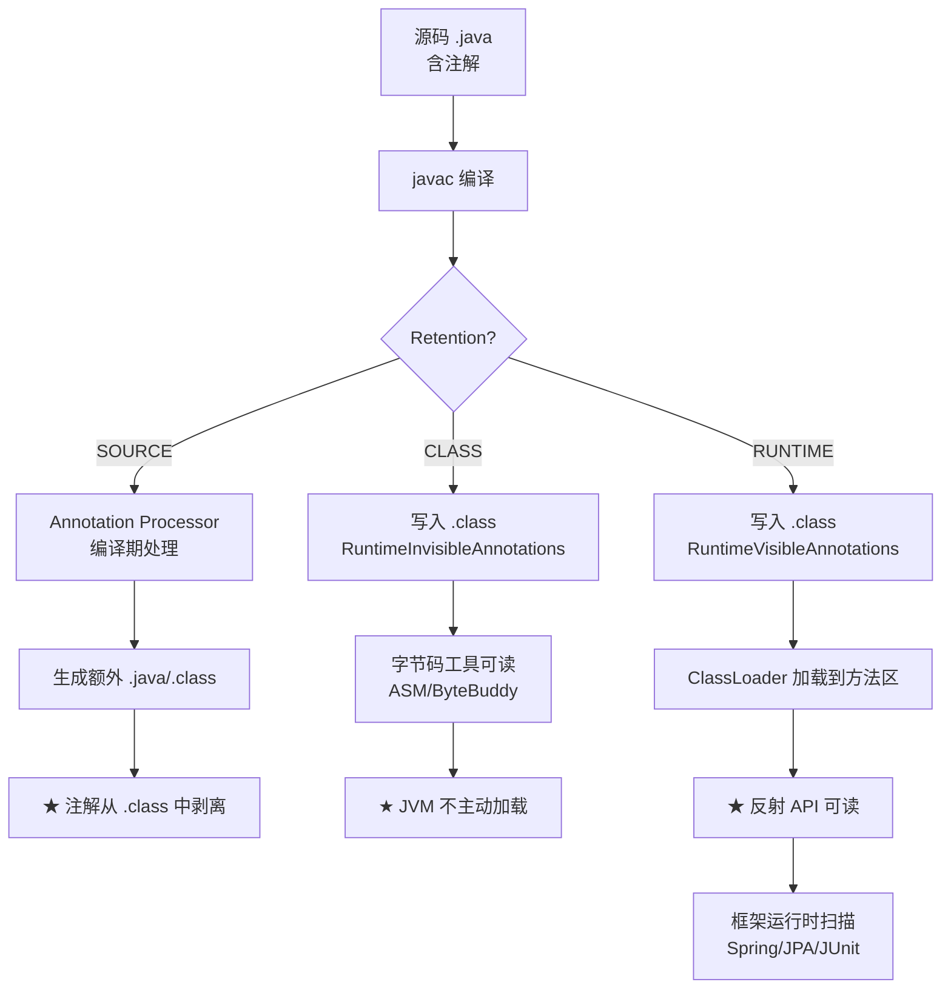
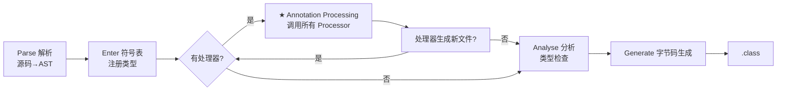
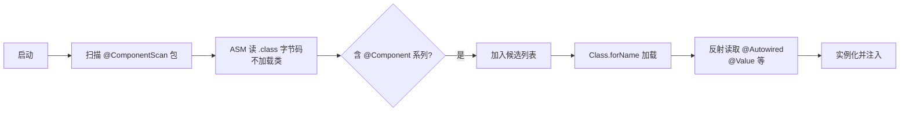

# 26.注解原理与编译期/运行期处理

#### 目录介绍
- [1. 案例引入](#1-案例引入)
  - [1.1 Override 失踪](#11-override-失踪)
  - [1.2 Lombok 死循环](#12-lombok-死循环)
  - [1.3 我们要回答什么](#13-我们要回答什么)
- [2. 注解的本质](#2-注解的本质)
  - [2.1 字节码真相](#21-字节码真相)
  - [2.2 特殊的接口](#22-特殊的接口)
  - [2.3 注解即数据](#23-注解即数据)
  - [2.4 与魔数的对比](#24-与魔数的对比)
- [3. 元注解四件套](#3-元注解四件套)
  - [3.1 Retention 三态](#31-retention-三态)
  - [3.2 Target 限定](#32-target-限定)
  - [3.3 Documented 含义](#33-documented-含义)
  - [3.4 Inherited 误区](#34-inherited-误区)
- [4. 两条处理路径](#4-两条处理路径)
  - [4.1 处理路径全景图](#41-处理路径全景图)
  - [4.2 SOURCE 即时消失](#42-source-即时消失)
  - [4.3 CLASS 仅留字节码](#43-class-仅留字节码)
  - [4.4 RUNTIME 反射可读](#44-runtime-反射可读)
- [5. 编译期 APT](#5-编译期-apt)
  - [5.1 javac 处理钩子](#51-javac-处理钩子)
  - [5.2 处理器注册机制](#52-处理器注册机制)
  - [5.3 多轮处理流程](#53-多轮处理流程)
  - [5.4 写一个简易 APT](#54-写一个简易-apt)
- [6. Lombok 黑魔法](#6-lombok-黑魔法)
  - [6.1 不止是 APT](#61-不止是-apt)
  - [6.2 修改 AST 树](#62-修改-ast-树)
  - [6.3 IDE 协同插件](#63-ide-协同插件)
  - [6.4 争议与替代](#64-争议与替代)
- [7. 运行时反射](#7-运行时反射)
  - [7.1 注解读取 API](#71-注解读取-api)
  - [7.2 动态代理生成](#72-动态代理生成)
  - [7.3 缓存与性能](#73-缓存与性能)
  - [7.4 重复注解机制](#74-重复注解机制)
- [8. 框架实战案例](#8-框架实战案例)
  - [8.1 Spring 注解扫描](#81-spring-注解扫描)
  - [8.2 JPA 字段映射](#82-jpa-字段映射)
  - [8.3 JUnit 测试发现](#83-junit-测试发现)
  - [8.4 MapStruct 编译生成](#84-mapstruct-编译生成)
- [9. 实战陷阱清单](#9-实战陷阱清单)
  - [9.1 默认 Retention 坑](#91-默认-retention-坑)
  - [9.2 Inherited 不传接口](#92-inherited-不传接口)
  - [9.3 反射读取性能坑](#93-反射读取性能坑)
  - [9.4 注解处理器调试](#94-注解处理器调试)
- [10. 综合案例串讲](#10-综合案例串讲)
  - [10.1 双案例真相揭晓](#101-双案例真相揭晓)
  - [10.2 一个注解的一生](#102-一个注解的一生)
  - [10.3 设计哲学回扣](#103-设计哲学回扣)
  - [10.4 注解速查表](#104-注解速查表)


## 1. 案例引入

### 1.1 Override 失踪

某团队迁移老代码时发现一个诡异现象——明明加了 `@Override`，方法却**没有真正覆盖父类**：

```java
public abstract class AbstractHandler {
    public void handle(Object request) {
        // 默认实现
    }
}

public class OrderHandler extends AbstractHandler {
    @Override                                    // ★ 编译通过！
    public void handle(Map<String, Object> request) {  // ★ 参数类型不一致
        // 订单处理
    }
}

// 调用
AbstractHandler h = new OrderHandler();
h.handle(someMap);    // ★ 调用的是父类的空实现，OrderHandler.handle 永远不被调用
```

事故复盘——**`@Override` 居然没拦下这种错误**？

掏出 javap 看一下编译产物：

```
public class OrderHandler extends AbstractHandler {
  // 1) 编译器自动加的桥接方法（来自父类）
  public void handle(java.lang.Object);   ← 父类 AbstractHandler 的方法被继承
  
  // 2) 自己写的方法（参数是 Map）
  public void handle(java.util.Map);      ← 重载，不是重写
}
```

**真相**：因为 Map 是 Object 的子类，`@Override` 在编译期检查时认为"存在签名兼容的方法"——但实际上这是**重载**而非**重写**——`handle(Map)` 没有真正覆盖父类的 `handle(Object)`。

复盘加了 5 个追问：

```
追问 ①：@Override 到底什么时候、由谁检查？
追问 ②：编译完成后 @Override 还在吗？
追问 ③：为什么这个错误编译期没拦住？
```

### 1.2 Lombok 死循环

同月，另一个团队发生**StackOverflowError**——加了 Lombok 的 `@Data` 自动生成 equals 居然死循环：

```java
@Data    // ★ 自动生成 equals / hashCode / toString
public class User {
    private Long id;
    private String name;
    private Department department;
}

@Data
public class Department {
    private Long id;
    private String name;
    private List<User> users;     // ★ 反向引用
}

// 测试
User u = new User();
u.setDepartment(dept);
dept.getUsers().add(u);

u.equals(otherUser);   // ★ StackOverflowError
```

**为什么 @Data 生成的 equals 会死循环**？反编译 User.class 看 Lombok 到底改写了什么：

```java
public boolean equals(Object o) {
    if (o == this) return true;
    if (!(o instanceof User)) return false;
    User other = (User) o;
    if (!Objects.equals(this.id, other.id)) return false;
    if (!Objects.equals(this.name, other.name)) return false;
    if (!Objects.equals(this.department, other.department)) return false;  // ★ 调 dept.equals
    return true;
}

// 而 Department.equals 又会调用 users.equals
// users 包含 User，User.equals 又会比较 department
// 形成循环依赖：User.equals → Dept.equals → User.equals → ... StackOverflowError
```

**核心疑惑**——**Lombok 怎么做到让源码里没有 equals 方法，编译产物却有**？这跟普通的 APT 注解处理器有什么不同？

复盘又加了 4 个追问：

```
追问 ④：APT 注解处理器能否修改类的内容？
追问 ⑤：Lombok 是怎么"凭空"生成方法的？
追问 ⑥：@Override 与 @Data 处理时机一样吗？
追问 ⑦：Spring 的 @Autowired 又是另一条路径？
```

### 1.3 我们要回答什么

第 26 篇要把"注解从源码到运行时的全部三条路径"挖透——从 `@interface` 关键字到字节码常量池、从元注解 Retention 三态到 javac 的 Annotation Processor、从 Lombok 修改 AST 的"黑魔法"到 Spring 反射扫描的运行时路径。

带着 7 个核心问题展开：

```
① @Override 谁来检查？编译完还在吗？             → 第2、4章
② 注解在字节码里是什么？                          → 第2章
③ 为什么 §1.1 错误没被拦住？                      → 第10章
④ APT 能修改源码吗？                              → 第5章
⑤ Lombok 凭空生成方法的"黑魔法"？                 → 第6章
⑥ @Override 与 @Data 处理时机有什么不同？         → 第4、5、6章
⑦ Spring @Autowired 走哪条路径？                  → 第7、8章
```

本篇路线：

```
注解的本质 (第2章) ─── 字节码里的特殊接口
    ↓
元注解四件套 (第3章)        ←—— Retention/Target/Documented/Inherited
两条处理路径 (第4章)        ←—— Retention 决定走编译期还是运行时
    ↓
编译期 APT (第5章)          ←—— javac 钩子，只能生成新文件
Lombok 黑魔法 (第6章)        ←—— 修改 javac 内部 AST
运行时反射 (第7章)           ←—— 反射读取 + 动态代理
    ↓
框架实战案例 (第8章)
实战陷阱清单 (第9章)
    ↓
综合案例串讲 (第10章)
```


## 2. 注解的本质

### 2.1 字节码真相

写一个最简单的注解：

```java
@Retention(RetentionPolicy.RUNTIME)
@Target(ElementType.TYPE)
public @interface Auditable {
    String value() default "";
    int level() default 1;
}
```

用 `javap -v Auditable.class` 反编译——看到关键的两行：

```
public interface com.example.Auditable extends java.lang.annotation.Annotation
  minor version: 0
  major version: 61
  flags: (0x2601) ACC_PUBLIC, ACC_INTERFACE, ACC_ABSTRACT, ACC_ANNOTATION
  this_class: #5  // com/example/Auditable
  super_class: #2  // java/lang/Object
  interfaces: 1, fields: 0, methods: 2
```

**惊人事实**：
- `@interface` 编译产物是 **interface**（普通接口）
- 多了一个 `ACC_ANNOTATION` 标志位（0x2000）
- 强制继承 `java.lang.annotation.Annotation` 接口
- 注解的"属性"（value/level）实际是**接口的抽象方法**

### 2.2 特殊的接口

`Annotation` 接口的源码：

```java
public interface Annotation {
    boolean equals(Object obj);
    int hashCode();
    String toString();
    
    Class<? extends Annotation> annotationType();   // ★ 唯一新增方法
}
```

**这意味着什么**——**注解就是带 ACC_ANNOTATION 标志位的接口**。所有注解类型都是 `Annotation` 的子接口。

那"注解的实例"是什么呢？比如 `@Auditable("payment")` 写在某个类上，**实际上是一个实现了 Auditable 接口的对象**——这个对象由 JDK 在反射读取注解时**动态生成**（§7.2）。

```java
@Auditable("payment")
public class PaymentService { }

// 运行时
Auditable a = PaymentService.class.getAnnotation(Auditable.class);
System.out.println(a.getClass().getName());
// → com.sun.proxy.$Proxy0   ★ 动态代理类！
System.out.println(a instanceof Auditable);   // → true
System.out.println(a.value());                // → "payment"
```

**结论**：**注解的运行时表现是动态代理对象**——这与第 07 篇反射机制中分析的 JDK 动态代理是同一套机制。

### 2.3 注解即数据

注解的"属性方法"实际上是**返回常量数据的方法**——这些数据存储在字节码常量池里。

源码：

```java
@Auditable(value = "payment", level = 3)
public class PaymentService { }
```

字节码常量池中相应条目：

```
RuntimeVisibleAnnotations:
  0: #20(#21=s#22, #23=I#24)
    com.example.Auditable(
      value="payment"
      level=3
    )
```

**关键事实**：
- 注解数据存储在 `RuntimeVisibleAnnotations` 或 `RuntimeInvisibleAnnotations` 属性中
- 由 Retention 决定写入哪个属性（§3.1、§4.3）
- 数据是**常量**——编译期写死，运行时不可变

### 2.4 与魔数的对比

**疑惑**：为什么不直接用静态字段或字符串常量来传递元数据？

**论证**——对比"魔数式"元数据与"注解式"元数据：

| 维度 | 静态字段/字符串常量 | 注解 |
|---|---|---|
| **可读性** | 业务代码与元数据混杂 | **元数据外挂，业务代码干净** |
| **类型安全** | 字符串易写错 | **编译期强类型校验** |
| **工具支持** | IDE 无法识别 | **IDE 高亮、跳转、补全** |
| **聚合处理** | 需要手写收集逻辑 | **JDK 提供统一反射 API** |
| **元元数据** | 无 | **元注解（@Target 等）控制使用范围** |

**反例**：Servlet 2.x 时代用 `web.xml` 配置 URL 映射——XML 是"外挂元数据"——但 IDE 难补全、签名易写错。Servlet 3.0 引入 `@WebServlet("/api/order")` 后——元数据贴近代码、强类型、IDE 支持——直接淘汰 XML。

**结论**：**注解是 Java 把"元数据"从注释/XML/魔数提升为"语言一等公民"的设计**——让元数据具备类型安全、工具友好、可聚合的特性。


## 3. 元注解四件套

### 3.1 Retention 三态

注解的"保留策略"决定了它能活到哪一阶段——**这是本篇最关键的概念**：

```java
public enum RetentionPolicy {
    SOURCE,    // ★ 编译后丢弃，不写入 .class
    CLASS,     // ★ 写入 .class，但 JVM 不读取（默认值）
    RUNTIME    // ★ 写入 .class，JVM 加载到内存供反射读取
}
```

**生命周期对照图**：

```
源码 .java                       字节码 .class                    运行时 JVM
────────────                     ─────────────                  ─────────────
@SOURCE  (如 @Override)           ✗ 不存在                        ✗ 不存在
@CLASS   (如 @NonNull/JSR-305)    ✓ 存在 InvisibleAnnotations   ✗ 默认不加载
@RUNTIME (如 @Autowired)          ✓ 存在 VisibleAnnotations     ✓ 反射可读
```

**§1.1 中 @Override 的真相**：

```java
// JDK 源码
@Target(ElementType.METHOD)
@Retention(RetentionPolicy.SOURCE)   // ★ SOURCE！编译完就消失
public @interface Override { }
```

回到追问 ①——**`@Override` 的全部使命就是让 javac 在编译期检查方法签名**——一旦编译完成，它的历史使命也就结束，不会进入 .class 文件。

**§1.2 中 @Data 的真相**：

```java
// Lombok 源码
@Target({ElementType.TYPE})
@Retention(RetentionPolicy.SOURCE)   // ★ 也是 SOURCE
public @interface Data { ... }
```

`@Data` 同样是 SOURCE——但它的使命是**触发 Lombok 在编译期修改 AST 生成方法**——见第 6 章。

### 3.2 Target 限定

`@Target` 限定注解能用在哪些位置：

```java
public enum ElementType {
    TYPE,              // 类、接口、枚举、注解
    FIELD,             // 字段
    METHOD,            // 方法
    PARAMETER,         // 方法参数
    CONSTRUCTOR,       // 构造器
    LOCAL_VARIABLE,    // 局部变量
    ANNOTATION_TYPE,   // 注解
    PACKAGE,           // 包
    TYPE_PARAMETER,    // 类型参数（JDK 8）— 如 List<@NonNull String>
    TYPE_USE,          // 任何类型出现处（JDK 8）
    MODULE,            // 模块（JDK 9）
    RECORD_COMPONENT   // record 组件（JDK 16）
}
```

**疑惑**：不写 @Target 会怎样？

**论证**——查 JDK 源码：

```java
// AnnotatedElementUtils 内部
if (target == null) {
    return true;   // ★ 默认任何位置都能用
}
```

**结论**：**不写 @Target = 任何位置都能用**——这通常不是你想要的，应当**显式声明**避免误用。

### 3.3 Documented 含义

`@Documented` 仅影响 javadoc——加了它的注解会出现在生成的 API 文档中：

```java
@Documented            // ★ 文档里会显示
@Retention(RUNTIME)
public @interface Deprecated { }
```

**实际影响小**——主要给"对外暴露的注解"（如 @Deprecated、@Override）使用。**不影响运行时行为**。

### 3.4 Inherited 误区

`@Inherited` 表示"子类自动继承父类的注解"——但**有三个坑**：

```java
@Inherited
@Retention(RUNTIME)
public @interface Auditable { String value(); }

@Auditable("base")
public class Parent { }

public class Child extends Parent { }     // ★ 没写注解

// 反射检查
Child.class.getAnnotation(Auditable.class);   // → @Auditable("base")  ✅ 继承到了
```

**坑 1：仅限类继承，方法不继承**

```java
public class Parent {
    @Auditable("methodA")
    public void doSomething() { }
}

public class Child extends Parent {
    @Override
    public void doSomething() { ... }
}

// 反射读取 Child.doSomething() 的注解
Child.class.getMethod("doSomething").getAnnotation(Auditable.class);
// → null   ★ @Inherited 对方法无效
```

**坑 2：仅限单继承，接口不传**

```java
public interface Auditable_API {
    @Auditable("interface")
    void process();
}

public class Impl implements Auditable_API {
    @Override
    public void process() { ... }
}

// 反射读取
Impl.class.getMethod("process").getAnnotation(Auditable.class);
// → null   ★ 接口的注解不传到实现类
```

**坑 3：被子类覆盖**

```java
@Auditable("base")
public class Parent { }

@Auditable("child")
public class Child extends Parent { }    // ★ 重新定义

Child.class.getAnnotation(Auditable.class);   // → @Auditable("child")
```

**Spring 的修复方案**——`AnnotationUtils.findAnnotation` 自己实现了"穿透接口、穿透方法、穿透 meta-annotation"的查找：

```java
// 简化逻辑
findAnnotation(Class clazz, Class annotationType):
  1. 检查 clazz 自己的注解
  2. 递归检查所有父类
  3. 递归检查所有接口（@Inherited 不会做这步）
  4. 检查 meta-annotation（注解上的注解）
```

**结论**：**@Inherited 是简化设计**——只覆盖最简单的"类继承"场景。生产框架普遍自己写"全谱系"查找——Spring 的 AnnotationUtils 是事实标准。


## 4. 两条处理路径

### 4.1 处理路径全景图

回到本篇核心命题——**注解的处理路径完全由 @Retention 决定**：



### 4.2 SOURCE 即时消失

SOURCE 类注解只在 javac 内部存活——**编译完成后从 .class 中剥离**。

**实证**：

```java
@Override
public void run() { }

// 编译后 javap -v 查看 method 属性
flags: (0x0001) ACC_PUBLIC
// ★ 没有任何 RuntimeXxxAnnotations 属性，@Override 完全消失
```

**典型 SOURCE 注解**：

| 注解 | 用途 |
|---|---|
| @Override | 编译期检查方法签名 |
| @SuppressWarnings | 控制 javac 警告输出 |
| @Data / @Getter（Lombok） | 触发字节码改写 |
| @AutoService（Google） | 触发 META-INF 文件生成 |

**关键观察**——**SOURCE 注解的全部价值在编译期被消费完毕**——它们是"给编译器和处理器看的指令"。

### 4.3 CLASS 仅留字节码

CLASS 是 `@Retention` **不写时的默认值**——这点很多人不知道：

```java
@interface MyAnno { }    // ★ 默认就是 CLASS，不是 RUNTIME！

@MyAnno
public class Foo { }

Foo.class.getAnnotation(MyAnno.class);    // → null  ★ 反射读不到！
```

**默认是 CLASS 的设计原因**：
- SOURCE 太短命，绝大多数注解需要在编译产物里留痕（如静态分析工具读）
- RUNTIME 引入运行时反射成本，**不应该是所有注解的默认行为**
- CLASS 是中间态——保留了字节码信息，但不消耗运行时性能

**典型 CLASS 注解**：

| 注解 | 用途 |
|---|---|
| @NonNull / @Nullable（JSR-305） | 静态分析工具（FindBugs、IDEA） |
| @CheckReturnValue | SpotBugs 检查未使用返回值 |
| ASM 字节码增强用的标记 | 非 JVM 路径，靠工具读取 |

回到第 1 章追问 ②——**默认 Retention 是 CLASS**，写错就会让框架反射读不到，是常见陷阱（§9.1）。

### 4.4 RUNTIME 反射可读

RUNTIME 是框架最常用的——**JVM 加载类时同时加载注解到方法区**，反射 API 可读：

```java
// 字段在 JVM 内部存储
class Class<T> {
    private transient Map<Class<? extends Annotation>, Annotation> annotationData;
}

// 反射读取
T annotation = clazz.getAnnotation(SomeAnno.class);
```

**性能成本**：每次类加载都要解析注解属性（§7.3 缓存机制）。这就是为什么**滥用 RUNTIME 注解会拖慢启动**。

**典型 RUNTIME 注解**：

| 注解 | 框架 | 用途 |
|---|---|---|
| @Autowired | Spring | 反射扫描注入依赖 |
| @Entity / @Column | JPA | 反射映射数据库表 |
| @Test | JUnit | 反射扫描测试方法 |
| @RequestMapping | Spring MVC | 反射构建路由表 |
| @Around / @Before | AspectJ | 反射构建切面 |

**结论**：**Retention 三态是注解世界的"分水岭"**——SOURCE 给编译器、CLASS 给静态工具、RUNTIME 给框架。**选错 Retention 是注解最常见的事故源**。


## 5. 编译期 APT

### 5.1 javac 处理钩子

JDK 5 引入 APT（Annotation Processing Tool），JDK 6 起内置在 javac 中——**让用户在编译期介入**。

**javac 的编译流程**（含 APT）：



**关键事实**：
- APT 在 **Analyse 之前** 运行
- 处理器**可以生成新的 .java 或 .class 文件**
- 新生成的文件会**重新进入处理流程**（多轮处理）
- 处理器**不能直接修改已有源码**（标准 API 限制）

### 5.2 处理器注册机制

写一个 Processor 必须实现 `javax.annotation.processing.Processor`：

```java
@SupportedAnnotationTypes("com.example.Auditable")
@SupportedSourceVersion(SourceVersion.RELEASE_17)
public class AuditableProcessor extends AbstractProcessor {
    
    @Override
    public boolean process(Set<? extends TypeElement> annotations,
                           RoundEnvironment roundEnv) {
        for (Element e : roundEnv.getElementsAnnotatedWith(Auditable.class)) {
            // 处理逻辑——通常生成新文件
            generateAuditWrapper((TypeElement) e);
        }
        return true;
    }
}
```

**注册方式**——通过 SPI 机制（第 51 篇会详讲）：

```
META-INF/services/javax.annotation.processing.Processor
```

文件内容：

```
com.example.AuditableProcessor
```

或用 Google AutoService 简化：

```java
@AutoService(Processor.class)
public class AuditableProcessor extends AbstractProcessor { ... }
```

### 5.3 多轮处理流程

APT 是**多轮**的——第 N 轮生成的代码会触发第 N+1 轮处理：

```
第 1 轮：处理 com.example.* 中的 @Auditable
        → 生成 AuditableWrapper.java
        
第 2 轮：处理 AuditableWrapper.java 中的 @Generated
        → 生成 GeneratedMeta.java
        
第 3 轮：没有新生成的文件，结束
```

每轮 RoundEnvironment 包含：
- `getRootElements()` —— 本轮的根元素
- `getElementsAnnotatedWith(...)` —— 本轮被该注解标记的元素
- `processingOver()` —— 是否最后一轮

### 5.4 写一个简易 APT

完整的"自动生成 Builder 类"处理器：

```java
@SupportedAnnotationTypes("com.example.AutoBuilder")
@SupportedSourceVersion(SourceVersion.RELEASE_17)
@AutoService(Processor.class)
public class BuilderProcessor extends AbstractProcessor {
    
    @Override
    public boolean process(Set<? extends TypeElement> annotations,
                           RoundEnvironment roundEnv) {
        for (Element elem : roundEnv.getElementsAnnotatedWith(AutoBuilder.class)) {
            TypeElement typeElement = (TypeElement) elem;
            String className = typeElement.getQualifiedName().toString();
            String builderName = className + "Builder";
            
            try {
                JavaFileObject file = processingEnv.getFiler()
                    .createSourceFile(builderName);
                
                try (PrintWriter pw = new PrintWriter(file.openWriter())) {
                    pw.println("public class " + simpleName(builderName) + " {");
                    
                    // 为每个字段生成 setter
                    for (Element field : typeElement.getEnclosedElements()) {
                        if (field.getKind() == ElementKind.FIELD) {
                            generateSetter(pw, field);
                        }
                    }
                    
                    pw.println("}");
                }
            } catch (IOException e) {
                processingEnv.getMessager()
                    .printMessage(Diagnostic.Kind.ERROR, e.getMessage());
            }
        }
        return true;
    }
}
```

**核心限制**：**只能"创建新文件"，不能"修改已有类"** ——这是标准 APT 的边界。

回到第 1 章追问 ④——**APT 不能修改源码**。要修改已有类，需要走 §6 的"非标路径"。


## 6. Lombok 黑魔法

### 6.1 不止是 APT

§5 已经分析——APT 不能修改已有类。但 Lombok 的 `@Data` 明明就修改了 User 类啊（§1.2）！

**真相**：**Lombok 表面是 APT，实际上偷偷调用了 javac 内部 API**——这就是它的"黑魔法"。

启动一个 javac 编译过程时——

```
正规 APT：
  1. javac 解析源码 → AST
  2. 进入 APT 阶段，调用 Processor.process()
  3. Processor 通过 Filer.createSourceFile 生成新文件 ✓
  4. ★ 不能修改已有 AST
  5. 继续后续编译

Lombok 的玩法：
  1. javac 解析源码 → AST
  2. 进入 APT 阶段，调用 LombokProcessor.process()
  3. ★ LombokProcessor 强转 ProcessingEnvironment 为 javac 内部类
  4. ★ 直接拿到 JavacAST，修改 AST 树（加 equals/getter/setter 等节点）
  5. 继续后续编译——编译器看到的 AST 已经被改过
```

### 6.2 修改 AST 树

Lombok 的核心代码（简化）：

```java
public class HandleData extends JavacAnnotationHandler<Data> {
    
    @Override
    public void handle(AnnotationValues<Data> annotation, JCAnnotation ast,
                       JavacNode annotationNode) {
        JavacNode typeNode = annotationNode.up();          // 拿到被注解的类节点
        
        // 为每个字段加 getter
        new HandleGetter().generateGetterForType(typeNode, annotationNode, ...);
        // 为每个字段加 setter
        new HandleSetter().generateSetterForType(typeNode, annotationNode, ...);
        // 加 equals/hashCode
        new HandleEqualsAndHashCode().generateMethods(typeNode, ...);
        // 加 toString
        new HandleToString().generateToString(typeNode, ...);
    }
}

// 生成 getter 的核心
private void generateGetter(JavacNode fieldNode) {
    JCMethodDecl getter = treeMaker.MethodDef(
        treeMaker.Modifiers(Flags.PUBLIC),
        nameTable.fromString("get" + capitalize(fieldNode.getName())),
        fieldType,                                          // 返回类型
        List.<JCTypeParameter>nil(),                        // 无泛型参数
        List.<JCVariableDecl>nil(),                         // 无方法参数
        List.<JCExpression>nil(),                           // 无 throws
        body,                                               // 方法体
        null
    );
    
    JavacHandlerUtil.injectMethod(typeNode, getter);        // ★ 直接注入到 AST
}
```

**关键调用 `injectMethod`** ——把生成的 getter 节点直接挂到类的 AST 上——后续 javac 的 Analyse 和 Generate 阶段就把它当作"用户写的方法"对待，编译进 .class。

### 6.3 IDE 协同插件

只让 javac 看到 Lombok 还不够——**IDE 也要能识别**。否则代码里 `user.getName()` 会被 IDE 标红。

Lombok 的解决方案：
- **IntelliJ IDEA Lombok Plugin** —— 钩入 IDEA 的索引引擎，让它在分析符号时把 @Data 也展开
- **Eclipse Lombok Agent** —— Java Agent 形式启动 Eclipse，劫持 Eclipse 的 ECJ 编译器
- **VSCode Java Plugin** —— 内置 Lombok 处理

**这就是为什么使用 Lombok 必须装 IDE 插件**——否则源码看着没有 getter，IDE 就报红。

### 6.4 争议与替代

Lombok 强大但**广受争议**：

**优点**：
- 极大减少样板代码（POJO 100 行 → 5 行）
- 维护性好（加字段不用同步改 getter/setter）

**缺点**：
- 依赖 javac 内部 API ——**JDK 升级时可能爆炸**（Lombok 对 JDK 17 适配花了好几个月）
- IDE 插件耦合，团队规范要求严格
- 调试时栈帧名混乱
- "你看不到的代码"——新人难懂

**JDK 自己的替代方案**——**Record（JDK 16）**（第 30 篇会详讲）：

```java
// Lombok 写法
@Data
public class Point {
    private double x;
    private double y;
}

// JDK 17 Record 写法（语言级支持）
public record Point(double x, double y) { }
```

**Record 不需要任何外部依赖**——是 JDK 给"不可变数据载体"的官方答案。

回到第 1 章追问 ⑤——**Lombok 不是凭空生成方法，而是在 javac 处理过程中通过私有 API 直接修改 AST 树**——这是越界但合法的操作。回到追问 ⑥——**@Override 处理时机是"语义检查阶段"（在 APT 之后），@Data 处理时机是 APT 阶段（早于语义检查）**——所以 @Data 生成的方法能被后续阶段当作正常代码处理。


## 7. 运行时反射

### 7.1 注解读取 API

JDK 的注解反射 API 集中在 `java.lang.reflect.AnnotatedElement` 接口：

```java
public interface AnnotatedElement {
    <T extends Annotation> T getAnnotation(Class<T> annotationClass);
    Annotation[] getAnnotations();
    Annotation[] getDeclaredAnnotations();
    
    // JDK 8 新增——支持 @Repeatable 重复注解
    <T extends Annotation> T[] getAnnotationsByType(Class<T> annotationClass);
    <T extends Annotation> T[] getDeclaredAnnotationsByType(Class<T> annotationClass);
    
    boolean isAnnotationPresent(Class<? extends Annotation> annotationClass);
}
```

**Class、Method、Field、Constructor、Parameter 都实现了 AnnotatedElement**——所以反射读注解的入口是统一的。

`getAnnotation` vs `getDeclaredAnnotation`：

```java
@Auditable   // @Inherited 的注解
public class Parent { }
public class Child extends Parent { }

Child.class.getAnnotation(Auditable.class);          // → 从父类继承到 ✅
Child.class.getDeclaredAnnotation(Auditable.class);  // → null （只看自己）
```

### 7.2 动态代理生成

§2.2 已经埋伏笔——**注解的运行时实例是动态代理对象**。来看 JDK 内部实现。

`Class.getAnnotation` 的源码路径：

```java
// java.lang.Class
public <A extends Annotation> A getAnnotation(Class<A> annotationClass) {
    return (A) annotationData().annotations.get(annotationClass);
}

// 内部 annotationData
private AnnotationData createAnnotationData(int classRedefinedCount) {
    Map<Class<? extends Annotation>, Annotation> declaredAnnotations =
        AnnotationParser.parseAnnotations(getRawAnnotations(), ...);
    // ...
}

// AnnotationParser.parseAnnotations 最终调到
public static Annotation annotationForMap(Class<? extends Annotation> type,
                                          Map<String, Object> memberValues) {
    return (Annotation) Proxy.newProxyInstance(   // ★ 动态代理！
        type.getClassLoader(),
        new Class<?>[] { type },
        new AnnotationInvocationHandler(type, memberValues)
    );
}
```

**关键点**：**JDK 用 Proxy.newProxyInstance 动态生成实现注解接口的类**——`AnnotationInvocationHandler` 拦截方法调用，从 memberValues Map 中取出对应属性值返回。

这就是为什么 `a.getClass().getName()` 输出 `com.sun.proxy.$Proxy0`。

### 7.3 缓存与性能

注解反射是**有性能成本**的——每次调用都要解析常量池字节、构建 Map、生成代理对象。

JDK 的优化：

```java
// java.lang.Class 内部
private volatile transient AnnotationData annotationData;

private AnnotationData annotationData() {
    while (true) {
        AnnotationData annotationData = this.annotationData;
        int classRedefinedCount = this.classRedefinedCount;
        if (annotationData != null && annotationData.redefinedCount == classRedefinedCount) {
            return annotationData;     // ★ 命中缓存
        }
        AnnotationData newAnnotationData = createAnnotationData(classRedefinedCount);
        if (Atomic.casAnnotationData(this, annotationData, newAnnotationData)) {
            return newAnnotationData;
        }
    }
}
```

**JDK 内部按 Class 维度缓存所有注解**——首次访问时构建，后续直接返回。

但**应用层还要再加一层缓存**——尤其是 Spring/JPA 这种"上下文级"框架——它们维护自己的 `Map<Method, AnnotationMetadata>` 缓存，避免每次请求重新读注解。

**实战陷阱**：

```java
// ❌ 错误：每次调用都反射读注解
public Object handleRequest(Method method) {
    Auditable a = method.getAnnotation(Auditable.class);   // 每次都走反射
    // ...
}

// ✅ 正确：启动时建缓存
private static final Map<Method, Auditable> CACHE = new ConcurrentHashMap<>();

public Object handleRequest(Method method) {
    Auditable a = CACHE.computeIfAbsent(method, m -> m.getAnnotation(Auditable.class));
    // ...
}
```

### 7.4 重复注解机制

JDK 8 引入 `@Repeatable`——一个目标可以被同一个注解标记多次：

```java
@Repeatable(Schedules.class)        // ★ 指定容器
@Retention(RUNTIME)
public @interface Schedule {
    String dayOfWeek();
    int hour();
}

@Retention(RUNTIME)
public @interface Schedules {
    Schedule[] value();             // ★ 容器必须有 value() 数组
}

// 使用
@Schedule(dayOfWeek="Mon", hour=9)
@Schedule(dayOfWeek="Fri", hour=18)
public class WeeklyJob { }

// 反射读取
Schedule[] all = WeeklyJob.class.getAnnotationsByType(Schedule.class);   // ★ 直接拿数组
// 或
Schedules container = WeeklyJob.class.getAnnotation(Schedules.class);
Schedule[] all2 = container.value();
```

**编译器底层做的事**：把多个 @Schedule 包装到 Schedules 容器中——`getAnnotationsByType` 自动拆包返回数组。


## 8. 框架实战案例

### 8.1 Spring 注解扫描

Spring 启动时的核心流程——**ClassPathScanningCandidateComponentProvider**：



**两阶段读注解**：
1. **扫描阶段**用 ASM 读字节码——不触发类加载——避免初始化大量未使用的类
2. **注入阶段**用反射读 RUNTIME 注解——拿到 @Autowired 字段、@Value 属性

**关键性能优化**：Spring Boot 把扫描结果写到 `META-INF/spring.factories`（旧版）或 `META-INF/spring/...AutoConfiguration.imports`（新版）——**启动时直接读文件，不再扫描**。

### 8.2 JPA 字段映射

JPA 的 `@Entity / @Column / @Id` 都是 RUNTIME 注解：

```java
@Entity
@Table(name = "users")
public class User {
    @Id
    @GeneratedValue(strategy = GenerationType.IDENTITY)
    private Long id;
    
    @Column(name = "user_name", nullable = false, length = 50)
    private String name;
}
```

Hibernate 启动时——

```java
for (Field f : User.class.getDeclaredFields()) {
    Column col = f.getAnnotation(Column.class);
    if (col != null) {
        ColumnMetadata meta = new ColumnMetadata();
        meta.setName(col.name().isEmpty() ? f.getName() : col.name());
        meta.setNullable(col.nullable());
        meta.setLength(col.length());
        // ... 注册到元数据中心
    }
}
```

**这套元数据缓存只构建一次**——之后所有 SQL 生成都基于缓存，不再反射。

### 8.3 JUnit 测试发现

JUnit 5 的核心——`@Test` / `@BeforeEach` / `@AfterAll`：

```java
public class OrderServiceTest {
    @BeforeEach
    void setUp() { ... }
    
    @Test
    void shouldCreateOrder() { ... }
    
    @ParameterizedTest
    @ValueSource(strings = {"a", "b", "c"})
    void shouldHandleInputs(String input) { ... }
}
```

JUnit 启动时反射扫描所有 public 方法——根据 @Test 等注解构建"测试执行计划"——这就是为什么你不需要手写 main 方法也能跑测试。

### 8.4 MapStruct 编译生成

**MapStruct** 是 APT 的优秀范例——比 Lombok 守规矩——只创建新文件，不修改已有类：

```java
@Mapper
public interface UserMapper {
    UserDTO toDto(User user);
}

// MapStruct 编译期生成 UserMapperImpl.java
public class UserMapperImpl implements UserMapper {
    @Override
    public UserDTO toDto(User user) {
        UserDTO dto = new UserDTO();
        dto.setId(user.getId());
        dto.setName(user.getName());
        return dto;
    }
}
```

**优势**：
- 零运行时开销（vs ModelMapper 反射映射）
- 强类型——映射错误编译期暴露
- 标准 APT，跨 JDK 版本兼容性好

回到第 1 章追问 ⑦——**Spring 的 @Autowired 走 RUNTIME 反射路径，扫描类→反射读注解→注入；MapStruct 走 SOURCE 编译期路径，标准 APT 生成新类；Lombok 走 SOURCE 编译期路径，但用私有 API 修改 AST**。三种路径全部由 @Retention 决定起点。


## 9. 实战陷阱清单

### 9.1 默认 Retention 坑

最常见的注解事故 —— 忘写 @Retention：

```java
// ❌ 错误：缺 @Retention
public @interface MyAnno { }

@MyAnno
public class Service { }

Service.class.getAnnotation(MyAnno.class);   // → null  ★ 反射读不到！
```

**§4.3 已分析**——**默认是 CLASS，不是 RUNTIME**。

**修复**：

```java
@Retention(RetentionPolicy.RUNTIME)   // ★ 必须显式声明
public @interface MyAnno { }
```

**红线**：**写自定义注解的第一步必须确认 @Retention**——通常 RUNTIME 是想要的。

### 9.2 Inherited 不传接口

§3.4 已经分析——@Inherited 不通过接口传递。

**Spring 用户的常见困惑**：

```java
// 自定义元注解
@Inherited
@Retention(RUNTIME)
public @interface Auditable { }

// 标在接口上
@Auditable
public interface PaymentService { }

public class PaymentServiceImpl implements PaymentService { }

// 反射读取
PaymentServiceImpl.class.getAnnotation(Auditable.class);   // → null
AnnotationUtils.findAnnotation(PaymentServiceImpl.class, Auditable.class);   // → @Auditable ✅
```

**生产建议**：**所有"穿透继承层"的注解查找都用 Spring `AnnotationUtils.findAnnotation`** ——别用 JDK 原生 API。

### 9.3 反射读取性能坑

每次都调 `getAnnotation` 是性能陷阱（§7.3）。

**生产代码必须缓存**：

```java
private static final ClassValue<List<Auditable>> CACHE = new ClassValue<>() {
    @Override
    protected List<Auditable> computeValue(Class<?> type) {
        return Arrays.stream(type.getAnnotationsByType(Auditable.class))
                     .toList();
    }
};

// 调用
List<Auditable> annos = CACHE.get(SomeService.class);   // 第一次反射，之后命中缓存
```

`ClassValue` 是 JDK 的 Class 维度缓存工具——比 `ConcurrentHashMap` 更适合"以 Class 为键"的场景，且支持 Class 卸载时自动清理。

### 9.4 注解处理器调试

APT 调试是新手痛点——处理器在 javac 进程中运行，IDE 默认调试不到。

**正确姿势**——开 `-J-Xrunjdwp` 让 javac 监听调试端口：

```bash
javac -J-agentlib:jdwp=transport=dt_socket,server=y,suspend=y,address=5005 \
      -processor com.example.MyProcessor \
      Foo.java
```

然后 IDEA 远程附加到 5005 端口——可以打断点调试 Processor.process。

或者**写测试**——使用 Google Compile Testing：

```java
@Test
void shouldGenerateBuilder() {
    Compilation compilation = Compiler.javac()
        .withProcessors(new BuilderProcessor())
        .compile(JavaFileObjects.forResource("TestEntity.java"));
    
    assertThat(compilation).succeeded();
    assertThat(compilation)
        .generatedSourceFile("com.example.TestEntityBuilder")
        .hasSourceEquivalentTo(...);
}
```


## 10. 综合案例串讲

### 10.1 双案例真相揭晓

回到第 1 章双事故，逐条揭晓：

**① @Override 谁来检查、编译完还在吗**：**`@Override` 是 SOURCE 注解，由 javac 在编译期的语义分析阶段检查方法签名是否匹配父类**。检查完成后从 .class 中剥离，运行时不存在（§3.1、§4.2）。它的全部价值在编译期被消费完毕——是"给编译器的指令"。

**② 注解在字节码里是什么**：**注解类型本身是带 ACC_ANNOTATION 标志位的特殊接口**——继承 `java.lang.annotation.Annotation`。注解的"使用实例"存储在被标记元素的 `RuntimeVisibleAnnotations`（RUNTIME）或 `RuntimeInvisibleAnnotations`（CLASS）属性中——属性值存在常量池里（§2.1、§2.3）。**运行时的注解对象是 JDK 通过 Proxy 动态生成的代理类**（§2.2、§7.2）。

**③ 为什么 §1.1 错误没被拦住**：因为 `Map<String, Object>` 也是 `Object` 的子类——**javac 检查 @Override 时认为"父类有签名兼容的方法"——但实际是重载而非重写**。这是 @Override 的检查规则边界。**修复方式是用编译器警告 `-Xlint:overrides` 并把 `OrderHandler` 的方法改为接收 Object 后内部强转**——或者干脆把父类的方法签名也改成 `Map`。

**④ APT 能修改源码吗**：**标准 APT 不能修改已有类，只能创建新文件**（§5.1、§5.4）。`Filer.createSourceFile` 创建新 .java、`Filer.createClassFile` 创建新 .class——这是 javac 给 Processor 的全部能力。

**⑤ Lombok 凭空生成方法的"黑魔法"**：**Lombok 表面是 APT，底层强转 ProcessingEnvironment 为 javac 内部类拿到 JavacAST，直接修改 AST 树**——加 getter/setter/equals 等节点（§6.1、§6.2）。这是越界但合法的操作——**代价是依赖 javac 私有 API，JDK 升级容易爆炸**。**JDK 16 起的 Record 是更优雅的替代**（§6.4）。

**⑥ @Override 与 @Data 处理时机的不同**：两者都是 SOURCE Retention——但处理时机完全不同。**@Override 在"语义检查阶段"被消费**——javac 内置规则；**@Data 在"APT 阶段"被处理**——APT 早于语义检查，所以 @Data 生成的方法能被后续阶段当作正常代码处理（§5.1、§6.2）。**正是这个时机差让 Lombok 能"无中生有"**。

**⑦ Spring @Autowired 走哪条路径**：**RUNTIME 反射路径**——Spring 启动时先用 ASM 扫描类路径（不加载类）找到所有候选 Bean，再 `Class.forName` 加载，然后反射读取 @Autowired/@Value 等 RUNTIME 注解（§4.4、§8.1）。**与 §1.1 的 @Override（编译期）和 §1.2 的 @Data（APT 改 AST）走的是完全不同的路径**——这就是注解三大处理路径的全景。

**§1.2 死循环的修复**：用 `@EqualsAndHashCode(of = {"id"})` 限定参与字段——只用 id 比较，避开循环引用：

```java
@Data
@EqualsAndHashCode(of = "id")    // ★ 只用 id 算 equals
public class User {
    private Long id;
    private String name;
    private Department department;
}
```

### 10.2 一个注解的一生

把 `@Auditable("payment")` 这个最普通的注解串成生命树，回扣本篇所有章节：

```
T 0       源码阶段
          ────────
          @Auditable("payment")
          public class PaymentService { ... }
          
          ★ 此时 @Auditable 是源码注释 + 类型引用
          ★ 写一个 .java 文件就完成第一步
          
T+1ms     javac 编译开始
          ──────────────
          [Parse] 源码 → AST
          ★ Auditable 被解析为 JCAnnotation 节点
          
T+5ms     [Enter] 注册类型符号
          
T+10ms    ★ APT 阶段开始（§5.1）
          调用所有 Annotation Processor
          - 如果是 SOURCE 注解（如 @Data）→ Lombok 改 AST（§6.2）
          - 如果是 SOURCE 标记（如 @AutoBuilder）→ 生成新文件（§5.4）
          - 如果是 CLASS/RUNTIME 注解 → 通常无 APT 处理
          
T+30ms    [Analyse] 类型检查
          ★ 这里检查 @Override（§4.2）
          ★ @Override 处理完毕后从 AST 中移除（SOURCE）
          
T+50ms    [Generate] 字节码生成
          ★ 根据 Retention 决定写入哪个属性：
            SOURCE  → 不写
            CLASS   → 写入 RuntimeInvisibleAnnotations（§4.3）
            RUNTIME → 写入 RuntimeVisibleAnnotations（§4.4）
          ★ 注解属性值（"payment"）写入常量池
          
T+100ms   .class 文件落盘
          ─────────────
          PaymentService.class:
            RuntimeVisibleAnnotations:
              0: #20(#21=s#22)
                Auditable(value="payment")
          
T+1day    JVM 启动加载
          ──────────────
          ClassLoader 加载 PaymentService（[02]篇）
          解析 RuntimeVisibleAnnotations 属性
          ★ 在 Class 内部 annotationData 中缓存（§7.3）
          
T+1day+10ms  Spring 反射扫描（§8.1）
          ───────────────────────
          ASM 读字节码 → 发现 @Component 系列 → 加入候选
          Class.forName("PaymentService") 触发加载
          反射读 @Autowired 字段 → 注入依赖
          
T+1day+50ms  AOP 代理生成（[07]篇）
          ────────────────────
          Spring 发现 @Auditable → 创建动态代理
          代理拦截方法调用 → 写审计日志
          
T+1day+100ms 用户请求到达
          ────────────────
          method.getAnnotation(Auditable.class)
          ★ 第一次：JDK 用 Proxy 生成 $Proxy0 实现 Auditable 接口（§7.2）
          ★ 之后：从 ClassValue/ConcurrentHashMap 缓存命中（§7.3）
          
T+forever 注解的生命与 Class 共存亡
          ★ 类卸载时 annotationData 一同消亡

跨篇引用全景：
[02] ClassLoader 加载注解到方法区
[07] Annotation 通过动态代理实例化
[12] 异常注解 @SuppressWarnings 与 javac 协作
[24] hashCode/equals 在动态代理对象上的语义
[25] 注解就是带 ACC_ANNOTATION 的特殊枚举式接口
```

### 10.3 设计哲学回扣

跳出技术细节，提炼贯穿注解设计的三条工程哲学：

1. **元数据应是语言一等公民**：注解出现前，元数据散落在 javadoc 注释、XML 配置、命名约定（如 EJB 2.x 的"_Bean"后缀）中——**没有类型安全、没有 IDE 支持、没有统一处理 API**。注解把元数据提升为"语言关键字 + 类型系统的一部分"——**让元数据具备和代码同等的工具友好性**。这是 Java 5 的革命性设计——之后 Spring 从 XML 时代走向注解时代、Servlet 从 web.xml 走向 @WebServlet——整个 Java 生态因此更新换代。**这条哲学在第 30 篇的 Record 和 Sealed 中再次闪光**——把"不可变数据载体"和"封闭继承层级"也升级为语言一等公民。

2. **三态 Retention 是关键解耦**：SOURCE/CLASS/RUNTIME 看似只是三个枚举值——实际是**注解世界的彻底解耦**。SOURCE 只服务编译器（@Override/@SuppressWarnings）、CLASS 只服务静态分析工具（@NonNull）、RUNTIME 才进入运行时（@Autowired）——**每个 Retention 对应一类消费者，互不打扰**。**这是 Java 设计中"分层语义"的典范**——同一个机制（注解）通过一个开关（Retention）服务三类完全不同的工具链。**对照来看**——线程模型也有"用户态/内核态"、GC 也有"年轻代/老年代/元空间"——分层让复杂系统可治理。

3. **机制开放，策略上交框架**：JDK 只提供"注解定义、注解读取、APT 钩子"三个基础机制——**所有具体策略（什么注解干什么）全部交给框架和应用**。Spring 用 @Component、JPA 用 @Entity、JUnit 用 @Test——**JDK 不内置任何业务语义**。**这是 Unix 哲学"机制与策略分离"在 Java 中的体现**——也是为什么注解从 JDK 5 至今没有大改——基础机制稳如磐石，上层生态百花齐放。Lombok 的"AST 改写"就是有人觉得"基础机制不够用"——**但代价是绑定 javac 私有 API，反衬出 JDK 公共 API 的稳定性多么宝贵**。

### 10.4 注解速查表

最后一张速查表——**注解三态全览**：

| 维度 | SOURCE | CLASS | RUNTIME |
|---|---|---|---|
| **写入 .class** | ❌ | ✅ Invisible | ✅ Visible |
| **JVM 加载** | ❌ | ❌ | ✅ |
| **反射可读** | ❌ | ❌ | ✅ |
| **典型代表** | @Override / @Data | @NonNull / JSR-305 | @Autowired / @Test |
| **消费者** | javac / APT | 静态分析工具 | 运行时框架 |
| **性能成本** | 0（编译完丢弃） | 0（运行时不读） | 反射成本（需缓存） |

**注解处理三条路径**：

| 路径 | 时机 | 能力边界 | 典型框架 |
|---|---|---|---|
| **javac 内置检查** | 编译期·语义分析 | 仅检查不修改 | @Override / @Deprecated |
| **APT 标准处理器** | 编译期·APT 阶段 | 仅生成新文件 | MapStruct / AutoService |
| **APT + AST 改写** | 编译期·APT 阶段 | 修改已有 AST（私有 API） | Lombok |
| **运行时反射** | JVM 加载后 | 读注解 + 动态代理 | Spring / JPA / JUnit |

**注解七条铁律**：

```
1. 注解是带 ACC_ANNOTATION 的特殊接口，运行时表现为动态代理对象
2. @Retention 默认 CLASS，不是 RUNTIME——自定义注解必须显式声明
3. Retention 三态决定处理路径：编译器/工具/运行时框架
4. APT 标准 API 只能创建新文件，不能修改已有类
5. Lombok 通过私有 API 修改 javac AST 实现"无中生有"
6. @Inherited 仅传类继承，不传接口、不传方法——用 AnnotationUtils
7. 反射读注解必须缓存——ClassValue 是最佳容器
```

至此**第 26 篇**完成——我们用 1.7 万字把注解的字节码本质、元注解四件套、Retention 三态决定的三条处理路径、APT 标准能力、Lombok AST 黑魔法、运行时动态代理生成、Spring/JPA/JUnit/MapStruct 四大框架的注解使用模式一次讲透。**卷三第三篇收官** ✅。

下一篇我们顺着"Java 语法糖背后的真相"这条线，进入**卷三第 27 篇：Lambda与方法引用底层** ——把 invokedynamic 指令、LambdaMetafactory 动态生成代理类、与匿名内部类的字节码差异、捕获变量的"effectively final"约束一次讲透——**揭开 `() -> doSomething()` 这一行代码背后 JVM 做了多少功夫，以及为什么 Java 8 用 invokedynamic 而不是直接生成 class**。
