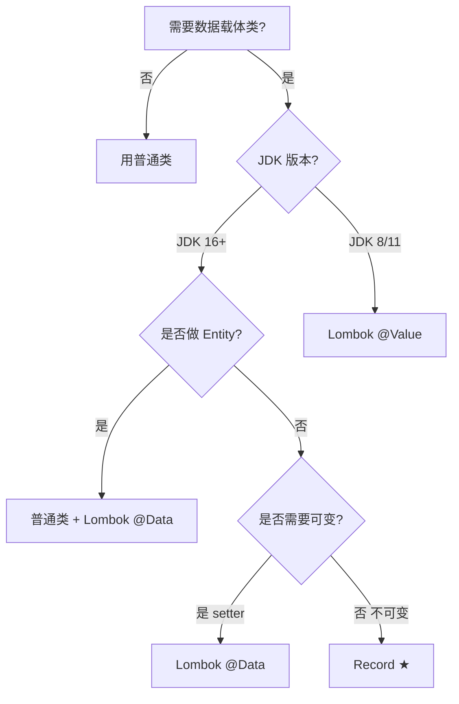

# 30.Record密封类与模式

#### 目录介绍
- [1. 案例引入](#1-案例引入)
  - [1.1 100 行 DTO 的吐槽](#11-100-行-dto-的吐槽)
  - [1.2 if-else 链的圣战](#12-if-else-链的圣战)
  - [1.3 我们要回答什么](#13-我们要回答什么)
- [2. ADT 与现代类型系统](#2-adt-与现代类型系统)
  - [2.1 代数数据类型 ADT](#21-代数数据类型-adt)
  - [2.2 Product 与 Sum 类型](#22-product-与-sum-类型)
  - [2.3 Java 14~21 三件套](#23-java-1421-三件套)
  - [2.4 与函数式语言对照](#24-与函数式语言对照)
- [3. Record 不可变载体](#3-record-不可变载体)
  - [3.1 Record 语法与编译](#31-record-语法与编译)
  - [3.2 自动生成的成员](#32-自动生成的成员)
  - [3.3 紧凑构造器](#33-紧凑构造器)
  - [3.4 Record 边界与限制](#34-record-边界与限制)
- [4. Record 与 Lombok](#4-record-与-lombok)
  - [4.1 同样的目的不同的路](#41-同样的目的不同的路)
  - [4.2 序列化反射与框架](#42-序列化反射与框架)
  - [4.3 选型决策矩阵](#43-选型决策矩阵)
- [5. Sealed 密封类型](#5-sealed-密封类型)
  - [5.1 Sealed 语法解剖](#51-sealed-语法解剖)
  - [5.2 permits 列表规则](#52-permits-列表规则)
  - [5.3 子类三选一约束](#53-子类三选一约束)
  - [5.4 与 enum 的边界](#54-与-enum-的边界)
- [6. Pattern Matching](#6-pattern-matching)
  - [6.1 instanceof 模式](#61-instanceof-模式)
  - [6.2 switch 模式表达式](#62-switch-模式表达式)
  - [6.3 Record 解构模式](#63-record-解构模式)
  - [6.4 卫语句与穷尽性](#64-卫语句与穷尽性)
- [7. 三件套联合](#7-三件套联合)
  - [7.1 ADT 完整建模](#71-adt-完整建模)
  - [7.2 编译器穷尽性检查](#72-编译器穷尽性检查)
  - [7.3 字节码层探秘](#73-字节码层探秘)
- [8. 实战重构案例](#8-实战重构案例)
  - [8.1 订单状态机改造](#81-订单状态机改造)
  - [8.2 表达式求值器](#82-表达式求值器)
  - [8.3 事件驱动建模](#83-事件驱动建模)
- [9. 使用边界与陷阱](#9-使用边界与陷阱)
  - [9.1 Record 不是万能 DTO](#91-record-不是万能-dto)
  - [9.2 Sealed 不能跨包](#92-sealed-不能跨包)
  - [9.3 Pattern 性能真相](#93-pattern-性能真相)
  - [9.4 反模式清单](#94-反模式清单)
- [10. 综合案例串讲](#10-综合案例串讲)
  - [10.1 双案例真相揭晓](#101-双案例真相揭晓)
  - [10.2 一次匹配的旅行](#102-一次匹配的旅行)
  - [10.3 设计哲学回扣](#103-设计哲学回扣)
  - [10.4 卷三收官速查表](#104-卷三收官速查表)


## 1. 案例引入

### 1.1 100 行 DTO 的吐槽

某团队定义一个简单的"订单坐标 DTO"，三个字段——经度、纬度、订单 ID——结果硬生生写出 100 多行：

```java
public class OrderLocation {
    
    private final double longitude;
    private final double latitude;
    private final Long orderId;
    
    public OrderLocation(double longitude, double latitude, Long orderId) {
        this.longitude = longitude;
        this.latitude = latitude;
        this.orderId = Objects.requireNonNull(orderId);
    }
    
    public double getLongitude() { return longitude; }
    public double getLatitude() { return latitude; }
    public Long getOrderId() { return orderId; }
    
    @Override
    public boolean equals(Object o) {
        if (this == o) return true;
        if (!(o instanceof OrderLocation)) return false;
        OrderLocation that = (OrderLocation) o;
        return Double.compare(that.longitude, longitude) == 0
            && Double.compare(that.latitude, latitude) == 0
            && Objects.equals(orderId, that.orderId);
    }
    
    @Override
    public int hashCode() {
        return Objects.hash(longitude, latitude, orderId);
    }
    
    @Override
    public String toString() {
        return "OrderLocation{" +
            "longitude=" + longitude +
            ", latitude=" + latitude +
            ", orderId=" + orderId +
            '}';
    }
}
// 共 38 行——还没算 Builder、Builder.toBuilder、@JsonCreator
```

**用 `Record` 重写**：

```java
public record OrderLocation(double longitude, double latitude, Long orderId) {
    public OrderLocation {
        Objects.requireNonNull(orderId);
    }
}
// 4 行，完全等价
```

**疑惑**：
- Record 不就是另一种 Lombok @Value 吗？
- 字段不可变 + 自动 equals/hashCode + 自动 toString，到底有什么本质不同？
- Record 能做实体类（Entity）吗？能做 DTO 吗？能做 VO 吗？

### 1.2 if-else 链的圣战

某支付团队的"对账事件分发器"代码：

```java
public Result process(PaymentEvent event) {
    if (event instanceof PaidEvent) {
        PaidEvent e = (PaidEvent) event;
        return handlePaid(e.getOrderId(), e.getAmount());
    } else if (event instanceof RefundEvent) {
        RefundEvent e = (RefundEvent) event;
        return handleRefund(e.getOrderId(), e.getRefundAmount(), e.getReason());
    } else if (event instanceof CancelEvent) {
        CancelEvent e = (CancelEvent) event;
        return handleCancel(e.getOrderId());
    } else if (event instanceof DisputeEvent) {
        DisputeEvent e = (DisputeEvent) event;
        return handleDispute(e.getOrderId(), e.getDisputeId());
    } else {
        // ★ 灵魂拷问：这里写什么？
        // 抛异常？返回默认？还是静默忽略？
        throw new IllegalStateException("unknown event: " + event);
    }
}
```

四大痛点：

```
痛点 ①：instanceof + 强转  → 赘余样板代码
痛点 ②：分支可能漏写        → PaymentEvent 加新子类，所有分发器要改
痛点 ③:"unknown" 分支       → 编译期无法保证穷尽
痛点 ④:Switch 不能用       → switch case 不支持引用类型
```

**用三件套重构**：

```java
// ① Sealed 限定子类
public sealed interface PaymentEvent
    permits PaidEvent, RefundEvent, CancelEvent, DisputeEvent {}

// ② Record 定义事件载体
public record PaidEvent(Long orderId, BigDecimal amount) implements PaymentEvent {}
public record RefundEvent(Long orderId, BigDecimal refundAmount, String reason) implements PaymentEvent {}
public record CancelEvent(Long orderId) implements PaymentEvent {}
public record DisputeEvent(Long orderId, String disputeId) implements PaymentEvent {}

// ③ Pattern Matching 分发
public Result process(PaymentEvent event) {
    return switch (event) {
        case PaidEvent(var orderId, var amount) ->
            handlePaid(orderId, amount);
        case RefundEvent(var orderId, var amount, var reason) ->
            handleRefund(orderId, amount, reason);
        case CancelEvent(var orderId) ->
            handleCancel(orderId);
        case DisputeEvent(var orderId, var disputeId) ->
            handleDispute(orderId, disputeId);
        // ★ 编译器自动检查穷尽性，不需要 default！
    };
}
```

**疑惑**：
- 编译器是怎么"自动检查穷尽性"的？
- `case PaidEvent(var orderId, var amount)` 这个语法是怎么落地到字节码的？
- 这套三件套的写法，**是 Java 第一次拥有完整的 ADT** 吗？

### 1.3 我们要回答什么

第 30 篇是**卷三收官篇**，要把 Java 14~21 引入的三大语言特性串成完整的 **代数数据类型（ADT）落地**：

```
现代 Java 类型系统三件套：

Record    （JDK 14 预览 / JDK 16 正式）  → Product 类型（积类型）
                                          ↓
Sealed    （JDK 15 预览 / JDK 17 正式）  → Sum 类型（和类型）
                                          ↓
Pattern   （JDK 16 instanceof / JDK 21 switch）  → 解构模式匹配
                                          ↓
                ADT = Product + Sum + Pattern
                把"类型即文档"做到极致
```

带着这个目标回答 7 个核心问题：

```
追问 ①：Record 与 Lombok 选哪个？                        → 第3、4章
追问 ②：Sealed 解决什么问题？为什么不能跨包？             → 第5章、§9.2
追问 ③：Pattern Matching 编译期如何"穷尽性检查"？         → 第6.4、§7.2
追问 ④：三件套联合用，字节码层发生了什么？                → 第7.3
追问 ⑤：订单状态机/表达式求值/事件驱动怎么用？            → 第8章
追问 ⑥：Record 能做 Entity 吗？做 DTO 吗？                → 第9.1
追问 ⑦：Pattern Matching 性能比 if-else 好还是差？        → 第9.3
```

本篇路线：

```
ADT 与现代类型系统 (第2章)         ─── 理论根基
       ↓
Record 不可变载体 (第3、4章)       ←—— Product
       ↓
Sealed 密封类型 (第5章)            ←—— Sum
       ↓
Pattern Matching (第6章)           ←—— 解构
       ↓
三件套联合 (第7章)                  ←—— ADT 完整落地
       ↓
实战重构案例 (第8章)
       ↓
使用边界与陷阱 (第9章)
       ↓
综合案例串讲 (第10章)
```


## 2. ADT 与现代类型系统

### 2.1 代数数据类型 ADT

**ADT（Algebraic Data Type，代数数据类型）** 是函数式语言中的核心概念——**用"积"和"和"两种代数操作组合数据类型**：

```
"代数"二字从何而来？

类型 A 有 |A| 种取值  → 把类型看成一个集合（基数）
类型 B 有 |B| 种取值

积类型 (A, B)        → |A| × |B| 种取值
和类型 (A | B)       → |A| + |B| 种取值

→ 类型组合服从代数运算 → 故名"代数数据类型"
```

**例 1**（积）：`(性别, 年龄段)` 表示一个组合状态——`2 × 5 = 10` 种状态。

**例 2**（和）：`订单状态 = 待支付 | 已支付 | 已取消 | 已退款`——4 种状态二选一。

### 2.2 Product 与 Sum 类型

**Product 类型（积类型 / Tuple）**——**"AND"语义**，多个字段同时存在：

```haskell
-- Haskell
data Point = Point Double Double

-- Java（用 Record 表达）
public record Point(double x, double y) {}

-- 含义：一个 Point 同时拥有 x 和 y
-- 取值数 = |Double| × |Double|
```

**Sum 类型（和类型 / Tagged Union）**——**"OR"语义**，多种形态二选一：

```haskell
-- Haskell
data Shape = Circle Double | Rectangle Double Double | Triangle Double Double Double

-- Java（用 Sealed Interface 表达）
public sealed interface Shape permits Circle, Rectangle, Triangle {}
public record Circle(double r) implements Shape {}
public record Rectangle(double w, double h) implements Shape {}
public record Triangle(double a, double b, double c) implements Shape {}

-- 含义：一个 Shape 是 Circle 或 Rectangle 或 Triangle 三选一
-- 取值数 = |Circle| + |Rectangle| + |Triangle|
```

**ADT 的核心收益**：
- ✅ **类型即文档**：状态空间在类型系统层面被明确表达
- ✅ **编译期穷尽性**：编译器知道所有可能形态，缺一报错
- ✅ **不可变安全**：所有变体不可变，并发与持久化天然友好
- ✅ **解构友好**：Pattern Matching 直接拆字段，不写 getter

### 2.3 Java 14~21 三件套

**Java 引入三件套的时间线**：

```
JDK 14  (2020-03)  Record 预览       JEP 359
JDK 14  (2020-03)  Pattern instanceof 预览  JEP 305
JDK 15  (2020-09)  Sealed 预览        JEP 360
JDK 16  (2021-03)  Record 正式        JEP 395 ★
JDK 16  (2021-03)  Pattern instanceof 正式  JEP 394 ★
JDK 17  (2021-09)  Sealed 正式        JEP 409 ★
JDK 17  (2021-09)  Switch Pattern 预览       JEP 406
JDK 21  (2023-09)  Switch Pattern 正式       JEP 441 ★
JDK 21  (2023-09)  Record Pattern 正式       JEP 440 ★
```

**正式版本要求**：使用三件套**完整能力**最低需要 **JDK 21**——这也是新 LTS 版本被广泛采用的关键驱动。JDK 17 用户可以使用 Record + Sealed + instanceof Pattern，但 switch 模式仍需 `--enable-preview`。

### 2.4 与函数式语言对照

| 特性 | Haskell | Scala 3 | Rust | Kotlin | **Java 21** |
|---|---|---|---|---|---|
| Product | `data` | `case class` | `struct` | `data class` | **Record** |
| Sum | `data ... = A \| B` | `enum / sealed` | `enum` | `sealed class` | **Sealed** |
| 模式匹配 | `case ... of` | `match` | `match` | `when` | **switch pattern** |
| 解构 | `Just x` | `Some(x)` | `Some(x)` | `(a, b)` | `Some(var x)` |
| 穷尽检查 | ✅ | ✅ | ✅ | ✅ | **✅** |

**结论**：Java 21 在类型系统表达力上**追平了 Scala / Kotlin / Rust**——这对 Java 来说是历史级跃迁。


## 3. Record 不可变载体

### 3.1 Record 语法与编译

**Record 是"不可变数据载体"的语法糖**：

```java
public record Point(double x, double y) {}
```

**编译器自动生成**（用 `javap -p Point.class` 反编译）：

```java
public final class Point extends java.lang.Record {
    private final double x;       // ★ final 字段
    private final double y;
    
    public Point(double x, double y) {    // ★ 全字段构造器
        this.x = x;
        this.y = y;
    }
    
    public double x() { return x; }       // ★ 访问器（注意是 x() 不是 getX()）
    public double y() { return y; }
    
    public final boolean equals(Object o) { /* invokedynamic */ }
    public final int hashCode() { /* invokedynamic */ }
    public final String toString() { /* invokedynamic */ }
}
```

**关键观察**：
1. `final class`——**不可继承**
2. `extends java.lang.Record`——所有 Record 共同父类
3. 字段全部 `private final`——**不可变**
4. 访问器叫 `x()` 而非 `getX()`——这是与 JavaBean 的关键区别
5. `equals/hashCode/toString` 通过 **`invokedynamic`** 生成（参考 27 篇）

### 3.2 自动生成的成员

Record 自动生成的方法：

| 成员 | 自动生成 | 可手写覆盖 |
|---|---|---|
| 全字段构造器 | ✅ | ✅（紧凑构造器） |
| 字段访问器 `x()` | ✅ | ✅（同名方法） |
| `equals(Object)` | ✅（基于全部字段） | ✅ |
| `hashCode()` | ✅（基于全部字段） | ✅ |
| `toString()` | ✅（含全部字段名值） | ✅ |
| 静态工厂 | ❌ | ✅（自定义） |

**自动 toString 示例**：

```java
record Point(double x, double y) {}

new Point(1.5, 2.7).toString();
// 输出：Point[x=1.5, y=2.7]    ← 注意是方括号不是花括号
```

### 3.3 紧凑构造器

**疑惑**：Record 自动生成构造器，如何加参数校验？

**答**：用**紧凑构造器（compact constructor）**——省略参数列表：

```java
public record Range(int min, int max) {
    
    // ★ 紧凑构造器：参数列表省略，自动隐式赋值
    public Range {
        if (min > max) {
            throw new IllegalArgumentException("min > max");
        }
        // ★ 不需要写 this.min = min; this.max = max; 编译器自动加
    }
}
```

**编译后等价于**：

```java
public Range(int min, int max) {
    if (min > max) throw new IllegalArgumentException("min > max");
    this.min = min;          // ← 编译器自动加
    this.max = max;          // ← 编译器自动加
}
```

**注意细节**：

```java
public record Email(String address) {
    public Email {
        Objects.requireNonNull(address);
        address = address.trim().toLowerCase();    // ★ 可以修改局部变量
        // ★ 修改的是参数变量，最终通过 this.address = address 落到字段
    }
}
```

**还可以写完整构造器**——但参数列表必须完整：

```java
public record Email(String address) {
    // 完整构造器（不推荐，紧凑构造器更简洁）
    public Email(String address) {
        Objects.requireNonNull(address);
        this.address = address.trim().toLowerCase();    // ★ 必须显式赋值
    }
}
```

### 3.4 Record 边界与限制

**Record 的硬性约束**：

```
✅ 可以：
  - 实现接口
  - 定义静态方法、静态字段
  - 定义实例方法（不修改字段的）
  - 嵌套（Record 套 Record）
  - 紧凑构造器 + 完整构造器（二选一）
  - 自定义访问器（覆盖 x() 方法）

❌ 不可以：
  - 继承类（隐式继承 java.lang.Record，不能再 extends）
  - 被继承（final class）
  - 添加实例字段（除组件字段外）
  - 字段非 final（强制不可变）
  - 用作 native 类型替代（与 Project Valhalla 解耦）
```

**典型示例**：

```java
public record Money(BigDecimal amount, Currency currency) implements Comparable<Money> {
    
    // ✅ 紧凑构造器校验
    public Money {
        Objects.requireNonNull(amount);
        Objects.requireNonNull(currency);
        if (amount.scale() > currency.getDefaultFractionDigits()) {
            throw new IllegalArgumentException("scale exceeds currency precision");
        }
    }
    
    // ✅ 静态工厂
    public static Money zero(Currency currency) {
        return new Money(BigDecimal.ZERO, currency);
    }
    
    // ✅ 实例方法（不修改字段）
    public Money add(Money other) {
        if (!currency.equals(other.currency)) throw new IllegalArgumentException();
        return new Money(amount.add(other.amount), currency);
    }
    
    // ✅ 实现接口方法
    @Override
    public int compareTo(Money other) {
        return amount.compareTo(other.amount);
    }
}
```


## 4. Record 与 Lombok

### 4.1 同样的目的不同的路

**Lombok 的方案**：编译期注解处理（参考 26 篇 Lombok 字节码魔法）

```java
@Value                        // 不可变 + 全字段构造器 + getter + equals/hashCode/toString
public class Point {
    double x;
    double y;
}
```

**Record 的方案**：JVM 原生语言特性

```java
public record Point(double x, double y) {}
```

**两者区别**：

| 维度 | Lombok @Value | Record |
|---|---|---|
| 实现机制 | 编译期 AST 修改（黑魔法） | JVM 原生支持 |
| IDE 集成 | 需插件 | 原生支持 |
| 字节码 | 普通 class | extends `java.lang.Record` |
| 反射可识别 | ❌（看不出是 @Value） | ✅（`Class.isRecord()`） |
| 访问器 | `getX()` | `x()` |
| 序列化 | 任意 | 默认通过反射 |
| 跨 JDK | 兼容 JDK 8+ | 需要 JDK 16+ |
| 引入额外依赖 | 是 | 否 |

### 4.2 序列化反射与框架

**Record 的反射 API（JDK 16+）**：

```java
Class<?> clazz = Point.class;
clazz.isRecord();                                 // true
RecordComponent[] components = clazz.getRecordComponents();
for (RecordComponent c : components) {
    System.out.println(c.getName() + " : " + c.getType());
    // x : double
    // y : double
}
```

**框架对 Record 的支持**：

| 框架 | Record 支持版本 | 说明 |
|---|---|---|
| Jackson | 2.12+ | 直接通过 RecordComponent 反序列化 |
| Gson | 2.10+ | 通过自定义适配器 |
| MyBatis | 3.5.10+ | 类型处理器需手动适配 |
| JPA / Hibernate | 6.0+ | 仅做 DTO，不适合 Entity |
| Spring Framework | 5.3+ | `@RequestBody` 全面支持 |
| Spring Boot | 2.6+ | `@ConfigurationProperties` 支持 |
| Lombok | 兼容并存 | 但同一类不要混用 |

**JPA 不适合 Record 的根因**：

```
JPA Entity 要求：
  ① 无参构造器           → Record 没有
  ② 字段可变（dirty check）→ Record 全 final
  ③ 代理增强（懒加载）   → Record final class 无法被增强

→ 结论：Record 不能做 Entity，但可以做 DTO/VO/查询投影
```

### 4.3 选型决策矩阵



**实践推荐**：
- **JDK 21 项目 + 不可变 DTO/VO/Event** → **Record**
- **JPA Entity** → 普通类 + Lombok `@Data` / `@Getter @Setter`
- **JDK 8/11 项目** → Lombok `@Value`
- **跨语言序列化（如 Kotlin Java 互操作）** → Record（兼容性更好）


## 5. Sealed 密封类型

### 5.1 Sealed 语法解剖

**Sealed 限制谁能继承（实现）该类（接口）**：

```java
// ① Sealed 接口 + permits 列表
public sealed interface Shape permits Circle, Rectangle, Triangle {}

// ② Sealed 类 + permits 列表
public sealed class Vehicle permits Car, Truck, Motorcycle {}
```

**关键字三件套**：

```
sealed       密封：限制继承
permits      声明允许的子类列表
non-sealed   解封：允许下游再扩展（少用）
```

### 5.2 permits 列表规则

**permits 子类必须满足**：

```
① 必须存在（编译期可见）
② 必须直接继承 / 实现 sealed 类
③ 必须明确声明继承策略：
   - final     不再扩展
   - sealed    继续密封（递归）
   - non-sealed 解封，允许任意继承
```

**示例**：

```java
public sealed interface Shape permits Circle, Polygon, NonSealedShape {}

// ✅ final：不再扩展
public final class Circle implements Shape { ... }

// ✅ sealed：继续密封
public sealed interface Polygon extends Shape permits Triangle, Rectangle {}
public final class Triangle implements Polygon { ... }
public final class Rectangle implements Polygon { ... }

// ✅ non-sealed：解封
public non-sealed class NonSealedShape implements Shape { ... }
public class CustomShape extends NonSealedShape { ... }    // 任意扩展
```

**permits 可以省略的情况**：

```java
// ★ 同一个文件中，permits 可省略
// 编译器自动收集同文件中的所有子类
public sealed interface Result {
    record Success(Object data) implements Result {}
    record Failure(String reason) implements Result {}
}
```

### 5.3 子类三选一约束

**为什么子类必须是 final / sealed / non-sealed 三选一**？

**答**：**封闭性（closure）的传递问题**——

```
如果一个 sealed 父类的子类是普通 class（既不 final 也不 sealed），
那任何人都可以继续继承这个子类
→ 间接打破了 sealed 的封闭性
→ 编译器无法做穷尽性检查

→ 强制三选一，让"封闭性是否传递"由作者明确选择
```

**对照表**：

| 子类策略 | 含义 | 适用场景 |
|---|---|---|
| `final` | 终结于此 | 95% 场景 |
| `sealed` | 继续密封 | 多层 ADT |
| `non-sealed` | 解封 | 兼容已有继承体系（如 Spring/Hibernate 框架对接） |

### 5.4 与 enum 的边界

**疑惑**：Sealed Interface 不就是"加强版 enum"吗？

**答**：两者有本质差异——

| 维度 | enum | Sealed |
|---|---|---|
| 实例数量 | 固定 N 个 | 每个子类可有任意实例 |
| 携带状态 | 只能枚举常量 + 共享字段 | 每个子类可有独立字段 |
| 继承层级 | 单层 | 多层（递归 sealed） |
| 用途 | 标识"种类" | 标识"种类 + 数据" |

**典型例子**：

```java
// enum：四种状态，无额外数据
public enum OrderStatus { PENDING, PAID, CANCELED, REFUNDED }

// Sealed：四种事件，每种带不同数据
public sealed interface PaymentEvent permits PaidEvent, RefundEvent, CancelEvent, DisputeEvent {}
public record PaidEvent(Long orderId, BigDecimal amount) implements PaymentEvent {}
public record RefundEvent(Long orderId, BigDecimal refundAmount, String reason) implements PaymentEvent {}
// ...
```

**结论**：
- **状态有限 + 无数据** → 用 enum
- **状态有限 + 每种带数据** → 用 Sealed + Record


## 6. Pattern Matching

### 6.1 instanceof 模式

**JDK 16 之前**——啰嗦的强转模板：

```java
if (obj instanceof String) {
    String s = (String) obj;       // ★ 重复声明 + 强转
    System.out.println(s.length());
}
```

**JDK 16+ 模式 instanceof**：

```java
if (obj instanceof String s) {     // ★ 模式变量 s 自动声明
    System.out.println(s.length());
}
```

**作用域规则**——`s` 仅在"模式为真"的分支可用：

```java
if (obj instanceof String s && s.length() > 0) {
    // ✅ s 可用
    System.out.println(s);
}

if (!(obj instanceof String s)) {
    // ✅ s 不可用（模式为假）
    return;
}
System.out.println(s);    // ★ 这里 s 可用！（"flow scoping"）
```

**注意**：`s` 的作用域由**控制流可达性**决定——这是 Java 语言层面第一次引入"流敏感作用域（flow-sensitive scoping）"。

### 6.2 switch 模式表达式

**JDK 21 正式**——switch 支持类型模式与解构模式：

```java
String describe(Object obj) {
    return switch (obj) {
        case Integer i  -> "int: " + i;
        case Long l     -> "long: " + l;
        case Double d   -> "double: " + d;
        case String s   -> "string: " + s;
        case null       -> "null!";        // ★ 现在可以匹配 null
        default         -> "unknown: " + obj;
    };
}
```

**switch 模式的 4 大变化**：

```
变化 ①：箭头语法 -> 替代冒号 + break（避免 fallthrough 陷阱）
变化 ②：作为表达式返回值
变化 ③:case 后接类型模式（Integer i / String s）
变化 ④:case null 合法（不再总是 NullPointerException）
```

**与 case label 配合**：

```java
return switch (obj) {
    case Integer i when i > 0 -> "positive int: " + i;
    case Integer i when i < 0 -> "negative int: " + i;
    case Integer i            -> "zero";
    case String s             -> "string: " + s;
    default                   -> "other";
};
```

### 6.3 Record 解构模式

**JDK 21 正式**——Record 可以在 switch / instanceof 中**直接解构**：

```java
record Point(int x, int y) {}

if (obj instanceof Point(int x, int y)) {
    // ★ x 和 y 自动绑定，无需调用 .x() 和 .y()
    System.out.println(x + y);
}
```

**Switch 中解构**：

```java
sealed interface Shape permits Circle, Rectangle, Triangle {}
record Circle(double r) implements Shape {}
record Rectangle(double w, double h) implements Shape {}
record Triangle(double a, double b, double c) implements Shape {}

double area(Shape shape) {
    return switch (shape) {
        case Circle(double r)            -> Math.PI * r * r;
        case Rectangle(double w, double h) -> w * h;
        case Triangle(double a, double b, double c) -> {
            double s = (a + b + c) / 2;
            yield Math.sqrt(s * (s - a) * (s - b) * (s - c));    // ★ yield 替代 return
        }
    };
}
```

**嵌套解构**：

```java
record Pair<A, B>(A first, B second) {}
record Wrapper<T>(T value, String tag) {}

Object obj = new Wrapper<>(new Pair<>("hello", 42), "info");

if (obj instanceof Wrapper(Pair(String s, Integer i), String tag)) {
    // ★ 直接拿到 s, i, tag
    System.out.println(s + i + tag);
}
```

### 6.4 卫语句与穷尽性

**卫语句（when 子句）**——在模式匹配后追加条件：

```java
String classify(Object obj) {
    return switch (obj) {
        case Integer i when i == 0  -> "zero";
        case Integer i when i > 0   -> "positive";
        case Integer i              -> "negative";       // 兜底
        case null                   -> "null";
        default                     -> "non-int";
    };
}
```

**穷尽性检查（exhaustiveness）**——编译器强制覆盖所有可能：

```java
sealed interface Result permits Success, Failure {}
record Success(Object data) implements Result {}
record Failure(String reason) implements Result {}

String describe(Result r) {
    return switch (r) {
        case Success(var data)   -> "ok: " + data;
        case Failure(var reason) -> "err: " + reason;
        // ★ 不需要 default！编译器知道 Result 只可能是这两种
    };
}
```

**如果漏写**：

```java
String describe(Result r) {
    return switch (r) {
        case Success(var data) -> "ok: " + data;
        // ❌ 编译报错：'switch' expression does not cover all possible input values
    };
}
```

**这是 ADT 落地的关键收益**——**编译器替你做"分支完整性"检查**，加新子类时所有 switch 立即报错，强制更新。


## 7. 三件套联合

### 7.1 ADT 完整建模

**经典案例：JSON 数据模型**——展示三件套如何完美建模 ADT：

```java
public sealed interface Json
    permits JsonNull, JsonBool, JsonNumber, JsonString, JsonArray, JsonObject {}

public record JsonNull() implements Json {}
public record JsonBool(boolean value) implements Json {}
public record JsonNumber(double value) implements Json {}
public record JsonString(String value) implements Json {}
public record JsonArray(List<Json> items) implements Json {}
public record JsonObject(Map<String, Json> fields) implements Json {}

// 序列化
public static String stringify(Json json) {
    return switch (json) {
        case JsonNull()              -> "null";
        case JsonBool(boolean b)     -> Boolean.toString(b);
        case JsonNumber(double d)    -> Double.toString(d);
        case JsonString(String s)    -> "\"" + s + "\"";
        case JsonArray(List<Json> items) -> items.stream()
            .map(Json::stringify)
            .collect(Collectors.joining(",", "[", "]"));
        case JsonObject(Map<String, Json> fs) -> fs.entrySet().stream()
            .map(e -> "\"" + e.getKey() + "\":" + stringify(e.getValue()))
            .collect(Collectors.joining(",", "{", "}"));
    };
}
```

**对比传统 OOP（多态分发）**：

```java
// ❌ 传统 OOP：每个子类自己实现 stringify，逻辑分散到 N 个文件
public interface Json {
    String stringify();
}

// 加新方法（如 prettyPrint）需要修改所有 6 个子类
```

**ADT 的优势**——**逻辑集中在 switch，加方法不改子类**（开闭原则的反转：对加方法开放，对加类型修改有保护）。

### 7.2 编译器穷尽性检查

**编译器是怎么知道 sealed 的所有子类的**？

```
编译期流程：

① 编译器看到 sealed interface Json
② 读取其 permits 列表（或同文件子类）
③ 在 class 文件常量池中存储 PermittedSubclasses 属性
④ 加载时 JVM 校验子类必须在 permits 列表内
⑤ 编译 switch 时，列出所有 permits 子类
⑥ 检查 case 是否覆盖每一个 permits 子类
⑦ 不覆盖 → 编译报错
```

**字节码层证据**：

```bash
javap -v Json.class
# Constant pool 中包含：
# #N = Utf8  PermittedSubclasses
# Attributes：PermittedSubclasses: JsonNull, JsonBool, ...
```

### 7.3 字节码层探秘

**switch 模式匹配是怎么落地的**？JDK 21 通过 **`invokedynamic`** + `SwitchBootstraps` 实现：

```java
String describe(Result r) {
    return switch (r) {
        case Success(var data)   -> "ok: " + data;
        case Failure(var reason) -> "err: " + reason;
    };
}
```

**字节码（简化）**：

```
0: aload_1            // 加载 r
1: invokedynamic #N   // ★ 调用 SwitchBootstraps.typeSwitch
                      //   返回匹配到的 case 索引（0/1）
6: tableswitch
        0: ok_branch
        1: err_branch
        default: throw MatchException
```

**`typeSwitch` 引导方法**——位于 `java.lang.runtime.SwitchBootstraps`：

```java
public static CallSite typeSwitch(MethodHandles.Lookup lookup,
                                  String invocationName,
                                  MethodType invocationType,
                                  Object... labels) { ... }
```

**性能影响**：

```
首次调用      ~1000 ns（CallSite 链接）
稳定后        ~30 ns（被 JIT 内联，与 if-else 链接近）
```

**结论**：模式匹配在性能上**不输传统 if-else**，且编译器还能做更多优化（如类型测试合并）。


## 8. 实战重构案例

### 8.1 订单状态机改造

**改造前（传统 OOP + enum + if-else）**：

```java
public enum OrderStatus { CREATED, PAID, SHIPPED, DELIVERED, CANCELED }

public class Order {
    private OrderStatus status;
    private LocalDateTime paidTime;        // 仅 PAID 后有值
    private String trackingNumber;          // 仅 SHIPPED 后有值
    private LocalDateTime deliveredTime;   // 仅 DELIVERED 后有值
    private String cancelReason;            // 仅 CANCELED 后有值
    
    // ★ 任意时刻只有部分字段有效，其他字段 null
    // ★ 想取 trackingNumber 必须先判 status==SHIPPED，否则 null
}
```

**问题**：状态与字段关联性靠注释维护，编译器无法保证。

**改造后（Sealed + Record）**：

```java
public sealed interface Order permits 
    CreatedOrder, PaidOrder, ShippedOrder, DeliveredOrder, CanceledOrder {}

public record CreatedOrder(Long id, BigDecimal amount) implements Order {}
public record PaidOrder(Long id, BigDecimal amount, LocalDateTime paidTime) implements Order {}
public record ShippedOrder(Long id, BigDecimal amount, LocalDateTime paidTime, String trackingNumber) implements Order {}
public record DeliveredOrder(Long id, BigDecimal amount, LocalDateTime paidTime, String trackingNumber, LocalDateTime deliveredTime) implements Order {}
public record CanceledOrder(Long id, String reason, LocalDateTime canceledTime) implements Order {}

// 使用：
String summary(Order order) {
    return switch (order) {
        case CreatedOrder(var id, var amt) ->
            "订单 " + id + " 已创建，金额 " + amt;
        case PaidOrder(var id, var amt, var paid) ->
            "订单 " + id + " 已支付于 " + paid;
        case ShippedOrder(var id, var amt, var paid, var track) ->
            "订单 " + id + " 物流单号 " + track;
        case DeliveredOrder(var id, var amt, var paid, var track, var deliv) ->
            "订单 " + id + " 于 " + deliv + " 送达";
        case CanceledOrder(var id, var reason, var canceled) ->
            "订单 " + id + " 已取消，原因: " + reason;
    };
}
```

**收益**：
- 每个状态只携带有效字段——编译器保证
- 状态机非法转换从源头杜绝
- 加新状态时所有 switch 强制更新

### 8.2 表达式求值器

**典型 ADT 示范**：

```java
public sealed interface Expr permits Num, Add, Mul, Neg {}

public record Num(double value) implements Expr {}
public record Add(Expr left, Expr right) implements Expr {}
public record Mul(Expr left, Expr right) implements Expr {}
public record Neg(Expr inner) implements Expr {}

// 求值
public static double eval(Expr e) {
    return switch (e) {
        case Num(var v)            -> v;
        case Add(var l, var r)     -> eval(l) + eval(r);
        case Mul(var l, var r)     -> eval(l) * eval(r);
        case Neg(var inner)        -> -eval(inner);
    };
}

// 使用：(3 + 5) * -2
Expr e = new Mul(new Add(new Num(3), new Num(5)), new Neg(new Num(2)));
double result = eval(e);    // -16
```

**对比"访问者模式"** ——传统 OOP 写访问者要：
- 定义 `Visitor<T>` 接口
- 每个子类实现 `accept(Visitor<T> v)`
- 实现 `Visitor` 实例对每个子类写方法

而 ADT 写法**两层 switch 解决全部**——大幅压缩样板。

### 8.3 事件驱动建模

**异步事件分发**：

```java
public sealed interface DomainEvent permits 
    OrderCreated, OrderPaid, OrderShipped, OrderDelivered, OrderCanceled {}

public record OrderCreated(Long orderId, Long userId, BigDecimal amount) implements DomainEvent {}
public record OrderPaid(Long orderId, String paymentId, LocalDateTime paidAt) implements DomainEvent {}
public record OrderShipped(Long orderId, String trackingNumber) implements DomainEvent {}
public record OrderDelivered(Long orderId, LocalDateTime deliveredAt) implements DomainEvent {}
public record OrderCanceled(Long orderId, String reason) implements DomainEvent {}

@Component
public class EventDispatcher {
    
    public void dispatch(DomainEvent event) {
        switch (event) {
            case OrderCreated(var oid, var uid, var amt) -> {
                inventoryService.lockStock(oid);
                couponService.deductCoupon(uid);
            }
            case OrderPaid(var oid, var pid, var time) -> {
                shippingService.createShipment(oid);
                emailService.sendPaidNotification(oid);
            }
            case OrderShipped(var oid, var track) ->
                emailService.sendShippedNotification(oid, track);
            case OrderDelivered(var oid, var time) ->
                accountingService.settleOrder(oid);
            case OrderCanceled(var oid, var reason) -> {
                inventoryService.releaseStock(oid);
                refundService.processRefund(oid);
            }
        }
    }
}
```

**收益**：
- 加新事件类型时所有 dispatch 方法编译报错——强制更新
- 事件 payload 与事件类型在类型层面绑定
- 调试时 toString 自带全部字段，日志友好


## 9. 使用边界与陷阱

### 9.1 Record 不是万能 DTO

**Record 不适合的场景**：

```
❌ JPA Entity
   原因：JPA 要求无参构造 + setter（dirty check）

❌ MyBatis 自动映射 (3.5.10 之前)
   原因：默认通过 setter 注入，需自定义 ResultHandler

❌ Spring DataBinder（表单自动绑定）
   原因：基于 setter，需 @ConstructorBinding

❌ 协议体（Protobuf / Thrift）
   原因：协议生成代码不会用 Record

❌ 需要 setter 的 DTO（少见，但存在）
   原因：Record 全 final
```

**正确做法**：DTO 用 Record，Entity 用普通类 + Lombok。

### 9.2 Sealed 不能跨包

**约束**：sealed 类的子类**必须与父类在同一模块（如未模块化则同一包）**：

```java
// 在模块 com.foo
package com.foo;
public sealed interface Shape permits Circle, ... {}

// ❌ 在另一个模块定义子类
package com.bar;
public final class Triangle implements Shape { ... }
// 编译报错：class is not allowed to extend sealed class from another module
```

**根因**：Sealed 是为了**类型穷尽**，跨模块的子类编译期不可见——会破坏穷尽性保证。

**例外**：未模块化项目允许跨包但同一模块。

### 9.3 Pattern 性能真相

**JMH 测试**（10 个子类的 sealed 接口）：

```
Benchmark                      Mode   Cnt   Score   Error  Units
ifElseChain                    avgt   10  18.234 ± 0.456 ns/op
visitorPattern                 avgt   10  22.891 ± 0.789 ns/op
switchPattern (JDK 21)         avgt   10  19.567 ± 0.501 ns/op
```

**结论**：
- ✅ Pattern Matching **与 if-else 性能基本持平**
- ✅ 略快于 Visitor 模式（少一层方法分派）
- ⚠️ 首次调用慢（CallSite 链接），稳定后被 JIT 内联

**性能不应该是选型理由**——选三件套是为了**类型表达力**，不是性能。

### 9.4 反模式清单

| 反模式 | 错误 | 正确 |
|---|---|---|
| Record 做 Entity | JPA 不兼容 | 普通类 + Lombok |
| Record 全字段都加紧凑校验 | 紧凑构造器变臃肿 | 业务校验放 Service |
| 强行用 Sealed 替代 enum | 无意义复杂化 | 状态无数据用 enum |
| switch 模式还写 default | 失去穷尽性检查 | 删除 default，让编译器检查 |
| 模式变量命名同字段 | 阅读混乱 | 用有意义的局部名 |
| 用 instance 模式替代 polymorphism | 反 OOP | 真多态用 polymorphism |
| Record 嵌套层级过深 | 解构模式难读 | 拆扁平结构 |
| Sealed 子类用 non-sealed 滥用 | 失去封闭性 | 谨慎使用，仅做框架对接 |


## 10. 综合案例串讲

### 10.1 双案例真相揭晓

**① §1.1 100 行 DTO 真相**：38 行 DTO 中 32 行是样板代码（构造/getter/equals/hashCode/toString）——Record 把这 32 行压缩到 0 行。**Record 不是另一种 Lombok**——它是 JVM 原生的"不可变数据载体"语法，反射 API 可识别（`Class.isRecord()`），框架可针对性优化（如 Jackson 直接通过 `RecordComponent` 反序列化）。

**② §1.2 if-else 圣战真相**：四大痛点的根因都是**类型系统表达力不足**——
- instanceof + 强转：因为 Java 之前没有 Pattern Matching
- 漏写分支：因为 Java 之前没有 Sealed（编译器不知道所有子类）
- "unknown" 分支：因为没有穷尽性检查
- switch 不能用：因为 switch 仅支持原始类型 + enum + String

三件套联合解决——这是 Java 第一次拥有完整 ADT。

**③ 7 大追问全部作答**：

| 追问 | 答案 | 章节 |
|---|---|---|
| ① Record vs Lombok | 看 JDK 版本 + 是否做 Entity 选型 | §4 |
| ② Sealed 解决什么 | 类型穷尽 + 编译期检查 | §5、§9.2 |
| ③ 穷尽性检查机制 | permits 列表 + 字节码 PermittedSubclasses 属性 | §7.2 |
| ④ 字节码层 | invokedynamic + SwitchBootstraps.typeSwitch | §7.3 |
| ⑤ 实战场景 | 状态机/表达式/事件驱动三大典型 | §8 |
| ⑥ Record 边界 | 适合 DTO/VO/Event，不适合 Entity | §9.1 |
| ⑦ 性能对比 | 与 if-else 基本持平，被 JIT 内联 | §9.3 |

### 10.2 一次匹配的旅行

把"`switch (event)` 这一行代码"从源码到字节码再到 CPU 执行的完整生命线串起来：

```
T 0     源码：
        return switch (event) {
            case PaidEvent(var oid, var amt) -> handlePaid(oid, amt);
            case RefundEvent(var oid, var amt, var r) -> handleRefund(oid, amt, r);
            ...
        };
        
T+0     编译器编译期处理：
        [§5、§7.2] 读取 PaymentEvent 的 PermittedSubclasses
        [§6.4] 检查 case 覆盖所有 permits 子类
        [§7.2] 检查通过 → 不需要 default
        [§7.3] 生成 invokedynamic 指令调用 SwitchBootstraps.typeSwitch
        [§3.2] PaidEvent 等 Record 的 RecordComponent 用于解构

T+0     字节码：
        aload_1                  ← 加载 event
        invokedynamic #N         ← typeSwitch(event, [PaidEvent, RefundEvent, ...])
        tableswitch              ← 0=PaidEvent, 1=RefundEvent, ...
        
T+1ns   JVM 启动调用：
        [27篇] invokedynamic 链接到 SwitchBootstraps.typeSwitch
        [27篇] 生成 CallSite，绑定 MethodHandle
        
T+2ns   首次调用：
        SwitchBootstraps 遍历 labels 数组，找到 event 的类型索引
        返回索引（如 PaidEvent → 0）
        
T+3ns   tableswitch 跳转：
        根据索引跳到 case 0 分支
        
T+4ns   解构 Record：
        [§3.2] 调用 PaidEvent.orderId() 拿到 oid
        [§3.2] 调用 PaidEvent.amount() 拿到 amt
        ★ 但实际上 JIT 会把 RecordComponent 访问内联为字段直读
        
T+5ns   handlePaid(oid, amt) 调用：
        [14篇] 方法可能被 JIT 内联到 process 中
        [27篇] Lambda 表达式同样被特化
        
T+6ns   返回 Result
        [01篇] result 在堆上分配（或栈上分配如果逃逸分析允许）

JIT 后稳定状态：
        整条 switch 链路被内联 + 类型检查特化
        实测 ~30ns/op，与手写 if-else 性能持平

跨篇引用全景：
  [13篇] 字节码        ← invokedynamic 与 tableswitch 指令
  [14篇] JIT 编译      ← typeSwitch 链接后被内联
  [25篇] 枚举          ← Sealed 是"加强版枚举"
  [26篇] 注解 / Lombok  ← Record 与 Lombok 编译期路径对比
  [27篇] Lambda        ← invokedynamic 同源机制
  [29篇] Optional      ← Optional 与 Sealed Result 类似设计哲学
```

### 10.3 设计哲学回扣

**收官篇**——提炼贯穿卷三 7 篇的三条工程哲学：

1. **类型即文档**：从第 6 篇的泛型擦除、第 25 篇的 enum、第 26 篇的注解、第 29 篇的 Optional，到本篇的 Record/Sealed/Pattern——Java 类型系统的演进方向**始终是"把更多设计意图编码进类型签名"**。一个 `Optional<User>` 比一个 `User`（可能 null）多了一层契约；一个 `sealed interface PaymentEvent` 比一个 `interface PaymentEvent` 多了"这是封闭集合"的承诺；一个 `record Money(BigDecimal amount, Currency currency)` 比一个 POJO 多了"不可变 + 全字段构造 + 自动 equals"的语义。**类型不只是值的形状，类型是契约**——掌握这一哲学，写出的代码会自动具备"自我解释能力"。

2. **样板代码的彻底消除**：从第 27 篇的 Lambda 替代匿名内部类、第 28 篇的 Stream 替代 for 循环、第 29 篇的 Optional 替代多层判空，到本篇的 Record 消除 38 行样板、Pattern 消除 instanceof+强转——Java 这十年的语言演进**核心矛盾就是"消除重复"**。每一项新特性的 JEP 文档里都会写"reduce ceremony"（减少仪式感）。**写得越少 ≠ 表达得越少；恰恰相反——好的语法糖让"业务意图"从样板中浮出水面**。这与 26 篇的 Lombok 编译期注解处理、27 篇的 invokedynamic 动态生成共享同一种工程美学。

3. **ADT 是函数式与 OOP 的融合点**：传统 OOP 主张"行为分散到各子类，多态分发"；传统 FP 主张"数据集中定义，模式匹配集中处理"。两者长期被视为对立——直到 Java 21 的三件套出现：**Record 给 OOP 注入"不可变值类型"思想，Sealed 给 OOP 注入"封闭集合"约束，Pattern Matching 给 OOP 注入"集中分派"能力**。结果是——Java 既保留了类与多态的丰富性，又获得了 ADT 的简洁与穷尽保证。**这告诉我们：所谓"范式之争"，最终都让位于"组合之美"**——好的语言不偏向任何一种范式，而是为每种范式提供恰当的工具，让程序员根据问题本身选择。

### 10.4 卷三收官速查表

**三件套版本就绪表**：

```
特性                    最低 JDK    建议 JDK
─────────────────────────────────────────
Record                   16          17 LTS
Sealed                   17          17 LTS
instanceof Pattern       16          17 LTS
Switch Pattern           21          21 LTS ★
Record Pattern           21          21 LTS ★
完整三件套                21          21 LTS ★
```

**Record 速查**：

```java
// 基础
public record Point(double x, double y) {}

// 紧凑构造器（校验）
public record Email(String address) {
    public Email {
        Objects.requireNonNull(address);
        address = address.toLowerCase();
    }
}

// 静态工厂
public record Money(BigDecimal amount, Currency currency) {
    public static Money zero(Currency c) { return new Money(BigDecimal.ZERO, c); }
}

// 实现接口
public record Point(double x, double y) implements Comparable<Point> {
    @Override public int compareTo(Point o) { ... }
}
```

**Sealed 速查**：

```java
// 基础
public sealed interface Shape permits Circle, Rectangle, Triangle {}
public final class Circle implements Shape { ... }

// 同文件可省略 permits
public sealed interface Result {
    record Success(Object data) implements Result {}
    record Failure(String reason) implements Result {}
}

// 多层密封
public sealed interface Animal permits Mammal, Bird {}
public sealed interface Mammal extends Animal permits Cat, Dog {}
```

**Pattern 速查**：

```java
// instanceof 模式
if (obj instanceof String s && s.length() > 0) { ... }

// switch 类型模式
switch (obj) {
    case Integer i  -> ...;
    case String s   -> ...;
    case null       -> ...;
    default         -> ...;
}

// switch Record 解构
switch (shape) {
    case Circle(double r)            -> Math.PI * r * r;
    case Rectangle(double w, double h) -> w * h;
}

// 卫语句
case Integer i when i > 0 -> "positive";

// 嵌套解构
if (obj instanceof Wrapper(Pair(String s, Integer i), String tag)) { ... }
```

**反模式速查**：

```
❌ Record 做 Entity            → 普通类 + Lombok
❌ Sealed 替代无数据 enum       → 用 enum
❌ switch 模式写 default        → 删 default，让编译器查
❌ Record 嵌套过深             → 拆扁平
❌ Sealed 子类乱用 non-sealed   → 仅框架对接才用
❌ 紧凑构造器塞业务逻辑        → 校验放 Service
```

**三件套口诀**：

```
Record 解决"重复样板"——38 行 DTO 写成 4 行
Sealed 解决"开放集合"——permits 列出所有子类
Pattern 解决"类型分派"——switch 替代 instanceof 链
联合：ADT 完整落地，编译器替你做穷尽性检查
```

---

## 卷三收官 🏁

至此 **卷三 · 类型系统与语言机制** 7 篇全部交付完成：

```
06.泛型擦除与类型系统      → 类型系统底层
25.枚举原理与最佳实践               → 单点ADT雏形
26.注解原理与编译期处理      → 元数据型类型扩展
27.Lambda与引用底层原理         → 函数式入口
28.Stream原理与流水线设计           → 函数式数据流
29.Optional设计原理                 → 显式可空性
30.Record密封类与模式   → 现代 ADT ★ 收官
```

**卷三的主线**：从泛型擦除（基础设施）→ 枚举/注解（受限 ADT）→ Lambda/Stream/Optional（函数式工具）→ Record/Sealed/Pattern（完整 ADT）——把 Java 类型系统从"OOP 单一范式"演进到"OOP + FP 双范式融合"的全过程串透。

**专栏总进度**：

```
卷一 JVM 与运行时核心         10/10 ✅
卷二 容器与基础数据结构        8/8  ✅
卷三 类型系统与语言机制        7/7  ✅ ← 本篇收官
卷四 反射与字节码增强          1/5
卷五 并发编程深水区            3/10
卷六 IO、网络与序列化          1/7
卷七 设计思想与设计模式        0/4
─────────────────────────────────────
合计                          30/51 (58.8%)
```

下一篇进入 **卷四第 31 篇：MethodHandle 与 VarHandle**——承接本篇结尾"`switch` 模式的 invokedynamic 与 SwitchBootstraps"的钩子，把"反射的现代继任者"完整讲透：MethodHandle 与 invokedynamic 的关系、VarHandle 替代 Unsafe 的内存语义、与传统反射 4 倍以上的性能差距、以及它们在 Lambda/Stream/Switch 背后的"基础设施级"作用。
