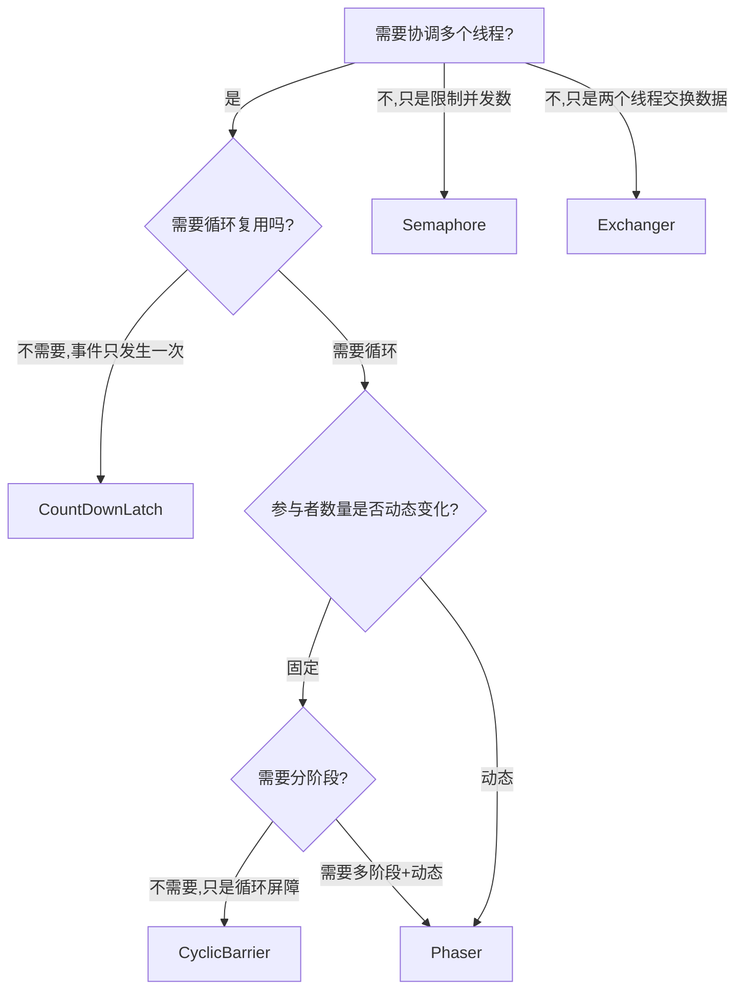

# 39.五大同步器对比：CountDownLatch / CyclicBarrier / Semaphore / Exchanger / Phaser

#### 目录介绍
- [39.1 开篇困境：5 个名字相近的同步器，到底用哪个？](#391-开篇困境5-个名字相近的同步器到底用哪个)
- [39.2 全景图：5 大同步器的家谱与心智模型](#392-全景图5-大同步器的家谱与心智模型)
  - [39.2.1 一张图看清 5 大同步器的定位](#3921-一张图看清-5-大同步器的定位)
  - [39.2.2 它们的共同基石：AQS state + 共享模式](#3922-它们的共同基石aqs-state--共享模式)
  - [39.2.3 5 个同步器的"灵魂一句话"](#3923-5-个同步器的灵魂一句话)
- [39.3 CountDownLatch：一次性闸门](#393-countdownlatch一次性闸门)
  - [39.3.1 经典场景：压测发令枪](#3931-经典场景压测发令枪)
  - [39.3.2 源码：基于 AQS 共享模式](#3932-源码基于-aqs-共享模式)
  - [39.3.3 不可重置的设计取舍](#3933-不可重置的设计取舍)
- [39.4 CyclicBarrier：可循环屏障](#394-cyclicbarrier可循环屏障)
  - [39.4.1 经典场景：多源数据并行汇聚](#3941-经典场景多源数据并行汇聚)
  - [39.4.2 源码：ReentrantLock + Condition + Generation](#3942-源码reentrantlock--condition--generation)
  - [39.4.3 BrokenBarrierException：屏障的"自爆机制"](#3943-brokenbarrierexception屏障的自爆机制)
  - [39.4.4 与 CountDownLatch 的本质差异](#3944-与-countdownlatch-的本质差异)
- [39.5 Semaphore：信号量与限流](#395-semaphore信号量与限流)
  - [39.5.1 经典场景：连接池/接口限流](#3951-经典场景连接池接口限流)
  - [39.5.2 源码：公平 vs 非公平的 tryAcquireShared](#3952-源码公平-vs-非公平的-tryacquireshared)
  - [39.5.3 Semaphore 不是限流神药：3 个常见坑](#3953-semaphore-不是限流神药3-个常见坑)
- [39.6 Exchanger：双向交换站](#396-exchanger双向交换站)
  - [39.6.1 经典场景：生产者消费者数据交换](#3961-经典场景生产者消费者数据交换)
  - [39.6.2 源码：slot + spin + park 的撮合艺术](#3962-源码slot--spin--park-的撮合艺术)
  - [39.6.3 多线程下的 Arena 分槽优化](#3963-多线程下的-arena-分槽优化)
- [39.7 Phaser：分阶段同步器](#397-phaser分阶段同步器)
  - [39.7.1 经典场景：多阶段批处理流水线](#3971-经典场景多阶段批处理流水线)
  - [39.7.2 动态注册 register/bulkRegister](#3972-动态注册-registerbulkregister)
  - [39.7.3 状态压缩：一个 long 编码 4 段信息](#3973-状态压缩一个-long-编码-4-段信息)
  - [39.7.4 树形分层 Tiered Phaser](#3974-树形分层-tiered-phaser)
- [39.8 5 大同步器全景对比与选型决策树](#398-5-大同步器全景对比与选型决策树)
  - [39.8.1 9 维全景对比表](#3981-9-维全景对比表)
  - [39.8.2 选型决策树](#3982-选型决策树)
  - [39.8.3 5 个同步器的设计哲学一句话总结](#3983-5-个同步器的设计哲学一句话总结)
- [39.9 灵魂三问 & 速查表 & 下一篇预告](#399-灵魂三问--速查表--下一篇预告)

---

## 39.1 开篇困境：5 个名字相近的同步器，到底用哪个？

某团队压测脚本，要同时模拟 1000 个用户并发下单。新人写出这版代码：

```java
// ❌ 同时启动 1000 个线程的"伪并发"——其实先启动的早就跑完了
ExecutorService pool = Executors.newFixedThreadPool(1000);
for (int i = 0; i < 1000; i++) {
    pool.submit(() -> placeOrder());
}
```

资深同事一句"这不是并发是顺序"——线程是逐个 `submit` 的，先 submit 的早跑完了，**1000 线程压根没在同一瞬间发车**，得到的 QPS 严重失真。

正确做法是引入"发令枪"——所有线程先到位，听见枪响**同时**起跑：

```java
CountDownLatch ready = new CountDownLatch(1000);  // 都到齐了吗
CountDownLatch start = new CountDownLatch(1);     // 发令枪
CountDownLatch done  = new CountDownLatch(1000);  // 都跑完了吗

for (int i = 0; i < 1000; i++) {
    new Thread(() -> {
        ready.countDown();      // 我就位了
        start.await();          // 等开枪
        try { placeOrder(); } finally { done.countDown(); }
    }).start();
}

ready.await();                  // 等所有人就位
long t0 = System.nanoTime();
start.countDown();              // 砰！开枪
done.await();                   // 等所有人跑完
long cost = System.nanoTime() - t0;  // 真正的 1000 并发耗时
```

——3 个 `CountDownLatch`，**3 种角色**（屏障、发令枪、终点线），把"齐步走"压测搞定。

但故事没完。第二天，要做"多源数据汇聚 → 求交集 → 写库"，5 个数据源**并行查询**，全部到齐再合并，**而且这个流程要跑 N 轮**。这时候 `CountDownLatch` 就不够了——它**不可重置**，每轮要 new 一个新的，丑陋且容易出 bug。

第三天，要给"接口限流"做一个 QPS=100 的闸门——`CountDownLatch` 显然不对。

第四天，需要"生产者拿到一批数据后**和消费者交换**一批空 buffer"。

第五天，需要"3 阶段批处理流水线，**每个阶段的参与者数量都不同**，且支持运行时动态加入"。

—— 5 个需求，恰好对应 `java.util.concurrent` 包里 5 个名字相似但**用途天差地别**的同步器：

| 需求 | 同步器 |
|---|---|
| 一次性发令枪 / 终点线 | `CountDownLatch` |
| 多源汇聚 / 反复屏障 | `CyclicBarrier` |
| 限流 / 资源池 | `Semaphore` |
| 双向数据交换 | `Exchanger` |
| 多阶段 + 动态参与者 | `Phaser` |

它们底层差异有多大？哪些用 AQS、哪些不用？什么时候用哪个？这一篇全部讲透。

---

## 39.2 全景图：5 大同步器的家谱与心智模型

### 39.2.1 一张图看清 5 大同步器的定位

```
                       并发协调需求
                            │
        ┌───────────────────┼───────────────────┐
        │                   │                   │
   "等齐再开"          "限制并发数"        "线程间数据传递"
        │                   │                   │
   ┌────┴────┐               │                   │
"一次性"   "可循环"            │                   │
   │         │                │                   │
CountDown  Cyclic           Semaphore        Exchanger
 Latch     Barrier         (信号量)          (双向交换)
 (闸门)    (循环屏障)
                                                 │
                                          特殊：多阶段 + 动态
                                                 │
                                              Phaser
                                            (分阶段同步器)
```

### 39.2.2 它们的共同基石：AQS state + 共享模式

5 大同步器里 **3 个直接继承 AQS**（CountDownLatch / Semaphore / 部分内核），**2 个不基于 AQS**（CyclicBarrier 用 ReentrantLock+Condition、Exchanger 用 slot+park、Phaser 自己手写 long state + Treiber stack）。

| 同步器 | 是否基于 AQS | state 含义 | 模式 |
|---|---|---|---|
| `CountDownLatch` | ✅ | 剩余计数 | 共享 |
| `Semaphore` | ✅ | 剩余许可数 | 共享 |
| `CyclicBarrier` | ❌（基于 ReentrantLock+Condition） | trip + parties | — |
| `Exchanger` | ❌（自己实现 slot+park） | slot 引用 | — |
| `Phaser` | ❌（自己 64 位 state） | 4 段状态压缩 | — |

> 36 篇我们说过：**`tryAcquireShared` 返回值大于等于 0 就算获取成功**，并通过 `setHeadAndPropagate` 接力唤醒后继。CountDownLatch 和 Semaphore 都是这套机制的"应用层落地"。

### 39.2.3 5 个同步器的"灵魂一句话"

| 同步器 | 灵魂一句话 |
|---|---|
| `CountDownLatch` | **倒数计时器**——N 个事件发生后大家一起放行，**只能用一次** |
| `CyclicBarrier` | **可循环的等齐再走**——N 个线程互相等齐，到齐后一起冲，下一轮重新计数 |
| `Semaphore` | **令牌池**——同时最多 N 个线程持有令牌，干完归还 |
| `Exchanger` | **两人对接窗口**——A 把东西放下，B 把东西放下，一手交一手换走 |
| `Phaser` | **可注册可注销的多阶段屏障**——参与者动态变化，每个阶段都重新等齐 |

---

## 39.3 CountDownLatch：一次性闸门

### 39.3.1 经典场景：压测发令枪

39.1 节已经给出了经典三段式写法：**就位 latch + 发令枪 latch + 终点线 latch**。

再看一个常用场景——**主线程等待多个初始化任务完成**：

```java
public class App {
    public static void main(String[] args) throws InterruptedException {
        CountDownLatch initLatch = new CountDownLatch(3);

        new Thread(() -> { loadConfig();   initLatch.countDown(); }).start();
        new Thread(() -> { connectDB();    initLatch.countDown(); }).start();
        new Thread(() -> { warmupCache();  initLatch.countDown(); }).start();

        initLatch.await();           // 等 3 个并行初始化全部完成
        startHttpServer();           // 才启动服务接收请求
    }
}
```

vs `Thread.join()` 写法——`countDown()` 可以在**任意时刻被任意线程调用**，不像 `join()` 必须等线程终止；这意味着初始化任务即使没结束，也可以提前 `countDown()` 通知主线程"我准备就绪了"。

### 39.3.2 源码：基于 AQS 共享模式

```java
public class CountDownLatch {
    private final Sync sync;

    private static final class Sync extends AbstractQueuedSynchronizer {
        Sync(int count) { setState(count); }              // ★ state = N

        protected int tryAcquireShared(int acquires) {
            return (getState() == 0) ? 1 : -1;            // ★ state==0 才算"获取成功"
        }

        protected boolean tryReleaseShared(int releases) {
            for (;;) {
                int c = getState();
                if (c == 0) return false;                 // 已经到 0，再 countDown 无效
                int nextc = c - 1;
                if (compareAndSetState(c, nextc))
                    return nextc == 0;                    // ★ 减到 0 时返回 true，触发唤醒
            }
        }
    }

    public CountDownLatch(int count) {
        if (count < 0) throw new IllegalArgumentException();
        this.sync = new Sync(count);
    }

    public void await() throws InterruptedException {
        sync.acquireSharedInterruptibly(1);              // 共享模式获取
    }

    public void countDown() {
        sync.releaseShared(1);                            // 共享模式释放
    }
}
```

**核心两行**：
- `tryAcquireShared`：state 为 0 才放行，否则进 AQS 队列阻塞；
- `tryReleaseShared`：CAS 把 state 减 1，**减到 0 时返回 true**，AQS 框架捕获这个 true 后调用 `doReleaseShared` **接力唤醒所有等待线程**——这就是 36 篇讲的 PROPAGATE 机制。

```
state=3                state=2                state=1                state=0
  │                      │                      │                      │
  │ countDown()          │ countDown()          │ countDown()          │
  ↓                      ↓                      ↓                      ↓
[await 阻塞]          [await 阻塞]          [await 阻塞]      ★ 全部唤醒（PROPAGATE）
```

### 39.3.3 不可重置的设计取舍

CountDownLatch 没有 `reset()` 方法。state 减到 0 后**永久为 0**，再 `countDown()` 直接返回 false 不做任何事。

为什么不让重置？

1. **语义清晰**：CountDownLatch 表达"一次性事件"——比如"系统初始化完成"这种事件天然就是一次性的；
2. **避免并发陷阱**：如果允许重置，可能出现"线程 A 看到 state=0 被放行，刚要往下走时线程 B 调用 reset 把 state 改回 N"——这是经典的 ABA 问题（参考 38 篇）；
3. **要重置请用 CyclicBarrier**：JDK 把"循环复用"的需求拆给了 CyclicBarrier，**两个工具职责单一**。

---

## 39.4 CyclicBarrier：可循环屏障

### 39.4.1 经典场景：多源数据并行汇聚

5 个数据源并行查询，全部到齐再合并，**循环跑 N 轮**：

```java
int parties = 5;
CyclicBarrier barrier = new CyclicBarrier(parties, () -> {
    // ★ 屏障动作：所有人到齐后由"最后一个到达者"线程执行
    mergeAndWriteDB();
    System.out.println("第 " + barrier.getNumberOfRounds() + " 轮完成");
});

for (int i = 0; i < 5; i++) {
    final int sourceId = i;
    new Thread(() -> {
        while (!stop) {
            queryFromSource(sourceId);
            try {
                barrier.await();        // ★ 等所有 5 个数据源到齐
            } catch (Exception e) { return; }
        }
    }).start();
}
```

注意 `CyclicBarrier(parties, barrierAction)` 的第二个参数——**barrierAction 由"最后一个到达 await 的线程"执行**，等动作执行完才一起放行。这是 CyclicBarrier 独有的"屏障钩子"。

### 39.4.2 源码：ReentrantLock + Condition + Generation

CyclicBarrier **不基于 AQS state**，而是用一把 ReentrantLock + 一个 Condition：

```java
public class CyclicBarrier {
    private final ReentrantLock lock = new ReentrantLock();
    private final Condition trip = lock.newCondition();
    private final int parties;                       // 总参与者数（不变）
    private final Runnable barrierCommand;           // 屏障动作
    private Generation generation = new Generation();// ★ 每一轮一个 Generation
    private int count;                               // 当前轮还差几个

    private static class Generation {
        Generation() {}
        boolean broken;                              // ★ 自爆标志
    }

    public int await() throws InterruptedException, BrokenBarrierException {
        return dowait(false, 0L);
    }

    private int dowait(boolean timed, long nanos) throws ... {
        lock.lock();
        try {
            Generation g = generation;
            if (g.broken) throw new BrokenBarrierException();
            if (Thread.interrupted()) {
                breakBarrier();                      // 中断 → 自爆
                throw new InterruptedException();
            }

            int index = --count;                     // ★ 到达计数 -1
            if (index == 0) {                        // ★ 我是最后一个，触发动作
                boolean ranAction = false;
                try {
                    Runnable command = barrierCommand;
                    if (command != null) command.run();
                    ranAction = true;
                    nextGeneration();                // ★ 切换到下一轮（重置 count + 唤醒所有人）
                    return 0;
                } finally {
                    if (!ranAction) breakBarrier();  // 屏障动作出异常 → 自爆
                }
            }

            // 不是最后一个，进入 Condition 等待
            for (;;) {
                try {
                    if (!timed)             trip.await();
                    else if (nanos > 0L)    nanos = trip.awaitNanos(nanos);
                } catch (InterruptedException ie) {
                    if (g == generation && !g.broken) {
                        breakBarrier();
                        throw ie;
                    } else Thread.currentThread().interrupt();
                }
                if (g.broken)        throw new BrokenBarrierException();
                if (g != generation) return index;   // ★ 已经进入下一轮，正常返回
                if (timed && nanos <= 0L) {
                    breakBarrier();
                    throw new TimeoutException();
                }
            }
        } finally { lock.unlock(); }
    }

    private void nextGeneration() {
        trip.signalAll();                            // 唤醒所有等待者
        count = parties;                             // ★ 重置计数
        generation = new Generation();               // ★ 切换 Generation
    }

    private void breakBarrier() {
        generation.broken = true;
        count = parties;
        trip.signalAll();
    }
}
```

**核心三件事**：
1. **count 倒数 + 最后一个负责干活**：最后到达者负责执行 `barrierCommand`，并切换 Generation；
2. **Generation 对象作为"轮次标记"**：等待中的线程被唤醒后通过 `g != generation` 判断"是新一轮放行"还是"被中断/超时";
3. **broken 标志位 + signalAll 自爆**：任何一个等待者中断/超时，**整个屏障作废**，所有人抛 `BrokenBarrierException`。

### 39.4.3 BrokenBarrierException：屏障的"自爆机制"

CyclicBarrier 有个 CountDownLatch 没有的概念——**自爆**。任何下面的事件都会让 broken=true，导致**所有正在等待的线程一起抛 BrokenBarrierException**：

| 自爆触发条件 | 现象 |
|---|---|
| 任一线程在 await 期间被 `interrupt()` | 全部抛 `BrokenBarrierException` |
| 任一线程 `await(timeout)` 超时 | 全部抛 `BrokenBarrierException` |
| barrierCommand 自身抛异常 | 全部抛 `BrokenBarrierException` |
| 显式调用 `barrier.reset()` | 已等待的全部抛 `BrokenBarrierException` |

**为什么这么设计**？因为 CyclicBarrier 的语义是"**N 个人必须凑齐**"——少一个人都不能放行，所以一旦有人"撤退"，**整个会议必须取消**，否则剩下的人会永远等下去（死锁）。

线上踩坑：**多源汇聚里某个数据源超时**，整个轮次自爆，**barrier 必须 reset 才能进入下一轮**——没考虑这一点，业务直接卡死。

```java
try {
    barrier.await();
} catch (BrokenBarrierException be) {
    // ★ 必须重置才能继续下一轮
    barrier.reset();
}
```

### 39.4.4 与 CountDownLatch 的本质差异

| 维度 | CountDownLatch | CyclicBarrier |
|---|---|---|
| **底层基石** | AQS（共享模式） | ReentrantLock + Condition |
| **可否重用** | ❌ 一次性，state 到 0 后永久失效 | ✅ 自动重置，循环使用 |
| **谁等谁** | **某些线程等另一些线程**（`countDown` 和 `await` 通常不在同一组线程） | **N 个线程互相等**（`await` 由所有参与者调用） |
| **触发动作** | 无 | 支持 barrierAction，由最后到达者执行 |
| **状态自爆** | 无 | 有 BrokenBarrierException |
| **典型场景** | 主等子、发令枪、终点线 | 多源汇聚、分批迭代、模拟并发 |

> **一句话区分**：CountDownLatch 是"**A 等 B**"，CyclicBarrier 是"**B 们等 B 们自己齐**"。

---

## 39.5 Semaphore：信号量与限流

### 39.5.1 经典场景：连接池/接口限流

数据库连接池只有 10 个连接，**最多允许 10 个线程同时访问数据库**：

```java
Semaphore sem = new Semaphore(10);            // 10 张许可证

public Result query(String sql) throws InterruptedException {
    sem.acquire();                            // 拿一张证，没证就阻塞
    try {
        return realQuery(sql);
    } finally {
        sem.release();                        // 用完归还
    }
}
```

接口限流：QPS 不超过 100：

```java
Semaphore qps = new Semaphore(100);

@Scheduled(fixedRate = 1000)                  // 每秒重置
public void refill() { qps.drainPermits(); qps.release(100); }

public Response handle(Request req) {
    if (!qps.tryAcquire()) return Response.tooManyRequests();
    return doHandle(req);
}
```

> ⚠️ 这个限流模型只是举例，**真实生产用 Guava RateLimiter 或 Sentinel** 更平滑（令牌桶/漏桶），Semaphore 这种"硬切窗口"会有边界突刺。详见 39.5.3。

### 39.5.2 源码：公平 vs 非公平的 tryAcquireShared

```java
public class Semaphore {
    abstract static class Sync extends AbstractQueuedSynchronizer {
        Sync(int permits) { setState(permits); }     // ★ state = 许可数

        // 非公平
        final int nonfairTryAcquireShared(int acquires) {
            for (;;) {
                int available = getState();
                int remaining = available - acquires;
                if (remaining < 0 ||
                    compareAndSetState(available, remaining))
                    return remaining;                // ★ 负数=失败入队；非负=成功
            }
        }

        protected final boolean tryReleaseShared(int releases) {
            for (;;) {
                int current = getState();
                int next = current + releases;
                if (next < current) throw new Error("Maximum permit count exceeded");
                if (compareAndSetState(current, next)) return true;
            }
        }
    }

    static final class FairSync extends Sync {
        protected int tryAcquireShared(int acquires) {
            for (;;) {
                if (hasQueuedPredecessors())          // ★ 公平模式：队列有人就老实排队
                    return -1;
                int available = getState();
                int remaining = available - acquires;
                if (remaining < 0 ||
                    compareAndSetState(available, remaining))
                    return remaining;
            }
        }
    }

    static final class NonfairSync extends Sync {
        protected int tryAcquireShared(int acquires) {
            return nonfairTryAcquireShared(acquires);
        }
    }
}
```

**公平 vs 非公平的唯一差别**——公平模式调用 `hasQueuedPredecessors()` 检查队列有没有人在等，**有则放弃直接 CAS**，乖乖排队；非公平模式不管队列，直接 CAS 抢——抢到就走。

非公平在大多数场景下吞吐更高（避免线程切换），但可能导致**饥饿**——后到的反复抢赢早到的。**公平 = 排队，非公平 = 插队**。

### 39.5.3 Semaphore 不是限流神药：3 个常见坑

**坑 1：当限流器使用，无法控制速率（QPS）**

Semaphore 控制的是"**同时持有的并发数**"，不是"**单位时间通过的请求数**"。100 个许可如果每个线程占用 10ms，理论上 1 秒可以放过 10000 个请求；如果每个占用 1s，1 秒只能放 100 个。

**真要做 QPS 限流，必须用令牌桶**（Guava RateLimiter / Sentinel / Resilience4j）。

**坑 2：release 调用次数 > acquire**

Semaphore 的 `release()` 是**无脑加 1**——`tryReleaseShared` 里**不检查是不是当前线程持有的许可**！这点和 ReentrantLock 完全不同：

```java
Semaphore sem = new Semaphore(0);
sem.release();
sem.release();
sem.release();
sem.acquire();  // 三次 release 之后还能 acquire 三次！
```

利用这个特性可以实现"**不对称的发证模型**"：发证线程不停 release，消费线程不停 acquire——但若你以为 Semaphore 是"严格成对的锁"，会被坑得很惨。

**坑 3：忘记 try-finally 释放**

```java
sem.acquire();
doSomething();          // ★ 这里抛异常
sem.release();          // ★ 永远不执行 → 许可证少一张

// 几次异常后，10 张许可全没了，所有请求阻塞 → 业务雪崩
```

**严格 try-finally**：

```java
sem.acquire();
try {
    doSomething();
} finally {
    sem.release();
}
```

---

## 39.6 Exchanger：双向交换站

### 39.6.1 经典场景：生产者消费者数据交换

生产者填满一个 buffer，消费者用完一个 buffer，两人**手里同时拿着一个 buffer**——交换走完美继续干活：

```java
Exchanger<List<Order>> exchanger = new Exchanger<>();

// 生产者
new Thread(() -> {
    List<Order> filling = new ArrayList<>();
    while (true) {
        if (filling.size() == 1000) {
            filling = exchanger.exchange(filling);   // ★ 给消费者满 buffer，换回空 buffer
            // 此时 filling 是消费者用完的空 list
        }
        filling.add(produceOne());
    }
}).start();

// 消费者
new Thread(() -> {
    List<Order> consuming = new ArrayList<>();
    while (true) {
        consuming = exchanger.exchange(consuming);   // ★ 给生产者空 buffer，换回满 buffer
        for (Order o : consuming) save(o);
        consuming.clear();
    }
}).start();
```

**精妙之处**：双方各自持有自己的 buffer，**`exchange` 调用同时返回对方的 buffer**——比 BlockingQueue 少一次 put/take 的复制。在**双方处理速度匹配**的场景下，比基于队列的方案更高效。

### 39.6.2 源码：slot + spin + park 的撮合艺术

Exchanger **不基于 AQS**，自己手写一套基于 slot 的撮合机制（简化版）：

```java
public class Exchanger<V> {
    private final Object slot;     // 简化版：单 slot

    public V exchange(V x) throws InterruptedException {
        Node node = new Node(x);                     // 我带的礼物
        for (;;) {
            Object current = slot;
            if (current == null) {
                // ★ 槽位空：放进去并等
                if (slotCAS(null, node)) {
                    park(node);                      // 等被换
                    Object got = node.matched;
                    return (V) got;
                }
            } else {
                // ★ 槽位有人：CAS 取走他的礼物，把我的塞进去
                Node other = (Node) current;
                if (slotCAS(other, null)) {
                    Object hisGift = other.item;
                    other.matched = node.item;       // ★ 把我的礼物给他
                    unpark(other.thread);            // 唤醒他
                    return (V) hisGift;
                }
            }
        }
    }
}
```

**核心 3 步**：
1. **slot 空**：第一个到来的线程把自己的"礼物" + 自己的引用放进 slot，**park 自己**等待；
2. **slot 满**：第二个到来的线程**CAS 取走 slot**（防 ABA），交换礼物，**unpark 对方**；
3. **被唤醒方**：从自己的 `matched` 字段读出对方留下的礼物，返回。

实际 JDK 实现还在 park 之前**自旋几百次**——如果对方很快就到（短期忙等场景），就**避免 park/unpark 系统调用**的开销。这是 38 篇讲过的"自旋让步"思想。

### 39.6.3 多线程下的 Arena 分槽优化

简化版只有 1 个 slot，**多线程同时 exchange 会互相 CAS 失败死磕**——这就是经典的"伪共享 + 高竞争"问题。

JDK 实际实现引入了 **Arena 数组**——一个大小为 `(NCPU+1)/2 * 128` 的 Node 数组，每个线程根据自己的探针 hash 落到不同 slot：

```java
// 简化版（实际更复杂）
Node[] arena;                                        // ★ 多 slot 数组
int idx = (Thread.currentThread().hashCode() & (arena.length - 1)) * 128;
                                                     // ×128 避免伪共享（cache line padding）
Object current = arena[idx];
// ... 后续逻辑同单 slot
```

设计思想和 38 篇讲的 **Striped64 / LongAdder** 一脉相承——**化整为零，把单点竞争分散到多 slot**。每个 slot 之间**间隔 128 字节**（一个 cache line 的两倍）防伪共享。

| 竞争度 | Exchanger 行为 |
|---|---|
| 低（双线程） | 退化到 slot[0]，无竞争 |
| 中（多线程） | 自动扩散到多 slot，各自撮合 |
| 高（极端） | slot 数量 ≤ NCPU/2，最多 NCPU/2 对线程同时撮合 |

---

## 39.7 Phaser：分阶段同步器

### 39.7.1 经典场景：多阶段批处理流水线

3 阶段处理：**抽取 → 转换 → 加载**（ETL），每阶段所有 worker 必须等齐才能进入下阶段：

```java
Phaser phaser = new Phaser(workerCount);             // 注册 N 个参与者

for (int i = 0; i < workerCount; i++) {
    new Thread(() -> {
        extract();   phaser.arriveAndAwaitAdvance();  // 阶段 0 屏障
        transform(); phaser.arriveAndAwaitAdvance();  // 阶段 1 屏障
        load();      phaser.arriveAndDeregister();    // 阶段 2 干完销账
    }).start();
}
```

**和 CyclicBarrier 的区别**：
1. CyclicBarrier 的 `parties` **创建时就定死**；Phaser 支持 **`register()` / `arriveAndDeregister()`** 动态加减；
2. CyclicBarrier 是 **"屏障 → 屏障 → ..."** 的循环，Phaser 是 **"阶段 0 → 阶段 1 → 阶段 2 → ..."** 有阶段编号；
3. Phaser 支持 **树形分层**（39.7.4），CyclicBarrier 不支持。

### 39.7.2 动态注册 register/bulkRegister

CyclicBarrier 写死 `parties=5` 后，第 6 个人来了就**只能创建一个新的 barrier**。Phaser 可以运行时动态变：

```java
Phaser phaser = new Phaser(1);                       // 主线程先注册自己

for (int i = 0; i < 5; i++) {
    phaser.register();                               // ★ 每来一个 worker 就注册一个
    new Thread(() -> {
        try {
            doWork();
            phaser.arriveAndAwaitAdvance();
        } finally {
            phaser.arriveAndDeregister();            // ★ 干完销账
        }
    }).start();
}

phaser.arriveAndDeregister();                        // 主线程销账
```

**实战场景**：流水线后端的 worker 是动态扩缩容的——**有空了 register、忙完销账**。CyclicBarrier 在这种场景下完全无能。

### 39.7.3 状态压缩：一个 long 编码 4 段信息

Phaser 不基于 AQS，但思想类似——把所有状态**压缩进一个 volatile long**，全局靠 CAS 推进：

```java
private volatile long state;
//  64 位布局：
//  ┌─────────────┬───────────────┬───────────────┬──────────┐
//  │ phase 31bit │ parties 16bit │ unarrived 16bit │ TERM 1bit │
//  └─────────────┴───────────────┴───────────────┴──────────┘
//   当前阶段编号    总参与者         未到达者         终止标志

static final int  PARTIES_SHIFT  = 16;
static final int  PHASE_SHIFT    = 32;
static final long UNARRIVED_MASK = 0xffffL;
static final long PARTIES_MASK   = 0xffff0000L;

private static int  unarrivedOf(long s)  { return (int) (s & UNARRIVED_MASK); }
private static int  partiesOf(long s)    { return (int) ((s & PARTIES_MASK) >>> PARTIES_SHIFT); }
private static int  phaseOf(long s)      { return (int) (s >>> PHASE_SHIFT); }
```

`arrive()` 简化逻辑：

```java
public int arrive() {
    final Phaser root = this.root;
    for (long s = (root == this) ? state : reconcileState(); ;) {
        int phase = (int) (s >>> PHASE_SHIFT);
        if (phase < 0) return phase;                 // 已终止
        int unarrived = (int) (s & UNARRIVED_MASK) - 1;
        if (unarrived < 0) throw new IllegalStateException();
        long n = s - 1L;                             // ★ unarrived - 1
        if (UNSAFE.compareAndSwapLong(this, stateOffset, s, n)) {
            if (unarrived == 0) {                    // ★ 所有人都到了
                long next = (((long)(phase + 1) & 0x7fffffffL) << PHASE_SHIFT)
                          | (s & PARTIES_MASK)
                          | partiesOf(s);            // ★ 推进到下一阶段，unarrived 重置 = parties
                state = next;
                releaseWaiters(phase);               // ★ 唤醒所有等待者（Treiber stack 弹出）
            }
            return phase;
        }
    }
}
```

**亮点**：
- **一个 CAS 同时改 4 个字段**——位运算压缩到一个 long，避免多字段一致性问题（不需要锁）；
- **等待者用 Treiber 栈管理**（lock-free 链表），`releaseWaiters` 一次性弹出所有人 unpark；
- **phase 自增 → 自动进入下一阶段**——不需要像 CyclicBarrier 那样 new 一个新 Generation。

### 39.7.4 树形分层 Tiered Phaser

参与者过多（比如 1000 个 worker）时，单个 Phaser 的 CAS 竞争会成为瓶颈。Phaser 支持**树形分层**——多个子 Phaser 共享一个父 Phaser：

```java
Phaser root = new Phaser();
Phaser child1 = new Phaser(root);                    // ★ 挂到 root 下
Phaser child2 = new Phaser(root);
Phaser child3 = new Phaser(root);

// 1000 个 worker 平均分到 3 个 child 上
for (int i = 0; i < 1000; i++) {
    Phaser parent = (i % 3 == 0) ? child1 : (i % 3 == 1) ? child2 : child3;
    parent.register();
    new Thread(() -> {
        doWork();
        parent.arriveAndAwaitAdvance();
    }).start();
}
```

```
              root (协调全局阶段推进)
             / | \
       child1 child2 child3
        / | \   ...
     w1 w2 w3   ...
```

每个 child 只负责自己 333 个 worker 的 CAS 竞争，到齐后向 root 上报"我们这一组到齐了"——root 等所有 child 都到齐才推进阶段。**竞争从 1000 路降到每层 333 路 + 3 路**。

> 设计思想和 38 篇 LongAdder 的"分段降低竞争"完全一致——**JDK 并发设计的母题：分段、分槽、分层**。

---

## 39.8 5 大同步器全景对比与选型决策树

### 39.8.1 9 维全景对比表

| 维度 | CountDownLatch | CyclicBarrier | Semaphore | Exchanger | Phaser |
|---|---|---|---|---|---|
| **底层** | AQS 共享 | ReentrantLock+Condition | AQS 共享 | slot+park | 自定义 long state + Treiber stack |
| **可重用** | ❌ 一次性 | ✅ 自动重置 | ✅ 长期持有/归还 | ✅ 每次 exchange 一对一 | ✅ 阶段自动推进 |
| **谁等谁** | 一组等另一组 | 一组互等 | 拿不到许可的等持有者 | 两两配对互等 | 一组等另一组（可动态变） |
| **触发动作** | 无 | barrierAction（最后到达者执行） | 无 | exchange 自动完成 | onAdvance 钩子 |
| **动态参与者** | ❌ | ❌ | ❌ | ❌ | ✅ register / deregister |
| **多阶段** | ❌ | 可循环但无阶段编号 | ❌ | ❌ | ✅ 显式 phase 编号 |
| **超时/中断** | ✅ await(timeout) | ✅ 触发 broken | ✅ tryAcquire(timeout) | ✅ exchange(timeout) | ✅ awaitAdvanceInterruptibly |
| **失败传染** | 无 | ✅ Broken 全员炸 | 无 | 无 | onAdvance 返回 true 终止全员 |
| **典型场景** | 主等子、发令枪 | 多源汇聚、模拟并发 | 限流、连接池 | 双向数据交换 | 多阶段批处理、动态参与者 |

### 39.8.2 选型决策树



**口诀**：
- **一次** → CountDownLatch
- **循环** → CyclicBarrier
- **限流** → Semaphore
- **交换** → Exchanger
- **分阶段+动态** → Phaser

### 39.8.3 5 个同步器的设计哲学一句话总结

| 哲学 | 体现 |
|---|---|
| **AQS state + 模板方法的应用层落地** | CountDownLatch 用 state 表示"剩余计数"，Semaphore 用 state 表示"剩余许可"——同一个 AQS 钩子，两种业务语义 |
| **基础原语之上的二次封装** | CyclicBarrier = ReentrantLock + Condition + Generation——证明 AQS 不是唯一答案，**老老实实用锁也能写出工业级同步器** |
| **slot + 自旋 + park 三段式** | Exchanger 用 slot 撮合 + 短自旋 + park——和 38 篇 ABA、虚拟线程的 park 凭证机制呼应 |
| **状态压缩进单 long + 树形分层** | Phaser 把 4 个字段压进 long、用 Treiber stack 管理等待者、用树形分层降低竞争——**和 LongAdder 的"分段思想"是双胞胎** |
| **一致的 broken/terminate 机制** | CyclicBarrier broken、Phaser terminate——**面向异常的同步语义**，避免死锁 |

---

## 39.9 灵魂三问 & 速查表 & 下一篇预告

### 39.9.1 灵魂三问

1. **CountDownLatch 和 CyclicBarrier 都是 N 等齐再走，到底有什么本质差异？**
   - 表面差异：可否重置；
   - 本质差异：**谁是被等者**——`CountDownLatch` 中"被等的人"和"等的人"通常**不是同一组**（A 队等 B 队），`CyclicBarrier` 中所有人**既是等者也是被等者**（自己等自己人凑齐）。
   - 底层差异：CountDownLatch 基于 AQS state 共享模式，CyclicBarrier 基于 ReentrantLock + Condition；
   - 错误反例：用 CountDownLatch 模拟 CyclicBarrier 的"循环"——必须每轮 new 新对象，且不能用 barrierAction。

2. **Semaphore 能不能用来做 QPS 限流？**
   - **不能**。Semaphore 控制的是"**同时持有的并发数**"，而 QPS 是"**单位时间通过的请求数**"——前者的吞吐随处理时长变化，后者必须基于令牌桶/漏桶。
   - 真正的 QPS 限流：Guava `RateLimiter` / Sentinel / Resilience4j。
   - Semaphore 适合"**资源池**"语义：连接池、线程池、内存池、并发请求数上限。

3. **Phaser 比 CyclicBarrier 多了什么？为什么 JDK 7 才补这个工具？**
   - 多 3 件事：① 动态参与者（register/deregister）；② 显式阶段编号（phase）；③ 树形分层（tiered phaser，处理大并发）。
   - JDK 7 补 Phaser，是因为 ForkJoin 和大数据流水线兴起后，"参与者动态变化"和"阶段化"成为常态。CyclicBarrier 解决不了"运行时加 worker"的问题——只能新建一个 barrier（语义就断了）。
   - 设计哲学：Phaser 把"灵活性"做到极致，代价是**复杂度大**——**简单场景用 CountDownLatch / CyclicBarrier，复杂场景才用 Phaser**。

### 39.9.2 速查表

| 想做的事 | 用谁 | 关键 API |
|---|---|---|
| 主线程等多个子线程初始化完成 | `CountDownLatch(N)` | `await()` / `countDown()` |
| 同时启动 N 个线程做压测 | `CountDownLatch(1)` | 发令枪：所有线程 `start.await()`，主线程 `start.countDown()` |
| N 个线程多轮迭代（多源汇聚） | `CyclicBarrier(N, action)` | `await()` |
| 限制最多 N 个并发访问资源 | `Semaphore(N)` | `acquire()` / `release()` |
| 两个线程交换数据 | `Exchanger<T>()` | `exchange(value)` |
| 多阶段且 worker 数动态变化 | `Phaser()` + `register()` | `arriveAndAwaitAdvance()` / `arriveAndDeregister()` |

### 39.9.3 死规矩 6 条

1. **永远 try-finally 释放 Semaphore**——异常路径上漏 release 会让许可证慢慢消失；
2. **CountDownLatch 不要复用**——要循环就换 CyclicBarrier 或 Phaser；
3. **CyclicBarrier 必须处理 BrokenBarrierException + 调用 reset()**——否则一次中断/超时整个屏障废掉；
4. **Semaphore 不是 QPS 限流器**——QPS 限流用 RateLimiter；
5. **Phaser 树形分层只在 ≥ 几百参与者时才有性价比**——简单场景反而比 CyclicBarrier 慢；
6. **不要用同步器替代消息队列**——Exchanger 的双向交换语义很特殊，不是通用的生产者消费者。

---

🎯 **下一篇预告：第 40 篇《CompletableFuture 异步编程》**——本篇拿下了"线程协调"的 5 大同步器，下一篇站到更高层讲**异步编排**：Future 的演进史（Future → ListenableFuture → CompletableFuture → 反应式 Mono/Flux）+ 30 多个组合算子全景图（thenApply / thenCompose / thenCombine / allOf / anyOf）+ 内部状态机（Stack 链表 + Completion 节点） + ForkJoinPool common pool 的坑（默认线程数、阻塞陷阱）+ supplyAsync 自定义线程池的最佳实践 + handle / exceptionally / whenComplete 三种异常处理姿势 + 链式调用的死锁陷阱 + 与 Reactor / Loom 虚拟线程的取舍。**异步编排一次讲透。**

---

## 📚 延伸阅读

- JDK 源码：`java.util.concurrent.CountDownLatch` / `CyclicBarrier` / `Semaphore` / `Exchanger` / `Phaser`
- JEP 155：Concurrency Updates（Phaser 加入背景）
- 《Java 并发编程实战》第 5 章（Brian Goetz）——CountDownLatch / CyclicBarrier 的最初权威讲解
- 《Java 并发编程的艺术》第 8 章——Phaser 与 Exchanger 源码解析
- Doug Lea 论文 *The java.util.concurrent Synchronizer Framework*（AQS 论文，含 Semaphore 推导）
- 36 篇《AQS 同步框架源码》——本篇 CountDownLatch / Semaphore 的底座
- 38 篇《CAS / Atomic / Unsafe / VarHandle》——本篇 Phaser 的 long state 单 CAS 推进与 Striped64 同源

