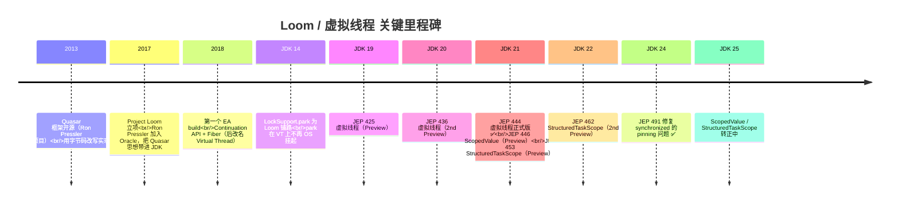
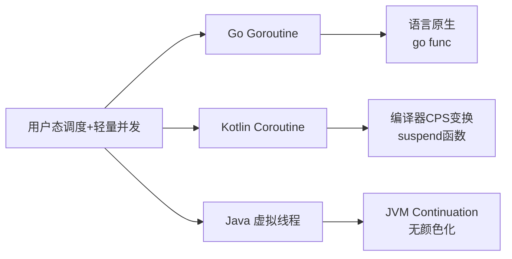
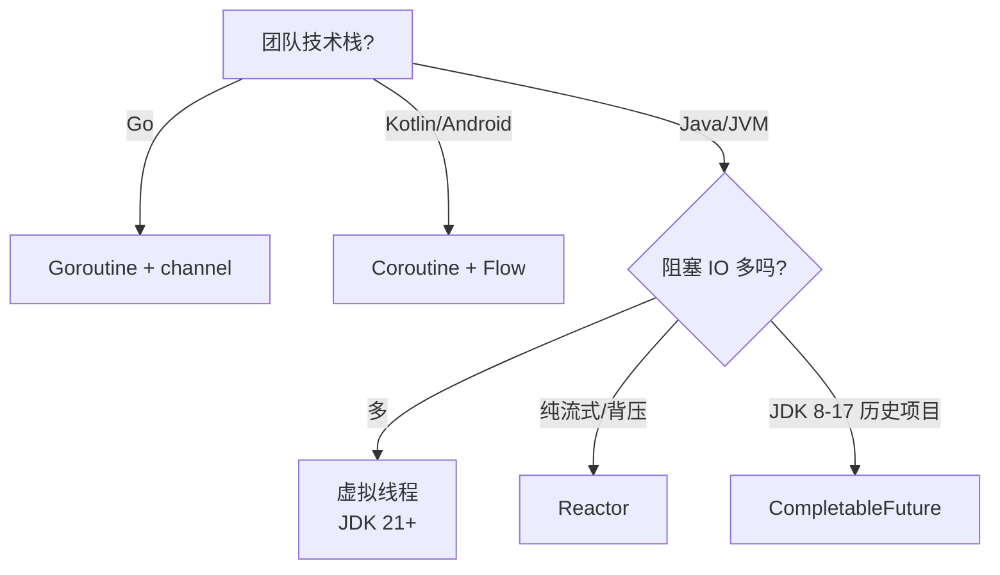
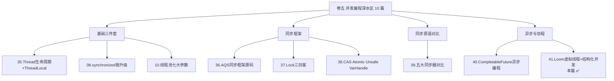

# 41.虚拟线程(Loom)与结构化并发

#### 目录介绍
- [41.1 开篇：百万连接 echo server，平台线程 800 OOM、虚拟线程 100 万游刃](#411-开篇百万连接-echo-server平台线程-800-oom虚拟线程-100-万游刃)
- [41.2 Loom 立项十年史：从 Quasar 到 JEP 444](#412-loom-立项十年史从-quasar-到-jep-444)
- [41.3 双层模型：carrier 线程 + Continuation 续延](#413-双层模型carrier-线程--continuation-续延)
  - [41.3.1 M:N 调度：N 个 VT 复用 M 个 carrier](#4131-mn-调度n-个-vt-复用-m-个-carrier)
  - [41.3.2 Continuation：可挂起的栈帧](#4132-continuation可挂起的栈帧)
  - [41.3.3 yield → freeze → mount/unmount 全流程](#4133-yield--freeze--mountunmount-全流程)
- [41.4 创建虚拟线程的 4 种姿势 + 一个反模式](#414-创建虚拟线程的-4-种姿势--一个反模式)
- [41.5 Pinning 钉死问题深度诊断](#415-pinning-钉死问题深度诊断)
  - [41.5.1 什么操作会 pin 虚拟线程？](#4151-什么操作会-pin-虚拟线程)
  - [41.5.2 -Djdk.tracePinnedThreads=full 实战](#4152--djdktracepinnedthreadsfull-实战)
  - [41.5.3 JDK 21 vs JDK 24：synchronized 解 pin](#4153-jdk-21-vs-jdk-24synchronized-解-pin)
- [41.6 StructuredTaskScope 结构化并发（JEP 453）](#416-structuredtaskscope-结构化并发jep-453)
  - [41.6.1 非结构化并发的痛](#4161-非结构化并发的痛)
  - [41.6.2 ShutdownOnFailure / ShutdownOnSuccess](#4162-shutdownonfailure--shutdownonsuccess)
  - [41.6.3 父子作用域 + 取消传播](#4163-父子作用域--取消传播)
- [41.7 ScopedValue 替代 ThreadLocal（JEP 446）](#417-scopedvalue-替代-threadlocaljep-446)
- [41.8 横向对比：Goroutine / Kotlin Coroutine / Loom](#418-横向对比goroutine--kotlin-coroutine--loom)
- [41.9 实战：从 CompletableFuture 迁移到虚拟线程的 5 个改造姿势](#419-实战从-completablefuture-迁移到虚拟线程的-5-个改造姿势)
- [41.10 生态现状 + 不该用虚拟线程的 4 个场景](#4110-生态现状--不该用虚拟线程的-4-个场景)
- [41.11 灵魂三问 & 速查表 & 卷五收官](#4111-灵魂三问--速查表--卷五收官)

---

## 41.1 开篇：百万连接 echo server，平台线程 800 OOM、虚拟线程 100 万游刃

最直观的演示——用**两份代码做同一件事**：写一个 echo server，并发处理客户端连接。

```java
// ❌ 平台线程版：每连接一线程
ServerSocket server = new ServerSocket(8080);
while (true) {
    Socket s = server.accept();
    new Thread(() -> handle(s)).start();   // ← 每个连接一个 OS 线程
}

void handle(Socket s) throws IOException {
    try (var in = s.getInputStream(); var out = s.getOutputStream()) {
        in.transferTo(out);                 // 阻塞读 + 阻塞写
    }
}
```

启动 800 个客户端时 OOM：

```
Exception in thread "main" java.lang.OutOfMemoryError: 
    unable to create native thread: possibly out of memory or process/resource limits reached
```

**为什么 800 就崩？** 35 篇讲过：
- 每个 OS 线程默认栈 **1MB**（`-Xss1m`）；
- 800 线程 = 800MB 栈空间；
- 加上 JVM 自身的 heap、metaspace、direct memory，物理内存超限；
- Linux 默认 `ulimit -u` 也卡在数千。

```java
// ✅ 虚拟线程版：每连接一虚拟线程
ServerSocket server = new ServerSocket(8080);
while (true) {
    Socket s = server.accept();
    Thread.startVirtualThread(() -> handle(s));   // ← 虚拟线程
}
```

**同一台机器，同样的代码逻辑，能撑 100 万 + 并发连接**——只多了一个 `startVirtualThread`。

为什么差距这么大？因为**虚拟线程的栈不是 OS 栈**：
- 创建时**没有栈分配**（懒分配）；
- 阻塞时栈被**复制到堆**（叫 `StackChunk`）——一次几 KB 而已；
- 一个虚拟线程平均开销 **几 KB**，而平台线程 **1MB**。

```
平台线程 vs 虚拟线程内存模型：
                                
平台线程 (Platform Thread)              虚拟线程 (Virtual Thread)
  ┌──────────────────┐                  ┌──────────────────┐
  │  OS Stack 1MB    │                  │ heap StackChunk  │  ← 几 KB
  │  (固定预分配)    │                  │ (按需分配在堆)   │
  └──────────────────┘                  └──────────────────┘
        │                                       │
        ▼                                       ▼
   1:1 绑定 OS 线程                      M:N 复用 carrier 线程
        │                                       │
        ▼                                       ▼
   内核态调度                            ForkJoinPool 用户态调度
```

虚拟线程不是"更轻的线程"——它是**把"线程"和"OS 线程"解耦**，让 N 个虚拟线程**复用** M 个 OS 线程（carrier）。这正是 24 篇讲过的设计哲学：**调度策略与执行机制分离**。

---

## 41.2 Loom 立项十年史：从 Quasar 到 JEP 444

虚拟线程不是 JDK 21 凭空冒出来的——这是 Java 社区**苦干十年**的结果。



**关键人物 Ron Pressler**——Quasar 框架作者，被 Oracle 招进去专门做 Loom。Loom 的命名也意味深长：
- **Loom = 织布机**——把"独立的线"（thread）编织成"布"
- 虚拟线程 = 用户态的"线"
- carrier 线程 = 织布机的"梭子"

> JEP 444《Virtual Threads》是 Java 并发模型 **30 年来最大的改动**。在它之前的所有 Java 并发优化（线程池、CompletableFuture、Reactor）都是在"绕开 OS 线程贵"这件事上做文章——而 Loom 是**正面解决了这个问题**。

---

## 41.3 双层模型：carrier 线程 + Continuation 续延

### 41.3.1 M:N 调度：N 个 VT 复用 M 个 carrier

```
                    Virtual Threads (N 个，可达百万)
        ┌────┬────┬────┬────┬────┬────┬────┬────┬────┬────┐
        │VT-1│VT-2│VT-3│VT-4│VT-5│VT-6│VT-7│VT-8│VT-9│ ...│
        └─┬──┴─┬──┴─┬──┴─┬──┴─┬──┴─┬──┴─┬──┴─┬──┴─┬──┴─┬──┘
          │    │    │    │    │    │    │    │    │
          └────┴──┐ │    │    └─┐  └────┴────┴──┐ │  
                  ▼ ▼    ▼      ▼               ▼ ▼  
              ┌──────┬──────┬──────┬──────┐  ← ForkJoinPool (M = CPU 核数)
              │ C-1  │ C-2  │ C-3  │ C-4  │      （Carrier 线程）
              └──┬───┴──┬───┴──┬───┴──┬───┘
                 ▼      ▼      ▼      ▼
            OS Thread × M   ←  内核态调度
```

- **N 个虚拟线程**：Java 层概念，由 JVM 调度，几 KB/个；
- **M 个 carrier 线程**：底层 OS 线程，由专用 ForkJoinPool 管理，默认数量 = `Runtime.availableProcessors()`；
- **mount / unmount**：虚拟线程绑定到 carrier 上叫 mount，离开叫 unmount（"挂起"）。

```java
// 虚拟线程的默认调度器（不可改）
public final class VirtualThread extends BaseVirtualThread {
    private static final ForkJoinPool DEFAULT_SCHEDULER = createDefaultScheduler();
    
    private static ForkJoinPool createDefaultScheduler() {
        int parallelism = Runtime.getRuntime().availableProcessors();
        // ... 创建专用 FJP，与 commonPool 隔离！
    }
}
```

**关键点**：**虚拟线程的 carrier pool 不是 commonPool**——和 40 篇讲的 CompletableFuture / parallelStream 用的池**是隔离的**。这是 JDK 21 修正过去 ForkJoinPool 共池设计的关键决策。

### 41.3.2 Continuation：可挂起的栈帧

`Continuation` 是 Loom 的**核心引擎**——它能把当前的"调用栈"**冻结到堆**、稍后**解冻继续执行**。

```java
// JDK 内部 API（jdk.internal.vm，业务代码不用直接接触）
class Continuation {
    private final Runnable target;          // 要跑的任务
    private final ContinuationScope scope;  // 作用域（区分不同 Continuation 嵌套）
    private StackChunk tail;                // ★ 栈帧链表（堆上）
    
    public void run() { /* 进入 / 恢复执行 */ }
    public static void yield(ContinuationScope scope) { /* ★ 让出执行权 */ }
}
```

**对比传统线程的栈管理**：

| 维度 | 平台线程 | 虚拟线程 / Continuation |
|---|---|---|
| 栈位置 | OS 栈（连续内存，预分配 1MB） | **堆上 StackChunk 链表**（按需分配） |
| 切换成本 | OS 上下文切换（μs 级） | **栈帧拷贝**（ns 级，几 KB 数据搬迁） |
| 总数限制 | 几千（受栈空间 + ulimit 限制） | 百万（受堆容量限制） |
| 调度方 | OS 内核 | JVM ForkJoinPool（用户态） |

### 41.3.3 yield → freeze → mount/unmount 全流程

虚拟线程在 RPC 阻塞时的**完整生命周期**：

```
[1] 主线程：Thread.startVirtualThread(() -> rpc.call())
        │
        ▼
[2] JVM：创建 VirtualThread vt + Continuation cont
        │
        ▼
[3] FJP 调度：vt mount 到 carrier C-1
        │
        ▼ 在 C-1 上执行 cont.run() → 进入用户代码
        │
[4] 用户代码：socket.read() 阻塞
        │
        ▼ JDK NIO 内部识别到当前是 VT
        │
[5] Continuation.yield(VTHREAD_SCOPE)
        │
        ▼ JVM "freeze"：当前栈帧拷贝到堆 StackChunk
        │
[6] vt unmount 离开 C-1，C-1 立刻空闲！
        │
        ▼ FJP 调度别的 VT 到 C-1
        │
[7] socket 数据到达 → epoll 通知
        │
        ▼ JDK NIO 把 vt 重新提交到 FJP
        │
[8] FJP 调度：vt mount 到任意 carrier C-X
        │
        ▼ JVM "thaw"：从堆 StackChunk 恢复栈帧
        │
[9] cont.run() 从 yield 点继续 → socket.read 返回
        │
        ▼
[10] 用户代码继续执行
```

**最关键的一步是 [5]+[6]——yield + unmount**：

- 平台线程版：`socket.read` 阻塞 → **OS 把整个 OS 线程挂起**（线程不能复用）；
- 虚拟线程版：`socket.read` 阻塞 → **freeze 栈帧 + unmount**——carrier 立刻去跑别的虚拟线程。

这就是为什么虚拟线程能撑百万并发：**阻塞不再消耗 OS 线程**，OS 线程数 = CPU 核数就够。

> 注意：**Continuation 是 JDK 内部 API**（`jdk.internal.vm.Continuation`），业务代码用不到。但理解它对调试 Pinning 问题至关重要——pinning 的本质是 **freeze 失败**。

---

## 41.4 创建虚拟线程的 4 种姿势 + 一个反模式

```java
// ① 最简单：startVirtualThread，立即启动
Thread vt = Thread.startVirtualThread(() -> doWork());

// ② Builder 模式：定制名字、UncaughtExceptionHandler
Thread vt = Thread.ofVirtual()
    .name("vt-worker-", 0)                       // 自动编号 vt-worker-0/1/2
    .uncaughtExceptionHandler((t, e) -> log.error("vt error", e))
    .start(() -> doWork());

// ③ ThreadFactory：交给框架使用
ThreadFactory factory = Thread.ofVirtual().name("vt-", 0).factory();
Thread vt = factory.newThread(() -> doWork());
vt.start();

// ④ 最常用：Executor 形式（Tomcat / Spring 都用这个）
try (var executor = Executors.newVirtualThreadPerTaskExecutor()) {
    executor.submit(() -> doWork());
    executor.submit(() -> doOther());
}    // ★ try-with-resources 自动 close 等所有任务完成
```

第 ④ 种是**生产推荐**——**每个任务一个新虚拟线程**（thread-per-task）模型回归。注意它**不是池化**：
- 没有 corePoolSize / maxPoolSize；
- 没有任务队列；
- 每提交一个任务就 `new VirtualThread()`；
- close 时阻塞等所有任务完成。

### ❌ 反模式：池化虚拟线程

```java
// ❌ 不要这样做！
ExecutorService vtPool = Executors.newFixedThreadPool(1000, 
    Thread.ofVirtual().factory());     // 用 VT 工厂的固定线程池
```

**为什么错**：
- 虚拟线程**本身就廉价**——池化等于给免费的东西加锁；
- `newFixedThreadPool` 内部用 `LinkedBlockingQueue`——会让本可以并行的虚拟线程**排队等位**；
- 失去虚拟线程的核心优势"无限并发"。

**正确**：要么 `newVirtualThreadPerTaskExecutor()`（thread-per-task），要么直接 `startVirtualThread`。**虚拟线程不需要池化**——这是和平台线程最反直觉的差别之一。

---

## 41.5 Pinning 钉死问题深度诊断

### 41.5.1 什么操作会 pin 虚拟线程？

**Pinning（钉住）**：虚拟线程**无法 unmount**，被强制锁在当前 carrier 上。期间其他虚拟线程不能复用这个 carrier，**M:N 调度退化为 1:1**。

**JDK 21 会触发 pinning 的两类操作**：

| 触发场景 | 原因 | 影响 |
|---|---|---|
| 1️⃣ **synchronized 块内阻塞** | synchronized 进入 monitor 时压入 C++ 物理栈帧，无法 freeze | 严重 |
| 2️⃣ **JNI / native 调用中阻塞** | native 栈帧不在 JVM 控制范围内，无法拷贝到堆 | 严重 |

```java
// ❌ Pinning 现场 ①：synchronized + 阻塞
private final Object lock = new Object();

public void badSync() {
    synchronized (lock) {
        Thread.sleep(1000);            // ★ pin！整个 sleep 期间 carrier 不可复用
    }
}

// ❌ Pinning 现场 ②：JNI 阻塞
public void badJni() {
    nativeBlockingCall();              // ★ pin！Native 阻塞期间 carrier 不可复用
}

// ✅ 修复 ①：换 ReentrantLock
private final ReentrantLock lock = new ReentrantLock();

public void goodLock() {
    lock.lock();
    try {
        Thread.sleep(1000);            // ✅ ReentrantLock 走 LockSupport.park，会 unmount
    } finally {
        lock.unlock();
    }
}
```

> 37 篇 §6 已经讲过这一点：**ReentrantLock 基于 AQS + LockSupport.park，park 在虚拟线程上是 unmount 而非 OS 挂起**——所以 Lock 三剑客在 Loom 时代是**首选**。

### 41.5.2 -Djdk.tracePinnedThreads=full 实战

JVM 内置了 pinning 检测开关——**生产排查神器**：

```bash
# 启动参数
java -Djdk.tracePinnedThreads=full -jar app.jar

# 或者更轻量的 short
java -Djdk.tracePinnedThreads=short -jar app.jar
```

输出示例：

```
Thread[#23,ForkJoinPool-1-worker-1,5,CarrierThreads]
    java.base/java.lang.VirtualThread$VThreadContinuation.onPinned(VirtualThread.java:185)
    java.base/jdk.internal.vm.Continuation.onPinned0(Continuation.java:393)
    java.base/java.lang.VirtualThread.parkOnCarrierThread(VirtualThread.java:660)
    java.base/java.lang.VirtualThread.park(VirtualThread.java:594)
    java.base/java.lang.System$2.parkVirtualThread(System.java:2639)
    java.base/jdk.internal.misc.VirtualThreads.park(VirtualThreads.java:54)
    java.base/java.util.concurrent.locks.LockSupport.park(LockSupport.java:219)
    java.base/java.util.concurrent.locks.AbstractQueuedSynchronizer.acquire(...)
    com.example.UserService.getUser(UserService.java:42) <== monitors:1   ★ 这里持有 monitor
```

**`<== monitors:N`** 的关键信号——表示这一帧持有 N 个 synchronized monitor。**找到这一行就找到了 pinning 元凶**。

**生产化的诊断方案**：

```java
// 1. 启动时开 pinning trace
// -Djdk.tracePinnedThreads=full

// 2. 业务代码增加自检
public class PinningDetector {
    public static void warnIfPinned() {
        if (Thread.currentThread().isVirtual() && /* 当前栈持有 monitor */) {
            log.warn("VT pinning suspected at {}", new Throwable().getStackTrace()[1]);
        }
    }
}

// 3. JFR 事件采集（JDK 21+）
// -XX:StartFlightRecording=jdk.VirtualThreadPinned=true,filename=pinned.jfr
```

JDK 21 的 JFR 内置 `jdk.VirtualThreadPinned` 事件——可以**生产环境长期采集**，发现哪些代码路径有 pinning。

### 41.5.3 JDK 21 vs JDK 24：synchronized 解 pin

JDK 21 文档原话：
> Virtual threads that are pinned do not block the carrier thread, but they may, depending on the operation, prevent the carrier from running other virtual threads.

JDK 21 留了大坑：**任何用了 synchronized 的库（包括 JDK 自己的标准库！）都可能 pin**。比如：

```java
// JDK 21 实测：BufferedInputStream 内部用了 synchronized
BufferedInputStream bis = new BufferedInputStream(socket.getInputStream());
bis.read();    // ⚠️ 在 synchronized 内 read，pin！
```

——**仅升级到 JDK 21 但代码没改，性能反而下降**的真实案例就此而生。

**JDK 24 救场（JEP 491《Synchronize Virtual Threads without Pinning》）**：
- synchronized 进入 monitor 时**不再压 C++ 栈帧**；
- 改用纯 Java 实现的 monitor（基于 AQS）；
- **从此 synchronized 也不再 pin**！

| 版本 | synchronized 是否 pin VT? | 推荐做法 |
|---|---|---|
| JDK 21 (LTS) | ❌ pin | 必须重构 synchronized → ReentrantLock |
| JDK 22-23 | ❌ pin | 同上 |
| **JDK 24+** | ✅ 不再 pin | synchronized 与 ReentrantLock 都能用 |
| **JDK 25 (LTS)** | ✅ 不再 pin | 推荐用 JDK 25 全面拥抱 VT |

**给读者的死规矩**：
1. **JDK 21 业务**：synchronized 块内不能有阻塞操作（IO / sleep / await）—— 一律换 ReentrantLock；
2. **JDK 24+**：synchronized 可以放心用，不再 pin；
3. **任何版本**：**JNI 阻塞调用永远 pin**——这部分要避免在虚拟线程里调原生阻塞 native。

---

## 41.6 StructuredTaskScope 结构化并发（JEP 453）

### 41.6.1 非结构化并发的痛

40 篇讲过 CompletableFuture 的并行聚合：

```java
// 40 篇的 CF 版聚合
var userF   = supplyAsync(() -> userRpc.get(uid),   pool);
var rcmdF   = supplyAsync(() -> rcmdRpc.get(uid),   pool);
var couponF = supplyAsync(() -> couponRpc.get(uid), pool);

return CompletableFuture.allOf(userF, rcmdF, couponF)
    .thenApply(v -> new HomePage(userF.join(), rcmdF.join(), couponF.join()))
    .join();
```

**痛点 5 个**：
1. **生命周期不可见**——任务跑到哪谁也说不清；
2. **失败后没法取消兄弟任务**——userF 失败了，rcmdF/couponF 还在跑（白白消耗资源）；
3. **栈追踪丢失**——出错后 stacktrace 断到 lambda；
4. **取消传播复杂**——主线程 cancel，子任务不一定真停；
5. **资源泄漏**——你 join 的时候，没等到的子任务可能还在后台跑。

**核心问题**：**异步任务的"父子关系"被丢了**——这就是"非结构化并发"。

### 41.6.2 ShutdownOnFailure / ShutdownOnSuccess

JEP 453 引入 `StructuredTaskScope`——**强制把异步任务约束在一个作用域里**：

```java
// ✅ 结构化并发版本
HomePage assemble(long uid) throws Exception {
    try (var scope = new StructuredTaskScope.ShutdownOnFailure()) {
        Subtask<User>      userT   = scope.fork(() -> userRpc.get(uid));
        Subtask<List<Sku>> rcmdT   = scope.fork(() -> rcmdRpc.get(uid));
        Subtask<Coupon>    couponT = scope.fork(() -> couponRpc.get(uid));

        scope.join()              // ★ 等所有任务完成（成功或失败）
             .throwIfFailed();    // ★ 任一失败就抛异常并取消其他任务

        return new HomePage(userT.get(), rcmdT.get(), couponT.get());
    }    // ★ try-with-resources 关闭 scope
}
```

**对比 CF 版本的革命**：

| 维度 | CompletableFuture | StructuredTaskScope |
|---|---|---|
| 生命周期 | 隐式（后台 FJP） | **显式作用域**（try-with-resources） |
| 失败后兄弟任务 | **继续跑**（资源浪费） | **自动取消** |
| 栈追踪 | lambda 断层 | **完整调用栈** |
| 取消传播 | 自己手写 | **scope 自动传播** |
| 资源泄漏 | 可能 | **不可能**（close 会等所有 fork 完成） |

**两种内置策略**：

```java
// ① ShutdownOnFailure：任一失败 → 取消所有
try (var scope = new StructuredTaskScope.ShutdownOnFailure()) {
    var t1 = scope.fork(() -> primary());
    var t2 = scope.fork(() -> secondary());
    scope.join().throwIfFailed();
    return t1.get();
}

// ② ShutdownOnSuccess：任一成功 → 取消所有（容灾首选）
try (var scope = new StructuredTaskScope.ShutdownOnSuccess<Result>()) {
    scope.fork(() -> primaryDc());
    scope.fork(() -> secondaryDc());
    scope.fork(() -> thirdDc());
    return scope.join().result();           // ★ 返回最先成功的结果
}
```

`ShutdownOnSuccess` 完美对应 40 篇 `anyOf` 的容灾场景——但**任一成功后立刻取消其他**，省资源。

### 41.6.3 父子作用域 + 取消传播

```java
// 嵌套作用域：自动构成父子树
void outerTask() throws Exception {
    try (var outer = new ShutdownOnFailure()) {
        outer.fork(() -> {                              // ─┐ 外层任务 1
            try (var inner = new ShutdownOnFailure()) { //  │
                inner.fork(this::stepA);                 //  │  ─┐ 内层任务 A
                inner.fork(this::stepB);                 //  │  ─┤ 内层任务 B
                inner.join().throwIfFailed();            //  │  ─┘
                return composeResult(stepA, stepB);      //  │
            }                                            //  │
        });                                              //  │
        outer.fork(() -> outerStep2());                  // ─┘ 外层任务 2
        outer.join().throwIfFailed();
    }
}
```

**取消传播**：
- 外层任意子任务失败 → outer 关闭 → 通知所有 fork 取消 → 内层 inner 也跟着关闭；
- 实现机制：`StructuredTaskScope` 内部维护**virtual thread tree**，关闭时遍历调 `Thread.interrupt()`；
- 因为每个子任务都是**虚拟线程**，interrupt 在 park / IO 时立即响应，不会卡住。

**为什么这是 Loom 的"最后一块拼图"**：
- 虚拟线程让"开线程"变得**廉价**；
- 但廉价的另一面是**滥用**——啥都开 VT 容易失控；
- StructuredTaskScope 给虚拟线程加上了**父子约束**——保证"启动多少个，最终就回收多少个"。

> 这一点是从 **Kotlin Coroutine 的 Structured Concurrency** 偷的概念——Loom 把"协程的纪律"也搬过来了。

**注意**：`StructuredTaskScope` 在 JDK 21 是 Preview，需要 `--enable-preview`；JDK 25 仍在 Preview/Incubator 阶段。生产使用要锁定具体 JDK 版本和 API 形态——预计 JDK 26-27 才会转正。

---

## 41.7 ScopedValue 替代 ThreadLocal（JEP 446）

35 篇深入讲过 ThreadLocal 在虚拟线程时代的两个尴尬：
1. **百万 VT × 每个 ThreadLocalMap** = 老年代爆炸；
2. **生命周期模糊**——VT 退出但 Map 没清理。

`ScopedValue` 是 Loom 时代的官方替代品：

```java
// ❌ 老式 ThreadLocal
private static final ThreadLocal<UserInfo> CURRENT = new ThreadLocal<>();

void handle(Request req) {
    CURRENT.set(parseUser(req));      // 谁记得 remove？
    try {
        process();
    } finally {
        CURRENT.remove();             // 漏一次就泄漏
    }
}

// ✅ 新 ScopedValue
private static final ScopedValue<UserInfo> CURRENT = ScopedValue.newInstance();

void handle(Request req) {
    ScopedValue.where(CURRENT, parseUser(req))
               .run(() -> process());     // ★ run 结束自动清理
}

void process() {
    UserInfo u = CURRENT.get();           // 拿值
    // ...
}
```

**ScopedValue vs ThreadLocal 对比**：

| 维度 | ThreadLocal | ScopedValue |
|---|---|---|
| 设值方式 | `set(v)` 任意位置 | `where(K, V).run(lambda)` 必须包在作用域里 |
| 生命周期 | 手动 remove | **作用域结束自动清理** |
| 是否可变 | ✅ 可 set 多次 | ❌ **不可变**（每个作用域一个值） |
| 继承（子线程） | InheritableThreadLocal | **天然继承到 fork 出的子任务** |
| 内存占用 | 每个线程一份 Map | **只在 stack 上的一个引用** |
| 与 VT 配合 | 百万 VT 内存爆炸 | ✅ 零额外开销 |

**关键设计差异**：ScopedValue 是**不可变 + 作用域绑定**——这两个约束让它**天然适合虚拟线程**：
- 不可变 → 不用考虑跨线程同步；
- 作用域 → 配合 `StructuredTaskScope` 自动传递到子任务。

**典型应用**：传 traceId / 当前用户 / 租户 / 权限上下文。

```java
// 一次设置，所有子虚拟线程自动继承
ScopedValue.where(TRACE_ID, generateTraceId())
           .where(USER, currentUser)
           .run(() -> {
    try (var scope = new StructuredTaskScope.ShutdownOnFailure()) {
        scope.fork(() -> log.info("vt 1 sees: {}", TRACE_ID.get()));   // ✅ 拿到
        scope.fork(() -> log.info("vt 2 sees: {}", TRACE_ID.get()));   // ✅ 拿到
        scope.join().throwIfFailed();
    }
});
```

---

## 41.8 横向对比：Goroutine / Kotlin Coroutine / Loom



**5 维深度对比**：

| 维度 | Go Goroutine | Kotlin Coroutine | Java 虚拟线程 |
|---|---|---|---|
| **诞生年代** | 2009 | 2017 | 2023 (JDK 21) |
| **底层机制** | runtime 用户态调度 + 栈拷贝 | 编译器 CPS 变换 + 状态机 | JVM Continuation + StackChunk |
| **栈管理** | 动态扩容栈（最初 8KB） | **无栈**（编译期变成回调） | 堆上 StackChunk（按需分配） |
| **语法侵染** | `go func()` 简单 | `suspend` 关键字（"颜色化"） | **无颜色**（同步代码即可） |
| **阻塞库适配** | 标准库都集成 | 需要 `kotlinx-coroutines` 适配 | **JDK 标准库已全部适配** |
| **结构化并发** | `errgroup` 第三方 | 内置 `coroutineScope` | `StructuredTaskScope`（Preview） |
| **上下文传递** | `context.Context` 显式传 | `CoroutineContext` | `ScopedValue` |
| **锁友好性** | 内建 channel 替代锁 | 用 Mutex 替代锁 | synchronized JDK 24 解 pin / Lock 三剑客 |
| **Debug 体验** | goroutine dump | 协程栈轨可能断（CPS 变换） | **完整栈轨**（freeze 保留全部帧） |

### 关于"颜色化函数"问题

```kotlin
// Kotlin：suspend 是病毒——一旦标了，调用方也要标
suspend fun fetchUser(id: Long): User { ... }   // suspend
suspend fun renderPage(id: Long) {              // 也得 suspend
    val u = fetchUser(id)                       // 否则编译错
}
```

```java
// Java 虚拟线程：无颜色化
User fetchUser(long id) { ... }                 // 普通方法
void renderPage(long id) {
    User u = fetchUser(id);                     // 直接调用——内部阻塞会自动 unmount
}
```

**这是 Loom 最大的优势**——**老代码不用改**。一个 Spring MVC + JDBC + RestTemplate 的传统应用，开启虚拟线程支持后**性能直接提升**，零代码改动。Kotlin Coroutine 做不到这一点。

### 适用场景决策



---

## 41.9 实战：从 CompletableFuture 迁移到虚拟线程的 5 个改造姿势

40 篇的代码迁移到 Loom 时代怎么写？给出**5 个落地姿势**：

### 姿势 1：阻塞式聚合代替 thenCombine

```java
// ❌ CF 版（40.8.1）
public HomePage assemble(long uid) {
    var userF   = supplyAsync(() -> userRpc.get(uid),   IO_POOL);
    var rcmdF   = supplyAsync(() -> rcmdRpc.get(uid),   IO_POOL);
    var couponF = supplyAsync(() -> couponRpc.get(uid), IO_POOL);
    return CompletableFuture.allOf(userF, rcmdF, couponF)
        .thenApply(v -> new HomePage(userF.join(), rcmdF.join(), couponF.join()))
        .join();
}

// ✅ VT 版
public HomePage assemble(long uid) throws Exception {
    try (var scope = new StructuredTaskScope.ShutdownOnFailure()) {
        var userT   = scope.fork(() -> userRpc.get(uid));
        var rcmdT   = scope.fork(() -> rcmdRpc.get(uid));
        var couponT = scope.fork(() -> couponRpc.get(uid));
        scope.join().throwIfFailed();
        return new HomePage(userT.get(), rcmdT.get(), couponT.get());
    }
}
```

代码**减少 40%**，且**多了"任一失败自动取消"** 的保证。

### 姿势 2：池化代码改成 thread-per-task

```java
// ❌ 老式
@Bean
public ExecutorService asyncPool() {
    return new ThreadPoolExecutor(20, 200, ...);    // 还要算参数
}

// ✅ Loom 时代
@Bean
public ExecutorService asyncPool() {
    return Executors.newVirtualThreadPerTaskExecutor();   // 完事
}
```

**Spring Boot 3.2+ 一键开启**：

```yaml
# application.yml
spring:
  threads:
    virtual:
      enabled: true   # ← Tomcat 用 VT 处理请求 + @Async 用 VT
```

### 姿势 3：超时 orTimeout 改成阻塞 + 中断

```java
// ❌ CF
fetchUser(uid).orTimeout(500, MILLISECONDS)
              .exceptionally(t -> User.GUEST);

// ✅ VT（用 Future.get(timeout) 即可）
try (var scope = new ShutdownOnFailure()) {
    var t = scope.fork(() -> userRpc.get(uid));
    scope.joinUntil(Instant.now().plusMillis(500));   // ★ 整个 scope 限时
    return t.get();
} catch (TimeoutException te) {
    return User.GUEST;
}
```

**重要差异**：CF 的 `orTimeout` **不取消底层任务**（40 篇讲过的坑），但 `joinUntil` 会**真正中断**所有 fork 出的虚拟线程——更干净。

### 姿势 4：MDC / TraceId 透传 → ScopedValue

```java
// ❌ CF + TTL
TtlExecutors.getTtlExecutorService(commonPool);

// ✅ VT + ScopedValue
ScopedValue.where(TRACE_ID, traceId).run(() -> {
    try (var scope = new ShutdownOnFailure()) {
        scope.fork(() -> handleRequest());   // ★ 子 VT 自动拿到 TRACE_ID
        scope.join().throwIfFailed();
    }
});
```

### 姿势 5：synchronized 改 ReentrantLock（JDK 21）

```java
// ❌ JDK 21 下会 pin
public synchronized void update() {
    Thread.sleep(100);    // pin！
}

// ✅
private final ReentrantLock lock = new ReentrantLock();
public void update() {
    lock.lock();
    try {
        Thread.sleep(100);
    } finally {
        lock.unlock();
    }
}
```

**JDK 24+ 这一步可以省略**——synchronized 不再 pin。

---

## 41.10 生态现状 + 不该用虚拟线程的 4 个场景

### 41.10.1 主流框架的虚拟线程支持

| 框架 / 中间件 | 版本 | 虚拟线程支持状态 |
|---|---|---|
| **Spring Boot** | 3.2+ | ✅ `spring.threads.virtual.enabled=true` 一键开启 |
| **Spring Framework** | 6.1+ | ✅ MVC / @Async / @Scheduled 全支持 |
| **Tomcat** | 11+ | ✅ `useVirtualThreads="true"` |
| **Jetty** | 12+ | ✅ `VirtualThreadPool` |
| **Netty** | 4.2+（实验） | ⚠️ EventLoop 仍是平台线程，业务 handler 可用 VT |
| **Vert.x** | 4.5+ | ✅ `VirtualThreadVerticle` |
| **Quarkus** | 3.0+ | ✅ `@RunOnVirtualThread` 注解 |
| **Helidon** | 4.0+ | ✅ 全 VT（号称首个全 VT 的应用服务器） |
| **JDBC 驱动** | 因厂商而异 | ⚠️ 有些驱动用 synchronized，JDK 21 下会 pin（JDK 24 解决） |
| **R2DBC** | 不需要 | ❌ R2DBC 是为响应式设计的，VT 时代意义被削弱 |

### 41.10.2 不该用虚拟线程的 4 个场景

虚拟线程不是银弹——**这 4 个场景明确应该用平台线程**：

#### ① CPU 密集型计算

```java
// ❌ 虚拟线程做 CPU 密集是浪费
Thread.startVirtualThread(() -> {
    for (int i = 0; i < 1_000_000_000; i++) {
        compute(i);          // 纯计算
    }
});
```

**为什么**：虚拟线程的优势是"阻塞时 unmount"——但 CPU 计算**没有阻塞点**，VT 反而比平台线程多了一次 mount 开销。

**正确**：CPU 密集用 **`ForkJoinPool` + 平台线程**，并行度 = `availableProcessors() + 1`。

#### ② 长时间持有锁的任务

```java
// ❌ VT 上长时间持锁会让 carrier 调度受阻
synchronized (lock) {
    longTask();   // JDK 21：pin；JDK 24：不 pin 但仍持锁
}
```

锁本身不一定 pin VT（JDK 24+），但**长持锁会饿死等待者**——这本质和平台线程一样。

#### ③ 调用大量 native 阻塞库

任何走 JNI 阻塞调用的代码（旧版 SQLite native 驱动、DPDK、某些图像处理库）都会 **永久 pin VT**——这是 JDK 24 也没解决的根本问题。

#### ④ 极端低延迟场景

虚拟线程的 mount/unmount 有 **ns 级开销**——对于 RT 要求 < 100μs 的场景（HFT 高频交易、L2 行情处理），仍然要用 **绑定 CPU 核的平台线程 + 自旋等待**。

---

## 41.11 灵魂三问 & 速查表 & 卷五收官

### 41.11.1 灵魂三问

1. **虚拟线程为什么能撑百万并发，平台线程为什么撑不到一万？**
   - 平台线程：1:1 绑定 OS 线程，每个线程 OS 栈 1MB（预分配）+ 内核态调度（μs 级切换），物理资源限制硬卡到几千；
   - 虚拟线程：N:M 复用 carrier 线程，栈在堆上 StackChunk（几 KB，按需），用户态 ForkJoinPool 调度（ns 级 mount/unmount）；
   - 阻塞时关键差异：平台线程**整个 OS 线程挂起**（不可复用），虚拟线程 **freeze + unmount**（carrier 立刻去跑别的 VT）。

2. **JDK 21 上 synchronized 一定 pin VT 吗？JDK 24 后还需要换 ReentrantLock 吗？**
   - JDK 21：synchronized 块内**有阻塞操作时**才 pin（sleep / await / IO）—— 短临界区不会 pin；
   - JDK 21 实际坑大：JDK 自己的标准库（`BufferedInputStream` 等）内部就用 synchronized 包裹 IO，会 pin；
   - JDK 24（JEP 491）：synchronized 改用 Java 实现，**不再 pin**；
   - JDK 24+ 之后：业务上 synchronized 和 ReentrantLock 性能差距不大，但 ReentrantLock 仍有功能优势（tryLock/可中断/Condition 多路），新代码**优先 Lock 三剑客**。

3. **CompletableFuture 还有必要学吗？虚拟线程是不是会取代它？**
   - 不会取代——**单值简单聚合 → 虚拟线程 + StructuredTaskScope** 更优雅；
   - 但**流式数据 + 背压** → Reactor 仍是首选（VT 不解决背压）；
   - **JDK 8-17 老项目** → CompletableFuture 仍是标准答案；
   - **跨进程异步消息** → CompletableFuture 适配 RPC 框架更顺手；
   - 三者并存关系：**Reactor（流）/ VT（阻塞 IO 单值）/ CF（异步编排 + 老项目兼容）**。

### 41.11.2 速查表

| 想做的事 | API |
|---|---|
| 启动一个虚拟线程 | `Thread.startVirtualThread(runnable)` |
| 命名 + UEH | `Thread.ofVirtual().name("vt-").uncaughtExceptionHandler(...).start(r)` |
| 替换业务线程池 | `Executors.newVirtualThreadPerTaskExecutor()` |
| 结构化聚合（任一失败取消） | `StructuredTaskScope.ShutdownOnFailure` + `fork` + `join().throwIfFailed()` |
| 多源容灾（任一成功立返） | `StructuredTaskScope.ShutdownOnSuccess` + `fork` × N + `join().result()` |
| 整体超时 | `scope.joinUntil(deadline)` |
| 上下文跨 VT 传递 | `ScopedValue.where(K, V).run(...)` |
| Pinning 排查 | `-Djdk.tracePinnedThreads=full` 或 JFR 事件 `jdk.VirtualThreadPinned` |
| Spring Boot 一键开启 | `spring.threads.virtual.enabled=true` |
| Tomcat 开启 | `Connector` 配置 `useVirtualThreads="true"` |

### 41.11.3 死规矩 8 条

1. **不要池化虚拟线程**——VT 本身就廉价，池化等于浪费；
2. **JDK 21 业务 synchronized 内禁阻塞**——sleep/IO/await 一律换 ReentrantLock；
3. **JDK 24+** synchronized 与 ReentrantLock 都可用，但新代码倾向 Lock；
4. **CPU 密集任务用平台线程**——VT 优势不在；
5. **JNI 阻塞任务永远 pin**——隔离到独立平台线程池；
6. **生产开 `-Djdk.tracePinnedThreads`** + JFR 事件长期采集；
7. **跨 VT 上下文用 ScopedValue 不要 ThreadLocal**——百万 VT × ThreadLocalMap = OOM；
8. **结构化并发优先 StructuredTaskScope**——保证"启动多少回收多少"。

---

## 🎯 卷五《并发编程深水区》全面收官

41 篇至此，**卷五 10 篇全部完成 ✅**——这是整个专栏最硬核的一卷。让我们回望走过的路：



**贯穿 10 篇的 4 条主线**：

1. **从锁到无锁**：synchronized → ReentrantLock → CAS Atomic → VarHandle
2. **从阻塞到协作**：OS park → AQS 条件队列 → LockSupport.park → VT freeze/unmount
3. **从同步到异步**：Future.get → CompletableFuture → StructuredTaskScope
4. **从平台线程到虚拟线程**：1:1 OS 绑定 → M:N 用户态调度

**6 个反复出现的设计母题**：

| 母题 | 出现位置 |
|---|---|
| Treiber Stack 无锁链表 | 38 篇 LongAdder / 40 篇 CF stack / 41 篇 VT 队列 |
| CAS + 自旋 + park 三段式 | 36 AQS / 38 Atomic / 39 Exchanger |
| 状态压缩到 long | 38 Striped64 / 39 Phaser state / 41 VT 状态 |
| 哨兵值区分 null 与未完成 | 40 AltResult NIL |
| 调度策略与执行机制分离 | 24 Object 通用方法引言 / 41 Loom 双层模型 |
| 结构化包裹（try-with-resources） | 40 CF 显式池 / 41 StructuredTaskScope |

---

🎯 **下一篇预告：第 42 篇《BIO/NIO/AIO 演进与 Reactor 模式》**——卷五并发深水区收官，下一篇正式启动**卷六《IO、网络与序列化》**：从 BIO 一连接一线程的资源浪费 → NIO Selector + Channel + Buffer 三大件 → Reactor 单 / 主从多反应堆模式 → AIO Proactor 模型对比 → epoll / kqueue / IOCP 操作系统支撑层揭秘 + Netty EventLoop 单线程串行 + 与本篇虚拟线程的取舍（**为什么 Netty 在 Loom 时代仍然不会过时**）。**网络 IO 模型一次讲透。**

---

## 📚 延伸阅读

- **JEP 444**：Virtual Threads (Final, JDK 21)
- **JEP 446**：Scoped Values (Preview, JDK 21)
- **JEP 453**：Structured Concurrency (Preview, JDK 21)
- **JEP 491**：Synchronize Virtual Threads without Pinning (JDK 24)
- Ron Pressler 论文 *State of Loom* + Devoxx 演讲（YouTube 必看）
- 《Java Concurrency in Practice》Brian Goetz（不含 Loom，但并发基本功的圣经）
- Inside.java 官方系列博客 *Virtual Threads in Practice*
- 阿里、字节、美团 2024 各家 Loom 落地经验分享（搜"虚拟线程 生产实践"）
- 35 篇《Thread 与线程生命周期源码》—— Continuation 字段 + ScopedValue 替代方案
- 36 篇《AQS 同步框架源码》—— LockSupport.park 在虚拟线程上的友好行为
- 37 篇《Lock 三剑客》§6 Loom 时代 Lock 选型
- 38 篇《CAS / Atomic / Unsafe / VarHandle》—— Treiber Stack 无锁母题
- 40 篇《CompletableFuture 异步编程》—— 异步编排前驱方案，与 VT + StructuredTaskScope 互补

