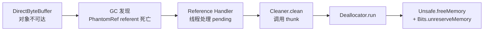

# 42.NIO之ByteBuffer与堆外内存

#### 目录介绍
- [1. 案例引入](#1-案例引入)
  - [1.1 一段反常代码](#11-一段反常代码)
  - [1.2 顺藤摸到根因](#12-顺藤摸到根因)
  - [1.3 我们要回答什么](#13-我们要回答什么)
- [2. 架构概览](#2-架构概览)
  - [2.1 三大子模块](#21-三大子模块)
  - [2.2 为什么这么切](#22-为什么这么切)
- [3. 状态机四指针](#3-状态机四指针)
  - [3.1 四个核心指针](#31-四个核心指针)
  - [3.2 三大不变式](#32-三大不变式)
  - [3.3 flip切换读写](#33-flip切换读写)
  - [3.4 compact残料压缩](#34-compact残料压缩)
  - [3.5 rewind与clear](#35-rewind与clear)
- [4. Heap与Direct双形态](#4-heap与direct双形态)
  - [4.1 类继承全景图](#41-类继承全景图)
  - [4.2 HeapByteBuffer结构](#42-heapbytebuffer结构)
  - [4.3 DirectByteBuffer结构](#43-directbytebuffer结构)
  - [4.4 IOUtil的临时拷贝](#44-ioutil的临时拷贝)
  - [4.5 临时缓冲区池](#45-临时缓冲区池)
- [5. 堆外内存分配](#5-堆外内存分配)
  - [5.1 Unsafe的allocateMemory](#51-unsafe的allocatememory)
  - [5.2 Bits全局账簿](#52-bits全局账簿)
  - [5.3 MaxDirectMemorySize限额](#53-maxdirectmemorysize限额)
  - [5.4 触发SystemGC回退](#54-触发systemgc回退)
- [6. 堆外回收链路](#6-堆外回收链路)
  - [6.1 Cleaner幻引用机制](#61-cleaner幻引用机制)
  - [6.2 Deallocator回收任务](#62-deallocator回收任务)
  - [6.3 JDK9前后的Cleaner](#63-jdk9前后的cleaner)
  - [6.4 引用处理器线程](#64-引用处理器线程)
- [7. 堆外泄漏排查](#7-堆外泄漏排查)
  - [7.1 四大泄漏现场](#71-四大泄漏现场)
  - [7.2 NMT原生跟踪](#72-nmt原生跟踪)
  - [7.3 BufferPoolMXBean读数](#73-bufferpoolmxbean读数)
  - [7.4 jcmd与pmap实战](#74-jcmd与pmap实战)
  - [7.5 容器场景的坑](#75-容器场景的坑)
- [8. 零拷贝家族](#8-零拷贝家族)
  - [8.1 mmap内存映射](#81-mmap内存映射)
  - [8.2 sendfile文件传输](#82-sendfile文件传输)
  - [8.3 splice管道拷贝](#83-splice管道拷贝)
  - [8.4 三者对应的Java API](#84-三者对应的java-api)
- [9. Netty为何自造ByteBuf](#9-netty为何自造bytebuf)
  - [9.1 ByteBuffer五大短板](#91-bytebuffer五大短板)
  - [9.2 双指针读写分离](#92-双指针读写分离)
  - [9.3 引用计数与池化](#93-引用计数与池化)
  - [9.4 CompositeByteBuf零拷贝](#94-compositebytebuf零拷贝)
- [10. 综合案例串讲](#10-综合案例串讲)
  - [10.1 案例真相揭晓](#101-案例真相揭晓)
  - [10.2 一个Buffer的一生](#102-一个buffer的一生)
  - [10.3 设计哲学回扣](#103-设计哲学回扣)
  - [10.4 速查表](#104-速查表)


## 1. 案例引入

### 1.1 一段反常代码

我们在做一个网关项目，转发后端 HTTP 响应。压测时一切正常，但跑到第 8 个小时，容器被 K8s 以 OOMKilled 杀掉。诡异的是 `-Xmx2g`，而容器 limit 是 `4g`，从堆视角看离 OOM 还远得很。

```java
// 简化后的转发核心代码
public void forward(SocketChannel down, ByteBuffer src) throws IOException {
    // src 是 HeapByteBuffer，业务层从字符串编码而来
    while (src.hasRemaining()) {
        down.write(src);  // 大量业务线程调用，QPS 8k
    }
}

// 启动参数
// -Xms2g -Xmx2g -XX:+UseG1GC -XX:MaxMetaspaceSize=512m
// 没有显式设置 -XX:MaxDirectMemorySize
```

我们 dump 了堆，堆用得不到 800MB，元空间 200MB，加起来不过 1GB。但 `pmap -x <pid>` 发现 RSS 已经 3.8GB，多出来的 2.8GB 不知道躲在哪。

### 1.2 顺藤摸到根因

执行 `jcmd <pid> VM.native_memory summary`（提前加了 `-XX:NativeMemoryTracking=detail`），看到 `Internal` 区域占用 2.6GB。再用 `BufferPoolMXBean` 读 `direct` 池：

```java
ManagementFactory.getPlatformMXBeans(BufferPoolMXBean.class).forEach(p ->
    System.out.printf("%s count=%d used=%d capacity=%d%n",
            p.getName(), p.getCount(), p.getMemoryUsed(), p.getTotalCapacity()));
// direct count=2,418,663 used=2,789,103,616 capacity=2,789,103,616
```

direct 池 240 万个对象、2.6GB——这数字不可能是业务直接分配的。我们没写一行 `ByteBuffer.allocateDirect`，凭空多出来的 DirectByteBuffer 是哪儿来的？

### 1.3 我们要回答什么

这个事故把我们逼到了 ByteBuffer 的腹地，必须回答：

1. **HeapByteBuffer 写到 Channel，明明是堆内字节，为什么会扯出 DirectByteBuffer？**
2. **没设 `-XX:MaxDirectMemorySize`，堆外内存的上限到底是多少？**
3. **DirectByteBuffer 的内存什么时候释放？是 GC 回收吗？回收链路上谁是关键？**
4. **为什么 240 万个 DirectByteBuffer 没有被及时回收？是什么阻断了回收？**
5. **堆外泄漏在 NMT、pmap、jcmd、BufferPoolMXBean 这几个工具里分别长什么样？**
6. **既然 DirectByteBuffer 这么坑，Netty 的 ByteBuf 到底改进了什么？**

带着这 6 个疑问进入正文。


## 2. 架构概览

### 2.1 三大子模块

ByteBuffer 看似一个类，实则横跨**三层架构**：

```
┌────────────────────────────────────────────────────────┐
│ 用户态视图：Buffer 抽象 + 状态机                        │
│   position / limit / capacity / mark + flip/compact    │
└────────────────────────────────────────────────────────┘
                          │
        ┌─────────────────┴─────────────────┐
        ▼                                   ▼
┌──────────────────┐             ┌──────────────────────┐
│ HeapByteBuffer   │             │ DirectByteBuffer     │
│   byte[] hb      │             │   long address       │
│   GC 管理         │             │   Unsafe 管理        │
└──────────────────┘             └──────────────────────┘
                                          │
                                          ▼
                                ┌──────────────────────┐
                                │ Cleaner + Bits 账簿   │
                                │ MaxDirectMemorySize   │
                                └──────────────────────┘
```

- **状态机层**：`Buffer` 抽象类持有四个 int 指针，定义读写位置语义
- **存储层**：HeapByteBuffer 用 `byte[]`，DirectByteBuffer 用 native 内存
- **回收层**：DirectByteBuffer 走 Cleaner + PhantomReference，不在 GC 直接掌管的领地内

### 2.2 为什么这么切

**疑惑**：为什么 NIO 不直接用 byte[] 解决一切？

**论证**：
1. **系统调用要求连续内存**。`read/write` 系统调用需要传一段连续物理地址给内核，而 byte[] 在堆里可能被 GC 移动（G1/CMS 都会移动对象），地址不稳定
2. **GC 不能 pin 内存到内核的 IO 期间**。如果非要用 byte[]，需要在 IO 期间禁止移动，会卡住 GC
3. **拷贝代价高于"借一块堆外"**。直接在堆外开一块永远不动的内存，让内核读写，比每次 IO 都暂停 GC 划算得多

**结论**：DirectByteBuffer 不是为了"快"，而是为了**让 GC 和系统调用解耦**。HeapByteBuffer 是用户友好的接口，DirectByteBuffer 是内核友好的接口，二者通过 IOUtil 桥接。


## 3. 状态机四指针

### 3.1 四个核心指针

`java.nio.Buffer` 的四个 int 字段，是整个 NIO 的灵魂：

| 指针 | 含义 | 范围 |
|---|---|---|
| `mark` | 标记点（书签） | -1 表示未设 |
| `position` | 当前读/写位置 | `0 ≤ position ≤ limit` |
| `limit` | 读/写上界 | `0 ≤ limit ≤ capacity` |
| `capacity` | 容量（不变） | 创建时确定 |

```
        ┌─────────────────────────────────────────┐
        │  0      mark   position   limit  capacity│
        │  │       │        │         │        │  │
        ▼  ▼       ▼        ▼         ▼        ▼  ▼
        ├───────────────────────────────────────────┤
buffer  │ A B C D │ E F G H │ I J K L M │ . . . . . │
        ├───────────────────────────────────────────┤
                  └─已读─┘  └─待读/待写─┘  └─空闲─┘
```

### 3.2 三大不变式

源码 `Buffer` 类构造函数明确写死的约束：

```java
// java.nio.Buffer
Buffer(int mark, int pos, int lim, int cap, int elementSizeShift) {
    if (cap < 0) throw new IllegalArgumentException("Negative capacity: " + cap);
    this.capacity = cap;
    limit(lim);     // 内部会校验 lim ≤ cap
    position(pos);  // 内部会校验 pos ≤ lim
    if (mark >= 0) {
        if (mark > pos) throw new IllegalArgumentException(...);
        this.mark = mark;
    }
}
```

不变式（任何时刻必须成立）：

```
0 ≤ mark ≤ position ≤ limit ≤ capacity
```

**疑惑**：为什么要四个指针，不能两个搞定？

**论证**：
1. 单一指针只能描述"读到哪"或"写到哪"，无法表达"已写多少 + 当前读到哪"
2. 两个指针（pos + cap）对读写共用，每次切换状态需要外部记录长度
3. 四指针 + flip 操作把"模式切换"封装在 Buffer 内部，调用方无需自己记账
4. mark 单独抽出来，是为了支持 reset 语义（解析协议时回退）

**结论**：四指针是把"模式 + 状态 + 书签"三件事压缩到一个对象里的最小完备表达。

### 3.3 flip切换读写

写完之后要读，必须调 `flip()`：

```java
// java.nio.Buffer.flip()
public Buffer flip() {
    limit = position;   // limit 移到刚写到的位置
    position = 0;       // position 归零，从头读
    mark = -1;          // 丢弃书签
    return this;
}
```

图示：

```
flip 之前（写模式）：
  ├──写入数据──┤      （空闲）
  0          position              capacity=limit

flip 之后（读模式）：
  ├──待读数据──┤      （空闲，但 limit 挡住）
  0          limit                 capacity
position=0
```

**疑惑**：为什么不用两套 API（writePos/readPos）而要 flip？

**论证**：写和读对底层数组操作完全相同，区别只在"边界在哪"。flip 通过移动 limit 把边界从"容量上限"切换为"已写入量"，无需再开一套字段，省一半内存且 API 对称。

### 3.4 compact残料压缩

读完一半的 Buffer 想继续接收新数据，需要 `compact`：

```java
// java.nio.HeapByteBuffer.compact() （DirectByteBuffer 类似）
public ByteBuffer compact() {
    System.arraycopy(hb, ix(position()), hb, ix(0), remaining());
    position(remaining());  // position 移到残料末尾
    limit(capacity());      // limit 拉回容量
    mark = -1;
    return this;
}
```

```
compact 之前（读模式）：
  ├─已读─┤├─未读─┤
         pos    limit

compact 之后（写模式）：
  ├─未读─┤              ├─空闲─┤
        pos             limit=capacity
        ↑
        新数据从这里写入
```

`compact` 是 TCP 拆包的核心套路：解析掉一个完整包后，把残料挪到头部，让 Channel 继续往后写。

### 3.5 rewind与clear

四件套小结：

| 方法 | 作用 | 典型场景 |
|---|---|---|
| `flip()` | limit=pos, pos=0 | 写完准备读 |
| `compact()` | 拷贝残料到头部 | 读了一半还要继续接收 |
| `rewind()` | pos=0, limit 不变 | 重读一遍 |
| `clear()` | pos=0, limit=cap | 完全重置回写模式 |

**注意**：`clear()` 不擦数据，只重置指针——老数据还在，新写入会覆盖。这一点常被误用。


## 4. Heap与Direct双形态

### 4.1 类继承全景图

```
                Buffer（abstract）
                   │
                ByteBuffer
                   │
        ┌──────────┼──────────────────────┐
        │          │                      │
HeapByteBuffer  MappedByteBuffer    DirectByteBuffer
        │          │                      │
   byte[] hb     mmap 区             long address
                                          │
                                  Cleaner + PhantomRef
```

### 4.2 HeapByteBuffer结构

```java
// java.nio.HeapByteBuffer
class HeapByteBuffer extends ByteBuffer {
    HeapByteBuffer(int cap, int lim) {
        super(-1, 0, lim, cap, new byte[cap], 0);  // 关键：new byte[cap]
    }
    public byte get() { return hb[ix(nextGetIndex())]; }
    public ByteBuffer put(byte x) { hb[ix(nextPutIndex())] = x; return this; }
}
```

底层就是普通 `byte[]`，归 GC 管。优点是分配/回收都极快（TLAB 分配 + GC 自动回收），缺点是地址会移动，IO 时必须临时拷贝。

### 4.3 DirectByteBuffer结构

```java
// java.nio.DirectByteBuffer
class DirectByteBuffer extends MappedByteBuffer {
    long address;       // 堆外内存起始地址（关键字段，继承自 Buffer）
    Cleaner cleaner;    // 回收钩子

    DirectByteBuffer(int cap) {
        super(-1, 0, cap, cap);
        boolean pa = VM.isDirectMemoryPageAligned();
        int ps = Bits.pageSize();
        long size = Math.max(1L, (long)cap + (pa ? ps : 0));
        Bits.reserveMemory(size, cap);   // ① 全局账簿预留
        long base;
        try {
            base = unsafe.allocateMemory(size);   // ② 真正分配堆外
        } catch (OutOfMemoryError x) {
            Bits.unreserveMemory(size, cap);
            throw x;
        }
        unsafe.setMemory(base, size, (byte) 0);
        address = base;
        cleaner = Cleaner.create(this, new Deallocator(base, size, cap));  // ③ 注册回收钩子
        att = null;
    }
}
```

三步骤：**预留 → 分配 → 挂回收钩子**。

### 4.4 IOUtil的临时拷贝

回到第 1 章疑问 ①：HeapByteBuffer 写到 Channel 为什么会扯出 DirectByteBuffer？看源码：

```java
// sun.nio.ch.IOUtil.write(...)
static int write(FileDescriptor fd, ByteBuffer src, ...) throws IOException {
    if (src instanceof DirectBuffer)
        return writeFromNativeBuffer(fd, src, ...);   // 直接写

    // src 是 HeapByteBuffer
    int pos = src.position();
    int lim = src.limit();
    int rem = (pos <= lim ? lim - pos : 0);

    ByteBuffer bb = Util.getTemporaryDirectBuffer(rem);  // ★ 临时申请一块堆外
    try {
        bb.put(src);   // 把堆内数据拷到堆外
        bb.flip();
        src.position(pos);
        int n = writeFromNativeBuffer(fd, bb, ...);
        if (n > 0) src.position(pos + n);
        return n;
    } finally {
        Util.offerFirstTemporaryDirectBuffer(bb);   // 归还到 ThreadLocal 池
    }
}
```

**结论**：HeapByteBuffer 走系统调用前，JDK **强制**把数据拷到一块临时 DirectBuffer，因为内核需要稳定地址。这就是案例里 240 万 DirectBuffer 的来源——业务层每次 write 都触发临时分配。

### 4.5 临时缓冲区池

JDK 试图缓解这个开销：

```java
// sun.nio.ch.Util
private static ThreadLocal<BufferCache> bufferCache = new ThreadLocal<>();

static ByteBuffer getTemporaryDirectBuffer(int size) {
    if (isBufferTooLarge(size)) {
        return ByteBuffer.allocateDirect(size);  // 太大不缓存
    }
    BufferCache cache = bufferCache.get();
    ByteBuffer buf;
    if (cache != null && (buf = cache.get(size)) != null) {
        return buf;          // 命中缓存
    }
    if (cache == null) {
        cache = new BufferCache();
        bufferCache.set(cache);
    }
    return ByteBuffer.allocateDirect(size);   // 未命中
}
```

**坑点**：`bufferCache` 是 `ThreadLocal`，每个线程一份。Tomcat、Netty、自定义线程池里有多少线程，最多就缓存多少倍。Tomcat 默认 200 工作线程 × 3 个槽 × 平均 64KB ≈ **38MB 堆外**起步，且永不回收。

回到案例：业务用了一个 `Executors.newCachedThreadPool()`，瞬时高峰创建了上万临时线程，每个线程的 ThreadLocal 都被植入了 DirectBuffer，线程死了但 ThreadLocal 的 Entry 因为没被清理而泄漏 —— 这是泄漏的**第一只手**。


## 5. 堆外内存分配

### 5.1 Unsafe的allocateMemory

```java
// sun.misc.Unsafe（OpenJDK 实现委托给 os::malloc）
public native long allocateMemory(long bytes);
public native void freeMemory(long address);
public native void setMemory(long address, long bytes, byte value);
```

这就是简化版的 `malloc/free`，绕过 GC，直接调 glibc。返回值是一个 long 型地址，就是 `DirectByteBuffer.address` 字段的来源。

### 5.2 Bits全局账簿

JVM 不能让用户无限分配堆外内存，否则物理内存秒被吃光。`java.nio.Bits` 维护一本全局账簿：

```java
// java.nio.Bits
private static final AtomicLong reservedMemory = new AtomicLong();   // 实际占用
private static final AtomicLong totalCapacity = new AtomicLong();    // 用户视角容量
private static final AtomicLong count = new AtomicLong();            // DirectBuffer 个数

static void reserveMemory(long size, long cap) {
    if (!memoryLimitSet) {
        maxMemory = VM.maxDirectMemory();   // 读 -XX:MaxDirectMemorySize
        memoryLimitSet = true;
    }
    if (tryReserveMemory(size, cap)) return;

    // 第一次失败：触发 Reference Handler 处理积压的 PhantomReference
    final JavaLangRefAccess jlra = SharedSecrets.getJavaLangRefAccess();
    while (jlra.tryHandlePendingReference()) {
        if (tryReserveMemory(size, cap)) return;
    }

    // 第二次失败：兜底 System.gc()
    System.gc();    // ★ 关键
    ...
    throw new OutOfMemoryError("Direct buffer memory");
}
```

### 5.3 MaxDirectMemorySize限额

回到第 1 章疑问 ②：没设 `-XX:MaxDirectMemorySize` 时上限是多少？

```java
// jdk.internal.misc.VM.maxDirectMemory()
private static long directMemory = 0L;
public static long maxDirectMemory() { return directMemory; }

// 初始化时（VM.initializeFromArchive 里读取）
String s = (String) props.get("sun.nio.MaxDirectMemorySize");
if (s == null || s.isEmpty() || s.equals("-1")) {
    directMemory = Runtime.getRuntime().maxMemory();   // 等于 -Xmx
} else {
    long l = Long.parseLong(s);
    if (l > -1) directMemory = l;
}
```

**结论**：未显式设置时，**堆外上限默认等于 `-Xmx`**。案例里 `-Xmx2g` ⇒ 堆外也允许 2GB，加上堆内 2GB，已经逼近容器 4GB 上限——这是事故的**第二只手**。

### 5.4 触发SystemGC回退

`reserveMemory` 失败时调 `System.gc()`，这是 NIO 的兜底机制：让 Full GC 顺便清理 PhantomReference 队列里的 DirectBuffer。但有两个陷阱：

1. **`-XX:+DisableExplicitGC` 会让 `System.gc()` 变空操作**——堆外回收彻底失灵
2. **`-XX:+ExplicitGCInvokesConcurrent` 也救不了**：CMS/G1 的并发 GC 不会立即处理 PhantomRef

很多调优文章建议关掉 `System.gc()`，对纯堆内服务可以，对 NIO 服务**就是埋雷**。


## 6. 堆外回收链路

### 6.1 Cleaner幻引用机制

DirectByteBuffer 不能用 finalize（性能差且不可靠），用的是 PhantomReference 子类 `Cleaner`：

```java
// jdk.internal.ref.Cleaner
public class Cleaner extends PhantomReference<Object> {
    private static final ReferenceQueue<Object> dummyQueue = new ReferenceQueue<>();
    private final Runnable thunk;

    public static Cleaner create(Object referent, Runnable thunk) {
        if (thunk == null) return null;
        return add(new Cleaner(referent, thunk));
    }

    public void clean() {
        if (!remove(this)) return;
        try {
            thunk.run();    // ★ 真正释放堆外
        } catch (final Throwable x) { ... }
    }
}
```

幻引用的特点：referent 不可达时**不会**被自动 enqueue 到 ReferenceQueue 让用户感知，而是由 Reference Handler 线程在处理时调用其 `clean()` 方法（JDK 内部对 Cleaner 类型做了特殊处理）。

### 6.2 Deallocator回收任务

`thunk` 是这个：

```java
// java.nio.DirectByteBuffer.Deallocator
private static class Deallocator implements Runnable {
    private long address;
    private long size;
    private int capacity;

    public void run() {
        if (address == 0) return;
        unsafe.freeMemory(address);     // ① 真正 free
        address = 0;
        Bits.unreserveMemory(size, capacity);  // ② 销账
    }
}
```

完整链路：



### 6.3 JDK9前后的Cleaner

| 版本 | 包路径 | 反射访问 |
|---|---|---|
| JDK 8 | `sun.misc.Cleaner` | 反射可达，Netty 直接调 `cleaner().clean()` |
| JDK 9+ | `jdk.internal.ref.Cleaner` | 模块化封装，需要 `--add-opens` |

JDK 9 后官方推荐 `java.lang.ref.Cleaner`（公共 API），但 `DirectByteBuffer` 内部仍然用 `jdk.internal.ref.Cleaner` 以兼容旧代码。

Netty 兼容代码（`PlatformDependent0`）：

```java
// 简化逻辑
Object cleaner = directBufferConstructor.invoke(buffer);
Method cleanMethod = cleaner.getClass().getMethod("clean");
cleanMethod.invoke(cleaner);  // 主动释放，不等 GC
```

### 6.4 引用处理器线程

```bash
$ jstack <pid> | grep -i "Reference Handler"
"Reference Handler" #2 daemon prio=10 os_prio=31 cpu=0.85ms tid=0x...
   java.lang.Thread.State: RUNNABLE
   ...
```

这是一个 JVM 内置守护线程，**优先级 10**（最高）。但它的工作量是 O(n) 的：积压的 PhantomReference 越多，单次处理越久。如果业务每秒分配 1 万个 DirectBuffer，Reference Handler 处理速度跟不上，就会积压——这是泄漏的**第三只手**。


## 7. 堆外泄漏排查

### 7.1 四大泄漏现场

| 现场 | 触发条件 | 排查工具 |
|---|---|---|
| ThreadLocal 临时池囤积 | 大量短命线程 | jstack 看线程数 + jmap 看 ThreadLocalMap |
| 业务层 allocateDirect 漏 close | 没用 try-with-resources | NMT detail diff |
| Cleaner 慢于分配 | 高并发 IO | jstack 看 ReferenceHandler 是否 RUNNABLE 长时间 |
| `-XX:+DisableExplicitGC` | 配置错误 | jinfo -flag 检查 |

### 7.2 NMT原生跟踪

```bash
# 启动加参数
-XX:NativeMemoryTracking=detail

# 运行时打基线
$ jcmd <pid> VM.native_memory baseline

# 一段时间后比较
$ jcmd <pid> VM.native_memory summary.diff
Total: reserved=4096MB +600MB, committed=3800MB +600MB
- Java Heap (reserved=2048MB)
- Internal (reserved=1200MB +600MB committed)   ← 关注 Internal
- Class (reserved=200MB)
...
```

`Internal` 区主要包含 DirectByteBuffer。`+600MB` 就是泄漏的增量。

### 7.3 BufferPoolMXBean读数

代码层面快速观察：

```java
import java.lang.management.BufferPoolMXBean;
import java.lang.management.ManagementFactory;

ScheduledExecutorService s = Executors.newSingleThreadScheduledExecutor();
s.scheduleAtFixedRate(() -> {
    ManagementFactory.getPlatformMXBeans(BufferPoolMXBean.class).forEach(p ->
        System.out.printf("[%s] count=%d used=%dMB%n",
            p.getName(), p.getCount(), p.getMemoryUsed() / 1024 / 1024));
}, 0, 10, TimeUnit.SECONDS);
```

输出：
```
[direct] count=2418663 used=2659MB     ← 不正常
[mapped] count=12 used=8MB
```

### 7.4 jcmd与pmap实战

```bash
# 看 Java 视角
$ jcmd <pid> VM.system_properties | grep -i direct
$ jcmd <pid> GC.run                        # 主动触发，验证回收能力

# 看 OS 视角
$ pmap -x <pid> | sort -k3 -n -r | head -20
# 找出最大的几个 anon 段，对比 NMT detail 里的地址区间
```

### 7.5 容器场景的坑

容器（Docker/K8s）下 `Runtime.maxMemory()` 在老 JDK 里可能读宿主机内存。JDK 10+ 的 `+UseContainerSupport` 修了这个 bug。事故的最终修复方案：

```bash
# 修复参数（叠加四件套）
-Xmx2g
-XX:MaxDirectMemorySize=512m              # ★ 显式上限
-XX:NativeMemoryTracking=summary
-XX:+UnlockDiagnosticVMOptions
-XX:+PrintNMTStatistics
# 删除：-XX:+DisableExplicitGC（如果有的话）

# 业务层：限制临时线程数，改用固定线程池
ExecutorService pool = Executors.newFixedThreadPool(64);  // 替代 cachedThreadPool
```


## 8. 零拷贝家族

### 8.1 mmap内存映射

```java
FileChannel fc = FileChannel.open(path);
MappedByteBuffer mbb = fc.map(MapMode.READ_ONLY, 0, fc.size());
// 后续读 mbb 就像读普通内存，OS 自动按需 page in
```

**原理**：`mmap` 把文件映射到进程虚拟地址空间，省掉一次"内核 page cache → 用户缓冲区"的拷贝。

适用：**大文件随机读**、文件作为共享内存。

### 8.2 sendfile文件传输

```java
FileChannel src = ...;
SocketChannel dst = ...;
src.transferTo(0, src.size(), dst);   // ← 底层 sendfile
```

**原理**：`sendfile` 让数据**完全不经过用户态**，从磁盘 page cache 直接搬到网卡缓冲区。

```
传统 4 次拷贝：磁盘 → 内核缓冲 → 用户缓冲 → socket 缓冲 → 网卡
sendfile：    磁盘 → 内核缓冲 ──────────────→ socket 缓冲 → 网卡
```

适用：**静态资源服务**（Nginx 默认开启，Kafka 消费拉日志）。

### 8.3 splice管道拷贝

`splice` 比 `sendfile` 更通用：任意两个 fd 间通过管道做零拷贝。Java 没直接 API，但 Linux 下 `transferTo` 在某些 fd 组合上会自动选用 splice。

### 8.4 三者对应的Java API

| 系统调用 | Java API | 典型场景 |
|---|---|---|
| `mmap` | `FileChannel.map()` | 随机读大文件 |
| `sendfile` | `FileChannel.transferTo()` | 文件 → Socket |
| `splice` | （间接，由 JVM 决定） | Socket ↔ Socket |


## 9. Netty为何自造ByteBuf

### 9.1 ByteBuffer五大短板

回到第 1 章疑问 ⑥：

| 短板 | 痛点 |
|---|---|
| 单指针 + flip 强制切换 | 写读不能交叉，每次切换易错 |
| 不支持池化 | 高并发下分配/释放压力大 |
| 不支持引用计数 | 共享时谁释放说不清 |
| 不支持容量自动扩展 | 写满即抛 BufferOverflowException |
| 拼接需要拷贝 | 多 Buffer 合并必须 copy |

### 9.2 双指针读写分离

```
ByteBuf 内存视图：
 ┌──────────┬──────────────┬───────────┐
 │ 已废弃区  │  可读区       │  可写区    │
 └──────────┴──────────────┴───────────┘
 0    readerIndex    writerIndex   capacity
```

读写指针独立，无需 flip。

### 9.3 引用计数与池化

```java
ByteBuf buf = ByteBufAllocator.DEFAULT.directBuffer(1024);
buf.retain();           // 引用计数 +1
try {
    process(buf);
} finally {
    buf.release();      // 引用计数 -1，归 0 时归还到池或 free
}
```

PooledByteBufAllocator 仿 jemalloc 设计：PoolArena → PoolChunk(Buddy) → PoolSubpage(Slab)，详见 43 篇。

### 9.4 CompositeByteBuf零拷贝

合并两个 ByteBuf 不需要拷贝：

```java
CompositeByteBuf composite = ByteBufAllocator.DEFAULT.compositeBuffer();
composite.addComponents(true, header, body);
// composite 内部记录 [header, body] 两个组件的偏移量
// 读取时透明跨组件
```

Header + Body 拼装、HTTP 分块响应，全靠它把"逻辑连续 + 物理分散"做合一。


## 10. 综合案例串讲

### 10.1 案例真相揭晓

回到第 1 章 6 个疑问，逐条作答：

| # | 疑问 | 答案 |
|---|---|---|
| ① | HeapByteBuffer 写 Channel 为何扯出 DirectBuffer？ | `IOUtil.write` 必须把堆内数据拷到临时 DirectBuffer，因为内核需要稳定地址（§4.4） |
| ② | 没设 MaxDirectMemorySize 上限是多少？ | 默认等于 `-Xmx`，案例里 2GB——加上堆内 2GB 已逼近容器 4GB（§5.3） |
| ③ | DirectBuffer 内存什么时候释放？ | DirectBuffer 对象不可达 → Reference Handler 触发 Cleaner.clean → Deallocator.run → Unsafe.freeMemory（§6.2） |
| ④ | 240 万个 DirectBuffer 为什么没被回收？ | `Util.bufferCache` 是 ThreadLocal，cachedThreadPool 创建的临时线程死亡前 DirectBuffer 被强引用囤积（§4.5）；Reference Handler 处理速度跟不上分配（§6.4） |
| ⑤ | 各工具长什么样？ | NMT `Internal` 增长、`BufferPoolMXBean.direct` 计数飙、pmap 看到 RSS 远超堆（§7） |
| ⑥ | Netty ByteBuf 改了什么？ | 双指针、引用计数、池化、自动扩展、CompositeByteBuf 零拷贝（§9） |

### 10.2 一个Buffer的一生

跟着 `ByteBuffer.allocate(1024).put(data).flip()` 然后 `channel.write(buf)` 走一遍：

```mermaid
flowchart TD
    A[ByteBuffer.allocate 1024] --> B[new HeapByteBuffer<br/>byte[1024] 在 Eden 分配]
    B --> C[put 写数据<br/>position 推进]
    C --> D[flip<br/>limit=pos, pos=0]
    D --> E[channel.write 调用]
    E --> F{src 是 Direct?}
    F -->|否| G[IOUtil 找 ThreadLocal<br/>临时 DirectBuffer]
    G --> H{有缓存?}
    H -->|否| I[new DirectByteBuffer<br/>Bits.reserveMemory<br/>Unsafe.allocateMemory<br/>Cleaner.create]
    H -->|是| J[复用]
    I --> K[bb.put src 拷贝]
    J --> K
    K --> L[写入 fd<br/>系统调用]
    L --> M[归还 DirectBuffer<br/>到 ThreadLocal]
    M --> N[线程死亡或<br/>GC 才会真释放]
```

整条链路上，HeapByteBuffer 的生命由 GC 管，DirectByteBuffer 的生命由 Cleaner 管，但 Cleaner 触发时机依赖 GC——这是堆外内存"不在堆里却仍受 GC 影响"的本质。

### 10.3 设计哲学回扣

1. **内存即合约**：四指针不变式 `0 ≤ mark ≤ pos ≤ limit ≤ cap` 是用户与 Buffer 之间的契约，违反就抛异常——比"程序员自觉"可靠 10 倍
2. **堆内堆外是机制不是好坏**：堆内 GC 友好，堆外内核友好，IOUtil 的临时拷贝是它们之间的桥，**不是 bug 是 feature**
3. **回收链路要有兜底**：Cleaner 是主路径，`System.gc()` 是兜底——任何"关掉 SystemGC"的优化都要先验证不影响堆外
4. **观测先于优化**：堆外泄漏没有"堆 dump"这么直观的工具，必须 NMT + BufferPoolMXBean + pmap 三方对账，少一个角度就可能找错地方

### 10.4 速查表

| 维度 | 速查 |
|---|---|
| 默认堆外上限 | 等于 `-Xmx`（未设 `-XX:MaxDirectMemorySize` 时） |
| 回收触发 | DirectBuffer 不可达 + GC + Reference Handler |
| 立即释放 | `((DirectBuffer)buf).cleaner().clean()`（需反射） |
| 排查工具 | NMT `Internal`、BufferPoolMXBean、pmap、jcmd |
| 危险参数 | `-XX:+DisableExplicitGC` 会让堆外 OOM |
| flip vs clear | flip 切读，clear 重置回写（不擦数据） |
| compact 时机 | TCP 拆包后留残料 |
| Netty 改进 | 双指针、引用计数、池化、自动扩、Composite |

下一篇我们顺着"堆外内存 + 池化 + 引用计数"这条线，进入 43 篇《Netty 核心架构剖析》——看 Netty 如何把这些原料组合成工业级网络框架。
