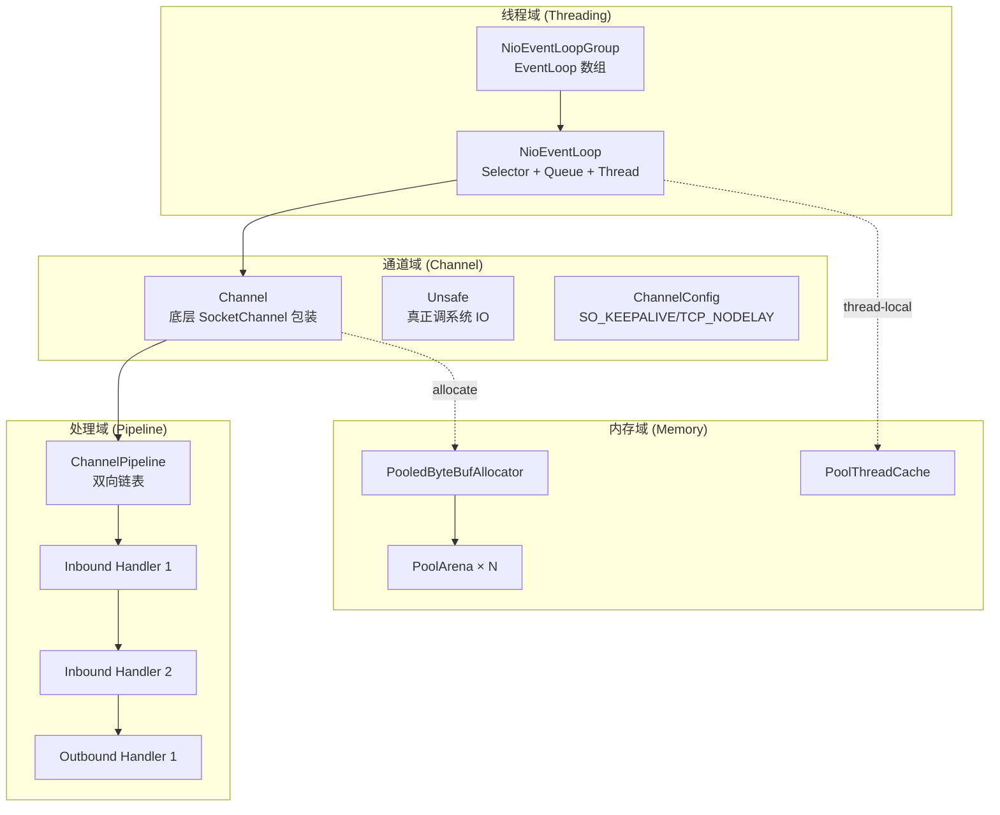

# 43.Netty核心架构剖析

#### 目录介绍
- [43.1 开篇：为什么所有高性能 Java 服务器最后都长成 Netty 的样子](#431-开篇为什么所有高性能-java-服务器最后都长成-netty-的样子)
- [43.2 整体架构：三大核心域 + 两条主线](#432-整体架构三大核心域--两条主线)
- [43.3 EventLoop 线程模型：单线程串行的胜利](#433-eventloop-线程模型单线程串行的胜利)
  - [43.3.1 NioEventLoop = Selector + Queue + Thread 三位一体](#4331-nioeventloop--selector--queue--thread-三位一体)
  - [43.3.2 run() 主循环：50/50 时间均衡策略](#4332-run-主循环5050-时间均衡策略)
  - [43.3.3 inEventLoop() 与任务转交](#4333-ineventloop-与任务转交)
  - [43.3.4 主从 Reactor：bossGroup vs workerGroup](#4334-主从-reactorbossgroup-vs-workergroup)
- [43.4 Bootstrap / ServerBootstrap 启动流程](#434-bootstrap--serverbootstrap-启动流程)
  - [43.4.1 服务端启动 9 步走](#4341-服务端启动-9-步走)
  - [43.4.2 ServerBootstrapAcceptor：连接如何被甩到 worker](#4342-serverbootstrapacceptor连接如何被甩到-worker)
- [43.5 Pipeline 双向链表 + ChannelHandler 责任链](#435-pipeline-双向链表--channelhandler-责任链)
  - [43.5.1 ChannelPipeline 数据结构](#4351-channelpipeline-数据结构)
  - [43.5.2 Inbound vs Outbound 传播方向](#4352-inbound-vs-outbound-传播方向)
  - [43.5.3 与 Servlet Filter / AOP 拦截器的同构性](#4353-与-servlet-filter--aop-拦截器的同构性)
- [43.6 ByteBuf：对 JDK ByteBuffer 的全面重写](#436-bytebuf对-jdk-bytebuffer-的全面重写)
  - [43.6.1 reader/writer 双指针 + 三段式内存视图](#4361-readerwriter-双指针--三段式内存视图)
  - [43.6.2 引用计数 ReferenceCounted](#4362-引用计数-referencecounted)
  - [43.6.3 CompositeByteBuf：零拷贝拼装](#4363-compositebytebuf零拷贝拼装)
- [43.7 PooledByteBufAllocator：jemalloc 风格内存池](#437-pooledbytebufallocatorjemalloc-风格内存池)
  - [43.7.1 PoolArena 三级架构](#4371-poolarena-三级架构)
  - [43.7.2 PoolChunk：Buddy 算法管 16MB 大块](#4372-poolchunkbuddy-算法管-16mb-大块)
  - [43.7.3 PoolSubpage：Slab 算法管小内存](#4373-poolsubpageslab-算法管小内存)
  - [43.7.4 PoolThreadCache：99% 命中率的秘密](#4374-poolthreadcache99-命中率的秘密)
- [43.8 FastThreadLocal 为什么比 JDK 快 3x](#438-fastthreadlocal-为什么比-jdk-快-3x)
- [43.9 编解码器：LengthFieldBasedFrameDecoder 拆包黑魔法](#439-编解码器lengthfieldbasedframedecoder-拆包黑魔法)
- [43.10 Netty 在 Loom 时代为什么不会过时](#4310-netty-在-loom-时代为什么不会过时)
- [43.11 实战 6 条死规矩](#4311-实战-6-条死规矩)
- [43.12 灵魂三问 & 速查表 & 下一篇预告](#4312-灵魂三问--速查表--下一篇预告)

---

## 43.1 开篇：为什么所有高性能 Java 服务器最后都长成 Netty 的样子

数一下你日常用到的 Java 中间件——
- **gRPC-Java**：底层 Netty
- **Spring WebFlux + Reactor Netty**：底层 Netty
- **Dubbo**（默认通信层）：底层 Netty
- **RocketMQ Remoting**：底层 Netty
- **Elasticsearch Transport（旧版）**：底层 Netty
- **Cassandra Native Protocol**：底层 Netty
- **Apache Pulsar / ShardingSphere / Skywalking Agent**：底层 Netty

**为什么不直接用 JDK NIO**？11 篇就有人会问这个问题——把 NIO 三大件拼起来不就是网络框架吗？

11 篇结尾的伏笔在这一篇揭开。一个工业级网络框架要解决的**真问题**有 8 个，JDK NIO 只解决了第 1 个：

| # | 问题 | JDK NIO | Netty |
|---|---|---|---|
| 1 | 多路复用 IO 模型 | ✅ Selector | ✅ |
| 2 | epoll 空轮询 bug 规避 | ❌ JVM 经典 bug | ✅ 重建 Selector |
| 3 | 线程模型（Reactor 模式） | ❌ 自己写 | ✅ 主从 Reactor |
| 4 | 编解码 + 拆包粘包 | ❌ 自己写 | ✅ 30+ 现成 codec |
| 5 | ByteBuffer 易用性（要 flip） | ❌ 反人类 | ✅ ByteBuf 双指针 |
| 6 | 内存池化 | ❌ ThreadLocal 临时 DB | ✅ PoolArena (jemalloc) |
| 7 | 堆外内存泄漏检测 | ❌ 全靠 NMT | ✅ ResourceLeakDetector |
| 8 | 跨 OS 一致性（Linux/Mac/Win） | ⚠️ 行为差异 | ✅ 抽象 Channel |

**Netty = NIO 的工业化封装 + 工程经验 + jemalloc 移植**——这 3 件事任何一件都能写一年。

> 这一篇要解决的核心问题：
> - **EventLoop 怎么实现"单线程串行"还能高吞吐**？
> - **Pipeline 双向链表怎么传播 inbound / outbound 事件**？
> - **PooledByteBufAllocator 为什么内存命中率能到 99%**？
> - **Netty 在虚拟线程时代会被取代吗**？

42 篇把 NIO Buffer 钻到了 native 层；43 篇承接它——把所有要素**装配成可工业生产的框架**。

---

## 43.2 整体架构：三大核心域 + 两条主线



**两条主线贯穿整个 Netty**：

1. **数据流主线**：`Selector 就绪 → EventLoop 读取 → ByteBuf → Pipeline 入站 → 业务处理 → Pipeline 出站 → ByteBuf → write 系统调用`
2. **生命周期主线**：`Bootstrap 配置 → bind/connect → Channel 注册到 EventLoop → 触发 ChannelInitializer → 业务运行 → close → 注销`

记住这两条线，看 Netty 源码就不会迷路。

---

## 43.3 EventLoop 线程模型：单线程串行的胜利

### 43.3.1 NioEventLoop = Selector + Queue + Thread 三位一体

```java
// io.netty.channel.nio.NioEventLoop（精简）
public final class NioEventLoop extends SingleThreadEventLoop {
    private Selector selector;                              // ① JDK 多路复用器
    private final Queue<Runnable> taskQueue;                // ② 普通任务队列
    private final Queue<ScheduledFutureTask<?>> scheduledTaskQueue;  // ③ 定时任务队列
    private volatile Thread thread;                         // ④ 唯一绑定的 OS 线程
    private final SelectStrategy selectStrategy;            // ⑤ 是 select 还是跑任务的策略
    
    @Override
    protected void run() {
        for (;;) {
            // 主循环 —— 见 §43.3.2
        }
    }
}
```

**核心设计哲学**：**一个 EventLoop = 一个 Thread + 一个 Selector + 一个 TaskQueue，绑定后不变**。

这意味着：
- 注册到这个 EventLoop 的所有 Channel 的 IO 事件，**永远由这个唯一线程处理**；
- Channel 上的所有业务回调（Handler 方法）也由这个唯一线程执行；
- **同一 Channel 内部完全串行 → 无锁、无 race、无并发问题**。

回想 39 篇讲的**无锁化设计**——Disruptor 用单生产单消费的 RingBuffer 避锁，Netty 用单线程串行避锁，**思想完全相同：把并发问题局限在线程间通信，而不是数据结构内部**。

### 43.3.2 run() 主循环：50/50 时间均衡策略

`NioEventLoop.run()` 的核心循环（精简版）：

```java
@Override
protected void run() {
    int selectCnt = 0;
    for (;;) {
        try {
            // ① 决策：是 select 还是直接跑任务？
            int strategy = selectStrategy.calculateStrategy(
                selectNowSupplier, hasTasks());
            
            switch (strategy) {
                case SelectStrategy.CONTINUE:
                    continue;
                case SelectStrategy.BUSY_WAIT:
                case SelectStrategy.SELECT:
                    long curDeadlineNanos = nextScheduledTaskDeadlineNanos();
                    strategy = select(curDeadlineNanos);                  // ② JDK select 阻塞
                    selectCnt++;
                    if (unexpectedSelectorWakeup(selectCnt)) {            // ★ epoll 空轮询检测
                        selectCnt = 0;
                    }
                    // fall through
                default:
            }
            
            // ③ 处理 IO 事件
            final long ioStartTime = System.nanoTime();
            final int ioRatio = this.ioRatio;                              // 默认 50
            boolean ranTasks;
            if (ioRatio == 100) {
                processSelectedKeys();                                     // 全部时间给 IO
                ranTasks = runAllTasks();
            } else {
                processSelectedKeys();
                final long ioTime = System.nanoTime() - ioStartTime;       // ★ 测算 IO 耗时
                // 任务最多花 ioTime * (100 - ioRatio) / ioRatio
                ranTasks = runAllTasks(ioTime * (100 - ioRatio) / ioRatio);
            }
        } catch (Throwable t) {
            handleLoopException(t);
        }
    }
}
```

**3 个核心机制**：

#### ① ioRatio：IO 与 task 的时间分配（默认 50:50）
- IO 事件刚处理完，记录用时 `ioTime`；
- 给 taskQueue 的预算 = `ioTime * (100 - ioRatio) / ioRatio`；
- 默认 ioRatio=50 → IO 和 task 五五开，**没有任何一边能饿死另一边**；
- 业务回调多（如频繁 fireChannelRead）调低 ioRatio；纯 IO 转发场景调高。

#### ② Selector 空轮询 bug 规避（**JVM 经典 bug**）
JDK epoll 实现存在 bug：在没有 IO 事件时，`select(timeout)` 也会立即返回 0——空轮询导致 CPU 100%。Netty 的对策：

```java
// SELECTOR_AUTO_REBUILD_THRESHOLD 默认 512
private boolean unexpectedSelectorWakeup(int selectCnt) {
    if (selectCnt >= SELECTOR_AUTO_REBUILD_THRESHOLD) {
        rebuildSelector();                              // ★ 重建 Selector
        return true;
    }
    return false;
}

public void rebuildSelector() {
    final Selector oldSelector = selector;
    final Selector newSelector = openSelector();
    // 把所有 Channel 从 oldSelector 迁移到 newSelector
    for (SelectionKey key : oldSelector.keys()) {
        Object a = key.attachment();
        int ops = key.interestOps();
        key.cancel();
        SelectionKey newKey = ((SelectableChannel) key.channel())
            .register(newSelector, ops, a);
        if (a instanceof AbstractNioChannel) {
            ((AbstractNioChannel) a).selectionKey = newKey;
        }
    }
    selector = newSelector;
    oldSelector.close();
}
```

**这是 Netty 在工程上完爆裸用 NIO 的最经典案例**——512 次空轮询就重建一次 Selector，自动愈合 JVM bug。

#### ③ 任务的 3 类来源
EventLoop 处理的任务来自 3 个地方：
- `taskQueue` —— `eventLoop.execute(Runnable)` 提交的；
- `scheduledTaskQueue` —— `eventLoop.schedule(...)` 提交的延时任务；
- `tailTasks` —— 每次 IO 处理结束后必跑的尾部任务（如 release 钩子）。

### 43.3.3 inEventLoop() 与任务转交

Netty 所有"我是不是在 EventLoop 线程"的检查都靠这一个方法：

```java
public boolean inEventLoop() {
    return inEventLoop(Thread.currentThread());
}

public boolean inEventLoop(Thread thread) {
    return thread == this.thread;
}
```

**关键 API 都基于这个判断**：

```java
// ChannelOutboundBuffer.addMessage 的简化版
public void writeAndFlush(Object msg) {
    if (eventLoop().inEventLoop()) {
        // ✅ 已在 EventLoop 线程 —— 直接执行（无锁）
        write0(msg);
        flush0();
    } else {
        // ⚠ 不在 EventLoop 线程 —— 包装成任务放队列
        eventLoop().execute(() -> {
            write0(msg);
            flush0();
        });
    }
}
```

**这就是 Netty "线程模型自我维护" 的核心**——任意线程调 `channel.writeAndFlush(...)` 都能正确执行，但**真实操作都被转交回该 Channel 绑定的 EventLoop 线程**。业务代码不需要任何同步语义。

> 对照 23 篇 ConcurrentHashMap 的"分段锁"思路——Netty 是更激进的"按 Channel 隔离"：每个 Channel 都只在唯一线程上跑，**锁都不需要了**。

### 43.3.4 主从 Reactor：bossGroup vs workerGroup

```java
EventLoopGroup bossGroup = new NioEventLoopGroup(1);          // ★ 通常 1 个
EventLoopGroup workerGroup = new NioEventLoopGroup();          // ★ 默认 CPU × 2

ServerBootstrap b = new ServerBootstrap();
b.group(bossGroup, workerGroup)
 .channel(NioServerSocketChannel.class)
 .childHandler(new ChannelInitializer<SocketChannel>() {
     protected void initChannel(SocketChannel ch) {
         ch.pipeline().addLast(new HttpServerCodec());
         ch.pipeline().addLast(new BusinessHandler());
     }
 });
```

**主从 Reactor 模型**：

```
                ┌──────────────────────┐
                │ bossGroup (1 thread) │   ← 主 Reactor
                │  ┌──────────────┐    │
                │  │ NioEventLoop │    │   只处理 ServerSocketChannel
                │  └──────┬───────┘    │   接受新连接（accept）
                └─────────┼────────────┘
                          │
                  accept(SocketChannel)
                          │
                ┌─────────▼────────────┐
                │ workerGroup (CPU×2)  │   ← 从 Reactor
                │  ┌──────┬──────┬───┐ │
                │  │ EL1  │ EL2  │…  │ │   每个新连接被分配到一个 EL
                │  └──┬───┴──┬───┴─┬─┘ │   该 EL 处理这个连接的所有 read/write
                └─────┼──────┼─────┼───┘
                      │      │     │
                      ▼      ▼     ▼
                  Channel1 Channel2 ... ChannelN
```

**为什么 boss 通常 1 个就够**？因为 `accept` 是极快的轻量操作（毫秒级数千次）；workerGroup 才是真正干活的——每个 worker 通常负责数千 Channel。

---

## 43.4 Bootstrap / ServerBootstrap 启动流程

### 43.4.1 服务端启动 9 步走

```
[1] new NioEventLoopGroup() 
        │  → 创建 N 个 NioEventLoop（每个含 Selector + 未启动的 Thread）
        ▼
[2] b.channel(NioServerSocketChannel.class)
        │  → 通过反射准备 ServerSocketChannel 工厂
        ▼
[3] b.childHandler(new ChannelInitializer<>() {...})
        │  → 注册"新连接到来时如何初始化 Pipeline"
        ▼
[4] b.bind(8080)
        │  → AbstractBootstrap.doBind
        ▼
[5] initAndRegister()
        │  ├─ channelFactory.newChannel()        ← 反射创建 NioServerSocketChannel
        │  ├─ init(channel)                      ← 配置 + 加 ServerBootstrapAcceptor
        │  └─ config().group().register(channel) ← 注册到 bossGroup 中某个 EL
        ▼
[6] EL 启动线程，调 channel.unsafe().register0()
        │  → JDK serverChannel.register(selector, 0, this)
        ▼
[7] doBind0()
        │  → channel.bind(localAddress) → JDK serverChannel.bind()
        ▼
[8] pipeline.fireChannelActive()
        │  → 改 interestOps |= OP_ACCEPT
        ▼
[9] EL 主循环开始 select → 收到 OP_ACCEPT 就 accept 新连接
        → 把新连接交给 ServerBootstrapAcceptor 转发到 workerGroup
```

### 43.4.2 ServerBootstrapAcceptor：连接如何被甩到 worker

`ServerBootstrap.init` 的关键代码：

```java
@Override
void init(Channel channel) {
    // ...
    p.addLast(new ChannelInitializer<Channel>() {
        @Override
        public void initChannel(final Channel ch) {
            final ChannelPipeline pipeline = ch.pipeline();
            ChannelHandler handler = config.handler();
            if (handler != null) pipeline.addLast(handler);
            
            ch.eventLoop().execute(() -> {
                pipeline.addLast(new ServerBootstrapAcceptor(    // ★ 关键
                    ch, currentChildGroup, currentChildHandler,
                    currentChildOptions, currentChildAttrs));
            });
        }
    });
}

// ServerBootstrapAcceptor 是个 ChannelInboundHandler
private static class ServerBootstrapAcceptor extends ChannelInboundHandlerAdapter {
    @Override
    public void channelRead(ChannelHandlerContext ctx, Object msg) {
        final Channel child = (Channel) msg;             // accept 出来的 SocketChannel
        
        child.pipeline().addLast(childHandler);          // ① 装上 childHandler
        setChannelOptions(child, childOptions, logger);  // ② 套用 childOption
        
        try {
            childGroup.register(child).addListener(future -> {  // ③ 注册到 worker
                if (!future.isSuccess()) {
                    forceClose(child, future.cause());
                }
            });
        } catch (Throwable t) {
            forceClose(child, t);
        }
    }
}
```

**ServerBootstrapAcceptor 是连接 boss 和 worker 的"中转站"**——本质就是个 `ChannelInboundHandler`，每来一个新连接就：
1. 给新 Channel 的 Pipeline 装 `childHandler`；
2. 应用 `childOption`（如 `TCP_NODELAY`、`SO_KEEPALIVE`）；
3. 把这个 Channel 注册到 `workerGroup`——从此被某个 worker EventLoop 接管。

**整个机制都用 Pipeline + Handler 实现**——Netty 的"自洽"美学。

---

## 43.5 Pipeline 双向链表 + ChannelHandler 责任链

### 43.5.1 ChannelPipeline 数据结构

每个 Channel 有且仅有一个 Pipeline：

```java
public class DefaultChannelPipeline implements ChannelPipeline {
    final AbstractChannelHandlerContext head;   // ★ 头哨兵节点
    final AbstractChannelHandlerContext tail;   // ★ 尾哨兵节点
    
    protected DefaultChannelPipeline(Channel channel) {
        // ...
        tail = new TailContext(this);
        head = new HeadContext(this);
        head.next = tail;
        tail.prev = head;
    }
}
```

**双向链表 + 哨兵节点**——和 LinkedList 同款数据结构：

```
HEAD ⇄ Handler1 ⇄ Handler2 ⇄ Handler3 ⇄ ... ⇄ TAIL
```

每个节点是 `AbstractChannelHandlerContext`——不是 Handler 本身，而是 Handler 的"上下文壳"，持有：
- 链表前后指针 `prev` / `next`；
- 包裹的 Handler 引用；
- 关联的 EventLoop 和 Channel；
- 当前 Handler 的执行状态。

### 43.5.2 Inbound vs Outbound 传播方向

ChannelHandler 分两大类：

```java
// 入站：响应外部事件（数据到达、连接建立...）
public interface ChannelInboundHandler extends ChannelHandler {
    void channelActive(ChannelHandlerContext ctx);
    void channelRead(ChannelHandlerContext ctx, Object msg);
    void channelReadComplete(ChannelHandlerContext ctx);
    void exceptionCaught(ChannelHandlerContext ctx, Throwable cause);
    // ...
}

// 出站：响应主动操作（写数据、关闭连接...）
public interface ChannelOutboundHandler extends ChannelHandler {
    void write(ChannelHandlerContext ctx, Object msg, ChannelPromise promise);
    void flush(ChannelHandlerContext ctx);
    void close(ChannelHandlerContext ctx, ChannelPromise promise);
    // ...
}
```

**关键规则**：

```
┌─────────────────────────────────────────────────────────┐
│  Inbound 事件（如 channelRead）：从 head → tail 传播     │
│                                                          │
│   socket → HEAD → Decoder → BizHandler → TAIL           │
│            ↓        ↓          ↓                         │
│            (跳过 OutboundHandler)                        │
│                                                          │
│  Outbound 事件（如 write）：从 tail → head 传播          │
│                                                          │
│   biz.write() → BizHandler → Encoder → HEAD → socket    │
│                     ↑           ↑                        │
│                     (跳过 InboundHandler)                │
└─────────────────────────────────────────────────────────┘
```

**典型 HTTP Server 的 Pipeline**：

```
HEAD
  ↓
HttpServerCodec        (既是 Inbound 解码器又是 Outbound 编码器)
  ↓
HttpObjectAggregator   (Inbound：把 chunked 合成完整 FullHttpRequest)
  ↓
ChunkedWriteHandler    (Outbound：大文件分块写)
  ↓
BusinessHandler        (Inbound：处理业务)
  ↓
TAIL
```

**入站方向**：socket 收到字节 → HttpServerCodec 解析成 HttpRequest → Aggregator 聚合 → BusinessHandler.channelRead 执行业务。

**出站方向**：BusinessHandler 调 ctx.writeAndFlush(response) → ChunkedWriteHandler 分块 → HttpServerCodec 编码 → HEAD 写到 socket。

### 43.5.3 与 Servlet Filter / AOP 拦截器的同构性

34 篇讲过 AOP 三种实现，最后落到 Spring AOP 的**拦截器责任链**模型——这里再次重现：

| 框架 | 链结构 | 调用方式 | 终止 |
|---|---|---|---|
| **Servlet Filter** | 数组 | `chain.doFilter(req, resp)` 主动传播 | Servlet 处理完返回 |
| **Spring AOP MethodInterceptor** | 数组 | `invocation.proceed()` 主动传播 | 目标方法执行 |
| **Netty Pipeline** | 双向链表 | `ctx.fireChannelRead(msg)` 主动传播 | TAIL 节点（默认释放消息） |
| **OkHttp Interceptor** | 数组 | `chain.proceed(request)` 主动传播 | 网络层 |
| **MyBatis Plugin** | 数组 | `invocation.proceed()` 主动传播 | Executor/StatementHandler 真实执行 |

**5 个框架同构：链表/数组 + 显式 fire/proceed + 任意位置短路**——这是责任链 + 拦截器的标准范式。

> 16 篇结尾埋的"机制策略分离"伏笔在这里再次重现：**Pipeline 是机制（怎么传播）**，**Handler 是策略（具体处理什么）**——和 36 篇 AQS（机制） vs Lock（策略）完全同构。

---

## 43.6 ByteBuf：对 JDK ByteBuffer 的全面重写

42 篇 §42.9 给了对照表，这里钻细节。

### 43.6.1 reader/writer 双指针 + 三段式内存视图

```java
public abstract class ByteBuf {
    public abstract int readerIndex();     // 读位置
    public abstract int writerIndex();     // 写位置
    public abstract int capacity();        // 当前容量（可扩）
    public abstract int maxCapacity();     // 最大容量
    // ...
}
```

**读写两个指针完全分离**——再也不用 flip：

```
   ┌──────────┬──────────┬──────────┐
   │ 已读区   │ 可读区   │ 可写区   │
   │(可丢弃)  │(reader→  │(writer→  │
   │          │ writer)  │ capacity)│
   └──────────┴──────────┴──────────┘
   0          readerIdx  writerIdx  capacity
   
   discardReadBytes()  → 把已读区扔掉，可读区前移
   readBytes / readInt → readerIdx 前进
   writeBytes/writeInt → writerIdx 前进
```

**用法对照**（呼应 42 篇 §42.9）：

```java
// JDK ByteBuffer
buf.put(data1);                  // 写
buf.flip();                      // ★ 必须翻转
int n = buf.get();               // 读
buf.compact();                   // ★ 必须 compact
buf.put(data2);                  // 继续写

// Netty ByteBuf
buf.writeBytes(data1);           // 写
int n = buf.readByte();          // 读（不影响 writer）
buf.writeBytes(data2);           // 继续写
buf.discardReadBytes();          // 想回收已读区 → 显式调
```

### 43.6.2 引用计数 ReferenceCounted

42 篇 §42.6.4 已经讲过 ByteBuf 漏 release 的灾难，这里看实现：

```java
public interface ReferenceCounted {
    int refCnt();
    ReferenceCounted retain();          // refCnt++
    ReferenceCounted retain(int incr);
    boolean release();                  // refCnt-- ; refCnt==0 时回收
    boolean release(int decr);
}

// AbstractReferenceCountedByteBuf 用 Unsafe + AtomicIntegerFieldUpdater 实现
private static final long REFCNT_FIELD_OFFSET = ...;
private volatile int refCnt = 1;

@Override
public boolean release() {
    return handleRelease(updater().release(this));
}
```

**为什么不像 JDK 一样靠 GC + Cleaner**？42 篇讲了：DirectByteBuffer 的释放依赖 Full GC——**包装对象太小不容易触发**。Netty 走相反路线——**把生命周期交给开发者显式管理**：

```java
ByteBuf buf = ctx.alloc().buffer(1024);
try {
    process(buf);
} finally {
    buf.release();              // ★ 必须释放
}
```

**一个常见的甩锅模式**——`SimpleChannelInboundHandler`：

```java
public class MyHandler extends SimpleChannelInboundHandler<HttpRequest> {
    @Override
    protected void channelRead0(ChannelHandlerContext ctx, HttpRequest msg) {
        // 只管业务，不用 release —— 父类自动调
    }
}

// 父类源码
@Override
public void channelRead(ChannelHandlerContext ctx, Object msg) {
    boolean release = true;
    try {
        if (acceptInboundMessage(msg)) {
            channelRead0(ctx, (I) msg);
        } else {
            release = false;
            ctx.fireChannelRead(msg);
        }
    } finally {
        if (autoRelease && release) {
            ReferenceCountUtil.release(msg);     // ★ 自动释放
        }
    }
}
```

**生产建议**：业务 Handler 都继承 `SimpleChannelInboundHandler`——只要不调用 `retain()` 增引用，就不会泄漏。

### 43.6.3 CompositeByteBuf：零拷贝拼装

```java
ByteBuf header = ctx.alloc().buffer(20);
ByteBuf body = ctx.alloc().buffer(1024);
// 填充 header 和 body...

// ❌ 笨办法：拷贝
ByteBuf merged = ctx.alloc().buffer(1044);
merged.writeBytes(header);
merged.writeBytes(body);

// ✅ 零拷贝：组合视图
CompositeByteBuf composite = ctx.alloc().compositeBuffer();
composite.addComponents(true, header, body);    // true = 自动调整 writerIndex
ctx.writeAndFlush(composite);                   // 可以当成普通 ByteBuf 用
```

**底层**：`CompositeByteBuf` 维护一个 `Component[]` 数组——`readByte` 时按数组+偏移定位，看起来像一块连续内存，**实际从不拷贝**。

**应用场景**：HTTP 头 + body / RPC 协议头 + payload / 分片接收的 TCP 报文重组。

---

## 43.7 PooledByteBufAllocator：jemalloc 风格内存池

42 篇 §42.6.4 / §42.9 都提到 Netty 内存池——这里彻底拆解。

设计目标 3 条：
1. **频繁分配/释放不抖动**——避免每次都 `malloc` / `free`；
2. **多线程低竞争**——分散到多个 Arena；
3. **大小内存分级**——小内存块用 Slab、大块用 Buddy。

直接看 jemalloc。

### 43.7.1 PoolArena 三级架构

```
PooledByteBufAllocator
  │
  ├─ PoolArena[0]              ← Arena 数组（分散竞争，默认 = CPU × 2）
  │    │
  │    ├─ PoolChunkList(qInit, q000, q025, q050, q075, q100)
  │    │    │
  │    │    └─ PoolChunk        ← 单块 16MB（Buddy 算法）
  │    │         │
  │    │         └─ PoolSubpage ← 单页 8KB 切小块（Slab 算法）
  │    │
  │    ├─ PoolSubpage[]         ← tinySubpagePools / smallSubpagePools
  │    
  ├─ PoolArena[1]
  │    ...
  │
  └─ PoolThreadCache (per Thread/EventLoop)
        ├─ tinySubPageCaches[]
        ├─ smallSubPageCaches[]
        └─ normalCaches[]
```

**3 个分散竞争的设计**：
- **Arena 维度**：N 个 Arena 平行存在，每个线程绑定到一个 Arena（轮询）；
- **Chunk 维度**：每个 Arena 内多个 Chunk，按使用率分桶（qInit/q000/.../q100）；
- **线程维度**：PoolThreadCache 命中后**完全不进 Arena**——99% 的分配在线程本地完成。

### 43.7.2 PoolChunk：Buddy 算法管 16MB 大块

PoolChunk 是 Netty 内存池**最大粒度的管理单位**——默认 16MB（2048 个 8KB 页）。

```java
final class PoolChunk<T> {
    final PoolArena<T> arena;
    final T memory;                         // 真正的 ByteBuffer.allocateDirect(16MB)
    private final byte[] memoryMap;         // ★ 完全二叉树，2049 个节点
    private final byte[] depthMap;          // 节点对应深度
    private final int chunkSize = 16 * 1024 * 1024;
    private final int pageSize = 8192;
    private final int maxOrder = 11;        // 树深 11
    // ...
}
```

**完全二叉树管理**——每个节点代表一段连续内存：

```
          深度 0 ─ 16MB (1个节点)
              ├─ 8MB
              │   ├─ 4MB
              │   │   ├─ 2MB
              │   │   │   └─ ... 一直分到 8KB (2048 个叶子)
```

**分配 N KB**：找到一个能容纳的、最小的、未被占用的子树：
- 分配 16KB → 在深度 10（每节点 16KB）找一个空闲节点；
- 分配 256KB → 在深度 6 找一个空闲节点。

**memoryMap 数组**就是把这棵树**线性化**存储——`memoryMap[i]` 记录"以 i 为根的子树的最小可分配深度"，分配时一路二分查找：

```java
private int allocateRun(int normCapacity) {
    int d = maxOrder - (log2(normCapacity) - pageShifts);   // 算出该去哪一层
    int id = allocateNode(d);                               // 在这层找可用节点
    if (id < 0) return id;
    freeBytes -= runLength(id);
    return id;
}
```

**释放**：把节点状态恢复，并向上"合并 buddy"——和经典伙伴算法完全一致。

### 43.7.3 PoolSubpage：Slab 算法管小内存

8KB 整页对一个 32 字节的对象太浪费——所以 Netty 在 Page 内再切分：

```java
final class PoolSubpage<T> {
    final PoolChunk<T> chunk;
    int elemSize;                   // 每个小块大小（如 32 / 64 / 128 ...）
    private final long[] bitmap;    // ★ 位图，标记哪些小块被占
    PoolSubpage<T> next, prev;      // PoolSubpage 链表
    
    boolean allocate() {
        int bitmapIdx = getNextAvail();    // 找下一个空闲位
        bitmap[bitmapIdx >>> 6] |= 1L << (bitmapIdx & 63);
        return ...;
    }
}
```

**Slab 算法**：
- 一个 8KB Page 切成 N 个相同大小的小块（如 256 个 32 字节）；
- 用 `long[] bitmap` 位图标记每个小块的使用状态；
- 分配时找下一个空闲位 → 置位；释放时清位。

**分级表**（Netty 4.x）：

| 类别 | 大小范围 | 管理方式 |
|---|---|---|
| **tiny** | 0 ~ 512B | Slab 16 字节对齐 |
| **small** | 512B ~ 8KB | Slab 1024/2048/4096/8192 |
| **normal** | 8KB ~ 16MB | Buddy（PoolChunk 内分配） |
| **huge** | > 16MB | 不池化，直接 `Unsafe.allocateMemory` |

### 43.7.4 PoolThreadCache：99% 命中率的秘密

```java
final class PoolThreadCache {
    final PoolArena<byte[]> heapArena;
    final PoolArena<ByteBuffer> directArena;
    
    // ★ 三级缓存（每级是一个 MpscArrayQueue）
    private final MemoryRegionCache<byte[]>[] tinySubPageHeapCaches;       // 32 项
    private final MemoryRegionCache<byte[]>[] smallSubPageHeapCaches;      // 4 项
    private final MemoryRegionCache<byte[]>[] normalHeapCaches;            // 3 项
    private final MemoryRegionCache<ByteBuffer>[] tinySubPageDirectCaches;
    private final MemoryRegionCache<ByteBuffer>[] smallSubPageDirectCaches;
    private final MemoryRegionCache<ByteBuffer>[] normalDirectCaches;
    
    // 分配时优先从这里找，找不到再去 Arena
    boolean allocateTiny(PoolArena<?> area, PooledByteBuf<?> buf, int reqCap, int normCap) {
        return allocate(cacheForTiny(area, normCap), buf, reqCap);
    }
}
```

**线程本地缓存 + Arena 兜底**：

```
分配请求
   │
   ▼
[1] PoolThreadCache 命中？ ───YES──→ 直接返回（无锁，纳秒级）
   │ NO
   ▼
[2] PoolArena 加锁分配
   │
   ▼
[3] 走 Buddy / Slab 算法定位
```

**释放时也优先回到本地缓存**：
```java
@Override
protected void deallocate(PoolThreadCache cache, ...) {
    if (cache != null && cache.add(this, chunk, ..., normCapacity)) {
        return;                              // ✅ 进入线程本地缓存
    }
    arena.free(chunk, ...);                  // 兜底：回 Arena
}
```

**99% 命中率的来源**：同一个 EventLoop 反复在同一线程分配/释放小 ByteBuf——本地缓存已经备好了。**线程亲和性 + 内存亲和性双重命中**。

---

## 43.8 FastThreadLocal 为什么比 JDK 快 3x

`PoolThreadCache` 就是用 `FastThreadLocal` 持有的——这一节解释为什么不用 JDK 的。

JDK `ThreadLocal` 内部走 `ThreadLocalMap` —— **开放寻址哈希表**：

```java
// JDK ThreadLocal.get() 简化
public T get() {
    Thread t = Thread.currentThread();
    ThreadLocalMap map = getMap(t);                   // t.threadLocals
    if (map != null) {
        Entry e = map.getEntry(this);                 // ★ 哈希查找 + 线性探测
        if (e != null) return (T) e.value;
    }
    return setInitialValue();
}
```

每次 `get()`：
1. 算 `threadLocalHashCode`；
2. 哈希定位 + 线性探测；
3. 比较 `Entry.referent`；
4. 命中返回 value。

**Netty FastThreadLocal**：

```java
public final class FastThreadLocal<V> {
    private final int index;            // ★ 编译期确定的数组下标！
    
    public FastThreadLocal() {
        index = InternalThreadLocalMap.nextVariableIndex();
    }
    
    public final V get() {
        InternalThreadLocalMap threadLocalMap = InternalThreadLocalMap.get();
        Object v = threadLocalMap.indexedVariable(index);   // ★ 直接数组下标
        if (v != InternalThreadLocalMap.UNSET) return (V) v;
        return initialize(threadLocalMap);
    }
}
```

**核心优化**：
- 用**数组下标**代替哈希表——`O(1)` 定数 1 次内存访问；
- 没有哈希计算、没有线性探测、没有 Entry 比较；
- 实测在高频访问场景**比 JDK ThreadLocal 快 3 倍**。

**条件**：必须在 `FastThreadLocalThread`（Netty 的 Thread 子类）上才有效——Netty 的 EventLoop 默认就是 `FastThreadLocalThread`，所以无缝享受。

> 这是经典的"**用空间换时间**"——JDK ThreadLocal 的设计要适应任意线程，所以用哈希表；Netty 知道自己的线程是固定的 EventLoop，索性用数组。

---

## 43.9 编解码器：LengthFieldBasedFrameDecoder 拆包黑魔法

TCP 是流式协议——**没有"消息边界"概念**。直接读出来的数据可能：
- **粘包**：几个消息合在一个 read 里；
- **拆包**：一个消息分几次到达。

业务必须自己定边界。最常见的 3 种方案：
- **定长**：每条消息都 N 字节 → `FixedLengthFrameDecoder`；
- **分隔符**：以 `\r\n` 等结尾 → `DelimiterBasedFrameDecoder`；
- **长度前缀**：消息头里写 body 长度 → `LengthFieldBasedFrameDecoder` ✅ 工业标配

**Dubbo / RocketMQ / gRPC 的协议都是"长度前缀"**：

```
┌─────────┬──────────┬──────────────┐
│ Magic   │ Length   │   Payload    │
│ (2B)    │ (4B)     │   (Length B) │
└─────────┴──────────┴──────────────┘
```

`LengthFieldBasedFrameDecoder` 5 个参数搞定：

```java
public LengthFieldBasedFrameDecoder(
    int maxFrameLength,           // 最大允许长度（防 OOM）
    int lengthFieldOffset,        // length 字段的起始偏移
    int lengthFieldLength,        // length 字段占几个字节（1/2/3/4/8）
    int lengthAdjustment,         // length 字段记录的长度需要补偿的字节数
    int initialBytesToStrip       // 解码后跳过头部多少字节
);

// Dubbo 协议示例（魔数2B + flag 1B + status 1B + reqId 8B + length 4B + body）
new LengthFieldBasedFrameDecoder(
    16 * 1024 * 1024,    // 最大 16MB
    12,                   // length 字段在第 12 字节
    4,                    // length 占 4 字节
    0,                    // length 字段记录的就是 body 长度，无需补偿
    0                     // 不剥离头，让业务 Handler 自己读
);
```

**lengthAdjustment 详解**——最容易踩坑的参数：

```
情况 A：length 字段记录的 = 整个消息长度（含头）
   实际 body 长度 = length - headerSize
   lengthAdjustment = -headerSize    (负数补偿)

情况 B：length 字段记录的 = body 长度
   实际 body 长度 = length
   lengthAdjustment = 0

情况 C：length 后面还有几个字段才是真正的 body
   实际 body 长度 = length - 中间字段长度
   lengthAdjustment = 中间字段长度    (正数补偿)
```

**内部实现要点**——基于 `ByteToMessageDecoder`：

```java
// ByteToMessageDecoder（精简）
@Override
public void channelRead(ChannelHandlerContext ctx, Object msg) {
    if (msg instanceof ByteBuf) {
        ByteBuf data = (ByteBuf) msg;
        if (cumulation == null) {
            cumulation = data;
        } else {
            cumulation = cumulator.cumulate(ctx.alloc(), cumulation, data);  // ★ 累积
        }
        callDecode(ctx, cumulation, ...);                                    // ★ 尝试解码
    }
}
```

**累积器 cumulator 默认用 `MERGE_CUMULATOR`**——往 ByteBuf 后面 writeBytes；如果不够大就扩容。也可换成 `COMPOSITE_CUMULATOR`（CompositeByteBuf 拼装，零拷贝但访问慢）。

---

## 43.10 Netty 在 Loom 时代为什么不会过时

41 篇结尾的伏笔：**虚拟线程到来后 Netty 会被取代吗**？

来对比典型百万连接 echo server：

```java
// 方案 A：虚拟线程（每连接一线程的回归）
ServerSocket server = new ServerSocket(8080);
ExecutorService es = Executors.newVirtualThreadPerTaskExecutor();
while (true) {
    Socket socket = server.accept();                    // 阻塞 accept
    es.submit(() -> handle(socket));                    // 每连接一虚拟线程
}

// 方案 B：Netty
ServerBootstrap b = new ServerBootstrap();
b.group(boss, worker)
 .channel(NioServerSocketChannel.class)
 .childHandler(new ChannelInitializer<>() {
     protected void initChannel(SocketChannel ch) {
         ch.pipeline().addLast(new EchoHandler());
     }
 })
 .bind(8080);
```

**两者吞吐对比（百万空闲连接 + 偶发消息）**：

| 维度 | 虚拟线程 | Netty |
|---|---|---|
| 连接数上限 | 千万级（每个 ~2KB 栈） | 千万级（共享 Selector） |
| 编程模型 | 阻塞同步（直观） | 事件回调（陡峭） |
| GC 压力 | 高（VT 对象 + 栈帧捕获） | 低（对象池化） |
| 内存占用 | 高（每 VT 独立栈） | 极低（共享线程） |
| 协议解析 | 自己写 | 30+ 现成 codec |
| 内存池 | 无 | PoolArena |
| 业务延迟 | 调度可能 pin | 单线程串行可控 |
| 大规模优化经验 | 1-2 年 | 15+ 年 |

**Netty 不会过时的 3 个真正理由**：

#### ① codec 与协议生态是巨量沉淀
HTTP/1.1、HTTP/2、HTTP/3、WebSocket、MQTT、Redis、Memcached、SMTP、Stomp...... Netty 自带几十种成熟编解码器。重写一个 HTTP/2 codec 不是一年的活。

#### ② 内存池 + ByteBuf 仍是大杀器
虚拟线程能解决"连接数"问题，**解决不了"高频小对象 GC 压力"问题**。任何高 QPS 服务都需要 PooledByteBufAllocator 这类工具——VT 没有替代品。

#### ③ 编程模型可以折中
JEP 444 之后**完全可以在 Netty Handler 里用同步代码 + 虚拟线程**：

```java
// EventLoop 不再写阻塞代码 —— 转给虚拟线程池
private static final Executor VT_EXEC = 
    Executors.newVirtualThreadPerTaskExecutor();

public class BizHandler extends SimpleChannelInboundHandler<Request> {
    @Override
    protected void channelRead0(ChannelHandlerContext ctx, Request req) {
        VT_EXEC.execute(() -> {
            Response resp = blockingDbCall(req);     // ✅ 在 VT 里阻塞 OK
            ctx.executor().execute(() ->             // 转回 EventLoop 写
                ctx.writeAndFlush(resp));
        });
    }
}
```

**Netty 提供网络 IO + codec + 内存池**；**虚拟线程提供业务侧的同步编程模型**——**两者互补，不是替代**。

---

## 43.11 实战 6 条死规矩

1. **EventLoop 内禁止任何阻塞**——DB 查询、HTTP 调用、`Thread.sleep`、`synchronized` 锁等待全都不行；要阻塞就 `executor.execute()` 转给业务线程池/虚拟线程；
2. **业务 Handler 优先继承 `SimpleChannelInboundHandler`**——自动 release，不容易漏；
3. **`-Dio.netty.leakDetection.level` 至少开 ADVANCED**——开发期 PARANOID，生产 ADVANCED 采样 1%；
4. **bossGroup 通常 1 线程，workerGroup = CPU × 2**——别瞎开几百个 EventLoop；
5. **`-Dio.netty.allocator.numDirectArenas` 调到 CPU × 2**——避免 Arena 竞争；同时设 `-XX:MaxDirectMemorySize` 限制堆外（呼应 42 篇）；
6. **`writeAndFlush` 内部已自动转 EventLoop 线程**——不用手动 `ctx.executor().execute()`，但要注意：**返回的 ChannelFuture 是异步的**，加 `addListener` 不要阻塞等。

---

## 43.12 灵魂三问 & 速查表 & 下一篇预告

### 43.12.1 灵魂三问

1. **EventLoop 是单线程串行的，怎么还能高吞吐**？
   - 单个 EventLoop 服务**数千个 Channel**——每个 Channel 的 IO 都是非阻塞的纳秒级操作；
   - `select` 一次返回多个就绪 Key，批量处理；
   - ioRatio = 50 默认五五开 IO 和任务，谁都不会饿死；
   - 真正阻塞的业务（DB / RPC）转给业务线程池，**不污染 EventLoop**；
   - 多个 EventLoop（默认 CPU × 2）分担总负载——**单线程是局部的，整体是多核并行**。

2. **PoolThreadCache 怎么做到 99% 命中率**？
   - 同一个 EventLoop 在唯一线程上反复跑——**线程亲和性**（同样的 ByteBuf 大小请求会复用）；
   - 释放优先回本地缓存而不是 Arena——**热点对象保留在本地**；
   - tinySubPage / smallSubPage / normal 三级缓存覆盖 0 ~ 16MB 的全部档位；
   - Arena 锁只在跨线程 / 缓存未命中时才抢——**99% 时候根本不抢锁**。

3. **Netty 在虚拟线程到来后会被取代吗**？
   - 不会。VT 解决的是"连接数与编程模型"问题，**不解决** codec 生态、内存池、零拷贝、TCP 调优；
   - 反而 Netty + VT 是最佳组合：**EventLoop 跑 IO，VT 跑业务阻塞代码**；
   - 41 篇讲过 VT 在 IO 多路复用上仍依赖 NIO Selector——本质上 VT 内部就是 Reactor 模式的另一种封装；
   - 15 年的工程积累不会被 1-2 年新技术抹平。

### 43.12.2 速查表

| 想做的事 | API / 配置 |
|---|---|
| 创建主从 Reactor | `new NioEventLoopGroup(1)` / `new NioEventLoopGroup()` |
| 服务端启动 | `ServerBootstrap.group(boss, worker).channel().childHandler().bind()` |
| 装 Pipeline | `ch.pipeline().addLast(new MyHandler())` |
| 在 EventLoop 内执行 | `ctx.executor().execute(runnable)` |
| 入站事件传播 | `ctx.fireChannelRead(msg)` |
| 出站写回 | `ctx.writeAndFlush(msg)` |
| 申请池化 ByteBuf | `ctx.alloc().directBuffer(size)` |
| 零拷贝拼接 | `ctx.alloc().compositeBuffer().addComponents(...)` |
| 限制堆外（呼应 42 篇） | `-XX:MaxDirectMemorySize=512m` |
| 调整 Arena 数 | `-Dio.netty.allocator.numDirectArenas=16` |
| 开泄漏检测 | `-Dio.netty.leakDetection.level=ADVANCED` |
| 长度前缀拆包 | `new LengthFieldBasedFrameDecoder(max, off, len, adj, strip)` |
| 调整 IO/task 比例 | `loop.setIoRatio(70)` |

---

🎯 **下一篇预告：第 44 篇《序列化机制全景：JDK / JSON / Protobuf / Kryo》**——Netty 解决了"字节流如何传输"，下一篇解决"对象如何变成字节流"：从 JDK 原生 `Serializable` 的 5 大反模式（serialVersionUID 噩梦 / readObject 反序列化攻击 / 性能 10x 慢于 JSON）→ JSON 三大库对比（Jackson / FastJson2 / Gson）+ FastJson1 著名漏洞复盘 → **Protobuf** TLV 编码 + varint 变长整数 + Schema-first 设计哲学 → **Kryo** 高性能 Java 友好序列化（Dubbo 默认）→ Avro / Thrift / FlatBuffers / MessagePack 横向对比 → **反序列化攻击 9 大经典 CVE**（Log4j2 / Apache Commons Collections / Fastjson autoType）→ **如何选**（数据持久化 / 跨语言 RPC / 缓存 / 配置 4 大场景决策树）+ **零拷贝序列化新趋势**（Cap'n Proto / FlatBuffers）。**序列化一次讲透。**

---

## 📚 延伸阅读

- 11 篇《IO 模型演进：BIO 到 NIO 到 AIO》—— Reactor 模式概念铺垫
- 16 篇《OOM 八大现场》—— Direct buffer / Netty leak 实战
- 17 篇《JVM 参数调优全景图》—— `-XX:MaxDirectMemorySize` 与容器配额
- 24 篇《Object 通用方法的契约》—— Cleaner 替代 finalize
- 34 篇《AOP 三种实现路线对比》—— 责任链 + 拦截器与 Pipeline 同构
- 41 篇《虚拟线程 Loom 与结构化并发》—— Netty + VT 组合的可能性
- 42 篇《NIO 之 ByteBuffer 与堆外内存》—— ByteBuffer / DirectByteBuffer 底层
- 《Netty 实战》Norman Maurer —— Netty 最权威读物
- 《Netty in Action》英文原版章节注释更详尽
- jemalloc 论文《A Scalable Concurrent malloc Implementation》—— PoolArena 设计源头
- 美团技术团队《Netty 堆外内存泄漏排查盛宴》技术文章
- LMAX Disruptor 论文 —— 单线程串行设计哲学的另一个典范
