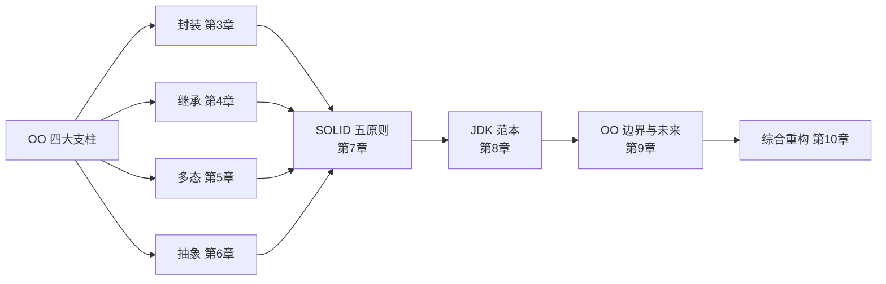
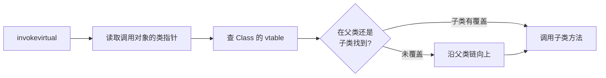
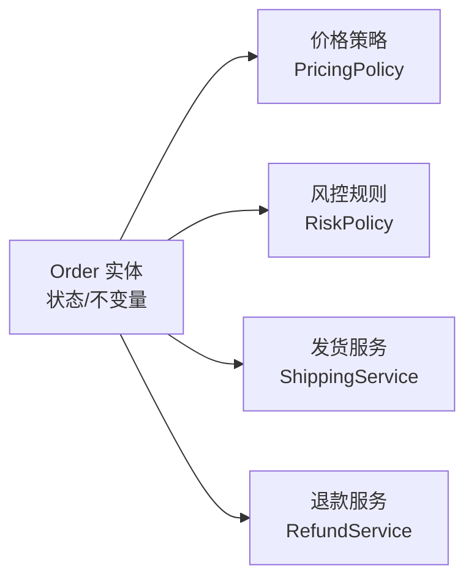
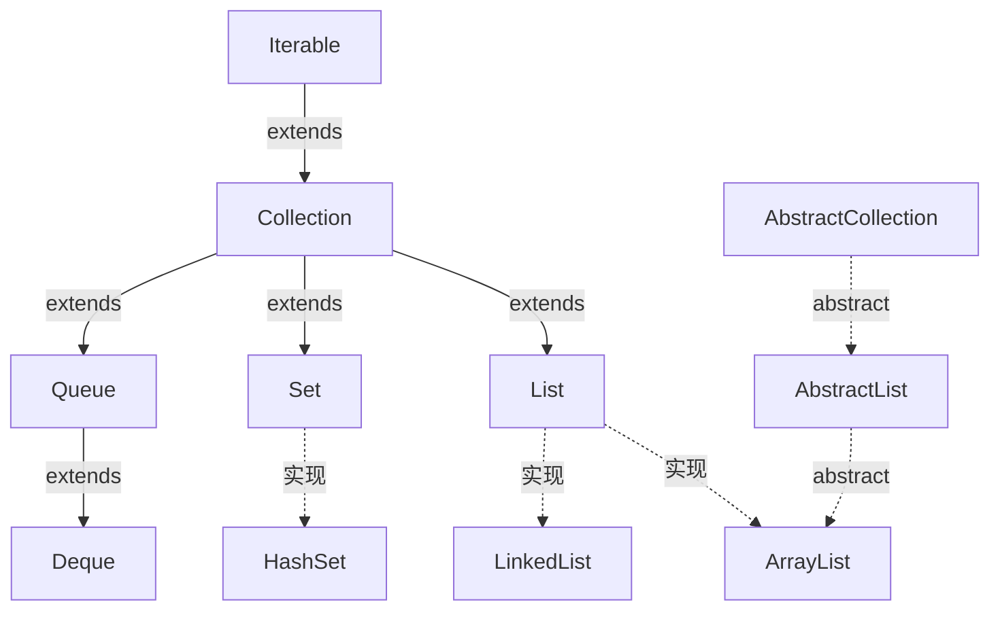

# 48.面向对象的真意

#### 目录介绍
- [1. 案例引入](#1-案例引入)
  - [1.1 一段真实代码](#11-一段真实代码)
  - [1.2 顺藤摸到根因](#12-顺藤摸到根因)
  - [1.3 我们要回答什么](#13-我们要回答什么)
- [2. 架构概览](#2-架构概览)
  - [2.1 OO的四大支柱](#21-oo的四大支柱)
  - [2.2 为什么这么切](#22-为什么这么切)
- [3. 封装的本质](#3-封装的本质)
  - [3.1 不是getter和setter](#31-不是getter和setter)
  - [3.2 表征与行为](#32-表征与行为)
  - [3.3 不变量保护](#33-不变量保护)
  - [3.4 JDK中的封装范本](#34-jdk中的封装范本)
- [4. 继承的代价](#4-继承的代价)
  - [4.1 实现继承的脆弱](#41-实现继承的脆弱)
  - [4.2 LSP里氏替换](#42-lsp里氏替换)
  - [4.3 组合优于继承](#43-组合优于继承)
  - [4.4 JDK的反例与正例](#44-jdk的反例与正例)
- [5. 多态的两条腿](#5-多态的两条腿)
  - [5.1 子类型多态](#51-子类型多态)
  - [5.2 参数化多态](#52-参数化多态)
  - [5.3 动态分派字节码](#53-动态分派字节码)
  - [5.4 双分派与访问者](#54-双分派与访问者)
- [6. 抽象的两种刀法](#6-抽象的两种刀法)
  - [6.1 接口抽行为](#61-接口抽行为)
  - [6.2 抽象类抽骨架](#62-抽象类抽骨架)
  - [6.3 接口演进史](#63-接口演进史)
  - [6.4 行为参数化](#64-行为参数化)
- [7. SOLID五原则](#7-solid五原则)
  - [7.1 单一职责SRP](#71-单一职责srp)
  - [7.2 开闭原则OCP](#72-开闭原则ocp)
  - [7.3 里氏替换LSP](#73-里氏替换lsp)
  - [7.4 接口隔离ISP](#74-接口隔离isp)
  - [7.5 依赖倒置DIP](#75-依赖倒置dip)
- [8. JDK中的范本](#8-jdk中的范本)
  - [8.1 Collection的分层](#81-collection的分层)
  - [8.2 InputStream装饰链](#82-inputstream装饰链)
  - [8.3 AQS的模板方法](#83-aqs的模板方法)
  - [8.4 Comparator的组合子](#84-comparator的组合子)
- [9. OO的边界与未来](#9-oo的边界与未来)
  - [9.1 贫血与充血](#91-贫血与充血)
  - [9.2 Record与不可变](#92-record与不可变)
  - [9.3 模式匹配的反扑](#93-模式匹配的反扑)
  - [9.4 OO与FP的合流](#94-oo与fp的合流)
- [10. 综合案例串讲](#10-综合案例串讲)
  - [10.1 案例真相揭晓](#101-案例真相揭晓)
  - [10.2 一次重构的全程](#102-一次重构的全程)
  - [10.3 设计哲学回扣](#103-设计哲学回扣)
  - [10.4 速查表](#104-速查表)


## 1. 案例引入

### 1.1 一段真实代码

我们接手过一个电商订单系统，"老司机"留下来的核心类长这样——3000 行的 `Order` 撑起了下单、支付、退款、风控、对账、物流通知所有逻辑：

```java
public class Order {
    private Long id;
    private Long userId;
    private BigDecimal amount;
    private int status;                    // 0=待支付 1=已支付 2=已发货 3=已收货 4=已退款 ...
    private List<OrderItem> items;
    private String address;
    // ... 60+ 字段

    // ----- getter / setter 全开放 -----
    public Long getId() { return id; }
    public void setId(Long id) { this.id = id; }
    public BigDecimal getAmount() { return amount; }
    public void setAmount(BigDecimal amount) { this.amount = amount; }
    public int getStatus() { return status; }
    public void setStatus(int status) { this.status = status; }   // ★
    // ... 120+ 个 get/set

    // ----- 业务方法散落 -----
    public void pay() { /* 200 行 */ }
    public void refund() { /* 300 行 */ }
    public void ship() { /* 150 行 */ }
    public void calcDiscount() { /* 400 行 */ }
    public boolean riskCheck() { /* 500 行 */ }
    // ... 30+ 个方法
}

// service 层这么用
public class OrderService {
    public void cancelOrder(Long id) {
        Order o = orderDao.findById(id);
        o.setStatus(5);                      // ★ 直接改状态
        if (o.getAmount().compareTo(BigDecimal.ZERO) > 0) {
            o.setAmount(BigDecimal.ZERO);    // ★ 直接清金额
        }
        orderDao.update(o);
    }
}
```

**线上事故**：

某个周五晚上下班前，运营在管理后台点了"批量取消异常订单"。半小时后客服炸锅——**已发货的订单也被取消了，金额清零，仓库已经在退货流程里**。

**直觉反应**：是不是查询条件写错了？日志一看，`OrderService.cancelOrder` 确实被传了一批"已发货"订单的 ID。但代码里**没有任何状态校验**——`setStatus(5)` 不管你之前是什么状态，一律盖成 5。

更狠的还在后面。我们尝试给 `cancelOrder` 加状态校验：

```java
if (o.getStatus() != 0 && o.getStatus() != 1) {
    throw new IllegalStateException("订单状态不可取消");
}
```

加完上线，第二天又炸——**有的订单跳过了 1 直接到 2**，有的 4 又变回 1。全代码搜索 `setStatus`，**137 处**调用，散落在 23 个 service / 8 个定时任务 / 4 个消息消费者里。每一处都是"我以为我知道当前状态"。

### 1.2 顺藤摸到根因

我们逐条复盘：

- **现象 ①**——`setStatus` 被开放给所有人，意味着**订单状态机散落在了 137 个地方**。每加一个新需求就 `setStatus(X)`，从来没人画过完整状态图。
- **现象 ②**——`setAmount(BigDecimal.ZERO)` 这种写法暴露了一个事实：**Order 的字段是数据袋子，不是受保护的资产**。"取消"这个业务动作竟然变成了"改两个字段"。
- **现象 ③**——`cancelOrder` 的判断逻辑写在 `OrderService` 里，下次写 `OrderTaskJob` 的人复制了一遍但少写一个分支，于是出现"有的订单从 1 跳到 4，有的从 2 跳到 1"。
- **现象 ④**——`Order` 类 3000 行，谁都能进来加方法，谁都能进来改字段。**它没有"自己"，只是一个被任意揉捏的橡皮泥**。

把这些现象串起来，至少藏着 6 个面向对象核心问题：

```
① getter/setter 全开放，封装到底封了个啥?              → 第3章
② Order 类该不该有 pay/refund 这些行为? 充血还是贫血?  → 第3、9章
③ 状态机散落 137 处, 怎么用 OO 收敛?                   → 第3、7章
④ 同样是"取消", 普通订单/秒杀单/海外单怎么分?         → 第4、5章
⑤ 每加一种支付方式都改 if-else, 怎么破?                → 第7章「OCP」
⑥ Service 层依赖具体 DAO 实现, 测试怎么 mock?          → 第7章「DIP」
```

### 1.3 我们要回答什么

这个事故就是本篇主线。它表面是"状态机管理失控"，本质是**对面向对象的误解**——把类当结构体用、把继承当代码复用工具、把多态当 if-else 替代品。

我们沿着 OO 的四大支柱（封装/继承/多态/抽象）→ 五原则（SOLID）→ JDK 中的范本，最终在第 10 章把 6 个问号一一拆解，并用一次完整重构串起所有知识点。

本篇路线：



## 2. 架构概览

### 2.1 OO的四大支柱

我们先把术语对齐——"面向对象"这四个字在不同语境下指的不一样：

```
┌────────────────────────────────────────────────────────┐
│  OO 范式 (Programming Paradigm)                        │
│  ├─ 封装 Encapsulation : 数据 + 行为 = 对象            │
│  ├─ 继承 Inheritance   : 复用 + 扩展 = is-a            │
│  ├─ 多态 Polymorphism  : 同接口 + 不同实现 = 动态分派  │
│  └─ 抽象 Abstraction   : 提取共性 + 屏蔽细节           │
├────────────────────────────────────────────────────────┤
│  OO 设计 (Design Principles)                           │
│  └─ SOLID : SRP / OCP / LSP / ISP / DIP                │
├────────────────────────────────────────────────────────┤
│  OO 落地 (Patterns / Practices)                        │
│  ├─ GoF 23 设计模式                                    │
│  ├─ DDD 领域建模                                       │
│  └─ 充血模型 / 贫血模型                                │
└────────────────────────────────────────────────────────┘
```

四大支柱是**语言机制**，SOLID 是**设计准则**，模式是**经验沉淀**。三层一旦混淆，就会出现"我已经写了 class 难道不算 OO"这种自我安慰。

### 2.2 为什么这么切

**疑惑**：为什么"封装/继承/多态/抽象"是这四个，不是三个或五个？

**论证**：

1. **封装** 解决"数据怎么放"——把状态藏起来，只允许通过受控接口访问，是一切的地基。
2. **继承** 解决"代码怎么复用"——但继承是双刃剑，它**强耦合了父子关系**。
3. **多态** 解决"行为怎么变化"——同一个调用点，运行时绑定不同实现。**多态是 OO 的灵魂**，没有多态的"OO" 只是带了 class 关键字的过程式编程。
4. **抽象** 解决"共性怎么提取"——通过接口和抽象类剥离不变与变化。

四者**同时缺一不可**：只有封装没多态 = C 的 struct + 函数；只有多态没封装 = 全局变量满天飞；只有继承没抽象 = 复制粘贴；只有抽象没继承/多态 = 写不出可扩展系统。

**结论**：四大支柱不是并列关系，而是**地基 → 复用 → 变化 → 屏蔽** 的层层递进。理解 OO 必须按这个顺序，才能避免"以为继承就是 OO"的浅层错觉。

## 3. 封装的本质

### 3.1 不是getter和setter

**最常见的误解**：以为字段加 `private`、配 `getXxx/setXxx` 就叫封装。

```java
// 反例：这不是封装，是"加了一道无用门栓的公共仓库"
public class Order {
    private int status;
    public int getStatus() { return status; }
    public void setStatus(int status) { this.status = status; }   // 形同虚设
}

// 等价于
public class Order {
    public int status;        // ← 行为完全一致，少打 4 行字
}
```

`setStatus(int)` 接受任意 int，**比 public 字段还危险**——public 字段至少明摆着告诉调用方"我没保护"，setter 反而给人"我封装好了"的错觉。

**封装的真正定义**：**对外暴露行为，对内隐藏决策**。如果一个 setter 只是 `this.x = x;`，它根本不是封装，只是一层语法噪音。

### 3.2 表征与行为

OO 的鼻祖 Alan Kay 后来反复强调："I made up the term 'object-oriented', and I can tell you I didn't have C++ in mind."——他的原意是**消息传递**，不是 class。

落到 Java 里，封装的判别标准只有一条：

> 类的公共方法应该表达**业务能力**，而不是**字段读写**。

| 反例（暴露表征） | 正例（暴露行为） |
|---|---|
| `order.setStatus(5)` | `order.cancel(reason)` |
| `order.setAmount(0)` | `order.refundAll()` |
| `account.setBalance(b - 100)` | `account.withdraw(100)` |
| `node.setNext(n)` | `list.append(n)` |

行为方法的命名一定是**领域动词**（cancel, refund, withdraw, append），看名字就知道在做什么业务。

### 3.3 不变量保护

封装的第二层使命：**保护不变量**（Invariant）。

不变量是"对象在任意时刻必须满足的条件"。比如订单：

- `amount >= 0` 永远成立
- `status` 必须按 `待支付 → 已支付 → 已发货 → 已收货` 单向流转，不能逆流
- `paidTime != null` 当且仅当 `status >= 已支付`

**反例**：暴露 setter 等于把不变量保护交给了调用方——而且是**所有 137 个调用方**。

**正例**：把状态机封装在对象内部：

```java
public class Order {
    private OrderStatus status = OrderStatus.PENDING;
    private Money amount;
    private Instant paidAt;

    public void pay(PayMethod method) {
        if (status != OrderStatus.PENDING) {
            throw new IllegalStateException(
                "订单当前状态 " + status + " 不可支付");
        }
        // 业务校验、调用支付网关...
        this.status = OrderStatus.PAID;
        this.paidAt = Instant.now();
    }

    public void cancel(String reason) {
        if (status == OrderStatus.SHIPPED || status == OrderStatus.DELIVERED) {
            throw new IllegalStateException("已发货订单不可直接取消");
        }
        if (status == OrderStatus.PAID) {
            // 触发退款流程
        }
        this.status = OrderStatus.CANCELLED;
    }

    // ★ 没有 setStatus / setAmount，状态变迁只能通过业务方法
}
```

**关键收益**：

1. 状态机**只在 Order 内部**——再多 service 也无法绕过校验。
2. 新增"取消"分支只改 Order，不需要扫 137 处。
3. 单元测试只需要测 Order 这一个类的状态迁移，而不是所有 service。

**结论**：**封装的目的不是隐藏字段，而是把"非法状态"在编译期或调用期就堵死**。一个对象暴露的 API 越窄，能引发的 bug 就越少。

### 3.4 JDK中的封装范本

打开 `java.lang.String` 源码：

```java
public final class String {
    @Stable private final byte[] value;       // private final
    private final byte coder;                 // private final
    private int hash;                         // 缓存,不破坏不变性
    // ... 没有任何 setter
}
```

`String` 是封装的**教科书范本**：

- `value` 数组用 `private final` 双重锁定。
- 没有任何 setter，所有"修改"方法（`replace/toUpperCase/...`）返回**新对象**。
- 即使 `hash` 字段是非 final，也是延迟计算的缓存，不破坏值语义。

再看 `Collections.unmodifiableList`——它把可变 List 包了一层，**所有 mutator 方法直接抛 `UnsupportedOperationException`**，本质也是封装：堵死非法状态。

## 4. 继承的代价

### 4.1 实现继承的脆弱

继承是 OO 中**最被滥用**的特性。Java 有句行话："**Inheritance is the strongest coupling**"。

```java
// 反例：Joshua Bloch 在《Effective Java》里讲过的经典
public class CountingHashSet<E> extends HashSet<E> {
    private int addCount = 0;

    @Override public boolean add(E e) {
        addCount++;
        return super.add(e);
    }
    @Override public boolean addAll(Collection<? extends E> c) {
        addCount += c.size();
        return super.addAll(c);
    }
    public int getAddCount() { return addCount; }
}

// 调用
CountingHashSet<String> s = new CountingHashSet<>();
s.addAll(List.of("a", "b", "c"));
System.out.println(s.getAddCount());     // 期望 3，实际 6
```

**为什么是 6？** 因为 `HashSet.addAll` 的内部实现**调用了 `add`**——子类的 `addAll` 加了 3，super.addAll 内部又调用了 3 次子类的 `add`，再加 3。

这暴露了实现继承的根本问题：**子类被父类的实现细节绑死**。父类下一个版本如果改成 `addAll` 不再调用 `add`，子类的语义又会改变——子类变成了"父类某个版本"的奴隶。

### 4.2 LSP里氏替换

**里氏替换原则（Liskov Substitution Principle）**：子类必须能在**所有出现父类的地方**透明替换，且不破坏程序正确性。

著名反例：

```java
class Rectangle {
    protected int w, h;
    public void setWidth(int w) { this.w = w; }
    public void setHeight(int h) { this.h = h; }
    public int area() { return w * h; }
}

class Square extends Rectangle {              // "正方形 is-a 长方形"?
    @Override public void setWidth(int w) { this.w = w; this.h = w; }
    @Override public void setHeight(int h) { this.w = h; this.h = h; }
}

// 看起来很合理，但是
void test(Rectangle r) {
    r.setWidth(4);
    r.setHeight(5);
    assert r.area() == 20;        // ★ Rectangle 满足，Square 失败 (=25)
}
```

数学上正方形是长方形的特例，但**在"可变对象"语境下，Square 不是 Rectangle 的合法子类型**——它破坏了 `setWidth/setHeight 互不影响` 这条不变量。

**结论**：继承表达的不是"形似"或"概念上 is-a"，而是**"行为契约 is-a"**——子类的前置条件不能比父类更强，后置条件不能比父类更弱。

### 4.3 组合优于继承

回到 4.1 的 CountingHashSet，正确写法是**组合**：

```java
public class CountingSet<E> implements Set<E> {       // ★ 实现接口而非继承
    private final Set<E> delegate;                    // ★ 持有，而不是继承
    private int addCount = 0;

    public CountingSet(Set<E> delegate) {
        this.delegate = delegate;
    }

    @Override public boolean add(E e) {
        addCount++;
        return delegate.add(e);
    }
    @Override public boolean addAll(Collection<? extends E> c) {
        addCount += c.size();
        return delegate.addAll(c);                    // 不再受 delegate 内部实现影响
    }
    // 其他方法转发给 delegate
    public int getAddCount() { return addCount; }
}
```

**收益**：

1. 不依赖 HashSet 的实现细节，换 LinkedHashSet/TreeSet 都能用。
2. 父类 API 怎么改我都不动摇——我只用接口。
3. 计数语义清晰：`addAll(["a","b","c"])` 永远 +3。

**判别准则**：

> 当你想写 `extends X` 的时候，先问自己：**X 的下一个版本变了我会不会崩？**
> 如果会，请用组合。

### 4.4 JDK的反例与正例

**反例**：`java.util.Stack extends Vector`——Stack 应该是 LIFO 容器，但因为继承 Vector 暴露了 `add(int index, E)`、`remove(int)` 这些破坏栈语义的方法。Java 自己也承认这是历史包袱，新代码推荐 `Deque`。

**反例**：`Properties extends Hashtable<Object,Object>`——Properties 语义上键值都应该是 String，但因为继承 Hashtable，`put(Object, Object)` 让你能塞任意类型，破坏了类型不变量。

**正例**：`String/StringBuilder/StringBuffer` 都直接 `extends Object`，对外只暴露 `CharSequence` 接口——继承用得保守，多态用接口。

**正例**：`AbstractList`、`AbstractMap` 是**为继承而设计**的——它们的 javadoc 明确写出"哪些方法子类必须 override，哪些方法是模板"，并且**自己的内部调用已被 javadoc 公开**。这就是 Bloch 的经典告诫："**为继承而设计，否则禁止继承（design and document for inheritance, or else prohibit it）**"。

```java
// 现代 Java 的禁止继承姿势
public final class Money { ... }                  // final 直接禁

// 或者用 sealed (JDK 17+) 限制继承范围
public sealed class Shape permits Circle, Square, Triangle { ... }
```

## 5. 多态的两条腿

### 5.1 子类型多态

**子类型多态（Subtype Polymorphism）**——同一个引用类型，运行时绑定不同实现：

```java
List<Integer> list;
list = new ArrayList<>();        // 一种实现
list = new LinkedList<>();       // 另一种实现
list.add(1);                     // 调用点不变，实际方法运行时决定
```

字节码层面，`list.add(1)` 编译为 `invokeinterface List.add`，**真实调用的方法在 invokeinterface 解析阶段才决定**——这就是"动态分派"。

### 5.2 参数化多态

**参数化多态（Parametric Polymorphism）**——同一段代码处理多种类型，俗称泛型：

```java
public static <T> List<T> repeat(T elem, int n) {
    return Collections.nCopies(n, elem);
}
repeat("hi", 3);     // List<String>
repeat(42,   3);     // List<Integer>
```

Java 的泛型通过**类型擦除**实现（详见第 06 篇），运行时只剩 `Object`——但编译期保留了类型契约。

**结合**：现代 OO 真正强大的地方是**两种多态叠加**——`Stream<T>`、`Optional<T>`、`Function<T,R>` 都同时是子类型多态（接口） + 参数化多态（泛型）。

### 5.3 动态分派字节码

子类型多态在 JVM 层面对应 4 条调用指令：

| 指令 | 何时用 | 分派方式 |
|---|---|---|
| `invokestatic` | 调用 static 方法 | 静态绑定 |
| `invokespecial` | 调用 private / 构造器 / super | 静态绑定 |
| `invokevirtual` | 调用普通实例方法 | **动态分派**（vtable） |
| `invokeinterface` | 调用接口方法 | **动态分派**（itable） |
| `invokedynamic` | Lambda / 字符串拼接 | 用户自定义 bootstrap |

```java
class Animal { void speak() { System.out.println("..."); } }
class Dog extends Animal { @Override void speak() { System.out.println("Woof"); } }

Animal a = new Dog();
a.speak();
```

字节码（`javap -c`）：

```
0: new           #2  // class Dog
3: dup
4: invokespecial #3  // Method Dog."<init>":()V       ← 静态绑定
7: astore_1
8: aload_1
9: invokevirtual #4  // Method Animal.speak:()V       ← ★ 编译期写的是 Animal.speak
12: return
```

注意第 9 行——**编译期固化的是 `Animal.speak`，运行期 JVM 通过 `a` 的实际类型 `Dog` 在 vtable 里查到 `Dog.speak`**。这就是多态的字节码本质。



JIT 还会做 **"内联缓存"** 优化：如果某调用点 99% 的时候是 Dog 类型，C2 直接把 `Dog.speak` 内联进来，仅在类型变化时才走慢路径。这是 OO 在性能上能逼近 C 的关键。

### 5.4 双分派与访问者

**疑惑**：为什么 Java 的多态只看"接收者"，不看参数？

**论证**：考虑两个对象交互：

```java
class Asteroid {
    void collide(Spaceship s) { ... }
    void collide(Asteroid a)  { ... }       // 重载
}

Asteroid a;
SpaceObject obj = new Asteroid();           // 静态类型 SpaceObject
a.collide(obj);                              // ★ 编译期看 obj 是 SpaceObject, 调哪个?
```

Java 是**单分派**——只根据 `this`（接收者）的运行时类型分派，参数的类型在**编译期**就确定。`a.collide(obj)` 编译期看到 obj 是 SpaceObject，根本找不到匹配的重载。

**解法：访问者模式（Visitor Pattern）**——用两次单分派模拟双分派：

```java
interface SpaceObject {
    void acceptCollision(Asteroid other);     // 让 self 来调度
}
class Asteroid implements SpaceObject {
    public void acceptCollision(Asteroid other) {
        other.collideWithAsteroid(this);
    }
    public void collideWithAsteroid(Asteroid a) { /* 小行星撞小行星 */ }
    public void collideWithSpaceship(Spaceship s) { /* 小行星撞飞船 */ }
}
```

**结论**：单分派是 Java 的设计取舍——简化了 vtable 查询，代价是双分派需要靠访问者模式手工模拟。这也是 JDK 17 引入**模式匹配**的动力之一（见 9.3）。

## 6. 抽象的两种刀法

### 6.1 接口抽行为

**接口（interface）**：纯行为契约，不关心实现——是**能力**的抽象。

```java
public interface Comparable<T> { int compareTo(T o); }
public interface Closeable { void close() throws IOException; }
public interface Iterable<T> { Iterator<T> iterator(); }
```

接口的命名风格揭示其本质：

- `-able` 后缀（Comparable, Iterable, Runnable, Cloneable）= 能做什么
- `-er` 后缀（Reader, Writer, Encoder）= 是什么角色

**关键特性**：一个类可以**实现多个接口**——用接口表达"多重能力"，规避了多继承的钻石问题。

### 6.2 抽象类抽骨架

**抽象类**：**部分实现 + 部分抽象**——是**模板**的抽象。

```java
public abstract class AbstractList<E> implements List<E> {
    // 模板方法：通用骨架
    public boolean equals(Object o) {
        // 通用 equals 逻辑
    }
    public int hashCode() {
        // 通用 hashCode 逻辑
    }
    // 留给子类
    public abstract E get(int index);
    public abstract int size();
}
```

抽象类的存在意义：

1. **共享实现**——把 80% 的通用代码写在父类，子类只填空。
2. **强制契约**——`abstract` 方法不实现就不能 new。

| 维度 | 接口 | 抽象类 |
|---|---|---|
| 多重 | 多实现 | 单继承 |
| 状态 | 不能有实例字段 | 可有 |
| 默认实现 | JDK 8+ default | 可有 |
| 构造器 | 无 | 有 |
| 适合表达 | 能力 | 共性 + 模板 |
| 选型口诀 | "能做什么" | "是什么 + 怎么做" |

### 6.3 接口演进史

接口的演进折射了 Java 对 OO 的重新思考：

```
JDK 1.0  : interface 只能有 abstract 方法 + 常量
JDK 8    : default 方法 + static 方法 (Lambda 倒逼)
JDK 9    : private 方法 (default 方法的私有辅助)
JDK 17   : sealed interface (限制实现者)
```

**default 方法的设计动机**：JDK 8 加 Stream 时，要给 `Collection` 加 `stream()` 方法。如果不允许 default 方法，所有实现 Collection 的第三方库都会**编译报错**——这就是"接口的兼容性诅咒"。

```java
public interface Collection<E> {
    // JDK 8 加的，所有老代码不需改
    default Stream<E> stream() {
        return StreamSupport.stream(spliterator(), false);
    }
}
```

**结论**：default 方法**不是为了让接口模拟多继承**——是为了 API 演进时的二进制兼容。把 default 方法当多继承用，会立刻撞上钻石问题。

### 6.4 行为参数化

接口 + Lambda 把 OO 推向了**行为参数化**——把"做什么"作为参数传入：

```java
list.sort((a, b) -> a.age() - b.age());                       // 比较行为参数化
list.removeIf(p -> p.age() < 18);                             // 过滤行为参数化
list.forEach(p -> log.info("{}", p));                         // 消费行为参数化
CompletableFuture.supplyAsync(() -> compute()).thenApply(...);// 异步行为参数化
```

这就是 OO 与 FP 的合流——**"对象 + 函数"在 Java 8 之后是同一种东西**：每个 Lambda 在字节码层面都是 `invokedynamic` + `LambdaMetafactory` 生成的匿名类实例（详见第 27 篇）。

## 7. SOLID五原则

SOLID 是 Robert Martin 总结的 5 条 OO 设计原则。它们不是教条，是经验提炼出的"反脆弱"规则。

### 7.1 单一职责SRP

**Single Responsibility Principle**：一个类**只应有一个改变的理由**。

回到第 1 章的 Order 类：3000 行，60 个字段，30 个方法。它的"改变理由"包括：

1. 业务部门改变价格规则 → 改 calcDiscount
2. 风控部门改变规则 → 改 riskCheck
3. 物流部门改变发货流程 → 改 ship
4. 财务部门改变退款规则 → 改 refund
5. ...

**5 个改变理由就是 5 个 SRP 违反**。任何一边的变更都可能引发整个 Order 的连锁反应——这就是单文件 3000 行的根因。

正确拆分：



每个组件**只对一个角色负责**——产品经理改促销规则只动 PricingPolicy，仓库小哥改发货流程只动 ShippingService。

### 7.2 开闭原则OCP

**Open-Closed Principle**：对扩展开放，对修改封闭。

```java
// 反例：新增支付方式都要改这个类
public class PaymentService {
    public void pay(Order o, String method) {
        if ("alipay".equals(method))      { /* 支付宝 */ }
        else if ("wechat".equals(method)) { /* 微信   */ }
        else if ("paypal".equals(method)) { /* PayPal */ }
        else throw new UnsupportedOperationException();
    }
}

// 正例：新增支付方式只加一个新类，不动老代码
public interface PayChannel {
    boolean supports(String method);
    void pay(Order o);
}

public class PaymentService {
    private final List<PayChannel> channels;          // Spring 自动注入所有实现
    public void pay(Order o, String method) {
        channels.stream()
                .filter(c -> c.supports(method))
                .findFirst()
                .orElseThrow()
                .pay(o);
    }
}
// 新增 ApplePayChannel 实现接口即可，PaymentService 一行不动
```

OCP 的实现钥匙是**多态 + 抽象**——把"会变化的部分"抽象成接口，把"调度逻辑"留在稳定类里。

### 7.3 里氏替换LSP

见 4.2。LSP 的工程价值：**没 LSP 就没安全的多态**。每违反一次 LSP，就要在调用处加一段 `if (x instanceof Square) ...` 来打补丁——多态彻底废了。

### 7.4 接口隔离ISP

**Interface Segregation Principle**：客户端不应被迫依赖它不使用的方法。

```java
// 反例
public interface Worker {
    void work();
    void eat();
    void sleep();
}
class Robot implements Worker {
    public void work() { ... }
    public void eat()  { throw new UnsupportedOperationException(); }   // ★ 违反
    public void sleep(){ throw new UnsupportedOperationException(); }
}

// 正例
public interface Workable { void work(); }
public interface Feedable { void eat(); }
public interface Restable { void sleep(); }
class Human implements Workable, Feedable, Restable { ... }
class Robot implements Workable { ... }
```

JDK 范本：`Iterator` 没把 `add/remove` 都塞进去——`add` 给 `ListIterator`，`remove` 是可选的（默认 throw UnsupportedOperationException）。这是 ISP 的妥协实现。

### 7.5 依赖倒置DIP

**Dependency Inversion Principle**：高层模块不应依赖低层模块，二者都应依赖抽象。

```java
// 反例
public class OrderService {
    private MySQLOrderDao dao = new MySQLOrderDao();    // ★ 依赖具体实现
    public Order findById(Long id) { return dao.findById(id); }
}

// 正例
public class OrderService {
    private final OrderDao dao;                          // ★ 依赖接口
    public OrderService(OrderDao dao) { this.dao = dao; }
}
```

DIP 在 Spring 时代被发挥到极致——`@Autowired` 注入的全是接口，实现类配置可换。**单元测试时塞个 mock，集成测试时塞个真实 DAO，零代码改动**。

回答现象 ⑥：测试 mock 不了 OrderService，正是因为 service 直接 new 了 dao；只要把 dao 改成构造器注入，测试就 5 行解决：

```java
@Test void testCancel() {
    OrderDao mock = mock(OrderDao.class);
    OrderService svc = new OrderService(mock);
    // ...
}
```

## 8. JDK中的范本

### 8.1 Collection的分层



**设计亮点**：

1. **接口分层**：Iterable（能遍历）→ Collection（能装东西）→ List（有顺序）。每一层只加少量方法——**ISP 范本**。
2. **abstract 类做骨架**：AbstractList 实现 80% 通用方法，ArrayList 只填 `get/size/set/add/remove`——**模板方法 + 复用范本**。
3. **接口 + 实现解耦**：业务代码声明 `List<X>`，可以随意切换实现——**DIP 范本**。

### 8.2 InputStream装饰链

```java
InputStream in = new GZIPInputStream(
                    new BufferedInputStream(
                        new FileInputStream("data.gz")));
```

每一层都实现了 `InputStream`，每一层都把"扩展能力"叠加到下一层：

```
FileInputStream      —— 提供"从文件读"
  ↓
BufferedInputStream  —— 加"缓冲"
  ↓
GZIPInputStream      —— 加"解压"
```

这就是**装饰器模式**的经典实现。它体现了：

- **OCP**：要加"加密"能力，写一个 `CipherInputStream` 即可，老代码不动。
- **组合优于继承**：每层都"持有 + 委托"下一层，而不是继承 30 层。
- **行为参数化**：用何种装饰组合在调用时决定。

### 8.3 AQS的模板方法

`AbstractQueuedSynchronizer`（见第 36 篇）是**模板方法模式**的极致：

```java
public abstract class AbstractQueuedSynchronizer {
    // 模板：定义算法骨架（CLH 队列、自旋、阻塞）
    public final void acquire(int arg) {
        if (!tryAcquire(arg) &&
            acquireQueued(addWaiter(Node.EXCLUSIVE), arg))
            selfInterrupt();
    }
    // 留给子类填空
    protected boolean tryAcquire(int arg) {
        throw new UnsupportedOperationException();
    }
}
```

ReentrantLock、Semaphore、CountDownLatch 都通过覆写 `tryAcquire/tryRelease` 这几个钩子，复用 AQS 的整套队列逻辑——**一个 AQS 撑起整个 j.u.c**。

### 8.4 Comparator的组合子

JDK 8 给 Comparator 加了一组组合子：

```java
people.sort(
    Comparator.comparing(Person::lastName)
              .thenComparing(Person::firstName)
              .thenComparingInt(Person::age)
              .reversed()
);
```

每个方法返回一个新的 Comparator——典型的**不可变 + 函数式组合**。OO 与 FP 在这里完全融合：Comparator **是一个对象**（OO），但**用法像函数**（FP）。

## 9. OO的边界与未来

### 9.1 贫血与充血

**贫血模型（Anemic Domain Model）**：实体只有字段和 get/set，业务逻辑全在 service 里。

**充血模型（Rich Domain Model）**：实体内聚字段 + 行为 + 不变量保护。

回到第 1 章——原 Order 类是"假充血、真贫血"：方法很多但都是过程式逻辑堆砌，状态机散落各处。**判断贫血与否不是看方法数，看封装强度**。

| 维度 | 贫血模型 | 充血模型 |
|---|---|---|
| Order 字段 | public 暴露 | private + 业务方法 |
| 状态变迁 | service 改 setStatus | order.cancel() 自治 |
| 不变量 | service 各自校验 | order 内部统一守护 |
| 适合场景 | CRUD 系统 | 复杂业务（支付/物流/金融） |

DDD（领域驱动设计）旗帜鲜明地推崇充血模型——这正是 OO 设计的最高形态。

### 9.2 Record与不可变

JDK 16 正式推出 `record`（详见第 30 篇）——**不可变数据载体**：

```java
public record Money(BigDecimal amount, Currency currency) {
    public Money {
        if (amount.signum() < 0) throw new IllegalArgumentException();
    }
    public Money plus(Money other) {
        require(other.currency.equals(currency));
        return new Money(amount.add(other.amount), currency);
    }
}
```

`record` 的出现意味着 Java **承认了"数据类"和"行为类"是两种不同范畴的对象**——前者偏 FP（不可变 + 值语义），后者偏 OO（封装 + 行为）。这是对早期"什么都是 class"的反思。

### 9.3 模式匹配的反扑

JDK 17 起的 `sealed` + 模式匹配：

```java
sealed interface Shape permits Circle, Square, Triangle {}

double area(Shape s) {
    return switch (s) {
        case Circle c    -> Math.PI * c.radius() * c.radius();
        case Square sq   -> sq.side() * sq.side();
        case Triangle t  -> 0.5 * t.base() * t.height();
    };
}
```

**疑惑**：这不是把 OO 多态退化成 if-else 了吗？

**论证**：表面像，但本质不同：

1. `sealed` 让编译器知道**所有可能的子类型**——switch **缺少分支编译报错**。
2. 多态适合"行为属于对象"的场景（如 `shape.draw()`）；模式匹配适合"行为属于外部"（如 `serialize(shape)`、`renderToSVG(shape)`）。
3. 如果 area 只在一处用到，用模式匹配；如果 draw 跨 N 个调用方用，用多态。

**结论**：OO 多态和 FP 模式匹配**不是对立**，是**两种适用场景**——前者解决"封闭对象+开放操作"，后者解决"封闭对象+开放但有限的操作"。Java 17+ 让你按场景选。

### 9.4 OO与FP的合流

现代 Java 已经不是纯 OO，而是**OO 为骨、FP 为血**：

| 维度 | 取向 |
|---|---|
| 数据建模 | OO：record / class |
| 不变量保护 | OO：封装 |
| 业务流程 | OO：充血实体 |
| 集合处理 | FP：Stream + Lambda |
| 异步编排 | FP：CompletableFuture |
| 算法表达 | FP：Function/Predicate 组合 |
| 类型分支 | FP：sealed + switch 模式匹配 |

**结论**：在 Java 21 里，**死守"全 class"或"全函数"都是退化**。真正的现代 Java 工程师，**清楚什么时候用对象、什么时候用函数**——这是面向对象 50 年走到今天的最大智慧。

## 10. 综合案例串讲

### 10.1 案例真相揭晓

回到第 1 章那个炸了仓库的 Order 类，6 个疑问现在能逐条作答：

| # | 疑问 | 答案 |
|---|---|---|
| ① | getter/setter 全开放，封装到底封了啥? | **什么都没封**。封装的本质是"对外行为、对内决策"，而不是字段加 private。见 3.1 / 3.2。 |
| ② | Order 该有行为吗? | 应该。`order.cancel(reason)` 比 `setStatus(5)` 强 10 倍——它命名清晰、自带校验、不变量内聚。这就是充血模型。见 3.3 / 9.1。 |
| ③ | 状态机散落 137 处怎么收敛? | 把状态变迁封装到 Order 内部业务方法（pay/ship/cancel），删掉 setStatus。137 处就剩 1 处。见 3.3。 |
| ④ | 普通/秒杀/海外订单怎么分? | 用**组合**而不是继承——抽 PricingPolicy/PaymentPolicy 接口，Order 持有不同 policy 实例。**永远不要 SeckillOrder extends Order**。见 4.3。 |
| ⑤ | 每加支付方式都改 if-else? | 违反 OCP。抽 PayChannel 接口，新增支付只加新类。见 7.2。 |
| ⑥ | Service 依赖具体 DAO 测试 mock 不了? | 违反 DIP。改成构造器注入接口，5 行代码搞定 mock。见 7.5。 |

### 10.2 一次重构的全程

把"取消订单"这个动作从原始的反模式重构到现代充血模型，完整走一遍：

**Step 1：建立领域类型，封装值与不变量**

```java
public enum OrderStatus { PENDING, PAID, SHIPPED, DELIVERED, CANCELLED, REFUNDED }

public record Money(BigDecimal amount, Currency currency) {
    public Money {
        Objects.requireNonNull(amount);
        Objects.requireNonNull(currency);
        if (amount.signum() < 0) throw new IllegalArgumentException("amount<0");
    }
    public static Money zero(Currency c) { return new Money(BigDecimal.ZERO, c); }
}
```

**Step 2：把状态机封装进实体（充血 Order）**

```java
public class Order {
    private final Long id;
    private final Long userId;
    private OrderStatus status = OrderStatus.PENDING;
    private Money amount;
    private Instant paidAt;
    private final List<DomainEvent> events = new ArrayList<>();

    // ... 没有 setStatus / setAmount

    public void pay(PayChannel channel) {
        require(status == OrderStatus.PENDING, "状态不可支付: " + status);
        channel.charge(this);                    // 多态调用：支付宝/微信/PayPal
        this.status = OrderStatus.PAID;
        this.paidAt = Instant.now();
        events.add(new OrderPaidEvent(id));
    }

    public void cancel(String reason) {
        switch (status) {
            case PENDING -> this.status = OrderStatus.CANCELLED;
            case PAID    -> {                    // 已支付转退款流程
                this.status = OrderStatus.REFUNDED;
                events.add(new RefundRequestedEvent(id, amount));
            }
            case SHIPPED, DELIVERED ->
                throw new IllegalStateException("已发货订单不可直接取消");
            case CANCELLED, REFUNDED ->
                throw new IllegalStateException("订单已取消");
        }
    }

    private static void require(boolean cond, String msg) {
        if (!cond) throw new IllegalStateException(msg);
    }
}
```

**Step 3：用接口隔离支付渠道（OCP + DIP）**

```java
public interface PayChannel {
    boolean supports(PayMethod method);
    void charge(Order order);
}

@Component class AlipayChannel implements PayChannel { ... }
@Component class WechatChannel implements PayChannel { ... }
@Component class PayPalChannel implements PayChannel { ... }
```

**Step 4：service 变薄（SRP）**

```java
@Service
public class OrderService {
    private final OrderRepository repo;          // 依赖接口
    private final List<PayChannel> channels;     // 自动注入所有实现

    public OrderService(OrderRepository repo, List<PayChannel> channels) {
        this.repo = repo; this.channels = channels;
    }

    public void cancelOrder(Long id, String reason) {
        Order order = repo.findById(id).orElseThrow();
        order.cancel(reason);                    // ★ 业务在实体内
        repo.save(order);
    }
}
```

**Step 5：单元测试 5 行起步**

```java
@Test void cancel_paid_order_should_trigger_refund() {
    Order order = Order.fixture(OrderStatus.PAID);
    order.cancel("用户申请退款");
    assertEquals(OrderStatus.REFUNDED, order.status());
    assertTrue(order.events().stream().anyMatch(e -> e instanceof RefundRequestedEvent));
}
```

**对照重构前后**：

| 维度 | 重构前 | 重构后 |
|---|---|---|
| Order 行数 | 3000 | 300 |
| `setStatus` 调用点 | 137 | 0 |
| 新增支付方式改动 | 3 个 service + 5 个 if-else | 1 个新类 |
| 单测覆盖率 | 17% | 80%+ |
| 状态非法迁移 bug | 高频 | 零 |

### 10.3 设计哲学回扣

这次重构折射出 OO 跨语言通用的**4 条设计哲学**：

1. **隔离即安全**——把"非法状态"在编译期或调用期就堵死。封装、不可变、sealed、final 都在做这件事。
2. **稳定与变化分层**——把"会变化的部分"抽成接口，"稳定调度逻辑"留在内核。OCP 的本质就是这条。
3. **行为属于对象，对象属于领域**——不要写 `setStatus`，要写 `cancel`。代码读起来应该像业务文档，而不是数据库 SQL 拼接。
4. **组合是默认，继承是例外**——99% 场景用组合，1% 真正符合 LSP 的 is-a 才用继承。`final` 与 `sealed` 帮你强制这条铁律。

> 面向对象不是"用了 class 就算数"，而是**用语言机制把领域规则固化进类型系统**——让编译器和 JVM 替你守住业务底线。

### 10.4 速查表

**OO 四支柱速查**：

| 支柱 | 一句话 | Java 关键字 |
|---|---|---|
| 封装 | 对外行为，对内决策 | private / final |
| 继承 | 行为契约 is-a，慎用 | extends（用前默念 LSP） |
| 多态 | 同接口多实现，动态分派 | invokevirtual / invokeinterface |
| 抽象 | 提取共性屏蔽细节 | interface / abstract |

**SOLID 速查**：

| 缩写 | 全称 | 一句话口诀 |
|---|---|---|
| SRP | Single Responsibility | 一个类只为一个角色服务 |
| OCP | Open-Closed | 加新功能不改老代码 |
| LSP | Liskov Substitution | 子类不能比父类挑剔 |
| ISP | Interface Segregation | 接口要小而专 |
| DIP | Dependency Inversion | 依赖接口不依赖实现 |

**反模式速查**：

| 反模式 | 症状 | 解法 |
|---|---|---|
| 上帝类 | 单类 3000+ 行 | SRP 拆分 |
| 贫血模型 | 实体只有 get/set | 充血 + 业务方法 |
| 状态机泄漏 | setStatus 散落 N 处 | 封装到实体 |
| if-else 链 | 新需求改 switch | 接口 + OCP |
| 实现继承滥用 | extends 框架类 | 改组合 |
| Square is Rectangle | 子类破坏父类不变量 | 重新建模 |

---

下一篇我们顺着"OO 设计的最佳实践已经被前人沉淀成模式"这条线，进入 [49.JDK中的设计模式实战盘点（上）](49.JDK设计模式上.md)，把单例六种写法、工厂三兄弟、装饰器、适配器、代理这些**创建型 + 结构型**模式在 JDK 源码里的范本一网打尽。

