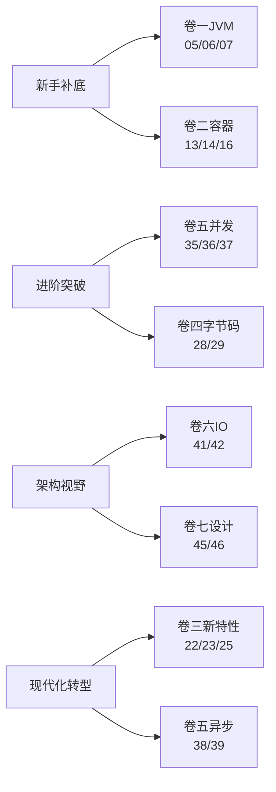

# 专栏笔记总结大全

> Java 核心原理深度专栏，自下而上贯穿 **JVM → 容器 → 类型系统 → 字节码 → 并发 → IO/网络 → 设计思想** 七大原理域，共计 **47 篇**，体系化拆解 Java 的每一根骨头与每一种设计哲学。
>
> 🎉 **全册 47 篇正式收官！** ✅ 已完成 47/47
>
> 📌 最终篇：**第 47 篇《SPI与模块化》——全册收官篇**（SLF4J找不到Provider+JDBC自动加载+ToolProvider+镜像480MB+InaccessibleObjectException五大启动事故入场、API与SPI的反向控制、META-INF/services约定、ServiceLoader源码三关键点+懒加载迭代器+JDK 9 Stream新API+Provider元数据先看再选、双亲委派回顾与SPI冲突根源、JDBC破局之路与DriverManager.loadInitialDrivers源码+反向registerDriver、线程上下文类加载器TCCL机制+Tomcat WebApp层级反转+OSGi网状委派、SLF4J 1.x静态绑定vs 2.x ServiceLoader、Dubbo增强SPI按key选+IoC+AOP+Wrapper、SPI五大陷阱+maven-shade合并services、JPMS解决internal包绑架与rt.jar 60MB瘦身、module-info语法全谱（requires/exports/opens/uses/provides）、模块路径vs类路径、强封装与--add-opens逃生、模块化下SPI编译期增强、自动模块与未命名模块兼容路径、拆分包冲突、JPMS vs OSGi五大维度对比+三选一决策树、jdeps分析+jlink定制JRE镜像从480MB降至80~120MB、Spring Boot生态对JPMS的运行时支持开发期不强制态度、SpringFactoriesLoader自定义SPI、SpringApplication.run一行代码触发3层CL+3次ServiceLoader+1次Spring SPI+1次Tomcat反向委派+N次JPMS强封装检查、全册七卷主线回望、十大贯穿设计哲学速查）。

## 📕 卷一 · JVM 与运行时核心（10 篇）

把"虚拟机如何把字节码跑起来"讲透。

- ✅ [01.JVM内存模型与对象](01.JVM内存模型与对象.md)：JVM运行时数据区、对象创建与内存布局、对象生命周期与可达性分析、堆内存分代设计、逃逸分析与栈上分配
- ✅ [02.类加载与双亲委派](02.类加载与双亲委派.md)：类的生命周期五阶段、三层类加载器体系、双亲委派源码原理、打破双亲委派的SPI/OSGi/热部署
- ✅ [03.垃圾回收与GC调优](03.垃圾回收与GC调优.md)：标记-清除/复制/标记-整理算法、Serial到ZGC收集器演进、GC日志分析与调优策略、三色标记与SATB
- ✅ [04.异常体系与JVM机制](04.异常体系与JVM机制.md)：异常表字节码结构、栈展开机制、finally代码复制原理、异常性能代价、try-with-resources
- ✅ [05.字节码指令集javap实战](05.字节码指令集javap实战.md)：Class文件结构、操作数栈与局部变量表、方法调用四指令、常量池索引、手撕字节码读懂JVM
- ✅ [06.JIT编译与去优化机制](06.JIT编译与去优化机制.md)：从解释执行到C1/C2/Graal、分层编译、方法内联、逃逸分析、去优化(Deoptimization)、Code Cache
- ✅ [07.JVM性能诊断工具链](07.JVM性能诊断工具链.md)：jstat/jmap/jstack/jcmd、JFR飞行记录器、Arthas在线诊断、async-profiler火焰图实战
- ✅ [08.OOM八大现场全景剖析](08.OOM八大现场全景剖析.md)：堆OOM、元空间、直接内存、栈溢出、GC overhead、native内存、线程数超限、进程级OOM Killer
- ✅ [09.JVM参数调优全景图](09.JVM参数调优全景图.md)：堆/GC/JIT/诊断四大类参数体系、真实线上调优案例、G1与ZGC调优差异
- ✅ [10.GraalVM与AOT编译原理](10.GraalVM与AOT编译原理.md)：Native Image、SubstrateVM、闭世界假设、与传统JVM的取舍

## 📗 卷二 · 容器与基础数据结构（8 篇）

把"Java 集合框架的每一根骨头"摸一遍。

- ✅ [11.HashMap底层哈希设计](11.HashMap底层哈希设计.md)：hash扰动函数设计、put/resize源码剖析、容量2的幂/负载因子0.75/树化阈值8的数学原理、并发安全问题
- ✅ [12.String不可变与常量池](12.String不可变与常量池.md)：String底层char到byte演进、不可变性三重保护、常量池位置变迁与intern原理、字符串拼接编译优化
- ✅ [13.ArrayList与LinkedList源码](13.ArrayList与LinkedList源码.md)：动态扩容机制、fail-fast迭代器、modCount、为什么LinkedList几乎被弃用
- ✅ [14.ConcurrentHashMap并发](14.ConcurrentHashMap并发.md)：JDK7分段锁→JDK8 CAS+synchronized→红黑树→ForwardingNode协助扩容、size()的精确性取舍
- ✅ [15.TreeMap与红黑树原理](15.TreeMap与红黑树原理.md)：红黑树五大性质、插入删除调整、跳表对比、ConcurrentSkipListMap为什么不用红黑树
- ✅ [16.LinkedHashMap与LRU实现](16.LinkedHashMap与LRU实现.md)：双血统架构、三大钩子、insertOrder/accessOrder、手撕LRU、Caffeine W-TinyLFU
- ✅ [17.Java数字类型原理](17.Java数字类型原理.md)：Integer缓存池、自动装箱陷阱、BigDecimal精度与RoundingMode、IEEE754浮点数本质
- ✅ [18.Object通用方法的契约](18.Object通用方法的契约.md)：hashCode/equals一致性、toString/clone/finalize的废与立、wait/notify与监视器

## 📘 卷三 · 类型系统与语言机制（7 篇）

把"Java 语法糖背后的真相"还原。

- ✅ [19.泛型擦除与类型系统](19.泛型擦除与类型系统.md)：类型擦除机制、桥接方法、泛型边界与限制、PECS原则、运行时获取泛型信息
- ✅ [20.枚举原理与最佳实践](20.枚举原理与最佳实践.md)：枚举即final class、values()反射机制、单例枚举、EnumMap/EnumSet位运算优化
- ✅ [21.注解原理与编译期处理](21.注解原理与编译期处理.md)：元注解、APT注解处理器、Lombok字节码魔法、运行时反射读取注解
- ✅ [22.Lambda与引用底层原理](22.Lambda与引用底层原理.md)：invokedynamic指令、LambdaMetafactory动态生成、与匿名内部类的性能差异
- ✅ [23.Stream原理与流水线设计](23.Stream原理与流水线设计.md)：Spliterator分割器、有状态/无状态操作、短路求值、并行流的ForkJoinPool陷阱
- ✅ [24.Optional设计原理](24.Optional设计原理.md)：Tony Hoare的"十亿美元错误"、什么时候用什么时候不用、为什么不能Serializable
- ✅ [25.Record密封类与模式](25.Record密封类与模式.md)：现代Java类型系统、不可变数据载体、密封继承、模式匹配三件套

## 📙 卷四 · 反射与字节码增强（5 篇）

把"动态修改运行时行为"的生态打通。

- ✅ [26.反射机制与动态代理](26.反射机制与动态代理.md)：反射调用链与Inflation优化、JDK动态代理Proxy类生成、CGLIB继承代理、Spring AOP选择策略
- ✅ [27.MethodHandle与VarHandle](27.MethodHandle与VarHandle.md)：反射的现代继任者、与invokedynamic的关系、性能对比与典型用法
- ✅ [28.三大字节码框架对比](28.三大字节码框架对比.md)：API层级差异、手撕一个简易Mock框架、生产场景选型
- ✅ [29.JavaAgent与Instrumentation机制](29.JavaAgent与Instrumentation机制.md)：premain/agentmain、retransformClasses、Arthas如何attach到运行JVM
- ✅ [30.AOP三种实现路线对比](30.AOP三种实现路线对比.md)：JDK代理/CGLIB/AspectJ编译期织入、Spring AOP内部如何选择代理方式

## 📔 卷五 · 并发编程深水区（9 篇）

把"从锁到无锁、从线程到协程"全部串起来。

- ✅ [31.synchronized与锁升级](31.synchronized与锁升级.md)：对象头Mark Word、偏向锁/轻量级锁/重量级锁原理、锁消除/锁粗化/自适应自旋、虚拟线程Pinning问题
- ✅ [32.volatile与JMM内存模型](32.volatile与JMM内存模型.md)：CPU缓存架构与MESI协议、JMM抽象模型、happens-before规则、volatile内存屏障实现、DCL单例分析
- ✅ [33.线程池核心源码设计](33.线程池核心源码设计.md)：七大参数、ctl状态控制、execute提交流程、Worker线程复用秘密、ForkJoinPool工作窃取、参数设置策略
- ✅ [34.Thread线程生命周期](34.Thread线程生命周期.md)：start/run/join/interrupt真相、ThreadLocal与InheritableThreadLocal、内存泄漏与弱引用Entry
- ✅ [35.AQS同步框架源码](35.AQS同步框架源码.md)：并发包的灵魂、CLH队列、独占/共享模式、模板方法设计、Condition条件队列与signal/await
- ✅ [36.并发锁三剑客](36.并发锁三剑客.md)：公平锁与非公平锁、锁降级、乐观读、与synchronized的取舍
- ✅ [37.CAS和Atomic深入分析](37.CAS和Atomic深入分析.md)：Unsafe底层、ABA问题、AtomicStampedReference、LongAdder分段思想、Striped64设计
- ✅ [38.五大同步器对比](38.五大同步器对比.md)：CountDownLatch一次性闸门、CyclicBarrier可循环屏障、Semaphore信号量、Exchanger双向交换、Phaser分阶段同步器、AQS共享模式落地、long state 4段位运算压缩、树形分层
- ✅ [39.CompletableFuture异步](39.CompletableFuture异步.md)：Future进化史、三类API全景、30+算子命名规律、Async后缀与Caller-Runs、内部状态机（AltResult/Treiber stack）、ForkJoinPool common pool三大陷阱、异常三姿势、CompletionException双重包装、thenCompose扁平化、orTimeout/completeOnTimeout、MDC跨线程透传

## 📒 卷六 · IO、网络与序列化（4 篇）

把"数据怎么进出 Java 进程"讲完整。

- ✅ [40.IO模型演进BIO到AIO](40.IO模型演进BIO到AIO.md)：五种IO模型对比、NIO三大组件、Selector多路复用、select/poll/epoll底层对比、零拷贝原理、Reactor模式与Netty
- ✅ [41.ByteBuffer与堆外内存](41.ByteBuffer与堆外内存.md)：ByteBuffer状态机（四指针不变式+flip/compact/rewind/clear）、HeapBuffer临时DirectBuffer拷贝真相、IOUtil.write源码、Cleaner+PhantomReference回收链路、Bits全局账簿+System.gc回退机制、-XX:MaxDirectMemorySize与容器、堆外泄漏4大现场、NMT/pmap/jcmd/BufferPoolMXBean排查、mmap/sendfile/splice对应API、Netty自造ByteBuf五大优势
- ✅ [42.序列化原理与替代方案](42.序列化原理与替代方案.md)：Serializable漏洞与writeReplace/readResolve、JDK原生反序列化攻击与CVE、JSON（Jackson/FastJson2/Gson）、Protobuf TLV编码+varint、Kryo/Hessian/Avro/Thrift对比、选型决策树
- ✅ [43.文件IO与NIO.2](43.文件IO与NIO.2.md)：Path跳出File的五大设计、FileSystem SPI多态、Files原子写入(ATOMIC_MOVE)、WatchService三大抽象+inotify底层映射、vim保存/echo覆盖不同事件、去抖与OVERFLOW处理、macOS kqueue 10s延迟坑、FileChannel.map三种模式与缺页中断、大文件分段映射LRU、Unsafe.invokeCleaner逃生、FileLock进程级锁与MappedByteBuffer冲突、DELETE_ON_CLOSE与ShutdownHook清理、配置热更新/日志切割/单实例守护三大场景

## 📓 卷七 · 设计思想与设计模式（4 篇）

把"为什么 Java 这么写"的灵魂还原。

- ✅ [44.面向对象的真意](44.面向对象的真意.md)：Order上帝类事故入场、封装不是getter/setter不变量保护、CountingHashSet陷阱与实现继承脆弱、LSP里氏替换与正方形反例、组合优于继承、子类型与参数化多态、invokevirtual/invokeinterface字节码+vtable内联缓存、单分派与访问者模式、接口vs抽象类选型、default方法演进史、行为参数化、SOLID五原则成对拆解、Collection分层/InputStream装饰链/AQS模板方法/Comparator组合子、贫血vs充血模型、Record不可变、sealed+模式匹配、OO与FP合流、一次完整重构案例
- ✅ [45.JDK设计模式上](45.JDK设计模式上.md)：鉴权模块组合拳事故入场、单例六写法全谱+DCL半初始化陷阱+volatile内存屏障、Holder静态内部类+JVM类加载锁、枚举单例防反射防序列化双保险、工厂三兄弟（简单/方法/抽象）+静态工厂5大优势+JDK工厂命名约定全景、重叠构造函数地狱与链式Builder+HttpClient范本+Record携手、Cloneable设计错误+Object.clone浅拷贝本质+拷贝构造与Type.copyOf的取代、FilterInputStream装饰器金字塔+Collections.unmodifiableList装饰器本质、InputStreamReader字节-字符适配+Arrays.asList的伪装、静态代理-JDK动态代理-CGLIB三家对比+$Proxy0生成原理+FastClass机制+Spring代理选型决策、@Transactional自调用穿透代理事故+self注入修正、完整"一个请求触发7种模式"串讲
- ✅ [46.JDK设计模式下](46.JDK设计模式下.md)：订单审批工作流事故入场、迭代器fail-fast机制+modCount版本号对账+ListIterator双向遍历+Spliterator并行分割+内迭代forEach对比、Observable废弃四原因+PropertyChangeSupport类型安全推送+Flow响应式四角色+反压机制+SubmissionPublisher开箱即用+EventBus解耦边界、模板方法骨架final钩子abstract+AQS的acquire骨架五钩子范本+AbstractList复用魔法+HttpServlet.service的HTTP方法分发、策略模式收编if-else长龙+Comparator策略组合子（reversed/thenComparing）+RejectedExecutionHandler四种拒绝策略+Lambda让策略零代价、责任链链表与递归两种实现+ServletFilter的pre-post洋葱模型+Netty ChannelPipeline双向链入站出站+OkHttp Interceptor链式优雅+审批引擎重构成Interceptor模型、命令模式Runnable即命令+Callable带返回值+撤销与命令日志+数据库WAL类比、状态模式消除12×8 if地狱+Order状态机stateDiagram+Thread.State范本+枚举携带行为的轻量化变体、备忘录Originator-Memento-Caretaker三角+事务回滚与事件溯源替代+不可变对象天然备忘录、解释器模式Pattern AST编译+何时不用解释器、收官四大设计哲学：协作对象化/流程不动细节可填/组合替代继承/请求是一等公民、Java 8+行为型模式Lambda化对照表
- ✅ [47.SPI与模块化](47.SPI与模块化设计)：SLF4J找不到Provider+JDBC自动加载+ToolProvider+镜像480MB+InaccessibleObjectException五大启动事故入场、API与SPI的反向控制本质、META-INF/services约定、ServiceLoader源码三关键点（路径拼接+getResources多jar+TCCL加载）+懒加载迭代器、JDK 9 Stream新API+Provider元数据先看再选、双亲委派回顾与SPI冲突根源、JDBC破局之路+DriverManager.loadInitialDrivers源码+反向registerDriver、线程上下文类加载器TCCL机制+Tomcat WebApp层级反转+OSGi网状委派四种破局方式、SLF4J 1.x静态绑定vs 2.x ServiceLoader、Dubbo增强SPI按key选+@SPI默认+IoC+AOP+Wrapper、自己写一个SPI三步法、SPI五大陷阱+maven-shade ServicesResourceTransformer合并、JPMS解决internal包绑架与rt.jar 60MB瘦身、module-info语法全谱（requires/exports/opens/uses/provides+transitive+static+to限定）、模块路径vs类路径、强封装与InaccessibleObjectException+--add-opens三种修复路径、模块化下SPI的provides与uses编译期增强、自动模块与未命名模块兼容路径+三阶段迁移、拆分包冲突的硬压力、JPMS vs OSGi五大维度对比+三选一决策树、jdeps依赖分析+jlink定制JRE镜像从480MB降至80~120MB、Spring Boot生态对JPMS的运行时支持开发期不强制态度、SpringFactoriesLoader自定义SPI、SpringApplication.run一行代码触发3层CL+3次ServiceLoader+1次Spring SPI+1次Tomcat反向委派+N次JPMS强封装检查的完整旅程、全册七卷主线回望、十大贯穿设计哲学速查表

---

## 📚 学习路径推荐

| 你的目标 | 推荐主攻卷 | 优先篇目 |
|---|---|---|
| 面试冲刺 | 卷一 + 卷二 + 卷五 | 05 / 06 / 08 / 13 / 14 / 35 / 36 / 37 |
| 中间件源码阅读 | 卷四 + 卷五 + 卷六 | 28 / 29 / 35 / 41 |
| 架构师视野 | 卷七 | 44 / 45 / 46 / 47 |
| 拥抱现代 Java | 卷三 + 卷五 | 22 / 23 / 25 / 38 / 39 |

---

## 📐 统一写作模板

每篇文章按统一骨架展开，保证阅读节奏一致：

1. **开篇困境**：一段真实代码或线上事故引出问题
2. **核心原理拆解**：源码 / 字节码 / 数据结构图
3. **设计思想还原**：JDK 设计者为什么这么写，权衡了什么
4. **演进历史**：从 JDK X 到 JDK Y 这块发生了什么变化
5. **常见陷阱与最佳实践**：3-5 个真实坑
6. **灵魂三问**：考你也考自己
7. **延伸阅读**：JEP / 源码包 / 经典书目

---

## 📊 进度总览

| 卷 | 主题 | 篇数 | 已完成 |
|---|---|---|---|
| 卷一 | JVM 与运行时核心 | 10 | 10 ✅ |
| 卷二 | 容器与基础数据结构 | 8 | 8 ✅ |
| 卷三 | 类型系统与语言机制 | 7 | 7 ✅ |
| 卷四 | 反射与字节码增强 | 5 | 5 ✅ |
| 卷五 | 并发编程深水区 | 9 | 9 ✅ |
| 卷六 | IO、网络与序列化 | 4 | 4 ✅ |
| 卷七 | 设计思想与设计模式 | 4 | 4 ✅ |
| **合计** | — | **47** | **47 ✅** |

> 🎉 **全 47 篇按卷连续编号已全部完成**——卷一 ~ 卷七 七卷俱收官，《Java 核心原理深度专栏》正式完结。