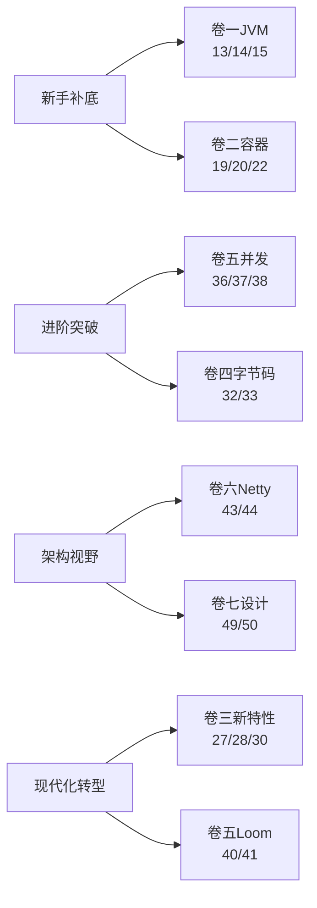

# 专栏笔记总结大全

> Java 核心原理深度专栏，自下而上贯穿 **JVM → 容器 → 类型系统 → 字节码 → 并发 → IO/网络 → 设计思想** 七大原理域，共计 **51 篇**，体系化拆解 Java 的每一根骨头与每一种设计哲学。
>
> ✅ 已完成 33 篇 ｜ 🆕 待写 18 篇
>
> 📌 最近更新：第 33 篇《Java Agent 与 Instrumentation 机制》——Arthas 一行命令 watch 线上任意方法+JRebel 不重启热更新双案例切入+Java Agent 四种形态全景（premain/agentmain/JVMTI Native Agent/JVM 内置）+premain 启动期 Agent 的 MANIFEST 三件套与启动顺序+agentmain 运行期 Agent 与 Attach API（SIGQUIT+Unix Domain Socket 黑盒揭秘）+Instrumentation 三大核心 API（addTransformer/retransformClasses/redefineClasses）与类重定义兼容性约束（不能加字段加方法的根因）+JVMTI 与 jdwp/JFR/async-profiler+Arthas watch/trace/redefine/jad/sc 字节码层实现拆解+50 行手撕磁盘监听式热更新 Agent+JRebel 版本化 ClassLoader 突破限制原理+JDK 21 JEP 451 收紧 attach 安全性

---

## 📕 卷一 · JVM 与运行时核心（10 篇）

把"虚拟机如何把字节码跑起来"讲透。

- ✅ [01.JVM内存模型与对象生命周期](01.JVM内存模型与对象生命周期.md)：JVM运行时数据区、对象创建与内存布局、对象生命周期与可达性分析、堆内存分代设计、逃逸分析与栈上分配
- ✅ [02.类加载机制与双亲委派模型](02.类加载机制与双亲委派模型.md)：类的生命周期五阶段、三层类加载器体系、双亲委派源码原理、打破双亲委派的SPI/OSGi/热部署
- ✅ [03.垃圾回收算法与GC调优原理](03.垃圾回收算法与GC调优原理.md)：标记-清除/复制/标记-整理算法、Serial到ZGC收集器演进、GC日志分析与调优策略、三色标记与SATB
- ✅ [12.Java异常体系与JVM异常处理机制](12.Java异常体系与JVM异常处理机制.md)：异常表字节码结构、栈展开机制、finally代码复制原理、异常性能代价、try-with-resources
- ✅ [13.字节码指令集与javap实战](13.字节码指令集与javap实战.md)：Class文件结构、操作数栈与局部变量表、方法调用四指令、常量池索引、手撕字节码读懂JVM
- ✅ [14.JIT编译原理与去优化机制](14.JIT编译原理与去优化机制.md)：从解释执行到C1/C2/Graal、分层编译、方法内联、逃逸分析、去优化(Deoptimization)、Code Cache
- ✅ [15.JVM性能诊断工具链](15.JVM性能诊断工具链.md)：jstat/jmap/jstack/jcmd、JFR飞行记录器、Arthas在线诊断、async-profiler火焰图实战
- ✅ [16.OOM八大现场全景剖析](16.OOM八大现场全景剖析.md)：堆OOM、元空间、直接内存、栈溢出、GC overhead、native内存、线程数超限、进程级OOM Killer
- ✅ [17.JVM参数调优全景图](17.JVM参数调优全景图.md)：堆/GC/JIT/诊断四大类参数体系、真实线上调优案例、G1与ZGC调优差异
- ✅ [18.GraalVM与原生镜像AOT原理](18.GraalVM与原生镜像AOT原理.md)：Native Image、SubstrateVM、闭世界假设、与传统JVM的取舍

## 📗 卷二 · 容器与基础数据结构（8 篇）

把"Java 集合框架的每一根骨头"摸一遍。

- ✅ [04.HashMap底层原理与哈希设计](04.HashMap底层原理与哈希设计.md)：hash扰动函数设计、put/resize源码剖析、容量2的幂/负载因子0.75/树化阈值8的数学原理、并发安全问题
- ✅ [05.String不可变性与常量池原理](05.String不可变性与常量池原理.md)：String底层char到byte演进、不可变性三重保护、常量池位置变迁与intern原理、字符串拼接编译优化
- ✅ [19.ArrayList与LinkedList源码深析](19.ArrayList与LinkedList源码深析.md)：动态扩容机制、fail-fast迭代器、modCount、为什么LinkedList几乎被弃用
- ✅ [20.ConcurrentHashMap演进史](20.ConcurrentHashMap演进史.md)：JDK7分段锁→JDK8 CAS+synchronized→红黑树→ForwardingNode协助扩容、size()的精确性取舍
- ✅ [21.TreeMap与红黑树原理](21.TreeMap与红黑树原理.md)：红黑树五大性质、插入删除调整、跳表对比、ConcurrentSkipListMap为什么不用红黑树
- ✅ [22.LinkedHashMap与LRU实现](22.LinkedHashMap与LRU实现.md)：双血统架构、三大钩子、insertOrder/accessOrder、手撕LRU、Caffeine W-TinyLFU
- ✅ [23.Java数字类型原理](23.Java数字类型原理.md)：Integer缓存池、自动装箱陷阱、BigDecimal精度与RoundingMode、IEEE754浮点数本质
- ✅ [24.Object通用方法的契约](24.Object通用方法的契约.md)：hashCode/equals一致性、toString/clone/finalize的废与立、wait/notify与监视器

## 📘 卷三 · 类型系统与语言机制（7 篇）

把"Java 语法糖背后的真相"还原。

- ✅ [06.Java泛型擦除与类型系统原理](06.Java泛型擦除与类型系统原理.md)：类型擦除机制、桥接方法、泛型边界与限制、PECS原则、运行时获取泛型信息
- ✅ [25.枚举原理与最佳实践](25.枚举原理与最佳实践.md)：枚举即final class、values()反射机制、单例枚举、EnumMap/EnumSet位运算优化
- ✅ [26.注解原理与编译期/运行期处理](26.注解原理与编译期运行期处理.md)：元注解、APT注解处理器、Lombok字节码魔法、运行时反射读取注解
- ✅ [27.Lambda与方法引用底层原理](27.Lambda与方法引用底层原理.md)：invokedynamic指令、LambdaMetafactory动态生成、与匿名内部类的性能差异
- ✅ [28.Stream原理与流水线设计](28.Stream原理与流水线设计.md)：Spliterator分割器、有状态/无状态操作、短路求值、并行流的ForkJoinPool陷阱
- ✅ [29.Optional设计哲学](29.Optional设计哲学.md)：Tony Hoare的"十亿美元错误"、什么时候用什么时候不用、为什么不能Serializable
- ✅ [30.Record与Sealed与Pattern Matching](30.Record与Sealed与Pattern%20Matching.md)：现代Java类型系统、不可变数据载体、密封继承、模式匹配三件套

## 📙 卷四 · 反射与字节码增强（5 篇）

把"动态修改运行时行为"的生态打通。

- ✅ [07.反射机制与动态代理底层原理](07.反射机制与动态代理底层原理.md)：反射调用链与Inflation优化、JDK动态代理Proxy类生成、CGLIB继承代理、Spring AOP选择策略
- ✅ [31.MethodHandle与VarHandle](31.MethodHandle与VarHandle.md)：反射的现代继任者、与invokedynamic的关系、性能对比与典型用法
- ✅ [32.ASM/Javassist/ByteBuddy字节码框架对比](32.ASM_Javassist_ByteBuddy字节码框架对比.md)：API层级差异、手撕一个简易Mock框架、生产场景选型
- ✅ [33.Java Agent与Instrumentation机制](33.JavaAgent与Instrumentation机制.md)：premain/agentmain、retransformClasses、Arthas如何attach到运行JVM
- 🆕 34.AOP三种实现路线对比：JDK代理/CGLIB/AspectJ编译期织入、Spring AOP内部如何选择代理方式

## 📔 卷五 · 并发编程深水区（10 篇）

把"从锁到无锁、从线程到协程"全部串起来。

- ✅ [08.并发编程之synchronized与锁升级](08.并发编程之synchronized与锁升级.md)：对象头Mark Word、偏向锁/轻量级锁/重量级锁原理、锁消除/锁粗化/自适应自旋、虚拟线程Pinning问题
- ✅ [09.volatile与Java内存模型JMM](09.volatile与Java内存模型JMM.md)：CPU缓存架构与MESI协议、JMM抽象模型、happens-before规则、volatile内存屏障实现、DCL单例分析
- ✅ [10.线程池核心原理与源码设计](10.线程池核心原理与源码设计.md)：七大参数、ctl状态控制、execute提交流程、Worker线程复用秘密、ForkJoinPool工作窃取、参数设置策略
- 🆕 35.Thread与线程生命周期源码：start/run/join/interrupt真相、ThreadLocal与InheritableThreadLocal、内存泄漏与弱引用Entry
- 🆕 36.AQS框架：并发包的灵魂、CLH队列、独占/共享模式、模板方法设计、Condition条件队列与signal/await
- 🆕 37.ReentrantLock/ReadWriteLock/StampedLock源码剖析：公平锁与非公平锁、锁降级、乐观读、与synchronized的取舍
- 🆕 38.CAS与Atomic家族：Unsafe底层、ABA问题、AtomicStampedReference、LongAdder分段思想、Striped64设计
- 🆕 39.五大同步器对比：CountDownLatch/CyclicBarrier/Semaphore/Exchanger/Phaser的实现差异与适用场景
- 🆕 40.CompletableFuture异步编程：Future的进化、组合算子thenApply/thenCompose、ForkJoinPool common pool陷阱
- 🆕 41.虚拟线程(Loom)与结构化并发：用户态调度、carrier线程、Pinning问题、与协程/反应式的取舍

## 📒 卷六 · IO、网络与序列化（7 篇）

把"数据怎么进出 Java 进程"讲完整。

- ✅ [11.IO模型演进：BIO到NIO到AIO](11.IO模型演进之BIO到NIO到AIO.md)：五种IO模型对比、NIO三大组件、Selector多路复用、select/poll/epoll底层对比、零拷贝原理、Reactor模式与Netty
- 🆕 42.NIO之ByteBuffer与堆外内存：HeapBuffer/DirectBuffer、Cleaner回收机制、堆外内存泄漏排查实战
- 🆕 43.Netty核心架构剖析：EventLoop线程模型、Pipeline双向链表、ChannelHandler、内存池PooledByteBufAllocator、零拷贝实现
- 🆕 44.Java序列化原理与替代方案：Serializable漏洞、writeReplace/readResolve、Kryo/Protobuf/Hessian/JSON选型
- 🆕 45.HTTP客户端演进：HttpURLConnection→HttpClient→OkHttp/Apache HC、连接池/HTTP2/HTTP3支持现状
- 🆕 46.TCP与Socket编程在Java中的体现：TIME_WAIT/Nagle/keepalive在Java API的开关、SO_REUSEADDR等参数详解
- 🆕 47.文件IO与NIO.2：Path/Files API、WatchService监听、内存映射文件mmap的真实场景

## 📓 卷七 · 设计思想与设计模式（4 篇）

把"为什么 Java 这么写"的灵魂还原。

- 🆕 48.面向对象的真意：Java设计哲学的源头、封装/继承/多态在JDK源码里的范本、SOLID原则与Java
- 🆕 49.JDK中的设计模式实战盘点（上）：创建型+结构型——单例六种写法、工厂三兄弟、装饰器(IO流)、适配器、代理
- 🆕 50.JDK中的设计模式实战盘点（下）：行为型——迭代器、观察者、模板方法(AQS)、策略、责任链(ServletFilter)
- 🆕 51.SPI机制与Java模块化：ServiceLoader源码、JPMS模块系统、与OSGi的差别、双亲委派的破局

---

## 📚 学习路径推荐

| 你的目标 | 推荐主攻卷 | 优先篇目 |
|---|---|---|
| 面试冲刺 | 卷一 + 卷二 + 卷五 | 13 / 14 / 16 / 19 / 20 / 36 / 37 / 38 |
| 中间件源码阅读 | 卷四 + 卷五 + 卷六 | 32 / 33 / 36 / 43 |
| 架构师视野 | 卷七 | 48 / 49 / 50 / 51 |
| 拥抱现代 Java | 卷三 + 卷五 | 27 / 28 / 30 / 40 / 41 |

---

## 📐 统一写作模板

每篇文章按统一骨架展开，保证阅读节奏一致：

1. **开篇困境**：一段真实代码或线上事故引出问题
2. **核心原理拆解**：源码 / 字节码 / 数据结构图
3. **设计思想还原**：JDK 设计者为什么这么写，权衡了什么
4. **演进历史**：从 JDK X 到 JDK Y 这块发生了什么变化
5. **常见陷阱与最佳实践**：3-5 个真实坑
6. **灵魂三问**：考你也考自己
7. **延伸阅读**：JEP / 源码包 / 经典书目

---

## 📊 进度总览

| 卷 | 主题 | 篇数 | 已完成 |
|---|---|---|---|
| 卷一 | JVM 与运行时核心 | 10 | 10 ✅ |
| 卷二 | 容器与基础数据结构 | 8 | 8 ✅ |
| 卷三 | 类型系统与语言机制 | 7 | 7 ✅ |
| 卷四 | 反射与字节码增强 | 5 | 4 |
| 卷五 | 并发编程深水区 | 10 | 3 |
| 卷六 | IO、网络与序列化 | 7 | 1 |
| 卷七 | 设计思想与设计模式 | 4 | 0 |
| **合计** | — | **51** | **33** |

> 注：全 51 篇按卷连续编号 01~51，其中 01~33 为已完成篇目（卷一、卷二、卷三**三卷收官 ✅** + 卷四推进中），34~51 为待写篇目。

