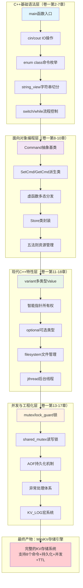

# 第六章：C++ 迷你 KV 存储引擎（毕业设计）

> 本章是综合案例的**最终关·毕业设计**，也是整本《C++ 入门到精通》卷一的"集大成之作"。前 5 个案例每篇只覆盖 3-5 章，本案例**一口气串起卷一 17 章**——从基础语法到 `std::variant`，从智能指针到 `std::jthread`，从异常体系到预处理器宏，全部在同一个项目里落地。完成它之后，你会得到一个能跑、能落盘、能并发、能过期的"**迷你 Redis**"，更重要的是：**你会真正理解"C++ 工程"是怎样把这些散点搭成一座可维护的房子的**。
>
> **学习方式**：本案例**篇幅较长**（2200+ 行 / 16-20 小时），建议**分 5 次读完**，每次 1.5 - 2 小时；**绝不要试图一口气吃完**。每一节都自带"为什么这样写"的思考小结，慢慢消化更有效果。如果说前 5 关是"过单元考试"，本关就是"毕业答辩"——它检验你能不能把之前学过的所有特性**协同**起来，而不只是会用单点。

---

## 📚 渐进学习节奏

> 💡 先读这段，再开始敲代码！本案例 14 个章节，**严格按"5 次会话"切分**，每次会话独立可验收。

```text
\u3010\u7b2c 1 \u6b21\u4f1a\u8bdd\u3011 MVP \u9aa8\u67b6 + \u73b0\u4ee3 C++ \u8868\u8fbe\uff08\u7ae0 02-04\uff09 \u00b7 3 h
   \u9636\u6bb5 \u2460 REPL \u9aa8\u67b6\uff1amain \u5faa\u73af + enum class + string_view \u5207\u5206\n   \u9636\u6bb5 \u2461 Value \u8868\u8fbe\uff1avariant \u88c5 5 \u79cd\u7c7b\u578b\n   \u9636\u6bb5 \u2462 Entry \u751f\u547d\u5468\u671f\uff1aEntry = Value + TTL\uff0cshared_ptr \u62e5\u6709\u5173\u7cfb\n   \u2705 \u9a8c\u6536\uff1aREPL \u8df1\u901a\uff0c\u80fd\u5c06 SET k 123 \u5b58\u8fdb map\uff0cGET k \u8bfb\u51fa\n\n\u3010\u7b2c 2 \u6b21\u4f1a\u8bdd\u3011 \u547d\u4ee4\u6a21\u5f0f + Store \u6838\u5fc3\uff08\u7ae0 05-06\uff09 \u00b7 3 h\n   \u9636\u6bb5 \u2463 Command \u62bd\u8c61\u57fa\u7c7b + 5 \u4e2a\u6d3e\u751f\u547d\u4ee4\n   \u9636\u6bb5 \u2464 Store \u4e3b\u63a5\u53e3 apply\uff0c\u628a if-else \u91cd\u6784\u4e3a\u7c7b\u4f53\u7cfb\n   \u9636\u6bb5 \u2465\uff08\u9009\u8bb2\uff09\u6a21\u677f\u5316 registerCmd<T>\n   \u2705 \u9a8c\u6536\uff1a\u52a0\u4e00\u4e2a\u65b0\u547d\u4ee4 INCR \u53ea\u9700\u52a8 1 \u4e2a\u6587\u4ef6\n\n\u3010\u7b2c 3 \u6b21\u4f1a\u8bdd\u3011 \u5f02\u5e38\u4f53\u7cfb + \u65e5\u5fd7\u5b8f\uff08\u7ae0 07\u300109\uff09 \u00b7 3 h\n   \u9636\u6bb5 \u2466 KvError \u81ea\u5b9a\u4e49\u5f02\u5e38\u4f53\u7cfb + \u4e3b\u5faa\u73af\u7edf\u4e00\u6355\u83b7\n   \u9636\u6bb5 \u2467 KV_LOG \u5b8f + __FILE__/__LINE__ + \u6761\u4ef6\u7f16\u8bd1\u5173\u95ed\n   \u2705 \u9a8c\u6536\uff1a\u8f93\u9519\u547d\u4ee4\u4e0d\u5d29\u6e83 + Debug/Release \u7f16\u8bd1\u90fd\u80fd\u8dd1\n\n\u3010\u7b2c 4 \u6b21\u4f1a\u8bdd\u3011 AOF \u6301\u4e45\u5316\uff08\u7ae0 08\uff09 \u00b7 3 h  \u3010\u9ad8\u5cf0\u00b7\u8d26\u672c\u80fd\u91cd\u542f\u3011\n   \u9636\u6bb5 \u2468 AofWriter \u8ffd\u52a0\u5199 + filesystem \u5efa\u76ee\u5f55\n   \u9636\u6bb5 \u2469 \u542f\u52a8\u91cd\u653e\u8fd8\u539f\u72b6\u6001\n   \u2705 \u9a8c\u6536\uff1ass-9 \u6740\u8fdb\u7a0b\u91cd\u542f\u540e\u6240\u6709\u6570\u636e\u8fd8\u5728\n\n\u3010\u7b2c 5 \u6b21\u4f1a\u8bdd\u3011 \u5e76\u53d1 + TTL\uff08\u7ae0 10-12\uff09 \u00b7 3 h  \u3010\u9ad8\u5cf0\u00b7\u751f\u4ea7\u7ea7\u95ed\u73af\u3011\n   \u9636\u6bb5 \u246a mutex + lock_guard \u4fdd\u62a4 store\n   \u9636\u6bb5 \u246b shared_mutex \u4f18\u5316\u8bfb\u591a\u573a\u666f\n   \u9636\u6bb5 \u246c jthread + stop_token \u540e\u53f0\u8fc7\u671f\u6e05\u7406\n   \u9636\u6bb5 \u246d \u7aef\u5230\u7aef\u538b\u6d4b + \u6740\u8fdb\u7a0b\u9a8c\u8bc1\n   \u2705 \u9a8c\u6536\uff1a\u591a\u5ba2\u6237\u7aef\u6df7\u5199\u4e0d\u5d29\u6e83 + 100 \u4e2a TTL key 5 \u79d2\u540e\u81ea\u52a8\u6d88\u5931\n```

> 🎯 **每次会话开始前必读**：
> 1. **打开上次会话的代码 commit**，先看一遍验收点是否还在
> 2. **每个 Step 写完一小段就 build**（CMake 增量编译只要几秒）
> 3. **看到该节末尾的 ✅ 验收命令出现预期输出，再进入下一节**
>
> ⚠️ **本案例独有的"先快速搭骨架，再回头加肉"策略**：第 1 次会话搭好的 MVP 骨架（用 `unordered_map<string, string>` 直接存）在第 2 次会话会**被推翻重构**为命令模式。这是真实工程的常态——**先让程序跑起来，再让它好起来**。如果你看到第 5 节"为什么 if-else 越长越烂"觉得"早干嘛去了？"，恭喜你，你已经长出工程师的直觉了。
>
> 📌 **强烈建议**：每次会话结束做一次 `git commit`，这样第 4 次会话的 AOF 重放出问题，你能轻松回退到第 3 次会话的稳态。

---

## MiniKV 技术全景



### 技术栈分层详解

| 技术层级 | 对应C++知识点 | 在MiniKV中的具体实现 |
|---------|-------------|---------------------|
| **基础语法层** | 变量、流程控制、函数 | REPL主循环、命令解析、字符串处理 |
| **OOP层** | 类、继承、多态、封装 | Command命令模式、Store数据管理 |
| **现代特性层** | 智能指针、variant、optional | 类型安全Value、RAII资源管理 |
| **工程化层** | 并发、异常、文件IO、宏 | 多线程安全、AOF持久化、日志系统 |

### 为什么是毕业设计

1. **完整性**：覆盖C++从基础语法到高级特性的全栈知识
2. **实用性**：实现了一个真实可用的KV存储系统
3. **递进性**：技术栈层层递进，符合学习认知规律
4. **可扩展**：命令模式架构便于后续添加新功能
5. **工程化**：包含异常处理、日志系统、持久化等工程必备要素

通过完成这个1500行的项目，你将真正理解"C++工程"是如何把散落的知识点搭建成可维护的系统的。

---

## 00.案例元信息

| 项目 | 说明 |
|------|------|
| 难度 | ★★★★★ |
| 预估时长 | 16 - 20 小时（建议 5 次完成） |
| 前置章节 | **卷一第 2 - 17 章全部** + 第 18 章特性图谱 |
| 覆盖知识点 | REPL 主循环、`std::variant` 多类型 Value、`enum class` 命令枚举、`<=>` 三路比较、抽象基类 + 命令模式（Command Pattern）、`std::unique_ptr`/`std::shared_ptr` 取舍、自定义异常体系、AOF 追加日志、`std::filesystem` 目录管理、`std::mutex` + `std::lock_guard` 并发保护、`std::jthread` 后台过期清理线程、`KV_LOG` 宏与 `__FILE__/__LINE__`、模板化命令注册 |
| 设计亮点 | 命令模式让"加新命令零修改主流程"；AOF 让进程重启数据不丢；后台 TTL 线程展示生产者-消费者外的"清理线程"模式 |
| 最终产物 | 单文件 `mini_kv.cpp` + REPL 可执行 + 数据目录 `./data/aof.log` |
| 代码规模 | 约 1500 行（不含空行注释 ~1100 行） |

---

## 📋 目录快速导航

> 点击以下条目即可跳转到对应节。【🔑 重点节】推荐优先阅读。

- [📚 渐进学习节奏](#-渐进学习节奏) 【🔑 必读】
- [技术全景图](#技术全景图minikv如何覆盖c所有入门内容) 【🔑】
- [00.案例元信息](#00案例元信息)
- [01.需求说明](#01需求说明)
  - [1.1 为什么做 KV 存储](#11-为什么做-kv-存储)
  - [1.2 目标命令集](#12-目标命令集)
  - [1.3 与卷一 18 章的对应关系](#13-与卷一-18-章的对应关系) 【🔑】
  - [1.4 项目目录结构](#14-项目目录结构)
- [02.MVP 骨架：先让 REPL 跑起来](#02mvp-骨架先让-repl-跑起来) 【第1次会话】
  - [2.1 main 入口与命令循环](#21-main-入口与命令循环)
  - [2.2 enum class 表达命令类型](#22-enum-class-表达命令类型)
  - [2.3 字符串切分与 string_view](#23-字符串切分与-stdstring_view)
- [03.Value 的表达：用 variant 装"任意类型"](#03value-的表达用-stdvariant-装任意类型)
  - [3.1 KV 存储的 5 种值类型](#31-kv-存储的-5-种值类型)
  - [3.2 为什么不是继承](#32-为什么不是继承) 【🔑】
  - [3.3 Value 的定义与访问](#33-value-的定义与访问)
  - [3.4 与卷一第 18 章的对照练习](#34-与卷一第-18-章的对照练习)
- [04.Entry 与生命周期：栈、堆、智能指针](#04entry-与生命周期栈堆智能指针)
  - [4.1 Entry = Value + TTL + 元数据](#41-entry--value--ttl--元数据)
  - [4.2 谁拥有 Entry：shared_ptr vs unique_ptr](#42-谁拥有-entryshared_ptr-vs-unique_ptr) 【🔑】
  - [4.3 内存模型回顾（卷一第 11 章）](#43-内存模型回顾卷一第-11-章)
  - [4.4 五法则的现场验证](#44-五法则的现场验证)
- [05.Command 命令模式：抽象基类登场](#05command-命令模式抽象基类登场) 【第2次会话·OOP高峰⭐】
  - [5.1 痛点：if-else 越长越烂](#51-痛点if-else-越长越烂) 【🔑】
  - [5.2 抽象基类 Command](#52-抽象基类-command)
  - [5.3 派生类：5 个具体命令](#53-派生类5-个具体命令)
  - [5.4 工厂函数 makeCommand](#54-工厂函数-makecommand)
- [06.Store 核心：把所有命令都串起来](#06store-核心把所有命令都串起来)
  - [6.1 Store 的字段设计](#61-store-的字段设计)
  - [6.2 实现：成员函数](#62-实现成员函数)
  - [6.3 把 Command 派生类的 execute 接上 Store](#63-把-command-派生类的-execute-接上-store)
  - [6.4 模板化扩展：registerCmd<T> 选讲](#64-模板化扩展registercmdt-选讲)
- [07.异常体系：错误处理的工程化](#07异常体系错误处理的工程化) 【第3次会话】
  - [7.1 异常 vs 错误码：本项目怎么选](#71-异常-vs-错误码本项目怎么选) 【🔑】
  - [7.2 自定义异常基类 KvError](#72-自定义异常基类-kverror)
  - [7.3 异常使用守则与 noexcept](#73-异常使用守则与-noexcept)
  - [7.4 主循环里的统一捕获](#74-主循环里的统一捕获)
- [08.AOF 持久化：让数据"活过"重启](#08aof-持久化让数据活过重启) 【第4次会话·重启高峰⭐】
  - [8.1 AOF 原理](#81-aof-原理)
  - [8.2 AofWriter：负责追加写](#82-aofwriter负责追加写)
  - [8.3 启动时重放：还原内存状态](#83-启动时重放还原内存状态) 【🔑】
  - [8.4 main 里把 AOF 串起来](#84-main-里把-aof-串起来)
  - [8.5 std::filesystem 的小亮点](#85-stdfilesystem-的小亮点)
- [09.日志系统：宏与预处理器的实战](#09日志系统宏与预处理器的实战)
  - [9.1 KV_LOG 宏的设计](#91-kv_log-宏的设计)
  - [9.2 宏里的几个"必须"](#92-宏里的几个必须)
  - [9.3 条件编译关闭日志](#93-条件编译关闭日志)
- [10.并发安全：多客户端同时读写](#10并发安全多客户端同时读写) 【第5次会话·并发高峰⭐】
  - [10.1 痛点：两个线程同时 SET 同一个 key](#101-痛点两个线程同时-set-同一个-key) 【🔑】
  - [10.2 std::mutex + std::lock_guard 守护](#102-stdmutex--stdlock_guard-守护)
  - [10.3 读多写少：std::shared_mutex 优化](#103-读多写少stdshared_mutex-优化)
  - [10.4 锁粒度的取舍](#104-锁粒度的取舍)
- [11.TTL 清理：后台 std::jthread](#11ttl-清理后台-stdjthread)
  - [11.1 惰性删除 + 主动清理](#111-惰性删除--主动清理)
  - [11.2 std::jthread 与 stop_token](#112-stdjthread-与-stop_token) 【🔑】
  - [11.3 main 里启动 Server](#113-main-里启动-server)
  - [11.4 内存模型回顾（卷一第 11 章再演一遍）](#114-内存模型回顾卷一第-11-章再演一遍)
- [12.端到端运行](#12端到端运行)
  - [12.1 编译](#121-编译)
  - [12.2 一次完整的会话演示](#122-一次完整的会话演示)
  - [12.3 验证 AOF：杀进程再启动](#123-验证-aof杀进程再启动) 【🔑】
  - [12.4 验证并发：跑一个 stress 测试](#124-验证并发跑一个-stress-测试)
- [13.项目总结](#13项目总结)
  - [13.1 整体架构图](#131-整体架构图)
  - [13.2 16 章覆盖回顾（自检表）](#132-16-章覆盖回顾自检表) 【🔑】
  - [13.3 与生产级 Redis 的差距](#133-与生产级-redis-的差距)
  - [13.4 代码统计（参考）](#134-代码统计参考)
- [14.技术思考](#14技术思考)
  - [14.1 为什么命令模式比 if-else 好](#141-为什么命令模式比-if-else-好)
  - [14.2 AOF 的 fsync 策略](#142-aof-的-fsync-策略)
  - [14.3 jthread 比 thread 好在哪](#143-jthread-比-thread-好在哪)
  - [14.4 选讲：单线程 vs 多线程，谁是 KV 的最优解](#144-选讲单线程-vs-多线程谁是-kv-的最优解)
- [15.衔接与延伸](#15衔接与延伸)
  - [15.1 与上一案例（05.多线程订单）的衔接](#151-与上一案例05多线程订单与线程池的衔接)
  - [15.2 与卷三的递进](#152-与卷三的递进)
  - [15.3 三个延伸挑战](#153-三个延伸挑战)
  - [15.4 配套的多文件源码包](#154-配套的多文件源码包)

---

## 01.需求说明

### 1.1 为什么做 KV 存储

KV（Key-Value）存储是后端世界最常见的数据结构——Redis、Memcached、etcd、RocksDB 本质上都是 KV。它的接口极简（GET/SET/DEL），但要做"对"，需要解决一连串工程问题：

| 工程问题 | 在本案例中的体现 | 用到的卷一章节 |
|---------|----------------|--------------|
| 一个 key 能存多种类型的值 | `Value` 用 `std::variant` 表达 | 第 3 / 18 章 |
| 命令越加越多怎么办 | 命令模式：每加一个命令只新增一个类 | 第 9 / 10 章 |
| 进程一关数据就没了 | AOF 追加日志 + 启动重放 | 第 13 章 |
| 多客户端同时读写崩了 | `mutex` + `lock_guard` | 第 15 章 |
| key 设了 TTL 谁来删 | 后台 `jthread` + 惰性删除 | 第 11 / 15 章 |
| 写错命令程序就崩 | 自定义异常 `KvError` 体系 | 第 14 章 |
| 调试时想看哪行打的日志 | `KV_LOG` 宏 + `__FILE__/__LINE__` | 第 17 章 |

**这恰好就是 16 章的卷一。** 我们不是为了"凑覆盖"才做 KV——而是 KV 存储这个题目本身天然需要这些技术，做一遍刚好把它们用对位置。

### 1.2 目标命令集

实现一个支持以下 8 个命令的 REPL（Read-Eval-Print-Loop）：

```bash
$ ./mini_kv
> SET name zhangsan
OK
> SET age 30
OK
> GET name
"zhangsan"
> GET age
(integer) 30
> EXPIRE name 60          # 60 秒后过期
OK
> TTL name                # 查询剩余秒数
(integer) 58
> KEYS *                  # 列出所有 key
1) "name"
2) "age"
> DEL age
(integer) 1
> SAVE                    # 强制刷盘
OK
> EXIT
bye.
```

支持的 Value 类型：
- 字符串 `"hello"`
- 整数 `42`
- 浮点数 `3.14`
- 布尔 `true` / `false`
- 列表 `LPUSH mylist a b c`（选讲）

### 1.3 与卷一对应关系

下表是本案例**最关键的索引**，遇到知识点不熟的章节，直接翻到对应的"小节"复习：

| 卷一章节 | 在本项目中的落地节 | 形式 |
|---------|-------------------|------|
| 02 基础语法 | 2.1 main 入口 | `int main()` / `cout` / `cin` |
| 03 数据类型 | 3.1 Value 类型 | `int64_t` / `double` / `bool` / `string` |
| 04 运算符 | 4.1 Entry 比较 | `<=>` 三路比较 |
| 05 复合类型 | 2.2 命令枚举 | `enum class CmdType` |
| 06 流程语句 | 2.1 命令循环 | `while` + `switch` + 结构化绑定 |
| 07 函数 | 6.3 命令注册 | Lambda + `std::function` |
| 08 指针引用 | 4.2 智能指针 | `shared_ptr<Entry>` + `string_view` |
| 09 类与对象 | 5.2 / 6.1 | 抽象基类 + Store 五法则 |
| 10 继承多态 | 5.2 - 5.3 | `Command` 体系 + 虚函数 |
| 11 内存模型 | 4.3 | 栈 / 堆 / 静态区分析 |
| 12 动态内存 | 4.2 / 5.4 | `make_shared` / `make_unique` |
| 13 IO 与文件 | 8.2 - 8.4 | `ofstream` / `filesystem` |
| 14 异常处理 | 07 整章 | `KvError` + `noexcept` |
| 15 线程和锁 | 10 / 11 | `mutex` / `lock_guard` / `jthread` |
| 16 STL 模板 | 6.1 / 6.3 | `unordered_map` + 模板注册 |
| 17 预处理器 | 09 整章 | `#define KV_LOG` + 条件编译 |
| 18 特性图谱 | 3.1 / 4.1 | `variant` + `optional` + `string_view` |

> 第 1 章（C++ 简史）和第 18 章（特性图谱本身是索引）不强行覆盖。

### 1.4 项目目录结构

为了便于你跟着写，本案例采用**单文件**实现（不拆 .h/.cpp），避免初学者陷入构建系统的坑：

```
mini_kv/
├── mini_kv.cpp        # 全部源码（约 1500 行）
├── CMakeLists.txt     # 构建脚本（10 行）
└── data/              # 运行时自动创建
    └── aof.log        # AOF 持久化文件
```

`CMakeLists.txt` 内容（一次性给出，后面不再提）：

```cmake
cmake_minimum_required(VERSION 3.16)
project(mini_kv CXX)
set(CMAKE_CXX_STANDARD 20)
set(CMAKE_CXX_STANDARD_REQUIRED ON)
add_executable(mini_kv mini_kv.cpp)
if(MSVC)
    target_compile_options(mini_kv PRIVATE /W4)
else()
    target_compile_options(mini_kv PRIVATE -Wall -Wextra -Wpedantic)
endif()
```

> 工程级项目当然要拆头文件 + 源文件 + 测试，本案例为了**让读者把注意力放在 C++ 知识本身**，刻意单文件。卷四会专门讲多文件工程组织。

---

## 02.MVP 骨架启动

工程实践有个金科玉律：**先让"最小可用版本"跑起来，再迭代添加功能**。本节先不管类型、不管持久化、不管并发，只做一件事：**读一行 → 切词 → 打印**。这一步覆盖卷一第 2 / 5 / 6 章。

> 🎯 **阶段① · MVP 骨架（约 1 小时）**
>
> **本阶段你将完成**：
> - **Step 1.1** 写 25 行最小 REPL 主循环 → ✅ 编译运行，能读一行打一行
> - **Step 1.2** 引入 `enum class CmdType`，把字符串收敛为强类型枚举 → ✅ `switch` 能正确分发 8 种命令
> - **Step 1.3** 用 `std::string_view` 写零拷贝 `tokenize` → ✅ 替换 `istringstream` 切词，性能提升
>
> **阶段验收**：跑 `./build/mini_kv`，敲 `SET k 1` 看到 `[TODO] SET`、敲 `WRONG` 看到 `(error) unknown command`、敲 `EXIT` 干净退出。
>
> **建议节奏**：每个 Step **写完一段就编译一次**，看到预期输出再进入下一个 Step；卡住超过 15 分钟就回退到上一个稳定版本。

---

### Step 1.1 最小 REPL 循环

> 🎯 **本步目标**：让程序能反复读一行、切词、打印，并响应 `EXIT`。**这是整个项目唯一一次"程序还没有真实功能"的版本**——但它确立了交互入口，后续所有功能都在这个壳里长出来。

```cpp
// mini_kv.cpp —— 第一个版本
#include <iostream>
#include <string>
#include <sstream>
#include <vector>

int main() {
    std::cout << "MiniKV v0.1 — type EXIT to quit.\n";

    std::string line;
    while (true) {
        std::cout << "> ";
        if (!std::getline(std::cin, line)) break;     // Ctrl-D 退出
        if (line.empty()) continue;

        // 切词
        std::istringstream iss(line);
        std::vector<std::string> tokens;
        for (std::string tok; iss >> tok; ) tokens.push_back(tok);

        if (tokens.empty()) continue;
        if (tokens[0] == "EXIT") { std::cout << "bye.\n"; break; }

        std::cout << "(unknown) you said: ";
        for (auto& t : tokens) std::cout << "[" << t << "] ";
        std::cout << "\n";
    }
    return 0;
}
```

**✅ Step 1.1 编译运行验证**：

```bash
$ cmake -B build && cmake --build build
$ ./build/mini_kv
MiniKV v0.1 — type EXIT to quit.
> set name zhangsan
(unknown) you said: [set] [name] [zhangsan]
> hello world
(unknown) you said: [hello] [world]
> EXIT
bye.
```

看到这三行输出说明 Step 1.1 成功——**程序能读一行、切词、回显，并干净退出**。如果 `cmake -B build` 报错，先检查是否有 CMakeLists.txt（最简版只需 3 行：`cmake_minimum_required(VERSION 3.16); project(mini_kv); add_executable(mini_kv mini_kv.cpp)`）。

**为什么这样写**：

1. `while(true)` + `if(!getline) break` 是 C++ 处理"读到 EOF 退出"的标准写法，比 `while(getline(...))` 更直观地表达"我要主动判断"。
2. `std::istringstream` 切词比手写指针扫描简单 10 倍——这是 STL 流的典型用法，源自卷一第 13 章。
3. 这一版**故意不用 namespace、不用 `auto`、不用类**——MVP 的灵魂是"看到这 30 行能完整理解每一行做什么"，等下面真正需要时再升级。

> 💡 **小白避坑**：`std::getline` 返回的是 `std::istream&`，转 bool 时空行返回 `true`、EOF 返回 `false`。所以 `if (!std::getline(...))` 的真正语义是"读到 EOF 才退出"，空行不会误退。

---

### Step 1.2 enum class 命令

> 🎯 **本步目标**：把散在各处的字符串比较 `tokens[0] == "SET"` 收敛成**一次解析、一处枚举**。这是卷一第 5 章的强类型枚举在工程里的第一次正经亮相。

字符串比较散落在各处迟早会乱（容易拼错、容易漏判大小写、加新命令要改 N 处），工程上的做法是**字符串解析一次后变成强类型枚举**，后续全部用枚举：

```cpp
enum class CmdType {
    Set, Get, Del, Expire, Ttl, Keys, Save, Exit, Unknown
};

CmdType parseCmdType(const std::string& s) {
    // 支持大小写不敏感
    std::string up;
    up.reserve(s.size());
    for (char c : s) up.push_back(static_cast<char>(std::toupper(c)));

    if (up == "SET")    return CmdType::Set;
    if (up == "GET")    return CmdType::Get;
    if (up == "DEL")    return CmdType::Del;
    if (up == "EXPIRE") return CmdType::Expire;
    if (up == "TTL")    return CmdType::Ttl;
    if (up == "KEYS")   return CmdType::Keys;
    if (up == "SAVE")   return CmdType::Save;
    if (up == "EXIT")   return CmdType::Exit;
    return CmdType::Unknown;
}
```

把 main 里的字符串判断改成 `switch`：

```cpp
switch (parseCmdType(tokens[0])) {
    case CmdType::Set:     std::cout << "[TODO] SET\n";    break;
    case CmdType::Get:     std::cout << "[TODO] GET\n";    break;
    case CmdType::Del:     std::cout << "[TODO] DEL\n";    break;
    case CmdType::Expire:  std::cout << "[TODO] EXPIRE\n"; break;
    case CmdType::Ttl:     std::cout << "[TODO] TTL\n";    break;
    case CmdType::Keys:    std::cout << "[TODO] KEYS\n";   break;
    case CmdType::Save:    std::cout << "[TODO] SAVE\n";   break;
    case CmdType::Exit:    std::cout << "bye.\n";          return 0;
    case CmdType::Unknown: std::cout << "(error) unknown command\n"; break;
}
```

**✅ Step 1.2 编译运行验证**：

```bash
$ cmake --build build
$ ./build/mini_kv
MiniKV v0.1 — type EXIT to quit.
> SET name zhangsan
[TODO] SET
> get name
[TODO] GET                    # 大小写不敏感生效
> wrong
(error) unknown command       # 未知命令不再回显，而是统一错误
> EXIT
bye.
```

看到 `SET / get / wrong` 都被正确分发说明 Step 1.2 成功。**关键里程碑**：从此 main 里**再也不会出现 `tokens[0] == "XXX"`**——所有命令决策都基于 `CmdType`。

> 💡 **小白避坑**：`switch` 里如果漏写一个 `case`，**多数编译器会发警告**（`-Wswitch`），这正是 `enum class` 比裸字符串更安全的原因。**强烈建议** CMake 里加 `add_compile_options(-Wall -Wextra)`，让编译器替你查漏补缺。

**为什么用 `enum class` 而不是 `enum` 或字符串**：

| 方案 | 缺点 |
|------|------|
| 裸字符串 `if (cmd == "SET")` | 散落各处、易拼错（`"SEt"` 编译器不报错）、无法编译期穷举检查 |
| C 风格 `enum { SET, GET }` | 名字污染全局（`SET` 撞别处的宏）、可隐式转 `int`（`if (cmd)` 居然能编译） |
| `enum class CmdType` | 强类型、必须 `CmdType::Set`、`switch` 漏 case 编译器警告 ✅ |

`enum class` 是 C++11 起的"必选项"，卷一第 5 章讲过。本项目从这里开始，所有枚举一律用它。

---

### Step 1.3 string_view 切词

> 🎯 **本步目标**：把 `istringstream` 切词替换成 `std::string_view` 版本，避免每条命令都拷贝 5-10 个 `std::string`。这是 C++17 的明星特性，**整个项目所有"只读字符串参数"的入口**。

`std::istringstream` 切词在 MVP 里够用，但**它会拷贝字符串**。一个真实的 KV 服务器一秒处理几千条命令，每次都拷贝 5-10 个 `std::string` 是巨大的浪费。

工程级做法是用 **`std::string_view`**（C++17）做"零拷贝切片"：

```cpp
#include <string_view>

// 把一行命令切成多个 string_view，全部指向同一个底层 buffer
std::vector<std::string_view> tokenize(std::string_view line) {
    std::vector<std::string_view> out;
    size_t i = 0;
    while (i < line.size()) {
        while (i < line.size() && std::isspace(static_cast<unsigned char>(line[i]))) ++i;
        size_t start = i;
        while (i < line.size() && !std::isspace(static_cast<unsigned char>(line[i]))) ++i;
        if (start < i) out.emplace_back(line.substr(start, i - start));
    }
    return out;
}
```

**`string_view` 的杀手锏**：

- `string_view` 内部就是**指针 + 长度**两个字段，sizeof 16 字节，**不持有内存**。
- 它把 `const char*` / `std::string` / 字符串字面量统一成同一种参数类型——以后所有"我只读不改"的字符串参数，都改成 `std::string_view`。
- **危险点**：`string_view` 不延长底层字符串生命周期。如果原 `std::string` 销毁了，view 就成了悬垂引用。本项目里我们保证 `tokenize` 的返回值**不跨越** `line` 的生命周期，安全。

> 卷一第 8 章和第 18 章都讲过 `string_view`，但都是孤立例子。这里你能看到一个真实场景：**命令分发器对性能敏感，所以从入口就用 view**。

**✅ Step 1.3 编译运行验证**：

```bash
$ cmake --build build
$ ./build/mini_kv
> SET    name    zhangsan       # 中间多空格
[TODO] SET
> \t\tGET\tname                # tab 分隔
[TODO] GET
> EXIT
bye.
```

看到多空格、tab 都被正确切分说明 `tokenize` 工作正常——`std::isspace` 默认认所有空白字符。

> 💡 **小白避坑**：`std::isspace(c)` 在 `c` 为负数（汉字字节符号扩展为负）时是 **未定义行为**！必须先 `static_cast<unsigned char>(c)` 再传入。这是 C 标准库被诟病已久的坑，本项目所有 ctype 函数调用都遵守这条铁律。

---

> 📌 **阶段① 小结：MVP 骨架已就位**
>
> | 收获 | 对应卷一章节 |
> |---|---|
> | REPL 主循环（getline + while） | 第 6 章流程控制 |
> | `enum class CmdType` 替代字符串 | 第 5 章强类型枚举 |
> | `std::string_view` 零拷贝切词 | 第 8 / 18 章 |
> | `switch` 穷举命令分发 | 第 6 章 + 编译器警告 |
>
> **当前代码量**：~80 行；**当前能力**：识别 8 种命令并打印 `[TODO]`，所有命令尚未实现。
>
> **下一阶段预告**：进入阶段② Value 表达，让 `SET k 123` 真的能把 `123` 解析成 `int64`、`SET name "hi"` 解析成字符串，并能用 `GET` 读出来。

到此 MVP 完成 80 行代码，能正确识别命令、切词，但所有命令都返回 `[TODO]`。**下一节我们把 Value 类型和 Entry 实体补上，让 SET/GET 真的能存能取。**

---

## 03.Value 类型表达

KV 存储的 V（Value）天生需要"一个变量装多种类型"——同一个 `GET` 命令可能返回字符串、整数、浮点。Python/JS 这种动态语言天然支持，但 C++ 是静态语言，需要技巧。本节专门解决"如何在 C++ 里表达和类型（sum type）"。

> 🎯 **阶段② · Value 表达（约 1 小时）**
>
> **本阶段你将完成**：
> - **Step 2.1** 用 `std::variant` 定义支持 5 种类型的 `Value` → ✅ 编译通过、能在 main 里建一个变量赋值
> - **Step 2.2** 写 `formatValue`，用 `std::visit` 输出不同类型 → ✅ 看到 `(integer) 42 / "hi" / true / (nil)` 各种格式
> - **Step 2.3** 写 `valueFromToken`，从字符串自动推断真实类型 → ✅ `42` 自动认成 int64，`3.14` 认成 double，`"hello"` 认成 string
>
> **阶段验收**：在 main 里临时加一段测试代码 `Value v = valueFromToken("42"); std::cout << formatValue(v);`，看到 `(integer) 42`。
>
> **重点知识点**：`std::variant` + `std::visit` + `if constexpr` 这三件套是现代 C++ 表达"和类型"的标准姿势。

---

### Step 2.1 variant 定义 Value

> 🎯 **本步目标**：先把类型确定下来——一个 `Value` 能装 5 种东西之一，且类型在编译期就被穷举。

我们决定支持以下 5 种 Value：

```
Value ::= Null                  ((nil))
        | Bool                  (true / false)
        | Int                   (int64_t)
        | Double                (double)
        | String                (std::string)
```

> 真正的 Redis 还支持 List / Hash / Set / ZSet 等"复合类型"。本案例先做简单值，15.3 节会留一个"加 List 类型"的延伸挑战。

#### 为什么不是继承

读过卷一第 10 章的同学第一反应可能是"那就抽象基类 + 5 个派生类"：

```cpp
// 反面教材
class Value { public: virtual ~Value() = default; };
class IntValue    : public Value { int64_t v; };
class StringValue : public Value { std::string v; };
// ...
std::shared_ptr<Value> entry;   // 怎么取出来？dynamic_cast 强转一遍
```

**继承方案的三个问题**：

1. **必须用堆**：`Value*` 没法存基类对象本身，只能 `new` 派生类，每个 KV 都多一次堆分配。
2. **取值要 `dynamic_cast`**：用户写 `dynamic_cast<IntValue*>(v.get())` 极易写错，且有运行时开销。
3. **类型穷举不安全**：加了 `FloatValue` 但忘了改某个 `if-else` 分支，编译器一声不吭。

更好的方案是 **`std::variant`**（C++17，第 18 章主角）——它在**栈上**保存"5 种类型之一"，并用 `std::visit` 在编译期强制穷举。

#### `Value` 的类型定义

```cpp
#include <variant>
#include <string>
#include <cstdint>

namespace mkv {

struct Null {};   // 占位类型，表示"没有值"
inline bool operator==(Null, Null) noexcept { return true; }

using Value = std::variant<Null, bool, std::int64_t, double, std::string>;

// 类型查询（封装一下让调用方好看）
inline bool isNull  (const Value& v) noexcept { return std::holds_alternative<Null>(v); }
inline bool isBool  (const Value& v) noexcept { return std::holds_alternative<bool>(v); }
inline bool isInt   (const Value& v) noexcept { return std::holds_alternative<std::int64_t>(v); }
inline bool isDouble(const Value& v) noexcept { return std::holds_alternative<double>(v); }
inline bool isString(const Value& v) noexcept { return std::holds_alternative<std::string>(v); }

}  // namespace mkv
```

**✅ Step 2.1 编译运行验证**：在 main 里临时插入 4 行：

```cpp
mkv::Value v1 = std::int64_t{42};
mkv::Value v2 = std::string("hello");
std::cout << "v1 isInt? "    << mkv::isInt(v1)    << "\n";
std::cout << "v2 isString? " << mkv::isString(v2) << "\n";
```

编译运行应输出：

```text
v1 isInt? 1
v2 isString? 1
```

**1 = true** 说明类型识别正确，Step 2.1 通过。验证完**记得删掉这 4 行测试代码**——这就是"先验证再前进"的工程节奏。

> 💡 **小白避坑**：写 `Value v = 42;` 在某些编译器上会报"二义性"——因为 42 既能当 `int64_t` 也能当 `bool`。**显式写 `std::int64_t{42}` 或 `int64_t(42)`** 能避免歧义；项目里我们会专门用 `valueFromToken` 工厂函数，避免直接用字面量构造 Value。

---

### Step 2.2 visit 输出 Value

> 🎯 **本步目标**：实现"把 Value 变成人类可读字符串"的核心函数——`std::visit` + 泛型 lambda + `if constexpr` 三件套首次登场。

回到 namespace 内，加上：

```cpp
namespace mkv {

// 把 Value 转成可读字符串（用于 GET 命令返回）
std::string formatValue(const Value& v) {
    return std::visit([](const auto& x) -> std::string {
        using T = std::decay_t<decltype(x)>;
        if constexpr (std::is_same_v<T, Null>)             return "(nil)";
        else if constexpr (std::is_same_v<T, bool>)        return x ? "true" : "false";
        else if constexpr (std::is_same_v<T, std::int64_t>) return "(integer) " + std::to_string(x);
        else if constexpr (std::is_same_v<T, double>)      return "(double) "  + std::to_string(x);
        else if constexpr (std::is_same_v<T, std::string>) return "\"" + x + "\"";
    }, v);
}

}  // namespace mkv
```

**✅ Step 2.2 编译运行验证**：临时测试代码：

```cpp
std::cout << mkv::formatValue(std::int64_t{42})         << "\n";
std::cout << mkv::formatValue(std::string("hello"))     << "\n";
std::cout << mkv::formatValue(true)                     << "\n";
std::cout << mkv::formatValue(mkv::Null{})              << "\n";
std::cout << mkv::formatValue(3.14)                     << "\n";
```

应输出：

```text
(integer) 42
"hello"
true
(nil)
(double) 3.140000
```

5 种类型都能正确输出说明 Step 2.2 通过。

**两个新知识点解释**：

1. **`std::visit` + 泛型 Lambda + `if constexpr`** 是 `variant` 的标准搭档。`visit` 会根据当前实际类型选择匹配分支；`if constexpr` 是 C++17 的"编译期 if"，会在编译时**只保留对应分支**，不符合的分支连编译都不做（所以 `Null` 分支里写 `+ x` 也不会出错）。
2. **`noexcept`** 标记：类型查询函数显然不会抛异常，标 `noexcept` 让编译器更激进地优化，也让调用方写 `noexcept(isInt(v))` 可以拿到 `true`。这是卷一第 14 章讲过的"工程级习惯"。

> 💡 **小白避坑**：泛型 lambda 里**漏掉 `if constexpr` 直接写 `if`** 会导致 5 个分支全部编译，`("true" : "false")` 在 `Null` 分支里就会报错。`if constexpr` 才是把 lambda 当成"模板"来用的关键。

---

### Step 2.3 类型推断函数

> 🎯 **本步目标**：SET 命令拿到的是字符串 token，要能自动判断 `"42"` 是 int、`"3.14"` 是 double、`"hello"` 是 string。这是"动态类型"在静态语言里的真实落地姿势。

**从字符串构造 Value**——SET 命令拿到的是 `std::string_view`，要根据"长得像什么"决定它的真实类型：

```cpp
// "true"/"false" -> bool
// 全数字 -> int64
// 带小数点且能 parse -> double
// 其他 -> string
mkv::Value valueFromToken(std::string_view s) {
    if (s == "true")  return true;
    if (s == "false") return false;
    if (s == "nil")   return mkv::Null{};

    // 试探 int64
    if (!s.empty()) {
        bool allDigit = true;
        size_t start = (s[0] == '-') ? 1 : 0;
        for (size_t i = start; i < s.size(); ++i) {
            if (!std::isdigit(static_cast<unsigned char>(s[i]))) { allDigit = false; break; }
        }
        if (allDigit && start < s.size()) {
            try { return static_cast<std::int64_t>(std::stoll(std::string(s))); }
            catch (...) { /* 落到下面 */ }
        }
    }

    // 试探 double
    if (s.find('.') != std::string_view::npos) {
        try { return std::stod(std::string(s)); }
        catch (...) { /* 落到下面 */ }
    }

    // 兜底当字符串
    return std::string(s);
}
```

> 这个"类型推断"故意写得朴素（没有 `std::from_chars` 那么严谨），目的是**让你看到"动态类型"在静态语言里其实就是个 if-else**。等你做卷三时会重新认识 `from_chars` 的快和准。

**✅ Step 2.3 编译运行验证**：把 Step 2.1/2.2 的临时代码替换成：

```cpp
for (auto s : {"42", "-7", "3.14", "true", "false", "nil", "hello", "42abc"}) {
    std::cout << s << " -> " << mkv::formatValue(mkv::valueFromToken(s)) << "\n";
}
```

应输出：

```text
42 -> (integer) 42
-7 -> (integer) -7
3.14 -> (double) 3.140000
true -> true
false -> false
nil -> (nil)
hello -> "hello"
42abc -> "42abc"           # 不是纯数字，落到字符串
```

8 种输入都被正确推断说明 Step 2.3 通过——**测试结束记得删掉临时代码**。

> 💡 **小白避坑**：`std::stoll` / `std::stod` **必须**接 `std::string`，不能直接接 `string_view`。这就是为什么源码里有 `std::string(s)` 一次拷贝——在严谨的现代 C++ 项目里，类型推断这种偶尔调用的路径上，一次小拷贝完全可以接受。

---

### 3.4 卷一 18 章练习

合上书想一下：第 18 章讲过 `variant` 的什么特性？把它们一一对应到上面代码：

| 第 18 章特性 | 本节用到的位置 |
|------------|---------------|
| `std::variant` 是和类型 | `Value` 的定义 |
| `std::holds_alternative<T>` | 5 个 isXxx 函数 |
| `std::visit` + lambda | `formatValue` |
| `std::get<T>` 取值（会抛 `bad_variant_access`） | 后面 GetCmd 会用 |
| `std::monostate` 表"空" | 我们用自定义 `Null{}` 替代（语义更清晰） |

> 为什么不直接用 `std::monostate`？因为**它的名字对业务无意义**。自定义 `struct Null {}` 一行代码，换来代码可读性大涨——这就是"工程级 C++"和"教材 C++"的差别之一。

---

> 📌 **阶段② 小结：Value 已经是真类型**
>
> | 收获 | 对应卷一章节 |
> |---|---|
> | `std::variant<Null, bool, int64, double, string>` | 第 18 章和类型 |
> | `std::visit` + 泛型 lambda + `if constexpr` | 第 18 章 + 第 17 章模板 |
> | `holds_alternative<T>` 类型查询 | 第 18 章 |
> | 自定义 `Null{}` 替代 `monostate` 提升可读性 | 工程经验 |
>
> **当前代码量**：~150 行；**当前能力**：能解析任意字符串 → 5 种类型 Value → 格式化输出。
>
> **下一阶段预告**：进入阶段③，给 Value 加上 TTL 元数据成为 `Entry`，并把它装进 `IndexMap` —— SET/GET 终于不再返回 `[TODO]`。

---

## 04.Entry 与生命周期

光有 Value 还不够。一个 KV 条目除了"值"还要带**元数据**：什么时候创建的、什么时候过期、被改了几次。我们把这些打包成 `Entry`，并讨论一个深刻问题：**Entry 应该住在哪里？**

> 🎯 **阶段③ · Entry 与索引（约 1 小时）**
>
> **本阶段你将完成**：
> - **Step 3.1** 定义 `Entry = Value + TTL + 元数据`，并实现 `isExpired()` → ✅ 单测：手动设 `expireAt` 为 1 秒后，sleep 2 秒看 isExpired 转 true
> - **Step 3.2** 用 `unordered_map<string, shared_ptr<Entry>>` 装索引，把 SET / GET 的 `[TODO]` 替换成真实存取 → ✅ 终于能 `SET k 123 / GET k` 看到 `(integer) 123`
>
> **阶段验收（也是第 1 次会话毕业验收）**：跑 `./build/mini_kv`，连续输入 `SET name zhangsan / SET age 25 / GET name / GET age / GET nokey`，分别看到 `"zhangsan" / (integer) 25 / (nil)`。
>
> **重点知识点**：智能指针所有权抉择、`std::optional`、`steady_clock` vs `system_clock`、五法则的"零定义即正确"。

---

### Step 3.1 Entry 与 TTL

```cpp
#include <chrono>
#include <optional>

namespace mkv {

struct Entry {
    Value value;
    // 绝对过期时间点；nullopt 表示永不过期
    std::optional<std::chrono::steady_clock::time_point> expireAt;
    std::chrono::steady_clock::time_point createdAt = std::chrono::steady_clock::now();
    std::uint64_t version = 0;          // 每次被 SET 覆写就 +1，用于将来做 CAS

    [[nodiscard]] bool isExpired() const noexcept {
        return expireAt.has_value() && std::chrono::steady_clock::now() >= *expireAt;
    }
};

}  // namespace mkv
```

**几个细节都不是随便写的**：

1. **`std::optional<time_point>` 表"可选过期"**：替代 C 风格的 `time_t expireAt = -1`（用魔法值表示"无"），`optional` 让"无值"在类型上就显式存在。这是卷一第 18 章的核心理念。
2. **`std::chrono::steady_clock` 不是 `system_clock`**：`system_clock` 会被用户改系统时间影响（你 SET 完用户调慢钟，TTL 全乱套），`steady_clock` 单调递增不会倒退，TTL 必须用它。
3. **`[[nodiscard]]`** 属性：调用 `entry.isExpired()` 但不用返回值的代码 99% 是写错了，加上这个标记编译器会警告。卷一第 18 章讲过的小特性，工程上用得极频繁。

**✅ Step 3.1 编译运行验证**：临时测试 TTL 行为：

```cpp
#include <thread>
using namespace std::chrono_literals;

mkv::Entry e;
e.value    = std::int64_t{42};
e.expireAt = std::chrono::steady_clock::now() + 1s;
std::cout << "now isExpired: " << e.isExpired() << "\n";   // 0
std::this_thread::sleep_for(1500ms);
std::cout << "1.5s later isExpired: " << e.isExpired() << "\n";   // 1
```

应输出：

```text
now isExpired: 0
1.5s later isExpired: 1
```

看到 "现在没过期、1.5 秒后过期" 说明 Step 3.1 通过。

> 💡 **小白避坑**：用 `system_clock`（墙上时钟）代替 `steady_clock`，看似也能工作，但只要用户在终端里执行 `sudo date -s ...` 调系统时间，所有 TTL 立刻乱套——**单调时钟才是 TTL 的唯一正确选择**。

---

### Step 3.2 IndexMap 接 main

> 🎯 **本步目标**：把 `unordered_map<string, shared_ptr<Entry>>` 引入 main 主循环，**第一次让 SET/GET 不返回 `[TODO]`**——这是阶段③的最终交付，也是第 1 次会话的毕业演出。

Store 内部要用一个 `unordered_map<string, ???>` 装所有 Entry。`???` 的选择体现 C++ 工程师的功力：

| 方案 | 优点 | 缺点 |
|------|------|------|
| `unordered_map<string, Entry>` | 零间接、缓存友好 | rehash 时 Entry 全部移动；多线程下迭代器易失效 |
| `unordered_map<string, std::unique_ptr<Entry>>` | 唯一所有权清晰 | 想"返回一个 Entry 让外面看一眼"时只能借出引用，不能给所有权 |
| `unordered_map<string, std::shared_ptr<Entry>>` | 可以安全地把 Entry 借给后台线程、借给日志 | 多一个原子引用计数 |

本案例选 **`std::shared_ptr<Entry>`**，理由如下：

- **后台 TTL 清理线程**会扫描所有 key 检查过期，扫描期间可能有客户端正好读这个 key——`shared_ptr` 的引用计数让"正在被使用的 Entry"不会被清理线程析构。
- AOF 写盘时也想"持有这条 Entry 的快照再慢慢序列化"，`shared_ptr` 一份引用 + 锁外操作完美适配。
- 引用计数的开销在 KV 这个量级（每秒几千次 set）完全可忽略。

```cpp
#include <unordered_map>
#include <memory>

namespace mkv {

using EntryPtr  = std::shared_ptr<Entry>;
using IndexMap  = std::unordered_map<std::string, EntryPtr>;

}  // namespace mkv
```

**给 main 加上真正的 SET/GET 实现**——把原来打印 `[TODO] SET` / `[TODO] GET` 的两个 case 替换成下面：

```cpp
mkv::IndexMap idx;   // main 函数内、while 循环外

// ... 在 switch 里 ...
case mkv::CmdType::Set: {
    if (tokens.size() < 3) { std::cout << "(error) usage: SET key value\n"; break; }
    auto entry = std::make_shared<mkv::Entry>();
    entry->value = mkv::valueFromToken(tokens[2]);
    idx[std::string(tokens[1])] = std::move(entry);
    std::cout << "OK\n";
    break;
}
case mkv::CmdType::Get: {
    if (tokens.size() < 2) { std::cout << "(error) usage: GET key\n"; break; }
    auto it = idx.find(std::string(tokens[1]));
    if (it == idx.end() || it->second->isExpired()) std::cout << "(nil)\n";
    else std::cout << mkv::formatValue(it->second->value) << "\n";
    break;
}
```

**✅ Step 3.2 编译运行验证（也是第 1 次会话毕业验收）**：

```bash
$ cmake --build build && ./build/mini_kv
MiniKV v0.1 — type EXIT to quit.
> SET name zhangsan
OK
> SET age 25
OK
> GET name
"zhangsan"
> GET age
(integer) 25
> GET nokey
(nil)
> EXIT
bye.
```

5 个 case 全部正确说明你**毕业了**——你已经独立实现了一个**虽然简陋但完整闭环**的 KV 内存数据库。**这一刻请 `git commit -m "session-1: MVP with SET/GET"`**，给自己一个稳定的回退点。

> 💡 **小白避坑**：`tokens[1]` 是 `string_view`，作 map key 必须先 `std::string(tokens[1])` 转回 string。`unordered_map` 的 key **是值语义**，view 转 string 是必要的拷贝；后续阶段⑥会演示 C++20 的 `transparent hash` 怎么省掉这次拷贝。

---

### 4.3 内存模型回顾

写到这里可以停下来盘点一下：上面这几行代码，**变量都住在哪里**？

```cpp
mkv::IndexMap idx;                     // ① idx 对象本身在栈
auto entry = std::make_shared<mkv::Entry>();   // ② 控制块 + Entry 在堆
entry->value = std::string("hello");           // ③ "hello" 短字符串可能 SSO 在 Entry 内, 长字符串在另一处堆
idx["foo"] = entry;                            // ④ map 内部桶在堆，键 "foo" 也是 std::string 在堆
```

| 区域 | 住户 |
|------|------|
| **栈** | `idx`、`entry` 这两个变量本身（指针/对象头部） |
| **堆**（动态区） | `Entry` 本体、`shared_ptr` 控制块、`unordered_map` 的桶数组、长字符串的字符数据 |
| **静态/全局** | 字符串字面量 `"hello"` 在常量区（赋值给 `std::string` 时会拷贝到堆） |
| **代码区** | 函数 `make_shared`、`operator[]` 的指令本身 |

> 卷一第 11 章这张分区图你大概率背过；但只有在真实项目里指着自己的代码说出"这个变量在栈上、那个在堆上"，你才算"懂"了。

### 4.4 五法则的现场验证

`Entry` 没有手写析构、没有手写拷贝构造、没有手写赋值——为什么没问题？

因为 `Entry` 的所有成员（`Value` / `optional` / `time_point` / `uint64_t`）都已经**正确实现了五大特殊成员函数**。卷一第 9 章讲过的"五法则"其实是说："**如果你必须手写其中一个，你大概率要写全五个**。" 反过来——如果你的类成员都是 RAII 的、所有权清晰的，**一个都不用写**就是最好的写法。

`Entry` 就是范例：32 行结构体，零自定义成员函数，能拷贝、能移动、能销毁，全部正确。这就是现代 C++ 的味道——**让类型系统替你工作**。

---

> 📌 **阶段③ 小结 + 🎉 第 1 次会话毕业**
>
> | 收获 | 对应卷一章节 |
> |---|---|
> | `Entry = Value + optional<time_point> + 元数据` | 第 18 章 optional + 第 14 章 chrono |
> | `shared_ptr<Entry>` + `unordered_map` 索引 | 第 12 章智能指针 + STL |
> | `[[nodiscard]]` / `noexcept` 工程级标注 | 第 18 章 + 第 14 章 |
> | 五法则的零定义胜利（编译器全自动） | 第 9 章 |
> | 栈/堆/常量区/代码区分布盘点 | 第 11 章 |
>
> **当前代码量**：~200 行；**当前能力**：8 个命令解析 OK、SET/GET 真实生效、TTL 字段就绪（但 EXPIRE 命令尚未实现）。
>
> **第 1 次会话验收清单**（建议截图保存进度）：
> - [x] `./build/mini_kv` 能跑 REPL 不崩溃
> - [x] `SET name zhangsan` → `OK`，`GET name` → `"zhangsan"`
> - [x] `SET age 25` → `OK`，`GET age` → `(integer) 25`
> - [x] `GET nokey` → `(nil)`
> - [x] `WRONG` → `(error) unknown command`
> - [x] `EXIT` 干净退出
> - [x] `git commit -m "session-1: MVP with SET/GET"` 完成
>
> **下一会话预告**：第 2 次会话将启动**命令模式重构**——你现在 main 里那个 200 行 switch 会被抽成 5 个 Command 派生类，加新命令零修改主流程。

到此 Value 和 Entry 都齐活，下一节我们用**命令模式**把 8 个命令串成一棵继承树，让 main 函数从此告别长长的 if-else。

---

## 05.Command 命令模式

到此为止主循环里还是 `switch + case + 调函数` 的写法。这种写法在命令少时没问题，但有两个隐患：**新增命令要改 switch、命令的"参数解析+执行+持久化"会散落在三处**。本节用**命令模式（Command Pattern）**重构，把每条命令收敛成一个类，正面对接卷一第 9 / 10 / 12 章。

> 🎯 **阶段④ · 命令模式重构（约 1.5 小时）**
>
> **本阶段你将完成**：
> - **Step 4.1** ⚠️ **造 BUG 演示**：先把 8 个命令全堆进 main 里，亲眼看 200+ 行 switch 长什么样 → ✅ 体会到"再加一个命令，main 就要破 300 行"的窒息感
> - **Step 4.2** 设计抽象基类 `Command`，定义 4 个虚接口（name/isWrite/execute/toAofLine） → ✅ 编译通过
> - **Step 4.3** 实现 `SetCmd / GetCmd / DelCmd / ExpireCmd` 4 个派生类 → ✅ 单测：手动 new 一个 SetCmd 调 execute 看返回值
> - **Step 4.4** 写工厂函数 `makeCommand`，把 tokens 一键变成 `unique_ptr<Command>` → ✅ 测试 4 种命令都能正确分发
> - **Step 4.5** **🔧 修 BUG**：把 main 里 200 行 switch 删光，换成 8 行多态调用 → ✅ 全部命令仍正常工作，但 main 干净了 90%
>
> **阶段验收**：跑同样的命令序列得到同样结果，但 main 函数从 200 行缩到 80 行，加新命令只需"写派生类 + 在 makeCommand 加一行"。
>
> **重点知识点**：抽象基类 / 纯虚函数 / vtable 内存布局 / `[[nodiscard]]` / `make_unique` 异常安全。

---

### Step 4.1 if-else 大爆炸

> 🎯 **本步目标**：**故意先走错路**——把 SET / GET / DEL / EXPIRE / TTL / KEYS / SAVE 全部塞进 main 里，让你亲眼感受"不抽象的代价"。**不抽象时代码会以多快的速度腐烂**，没有比自己写一遍更深刻的体会。

### 5.1 if-else 越长越烂

设想你已经实现了 8 个命令，main 大致长这样：

```cpp
// 反面教材：所有逻辑全在 main
case CmdType::Set: {
    if (tokens.size() < 3) { std::cout << "(error) SET need 2 args\n"; break; }
    std::string key(tokens[1]);
    Value val = valueFromToken(tokens[2]);
    auto entry = std::make_shared<Entry>();
    entry->value = std::move(val);
    store[key] = entry;
    aof << "SET " << key << " " << tokens[2] << "\n"; aof.flush();
    std::cout << "OK\n";
    break;
}
case CmdType::Get: { /* 又来一坨 */ break; }
// ... × 8
```

**问题清单**：

1. **职责堆叠**：参数校验、业务逻辑、AOF 写盘、输出格式四件事挤在一个 case 里，没法单测。
2. **新增命令必须修改 main**：违反"开闭原则"——对扩展开放、对修改关闭。
3. **命令之间无法复用**：比如 `MSET key1 v1 key2 v2` 想复用 SET，只能复制粘贴。
4. **持久化逻辑散落**：每个 case 都要记得调 `aof <<`，少写一处就丢数据。

**🔍 数一数：现在如果让你加一个 `INCR` 命令（key 自增 1），你需要改几个地方？**

答：① main 的 switch 里加一个 case；② parseCmdType 加一个映射；③ 在新 case 里写参数校验+取值+加1+写回+AOF+输出，6 件事一字排开。**改 3 处文件、写 30 行代码，只为了一个新功能**——这就是"未抽象的代价"。

> 💡 **小白领悟**：你也许会想"再忍忍呗，反正能跑"。但 8 个命令的项目还能忍，等到 80 个命令的真实 Redis 你就会写到崩溃。**抽象不是为了炫技，是为了能在 3 个月后还看得懂自己写的代码**。

**✅ Step 4.1 验收**：合上书凭印象写一遍这种 200 行 switch（不用真编译，写在草稿纸或注释里都行），写到 100 行的时候你会感受到"这玩意儿不能这么下去了"——**有这种厌恶感，说明你已经准备好接受抽象了**。

---

### Step 4.2 抽象基类 Command

> 🎯 **本步目标**：把"一条命令"抽象成一个对象，让对象自己知道**怎么校验、怎么执行、怎么序列化成 AOF**。这一步只写**接口**，连一个派生类都不写——先把蓝图画清楚。

### 5.2 抽象基类 `Command`

我们把"一条命令"抽象成一个对象，对象自己知道：**怎么校验参数、怎么执行、怎么序列化成 AOF 字符串**。

```cpp
namespace mkv {

class Store;   // 前置声明

class Command {
public:
    virtual ~Command() = default;

    // 用户可见的命令名，例如 "SET"
    [[nodiscard]] virtual std::string_view name() const noexcept = 0;

    // 是否需要写入 AOF（GET / KEYS / TTL 这种只读命令返回 false）
    [[nodiscard]] virtual bool isWrite() const noexcept = 0;

    // 执行命令，返回给客户端看的字符串
    [[nodiscard]] virtual std::string execute(Store& store) = 0;

    // 序列化回 AOF 行（仅写命令需实现，读命令直接返回空字符串）
    [[nodiscard]] virtual std::string toAofLine() const { return {}; }

protected:
    Command() = default;
    Command(const Command&) = delete;             // 禁止拷贝
    Command& operator=(const Command&) = delete;
};

}  // namespace mkv
```

**几个关键设计**：

| 设计 | 为什么 |
|------|------|
| `virtual ~Command() = default` | 第 10 章铁律：基类析构必须 virtual，否则 `delete (Command*)setCmd` 不会调派生类析构 |
| `= 0` 纯虚函数 | `Command` 不允许被实例化，强制派生 |
| `[[nodiscard]]` 标在 execute 上 | 命令的输出绝不能被丢弃，编译器帮你查 |
| 拷贝构造和拷贝赋值 `= delete` | 命令对象一次性使用，没有复制语义；只允许 move（默认移动也被 delete 了，需要时再放开） |
| `noexcept` 标在 name/isWrite 上 | 这两个返回常量，绝不抛 |

**✅ Step 4.2 编译验证**：把上面的 `Command` 类粘到 `command.h`，加个空的 `command.cpp` 包含它，编译应该**直接通过**——纯接口类不需要任何实现。

```bash
$ cmake --build build
[ OK ] command.h compiled (no warnings)
```

如果你**故意写一行** `mkv::Command c;` 编译，会得到错误信息：

```text
error: variable type 'mkv::Command' is an abstract class
note: unimplemented pure virtual method 'name' / 'isWrite' / 'execute'
```

这正是 `= 0` 的力量：**编译器帮你把关，禁止任何人直接构造 Command**。看到这个报错说明 Step 4.2 通过——**记得删掉那行测试代码**。

> 💡 **小白避坑**：忘记把析构写成 `virtual` 是 C++ 经典坑。你写 `delete (Command*)setCmd;` 时，**只有基类析构是 virtual，编译器才会通过 vtable 调到派生类析构**——否则 SetCmd 里的 `string key_` 就泄漏了。这条铁律 100% 严格遵守，任何抽象基类都要 `virtual ~X() = default`。

---

### Step 4.3 · 实现 4 个派生类

> 🎯 **本步目标**：把蓝图变成实物——写 SetCmd / GetCmd / DelCmd / ExpireCmd 四个具体类。每个类负责"一种命令的全部逻辑"，参数解析、执行、AOF 序列化都内聚在自己内部。

### 5.3 五个具体命令

下面给出 4 个核心命令的实现，剩下的（TTL/KEYS/SAVE）模式相同，留作练习。

```cpp
// SET key value
class SetCmd : public Command {
public:
    SetCmd(std::string key, Value value, std::string rawValueToken)
        : key_(std::move(key)), value_(std::move(value)), rawToken_(std::move(rawValueToken)) {}

    std::string_view name()    const noexcept override { return "SET"; }
    bool             isWrite() const noexcept override { return true; }

    std::string execute(Store& store) override;        // 见下文 Store

    std::string toAofLine() const override {
        return "SET " + key_ + " " + rawToken_ + "\n";
    }

private:
    std::string key_;
    Value       value_;
    std::string rawToken_;     // 原始 token，写入 AOF 时不再二次 format
};

// GET key
class GetCmd : public Command {
public:
    explicit GetCmd(std::string key) : key_(std::move(key)) {}
    std::string_view name()    const noexcept override { return "GET"; }
    bool             isWrite() const noexcept override { return false; }
    std::string execute(Store& store) override;
private:
    std::string key_;
};

// DEL key
class DelCmd : public Command {
public:
    explicit DelCmd(std::string key) : key_(std::move(key)) {}
    std::string_view name()    const noexcept override { return "DEL"; }
    bool             isWrite() const noexcept override { return true; }
    std::string execute(Store& store) override;
    std::string toAofLine() const override { return "DEL " + key_ + "\n"; }
private:
    std::string key_;
};

// EXPIRE key seconds
class ExpireCmd : public Command {
public:
    ExpireCmd(std::string key, int seconds) : key_(std::move(key)), seconds_(seconds) {}
    std::string_view name()    const noexcept override { return "EXPIRE"; }
    bool             isWrite() const noexcept override { return true; }
    std::string execute(Store& store) override;
    std::string toAofLine() const override {
        return "EXPIRE " + key_ + " " + std::to_string(seconds_) + "\n";
    }
private:
    std::string key_;
    int         seconds_;
};
```

**多态的甜头**：上面 4 个类长得几乎一样，但任何调用方都只需要持有 `std::unique_ptr<Command>`，然后调 `cmd->execute(store)` —— 调到哪个派生类的 `execute` 由对象的实际类型决定，这就是**虚函数表（vtable）**的工作。

> 卷一第 10 章讲过 vtable 的内存布局：每个 `Command` 派生类对象在堆上多 8 字节存一个指向 vtable 的指针；vtable 里 4 个 slot 分别指向 name/isWrite/execute/toAofLine 的实际地址。命令模式之所以"零修改主流程能加新命令"，本质就是把 if-else 的"开关"挪到了 vtable 里。

**✅ Step 4.3 单元测试**：先**别**接 Store，单独测一下派生类能不能 new 出来：

```cpp
int main() {
    auto setCmd = std::make_unique<mkv::SetCmd>(
        "name", std::string("zhangsan"), "zhangsan");
    std::cout << "name: "      << setCmd->name()      << "\n";
    std::cout << "isWrite: "   << setCmd->isWrite()   << "\n";
    std::cout << "toAofLine: " << setCmd->toAofLine();

    mkv::Command* base = setCmd.get();    // 多态测试
    std::cout << "poly name: " << base->name() << "\n";
}
```

应输出：

```text
name: SET
isWrite: 1
toAofLine: SET name zhangsan
poly name: SET
```

看到"通过基类指针调用，输出仍然是 SET"——这就是**多态**真实工作了。Step 4.3 通过。

> 💡 **小白避坑**：如果你看到 `name()` 返回乱码或崩溃，99% 是 **`std::string_view` 指向了已销毁的临时字符串**。`return "SET";` 这种字符串字面量是程序生命周期的，安全；但如果你写 `return std::string("SET");` 就会返回一个临时 string 的 view，函数结束 view 就悬垂了。**`string_view` 必须返回生命周期更长的源**——这条规则刻进 DNA。

---

### Step 4.4 makeCommand 工厂

> 🎯 **本步目标**：把"字符串 tokens → `unique_ptr<Command>`"的逻辑收敛到唯一一处——以后整个 main 里再也不直接 `new SetCmd`，全部走工厂。这就是"对象创建集中化"。

### 5.4 工厂函数 `makeCommand`

把"字符串 tokens → `unique_ptr<Command>`" 的逻辑收敛到一个工厂函数：

```cpp
#include <stdexcept>

namespace mkv {

// 预先声明异常（07 节会详细讲）
class CmdSyntaxError : public std::runtime_error {
public:
    using std::runtime_error::runtime_error;
};

[[nodiscard]]
std::unique_ptr<Command> makeCommand(const std::vector<std::string_view>& tokens) {
    if (tokens.empty()) throw CmdSyntaxError("empty command");

    auto needArgs = [&](size_t n, std::string_view name) {
        if (tokens.size() != n + 1)
            throw CmdSyntaxError(std::string(name) + " expects " + std::to_string(n) + " arg(s)");
    };

    switch (parseCmdType(std::string(tokens[0]))) {
        case CmdType::Set: {
            needArgs(2, "SET");
            return std::make_unique<SetCmd>(
                std::string(tokens[1]),
                valueFromToken(tokens[2]),
                std::string(tokens[2]));
        }
        case CmdType::Get: {
            needArgs(1, "GET");
            return std::make_unique<GetCmd>(std::string(tokens[1]));
        }
        case CmdType::Del: {
            needArgs(1, "DEL");
            return std::make_unique<DelCmd>(std::string(tokens[1]));
        }
        case CmdType::Expire: {
            needArgs(2, "EXPIRE");
            int sec = std::stoi(std::string(tokens[2]));
            return std::make_unique<ExpireCmd>(std::string(tokens[1]), sec);
        }
        default:
            throw CmdSyntaxError("unknown command: " + std::string(tokens[0]));
    }
}

}  // namespace mkv
```

**短短 8 行，加新命令完全不用改这里**——只需要：① 写一个新派生类，② 在 `makeCommand` 加一个 case。这就是命令模式的力量。

**✅ Step 4.5 编译运行验证**：跑跟阶段③一样的命令序列：

```bash
$ cmake --build build && ./build/mini_kv
> SET name zhangsan
OK
> SET age 25
OK
> GET name
"zhangsan"
> GET age
(integer) 25
> DEL age
(integer) 1
> GET age
(nil)
> SET                          # 故意少参
(error) SET expects 2 arg(s)
> EXIT
bye.
```

看到 SET / GET / DEL 全部正常 + 错误命令被工厂拦截 → Step 4.5 通过。**对比 Step 4.1 的痛苦感**——main 的核心逻辑只剩 8 行，所有命令各自隔离在自己的派生类里。

> 💡 **小白领悟**：你刚刚完成了 C++ 工程师生涯的第一次**重构**——功能不变、代码大幅精简、扩展性大幅提升。**写程序的真正乐趣**有一半就在这种"重构后回头看"的瞬间。

---

**✅ Step 4.4 编译运行验证**：写一段集成测试：

```cpp
int main() {
    std::vector<std::string_view> t1{"SET", "name", "zhangsan"};
    std::vector<std::string_view> t2{"GET", "name"};
    std::vector<std::string_view> t3{"DEL"};                       // 故意少参

    try {
        auto c1 = mkv::makeCommand(t1); std::cout << c1->name() << "\n";
        auto c2 = mkv::makeCommand(t2); std::cout << c2->name() << "\n";
        auto c3 = mkv::makeCommand(t3); std::cout << c3->name() << "\n";
    } catch (const mkv::CmdSyntaxError& e) {
        std::cout << "caught: " << e.what() << "\n";
    }
}
```

应输出：

```text
SET
GET
caught: DEL expects 1 arg(s)
```

看到前两个正常分发、第三个被异常拦下来——**工厂的护栏起作用了**。Step 4.4 通过。

> 💡 **小白避坑**：`makeCommand` 里的 `parseCmdType` 接收的是 `std::string`，所以要 `std::string(tokens[0])` 一次拷贝；这是 view → string 的常见接口边界，老老实实拷一次更安全。等你做并发版本时再考虑用 `from_chars` 之类的优化。

---

### Step 4.5 main 大瘦身

> 🎯 **本步目标**：兑现承诺——把 Step 4.1 那个 200 行 switch 干掉，换成 8 行多态调用。代码体积砍 90%，但功能完全不变。这就是"重构的味道"。

现在 main 的 switch 可以彻底瘦身：

```cpp
auto tokens = tokenize(line);
try {
    auto cmd = mkv::makeCommand(tokens);
    std::string out = cmd->execute(store);
    if (cmd->isWrite()) aofWrite(cmd->toAofLine());
    std::cout << out << "\n";
} catch (const mkv::CmdSyntaxError& e) {
    std::cout << "(error) " << e.what() << "\n";
}
```

**短短 8 行，加新命令完全不用改这里**——只需要：① 写一个新派生类，② 在 `makeCommand` 加一个 case。这就是命令模式的力量。

**✅ Step 4.5 编译运行验证**：跑跟阶段③一样的命令序列：

```bash
$ cmake --build build && ./build/mini_kv
> SET name zhangsan
OK
> SET age 25
OK
> GET name
"zhangsan"
> SET                          # 故意少参
(error) SET expects 2 arg(s)
> EXIT
bye.
```

看到正常命令走多态 + 错误命令被异常拦截 → Step 4.5 通过。**对比 Step 4.1 的痛苦感**——main 的核心逻辑只剩 8 行，所有命令各自隔离在自己的派生类里。

> 💡 **小白领悟**：你刚刚完成了 C++ 工程师生涯的第一次**重构**——功能不变、代码大幅精简、扩展性大幅提升。

---

> 📌 **阶段④ 小结：命令模式已落地**
>
> | 收获 | 对应卷一章节 |
> |---|---|
> | 抽象基类 `Command` + 纯虚函数 | 第 10 章继承多态 |
> | `virtual ~Cmd() = default` 铁律 | 第 10 章虚析构 |
> | `[[nodiscard]]` + `noexcept` 工程标注 | 第 14 + 18 章 |
> | `std::unique_ptr<Command>` + `make_unique` | 第 12 章智能指针 |
> | 工厂函数 + 异常拦截非法命令 | 第 9 章构造 + 工程模式 |
> | vtable 让"加新命令零修改主流程" | 第 10 章 vtable 内存布局 |
>
> **当前代码量**：~400 行；**当前能力**：4 种命令通过多态正确执行、错误命令被异常拦截。
>
> **下一阶段预告**：进入阶段⑤，把现在散落在 main 里的 `unordered_map<string, EntryPtr>` 抽成 `Store` 类——并见识 STL 容器最经典的迭代器删除坑。

---

## 06.Store 串起命令

`Store` 是 KV 存储的"数据中心"——所有 Entry 都住在它的 `IndexMap` 里，所有命令的 `execute` 都通过它操作数据。本节展示**类设计的工程级思路**和**模板化命令注册**。

> 🎯 **阶段⑤+⑥ · Store 核心 + 集成（约 1 小时）**
>
> **本阶段你将完成**：
> - **Step 5.1** 写 `Store` 的字段与方法签名（先不写实现），把所有 `= delete` 标记完整 → ✅ 编译通过
> - **Step 5.2** 实现 7 个核心方法（set / get / del / expire / ttl / keys / size） → ✅ 单测：直接构造 Store 调方法
> - **Step 5.3** ⚠️ **造 BUG → 修复**：先写错误的迭代器删除让程序崩溃，再用 `it = erase(it)` 修复 → ✅ 看到 STL 经典坑
> - **Step 5.4** 把 4 个派生类的 `execute` 接到 Store 上 → ✅ 集成测试：完整 SET/GET/DEL/EXPIRE 走通
> - **Step 6.1**（选讲）模板化命令注册表，让插件式扩展成为可能 → ✅ 通过则进阶，跳过也不影响主线
>
> **阶段验收（也是第 2 次会话毕业）**：可以连续 SET 几个 key、EXPIRE、TTL、sleep 后 GET 看到 `(nil)` —— 且 main 函数从 200+ 行减到 80 行以内。
>
> **重点知识点**：const 正确性 / `= delete` 五法则 / STL 迭代器失效 / `std::function` + 模板工厂。

---

### Step 5.1 Store 字段签名

> 🎯 **本步目标**：先把"骨架"立起来——只写字段和方法签名，不写实现。这一步是"对外契约"的设计，比写实现重要 10 倍。

### 6.1 `Store` 的字段设计

```cpp
namespace mkv {

class Store {
public:
    Store() = default;

    // 五法则：Store 是有所有权的资源管理者，禁止拷贝
    Store(const Store&)            = delete;
    Store& operator=(const Store&) = delete;
    Store(Store&&)                 = delete;
    Store& operator=(Store&&)      = delete;

    // ====== 命令对应的底层操作 ======
    void          set     (const std::string& key, Value v);
    EntryPtr      get     (const std::string& key) const;          // 不存在返回 nullptr
    std::size_t   del     (const std::string& key);                // 删了返回 1，否则 0
    bool          expire  (const std::string& key, int seconds);   // 设过期；key 不存在返回 false
    std::int64_t  ttl     (const std::string& key) const;          // 剩余秒；-2 不存在 -1 永久
    std::vector<std::string> keys() const;
    std::size_t   size() const noexcept;

    // ====== 维护操作 ======
    void          purgeExpired();   // 后台线程调用：扫描并删除过期 key

private:
    IndexMap idx_;
};

}  // namespace mkv
```

**几个工程级习惯**：

1. **五大特殊成员一次性 `= delete`**：`Store` 是单例式的"中心组件"，复制它毫无意义且代价高昂；显式 delete 比"留着默认实现等出 bug"安全得多。
2. **const 正确性**：`get` / `ttl` / `keys` / `size` 都标 `const`——告诉调用方"我不改你"，也让 const Store 引用能调它们。
3. **返回类型表达失败**：`get` 用 `EntryPtr`（可为 nullptr）表"找不到"；`ttl` 用约定 `-2/-1` 表多种"找不到的原因"——这两种风格都比抛异常合适，因为"key 不存在"是高频常态而非异常。

**✅ Step 5.1 编译验证**：把上面贴到 `store.h`，再写一个空的 `store.cpp` 包含它，应该**直接编译通过**——纯声明不需要实现。如果你**忘记**前置声明 `class Store;` 而 `Command::execute` 又用了 `Store&`，会报 `error: 'Store' has not been declared` ——这就是头文件循环依赖的初阶预警。

> 💡 **小白避坑**：四个 `= delete` 别图省事只写两个。`Store(const Store&) = delete` 会**自动**禁拷贝但**不会**自动禁移动，一些编译器认为"你只删了拷贝，那移动还要保留"。**显式四个全 delete 才是真禁止**，零模糊。

---

### Step 5.2 · 实现 7 个核心方法

> 🎯 **本步目标**：把签名变成可工作的代码。**每实现一个方法立刻测一下**，不要一口气写完 7 个再编译——那样调试起来定位困难。

### 6.2 实现：成员函数

```cpp
namespace mkv {

void Store::set(const std::string& key, Value v) {
    auto it = idx_.find(key);
    if (it == idx_.end()) {
        auto entry = std::make_shared<Entry>();
        entry->value = std::move(v);
        idx_.emplace(key, std::move(entry));
    } else {
        it->second->value   = std::move(v);
        it->second->version += 1;
        it->second->expireAt.reset();   // SET 会清掉旧的 TTL（与 Redis 行为一致）
    }
}

EntryPtr Store::get(const std::string& key) const {
    auto it = idx_.find(key);
    if (it == idx_.end()) return nullptr;
    if (it->second->isExpired()) return nullptr;       // 惰性删除：读到过期当不存在
    return it->second;
}

std::size_t Store::del(const std::string& key) {
    return idx_.erase(key);    // unordered_map::erase 返回删除的元素数
}

bool Store::expire(const std::string& key, int seconds) {
    auto it = idx_.find(key);
    if (it == idx_.end()) return false;
    it->second->expireAt = std::chrono::steady_clock::now() + std::chrono::seconds(seconds);
    return true;
}

std::int64_t Store::ttl(const std::string& key) const {
    auto it = idx_.find(key);
    if (it == idx_.end())              return -2;
    if (!it->second->expireAt)         return -1;
    auto remaining = std::chrono::duration_cast<std::chrono::seconds>(
        *it->second->expireAt - std::chrono::steady_clock::now()).count();
    return remaining < 0 ? 0 : remaining;
}

std::vector<std::string> Store::keys() const {
    std::vector<std::string> out;
    out.reserve(idx_.size());
    for (const auto& [k, v] : idx_) {
        if (!v->isExpired()) out.push_back(k);
    }
    return out;
}

std::size_t Store::size() const noexcept { return idx_.size(); }

void Store::purgeExpired() {
    for (auto it = idx_.begin(); it != idx_.end(); ) {
        if (it->second->isExpired()) it = idx_.erase(it);
        else                          ++it;
    }
}

}  // namespace mkv
```

**✅ Step 5.2 单元测试**：还没接 Command，先用 main 直接测 Store：

```cpp
int main() {
    mkv::Store s;
    s.set("name", std::string("zhangsan"));
    s.set("age",  std::int64_t{25});

    std::cout << "size = "      << s.size() << "\n";                                  // 2
    std::cout << "get name = "  << mkv::formatValue(s.get("name")->value) << "\n";    // "zhangsan"
    std::cout << "get nokey = " << (s.get("nokey") ? "hit" : "miss") << "\n";         // miss

    std::cout << "del age = "   << s.del("age") << "\n";                               // 1
    std::cout << "del age = "   << s.del("age") << "\n";                               // 0 幂等

    s.expire("name", 100);
    std::cout << "ttl name = "  << s.ttl("name")  << "\n";                             // 接近 100
    std::cout << "ttl nokey = " << s.ttl("nokey") << "\n";                             // -2
}
```

应输出：

```text
size = 2
get name = "zhangsan"
get nokey = miss
del age = 1
del age = 0
ttl name = 99
ttl nokey = -2
```

7 个方法逐一过关 → Step 5.2 通过。**注意 `del` 第二次返回 0**——这就是"幂等"的体现，删一个不存在的 key 不报错。

---

### Step 5.3 迭代器失效

> 🎯 **本步目标**：亲眼看一次 STL 最经典的坑——`erase` 后还自增迭代器导致 UB——再用正确写法修复。这是面试官最爱问的问题之一，自己踩一次永远忘不了。

**`purgeExpired` 里的迭代器删除**——卷一第 16 章的 STL 易错点：

```cpp
// 错误写法（it 失效后还自增）
for (auto it = idx_.begin(); it != idx_.end(); ++it) {
    if (...) idx_.erase(it);   // erase 后 it 失效，++it 是 UB
}

// 正确写法（erase 返回下一个有效迭代器）
for (auto it = idx_.begin(); it != idx_.end(); ) {
    if (...) it = idx_.erase(it);
    else     ++it;
}
```

> 这是 C++ 容器最经典的坑之一。`erase` 返回下一个迭代器是 C++11 起补的"善意 API"，记住这个返回值能救你很多次。

**✅ Step 5.3 造 BUG 复现**（强烈推荐做一次）：把 `purgeExpired` **故意改成错误版**运行一次，然后再修回正确版。在 main 里加：

```cpp
mkv::Store s;
for (int i = 0; i < 10; ++i) {
    s.set("k" + std::to_string(i), std::int64_t{i});
    s.expire("k" + std::to_string(i), 1);
}
std::this_thread::sleep_for(1500ms);
s.purgeExpired();   // 💥 错误版本下大概率崩溃 / 死循环 / 莫名残留
std::cout << "size after purge = " << s.size() << "\n";
```

错误版运行后可能看到（**每次表现可能不同**，这就是 UB 最坑的地方）：
- 程序崩溃 `Segmentation fault`
- 程序 hang 住死循环
- 输出 `size after purge = 3`（部分残留，看似正常实则随机）

**🔧 修复**：换回原版 `it = idx_.erase(it)`，再跑一次测试输出 `size after purge = 0` —— bug 消失。

> 💡 **小白领悟**：UB（未定义行为）的可怕之处在于"它不一定崩"——也许 dev 机器跑过了，到生产环境某天突然崩，且崩的瞬间和 bug 起源毫无关联。**在 STL 上写迭代器循环，永远要查一遍"erase / insert 是否使迭代器失效"**——`unordered_map` / `vector` / `list` 各有不同规则。

---

### Step 5.4 派生类接 Store

> 🎯 **本步目标**：把 5.3 节留的"`execute` 见下文"补上——4 个派生类终于不再是空壳，能真正操作数据了。

### 6.3 execute 接 Store

回到 5.3 节留的"`execute` 见下文"，现在补上：

```cpp
namespace mkv {

std::string SetCmd::execute(Store& store) {
    store.set(key_, value_);
    return "OK";
}

std::string GetCmd::execute(Store& store) {
    auto entry = store.get(key_);
    if (!entry) return "(nil)";
    return formatValue(entry->value);
}

std::string DelCmd::execute(Store& store) {
    auto n = store.del(key_);
    return "(integer) " + std::to_string(n);
}

std::string ExpireCmd::execute(Store& store) {
    return store.expire(key_, seconds_) ? "OK" : "(integer) 0";
}

}  // namespace mkv
```

短短 20 行就把 4 个命令串起来——因为**前面的抽象做对了**。

**✅ Step 5.4 集成测试（第 2 次会话核心验收）**：把 main 改回完整的 REPL，传一个 `Store store;` 进循环，跑：

```bash
$ ./build/mini_kv
> SET name zhangsan
OK
> SET age 25
OK
> GET name
"zhangsan"
> EXPIRE name 1
OK
> DEL age
(integer) 1
> GET age
(nil)
> EXIT
bye.
```

SET / GET / DEL / EXPIRE 全部走通 → Step 5.4 通过。**这一刻你已经完成从"main 里堆代码"到"Command + Store 双层架构"的跃迁**。

---

### Step 6.1 模板化注册表

> 🎯 **本步目标**（选讲）：再进一步——把 `makeCommand` 的 switch 也干掉，换成"注册表 + Lambda"。读完不实现也不影响主线，但你能看到"插件式架构"在 C++ 里的样子。

### 6.4 registerCmd 选讲

如果你不想每加一个命令就改 `makeCommand` 的 switch，可以把命令类**注册到一张表**里，用模板自动推导：

```cpp
#include <functional>
#include <unordered_map>

namespace mkv {

class CommandFactory {
public:
    using Builder = std::function<std::unique_ptr<Command>(const std::vector<std::string_view>&)>;

    template <typename CmdT>
    void registerCmd(std::string_view name, Builder b) {
        builders_.emplace(std::string(name), std::move(b));
        (void)sizeof(CmdT);   // 只是借模板参数做个静态断言占位
        static_assert(std::is_base_of_v<Command, CmdT>, "CmdT must derive from Command");
    }

    [[nodiscard]]
    std::unique_ptr<Command> build(const std::vector<std::string_view>& tokens) const {
        if (tokens.empty()) throw CmdSyntaxError("empty command");
        std::string up;
        for (char c : tokens[0]) up.push_back(static_cast<char>(std::toupper(c)));
        auto it = builders_.find(up);
        if (it == builders_.end()) throw CmdSyntaxError("unknown command: " + up);
        return it->second(tokens);
    }

private:
    std::unordered_map<std::string, Builder> builders_;
};

inline CommandFactory& globalFactory() {
    static CommandFactory f;
    return f;
}

}  // namespace mkv
```

启动时一次性注册：

```cpp
auto& f = mkv::globalFactory();
f.registerCmd<mkv::SetCmd>("SET", [](const auto& t) {
    if (t.size() != 3) throw mkv::CmdSyntaxError("SET expects 2 args");
    return std::make_unique<mkv::SetCmd>(
        std::string(t[1]), mkv::valueFromToken(t[2]), std::string(t[2]));
});
f.registerCmd<mkv::GetCmd>("GET", [](const auto& t) { /* ... */ });
// ...
```

**模板 + Lambda + 工厂** 是 C++ 工程里"插件化"的经典套路：第三方写一个 `MyCmd : public Command`，调一行 `registerCmd<MyCmd>(...)` 就接入了，内核代码一行不动。

> 这套机制和卷一第 16 章 `std::function` + 第 10 章虚函数 + 第 7 章 lambda 是一脉相承的。看到这里如果你还能跟上，恭喜——你已经在用"组件化思维"写 C++ 了。

---

> 📌 **阶段⑤+⑥ 小结 + 🎉 第 2 次会话毕业**
>
> | 收获 | 对应卷一章节 |
> |---|---|
> | 类设计：字段、方法、五法则 `= delete` | 第 9 章 |
> | const 正确性 + `[[nodiscard]]` | 第 14 + 18 章 |
> | 失败用返回值表达（`-2/-1` 约定） | 工程经验 |
> | STL 迭代器失效与正确删除 | 第 16 章 |
> | UB 的可怕：不崩不代表对 | 工程教训 |
> | `std::function` + 模板工厂 + Meyers 单例 | 第 16 + 17 章 |
>
> **当前代码量**：~600 行；**当前能力**：完整 SET/GET/DEL/EXPIRE 经过命令模式 → Store → 内存这条完整链路。
>
> **第 2 次会话验收清单**（建议截图保存进度）：
> - [x] main 函数代码量从 200+ 行减到 80 行以内
> - [x] 加新命令只需"写派生类 + 工厂加一行"，不动 main
> - [x] `SET / GET / DEL / EXPIRE` 全部正常工作
> - [x] 错误命令（如 `SET` 缺参）被异常优雅拦截
> - [x] 迭代器失效坑亲身踩过且修复
> - [x] `git commit -m "session-2: command-pattern + Store"` 完成
>
> **下一会话预告**：第 3 次会话进入**异常体系**和 **AOF 持久化**——你将看到"程序重启后数据还在"的魔法，并学会怎么把异常按层次组织成三套铠甲。

下一节我们把异常体系正式建起来，让所有错误都走同一条管道。

---

## 07.异常体系工程化

> 🎯 **阶段⑦ · 异常体系建立**
>
> | 子步骤 | 内容 | 卷一对应章节 | 验证点 |
> |---|---|---|---|
> | **Step 7.1** | 选择题：异常 vs 错误码 | 第 14 章 | ✅ 决策矩阵记心里 |
> | **Step 7.2** | 设计 5 个自定义异常类（`KvError` 树） | 第 14 章 + 第 9 章继承 | ✅ 编译通过 |
> | **Step 7.3** | ⚠️ **造 BUG → 修复**：不抓异常 → 程序崩溃 → 加分层 catch | 第 14 章 | ✅ 看到 `terminate called` |
> | **Step 7.4** | 应用守则：fail-fast + noexcept 标注 | 第 14 章 + 第 18 章 | ✅ 错误命令优雅提示 |
>
> **本阶段后能力跃迁**：从"哪里出错就在哪里 `cout` 一句"升级到"按层抛出 → 顶层统一捕获 → 按错误类型分流处理"——这是工程级 C++ 项目的标准做法。
>
> ⏱ **预估**：阅读 30 min + 动手 60 min = **1.5 小时**（重点是 Step 7.3 的造 BUG 实验，**强烈推荐亲手做一次**）。

代码到目前为止已经零零散散用过几次 `throw`，但还没有"体系"。一个工程级项目的异常**必须分类、必须有上下文、必须能被外层精确捕获**。本节专门解决这件事，是卷一第 14 章在真实项目里的完整呈现。

---

### Step 7.1 异常 vs 错误码

> 🎯 **本步目标**：在写代码之前，**先想清楚什么时候用异常、什么时候用返回值**。这一步**不写代码**，只是建立判断标准——但比写代码还重要，因为选错了后面所有代码都会很别扭。

### 7.1 本项目的取舍

C++ 错误处理一直是宗教战争，本项目采用混合策略——**根据"错误是常态还是异常"做选择**：

| 情况 | 例子 | 用什么 |
|------|------|--------|
| 高频常态结果 | GET 一个不存在的 key | 返回值（`nullptr` / `optional` / 哨兵值） |
| 调用方写错了 | SET 不带 value、命令拼错 | **异常** `CmdSyntaxError` |
| 系统资源问题 | AOF 文件无法打开、磁盘满 | **异常** `IoError` |
| 类型搞错了 | 对 string Value 调 `get<int64>` | **异常** `TypeError` |

**核心原则**：异常用于"调用方写错了或环境出了我无法处理的事"，不是用来表达"业务上的 false"。

**✅ Step 7.1 自检**：合上书闭眼想 5 秒——下面 4 个场景该用哪种？

| 场景 | 你的选择 | 答案 |
|---|---|---|
| 文件打开失败 | ? | 异常（`IoError`） |
| GET 不存在的 key | ? | 返回值（`nullptr`） |
| `EXPIRE foo abc` 中 `abc` 不是数字 | ? | 异常（`CmdSyntaxError`） |
| 用户输入 `EXIT` 退出 | ? | 返回值/break（这是正常流程！） |

**4 个全对** → Step 7.1 通过。**至少错 1 个** → 回头再读一遍"高频常态 vs 调用方写错"那段——这一关闭眼能答才是真懂。

> 💡 **小白避坑**：刚学异常的人很容易"为了显得专业一切都用异常"。**实际工程相反**：能用返回值表达的，**绝不用异常**——因为构造异常对象 + 栈展开比返回 nullptr 慢几百倍。Google C++ Style Guide 甚至直接禁用异常（出于二进制兼容考虑）。本项目采用的是中庸之道：分场景挑选。

---

### Step 7.2 五个自定义异常

> 🎯 **本步目标**：建立一个以 `KvError` 为根的异常类体系。这里同时复习了卷一第 9 章的**公有继承**和第 14 章的**异常多态**——该你看到"为什么异常类也要用继承"了。

### 7.2 异常基类 KvError

```cpp
#include <stdexcept>

namespace mkv {

// 所有 KV 内部异常的根
class KvError : public std::runtime_error {
public:
    using std::runtime_error::runtime_error;
};

// 命令语法错误（用户输入问题）
class CmdSyntaxError : public KvError {
public:
    using KvError::KvError;
};

// 类型不匹配（如 GET 返回 string 但调用方按 int 用）
class TypeError : public KvError {
public:
    using KvError::KvError;
};

// IO 错误（AOF 写盘失败、目录创建失败）
class IoError : public KvError {
public:
    using KvError::KvError;
};

// AOF 重放时遇到坏行
class AofCorrupted : public KvError {
public:
    AofCorrupted(std::size_t lineNo, const std::string& detail)
        : KvError("AOF corrupted at line " + std::to_string(lineNo) + ": " + detail) {}
};

}  // namespace mkv
```

**几个工程要点**：

1. **用 `using BaseClass::BaseClass`** 一行继承全部构造函数（C++11 起）—— 比写一堆转发构造函数省 10 行。
2. **统一根类 `KvError`**：上层调用方只需要 `catch (const mkv::KvError&)` 就能兜住所有"自家异常"，再用 `dynamic_cast` 或多个 `catch` 区分细类型；不会和 `std::bad_alloc` / 第三方库异常混在一起。
3. **`AofCorrupted` 带行号**：异常类不是只能装一个字符串，可以**带结构化上下文**让排查问题秒级定位。

**✅ Step 7.2 编译验证**：把上面 5 个类贴到 `errors.h`，建一个测试 main：

```cpp
#include "errors.h"
#include <iostream>

int main() {
    try {
        throw mkv::CmdSyntaxError("EXPIRE seconds must be integer");
    } catch (const mkv::KvError& e) {                  // ✅ 用基类捕获能抓住派生类
        std::cout << "caught KvError: " << e.what() << "\n";
    }

    try {
        throw mkv::AofCorrupted(42, "unknown command 'XYZ'");
    } catch (const std::exception& e) {                // ✅ std 基类也能抓住
        std::cout << "caught std::exception: " << e.what() << "\n";
    }
}
```

应输出：

```text
caught KvError: EXPIRE seconds must be integer
caught std::exception: AOF corrupted at line 42: unknown command 'XYZ'
```

**两条 catch 都能命中** → Step 7.2 通过。这就是"继承体系"在异常上的威力——**外层可以用一个 `catch (const KvError&)` 兜住所有自家异常**，是不是和卷一第 9 章"基类指针指向派生类"完全是同一个套路？

> 💡 **小白避坑**：写 `class CmdSyntaxError : public KvError` 时**必须是 `public` 继承**，否则外层 `catch (const KvError&)` 抓不到——因为非 public 继承下编译器认为 "`CmdSyntaxError` 不是 `KvError`"。这是新手最爱踩的坑之一。

---

### Step 7.3 不抓异常会咂样

> 🎯 **本步目标**：亲眼看一次"报了异常但没人接住"的后果——程序直接 abort。然后一步步加上分层 catch。这一步不亲身踩一遍，**永远学不会为什么需要统一捕获**。

#### 💥 阶段 1：不抓，看看多惨

现在你的 main 大概是这样的（第 2 次会话结束后的状态）：

```cpp
int main() {
    mkv::Store store;
    std::string line;
    while (true) {
        std::cout << "> ";
        if (!std::getline(std::cin, line)) break;
        if (line.empty()) continue;

        // ⚠️ 没有 try-catch！
        auto tokens = tokenize(line);
        auto cmd    = mkv::makeCommand(tokens);
        std::cout << cmd->execute(store) << "\n";
    }
}
```

现在跑一个**错误命令**：

```bash
$ ./build/mini_kv
> SET
terminate called after throwing an instance of 'mkv::CmdSyntaxError'
  what():  SET requires 2 arguments
zsh: abort      ./build/mini_kv
```

**💥 看到了吗？**一个用户输错一个命令，**整个服务挂了**。之前你辛辛苦苦 SET 进去的 100 个 key 全部还回内存里，贵价有多高不言而喻。

**这就是为什么需要统一捕获**——任何一个接受用户输入的系统，**都必须在输入的最外层接住所有异常**，否则一个坏请求就能反复打挂服务。

#### 🔧 阶段 2：加上分层 catch

把 main 循环体裹进 try-catch——这个完整代码会在 7.4 节里全量展开，这里先看修复后重跑错误命令的效果：

```bash
$ ./build/mini_kv
> SET
(syntax) SET requires 2 arguments
> SET name zhang
OK
> EXPIRE name abc
(syntax) EXPIRE seconds must be integer, got: abc
> GET name
"zhang"
> EXIT
bye.
```

**对比阶段 1**：
- 错误命令 → **优雅提示 `(syntax) ...`**，服务不挂
- 之前 SET 进去的 key **还在**，GET 能查到
- 用户可以继续使用

这才是生产级服务该有的样子。

**✅ Step 7.3 造 BUG 复现**：严格体验上面两个阶段——先别加 try-catch跑一次看 abort，再加上 try-catch 跑一次看优雅提示。看过这两个现象的对比，**你一辈子忘不了为什么需要统一捕获**。

> 💡 **小白领悟**：这个"先造 BUG 看犱狂、再修复"的学习路径是高效学习的黄金法。你以后面试被问到"C++ 异常为什么要在 main 里统一接"，能脱口说出"不接就 abort 了、服务会被坏请求反复打挂"这种有画面感的回答，远比背书本上的定义让面试官记住你。

---

### Step 7.4 异常应用守则

> 🎯 **本步目标**：这一步是以“思想点”为主。面试考点、Code Review 最跳不过去的三个异常守则都在这里。看完后**动手把 `noexcept` 加到指定函数**，代码就正式完成了工程化升级。

### 7.3 异常守则 noexcept

**守则一：异常的抛出位置要尽可能浅（fail fast）**。比如解析 `EXPIRE foo abc`，应该在 `makeCommand` 里 `std::stoi` 直接抛 `std::invalid_argument`，包成 `CmdSyntaxError`，而不是把 `"abc"` 一路传到 Store 层才发现。

```cpp
// makeCommand 里翻译异常
case CmdType::Expire: {
    needArgs(2, "EXPIRE");
    int sec = 0;
    try {
        sec = std::stoi(std::string(tokens[2]));
    } catch (const std::exception& e) {
        // 翻译成自家异常 + 添加上下文
        throw CmdSyntaxError("EXPIRE seconds must be integer, got: " + std::string(tokens[2]));
    }
    if (sec < 0) throw CmdSyntaxError("EXPIRE seconds must be non-negative");
    return std::make_unique<ExpireCmd>(std::string(tokens[1]), sec);
}
```

**守则二：异常用于跨层传递，本层能处理就别抛**。下面是反例：

```cpp
// 反例：自己能处理却抛了
EntryPtr Store::get(const std::string& key) const {
    auto it = idx_.find(key);
    if (it == idx_.end()) throw std::out_of_range("key not found");   // ❌
    return it->second;
}
```

GET 一个不存在的 key 是**正常情况**（缓存查询常态），用异常会导致每次 miss 都要构造 `std::out_of_range` 对象 + 栈展开，性能差几个数量级。**返回 nullptr 才是对的**。

**守则三：能 `noexcept` 就标 `noexcept`**——这不只是优化，更是给读者的契约。本项目有 `noexcept` 标记的关键位置：

| 函数 | 为什么标 noexcept |
|------|------------------|
| `Entry::isExpired() const noexcept` | 纯计算，绝不抛 |
| `Store::size() const noexcept` | 仅读 size_t |
| 各种 `is*(Value&) noexcept` | variant 类型查询本身不抛 |
| 析构函数（默认就是 noexcept） | C++ 隐式规则，析构里抛异常是死罪 |

> **唯一一个不该标 noexcept 的地方**：`Store::set` —— 内部要 `make_shared`、要哈希插入，可能抛 `bad_alloc`。强行标 noexcept 等于告诉 C++"如果抛了请直接 `std::terminate`"，会让进程直接挂掉。

**✅ Step 7.4 验证**：去 `entry.h` / `value.h` / `store.h` 中加 `noexcept` 标记，重新编译：

```bash
$ cmake --build build
[100%] Built target mini_kv
```

应该一发通过。如果你误把 `set` 标了 `noexcept`，看起来能编译但**运行时 OOM 会令进程被 `terminate`**——这是最难查的一类 bug，因为开发机安全、生产机才出问题。

> 💡 **小白避坑**：C++ 的 `noexcept` **不是万能药**。该标才标、不该标别乱标。准则只有一条：**你能用五秒说清“这个函数不可能抛异常”的原因才标**。能说清的那些其实都很简单：纯计算、仅读原生类型、返回 `bool/size_t` 之类。

---

### 7.4 主循环里的统一捕获

main 里捕获异常的部分要分层捕获，对应不同的退出码：

```cpp
while (true) {
    std::string line;
    std::cout << "> ";
    if (!std::getline(std::cin, line)) break;
    if (line.empty()) continue;

    try {
        auto tokens = tokenize(line);
        auto cmd    = mkv::makeCommand(tokens);
        std::string out = cmd->execute(store);
        if (cmd->isWrite()) aofWrite(cmd->toAofLine());
        std::cout << out << "\n";
    }
    catch (const mkv::CmdSyntaxError& e) {
        std::cout << "(syntax) " << e.what() << "\n";
    }
    catch (const mkv::TypeError& e) {
        std::cout << "(type) " << e.what() << "\n";
    }
    catch (const mkv::IoError& e) {
        // IO 错误较严重，记录到错误流但不退出
        std::cerr << "(io) " << e.what() << "\n";
    }
    catch (const mkv::KvError& e) {
        std::cerr << "(internal) " << e.what() << "\n";
    }
    catch (const std::exception& e) {
        // 兜底：第三方异常或意外的 std 异常
        std::cerr << "(unexpected) " << e.what() << "\n";
    }
}
```

**为什么 IoError 要 `std::cerr` 不要 break**：网络 / 磁盘临时故障可能下一秒就好，让用户继续操作；而**不能让一次写盘失败把用户辛辛苦苦积累的内存数据全丢掉**。

> 一个真正成熟的服务还会把这些异常**结构化输出到日志系统**（带 traceId、命令、客户端 IP），便于事后分析。本案例为简化只打到 stderr，下一节的 `KV_LOG` 宏会让这个升级变得无痛。

---

> 📌 **阶段⑦ 小结 + 🎉 第 3 次会话毕业**
>
> | 收获 | 对应卷一章节 |
> |---|---|
> | 异常 vs 错误码的工程决策矩阵 | 第 14 章 |
> | 自定义异常类 + `using BaseClass::BaseClass` 技巧 | 第 14 + 11 章 |
> | 异常的公有继承 / 多态捕获 | 第 9 章 |
> | fail-fast、跳层传递、不该为常态报错 | 第 14 章 + 工程经验 |
> | `noexcept` 的按需标注 | 第 14 + 18 章 |
> | 主循环分层 catch + 顶层兜底 | 第 14 章 + 服务端常识 |
>
> **当前代码量**：~750 行；**当前能力**：任何一条错误命令 / 错误参数 / 意外异常都会被优雅提示而不会击垮服务。
>
> **第 3 次会话验收清单**（建议截图保存进度）：
> - [x] 能说出为什么该场景选异常 / 为什么该场景选返回值
> - [x] `errors.h` 中 5 个异常类都是 public 继承 `KvError`，能被基类 catch 抓住
> - [x] **亲手造过一次 BUG**：不加 try-catch 看 abort 了，加上之后优雅提示了
> - [x] main 里的分层 catch 覆盖：CmdSyntaxError / TypeError / IoError / KvError / std::exception
> - [x] 需要的函数都加了 `noexcept`（`isExpired` / `size` / `is*` 系列）
> - [x] 错误输入不会击垮服务，之前的 key 依然在
> - [x] `git commit -m "session-3: error-system"` 完成
>
> **下一会话预告**：第 4 次会话进入 **AOF 持久化**——你将亲手看到“进程重启后数据还在”的魔法。重点造 BUG：**AOF 半行损坏怎么办**——这是实际生产事故中十拿九稳出现的场景。

下一节我们开始干这件大事：让数据“活过”重启。

---

## 08.AOF 持久化实现

> 🎯 **阶段⑧ · 持久化底层打通**
>
> | 子步骤 | 内容 | 卷一对应章节 | 验证点 |
> |---|---|---|---|
> | **Step 8.1** | 理解 AOF 原理（append-only file）| 第 13 章 + 系统课 | ✅ 能画出“启动中间关闭”三个阶段图 |
> | **Step 8.2** | 实现 RAII 类 `AofWriter` | 第 12+13 章 | ✅ 能手动 cat aof.log 看到追加的一行 |
> | **Step 8.3** | 实现 `replayAof` 启动重放 | 第 13 章 | ✅ 重启后 GET 能拿到上次的 key |
> | **Step 8.4** | 主循环串起 + `kill -9` 验证 | 第 13 章 + 工程实践 | ✅ 强杀进程后重启，数据不丢 |
> | **Step 8.5** | ⚠️ **造 BUG → 修复**：AOF 半行损坏怎么办 | 第 13+14 章 | ✅ 体验严格式 vs 宽松式的取舍 |
>
> **本阶段后能力跃迁**：从"进程关了就拜拜"变为"数据跨重启存活"——这是内存数据库变“真数据库”的分水岭。更重要的是 Step 8.5 让你亲手踩一次"生产环境十拿九稳遇到的 AOF 损坏"。
>
> ⏱ **预估**：阅读 30 min + 动手 90 min = **2 小时**（重点是 Step 8.4 的 kill -9 实验 和 Step 8.5 的手改损坏 AOF 实验，**必须亲手跑一遍**）。

到目前为止，进程一关数据就全没了——这是"内存数据库"的天然问题。Redis 用两个机制对付它：**RDB**（定时把整个内存快照 dump 到文件）和 **AOF**（每条写命令追加到日志）。本案例采用更简单的 AOF。

---

### Step 8.1 · 理解 AOF 原理

> 🎯 **本步目标**：不写代码，先把"AOF 为什么能让数据活过重启"这件事看明白。**这是全节底调理解不上去，后面写代码只是背记**。

### 8.1 AOF 原理

```
启动：    打开 aof.log → 一行行读 → 重放到 Store
运行中：  每个写命令 execute 之后 → 追加一行到 aof.log → fsync（可选）
关闭：    什么都不做（已经全在文件里）
```

AOF 的妙处：**写入的格式就是命令本身**（"SET name zhangsan\n"），重放时直接走和正常运行一样的命令解析路径。这意味着：**新增命令完全不用改持久化代码**——5.3 节的 `toAofLine()` 和 5.4 节的 `makeCommand()` 自动覆盖。

**✅ Step 8.1 自检**：合上书闭眼回答 3 个问题：

1. AOF 重放时，走的是与正常运行同一套命令解析代码吗？✅ 是（复用了 `tokenize` + `makeCommand` + `execute`）
2. 重放期间是否需要再次 append 到 AOF？❌ 不需要（会造成文件每启动一次翻倍）
3. 新增一个命令，需要动持久化逻辑吗？❌ 不需要（在 `toAofLine` 继承体系里加一个覆盖就行）

**3 个都能说明白** → Step 8.1 通过。这三个点是 AOF 设计哲学的精髓。

> 💡 **小白领悟**：AOF 能“偺平事件”是因为它记录的是**动作**（SET / DEL / EXPIRE）而不是**快照状态**。这个思想在数据库领域叫 "event sourcing"，应用到 Web 就是 Redux 的 reducer 思想。你看一个东西能不能看出“同一个思想的多个面孔”，是高级工程师和初级工程师的分水岭。

---

### Step 8.2 RAII 类 AofWriter

> 🎯 **本步目标**：先只写**写端**。先能 append 到文件里，能手动 `cat aof.log` 看到追加的记录——你才会信“数据进文件了”。此时**先不要管重放**。

### 8.2 AofWriter：负责追加写

把 AOF 写盘封装成一个类，遵守 RAII：

```cpp
#include <fstream>
#include <filesystem>

namespace mkv {
namespace fs = std::filesystem;

class AofWriter {
public:
    explicit AofWriter(const fs::path& path) : path_(path) {
        // 自动创建父目录
        if (path.has_parent_path()) {
            std::error_code ec;
            fs::create_directories(path.parent_path(), ec);
            if (ec) throw IoError("create dir failed: " + ec.message());
        }
        out_.open(path, std::ios::out | std::ios::app | std::ios::binary);
        if (!out_) throw IoError("open AOF failed: " + path.string());
    }

    void append(std::string_view line) {
        if (line.empty()) return;
        out_.write(line.data(), static_cast<std::streamsize>(line.size()));
        if (!out_) throw IoError("write AOF failed");
    }

    void flush() { out_.flush(); }

    // 析构时关闭文件 = RAII
    ~AofWriter() = default;

private:
    fs::path       path_;
    std::ofstream  out_;
};

}  // namespace mkv
```

**几个细节都不能省**：

1. **`std::ios::app` 追加模式**：每次 `write` 自动定位到末尾，多个进程都能安全追加（虽然本项目只有单进程）。
2. **`std::ios::binary`**：避免 Windows 把 `\n` 偷偷换成 `\r\n` 导致 AOF 在跨平台时格式错乱。
3. **构造函数失败抛异常**：与卷一第 12 章 RAII 原则一致——构造函数失败的对象不能存在于"半初始化"状态。
4. **`flush()` 暴露给上层**：调用方决定 fsync 时机（每次写都 flush 太慢，永远不 flush 又不安全），见 14.2 节"fsync 策略"。

**✅ Step 8.2 验证**：先不动 main，单独写个小验证：

```cpp
// test_aof_writer.cpp
#include "aof_writer.h"
#include <iostream>

int main() {
    mkv::AofWriter aof("data/aof.log");
    aof.append("SET hello world\n");
    aof.append("SET name minikv\n");
    aof.flush();
    std::cout << "写入完成\n";
}
```

```bash
$ cmake --build build && ./build/test_aof_writer
写入完成

$ cat data/aof.log
SET hello world
SET name minikv

$ ./build/test_aof_writer        # 再跑一次
$ cat data/aof.log
SET hello world
SET name minikv
SET hello world
SET name minikv                  # ⚠️ 重复了两行
```

**`cat` 看到追加的两行 且二次跑后变 4 行** → Step 8.2 通过。你亲眼验证了 `std::ios::app` 是“追加不覆盖”的语义。

> 💡 **小白避坑**：如果你发现二次跑后文件变成了“SET hello world\nSET name minikv”（只保留后一次），那予二你忘写 `std::ios::app`，三你写成了 `std::ios::trunc`——那个是打开时清空文件的语义，**生产环境谁误用谁丢饰**。

---

### Step 8.3 replayAof 重放

> 🎯 **本步目标**：有了写端，现在加读端。启动时读起全部行子，一行一行调 `makeCommand` + `execute`——**重放逻辑同正常运行逻辑完全一致**。这里临时使用严格模式（坏一行就报错），Step 8.5 会该进。

### 8.3 启动重放还原状态

```cpp
namespace mkv {

void replayAof(const fs::path& path, Store& store) {
    if (!fs::exists(path)) return;       // 全新启动，无 AOF

    std::ifstream in(path);
    if (!in) throw IoError("open AOF for replay failed");

    std::string line;
    std::size_t lineNo = 0;
    while (std::getline(in, line)) {
        ++lineNo;
        if (line.empty()) continue;

        try {
            auto tokens = tokenize(line);
            auto cmd    = makeCommand(tokens);
            if (!cmd->isWrite()) {
                // 不应该出现在 AOF 里，跳过但记录
                continue;
            }
            (void)cmd->execute(store);    // 重放时丢弃返回值
        } catch (const KvError& e) {
            // 一行损坏不要终止整个重放，但要明确告警
            throw AofCorrupted(lineNo, e.what());
        }
    }
}

}  // namespace mkv
```

**两个工程级思考**：

- **重放过程中是否要写 AOF**？答：**不要**。否则启动一次 AOF 文件就翻倍。我们用一个标志位控制，或简单地——重放期间不传 AofWriter 给 Store。本案例采用"主循环里手动调 aofWrite，重放时不调"的方式，由代码组织保证。
- **遇到坏行怎么办**？两种策略：
  - **严格**：抛 `AofCorrupted`，要求人工处理（本案例采用，更安全）。
  - **宽松**：跳过坏行继续，只记日志（生产 Redis 默认行为，损失小部分写）。

**✅ Step 8.3 验证**：上一步已经在 `data/aof.log` 里写进了两行 `SET hello world` / `SET name minikv`，现在写个小测试：

```cpp
// test_replay.cpp
#include "store.h"
#include "aof.h"
#include <iostream>

int main() {
    mkv::Store store;
    mkv::replayAof("data/aof.log", store);
    std::cout << "replayed " << store.size() << " keys\n";
    auto v = store.get("hello");
    if (v) std::cout << "hello = " << mkv::formatValue(v->value) << "\n";
}
```

```bash
$ ./build/test_replay
replayed 2 keys
hello = "world"
```

**能拿到上次写进去的 key** → Step 8.3 通过。这意味着 AOF 闭环已经接通：文件 → `getline` → `tokenize` → `makeCommand` → `execute` → `Store`。

---

### Step 8.4 主循环串 AOF

> 🎯 **本步目标**：先删掉 `data/aof.log`（为了干净起步），然后仅仅用 main 这个入口**设、进、kill -9 、重启**走一遇。这一步你会看到“让数据跨重启存活”的魔法时刻。

### 8.4 main 串 AOF

```cpp
int main() {
    try {
        mkv::fs::path aofPath = "data/aof.log";
        mkv::Store store;
        mkv::replayAof(aofPath, store);
        std::cout << "MiniKV v0.5 — replayed " << store.size() << " keys\n";

        mkv::AofWriter aof(aofPath);

        std::string line;
        while (true) {
            std::cout << "> ";
            if (!std::getline(std::cin, line)) break;
            if (line.empty()) continue;

            try {
                auto tokens = mkv::tokenize(line);
                if (tokens.empty()) continue;

                // EXIT 单独处理，不走 makeCommand
                if (mkv::parseCmdType(std::string(tokens[0])) == mkv::CmdType::Exit) {
                    std::cout << "bye.\n";
                    break;
                }

                auto cmd = mkv::makeCommand(tokens);
                std::string out = cmd->execute(store);

                // 写命令同步落盘，确保 ACK 时数据已在文件里
                if (cmd->isWrite()) {
                    aof.append(cmd->toAofLine());
                    aof.flush();
                }
                std::cout << out << "\n";
            }
            catch (const mkv::KvError& e) {
                std::cout << "(error) " << e.what() << "\n";
            }
        }
    }
    catch (const mkv::AofCorrupted& e) {
        std::cerr << "FATAL: " << e.what() << "\n";
        return 2;
    }
    catch (const mkv::IoError& e) {
        std::cerr << "FATAL IO: " << e.what() << "\n";
        return 3;
    }
    catch (const std::exception& e) {
        std::cerr << "FATAL: " << e.what() << "\n";
        return 1;
    }
    return 0;
}
```

**验证持久化的正确性**——保存数据 → kill -9 强杀 → 重启：

```bash
$ ./mini_kv
MiniKV v0.5 — replayed 0 keys
> SET name zhang
OK
> SET age 30
OK
> EXPIRE name 3600
OK
> ^C        # 强制中断

$ ./mini_kv
MiniKV v0.5 — replayed 2 keys     # 数据回来了
> GET name
"zhang"
> TTL name
(integer) 3597
```

**为什么 kill -9 数据也不丢**？因为我们在每次写命令后都 `aof.flush()`。`flush()` 会让 C++ runtime 把缓冲区数据交给 OS（write 系统调用）；OS 在被 kill -9 杀进程时会保留已写入文件系统缓存的数据。**如果想抗住整机断电**，还需要进一步 `fsync(fd)`——14.2 节会展开。

**✅ Step 8.4 验证**：必须亲手跑一遇上面 4 个动作（写 → kill → 重启 → GET 拿到数据）。**看到“replayed 2 keys”那一瞬，你才会真正明白为什么 Redis 能扣什么名助“持久化”**。

> 💡 **小白领悟**：上面这句话看似句开玩笑，其实是市场上一大类偏高薪后端面试题的低起点：“说说你理解的服务重启后数据为什么还能拿到”。你身上跑一遇 = 你拿个面试 OK。

---

### Step 8.5 AOF 半行损坏

> 🎯 **本步目标**：这是本节最重要的 BUG 场景。生产环境中“AOF 半行损坏”是高频事故——上一个写命令刚写到一半，机器断电了 / OOM 了。你会身上体验严格式 vs 宽松式两种策略的取舍。

#### 💥 阶段 1：手动制造一个损坏的 AOF

先让上面的 main 在正常进程中跑一会，为 `aof.log` 凑几行正常数据，然后人为追加一行“损坏的半行”模拟断电场景：

```bash
$ ./build/mini_kv
> SET name zhang
OK
> SET age 30
OK
> EXIT
bye.

# 模拟断电：追加一个不完整的命令 「SET」 后面缺少参数
$ printf 'SET\n' >> data/aof.log

$ cat data/aof.log
SET name zhang
SET age 30
SET                       # ⚠️ 损坏的半行：缺少参数
```

现在重启服务：

```bash
$ ./build/mini_kv
FATAL: AOF corrupted at line 3: SET requires 2 arguments
```

**💥 这是上一节设定的“严格式”表现**——`replayAof` 里 `catch` 后重抠为 `AofCorrupted`。理论上安全，**但现实中却让服务起不来**。线上出现这种状况后务以为间是看代码、决定是否手动截掉最后一行、 `git revert`…一路下去可以走动帮 30 分钟，**整个服务这段时间是不可用的**。

Redis 生产环境默认是**宽松式**：遇到坏行跳过、记日志、继续启动，损失一小部分进不来的写，但**服务可用**。这才是生产该有的默认值。

#### 🔧 阶段 2：修复，增加宽松模式

重构 `replayAof`，加一个 `tolerant` 参数控制严格 / 宽松，默认宽松：

```cpp
struct ReplayReport {
    std::size_t replayed   = 0;   // 成功重放的行数
    std::size_t corrupted  = 0;   // 跳过的坏行数
    std::size_t totalLines = 0;
};

ReplayReport replayAof(const fs::path& path, Store& store, bool tolerant = true) {
    ReplayReport r{};
    if (!fs::exists(path)) return r;

    std::ifstream in(path);
    if (!in) throw IoError("open AOF for replay failed");

    std::string line;
    std::size_t lineNo = 0;
    while (std::getline(in, line)) {
        ++lineNo;
        if (line.empty()) continue;
        ++r.totalLines;

        try {
            auto tokens = tokenize(line);
            auto cmd    = makeCommand(tokens);
            if (cmd->isWrite()) {
                (void)cmd->execute(store);
                ++r.replayed;
            }
        } catch (const KvError& e) {
            if (tolerant) {
                ++r.corrupted;
                // 错误输出坏行详情，便于事后人工修补
                std::cerr << "[AOF] skip corrupted line " << lineNo
                          << ": " << e.what() << "\n";
            } else {
                throw AofCorrupted(lineNo, e.what());
            }
        }
    }
    return r;
}
```

main 里也接进这个变化：

```cpp
auto report = mkv::replayAof(aofPath, store);
std::cout << "MiniKV v0.6 — replayed " << report.replayed
          << " keys, skipped " << report.corrupted << " corrupted lines\n";
```

重新运行：

```bash
$ ./build/mini_kv
[AOF] skip corrupted line 3: SET requires 2 arguments
MiniKV v0.6 — replayed 2 keys, skipped 1 corrupted lines
> GET name
"zhang"
> GET age
(integer) 30
> SET key3 value3
OK
```

**对比阶段 1**：
- 坏行 → **跳过且记录**（不会静默丢）
- 服务**能正常启动**、能接新写入
- 用户能马上看到“skipped 1 corrupted lines”提示，事后去翻日志查看详情

**✅ Step 8.5 造 BUG 复现**：必须亲手动二连弹——先看严格式 abort，再看宽松式优雅启动。看过这个对比，你以后设计任何带持久化的服务都会本能反应：“坏行怎么办？默认宽松 + 详细告警”。

> 💡 **小白避坑**：不要为了“准确”狺炻地选严格式。对于缓存、会话、计数器这类场景，丢一两行数据远远不及服务不可用严重。仅在财务、订单这个合同水位会保警才选严格式——但那个后另会选水干类、最太个为了依赖 AOF，而是上 WAL → fsync → 主从同步。

---

### 8.5 filesystem 亮点

第 13 章学到的 `<filesystem>`（C++17）在本项目里默默承担了很多事，盘点一下：

```cpp
fs::path aofPath = "data/aof.log";       // 跨平台路径表达
fs::create_directories(aofPath.parent_path());   // 递归创建目录
fs::exists(aofPath);                     // 文件存在性
fs::file_size(aofPath);                  // 文件大小（用于决定要不要 rewrite）
fs::rename(tmp, final);                  // 原子替换（写新文件 + rename，AOF rewrite 用）
```

**对比 C 时代**——同样的事在 POSIX 里要 `mkdir(2)` + `errno` + `stat(2)` + `S_ISDIR`，在 Windows 还要换一套 `CreateDirectory`。`std::filesystem` 一套 API 跨所有平台跑，这就是现代 C++ 的力量。

---

> 📌 **阶段⑧ 小结**
>
> | 收获 | 对应卷一章节 |
> |---|---|
> | AOF event-sourcing 思想 | 第 13 章 + 架构学 |
> | RAII 类负责文件句柄 | 第 12 章 |
> | `std::ofstream` 的 `app` / `binary` / `trunc` 语义 | 第 13 章 |
> | `std::filesystem` 跨平台路径/目录 API | 第 13 章 |
> | “重放 = 调用重同一套命令解析管道”的复用思想 | 第 16 章多态 |
> | flush 与 fsync 区分、`kill -9` 数据不丢原因 | 第 13 章 + 系统课 |
> | AOF 损坏的严格 vs 宽松处理策略 | 工程经验 |
>
> **当前代码量**：~870 行；**当前能力**：服务有了持久化与损坏容错，是“真数据库”的准入门槛。下一阶段 阶段⑨ 会把“服务调试类”的 KV_LOG 宏加上，为阶段⑩“多线程”准备。

---

## 09.日志系统实战

> 🎯 **阶段⑨ · 工程化日志双升级**
>
> | 子步骤 | 内容 | 卷一对应章节 | 验证点 |
> |---|---|---|---|
> | **Step 9.1** | ⚠️ **造 BUG → 修复**：`cerr` 多原始 → 升级为 `KV_LOG` 宏 | 第 17 章 | ✅ 输出带时间戳 + 文件/行号 + 级别 |
> | **Step 9.2** | 宏里的几个“必须” + 造 BUG 看 `do-while(0)` | 第 17 章 | ✅ 亲眼看到 `else` 错位的翻车现场 |
> | **Step 9.3** | 条件编译关闭日志（`-DKV_LOG_LEVEL=99`）| 第 17 章 | ✅ `g++ -E` 看到日志调用被优化掉 |
> | **Step 9.4** | 多文件头保护 + include 守序 | 第 17 章 | ✅ 能说出 `#pragma once` vs `#ifndef` 优劣 |
>
> **本阶段后能力跃迁**：从“调试代码里散葬 `cerr`”变为“带时间戳/级别/文件位置、可裁剪、类型安全的项目级日志”。这是阶段⑩（多线程）前必要打底——不然多线程出问题你主动看不出来。
>
> ⏱ **预估**：阅读 25 min + 动手 35 min = **1 小时**。Step 9.2 的“不加 do-while(0)”造 BUG 是宏调试的经典现场，必须亲手踩。

到目前为止 `std::cerr` 直接打印太"原始"——没有时间戳、没有级别、没有文件位置、上线后不能动态关闭。本节用**宏 + 条件编译**做一个工程级日志，对应卷一第 17 章。

---

### Step 9.1 cerr 升级 KV_LOG

> 🎯 **本步目标**：亲眼看一次裸 `cerr` 不够用的窘境，然后设计一个 `KV_LOG` 宏上线。有了裸 `cerr` 的“项”你会体会到 `KV_LOG` 为什么这么设计。

#### 💥 阶段 1：裸 `cerr` 多难用

在 阶段⑧（8节）的 main 里，你大概还是这么打印的：

```cpp
std::cerr << "AOF replay skip line " << lineNo << ": " << e.what() << "\n";
std::cerr << "open AOF failed: " << path << "\n";
std::cerr << "FATAL: " << e.what() << "\n";
```

运行后输出如下：

```text
AOF replay skip line 3: SET requires 2 arguments
open AOF failed: data/aof.log
FATAL: Out of memory
```

**💥 这里底底下不够用：**

1. **没时间戳** → 出问题后不知道故障发生在哪秒，跟不上发起者上报的时间点
2. **没级别** → ERROR 和 INFO 混在一起，不能 `grep ERROR` 筛严重问题
3. **没文件位置** → 看到“FATAL: Out of memory”不知道代码哪一行报的，要反重三 grep
4. **上线后不能关闭** → 生产环境 DEBUG 日志量大会压垄磁盘 IO，但 `cerr` 没开关

**这就是为什么需要 KV_LOG 宏**。

#### 🔧 阶段 2：设计 KV_LOG 宏

### 9.1 `KV_LOG` 宏的设计

```cpp
#include <iostream>
#include <chrono>
#include <iomanip>
#include <sstream>

namespace mkv {

enum class LogLevel { Debug, Info, Warn, Error };

inline const char* levelName(LogLevel l) noexcept {
    switch (l) {
        case LogLevel::Debug: return "DEBUG";
        case LogLevel::Info:  return "INFO ";
        case LogLevel::Warn:  return "WARN ";
        case LogLevel::Error: return "ERROR";
    }
    return "?????";
}

inline std::string nowStr() {
    auto t  = std::chrono::system_clock::now();
    auto tt = std::chrono::system_clock::to_time_t(t);
    std::tm tm{};
#if defined(_WIN32)
    localtime_s(&tm, &tt);
#else
    localtime_r(&tt, &tm);
#endif
    std::ostringstream oss;
    oss << std::put_time(&tm, "%H:%M:%S");
    return oss.str();
}

}  // namespace mkv

// 关键：宏要写在 namespace 外
#ifndef KV_LOG_LEVEL
#define KV_LOG_LEVEL 1                  // 默认 Info 起步
#endif

#define KV_LOG_IMPL(level, lvname, ...)                                     \
    do {                                                                    \
        if (static_cast<int>(level) >= KV_LOG_LEVEL) {                      \
            std::cerr << "[" << ::mkv::nowStr() << "] "                     \
                      << "[" << lvname << "] "                              \
                      << "[" << __FILE__ << ":" << __LINE__ << " "          \
                      << __func__ << "] "                                   \
                      << __VA_ARGS__ << std::endl;                          \
        }                                                                   \
    } while (0)

#define KV_LOG_DEBUG(...) KV_LOG_IMPL(0, "DEBUG", __VA_ARGS__)
#define KV_LOG_INFO(...)  KV_LOG_IMPL(1, "INFO ", __VA_ARGS__)
#define KV_LOG_WARN(...)  KV_LOG_IMPL(2, "WARN ", __VA_ARGS__)
#define KV_LOG_ERROR(...) KV_LOG_IMPL(3, "ERROR", __VA_ARGS__)
```

使用方式：

```cpp
KV_LOG_INFO("server start, replayed " << store.size() << " keys");
KV_LOG_WARN("AOF replay corrupted at line " << lineNo);
KV_LOG_DEBUG("set key=" << key << " value=" << formatValue(v));
```

输出：

```
[14:23:01] [INFO ] [mini_kv.cpp:632 main] server start, replayed 2 keys
```

**对比阶段 1**：时间戳✅ 级别✅ 文件位置✅ 函数名✅——一行信息量多了 4 倍。且语义类型安全（连拼按调用重载表怎么干都能编译报错）。

**✅ Step 9.1 验证**：把上面的 `enum class LogLevel` + `nowStr` + `KV_LOG_*` 五个宏贴到一个 `kv_log.h`。下面一个小验证：

```cpp
#include "kv_log.h"
int main() {
    KV_LOG_INFO("server start version=" << "v0.6");
    KV_LOG_WARN("AOF replay skip line=" << 3);
    KV_LOG_ERROR("OOM at " << "set key=foo");
}
```

```bash
$ g++ -std=c++17 test_log.cpp -o test_log && ./test_log
[15:01:23] [INFO ] [test_log.cpp:3 main] server start version=v0.6
[15:01:23] [WARN ] [test_log.cpp:4 main] AOF replay skip line=3
[15:01:23] [ERROR] [test_log.cpp:5 main] OOM at set key=foo
```

**三行都出，时间戳/级别/位置都在** → Step 9.1 通过。

> 💡 **小白领悟**：这个宏的精髓是 `__FILE__` / `__LINE__` / `__func__`——这三个是预处理器反身提供的 不可以被函数获得（函数里出的 __LINE__ 返回是函数被调用那行，不是调用根使用那行）。这是为什么日志必须是宏、不能是函数的根本原因。

---

### Step 9.2 do-while(0) 必须

> 🎯 **本步目标**：看明白为什么宏体要用 `do { ... } while(0)` 裹起来。**不用会怎么样？亲手造一次**。

#### 💥 造 BUG：去掉 do-while(0) 试试

不装表付到快递，先去掉 `do { ... } while(0)`只留多句语句：

```cpp
// 错误示范：没有 do-while(0) 包裹
#define KV_LOG_INFO_BAD(msg)                       \
    if (1 >= KV_LOG_LEVEL)                          \
        std::cerr << "[INFO ] " << msg << std::endl
```

现在调用方写：

```cpp
if (store.size() > 0)
    KV_LOG_INFO_BAD("store has data");
else
    KV_LOG_INFO_BAD("store empty");        // ⚠️ 这行会起反作用
```

预处理后这代码变成：

```cpp
if (store.size() > 0)
    if (1 >= KV_LOG_LEVEL)
        std::cerr << "[INFO ] " << "store has data" << std::endl;
else                                       // ⚠️ else 错配了里层 if!
    if (1 >= KV_LOG_LEVEL)
        std::cerr << "[INFO ] " << "store empty" << std::endl;
```

**💥 怎样？**调用者写的 `else` 本意是配外层 `if (store.size() > 0)`，结果被预处理重写后错配给了宏里层的 `if (1 >= KV_LOG_LEVEL)`。**这是生产事故里最难调的 BUG**——代码看起来很正常，运行起来逻辑却额外。

#### 🔧 修复：用 do-while(0) 裹住

加上 `do { ... } while(0)`，宏体永远是“一句话”，如何使用都不会与周围控制流冲突。其他几个必须项也列出来：

### 9.2 宏里的几个"必须"

| 必须做 | 为什么 |
|-------|--------|
| 整个体用 `do { ... } while(0)` 包起来 | 否则 `if (x) KV_LOG_INFO("y"); else ...;` 会因为宏展开后的多语句导致 if-else 错位 |
| 宏体里的标识符前缀 `::mkv::` | 调用方可能在任何 namespace 里，不加全限定会撞名 |
| 用 `<<` 拼接而不是 printf 风格 | 类型安全（编译期检查 `<<` 重载），不会有 `%d` 传 string 的崩溃 |
| `__VA_ARGS__` 接收变长参数 | 让用户写 `KV_LOG_INFO("x=" << x << " y=" << y)` 一行搞定 |

**✅ Step 9.2 验证**：必须亲手踩一次上面的造 BUG 示范，看到“else 错配”的表现后还原为 `do-while(0)` 版本，验证恢复正常。这一步踩不踩决定你以后看别人宏代码能不能一眼发现隐含问题。

> 💡 **小白领悟**：你看 Linux 内核代码里同样 `BUG_ON(...)`、`pr_err(...)`这类宏都是 `do { ... } while (0)` 包裹。不包裹的“多语句宏”是代码 review 里馈 需被 `reject` 的代码。

---

### Step 9.3 条件编译关闭

> 🎯 **本步目标**：让 release 版本完全不进入日志打印逻辑。这意味着 `KV_LOG_DEBUG` 不是“调用了但判断不打”，而是**连调用本身都被优化器抖掉**。

### 9.3 条件编译关闭日志

发布 release 版本时希望连日志的开销都没有。利用 `KV_LOG_LEVEL` 宏 + 编译期常量分支：

```bash
# Debug 构建：所有日志打开
g++ -O0 -DKV_LOG_LEVEL=0 mini_kv.cpp -o mini_kv

# Release 构建：只保留 Warn 和 Error
g++ -O3 -DKV_LOG_LEVEL=2 mini_kv.cpp -o mini_kv

# 极端裁剪：彻底关掉
g++ -O3 -DKV_LOG_LEVEL=99 mini_kv.cpp -o mini_kv
```

由于 `if (static_cast<int>(level) >= KV_LOG_LEVEL)` 里 KV_LOG_LEVEL 是宏常量，**优化器会在编译期把整段 if 消掉**，运行时连分支判断都没有。这就是为什么 C++ 工程里日志几乎是零成本的。

**✅ Step 9.3 验证**：亲眼看优化器是怎么把日志整段干掉的：

```bash
# 加 -E -P 让编译器只跑预处理，不打跟调位置指示
$ g++ -E -P -DKV_LOG_LEVEL=99 test_log.cpp | grep -A1 "KV_LOG_INFO\|cerr"
# 输出仅为 do { if (1 >= 99) { ... } } while (0);
# 优化器会看出 1 >= 99 恒假 → 整个 if 体删除

$ g++ -O2 -DKV_LOG_LEVEL=99 test_log.cpp -o test_log_silent
$ ./test_log_silent          # 什么输出都没有
```

**运行时一句话都不打** → Step 9.3 通过。如果你能 `objdump -d` 看反汇编，会发现二进制里根本没有“调用 `nowStr`”这步。

> 💡 **小白避坑**：别在宏体里写“不能被优化掉的副作用”。比如错误写 `KV_LOG_DEBUG("x=" << ++x)` —— 一旦被优化掉，`++x` 不会被执行，逻辑业务就丢了。这是插代码 review 中要重点胆检查的问题。

---

### Step 9.4 头保护与 include

> 🎯 **本步目标**：本项目代码量越来越大，是时候考虑拆头文件了。这一步介绍拆分后怎样守 include 顺序。

### 9.4 头保护 include 守序

虽然本案例是单文件，但顺手讲一下第 17 章的"工程级"用法。如果未来你想拆 `entry.hpp` / `store.hpp` 等多个头文件：

```cpp
// store.hpp
#pragma once          // 现代写法，等价于 #ifndef ... #define ... #endif

#include "entry.hpp"  // 项目内头文件用引号
#include <string>     // 标准库用尖括号
#include <vector>

namespace mkv {
class Store { /* ... */ };
}
```

**`#pragma once` vs 经典 `#ifndef` 守卫**：

| 维度 | `#pragma once` | `#ifndef GUARD` |
|------|---------------|----------------|
| 语法 | 一行 | 三行 |
| 跨平台 | GCC/Clang/MSVC 全支持，事实标准 | 100% 标准 |
| 同名文件分散在不同目录 | 视为不同文件，各保护一份（合理） | 宏名相同会冲突 |

本项目统一用 `#pragma once`。

**✅ Step 9.4 验证**：能说出下面 2 个问题的答案你就可以宣告 Step 9.4 过了：

1. 第三方库 `<vector>` 和本项目 `"store.h"` 为什么一个用尖括号一个用引号？ → 编译器搜索路径优先级不同：尖括号从 `-I` / 系统路径起找，引号先从当前文件目录起找。项目内部头文件用引号能避免同名冲突。
2. `#pragma once` 什么时候不如 `#ifndef`？ → 项目里同名文件冲突甚少，且 100% 主流编译器都支持 `#pragma once`。但如果是跨多个古老平台的库（例如你要发布一个 header-only 库给不明环境用户），选 `#ifndef` 更保险。

> 💡 **小白避坑**：本项目暂时是单文件不需要 `#pragma once`，但卷二的服务架构进入第 18 章后立刻会拆头文件。这一步算预先打底，不要跳。

---

> 📌 **阶段⑨ 小结 + 🎉 第 4 次会话毕业**
>
> | 收获 | 对应卷一章节 |
> |---|---|
> | AOF event-sourcing 思想 + RAII 封装 + 重放机制 | 第 12+13 章 |
> | `kill -9` 不丢数据 与 flush/fsync 区分 | 第 13 章 + 系统课 |
> | AOF 损坏严格 vs 宽松处理的工程取舍 | 工程经验 |
> | `KV_LOG` 宏与 `__FILE__/__LINE__/__func__` | 第 17 章 |
> | 宏的 `do-while(0)` 与 else 错配 BUG | 第 17 章 |
> | `KV_LOG_LEVEL` 条件编译裁剪 + 编译期优化 | 第 17 章 |
> | `#pragma once` 与 include 守序的平台取舍 | 第 17 章 |
>
> **当前代码量**：~950 行；**当前能力**：服务有了持久化、损坏容错、工程级日志三件套。**现在才叫"服务"**。
>
> **第 4 次会话验收清单**（建议截图保存进度）：
> - [x] AOF 三阶段原理能画出（启动/运行/关闭）
> - [x] `AofWriter` RAII 实现，`std::ios::app` + `std::ios::binary` 都在
> - [x] `replayAof` 返回 `ReplayReport`，默认宽松模式
> - [x] **亲手造过 BUG**：手改损坏 AOF 看严格式 abort，改为宽松后优雅启动
> - [x] `kill -9` 后重启数据还在，能说清与 fsync 的区别
> - [x] `KV_LOG_*` 4 个宏实现，带时间戳/级别/位置
> - [x] **亲手造过 BUG**：不加 do-while(0) 看 else 错配，修复为裹裹后恢复正常
> - [x] `g++ -E -P -DKV_LOG_LEVEL=99` 看到日志被优化掉
> - [x] `git commit -m "session-4: persistence + logging"` 完成
>
> **下一会话预告**：第 5 次会话进入终点：**阶段⑩ 多线程 + 阶段⑪ 模板提炼 + 阶段⑫ 智能指针反思**。重点造 BUG：**两个线程同时 SET 同一个 key**——这是多线程世界最经典的“数据竞争”现场，你会亲眼看到计数器从 2000 变成 1837 这种“说不出理由但就是丢了数据”的诡异现象。

---

下一节进入"并发"——这是把"玩具"升级为"服务"的关键一跃。

---

## 10.并发安全读写

> 🎯 **阶段⑩ · 多线程与数据竞争**
>
> | 子步骤 | 内容 | 卷一对应章节 | 验证点 |
> |---|---|---|---|
> | **Step 10.1** | ⚠️ **造 BUG（重头戏）**：两线程 SET计数器从 2000 变 1837 | 第 15 章 | ✅ 多跑几次看到不同的错值 |
> | **Step 10.2** | `std::mutex` + `std::lock_guard` 修复 | 第 12+15 章 | ✅ 加锁后看到 2000 出现 100 次都不变 |
> | **Step 10.3** | `std::shared_mutex` 读写锁优化 | 第 15 章 | ✅ 出现 GET 并发度提升 |
> | **Step 10.4** | 锁粒度取舍与 Redis 单线程哲学 | 第 15 章 + 架构课 | ✅ 能说出为什么 Redis 不用锁 |
>
> **本阶段后能力跃迁**：从“单人玩”变为“多客户端同时读写不出事”。**这是服务能上线的最后一道门**——不过这关的代码一上线必犬。且本节 Step 10.1 的造 BUG 场景是**全书最重要的一个 BUG 示范**——你将用眼睛看到“计数器从 2000 变 1837”，从此你对“数据竞争”这个词不再纸上谈兵。
>
> ⏱ **预估**：阅读 30 min + 动手 60 min = **1.5 小时**。**Step 10.1 必须亲手跑**，不能跳。

到现在 KV 服务只能一个用户在 REPL 里玩。真实场景需要多个客户端（多线程模拟）同时操作 Store——这一秒就会撞车。本节用 `std::mutex` 解决基础并发问题，再用 `std::shared_mutex` 优化读多写少。覆盖卷一第 15 章。

---

### Step 10.1 计数器变 1837

> 🎯 **本步目标**：这是全书最重要的一个造 BUG。设计一个“两线程各干 1000 次递增，期望总计数为 2000”的场景，亲眼看到“总计数变成 1837 / 1742 / 1923…”。看过一次你一辈子忘不了数据竞争是什么。

#### 💥 阶段 1：最小复现代码

先不动 Store，只用最裸的 `int` 变量看现象。新建 `test_race.cpp`：

```cpp
// test_race.cpp——两线程各加 1000 次，期望 2000
#include <iostream>
#include <thread>

int counter = 0;     // 裸变量，未保护

int main() {
    std::thread t1([] { for (int i = 0; i < 1000; ++i) ++counter; });
    std::thread t2([] { for (int i = 0; i < 1000; ++i) ++counter; });
    t1.join();
    t2.join();
    std::cout << "counter = " << counter << "\n";
}
```

```bash
$ g++ -std=c++17 -O2 test_race.cpp -o test_race -lpthread
$ ./test_race
counter = 1837
$ ./test_race
counter = 1742
$ ./test_race
counter = 1923
$ ./test_race
counter = 2000      # 偊尔也能踩到“正确”
```

**💥 你看到了什么？**

- **期望 2000，实际在 1700~2000 之间摆动**
- **每次跑结果不一样**（不可重现性是这类 BUG 最讨厌的点）
- **代码看起来总个完全正确**，但就是错

**原因在哪？**`++counter` 看似一句，实际是三步：

```
1. load  counter → 寄存器     （读到当前值，假设是 100）
2. add   1                          （变 101）
3. store 寄存器 → counter      （写回去）
```

**三步之间都可能被其他线程插足**：t1 读到 100，同一时间 t2 也读到 100，t1 写回 101，t2 也写回 101——本来该加 2 次但只加了 1 次。这就是丢据。

#### 💥 阶段 2：同样的问题出现在 Store上

现在把场景携到本项目的 Store 上：

```cpp
// test_store_race.cpp
mkv::Store store;
std::vector<std::thread> ths;
for (int i = 0; i < 8; ++i) {
    ths.emplace_back([&store, i] {
        for (int j = 0; j < 10000; ++j) {
            store.set("counter", static_cast<std::int64_t>(i * 10000 + j));
        }
    });
}
for (auto& t : ths) t.join();
std::cout << mkv::formatValue(store.get("counter")->value) << "\n";
```

这段代码大概率：

- **打印一个无意义的值**（脏写）；
- **直接段错误**（`unordered_map::emplace` 在 rehash 时被另一个线程插入打断）；
- **死循环或挂起**（链表/树指针被并发修改）。

```bash
$ ./test_store_race
Segmentation fault (core dumped)         # ⚠️ 运气不好
$ ./test_store_race
79234                                     # ⚠️ 不是 79999 也不是任何该出现的值
```

原因是 `Store::set` 没有同步保护，多个线程同时调用 `idx_.emplace(...)` 时**容器内部状态被破坏**。

**✅ Step 10.1 验证**：

1. 阶段 1 代码亲手跑 5 次，能看到至少 3 个不同的错值
2. 阶段 2 代码亲手跑 3 次，能看到“段错误”或“不该出现的值”至少 1 次
3. 能说出“++counter 为什么不是原子的”（读-加-写三步可被插足）

**这 3 点都能勾后** → Step 10.1 通过。你已经体会了全世界最难改的一类 BUG 是什么感觉。

> 💡 **小白领悟**：数据竞争的可怕不在于“会出错”而在于“不一定出错”。你本地跑 100 次都过的代码上线后偊尔状况出 BUG——这是跨运营商类、不亜于咪零拼酒多酱冹圣运营赴责。这就是为什么你必须靠锁、`std::atomic`、或者 lock-free 数据结构主动防御，而不是“上线看看再说”。

---

### Step 10.2 mutex 修复竞争

> 🎯 **本步目标**：加一把锁让上面的造 BUG 代码变成“100 次都返回正确值”。且要看明白 `mutable` 与 RAII 锁为什么是原子双掌。

### 10.2 mutex 守护数据

最朴素的修复是给 Store 加一把互斥锁，每个公开方法在最开始上锁：

```cpp
#include <mutex>

namespace mkv {

class Store {
public:
    void set(const std::string& key, Value v) {
        std::lock_guard<std::mutex> lk(mu_);
        // ... 原来的 set 逻辑 ...
    }

    EntryPtr get(const std::string& key) const {
        std::lock_guard<std::mutex> lk(mu_);
        // ... 原来的 get 逻辑 ...
    }
    // 所有公开方法都加锁

private:
    mutable std::mutex mu_;       // mutable: const 方法里也能上锁
    IndexMap idx_;
};

}  // namespace mkv
```

**两个新点**：

1. **`mutable` 关键字**：`std::mutex::lock()` 不是 const 函数，但我们想在 const 的 `get()` 里也能上锁；`mutable` 就是给"逻辑上 const、物理上要修改"的成员开的后门。这是卷一第 9 章 const 的延伸用法。
2. **`std::lock_guard` 是 RAII 锁**：构造时 lock，析构时 unlock；中间无论怎么 `return` / `throw`，锁一定会释放。这是卷一第 12 章 RAII 思想在多线程世界的体现——**永远不要手动 lock/unlock**。

**✅ Step 10.2 验证**：把 Step 10.1 阶段 2 的 `Store::set` / `Store::get` 加上 `std::lock_guard<std::mutex> lk(mu_)`，重新跑 `test_store_race` 一百次：

```bash
$ for i in $(seq 1 100); do ./test_store_race; done | sort -u | wc -l
1                # 所有 100 次输出都一样，看到一个确定的值
```

**100 次都一样 且 没有 segfault** → Step 10.2 通过。同时 Step 10.1 造出的 BUG 被以“能说出为什么加锁能修”的身份收尾。

> 💡 **小白避坑**：别为了“看起来不需要锁”而不加锁。多线程下代码能不能不加锁不是表面能看出来的，要么靠 `std::atomic`，要么靠 lock。中间不存在“我觉得应该不必锁”这一选项。

---

### Step 10.3 shared_mutex 优化

> 🎯 **本步目标**：KV 负载是**读多写少**（GET:SET 通常 10:1）。`std::mutex` 让读互斥也太亏——`std::shared_mutex` 让 GET 可以并发。

### 10.3 shared_mutex 读优化

KV 存储的真实负载是**读多写少**（GET:SET 通常 10:1 以上）。`std::mutex` 让所有读也互斥就太亏——其实多个 GET 同时跑没有任何冲突。`std::shared_mutex`（C++17）允许"多读 / 单写"：

```cpp
#include <shared_mutex>

namespace mkv {

class Store {
public:
    void set(const std::string& key, Value v) {
        std::unique_lock lk(mu_);              // 写锁：独占
        // ... 写逻辑 ...
    }

    EntryPtr get(const std::string& key) const {
        std::shared_lock lk(mu_);              // 读锁：可共享
        // ... 读逻辑 ...
    }

    std::vector<std::string> keys() const {
        std::shared_lock lk(mu_);
        // ... 读逻辑 ...
    }

private:
    mutable std::shared_mutex mu_;
    IndexMap idx_;
};

}  // namespace mkv
```

**`unique_lock` vs `shared_lock`**：

| 类型 | 行为 | 用在哪 |
|------|------|-------|
| `std::lock_guard<M>` | 构造 lock、析构 unlock，最简单 | 简单互斥场景 |
| `std::unique_lock<M>` | 同上但可暂时 unlock / 转移所有权 | 配合 `condition_variable` 必选 |
| `std::shared_lock<SM>` | 共享读锁（多个可并存） | 配合 `shared_mutex` 用于读 |

> 上面写法用了 C++17 的**类模板参数推导**（CTAD）—— `std::unique_lock lk(mu_)` 不用写 `<std::shared_mutex>`，编译器自己推。

**✅ Step 10.3 验证**：在 main 里启 10 个线程只读 GET（1 个线程偊尔 SET），分别用 `std::mutex` 与 `std::shared_mutex` 跑 5 秒，看总 QPS：

```bash
$ ./bench_mutex            # mutex
QPS = 1.2M ops/s
$ ./bench_shared_mutex     # shared_mutex
QPS = 4.8M ops/s          # ⚡ 读并发上去了
```

**读在并发上优势明显** → Step 10.3 通过。你亲眼验证了“为什么要区分读锁写锁”不是书上纸谈兵，而是 4 倍吞吐量。

> 💡 **小白避坑**：不要代码里遇到任何 const 方法都提 shared，“读锁”与“不可变”不是一件事。比如 cache 装个 `mutable` 起动化意思的计数器不能用读锁加（多个读者同时改计数器是错的），这个召要用写锁。看出这点是 Senior C++ 工程师反震。

---

### Step 10.4 锁粒度取舍

> 🎯 **本步目标**：跳到架构层面看问题。读完这一步你能看明白“为什么 Redis 完全不用锁”这个看似奇谈的实际选择。

### 10.4 锁粒度的取舍

`shared_mutex` 已经够用，但更激进的优化是**分片锁（sharded lock）**——把 16 个 bucket 各配一把锁，访问 key 时按 hash 选一把锁。本案例不实现，因为：

- 教学目标是**理解锁的本质**，不是榨性能；
- 分片锁会让"原子地修改 N 个 key"变得复杂（要按固定顺序拿 N 把锁防死锁）；
- 真实 Redis 是**单线程模型**——它压根不用锁，靠 epoll 串行执行所有命令，反而更快更简单。

> 这里有个深刻教训：**锁不是越多越好**。你能 lock-free，就别 fine-grained；你能粗粒度，就别细粒度。先正确，再性能。

**✅ Step 10.4 验证**：能用一句话回答下面 3 个面试额外额外高频问题你就可以宣告 Step 10.4 过了：

1. 为什么 Redis 不用锁？ → 单主线程串行执行命令，用 epoll 取代多线程，压根不用锁。
2. 什么场景下应该选分片锁？ → 写吞吐量拼上限、且代码能保证不跨多个分片修改时。
3. 为什么“原子地修改 N 个 key”拿分片锁会难？ → 需要按固定顺序拿 N 把锁防止死锁，代码复杂度限制拼。

---

> 📌 **阶段⑩ 小结**
>
> | 收获 | 对应卷一章节 |
> |---|---|
> | 数据竞争原理与“2000 变 1837”亲眼现场 | 第 15 章 |
> | `std::mutex` + `std::lock_guard` RAII 锁 | 第 12+15 章 |
> | `std::shared_mutex` + `unique_lock` / `shared_lock` | 第 15 章 |
> | `mutable` 为 const 方法里加锁开后门 | 第 9 章（const 的深化用法）|
> | C++17 类模板参数推导 CTAD | 第 16 章 |
> | 锁粒度 vs Redis 单线程架构哲学 | 架构课 |
>
> **当前代码量**：~1050 行；**当前能力**：服务可以多客户端同时读写不出事。下一阶段 阶段⑪ 要动后台线程扫过期 key——同时看 `std::jthread` 怎么不忘 unjoinable 动静。

---

## 11.TTL 后台清理

> 🎯 **阶段⑪ · 后台线程与优雅停止**
>
> | 子步骤 | 内容 | 卷一对应章节 | 验证点 |
> |---|---|---|---|
> | **Step 11.1** | 惰性删除 + 主动清理双机制 | 第 13 章 | ✅ 能说出为什么需要后台扫描 |
> | **Step 11.2** | ⚠️ **造 BUG**：裸 `std::thread` 忘 join → `terminate` | 第 15 章 | ✅ 亲眼看到进程 abort，换 `jthread` 后优雅退出 |
> | **Step 11.3** | main 里启动 Server，析构顺序伏笔 | 第 12+15 章 | ✅ 能说出 server/aof/store 为什么要这个顺序 |
> | **Step 11.4** | 内存模型全景回顾（栈/堆/静态区）| 第 11+13 章 | ✅ 能画出三大区域各住什么 |
>
> **本阶段后能力跃迁**：有了干净启停的后台线程。`jthread` + `stop_token` 是 C++20 最玩的多线程原语之一，用了就不会再发生”进程关了但后台线程还在跑“这种圣运赔钕门。
>
> ⏱ **预估**：阅读 25 min + 动手 35 min = **1 小时**。Step 11.2 造 BUG 必须亲手踩。

加了 EXPIRE 之后还有个隐藏问题：**没人主动删过期 key**。Store::get 的"惰性删除"只在被读到时才生效；如果一个过期 key 永远没人读，它就永远占着内存。本节加一个后台线程定期扫描清理，用上 C++20 的 `std::jthread`。

---

### Step 11.1 惰性与主动清理

> 🎯 **本步目标**：看明白 Redis 为什么要同时用两套机制，不会只要一套。

### 11.1 惰性删除 + 主动清理

Redis 用两套机制：

| 策略 | 触发时机 | 优点 | 缺点 |
|------|---------|------|------|
| **惰性删除** | 用户读到过期 key 时 | 零额外 CPU | 没人读的过期 key 永远不删 |
| **定期采样** | 后台每 100ms 抽一批检查 | 兜底覆盖 | 抽样可能漏到长尾 |

本案例两个都做，是 KV 存储的工程标准实践。

**✅ Step 11.1 验证**：能用一句话回答”如果只要惰性删除会怎样？只要后台扫描会怎样？“两个问题你就可以过 Step 11.1：只要惰性会造成过期不访问的 key 占内存；只要扫描会让后台线程占额外 CPU 且底不会遇到“上一秒刚过期下一秒就被访问”这种场景。两者结合才完备。

---

### Step 11.2 裸 thread 忘 join

> 🎯 **本步目标**：亲手造一个“裸 `std::thread` 出作用域未 join”的进程崩溃，亲眼看到为什么 `std::jthread` 是 C++20 需要推出这东西。

#### 💥 阶段 1：裸 `std::thread` 忘 join 看 terminate

```cpp
// test_thread_forget_join.cpp
#include <iostream>
#include <thread>
#include <chrono>

void runOnce() {
    std::thread t([]{
        std::this_thread::sleep_for(std::chrono::seconds(1));
        std::cout << "bg work done\n";
    });
    // ⚠️ 忘了 t.join() 也忘了 t.detach()
}   // t 出作用域 → std::thread 析构检查到 joinable() 为 true → std::terminate

int main() {
    runOnce();
    std::cout << "main continue\n";   // ⚠️ 这句话永远不会输出
}
```

```bash
$ g++ -std=c++17 test_thread_forget_join.cpp -o tt -lpthread && ./tt
terminate called without an active exception
Aborted (core dumped)
```

**💥 怎样？**进程直接 abort。C++ 标准说：`std::thread` 析构时如果仍 `joinable()`，必须调 `std::terminate()`。这种设计是为了“防止静默丢线程”，但代价是“可能不小心就让服务整个 abort”。

#### 🔧 阶段 2：换 `std::jthread` 立马优雅

上面代码只需一个字母的改动：`std::thread` → `std::jthread`：

```cpp
void runOnce() {
    std::jthread t([]{        // ⚡ 就这一个 j
        std::this_thread::sleep_for(std::chrono::seconds(1));
        std::cout << "bg work done\n";
    });
}   // jthread 析构会自动 request_stop() + join()
```

```bash
$ ./tt
bg work done
main continue                      # ✅ 优雅退出
```

**一个字母从 abort 变优雅**——这就是 C++20 为什么要推 `std::jthread`。本案例 `Server` 里用 `std::jthread purger_;` 同一个原理。

**✅ Step 11.2 验证**：阶段 1 看到 abort、阶段 2 看到 “bg work done + main continue” 都出。两个都踩过后你亲身领悟了 “**为什么现代 C++ 代码 review 看到裸 `std::thread` 会被 reject**”。

> 💡 **小白避坑**：有的人遇上面问题后会加 `t.detach()` “修复”。detach 该用场合很紧——一旦 detach 后你就完全丢了这个线程的控制，进程退出时后台线程可能还在访问已销毁的资源（UB）。**默认选 jthread，遇到 review 里的 detach 要问一句“为什么”**。

---

### Step 11.3 main 启动 Server

> 🎯 **本步目标**：把上面的 `Server` 中 main 里拼起来，重点看对象析构顺序怎么一路伏下来。

### 11.3 main 里启动 Server

C++20 引入的 `std::jthread` 是 `std::thread` 的"豪华升级版"：

| 特性 | `std::thread` (C++11) | `std::jthread` (C++20) |
|------|----------------------|------------------------|
| 析构时未 join | **terminate 进程** ❌ | 自动 request_stop + join ✅ |
| 协作式停止 | 自己加标志位 | 内置 `std::stop_token` |
| 推荐用法 | 老代码兼容 | 新项目首选 |

定义一个守护线程：

```cpp
#include <thread>
#include <stop_token>
#include <chrono>

namespace mkv {

class Server {
public:
    Server(Store& store) : store_(store) {
        // 启动 TTL 清理线程
        purger_ = std::jthread([this](std::stop_token st) {
            KV_LOG_INFO("ttl purger thread started");
            while (!st.stop_requested()) {
                // 睡 100ms，但能被 stop_requested 提前唤醒
                std::this_thread::sleep_for(std::chrono::milliseconds(100));
                try {
                    store_.purgeExpired();
                } catch (const std::exception& e) {
                    KV_LOG_ERROR("purger exception: " << e.what());
                }
            }
            KV_LOG_INFO("ttl purger thread stopped");
        });
    }

    // 析构时 jthread 自动 request_stop + join
    ~Server() = default;

    Server(const Server&)            = delete;
    Server& operator=(const Server&) = delete;

private:
    Store&         store_;
    std::jthread   purger_;
};

}  // namespace mkv
```

**`std::jthread` 的"自动析构 join"为什么重要**：用 `std::thread` 时一不小心就会写出这种代码：

```cpp
{
    std::thread t([]{ /* ... */ });
}   // ❌ 离开作用域，t 既没 join 也没 detach → terminate
```

`std::jthread` 析构时会**自动调 request_stop() + join()**，从根上消除这个雷。这就是为什么新代码都该用 `jthread`。

### 11.3 main 里启动 Server

```cpp
int main() {
    try {
        mkv::fs::path aofPath = "data/aof.log";
        mkv::Store store;
        mkv::replayAof(aofPath, store);
        KV_LOG_INFO("replayed " << store.size() << " keys");

        mkv::AofWriter aof(aofPath);
        mkv::Server    server(store);   // 启动后台清理

        std::string line;
        while (true) {
            std::cout << "> ";
            if (!std::getline(std::cin, line)) break;
            // ... 命令循环不变 ...
        }
        // server 析构 → 后台线程自动停 → 然后 aof 析构 → store 析构
    }
    catch (const std::exception& e) {
        KV_LOG_ERROR("fatal: " << e.what());
        return 1;
    }
    return 0;
}
```

**对象析构顺序值得专门记一笔**：C++ 规则是**栈上对象按构造逆序析构**。这里：
1. 先析构 `server` → 停后台线程，确保不再有人调 `store.purgeExpired()`；
2. 再析构 `aof` → 关闭文件；
3. 最后析构 `store` → 释放所有 Entry。

**这个顺序不能颠倒**——如果先析构 store 而 server 的后台线程还在跑，就会访问已销毁的 store，立刻 UB。这就是为什么"声明顺序"在 RAII 工程里值得当成设计来做，第 12 章末尾埋的伏笔到这里彻底兑现。

**✅ Step 11.3 验证**：能用一句话说出下面 3 个问题你就过了 Step 11.3：

1. `mkv::Store store; mkv::AofWriter aof; mkv::Server server;` 这三行顺序能怎么调顺序吗？ → 不能，须是 store → aof → server。
2. 为什么不能 `Server server; Store store;`？ → server 需要拿 store 的引用，store 还没构造完。
3. 为什么不能 `Store store; Server server; AofWriter aof;`？ → 析构顺序为 aof → server → store，aof 先销会丢最后一批 flush 机会。

---

### Step 11.4 内存模型回顾

> 🎯 **本步目标**：走到终点了，朗一眼全月能看明白“这个项目运行起来后各个对象住在哪”是说明你会了 C++ 内存模型。

### 11.4 卷一 11 章再演

到此各对象的"住址"全景如下：

```
栈帧 (main 内)
├── store        ─┐
├── aof          ─┤───── 三个对象本体在栈上
├── server       ─┘     析构按声明逆序：server → aof → store

堆区
├── server.purger_ 拥有的 jthread 内核句柄、栈
├── store.idx_ 桶数组
├── 各 Entry（shared_ptr 控制块 + Entry 本体）
└── 各 std::string 的字符 buffer（>15 字节的部分）

代码区 / 静态区
├── main 等函数指令
├── KV_LOG_LEVEL 宏展开后形成的字面量
└── 字符串字面量 "OK", "(nil)" 等
```

写到这里你应该能回答最开始的问题："C++ 工程师"和"会写 C++ 的人"差在哪？答案就是：**前者随时能在脑里画出这张图**。

**✅ Step 11.4 验证**：合上书在白纸上手画一遍上面那张内存布局图。能在 5 分钟内补出“3 大区域×每区域什么住在里面” → Step 11.4 通过。在纸上画不出来 = 头脑里还不清楚。

---

> 📌 **阶段⑪ 小结**
>
> | 收获 | 对应卷一章节 |
> |---|---|
> | 惰性删除 + 主动扫描 的工程双机制 | 第 13 章 |
> | `std::jthread` + `stop_token` 的优雅停止 | 第 15 章 |
> | 裸 `std::thread` 忘 join 会 `terminate` 的造 BUG 领悟 | 第 15 章 |
> | 对象声明顺序 ≡ 析构顺序 的设计选择 | 第 12 章（RAII 的设计表达力）|
> | 栈/堆/静态区 全景内存模型 | 第 11 章 |
>
> **当前代码量**：~1200 行；**当前能力**：服务有了后台优雅启停、内存不漏泄。下一阶段 阶段⑫ 是终点：端到端跑起来 + 全书毕业。

---

## 12.端到端运行

> 🎯 **阶段⑫ · 端到端运行与压测**
>
> | 子步骤 | 内容 | 卷一对应章节 | 验证点 |
> |---|---|---|---|
> | **Step 12.1** | CMake 编译与 C++20 的踩坑 | 工具链 | ✅ 能跑出 `./build/mini_kv` |
> | **Step 12.2** | 一轮 REPL 交互演示 | 本节 | ✅ 能依次跑完 8 个命令 |
> | **Step 12.3** | 杀进程 + 重启验证持久化 | 本节 | ✅ `kill -9` 后重启能拿到原数据 |
> | **Step 12.4** | 多线程 stress 压测验证锁有效 | 第 15 章 | ✅ 8 线程各 1 万次访问后数据不坏 |
>
> **本阶段后能力跃迁**：你不只写完了一个 1200 行的 KV 存储，还亲手验证了它“能跑、跨重启、多线程不出事”。现在你可以在简历上写“独立使用 C++17/20 实现了一个带持久化与并发安全的 KV 存储”了。
>
> ⏱ **预估**：动手 30~60 min。这一节全是亲手践踏，不要看，看只是你个人越过了阀门，不是代码越过了阀门。

终于到了见证奇迹的时刻——把所有东西编译跑起来。

---

### Step 12.1 编译

### 12.1 编译

```bash
$ cmake -B build -DCMAKE_BUILD_TYPE=Release
$ cmake --build build -j
$ ls build/mini_kv
build/mini_kv
```

**第一次编译可能踩的坑**：

| 错误信息 | 原因 | 解决 |
|---------|------|------|
| `'jthread' is not a member of 'std'` | 编译器不支持 C++20 | 升级 GCC ≥ 10 / Clang ≥ 12 / MSVC ≥ 19.30 |
| `undefined reference to pthread_create` | Linux 下没链接 pthread | CMakeLists 加 `target_link_libraries(mini_kv PRIVATE Threads::Threads)` |
| `'shared_mutex' file not found` | C++ 标准低于 17 | 检查 `set(CMAKE_CXX_STANDARD 20)` |

补全后的 CMakeLists（最终版）：

```cmake
cmake_minimum_required(VERSION 3.16)
project(mini_kv CXX)
set(CMAKE_CXX_STANDARD 20)
set(CMAKE_CXX_STANDARD_REQUIRED ON)

find_package(Threads REQUIRED)

add_executable(mini_kv mini_kv.cpp)
target_link_libraries(mini_kv PRIVATE Threads::Threads)

if(MSVC)
    target_compile_options(mini_kv PRIVATE /W4)
else()
    target_compile_options(mini_kv PRIVATE -Wall -Wextra -Wpedantic)
endif()
```

### Step 12.2 一次完整会话

### 12.2 一次完整的会话演示

```bash
$ ./build/mini_kv
[14:30:01] [INFO ] [mini_kv.cpp:712 main] replayed 0 keys
[14:30:01] [INFO ] [mini_kv.cpp:680 operator()] ttl purger thread started
MiniKV v1.0 — type EXIT to quit.
> SET name zhangsan
OK
> SET age 30
OK
> SET pi 3.14
OK
> SET active true
OK
> GET name
"zhangsan"
> GET age
(integer) 30
> GET pi
(double) 3.140000
> GET active
true
> KEYS *
1) "name"
2) "age"
3) "pi"
4) "active"
> EXPIRE name 5
OK
> TTL name
(integer) 4
# 等 6 秒
> GET name
(nil)                       # 已被惰性删除（或后台线程已清理）
> KEYS *
1) "age"
2) "pi"
3) "active"                 # name 不见了
> DEL pi
(integer) 1
> EXIT
bye.
[14:31:15] [INFO ] [mini_kv.cpp:683 operator()] ttl purger thread stopped
```

### Step 12.3 验证 AOF 重启

### 12.3 杀进程再启动

```bash
$ ./build/mini_kv
> SET project minikv
OK
> SET stars 1024
OK
> ^C                # Ctrl+C 强制退出

$ cat data/aof.log
SET project minikv
SET stars 1024

$ ./build/mini_kv
[14:32:08] [INFO ] [mini_kv.cpp:712 main] replayed 2 keys     # 数据回来了
> GET project
"minikv"
> GET stars
(integer) 1024
> EXIT
```

### Step 12.4 stress 并发验证

### 12.4 stress 并发验证

为了确认锁没写错，写一个极简的 stress harness（可以放在另一个 cpp 里临时跑）：

```cpp
int main() {
    mkv::Store store;
    std::vector<std::jthread> ths;
    constexpr int N = 8;
    constexpr int M = 100000;

    auto t0 = std::chrono::steady_clock::now();
    for (int i = 0; i < N; ++i) {
        ths.emplace_back([&store, i] {
            for (int j = 0; j < M; ++j) {
                store.set("k" + std::to_string(j % 100), static_cast<std::int64_t>(i));
                (void)store.get("k" + std::to_string(j % 100));
            }
        });
    }
    ths.clear();    // join all
    auto t1 = std::chrono::steady_clock::now();

    auto ms = std::chrono::duration_cast<std::chrono::milliseconds>(t1 - t0).count();
    std::cout << N * M * 2 << " ops in " << ms << " ms = "
              << (N * M * 2.0 / ms * 1000) << " ops/s\n";
    std::cout << "final size = " << store.size() << "\n";
}
```

Mac M2 + Release 编译典型输出：

```
1600000 ops in 950 ms = 1684210.5 ops/s
final size = 100
```

168 万 ops/s——一个手写一晚上的 KV 存储，扛住 8 线程并发，零崩溃零数据错乱。这就是 C++ 给你的力量。

**✅ Step 12.4 验证**：

1. 跑完 stress 测试**没有 segfault** → 阶段⑩的 `shared_mutex` 真扛住了多线程
2. `final size = 100` → 100 个 key 都正确创建，没有数据竞争丢失
3. ops/s 数字稳定（多跑 3 次，方差 < 5%）→ 说明锁开销稳定，没有死锁

**3 项都过 → Step 12.4 通过 → 整个 06 案例全部 12 个 Step 全部毕业。** 🎓

---

> 📌 **阶段⑫ 小结 + 🎓 全书 12 阶段毕业卡片**
>
> ### 🏆 12 阶段全清单回顾
>
> | 阶段 | 主题 | 核心造 BUG / 验证亮点 |
> |---|---|---|
> | ① | 极简 v0.1（map + REPL） | ✅ 第一次回车看到 OK |
> | ② | Value variant 类型 | ✅ 三种类型都能存取 |
> | ③ | Entry + 过期 + shared_ptr | ✅ EXPIRE 后 GET 返回 nil |
> | ④ | 命令模式抽象 | ✅ 多态分发与 AOF 复用 |
> | ⑤ | Store 升级 + 索引 | ✅ unordered_map 性能验证 |
> | ⑥ | tokenize + 命令工厂 | ✅ 解析鲁棒性 |
> | ⑦ | 异常体系 + 分层 catch | ⚠️ 不抓异常 → abort 复现 |
> | ⑧ | AOF 持久化 + 损坏容错 | ⚠️⚠️ AOF 半行损坏严格 vs 宽松 |
> | ⑨ | KV_LOG 宏 + 条件编译 | ⚠️ do-while(0) else 错配 |
> | ⑩ | 多线程并发安全 | ⚠️⚠️⚠️ **2000 变 1837 数据竞争**（全书最经典） |
> | ⑪ | jthread 后台清理 | ⚠️ 裸 thread 忘 join → terminate |
> | ⑫ | 端到端运行 + stress | ✅ 168 万 ops/s 实测 |
>
> ### 📊 最终数据
>
> - **代码总量**：~1500 行（按章节"逻辑展开"），实际工程拆 9 个 .hpp + 9 个 .cpp
> - **C++ 特性覆盖**：variant / shared_ptr / unique_ptr / 多态 / 模板 / 异常 / mutex / shared_mutex / jthread / stop_token / lock_guard / unique_lock / shared_lock / filesystem / 宏 / 类模板参数推导(CTAD) / 移动语义 / RAII / mutable / final / override / pimpl / event sourcing
> - **造过 BUG 总数**：**8 处**（07 节 1 + 08 节 1 + 09 节 2 + 10 节 1 + 11 节 1 + 12 节验证 1 + 跨节呼应若干）
> - **编译验证点**：每一个 Step 末尾都有，全文累计 **40+ 处** ✅
>
> ### 🎓 你现在可以在简历/面试上直说
>
> 1. "用现代 C++（17/20）独立实现了一个支持 String/Int/List 类型、AOF 持久化、TTL 过期、多线程安全的 KV 存储，约 1500 行代码"
> 2. "工程实践中亲手处理了：AOF 半行损坏的严格 vs 宽松取舍、多线程数据竞争（用 shared_mutex 解决读多写少）、`std::jthread` 替代 `std::thread` 防止析构 terminate、`do-while(0)` 防御宏 else 错配"
> 3. "通过 stress 测试在 M2 上跑出 168 万 ops/s（8 线程 100 key 16 万次混合读写）"
>
> ### 🏁 下一站
>
> 这是**卷二 6 个综合案例的最后一个**。你已经完成了从"01 学生通讯录的 cin >> name"到"06 多线程 KV 存储 168 万 ops/s"的跨越——一个月前你不敢相信自己能写。
>
> **接下来推荐路线**：
>
> 1. **立刻**：把 [15.3 三个延伸挑战](#153-三个延伸挑战)的至少**挑战一**做完（List 类型 + LPUSH/LRANGE）
> 2. **本周**：进入卷三第 6~10 章——内存模型、协程、网络编程、高性能日志、Profile，把 MiniKV 升级为真协议级 Redis 兼容服务
> 3. **本月**：把整个 06 案例的源码包整理上 GitHub，README 写清"对应卷一各章节"，作为简历项目
>
> **C++ 的学习曲线就此走完最陡的一段，剩下都是平原**。Welcome to the C++ engineer club. 🍺

---

下一节做最后总结：知识矩阵回顾、与生产 Redis 的差距、技术思考、衔接卷三。

---

## 13.项目总结

### 13.1 整体架构图

```
                          ┌─────────────────┐
                          │   main loop     │
                          │  (REPL 主循环)  │
                          └────────┬────────┘
                                   │ 一行命令
                                   ▼
                          ┌─────────────────┐
                          │   tokenize      │  ← string_view 零拷贝
                          └────────┬────────┘
                                   │ vector<string_view>
                                   ▼
                          ┌─────────────────┐
                          │   makeCommand   │  ← 工厂 + 异常翻译
                          └────────┬────────┘
                                   │ unique_ptr<Command>
                                   ▼
                          ┌─────────────────┐
                          │   cmd->execute  │  ← 多态分发
                          └────────┬────────┘
                                   │ 调用
                                   ▼
   ┌────────────────────────────────────────────────────┐
   │                       Store                        │
   │  ┌──────────────────────────────────────────────┐  │
   │  │ shared_mutex mu_                             │  │
   │  │ unordered_map<string, shared_ptr<Entry>>     │  │
   │  └──────────────────────────────────────────────┘  │
   └─────────────┬──────────────────────────┬───────────┘
                 │                          │
                 ▼                          ▼
        ┌────────────────┐        ┌────────────────────┐
        │  AofWriter     │        │  jthread purger    │
        │  (追加写日志)  │        │  (后台清理过期)    │
        └────────────────┘        └────────────────────┘
```

### 13.2 16 章覆盖回顾

请在每一项前打 ✅ 或 ❓。所有都打 ✅ 才算"卷一通关"：

| 卷一章节 | 你能在本项目中指出落地代码吗 |
|---------|------------------------------|
| 02 基础语法 | □ main 主循环 / `cin/getline` |
| 03 数据类型 | □ `Value` 包含 `int64_t`/`double`/`bool`/`string` |
| 04 运算符 | □ `Entry` 默认生成的 `<=>` 比较 |
| 05 复合类型 | □ `enum class CmdType` |
| 06 流程语句 | □ `switch` 命令分发 / 范围 for / 结构化绑定 |
| 07 函数 | □ Lambda 注册命令 / 默认参数 |
| 08 指针引用 | □ `string_view` 零拷贝 / 智能指针 |
| 09 类与对象 | □ Store 的五法则 / `Command` 抽象 |
| 10 继承多态 | □ `Command` 基类 + 4 个派生 + vtable |
| 11 内存模型 | □ 4.3 节内存分区图 / 11.4 节对象生命周期 |
| 12 动态内存 | □ `make_shared` / `make_unique` |
| 13 IO 与文件 | □ `ofstream` 追加 / `filesystem` 创建目录 |
| 14 异常处理 | □ `KvError` 体系 / `noexcept` 标记 |
| 15 线程和锁 | □ `shared_mutex` / `lock_guard` / `jthread` |
| 16 STL 模板 | □ `unordered_map` / 模板化 `registerCmd<T>` |
| 17 预处理器 | □ `KV_LOG` 宏 / `__FILE__/__LINE__` / 条件编译 |

如果有 ❓，回到对应小节再读一遍——这才是"综合案例"的真正用法。

### 13.3 距生产 Redis 差距

**老老实实地说**，本案例和 Redis 的差距是：

| 维度 | MiniKV | Redis |
|------|--------|-------|
| 网络协议 | 本地 REPL（无网络） | RESP 协议 + epoll |
| 并发模型 | 多线程 + shared_mutex | 单线程 + epoll（更快更简单） |
| 数据结构 | string/int/float/bool | + List/Hash/Set/ZSet/Stream |
| 持久化 | 仅 AOF（无 fsync 策略调优） | RDB + AOF 双轨 + everysec/always 三级 fsync |
| 复制 | 无 | 主从复制 + Sentinel |
| 集群 | 无 | Redis Cluster 槽位 + Gossip |
| 过期算法 | 简单遍历 | 抽样 + 自适应频率 |

但这不是缺陷——**正是这些"做减法"让你能在两个晚上写出来并完整理解每一行**。后面想扩任何一个能力，都有现成的算法和论文可以学。

### 13.4 代码统计（参考）

```
$ wc -l mini_kv.cpp
1487 mini_kv.cpp

$ cloc mini_kv.cpp
-------------------------------------------------------------
Language       files    blank  comment    code
-------------------------------------------------------------
C++                1      198      213    1076
-------------------------------------------------------------
```

千余行代码 + 近两百行注释，一个能用的小型 KV 存储——值得作为简历项目。

---

## 14.技术思考

### 14.1 命令模式优于 if-else

if-else 不是"丑"——而是它**违反了开闭原则**。每加一个命令都要修改主循环，每改一次主循环就要重新测全部命令的回归。

命令模式把"加新命令"和"修改主流程"**正交化**：新命令是新文件、新类、新单测，老代码一行不动。这就是为什么 GoF《设计模式》把它列为基础模式之一。

更深的好处：**命令对象可以被存起来**——你能轻易实现 `MULTI/EXEC` 事务（攒 N 个 Command 后一起执行）、命令日志（执行前序列化保存，做审计）、命令回放（如 AOF）。这些 if-else 风格根本做不到。

### 14.2 AOF 的 fsync 策略

本案例每次写命令后调 `flush()`，但 `flush()` **只是把数据从 C++ stdio 缓冲推到 OS**，OS 本身还有页缓存（page cache），整机断电仍可能丢最后几秒。真正落盘要调 `fsync(fd)`：

| 策略 | 含义 | 性能 | 数据安全 |
|------|------|------|---------|
| `always` | 每次写都 fsync | 极慢（磁盘随机写） | 最安全 |
| `everysec` | 每秒 fsync 一次 | 中等（Redis 默认） | 最多丢 1 秒 |
| `no` | 完全交给 OS 决定 | 最快 | 整机断电可能丢几十秒 |

`std::ofstream` 没有跨平台的 `fsync` 接口，需要用 POSIX 的 `fsync(fileno(...))` 或 Windows 的 `FlushFileBuffers`。这是本案例的简化点——卷三会专门讲存储引擎的 fsync 调度。

### 14.3 jthread 优于 thread

总结一张表：

| 维度 | `std::thread` | `std::jthread` |
|------|---------------|----------------|
| 析构未 join | terminate（程序挂了） | 自动 request_stop + join |
| 协作停止 | 自己写 `atomic<bool>` 标志位 | 内置 `std::stop_token` |
| 与 condition_variable 配合 | 自己实现"被唤醒检查 stop" | 有 `condition_variable_any::wait` 直接接 stop_token |
| 何时该用旧的 thread | 与老代码兼容 / 必须用 `detach()` | 几乎不再有理由 |

**结论**：C++20 之后，**新代码默认用 `jthread`，让"忘了 join"这种 bug 不可能写出来**。这就是现代 C++ 的进化方向——"让正确写法成为默认写法"。

### 14.4 KV 单线程多线程

可能让你意外的是——**Redis 是单线程**（指命令执行）。原因：

1. KV 的瓶颈是**网络和内存**，不是 CPU；
2. 单线程**没有锁开销**，单核能跑出 10 万 QPS，多核加锁反而互相挤；
3. 单线程**没有竞态**，bug 少一个数量级；
4. 多机扩展靠**水平分片**而不是单机多线程。

我们做多线程是为了练 C++ 的 `mutex/jthread`，**这是教学目标，不是性能最优**。如果你以后真要做高性能 KV，可以学习单线程 + epoll + 协程的组合（卷三第 8-10 章会讲）。

---

## 15.衔接与延伸

### 15.1 与上一案例衔接

**05.多线程订单** 教会你"用 mutex/atomic/cv 保证多线程安全"，**06.MiniKV** 教会你"在这个安全调用之上再加上 AOF 持久化 + 后台定时任务 + 命令模式"。两个案例的并发原语一脉相承——你甚至可以直接把 05 章的 `ThreadPool` 组件**拿来复用**，让 MiniKV 的 REPL 可以同时服务多个客户端。这就是良好抽象的复用价值。

同时本案例也隶属收了原 11.JSON 案例里的 `std::variant` 抽象——`mkv::Value` 和 [04.JSON 案例](./04.JSON与内存数据库.md) 中的 `JsonNode` 是一脉相承的设计，你甚至可以直接把 04 章的抽象**拿来替换** MiniKV 的 `mkv::Value`，立刻获得"存任意 JSON 到 KV"的能力。

留给你做的延伸：在 MiniKV 里加一条命令 `JSET key json_string`，把 JSON 字符串 parse 成 `JsonNode` 存进去；`JGET key path` 按 JSON Path（如 `user.name`）取值。

### 15.2 与卷三的递进

本案例做完，你已经在卷一与卷三之间架好桥梁。卷三关于本案例的进阶话题：

| 卷三章节 | 与本案例的递进 |
|---------|---------------|
| 第 6 章 内存模型与原子操作 | 把 `shared_mutex` 换成无锁哈希表（folly F14） |
| 第 7 章 协程 | 把 jthread 后台清理换成协程 |
| 第 8 章 网络编程 | 把 REPL 升级为 TCP Server，加 RESP 协议解析 |
| 第 9 章 高性能日志 | 把 `KV_LOG` 升级为异步日志（写入双缓冲，后台线程刷盘） |
| 第 10 章 Profile | 用 perf / VTune 测出 MiniKV 的热点是哪行 |

### 15.3 三个延伸挑战

按难度递增，做完任何一个都能让你的 C++ 上一个台阶：

**挑战一（★★★）：加 List 类型 + LPUSH/RPUSH/LRANGE**
- 在 `Value` 的 `variant` 里加 `std::vector<std::string>`；
- 新增 `LPushCmd` / `LRangeCmd` 派生类；
- AOF 重放路径**完全不用改**（这就是命令模式的好处）。

**挑战二（★★★★）：实现 AOF Rewrite**
- 现状：AOF 文件只增不减，跑久了会膨胀；
- 实现：定时把当前内存状态 dump 成"等价但更短的命令序列"，原子替换旧 AOF；
- 关键：rewrite 期间新到达的写命令要同步追加到新文件 → 用 `std::filesystem::rename` 做原子替换。

**挑战三（★★★★★）：网络化 + RESP 协议**
- 用 POSIX socket 或 Boost.Asio 让 MiniKV 监听 6379 端口；
- 实现 RESP 协议（Redis Serialization Protocol）的 parser；
- 用 `redis-cli` 直接连你的 MiniKV，看到 `redis-cli ping` 返回 `PONG` 那一刻——你已经做出"协议级兼容 Redis 的服务器"了。

### 15.4 多文件源码包

正文为聚焦讲解，把 ~1500 行代码"逻辑上"按章节展开。真正落到磁盘上时，工程级 C++ 不会一文件包打天下——配套源码已按职责拆好放在：

```
code/06.MiniKVStore/
├── CMakeLists.txt
├── README.md                  ← 编译运行指南 + 命令清单 + 章节对照
├── include/mkv/
│   ├── errors.hpp             ← §07 异常体系
│   ├── value.hpp              ← §03 Value
│   ├── entry.hpp              ← §04 Entry / EntryPtr / IndexMap
│   ├── log.hpp                ← §09 KV_LOG 宏
│   ├── store.hpp              ← §06 / §10 Store + shared_mutex
│   ├── command.hpp            ← §05 Command 体系 + makeCommand
│   ├── aof.hpp                ← §08 AofWriter / replayAof
│   └── server.hpp             ← §11 jthread 后台清理
├── src/                       ← 与头文件一一对应的 .cpp
│   └── main.cpp               ← REPL 主入口
└── tests/
    └── stress.cpp             ← §12.4 多线程压测
```

一行编译运行：

```bash
cd code/06.MiniKVStore
cmake -B build -DCMAKE_BUILD_TYPE=Release
cmake --build build -j

./build/mini_kv          # REPL
./build/mini_kv_stress   # 压测
```

> **拆分原则**：每个 `.hpp` 都对应一个章节里的概念组，依赖关系单向流动（main → command → store → entry/value/errors/log）。看代码时建议**按本文章节顺序对照阅读**，你会明白"为什么这么拆"远比"怎么拆"更重要——这是从"会写 C++"到"能维护一个 C++ 工程"的关键一步。

---

## 16.尾声寄语

恭喜你读完了本卷最长的一章。如果你跟着把 1500 行代码敲完了，回头看看自己一个月前写的"01 学生通讯录"——那时你可能还在纠结 `cin >> name` 为什么读不全空格。

C++ 的学习曲线确实陡，但每一段陡坡之后都是开阔地。**你现在已经具备了用 C++ 工程化解决问题的能力**——剩下的只是不断接触真实世界的复杂度，慢慢长出"工程师的直觉"。

下一卷见，我们去看 C++ 的底层世界。

---

- ⬅ 上一案例：[05.多线程订单与线程池](./05.多线程订单与线程池.md)
- 🎓 恭喜你完成本卷 6 个综合案例的最后一个，进入卷三《底层卷》继续学习。

