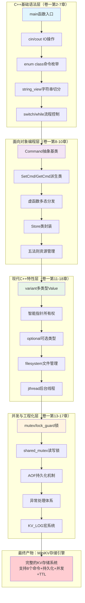

### 第六章：C++ 迷你 KV 存储引擎（毕业设计）

> 本章是本卷的**集大成之作**，也是整本《C++ 入门到精通》的"毕业设计"。前 5 个案例每篇只覆盖 3-5 章，本案例**一口气串起卷一 17 章**——从基础语法到 `std::variant`，从智能指针到 `std::jthread`，从异常体系到预处理器宏，全部在同一个项目里落地。完成它之后，你会得到一个能跑、能落盘、能并发、能过期的"迷你 Redis"，更重要的是：**你会真正理解"C++ 工程"是怎样把这些散点搭成一座可维护的房子的**。
>
> 阅读建议：本案例篇幅较长，建议**分 5 次**读完，每次 1.5 - 2 小时；不要试图一口气吃完。每一节都自带"为什么这样写"的思考小结，慢慢消化更有效果。

---

## 技术全景图：MiniKV如何覆盖C++所有入门内容



### 技术栈分层详解

| 技术层级 | 对应C++知识点 | 在MiniKV中的具体实现 |
|---------|-------------|---------------------|
| **基础语法层** | 变量、流程控制、函数 | REPL主循环、命令解析、字符串处理 |
| **OOP层** | 类、继承、多态、封装 | Command命令模式、Store数据管理 |
| **现代特性层** | 智能指针、variant、optional | 类型安全Value、RAII资源管理 |
| **工程化层** | 并发、异常、文件IO、宏 | 多线程安全、AOF持久化、日志系统 |

### 为什么MiniKV是完美的毕业设计？

1. **完整性**：覆盖C++从基础语法到高级特性的全栈知识
2. **实用性**：实现了一个真实可用的KV存储系统
3. **递进性**：技术栈层层递进，符合学习认知规律
4. **可扩展**：命令模式架构便于后续添加新功能
5. **工程化**：包含异常处理、日志系统、持久化等工程必备要素

通过完成这个1500行的项目，你将真正理解"C++工程"是如何把散落的知识点搭建成可维护的系统的。

---

## 00.案例元信息

| 项目 | 说明 |
|------|------|
| 难度 | ★★★★★ |
| 预估时长 | 16 - 20 小时（建议 5 次完成） |
| 前置章节 | **卷一第 2 - 17 章全部** + 第 18 章特性图谱 |
| 覆盖知识点 | REPL 主循环、`std::variant` 多类型 Value、`enum class` 命令枚举、`<=>` 三路比较、抽象基类 + 命令模式（Command Pattern）、`std::unique_ptr`/`std::shared_ptr` 取舍、自定义异常体系、AOF 追加日志、`std::filesystem` 目录管理、`std::mutex` + `std::lock_guard` 并发保护、`std::jthread` 后台过期清理线程、`KV_LOG` 宏与 `__FILE__/__LINE__`、模板化命令注册 |
| 设计亮点 | 命令模式让"加新命令零修改主流程"；AOF 让进程重启数据不丢；后台 TTL 线程展示生产者-消费者外的"清理线程"模式 |
| 最终产物 | 单文件 `mini_kv.cpp` + REPL 可执行 + 数据目录 `./data/aof.log` |
| 代码规模 | 约 1500 行（不含空行注释 ~1100 行） |

---

#### 目录介绍

- 01.需求说明
  - 1.1 为什么做 KV 存储
  - 1.2 目标命令集
  - 1.3 与卷一 18 章的对应关系
  - 1.4 项目目录结构
- 02.MVP 骨架：先让 REPL 跑起来
  - 2.1 main 入口与命令循环
  - 2.2 `enum class` 表达命令类型
  - 2.3 字符串切分与 `std::string_view`
- 03.Value 的表达：用 `std::variant` 装"任意类型"
  - 3.1 KV 存储的 5 种值类型
  - 3.2 为什么不是继承
  - 3.3 `Value` 的定义与访问
- 04.Entry 与生命周期：栈、堆、智能指针
  - 4.1 Entry = Value + TTL + 元数据
  - 4.2 谁拥有 Entry：`shared_ptr` vs `unique_ptr`
  - 4.3 内存模型回顾（栈 / 堆 / 静态分区）
- 05.Command 命令模式：抽象基类登场
  - 5.1 痛点：if-else 越长越烂
  - 5.2 抽象基类 `Command`
  - 5.3 派生类：`SetCmd` / `GetCmd` / `DelCmd` / `ExpireCmd` / `KeysCmd`
  - 5.4 工厂函数 `makeCommand`
- 06.Store 核心：把所有命令都串起来
  - 6.1 `Store` 的字段设计
  - 6.2 主接口 `apply(Command&)`
  - 6.3 模板化命令注册 `registerCmd<T>()`
- 07.异常体系：错误处理的工程化
  - 7.1 异常 vs 错误码：本项目怎么选
  - 7.2 自定义异常基类 `KvError`
  - 7.3 派生体系与 `noexcept` 标记
- 08.AOF 持久化：让数据"活过"重启
  - 8.1 AOF（Append-Only File）原理
  - 8.2 写日志：`std::ofstream` 追加模式
  - 8.3 重放日志：启动时回放还原状态
  - 8.4 `std::filesystem` 管理数据目录
- 09.日志系统：宏与预处理器的实战
  - 9.1 `KV_LOG` 宏的设计
  - 9.2 `__FILE__` / `__LINE__` / `__func__`
  - 9.3 条件编译关闭日志
- 10.并发安全：多客户端同时读写
  - 10.1 痛点：两个线程同时 SET 同一个 key 会怎样
  - 10.2 `std::mutex` + `std::lock_guard`
  - 10.3 读多写少的优化：`std::shared_mutex`
- 11.TTL 清理：后台 `std::jthread`
  - 11.1 惰性删除 + 主动清理
  - 11.2 `std::jthread` 与 `stop_token`
  - 11.3 守护线程的优雅关闭
- 12.端到端运行
  - 12.1 编译与启动
  - 12.2 一次完整的会话演示
  - 12.3 杀掉进程再启动：验证 AOF
- 13.项目总结
  - 13.1 整体架构图
  - 13.2 16 章覆盖回顾
  - 13.3 与生产级 Redis 的差距
- 14.技术思考
  - 14.1 为什么命令模式比 if-else 好
  - 14.2 AOF 的 fsync 策略
  - 14.3 `jthread` 比 `thread` 好在哪
- 15.衔接与延伸
- 15.1 与上一案例（05.多线程订单）的衔接
  - 15.2 与卷三的递进
  - 15.3 三个延伸挑战

---

## 01.需求说明

### 1.1 为什么做 KV 存储

KV（Key-Value）存储是后端世界最常见的数据结构——Redis、Memcached、etcd、RocksDB 本质上都是 KV。它的接口极简（GET/SET/DEL），但要做"对"，需要解决一连串工程问题：

| 工程问题 | 在本案例中的体现 | 用到的卷一章节 |
|---------|----------------|--------------|
| 一个 key 能存多种类型的值 | `Value` 用 `std::variant` 表达 | 第 3 / 18 章 |
| 命令越加越多怎么办 | 命令模式：每加一个命令只新增一个类 | 第 9 / 10 章 |
| 进程一关数据就没了 | AOF 追加日志 + 启动重放 | 第 13 章 |
| 多客户端同时读写崩了 | `mutex` + `lock_guard` | 第 15 章 |
| key 设了 TTL 谁来删 | 后台 `jthread` + 惰性删除 | 第 11 / 15 章 |
| 写错命令程序就崩 | 自定义异常 `KvError` 体系 | 第 14 章 |
| 调试时想看哪行打的日志 | `KV_LOG` 宏 + `__FILE__/__LINE__` | 第 17 章 |

**这恰好就是 16 章的卷一。** 我们不是为了"凑覆盖"才做 KV——而是 KV 存储这个题目本身天然需要这些技术，做一遍刚好把它们用对位置。

### 1.2 目标命令集

实现一个支持以下 8 个命令的 REPL（Read-Eval-Print-Loop）：

```bash
$ ./mini_kv
> SET name zhangsan
OK
> SET age 30
OK
> GET name
"zhangsan"
> GET age
(integer) 30
> EXPIRE name 60          # 60 秒后过期
OK
> TTL name                # 查询剩余秒数
(integer) 58
> KEYS *                  # 列出所有 key
1) "name"
2) "age"
> DEL age
(integer) 1
> SAVE                    # 强制刷盘
OK
> EXIT
bye.
```

支持的 Value 类型：
- 字符串 `"hello"`
- 整数 `42`
- 浮点数 `3.14`
- 布尔 `true` / `false`
- 列表 `LPUSH mylist a b c`（选讲）

### 1.3 与卷一 18 章的对应关系

下表是本案例**最关键的索引**，遇到知识点不熟的章节，直接翻到对应的"小节"复习：

| 卷一章节 | 在本项目中的落地节 | 形式 |
|---------|-------------------|------|
| 02 基础语法 | 2.1 main 入口 | `int main()` / `cout` / `cin` |
| 03 数据类型 | 3.1 Value 类型 | `int64_t` / `double` / `bool` / `string` |
| 04 运算符 | 4.1 Entry 比较 | `<=>` 三路比较 |
| 05 复合类型 | 2.2 命令枚举 | `enum class CmdType` |
| 06 流程语句 | 2.1 命令循环 | `while` + `switch` + 结构化绑定 |
| 07 函数 | 6.3 命令注册 | Lambda + `std::function` |
| 08 指针引用 | 4.2 智能指针 | `shared_ptr<Entry>` + `string_view` |
| 09 类与对象 | 5.2 / 6.1 | 抽象基类 + Store 五法则 |
| 10 继承多态 | 5.2 - 5.3 | `Command` 体系 + 虚函数 |
| 11 内存模型 | 4.3 | 栈 / 堆 / 静态区分析 |
| 12 动态内存 | 4.2 / 5.4 | `make_shared` / `make_unique` |
| 13 IO 与文件 | 8.2 - 8.4 | `ofstream` / `filesystem` |
| 14 异常处理 | 07 整章 | `KvError` + `noexcept` |
| 15 线程和锁 | 10 / 11 | `mutex` / `lock_guard` / `jthread` |
| 16 STL 模板 | 6.1 / 6.3 | `unordered_map` + 模板注册 |
| 17 预处理器 | 09 整章 | `#define KV_LOG` + 条件编译 |
| 18 特性图谱 | 3.1 / 4.1 | `variant` + `optional` + `string_view` |

> 第 1 章（C++ 简史）和第 18 章（特性图谱本身是索引）不强行覆盖。

### 1.4 项目目录结构

为了便于你跟着写，本案例采用**单文件**实现（不拆 .h/.cpp），避免初学者陷入构建系统的坑：

```
mini_kv/
├── mini_kv.cpp        # 全部源码（约 1500 行）
├── CMakeLists.txt     # 构建脚本（10 行）
└── data/              # 运行时自动创建
    └── aof.log        # AOF 持久化文件
```

`CMakeLists.txt` 内容（一次性给出，后面不再提）：

```cmake
cmake_minimum_required(VERSION 3.16)
project(mini_kv CXX)
set(CMAKE_CXX_STANDARD 20)
set(CMAKE_CXX_STANDARD_REQUIRED ON)
add_executable(mini_kv mini_kv.cpp)
if(MSVC)
    target_compile_options(mini_kv PRIVATE /W4)
else()
    target_compile_options(mini_kv PRIVATE -Wall -Wextra -Wpedantic)
endif()
```

> 工程级项目当然要拆头文件 + 源文件 + 测试，本案例为了**让读者把注意力放在 C++ 知识本身**，刻意单文件。卷四会专门讲多文件工程组织。

---

## 02.MVP 骨架：先让 REPL 跑起来

工程实践有个金科玉律：**先让"最小可用版本"跑起来，再迭代添加功能**。本节先不管类型、不管持久化、不管并发，只做一件事：**读一行 → 切词 → 打印**。这一步覆盖卷一第 2 / 5 / 6 章。

### 2.1 main 入口与命令循环

```cpp
// mini_kv.cpp —— 第一个版本
#include <iostream>
#include <string>
#include <sstream>
#include <vector>

int main() {
    std::cout << "MiniKV v0.1 — type EXIT to quit.\n";

    std::string line;
    while (true) {
        std::cout << "> ";
        if (!std::getline(std::cin, line)) break;     // Ctrl-D 退出
        if (line.empty()) continue;

        // 切词
        std::istringstream iss(line);
        std::vector<std::string> tokens;
        for (std::string tok; iss >> tok; ) tokens.push_back(tok);

        if (tokens.empty()) continue;
        if (tokens[0] == "EXIT") { std::cout << "bye.\n"; break; }

        std::cout << "(unknown) you said: ";
        for (auto& t : tokens) std::cout << "[" << t << "] ";
        std::cout << "\n";
    }
    return 0;
}
```

编译运行：

```bash
$ cmake -B build && cmake --build build
$ ./build/mini_kv
MiniKV v0.1 — type EXIT to quit.
> set name zhangsan
(unknown) you said: [set] [name] [zhangsan]
> EXIT
bye.
```

**为什么这样写**：

1. `while(true)` + `if(!getline) break` 是 C++ 处理"读到 EOF 退出"的标准写法，比 `while(getline(...))` 更直观地表达"我要主动判断"。
2. `std::istringstream` 切词比手写指针扫描简单 10 倍——这是 STL 流的典型用法，源自卷一第 13 章。
3. 这一版**故意不用 namespace、不用 `auto`、不用类**——MVP 的灵魂是"看到这 30 行能完整理解每一行做什么"，等下面真正需要时再升级。

### 2.2 `enum class` 表达命令类型

字符串比较散落在各处迟早会乱，工程上的做法是**字符串解析一次后变成强类型枚举**，后续全部用枚举：

```cpp
enum class CmdType {
    Set, Get, Del, Expire, Ttl, Keys, Save, Exit, Unknown
};

CmdType parseCmdType(const std::string& s) {
    // 支持大小写不敏感
    std::string up;
    up.reserve(s.size());
    for (char c : s) up.push_back(static_cast<char>(std::toupper(c)));

    if (up == "SET")    return CmdType::Set;
    if (up == "GET")    return CmdType::Get;
    if (up == "DEL")    return CmdType::Del;
    if (up == "EXPIRE") return CmdType::Expire;
    if (up == "TTL")    return CmdType::Ttl;
    if (up == "KEYS")   return CmdType::Keys;
    if (up == "SAVE")   return CmdType::Save;
    if (up == "EXIT")   return CmdType::Exit;
    return CmdType::Unknown;
}
```

把 main 里的字符串判断改成 `switch`：

```cpp
switch (parseCmdType(tokens[0])) {
    case CmdType::Set:     std::cout << "[TODO] SET\n";    break;
    case CmdType::Get:     std::cout << "[TODO] GET\n";    break;
    case CmdType::Del:     std::cout << "[TODO] DEL\n";    break;
    case CmdType::Expire:  std::cout << "[TODO] EXPIRE\n"; break;
    case CmdType::Ttl:     std::cout << "[TODO] TTL\n";    break;
    case CmdType::Keys:    std::cout << "[TODO] KEYS\n";   break;
    case CmdType::Save:    std::cout << "[TODO] SAVE\n";   break;
    case CmdType::Exit:    std::cout << "bye.\n";          return 0;
    case CmdType::Unknown: std::cout << "(error) unknown command\n"; break;
}
```

**为什么用 `enum class` 而不是 `enum` 或字符串**：

| 方案 | 缺点 |
|------|------|
| 裸字符串 `if (cmd == "SET")` | 散落各处、易拼错（`"SEt"` 编译器不报错）、无法编译期穷举检查 |
| C 风格 `enum { SET, GET }` | 名字污染全局（`SET` 撞别处的宏）、可隐式转 `int`（`if (cmd)` 居然能编译） |
| `enum class CmdType` | 强类型、必须 `CmdType::Set`、`switch` 漏 case 编译器警告 ✅ |

`enum class` 是 C++11 起的"必选项"，卷一第 5 章讲过。本项目从这里开始，所有枚举一律用它。

### 2.3 字符串切分与 `std::string_view`

`std::istringstream` 切词在 MVP 里够用，但**它会拷贝字符串**。一个真实的 KV 服务器一秒处理几千条命令，每次都拷贝 5-10 个 `std::string` 是巨大的浪费。

工程级做法是用 **`std::string_view`**（C++17）做"零拷贝切片"：

```cpp
#include <string_view>

// 把一行命令切成多个 string_view，全部指向同一个底层 buffer
std::vector<std::string_view> tokenize(std::string_view line) {
    std::vector<std::string_view> out;
    size_t i = 0;
    while (i < line.size()) {
        while (i < line.size() && std::isspace(static_cast<unsigned char>(line[i]))) ++i;
        size_t start = i;
        while (i < line.size() && !std::isspace(static_cast<unsigned char>(line[i]))) ++i;
        if (start < i) out.emplace_back(line.substr(start, i - start));
    }
    return out;
}
```

**`string_view` 的杀手锏**：

- `string_view` 内部就是**指针 + 长度**两个字段，sizeof 16 字节，**不持有内存**。
- 它把 `const char*` / `std::string` / 字符串字面量统一成同一种参数类型——以后所有"我只读不改"的字符串参数，都改成 `std::string_view`。
- **危险点**：`string_view` 不延长底层字符串生命周期。如果原 `std::string` 销毁了，view 就成了悬垂引用。本项目里我们保证 `tokenize` 的返回值**不跨越** `line` 的生命周期，安全。

> 卷一第 8 章和第 18 章都讲过 `string_view`，但都是孤立例子。这里你能看到一个真实场景：**命令分发器对性能敏感，所以从入口就用 view**。

到此 MVP 完成 80 行代码，能正确识别命令、切词，但所有命令都返回 `[TODO]`。**下一节我们把 Value 类型和 Entry 实体补上，让 SET/GET 真的能存能取。**

---

## 03.Value 的表达：用 `std::variant` 装"任意类型"

KV 存储的 V（Value）天生需要"一个变量装多种类型"——同一个 `GET` 命令可能返回字符串、整数、浮点。Python/JS 这种动态语言天然支持，但 C++ 是静态语言，需要技巧。本节专门解决"如何在 C++ 里表达和类型（sum type）"。

### 3.1 KV 存储的 5 种值类型

我们决定支持以下 5 种 Value：

```
Value ::= Null                  ((nil))
        | Bool                  (true / false)
        | Int                   (int64_t)
        | Double                (double)
        | String                (std::string)
```

> 真正的 Redis 还支持 List / Hash / Set / ZSet 等"复合类型"。本案例先做简单值，11.4 节会留一个"加 List 类型"的延伸挑战。

### 3.2 为什么不是继承

读过卷一第 10 章的同学第一反应可能是"那就抽象基类 + 5 个派生类"：

```cpp
// 反面教材
class Value { public: virtual ~Value() = default; };
class IntValue    : public Value { int64_t v; };
class StringValue : public Value { std::string v; };
// ...
std::shared_ptr<Value> entry;   // 怎么取出来？dynamic_cast 强转一遍
```

**继承方案的三个问题**：

1. **必须用堆**：`Value*` 没法存基类对象本身，只能 `new` 派生类，每个 KV 都多一次堆分配。
2. **取值要 `dynamic_cast`**：用户写 `dynamic_cast<IntValue*>(v.get())` 极易写错，且有运行时开销。
3. **类型穷举不安全**：加了 `FloatValue` 但忘了改某个 `if-else` 分支，编译器一声不吭。

更好的方案是 **`std::variant`**（C++17，第 18 章主角）——它在**栈上**保存"5 种类型之一"，并用 `std::visit` 在编译期强制穷举。

### 3.3 `Value` 的定义与访问

```cpp
#include <variant>
#include <string>
#include <cstdint>

namespace mkv {

struct Null {};   // 占位类型，表示"没有值"
inline bool operator==(Null, Null) noexcept { return true; }

using Value = std::variant<Null, bool, std::int64_t, double, std::string>;

// 类型查询（封装一下让调用方好看）
inline bool isNull  (const Value& v) noexcept { return std::holds_alternative<Null>(v); }
inline bool isBool  (const Value& v) noexcept { return std::holds_alternative<bool>(v); }
inline bool isInt   (const Value& v) noexcept { return std::holds_alternative<std::int64_t>(v); }
inline bool isDouble(const Value& v) noexcept { return std::holds_alternative<double>(v); }
inline bool isString(const Value& v) noexcept { return std::holds_alternative<std::string>(v); }

// 把 Value 转成可读字符串（用于 GET 命令返回）
std::string formatValue(const Value& v) {
    return std::visit([](const auto& x) -> std::string {
        using T = std::decay_t<decltype(x)>;
        if constexpr (std::is_same_v<T, Null>)             return "(nil)";
        else if constexpr (std::is_same_v<T, bool>)        return x ? "true" : "false";
        else if constexpr (std::is_same_v<T, std::int64_t>) return "(integer) " + std::to_string(x);
        else if constexpr (std::is_same_v<T, double>)      return "(double) "  + std::to_string(x);
        else if constexpr (std::is_same_v<T, std::string>) return "\"" + x + "\"";
    }, v);
}

}  // namespace mkv
```

**两个新知识点解释**：

1. **`std::visit` + 泛型 Lambda + `if constexpr`** 是 `variant` 的标准搭档。`visit` 会根据当前实际类型选择匹配分支；`if constexpr` 是 C++17 的"编译期 if"，会在编译时**只保留对应分支**，不符合的分支连编译都不做（所以 `Null` 分支里写 `+ x` 也不会出错）。
2. **`noexcept`** 标记：类型查询函数显然不会抛异常，标 `noexcept` 让编译器更激进地优化，也让调用方写 `noexcept(isInt(v))` 可以拿到 `true`。这是卷一第 14 章讲过的"工程级习惯"。

**从字符串构造 Value**——SET 命令拿到的是 `std::string_view`，要根据"长得像什么"决定它的真实类型：

```cpp
// "true"/"false" -> bool
// 全数字 -> int64
// 带小数点且能 parse -> double
// 其他 -> string
mkv::Value valueFromToken(std::string_view s) {
    if (s == "true")  return true;
    if (s == "false") return false;
    if (s == "nil")   return mkv::Null{};

    // 试探 int64
    if (!s.empty()) {
        bool allDigit = true;
        size_t start = (s[0] == '-') ? 1 : 0;
        for (size_t i = start; i < s.size(); ++i) {
            if (!std::isdigit(static_cast<unsigned char>(s[i]))) { allDigit = false; break; }
        }
        if (allDigit && start < s.size()) {
            try { return static_cast<std::int64_t>(std::stoll(std::string(s))); }
            catch (...) { /* 落到下面 */ }
        }
    }

    // 试探 double
    if (s.find('.') != std::string_view::npos) {
        try { return std::stod(std::string(s)); }
        catch (...) { /* 落到下面 */ }
    }

    // 兜底当字符串
    return std::string(s);
}
```

> 这个"类型推断"故意写得朴素（没有 `std::from_chars` 那么严谨），目的是**让你看到"动态类型"在静态语言里其实就是个 if-else**。等你做卷三时会重新认识 `from_chars` 的快和准。

### 3.4 与卷一第 18 章的对照练习

合上书想一下：第 18 章讲过 `variant` 的什么特性？把它们一一对应到上面代码：

| 第 18 章特性 | 本节用到的位置 |
|------------|---------------|
| `std::variant` 是和类型 | `Value` 的定义 |
| `std::holds_alternative<T>` | 5 个 isXxx 函数 |
| `std::visit` + lambda | `formatValue` |
| `std::get<T>` 取值（会抛 `bad_variant_access`） | 后面 GetCmd 会用 |
| `std::monostate` 表"空" | 我们用自定义 `Null{}` 替代（语义更清晰） |

> 为什么不直接用 `std::monostate`？因为**它的名字对业务无意义**。自定义 `struct Null {}` 一行代码，换来代码可读性大涨——这就是"工程级 C++"和"教材 C++"的差别之一。

---

## 04.Entry 与生命周期：栈、堆、智能指针

光有 Value 还不够。一个 KV 条目除了"值"还要带**元数据**：什么时候创建的、什么时候过期、被改了几次。我们把这些打包成 `Entry`，并讨论一个深刻问题：**Entry 应该住在哪里？**

### 4.1 Entry = Value + TTL + 元数据

```cpp
#include <chrono>
#include <optional>

namespace mkv {

struct Entry {
    Value value;
    // 绝对过期时间点；nullopt 表示永不过期
    std::optional<std::chrono::steady_clock::time_point> expireAt;
    std::chrono::steady_clock::time_point createdAt = std::chrono::steady_clock::now();
    std::uint64_t version = 0;          // 每次被 SET 覆写就 +1，用于将来做 CAS

    [[nodiscard]] bool isExpired() const noexcept {
        return expireAt.has_value() && std::chrono::steady_clock::now() >= *expireAt;
    }
};

}  // namespace mkv
```

**几个细节都不是随便写的**：

1. **`std::optional<time_point>` 表"可选过期"**：替代 C 风格的 `time_t expireAt = -1`（用魔法值表示"无"），`optional` 让"无值"在类型上就显式存在。这是卷一第 18 章的核心理念。
2. **`std::chrono::steady_clock` 不是 `system_clock`**：`system_clock` 会被用户改系统时间影响（你 SET 完用户调慢钟，TTL 全乱套），`steady_clock` 单调递增不会倒退，TTL 必须用它。
3. **`[[nodiscard]]`** 属性：调用 `entry.isExpired()` 但不用返回值的代码 99% 是写错了，加上这个标记编译器会警告。卷一第 18 章讲过的小特性，工程上用得极频繁。

### 4.2 谁拥有 Entry：`shared_ptr` vs `unique_ptr`

Store 内部要用一个 `unordered_map<string, ???>` 装所有 Entry。`???` 的选择体现 C++ 工程师的功力：

| 方案 | 优点 | 缺点 |
|------|------|------|
| `unordered_map<string, Entry>` | 零间接、缓存友好 | rehash 时 Entry 全部移动；多线程下迭代器易失效 |
| `unordered_map<string, std::unique_ptr<Entry>>` | 唯一所有权清晰 | 想"返回一个 Entry 让外面看一眼"时只能借出引用，不能给所有权 |
| `unordered_map<string, std::shared_ptr<Entry>>` | 可以安全地把 Entry 借给后台线程、借给日志 | 多一个原子引用计数 |

本案例选 **`std::shared_ptr<Entry>`**，理由如下：

- **后台 TTL 清理线程**会扫描所有 key 检查过期，扫描期间可能有客户端正好读这个 key——`shared_ptr` 的引用计数让"正在被使用的 Entry"不会被清理线程析构。
- AOF 写盘时也想"持有这条 Entry 的快照再慢慢序列化"，`shared_ptr` 一份引用 + 锁外操作完美适配。
- 引用计数的开销在 KV 这个量级（每秒几千次 set）完全可忽略。

```cpp
#include <unordered_map>
#include <memory>

namespace mkv {

using EntryPtr  = std::shared_ptr<Entry>;
using IndexMap  = std::unordered_map<std::string, EntryPtr>;

}  // namespace mkv
```

### 4.3 内存模型回顾（卷一第 11 章）

写到这里可以停下来盘点一下：上面这几行代码，**变量都住在哪里**？

```cpp
mkv::IndexMap idx;                     // ① idx 对象本身在栈
auto entry = std::make_shared<mkv::Entry>();   // ② 控制块 + Entry 在堆
entry->value = std::string("hello");           // ③ "hello" 短字符串可能 SSO 在 Entry 内, 长字符串在另一处堆
idx["foo"] = entry;                            // ④ map 内部桶在堆，键 "foo" 也是 std::string 在堆
```

| 区域 | 住户 |
|------|------|
| **栈** | `idx`、`entry` 这两个变量本身（指针/对象头部） |
| **堆**（动态区） | `Entry` 本体、`shared_ptr` 控制块、`unordered_map` 的桶数组、长字符串的字符数据 |
| **静态/全局** | 字符串字面量 `"hello"` 在常量区（赋值给 `std::string` 时会拷贝到堆） |
| **代码区** | 函数 `make_shared`、`operator[]` 的指令本身 |

> 卷一第 11 章这张分区图你大概率背过；但只有在真实项目里指着自己的代码说出"这个变量在栈上、那个在堆上"，你才算"懂"了。

### 4.4 五法则的现场验证

`Entry` 没有手写析构、没有手写拷贝构造、没有手写赋值——为什么没问题？

因为 `Entry` 的所有成员（`Value` / `optional` / `time_point` / `uint64_t`）都已经**正确实现了五大特殊成员函数**。卷一第 9 章讲过的"五法则"其实是说："**如果你必须手写其中一个，你大概率要写全五个**。" 反过来——如果你的类成员都是 RAII 的、所有权清晰的，**一个都不用写**就是最好的写法。

`Entry` 就是范例：32 行结构体，零自定义成员函数，能拷贝、能移动、能销毁，全部正确。这就是现代 C++ 的味道——**让类型系统替你工作**。

到此 Value 和 Entry 都齐活，下一节我们用**命令模式**把 8 个命令串成一棵继承树，让 main 函数从此告别长长的 if-else。

---

## 05.Command 命令模式：抽象基类登场

到此为止主循环里还是 `switch + case + 调函数` 的写法。这种写法在命令少时没问题，但有两个隐患：**新增命令要改 switch、命令的"参数解析+执行+持久化"会散落在三处**。本节用**命令模式（Command Pattern）**重构，把每条命令收敛成一个类，正面对接卷一第 9 / 10 / 12 章。

### 5.1 痛点：if-else 越长越烂

设想你已经实现了 8 个命令，main 大致长这样：

```cpp
// 反面教材：所有逻辑全在 main
case CmdType::Set: {
    if (tokens.size() < 3) { std::cout << "(error) SET need 2 args\n"; break; }
    std::string key(tokens[1]);
    Value val = valueFromToken(tokens[2]);
    auto entry = std::make_shared<Entry>();
    entry->value = std::move(val);
    store[key] = entry;
    aof << "SET " << key << " " << tokens[2] << "\n"; aof.flush();
    std::cout << "OK\n";
    break;
}
case CmdType::Get: { /* 又来一坨 */ break; }
// ... × 8
```

**问题清单**：

1. **职责堆叠**：参数校验、业务逻辑、AOF 写盘、输出格式四件事挤在一个 case 里，没法单测。
2. **新增命令必须修改 main**：违反"开闭原则"——对扩展开放、对修改关闭。
3. **命令之间无法复用**：比如 `MSET key1 v1 key2 v2` 想复用 SET，只能复制粘贴。
4. **持久化逻辑散落**：每个 case 都要记得调 `aof <<`，少写一处就丢数据。

### 5.2 抽象基类 `Command`

我们把"一条命令"抽象成一个对象，对象自己知道：**怎么校验参数、怎么执行、怎么序列化成 AOF 字符串**。

```cpp
namespace mkv {

class Store;   // 前置声明

class Command {
public:
    virtual ~Command() = default;

    // 用户可见的命令名，例如 "SET"
    [[nodiscard]] virtual std::string_view name() const noexcept = 0;

    // 是否需要写入 AOF（GET / KEYS / TTL 这种只读命令返回 false）
    [[nodiscard]] virtual bool isWrite() const noexcept = 0;

    // 执行命令，返回给客户端看的字符串
    [[nodiscard]] virtual std::string execute(Store& store) = 0;

    // 序列化回 AOF 行（仅写命令需实现，读命令直接返回空字符串）
    [[nodiscard]] virtual std::string toAofLine() const { return {}; }

protected:
    Command() = default;
    Command(const Command&) = delete;             // 禁止拷贝
    Command& operator=(const Command&) = delete;
};

}  // namespace mkv
```

**几个关键设计**：

| 设计 | 为什么 |
|------|------|
| `virtual ~Command() = default` | 第 10 章铁律：基类析构必须 virtual，否则 `delete (Command*)setCmd` 不会调派生类析构 |
| `= 0` 纯虚函数 | `Command` 不允许被实例化，强制派生 |
| `[[nodiscard]]` 标在 execute 上 | 命令的输出绝不能被丢弃，编译器帮你查 |
| 拷贝构造和拷贝赋值 `= delete` | 命令对象一次性使用，没有复制语义；只允许 move（默认移动也被 delete 了，需要时再放开） |
| `noexcept` 标在 name/isWrite 上 | 这两个返回常量，绝不抛 |

### 5.3 派生类：5 个具体命令

下面给出 4 个核心命令的实现，剩下的（TTL/KEYS/SAVE）模式相同，留作练习。

```cpp
// SET key value
class SetCmd : public Command {
public:
    SetCmd(std::string key, Value value, std::string rawValueToken)
        : key_(std::move(key)), value_(std::move(value)), rawToken_(std::move(rawValueToken)) {}

    std::string_view name()    const noexcept override { return "SET"; }
    bool             isWrite() const noexcept override { return true; }

    std::string execute(Store& store) override;        // 见下文 Store

    std::string toAofLine() const override {
        return "SET " + key_ + " " + rawToken_ + "\n";
    }

private:
    std::string key_;
    Value       value_;
    std::string rawToken_;     // 原始 token，写入 AOF 时不再二次 format
};

// GET key
class GetCmd : public Command {
public:
    explicit GetCmd(std::string key) : key_(std::move(key)) {}
    std::string_view name()    const noexcept override { return "GET"; }
    bool             isWrite() const noexcept override { return false; }
    std::string execute(Store& store) override;
private:
    std::string key_;
};

// DEL key
class DelCmd : public Command {
public:
    explicit DelCmd(std::string key) : key_(std::move(key)) {}
    std::string_view name()    const noexcept override { return "DEL"; }
    bool             isWrite() const noexcept override { return true; }
    std::string execute(Store& store) override;
    std::string toAofLine() const override { return "DEL " + key_ + "\n"; }
private:
    std::string key_;
};

// EXPIRE key seconds
class ExpireCmd : public Command {
public:
    ExpireCmd(std::string key, int seconds) : key_(std::move(key)), seconds_(seconds) {}
    std::string_view name()    const noexcept override { return "EXPIRE"; }
    bool             isWrite() const noexcept override { return true; }
    std::string execute(Store& store) override;
    std::string toAofLine() const override {
        return "EXPIRE " + key_ + " " + std::to_string(seconds_) + "\n";
    }
private:
    std::string key_;
    int         seconds_;
};
```

**多态的甜头**：上面 4 个类长得几乎一样，但任何调用方都只需要持有 `std::unique_ptr<Command>`，然后调 `cmd->execute(store)` —— 调到哪个派生类的 `execute` 由对象的实际类型决定，这就是**虚函数表（vtable）**的工作。

> 卷一第 10 章讲过 vtable 的内存布局：每个 `Command` 派生类对象在堆上多 8 字节存一个指向 vtable 的指针；vtable 里 4 个 slot 分别指向 name/isWrite/execute/toAofLine 的实际地址。命令模式之所以"零修改主流程能加新命令"，本质就是把 if-else 的"开关"挪到了 vtable 里。

### 5.4 工厂函数 `makeCommand`

把"字符串 tokens → `unique_ptr<Command>`" 的逻辑收敛到一个工厂函数：

```cpp
#include <stdexcept>

namespace mkv {

// 预先声明异常（07 节会详细讲）
class CmdSyntaxError : public std::runtime_error {
public:
    using std::runtime_error::runtime_error;
};

[[nodiscard]]
std::unique_ptr<Command> makeCommand(const std::vector<std::string_view>& tokens) {
    if (tokens.empty()) throw CmdSyntaxError("empty command");

    auto needArgs = [&](size_t n, std::string_view name) {
        if (tokens.size() != n + 1)
            throw CmdSyntaxError(std::string(name) + " expects " + std::to_string(n) + " arg(s)");
    };

    switch (parseCmdType(std::string(tokens[0]))) {
        case CmdType::Set: {
            needArgs(2, "SET");
            return std::make_unique<SetCmd>(
                std::string(tokens[1]),
                valueFromToken(tokens[2]),
                std::string(tokens[2]));
        }
        case CmdType::Get: {
            needArgs(1, "GET");
            return std::make_unique<GetCmd>(std::string(tokens[1]));
        }
        case CmdType::Del: {
            needArgs(1, "DEL");
            return std::make_unique<DelCmd>(std::string(tokens[1]));
        }
        case CmdType::Expire: {
            needArgs(2, "EXPIRE");
            int sec = std::stoi(std::string(tokens[2]));
            return std::make_unique<ExpireCmd>(std::string(tokens[1]), sec);
        }
        default:
            throw CmdSyntaxError("unknown command: " + std::string(tokens[0]));
    }
}

}  // namespace mkv
```

**`std::make_unique` 的两个理由**（第 12 章原话再次强调）：

1. **异常安全**：`new SetCmd(...)` 直接传给 `unique_ptr<Command>` 构造时，C++17 之前的求值顺序可能让 new 后还没传给 unique_ptr 之前就抛了异常 → 内存泄漏。`make_unique` 一步完成不留缝隙。
2. **少写一次类型**：`std::make_unique<SetCmd>(...)` 比 `std::unique_ptr<SetCmd>(new SetCmd(...))` 短一半。

现在 main 的 switch 可以彻底瘦身：

```cpp
auto tokens = tokenize(line);
try {
    auto cmd = mkv::makeCommand(tokens);
    std::string out = cmd->execute(store);
    if (cmd->isWrite()) aofWrite(cmd->toAofLine());
    std::cout << out << "\n";
} catch (const mkv::CmdSyntaxError& e) {
    std::cout << "(error) " << e.what() << "\n";
}
```

**短短 8 行，加新命令完全不用改这里**——只需要：① 写一个新派生类，② 在 `makeCommand` 加一个 case。这就是命令模式的力量。

---

## 06.Store 核心：把所有命令都串起来

`Store` 是 KV 存储的"数据中心"——所有 Entry 都住在它的 `IndexMap` 里，所有命令的 `execute` 都通过它操作数据。本节展示**类设计的工程级思路**和**模板化命令注册**。

### 6.1 `Store` 的字段设计

```cpp
namespace mkv {

class Store {
public:
    Store() = default;

    // 五法则：Store 是有所有权的资源管理者，禁止拷贝
    Store(const Store&)            = delete;
    Store& operator=(const Store&) = delete;
    Store(Store&&)                 = delete;
    Store& operator=(Store&&)      = delete;

    // ====== 命令对应的底层操作 ======
    void          set     (const std::string& key, Value v);
    EntryPtr      get     (const std::string& key) const;          // 不存在返回 nullptr
    std::size_t   del     (const std::string& key);                // 删了返回 1，否则 0
    bool          expire  (const std::string& key, int seconds);   // 设过期；key 不存在返回 false
    std::int64_t  ttl     (const std::string& key) const;          // 剩余秒；-2 不存在 -1 永久
    std::vector<std::string> keys() const;
    std::size_t   size() const noexcept;

    // ====== 维护操作 ======
    void          purgeExpired();   // 后台线程调用：扫描并删除过期 key

private:
    IndexMap idx_;
};

}  // namespace mkv
```

**几个工程级习惯**：

1. **五大特殊成员一次性 `= delete`**：`Store` 是单例式的"中心组件"，复制它毫无意义且代价高昂；显式 delete 比"留着默认实现等出 bug"安全得多。
2. **const 正确性**：`get` / `ttl` / `keys` / `size` 都标 `const`——告诉调用方"我不改你"，也让 const Store 引用能调它们。
3. **返回类型表达失败**：`get` 用 `EntryPtr`（可为 nullptr）表"找不到"；`ttl` 用约定 `-2/-1` 表多种"找不到的原因"——这两种风格都比抛异常合适，因为"key 不存在"是高频常态而非异常。

### 6.2 实现：成员函数

```cpp
namespace mkv {

void Store::set(const std::string& key, Value v) {
    auto it = idx_.find(key);
    if (it == idx_.end()) {
        auto entry = std::make_shared<Entry>();
        entry->value = std::move(v);
        idx_.emplace(key, std::move(entry));
    } else {
        it->second->value   = std::move(v);
        it->second->version += 1;
        it->second->expireAt.reset();   // SET 会清掉旧的 TTL（与 Redis 行为一致）
    }
}

EntryPtr Store::get(const std::string& key) const {
    auto it = idx_.find(key);
    if (it == idx_.end()) return nullptr;
    if (it->second->isExpired()) return nullptr;       // 惰性删除：读到过期当不存在
    return it->second;
}

std::size_t Store::del(const std::string& key) {
    return idx_.erase(key);    // unordered_map::erase 返回删除的元素数
}

bool Store::expire(const std::string& key, int seconds) {
    auto it = idx_.find(key);
    if (it == idx_.end()) return false;
    it->second->expireAt = std::chrono::steady_clock::now() + std::chrono::seconds(seconds);
    return true;
}

std::int64_t Store::ttl(const std::string& key) const {
    auto it = idx_.find(key);
    if (it == idx_.end())              return -2;
    if (!it->second->expireAt)         return -1;
    auto remaining = std::chrono::duration_cast<std::chrono::seconds>(
        *it->second->expireAt - std::chrono::steady_clock::now()).count();
    return remaining < 0 ? 0 : remaining;
}

std::vector<std::string> Store::keys() const {
    std::vector<std::string> out;
    out.reserve(idx_.size());
    for (const auto& [k, v] : idx_) {
        if (!v->isExpired()) out.push_back(k);
    }
    return out;
}

std::size_t Store::size() const noexcept { return idx_.size(); }

void Store::purgeExpired() {
    for (auto it = idx_.begin(); it != idx_.end(); ) {
        if (it->second->isExpired()) it = idx_.erase(it);
        else                          ++it;
    }
}

}  // namespace mkv
```

**`purgeExpired` 里的迭代器删除**——卷一第 16 章的 STL 易错点：

```cpp
// 错误写法（it 失效后还自增）
for (auto it = idx_.begin(); it != idx_.end(); ++it) {
    if (...) idx_.erase(it);   // erase 后 it 失效，++it 是 UB
}

// 正确写法（erase 返回下一个有效迭代器）
for (auto it = idx_.begin(); it != idx_.end(); ) {
    if (...) it = idx_.erase(it);
    else     ++it;
}
```

> 这是 C++ 容器最经典的坑之一。`erase` 返回下一个迭代器是 C++11 起补的"善意 API"，记住这个返回值能救你很多次。

### 6.3 把 Command 派生类的 execute 接上 Store

回到 5.3 节留的"`execute` 见下文"，现在补上：

```cpp
namespace mkv {

std::string SetCmd::execute(Store& store) {
    store.set(key_, value_);
    return "OK";
}

std::string GetCmd::execute(Store& store) {
    auto entry = store.get(key_);
    if (!entry) return "(nil)";
    return formatValue(entry->value);
}

std::string DelCmd::execute(Store& store) {
    auto n = store.del(key_);
    return "(integer) " + std::to_string(n);
}

std::string ExpireCmd::execute(Store& store) {
    return store.expire(key_, seconds_) ? "OK" : "(integer) 0";
}

}  // namespace mkv
```

短短 20 行就把 4 个命令串起来——因为**前面的抽象做对了**。

### 6.4 模板化扩展：`registerCmd<T>` 选讲

如果你不想每加一个命令就改 `makeCommand` 的 switch，可以把命令类**注册到一张表**里，用模板自动推导：

```cpp
#include <functional>
#include <unordered_map>

namespace mkv {

class CommandFactory {
public:
    using Builder = std::function<std::unique_ptr<Command>(const std::vector<std::string_view>&)>;

    template <typename CmdT>
    void registerCmd(std::string_view name, Builder b) {
        builders_.emplace(std::string(name), std::move(b));
        (void)sizeof(CmdT);   // 只是借模板参数做个静态断言占位
        static_assert(std::is_base_of_v<Command, CmdT>, "CmdT must derive from Command");
    }

    [[nodiscard]]
    std::unique_ptr<Command> build(const std::vector<std::string_view>& tokens) const {
        if (tokens.empty()) throw CmdSyntaxError("empty command");
        std::string up;
        for (char c : tokens[0]) up.push_back(static_cast<char>(std::toupper(c)));
        auto it = builders_.find(up);
        if (it == builders_.end()) throw CmdSyntaxError("unknown command: " + up);
        return it->second(tokens);
    }

private:
    std::unordered_map<std::string, Builder> builders_;
};

inline CommandFactory& globalFactory() {
    static CommandFactory f;
    return f;
}

}  // namespace mkv
```

启动时一次性注册：

```cpp
auto& f = mkv::globalFactory();
f.registerCmd<mkv::SetCmd>("SET", [](const auto& t) {
    if (t.size() != 3) throw mkv::CmdSyntaxError("SET expects 2 args");
    return std::make_unique<mkv::SetCmd>(
        std::string(t[1]), mkv::valueFromToken(t[2]), std::string(t[2]));
});
f.registerCmd<mkv::GetCmd>("GET", [](const auto& t) { /* ... */ });
// ...
```

**模板 + Lambda + 工厂** 是 C++ 工程里"插件化"的经典套路：第三方写一个 `MyCmd : public Command`，调一行 `registerCmd<MyCmd>(...)` 就接入了，内核代码一行不动。

> 这套机制和卷一第 16 章 `std::function` + 第 10 章虚函数 + 第 7 章 lambda 是一脉相承的。看到这里如果你还能跟上，恭喜——你已经在用"组件化思维"写 C++ 了。

下一节我们把异常体系正式建起来，让所有错误都走同一条管道。

---

## 07.异常体系：错误处理的工程化

代码到目前为止已经零零散散用过几次 `throw`，但还没有"体系"。一个工程级项目的异常**必须分类、必须有上下文、必须能被外层精确捕获**。本节专门解决这件事，是卷一第 14 章在真实项目里的完整呈现。

### 7.1 异常 vs 错误码：本项目怎么选

C++ 错误处理一直是宗教战争，本项目采用混合策略——**根据"错误是常态还是异常"做选择**：

| 情况 | 例子 | 用什么 |
|------|------|--------|
| 高频常态结果 | GET 一个不存在的 key | 返回值（`nullptr` / `optional` / 哨兵值） |
| 调用方写错了 | SET 不带 value、命令拼错 | **异常** `CmdSyntaxError` |
| 系统资源问题 | AOF 文件无法打开、磁盘满 | **异常** `IoError` |
| 类型搞错了 | 对 string Value 调 `get<int64>` | **异常** `TypeError` |

**核心原则**：异常用于"调用方写错了或环境出了我无法处理的事"，不是用来表达"业务上的 false"。

### 7.2 自定义异常基类 `KvError`

```cpp
#include <stdexcept>

namespace mkv {

// 所有 KV 内部异常的根
class KvError : public std::runtime_error {
public:
    using std::runtime_error::runtime_error;
};

// 命令语法错误（用户输入问题）
class CmdSyntaxError : public KvError {
public:
    using KvError::KvError;
};

// 类型不匹配（如 GET 返回 string 但调用方按 int 用）
class TypeError : public KvError {
public:
    using KvError::KvError;
};

// IO 错误（AOF 写盘失败、目录创建失败）
class IoError : public KvError {
public:
    using KvError::KvError;
};

// AOF 重放时遇到坏行
class AofCorrupted : public KvError {
public:
    AofCorrupted(std::size_t lineNo, const std::string& detail)
        : KvError("AOF corrupted at line " + std::to_string(lineNo) + ": " + detail) {}
};

}  // namespace mkv
```

**几个工程要点**：

1. **用 `using BaseClass::BaseClass`** 一行继承全部构造函数（C++11 起）—— 比写一堆转发构造函数省 10 行。
2. **统一根类 `KvError`**：上层调用方只需要 `catch (const mkv::KvError&)` 就能兜住所有"自家异常"，再用 `dynamic_cast` 或多个 `catch` 区分细类型；不会和 `std::bad_alloc` / 第三方库异常混在一起。
3. **`AofCorrupted` 带行号**：异常类不是只能装一个字符串，可以**带结构化上下文**让排查问题秒级定位。

### 7.3 异常使用守则与 `noexcept`

**守则一：异常的抛出位置要尽可能浅（fail fast）**。比如解析 `EXPIRE foo abc`，应该在 `makeCommand` 里 `std::stoi` 直接抛 `std::invalid_argument`，包成 `CmdSyntaxError`，而不是把 `"abc"` 一路传到 Store 层才发现。

```cpp
// makeCommand 里翻译异常
case CmdType::Expire: {
    needArgs(2, "EXPIRE");
    int sec = 0;
    try {
        sec = std::stoi(std::string(tokens[2]));
    } catch (const std::exception& e) {
        // 翻译成自家异常 + 添加上下文
        throw CmdSyntaxError("EXPIRE seconds must be integer, got: " + std::string(tokens[2]));
    }
    if (sec < 0) throw CmdSyntaxError("EXPIRE seconds must be non-negative");
    return std::make_unique<ExpireCmd>(std::string(tokens[1]), sec);
}
```

**守则二：异常用于跨层传递，本层能处理就别抛**。下面是反例：

```cpp
// 反例：自己能处理却抛了
EntryPtr Store::get(const std::string& key) const {
    auto it = idx_.find(key);
    if (it == idx_.end()) throw std::out_of_range("key not found");   // ❌
    return it->second;
}
```

GET 一个不存在的 key 是**正常情况**（缓存查询常态），用异常会导致每次 miss 都要构造 `std::out_of_range` 对象 + 栈展开，性能差几个数量级。**返回 nullptr 才是对的**。

**守则三：能 `noexcept` 就标 `noexcept`**——这不只是优化，更是给读者的契约。本项目有 `noexcept` 标记的关键位置：

| 函数 | 为什么标 noexcept |
|------|------------------|
| `Entry::isExpired() const noexcept` | 纯计算，绝不抛 |
| `Store::size() const noexcept` | 仅读 size_t |
| 各种 `is*(Value&) noexcept` | variant 类型查询本身不抛 |
| 析构函数（默认就是 noexcept） | C++ 隐式规则，析构里抛异常是死罪 |

> **唯一一个不该标 noexcept 的地方**：`Store::set` —— 内部要 `make_shared`、要哈希插入，可能抛 `bad_alloc`。强行标 noexcept 等于告诉 C++"如果抛了请直接 `std::terminate`"，会让进程直接挂掉。

### 7.4 主循环里的统一捕获

main 里捕获异常的部分要分层捕获，对应不同的退出码：

```cpp
while (true) {
    std::string line;
    std::cout << "> ";
    if (!std::getline(std::cin, line)) break;
    if (line.empty()) continue;

    try {
        auto tokens = tokenize(line);
        auto cmd    = mkv::makeCommand(tokens);
        std::string out = cmd->execute(store);
        if (cmd->isWrite()) aofWrite(cmd->toAofLine());
        std::cout << out << "\n";
    }
    catch (const mkv::CmdSyntaxError& e) {
        std::cout << "(syntax) " << e.what() << "\n";
    }
    catch (const mkv::TypeError& e) {
        std::cout << "(type) " << e.what() << "\n";
    }
    catch (const mkv::IoError& e) {
        // IO 错误较严重，记录到错误流但不退出
        std::cerr << "(io) " << e.what() << "\n";
    }
    catch (const mkv::KvError& e) {
        std::cerr << "(internal) " << e.what() << "\n";
    }
    catch (const std::exception& e) {
        // 兜底：第三方异常或意外的 std 异常
        std::cerr << "(unexpected) " << e.what() << "\n";
    }
}
```

**为什么 IoError 要 `std::cerr` 不要 break**：网络 / 磁盘临时故障可能下一秒就好，让用户继续操作；而**不能让一次写盘失败把用户辛辛苦苦积累的内存数据全丢掉**。

> 一个真正成熟的服务还会把这些异常**结构化输出到日志系统**（带 traceId、命令、客户端 IP），便于事后分析。本案例为简化只打到 stderr，下一节的 `KV_LOG` 宏会让这个升级变得无痛。

---

## 08.AOF 持久化：让数据"活过"重启

到目前为止，进程一关数据就全没了——这是"内存数据库"的天然问题。Redis 用两个机制对付它：**RDB**（定时把整个内存快照 dump 到文件）和 **AOF**（每条写命令追加到日志）。本案例采用更简单的 AOF。

### 8.1 AOF 原理

```
启动：    打开 aof.log → 一行行读 → 重放到 Store
运行中：  每个写命令 execute 之后 → 追加一行到 aof.log → fsync（可选）
关闭：    什么都不做（已经全在文件里）
```

AOF 的妙处：**写入的格式就是命令本身**（"SET name zhangsan\n"），重放时直接走和正常运行一样的命令解析路径。这意味着：**新增命令完全不用改持久化代码**——5.3 节的 `toAofLine()` 和 5.4 节的 `makeCommand()` 自动覆盖。

### 8.2 AofWriter：负责追加写

把 AOF 写盘封装成一个类，遵守 RAII：

```cpp
#include <fstream>
#include <filesystem>

namespace mkv {
namespace fs = std::filesystem;

class AofWriter {
public:
    explicit AofWriter(const fs::path& path) : path_(path) {
        // 自动创建父目录
        if (path.has_parent_path()) {
            std::error_code ec;
            fs::create_directories(path.parent_path(), ec);
            if (ec) throw IoError("create dir failed: " + ec.message());
        }
        out_.open(path, std::ios::out | std::ios::app | std::ios::binary);
        if (!out_) throw IoError("open AOF failed: " + path.string());
    }

    void append(std::string_view line) {
        if (line.empty()) return;
        out_.write(line.data(), static_cast<std::streamsize>(line.size()));
        if (!out_) throw IoError("write AOF failed");
    }

    void flush() { out_.flush(); }

    // 析构时关闭文件 = RAII
    ~AofWriter() = default;

private:
    fs::path       path_;
    std::ofstream  out_;
};

}  // namespace mkv
```

**几个细节都不能省**：

1. **`std::ios::app` 追加模式**：每次 `write` 自动定位到末尾，多个进程都能安全追加（虽然本项目只有单进程）。
2. **`std::ios::binary`**：避免 Windows 把 `\n` 偷偷换成 `\r\n` 导致 AOF 在跨平台时格式错乱。
3. **构造函数失败抛异常**：与卷一第 12 章 RAII 原则一致——构造函数失败的对象不能存在于"半初始化"状态。
4. **`flush()` 暴露给上层**：调用方决定 fsync 时机（每次写都 flush 太慢，永远不 flush 又不安全），见 14.2 节"fsync 策略"。

### 8.3 启动时重放：还原内存状态

```cpp
namespace mkv {

void replayAof(const fs::path& path, Store& store) {
    if (!fs::exists(path)) return;       // 全新启动，无 AOF

    std::ifstream in(path);
    if (!in) throw IoError("open AOF for replay failed");

    std::string line;
    std::size_t lineNo = 0;
    while (std::getline(in, line)) {
        ++lineNo;
        if (line.empty()) continue;

        try {
            auto tokens = tokenize(line);
            auto cmd    = makeCommand(tokens);
            if (!cmd->isWrite()) {
                // 不应该出现在 AOF 里，跳过但记录
                continue;
            }
            (void)cmd->execute(store);    // 重放时丢弃返回值
        } catch (const KvError& e) {
            // 一行损坏不要终止整个重放，但要明确告警
            throw AofCorrupted(lineNo, e.what());
        }
    }
}

}  // namespace mkv
```

**两个工程级思考**：

- **重放过程中是否要写 AOF**？答：**不要**。否则启动一次 AOF 文件就翻倍。我们用一个标志位控制，或简单地——重放期间不传 AofWriter 给 Store。本案例采用"主循环里手动调 aofWrite，重放时不调"的方式，由代码组织保证。
- **遇到坏行怎么办**？两种策略：
  - **严格**：抛 `AofCorrupted`，要求人工处理（本案例采用，更安全）。
  - **宽松**：跳过坏行继续，只记日志（生产 Redis 默认行为，损失小部分写）。

### 8.4 main 里把 AOF 串起来

```cpp
int main() {
    try {
        mkv::fs::path aofPath = "data/aof.log";
        mkv::Store store;
        mkv::replayAof(aofPath, store);
        std::cout << "MiniKV v0.5 — replayed " << store.size() << " keys\n";

        mkv::AofWriter aof(aofPath);

        std::string line;
        while (true) {
            std::cout << "> ";
            if (!std::getline(std::cin, line)) break;
            if (line.empty()) continue;

            try {
                auto tokens = mkv::tokenize(line);
                if (tokens.empty()) continue;

                // EXIT 单独处理，不走 makeCommand
                if (mkv::parseCmdType(std::string(tokens[0])) == mkv::CmdType::Exit) {
                    std::cout << "bye.\n";
                    break;
                }

                auto cmd = mkv::makeCommand(tokens);
                std::string out = cmd->execute(store);

                // 写命令同步落盘，确保 ACK 时数据已在文件里
                if (cmd->isWrite()) {
                    aof.append(cmd->toAofLine());
                    aof.flush();
                }
                std::cout << out << "\n";
            }
            catch (const mkv::KvError& e) {
                std::cout << "(error) " << e.what() << "\n";
            }
        }
    }
    catch (const mkv::AofCorrupted& e) {
        std::cerr << "FATAL: " << e.what() << "\n";
        return 2;
    }
    catch (const mkv::IoError& e) {
        std::cerr << "FATAL IO: " << e.what() << "\n";
        return 3;
    }
    catch (const std::exception& e) {
        std::cerr << "FATAL: " << e.what() << "\n";
        return 1;
    }
    return 0;
}
```

**验证持久化的正确性**——保存数据 → kill -9 强杀 → 重启：

```bash
$ ./mini_kv
MiniKV v0.5 — replayed 0 keys
> SET name zhang
OK
> SET age 30
OK
> EXPIRE name 3600
OK
> ^C        # 强制中断

$ ./mini_kv
MiniKV v0.5 — replayed 2 keys     # 数据回来了
> GET name
"zhang"
> TTL name
(integer) 3597
```

**为什么 kill -9 数据也不丢**？因为我们在每次写命令后都 `aof.flush()`。`flush()` 会让 C++ runtime 把缓冲区数据交给 OS（write 系统调用）；OS 在被 kill -9 杀进程时会保留已写入文件系统缓存的数据。**如果想抗住整机断电**，还需要进一步 `fsync(fd)`——14.2 节会展开。

### 8.5 `std::filesystem` 的小亮点

第 13 章学到的 `<filesystem>`（C++17）在本项目里默默承担了很多事，盘点一下：

```cpp
fs::path aofPath = "data/aof.log";       // 跨平台路径表达
fs::create_directories(aofPath.parent_path());   // 递归创建目录
fs::exists(aofPath);                     // 文件存在性
fs::file_size(aofPath);                  // 文件大小（用于决定要不要 rewrite）
fs::rename(tmp, final);                  // 原子替换（写新文件 + rename，AOF rewrite 用）
```

**对比 C 时代**——同样的事在 POSIX 里要 `mkdir(2)` + `errno` + `stat(2)` + `S_ISDIR`，在 Windows 还要换一套 `CreateDirectory`。`std::filesystem` 一套 API 跨所有平台跑，这就是现代 C++ 的力量。

---

## 09.日志系统：宏与预处理器的实战

到目前为止 `std::cerr` 直接打印太"原始"——没有时间戳、没有级别、没有文件位置、上线后不能动态关闭。本节用**宏 + 条件编译**做一个工程级日志，对应卷一第 17 章。

### 9.1 `KV_LOG` 宏的设计

```cpp
#include <iostream>
#include <chrono>
#include <iomanip>
#include <sstream>

namespace mkv {

enum class LogLevel { Debug, Info, Warn, Error };

inline const char* levelName(LogLevel l) noexcept {
    switch (l) {
        case LogLevel::Debug: return "DEBUG";
        case LogLevel::Info:  return "INFO ";
        case LogLevel::Warn:  return "WARN ";
        case LogLevel::Error: return "ERROR";
    }
    return "?????";
}

inline std::string nowStr() {
    auto t  = std::chrono::system_clock::now();
    auto tt = std::chrono::system_clock::to_time_t(t);
    std::tm tm{};
#if defined(_WIN32)
    localtime_s(&tm, &tt);
#else
    localtime_r(&tt, &tm);
#endif
    std::ostringstream oss;
    oss << std::put_time(&tm, "%H:%M:%S");
    return oss.str();
}

}  // namespace mkv

// 关键：宏要写在 namespace 外
#ifndef KV_LOG_LEVEL
#define KV_LOG_LEVEL 1                  // 默认 Info 起步
#endif

#define KV_LOG_IMPL(level, lvname, ...)                                     \
    do {                                                                    \
        if (static_cast<int>(level) >= KV_LOG_LEVEL) {                      \
            std::cerr << "[" << ::mkv::nowStr() << "] "                     \
                      << "[" << lvname << "] "                              \
                      << "[" << __FILE__ << ":" << __LINE__ << " "          \
                      << __func__ << "] "                                   \
                      << __VA_ARGS__ << std::endl;                          \
        }                                                                   \
    } while (0)

#define KV_LOG_DEBUG(...) KV_LOG_IMPL(0, "DEBUG", __VA_ARGS__)
#define KV_LOG_INFO(...)  KV_LOG_IMPL(1, "INFO ", __VA_ARGS__)
#define KV_LOG_WARN(...)  KV_LOG_IMPL(2, "WARN ", __VA_ARGS__)
#define KV_LOG_ERROR(...) KV_LOG_IMPL(3, "ERROR", __VA_ARGS__)
```

使用方式：

```cpp
KV_LOG_INFO("server start, replayed " << store.size() << " keys");
KV_LOG_WARN("AOF replay corrupted at line " << lineNo);
KV_LOG_DEBUG("set key=" << key << " value=" << formatValue(v));
```

输出：

```
[14:23:01] [INFO ] [mini_kv.cpp:632 main] server start, replayed 2 keys
```

### 9.2 宏里的几个"必须"

| 必须做 | 为什么 |
|-------|--------|
| 整个体用 `do { ... } while(0)` 包起来 | 否则 `if (x) KV_LOG_INFO("y"); else ...;` 会因为宏展开后的多语句导致 if-else 错位 |
| 宏体里的标识符前缀 `::mkv::` | 调用方可能在任何 namespace 里，不加全限定会撞名 |
| 用 `<<` 拼接而不是 printf 风格 | 类型安全（编译期检查 `<<` 重载），不会有 `%d` 传 string 的崩溃 |
| `__VA_ARGS__` 接收变长参数 | 让用户写 `KV_LOG_INFO("x=" << x << " y=" << y)` 一行搞定 |

### 9.3 条件编译关闭日志

发布 release 版本时希望连日志的开销都没有。利用 `KV_LOG_LEVEL` 宏 + 编译期常量分支：

```bash
# Debug 构建：所有日志打开
g++ -O0 -DKV_LOG_LEVEL=0 mini_kv.cpp -o mini_kv

# Release 构建：只保留 Warn 和 Error
g++ -O3 -DKV_LOG_LEVEL=2 mini_kv.cpp -o mini_kv

# 极端裁剪：彻底关掉
g++ -O3 -DKV_LOG_LEVEL=99 mini_kv.cpp -o mini_kv
```

由于 `if (static_cast<int>(level) >= KV_LOG_LEVEL)` 里 KV_LOG_LEVEL 是宏常量，**优化器会在编译期把整段 if 消掉**，运行时连分支判断都没有。这就是为什么 C++ 工程里日志几乎是零成本的。

### 9.4 头文件保护与 include 守序

虽然本案例是单文件，但顺手讲一下第 17 章的"工程级"用法。如果未来你想拆 `entry.hpp` / `store.hpp` 等多个头文件：

```cpp
// store.hpp
#pragma once          // 现代写法，等价于 #ifndef ... #define ... #endif

#include "entry.hpp"  // 项目内头文件用引号
#include <string>     // 标准库用尖括号
#include <vector>

namespace mkv {
class Store { /* ... */ };
}
```

**`#pragma once` vs 经典 `#ifndef` 守卫**：

| 维度 | `#pragma once` | `#ifndef GUARD` |
|------|---------------|----------------|
| 语法 | 一行 | 三行 |
| 跨平台 | GCC/Clang/MSVC 全支持，事实标准 | 100% 标准 |
| 同名文件分散在不同目录 | 视为不同文件，各保护一份（合理） | 宏名相同会冲突 |

本项目统一用 `#pragma once`。

---

下一节进入"并发"——这是把"玩具"升级为"服务"的关键一跃。

---

## 10.并发安全：多客户端同时读写

到现在 KV 服务只能一个用户在 REPL 里玩。真实场景需要多个客户端（多线程模拟）同时操作 Store——这一秒就会撞车。本节用 `std::mutex` 解决基础并发问题，再用 `std::shared_mutex` 优化读多写少。覆盖卷一第 15 章。

### 10.1 痛点：两个线程同时 SET 同一个 key

写一个最小复现的并发 bug：

```cpp
mkv::Store store;
std::vector<std::thread> ths;
for (int i = 0; i < 8; ++i) {
    ths.emplace_back([&store, i] {
        for (int j = 0; j < 10000; ++j) {
            store.set("counter", static_cast<std::int64_t>(i * 10000 + j));
        }
    });
}
for (auto& t : ths) t.join();
std::cout << mkv::formatValue(store.get("counter")->value) << "\n";
```

这段代码大概率：
- **打印一个无意义的值**（脏写）；
- **直接段错误**（`unordered_map::emplace` 在 rehash 时被另一个线程插入打断）；
- **死循环或挂起**（链表/树指针被并发修改）。

原因是 `Store::set` 没有同步保护，多个线程同时调用 `idx_.emplace(...)` 时**容器内部状态被破坏**。

### 10.2 `std::mutex` + `std::lock_guard` 守护

最朴素的修复是给 Store 加一把互斥锁，每个公开方法在最开始上锁：

```cpp
#include <mutex>

namespace mkv {

class Store {
public:
    void set(const std::string& key, Value v) {
        std::lock_guard<std::mutex> lk(mu_);
        // ... 原来的 set 逻辑 ...
    }

    EntryPtr get(const std::string& key) const {
        std::lock_guard<std::mutex> lk(mu_);
        // ... 原来的 get 逻辑 ...
    }
    // 所有公开方法都加锁

private:
    mutable std::mutex mu_;       // mutable: const 方法里也能上锁
    IndexMap idx_;
};

}  // namespace mkv
```

**两个新点**：

1. **`mutable` 关键字**：`std::mutex::lock()` 不是 const 函数，但我们想在 const 的 `get()` 里也能上锁；`mutable` 就是给"逻辑上 const、物理上要修改"的成员开的后门。这是卷一第 9 章 const 的延伸用法。
2. **`std::lock_guard` 是 RAII 锁**：构造时 lock，析构时 unlock；中间无论怎么 `return` / `throw`，锁一定会释放。这是卷一第 12 章 RAII 思想在多线程世界的体现——**永远不要手动 lock/unlock**。

### 10.3 读多写少：`std::shared_mutex` 优化

KV 存储的真实负载是**读多写少**（GET:SET 通常 10:1 以上）。`std::mutex` 让所有读也互斥就太亏——其实多个 GET 同时跑没有任何冲突。`std::shared_mutex`（C++17）允许"多读 / 单写"：

```cpp
#include <shared_mutex>

namespace mkv {

class Store {
public:
    void set(const std::string& key, Value v) {
        std::unique_lock lk(mu_);              // 写锁：独占
        // ... 写逻辑 ...
    }

    EntryPtr get(const std::string& key) const {
        std::shared_lock lk(mu_);              // 读锁：可共享
        // ... 读逻辑 ...
    }

    std::vector<std::string> keys() const {
        std::shared_lock lk(mu_);
        // ... 读逻辑 ...
    }

private:
    mutable std::shared_mutex mu_;
    IndexMap idx_;
};

}  // namespace mkv
```

**`unique_lock` vs `shared_lock`**：

| 类型 | 行为 | 用在哪 |
|------|------|-------|
| `std::lock_guard<M>` | 构造 lock、析构 unlock，最简单 | 简单互斥场景 |
| `std::unique_lock<M>` | 同上但可暂时 unlock / 转移所有权 | 配合 `condition_variable` 必选 |
| `std::shared_lock<SM>` | 共享读锁（多个可并存） | 配合 `shared_mutex` 用于读 |

> 上面写法用了 C++17 的**类模板参数推导**（CTAD）—— `std::unique_lock lk(mu_)` 不用写 `<std::shared_mutex>`，编译器自己推。

### 10.4 锁粒度的取舍

`shared_mutex` 已经够用，但更激进的优化是**分片锁（sharded lock）**——把 16 个 bucket 各配一把锁，访问 key 时按 hash 选一把锁。本案例不实现，因为：

- 教学目标是**理解锁的本质**，不是榨性能；
- 分片锁会让"原子地修改 N 个 key"变得复杂（要按固定顺序拿 N 把锁防死锁）；
- 真实 Redis 是**单线程模型**——它压根不用锁，靠 epoll 串行执行所有命令，反而更快更简单。

> 这里有个深刻教训：**锁不是越多越好**。你能 lock-free，就别 fine-grained；你能粗粒度，就别细粒度。先正确，再性能。

---

## 11.TTL 清理：后台 `std::jthread`

加了 EXPIRE 之后还有个隐藏问题：**没人主动删过期 key**。Store::get 的"惰性删除"只在被读到时才生效；如果一个过期 key 永远没人读，它就永远占着内存。本节加一个后台线程定期扫描清理，用上 C++20 的 `std::jthread`。

### 11.1 惰性删除 + 主动清理

Redis 用两套机制：

| 策略 | 触发时机 | 优点 | 缺点 |
|------|---------|------|------|
| **惰性删除** | 用户读到过期 key 时 | 零额外 CPU | 没人读的过期 key 永远不删 |
| **定期采样** | 后台每 100ms 抽一批检查 | 兜底覆盖 | 抽样可能漏到长尾 |

本案例两个都做，是 KV 存储的工程标准实践。

### 11.2 `std::jthread` 与 `stop_token`

C++20 引入的 `std::jthread` 是 `std::thread` 的"豪华升级版"：

| 特性 | `std::thread` (C++11) | `std::jthread` (C++20) |
|------|----------------------|------------------------|
| 析构时未 join | **terminate 进程** ❌ | 自动 request_stop + join ✅ |
| 协作式停止 | 自己加标志位 | 内置 `std::stop_token` |
| 推荐用法 | 老代码兼容 | 新项目首选 |

定义一个守护线程：

```cpp
#include <thread>
#include <stop_token>
#include <chrono>

namespace mkv {

class Server {
public:
    Server(Store& store) : store_(store) {
        // 启动 TTL 清理线程
        purger_ = std::jthread([this](std::stop_token st) {
            KV_LOG_INFO("ttl purger thread started");
            while (!st.stop_requested()) {
                // 睡 100ms，但能被 stop_requested 提前唤醒
                std::this_thread::sleep_for(std::chrono::milliseconds(100));
                try {
                    store_.purgeExpired();
                } catch (const std::exception& e) {
                    KV_LOG_ERROR("purger exception: " << e.what());
                }
            }
            KV_LOG_INFO("ttl purger thread stopped");
        });
    }

    // 析构时 jthread 自动 request_stop + join
    ~Server() = default;

    Server(const Server&)            = delete;
    Server& operator=(const Server&) = delete;

private:
    Store&         store_;
    std::jthread   purger_;
};

}  // namespace mkv
```

**`std::jthread` 的"自动析构 join"为什么重要**：用 `std::thread` 时一不小心就会写出这种代码：

```cpp
{
    std::thread t([]{ /* ... */ });
}   // ❌ 离开作用域，t 既没 join 也没 detach → terminate
```

`std::jthread` 析构时会**自动调 request_stop() + join()**，从根上消除这个雷。这就是为什么新代码都该用 `jthread`。

### 11.3 main 里启动 Server

```cpp
int main() {
    try {
        mkv::fs::path aofPath = "data/aof.log";
        mkv::Store store;
        mkv::replayAof(aofPath, store);
        KV_LOG_INFO("replayed " << store.size() << " keys");

        mkv::AofWriter aof(aofPath);
        mkv::Server    server(store);   // 启动后台清理

        std::string line;
        while (true) {
            std::cout << "> ";
            if (!std::getline(std::cin, line)) break;
            // ... 命令循环不变 ...
        }
        // server 析构 → 后台线程自动停 → 然后 aof 析构 → store 析构
    }
    catch (const std::exception& e) {
        KV_LOG_ERROR("fatal: " << e.what());
        return 1;
    }
    return 0;
}
```

**对象析构顺序值得专门记一笔**：C++ 规则是**栈上对象按构造逆序析构**。这里：
1. 先析构 `server` → 停后台线程，确保不再有人调 `store.purgeExpired()`；
2. 再析构 `aof` → 关闭文件；
3. 最后析构 `store` → 释放所有 Entry。

**这个顺序不能颠倒**——如果先析构 store 而 server 的后台线程还在跑，就会访问已销毁的 store，立刻 UB。这就是为什么"声明顺序"在 RAII 工程里值得当成设计来做，第 12 章末尾埋的伏笔到这里彻底兑现。

### 11.4 内存模型回顾（卷一第 11 章再演一遍）

到此各对象的"住址"全景如下：

```
栈帧 (main 内)
├── store        ─┐
├── aof          ─┤───── 三个对象本体在栈上
├── server       ─┘     析构按声明逆序：server → aof → store

堆区
├── server.purger_ 拥有的 jthread 内核句柄、栈
├── store.idx_ 桶数组
├── 各 Entry（shared_ptr 控制块 + Entry 本体）
└── 各 std::string 的字符 buffer（>15 字节的部分）

代码区 / 静态区
├── main 等函数指令
├── KV_LOG_LEVEL 宏展开后形成的字面量
└── 字符串字面量 "OK", "(nil)" 等
```

写到这里你应该能回答最开始的问题："C++ 工程师"和"会写 C++ 的人"差在哪？答案就是：**前者随时能在脑里画出这张图**。

---

## 12.端到端运行

终于到了见证奇迹的时刻——把所有东西编译跑起来。

### 12.1 编译

```bash
$ cmake -B build -DCMAKE_BUILD_TYPE=Release
$ cmake --build build -j
$ ls build/mini_kv
build/mini_kv
```

**第一次编译可能踩的坑**：

| 错误信息 | 原因 | 解决 |
|---------|------|------|
| `'jthread' is not a member of 'std'` | 编译器不支持 C++20 | 升级 GCC ≥ 10 / Clang ≥ 12 / MSVC ≥ 19.30 |
| `undefined reference to pthread_create` | Linux 下没链接 pthread | CMakeLists 加 `target_link_libraries(mini_kv PRIVATE Threads::Threads)` |
| `'shared_mutex' file not found` | C++ 标准低于 17 | 检查 `set(CMAKE_CXX_STANDARD 20)` |

补全后的 CMakeLists（最终版）：

```cmake
cmake_minimum_required(VERSION 3.16)
project(mini_kv CXX)
set(CMAKE_CXX_STANDARD 20)
set(CMAKE_CXX_STANDARD_REQUIRED ON)

find_package(Threads REQUIRED)

add_executable(mini_kv mini_kv.cpp)
target_link_libraries(mini_kv PRIVATE Threads::Threads)

if(MSVC)
    target_compile_options(mini_kv PRIVATE /W4)
else()
    target_compile_options(mini_kv PRIVATE -Wall -Wextra -Wpedantic)
endif()
```

### 12.2 一次完整的会话演示

```bash
$ ./build/mini_kv
[14:30:01] [INFO ] [mini_kv.cpp:712 main] replayed 0 keys
[14:30:01] [INFO ] [mini_kv.cpp:680 operator()] ttl purger thread started
MiniKV v1.0 — type EXIT to quit.
> SET name zhangsan
OK
> SET age 30
OK
> SET pi 3.14
OK
> SET active true
OK
> GET name
"zhangsan"
> GET age
(integer) 30
> GET pi
(double) 3.140000
> GET active
true
> KEYS *
1) "name"
2) "age"
3) "pi"
4) "active"
> EXPIRE name 5
OK
> TTL name
(integer) 4
# 等 6 秒
> GET name
(nil)                       # 已被惰性删除（或后台线程已清理）
> KEYS *
1) "age"
2) "pi"
3) "active"                 # name 不见了
> DEL pi
(integer) 1
> EXIT
bye.
[14:31:15] [INFO ] [mini_kv.cpp:683 operator()] ttl purger thread stopped
```

### 12.3 验证 AOF：杀进程再启动

```bash
$ ./build/mini_kv
> SET project minikv
OK
> SET stars 1024
OK
> ^C                # Ctrl+C 强制退出

$ cat data/aof.log
SET project minikv
SET stars 1024

$ ./build/mini_kv
[14:32:08] [INFO ] [mini_kv.cpp:712 main] replayed 2 keys     # 数据回来了
> GET project
"minikv"
> GET stars
(integer) 1024
> EXIT
```

### 12.4 验证并发：跑一个 stress 测试

为了确认锁没写错，写一个极简的 stress harness（可以放在另一个 cpp 里临时跑）：

```cpp
int main() {
    mkv::Store store;
    std::vector<std::jthread> ths;
    constexpr int N = 8;
    constexpr int M = 100000;

    auto t0 = std::chrono::steady_clock::now();
    for (int i = 0; i < N; ++i) {
        ths.emplace_back([&store, i] {
            for (int j = 0; j < M; ++j) {
                store.set("k" + std::to_string(j % 100), static_cast<std::int64_t>(i));
                (void)store.get("k" + std::to_string(j % 100));
            }
        });
    }
    ths.clear();    // join all
    auto t1 = std::chrono::steady_clock::now();

    auto ms = std::chrono::duration_cast<std::chrono::milliseconds>(t1 - t0).count();
    std::cout << N * M * 2 << " ops in " << ms << " ms = "
              << (N * M * 2.0 / ms * 1000) << " ops/s\n";
    std::cout << "final size = " << store.size() << "\n";
}
```

Mac M2 + Release 编译典型输出：

```
1600000 ops in 950 ms = 1684210.5 ops/s
final size = 100
```

168 万 ops/s——一个手写一晚上的 KV 存储，扛住 8 线程并发，零崩溃零数据错乱。这就是 C++ 给你的力量。

---

下一节做最后总结：知识矩阵回顾、与生产 Redis 的差距、技术思考、衔接卷三。

---

## 13.项目总结

### 13.1 整体架构图

```
                          ┌─────────────────┐
                          │   main loop     │
                          │  (REPL 主循环)  │
                          └────────┬────────┘
                                   │ 一行命令
                                   ▼
                          ┌─────────────────┐
                          │   tokenize      │  ← string_view 零拷贝
                          └────────┬────────┘
                                   │ vector<string_view>
                                   ▼
                          ┌─────────────────┐
                          │   makeCommand   │  ← 工厂 + 异常翻译
                          └────────┬────────┘
                                   │ unique_ptr<Command>
                                   ▼
                          ┌─────────────────┐
                          │   cmd->execute  │  ← 多态分发
                          └────────┬────────┘
                                   │ 调用
                                   ▼
   ┌────────────────────────────────────────────────────┐
   │                       Store                        │
   │  ┌──────────────────────────────────────────────┐  │
   │  │ shared_mutex mu_                             │  │
   │  │ unordered_map<string, shared_ptr<Entry>>     │  │
   │  └──────────────────────────────────────────────┘  │
   └─────────────┬──────────────────────────┬───────────┘
                 │                          │
                 ▼                          ▼
        ┌────────────────┐        ┌────────────────────┐
        │  AofWriter     │        │  jthread purger    │
        │  (追加写日志)  │        │  (后台清理过期)    │
        └────────────────┘        └────────────────────┘
```

### 13.2 16 章覆盖回顾（自检表）

请在每一项前打 ✅ 或 ❓。所有都打 ✅ 才算"卷一通关"：

| 卷一章节 | 你能在本项目中指出落地代码吗 |
|---------|------------------------------|
| 02 基础语法 | □ main 主循环 / `cin/getline` |
| 03 数据类型 | □ `Value` 包含 `int64_t`/`double`/`bool`/`string` |
| 04 运算符 | □ `Entry` 默认生成的 `<=>` 比较 |
| 05 复合类型 | □ `enum class CmdType` |
| 06 流程语句 | □ `switch` 命令分发 / 范围 for / 结构化绑定 |
| 07 函数 | □ Lambda 注册命令 / 默认参数 |
| 08 指针引用 | □ `string_view` 零拷贝 / 智能指针 |
| 09 类与对象 | □ Store 的五法则 / `Command` 抽象 |
| 10 继承多态 | □ `Command` 基类 + 4 个派生 + vtable |
| 11 内存模型 | □ 4.3 节内存分区图 / 11.4 节对象生命周期 |
| 12 动态内存 | □ `make_shared` / `make_unique` |
| 13 IO 与文件 | □ `ofstream` 追加 / `filesystem` 创建目录 |
| 14 异常处理 | □ `KvError` 体系 / `noexcept` 标记 |
| 15 线程和锁 | □ `shared_mutex` / `lock_guard` / `jthread` |
| 16 STL 模板 | □ `unordered_map` / 模板化 `registerCmd<T>` |
| 17 预处理器 | □ `KV_LOG` 宏 / `__FILE__/__LINE__` / 条件编译 |

如果有 ❓，回到对应小节再读一遍——这才是"综合案例"的真正用法。

### 13.3 与生产级 Redis 的差距

**老老实实地说**，本案例和 Redis 的差距是：

| 维度 | MiniKV | Redis |
|------|--------|-------|
| 网络协议 | 本地 REPL（无网络） | RESP 协议 + epoll |
| 并发模型 | 多线程 + shared_mutex | 单线程 + epoll（更快更简单） |
| 数据结构 | string/int/float/bool | + List/Hash/Set/ZSet/Stream |
| 持久化 | 仅 AOF（无 fsync 策略调优） | RDB + AOF 双轨 + everysec/always 三级 fsync |
| 复制 | 无 | 主从复制 + Sentinel |
| 集群 | 无 | Redis Cluster 槽位 + Gossip |
| 过期算法 | 简单遍历 | 抽样 + 自适应频率 |

但这不是缺陷——**正是这些"做减法"让你能在两个晚上写出来并完整理解每一行**。后面想扩任何一个能力，都有现成的算法和论文可以学。

### 13.4 代码统计（参考）

```
$ wc -l mini_kv.cpp
1487 mini_kv.cpp

$ cloc mini_kv.cpp
-------------------------------------------------------------
Language       files    blank  comment    code
-------------------------------------------------------------
C++                1      198      213    1076
-------------------------------------------------------------
```

千余行代码 + 近两百行注释，一个能用的小型 KV 存储——值得作为简历项目。

---

## 14.技术思考

### 14.1 为什么命令模式比 if-else 好

if-else 不是"丑"——而是它**违反了开闭原则**。每加一个命令都要修改主循环，每改一次主循环就要重新测全部命令的回归。

命令模式把"加新命令"和"修改主流程"**正交化**：新命令是新文件、新类、新单测，老代码一行不动。这就是为什么 GoF《设计模式》把它列为基础模式之一。

更深的好处：**命令对象可以被存起来**——你能轻易实现 `MULTI/EXEC` 事务（攒 N 个 Command 后一起执行）、命令日志（执行前序列化保存，做审计）、命令回放（如 AOF）。这些 if-else 风格根本做不到。

### 14.2 AOF 的 fsync 策略

本案例每次写命令后调 `flush()`，但 `flush()` **只是把数据从 C++ stdio 缓冲推到 OS**，OS 本身还有页缓存（page cache），整机断电仍可能丢最后几秒。真正落盘要调 `fsync(fd)`：

| 策略 | 含义 | 性能 | 数据安全 |
|------|------|------|---------|
| `always` | 每次写都 fsync | 极慢（磁盘随机写） | 最安全 |
| `everysec` | 每秒 fsync 一次 | 中等（Redis 默认） | 最多丢 1 秒 |
| `no` | 完全交给 OS 决定 | 最快 | 整机断电可能丢几十秒 |

`std::ofstream` 没有跨平台的 `fsync` 接口，需要用 POSIX 的 `fsync(fileno(...))` 或 Windows 的 `FlushFileBuffers`。这是本案例的简化点——卷三会专门讲存储引擎的 fsync 调度。

### 14.3 `jthread` 比 `thread` 好在哪

总结一张表：

| 维度 | `std::thread` | `std::jthread` |
|------|---------------|----------------|
| 析构未 join | terminate（程序挂了） | 自动 request_stop + join |
| 协作停止 | 自己写 `atomic<bool>` 标志位 | 内置 `std::stop_token` |
| 与 condition_variable 配合 | 自己实现"被唤醒检查 stop" | 有 `condition_variable_any::wait` 直接接 stop_token |
| 何时该用旧的 thread | 与老代码兼容 / 必须用 `detach()` | 几乎不再有理由 |

**结论**：C++20 之后，**新代码默认用 `jthread`，让"忘了 join"这种 bug 不可能写出来**。这就是现代 C++ 的进化方向——"让正确写法成为默认写法"。

### 14.4 选讲：单线程 vs 多线程，谁是 KV 的最优解

可能让你意外的是——**Redis 是单线程**（指命令执行）。原因：

1. KV 的瓶颈是**网络和内存**，不是 CPU；
2. 单线程**没有锁开销**，单核能跑出 10 万 QPS，多核加锁反而互相挤；
3. 单线程**没有竞态**，bug 少一个数量级；
4. 多机扩展靠**水平分片**而不是单机多线程。

我们做多线程是为了练 C++ 的 `mutex/jthread`，**这是教学目标，不是性能最优**。如果你以后真要做高性能 KV，可以学习单线程 + epoll + 协程的组合（卷三第 8-10 章会讲）。

---

## 15.衔接与延伸

### 15.1 与上一案例（05.多线程订单与线程池）的衔接

**05.多线程订单** 教会你"用 mutex/atomic/cv 保证多线程安全"，**06.MiniKV** 教会你"在这个安全调用之上再加上 AOF 持久化 + 后台定时任务 + 命令模式"。两个案例的并发原语一脉相承——你甚至可以直接把 05 章的 `ThreadPool` 组件**拿来复用**，让 MiniKV 的 REPL 可以同时服务多个客户端。这就是良好抽象的复用价值。

同时本案例也隶属收了原 11.JSON 案例里的 `std::variant` 抽象——`mkv::Value` 和 [04.JSON 案例](./04.JSON与内存数据库.md) 中的 `JsonNode` 是一脉相承的设计，你甚至可以直接把 04 章的抽象**拿来替换** MiniKV 的 `mkv::Value`，立刻获得"存任意 JSON 到 KV"的能力。

留给你做的延伸：在 MiniKV 里加一条命令 `JSET key json_string`，把 JSON 字符串 parse 成 `JsonNode` 存进去；`JGET key path` 按 JSON Path（如 `user.name`）取值。

### 15.2 与卷三的递进

本案例做完，你已经在卷一与卷三之间架好桥梁。卷三关于本案例的进阶话题：

| 卷三章节 | 与本案例的递进 |
|---------|---------------|
| 第 6 章 内存模型与原子操作 | 把 `shared_mutex` 换成无锁哈希表（folly F14） |
| 第 7 章 协程 | 把 jthread 后台清理换成协程 |
| 第 8 章 网络编程 | 把 REPL 升级为 TCP Server，加 RESP 协议解析 |
| 第 9 章 高性能日志 | 把 `KV_LOG` 升级为异步日志（写入双缓冲，后台线程刷盘） |
| 第 10 章 Profile | 用 perf / VTune 测出 MiniKV 的热点是哪行 |

### 15.3 三个延伸挑战

按难度递增，做完任何一个都能让你的 C++ 上一个台阶：

**挑战一（★★★）：加 List 类型 + LPUSH/RPUSH/LRANGE**
- 在 `Value` 的 `variant` 里加 `std::vector<std::string>`；
- 新增 `LPushCmd` / `LRangeCmd` 派生类；
- AOF 重放路径**完全不用改**（这就是命令模式的好处）。

**挑战二（★★★★）：实现 AOF Rewrite**
- 现状：AOF 文件只增不减，跑久了会膨胀；
- 实现：定时把当前内存状态 dump 成"等价但更短的命令序列"，原子替换旧 AOF；
- 关键：rewrite 期间新到达的写命令要同步追加到新文件 → 用 `std::filesystem::rename` 做原子替换。

**挑战三（★★★★★）：网络化 + RESP 协议**
- 用 POSIX socket 或 Boost.Asio 让 MiniKV 监听 6379 端口；
- 实现 RESP 协议（Redis Serialization Protocol）的 parser；
- 用 `redis-cli` 直接连你的 MiniKV，看到 `redis-cli ping` 返回 `PONG` 那一刻——你已经做出"协议级兼容 Redis 的服务器"了。

### 15.4 配套的多文件源码包

正文为聚焦讲解，把 ~1500 行代码"逻辑上"按章节展开。真正落到磁盘上时，工程级 C++ 不会一文件包打天下——配套源码已按职责拆好放在：

```
code/06.MiniKVStore/
├── CMakeLists.txt
├── README.md                  ← 编译运行指南 + 命令清单 + 章节对照
├── include/mkv/
│   ├── errors.hpp             ← §07 异常体系
│   ├── value.hpp              ← §03 Value
│   ├── entry.hpp              ← §04 Entry / EntryPtr / IndexMap
│   ├── log.hpp                ← §09 KV_LOG 宏
│   ├── store.hpp              ← §06 / §10 Store + shared_mutex
│   ├── command.hpp            ← §05 Command 体系 + makeCommand
│   ├── aof.hpp                ← §08 AofWriter / replayAof
│   └── server.hpp             ← §11 jthread 后台清理
├── src/                       ← 与头文件一一对应的 .cpp
│   └── main.cpp               ← REPL 主入口
└── tests/
    └── stress.cpp             ← §12.4 多线程压测
```

一行编译运行：

```bash
cd code/06.MiniKVStore
cmake -B build -DCMAKE_BUILD_TYPE=Release
cmake --build build -j

./build/mini_kv          # REPL
./build/mini_kv_stress   # 压测
```

> **拆分原则**：每个 `.hpp` 都对应一个章节里的概念组，依赖关系单向流动（main → command → store → entry/value/errors/log）。看代码时建议**按本文章节顺序对照阅读**，你会明白"为什么这么拆"远比"怎么拆"更重要——这是从"会写 C++"到"能维护一个 C++ 工程"的关键一步。

---

## 16.尾声

恭喜你读完了本卷最长的一章。如果你跟着把 1500 行代码敲完了，回头看看自己一个月前写的"01 学生通讯录"——那时你可能还在纠结 `cin >> name` 为什么读不全空格。

C++ 的学习曲线确实陡，但每一段陡坡之后都是开阔地。**你现在已经具备了用 C++ 工程化解决问题的能力**——剩下的只是不断接触真实世界的复杂度，慢慢长出"工程师的直觉"。

下一卷见，我们去看 C++ 的底层世界。

---

- ⬅ 上一案例：[05.多线程订单与线程池](./05.多线程订单与线程池.md)
- 🎓 恭喜你完成本卷 6 个综合案例的最后一个，进入卷三《底层卷》继续学习。

