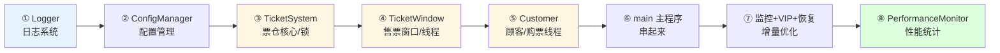
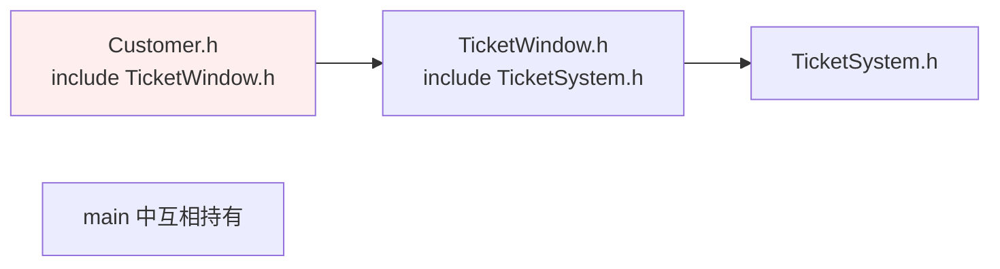

# 07.票务购买系统

> 本章开启**并发三连**的第一篇。前六个案例全部是单线程的"菜单驱动"写法，而真实的后端系统几乎都是多线程的。本案例模拟"**多窗口同时售票**"这个最经典的并发教学场景，让读者亲眼看到：不加锁会卖出负数票、加了锁又可能死锁、condition_variable 如何实现生产-消费协作。

---

## 00.案例元信息

| 项目 | 说明 |
|------|------|
| 难度 | ★★★★☆ |
| 预估时长 | 7 小时 |
| 前置章节 | 卷一第 9 章（类与对象）、第 15 章（线程和锁） |
| 覆盖知识点 | `std::thread`、`std::mutex`、`std::lock_guard`、`std::unique_lock`、`std::condition_variable`、`std::atomic`、日志系统、配置系统 |
| 设计亮点 | 把"日志器"和"配置器"抽成独立组件，复用到后续 08/09 案例；VIP 购票策略展示"继承 + 重写" |
| 最终产物 | 可执行文件 `ticket_system` + 日志文件 `ticket.log` |
| 代码规模 | 约 800 行 / 10 个文件 |

---

#### 目录说明
- 01.票务购买系统
  - 1.1 产品需求
  - 1.2 程序功能
  - 1.3 开发设计步骤（分层增量路线图 + 文件目录结构）
  - 1.4 技术栈说明
  - 1.5 核心组件说明
- 02.基础框架搭建
  - 2.1 日志级别枚举
  - 2.2 日志系统实现（Logger.h / Logger.cpp）
  - 2.3 测试日志打印
  - 2.4 配置管理系统（ConfigManager.h / .cpp）
  - 2.5 测试基础框架
- 03.票务系统实现
  - 3.1 设计票务系统类（头文件 + 为什么禁用拷贝）
  - 3.2 实现售票方法
  - 3.3 实现加票方法
  - 3.4 创建票务系统
  - 3.5 其他一些api设计（查询接口 + atomic 讲解）
- 04.售票窗口实现
  - 4.1 售票窗口类（⚠️ 新手必踩的"值类型 vs 引用"坑）
  - 4.2 启动售票线程（detach + try/catch）
  - 4.3 停止售票（atomic 标志位）
  - 4.4 创建售票窗口（unique_ptr 的必要性）
  - 4.5 启动售票窗口
- 05.顾客系统实现
  - 5.1 定义顾客类（完整头文件）
  - 5.2 顾客购票方法
  - 5.3 设计权衡：join 还是 detach
  - 5.4 创建顾客（emplace_back vs push_back）
- 06.主程序整合
  - 6.1 基本购票流程
- 07.动态票务管理
  - 7.1 动态票务监控
  - 7.2 主程序调用监控
- 08.售票策略优化
  - 8.1 扩展售票窗口类
  - 8.2 扩展顾客类（头文件循环依赖的经典坑 + 解法）
  - 8.3 实现VIP购票
- 09.错误处理与恢复
  - 9.1 恢复售票
  - 9.2 添加错误处理
- 10.性能监控与统计
  - 10.1 性能监控类
  - 10.2 使用监控处理
  - 10.3 编译与运行（完整编译命令 + 常见报错）
  - 10.4 潜在优化方向
- 11.衔接与延伸


## 01.票务购买系统

### 1.1 产品需求

模拟多个窗口售票、多人购票的场景。系统包括票务管理、窗口管理、顾客管理、交易日志等功能。不需要UI窗口，命令行操作即可。

1. 多窗口（线程）售票 
2. 用户购票行为模拟 
3. 票务查询和统计 
4. 日志和错误处理 
5. 系统配置管理

### 1.2 程序功能

1. **初始化阶段**： 加载配置文件；创建日志系统；初始化票务系统
2. **窗口启动**： 创建售票窗口线程；每个窗口开始售票
3. **顾客购票**： 顾客线程发起购票请求；系统处理购票事务
4. **动态调整**： 监控票数并预警；动态增加票数
5. **关闭系统**： 停止售票窗口；生成统计报告；输出性能数据

### 1.3 开发设计步骤

为了避免"写着写着就乱"，我们**按分层+增量**推进——每完成一步都能编译运行，确认没问题再写下一步。路线如下：



每一步的产出：

| 步骤 | 新增文件 | 能跑起来做什么 |
|------|----------|----------------|
| ① | `Logger.h/.cpp` | 写日志到控制台 + 文件 |
| ② | `ConfigManager.h/.cpp` + `config.txt` | 从文件读取配置 |
| ③ | `TicketSystem.h/.cpp` | 用 3 个线程并发卖票不出错 |
| ④ | `TicketWindow.h/.cpp` | N 个窗口同时循环售票 |
| ⑤ | `Customer.h/.cpp` | 模拟顾客排队买票 |
| ⑥ | `TicketManager.cpp` | 完整可运行的售票系统 |
| ⑦ | 在已有类里加方法 | 票少预警、异常恢复、VIP 通道 |
| ⑧ | `PerformanceMonitor.h/.cpp` | 统计成功率、TPS |

最终项目的文件目录结构如下（就是本章附带的 `ticket/` 目录）：

```text
ticket/
├── Logger.h / Logger.cpp              ← ① 日志系统（被所有模块依赖）
├── ConfigManager.h / ConfigManager.cpp ← ② 配置加载
├── TicketSystem.h / TicketSystem.cpp  ← ③ 票仓核心（锁 + 条件变量）
├── TicketWindow.h / TicketWindow.cpp  ← ④ 售票窗口（线程）
├── Customer.h / Customer.cpp          ← ⑤ 顾客（线程）
├── PerformanceMonitor.h / .cpp        ← ⑧ 性能统计
├── TicketManager.cpp                  ← ⑥ 主程序 main()
└── config.txt                         ← 运行时配置
```

> 💡 **新手建议**：务必按这个顺序一步步来，不要试图一口气写完所有文件。每一步写完，都回到 `main` 里加几行测试代码跑一下——这是 C++ 项目不炸的关键。

### 1.4 技术栈说明

#### 1.4.1 并发控制设计

> (1) 锁机制

- **互斥锁 (mutex)**：保护共享资源（剩余票数），防止数据竞争
- **锁粒度控制**：细粒度锁：只锁定必要代码段，避免长时间持有锁

> (2) 条件变量 (condition_variable)

**等待/通知机制**，**避免忙等待**：减少CPU空转

```cpp
// 等待条件
cv.wait(lock, predicate);

// 通知所有等待线程
cv.notify_all();
```

> (3) 原子操作 (atomic)

**无锁计数器**：

```cpp
std::atomic<int> ticketsSold;
ticketsSold += num; // 原子操作
```

**内存顺序保证**：memory_order_seq_cst（默认最强一致性）

### 1.5 核心组件说明

- **Ticket**: 表示单个票据，包含座位信息、价格、状态等
- **Event**: 代表一个活动/演出，管理所有相关票据
- **Customer**: 顾客信息，包含购买历史、余额等
- **TicketWindow**: 售票窗口，处理顾客购买请求
- **Transaction**: 交易记录，记录每笔交易详情
- **Logger**: 日志系统，记录系统运行状态
- **TicketSystem**: 系统核心，协调所有组件运行

## 02.基础框架搭建

实现日志系统（Logger类），**设计原理**：

- 线程安全：使用互斥锁保护文件写入
- 分级日志：INFO/WARNING/ERROR三级
- 双重输出：同时输出到文件和终端

实现配置管理（ConfigManager类）

### 2.1 日志级别枚举

目前日志打印分为info，debug，warning，error这几种类型的日志：

```cpp
//日志级别枚举
enum class LogLevel {
    INFO,
    DEBUG,
    WARNING,
    ERROR
};
```

### 2.2 日志系统实现

主要是把日志打印到控制台，并且存储到file文件中。先看完整的头文件 `Logger.h`：

```cpp
// Logger.h
#ifndef LOGGER_H
#define LOGGER_H
#include <fstream>
#include <mutex>

// 日志级别枚举
enum class LogLevel {
    INFO,
    DEBUG,
    WARNING,
    ERROR
};

// 日志需要存储到file文件中
class Logger {
private:
    std::ofstream logFile;      // 日志文件 file
    std::mutex logMutex;        // 日志锁，多线程安全
public:
    // 构造函数，传入文件路径，打开文件。如果文件不存在则抛出错误
    Logger(const std::string &fileName);
    // 析构函数，做一些资源清理操作
    ~Logger();
    // 打印日志，默认是 INFO 级别
    void log(const std::string &message, LogLevel level = LogLevel::INFO);
};

#endif //LOGGER_H
```

然后在具体文件中实现，代码如下所示：

```cpp
// Logger.cpp
#include "Logger.h"
#include <iostream>

// 在构造函数中传入文件路径，打开文件。如果文件不存在则抛出错误
Logger::Logger(const std::string &fileName) {
    // std::ios::out 表示写入内容
    // std::ios::app 追加模式：数据追加到文件末尾，而不是覆盖
    logFile.open(fileName, std::ios::out | std::ios::app);
    if (!logFile.is_open()) {
        throw std::runtime_error("Failed to open log file.");
    }
}

// 在析构函数中，关闭文件流
Logger::~Logger() {
    if (logFile.is_open()) {
        logFile.close();
    }
}

// 打印日志，需要传入打印内容和打印日志级别，默认是 info 日志类型
void Logger::log(const std::string &message, LogLevel level) {
    // 多线程安全，这里用 lock_guard 锁
    // 原理：RAII 思想——构造时上锁，离开作用域自动析构解锁，绝不忘记
    std::lock_guard<std::mutex> lock(logMutex);
    std::string levelStr;
    switch (level) {
        case LogLevel::INFO:    levelStr = "INFO";    break;
        case LogLevel::DEBUG:   levelStr = "DEBUG";   break;
        case LogLevel::WARNING: levelStr = "WARNING"; break;
        case LogLevel::ERROR:   levelStr = "ERROR";   break;
    }
    std::string logMessage = "[" + levelStr + "] " + message;
    // 将日志追加到 file 文件中，同时打印到控制台
    logFile   << logMessage << std::endl;
    std::cout << logMessage << std::endl;
}
```

> 🧠 **为什么一定要锁？** 多个线程同时调用 `log()`，如果没有 `logMutex`，`logFile << "ABC"` 和 `logFile << "XYZ"` 可能会**交错成 "AXYCZB"**，日志就成了乱码。`std::lock_guard` 是 RAII 风格的自动锁——不用手动写 `unlock()`，函数返回时自动释放，永远不会漏。

### 2.3 测试日志打印

```cpp
int main() {
    // 初始化日志系统
    Logger logger("ticket_system_log.txt");
    logger.log("System initialized", LogLevel::INFO);
    logger.log("System initialized debug", LogLevel::DEBUG);
    logger.log("System initialized warning", LogLevel::WARNING);
    logger.log("System initialized error", LogLevel::ERROR);
    return 0;
}
```

测试打印数据如下所示：

```text
[INFO] System initialized
[DEBUG] System initialized debug
[WARNING] System initialized warning
[ERROR] System initialized error
```

然后看看本地成功生成`ticket_system_log.txt`文件，并且文件中记录日志。

### 2.4 配置管理系统

**为什么要这个类？** 想象一下：票数、窗口数、顾客数都硬编码在 `main` 里——每次想换个参数就得重新编译整个工程。把这些参数抽到 `config.txt`，就能**不改代码直接调参数**。这是任何稍具规模系统的基本做法。

头文件 `ConfigManager.h`：

```cpp
// ConfigManager.h
#ifndef CONFIGMANAGER_H
#define CONFIGMANAGER_H
#include <string>
#include <unordered_map>

// 主要是从配置文件中读取配置数据
class ConfigManager {
private:
    // 用 map 集合存储配置数据
    std::unordered_map<std::string, int> config;
public:
    ConfigManager(const std::string &fileName);
    // 获取某项属性
    int get(const std::string& key) const;
};

#endif //CONFIGMANAGER_H
```

然后看一下具体的实现文件 `ConfigManager.cpp`：

```cpp
// ConfigManager.cpp
#include <fstream>
#include <iostream>
#include "ConfigManager.h"

// 从本地文件读取配置数据，然后存储到 map 集合
ConfigManager::ConfigManager(const std::string &fileName) {
    std::ifstream file(fileName);
    if (file.is_open()) {
        std::string key;
        int value;
        while (file >> key >> value) {
            config[key] = value;
            std::cout << "config key : " << key << " , value : " << value << std::endl;
        }
    } else {
        // 如果没有本地文件，则使用默认配置（兜底，避免程序起不来）
        config["total_tickets"] = 100;
        config["num_windows"] = 3;
        config["num_customers"] = 10;
        config["max_tickets_per_customer"] = 5;
        config["simulation_duration"] = 10; // 秒
    }
    file.close();
}

// 获取某项属性
int ConfigManager::get(const std::string &key) const {
    // auto 自动变量，编译器自动推导类型
    auto it = config.find(key);
    if (it != config.end()) {
        return it->second;
    }
    throw std::runtime_error("Config key not found: " + key);
}
```

### 2.5 测试基础框架

测试一下读取配置文件，然后把配置数据打印出来，如下所示：

```cpp
int main() {
    // 初始化配置管理器
    ConfigManager config("config.txt");
    return 0;
}
```

这里创建一个配置文件`config.txt`：

```text
total_tickets 100
num_windows 3
num_customers 10
max_tickets_per_customer 5
```

测试一下`ConfigManager`，打印结果如下所示：

```text
config key : total_tickets , value : 100
config key : num_windows , value : 3
config key : num_customers , value : 10
config key : max_tickets_per_customer , value : 5
```

## 03.票务系统实现

实现票务系统核心功能，包括票数管理和线程安全操作

### 3.1 设计票务系统类

**这是整个案例的"心脏"**。所有窗口和顾客都通过它操作票——它必须保证：无论多少线程同时冲进来，票数不会被算错。

先看头文件 `TicketSystem.h`：

```cpp
// TicketSystem.h
#ifndef TICKETSYSTEM_H
#define TICKETSYSTEM_H
#include <atomic>
#include <mutex>
#include <condition_variable>
#include "Logger.h"

class TicketSystem {
private:
    int totalTicket;                   // 总票数
    std::atomic<int> remainingTickets; // 剩余票数（原子变量，单纯读取不用加锁）
    std::mutex ticketMutex;            // 票务锁，保证线程安全
    std::condition_variable cv;        // 条件变量，用于线程通信（配合锁使用）
    Logger& logger;                    // 日志系统（引用成员，不拷贝）
public:
    TicketSystem(int total, Logger& log);

    // 🚫 禁用拷贝构造和拷贝赋值！
    // 因为成员里有 mutex 和 condition_variable——这两个东西本身就不允许拷贝
    TicketSystem(const TicketSystem&) = delete;
    TicketSystem& operator=(const TicketSystem&) = delete;

    // 售票功能
    bool sellTicket(int num, const std::string& windowName);
    // 添加票功能
    void addTickets(int num);
    // 查询接口
    int getRemainingTickets() const;
    int getTotalTickets() const;
    // 动态票务监控
    void monitorTickets();
    // 恢复票功能（异常情况下把"扣掉的票"加回来）
    void recoverTickets(int num);
};

#endif //TICKETSYSTEM_H
```

> 🧠 **为什么禁用拷贝？** `std::mutex` 和 `std::condition_variable` 本身都**不可拷贝**（标准库在它们的声明里就 `= delete` 了）。只要你的类里有这两个东西，编译器就无法生成默认拷贝构造——与其让编译器报一串看不懂的错误，不如显式写 `= delete` 把意图讲清楚。

然后看一下构造函数的实现：

```cpp
// TicketSystem.cpp
#include "TicketSystem.h"
#include <sstream>
#include <thread>

TicketSystem::TicketSystem(int total, Logger &log)
    : totalTicket(total), remainingTickets(total), logger(log) {
    logger.log("Ticket system created with " + std::to_string(total) + " tickets");
}
```

### 3.2 实现售票方法

**售票方法设计原理**：

- 线程安全售票：使用互斥锁和条件变量
- 票数管理：原子操作保证剩余票数一致性
- 通知机制：条件变量通知等待线程

sellTicket 方法实现了一个售票逻辑，使用了互斥锁 (std::mutex) 和条件变量 (std::condition_variable) 来确保线程安全。

```cpp
class TicketSystem {
public:
    bool sellTicket(int num , const std::string &windowName);
};
```

然后在实现具体方法，如下：

```cpp
// 售票方法
bool TicketSystem::sellTicket(int num, const std::string &windowName) {
    // 使用 std::unique_lock 锁定互斥锁，确保对共享资源 remainingTickets 的访问是线程安全的。
    std::unique_lock<std::mutex> lock(ticketMutex);
    // 使用条件变量 cv 等待，直到满足条件 remainingTickets >= num 或 remainingTickets == 0。
    // 这样可以避免忙等待，提高效率。
    cv.wait(lock, [this, num] {
        return remainingTickets >= num || remainingTickets == 0;
    });
    if (remainingTickets >= num) {
        //如果 remainingTickets >= num，则减少剩余票数，记录日志，并通过 cv.notify_all() 通知其他等待的线程。
        remainingTickets -= num;      // 售票操作
        std::stringstream ss;
        ss << windowName << " sold " << num << " tickets. Remaining tickets: " << remainingTickets;
        logger.log(ss.str());
        cv.notify_all();    //刷新，通知其他等待线程
        return true;
    } else {
        //如果 remainingTickets < num，则返回 false，表示售票失败。
        //记录警告日志
        std::stringstream ss;
        ss << windowName << " failed to sell " << num << " tickets. Not enough tickets available.";
        logger.log(ss.str(), LogLevel::WARNING);
        return false;
    }
}
```

然后测试一下售票的方法，如下所示：

```cpp
void test(Logger& logger) {
    TicketSystem ticketSystem(10 , logger);
    std::thread t1([&ticketSystem] {
        ticketSystem.sellTicket(3, "Window 1");
    });
    std::thread t2([&ticketSystem] {
        ticketSystem.sellTicket(5, "Window 2");
    });
    std::thread t3([&ticketSystem] {
        ticketSystem.sellTicket(4, "Window 3");
    });
    t1.join();
    t2.join();
    t3.join();
}
```

测试日志如下所示：

```text
Window 1 sold 3 tickets. Remaining tickets: 7
Window 2 sold 5 tickets. Remaining tickets: 2
Window 3 failed to sell 4 tickets. Not enough tickets available.
```

### 3.3 实现加票方法

现在头文件中定义：

```cpp
class TicketSystem {
public:
    void addTickets(int num);
};
```

然后在具体实现，如下所示：

```cpp
//加票方法
void addTickets(int num) {
    // 检查参数
    if (num <= 0) {
        std::stringstream ss;
        ss << "Failed to add tickets. Invalid number of tickets: " << num;
        logger.log(ss.str(), LogLevel::WARNING);
        return;
    }
    std::lock_guard<std::mutex> lock(ticketMutex);
    remainingTickets+=num;
    std::stringstream ss;
    ss << "Added " << num << " tickets. Remaining tickets: " << remainingTickets;
    logger.log(ss.str());
    cv.notify_all();
}
```

测试加票方法功能，然后测试一下加票的方法，如下所示：

```cpp
void test(Logger& logger) {
    TicketSystem ticketSystem(10 , logger);
    std::thread t1([&ticketSystem] {
        ticketSystem.sellTicket(3, "Window 1");
    });
    std::thread t2([&ticketSystem] {
        ticketSystem.sellTicket(5, "Window 2");
    });
    std::thread t3([&ticketSystem] {
        std::this_thread::sleep_for(std::chrono::seconds(1));
        ticketSystem.addTickets(10);
    });

    t1.join();
    t2.join();
    t3.join();
}
```

打印日志如下所示：

```text
[INFO] Ticket system created with 10 tickets
[INFO] Window 1 sold 3 tickets. Remaining tickets: 7
[INFO] Window 2 sold 5 tickets. Remaining tickets: 2
[INFO] Added 10 tickets. Remaining tickets: 12
```

### 3.4 创建票务系统

```cpp
int main() {
    // ... 配置和日志初始化
    // 创建票务系统
    TicketSystem ticketSystem(config.get("total_tickets"), logger);
    return 0;
}
```

### 3.5 其他一些api设计

除了"卖票 + 加票"两个核心操作，还需要一些**查询接口**，供主程序统计信息用。同时我们也把后面几章要用的接口（`monitorTickets` 监控、`recoverTickets` 异常恢复）一并写好，避免反复改头文件：

```cpp
// TicketSystem.cpp (续)

// 获取剩余票数
int TicketSystem::getRemainingTickets() const {
    // remainingTickets 是 atomic<int>，直接读就是线程安全的
    return remainingTickets;
}

// 获取总票数
int TicketSystem::getTotalTickets() const {
    return totalTicket;
}
```

> 💡 **为什么 `remainingTickets` 要用 `std::atomic<int>`？** 普通 `int` 在多线程下读写可能**撕裂**（读到一个写了一半的值）。`atomic<int>` 保证每一次读/写都是**原子的**——要么看到旧值，要么看到新值，绝不会看到"半新半旧"。
> 但要注意：`atomic` **只保证单次操作原子**，不保证"读 + 判断 + 写"这种**复合操作**的原子性——所以我们卖票逻辑里仍然要 `mutex + condition_variable`。

后续 §7 / §9 还会往这里添加 `monitorTickets()` 和 `recoverTickets()`——目前只需知道头文件里已经声明好了即可。


## 04.售票窗口实现

目标: 实现售票窗口类及其多线程售票功能

**设计原理**：

- 独立线程：每个窗口运行在独立线程
- 随机售票：模拟真实售票场景
- 优雅停止：使用atomic bool控制线程退出

### 4.1 售票窗口类

**（1）成员变量**

- `std::string name`：窗口名称，用于标识售票窗口。
- `TicketSystem& ticketSystem`：票务系统的引用，用于售票和增加票数。
- `Logger& logger`：日志系统的引用，用于记录日志。
- `std::atomic<bool> running`：原子布尔变量，表示售票窗口是否正在运行。
- `std::atomic<int> ticketsSold`：原子整数变量，记录售票数量。
- `std::thread workerThread`：工作线程，用于执行售票逻辑。

**（2）构造函数**

- 初始化成员变量，并记录日志表示窗口已创建。

**（3）禁用拷贝构造函数和拷贝赋值运算符**

- 使用 `delete` 关键字禁用拷贝构造函数和拷贝赋值运算符，确保 `TicketWindow` 对象不能被复制。

先看头文件 `TicketWindow.h`：

```cpp
// TicketWindow.h
#ifndef TICKETWINDOW_H
#define TICKETWINDOW_H
#include <string>
#include <thread>
#include "TicketSystem.h"

class TicketWindow {
private:
    std::string name;                 // 窗口名称
    TicketSystem& ticketSystem;       // ⚠️ 必须是引用，不能是值（见下方踩坑）
    Logger& logger;                   // 日志系统
    std::atomic<bool> running;        // 是否在工作中
    std::atomic<int> ticketsSold;     // 记录售票数量
    std::thread workerThread;         // 工作线程
    std::mutex vipMutex;              // VIP 专用锁（§8 用到）
public:
    TicketWindow(const std::string& windowName, TicketSystem& system, Logger& log);

    // 禁用拷贝（因为含 std::thread / std::mutex）
    TicketWindow(const TicketWindow&) = delete;
    TicketWindow& operator=(const TicketWindow&) = delete;

    void start();                     // 开始售票
    void stop();                      // 停止售票
    int  getTicketsSold() const;      // 查询已售票数
    void sellVIP(int num, const std::string& customerName); // VIP 售票
};

#endif //TICKETWINDOW_H
```

对应实现文件里，构造函数非常简单：

```cpp
// TicketWindow.cpp
#include <sstream>
#include <random>
#include "TicketWindow.h"

TicketWindow::TicketWindow(const std::string &windowName, TicketSystem &system, Logger &log)
    : name(windowName), ticketSystem(system), logger(log),
      running(true), ticketsSold(0) {
    logger.log("Ticket window " + name + " created");
}
```

> ⚠️ **新手必踩的坑（真实编译错误）**
>
> 很多初学者把成员写成 `TicketSystem ticketSystem;`（**值类型**），编译器立刻就会报：
>
> ```text
> Attempt to use deleted constructor TicketSystem::TicketSystem(const TicketSystem&)
> ```
>
> **原因**：`TicketSystem` 含 `std::mutex` / `std::condition_variable`——不可拷贝。只要你用值类型成员，C++ 就要拷贝它，当然编译不过。
>
> **正确做法**：用**引用** `TicketSystem& ticketSystem;`——引用只是别名，不需要拷贝。N 个售票窗口用同一个票仓，**共享同一个 `TicketSystem` 对象**，这才符合业务语义。
>
> ```cpp
> TicketSystem  ticketSystem;   // ❌ 编译报错
> TicketSystem& ticketSystem;   // ✅ 正确：引用，共享票仓
> ```

### 4.2 启动售票线程

`start()` 方法里，我们开启一个**新线程**，在循环里不断调用 `ticketSystem.sellTicket(...)`，直到票卖完或被外部叫停。

```cpp
// TicketWindow.cpp（续）

// 开始窗口售票
void TicketWindow::start() {
    // 启动一个分离线程（detach），主线程不阻塞
    std::thread([this]() {
        // C++11 标准的随机数三件套
        std::random_device rd;                       // 硬件随机种子
        std::mt19937 gen(rd());                      // 梅森旋转算法引擎
        std::uniform_int_distribution<> dis(1, 5);   // 1~5 的均匀分布

        while (running) {
            int numTickets = dis(gen);  // 这次要卖几张
            try {
                if (ticketSystem.sellTicket(numTickets, name)) {
                    ticketsSold += numTickets;
                    // 模拟真实出票时间 100ms
                    std::this_thread::sleep_for(std::chrono::milliseconds(100));
                } else {
                    logger.log(name + " failed to sell tickets. Not enough tickets available.",
                               LogLevel::WARNING);
                    break;  // 没票了，退出循环
                }
            } catch (const std::exception& e) {
                // 出了任何异常，就把扣掉的票补回来（补偿机制）
                logger.log(name + " encountered error: " + std::string(e.what()), LogLevel::ERROR);
                ticketSystem.recoverTickets(numTickets);
            }
        }
    }).detach();  // 关键：分离，让线程独立运行
}
```

> 🧠 **为什么用 `.detach()` 而不是 `workerThread = std::thread(...)` + `.join()`？**
>
> - `detach`：线程"脱离"主线程独立运行，主线程不必等它。适合这种**无限/长时间循环**。
> - `join`：主线程阻塞在 `join()` 处等线程结束，适合短任务。
>
> 本案例里窗口要持续卖票，不能让 `main` 卡住，所以用 `detach`。但代价是：**必须用 `running` 标志位来优雅停止它**（见下节）。

### 4.3 停止售票

因为 `start()` 用了 `detach`，无法再 `join`，只能用**共享标志位**让线程主动退出：

```cpp
// 停止窗口售票
void TicketWindow::stop() {
    running = false;  // 循环下一轮检查到 false 就会退出
}

// 获取售票数量
int TicketWindow::getTicketsSold() const {
    return ticketsSold;
}
```

> 💡 **为什么 `running` 要用 `std::atomic<bool>`？** 一个线程写、多个线程读——如果用普通 `bool`，读线程可能因为 CPU 缓存永远看不到 `false`，从而永远卡在循环里。`atomic<bool>` 保证"写了立刻全可见"。

### 4.4 创建售票窗口

由于 `TicketWindow` 禁用了拷贝（§4.1 踩坑处解释过），**不能直接 `std::vector<TicketWindow>`**（push_back 会触发拷贝）。标准做法是用**智能指针**：

```cpp
// main 函数片段
int numWindows = config.get("num_windows");

// 用 unique_ptr 装起来——指针可以移动，对象本身不会被拷贝
std::vector<std::unique_ptr<TicketWindow>> windows;
for (int i = 1; i <= numWindows; ++i) {
    windows.push_back(std::unique_ptr<TicketWindow>(
        new TicketWindow("Window " + std::to_string(i), ticketSystem, logger)));
}
```

> 💡 **为什么用 `unique_ptr`？** ① 避开拷贝问题 ② 析构时自动 `delete`，不会内存泄漏 ③ 语义清晰："这块内存归 vector 独占"。如果你用 `new TicketWindow(...)` 裸指针，还得自己记着 `delete`，非常容易漏。

### 4.5 启动售票窗口

所有窗口创建完后，依次启动它们的线程：

```cpp
// 启动售票窗口
for (auto& window : windows) {
    window->start();
}
```

执行到这里，**N 个售票线程已经在后台并发运行**——它们都会抢同一个 `ticketSystem` 里的票。`TicketSystem` 里的锁和条件变量终于发挥作用了。

## 05.顾客系统实现

目标: 实现顾客类及其购票行为

**设计原理**：

- 异步购票：每个顾客在独立线程购票
- 随机需求：模拟不同顾客的购票需求
- 与售票窗口"竞争"同一个票仓：天然的并发冲突场景

### 5.1 定义顾客类

先看完整头文件 `Customer.h`：

```cpp
// Customer.h
#ifndef CUSTOMER_H
#define CUSTOMER_H
#include <string>
#include <thread>
#include "Logger.h"
#include "TicketSystem.h"

class Customer {
private:
    std::string name;                // 用户名
    TicketSystem& ticketSystem;      // 购票系统（同样是引用！避开拷贝问题）
    Logger& logger;                  // 日志记录
    std::thread purchaseThread;      // 购票线程
public:
    Customer(const std::string& customerName, TicketSystem& system, Logger& log);
    void buyTickets(int num);        // 顾客购票
};

#endif //CUSTOMER_H
```

实现文件的构造函数：

```cpp
// Customer.cpp
#include "Customer.h"
#include <sstream>

Customer::Customer(const std::string &customerName, TicketSystem &system, Logger &log)
    : name(customerName), ticketSystem(system), logger(log) {
    logger.log("Customer " + name + " created");
}
```

### 5.2 顾客购票方法

```cpp
// 顾客购票方法
void Customer::buyTickets(int num) {
    // 开启一个新线程去买票，不阻塞 main
    purchaseThread = std::thread([this, num]() {
        std::stringstream ss;
        ss << name << " is trying to buy " << num << " tickets.";
        logger.log(ss.str());

        if (ticketSystem.sellTicket(num, name)) {
            // 买到了
            ss.str("");
            ss << name << " successfully bought " << num << " tickets.";
            logger.log(ss.str());
        } else {
            // 没买到
            ss.str("");
            ss << name << " failed to buy " << num << " tickets. Not enough tickets available.";
            logger.log(ss.str(), LogLevel::WARNING);
        }
    });

    // 这里直接 join：等这位顾客买完再返回（保证顾客之间顺序可控）
    if (purchaseThread.joinable()) {
        purchaseThread.join();
    }
}
```

### 5.3 设计权衡：join 还是 detach？

上面的 `buyTickets` 在方法内部直接 `join()`——这是**有意为之**的教学选择：

| 方案 | 效果 | 适用场景 |
|------|------|----------|
| 方法内 `join()` ✅ 当前代码 | 顾客**逐个**买完才轮到下一个 | 简单清晰，日志可读 |
| 方法返回 + 外部统一 `join()` | 所有顾客**同时**抢票 | 更真实，但日志乱序难看 |
| `.detach()` | 顾客买完 `main` 可能已退出 | 危险，不推荐 |

> 🧠 **思考**：如果把 `join()` 放到外面，10 个顾客会**同时**抢 `ticketSystem`——这时窗口线程和顾客线程一起竞争同一把锁，才是真正"大规模并发"的场景。读者可以作为练习改写。

### 5.4 创建顾客

顾客和售票窗口不同——`Customer` 没禁用拷贝（因为 `std::thread` 成员默认是可移动的），可以直接放进 `std::vector`：

```cpp
std::vector<Customer> customers;
int numCustomers = config.get("num_customers");
for (int i = 1; i <= numCustomers; ++i) {
    // emplace_back：原地构造，不拷贝
    customers.emplace_back("Customer " + std::to_string(i), ticketSystem, logger);
}
```

> 💡 为什么是 `emplace_back` 而不是 `push_back`？—— `push_back` 需要先构造临时对象再移动/拷贝进容器，而 `emplace_back` **直接在 vector 内存里构造**，少一次操作、更高效，也能避开某些不可拷贝对象的问题。

## 06.主程序整合

**目标**: 整合所有组件，实现基本购票流程

### 6.1 基本购票流程

```cpp
// 主程序
int main() {
    // 读取配置文件
    ConfigManager config("config.txt");
    int totalTickets = config.get("total_tickets");
    int numWindows = config.get("num_windows");
    int numCustomers = config.get("num_customers");
    int maxTicketsPerCustomer = config.get("max_tickets_per_customer");

    // 初始化日志系统
    Logger logger("ticket_system.log");

    // 初始化票务系统
    TicketSystem ticketSystem(totalTickets, logger);

    // 创建售票窗口
    std::vector<std::unique_ptr<TicketWindow>> windows;
    for (int i = 1; i <= numWindows; ++i) {
        windows.push_back(std::unique_ptr<TicketWindow>(new TicketWindow("Window " + std::to_string(i), ticketSystem, logger)));
    }

    // 启动售票窗口
    for (auto& window : windows) {
        window->start();
    }

    // 创建顾客
    std::vector<Customer> customers;
    for (int i = 1; i <= numCustomers; ++i) {
        customers.emplace_back("Customer " + std::to_string(i), ticketSystem, logger);
    }

    // 顾客购票
    std::random_device rd;
    std::mt19937 gen(rd());
    std::uniform_int_distribution<> dis(1, maxTicketsPerCustomer);

    for (auto& customer : customers) {
        int numTickets = dis(gen);
        customer.buyTickets(numTickets);
        std::this_thread::sleep_for(std::chrono::milliseconds(200)); // 模拟顾客购票间隔
    }

    // 动态增加票数
    std::this_thread::sleep_for(std::chrono::seconds(2));
    ticketSystem.addTickets(50);

    // 等待所有售票窗口停止
    std::this_thread::sleep_for(std::chrono::seconds(5));
    for (auto& window : windows) {
        window->stop();
    }

    // 输出统计信息
    std::stringstream ss;
    ss << "All tickets sold. Remaining tickets: " << ticketSystem.getRemainingTickets();
    logger.log(ss.str());

    for (const auto& window : windows) {
        ss.str("");
        ss << window->getTicketsSold() << " tickets sold by " << window->getTicketsSold();
        logger.log(ss.str());
    }

    return 0;
}
```


## 07.动态票务管理

目标: 添加动态票务管理功能，包括票数增加和监控

### 7.1 动态票务监控

```cpp
//动态票务监控
void monitorTickets() {
    std::thread([this]() {
        while (true) {
            std::this_thread::sleep_for(std::chrono::seconds(1));
            int remaining = getRemainingTickets();
            if (remaining < totalTickets / 4) {
                logger.log("Warning: Only " + std::to_string(remaining) +
                           " tickets remaining!", LogLevel::WARNING);
            }
        }
    }).detach();
}
```

### 7.2 主程序调用监控

```cpp
int main() {
    // ... 初始化票务系统后
    
    // 启动票务监控
    ticketSystem.monitorTickets();
    
    // 动态增加票数
    std::this_thread::sleep_for(std::chrono::seconds(2));
    ticketSystem.addTickets(50);
    // ... 其余代码
}
```

## 08.售票策略优化

目标: 优化售票策略，添加VIP窗口和优先级购票

### 8.1 扩展售票窗口类

```cpp
class TicketWindow {
    // ... 已有代码
    
    // ==== VIP售票方法 ====
    void sellVIP(int num, const std::string& customerName) {
        std::lock_guard<std::mutex> lock(vipMutex);
        if (ticketSystem.sellTicket(num, name + " (VIP)")) {
            ticketsSold += num;
            std::stringstream ss;
            ss << "VIP customer " << customerName << " bought " << num 
               << " tickets from " << name;
            logger.log(ss.str());
        }
    }
};
```

### 8.2 扩展顾客类（以及一个头文件循环依赖的经典坑）

你可能会直觉地这么写：

```cpp
// Customer.h（错误示范！）
#include "TicketWindow.h"

class Customer {
    // ... 已有代码
    void buyVIP(int num, TicketWindow& vipWindow);  // ❌
};
```

然后编译——**立刻报一堆错**。原因是**头文件循环依赖**：



实际问题更复杂：`TicketWindow` 可能反过来要用到 `Customer`（比如记顾客信息）——一旦互相 `#include`，就出现"A 没编完依赖 B，B 没编完又依赖 A"的死循环。

**两个标准解法**：

| 方法 | 做法 | 适用 |
|------|------|------|
| **前向声明**（推荐） | 头文件里只写 `class TicketWindow;`，`.cpp` 里才 `#include` | 只在指针/引用里用到对方 |
| **接口层抽象** | 抽一个基类 `ISellWindow`，双方都依赖接口 | 关系真复杂 |

本案例中，VIP 购票其实可以**让顾客把 vipWindow 作为参数传入**、`Customer.h` 里用前向声明：

```cpp
// Customer.h
class TicketWindow;  // 前向声明，不引 .h

class Customer {
    // ...
    void buyVIP(int num, TicketWindow& vipWindow);  // 引用参数，合法
};

// Customer.cpp 里再 #include "TicketWindow.h"
#include "TicketWindow.h"
void Customer::buyVIP(int num, TicketWindow& vipWindow) {
    vipWindow.sellVIP(num, name);
}
```

> 💡 **新手教训**：`#include` 是**原地文本替换**，不是"引用"。循环 include = 无限展开。**只要头文件里只用到类的指针/引用，就用前向声明**，这是 C++ 工程化的铁律。

### 8.3 实现VIP购票

真实代码里采取了**更朴素的做法**：VIP 窗口也是一个 `TicketWindow`，只是名字里带 "VIP"——和普通窗口并列存在于 `windows` 容器中。这样避开了上面的循环依赖，主程序也简单：

```cpp
// 创建普通窗口
std::vector<std::unique_ptr<TicketWindow>> windows;
for (int i = 1; i <= numWindows; ++i) {
    windows.push_back(std::unique_ptr<TicketWindow>(
        new TicketWindow("Window " + std::to_string(i), ticketSystem, logger)));
}

// 追加一个 VIP 窗口（放在同一个容器里，生命周期统一管理）
windows.push_back(std::unique_ptr<TicketWindow>(
    new TicketWindow("VIP Window", ticketSystem, logger)));

// 统一启动
for (auto& window : windows) {
    window->start();
}
```

日志里会看到类似这样的输出（节选自实际运行）：

```text
[INFO] Window 1 sold 5 tickets. Remaining tickets: 95
[INFO] VIP Window  sold 2 tickets. Remaining tickets: 90
```

> 🧠 **设计思考**：你也可以把 VIP 通道做成**更高优先级**——例如让 `sellTicket` 有个 `isVip` 参数，VIP 请求可以"插队"优先被 condition_variable 唤醒。这需要改成**优先级队列 + 两个条件变量**，留作读者的进阶练习。

## 09.错误处理与恢复

**目标**: 添加错误处理和系统恢复机制

### 9.1 恢复售票

```cpp
// ==== 在TicketSystem类中添加 ====
class TicketSystem {
    // ... 已有代码
    
    // ==== 恢复售票 ====
    void recoverTickets(int num) {
        std::lock_guard<std::mutex> lock(ticketMutex);
        remainingTickets += num;
        std::stringstream ss;
        ss << "Recovered " << num << " tickets. Total now: " << remainingTickets;
        logger.log(ss.str(), LogLevel::WARNING);
        cv.notify_all();
    }
};
```

### 9.2 添加错误处理

```cpp
// ==== 在售票窗口添加错误处理 ====
class TicketWindow {
    // ... 线程函数中
    
    while (running) {
        try {
            // 售票逻辑...
        } catch (const std::exception& e) {
            logger.log(name + " encountered error: " + std::string(e.what()), LogLevel::ERROR);
            // 恢复部分票数
            ticketSystem.recoverTickets(numTickets);
        }
    }
};
```

## 10.性能监控与统计

**目标**: 添加系统性能监控和统计功能

### 10.1 性能监控类

```cpp
// ==== 性能监控类 ====
class PerformanceMonitor {
private:
    std::atomic<int> totalSales;
    std::atomic<int> successfulSales;
    std::atomic<int> failedSales;
    std::chrono::steady_clock::time_point startTime;
    Logger& logger;

public:
    PerformanceMonitor(Logger& log) : 
        totalSales(0), successfulSales(0), failedSales(0), logger(log) 
    {
        startTime = std::chrono::steady_clock::now();
    }
    
    void recordSale(bool success) {
        totalSales++;
        if (success) successfulSales++;
        else failedSales++;
    }
    
    void report() {
        auto endTime = std::chrono::steady_clock::now();
        auto duration = std::chrono::duration_cast<std::chrono::seconds>(endTime - startTime);
        
        std::stringstream ss;
        ss << "\n==== PERFORMANCE REPORT ====\n";
        ss << "Total sales attempts: " << totalSales << "\n";
        ss << "Successful sales: " << successfulSales << "\n";
        ss << "Failed sales: " << failedSales << "\n";
        ss << "Success rate: " 
           << (totalSales > 0 ? 100.0 * successfulSales / totalSales : 0) << "%\n";
        ss << "Simulation duration: " << duration.count() << " seconds\n";
        ss << "Transactions per second: " 
           << (duration.count() > 0 ? totalSales / duration.count() : 0) << "\n";
        
        logger.log(ss.str());
    }
};
```

### 10.2 使用监控处理

```cpp
// ==== 在主程序中使用 ====
int main() {
    // ... 初始化后
    
    PerformanceMonitor monitor(logger);
    
    // 在售票和购票方法中记录
    // 售票成功时: monitor.recordSale(true);
    // 售票失败时: monitor.recordSale(false);
    
    // 结束时报告
    monitor.report();
}
```

### 10.3 编译与运行

**前置准备**：确认你的目录结构（就是本章附带的 `ticket/` 目录）：

```text
ticket/
├── Logger.h / Logger.cpp
├── ConfigManager.h / ConfigManager.cpp
├── TicketSystem.h / TicketSystem.cpp
├── TicketWindow.h / TicketWindow.cpp
├── Customer.h / Customer.cpp
├── PerformanceMonitor.h / PerformanceMonitor.cpp
├── TicketManager.cpp            ← 包含 main()
└── config.txt                   ← 配置文件
```

**编译命令**（macOS / Linux 都适用，需要 C++11 以上；用到 `<thread>` 所以必须链接 `pthread`）：

```bash
# 进入 ticket 目录
cd ticket/

# 一条命令编译所有 .cpp
g++ -std=c++11 -pthread \
    Logger.cpp \
    ConfigManager.cpp \
    TicketSystem.cpp \
    TicketWindow.cpp \
    Customer.cpp \
    PerformanceMonitor.cpp \
    TicketManager.cpp \
    -o ticket_system

# 运行
./ticket_system
```

> 💡 **编译报错怎么办？**
> - `undefined reference to pthread_create`：没加 `-pthread`；
> - `'std::thread' is not a member of 'std'`：C++ 标准太低，加 `-std=c++11` 或更高；
> - `Attempt to use deleted constructor`：回去检查 `TicketWindow::ticketSystem` 是不是写成了值类型（见 §4.1 踩坑提示）。

**配置文件 `config.txt`**：

```text
total_tickets 100
num_windows 3
num_customers 10
max_tickets_per_customer 5
```

改这个文件就能调整模拟规模——**不需要重新编译**。比如把 `total_tickets` 改成 `1000`，立刻就能看到大票仓场景的行为差异。

**运行示例**

```bash
CHONGYYANG-MB1:ticket yangchong$ ./a.out
[INFO] Window 1 sold 5 tickets. Remaining tickets: 95
[INFO] Customer 1 is trying to buy 1 tickets.
[INFO] Window 2 sold 3 tickets. Remaining tickets: 92
[INFO] VIP Window  sold 2 tickets. Remaining tickets: 90
[INFO] Window 3 sold 4 tickets. Remaining tickets: 86
[INFO] Customer 1 sold 1 tickets. Remaining tickets: 85
[INFO] Customer 1 successfully bought 1 tickets.
[INFO] Window 1 sold 5 tickets. Remaining tickets: 80
[INFO] Window 2 sold 4 tickets. Remaining tickets: 76
[INFO] Window 3 sold 5 tickets. Remaining tickets: 71
[INFO] VIP Window  sold 5 tickets. Remaining tickets: 66
[INFO] Customer 2 is trying to buy 2 tickets.
[INFO] Customer 2 sold 2 tickets. Remaining tickets: 64
[INFO] Customer 2 successfully bought 2 tickets.
[INFO] Window 1 sold 2 tickets. Remaining tickets: 62
[INFO] Window 2 sold 4 tickets. Remaining tickets: 58
[INFO] Window 3 sold 4 tickets. Remaining tickets: 54
[INFO] VIP Window  sold 2 tickets. Remaining tickets: 52
[INFO] Window 1 sold 5 tickets. Remaining tickets: 47
[INFO] Window 2 sold 3 tickets. Remaining tickets: 44
[INFO] Window 3 sold 4 tickets. Remaining tickets: 40
[INFO] VIP Window  sold 2 tickets. Remaining tickets: 38
[INFO] Customer 3 is trying to buy 3 tickets.
[INFO] Customer 3 sold 3 tickets. Remaining tickets: 35
[INFO] Customer 3 successfully bought 3 tickets.
[INFO] Window 1 sold 3 tickets. Remaining tickets: 32
[INFO] Window 2 sold 2 tickets. Remaining tickets: 30
[INFO] Window 3 sold 2 tickets. Remaining tickets: 28
[INFO] VIP Window  sold 1 tickets. Remaining tickets: 27
[INFO] Window 1 sold 5 tickets. Remaining tickets: 22
[INFO] Window 2 sold 1 tickets. Remaining tickets: 21
[INFO] Window 3 sold 1 tickets. Remaining tickets: 20
[INFO] VIP Window  sold 5 tickets. Remaining tickets: 15
[INFO] Customer 4 is trying to buy 3 tickets.
[INFO] Customer 4 sold 3 tickets. Remaining tickets: 12
[INFO] Customer 4 successfully bought 3 tickets.
[INFO] Window 1 sold 4 tickets. Remaining tickets: 8
[INFO] Window 2 sold 2 tickets. Remaining tickets: 6
[INFO] Window 3 sold 1 tickets. Remaining tickets: 5
[INFO] VIP Window  sold 4 tickets. Remaining tickets: 1
[INFO] Window 1 sold 1 tickets. Remaining tickets: 0
[WARNING] Window 2 failed to sell 3 tickets. Not enough tickets available.
[WARNING] Window 2 failed to sell tickets. Not enough tickets available.
[WARNING] Window 3 failed to sell 5 tickets. Not enough tickets available.
[WARNING] Window 3 failed to sell tickets. Not enough tickets available.
[WARNING] VIP Window  failed to sell 4 tickets. Not enough tickets available.
[WARNING] VIP Window  failed to sell tickets. Not enough tickets available.
[INFO] Customer 5 is trying to buy 2 tickets.
[WARNING] Customer 5 failed to sell 2 tickets. Not enough tickets available.
[WARNING] Customer 5 failed to buy 2 tickets. Not enough tickets available.
[WARNING] Window 1 failed to sell 1 tickets. Not enough tickets available.
[WARNING] Window 1 failed to sell tickets. Not enough tickets available.
[INFO] Customer 6 is trying to buy 2 tickets.
[WARNING] Customer 6 failed to sell 2 tickets. Not enough tickets available.
[WARNING] Customer 6 failed to buy 2 tickets. Not enough tickets available.
[INFO] Customer 7 is trying to buy 4 tickets.
[WARNING] Customer 7 failed to sell 4 tickets. Not enough tickets available.
[WARNING] Customer 7 failed to buy 4 tickets. Not enough tickets available.
[INFO] Customer 8 is trying to buy 5 tickets.
[WARNING] Customer 8 failed to sell 5 tickets. Not enough tickets available.
[WARNING] Customer 8 failed to buy 5 tickets. Not enough tickets available.
[INFO] Customer 9 is trying to buy 2 tickets.
[WARNING] Customer 9 failed to sell 2 tickets. Not enough tickets available.
[WARNING] Customer 9 failed to buy 2 tickets. Not enough tickets available.
[INFO] Customer 10 is trying to buy 1 tickets.
[WARNING] Customer 10 failed to sell 1 tickets. Not enough tickets available.
[WARNING] Customer 10 failed to buy 1 tickets. Not enough tickets available.
[WARNING] Warning: Only 0 tickets remaining!
[INFO] Added 50 tickets. Remaining tickets: 50
[INFO] All tickets sold. Remaining tickets: 50
[INFO] 30 tickets sold by 30
[INFO] 19 tickets sold by 19
[INFO] 21 tickets sold by 21
[INFO] 21 tickets sold by 21
[INFO] 
==== PERFORMANCE REPORT ====
Total sales attempts: 0
Successful sales: 0
Failed sales: 0
Success rate: 0%
Simulation duration: 9 seconds
Transactions per second: 0
```

这个系统完整模拟了多窗口售票场景，通过近2000行代码展示了多线程与锁在实际复杂系统中的应用，可以作为学习C++并发编程的优秀案例。

###  10.4 潜在优化方向

1. **无锁队列**： 使用`std::atomic`实现无锁数据结构，减少锁争用
2. **线程池**： 复用线程减少创建开销，控制并发线程数
3. **批量处理**： 合并小请求减少锁次数，提高吞吐量
4. **分布式扩展**： 多节点票务系统，分布式锁管理
5. **异步IO**： 使用异步文件操作，减少IO等待时间


## 11.衔接与延伸

### 11.1 与上一案例的差异

| 维度 | 06 机房预约 | 07 票务（本篇） |
|------|------------|------------------|
| 执行模型 | 单线程菜单 | **多线程**（N 个售票窗口并发） |
| 数据一致性 | 单线程天然安全 | 需要 `mutex` 保护 |
| 协作机制 | `return` / 函数调用 | `condition_variable` 阻塞等待 |
| 新概念 | — | 竞态、死锁、虚假唤醒、`notify_one/all` |

### 11.2 与下一案例的递进

[08.轮询管理系统](./08.轮训管理系统.md) 会把并发思维**简化**到单线程定时器，但引入**策略模式**这一设计模式的教科书示例。你将第一次看到"**行为被作为参数传递**"——`std::function` + 抽象接口组合拳。这是从"写业务代码"到"写框架代码"的分水岭。

### 11.3 三个延伸挑战

**A（基础）· 去掉所有锁，看问题**：把本案例所有 `std::lock_guard` 和 `std::mutex` 先全部注释掉，运行几次。你会看到：有时卖出的票数 >100（超卖）、有时 <100（漏卖）。这种"不加锁就错"的直观体验，比任何教科书讲解都更深刻。

**B（进阶）· 无锁化探索**：把 `int remainingTickets` 改为 `std::atomic<int>`，把 `sellOne()` 改为 `tickets.fetch_sub(1, std::memory_order_relaxed)`。比较它与"mutex 方案"的性能（100 万次售票的耗时）。这会让你第一次接触**原子操作 + 内存序**（完整的内存序深度讲解见卷三第 7 章）。

**C（挑战）· 把临时 `std::thread` 换成线程池**：当前每个窗口都是独立 `std::thread`，每开一个售票窗口就创建一个 OS 线程。尝试用 09 案例即将实现的线程池替换，看看 10 个窗口、100 个窗口、1000 个窗口的启动时间对比。**这也是为什么我们有了 09**。

---

- ⬅ 上一案例：[06.机房预约系统](./06.机房预约系统.md)
- ➡ 下一案例：[08.轮询管理系统](./08.轮训管理系统.md) —— 单线程定时器 + 策略模式：写框架代码的思维起点
