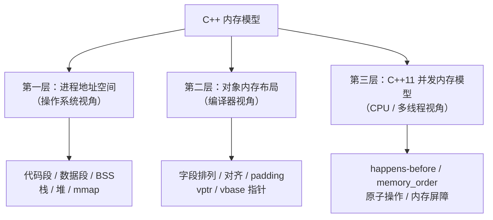

# 内存模型与布局

#### 目录介绍
- [1. 引言：C++程序的内存世界](#1-引言c程序的内存世界)
- [2. 进程地址空间布局](#2-进程地址空间布局)
- [3. C++对象的内存布局](#3-c对象的内存布局)
- [4. 包含虚函数的对象布局](#4-包含虚函数的对象布局)
- [5. 继承体系下的内存布局](#5-继承体系下的内存布局)
- [6. new和delete的内存管理](#6-new和delete的内存管理)
- [7. 内存对齐的高级话题](#7-内存对齐的高级话题)
- [8. 特殊成员的内存影响](#8-特殊成员的内存影响)
- [9. 内存布局的实际应用](#9-内存布局的实际应用)
- [10. 总结](#10-总结)

> **案例引入｜一次奇怪的 sizeof 翻车**
>
> 同事提交代码前跑了一遍性能测试，发现一个常年稳定的结构体 `Event` 突然从 `24 字节`胀到了 `40 字节`。回滚 diff 只改了一行：把字段 `int id` 移到了 `bool flag` 后面。他百思不得其解——明明字段总大小没变，为什么整体尺寸多了 **16 字节**？更诡异的是把这个结构体塞进 `std::vector<Event>` 后，吞吐量下降了约 30%。
>
> 这是一个真实的"**内存布局事故**"。它的根因不是代码写错，而是**对编译器内存对齐规则的直觉失灵**。读完本文，你会明白：那 16 字节是怎么"长"出来的，为什么改变字段顺序能省一半内存，以及为什么"胖 8 字节"的结构体会让 CPU 缓存命中率崩盘。

---

## 00.案例元信息

| 项目 | 说明 |
|------|------|
| 难度 | ★★★★☆ |
| 预估阅读 | 60 分钟（精读）/ 25 分钟（速览） |
| 前置知识 | 卷一第 5/8/9/11/12 章：结构体、指针、类、内存模型、动态内存 |
| 覆盖要点 | 进程地址空间、成员对齐、虚函数表 vptr、多继承布局、`new`/`delete` 的字节簿记、`alignas`/`alignof`、缓存行伪共享 |
| 核心产出 | 能独立**手画出**任意 C++ 对象（含多继承/虚继承）的字节布局图；能解释 `sizeof` 的每一个字节从哪来 |

---

## 1. 引言：C++ 程序的内存世界

C++ 是一门既能"贴着硬件写"又能"把硬件完全抽象掉"的语言——两种极端共存。这种双面性全部压在**内存模型**这一个点上：你写 `class Event { int id; bool flag; };`，编译器其实在背地里帮你干了 **3 件事**——**分配**（要多少字节）、**排列**（字段按什么顺序放）、**填充**（字段之间是否要"塞空气"让地址对齐）。

这三件事全由"对齐（alignment）+ 最大成员对齐（max member align）"这两条规则机械地决定。规则本身不复杂，但人的直觉常常出错——案例里的 16 字节"膨胀"，就是直觉错配的代价。

### 1.1 三层内存模型

C++ 的"内存模型"一词容易混淆，其实指的是**三个完全不同层级**的概念：



本文聚焦**前两层**（宏观地址空间 + 微观对象布局）；第三层（并发可见性）放在 [13.并发与内存序](./13.并发与内存序.md) 深入。

### 1.2 本文路线图


**阅读建议**：如果你是为了面试刷题，优先看 §2/§4/§5；如果你正在排查一个真实的内存膨胀或性能下降问题，**直接跳到 §7/§9**，遇到不懂的术语再回头看前面章节。

### 1.3 为什么值得花一小时读懂

| 场景 | 不懂内存布局会怎样 | 懂了之后能做什么 |
|------|------------------|----------------|
| 性能优化 | 缓存行伪共享导致多线程性能反而下降 | 用 `alignas(64)` 隔离热点字段 |
| Bug 排查 | 内存越界写坏了"看起来无关"的字段 | 从崩溃地址反推出是哪个字段被踩 |
| 跨平台移植 | 32 位 → 64 位后 `sizeof` 翻倍 | 用 `std::int32_t` + 手动 pad 锁死布局 |
| 面试 | 虚函数调用"答不出汇编层细节" | 画出 vtable 指针 + 间接跳转完整流程 |
| 架构决策 | 多态 vs 值语义选错 | 用布局开销量化"多态的代价" |

---

## 2. 进程地址空间布局

### 2.1 经典的进程内存布局

在Linux x86-64系统上，一个C++进程的虚拟地址空间通常如下：

```
高地址 0x7FFFFFFFFFFF
┌──────────────────────┐
│    内核空间 (高半部)   │  用户不可访问
├──────────────────────┤ 0x7FFFFFFFFFFF
│      栈 (Stack)       │  ↓ 向低地址增长
│    局部变量、函数参数   │
│    返回地址、栈帧信息   │
├──────────────────────┤
│          ↓            │
│      未映射区域        │
│          ↑            │
├──────────────────────┤
│      堆 (Heap)        │  ↑ 向高地址增长
│    new/malloc 分配     │
├──────────────────────┤
│   内存映射段 (mmap)    │  动态库、匿名映射
├──────────────────────┤
│    BSS段 (未初始化)    │  未初始化的全局/静态变量
├──────────────────────┤
│   数据段 (Data)       │  已初始化的全局/静态变量
├──────────────────────┤
│   只读数据段 (ROData)  │  常量、字符串字面量
├──────────────────────┤
│   代码段 (Text)       │  机器指令
└──────────────────────┘
低地址 0x000000000000
```

### 2.2 C++各类变量的存储位置

```cpp
#include <iostream>

// 全局变量 → 数据段
int global_init = 42;        // 已初始化 → .data
int global_uninit;           // 未初始化 → .bss

// 静态全局变量 → 数据段（链接属性不同）
static int static_global = 100;

// 常量 → 只读数据段
const char* str_literal = "Hello, C++";  // 字符串字面量 → .rodata

void function() {
    // 局部变量 → 栈
    int local_var = 10;
    
    // 静态局部变量 → 数据段（生命周期持续到程序结束）
    static int static_local = 20;
    
    // 动态分配 → 堆
    int* heap_var = new int(30);
    
    // 局部指针在栈上，指向的数据在堆上
    // heap_var 本身: 栈
    // *heap_var:     堆
    
    delete heap_var;
}

class MyClass {
    int x;          // 跟随对象所在的区域
    static int s;   // 数据段
};
int MyClass::s = 0; // 静态成员定义
```

### 2.3 验证内存布局

```cpp
#include <iostream>
#include <cstdio>

int global_init = 1;
int global_uninit;
const int global_const = 42;

int main() {
    int stack_var = 10;
    static int static_var = 20;
    int* heap_var = new int(30);
    const char* str = "hello";
    
    printf("代码段 (main函数):    %p\n", (void*)main);
    printf("全局已初始化 (.data): %p\n", (void*)&global_init);
    printf("全局未初始化 (.bss):  %p\n", (void*)&global_uninit);
    printf("全局常量 (.rodata):   %p\n", (void*)&global_const);
    printf("字符串字面量:         %p\n", (void*)str);
    printf("静态局部变量:         %p\n", (void*)&static_var);
    printf("栈变量:              %p\n", (void*)&stack_var);
    printf("堆变量:              %p\n", (void*)heap_var);
    
    delete heap_var;
    return 0;
}

// 典型输出（地址从低到高）：
// 代码段 < 全局常量 ≈ 字符串字面量 < 全局已初始化 < 全局未初始化
//        ≈ 静态局部变量 < 堆变量 << 栈变量
```

### 2.4 栈与堆的对比

```
┌─────────────┬──────────────────────┬──────────────────────┐
│    特性      │        栈             │        堆            │
├─────────────┼──────────────────────┼──────────────────────┤
│ 分配方式     │ 自动（编译器管理）    │ 手动（new/delete）   │
│ 增长方向     │ 向低地址              │ 向高地址             │
│ 分配速度     │ 极快（移动栈指针）    │ 较慢（搜索空闲块）   │
│ 空间大小     │ 有限（通常1-8MB）     │ 很大（受系统内存限制）│
│ 碎片问题     │ 无                   │ 有                    │
│ 生命周期     │ 函数返回自动释放      │ 手动管理或智能指针    │
│ 线程安全     │ 天然安全（每线程独立） │ 需要同步              │
│ 缓存友好性   │ 好（连续访问）        │ 差（碎片化）          │
└─────────────┴──────────────────────┴──────────────────────┘
```

```cpp
#include <chrono>
#include <iostream>

// 性能对比：栈分配 vs 堆分配
void benchmark() {
    const int N = 10000000;
    
    auto start = std::chrono::high_resolution_clock::now();
    for (int i = 0; i < N; i++) {
        int stack_arr[100];  // 栈分配
        stack_arr[0] = i;    // 防止优化
    }
    auto end = std::chrono::high_resolution_clock::now();
    auto stack_time = std::chrono::duration_cast<std::chrono::microseconds>(end - start);
    
    start = std::chrono::high_resolution_clock::now();
    for (int i = 0; i < N; i++) {
        int* heap_arr = new int[100];  // 堆分配
        heap_arr[0] = i;
        delete[] heap_arr;
    }
    end = std::chrono::high_resolution_clock::now();
    auto heap_time = std::chrono::duration_cast<std::chrono::microseconds>(end - start);
    
    std::cout << "栈分配: " << stack_time.count() << " μs\n";
    std::cout << "堆分配: " << heap_time.count() << " μs\n";
    // 堆分配通常慢10-100倍
}
```

---

## 3. C++对象的内存布局

### 3.1 简单类的布局

```cpp
#include <iostream>
#include <cstddef>

class Simple {
public:
    char a;     // offset 0, 1字节
    // 3字节填充（对齐到4字节边界）
    int b;      // offset 4, 4字节
    short c;    // offset 8, 2字节
    // 2字节填充（结构体总大小对齐到最大成员的对齐要求）
};
// sizeof(Simple) = 12

// 通过调整成员顺序优化大小
class SimpleOptimized {
public:
    int b;      // offset 0, 4字节
    short c;    // offset 4, 2字节
    char a;     // offset 6, 1字节
    // 1字节填充
};
// sizeof(SimpleOptimized) = 8  节省了33%!

void verify_layout() {
    std::cout << "Simple size: " << sizeof(Simple) << std::endl;
    std::cout << "  a offset: " << offsetof(Simple, a) << std::endl;
    std::cout << "  b offset: " << offsetof(Simple, b) << std::endl;
    std::cout << "  c offset: " << offsetof(Simple, c) << std::endl;
    
    std::cout << "SimpleOptimized size: " << sizeof(SimpleOptimized) << std::endl;
}
```

### 3.2 对齐规则详解

**疑惑**：为什么编译器要在成员之间插入填充字节？这不是浪费内存吗？

**答疑**：内存对齐是CPU硬件的要求。

```
CPU访问内存时，通常以"字"为单位（32位CPU为4字节，64位CPU为8字节）。
如果数据跨越了对齐边界，CPU需要两次内存访问才能读取，性能大幅下降。

未对齐的int（假设地址为0x01）：
┌────┬────┬────┬────┬────┬────┬────┬────┐
│    │ B0 │ B1 │ B2 │ B3 │    │    │    │
└────┴────┴────┴────┴────┴────┴────┴────┘
       ↑───── int跨越4字节边界 ─────↑
CPU需要读取两个4字节块然后拼接，或直接触发异常

对齐的int（假设地址为0x04）：
┌────┬────┬────┬────┬────┬────┬────┬────┐
│    │    │    │    │ B0 │ B1 │ B2 │ B3 │
└────┴────┴────┴────┴────┴────┴────┴────┘
                     ↑─── 一次读取完成 ───↑
```

**论证**：C++的对齐规则：

```cpp
// 规则1：成员的偏移量必须是其对齐要求的倍数
// 规则2：结构体的总大小必须是最大对齐要求的倍数
// 规则3：嵌套结构体的对齐要求取其成员的最大对齐要求

// C++11引入的alignof和alignas
#include <iostream>

struct AlignDemo {
    char a;        // alignof(char) = 1
    double b;      // alignof(double) = 8
    int c;         // alignof(int) = 4
};

void show_alignment() {
    std::cout << "alignof(char):   " << alignof(char) << std::endl;    // 1
    std::cout << "alignof(int):    " << alignof(int) << std::endl;     // 4
    std::cout << "alignof(double): " << alignof(double) << std::endl;  // 8
    std::cout << "alignof(AlignDemo): " << alignof(AlignDemo) << std::endl; // 8
    std::cout << "sizeof(AlignDemo):  " << sizeof(AlignDemo) << std::endl;  // 24
}

// 使用alignas指定对齐
struct alignas(64) CacheAligned {  // 对齐到缓存行边界
    int data[16];
};
// sizeof(CacheAligned) = 64，正好一个缓存行
```

### 3.3 空类的大小

**疑惑**：一个什么成员都没有的类，大小是多少？

```cpp
class Empty {};

int main() {
    std::cout << sizeof(Empty) << std::endl;  // 输出: 1
    
    Empty a, b;
    std::cout << (&a == &b) << std::endl;  // 输出: 0
}
```

**答疑**：C++标准规定，任何对象的大小至少为1字节。这是因为C++要求每个独立对象必须有唯一的地址。如果空类大小为0，数组中的元素就无法区分了。

```cpp
// 空基类优化(EBO/EBCO)
class EmptyBase {};
class Derived : public EmptyBase {
    int x;
};

std::cout << sizeof(EmptyBase) << std::endl;  // 1
std::cout << sizeof(Derived) << std::endl;    // 4，不是5!

// 编译器优化：如果基类为空，不为基类分配空间
// C++20的[[no_unique_address]]可以对成员做类似优化
struct C20Optimized {
    [[no_unique_address]] Empty e;
    int x;
};
// sizeof(C20Optimized) 可能为4而不是8
```

---

## 4. 包含虚函数的对象布局

### 4.1 虚函数表指针(vptr)

当类中有虚函数时，编译器会在对象中插入一个指向虚函数表(vtable)的指针。

```cpp
#include <iostream>
#include <cstdio>

class Base {
public:
    int x;
    virtual void foo() { std::cout << "Base::foo" << std::endl; }
    virtual void bar() { std::cout << "Base::bar" << std::endl; }
    virtual ~Base() {}
};

class Derived : public Base {
public:
    int y;
    void foo() override { std::cout << "Derived::foo" << std::endl; }
    virtual void baz() { std::cout << "Derived::baz" << std::endl; }
};

void examine_layout() {
    std::cout << "sizeof(void*): " << sizeof(void*) << std::endl;  // 8 (64位)
    std::cout << "sizeof(Base):    " << sizeof(Base) << std::endl;    // 16 = 8(vptr) + 4(x) + 4(padding)
    std::cout << "sizeof(Derived): " << sizeof(Derived) << std::endl; // 24 = 8(vptr) + 4(x) + 4(y) + padding
    
    Derived d;
    printf("对象地址:   %p\n", &d);
    printf("vptr地址:   %p (偏移0)\n", (void*)&d);
    printf("x成员地址:  %p (偏移%ld)\n", &d.x, (char*)&d.x - (char*)&d);
    printf("y成员地址:  %p (偏移%ld)\n", &d.y, (char*)&d.y - (char*)&d);
}
```

### 4.2 虚函数表的结构

```
对象 d (Derived类型):
┌──────────────────┐ offset 0
│     vptr ─────────────→ Derived的vtable:
├──────────────────┤       ┌─────────────────────────┐
│     x = ?        │       │ typeinfo pointer         │ 用于RTTI
├──────────────────┤       ├─────────────────────────┤
│     y = ?        │       │ Derived::~Derived()      │ 虚析构
└──────────────────┘       ├─────────────────────────┤
                           │ Derived::foo()           │ 重写了Base::foo
                           ├─────────────────────────┤
                           │ Base::bar()              │ 继承Base::bar
                           ├─────────────────────────┤
                           │ Derived::baz()           │ 新增虚函数
                           └─────────────────────────┘
```

### 4.3 手动探查虚函数表

```cpp
#include <iostream>
#include <cstdint>

class Animal {
public:
    virtual void speak() { std::cout << "..." << std::endl; }
    virtual void eat()   { std::cout << "eating" << std::endl; }
    virtual ~Animal() {}
};

class Dog : public Animal {
public:
    void speak() override { std::cout << "Woof!" << std::endl; }
};

void explore_vtable() {
    Dog dog;
    
    // vptr 是对象的第一个成员（大多数编译器实现）
    // vptr 指向一个函数指针数组
    uintptr_t* vptr = *(uintptr_t**)&dog;
    
    std::cout << "vtable地址: " << (void*)vptr << std::endl;
    
    // 通过vtable调用虚函数（仅用于学习，实际代码不要这样做）
    // 注意：vtable的具体布局是实现定义的
    // GCC/Clang中，typeinfo在vtable[-1]，虚函数从vtable[0]开始
    // 但析构函数的位置因编译器而异
    
    // 验证多态：
    Animal* a = &dog;
    a->speak();  // 输出"Woof!" — 通过vptr查找vtable，调用Derived版本
    a->eat();    // 输出"eating" — 继承的版本
}

// 多态调用的汇编层面实现：
// 1. 从对象起始地址加载vptr: mov rax, [rdi]
// 2. 从vtable加载函数地址:   mov rax, [rax + offset]
// 3. 调用:                    call rax
// 总共需要两次间接寻址
```

### 4.4 虚函数调用的开销

```cpp
// 虚函数调用 vs 非虚函数调用的性能对比
class WithVirtual {
public:
    virtual int compute(int x) { return x * 2; }
};

class WithoutVirtual {
public:
    int compute(int x) { return x * 2; }
};

// 虚函数调用的额外开销：
// 1. 一次额外的内存加载（读取vptr）
// 2. 一次额外的内存加载（读取vtable中的函数指针）
// 3. 间接调用（无法内联、无法分支预测优化）
// 
// 在紧密循环中，这个开销可能很显著
// 编译器有时可以"去虚拟化"（devirtualization）：
// 如果编译器能确定对象的实际类型，就可以直接调用

void devirtualization_example() {
    Dog dog;
    dog.speak();     // 编译器知道dog是Dog类型
                     // 可以直接调用Dog::speak()，无需虚调用
    
    Animal* a = &dog;
    a->speak();      // 如果编译器能证明a指向Dog
                     // 也可以去虚拟化（-O2以上优化级别）
}
```

---

## 5. 继承体系下的内存布局

### 5.1 单继承

```cpp
class A {
public:
    int a;
    virtual void f() {}
};

class B : public A {
public:
    int b;
    void f() override {}
    virtual void g() {}
};

class C : public B {
public:
    int c;
    void g() override {}
};

// 内存布局（GCC/Clang，64位）：
// A对象:
// ┌──────┐
// │ vptr │ → A::vtable
// │  a   │
// └──────┘ sizeof = 16

// B对象:
// ┌──────┐
// │ vptr │ → B::vtable (A部分)
// │  a   │
// │  b   │
// └──────┘ sizeof = 16 (刚好)

// C对象:
// ┌──────┐
// │ vptr │ → C::vtable
// │  a   │
// │  b   │
// │  c   │
// └──────┘ sizeof = 24

// 关键：单继承只有一个vptr
// 基类子对象在派生类的开头，保证基类指针和派生类指针值相同
```

### 5.2 多继承

```cpp
class X {
public:
    int x;
    virtual void fx() {}
};

class Y {
public:
    int y;
    virtual void fy() {}
};

class Z : public X, public Y {
public:
    int z;
    void fx() override {}
    void fy() override {}
};

// Z对象的内存布局：
// ┌──────────┐ offset 0
// │ X::vptr  │ → Z的vtable（X部分）
// │ X::x     │
// ├──────────┤ offset 16（Y的起始偏移）
// │ Y::vptr  │ → Z的vtable（Y部分）
// │ Y::y     │
// ├──────────┤
// │ Z::z     │
// └──────────┘
// sizeof(Z) = 32（可能因对齐而不同）

void multiple_inheritance_pointer() {
    Z z;
    X* px = &z;  // px == &z（指向Z对象开头）
    Y* py = &z;  // py != &z！（指向Y子对象的开头）
    
    // 编译器自动调整指针：
    // py = (Y*)((char*)&z + offset_of_Y_in_Z)
    
    printf("&z  = %p\n", (void*)&z);
    printf("px  = %p\n", (void*)px);
    printf("py  = %p\n", (void*)py);
    // py 的值比 &z 大一个偏移量
    
    // 多继承的指针转换不是简单的类型重解释
    // 它需要地址调整！
    Z* pz1 = static_cast<Z*>(px);  // 无需调整
    Z* pz2 = static_cast<Z*>(py);  // 需要减去偏移量
}
```

### 5.3 菱形继承与虚继承

**疑惑**：菱形继承为什么会导致问题？虚继承如何解决？

```cpp
// 菱形继承问题
class Animal {
public:
    int weight;
    virtual void breathe() {}
};

class Mammal : public Animal {
public:
    int fur_length;
};

class Bird : public Animal {
public:
    int wing_span;
};

class Platypus : public Mammal, public Bird {
    // 问题：Platypus包含两份Animal子对象！
    // Platypus::Mammal::Animal::weight
    // Platypus::Bird::Animal::weight
};

void diamond_problem() {
    Platypus p;
    // p.weight;  // 编译错误：二义性！
    p.Mammal::weight = 10;  // 必须明确指定
    p.Bird::weight = 10;    // 两份独立的weight
}
```

```
非虚继承的菱形布局：
┌─────────────────┐
│ Mammal::Animal  │  ← 第一份Animal
│   vptr          │
│   weight        │
│ fur_length      │
├─────────────────┤
│ Bird::Animal    │  ← 第二份Animal（冗余！）
│   vptr          │
│   weight        │
│ wing_span       │
├─────────────────┤
│ Platypus的成员   │
└─────────────────┘
```

**答疑**：虚继承让多个派生路径共享同一份基类子对象。

```cpp
class Animal {
public:
    int weight;
    virtual void breathe() {}
};

class Mammal : virtual public Animal {  // 虚继承
public:
    int fur_length;
};

class Bird : virtual public Animal {    // 虚继承
public:
    int wing_span;
};

class Platypus : public Mammal, public Bird {
    // 现在只有一份Animal子对象
};

void virtual_inheritance() {
    Platypus p;
    p.weight = 10;  // 没有二义性了！
    
    std::cout << "sizeof(Animal):   " << sizeof(Animal) << std::endl;
    std::cout << "sizeof(Mammal):   " << sizeof(Mammal) << std::endl;
    std::cout << "sizeof(Bird):     " << sizeof(Bird) << std::endl;
    std::cout << "sizeof(Platypus): " << sizeof(Platypus) << std::endl;
    // Platypus的大小比预期大，因为虚继承需要额外的间接指针
}
```

```
虚继承的Platypus布局（简化）：
┌─────────────────┐
│ Mammal部分       │
│   vptr          │ → Mammal-in-Platypus vtable
│   vbase_offset  │  (或通过vtable中的偏移量访问)
│   fur_length    │
├─────────────────┤
│ Bird部分         │
│   vptr          │ → Bird-in-Platypus vtable
│   vbase_offset  │
│   wing_span     │
├─────────────────┤
│ Platypus自身成员 │
├─────────────────┤
│ Animal部分(共享) │  ← 虚基类在最末尾（通常）
│   vptr          │
│   weight        │
└─────────────────┘

访问虚基类成员需要通过虚基类偏移量间接访问
这比普通继承多了一次间接寻址
```

**论证**：虚继承的代价：

```
虚继承 vs 普通继承
━━━━━━━━━━━━━━━━━━
优点：
├── 解决菱形继承的二义性
└── 保证基类子对象唯一

代价：
├── 对象更大（虚基类指针/偏移量）
├── 访问虚基类成员更慢（间接寻址）
├── 构造更复杂（最深派生类负责构造虚基类）
└── 编译器实现复杂度高
```

---

## 6. new和delete的内存管理

### 6.1 new表达式的完整流程

```cpp
// 当你写 MyClass* p = new MyClass(args);
// 编译器实际执行的是：

// 步骤1：调用operator new分配内存
void* raw = operator new(sizeof(MyClass));

// 步骤2：在分配的内存上调用构造函数
MyClass* p = new (raw) MyClass(args);  // placement new

// 如果构造函数抛出异常：
// 步骤3：自动调用operator delete释放内存
// operator delete(raw);
```

### 6.2 operator new的层次

```cpp
#include <iostream>
#include <new>
#include <cstdlib>

// 全局operator new（可替换）
void* operator new(std::size_t size) {
    std::cout << "Global operator new: " << size << " bytes\n";
    void* ptr = std::malloc(size);
    if (!ptr) throw std::bad_alloc();
    return ptr;
}

void operator delete(void* ptr) noexcept {
    std::cout << "Global operator delete\n";
    std::free(ptr);
}

class MyClass {
public:
    int data[4];
    
    // 类特定的operator new（优先级高于全局）
    static void* operator new(std::size_t size) {
        std::cout << "MyClass::operator new: " << size << " bytes\n";
        return ::operator new(size);  // 调用全局版本
    }
    
    static void operator delete(void* ptr) noexcept {
        std::cout << "MyClass::operator delete\n";
        ::operator delete(ptr);
    }
};

// new的各种形式：
void new_forms() {
    // 1. 普通new
    int* p1 = new int(42);
    delete p1;
    
    // 2. 数组new
    int* p2 = new int[10];
    delete[] p2;  // 必须用delete[]
    
    // 3. placement new（在指定内存上构造）
    char buffer[sizeof(MyClass)];
    MyClass* p3 = new (buffer) MyClass();
    p3->~MyClass();  // 必须手动调用析构函数
    // 不能delete p3，因为内存不是new分配的
    
    // 4. nothrow new（不抛异常，失败返回nullptr）
    int* p4 = new (std::nothrow) int(42);
    if (p4) delete p4;
}
```

### 6.3 数组new的内存布局

```cpp
// new int[5] 的内存布局：
// 对于POD类型，直接分配 5 * sizeof(int) 字节

// new MyClass[5] 的内存布局（非POD类型）：
// 编译器会额外分配一些字节存储数组大小
// ┌──────────┬──────┬──────┬──────┬──────┬──────┐
// │ count=5  │ [0]  │ [1]  │ [2]  │ [3]  │ [4]  │
// └──────────┴──────┴──────┴──────┴──────┴──────┘
//  (通常8字节)
// 
// new返回的指针指向[0]
// delete[]需要读取前面的count来知道要析构多少个对象
// 这就是为什么new[]必须配delete[]！

class Counter {
public:
    Counter()  { std::cout << "Constructor\n"; }
    ~Counter() { std::cout << "Destructor\n"; }
};

void array_new_demo() {
    Counter* arr = new Counter[3];
    // 输出3次Constructor
    
    // 查看arr前面的隐藏数据
    size_t* count = reinterpret_cast<size_t*>(arr) - 1;
    std::cout << "Array count: " << *count << std::endl;  // 可能输出3
    // 注意：这是实现细节，不可移植
    
    delete[] arr;  // 输出3次Destructor
    // 如果错误地使用 delete arr，只会析构第一个元素
    // 剩余元素泄漏，且可能破坏堆结构 → UB
}
```

---

## 7. 内存对齐的高级话题

### 7.1 自定义对齐

```cpp
#include <iostream>
#include <new>
#include <cstdlib>

// C++11: alignas 指定对齐
struct alignas(16) Vec4 {
    float x, y, z, w;
};
// sizeof(Vec4) = 16, alignof(Vec4) = 16

// C++17: new支持过对齐类型
// 在C++17之前，new不保证对齐超过alignof(max_align_t)
// C++17为过对齐类型引入了新的operator new重载：
// void* operator new(size_t, align_val_t)

struct alignas(64) CacheLine {
    char data[64];
};

void aligned_allocation() {
    // C++17自动使用对齐版本的new
    CacheLine* p = new CacheLine;
    std::cout << "Address: " << p << std::endl;
    std::cout << "Aligned to 64: " << ((uintptr_t)p % 64 == 0) << std::endl;
    delete p;
    
    // C++11中手动对齐分配
    void* raw = nullptr;
    if (posix_memalign(&raw, 64, sizeof(CacheLine)) == 0) {
        CacheLine* p2 = new (raw) CacheLine;
        p2->~CacheLine();
        free(raw);
    }
}
```

### 7.2 缓存行对齐与伪共享

```cpp
#include <atomic>
#include <thread>
#include <chrono>
#include <iostream>

// 伪共享(False Sharing)问题：
// 两个线程修改不同变量，但这两个变量在同一个缓存行上
// 导致缓存行在核心间反复失效和传输

// 有伪共享的结构
struct BadCounters {
    std::atomic<long> counter1;  // 这两个变量可能在同一缓存行
    std::atomic<long> counter2;
};

// 消除伪共享的结构
struct GoodCounters {
    alignas(64) std::atomic<long> counter1;  // 独占一个缓存行
    alignas(64) std::atomic<long> counter2;  // 独占一个缓存行
};
// C++17: std::hardware_destructive_interference_size

void benchmark_false_sharing() {
    const int N = 100000000;
    
    // 测试有伪共享
    {
        BadCounters counters{};
        auto start = std::chrono::high_resolution_clock::now();
        
        std::thread t1([&] {
            for (int i = 0; i < N; i++)
                counters.counter1.fetch_add(1, std::memory_order_relaxed);
        });
        std::thread t2([&] {
            for (int i = 0; i < N; i++)
                counters.counter2.fetch_add(1, std::memory_order_relaxed);
        });
        t1.join(); t2.join();
        
        auto end = std::chrono::high_resolution_clock::now();
        auto ms = std::chrono::duration_cast<std::chrono::milliseconds>(end - start);
        std::cout << "有伪共享: " << ms.count() << " ms\n";
    }
    
    // 测试无伪共享
    {
        GoodCounters counters{};
        auto start = std::chrono::high_resolution_clock::now();
        
        std::thread t1([&] {
            for (int i = 0; i < N; i++)
                counters.counter1.fetch_add(1, std::memory_order_relaxed);
        });
        std::thread t2([&] {
            for (int i = 0; i < N; i++)
                counters.counter2.fetch_add(1, std::memory_order_relaxed);
        });
        t1.join(); t2.join();
        
        auto end = std::chrono::high_resolution_clock::now();
        auto ms = std::chrono::duration_cast<std::chrono::milliseconds>(end - start);
        std::cout << "无伪共享: " << ms.count() << " ms\n";
    }
    // 无伪共享版本通常快2-10倍
}
```

---

## 8. 特殊成员的内存影响

### 8.1 静态成员

```cpp
class MyClass {
public:
    int instance_var;          // 每个对象一份，在对象内部
    static int class_var;      // 所有对象共享，在数据段
    static const int const_var = 42;  // 编译期常量
    
    void method() {}           // 不占对象空间（代码段）
    virtual void vmethod() {}  // 导致对象中有vptr
    static void smethod() {}  // 不占对象空间
};
int MyClass::class_var = 0;

void static_member_layout() {
    std::cout << "sizeof(MyClass): " << sizeof(MyClass) << std::endl;
    // = sizeof(vptr) + sizeof(instance_var) + padding
    // static成员不占对象空间
    
    MyClass a, b;
    a.class_var = 10;
    std::cout << b.class_var << std::endl;  // 输出10，共享
}
```

### 8.2 位域

```cpp
struct Flags {
    unsigned int visible : 1;   // 1位
    unsigned int enabled : 1;   // 1位
    unsigned int mode    : 3;   // 3位 (0-7)
    unsigned int level   : 4;   // 4位 (0-15)
    unsigned int         : 0;   // 强制对齐到下一个存储单元
    unsigned int extra   : 2;   // 2位
};

void bitfield_layout() {
    std::cout << "sizeof(Flags): " << sizeof(Flags) << std::endl;
    
    Flags f = {};
    f.visible = 1;
    f.mode = 5;
    f.level = 10;
    
    // 注意：不能取位域成员的地址
    // unsigned int* p = &f.visible;  // 编译错误
    
    // 位域在内存中的排列是实现定义的
    // 不同编译器可能有不同的位序
}
```

### 8.3 联合体(union)

```cpp
union Variant {
    int i;
    float f;
    char c;
};
// sizeof(Variant) = max(sizeof(int), sizeof(float), sizeof(char)) = 4

// C++17 std::variant是类型安全的替代
#include <variant>

void union_vs_variant() {
    // 传统union - 不安全
    Variant v;
    v.f = 3.14f;
    int x = v.i;  // 类型双关，C++中是UB（C中可以）
    
    // C++17 variant - 类型安全
    std::variant<int, float, char> sv;
    sv = 3.14f;
    // int y = std::get<int>(sv);  // 抛出std::bad_variant_access
    float z = std::get<float>(sv);  // 安全
}
```

---

## 9. 内存布局的实际应用

### 9.1 二进制序列化

```cpp
#include <fstream>
#include <cstring>

// POD类型可以直接二进制读写
struct __attribute__((packed)) PacketHeader {
    uint8_t  version;
    uint8_t  type;
    uint16_t length;
    uint32_t sequence;
};
static_assert(sizeof(PacketHeader) == 8, "PacketHeader must be 8 bytes");

void serialize_demo() {
    PacketHeader header = {1, 2, 100, 42};
    
    // 写入
    std::ofstream out("packet.bin", std::ios::binary);
    out.write(reinterpret_cast<const char*>(&header), sizeof(header));
    out.close();
    
    // 读取
    PacketHeader read_header;
    std::ifstream in("packet.bin", std::ios::binary);
    in.read(reinterpret_cast<char*>(&read_header), sizeof(read_header));
    in.close();
    
    // 注意：这种方式不可跨平台（字节序、对齐可能不同）
}
```

### 9.2 内存池

```cpp
#include <array>
#include <cstddef>
#include <cassert>

// 固定大小对象的内存池
template<typename T, size_t PoolSize = 1024>
class ObjectPool {
    union Slot {
        T object;
        Slot* next;
        Slot() {}
        ~Slot() {}
    };
    
    std::array<Slot, PoolSize> pool_;
    Slot* free_list_;
    
public:
    ObjectPool() : free_list_(nullptr) {
        for (size_t i = 0; i < PoolSize; i++) {
            pool_[i].next = free_list_;
            free_list_ = &pool_[i];
        }
    }
    
    template<typename... Args>
    T* allocate(Args&&... args) {
        if (!free_list_) return nullptr;
        Slot* slot = free_list_;
        free_list_ = free_list_->next;
        return new (&slot->object) T(std::forward<Args>(args)...);
    }
    
    void deallocate(T* ptr) {
        ptr->~T();
        Slot* slot = reinterpret_cast<Slot*>(ptr);
        slot->next = free_list_;
        free_list_ = slot;
    }
};
```

### 9.3 使用offsetof和container_of

```cpp
#include <cstddef>
#include <iostream>

struct Node {
    int data;
    Node* next;
};

struct Container {
    int id;
    char name[32];
    Node node;  // 嵌入的链表节点
};

// 从成员指针获取容器指针
#define container_of(ptr, type, member) \
    reinterpret_cast<type*>( \
        reinterpret_cast<char*>(ptr) - offsetof(type, member))

void intrusive_list_demo() {
    Container c = {42, "test", {100, nullptr}};
    
    Node* np = &c.node;
    Container* cp = container_of(np, Container, node);
    
    std::cout << "Container id: " << cp->id << std::endl;
    std::cout << "Container name: " << cp->name << std::endl;
}
```

---

## 10. 总结

### 10.1 C++内存布局知识图谱

```
C++内存模型与对象布局
├── 进程地址空间
│   ├── 代码段 → 函数体、虚函数表
│   ├── 只读数据段 → 常量、字符串字面量
│   ├── 数据段 → 全局/静态变量
│   ├── 堆 → new分配、动态对象
│   └── 栈 → 局部变量、函数调用
├── 对象内存布局
│   ├── 成员变量排列 + 对齐填充
│   ├── 空类大小为1（EBO优化）
│   ├── vptr（虚函数表指针）
│   └── 特殊成员（static/位域/union）
├── 继承体系布局
│   ├── 单继承 → 基类在前，一个vptr
│   ├── 多继承 → 多个vptr，指针调整
│   └── 虚继承 → 共享虚基类，虚基类指针
└── new/delete机制
    ├── operator new → 分配原始内存
    ├── placement new → 就地构造
    ├── 数组new → 隐藏计数
    └── 对齐new → C++17过对齐支持
```

### 10.2 实践建议

| 建议 | 说明 |
|------|------|
| 按大小排列成员 | 大成员在前，小成员在后，减少填充 |
| 避免虚继承 | 除非真的需要解决菱形继承 |
| 缓存行对齐 | 多线程共享数据注意伪共享 |
| 使用智能指针 | 避免手动new/delete |
| 注意new[]和delete[] | 必须配对使用 |
| 不要依赖特定布局 | 内存布局是实现定义的 |

理解C++内存模型是掌握这门语言的基石。只有深入理解对象在内存中的真实面貌，才能写出高效、正确、可维护的C++代码。

---

## 11. 深挖：那些代码背后没写出来的"为什么"

前面十节以代码为主线铺陈了内存模型的事实（layout、对齐、vptr、new/delete 等）。但一个完整的心智模型还需要回答几个"为什么"。这一节用纯文字讲清楚那些容易被代码淹没、却最关键的机制取舍。

### 11.1 为什么 C++ 把"内存布局"几乎全部交给实现

与 Java/Go/C# 不同，C++ 标准从不规定一个类成员在内存里的绝对偏移，只约束以下几点：

- 同一访问控制区（public/private/protected）内，声明顺序即内存顺序（C++11 之前是"相邻同访问段"，C++11 之后是"同一访问段连续"）。
- 标准布局类型（standard-layout type）允许 `reinterpret_cast` 到首成员。
- 对于平凡可复制类型（trivially copyable），`memcpy` 是合法的。

这意味着 `struct A { int x; double y; };` 在 x86-64 下几乎总是 16 字节，但在某些嵌入式平台（如 ARM v5 的部分配置）可能是 12 字节；vptr 的位置、虚基类偏移的存储策略在 Itanium ABI（GCC/Clang）和 MSVC ABI 之间也不一样。C++ 的设计哲学是"**零成本抽象 + 信任实现**"：把细节让给编译器/ABI，由它们在不同硬件上挑最优方案；代价是**跨编译器的 ABI 不兼容**（这也是第 16 章会深入讨论的问题）。

### 11.2 栈与堆的真正区别：不是"位置"，是"记账方式"

新手常把栈/堆说成"两块内存"，但 CPU 本身并不区分它们——它们只是虚拟地址空间里两个生长方向相反的区域。真正的差别在于**分配与回收的记账方式**：

| 维度 | 栈 | 堆 |
|------|-----|------|
| 分配成本 | 一条 `sub rsp, N` 指令 | 要走 `malloc`（内部是自由链表 / bin / mmap） |
| 回收成本 | `add rsp, N` 一条指令 | `free` 要找到元数据块、合并相邻空闲块 |
| 生命周期 | 绑定作用域（离开即销毁） | 由程序员/智能指针显式管理 |
| 碎片 | 不存在（LIFO 顺序） | 存在内外碎片 |
| 并发 | 每线程私有（不需锁） | 多线程共享（malloc 内部有锁或 per-thread arena） |
| 崩溃表现 | 栈溢出 → SIGSEGV + guard page | 越界写 → 损坏堆元数据 → 延迟崩溃 |

理解了这张表就能解释很多日常现象：
- **为什么深递归会崩**：栈的 guard page 在地址不断下探时被踩到，触发 SIGSEGV。
- **为什么同样大小的对象，堆分配比栈慢 50-200 倍**：栈只动一个寄存器，堆要遍历元数据。
- **为什么多线程反复 `new/delete` 会变慢**：tcmalloc/jemalloc/glibc malloc 都在 per-thread arena 和全局 arena 之间搬数据以降低锁竞争。

### 11.3 对齐的三层含义：硬件、ABI、性能

第 7 节给出了 alignof/alignas 的用法，但"对齐"这个概念在三个层次上含义不同：

1. **硬件层**：某些 CPU（早期 ARM、SPARC、部分 MIPS）对未对齐访问会直接抛总线错误（SIGBUS）；x86 会"容忍"但拆成两次内存访问（跨 cache line 甚至会触发锁总线）。
2. **ABI 层**：System V AMD64 ABI 规定 `long double` 16 字节对齐、函数调用时 `%rsp` 16 字节对齐。这些都不是 C++ 规定的，是平台约定，但编译器必须遵守它才能和 libc / 其他对象文件链接。
3. **性能层**：即便硬件不强制，一个跨 cache line（64 B）的原子 CAS 在 x86 上也会退化为 bus lock，延迟从纳秒级飙到微秒级。伪共享（false sharing）是并发程序"对齐性能坑"的经典案例。

所以 `alignas(64)` 在多线程代码里的常见意义不是"让 CPU 能访问"，而是"让我独占一条 cache line"。

### 11.4 vptr 为什么放在对象最前面

这是 Itanium ABI（Linux/macOS 下的 GCC/Clang）的约定。把 vptr 放首部的好处：

- 虚函数调用只需 "取首 8 字节 → 索引表 → 跳转"三步，与"类型 id 检查""RTTI"都无关；最坏一次间接跳转、最好能被 CPU 分支预测器缓存。
- 多继承时，派生类对象的每一个基类子对象都可以把自己的 vptr 放到"该基类子对象的起点"，只要在转换指针时做一次常量偏移调整（thunk）即可。

反之，MSVC ABI 也把 vptr 放首部，但多继承 thunk 的生成时机与 GCC 不同，这也是为什么"用 VS 编译的 DLL 不能直接被 GCC 编译的 EXE 加载"——ABI 不兼容本质是对象布局不一致。

### 11.5 new/delete 背后的"两步走"为什么不能合并

`new T(args...)` 语义上是两步：**分配原始内存 → 就地构造对象**。C++ 故意把它拆开，目的是让以下三种高级用法成为可能：

- **placement new**：在已分配好的内存上构造（用于内存池、环形缓冲、对齐内存）。
- **自定义 `operator new` / `operator delete`**：类可以重载分配策略（如 `EASTL`、游戏引擎常用）。
- **异常安全**：如果构造函数抛异常，C++ 必须"不产生内存泄漏"地回滚，这就要求编译器能分别调用 "分配" 和 "构造"（失败时自动调 `operator delete`）。

这也解释了一个常被忽视的规则：**`new T[n]` 的 `operator new[]` 会多分配几字节**来记录数组长度，否则 `delete[]` 不知道要调多少次析构函数；这部分隐藏内存是"每次 `new[]` 都多付的税"，在嵌入式系统里甚至是拒绝用 `new[]` 的理由。

### 11.6 小结：从"写代码"到"看清代码"

读到这里，你应该能在脑子里回答这几个问题：

1. 为什么同一个 `class Widget { char a; int b; char c; };`，在 32 位和 64 位下大小不同？→ 答：编译器按最大成员对齐要求补 padding。
2. 为什么 `std::vector<bool>` 是唯一一个"非容器"容器？→ 答：为了位压缩，它的 `operator[]` 返回的是代理对象而非引用。
3. 为什么 `std::shared_ptr` 的控制块要和对象本身分开？→ 答：因为 `weak_ptr` 可能在对象销毁后仍要访问引用计数。
4. 为什么 C++ 的对象一旦构造完成，就不能"改变类型"？→ 答：vptr 是对象布局的一部分，跨类型改写 vptr 会打破标准布局和 strict aliasing。

这些问题的答案在各自的后续章节里都会有专门的深挖，但能在"内存模型"一章就把它们联系起来，是读完这一篇的真正收获。
