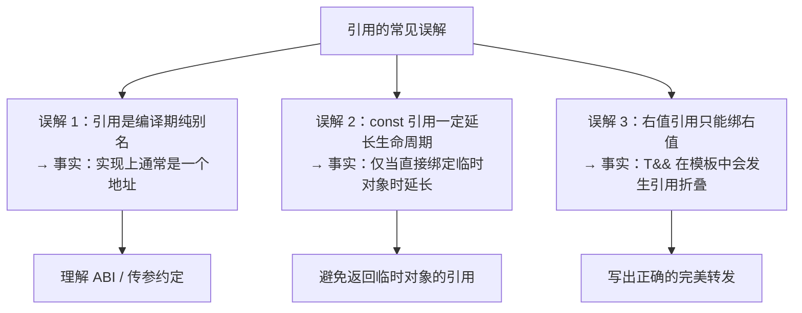

# 第2章：C++ 引用与指针原理

#### 目录介绍
- [1. 引言](#1-引言)
- [2. 指针的本质回顾](#2-指针的本质回顾)
- [3. 引用的本质](#3-引用的本质)
- [4. 左值与右值](#4-左值与右值)
- [5. 引用折叠与完美转发](#5-引用折叠与完美转发)
- [6. 成员指针的深入理解](#6-成员指针的深入理解)
- [7. 指针与引用在函数参数中的选择](#7-指针与引用在函数参数中的选择)
- [8. 引用与指针的高级话题](#8-引用与指针的高级话题)
- [9. this指针](#9-this指针)
- [10. 总结](#10-总结)

> **案例引入｜一次被"引用"坑到的线上事故**
>
> 一段看起来完全无害的代码在测试环境跑了一周都没问题，一上线就 SIGSEGV：
>
> ```cpp
> const std::string& getName() {
>     return std::string("temp_name");   // 返回临时对象的引用
> }
>
> // 调用方：
> const auto& name = getName();
> std::cout << name;                     // 这里 crash
> ```
>
> 团队争论了一下午：有人说"引用是别名，应该不会有问题"；有人说"`const` 引用能延长临时对象生命周期吧？"；还有人说"这不就是野指针换了个马甲吗？"——**这三种说法都只说对了一半**。真相藏在"引用的汇编实现"、"临时对象的生命周期边界"和"`const` 引用延长规则的例外"里。
>
> 这篇文章的目标，就是让你再也不会被这类问题困住——包括引用折叠、完美转发、右值引用这些"高级语法糖"背后的所有机械规则。

---

## 00.案例元信息

| 项目 | 说明 |
|------|------|
| 难度 | ★★★★☆ |
| 预估阅读 | 50 分钟 |
| 前置知识 | 卷一第 8 章指针与引用、第 7 章函数参数、第 9 章类 |
| 覆盖要点 | 引用的汇编实现、左值/右值/亡值、`const` 引用延长生命周期、引用折叠、完美转发 `std::forward`、成员指针 |
| 核心产出 | 能解释任何一行"引用 vs 指针"代码在汇编层的差异；能判断任一表达式的值类别 |

---

## 1. 引言

引用（reference）和指针（pointer）是 C++ 中最基础却最易混淆的两个概念。表面看，引用只是"变量的别名"——但它的**底层实现几乎和指针一样**（都是通过地址间接访问）；语义上却又和指针**截然不同**（引用不能重绑、不能为空、不能做算术）。这些"看起来像指针但又不是指针"的规则，是日常 bug 的高发地带。

### 1.1 三个容易栽跟头的陷阱



### 1.2 本文路线图


### 1.3 本文要回答的核心问题

- 引用在汇编/ABI 层**到底存不存在**？和指针相比省了什么、没省什么？
- 左值引用 `T&`、右值引用 `T&&`、转发引用 `auto&&` 三者的**语义差异**是什么？
- `const T&` 能绑临时对象——**具体是怎么"延长"的**？什么情况下不延长？
- 引用折叠（reference collapsing）的 4 条规则为什么设计成那样？
- 完美转发 `std::forward<T>(x)` 背后的两条"保值规则"是什么？
- 裸指针 / 引用 / 智能指针，**函数签名**应该怎么选？

---

## 2. 指针的本质回顾

### 2.1 指针是"类型化的地址"

```cpp
#include <iostream>
#include <cstdint>

void pointer_essence() {
    int x = 42;
    int* p = &x;
    
    // 指针的两个要素：
    // 1. 值：目标对象的内存地址
    // 2. 类型：决定解引用时读取多少字节、如何解释
    
    std::cout << "指针的值(地址): " << p << std::endl;
    std::cout << "指针本身的大小: " << sizeof(p) << std::endl;  // 64位系统: 8
    std::cout << "指向类型的大小: " << sizeof(*p) << std::endl; // int: 4
    
    // 指针算术受类型影响
    int arr[5] = {10, 20, 30, 40, 50};
    int* pa = arr;
    char* pc = reinterpret_cast<char*>(arr);
    
    std::cout << "pa+1 移动字节数: " << ((char*)(pa+1) - (char*)pa) << std::endl;  // 4
    std::cout << "pc+1 移动字节数: " << ((char*)(pc+1) - (char*)pc) << std::endl;  // 1
}
```

### 2.2 指针的各种形态

```cpp
// 1. 原始指针
int* raw_ptr = new int(42);
delete raw_ptr;

// 2. 常量指针 vs 指针常量
const int* ptr_to_const = &x;    // 指向常量的指针：不能通过指针修改值
int* const const_ptr = &x;       // 指针常量：指针本身不能改变
const int* const both = &x;      // 都不能改

// 3. void指针——类型擦除
void* vp = &x;
// int val = *vp;    // 错误：不能解引用void*
int val = *static_cast<int*>(vp);  // 需要强转

// 4. 函数指针
int add(int a, int b) { return a + b; }
int (*fp)(int, int) = add;
std::cout << fp(1, 2) << std::endl;

// 5. 成员指针
struct S { int x; void foo() {} };
int S::*mp = &S::x;           // 成员数据指针
void (S::*mfp)() = &S::foo;   // 成员函数指针

S s;
std::cout << s.*mp << std::endl;
(s.*mfp)();

// 6. 空指针
int* null1 = nullptr;    // C++11推荐
int* null2 = NULL;       // C风格
int* null3 = 0;          // 不推荐
```

### 2.3 指针的危险性

```cpp
// 指针的四大隐患
void pointer_dangers() {
    // 1. 悬垂指针
    int* dangling;
    {
        int temp = 42;
        dangling = &temp;
    }
    // *dangling;  // UB! temp已销毁
    
    // 2. 空指针解引用
    int* null_ptr = nullptr;
    // *null_ptr = 42;  // UB! 段错误
    
    // 3. 野指针
    int* wild;  // 未初始化
    // *wild = 42;  // UB! 指向随机地址
    
    // 4. 内存泄漏
    int* leaked = new int(42);
    leaked = new int(100);  // 原来的42泄漏了
    delete leaked;
}
```

---

## 3. 引用的本质

### 3.1 引用是什么

**疑惑**：引用到底是"别名"还是"指针"？编译器是怎么实现引用的？

```cpp
int x = 42;
int& ref = x;  // ref是x的引用

ref = 100;
std::cout << x << std::endl;  // 输出100

std::cout << "&x   = " << &x << std::endl;
std::cout << "&ref = " << &ref << std::endl;
// 两者地址完全相同！
```

**答疑**：从语义上，引用是别名——它就是原始对象的另一个名字。但在底层实现中，编译器通常将引用实现为一个不可重新绑定的指针。

**论证**：查看汇编代码

```cpp
void use_pointer(int* p) {
    *p = 100;
}

void use_reference(int& r) {
    r = 100;
}

// 两者生成的汇编几乎完全相同：
// use_pointer:
//   mov dword ptr [rdi], 100
//   ret
//
// use_reference:
//   mov dword ptr [rdi], 100
//   ret
//
// 引用在汇编层面就是指针！
// 区别在于C++语法层面的约束
```

**结果**：引用在语义上是别名，在实现上是指针。C++标准故意不规定引用是否占据存储空间——这给了编译器优化的自由。当引用可以被优化掉时（如编译器确定目标），引用不占空间；当引用必须存储时（如作为成员变量），它占据一个指针的空间。

```cpp
struct HasRef {
    int& ref;
};

struct HasPtr {
    int* ptr;
};

static_assert(sizeof(HasRef) == sizeof(HasPtr));  // 通常相等
// 引用成员确实占据存储空间
```

### 3.2 引用 vs 指针的核心区别

```
┌────────────────┬────────────────────┬────────────────────┐
│     特性        │       引用          │       指针          │
├────────────────┼────────────────────┼────────────────────┤
│ 初始化         │ 必须初始化          │ 可以不初始化        │
│ 可否为null     │ 不可以              │ 可以               │
│ 可否重绑定     │ 不可以              │ 可以               │
│ 是否有地址     │ 没有自己的地址       │ 有自己的地址        │
│ 语法           │ 自动解引用          │ 需要*和->          │
│ 算术运算       │ 不支持              │ 支持               │
│ 多级间接       │ 不支持引用的引用     │ 支持多级指针        │
│ sizeof         │ 目标对象的大小       │ 指针本身的大小      │
│ 底层实现       │ 通常是指针          │ 就是地址            │
└────────────────┴────────────────────┴────────────────────┘
```

```cpp
void ref_vs_ptr_demo() {
    int a = 10, b = 20;
    
    // 引用：初始化后不可重绑定
    int& ref = a;
    ref = b;          // 这是赋值，不是重绑定！a变成了20
    std::cout << a << std::endl;  // 20
    std::cout << &ref << " == " << &a << std::endl;  // 相同
    
    // 指针：可以重新指向
    int* ptr = &a;
    ptr = &b;         // 重新指向b
    std::cout << *ptr << std::endl;  // 20
    
    // sizeof的区别
    double d = 3.14;
    double& dr = d;
    double* dp = &d;
    std::cout << sizeof(dr) << std::endl;  // 8 (double的大小)
    std::cout << sizeof(dp) << std::endl;  // 8 (指针的大小，碰巧相同)
    
    char c = 'A';
    char& cr = c;
    char* cp = &c;
    std::cout << sizeof(cr) << std::endl;  // 1 (char的大小)
    std::cout << sizeof(cp) << std::endl;  // 8 (指针的大小)
}
```

### 3.3 const引用的特殊能力

```cpp
// const引用可以绑定到临时对象（右值）
const int& ref = 42;         // 合法！延长临时对象的生命周期
// int& ref2 = 42;           // 非法！非const左值引用不能绑定右值

// const引用延长生命周期的规则
std::string make_string() { return "hello"; }

void lifetime_extension() {
    const std::string& ref = make_string();
    // 临时string对象的生命周期被延长到ref的作用域结束
    std::cout << ref << std::endl;  // 安全！
    
    // 注意：只有直接绑定才有生命周期延长
    // 以下情况不会延长：
    const std::string& bad = [&]() -> const std::string& {
        static std::string s = "test";
        return s;  // 返回引用，不会延长
    }();
}

// const引用的类型转换
void const_ref_conversion() {
    int x = 42;
    const double& ref = x;  // 合法！
    // 编译器创建一个临时double对象，const引用绑定到它
    // 等价于：
    // double temp = static_cast<double>(x);
    // const double& ref = temp;
    
    std::cout << ref << std::endl;  // 42.0
    x = 100;
    std::cout << ref << std::endl;  // 仍然是42.0！因为绑定的是临时对象
}
```

---

## 4. 左值与右值

### 4.1 值类别体系

C++11将表达式的值类别细化为：

```
         expression
         /         \
      glvalue     rvalue
      /    \      /    \
   lvalue  xvalue    prvalue

lvalue  (左值)：有持久身份的表达式，可以取地址
xvalue  (将亡值)：即将被移动的对象
prvalue (纯右值)：没有身份的临时值

glvalue = lvalue + xvalue (广义左值：有身份)
rvalue  = xvalue + prvalue (右值：可以被移动)
```

```cpp
#include <utility>

void value_categories() {
    int x = 42;
    
    // lvalue 示例：
    x;              // 变量名
    int& r = x; r;  // 引用
    // &x;          // 可以取地址
    
    // prvalue 示例：
    42;              // 字面量
    x + 1;           // 算术表达式
    // &42;          // 不能取地址
    
    // xvalue 示例：
    std::move(x);    // std::move返回右值引用
    // static_cast<int&&>(x);  // 显式转换为右值引用
    
    // 函数返回值的类别：
    // int  f();  返回prvalue
    // int& f();  返回lvalue
    // int&& f(); 返回xvalue
}
```

### 4.2 左值引用与右值引用

```cpp
void lvalue_ref() {
    int x = 42;
    int& lr = x;        // 左值引用绑定到左值
    // int& lr2 = 42;   // 错误：左值引用不能绑定到右值
    const int& clr = 42; // const左值引用可以绑定到右值
}

void rvalue_ref() {
    int&& rr = 42;       // 右值引用绑定到右值
    // int&& rr2 = x;    // 错误：右值引用不能绑定到左值
    int x = 10;
    int&& rr3 = std::move(x);  // std::move将左值转为右值
    
    // 关键：右值引用本身是一个左值！
    int&& rr4 = 42;
    // int&& rr5 = rr4;  // 错误！rr4是左值（它有名字）
    int&& rr5 = std::move(rr4);  // 需要再次move
}

// 右值引用的核心用途：移动语义
class HeavyObject {
    int* data;
    size_t size;
public:
    // 拷贝构造：深拷贝
    HeavyObject(const HeavyObject& other) 
        : size(other.size), data(new int[other.size]) {
        std::copy(other.data, other.data + size, data);
        std::cout << "Copy!\n";
    }
    
    // 移动构造：窃取资源
    HeavyObject(HeavyObject&& other) noexcept
        : data(other.data), size(other.size) {
        other.data = nullptr;
        other.size = 0;
        std::cout << "Move!\n";
    }
    
    HeavyObject(size_t n) : size(n), data(new int[n]) {}
    ~HeavyObject() { delete[] data; }
};

void move_demo() {
    HeavyObject a(1000);
    HeavyObject b = a;              // 拷贝
    HeavyObject c = std::move(a);   // 移动（a变为空壳）
}
```

---

## 5. 引用折叠与完美转发

### 5.1 引用折叠规则

**疑惑**：C++不允许"引用的引用"，但模板推导中确实会产生。编译器如何处理？

**答疑**：通过引用折叠规则。

```cpp
// 引用折叠规则（C++11）：
// T& &   → T&    (左值引用 + 左值引用 = 左值引用)
// T& &&  → T&    (左值引用 + 右值引用 = 左值引用)
// T&& &  → T&    (右值引用 + 左值引用 = 左值引用)
// T&& && → T&&   (右值引用 + 右值引用 = 右值引用)
// 
// 规律：只要有一个左值引用，结果就是左值引用
// 只有两个都是右值引用，结果才是右值引用

// 在模板中的体现：
template<typename T>
void func(T&& param);  // 转发引用（万能引用）

// 当传入左值int:
// T推导为int&
// T&& = int& && → int& (引用折叠)
// param是左值引用

// 当传入右值int:
// T推导为int
// T&& = int&& (本身就是右值引用)
// param是右值引用
```

### 5.2 转发引用（万能引用）

```cpp
// 转发引用 = T&& 其中T是模板参数
template<typename T>
void wrapper(T&& arg) {
    // arg 的类型取决于传入的是左值还是右值
}

void test_forwarding_ref() {
    int x = 42;
    wrapper(x);        // T = int&, arg类型 = int&
    wrapper(42);       // T = int,  arg类型 = int&&
    wrapper(std::move(x));  // T = int, arg类型 = int&&
    
    const int cx = 10;
    wrapper(cx);       // T = const int&, arg类型 = const int&
}

// 注意：不是所有T&&都是转发引用
class Specific {
public:
    // 这不是转发引用！T已经确定
    template<typename T>
    class Container {
        void push(T&& val);  // 这是普通的右值引用
    };
};

// auto&&也是转发引用
auto&& universal = x;    // auto推导为int&, 类型为int&
auto&& universal2 = 42;  // auto推导为int, 类型为int&&
```

### 5.3 完美转发

```cpp
#include <utility>
#include <iostream>

void process(int& x)  { std::cout << "lvalue: " << x << std::endl; }
void process(int&& x) { std::cout << "rvalue: " << x << std::endl; }

// 不完美的转发：
template<typename T>
void bad_wrapper(T&& arg) {
    process(arg);  // 总是调用左值版本！
    // 因为arg作为具名变量，本身是左值
}

// 完美转发：
template<typename T>
void good_wrapper(T&& arg) {
    process(std::forward<T>(arg));
    // 如果arg绑定了左值 → T是左值引用 → forward返回左值引用
    // 如果arg绑定了右值 → T不是引用 → forward返回右值引用
}

void test_perfect_forwarding() {
    int x = 42;
    
    std::cout << "--- bad_wrapper ---\n";
    bad_wrapper(x);    // lvalue (正确)
    bad_wrapper(42);   // lvalue (错误！应该是rvalue)
    
    std::cout << "--- good_wrapper ---\n";
    good_wrapper(x);   // lvalue (正确)
    good_wrapper(42);  // rvalue (正确！)
}

// std::forward的实现原理：
template<typename T>
T&& my_forward(std::remove_reference_t<T>& arg) noexcept {
    return static_cast<T&&>(arg);
}
// 当T=int&时: static_cast<int& &&>(arg) → static_cast<int&>(arg)
// 当T=int时:  static_cast<int&&>(arg)
```

### 5.4 完美转发的实际应用

```cpp
#include <vector>
#include <memory>
#include <string>

// 1. 工厂函数
template<typename T, typename... Args>
std::unique_ptr<T> make_unique_impl(Args&&... args) {
    return std::unique_ptr<T>(new T(std::forward<Args>(args)...));
}

// 2. emplace系列函数
template<typename T>
class SimpleVector {
    T* data_;
    size_t size_, capacity_;
    
public:
    template<typename... Args>
    void emplace_back(Args&&... args) {
        if (size_ >= capacity_) grow();
        // 在原始内存上直接构造，避免临时对象
        new (data_ + size_) T(std::forward<Args>(args)...);
        ++size_;
    }
    
    // push_back需要先构造临时对象再拷贝/移动
    void push_back(const T& val) {
        emplace_back(val);
    }
    void push_back(T&& val) {
        emplace_back(std::move(val));
    }
    
private:
    void grow() { /* 扩容逻辑 */ }
};

// 3. 包装器/装饰器模式
template<typename Func, typename... Args>
decltype(auto) log_call(Func&& func, Args&&... args) {
    std::cout << "Before call\n";
    decltype(auto) result = std::forward<Func>(func)(
        std::forward<Args>(args)...
    );
    std::cout << "After call\n";
    return result;
}
```

---

## 6. 成员指针的深入理解

### 6.1 数据成员指针

```cpp
#include <iostream>

struct Point {
    int x;
    int y;
    int z;
};

void member_data_pointer() {
    // 数据成员指针的本质是"偏移量"
    int Point::*px = &Point::x;
    int Point::*py = &Point::y;
    int Point::*pz = &Point::z;
    
    Point pt = {10, 20, 30};
    
    // 通过成员指针访问
    std::cout << pt.*px << std::endl;   // 10
    std::cout << pt.*py << std::endl;   // 20
    
    Point* ppt = &pt;
    std::cout << ppt->*pz << std::endl; // 30
    
    // 实际应用：按不同维度排序
    auto sort_by = [](std::vector<Point>& pts, int Point::*dim) {
        std::sort(pts.begin(), pts.end(),
            [dim](const Point& a, const Point& b) {
                return a.*dim < b.*dim;
            });
    };
    
    std::vector<Point> points = {{3,1,2}, {1,3,1}, {2,2,3}};
    sort_by(points, &Point::x);  // 按x排序
    sort_by(points, &Point::y);  // 按y排序
}
```

### 6.2 成员函数指针

```cpp
#include <iostream>

class Calculator {
public:
    int add(int a, int b)      { return a + b; }
    int subtract(int a, int b) { return a - b; }
    int multiply(int a, int b) { return a * b; }
    
    virtual int process(int x) { return x; }
};

void member_function_pointer() {
    // 成员函数指针
    int (Calculator::*op)(int, int) = &Calculator::add;
    
    Calculator calc;
    std::cout << (calc.*op)(10, 5) << std::endl;   // 15
    
    op = &Calculator::subtract;
    std::cout << (calc.*op)(10, 5) << std::endl;   // 5
    
    Calculator* pcalc = &calc;
    op = &Calculator::multiply;
    std::cout << (pcalc->*op)(10, 5) << std::endl; // 50
    
    // 虚成员函数指针的大小可能更大
    // 因为需要额外信息来处理虚调用和多继承调整
    std::cout << "普通成员函数指针大小: " 
              << sizeof(int (Calculator::*)(int, int)) << std::endl;
    // GCC: 16字节（包含函数地址 + this指针调整）
}

// 使用std::function和std::bind替代（更现代的方式）
#include <functional>

void modern_callback() {
    Calculator calc;
    
    std::function<int(int, int)> op = 
        std::bind(&Calculator::add, &calc, 
                  std::placeholders::_1, std::placeholders::_2);
    std::cout << op(10, 5) << std::endl;  // 15
    
    // C++11 lambda更简洁
    auto op2 = [&calc](int a, int b) { return calc.subtract(a, b); };
    std::cout << op2(10, 5) << std::endl;  // 5
}
```

---

## 7. 指针与引用在函数参数中的选择

### 7.1 参数传递策略

```cpp
#include <string>
#include <vector>
#include <iostream>

// 策略1：传值——适合小类型和需要拷贝的场景
void by_value(int x) {
    x = 100;  // 不影响调用者
}

// 策略2：const引用——适合大对象的只读访问
void by_const_ref(const std::string& s) {
    std::cout << s << std::endl;
    // s = "new";  // 编译错误：const
}

// 策略3：非const引用——需要修改调用者的对象
void by_ref(std::string& s) {
    s += " modified";
}

// 策略4：指针——可选参数（可传nullptr）
void by_pointer(std::string* s) {
    if (s) {
        *s += " modified";
    }
}

// 策略5：右值引用——接管资源
void by_rvalue_ref(std::string&& s) {
    std::string local = std::move(s);
    std::cout << local << std::endl;
}
```

### 7.2 C++ Core Guidelines的建议

```cpp
// F.15: 优先使用简单且常规的方式传递信息
// 
// 输入参数：
//   小类型(≤2个字)  → 传值: void f(int x)
//   大类型(只读)     → const引用: void f(const Widget& w)
//   大类型(需要拷贝) → 传值+移动: void f(Widget w) { use(std::move(w)); }
//
// 输出参数：
//   返回值优先      → Widget f()
//   如果需要多个输出 → std::tuple 或 struct
//   需要修改已有对象 → 非const引用: void f(Widget& w)
//
// 可选参数：
//   可能为空        → 指针: void f(Widget* w)
//   或std::optional → void f(std::optional<Widget> w)

// sink参数（接管所有权）的两种风格
class Container {
    std::vector<std::string> items_;
public:
    // 方式1：传值 + 移动（推荐：接口简单）
    void add(std::string item) {
        items_.push_back(std::move(item));
    }
    // 调用者：
    // container.add("literal");     // 一次构造 + 一次移动
    // container.add(existing_str);  // 一次拷贝 + 一次移动
    // container.add(std::move(s));  // 两次移动
    
    // 方式2：重载（性能最优但代码多）
    void add_v2(const std::string& item) {
        items_.push_back(item);  // 一次拷贝
    }
    void add_v2(std::string&& item) {
        items_.push_back(std::move(item));  // 一次移动
    }
    
    // 方式3：转发引用（最灵活但最复杂）
    template<typename T>
    void add_v3(T&& item) {
        items_.push_back(std::forward<T>(item));
    }
};
```

---

## 8. 引用与指针的高级话题

### 8.1 悬垂引用

```cpp
// 悬垂引用比悬垂指针更危险——因为无法检查引用是否"为空"
int& create_dangling() {
    int local = 42;
    return local;  // 返回局部变量的引用 → UB!
}

// 常见的悬垂引用场景
class Widget {
    std::string name_;
public:
    Widget(const std::string& name) : name_(name) {}
    
    // 危险：返回内部成员的引用
    const std::string& getName() const { return name_; }
};

void dangling_reference_example() {
    const std::string& name = Widget("temp").getName();
    // Widget临时对象在这一行结束后被销毁
    // name现在是悬垂引用！
    // std::cout << name << std::endl;  // UB!
    
    // 安全做法：
    Widget w("permanent");
    const std::string& safe_name = w.getName();  // 安全
    std::cout << safe_name << std::endl;
    
    // 或者拷贝
    std::string name_copy = Widget("temp").getName();  // 安全
}
```

### 8.2 引用包装器

```cpp
#include <functional>
#include <vector>
#include <algorithm>
#include <iostream>

// std::reference_wrapper允许引用在容器中使用
void reference_wrapper_demo() {
    int a = 1, b = 2, c = 3;
    
    // 不能创建引用的容器
    // std::vector<int&> refs;  // 编译错误
    
    // 使用reference_wrapper
    std::vector<std::reference_wrapper<int>> refs = {a, b, c};
    
    for (auto& ref : refs) {
        ref.get() *= 10;  // 修改原始变量
    }
    
    std::cout << a << " " << b << " " << c << std::endl;  // 10 20 30
    
    // std::ref和std::cref是快捷函数
    auto r = std::ref(a);
    auto cr = std::cref(b);
    
    // 在std::bind中传引用
    auto increment = [](int& x) { x++; };
    auto bound = std::bind(increment, std::ref(a));
    bound();
    std::cout << a << std::endl;  // 11
}
```

### 8.3 指针vs引用在API设计中的语义

```cpp
// 语义约定（不是语法强制的，而是惯例）
class Database {
public:
    // 引用参数：表示"必须存在"
    void insertRecord(const Record& record);
    
    // 指针参数：表示"可以为空"
    void updateRecord(const Record* record);  // nullptr表示删除
    
    // 返回引用：表示"一定有结果"
    const Record& getRecord(int id) const;
    
    // 返回指针：表示"可能找不到"
    const Record* findRecord(const std::string& name) const;
    
    // C++17更好的选择：
    std::optional<Record> findRecordSafe(const std::string& name) const;
};
```

---

## 9. this指针

### 9.1 this的本质

```cpp
class MyClass {
    int x;
public:
    void setX(int val) {
        this->x = val;
        // this是一个指针常量：MyClass* const this
        // 不能改变this的值（this = other 非法）
    }
    
    // const成员函数中，this是 const MyClass* const
    int getX() const {
        // this->x = 10;  // 错误：const成员函数
        return x;
    }
    
    // 返回*this实现链式调用
    MyClass& setAndReturn(int val) {
        x = val;
        return *this;
    }
};

void this_demo() {
    MyClass obj;
    obj.setAndReturn(10).setAndReturn(20).setAndReturn(30);
    // 等价于：
    // obj.setX(10);
    // obj.setX(20);
    // obj.setX(30);
}

// this指针在底层的传递
// obj.setX(42);
// 编译器翻译为类似：
// MyClass::setX(&obj, 42);
// this就是第一个隐含参数
```

### 9.2 this的陷阱

```cpp
#include <memory>

class Widget : public std::enable_shared_from_this<Widget> {
public:
    // 错误：在构造函数中使用this注册回调
    Widget() {
        // registerCallback(this);  // 对象尚未完全构造！
    }
    
    // 正确：使用shared_from_this
    std::shared_ptr<Widget> getShared() {
        return shared_from_this();
        // 前提：Widget已被shared_ptr管理
    }
    
    // 悬垂this：delete后继续使用
    void dangerous() {
        delete this;  // 合法但危险
        // 此后不能访问任何成员或调用任何方法
    }
};
```

---

## 10. 总结

### 10.1 引用与指针的知识图谱

```
引用与指针
├── 指针
│   ├── 本质：类型化地址
│   ├── 原始指针、函数指针、成员指针
│   ├── 空指针、悬垂指针、野指针
│   └── 指针算术
├── 引用
│   ├── 本质：别名（底层通常是指针）
│   ├── 左值引用 (T&)
│   ├── 右值引用 (T&&)
│   ├── const引用绑定临时对象
│   └── 引用折叠规则
├── 完美转发
│   ├── 转发引用 (T&&模板参数)
│   ├── std::forward
│   └── emplace、工厂函数应用
├── 参数传递策略
│   ├── 传值：小类型/需要拷贝
│   ├── const引用：大对象只读
│   ├── 非const引用：需要修改
│   ├── 指针：可选/可空
│   └── 右值引用：接管资源
└── this指针
    ├── 隐含的第一个参数
    ├── 链式调用
    └── enable_shared_from_this
```

### 10.2 选择指南

| 场景 | 选择 | 理由 |
|------|------|------|
| 只读大对象参数 | `const T&` | 避免拷贝 |
| 需要修改的参数 | `T&` | 明确表示会修改 |
| 可选参数 | `T*` 或 `optional<T>` | 可以为空 |
| 接管所有权 | `unique_ptr<T>` | 语义清晰 |
| 共享所有权 | `shared_ptr<T>` | 引用计数 |
| 小类型参数 | 传值 `T` | 拷贝开销小 |
| 需要转发 | `T&&` + `forward` | 保持值类别 |

引用和指针是C++类型系统的核心机制。理解它们的底层实现、语义差异和使用场景，是写出安全、高效C++代码的基础。

---

## 十一、深挖：引用与指针的机制拾遗

### 11.1 引用"必须初始化"的深层原因

标准强制引用初始化，不是"编译器为难你"，而是引用在语义上**不是一个独立变量，而是另一个变量的别名**。别名没有"未定义"的状态——它必须从创建起就绑定到某个实体上。一旦绑定，绑定关系永不改变（这是引用和指针最本质的区别：指针可以 rebind，引用不可）。

在底层，大多数编译器把非 const 引用实现为"披着语法糖的指针"——分配一个指针存储被引用对象的地址。但当编译器能看到完整信息时（比如局部变量引用、内联函数），它会**完全优化掉这个指针**，直接用原变量。这就是"引用有时有空间，有时零开销"的真正原因：看编译器的上下文能力。

### 11.2 为什么 C++ 不让引用"指向空"

很多从 Java/C# 来的同学会问："为什么不能有 null reference？" 答案在于：**null reference 等于破坏类型系统的基础假设**。C++ 的大量代码（包括 STL、`operator<<`、运算符重载）依赖"引用永远指向有效对象"——如果允许 null，所有这些代码都要在每次使用时加 `if` 检查，彻底毁掉零成本抽象。

这也解释了为什么 C++ 不把"参数是否可为空"放在类型系统里，而是靠**约定和工具**：
- 要"可能为空" → 用指针 `T*` 或 `std::optional<T>`；
- 要"绝对有效" → 用引用 `T&` 或 `T&&`。

这不是语言的缺陷，而是设计的一致性：**引用和 non-null 绑定，指针和 nullable 绑定**。

### 11.3 悬空引用为什么比悬空指针更隐蔽

悬空指针起码还能用 `if (p)` 检查；悬空引用没有任何语法可以检查——它看起来就是一个"正常变量"。典型场景：

```cpp
std::string& bad() { std::string s = "temp"; return s; }  // 返回栈变量引用
```

编译器有时会警告（`-Wreturn-stack-address`），但更隐蔽的场景（跨函数、跨对象生命周期）往往静默通过。这就是为什么 **ASan 和静态分析在 C++ 里尤其重要**——它们是识别悬空引用的唯一系统化手段。

### 11.4 智能指针的本质：带 RAII 的指针

`unique_ptr`、`shared_ptr` 不是"更安全的指针"，而是**把指针包装成 RAII 对象**：构造时取得所有权，析构时释放。它们的大小和成本：

- `unique_ptr<T>`：通常就是一个指针大小（8 字节），析构时调 `delete`。零运行时开销。
- `shared_ptr<T>`：两个指针大小（对象指针 + 控制块指针）；控制块里是引用计数（原子变量）。每次拷贝 atomic++、每次析构 atomic--。

这就是为什么 `unique_ptr` 应该是**默认选择**——它和裸指针在运行时几乎没区别，但多了自动释放。`shared_ptr` 只在"真的需要共享所有权"时才用。

### 11.5 右值引用为什么还要写 `std::move`

右值引用是**一种类型**（`T&&`），不是"右值"。函数参数 `T&& x` 里的 `x` 本身是**左值**（它有名字、能取地址），所以你要把它再次当作右值传出去时，必须 `std::move(x)` 把它转回右值引用类型。

这看起来绕，但有明确的安全考虑：如果 `x` 自动还是右值，那函数体里任何对 `x` 的使用都会触发移动，一不小心就把参数"搬空"了。C++ 的选择是：**一旦绑定到名字，就变左值；想再次当右值用，显式声明**。这和"明确的代码胜过隐式魔法"的 C++ 哲学一致。
