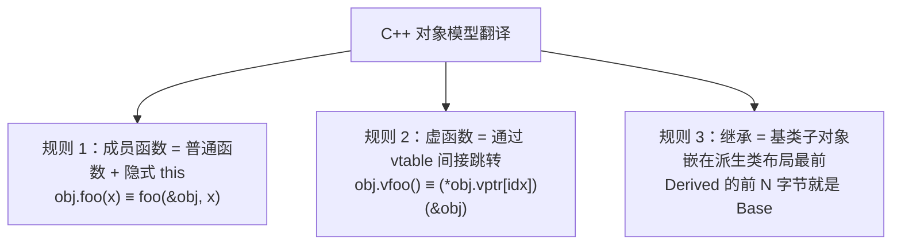

# 类与对象机制

#### 目录介绍
- [1. 引言](#1-引言)
- [2. 类的本质：struct + 函数](#2-类的本质struct--函数)
- [3. 访问控制的实现](#3-访问控制的实现)
- [4. 虚函数与动态多态](#4-虚函数与动态多态)
- [5. 多重继承的虚函数表](#5-多重继承的虚函数表)
- [6. RTTI（运行时类型识别）](#6-rtti运行时类型识别)
- [7. 虚继承的实现细节](#7-虚继承的实现细节)
- [8. 特殊成员函数](#8-特殊成员函数)
- [9. 运算符重载的底层](#9-运算符重载的底层)
- [10. 对象的类型转换](#10-对象的类型转换)
- [11. 总结](#11-总结)

> **案例引入｜"为什么我写的 C 竟然跑出了 C++ 的多态？"**
>
> 实习生小 A 用纯 C 写了一个"日志器模块"：
>
> ```c
> struct Logger {
>     void (*log)(struct Logger* self, const char* msg);
>     int level;
> };
> struct FileLogger {
>     struct Logger base;   // 把 Logger 嵌在结构体第一个字段
>     FILE* fp;
> };
> ```
>
> 然后用函数指针 `file_logger.base.log = file_log_impl`，在外部只通过 `Logger*` 调用——居然实现了"同一个 `log` 函数指针，不同实现对象表现不同"的**多态**效果。他跑过来问：*"既然 C 都能搞定多态，C++ 的 `virtual` 关键字到底多干了什么？编译器悄悄帮我加了什么代码？"*
>
> 这个问题问到了 **C++ 面向对象的本质**——`class` 不是语言新发明的魔法，而是编译器帮你把 C 里"结构体 + 函数指针 + 手写 self 指针"的套路**自动化**了。读完本文你会看到编译器到底怎么把 `obj.method(x)` 翻译成 `method(&obj, x)`，vtable 到底怎么自动填充，以及为什么多重继承会出现"this 指针漂移"这种诡异现象。

---

## 00.案例元信息

| 项目 | 说明 |
|------|------|
| 难度 | ★★★★★ |
| 预估阅读 | 70 分钟 |
| 前置知识 | [01.内存模型与布局](./01.内存模型与布局.md)、[02.引用与指针原理](./02.引用与指针原理.md) |
| 覆盖要点 | 类 → struct+函数翻译、`this` 传递、访问控制实现、vtable 结构、多继承 this 漂移、RTTI `type_info`、虚继承 `vbptr` |
| 核心产出 | 能把任意 C++ 类"翻译"成等价的 C 代码；能解释编译器在 `obj.foo()` 时做的所有事 |

---

## 1. 引言

C++ 的面向对象并非"魔法"——编译器把类、继承、多态这些"高级概念"逐步**翻译**成底层的内存操作和函数调用。理解这套翻译规则，你才能回答一系列"看上去神奇其实机械"的问题：**虚函数的调用为什么比普通函数慢**？**访问修饰符 `private` 真的能保护数据吗**？**菱形继承里的"同名成员"在内存里到底有几份**？

### 1.1 C++ 对象模型的三条翻译规则



### 1.2 本文路线图


### 1.3 本文要回答的问题

- 类的成员函数到底"住"在哪里？类大小是否包含成员函数？
- 为什么 `const` 成员函数可以被非 `const` 调用、反之不行？底层是怎么实现的？
- 多重继承 `class C : A, B {}` 里，`C*` 转 `B*` 地址为什么可能"偏移几个字节"？
- 虚函数表（vtable）的**存储位置**是只读段还是数据段？
- `dynamic_cast` 为什么有运行时开销？它是怎么通过 vtable 找到类型信息的？

---

## 2. 类的本质：struct + 函数

### 2.1 从C到C++

**疑惑**：C++的类和C的结构体到底有什么区别？

**答疑**：在内存布局上，C++的class和struct几乎没有区别。唯一的语法区别是默认访问级别：class默认private，struct默认public。

```cpp
// C++的类
class Point {
    int x_, y_;
public:
    Point(int x, int y) : x_(x), y_(y) {}
    int getX() const { return x_; }
    int getY() const { return y_; }
    double distance() const;
};

// 编译器"翻译"后的等价C代码（概念上）
struct Point_C {
    int x_, y_;
};

void Point_C_ctor(Point_C* this_, int x, int y) {
    this_->x_ = x;
    this_->y_ = y;
}

int Point_C_getX(const Point_C* this_) {
    return this_->x_;
}

int Point_C_getY(const Point_C* this_) {
    return this_->y_;
}

double Point_C_distance(const Point_C* this_) {
    return sqrt(this_->x_ * this_->x_ + this_->y_ * this_->y_);
}
```

**论证**：关键的翻译规则：
1. 成员函数变成普通函数，添加this指针作为第一个参数
2. 成员变量的访问通过this指针偏移实现
3. 访问控制（public/private/protected）是纯编译期检查，无运行时开销
4. 非虚成员函数调用和普通函数调用一样快

### 2.2 名称修饰（Name Mangling）

```cpp
// C++支持重载，需要在符号名中编码参数类型
class Calculator {
public:
    int add(int a, int b);
    double add(double a, double b);
    int add(int a, int b, int c);
};

// GCC/Clang的名称修饰（Itanium ABI）：
// Calculator::add(int, int)        → _ZN10Calculator3addEii
// Calculator::add(double, double)  → _ZN10Calculator3addEdd
// Calculator::add(int, int, int)   → _ZN10Calculator3addEiii
//
// 格式：_Z + N + 类名长度 + 类名 + 函数名长度 + 函数名 + E + 参数类型

// 查看修饰后的名称：
// nm -C a.out     # 反修饰显示
// c++filt         # 工具
// __cxa_demangle  # 程序中反修饰

#include <cxxabi.h>
void demangle_demo() {
    int status;
    char* name = abi::__cxa_demangle("_ZN10Calculator3addEii", 0, 0, &status);
    if (status == 0) {
        std::cout << name << std::endl;  // Calculator::add(int, int)
        free(name);
    }
}

// extern "C" 禁用名称修饰，用于C/C++混合编程
extern "C" {
    int c_function(int x);  // 不修饰，符号名就是 c_function
}
```

### 2.3 成员函数的调用机制

```cpp
#include <iostream>

class Widget {
    int value_;
public:
    Widget(int v) : value_(v) {}
    
    // 非虚成员函数：编译期绑定（静态分派）
    void normalMethod() {
        std::cout << "Normal: " << value_ << std::endl;
    }
    
    // 虚成员函数：运行时绑定（动态分派）
    virtual void virtualMethod() {
        std::cout << "Virtual: " << value_ << std::endl;
    }
    
    // 静态成员函数：没有this指针
    static void staticMethod() {
        std::cout << "Static" << std::endl;
        // value_;  // 错误：没有this
    }
};

void call_mechanism() {
    Widget w(42);
    Widget* p = &w;
    
    // 非虚调用 → 直接调用（CALL指令直接跳转到函数地址）
    w.normalMethod();
    // 汇编: call Widget::normalMethod  (地址在编译期确定)
    
    // 虚调用 → 间接调用（通过vptr和vtable）
    p->virtualMethod();
    // 汇编: 
    //   mov rax, [rdi]       ; 加载vptr
    //   call [rax + offset]  ; 通过vtable间接调用
    
    // 静态调用 → 普通函数调用（无this参数）
    Widget::staticMethod();
    // 汇编: call Widget::staticMethod
}
```

---

## 3. 访问控制的实现

### 3.1 编译期检查，零运行时开销

```cpp
class Secret {
private:
    int hidden_ = 42;
    void privateMethod() {}
    
public:
    int visible = 100;
    void publicMethod() { privateMethod(); }
    
    // 友元可以访问私有成员
    friend void peek(const Secret& s);
};

void peek(const Secret& s) {
    std::cout << s.hidden_ << std::endl;  // 合法：友元
}

void access_control_truth() {
    Secret s;
    // s.hidden_;  // 编译错误
    
    // 但在二进制层面，没有任何保护！
    // 可以通过指针偏移直接访问：
    int* hidden_ptr = reinterpret_cast<int*>(&s);
    std::cout << *hidden_ptr << std::endl;  // 42
    // 这不是UB（standard-layout类型），但违反了封装原则
    
    // 甚至有"合法"的hack通过模板特化绕过访问控制
    // （仅用于说明，实际项目中不要这样做）
}
```

### 3.2 访问控制与内存布局

```cpp
// 访问说明符不影响成员的内存排列顺序
// 同一个访问级别内的成员按声明顺序排列
// 不同访问级别间的排列是实现定义的（但大多数编译器按声明顺序）

class MixedAccess {
public:
    int a;      // 可能在offset 0
private:
    int b;      // 可能在offset 4
public:
    int c;      // 可能在offset 8
protected:
    int d;      // 可能在offset 12
};

// 标准布局类型（standard layout）要求：
// 所有非静态成员有相同的访问控制
// 这保证了与C结构体的兼容性

struct StandardLayout {
    int x, y, z;  // 全部public，是standard layout
};
// 可以安全地memcpy，与C结构体二进制兼容
```

---

## 4. 虚函数与动态多态

### 4.1 虚函数表的完整结构

```cpp
class Base {
public:
    virtual void f() { std::cout << "Base::f\n"; }
    virtual void g() { std::cout << "Base::g\n"; }
    virtual ~Base() {}
    int base_data;
};

class Derived : public Base {
public:
    void f() override { std::cout << "Derived::f\n"; }
    virtual void h() { std::cout << "Derived::h\n"; }
    int derived_data;
};
```

```
Base的vtable:
┌──────────────────────────────┐
│ offset_to_top = 0            │  用于dynamic_cast
├──────────────────────────────┤
│ typeinfo for Base            │  RTTI信息
├──────────────────────────────┤ ← vptr指向这里
│ &Base::~Base() [complete]    │  slot 0: 析构函数
├──────────────────────────────┤
│ &Base::~Base() [deleting]    │  slot 1: delete析构
├──────────────────────────────┤
│ &Base::f()                   │  slot 2
├──────────────────────────────┤
│ &Base::g()                   │  slot 3
└──────────────────────────────┘

Derived的vtable:
┌──────────────────────────────┐
│ offset_to_top = 0            │
├──────────────────────────────┤
│ typeinfo for Derived         │
├──────────────────────────────┤ ← vptr指向这里
│ &Derived::~Derived() [comp]  │  slot 0: 重写
├──────────────────────────────┤
│ &Derived::~Derived() [del]   │  slot 1: 重写
├──────────────────────────────┤
│ &Derived::f()                │  slot 2: 重写
├──────────────────────────────┤
│ &Base::g()                   │  slot 3: 继承
├──────────────────────────────┤
│ &Derived::h()                │  slot 4: 新增
└──────────────────────────────┘
```

### 4.2 虚函数调用的汇编级分析

```cpp
void call_virtual(Base* p) {
    p->f();
}

// x86-64汇编（GCC -O0）：
// call_virtual:
//   mov rax, [rdi]          ; rax = *p（加载vptr）
//   mov rax, [rax + 16]     ; rax = vtable[2]（f()的地址）
//   mov rdi, rdi            ; rdi = this（第一个参数）
//   call rax                ; 间接调用
//   ret

// 对比非虚调用：
void call_nonvirtual(Base* p) {
    p->Base::f();  // 显式调用基类版本（非虚）
}
// 汇编：
//   call Base::f()          ; 直接调用，地址在编译时确定
```

### 4.3 虚析构函数的必要性

```cpp
class Resource {
    int* data_;
public:
    Resource() : data_(new int[100]) {
        std::cout << "Resource acquired\n";
    }
    // 如果析构函数不是虚的...
    ~Resource() {
        delete[] data_;
        std::cout << "Resource released\n";
    }
};

class DerivedResource : public Resource {
    std::string name_;
public:
    DerivedResource(const std::string& name) : name_(name) {
        std::cout << "DerivedResource " << name_ << " created\n";
    }
    ~DerivedResource() {
        std::cout << "DerivedResource " << name_ << " destroyed\n";
    }
};

void virtual_destructor_demo() {
    Resource* p = new DerivedResource("test");
    delete p;
    // 如果~Resource()不是virtual:
    //   只调用Resource::~Resource()
    //   DerivedResource::~DerivedResource()不会被调用
    //   name_的string析构函数不会被调用 → 内存泄漏！
    
    // 规则：如果类有虚函数，析构函数也应该是虚的
}
```

### 4.4 纯虚函数与抽象类

```cpp
// 纯虚函数 → 在vtable中的槽位包含什么？
class AbstractShape {
public:
    virtual double area() const = 0;   // 纯虚函数
    virtual void draw() const = 0;
    virtual ~AbstractShape() {}
};

// 纯虚函数在vtable中的位置通常指向__cxa_pure_virtual
// 如果被错误调用，会终止程序
// extern "C" void __cxa_pure_virtual() { abort(); }

// 纯虚函数可以有实现体！
class Base {
public:
    virtual void f() = 0;  // 纯虚但有定义
};

void Base::f() {
    std::cout << "Base::f default implementation\n";
}

class Derived : public Base {
public:
    void f() override {
        Base::f();  // 可以显式调用纯虚函数的实现
        std::cout << "Derived::f\n";
    }
};
```

---

## 5. 多重继承的虚函数表

### 5.1 多vtable结构

```cpp
class A {
public:
    virtual void fa() { std::cout << "A::fa\n"; }
    int a;
};

class B {
public:
    virtual void fb() { std::cout << "B::fb\n"; }
    int b;
};

class C : public A, public B {
public:
    void fa() override { std::cout << "C::fa\n"; }
    void fb() override { std::cout << "C::fb\n"; }
    virtual void fc() { std::cout << "C::fc\n"; }
    int c;
};
```

```
C对象的内存布局：
┌────────────┐ offset 0
│ A::vptr ───────→ C-in-A vtable:
│ A::a       │    ┌─────────────────┐
├────────────┤    │ typeinfo for C  │
│ B::vptr ──────→ │ &C::fa()       │ ← A::vptr指向
│ B::b       │  │ │ &C::fc()       │ (fc放在主vtable中)
├────────────┤  │ └─────────────────┘
│ C::c       │  │
└────────────┘  │ C-in-B vtable:
                │ ┌─────────────────────┐
                │ │ typeinfo for C      │
                └→│ &C::fb() [thunk]    │ ← B::vptr指向
                  └─────────────────────┘
```

### 5.2 Thunk——多继承的指针调整

```cpp
// 当通过第二基类指针调用重写的虚函数时，
// this指针需要调整回完整对象的起始地址

void multi_inheritance_thunk() {
    C c;
    B* pb = &c;  // pb指向C中B子对象的位置（有偏移）
    
    pb->fb();    // 调用C::fb()
    // 但C::fb()期望this指向C对象的开头
    // 所以vtable中存储的不是直接的C::fb()地址
    // 而是一个thunk：
    //   this -= offset_of_B_in_C;  // 调整this
    //   jmp C::fb();               // 再调用真正的函数
}

// thunk的汇编：
// C::fb() [thunk]:
//   sub rdi, 16          ; 将this从B子对象调整到C对象起始
//   jmp C::fb()          ; 跳转到实际实现
```

---

## 6. RTTI（运行时类型识别）

### 6.1 typeid和type_info

```cpp
#include <iostream>
#include <typeinfo>

class Animal {
public:
    virtual ~Animal() {}
};
class Dog : public Animal {};
class Cat : public Animal {};

void rtti_typeid() {
    Dog dog;
    Animal* p = &dog;
    
    // 静态类型 vs 动态类型
    std::cout << typeid(*p).name() << std::endl;  // 输出Dog（解修饰后）
    std::cout << typeid(p).name() << std::endl;   // 输出Animal*
    
    // typeid返回const std::type_info&
    const std::type_info& ti = typeid(*p);
    std::cout << ti.name() << std::endl;
    
    // 类型比较
    if (typeid(*p) == typeid(Dog)) {
        std::cout << "It's a Dog!\n";
    }
    
    // 注意：对空指针解引用使用typeid会抛std::bad_typeid
    Animal* null_p = nullptr;
    try {
        typeid(*null_p);  // 抛出异常
    } catch (const std::bad_typeid& e) {
        std::cout << "bad_typeid: " << e.what() << std::endl;
    }
}
```

### 6.2 dynamic_cast

```cpp
void rtti_dynamic_cast() {
    Dog dog;
    Animal* ap = &dog;
    
    // 向下转型（安全的类型检查）
    Dog* dp = dynamic_cast<Dog*>(ap);
    if (dp) {
        std::cout << "Successfully cast to Dog*\n";
    }
    
    Cat* cp = dynamic_cast<Cat*>(ap);
    if (cp == nullptr) {
        std::cout << "Cast to Cat* failed\n";
    }
    
    // 引用版本：失败时抛std::bad_cast
    try {
        Cat& cr = dynamic_cast<Cat&>(*ap);
    } catch (const std::bad_cast& e) {
        std::cout << "bad_cast: " << e.what() << std::endl;
    }
    
    // 交叉转型（cross cast）
    // 多继承中从一个基类转到另一个基类
    // 只有dynamic_cast能做到
}
```

### 6.3 RTTI的实现原理

```
type_info对象存储在vtable旁边：

vtable layout:
┌──────────────────────┐
│ offset_to_top        │  完整对象中，当前vptr相对于对象起始的偏移
├──────────────────────┤
│ &typeinfo for Class  │  指向type_info对象
├──────────────────────┤ ← vptr指向这里
│ virtual function 0   │
│ virtual function 1   │
│ ...                  │
└──────────────────────┘

typeid(*ptr) 的实现：
1. 通过ptr加载vptr
2. 在vptr[-1]处加载typeinfo指针
3. 返回typeinfo对象的引用

dynamic_cast<T*>(ptr) 的实现：
1. 获取ptr指向对象的typeinfo
2. 遍历继承图，检查是否能转换到T
3. 如果可以，计算偏移量并返回调整后的指针
4. 如果不可以，返回nullptr
```

```cpp
// dynamic_cast的性能
// dynamic_cast需要遍历继承层次，成本较高
// 在性能关键路径上，考虑使用替代方案：

class Shape {
public:
    enum class Type { Circle, Rectangle, Triangle };
    virtual Type type() const = 0;  // 自定义类型标识
    virtual ~Shape() {}
};

class Circle : public Shape {
public:
    Type type() const override { return Type::Circle; }
};

// 比dynamic_cast快得多：
void fast_type_check(Shape* s) {
    if (s->type() == Shape::Type::Circle) {
        Circle* c = static_cast<Circle*>(s);  // 无运行时检查
    }
}
```

---

## 7. 虚继承的实现细节

### 7.1 虚基类表(VTT)

```cpp
class V { public: int v; virtual void fv() {} };
class A : virtual public V { public: int a; };
class B : virtual public V { public: int b; };
class D : public A, public B { public: int d; };

// D对象的布局（简化）：
// ┌──────────────┐ offset 0
// │ A部分        │
// │  vptr_A ─────→ A-in-D vtable（包含虚基类偏移量）
// │  a           │
// ├──────────────┤
// │ B部分        │
// │  vptr_B ─────→ B-in-D vtable
// │  b           │
// ├──────────────┤
// │ D自身        │
// │  d           │
// ├──────────────┤
// │ V部分(共享)  │  ← 虚基类放在最后
// │  vptr_V ─────→ V-in-D vtable
// │  v           │
// └──────────────┘

// 构造顺序：V → A → B → D
// 虚基类由最终派生类负责构造
```

### 7.2 虚继承构造函数的特殊规则

```cpp
class Base {
public:
    Base(int x) : x_(x) { std::cout << "Base(" << x << ")\n"; }
    int x_;
};

class Left : virtual public Base {
public:
    Left(int x) : Base(x) { std::cout << "Left\n"; }
    // 这里的Base(x)只有在Left是最终派生类时才会被调用
};

class Right : virtual public Base {
public:
    Right(int x) : Base(x) { std::cout << "Right\n"; }
};

class Bottom : public Left, public Right {
public:
    // 必须直接初始化虚基类！
    Bottom(int x) : Base(x), Left(x), Right(x) {
        std::cout << "Bottom\n";
    }
    // 输出：Base(x) → Left → Right → Bottom
    // Left和Right中的Base(x)初始化被忽略
};
```

---

## 8. 特殊成员函数

### 8.1 编译器生成的规则

```cpp
class Widget {
    // 编译器可能自动生成的特殊成员函数：
    // 1. 默认构造函数      Widget()
    // 2. 拷贝构造函数      Widget(const Widget&)
    // 3. 拷贝赋值运算符    Widget& operator=(const Widget&)
    // 4. 移动构造函数      Widget(Widget&&)
    // 5. 移动赋值运算符    Widget& operator=(Widget&&)
    // 6. 析构函数          ~Widget()
};

// 生成规则（Rule of Zero/Three/Five）：
// 
// 如果你不声明任何特殊成员函数（Rule of Zero）：
// → 编译器自动生成所有6个
//
// 如果你声明了析构函数、拷贝构造或拷贝赋值中的任何一个：
// → 移动操作不会自动生成
// → 应该明确处理所有5个（Rule of Five）
//
// C++11的 = default 和 = delete：

class Resource {
public:
    Resource() = default;
    ~Resource() = default;
    
    // 禁止拷贝
    Resource(const Resource&) = delete;
    Resource& operator=(const Resource&) = delete;
    
    // 允许移动
    Resource(Resource&&) = default;
    Resource& operator=(Resource&&) = default;
};
```

### 8.2 隐式转换与explicit

```cpp
class Fraction {
    int num_, den_;
public:
    // 单参数构造函数可以作为隐式转换
    Fraction(int num, int den = 1) : num_(num), den_(den) {}
    
    // 转换运算符
    operator double() const { return (double)num_ / den_; }
};

void implicit_conversion() {
    Fraction f = 42;     // 隐式转换：42 → Fraction(42, 1)
    double d = f;        // 隐式转换：Fraction → double
    // d = f + 1.0;      // 可能不明确
}

// 使用explicit禁止隐式转换
class SafeFraction {
    int num_, den_;
public:
    explicit SafeFraction(int num, int den = 1) : num_(num), den_(den) {}
    explicit operator double() const { return (double)num_ / den_; }
};

void explicit_demo() {
    // SafeFraction sf = 42;       // 错误：explicit
    SafeFraction sf(42);           // 正确：显式调用
    // double d = sf;              // 错误：explicit
    double d = static_cast<double>(sf);  // 正确
    
    // C++11: explicit也可以是条件性的(C++20)
    // explicit(condition) operator bool() const;
}
```

---

## 9. 运算符重载的底层

### 9.1 运算符重载的本质

```cpp
class Complex {
    double real_, imag_;
public:
    Complex(double r = 0, double i = 0) : real_(r), imag_(i) {}
    
    // 成员运算符
    Complex operator+(const Complex& rhs) const {
        return Complex(real_ + rhs.real_, imag_ + rhs.imag_);
    }
    
    // 前置++
    Complex& operator++() {
        ++real_;
        return *this;
    }
    
    // 后置++（int是哑参数，仅用于区分）
    Complex operator++(int) {
        Complex tmp = *this;
        ++real_;
        return tmp;
    }
    
    // 函数调用运算符（仿函数）
    double operator()(double x) const {
        return real_ * x + imag_;
    }
    
    // 下标运算符
    double& operator[](int idx) {
        return idx == 0 ? real_ : imag_;
    }
    
    // 输出运算符（必须是友元或非成员）
    friend std::ostream& operator<<(std::ostream& os, const Complex& c) {
        return os << c.real_ << "+" << c.imag_ << "i";
    }
};

void operator_overload_demo() {
    Complex a(1, 2), b(3, 4);
    Complex c = a + b;
    // 等价于：c = a.operator+(b);
    
    ++a;
    // 等价于：a.operator++();
    
    a++;
    // 等价于：a.operator++(0);
    
    double val = a(3.14);
    // 等价于：val = a.operator()(3.14);
    
    std::cout << c << std::endl;
    // 等价于：operator<<(std::cout, c);
}
```

### 9.2 三路比较运算符(C++20)

```cpp
#include <compare>

class Version {
    int major_, minor_, patch_;
public:
    Version(int maj, int min, int pat) 
        : major_(maj), minor_(min), patch_(pat) {}
    
    // C++20: 一个运算符搞定所有比较
    auto operator<=>(const Version& other) const = default;
    // 编译器自动生成 <, >, <=, >=, ==, != 六个运算符
    
    // 或者自定义：
    // std::strong_ordering operator<=>(const Version& other) const {
    //     if (auto cmp = major_ <=> other.major_; cmp != 0) return cmp;
    //     if (auto cmp = minor_ <=> other.minor_; cmp != 0) return cmp;
    //     return patch_ <=> other.patch_;
    // }
};
```

---

## 10. 对象的类型转换

### 10.1 四种cast的底层行为

```cpp
class Base {
public:
    virtual ~Base() {}
    int x;
};
class Derived : public Base {
public:
    int y;
};

void cast_internals() {
    Derived d;
    d.x = 1; d.y = 2;
    
    // 1. static_cast: 编译期检查，可能调整指针
    Base* bp = static_cast<Base*>(&d);      // 向上：安全
    Derived* dp = static_cast<Derived*>(bp); // 向下：不安全但无运行时开销
    // 汇编：无任何指令（单继承），或简单的地址加减（多继承）
    
    // 2. dynamic_cast: 运行时检查，使用RTTI
    Derived* dp2 = dynamic_cast<Derived*>(bp);
    // 汇编：调用__dynamic_cast()，遍历typeinfo链
    // 比static_cast慢得多
    
    // 3. const_cast: 添加或移除const
    const Base* cbp = &d;
    Base* bp2 = const_cast<Base*>(cbp);
    // 汇编：无任何指令（纯类型系统操作）
    // 注意：如果原始对象真的是const的，通过结果写入是UB
    
    // 4. reinterpret_cast: 重新解释比特模式
    uintptr_t addr = reinterpret_cast<uintptr_t>(&d);
    Derived* dp3 = reinterpret_cast<Derived*>(addr);
    // 汇编：无任何指令（纯类型重解释）
    // 最危险，几乎不做任何检查
}
```

### 10.2 cast的选择指南

```
选择cast的决策树：
━━━━━━━━━━━━━━━━━
需要类型转换？
├── 需要添加/移除const？ → const_cast
├── 需要指针/整数互转？ → reinterpret_cast
├── 需要多态向下转型？
│   ├── 需要运行时安全检查？ → dynamic_cast
│   └── 确定类型正确？ → static_cast
├── 需要数值类型转换？ → static_cast
└── 以上都不是？ → 可能不需要cast
```

---

## 11. 总结

### 11.1 C++面向对象的底层真相

```
C++面向对象的底层机制
├── 类 = 数据(struct) + 操作(函数+this)
├── 访问控制 = 纯编译期检查，零运行时开销
├── 非虚调用 = 直接函数调用（编译期绑定）
├── 虚函数调用 = vptr → vtable → 间接调用
├── 多继承 = 多个vptr + thunk调整this
├── 虚继承 = 共享基类 + 虚基类偏移量
├── RTTI = vtable旁的typeinfo链
├── 名称修饰 = 函数签名编码到符号名
└── 运算符重载 = 语法糖，本质是函数调用
```

### 11.2 性能意识

| 特性 | 运行时开销 |
|------|-----------|
| 成员函数调用 | 与普通函数相同 |
| 虚函数调用 | +2次间接寻址 |
| 访问控制 | 零 |
| 运算符重载 | 与函数调用相同 |
| dynamic_cast | 较大（遍历类型图） |
| typeid | 较小（读vtable） |
| static_cast | 零或极小 |
| const_cast | 零 |

理解C++面向对象的底层机制，不仅能帮助你写出更高效的代码，更能在遇到诡异bug时快速定位问题。C++的面向对象不是"黑魔法"，它是精心设计的、可预测的系统。

---

## 十二、深挖：面向对象机制拾遗

### 12.1 为什么 C++ 的"this"是隐式指针，而不是引用

C++ 早期设计时，`this` 的类型被定为指针（`T*` 或 `const T*`），而不是引用。这看似别扭（毕竟面向对象的"接收者"在概念上更接近引用），但有几个实际原因：

- **历史**：C++ 诞生时还没有引用；`this` 是 C 预处理器时代的产物。
- **允许在成员函数里检查"delete this"**：如果是引用，就没法比较自身是否被销毁。
- **与 C 调用约定兼容**：成员函数在 ABI 上等价于"第一个参数是 `T*`"的普通函数，便于与 C 互操作。

在现代 C++ 里，`this` 的不便正在被弥补：C++23 的 **deducing this**（显式对象参数）允许你把 `this` 写成普通参数，并做类型推导——这是 40 年后的一次"回到初心"。

### 12.2 成员函数的调用其实就是普通函数

编译器对下面两种写法的处理几乎完全相同：

```cpp
class C { public: void f(int x); };
C obj; obj.f(10);

// 等价于（概念上）：
C__f(&obj, 10);
```

成员函数在 ABI 层就是"第一个参数是 this 指针"的普通函数。这解释了为什么：

- 成员函数的调用没有额外开销（除非是虚函数）；
- `member_function_pointer` 和普通函数指针不通用（它内部还包含 this 调整信息）；
- `std::bind` / lambda 捕获 `this` 后能把成员函数变成普通可调用对象。

### 12.3 访问控制是编译期的事，不是运行时

`private` / `public` / `protected` 在运行时**不存在**。它们是编译器在**访问检查阶段**使用的信息——如果你绕过编译器（用 `memcpy`、用指针强转、用宏），运行时完全没有保护。

所以"private 成员如何被外部读取"（比如通过内存布局直接访问）在 C++ 里是**技术上可行**的——标准没有要求这不能做，只要求"编译器拒绝合法的 C++ 源码这么写"。这与 Java 的 `SecurityManager`、JVM 反射 API 有显著差别：C++ 从不承诺"运行时封装"。

### 12.4 友元破坏封装？其实是精心控制的耦合

`friend` 常被批评为"破坏封装"，但正确的视角是：**`friend` 是对封装的显式声明**。你不是在"开后门"，而是在声明"这两个类/函数共同维护一组不变量"。典型场景：

- 运算符重载（`operator<<` 不能是成员函数，只能是友元或非成员）；
- 工厂模式（只让某个工厂能构造目标类）；
- PIMPL 惯用法（`Impl` 和外部类互为 friend）。

设计纪律是：`friend` 列表越短越好；如果一个类有 10 个 friend，说明它的接口设计有问题。

### 12.5 名字修饰（name mangling）为什么必不可少

C 语言里 `void f(int)` 和 `void f(double)` 不能共存（链接器看到两个 `f`）。C++ 通过**名字修饰**把函数签名编码进符号名：

```
void foo(int)       → _Z3fooi
void foo(double)    → _Z3food
void foo(int, int)  → _Z3fooii
```

所以重载、命名空间、模板实例化都能共存于同一个符号表。代价是：**C++ 的 ABI 与编译器强绑定**——GCC 和 MSVC 的修饰规则完全不同，不能直接互通（这也是为什么跨编译器接口只能用 `extern "C"`）。

### 12.6 什么时候应该"不写类"

不是所有逻辑都应该塞进类里。现代 C++ 风格越来越倾向于：

- **数据就是数据**（struct + 普通函数），不强求"方法挂在对象上"；
- **算法自由函数化**（和 STL 一致）；
- **类只用于"有不变量需要维护"的场景**（比如 `std::vector` 的 size/capacity 约束）。

C++ 20 的 free function + CPO（customization point object）进一步弱化了"万物皆类"的倾向。你会发现，**少一点面向对象、多一点值语义**，代码反而更清晰。
