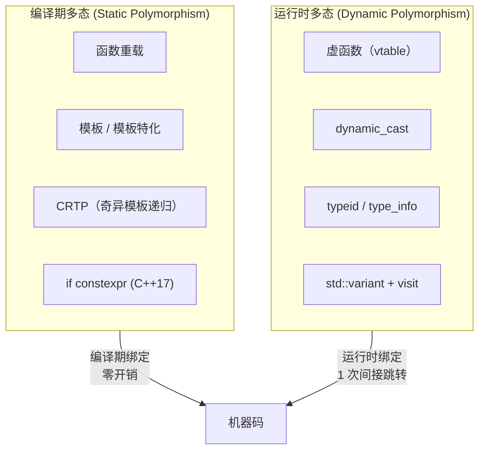

# 第5章：C++ 继承与多态

#### 目录介绍
- [1. 引言](#1-引言)
- [2. 继承的内存模型](#2-继承的内存模型)
- [3. 虚函数表的深度解析](#3-虚函数表的深度解析)
- [4. 编译期多态](#4-编译期多态)
- [5. 虚函数的高级话题](#5-虚函数的高级话题)
- [6. 继承中的访问控制](#6-继承中的访问控制)
- [7. 多态与类型擦除](#7-多态与类型擦除)
- [8. 继承相关的设计模式](#8-继承相关的设计模式)
- [9. 继承的陷阱与最佳实践](#9-继承的陷阱与最佳实践)
- [10. 总结](#10-总结)

> **案例引入｜"一个 delete 竟然跳到了奇怪的函数"**
>
> 团队老王的代码在生产环境出现了一个幽灵 bug——同一个 `Shape*` 指针，调用 `->draw()` 时大部分时候正确调用到 `Circle::draw`，但偶尔会跳到 `Rectangle::draw`！他用 gdb 反汇编一看，这行：
>
> ```cpp
> call QWORD PTR [rax + 0x8]     ; 从 rax 这个地址偏 8 字节取函数指针然后调用
> ```
>
> 老王盯着汇编自问：`rax` 是什么？为什么是"偏 8 字节"而不是直接调用？背后这张"函数指针表"是谁建的、放在哪里、什么时候写入？
>
> 答案就是 **vtable**（虚函数表）——它是 C++ 多态的物理载体。但 vtable 的"结构"远没有你以为的那么简单：单继承、多重继承、菱形虚继承，三种场景下 vtable 的排布完全不同，甚至一个 `Derived*` 转成 `Base2*` 时**指针地址会悄悄偏移几个字节**——这就是我们常说的 "**this 指针漂移**"。

---

## 00.案例元信息

| 项目 | 说明 |
|------|------|
| 难度 | ★★★★★ |
| 预估阅读 | 70 分钟 |
| 前置知识 | [03.类与对象机制](./03.类与对象机制.md)、[04.对象生命周期](./04.对象生命周期.md) |
| 覆盖要点 | 单/多/菱形继承内存模型、vtable 结构、`dynamic_cast` 实现、编译期多态 vs 运行时多态、CRTP、虚基类 `vbptr` |
| 核心产出 | 能画出任意继承层级下的对象字节布局和 vtable 布局；能解释 `Derived*` 到 `Base*` 的地址偏移公式 |

---

## 1. 引言

继承与多态是面向对象的两大支柱。C++ 在这个主题上提供了**两套完全不同的机制**：

- **编译期多态**（函数重载、模板、CRTP、`if constexpr`）——零运行时开销，但不能动态切换
- **运行时多态**（虚函数、`dynamic_cast`、`typeid`）——可动态派发，但每次调用多一次间接跳转

理解这两套机制的**底层差异**，你才能在正确的场景选对工具——高频调用路径上的 CRTP 可以比虚函数快 3-10 倍；但写插件系统时，没有虚函数寸步难行。

### 1.1 两种多态机制对比



### 1.2 本文路线图


### 1.3 本文要回答的核心问题

- 多重继承里，`Derived*` 转 `Base2*` 的地址为什么会偏移？**偏多少**、由谁计算？
- 菱形虚继承 `class D : virtual A` 的 `vbptr` 存在哪、指向什么、如何查找 A 子对象？
- `dynamic_cast<Derived*>(basePtr)` 在失败时为什么返回 `nullptr` 而不是抛异常？
- CRTP 声称"零开销的多态"——它的"开销"真的是零吗？它的局限在哪？
- `std::variant + visit` 作为现代"替代虚函数"方案，什么场景下更好？

---

## 2. 继承的内存模型

### 2.1 单继承的布局

```cpp
class Animal {
public:
    int weight;
    virtual void speak() { std::cout << "...\n"; }
    virtual ~Animal() {}
};

class Dog : public Animal {
public:
    int loyalty;
    void speak() override { std::cout << "Woof!\n"; }
    virtual void fetch() { std::cout << "Fetching!\n"; }
};

class GoldenRetriever : public Dog {
public:
    int furLength;
    void speak() override { std::cout << "Bark!\n"; }
};

// 内存布局链：
// GoldenRetriever对象：
// ┌──────────────┐ offset 0
// │ vptr ─────────→ GoldenRetriever的vtable
// │ weight       │ (继承自Animal)
// │ loyalty      │ (继承自Dog)
// │ furLength    │ (GoldenRetriever自身)
// └──────────────┘

// 关键：单继承只有一个vptr，基类子对象在对象开头
// 这意味着：Animal* 和 Dog* 和 GoldenRetriever* 指向相同地址
```

### 2.2 多继承的布局与指针调整

```cpp
class Flyable {
public:
    int altitude;
    virtual void fly() { std::cout << "Flying\n"; }
    virtual ~Flyable() {}
};

class Swimmable {
public:
    int depth;
    virtual void swim() { std::cout << "Swimming\n"; }
    virtual ~Swimmable() {}
};

class Duck : public Flyable, public Swimmable {
public:
    int quackVolume;
    void fly() override { std::cout << "Duck flying\n"; }
    void swim() override { std::cout << "Duck swimming\n"; }
};

void multiple_inheritance_pointers() {
    Duck duck;
    
    Flyable* fp = &duck;    // 指向对象开头
    Swimmable* sp = &duck;  // 指向Swimmable子对象（有偏移！）
    
    std::cout << "Duck addr:      " << &duck << std::endl;
    std::cout << "Flyable* addr:  " << fp << std::endl;
    std::cout << "Swimmable* addr:" << sp << std::endl;
    // sp != &duck ！差了Flyable部分的大小
    
    // 向回转换时编译器自动调整指针
    Duck* dp1 = static_cast<Duck*>(fp);   // 无调整
    Duck* dp2 = static_cast<Duck*>(sp);   // 减去偏移量
    
    // nullptr的特殊处理
    Swimmable* null_sp = nullptr;
    Duck* null_dp = static_cast<Duck*>(null_sp);
    // null_dp 也是nullptr，编译器不会对nullptr做偏移调整
}
```

### 2.3 虚继承的布局

```cpp
class Base { public: int base_val; virtual void f() {} };
class Left : virtual public Base { public: int left_val; };
class Right : virtual public Base { public: int right_val; };
class Diamond : public Left, public Right { public: int diamond_val; };

void virtual_inheritance_layout() {
    Diamond d;
    
    // 虚继承布局特点：
    // 1. 虚基类放在对象末尾
    // 2. 通过vtable中的偏移量访问虚基类
    // 3. 只有一份Base子对象
    
    d.base_val = 42;  // 没有二义性
    
    // 布局（概念上）：
    // ┌──────────────┐
    // │ Left部分     │ 包含vptr（含虚基类偏移）
    // │ left_val     │
    // ├──────────────┤
    // │ Right部分    │ 包含vptr
    // │ right_val    │
    // ├──────────────┤
    // │ diamond_val  │
    // ├──────────────┤
    // │ Base部分     │ ← 虚基类，共享
    // │ vptr         │
    // │ base_val     │
    // └──────────────┘
    
    std::cout << "sizeof(Base):    " << sizeof(Base) << std::endl;
    std::cout << "sizeof(Left):    " << sizeof(Left) << std::endl;
    std::cout << "sizeof(Right):   " << sizeof(Right) << std::endl;
    std::cout << "sizeof(Diamond): " << sizeof(Diamond) << std::endl;
}
```

---

## 3. 虚函数表的深度解析

### 3.1 单继承vtable

```cpp
class Shape {
public:
    virtual void draw() = 0;
    virtual double area() const = 0;
    virtual std::string name() const { return "Shape"; }
    virtual ~Shape() {}
};

class Circle : public Shape {
    double radius_;
public:
    Circle(double r) : radius_(r) {}
    void draw() override { std::cout << "Drawing circle\n"; }
    double area() const override { return 3.14159 * radius_ * radius_; }
    std::string name() const override { return "Circle"; }
};

class ColoredCircle : public Circle {
    std::string color_;
public:
    ColoredCircle(double r, const std::string& c) : Circle(r), color_(c) {}
    void draw() override { std::cout << "Drawing " << color_ << " circle\n"; }
    // area()和name()继承自Circle
};

// vtable层次：
// Shape vtable:
//   [0] __cxa_pure_virtual (draw是纯虚)
//   [1] __cxa_pure_virtual (area是纯虚)
//   [2] &Shape::name
//   [3] &Shape::~Shape (complete)
//   [4] &Shape::~Shape (deleting)

// Circle vtable:
//   [0] &Circle::draw        (重写)
//   [1] &Circle::area         (重写)
//   [2] &Circle::name         (重写)
//   [3] &Circle::~Circle
//   [4] &Circle::~Circle (deleting)

// ColoredCircle vtable:
//   [0] &ColoredCircle::draw  (重写)
//   [1] &Circle::area          (继承)
//   [2] &Circle::name          (继承)
//   [3] &ColoredCircle::~ColoredCircle
//   [4] &ColoredCircle::~ColoredCircle (deleting)
```

### 3.2 多继承vtable

```cpp
class Printable {
public:
    virtual void print() const { std::cout << "Printable\n"; }
    virtual ~Printable() {}
};

class Serializable {
public:
    virtual std::string serialize() const { return "{}"; }
    virtual ~Serializable() {}
};

class Document : public Printable, public Serializable {
    std::string content_;
public:
    void print() const override { std::cout << content_ << std::endl; }
    std::string serialize() const override { return "{\"content\":\"" + content_ + "\"}"; }
};

// Document有两个vtable:
// 主vtable (Printable部分):
//   typeinfo for Document
//   &Document::print
//   &Document::~Document
//   &Document::serialize  (或通过thunk)

// 次vtable (Serializable部分):
//   typeinfo for Document
//   &Document::serialize [thunk]  // 调整this后跳转
//   &Document::~Document [thunk]
```

### 3.3 虚函数调用的完整流程

```cpp
void polymorphic_call(Shape* shape) {
    shape->draw();
    // 完整的调用流程：
    // 1. 从shape指针读取对象的vptr（对象的第一个字段）
    //    mov rax, [rdi]           ; rax = vptr
    //
    // 2. 从vtable中读取draw()的函数指针（偏移0）
    //    mov rax, [rax]           ; rax = vtable[0] = &draw
    //
    // 3. 将shape作为this参数，调用函数
    //    call rax                 ; 间接调用
    //
    // 总开销：2次内存间接 + 1次间接调用
    // 对比直接调用：0次间接 + 1次直接调用
}
```

---

## 4. 编译期多态

### 4.1 CRTP（奇异递归模板模式）

**疑惑**：有没有办法不用虚函数就实现多态？

**答疑**：CRTP——用模板在编译期实现类似多态的效果。

```cpp
// 基类模板，参数是派生类自身
template<typename Derived>
class ShapeBase {
public:
    void draw() const {
        // 静态分派：编译期确定调用哪个版本
        static_cast<const Derived*>(this)->drawImpl();
    }
    
    double area() const {
        return static_cast<const Derived*>(this)->areaImpl();
    }
    
    // 提供默认实现
    void drawImpl() const { std::cout << "Default draw\n"; }
};

class CRTPCircle : public ShapeBase<CRTPCircle> {
    double radius_;
public:
    CRTPCircle(double r) : radius_(r) {}
    
    void drawImpl() const {
        std::cout << "Drawing CRTP circle\n";
    }
    
    double areaImpl() const {
        return 3.14159 * radius_ * radius_;
    }
};

class CRTPRect : public ShapeBase<CRTPRect> {
    double w_, h_;
public:
    CRTPRect(double w, double h) : w_(w), h_(h) {}
    
    void drawImpl() const {
        std::cout << "Drawing CRTP rect\n";
    }
    
    double areaImpl() const {
        return w_ * h_;
    }
};

// CRTP的使用
template<typename T>
void renderShape(const ShapeBase<T>& shape) {
    shape.draw();  // 编译期确定调用哪个drawImpl
    std::cout << "Area: " << shape.area() << std::endl;
}

void crtp_demo() {
    CRTPCircle c(5.0);
    CRTPRect r(3.0, 4.0);
    
    renderShape(c);  // 调用CRTPCircle::drawImpl
    renderShape(r);  // 调用CRTPRect::drawImpl
    // 无虚函数开销！可以内联！
}
```

**论证**：CRTP vs 虚函数

```
┌────────────────┬─────────────────┬─────────────────┐
│     特性        │     CRTP         │     虚函数       │
├────────────────┼─────────────────┼─────────────────┤
│ 分派时机       │ 编译期           │ 运行时          │
│ 性能           │ 零开销，可内联   │ 间接调用开销    │
│ 对象大小       │ 无vptr           │ 有vptr          │
│ 动态类型       │ 不支持           │ 支持            │
│ 异构容器       │ 不支持           │ 支持            │
│ 代码膨胀       │ 每个派生类       │ 无              │
│ 编译速度       │ 较慢             │ 较快            │
│ 适用场景       │ 性能关键+已知类型 │ 需要运行时动态  │
└────────────────┴─────────────────┴─────────────────┘
```

### 4.2 标签分派(Tag Dispatch)

```cpp
#include <type_traits>
#include <iterator>

// 根据迭代器类型选择不同的算法实现
namespace detail {
    template<typename Iter>
    void advance_impl(Iter& it, int n, std::input_iterator_tag) {
        // 输入迭代器：只能前进
        while (n > 0) { ++it; --n; }
    }
    
    template<typename Iter>
    void advance_impl(Iter& it, int n, std::bidirectional_iterator_tag) {
        // 双向迭代器：可以前进和后退
        if (n > 0) while (n--) ++it;
        else while (n++) --it;
    }
    
    template<typename Iter>
    void advance_impl(Iter& it, int n, std::random_access_iterator_tag) {
        // 随机访问迭代器：O(1)
        it += n;
    }
}

template<typename Iter>
void my_advance(Iter& it, int n) {
    // 编译期根据迭代器类型选择实现
    detail::advance_impl(it, n,
        typename std::iterator_traits<Iter>::iterator_category{});
}
```

### 4.3 std::variant多态(C++17)

```cpp
#include <variant>
#include <iostream>
#include <vector>

// 基于variant的"值语义多态"
struct VCircle { double radius; };
struct VRect   { double width, height; };
struct VTriangle { double base, height; };

using VShape = std::variant<VCircle, VRect, VTriangle>;

// 访问者模式
struct AreaVisitor {
    double operator()(const VCircle& c) const { return 3.14159 * c.radius * c.radius; }
    double operator()(const VRect& r) const { return r.width * r.height; }
    double operator()(const VTriangle& t) const { return 0.5 * t.base * t.height; }
};

struct DrawVisitor {
    void operator()(const VCircle&) const { std::cout << "Drawing circle\n"; }
    void operator()(const VRect&) const { std::cout << "Drawing rect\n"; }
    void operator()(const VTriangle&) const { std::cout << "Drawing triangle\n"; }
};

void variant_polymorphism() {
    std::vector<VShape> shapes;
    shapes.push_back(VCircle{5.0});
    shapes.push_back(VRect{3.0, 4.0});
    shapes.push_back(VTriangle{6.0, 3.0});
    
    for (const auto& shape : shapes) {
        std::visit(DrawVisitor{}, shape);
        std::cout << "Area: " << std::visit(AreaVisitor{}, shape) << "\n";
    }
    
    // 优点：值语义、缓存友好、无堆分配
    // 缺点：所有类型必须编译期已知
    
    // C++17 overloaded lambda技巧
    for (const auto& shape : shapes) {
        auto area = std::visit([](const auto& s) -> double {
            if constexpr (std::is_same_v<std::decay_t<decltype(s)>, VCircle>)
                return 3.14159 * s.radius * s.radius;
            else if constexpr (std::is_same_v<std::decay_t<decltype(s)>, VRect>)
                return s.width * s.height;
            else
                return 0.5 * s.base * s.height;
        }, shape);
        std::cout << "Area: " << area << "\n";
    }
}
```

---

## 5. 虚函数的高级话题

### 5.1 协变返回类型

```cpp
class Base {
public:
    virtual Base* clone() const { return new Base(*this); }
    virtual ~Base() {}
};

class Derived : public Base {
public:
    // 协变返回类型：返回派生类指针
    Derived* clone() const override { return new Derived(*this); }
    // 返回类型是Base*的协变类型(covariant)
    // 这是合法的重写
};

void covariant_demo() {
    Derived d;
    Base* bp = &d;
    
    Base* cloned = bp->clone();    // 运行时调用Derived::clone
    Derived* dc = d.clone();       // 直接调用返回Derived*
    
    delete cloned;
    delete dc;
}
```

### 5.2 override和final

```cpp
class Interface {
public:
    virtual void required() = 0;
    virtual void optional() {}
    virtual ~Interface() {}
};

class Implementation : public Interface {
public:
    void required() override;  // 正确：重写纯虚函数
    // void Required() override; // 编译错误：没有可重写的函数（拼写错误被捕获）
    
    void optional() final;     // 此函数不能再被重写
};

class FinalClass final : public Implementation {
    // final类不能被继承
    void required() override {}
    // void optional() override {} // 错误：optional是final的
};

// class Attempt : public FinalClass {}; // 错误：FinalClass是final的
```

### 5.3 虚函数的性能优化——去虚拟化

```cpp
// 编译器去虚拟化(Devirtualization)
class Logger {
public:
    virtual void log(const std::string& msg) {
        std::cout << msg << std::endl;
    }
    virtual ~Logger() {}
};

class FileLogger final : public Logger {  // final帮助去虚拟化
public:
    void log(const std::string& msg) override {
        // 写入文件
    }
};

void devirt_demo() {
    FileLogger fl;
    fl.log("test");       // 编译器知道fl是FileLogger → 直接调用
    
    Logger* lp = &fl;
    lp->log("test");      // 编译器可能推断出lp指向FileLogger → 去虚拟化
    
    // final关键字帮助编译器：
    // FileLogger是final的 → 没有派生类 → 可以安全去虚拟化
    
    // -O2以上优化级别通常会做去虚拟化
    // 使用 -fdevirtualize 标志控制
}
```

---

## 6. 继承中的访问控制

### 6.1 三种继承方式

```cpp
class Base {
public:
    int pub;
protected:
    int prot;
private:
    int priv;
};

class PubDerived : public Base {
    // pub  → public
    // prot → protected
    // priv → 不可访问
};

class ProtDerived : protected Base {
    // pub  → protected
    // prot → protected
    // priv → 不可访问
};

class PrivDerived : private Base {
    // pub  → private
    // prot → private
    // priv → 不可访问
};

// 实际应用中99%使用public继承
// private继承表示"用……实现"（类似于组合）
// protected继承极少使用

// private继承 vs 组合
class Timer { public: void start(); void stop(); };

// private继承方式：
class Widget_v1 : private Timer {
    void doWork() {
        start();  // 可以直接调用基类方法
        // ...
        stop();
    }
};

// 组合方式（通常更好）：
class Widget_v2 {
    Timer timer_;
    void doWork() {
        timer_.start();
        // ...
        timer_.stop();
    }
};
```

---

## 7. 多态与类型擦除

### 7.1 std::function的类型擦除

```cpp
#include <functional>
#include <iostream>

// 类型擦除的简化实现
class AnyCallable {
    struct Concept {
        virtual void invoke() = 0;
        virtual ~Concept() {}
    };
    
    template<typename F>
    struct Model : Concept {
        F func_;
        Model(F f) : func_(std::move(f)) {}
        void invoke() override { func_(); }
    };
    
    std::unique_ptr<Concept> impl_;
    
public:
    template<typename F>
    AnyCallable(F f) : impl_(std::make_unique<Model<F>>(std::move(f))) {}
    
    void operator()() { impl_->invoke(); }
};

void type_erasure_demo() {
    // 可以存储任何可调用对象
    AnyCallable a([]{ std::cout << "lambda\n"; });
    
    struct Functor { void operator()() { std::cout << "functor\n"; } };
    AnyCallable b(Functor{});
    
    a();  // lambda
    b();  // functor
    
    // std::function就是这个原理的完善版本
    std::function<void()> f = []{ std::cout << "std::function\n"; };
    f();
}
```

### 7.2 概念(Concepts, C++20)

```cpp
#include <concepts>
#include <iostream>

// C++20 Concepts: 编译期约束模板参数
template<typename T>
concept Drawable = requires(T t) {
    t.draw();                     // 必须有draw()方法
    { t.area() } -> std::convertible_to<double>;  // area()返回可转换为double
};

template<typename T>
concept Printable = requires(T t, std::ostream& os) {
    os << t;  // 可以输出到流
};

// 使用concept约束
template<Drawable T>
void render(const T& shape) {
    shape.draw();
    std::cout << "Area: " << shape.area() << std::endl;
}

// 简写语法
void renderSimple(const Drawable auto& shape) {
    shape.draw();
}

class ConceptCircle {
    double r_;
public:
    ConceptCircle(double r) : r_(r) {}
    void draw() const { std::cout << "Circle\n"; }
    double area() const { return 3.14159 * r_ * r_; }
};

void concepts_demo() {
    ConceptCircle c(5.0);
    render(c);  // 合法
    
    // int x = 42;
    // render(x);  // 编译错误：int不满足Drawable概念
    // 错误信息清晰："constraints not satisfied"
}
```

---

## 8. 继承相关的设计模式

### 8.1 NVI模式(Non-Virtual Interface)

```cpp
class Game {
public:
    // 公共非虚接口
    void play() {
        initialize();     // 模板方法
        while (!isOver()) {
            processInput();
            update();
            render();
        }
        cleanup();
    }
    
    virtual ~Game() = default;
    
private:
    // 私有虚函数——实现细节
    virtual void initialize() = 0;
    virtual bool isOver() const = 0;
    virtual void processInput() = 0;
    virtual void update() = 0;
    virtual void render() = 0;
    virtual void cleanup() {}
};

class ChessGame : public Game {
    void initialize() override { /* 初始化棋盘 */ }
    bool isOver() const override { return false; }
    void processInput() override { /* 读取走法 */ }
    void update() override { /* 更新棋局 */ }
    void render() override { /* 绘制棋盘 */ }
};

// NVI的优点：
// 1. 基类控制公共接口，派生类只实现细节
// 2. 可以在调用虚函数前后添加逻辑（前置/后置条件检查）
// 3. 更好的封装
```

### 8.2 Mixin继承

```cpp
// Mixin：通过继承注入功能
template<typename Base>
class Printable : public Base {
public:
    using Base::Base;
    
    void print() const {
        std::cout << static_cast<const Base&>(*this) << std::endl;
    }
};

template<typename Base>
class Comparable : public Base {
public:
    using Base::Base;
    
    bool operator==(const Comparable& other) const {
        return static_cast<const Base&>(*this).value() == 
               static_cast<const Base&>(other).value();
    }
    
    bool operator<(const Comparable& other) const {
        return static_cast<const Base&>(*this).value() < 
               static_cast<const Base&>(other).value();
    }
};

class Integer {
    int val_;
public:
    Integer(int v) : val_(v) {}
    int value() const { return val_; }
    friend std::ostream& operator<<(std::ostream& os, const Integer& i) {
        return os << i.val_;
    }
};

// 组合Mixin
using PrintableComparableInt = Printable<Comparable<Integer>>;

void mixin_demo() {
    PrintableComparableInt a(10), b(20);
    a.print();
    std::cout << (a < b) << std::endl;
}
```

---

## 9. 继承的陷阱与最佳实践

### 9.1 对象切片

```cpp
class Base {
public:
    int x = 10;
    virtual void print() { std::cout << "Base: " << x << std::endl; }
};

class Derived : public Base {
public:
    int y = 20;
    void print() override { std::cout << "Derived: " << x << "," << y << std::endl; }
};

void object_slicing() {
    Derived d;
    
    // 对象切片：通过值传递或赋值丢失派生类部分
    Base b = d;   // 切片！y被丢弃，vptr变成Base的
    b.print();    // 输出"Base: 10"，不是"Derived: 10,20"
    
    // 通过引用或指针不会切片
    Base& ref = d;
    ref.print();  // 输出"Derived: 10,20"
    
    // 容器中的切片陷阱
    std::vector<Base> vec;
    vec.push_back(d);  // 切片！
    vec[0].print();     // "Base: 10"
    
    // 正确做法：使用指针的容器
    std::vector<std::unique_ptr<Base>> safe_vec;
    safe_vec.push_back(std::make_unique<Derived>());
    safe_vec[0]->print();  // "Derived: 10,20"
}
```

### 9.2 Liskov替换原则

```cpp
// LSP: 子类型应该可以替换其基类型

// 违反LSP的经典案例
class Rectangle {
protected:
    int width_, height_;
public:
    virtual void setWidth(int w) { width_ = w; }
    virtual void setHeight(int h) { height_ = h; }
    int area() const { return width_ * height_; }
};

class Square : public Rectangle {
public:
    void setWidth(int w) override {
        width_ = height_ = w;  // 正方形宽高必须相等
    }
    void setHeight(int h) override {
        width_ = height_ = h;
    }
};

void lsp_violation() {
    auto resize = [](Rectangle& r) {
        r.setWidth(5);
        r.setHeight(10);
        assert(r.area() == 50);  // 对Rectangle成立
    };
    
    Rectangle r;
    resize(r);    // 正确: 5 * 10 = 50
    
    Square s;
    resize(s);    // 失败! s.area() == 100 (10 * 10)
    // Square不是Rectangle的合适子类型
}
```

### 9.3 继承 vs 组合

```cpp
// 优先使用组合而非继承
// 继承：is-a关系
// 组合：has-a关系

// 不好的设计：Stack继承自vector
class BadStack : public std::vector<int> {
public:
    void push(int val) { push_back(val); }
    int pop() { int val = back(); pop_back(); return val; }
    // 问题：用户可以直接调用vector的insert、erase等方法
    // 破坏了Stack的语义
};

// 好的设计：Stack组合vector
class GoodStack {
    std::vector<int> data_;
public:
    void push(int val) { data_.push_back(val); }
    int pop() {
        int val = data_.back();
        data_.pop_back();
        return val;
    }
    bool empty() const { return data_.empty(); }
    size_t size() const { return data_.size(); }
    // 只暴露需要的接口
};
```

---

## 10. 总结

### 10.1 继承与多态知识图谱

```
继承与多态
├── 内存布局
│   ├── 单继承：一个vptr，基类在前
│   ├── 多继承：多个vptr，指针调整+thunk
│   └── 虚继承：共享虚基类，虚基类偏移量
├── 运行时多态
│   ├── 虚函数表(vtable)
│   ├── 虚函数调用：2次间接寻址
│   ├── 纯虚函数与抽象类
│   ├── 协变返回类型
│   ├── override和final
│   └── RTTI(typeid/dynamic_cast)
├── 编译期多态
│   ├── CRTP：零开销静态分派
│   ├── 标签分派
│   ├── std::variant + std::visit
│   └── Concepts(C++20)
├── 设计模式
│   ├── NVI(非虚接口)
│   ├── Mixin继承
│   └── 类型擦除
└── 陷阱与实践
    ├── 对象切片
    ├── Liskov替换原则
    ├── 组合优于继承
    └── 虚析构函数
```

### 10.2 选择指南

| 需求 | 选择 |
|------|------|
| 运行时动态类型 | 虚函数 |
| 性能关键+类型已知 | CRTP |
| 封闭类型集 | std::variant |
| 类型安全约束 | Concepts(C++20) |
| 值语义多态 | variant或type erasure |
| 防止进一步派生 | final |
| 基类控制接口 | NVI模式 |

---

## 十一、深挖：继承与多态机制拾遗

### 11.1 vtable 不是"一张表"，是"每类一张表"

很多人把虚函数表想成一张全局的大表；实际上**每个有虚函数的类都有一张自己的 vtable**，vtable 在编译期生成，存储在程序的只读数据段。对象里只存 vptr（一个指针），指向自己所属类的 vtable。

这就解释了几个看似矛盾的现象：
- 虚函数调用只多一次间接寻址（查 vptr → 查 vtable → 跳转），不是"每次查找"；
- 一个对象的类型在构造时就确定了（vptr 在构造函数里写入）——所以在**构造函数或析构函数里调用虚函数时，它会按当前正在构造/析构的类去查表**，而不是按"最终派生类"。这是新手经典坑："为什么 `Base::Base` 里调 `virtual foo()` 不走 `Derived::foo`？"
- 多继承时对象有多个 vptr——每个基类子对象都有自己的 vptr，指向对应的 vtable 片段。

### 11.2 dynamic_cast 为什么比 static_cast 贵得多

`static_cast<Derived*>(p)` 是编译期的指针调整（对多重继承可能加一个常量偏移），零运行时成本。

`dynamic_cast<Derived*>(p)` 则要：
1. 从 `p` 的 vptr 读取 `type_info`（存在 vtable 附近）；
2. 沿着 `type_info` 链向上/向下遍历，找到目标类型的路径；
3. 按路径调整指针偏移；
4. 找不到时返回 `nullptr`。

这个"类型图遍历"的代价是数十纳秒，比 static_cast 慢 100 倍以上。所以高性能代码里要么避免 dynamic_cast（用虚函数分派替代），要么用 `std::variant` + `std::visit`（编译期完成分派）。

### 11.3 虚继承的"虚"指的是什么

普通继承下，`class D : public B { };` 里 B 的成员在 D 对象里有固定偏移。但菱形继承 `D → B1, B2 → A` 下，如果 B1 和 B2 都普通继承 A，D 里就有两份 A——大多数时候不是你想要的。

**虚继承**的作用是让所有派生路径**共享一份基类子对象**。代价是：
- 基类的位置不再是固定偏移，要通过"虚基类偏移表"间接查找（每次访问 A 的成员都多一次间接寻址）；
- 构造顺序变复杂：最派生类负责构造虚基类，中间类的初始化列表对虚基类的调用被忽略。

这就是为什么虚继承在实际项目里很少用——代价大、心智负担高。**除非你真的在设计"钻石"结构，否则不应该碰虚继承**。

### 11.4 多态与值语义的冲突

C++ 的一个根本张力：多态需要通过指针/引用（否则发生对象切片），但现代 C++ 又倾向于值语义（栈上对象、直接返回）。这两者天然冲突。

解决方案有三条路：
- **`std::unique_ptr<Base>`**：多态 + 独占所有权，语义清晰，是大部分场景的默认解。
- **`std::variant<T1, T2, ...>`**：封闭类型集，零堆分配，值语义，编译期分派。性能最好，但要求类型集是封闭的。
- **类型擦除（type erasure）**：自己写包装类（或用 `std::function`、`std::any`），对外暴露值接口，内部藏指针。`std::any` 就是典型。

正确选择依赖于类型集是否封闭、性能要求、代码复杂度承受度。

### 11.5 "组合优于继承"在 C++ 里更是真理

Gang of Four 就已经说"优先使用组合"，但在 C++ 里这个建议更强烈：

- 继承引入 vtable、破坏值语义、使对象切片成风险；
- 多继承引入名称冲突、虚继承复杂度；
- 深的继承层次让 ABI 脆弱（基类一改，所有派生类都要重编译）。

组合（has-a）则无副作用：持有成员、调用其方法即可。现代 C++ 设计的风向是 **"is-a 关系用 Concepts 表达，has-a 关系用组合表达，运行时多态只在必要时用"**。虚函数不是必须的，它只是"在没有更好选择时的选择"。
