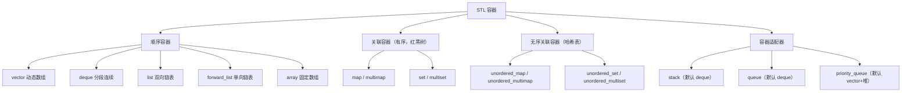

# STL 容器原理

#### 目录介绍
- [1. 引言](#1-引言)
- [2. STL容器分类](#2-stl容器分类)
- [3. vector深度解析](#3-vector深度解析)
- [4. deque的分段连续设计](#4-deque的分段连续设计)
- [5. list双向链表](#5-list双向链表)
- [6. map/set与红黑树](#6-mapset与红黑树)
- [7. unordered容器与哈希表](#7-unordered容器与哈希表)
- [8. string的SSO优化](#8-string的sso优化)
- [9. array与forward_list](#9-array与forward_list)
- [10. 容器适配器](#10-容器适配器)
- [11. Allocator设计](#11-allocator设计)
- [12. 容器选择指南](#12-容器选择指南)
- [13. 容器的线程安全](#13-容器的线程安全)
- [14. 总结](#14-总结)

> **案例引入｜一个"push_back 导致段错误"的事故**
>
> 后端服务每天向 `std::vector<Session>` 里不断 `push_back` 新会话。突然某天凌晨 QPS 翻了一倍后崩溃，core dump 显示崩在**另一个线程**里访问已被释放的地址。调查之下才发现：
>
> ```cpp
> std::vector<Session> sessions;
> Session* first = &sessions[0];       // 线程 A 缓存了这个指针
> sessions.push_back(new_session);     // 线程 B push，触发扩容
> first->do_something();               // 线程 A 使用缓存 → BOOM
> ```
>
> 故事很简单：`vector` 在容量不够时会**整体搬家**（把旧数组 `malloc` 一块更大的、拷贝过去、释放旧的），任何指向旧元素的指针/迭代器**全部失效**。
>
> 但这个 bug 引出了三个更深的问题：**①** `vector` 扩容策略到底是 2 倍还是 1.5 倍？**②** 为什么有些实现选 1.5 倍会比 2 倍更省内存？**③** 为什么 `std::deque` 号称"两端 O(1) 插入"还能保证**指针不失效**？
>
> 这些问题的答案全都写在 STL 容器的**数据结构选型**里。本文就是要把这张"选型决策图"完整拆开给你看。

---

## 00.案例元信息

| 项目 | 说明 |
|------|------|
| 难度 | ★★★★☆ |
| 预估阅读 | 80 分钟 |
| 前置知识 | [06.模板与泛型](./06.模板与泛型.md)、卷一第 16 章 |
| 覆盖要点 | 顺序/关联/无序三大容器族、`vector` 扩容、`deque` 分段、红黑树、哈希表开链、`string` SSO、`Allocator` |
| 核心产出 | 给定一个需求能 30 秒选出最合适的 STL 容器；能解释每种容器的迭代器失效规则 |

---

## 1. 引言

STL（Standard Template Library）是 C++ 标准库的核心。它有两条看上去对立实则互补的设计原则：

- **"零开销抽象"**（Zero-overhead abstraction）——你不用的东西不花钱，用的东西手写也比不过
- **"泛型编程"**（Generic programming）——算法与数据结构解耦，迭代器作为统一接口

这两条原则是 C++ 能在"系统编程"（内核/数据库/游戏引擎）和"业务开发"（后端/工具）都站得住脚的核心原因。理解容器**背后的数据结构选择**，是避开案例里那类事故、写出高性能代码的前提。

### 1.1 STL 容器全景



### 1.2 本文路线图


### 1.3 本文要回答的核心问题

- **扩容策略**：libstdc++ 选 2 倍、MSVC 选 1.5 倍，背后的数学权衡是什么？
- **迭代器失效**：哪些操作会让迭代器失效？哪些**只让部分**失效？
- **红黑树 vs AVL**：为什么 STL 选红黑树而不是更平衡的 AVL？
- **哈希冲突**：开链 vs 开放地址，STL 选开链的原因？扩容时为什么必须 rehash？
- **SSO**：`std::string` 为什么小字符串可以"零堆分配"？SSO 的边界是多少字节？
- **Allocator**：有状态的分配器（stateful allocator）和无状态的为什么不能混用？

---

## 2. vector——动态数组

### 2.1 内存布局

```cpp
// vector的三个核心指针
// template<typename T, typename Allocator = std::allocator<T>>
// class vector {
//     T* begin_;      // 指向第一个元素
//     T* end_;        // 指向最后一个元素之后
//     T* capacity_;   // 指向分配内存的末尾
// };

// 内存布局：
// begin_                    end_              capacity_
//   ↓                        ↓                  ↓
//   ┌───┬───┬───┬───┬───┬───┬───┬───┬───┬───┐
//   │ 0 │ 1 │ 2 │ 3 │ 4 │ 5 │   │   │   │   │
//   └───┴───┴───┴───┴───┴───┴───┴───┴───┴───┘
//   |←──── size = 6 ────────→|
//   |←──────── capacity = 10 ────────────────→|

#include <vector>
#include <iostream>

void vector_layout() {
    std::vector<int> v = {1, 2, 3, 4, 5};
    
    std::cout << "size:     " << v.size() << std::endl;
    std::cout << "capacity: " << v.capacity() << std::endl;
    std::cout << "data ptr: " << v.data() << std::endl;
    
    // sizeof(vector) 通常 = 3 * sizeof(pointer) = 24 (64位)
    std::cout << "sizeof(vector<int>): " << sizeof(v) << std::endl;
}
```

### 2.2 扩容策略

**疑惑**：vector满了之后怎么扩容？为什么选择2倍（或1.5倍）扩容？

```cpp
void vector_growth() {
    std::vector<int> v;
    size_t prev_cap = 0;
    
    for (int i = 0; i < 100; i++) {
        v.push_back(i);
        if (v.capacity() != prev_cap) {
            std::cout << "size=" << v.size() 
                      << " capacity=" << v.capacity() << std::endl;
            prev_cap = v.capacity();
        }
    }
    // GCC典型输出（2倍增长）：
    // size=1 capacity=1
    // size=2 capacity=2
    // size=3 capacity=4
    // size=5 capacity=8
    // size=9 capacity=16
    // size=17 capacity=32
    // size=33 capacity=64
    // size=65 capacity=128
    
    // MSVC使用1.5倍增长
}
```

**答疑**：扩容因子的选择是时间和空间的权衡：

```
扩容因子分析：
━━━━━━━━━━━━━
因子=2（GCC/Clang）：
  优点：push_back均摊O(1)，扩容次数少
  缺点：旧空间永远无法被重用（新空间 > 旧空间总和）

因子=1.5（MSVC）：
  优点：经过几次扩容后，旧空间可以被重用
  缺点：扩容次数稍多

因子=1（不扩容）：
  每次push_back都重新分配 → O(n)

数学证明均摊O(1)：
  n次push_back，扩容次数 = log_f(n)（f=增长因子）
  总拷贝次数 = 1 + f + f² + ... + f^log_f(n) = O(n)
  均摊每次 = O(1)
```

### 2.3 vector的关键操作源码分析

```cpp
// push_back的实现（简化版）
template<typename T>
void vector<T>::push_back(const T& value) {
    if (end_ == capacity_) {
        // 需要扩容
        size_t new_cap = capacity_ == 0 ? 1 : capacity_ * 2;
        T* new_data = allocator_.allocate(new_cap);
        
        // 将旧元素移动到新空间
        // 如果T的移动构造是noexcept，使用移动；否则拷贝
        if constexpr (std::is_nothrow_move_constructible_v<T>) {
            std::uninitialized_move(begin_, end_, new_data);
        } else {
            std::uninitialized_copy(begin_, end_, new_data);
        }
        
        // 析构旧元素，释放旧空间
        std::destroy(begin_, end_);
        allocator_.deallocate(begin_, capacity_ - begin_);
        
        // 更新指针
        size_t old_size = end_ - begin_;
        begin_ = new_data;
        end_ = new_data + old_size;
        capacity_ = new_data + new_cap;
    }
    
    // 在end_位置构造新元素
    allocator_.construct(end_, value);
    ++end_;
}

// erase的实现（简化版）
template<typename T>
auto vector<T>::erase(iterator pos) -> iterator {
    // 将pos之后的元素向前移动一位
    std::move(pos + 1, end_, pos);
    // 析构最后一个元素
    --end_;
    allocator_.destroy(end_);
    return pos;
}
// erase是O(n)操作！如果不需要保持顺序，可以swap到末尾再pop_back
```

### 2.4 vector<bool>的特殊性

```cpp
// vector<bool>是一个特化版本——每个bool只用1 bit
// 这是一个有争议的设计决策

void vector_bool_problem() {
    std::vector<bool> vb = {true, false, true};
    
    // 问题1：operator[]不返回bool&
    // auto& ref = vb[0];  // 类型是vector<bool>::reference，不是bool&
    
    // 问题2：不能取元素地址
    // bool* p = &vb[0];   // 编译错误
    
    // 替代方案：
    std::vector<char> vc = {1, 0, 1};      // 每个元素1字节
    std::deque<bool> db = {true, false};     // 正常的bool容器
    std::bitset<100> bs;                     // 编译期固定大小
}
```

---

## 3. deque——双端队列

### 3.1 deque的分段连续结构

```
deque的结构（分段连续内存）：

map_（指针数组）:
┌─────┬─────┬─────┬─────┬─────┬─────┐
│  ·  │  ·  │  ·  │  ·  │  ·  │  ·  │
└──│──┴──│──┴──│──┴──│──┴──│──┴──│──┘
   │     │     │     │     │     │
   ↓     ↓     ↓     ↓     ↓     ↓
┌─────┐┌─────┐┌─────┐┌─────┐┌─────┐┌─────┐
│buf 0││buf 1││buf 2││buf 3││buf 4││buf 5│
│     ││ *** ││*****││*****││**   ││     │
└─────┘└─────┘└─────┘└─────┘└─────┘└─────┘
         ↑start                ↑finish

每个buffer是一段固定大小的连续内存
deque通过map_数组管理这些buffer
start和finish是迭代器，分别指向第一个和最后一个元素之后
```

```cpp
// deque vs vector
void deque_vs_vector() {
    // deque的优势：
    // 1. 头部插入/删除 O(1)
    // 2. 不需要整体重分配（只需新增buffer）
    // 3. 不需要移动已有元素
    
    // deque的劣势：
    // 1. 随机访问比vector慢（需要计算在哪个buffer中）
    // 2. 迭代器更复杂（不是简单的指针）
    // 3. 内存不完全连续（缓存不友好）
    
    std::deque<int> dq;
    dq.push_front(1);  // O(1)
    dq.push_back(2);   // O(1)
    dq.pop_front();     // O(1)
    dq.pop_back();      // O(1)
}
```

---

## 4. list与forward_list——链表

### 4.1 双向链表(list)

```cpp
// list的节点结构
// struct list_node {
//     list_node* prev;
//     list_node* next;
//     T data;
// };

// list的内部结构包含一个哨兵节点(sentinel node)
// 哨兵节点的next指向第一个元素，prev指向最后一个元素
// 形成环形双向链表

void list_characteristics() {
    std::list<int> lst = {1, 2, 3, 4, 5};
    
    // 优点：
    // 1. 任意位置插入/删除 O(1)（给定迭代器）
    // 2. 插入/删除不会使其他迭代器失效
    // 3. splice操作 O(1)
    
    // 缺点：
    // 1. 不支持随机访问
    // 2. 每个元素额外消耗两个指针(16字节)
    // 3. 节点分散在堆上，缓存极不友好
    
    // 特有操作
    lst.sort();                // 归并排序 O(n log n)
    lst.unique();              // 删除相邻重复
    lst.reverse();             // 反转
    
    std::list<int> lst2 = {10, 20, 30};
    lst.merge(lst2);           // 合并两个有序链表
    lst.splice(lst.begin(), lst2);  // 将lst2的元素转移到lst
}
```

---

## 5. 关联容器——红黑树

### 5.1 set/map的红黑树实现

```
红黑树的性质：
1. 每个节点是红色或黑色
2. 根节点是黑色
3. 叶子节点(NIL)是黑色
4. 红色节点的子节点必须是黑色（不能有连续红节点）
5. 从任一节点到其叶子的所有路径包含相同数量的黑色节点

这保证了：
- 最长路径不超过最短路径的2倍
- 查找、插入、删除都是 O(log n)
```

```cpp
// 红黑树节点结构（简化）
enum Color { RED, BLACK };

template<typename T>
struct RBNode {
    T data;
    Color color;
    RBNode* left;
    RBNode* right;
    RBNode* parent;
};

void rbtree_operations() {
    std::set<int> s = {5, 3, 7, 1, 4, 6, 8};
    std::map<std::string, int> m = {{"a", 1}, {"b", 2}, {"c", 3}};
    
    // 所有操作 O(log n):
    s.insert(9);          // 插入 + 重平衡
    s.erase(3);           // 删除 + 重平衡
    s.find(7);            // 查找
    s.lower_bound(4);     // 下界
    s.upper_bound(6);     // 上界
    
    // map的下标运算符
    m["d"] = 4;           // 如果不存在则插入
    // 注意：m["e"] 会插入一个默认值！
    // 只读访问用 m.at("d") 或 m.find("d")
    
    // 迭代器遍历是中序遍历 → 有序输出
    for (auto& [key, val] : m) {
        std::cout << key << ": " << val << std::endl;
    }
}
```

### 5.2 自定义比较器

```cpp
// 自定义排序规则
struct CaseInsensitiveCompare {
    bool operator()(const std::string& a, const std::string& b) const {
        return std::lexicographical_compare(
            a.begin(), a.end(), b.begin(), b.end(),
            [](char ca, char cb) { return tolower(ca) < tolower(cb); }
        );
    }
};

void custom_comparator() {
    std::set<std::string, CaseInsensitiveCompare> s;
    s.insert("Hello");
    s.insert("hello");  // 不会插入（被认为相同）
    s.insert("World");
    
    // 使用lambda（C++20简化）
    auto cmp = [](int a, int b) { return a > b; };
    std::set<int, decltype(cmp)> descending_set(cmp);
    descending_set.insert({1, 5, 3, 4, 2});
    // 遍历：5, 4, 3, 2, 1
}
```

---

## 6. 无序容器——哈希表

### 6.1 哈希表的结构

```
unordered_map/set 使用开链法(Separate Chaining)：

bucket数组：
┌───┐
│ 0 │→ nullptr
├───┤
│ 1 │→ [key=5, val=50] → [key=13, val=130] → nullptr
├───┤
│ 2 │→ [key=2, val=20] → nullptr
├───┤
│ 3 │→ nullptr
├───┤
│ 4 │→ [key=4, val=40] → [key=12, val=120] → nullptr
├───┤
│ 5 │→ [key=9, val=90] → nullptr
├───┤
│ 6 │→ nullptr
├───┤
│ 7 │→ [key=7, val=70] → nullptr
└───┘

bucket_index = hash(key) % bucket_count
```

```cpp
void unordered_map_internals() {
    std::unordered_map<std::string, int> um;
    um["hello"] = 1;
    um["world"] = 2;
    
    std::cout << "bucket_count: " << um.bucket_count() << std::endl;
    std::cout << "load_factor: " << um.load_factor() << std::endl;
    std::cout << "max_load_factor: " << um.max_load_factor() << std::endl;
    
    // 当 load_factor > max_load_factor 时触发rehash
    // rehash：创建更大的bucket数组，重新散列所有元素
    // rehash是O(n)操作
    
    um.reserve(1000);  // 预分配，减少rehash次数
    
    // 查看每个bucket的状态
    for (size_t i = 0; i < um.bucket_count(); i++) {
        std::cout << "Bucket " << i << ": " << um.bucket_size(i) << " elements\n";
    }
}
```

### 6.2 自定义哈希函数

```cpp
struct Point {
    int x, y;
    bool operator==(const Point& other) const {
        return x == other.x && y == other.y;
    }
};

// 自定义哈希函数
struct PointHash {
    size_t operator()(const Point& p) const {
        size_t h1 = std::hash<int>{}(p.x);
        size_t h2 = std::hash<int>{}(p.y);
        return h1 ^ (h2 << 1);  // 组合哈希
    }
};

void custom_hash_demo() {
    std::unordered_set<Point, PointHash> points;
    points.insert({1, 2});
    points.insert({3, 4});
}
```

---

## 7. 容器适配器

```cpp
#include <stack>
#include <queue>

void container_adaptors() {
    // stack: LIFO，默认底层容器deque
    std::stack<int> stk;
    stk.push(1); stk.push(2); stk.push(3);
    while (!stk.empty()) {
        std::cout << stk.top() << " ";  // 3 2 1
        stk.pop();
    }
    
    // queue: FIFO
    std::queue<int> q;
    q.push(1); q.push(2); q.push(3);
    while (!q.empty()) {
        std::cout << q.front() << " ";  // 1 2 3
        q.pop();
    }
    
    // priority_queue: 最大堆
    std::priority_queue<int> pq;
    pq.push(3); pq.push(1); pq.push(4); pq.push(1); pq.push(5);
    while (!pq.empty()) {
        std::cout << pq.top() << " ";  // 5 4 3 1 1
        pq.pop();
    }
    
    // 最小堆
    std::priority_queue<int, std::vector<int>, std::greater<int>> min_pq;
}
```

---

## 8. 容器的选择策略

### 8.1 操作复杂度对比

```
操作复杂度：
┌──────────────┬────────┬────────┬────────┬────────┬────────────┐
│              │ vector │ deque  │ list   │ set    │ unord_map  │
├──────────────┼────────┼────────┼────────┼────────┼────────────┤
│ 随机访问     │ O(1)   │ O(1)   │ O(n)   │ O(logn)│ O(1)平均   │
│ 头部插入     │ O(n)   │ O(1)   │ O(1)   │ -      │ -          │
│ 尾部插入     │ O(1)*  │ O(1)   │ O(1)   │ O(logn)│ O(1)平均   │
│ 中间插入     │ O(n)   │ O(n)   │ O(1)†  │ O(logn)│ -          │
│ 查找         │ O(n)   │ O(n)   │ O(n)   │ O(logn)│ O(1)平均   │
│ 内存连续     │ 是     │ 分段   │ 否     │ 否     │ 否         │
└──────────────┴────────┴────────┴────────┴────────┴────────────┘
* 均摊O(1)  † 给定迭代器
```

### 8.2 选择决策树

```
选择容器的决策树：
├── 需要按键查找？
│   ├── 需要有序？ → map / set
│   └── 不需要有序？ → unordered_map / unordered_set
├── 需要随机访问？
│   ├── 固定大小？ → array
│   └── 动态大小？ → vector（首选）
├── 需要频繁头部操作？ → deque
├── 需要频繁中间插入/删除？ → list
├── 需要LIFO？ → stack
├── 需要FIFO？ → queue
└── 默认选择 → vector
```

### 8.3 性能测试对比

```cpp
#include <chrono>
#include <list>
#include <vector>
#include <deque>

void benchmark_containers() {
    const int N = 1000000;
    
    // 测试尾部插入
    auto test_push_back = [&](auto& container, const char* name) {
        auto start = std::chrono::high_resolution_clock::now();
        for (int i = 0; i < N; i++) {
            container.push_back(i);
        }
        auto end = std::chrono::high_resolution_clock::now();
        auto ms = std::chrono::duration_cast<std::chrono::milliseconds>(end - start);
        std::cout << name << " push_back: " << ms.count() << " ms\n";
    };
    
    std::vector<int> vec;
    std::deque<int> deq;
    std::list<int> lst;
    
    vec.reserve(N);  // 预分配
    test_push_back(vec, "vector");
    test_push_back(deq, "deque");
    test_push_back(lst, "list");
    
    // 典型结果：
    // vector push_back: 5 ms   (连续内存，缓存友好)
    // deque push_back: 15 ms
    // list push_back: 50 ms    (每次都分配新节点)
    
    // 测试遍历
    auto test_traverse = [&](auto& container, const char* name) {
        auto start = std::chrono::high_resolution_clock::now();
        long sum = 0;
        for (auto& val : container) sum += val;
        auto end = std::chrono::high_resolution_clock::now();
        auto ms = std::chrono::duration_cast<std::chrono::microseconds>(end - start);
        std::cout << name << " traverse: " << ms.count() << " μs (sum=" << sum << ")\n";
    };
    
    test_traverse(vec, "vector");
    test_traverse(deq, "deque");
    test_traverse(lst, "list");
    // vector遍历通常比list快5-10倍（缓存效应）
}
```

---

## 9. C++17/20的新容器特性

### 9.1 节点操作(C++17)

```cpp
void node_operations() {
    std::set<int> s1 = {1, 2, 3, 4, 5};
    std::set<int> s2 = {10, 20, 30};
    
    // 提取节点（不拷贝/移动元素）
    auto node = s1.extract(3);
    if (!node.empty()) {
        node.value() = 30;  // 修改key
        s2.insert(std::move(node));  // 插入到另一个set
    }
    
    // 合并容器
    s1.merge(s2);  // 将s2中s1没有的元素转移过来
}
```

### 9.2 结构化绑定(C++17)

```cpp
void structured_bindings() {
    std::map<std::string, int> m = {{"a", 1}, {"b", 2}};
    
    // C++17结构化绑定
    for (const auto& [key, value] : m) {
        std::cout << key << ": " << value << std::endl;
    }
    
    // insert的返回值
    auto [iter, inserted] = m.insert({"c", 3});
    if (inserted) {
        std::cout << "Inserted: " << iter->first << std::endl;
    }
    
    // try_emplace (C++17): 如果key存在，不做任何操作
    m.try_emplace("d", 4);
}
```

---

## 10. 总结

### 10.1 STL容器知识图谱

```
STL容器
├── 顺序容器
│   ├── vector: 动态数组，连续内存，2倍扩容
│   ├── deque: 分段连续，双端O(1)
│   ├── list: 双向链表，任意位置O(1)插删
│   ├── forward_list: 单向链表
│   └── array: 固定大小，栈上分配
├── 关联容器
│   ├── set/map: 红黑树，O(log n)，有序
│   └── unordered_set/map: 哈希表，O(1)平均
├── 适配器
│   ├── stack: LIFO
│   ├── queue: FIFO
│   └── priority_queue: 堆
└── 选择原则
    ├── 默认vector
    ├── 需要查找 → map/unordered_map
    ├── 需要双端 → deque
    └── 需要中间插删 → list
```

理解STL容器的底层实现，不仅能帮助你选择合适的容器，更能让你在性能关键场景下做出正确的决策。

---

## 十一、容器的内存分配器原理

### 11.1 Allocator的角色

STL容器并不直接调用 `new`/`delete`，而是通过**分配器（Allocator）**间接管理内存：

```cpp
template<
    class T,
    class Allocator = std::allocator<T>  // 默认分配器
> class vector;
```

标准分配器 `std::allocator<T>` 底层调用 `::operator new` 和 `::operator delete`，本质上就是 `malloc`/`free` 的包装。

### 11.2 自定义分配器

```cpp
// 一个简单的内存池分配器
template<typename T>
class PoolAllocator {
    static constexpr size_t POOL_SIZE = 4096;
    char pool[POOL_SIZE];
    size_t offset = 0;
    
public:
    using value_type = T;
    
    PoolAllocator() = default;
    
    template<typename U>
    PoolAllocator(const PoolAllocator<U>&) noexcept {}
    
    T* allocate(size_t n) {
        size_t bytes = n * sizeof(T);
        // 简化：对齐到alignof(T)
        size_t aligned_offset = (offset + alignof(T) - 1) & ~(alignof(T) - 1);
        if (aligned_offset + bytes > POOL_SIZE) {
            throw std::bad_alloc();
        }
        T* ptr = reinterpret_cast<T*>(pool + aligned_offset);
        offset = aligned_offset + bytes;
        return ptr;
    }
    
    void deallocate(T*, size_t) noexcept {
        // 内存池分配器通常不单独释放，整体回收
    }
};

// 使用自定义分配器
std::vector<int, PoolAllocator<int>> vec;
vec.push_back(1);
vec.push_back(2);
```

### 11.3 分配器感知容器（Allocator-aware）

```cpp
// C++11起，所有标准容器都是分配器感知的
// 分配器会随容器拷贝/移动传播（取决于traits）

using MyAlloc = PoolAllocator<int>;
using MyVector = std::vector<int, MyAlloc>;

// 分配器传播行为由以下traits控制：
// propagate_on_container_copy_assignment
// propagate_on_container_move_assignment
// propagate_on_container_swap
// select_on_container_copy_construction
```

### 11.4 PMR（Polymorphic Memory Resource）

C++17引入了多态内存资源，避免分配器类型污染模板参数：

```cpp
#include <memory_resource>
#include <vector>

// 栈上缓冲区
char buffer[4096];
std::pmr::monotonic_buffer_resource pool{buffer, sizeof(buffer)};

// 使用pmr容器（分配器类型统一为 std::pmr::polymorphic_allocator）
std::pmr::vector<int> vec1{&pool};
std::pmr::vector<int> vec2{&pool};
// vec1 和 vec2 类型相同，可以互相赋值

for (int i = 0; i < 100; ++i) {
    vec1.push_back(i);  // 从栈上buffer分配
}

// 常用内存资源
// std::pmr::new_delete_resource()       → 等价于默认allocator
// std::pmr::null_memory_resource()      → 总是分配失败
// std::pmr::monotonic_buffer_resource   → 只增不减，适合临时分配
// std::pmr::unsynchronized_pool_resource → 非线程安全的内存池
// std::pmr::synchronized_pool_resource   → 线程安全的内存池
```

---

## 十二、容器的迭代器失效规则

### 12.1 vector的迭代器失效

```cpp
std::vector<int> v = {1, 2, 3, 4, 5};

// 情况1: push_back可能导致扩容 → 所有迭代器失效
auto it = v.begin();
v.push_back(6);    // 如果扩容了，it就失效了！
// *it;  // 未定义行为

// 情况2: insert/erase → 插入/删除点之后的迭代器失效
auto it2 = v.begin() + 2;
v.erase(v.begin());  // 删除第一个元素
// it2 失效！（指向的位置已经移动）

// 情况3: reserve预留空间后，push_back不扩容
v.reserve(100);
auto it3 = v.begin();
v.push_back(7);    // 不扩容，但it3仍然可能失效（标准未保证）

// 安全的删除模式
for (auto it = v.begin(); it != v.end(); ) {
    if (*it % 2 == 0) {
        it = v.erase(it);  // erase返回下一个有效迭代器
    } else {
        ++it;
    }
}

// C++20更简洁
std::erase_if(v, [](int x) { return x % 2 == 0; });
```

### 12.2 各容器迭代器失效总结

```
┌───────────────────┬──────────────────────────────────────┐
│ 容器               │ 迭代器失效规则                        │
├───────────────────┼──────────────────────────────────────┤
│ vector            │ 插入：可能全部失效（扩容时）            │
│                   │ 删除：删除点之后全部失效                │
├───────────────────┼──────────────────────────────────────┤
│ deque             │ 首尾插入：迭代器失效，引用有效         │
│                   │ 中间插删：全部失效                     │
├───────────────────┼──────────────────────────────────────┤
│ list/forward_list │ 插入：全部有效                        │
│                   │ 删除：仅被删元素的迭代器失效           │
├───────────────────┼──────────────────────────────────────┤
│ set/map           │ 插入：全部有效                        │
│                   │ 删除：仅被删元素的迭代器失效           │
├───────────────────┼──────────────────────────────────────┤
│ unordered_*       │ 插入：可能全部失效（rehash时）         │
│                   │ 删除：仅被删元素的迭代器失效           │
└───────────────────┴──────────────────────────────────────┘
```

---

## 十三、容器性能对比与实测

### 13.1 操作复杂度对比

```
┌───────────────┬─────────┬─────────┬─────────┬─────────┐
│ 操作           │ vector  │ deque   │ list    │ map     │
├───────────────┼─────────┼─────────┼─────────┼─────────┤
│ 随机访问       │ O(1)    │ O(1)    │ O(n)    │ O(log n)│
│ 头部插入       │ O(n)    │ O(1)*   │ O(1)    │ -       │
│ 尾部插入       │ O(1)*   │ O(1)*   │ O(1)    │ -       │
│ 中间插入       │ O(n)    │ O(n)    │ O(1)**  │ O(log n)│
│ 查找           │ O(n)    │ O(n)    │ O(n)    │ O(log n)│
│ 排序           │ O(nlogn)│ O(nlogn)│ O(nlogn)│ 自动有序│
└───────────────┴─────────┴─────────┴─────────┴─────────┘
* 摊还复杂度   ** 需要已知位置（有迭代器）
```

### 13.2 缓存友好性

```cpp
// vector的连续内存对CPU缓存非常友好
// list的节点分散在堆上，缓存不友好

#include <chrono>
#include <vector>
#include <list>
#include <numeric>
#include <iostream>

void benchmark() {
    const int N = 1'000'000;
    
    // vector求和
    std::vector<int> vec(N);
    std::iota(vec.begin(), vec.end(), 0);
    
    auto t1 = std::chrono::high_resolution_clock::now();
    long long sum1 = 0;
    for (int x : vec) sum1 += x;
    auto t2 = std::chrono::high_resolution_clock::now();
    
    // list求和
    std::list<int> lst(vec.begin(), vec.end());
    
    auto t3 = std::chrono::high_resolution_clock::now();
    long long sum2 = 0;
    for (int x : lst) sum2 += x;
    auto t4 = std::chrono::high_resolution_clock::now();
    
    auto vec_time = std::chrono::duration_cast<std::chrono::microseconds>(t2 - t1).count();
    auto lst_time = std::chrono::duration_cast<std::chrono::microseconds>(t4 - t3).count();
    
    std::cout << "vector遍历: " << vec_time << " μs" << std::endl;
    std::cout << "list遍历:   " << lst_time << " μs" << std::endl;
    // 通常vector比list快5-20倍（缓存效应）
}
```

### 13.3 容器选择决策流程

```
需要关联容器？
├── 是 → 需要有序？
│        ├── 是 → 需要键值对？
│        │        ├── 是 → std::map
│        │        └── 否 → std::set
│        └── 否 → 需要键值对？
│                 ├── 是 → std::unordered_map
│                 └── 否 → std::unordered_set
└── 否 → 需要随机访问？
         ├── 是 → 大小固定？
         │        ├── 是 → std::array
         │        └── 否 → std::vector（首选！）
         └── 否 → 需要两端操作？
                  ├── 是 → std::deque
                  └── 否 → 频繁中间插删？
                           ├── 是 → std::list
                           └── 否 → std::vector（仍然首选）
```

---

## 十四、面试高频问题与解答

### 14.1 高频问题

1. **vector的扩容机制是什么？** 通常2倍扩容（MSVC 1.5倍），扩容时分配新内存、移动/拷贝元素、释放旧内存。`push_back` 的摊还复杂度O(1)。

2. **map和unordered_map如何选择？** map基于红黑树，有序，O(log n)；unordered_map基于哈希表，无序，平均O(1)。需要有序遍历用map，否则unordered_map通常更快。

3. **deque的底层是什么结构？** 中央映射表 + 多个固定大小缓冲块，逻辑上连续但物理上分段，支持双端O(1)操作。

4. **为什么说vector是默认容器？** 连续内存对缓存友好，随机访问O(1)，尾部操作高效，大多数场景下性能最优。

5. **什么是小缓冲优化（SBO/SSO）？** `std::string` 对短字符串不分配堆内存，直接在对象内部存储。通常16或22字节以下的字符串受益。

---

> STL容器是C++标准库的基石。深入理解其底层实现——从红黑树到哈希表，从内存分配器到迭代器失效——才能写出高效且正确的C++代码。
