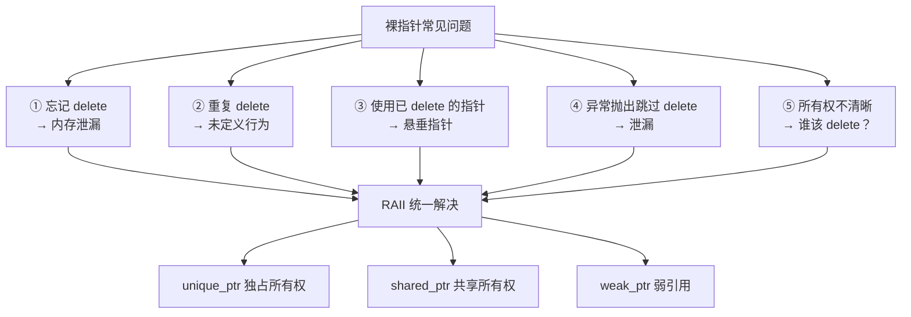
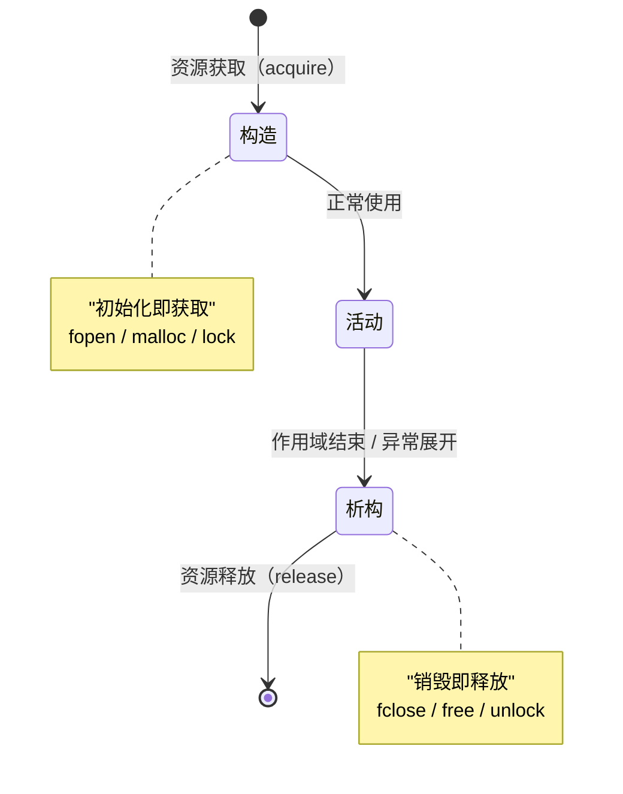

# 智能指针与 RAII

#### 目录介绍
- [1. 引言](#1-引言)
- [2. RAII的设计哲学](#2-raii的设计哲学)
- [3. unique_ptr深度解析](#3-unique_ptr深度解析)
- [4. shared_ptr与引用计数](#4-shared_ptr与引用计数)
- [5. weak_ptr打破循环引用](#5-weak_ptr打破循环引用)
- [6. make_shared与make_unique](#6-make_shared与make_unique)
- [7. 自定义删除器](#7-自定义删除器)
- [8. enable_shared_from_this](#8-enable_shared_from_this)
- [9. 智能指针与多态](#9-智能指针与多态)
- [10. 智能指针的线程安全](#10-智能指针的线程安全)
- [11. 智能指针的性能分析](#11-智能指针的性能分析)
- [12. RAII的扩展应用](#12-raii的扩展应用)
- [13. 总结](#13-总结)

> **案例引入｜一次"明明 delete 了却内存泄漏"的灵异事件**
>
> 同事排查生产环境 OOM，核对代码——`new` 和 `delete` 完全配对、也没有 early return。但 `valgrind` 报告 `definitely lost: 2.3 MB in 47 blocks`，每次请求都漏一点点。
>
> 最后定位到这段：
>
> ```cpp
> Resource* res = new Resource();
> try {
>     process(res);      // 抛异常了！
> } catch (...) {
>     throw;             // 重新抛出
> }
> delete res;            // 永远执行不到
> ```
>
> 问题是：C++ **没有** finally 语法。一旦 `process` 抛异常，`delete res` 就被跳过了。
>
> 这正是 **RAII**（Resource Acquisition Is Initialization）诞生的原因——**把资源的释放绑定到栈对象的析构上**，让 C++ 的**栈展开机制**替你自动处理异常路径。智能指针（`unique_ptr` / `shared_ptr` / `weak_ptr`）就是 RAII 最精致的应用：它们把"new 一个资源 + delete 配对"这件事，变成"**构造一个栈对象，析构时它会替你 delete**"。

---

## 00.案例元信息

| 项目 | 说明 |
|------|------|
| 难度 | ★★★★☆ |
| 预估阅读 | 75 分钟 |
| 前置知识 | [02.引用与指针原理](./02.引用与指针原理.md)、[04.对象生命周期](./04.对象生命周期.md)、卷一第 12 章 |
| 覆盖要点 | RAII 哲学、`unique_ptr` 独占、`shared_ptr` 引用计数、`weak_ptr` 打破环、自定义删除器、`enable_shared_from_this`、线程安全 |
| 核心产出 | 任何有"资源 + 异常"的代码都能写成 RAII 风格；能画出 `shared_ptr` 控制块的全貌 |

---

## 1. 引言

C++ 没有垃圾回收器，资源管理是**程序员的责任**。但"手动释放"在复杂控制流（异常、early return、多分支）下极易出错——案例里的 `new/delete` 配对就是典型反面教材。

**RAII** 是 C++ 解决这个问题的核心哲学：**把资源的生命周期绑定到一个栈对象的生命周期上**。智能指针是这个哲学最常用、也最重要的应用。

### 1.1 裸指针的 5 大顽疾



### 1.2 RAII 的核心规则



**关键点**：异常抛出时栈展开（stack unwinding）会按构造相反的顺序调用每个栈对象的析构函数——这是 C++ 的语言保证，也是 RAII 异常安全的根基。

### 1.3 本文路线图


### 1.4 本文要回答的核心问题

- `unique_ptr` **几乎零开销**——它是怎么做到的？
- `shared_ptr` 的**控制块**（control block）存什么、分配在哪、为什么要有两个计数？
- `make_shared` 比 `new + shared_ptr` 快——**具体快在哪一步**？什么场景反而有害？
- `weak_ptr` 为什么能"观察而不延长生命周期"？它是怎么知道目标已死的？
- `shared_ptr` 的"**计数线程安全**"和"**被管理对象的线程安全**"是两回事——具体区别在哪？

---

## 2. RAII原则

### 2.1 RAII的核心思想

```
RAII = Resource Acquisition Is Initialization

核心规则：
├── 资源在构造函数中获取（初始化即获取）
├── 资源在析构函数中释放（销毁即释放）
├── 拷贝语义决定资源共享方式
└── 利用栈对象的确定性析构保证资源释放
```

```cpp
// RAII的经典示例
class FileHandle {
    FILE* file_;
public:
    FileHandle(const char* path, const char* mode)
        : file_(fopen(path, mode)) {
        if (!file_) throw std::runtime_error("Cannot open file");
    }
    
    ~FileHandle() {
        if (file_) fclose(file_);
    }
    
    // 禁止拷贝（文件句柄不应被共享）
    FileHandle(const FileHandle&) = delete;
    FileHandle& operator=(const FileHandle&) = delete;
    
    // 允许移动
    FileHandle(FileHandle&& other) noexcept : file_(other.file_) {
        other.file_ = nullptr;
    }
    
    FileHandle& operator=(FileHandle&& other) noexcept {
        if (this != &other) {
            if (file_) fclose(file_);
            file_ = other.file_;
            other.file_ = nullptr;
        }
        return *this;
    }
    
    FILE* get() const { return file_; }
};

void raii_demo() {
    FileHandle f("test.txt", "w");
    fprintf(f.get(), "Hello RAII\n");
    // 离开作用域时，f的析构函数自动关闭文件
    // 即使中间抛出异常也是如此
}
```

### 2.2 标准库中的RAII

```cpp
#include <mutex>
#include <fstream>
#include <memory>

void standard_raii() {
    // std::lock_guard - 互斥锁RAII
    std::mutex mtx;
    {
        std::lock_guard<std::mutex> lock(mtx);
        // 持有锁的代码...
    }  // 自动解锁
    
    // std::unique_lock - 更灵活的锁RAII
    {
        std::unique_lock<std::mutex> lock(mtx, std::defer_lock);
        lock.lock();    // 手动加锁
        // ...
        lock.unlock();  // 可以提前解锁
    }  // 如果还持有锁，自动解锁
    
    // std::fstream - 文件RAII
    {
        std::ofstream out("test.txt");
        out << "Hello" << std::endl;
    }  // 自动关闭
    
    // std::unique_ptr - 内存RAII
    {
        auto ptr = std::make_unique<int>(42);
    }  // 自动delete
}
```

---

## 3. unique_ptr——独占所有权

### 3.1 unique_ptr的设计

```cpp
// unique_ptr的核心：独占所有权，不可拷贝，可以移动
#include <memory>
#include <iostream>

void unique_ptr_basics() {
    // 创建
    std::unique_ptr<int> p1(new int(42));
    auto p2 = std::make_unique<int>(42);  // 推荐方式
    
    // 使用
    std::cout << *p2 << std::endl;  // 42
    
    // 不可拷贝
    // auto p3 = p2;  // 编译错误！
    
    // 可以移动（转移所有权）
    auto p3 = std::move(p2);
    // p2现在为nullptr，p3持有资源
    
    // 手动释放
    int* raw = p3.release();  // 释放所有权，返回裸指针
    delete raw;  // 需要手动delete
    
    // 重置
    auto p4 = std::make_unique<int>(100);
    p4.reset();              // 释放资源，变为nullptr
    p4.reset(new int(200));  // 释放旧资源，接管新资源
    
    // 检查
    if (p4) {
        std::cout << "p4 is not null: " << *p4 << std::endl;
    }
}
```

### 3.2 unique_ptr与数组

```cpp
void unique_ptr_array() {
    // 数组特化
    auto arr = std::make_unique<int[]>(10);
    arr[0] = 42;
    arr[9] = 100;
    // 自动调用 delete[]
    
    // 不支持 *arr 和 arr->
    // 支持 arr[i]
}
```

### 3.3 自定义删除器

```cpp
// unique_ptr可以使用自定义删除器
struct FileDeleter {
    void operator()(FILE* fp) const {
        if (fp) {
            std::cout << "Closing file\n";
            fclose(fp);
        }
    }
};

void custom_deleter() {
    // 函数对象删除器
    std::unique_ptr<FILE, FileDeleter> fp(fopen("test.txt", "w"));
    
    // Lambda删除器
    auto closer = [](FILE* fp) { if (fp) fclose(fp); };
    std::unique_ptr<FILE, decltype(closer)> fp2(fopen("test2.txt", "w"), closer);
    
    // C函数删除器
    std::unique_ptr<void, decltype(&free)> mem(malloc(100), free);
}
```

### 3.4 unique_ptr的实现原理

```cpp
// 简化版unique_ptr实现
template<typename T, typename Deleter = std::default_delete<T>>
class UniquePtr {
    T* ptr_;
    Deleter deleter_;
    
public:
    explicit UniquePtr(T* ptr = nullptr) noexcept : ptr_(ptr) {}
    
    ~UniquePtr() {
        if (ptr_) deleter_(ptr_);
    }
    
    // 禁止拷贝
    UniquePtr(const UniquePtr&) = delete;
    UniquePtr& operator=(const UniquePtr&) = delete;
    
    // 允许移动
    UniquePtr(UniquePtr&& other) noexcept : ptr_(other.ptr_) {
        other.ptr_ = nullptr;
    }
    
    UniquePtr& operator=(UniquePtr&& other) noexcept {
        if (this != &other) {
            if (ptr_) deleter_(ptr_);
            ptr_ = other.ptr_;
            other.ptr_ = nullptr;
        }
        return *this;
    }
    
    T& operator*() const { return *ptr_; }
    T* operator->() const { return ptr_; }
    T* get() const { return ptr_; }
    explicit operator bool() const { return ptr_ != nullptr; }
    
    T* release() noexcept {
        T* tmp = ptr_;
        ptr_ = nullptr;
        return tmp;
    }
    
    void reset(T* ptr = nullptr) noexcept {
        T* old = ptr_;
        ptr_ = ptr;
        if (old) deleter_(old);
    }
};

// sizeof(unique_ptr<T>) == sizeof(T*)
// 空基类优化使得无状态删除器不占额外空间
// unique_ptr是零开销抽象！
```

---

## 4. shared_ptr——共享所有权

### 4.1 shared_ptr的设计

```cpp
void shared_ptr_basics() {
    // 创建
    auto sp1 = std::make_shared<int>(42);  // 推荐
    std::shared_ptr<int> sp2(new int(42));  // 可以但不推荐
    
    // 共享所有权
    auto sp3 = sp1;  // 拷贝：引用计数 +1
    
    std::cout << "use_count: " << sp1.use_count() << std::endl;  // 3
    
    sp3.reset();  // sp3放弃所有权，引用计数 -1
    std::cout << "use_count: " << sp1.use_count() << std::endl;  // 2
    
    // 最后一个shared_ptr销毁时，资源被释放
}
```

### 4.2 shared_ptr的内部结构

```
shared_ptr的内存布局：

shared_ptr对象（栈上，16字节）：
┌──────────┐
│ T* ptr   │ 指向托管对象
├──────────┤
│ ctrl*    │ 指向控制块
└──────────┘

控制块（堆上）：
┌──────────────────┐
│ strong_count     │  shared_ptr的引用计数
├──────────────────┤
│ weak_count       │  weak_ptr的引用计数
├──────────────────┤
│ deleter          │  自定义删除器（如果有）
├──────────────────┤
│ allocator        │  分配器（如果有）
└──────────────────┘

make_shared的优化布局（一次分配）：
┌──────────────────┐
│ 控制块            │
│ strong_count     │
│ weak_count       │
├──────────────────┤
│ 托管对象 T       │  ← 对象和控制块在同一内存块中
└──────────────────┘
```

```cpp
// make_shared vs new的区别
void make_shared_advantage() {
    // 方式1：两次内存分配
    std::shared_ptr<int> p1(new int(42));
    // 分配1: new int(42)
    // 分配2: 控制块
    
    // 方式2：一次内存分配（推荐）
    auto p2 = std::make_shared<int>(42);
    // 分配1: 对象+控制块一起分配
    // 优点：更少的内存分配、更好的局部性、异常安全
    
    // make_shared的缺点：
    // 1. 不能使用自定义删除器
    // 2. 弱引用存在时，对象内存不能提前释放
    //    （因为对象和控制块在同一块内存中）
}
```

### 4.3 shared_ptr的线程安全性

```cpp
#include <thread>
#include <memory>

void shared_ptr_thread_safety() {
    auto sp = std::make_shared<int>(42);
    
    // 引用计数操作是原子的（线程安全）
    // 多个线程可以安全地拷贝/析构shared_ptr
    
    std::thread t1([sp] {
        auto local = sp;  // 安全：原子递增引用计数
        // ...
    });  // 安全：原子递减引用计数
    
    std::thread t2([sp] {
        auto local = sp;
        // ...
    });
    
    t1.join();
    t2.join();
    
    // 但是！访问托管对象本身不是线程安全的
    // 如果多个线程通过shared_ptr修改同一个对象，需要额外的同步
    auto data = std::make_shared<std::vector<int>>();
    // data->push_back(1);  // 在多线程中不安全，需要mutex
}
```

### 4.4 shared_ptr的陷阱

```cpp
// 陷阱1：循环引用
class Node {
public:
    std::shared_ptr<Node> next;
    ~Node() { std::cout << "~Node\n"; }
};

void circular_reference() {
    auto a = std::make_shared<Node>();
    auto b = std::make_shared<Node>();
    a->next = b;
    b->next = a;  // 循环引用！
    // a和b离开作用域时，引用计数都是1，永远不会变为0
    // 内存泄漏！
}

// 陷阱2：从this创建shared_ptr
class BadWidget {
public:
    std::shared_ptr<BadWidget> get_self() {
        return std::shared_ptr<BadWidget>(this);  // 危险！
        // 会创建第二个控制块，导致双重删除
    }
};

// 正确做法：enable_shared_from_this
class GoodWidget : public std::enable_shared_from_this<GoodWidget> {
public:
    std::shared_ptr<GoodWidget> get_self() {
        return shared_from_this();  // 正确！共享同一个控制块
    }
};

// 陷阱3：不必要的shared_ptr
// 如果不需要共享所有权，用unique_ptr
// shared_ptr有额外开销：控制块、原子引用计数
```

---

## 5. weak_ptr——打破循环引用

### 5.1 weak_ptr的作用

```cpp
void weak_ptr_demo() {
    auto sp = std::make_shared<int>(42);
    std::weak_ptr<int> wp = sp;
    
    // weak_ptr不增加引用计数
    std::cout << "use_count: " << sp.use_count() << std::endl;  // 1
    
    // 使用weak_ptr前必须检查对象是否还存在
    if (auto locked = wp.lock()) {
        // locked是shared_ptr，对象在此作用域内保证存活
        std::cout << *locked << std::endl;
    }
    
    // 检查是否过期
    if (!wp.expired()) {
        // 注意：expired()和lock()之间可能有竞态
        // 推荐直接用lock()
    }
    
    // 对象被销毁后
    sp.reset();
    if (auto locked = wp.lock()) {
        // 不会执行到这里
    } else {
        std::cout << "Object has been destroyed\n";
    }
}
```

### 5.2 解决循环引用

```cpp
class Node {
public:
    std::shared_ptr<Node> next;
    std::weak_ptr<Node> prev;  // 用weak_ptr打破循环
    int data;
    
    Node(int d) : data(d) {}
    ~Node() { std::cout << "~Node(" << data << ")\n"; }
};

void break_circular() {
    auto n1 = std::make_shared<Node>(1);
    auto n2 = std::make_shared<Node>(2);
    auto n3 = std::make_shared<Node>(3);
    
    n1->next = n2;
    n2->next = n3;
    n2->prev = n1;  // weak_ptr不增加引用计数
    n3->prev = n2;
    
    // 所有节点都能正确析构
}

// weak_ptr的其他用途：缓存、观察者模式
class Cache {
    std::unordered_map<std::string, std::weak_ptr<Data>> cache_;
public:
    std::shared_ptr<Data> get(const std::string& key) {
        auto it = cache_.find(key);
        if (it != cache_.end()) {
            if (auto sp = it->second.lock()) {
                return sp;  // 缓存命中
            }
            cache_.erase(it);  // 对象已被销毁，清理缓存
        }
        // 缓存未命中，创建新对象
        auto data = std::make_shared<Data>(key);
        cache_[key] = data;
        return data;
    }
};
```

---

## 6. 智能指针的选择策略

### 6.1 所有权模型

```
智能指针选择指南：
━━━━━━━━━━━━━━━━━

独占所有权 → unique_ptr
├── 函数返回动态对象
├── 容器中存储多态对象
├── Pimpl模式
└── 工厂模式

共享所有权 → shared_ptr
├── 多个对象共同持有同一资源
├── 异步操作中延长对象生命周期
├── 观察者/订阅者持有发布者的引用
└── 缓存系统

非拥有观察 → weak_ptr
├── 打破循环引用
├── 缓存（可能已过期的引用）
├── 观察者模式（不影响被观察者生命周期）
└── 线程安全的对象存活检查

不拥有、保证存活 → 裸指针或引用
├── 函数参数（调用者保证对象存活）
├── 非拥有的观察（单线程、生命周期明确）
└── 与C API交互
```

### 6.2 性能对比

```
智能指针性能：
┌─────────────┬──────────┬────────┬───────────┬──────────┐
│             │ 大小     │ 创建   │ 拷贝      │ 解引用   │
├─────────────┼──────────┼────────┼───────────┼──────────┤
│ 裸指针      │ 8字节    │ ~0     │ ~0        │ ~0       │
│ unique_ptr  │ 8字节*   │ ~0     │ 不可拷贝  │ ~0       │
│ shared_ptr  │ 16字节   │ 分配   │ 原子操作  │ ~0       │
│ weak_ptr    │ 16字节   │ ~0     │ 原子操作  │ 需lock() │
└─────────────┴──────────┴────────┴───────────┴──────────┘
* 无状态删除器时
```

---

## 7. RAII的其他应用

### 7.1 ScopeGuard

```cpp
#include <functional>

// 通用的作用域守卫
class ScopeGuard {
    std::function<void()> cleanup_;
    bool dismissed_;
    
public:
    template<typename F>
    explicit ScopeGuard(F&& f) : cleanup_(std::forward<F>(f)), dismissed_(false) {}
    
    ~ScopeGuard() {
        if (!dismissed_) cleanup_();
    }
    
    void dismiss() { dismissed_ = true; }
    
    ScopeGuard(const ScopeGuard&) = delete;
    ScopeGuard& operator=(const ScopeGuard&) = delete;
};

// 宏简化使用
#define SCOPE_EXIT auto CONCAT(scope_guard_, __LINE__) = ScopeGuard

void scope_guard_demo() {
    FILE* fp = fopen("test.txt", "w");
    ScopeGuard guard([&] { if (fp) fclose(fp); });
    
    // 做一些可能抛异常的操作
    fprintf(fp, "data\n");
    
    // 如果一切正常，可以取消守卫
    // guard.dismiss();
    
    // 离开作用域时自动关闭文件
}
```

### 7.2 RAII与事务

```cpp
class Transaction {
    Database& db_;
    bool committed_;
public:
    Transaction(Database& db) : db_(db), committed_(false) {
        db_.begin_transaction();
    }
    
    ~Transaction() {
        if (!committed_) {
            db_.rollback();  // 如果没有提交，自动回滚
        }
    }
    
    void commit() {
        db_.commit();
        committed_ = true;
    }
};

void transaction_demo(Database& db) {
    Transaction txn(db);
    
    db.execute("INSERT INTO users VALUES (...)");
    db.execute("UPDATE accounts SET ...");
    
    // 如果上面任何操作抛异常，txn的析构函数自动回滚
    
    txn.commit();  // 一切正常，提交
}
```

---

## 8. Pimpl模式

```cpp
// widget.h
class Widget {
public:
    Widget();
    ~Widget();
    Widget(Widget&&) noexcept;
    Widget& operator=(Widget&&) noexcept;
    
    void doSomething();
    
private:
    struct Impl;
    std::unique_ptr<Impl> pimpl_;
};

// widget.cpp
struct Widget::Impl {
    std::string name;
    std::vector<int> data;
    // 大量实现细节...
};

Widget::Widget() : pimpl_(std::make_unique<Impl>()) {}
Widget::~Widget() = default;
Widget::Widget(Widget&&) noexcept = default;
Widget& Widget::operator=(Widget&&) noexcept = default;

void Widget::doSomething() {
    pimpl_->data.push_back(42);
}

// 优点：
// 1. 减少编译依赖（头文件不需要包含实现的头文件）
// 2. 二进制兼容（修改Impl不影响Widget的ABI）
// 3. 编译加速（修改实现不需要重编译使用者）
```

---

## 9. make函数 vs 直接new

```cpp
// make_unique / make_shared 的优势

// 1. 异常安全
void exception_safety() {
    // 危险：
    func(std::shared_ptr<A>(new A), std::shared_ptr<B>(new B));
    // C++17前，编译器可能：new A → new B → shared_ptr(A) → shared_ptr(B)
    // 如果new B抛异常，A泄漏！
    
    // 安全：
    func(std::make_shared<A>(), std::make_shared<B>());
    // 每个make_shared是一个完整的表达式
}

// 2. 性能（make_shared）
void performance() {
    auto p1 = std::make_shared<int>(42);  // 一次分配
    std::shared_ptr<int> p2(new int(42)); // 两次分配
}

// 3. 避免裸new
void no_raw_new() {
    auto p = std::make_unique<Widget>();  // 没有new出现在代码中
    // "现代C++应该几乎没有裸new和delete"
}

// make函数的限制：
// 1. 不能使用自定义删除器
// 2. 不能用大括号初始化
// 3. make_shared在weak_ptr存在时不能释放对象内存
```

---

## 10. 总结

### 10.1 智能指针知识图谱

```
智能指针与RAII
├── RAII原则
│   ├── 构造获取，析构释放
│   ├── 栈对象确定性析构
│   └── 异常安全保证
├── unique_ptr
│   ├── 独占所有权
│   ├── 零开销抽象
│   ├── 自定义删除器
│   └── 数组特化
├── shared_ptr
│   ├── 共享所有权
│   ├── 引用计数（原子操作）
│   ├── 控制块
│   ├── make_shared优化
│   └── 陷阱：循环引用
├── weak_ptr
│   ├── 非拥有观察
│   ├── 打破循环引用
│   └── lock()检查存活
└── RAII应用
    ├── ScopeGuard
    ├── 锁管理
    ├── 事务管理
    └── Pimpl模式
```

### 10.2 黄金规则

| 规则 | 说明 |
|------|------|
| 不使用裸new/delete | 用make_unique/make_shared |
| 默认unique_ptr | 只在需要共享时用shared_ptr |
| make函数优先 | 异常安全+性能 |
| 避免循环引用 | 用weak_ptr打破 |
| RAII管理一切资源 | 文件、锁、网络连接... |
| Rule of Zero | 让智能指针管理资源 |

智能指针不仅是"自动delete"的工具，它们体现了C++的核心设计哲学——通过类型系统在编译期保证资源安全。掌握RAII和智能指针，是成为优秀C++程序员的必经之路。

---

## 十一、智能指针的线程安全性

### 11.1 shared_ptr的引用计数是原子的

```cpp
#include <memory>
#include <thread>
#include <vector>

// shared_ptr的引用计数操作是线程安全的
// 但指向的对象本身不是线程安全的！

std::shared_ptr<int> global_ptr = std::make_shared<int>(0);

void thread_func() {
    for (int i = 0; i < 10000; ++i) {
        // 拷贝shared_ptr是线程安全的（引用计数的原子操作）
        std::shared_ptr<int> local = global_ptr;
        
        // 但修改指向的对象不是线程安全的！
        // (*local)++;  // 数据竞争！需要额外同步
    }
}

void safe_demo() {
    auto ptr = std::make_shared<std::atomic<int>>(0);
    std::vector<std::thread> threads;
    for (int i = 0; i < 4; ++i) {
        threads.emplace_back([ptr]() {
            for (int j = 0; j < 10000; ++j) {
                (*ptr)++;  // 原子操作，线程安全
            }
        });
    }
    for (auto& t : threads) t.join();
    std::cout << "结果: " << *ptr << std::endl;  // 40000
}
```

### 11.2 shared_ptr赋值的线程安全

```cpp
// 多线程同时修改同一个shared_ptr变量 → 数据竞争！
std::shared_ptr<int> ptr = std::make_shared<int>(0);

// 线程A
ptr = std::make_shared<int>(1);  // 不安全！

// 线程B
ptr = std::make_shared<int>(2);  // 不安全！

// C++20提供原子shared_ptr
std::atomic<std::shared_ptr<int>> atomic_ptr = std::make_shared<int>(0);
// 线程A
atomic_ptr.store(std::make_shared<int>(1));  // 安全
// 线程B  
auto local = atomic_ptr.load();  // 安全
```

---

## 十二、RAII的高级应用模式

### 12.1 ScopeGuard的泛化实现

```cpp
#include <functional>
#include <utility>

// 通用的作用域守卫
template<typename Func>
class ScopeGuard {
    Func cleanup_;
    bool active_;
public:
    explicit ScopeGuard(Func f) : cleanup_(std::move(f)), active_(true) {}
    ~ScopeGuard() { if (active_) cleanup_(); }
    
    void dismiss() { active_ = false; }  // 取消清理
    
    ScopeGuard(const ScopeGuard&) = delete;
    ScopeGuard& operator=(const ScopeGuard&) = delete;
    ScopeGuard(ScopeGuard&& other) noexcept 
        : cleanup_(std::move(other.cleanup_)), active_(other.active_) {
        other.active_ = false;
    }
};

// 工厂函数
template<typename Func>
ScopeGuard<Func> make_guard(Func f) {
    return ScopeGuard<Func>(std::move(f));
}

// 使用
void process_file(const std::string& path) {
    FILE* fp = fopen(path.c_str(), "r");
    if (!fp) throw std::runtime_error("open failed");
    
    auto guard = make_guard([fp]() { fclose(fp); });
    
    // 处理文件...
    // 无论正常返回还是异常退出，fp都会被关闭
    
    // 如果某个条件下不需要清理：
    // guard.dismiss();
}
```

### 12.2 RAII管理数据库事务

```cpp
class Transaction {
    Database& db_;
    bool committed_ = false;
public:
    explicit Transaction(Database& db) : db_(db) {
        db_.execute("BEGIN");
    }
    
    ~Transaction() {
        if (!committed_) {
            db_.execute("ROLLBACK");  // 未提交则回滚
        }
    }
    
    void commit() {
        db_.execute("COMMIT");
        committed_ = true;
    }
    
    Transaction(const Transaction&) = delete;
    Transaction& operator=(const Transaction&) = delete;
};

void transfer(Database& db, int from, int to, double amount) {
    Transaction txn(db);
    
    db.execute("UPDATE accounts SET balance = balance - ? WHERE id = ?", amount, from);
    db.execute("UPDATE accounts SET balance = balance + ? WHERE id = ?", amount, to);
    
    // 如果上面任何一步异常，析构函数会自动ROLLBACK
    txn.commit();  // 全部成功才提交
}
```

### 12.3 RAII管理临时状态

```cpp
// RAII恢复状态
class CoutFormatGuard {
    std::ios_base::fmtflags flags_;
    std::streamsize precision_;
public:
    explicit CoutFormatGuard(std::ostream& os = std::cout)
        : flags_(os.flags()), precision_(os.precision()) {}
    ~CoutFormatGuard() {
        std::cout.flags(flags_);
        std::cout.precision(precision_);
    }
};

void print_hex(int value) {
    CoutFormatGuard guard;  // 保存当前格式
    std::cout << std::hex << std::showbase << value << std::endl;
    // 离开作用域自动恢复格式
}
```

---

## 十三、面试高频问题与深度解答

### 13.1 常见问题

1. **unique_ptr和shared_ptr的区别？**
   - unique_ptr：独占所有权，零开销，不可拷贝只可移动
   - shared_ptr：共享所有权，引用计数（有开销），可拷贝

2. **make_shared比直接new有什么优势？**
   - 一次内存分配（对象+控制块合并）
   - 异常安全（不会泄漏）
   - 缓存友好

3. **什么情况下make_shared不适用？**
   - 需要自定义删除器
   - 对象很大且有weak_ptr延长控制块生命周期
   - 需要从原始指针构造

4. **循环引用如何产生？如何解决？**
   - A持有shared_ptr\<B>，B持有shared_ptr\<A> → 引用计数永远不为0
   - 将其中一个改为weak_ptr

5. **RAII的核心思想是什么？**
   - 将资源生命周期绑定到对象生命周期
   - 构造时获取，析构时释放
   - 利用C++确定性析构保证资源安全

---

> 智能指针和RAII是C++资源管理的基石。它们将"记住释放资源"的心智负担转化为编译器强制执行的类型系统保证，这是C++相比C的重大进步。

---

## 十一、深挖：智能指针与 RAII 的机制拾遗

### 11.1 RAII 不是"智能指针的别名"，是一种资源管理哲学

RAII（Resource Acquisition Is Initialization）看似只适用于内存管理，其实它覆盖**所有有生命周期的资源**：

- 文件（`std::fstream` 析构时关闭）；
- 锁（`std::lock_guard` 析构时 unlock）；
- 网络连接（自己写的 `SocketGuard`）；
- GPU 资源、数据库连接、事务；
- 终端颜色/光标状态（构造时改、析构时复原）。

核心思想只有一句：**把资源的生命周期绑定到栈对象的生命周期上**。然后 C++ 的确定性析构（leave scope 必析构）自动帮你做正确的事。这种模式在 Java/Go/Python 里都没有完整对应物：Java 的 try-with-resources 需要手写 try、Go 的 defer 要求显式写、Python 的 `with` 要求写 `__enter__/__exit__`——只有 C++ 用"普通的构造/析构"就能统一所有资源管理。

### 11.2 unique_ptr 为什么能做到"和裸指针一样快"

`unique_ptr<T>` 的大小通常是**一个指针（8 字节）**，析构时 `delete ptr`。这是因为：

- 它的所有方法都是 inline 的（头文件定义）；
- 它没有引用计数、没有虚表；
- 移动构造只是交换指针；
- 删除器如果是默认的 `std::default_delete`，编译器可以通过 EBO（empty base optimization）完全优化掉。

所以在现代 C++ 里，**把函数返回 `unique_ptr` 而不是裸指针，没有任何运行时成本**——它是最佳默认。反过来，什么时候 `unique_ptr` 会变大？当你给它自定义删除器（函数指针、lambda with capture、`std::function`），它就会变成"指针 + 删除器"两个字段。

### 11.3 shared_ptr 的真正成本在原子操作

`shared_ptr` 有两个指针（对象指针 + 控制块指针），控制块里有两个计数：强引用数和弱引用数。但真正昂贵的不是空间，是**原子加减**：

- 每次拷贝构造/赋值都是一次 atomic increment；
- 每次析构都是一次 atomic decrement + 条件分支；
- 在多线程里，这些原子操作会污染 cache line，引起"假共享"。

测试数据：在高并发场景下，`shared_ptr` 的传递成本可能比 `unique_ptr` 慢 10-50 倍。这也是为什么 Google C++ Style Guide 强调"优先 `unique_ptr`，除非真的需要共享"。

### 11.4 weak_ptr 为什么不是"指针"

`weak_ptr` 的 `get()` 不存在——因为它不能直接 dereference。你必须 `lock()` 把它升级成 `shared_ptr`，检查是否为空，才能访问对象。

为什么这么设计？因为"弱引用"的语义是：**我希望对象存在，但我不延长它的生命周期**。如果允许直接访问，就会出现"访问到一半对象被析构"的竞态。`lock()` 的原子语义保证"要么拿到有效引用，要么拿到 null"。

`weak_ptr` 的典型用法：
- 解循环引用（parent → shared<child>，child → weak<parent>）；
- 观察者模式（观察者持 weak，被观察对象析构时观察者自动失效）；
- 缓存（缓存持 weak_ptr，对象无人使用时自动淘汰）。

### 11.5 `make_shared` 为什么比 `shared_ptr(new T)` 推荐

两个原因：

1. **异常安全**：`f(shared_ptr<T>(new T), g())` 中，如果 `g()` 抛异常，`new T` 已经分配但 `shared_ptr` 还没构造——内存泄漏。`make_shared<T>()` 是单次调用，无此风险。
2. **一次分配**：`make_shared` 把对象和控制块分配在一起（`sizeof(T) + 控制块`），一次 `malloc`。`shared_ptr(new T)` 是两次 `malloc`。

代价是：**控制块的生命周期和对象的内存绑定**——即使对象已被销毁，只要还有 weak_ptr 存活，那块内存就不能释放。对于大对象 + 长寿命 weak_ptr 的场景，反而是用 `shared_ptr(new T)` 更合适。

### 11.6 循环引用：RAII 的唯一破绽

RAII 依赖确定性析构，但**强引用环**打破了这个保证：A 持 shared<B>，B 持 shared<A>——引用计数永远不为零，两者都不会析构，内存和资源泄漏。

这是 C++ 资源管理里**少数需要程序员主动避免**的情况。解法：
- 所有权关系（owner → owned）用 `shared_ptr`；
- 反向关系（child → parent）用 `weak_ptr`；
- 同级之间（peer）用裸指针或引用（前提是生命周期已被外部保证）。

这也是为什么"谁拥有谁"是 C++ 设计的关键问题——用对了所有权模型，RAII 就自动帮你做对；用错了，就要靠 leak sanitizer 去事后发现。
