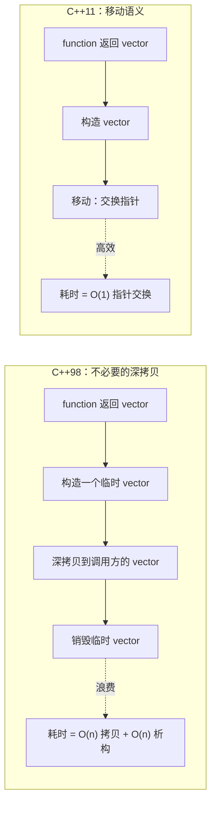
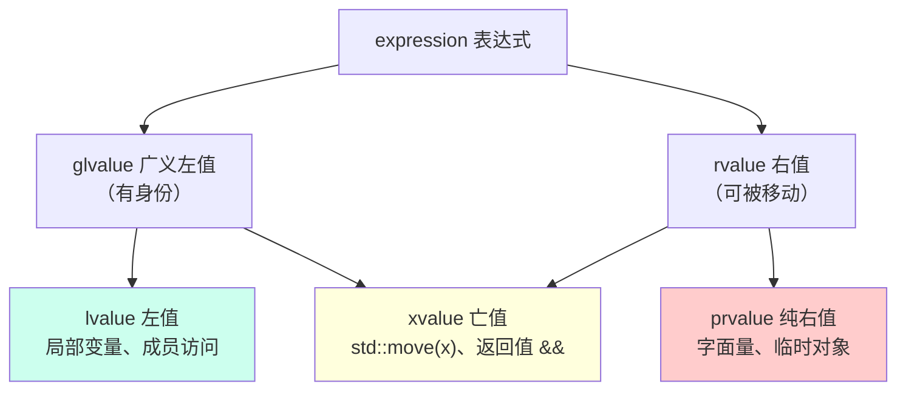

# 第10章：C++ 右值与移动语义

#### 目录介绍
- [1. 引言](#1-引言)
- [2. 左值与右值深度理解](#2-左值与右值深度理解)
- [3. 右值引用](#3-右值引用)
- [4. 移动语义](#4-移动语义)
- [5. std::move的本质](#5-stdmove的本质)
- [6. 完美转发](#6-完美转发)
- [7. 移动语义与异常安全](#7-移动语义与异常安全)
- [8. 返回值优化（RVO/NRVO）](#8-返回值优化rvonrvo)
- [9. 移动语义的实际应用](#9-移动语义的实际应用)
- [10. 移动语义的陷阱](#10-移动语义的陷阱)
- [11. 移动语义与STL](#11-移动语义与stl)
- [12. 移动语义的性能影响](#12-移动语义的性能影响)
- [13. C++23中的进展](#13-c23中的进展)
- [14. 总结](#14-总结)
- [15. 面试高频问题](#十五面试高频问题)
- [16. 编译器底层如何实现移动语义](#十六编译器底层如何实现移动语义)

> **案例引入｜"加了一行 `std::move` 性能反而变差"的诡异现象**
>
> 同事被 code review 指出："你这里把 `string` 当参数传，加个 `std::move` 啊。" 他照改：
>
> ```cpp
> void push(std::string s) {
>     queue_.push_back(std::move(s));   // 加了 move
> }
> // 调用：
> std::string name = "Alice";
> push(std::move(name));                  // 外层也加 move
> return name;                            // ← 性能居然变差了
> ```
>
> 基准测试显示 `push` 本身是快了，但整体 QPS 下降 5%。他困惑："不是都说 `std::move` 能避免拷贝吗？怎么越加越慢？"
>
> 真相是：`std::move` 之后对象进入**"已移动"状态**——后续的 `return name` 需要做一次"已移动对象" → "空串"的隐式处理，而编译器在没有 `move` 时本来可以做 **RVO** / **NRVO**（返回值优化），直接省掉构造。
>
> 这就是移动语义的"甜蜜陷阱"：**它不是"加了就赚"的魔法**，而是一套和**值类别（lvalue/rvalue/xvalue）**、**引用折叠**、**编译器优化（RVO）**纠缠在一起的系统。用对了 10 倍提速；用错了反而阻碍编译器优化。

---

## 00.案例元信息

| 项目 | 说明 |
|------|------|
| 难度 | ★★★★★ |
| 预估阅读 | 85 分钟 |
| 前置知识 | [02.引用与指针原理](./02.引用与指针原理.md)、[04.对象生命周期](./04.对象生命周期.md) |
| 覆盖要点 | 值类别 lvalue/rvalue/xvalue/prvalue、右值引用 `T&&`、移动构造/赋值、`std::move` 本质、完美转发 `std::forward`、RVO/NRVO、移动陷阱 |
| 核心产出 | 能判断任何表达式的值类别；能写出正确的移动构造函数；能区分 `std::move` 该用和不该用的场景 |

---

## 1. 引言

C++11 引入的**右值引用**和**移动语义**（move semantics）是现代 C++ 最重要的革新之一。它解决了 C++98 的一个核心性能问题——**不必要的深拷贝**。通过"窃取"即将销毁对象的资源，把原本 O(n) 的拷贝变成 O(1) 的指针交换。

### 1.1 要解决的核心痛点



### 1.2 值类别体系



**记忆口诀**：**"能取地址 → glvalue；会被消费 → rvalue；两者交集 → xvalue"**。

### 1.3 本文路线图


### 1.4 本文要回答的核心问题

- `std::move` 到底做了什么？它**真的移动**了吗？
- `T&&` 在**函数参数**和**模板参数**里含义完全不同——区别是什么？
- 什么时候该加 `std::move`、什么时候加了反而变慢？（回到案例里的问题）
- **RVO/NRVO** 和移动语义是什么关系？C++17 强制 RVO 后还需要 `return std::move(x)` 吗？
- `noexcept` 移动构造函数为什么**至关重要**？（提示：`std::vector` 扩容时的选择）

---

## 2. 左值与右值深度理解

### 2.1 值类别

```
C++11表达式的值类别：

        expression
        /         \
     glvalue     rvalue
     /    \      /    \
  lvalue  xvalue    prvalue

lvalue（左值）：有持久身份，可以取地址
  - 变量名: x, arr, str
  - 解引用: *ptr, *this
  - 返回左值引用的函数: std::cout, vec[0]
  - 字符串字面量: "hello"（特殊！）

prvalue（纯右值）：没有身份的临时值
  - 非字符串字面量: 42, true, 3.14
  - 算术表达式: a + b, a * b
  - 返回非引用的函数调用: str.substr(), make_pair()
  - lambda表达式: []{}

xvalue（将亡值）：有身份但即将被移动
  - std::move(x)
  - static_cast<T&&>(x)
  - 返回右值引用的函数调用
```

### 2.2 std::move的真相

**疑惑**：std::move真的"移动"了什么？

**答疑**：std::move什么都没移动！它只是将左值转换为右值引用（一个类型转换）。

```cpp
#include <utility>
#include <iostream>

// std::move的实现（简化版）
template<typename T>
typename std::remove_reference<T>::type&& my_move(T&& t) noexcept {
    return static_cast<typename std::remove_reference<T>::type&&>(t);
}

void move_truth() {
    std::string a = "Hello";
    
    // std::move只是类型转换，不做任何实际操作
    std::string&& rref = std::move(a);
    // a仍然完整！没有任何东西被"移动"
    
    // 真正的移动发生在移动构造函数中
    std::string b = std::move(a);  // 这里调用移动构造函数
    // 现在a的内容被"窃取"了
    // a处于"有效但不确定"的状态
    
    std::cout << "a after move: '" << a << "'\n";  // 通常为空
    std::cout << "b: '" << b << "'\n";              // "Hello"
}
```

**论证**：移动的三步过程

```
1. std::move(obj)         → 将obj转为右值引用（无实际操作）
2. 传递给移动构造/赋值    → 匹配右值引用重载
3. 移动构造函数执行        → 真正的资源转移（窃取指针等）

如果类型没有移动构造函数，右值引用会绑定到const引用参数
→ 回退到拷贝构造！
```

---

## 3. 移动构造与移动赋值

### 3.1 实现移动语义

```cpp
class Buffer {
    int* data_;
    size_t size_;
    
public:
    // 构造
    Buffer(size_t n) : size_(n), data_(new int[n]) {
        std::cout << "Construct(" << n << ")\n";
    }
    
    // 析构
    ~Buffer() {
        delete[] data_;
    }
    
    // 拷贝构造：深拷贝 O(n)
    Buffer(const Buffer& other) : size_(other.size_), data_(new int[other.size_]) {
        std::copy(other.data_, other.data_ + size_, data_);
        std::cout << "Copy(" << size_ << ")\n";
    }
    
    // 移动构造：窃取资源 O(1)
    Buffer(Buffer&& other) noexcept : data_(other.data_), size_(other.size_) {
        other.data_ = nullptr;  // 关键！防止源对象析构时释放资源
        other.size_ = 0;
        std::cout << "Move(" << size_ << ")\n";
    }
    
    // 拷贝赋值
    Buffer& operator=(const Buffer& other) {
        if (this != &other) {
            delete[] data_;
            size_ = other.size_;
            data_ = new int[size_];
            std::copy(other.data_, other.data_ + size_, data_);
        }
        std::cout << "Copy assign(" << size_ << ")\n";
        return *this;
    }
    
    // 移动赋值：释放旧资源 + 窃取新资源 O(1)
    Buffer& operator=(Buffer&& other) noexcept {
        if (this != &other) {
            delete[] data_;        // 释放自己的资源
            data_ = other.data_;   // 窃取
            size_ = other.size_;
            other.data_ = nullptr; // 置空源对象
            other.size_ = 0;
        }
        std::cout << "Move assign(" << size_ << ")\n";
        return *this;
    }
};

void demonstrate_moves() {
    Buffer a(1000);           // Construct(1000)
    Buffer b = a;              // Copy(1000)
    Buffer c = std::move(a);   // Move(1000)
    Buffer d(2000);            // Construct(2000)
    d = std::move(c);          // Move assign(1000)
}
```

### 3.2 移动后的状态

```cpp
void moved_from_state() {
    std::string s = "Hello, World!";
    std::string t = std::move(s);
    
    // s现在处于"有效但不确定"的状态
    // 可以安全地：
    s.clear();           // 调用无前置条件的方法
    s = "new value";     // 赋值
    s.size();            // 查询
    // s析构时也是安全的
    
    // 标准库容器移动后通常为空
    std::vector<int> v = {1, 2, 3};
    std::vector<int> w = std::move(v);
    std::cout << v.size() << std::endl;  // 通常为0
    std::cout << v.empty() << std::endl; // 通常为true
}
```

### 3.3 noexcept的重要性

```cpp
// 为什么移动操作应该标记noexcept？
class Widget {
public:
    Widget(Widget&&) noexcept;              // 强异常安全保证
    Widget& operator=(Widget&&) noexcept;   // 容器依赖这个
};

// vector扩容时的决策：
// if (移动构造是noexcept)
//     使用移动 → 快速
// else
//     使用拷贝 → 安全但慢
//
// 原因：如果移动一半时抛异常，已移动的元素无法恢复
// 拷贝失败时，原数据还在

#include <type_traits>
void check_noexcept() {
    std::cout << std::is_nothrow_move_constructible_v<std::string> << std::endl;  // 1
    std::cout << std::is_nothrow_move_constructible_v<std::vector<int>> << std::endl;  // 1
}
```

---

## 4. 完美转发

### 4.1 转发引用

```cpp
// T&& 在模板参数推导上下文中是"转发引用"（万能引用）
template<typename T>
void wrapper(T&& arg) {
    // arg是转发引用：
    // 传入左值 → T推导为int&,  arg类型为int&
    // 传入右值 → T推导为int,   arg类型为int&&
}

// 注意区分：
void specific(int&& x);  // 这是普通的右值引用，不是转发引用
template<typename T>
void universal(T&& x);   // 这是转发引用

class MyClass {
    template<typename T>
    void method(T&& x);   // 这是转发引用
    void specific(int&& x); // 这不是
};
```

### 4.2 std::forward

```cpp
void process(int& x)  { std::cout << "lvalue\n"; }
void process(int&& x) { std::cout << "rvalue\n"; }

// 不完美转发
template<typename T>
void bad_forward(T&& arg) {
    process(arg);  // 总是左值！arg有名字
}

// 完美转发
template<typename T>
void good_forward(T&& arg) {
    process(std::forward<T>(arg));
    // 如果原始参数是左值 → 转发为左值
    // 如果原始参数是右值 → 转发为右值
}

void forward_demo() {
    int x = 42;
    bad_forward(x);    // lvalue ✓
    bad_forward(42);   // lvalue ✗ (应该是rvalue)
    
    good_forward(x);   // lvalue ✓
    good_forward(42);  // rvalue ✓
}
```

### 4.3 实际应用

```cpp
// 1. 工厂函数
template<typename T, typename... Args>
std::unique_ptr<T> make_unique_impl(Args&&... args) {
    return std::unique_ptr<T>(new T(std::forward<Args>(args)...));
}

// 2. emplace系列
template<typename... Args>
void vector_emplace_back(Args&&... args) {
    // 将参数完美转发到元素的构造函数
    new (end_ptr) T(std::forward<Args>(args)...);
}

// 3. 包装器/代理
template<typename F, typename... Args>
decltype(auto) timed_call(F&& func, Args&&... args) {
    auto start = std::chrono::high_resolution_clock::now();
    decltype(auto) result = std::invoke(
        std::forward<F>(func), std::forward<Args>(args)...);
    auto end = std::chrono::high_resolution_clock::now();
    auto duration = std::chrono::duration_cast<std::chrono::microseconds>(end - start);
    std::cout << "Time: " << duration.count() << "μs\n";
    return result;
}
```

---

## 5. 移动语义在STL中的应用

### 5.1 容器操作

```cpp
#include <vector>
#include <string>

void stl_move_semantics() {
    // 1. push_back的移动版本
    std::vector<std::string> vec;
    std::string s = "Hello";
    vec.push_back(s);              // 拷贝
    vec.push_back(std::move(s));   // 移动（s变为空）
    vec.push_back("World");        // 移动（从临时string）
    
    // 2. emplace_back: 原地构造
    vec.emplace_back("Direct");    // 直接在vector内构造string
    vec.emplace_back(10, 'x');     // string(10, 'x') = "xxxxxxxxxx"
    
    // 3. insert的移动版本
    vec.insert(vec.begin(), std::move(vec.back()));
    
    // 4. swap: 常数时间交换（交换内部指针）
    std::vector<std::string> other = {"A", "B"};
    vec.swap(other);  // O(1)
    
    // 5. 容器的移动构造/赋值
    auto moved_vec = std::move(vec);  // O(1) 移动整个vector
}
```

### 5.2 算法中的移动

```cpp
#include <algorithm>

void algorithm_moves() {
    std::vector<std::string> src = {"Hello", "World", "Foo", "Bar"};
    std::vector<std::string> dst(4);
    
    // std::move算法：将范围内的元素移动到目标
    std::move(src.begin(), src.end(), dst.begin());
    // src中的string被移走了
    
    // std::move_backward: 向后移动（用于重叠区域）
    std::vector<std::string> v = {"A", "B", "C", "D"};
    std::move_backward(v.begin(), v.begin() + 3, v.end());
    // 将前3个元素移动到后面
    
    // sort使用移动而不是拷贝
    std::vector<std::string> names = {"Charlie", "Alice", "Bob"};
    std::sort(names.begin(), names.end());
    // 排序过程中使用移动交换元素
}
```

---

## 6. 返回值优化与移动

### 6.1 RVO/NRVO vs 移动

```cpp
class Heavy {
    std::vector<int> data_;
public:
    Heavy(int n) : data_(n, 0) {}
    Heavy(const Heavy&)  { std::cout << "Copy\n"; }
    Heavy(Heavy&&) noexcept { std::cout << "Move\n"; }
};

// RVO: 返回临时对象
Heavy make_rvo() {
    return Heavy(1000);  // C++17: 强制省略拷贝/移动
}

// NRVO: 返回具名对象
Heavy make_nrvo() {
    Heavy h(1000);
    return h;  // 大多数编译器省略拷贝/移动
}

// NRVO失败时回退到移动
Heavy make_conditional(bool flag) {
    Heavy a(100), b(200);
    if (flag) return a;   // 编译器不知道返回哪个
    else return b;         // 无法NRVO，但会使用移动
}

void rvo_demo() {
    Heavy a = make_rvo();           // 无输出（RVO）
    Heavy b = make_nrvo();          // 无输出（NRVO）
    Heavy c = make_conditional(true); // "Move"（NRVO失败，回退到移动）
}
```

### 6.2 隐式移动

```cpp
// C++11: 返回局部变量时，即使不写std::move也会移动
Heavy return_local() {
    Heavy h(100);
    return h;  // 等价于 return std::move(h)（如果NRVO不适用）
    // 不要显式写 return std::move(h)！会阻止NRVO
}

// C++20: 更多场景支持隐式移动
// throw语句中的局部变量
// co_return语句中的局部变量
```

---

## 7. 高级移动技巧

### 7.1 条件移动

```cpp
template<typename T>
void conditional_move(std::vector<T>& dest, T& value, bool should_move) {
    if (should_move) {
        dest.push_back(std::move(value));
    } else {
        dest.push_back(value);  // 拷贝
    }
}

// move_if_noexcept: 只有noexcept才移动
template<typename T>
void safe_transfer(T& dest, T& src) {
    dest = std::move_if_noexcept(src);
    // 如果T的移动赋值是noexcept → 移动
    // 否则 → 拷贝
}
```

### 7.2 按值传参+移动

```cpp
class Container {
    std::vector<std::string> items_;
public:
    // 方式1: 按值传参 + 移动（推荐的简洁方式）
    void add(std::string item) {
        items_.push_back(std::move(item));
    }
    // 调用：
    // add("literal")  → string构造 + 移动（2次）
    // add(existing)   → string拷贝 + 移动（拷贝+移动）
    // add(std::move(s)) → 移动 + 移动（2次移动）
    
    // 方式2: 重载（最优性能但代码多）
    void add_v2(const std::string& item) {
        items_.push_back(item);           // 拷贝
    }
    void add_v2(std::string&& item) {
        items_.push_back(std::move(item)); // 移动
    }
    
    // 方式3: 完美转发（最灵活但最复杂）
    template<typename S>
    void add_v3(S&& item) {
        items_.push_back(std::forward<S>(item));
    }
};
```

---

## 8. 移动语义的陷阱

```cpp
// 陷阱1: 对const对象使用std::move无效
void const_move_pitfall() {
    const std::string cs = "hello";
    std::string s = std::move(cs);  // 仍然是拷贝！
    // std::move(cs) 返回 const string&&
    // const string&& 匹配拷贝构造函数（const string&）
}

// 陷阱2: 移动后使用
void use_after_move() {
    std::string s = "hello";
    std::string t = std::move(s);
    // s.size();  // 合法但值不确定
    // s[0];      // 可能UB（如果s为空）
    s = "new value";  // 安全：重新赋值
}

// 陷阱3: 在返回语句中使用std::move
std::string bad_return() {
    std::string s = "hello";
    return std::move(s);  // 不要这样做！阻止了NRVO
}

// 陷阱4: 移动不总是比拷贝快
void small_object_move() {
    // 对于小对象（如int、pair<int,int>），移动和拷贝一样快
    // SSO (Small String Optimization)下的短字符串也是
    std::string short_str = "hi";  // 通常在SSO范围内
    // 移动short_str和拷贝一样——都是复制固定大小的内联缓冲区
}
```

---

## 9. 总结

### 9.1 移动语义知识图谱

```
右值引用与移动语义
├── 值类别
│   ├── lvalue: 有身份，可取地址
│   ├── prvalue: 临时值，无身份
│   └── xvalue: 即将被移动
├── std::move
│   ├── 本质: static_cast<T&&>(x)
│   ├── 不做任何实际移动
│   └── 使对象可以被移动构造函数接受
├── 移动操作
│   ├── 移动构造: 窃取资源 O(1)
│   ├── 移动赋值: 释放旧 + 窃取新
│   ├── noexcept: vector等容器依赖
│   └── 移动后状态: 有效但不确定
├── 完美转发
│   ├── 转发引用: T&& (模板参数推导)
│   ├── 引用折叠规则
│   ├── std::forward<T>
│   └── 应用: 工厂函数、emplace
├── 返回值优化
│   ├── RVO (C++17强制)
│   ├── NRVO (非强制但常见)
│   └── 隐式移动 (NRVO失败时)
└── 陷阱
    ├── const对象move无效
    ├── 移动后使用
    ├── return中不要move
    └── 小对象移动无优势
```

移动语义是现代C++性能革命的核心。理解其本质，才能正确高效地使用它。

---

## 十一、深入理解std::move的本质

### 11.1 std::move的实现

```cpp
// std::move 的标准库实现（简化）
template<typename T>
constexpr std::remove_reference_t<T>&& move(T&& t) noexcept {
    return static_cast<std::remove_reference_t<T>&&>(t);
}
```

**关键理解**：`std::move` **不做任何实际移动**，它只是一个条件类型转换——将左值转换为右值引用，让编译器选择移动构造/赋值函数。

```cpp
std::string s = "hello";
std::string s2 = std::move(s);  // std::move只是cast
// 实际的资源窃取发生在string的移动构造函数中

// move之后s处于"有效但不确定"的状态
// 可以赋值或析构，但不应读取其值
```

### 11.2 move对const对象无效

```cpp
const std::string s = "hello";
std::string s2 = std::move(s);  // 调用的是拷贝构造！

// 原因：
// std::move(s) 返回 const std::string&&
// 移动构造函数签名：string(string&&)  → 不匹配（丢失const）
// 拷贝构造函数签名：string(const string&) → 匹配！
// 所以退化为拷贝

// 教训：不要对const对象使用std::move
```

### 11.3 移动后的对象状态

```cpp
// 标准规定：移动后的对象处于"有效但不确定"的状态
// 这意味着：
// 1. 可以安全析构
// 2. 可以赋新值
// 3. 不应该读取其值（除非类有特殊保证）

std::vector<int> v1 = {1, 2, 3};
std::vector<int> v2 = std::move(v1);
// v1现在可能是空的，但标准没有保证
// 标准库容器的move后通常为空，但这是实现行为

// 安全做法
v1.clear();         // 确保为空
v1 = {4, 5, 6};    // 重新赋值
```

---

## 十二、完美转发的深层原理

### 12.1 引用折叠规则

```cpp
// C++11的引用折叠规则是完美转发的基础

// T&   &   → T&     （左值引用 + 左值引用 → 左值引用）
// T&   &&  → T&     （左值引用 + 右值引用 → 左值引用）
// T&&  &   → T&     （右值引用 + 左值引用 → 左值引用）
// T&&  &&  → T&&    （右值引用 + 右值引用 → 右值引用）

// 规律：只要有一个左值引用，结果就是左值引用
// 只有两个都是右值引用，结果才是右值引用
```

### 12.2 转发引用的推导过程

```cpp
template<typename T>
void wrapper(T&& arg) {  // 转发引用（万能引用）
    target(std::forward<T>(arg));
}

// 当传入左值时：
int x = 42;
wrapper(x);  
// T推导为 int& 
// T&& = int& && = int&（引用折叠）
// arg是左值引用
// std::forward<int&>(arg) → 转发为左值

// 当传入右值时：
wrapper(42);
// T推导为 int
// T&& = int&&
// arg本身虽然有名字（是左值），但类型是右值引用
// std::forward<int>(arg) → 转发为右值
```

### 12.3 std::forward的实现

```cpp
// std::forward的实现（简化）
template<typename T>
constexpr T&& forward(std::remove_reference_t<T>& t) noexcept {
    return static_cast<T&&>(t);
}

template<typename T>
constexpr T&& forward(std::remove_reference_t<T>&& t) noexcept {
    static_assert(!std::is_lvalue_reference_v<T>, 
                  "Cannot forward rvalue as lvalue");
    return static_cast<T&&>(t);
}

// 当T=int&时：forward<int&>(arg)
// static_cast<int& &&>(arg) = static_cast<int&>(arg) → 左值

// 当T=int时：forward<int>(arg)  
// static_cast<int&&>(arg) → 右值
```

### 12.4 完美转发的工厂函数应用

```cpp
// emplace系列函数的原理
template<typename T>
class MyVector {
    T* data;
    size_t size_, capacity_;
public:
    template<typename... Args>
    T& emplace_back(Args&&... args) {
        if (size_ == capacity_) grow();
        // 在预分配的内存上直接构造
        new (data + size_) T(std::forward<Args>(args)...);
        return data[size_++];
    }
};

// 使用
MyVector<std::string> v;
v.emplace_back("hello");       // 直接从const char*构造string
v.emplace_back(5, 'x');        // 直接构造string(5, 'x') = "xxxxx"
// 避免了创建临时string再移动的开销
```

---

## 十三、返回值优化（RVO/NRVO）详解

### 13.1 RVO（Return Value Optimization）

```cpp
// C++17起，RVO是强制的（不是优化，是保证）
std::string make_greeting() {
    return std::string("Hello, World!");  // 直接在调用者的空间构造
}
// 零拷贝、零移动

std::string s = make_greeting();
// 编译器实际做的：
// 1. 在s的地址空间直接构造string
// 2. make_greeting内部的构造直接发生在s的位置
```

### 13.2 NRVO（Named Return Value Optimization）

```cpp
// NRVO: 返回有名字的局部变量
std::string create_message(bool flag) {
    std::string msg;
    msg = flag ? "yes" : "no";
    return msg;  // NRVO: 可能直接在调用者空间构造
}
// NRVO不是强制的，但主流编译器都支持

// NRVO会失败的情况：
std::string bad_case(bool flag) {
    std::string a = "hello";
    std::string b = "world";
    if (flag) return a;  // NRVO失败：编译器不知道返回哪个
    else return b;        // 但会隐式移动
}
```

### 13.3 不要在return中使用std::move

```cpp
// 错误！阻止了NRVO
std::vector<int> bad_return() {
    std::vector<int> v = {1, 2, 3};
    return std::move(v);  // 坏！强制移动，阻止NRVO
}

// 正确：直接return
std::vector<int> good_return() {
    std::vector<int> v = {1, 2, 3};
    return v;  // 好！NRVO或隐式移动
}

// 编译器保证：
// 1. 首先尝试NRVO（零开销）
// 2. NRVO失败则隐式移动（不需要写std::move）
// 3. 移动不可用则拷贝
```

---

## 十四、移动语义的实际性能影响

### 14.1 性能测试

```cpp
#include <chrono>
#include <vector>
#include <string>
#include <iostream>

void benchmark() {
    const int N = 100000;
    std::vector<std::string> source;
    source.reserve(N);
    for (int i = 0; i < N; ++i) {
        source.push_back(std::string(100, 'x'));
    }
    
    // 拷贝
    auto t1 = std::chrono::high_resolution_clock::now();
    std::vector<std::string> copy = source;
    auto t2 = std::chrono::high_resolution_clock::now();
    
    // 移动
    auto t3 = std::chrono::high_resolution_clock::now();
    std::vector<std::string> moved = std::move(source);
    auto t4 = std::chrono::high_resolution_clock::now();
    
    auto copy_time = std::chrono::duration_cast<std::chrono::microseconds>(t2 - t1).count();
    auto move_time = std::chrono::duration_cast<std::chrono::microseconds>(t4 - t3).count();
    
    std::cout << "拷贝: " << copy_time << " μs" << std::endl;
    std::cout << "移动: " << move_time << " μs" << std::endl;
    // 移动通常快100-1000倍
}
```

### 14.2 哪些类型从移动中受益

```
受益大：
  std::string（长字符串）   → 移动O(1) vs 拷贝O(n)
  std::vector              → 移动O(1) vs 拷贝O(n)
  std::map/set             → 移动O(1) vs 拷贝O(n log n)
  std::unique_ptr          → 只能移动

不受益：
  int, double等基本类型     → 移动=拷贝
  std::array<int, 10>      → 移动=拷贝（栈上固定大小）
  短字符串（SSO）           → 移动≈拷贝
```

---

## 十五、面试高频问题

1. **std::move做了什么？** 只是一个强制类型转换（cast），将左值转为右值引用，让编译器选择移动语义的重载。

2. **移动后的对象能用吗？** 可以析构或赋新值，但不应读取其值（处于有效但不确定状态）。

3. **什么是完美转发？** 在模板函数中，将参数的值类别（左值/右值）原封不动地传递给下一个函数，通过转发引用 + std::forward实现。

4. **为什么return中不要用std::move？** 会阻止NRVO优化。编译器会自动先尝试NRVO（零开销），失败后隐式移动。

5. **移动构造函数为什么要标记noexcept？** vector扩容时，如果移动构造可能抛异常，为保证强异常安全，会退化为拷贝。标记noexcept才能享受移动优化。

---

## 十六、编译器底层如何实现移动语义

### 16.1 值类别在编译器中的表示

编译器内部通过AST（抽象语法树）节点属性标记每个表达式的值类别。以GCC为例，在GIMPLE中间表示中：

```
// 源代码
std::string s = "hello";
std::string t = std::move(s);

// 编译器内部处理流程：
// 1. 分析 std::move(s) → 识别为 static_cast<std::string&&>(s)
// 2. 重载决议：匹配 string(string&&) 而非 string(const string&)
// 3. GIMPLE IR：
//    _1 = s._M_dataplus._M_p;     // 直接取出内部指针
//    t._M_dataplus._M_p = _1;     // 转移指针
//    s._M_dataplus._M_p = &s._M_local_buf;  // 源对象重置为SSO缓冲
```

关键在于编译器不会为"移动"生成特殊的机器指令，移动语义完全是**类型系统层面的抽象**，通过重载决议选择不同的函数实现。

### 16.2 std::move的汇编级分析

```cpp
void test(std::string s) {
    std::string t = std::move(s);
}
```

在x86-64下（GCC -O2），std::move本身编译为零指令：

```asm
; std::move(s) 不产生任何指令，只改变类型信息
; 移动构造函数内联后：
mov     rax, QWORD PTR [rdi]      ; 读取s的内部指针
mov     QWORD PTR [rsp+8], rax    ; 写入t的内部指针
lea     rax, [rdi+16]             ; s的SSO缓冲区地址
mov     QWORD PTR [rdi], rax      ; s重置为SSO状态
mov     QWORD PTR [rdi+8], 0      ; s的size置0
```

对比拷贝构造，移动操作避免了`malloc`/`memcpy`/可能的`free`调用链。对于包含堆内存的容器，这是O(1)与O(n)的本质差异。

### 16.3 NRVO与隐式移动的编译器决策树

编译器在return语句中的优化决策遵循严格优先级：

```
return局部对象时编译器决策流程：

1. 尝试NRVO（Named Return Value Optimization）
   ├─ 成功 → 直接在调用者栈帧构造对象，零开销（最优）
   └─ 失败（多个返回路径返回不同对象）→ 进入步骤2

2. 尝试隐式移动（C++11起）
   ├─ 对象有移动构造函数 → 自动调用移动构造
   └─ 无移动构造 → 进入步骤3

3. 拷贝构造（最慢路径）

// 这就是为什么 return std::move(x) 是反模式：
// 它强制编译器跳过步骤1，直接执行步骤2
```

C++20进一步放宽了隐式移动的条件——即使return的对象类型与函数返回类型不完全匹配，只要存在合适的移动构造函数，编译器也会尝试隐式移动。

### 16.4 移动语义与异常安全的底层关联

`std::vector`扩容时的决策逻辑是移动语义与异常安全交互的经典案例：

```cpp
// vector::_M_realloc_insert 的简化逻辑（libstdc++）
if constexpr (std::is_nothrow_move_constructible_v<T> 
              || !std::is_copy_constructible_v<T>) {
    // 使用移动：T保证不抛异常，或者T不可拷贝只能移动
    std::uninitialized_move(old_begin, old_end, new_begin);
} else {
    // 退化为拷贝：移动可能抛异常，需要强异常安全保证
    // 如果第N个元素拷贝失败，前N-1个已拷贝的可以安全析构
    std::uninitialized_copy(old_begin, old_end, new_begin);
}
```

这解释了为什么`noexcept`标记如此重要：它不仅是文档，更是编译器选择优化路径的关键信号。在`is_nothrow_move_constructible`为true时，编译器可以生成更高效的批量移动代码。

---

> 右值引用和移动语义彻底改变了C++的性能模型。通过"窃取"而非"拷贝"资源，C++在保持值语义的同时达到了接近指针传递的效率。理解其编译器实现原理，能帮助我们写出更高效、更安全的现代C++代码。

---

## 十七、深挖：移动语义背后的六个认知陷阱

即使读完前十六节，很多人对移动语义仍停留在"加 `&&` 就能快"的印象。这里用纯文字把几个**容易被代码掩盖、却最关键**的机制讲透。

### 17.1 `std::move` 到底"移动"了什么：其实什么都没动

这是新手最大的误区。请记住一句口诀：

> **`std::move` 不移动任何东西，它只是一次 `static_cast<T&&>`。**

真正执行"搬运"的是移动构造函数或移动赋值运算符——它们在你写 `T a = std::move(b);` 时被调用，通过**修改成员指针/句柄**把 b 的资源挪到 a 上。如果 T 没有定义移动构造，`std::move` 就会退化成拷贝。

所以下面这行代码**毫无作用**：

```cpp
void f(const std::string& s) {
    std::string t = std::move(s);  // 等价于拷贝！
}
```

因为 `s` 是 const 左值引用，`std::move(s)` 产生 `const std::string&&`，而 `std::string` 的移动构造形参是 `std::string&&`（非 const），无法绑定——编译器静默退化到拷贝构造。这种"本以为优化了实际没优化"的坑在真实代码里非常常见。

### 17.2 左值、右值、亡值、纯右值：C++11 把"值"切成了五块

C++98 只有左值/右值；C++11 为了严谨把它们重新切成：

```
        expression
       /          \
     glvalue    rvalue
     /    \     /   \
    lvalue xvalue   prvalue
```

- **lvalue（左值）**：有名字、有地址，比如变量、引用返回的函数。
- **prvalue（纯右值）**：临时值、字面量、返回值（非引用），比如 `42`、`f()`。
- **xvalue（亡值）**：即将被销毁但还能被"偷"的表达式，比如 `std::move(a)` 和返回右值引用的函数。
- **glvalue = lvalue ∪ xvalue**（有身份）
- **rvalue = xvalue ∪ prvalue**（可被移动）

为什么要切这么细？因为 C++17 的 **copy elision**（强制的 RVO）需要"prvalue 直接构造到目标位置"这一精确语义，而移动语义需要"xvalue 能被修改"这一语义。两者在 C++98 的"右值"概念下是混淆的。

### 17.3 引用折叠：完美转发的真正机制

模板里 `T&&` 被称为"转发引用（forwarding reference）"，但它的本质是**引用折叠规则**：

| 推导出的 T | T&& 实际类型 |
|---|---|
| T 是 `int&`（传入左值） | `int& && → int&` |
| T 是 `int`（传入右值） | `int && → int&&` |

规则是 "& 吃掉 &&"（有一个 & 就变 &），所以：

- 当你用 `template<class T> void f(T&& x)` 接收一个左值时，T 被推导为左值引用，`T&&` 折叠成左值引用——x 是**左值引用**。
- 当你接收一个右值时，T 被推导为非引用类型，`T&&` 就是**右值引用**。

`std::forward<T>(x)` 的魔法就在这里：它内部是 `static_cast<T&&>(x)`，而 T 已经记录了"来源是左值还是右值"，折叠后的类型正好是原来那个，**完美转发**因此得名。

### 17.4 RVO/NRVO 为什么比 move 还快

很多人以为"返回局部对象，加 `std::move` 更快"，**这是错的**。现代编译器会做以下三件事，从快到慢：

1. **Return Value Optimization (RVO)**：返回值是 prvalue（临时对象），C++17 起**强制** elide，直接在调用者栈帧上构造，**零拷贝零移动**。
2. **Named RVO (NRVO)**：返回局部命名变量，编译器在大部分情况下会 elide，但 C++ 标准不强制（允许编译器选择不做）。
3. **Move**：如果 elide 不了，C++ 规则允许把返回语句里的命名变量**隐式**视为右值，调用移动构造。

所以你应该写 `return x;` 而不是 `return std::move(x);`——后者会**禁止** NRVO（因为返回类型不再匹配 prvalue），强制走一次移动，反而更慢。Core Guideline F.48 明确列出了这条规则。

### 17.5 移动后对象的状态：合法但未指定

C++ 标准对 `std::move` 后原对象的规定非常微妙：

> "The moved-from object is in a **valid but unspecified state**."

"合法"意味着你仍可以对它调用任何**不带先决条件**的成员函数（比如析构、赋值、`clear()`）；"未指定"意味着你不能依赖它的值（比如 `size()`、`empty()` 可能是 0 也可能不是）。

这有两个实际影响：

- **你必须给自己的 move 构造留一个合法状态**。最简单的做法是把被移动对象的指针成员设为 nullptr，size 设为 0。
- **STL 容器的 move 构造通常是 O(1)**（只交换内部指针），但**容器元素的 move** 不保证 O(1)（取决于元素类型）。

### 17.6 移动语义的真正价值：让"值语义"与"性能"不再对立

在 C++11 之前，你被迫在两种风格里选：

- **值传递**：接口干净，语义清晰，但拷贝昂贵（`std::string`、`std::vector` 传一次都可能是几十万 CPU 周期）。
- **指针/引用传递**：高效，但生命周期不清晰，容易悬空，需要 `shared_ptr` 之类的工具。

移动语义让**值传递重新成为默认选项**：参数按值接收，调用方可以 `std::move` 进来，零拷贝；返回按值返回，RVO 接住，零拷贝。这是 Sutter 称为 "value semantics renaissance" 的那场变革。

这也是现代 C++ 代码里 `auto func(std::string s) -> std::string` 这种签名变得常见的原因——不是"又慢了一层 const &"，而是"一次移动，无额外代价"。

真正理解移动语义，不是学会在哪里写 `&&`，而是学会**相信编译器能做正确的事**。
