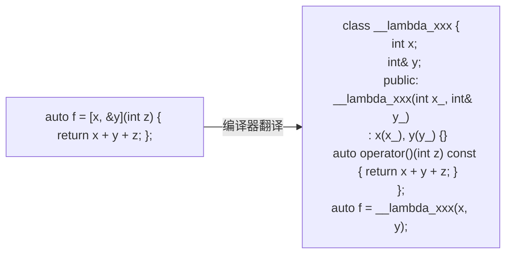
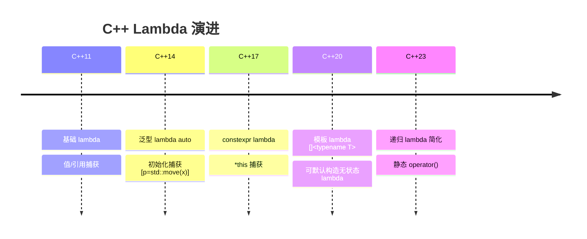

# Lambda 与函数式

#### 目录介绍
- [1. 引言](#1-引言)
- [2. Lambda的语法与本质](#2-lambda的语法与本质)
- [3. 捕获列表详解](#3-捕获列表详解)
- [4. 初始化捕获（C++14）](#4-初始化捕获c14)
- [5. 泛型Lambda（C++14）](#5-泛型lambdac14)
- [6. Lambda与std::function](#6-lambda与stdfunction)
- [7. 高阶函数与函数组合](#7-高阶函数与函数组合)
- [8. Lambda在STL中的应用](#8-lambda在stl中的应用)
- [9. Lambda与异步编程](#9-lambda与异步编程)
- [10. constexpr Lambda（C++17）](#10-constexpr-lambdac17)
- [11. 模板Lambda（C++20）](#11-模板lambdac20)
- [12. Lambda的陷阱与最佳实践](#12-lambda的陷阱与最佳实践)
- [13. 递归Lambda](#13-递归lambda)
- [14. IIFE模式](#14-iife模式)
- [15. 总结](#15-总结)
- [16. Lambda的编译器底层实现深度剖析](#十六lambda的编译器底层实现深度剖析)

> **案例引入｜"lambda 里的 this 居然失效了"**
>
> 异步任务代码：
>
> ```cpp
> class Handler {
>     int counter_ = 0;
> public:
>     void schedule() {
>         pool_.submit([=] {
>             std::this_thread::sleep_for(100ms);
>             ++counter_;                 // [=] 捕获的是 this！
>             std::cout << counter_;
>         });
>     }
> };
>
> // 某处：
> auto* h = new Handler();
> h->schedule();
> delete h;                               // ← 100ms 内被销毁
> // 100ms 后任务执行：++counter_ → 悬垂 this → BOOM
> ```
>
> 团队争论："`[=]` 捕获不是值拷贝吗？为什么还会悬垂？" 答案：`[=]` **只拷贝局部变量**；访问成员时捕获的是 `this` 指针（拷贝的是这个指针的**值**），原对象死了 `this` 就成了悬垂指针。C++17 新增的 `[*this]` 捕获就是为了解决这个坑。
>
> Lambda 看起来只是个"小语法糖"，底层却是编译器**自动生成一个匿名类 + `operator()`**——而**"捕获了什么、怎么存的"**正是这个匿名类的成员变量。搞懂底层，悬垂 lambda、递归 lambda、`std::function` 类型擦除这些"高级话题"都只是机械推论。

---

## 00.案例元信息

| 项目 | 说明 |
|------|------|
| 难度 | ★★★★☆ |
| 预估阅读 | 70 分钟 |
| 前置知识 | [03.类与对象机制](./03.类与对象机制.md)、[06.模板与泛型](./06.模板与泛型.md)、[10.右值与移动语义](./10.右值与移动语义.md) |
| 覆盖要点 | Lambda 编译器翻译、捕获方式（值/引用/移动/`*this`）、泛型 Lambda、`std::function` 类型擦除、constexpr lambda、模板 lambda |
| 核心产出 | 能"反编译"任意 lambda 为等价的仿函数类；能解释捕获悬垂、`mutable`、IIFE 等高级用法 |

---

## 1. 引言

Lambda 表达式是 C++11 最受欢迎的特性之一。它本质上是**编译器自动生成的匿名函数对象**——也就是一个只有 `operator()` 的类。你写的每一个 lambda，在编译器眼里都会变成这样一个"**闭包类型**"（closure type）。

### 1.1 Lambda 的编译期翻译



理解这个翻译后，所有 lambda 疑问都能"**回到类语法**"去解答：
- *捕获是啥*？→ 匿名类的成员变量
- *为什么 `mutable`*？→ `operator()` 默认是 `const`，要改成员必须加 `mutable` 去掉 const
- *泛型 lambda `[](auto x)` 怎么实现*？→ 编译器把 `operator()` 生成**模板**

### 1.2 Lambda 的五代演进



### 1.3 本文路线图


### 1.4 本文要回答的核心问题

- Lambda 到底是"函数"还是"对象"？它能不能被**拷贝/移动**？
- `[=]`、`[&]`、`[*this]` 三种捕获的**底层差异**是什么？
- 无捕获的 lambda 为什么能**隐式转成函数指针**？带捕获的为什么不能？
- `std::function` 比 lambda 慢——**具体慢在哪**？什么场景该退到它？
- 递归 lambda 在 C++11/14 需要"绕弯"（`std::function` / `y-combinator`）——C++23 又是怎么简化的？

---

## 2. Lambda的语法与本质

### 2.1 完整语法

```cpp
// Lambda完整语法：
// [捕获列表] (参数列表) mutable noexcept -> 返回类型 { 函数体 }

auto lambda = [](int a, int b) -> int {
    return a + b;
};

// 简化版本（返回类型自动推导）
auto add = [](int a, int b) { return a + b; };

// 无参数
auto greet = [] { std::cout << "Hello!\n"; };

// mutable：允许修改捕获的变量副本
int x = 10;
auto inc = [x]() mutable { return ++x; };
// 不加mutable，x的副本是const的

// noexcept
auto safe = [](int a) noexcept { return a * 2; };
```

### 2.2 Lambda的底层实现

**疑惑**：Lambda在编译器眼中是什么？

**答疑**：每个Lambda表达式，编译器都会生成一个唯一的匿名类。

```cpp
// 你写的Lambda：
auto lambda = [x, &y](int a) { return x + y + a; };

// 编译器生成的等价代码（概念上）：
class __lambda_unique_class {
    int x_;       // 值捕获 → 成员变量
    int& y_;      // 引用捕获 → 引用成员
    
public:
    __lambda_unique_class(int x, int& y) : x_(x), y_(y) {}
    
    int operator()(int a) const {  // const因为默认不可mutable
        return x_ + y_ + a;
    }
};

auto lambda = __lambda_unique_class(x, y);

// mutable lambda → operator()不是const
// 无捕获lambda → 空类，可以转换为函数指针
```

**论证**：验证Lambda的大小

```cpp
void lambda_size_demo() {
    int a = 1, b = 2, c = 3;
    
    auto l0 = [] {};                    // 空类
    auto l1 = [a] {};                   // 1个int
    auto l2 = [a, b] {};               // 2个int
    auto l3 = [a, b, c] {};            // 3个int
    auto l4 = [&a] {};                 // 1个引用（指针大小）
    auto l5 = [&a, &b, &c] {};        // 3个引用
    
    std::cout << sizeof(l0) << std::endl;  // 1 (空类最小1字节)
    std::cout << sizeof(l1) << std::endl;  // 4
    std::cout << sizeof(l2) << std::endl;  // 8
    std::cout << sizeof(l3) << std::endl;  // 12
    std::cout << sizeof(l4) << std::endl;  // 8 (64位指针)
    std::cout << sizeof(l5) << std::endl;  // 24
}
```

---

## 3. 捕获机制详解

### 3.1 捕获列表的各种形式

```cpp
int a = 1, b = 2, c = 3;

// 1. 值捕获
auto f1 = [a] { return a; };           // 捕获a的副本

// 2. 引用捕获
auto f2 = [&a] { a++; };              // 捕获a的引用

// 3. 全部值捕获
auto f3 = [=] { return a + b + c; };  // 捕获所有使用到的变量的副本

// 4. 全部引用捕获
auto f4 = [&] { a++; b++; c++; };     // 捕获所有使用到的变量的引用

// 5. 混合捕获
auto f5 = [=, &a] { a++; return b; }; // a引用捕获，其余值捕获
auto f6 = [&, a] { b++; return a; };  // a值捕获，其余引用捕获

// 6. 初始化捕获（C++14）
auto f7 = [x = a + b] { return x; };  // 创建新变量x
auto f8 = [ptr = std::make_unique<int>(42)] {
    return *ptr;
};
// 可以捕获只移动类型！

// 7. *this捕获（C++17）
struct Widget {
    int value = 42;
    auto get_lambda() {
        return [*this] { return value; };  // 捕获this所指对象的副本
        // vs [this] { return value; } — 捕获this指针（可能悬垂）
    }
};
```

### 3.2 捕获的陷阱

```cpp
// 陷阱1：悬垂引用
std::function<int()> make_counter() {
    int count = 0;
    return [&count]() { return ++count; };
    // count在函数返回后销毁！lambda持有悬垂引用！
}

// 正确做法：值捕获或初始化捕获
std::function<int()> make_counter_safe() {
    int count = 0;
    return [count]() mutable { return ++count; };
}

// 陷阱2：捕获this的悬垂
class Widget {
    int data_ = 42;
public:
    auto bad_lambda() {
        return [this] { return data_; };
        // 如果Widget对象被销毁，this悬垂
    }
    
    auto safe_lambda() {
        return [*this] { return data_; };  // C++17: 捕获副本
    }
    
    auto safe_lambda_14() {
        return [data = data_] { return data; };  // C++14: 显式捕获成员
    }
};

// 陷阱3：循环中的捕获
void capture_in_loop() {
    std::vector<std::function<int()>> funcs;
    for (int i = 0; i < 5; i++) {
        funcs.push_back([&i] { return i; });  // 所有lambda共享同一个i的引用
    }
    for (auto& f : funcs) {
        std::cout << f() << " ";  // 全是5！（循环结束后i=5）
    }
    
    // 正确：值捕获
    funcs.clear();
    for (int i = 0; i < 5; i++) {
        funcs.push_back([i] { return i; });  // 每个lambda有自己的i副本
    }
    for (auto& f : funcs) {
        std::cout << f() << " ";  // 0 1 2 3 4
    }
}
```

---

## 4. 泛型Lambda（C++14）

```cpp
// C++14: auto参数
auto generic_add = [](auto a, auto b) { return a + b; };

// 编译器生成：
// struct __lambda {
//     template<typename T, typename U>
//     auto operator()(T a, U b) const { return a + b; }
// };

void generic_lambda_demo() {
    std::cout << generic_add(1, 2) << std::endl;       // int + int = 3
    std::cout << generic_add(1.5, 2.5) << std::endl;   // double + double = 4.0
    std::cout << generic_add(std::string("hello"), " world") << std::endl;
}

// C++20: 模板lambda
auto template_lambda = []<typename T>(std::vector<T>& vec, const T& val) {
    vec.push_back(val);
};

// C++20: 带约束的模板lambda
auto constrained_lambda = []<std::integral T>(T x) {
    return x * 2;
};
```

---

## 5. Lambda的高级应用

### 5.1 立即调用的Lambda表达式(IIFE)

```cpp
// 用于复杂初始化
const auto config = [&] {
    Config cfg;
    cfg.host = getenv("HOST") ? getenv("HOST") : "localhost";
    cfg.port = getenv("PORT") ? std::stoi(getenv("PORT")) : 8080;
    cfg.debug = false;
    return cfg;
}();  // 注意末尾的()表示立即调用

// 用于条件性const初始化
const int value = [&] {
    if (condition_a) return compute_a();
    if (condition_b) return compute_b();
    return default_value;
}();
```

### 5.2 递归Lambda

```cpp
// 方式1：使用std::function（有运行时开销）
std::function<int(int)> factorial = [&factorial](int n) -> int {
    return n <= 1 ? 1 : n * factorial(n - 1);
};

// 方式2：传递自身引用（C++14，零开销）
auto factorial_v2 = [](auto& self, int n) -> int {
    return n <= 1 ? 1 : n * self(self, n - 1);
};
int result = factorial_v2(factorial_v2, 5);  // 120

// 方式3：C++23 deducing this
// auto factorial_v3 = [](this auto& self, int n) -> int {
//     return n <= 1 ? 1 : n * self(n - 1);
// };
```

### 5.3 函数式编程模式

```cpp
#include <functional>
#include <vector>
#include <algorithm>
#include <numeric>

// 高阶函数：接受或返回函数的函数

// 函数组合
template<typename F, typename G>
auto compose(F f, G g) {
    return [f, g](auto&&... args) {
        return f(g(std::forward<decltype(args)>(args)...));
    };
}

// 柯里化
auto curry_add = [](int a) {
    return [a](int b) {
        return a + b;
    };
};

// 管道操作
template<typename T, typename F>
auto operator|(T&& val, F&& func) {
    return std::forward<F>(func)(std::forward<T>(val));
}

void functional_demo() {
    // 函数组合
    auto double_it = [](int x) { return x * 2; };
    auto add_one = [](int x) { return x + 1; };
    auto double_then_add = compose(add_one, double_it);
    std::cout << double_then_add(5) << std::endl;  // 11
    
    // 柯里化
    auto add5 = curry_add(5);
    std::cout << add5(3) << std::endl;  // 8
    
    // map-filter-reduce模式
    std::vector<int> nums = {1, 2, 3, 4, 5, 6, 7, 8, 9, 10};
    
    // C++20 Ranges风格
    // auto result = nums
    //     | std::views::filter([](int x) { return x % 2 == 0; })
    //     | std::views::transform([](int x) { return x * x; });
    
    // 传统STL风格
    std::vector<int> evens;
    std::copy_if(nums.begin(), nums.end(), std::back_inserter(evens),
        [](int x) { return x % 2 == 0; });
    
    std::vector<int> squares;
    std::transform(evens.begin(), evens.end(), std::back_inserter(squares),
        [](int x) { return x * x; });
    
    int sum = std::accumulate(squares.begin(), squares.end(), 0);
    std::cout << "Sum of squares of evens: " << sum << std::endl;  // 220
}
```

---

## 6. Lambda vs std::function vs 函数指针

### 6.1 性能对比

```cpp
#include <functional>
#include <chrono>

// 函数指针
int add_func(int a, int b) { return a + b; }

void performance_comparison() {
    const int N = 100000000;
    
    // 1. Lambda（可以内联）
    auto lambda = [](int a, int b) { return a + b; };
    
    // 2. std::function（类型擦除，不能内联）
    std::function<int(int, int)> func = [](int a, int b) { return a + b; };
    
    // 3. 函数指针
    int (*fp)(int, int) = add_func;
    
    auto bench = [&](auto callable, const char* name) {
        auto start = std::chrono::high_resolution_clock::now();
        volatile int sum = 0;
        for (int i = 0; i < N; i++) {
            sum += callable(i, 1);
        }
        auto end = std::chrono::high_resolution_clock::now();
        auto ms = std::chrono::duration_cast<std::chrono::milliseconds>(end - start);
        std::cout << name << ": " << ms.count() << " ms\n";
    };
    
    bench(lambda, "Lambda");        // 最快（内联）
    bench(func, "std::function");   // 最慢（间接调用）
    bench(fp, "Function pointer");  // 中等（间接但简单）
}
```

### 6.2 选择策略

```
Lambda vs std::function vs 函数指针：
┌─────────────────┬───────────┬────────────┬─────────────┐
│                 │ Lambda    │ std::func  │ 函数指针     │
├─────────────────┼───────────┼────────────┼─────────────┤
│ 可内联          │ ✓         │ ✗          │ 通常不       │
│ 有状态          │ ✓(捕获)   │ ✓          │ ✗            │
│ 类型擦除        │ ✗(独特类型)│ ✓          │ ✓            │
│ 堆分配          │ ✗         │ 可能       │ ✗            │
│ 存储在容器中    │ 需type erase│ ✓         │ ✓(无状态)    │
│ C接口兼容       │ 无捕获时✓ │ ✗          │ ✓            │
│ 性能            │ 最好      │ 最差       │ 好           │
└─────────────────┴───────────┴────────────┴─────────────┘

建议：
- 模板参数 → 直接用Lambda（最高性能）
- 需要存储 → std::function
- C接口 → 无捕获Lambda或函数指针
```

---

## 7. Lambda在设计模式中的应用

### 7.1 策略模式

```cpp
class Sorter {
    std::function<bool(int, int)> comparator_;
public:
    Sorter(std::function<bool(int, int)> cmp) : comparator_(std::move(cmp)) {}
    
    void sort(std::vector<int>& data) {
        std::sort(data.begin(), data.end(), comparator_);
    }
};

void strategy_pattern() {
    std::vector<int> data = {5, 3, 1, 4, 2};
    
    Sorter ascending([](int a, int b) { return a < b; });
    Sorter descending([](int a, int b) { return a > b; });
    Sorter by_last_digit([](int a, int b) { return a % 10 < b % 10; });
    
    ascending.sort(data);   // 1 2 3 4 5
    descending.sort(data);  // 5 4 3 2 1
}
```

### 7.2 命令模式

```cpp
class CommandQueue {
    std::vector<std::function<void()>> commands_;
public:
    void add(std::function<void()> cmd) {
        commands_.push_back(std::move(cmd));
    }
    
    void execute_all() {
        for (auto& cmd : commands_) cmd();
        commands_.clear();
    }
};

void command_pattern() {
    CommandQueue queue;
    int x = 0;
    
    queue.add([&x] { x += 10; });
    queue.add([&x] { x *= 2; });
    queue.add([&x] { std::cout << "x = " << x << std::endl; });
    
    queue.execute_all();  // x = 20
}
```

### 7.3 惰性求值

```cpp
template<typename F>
class Lazy {
    mutable std::optional<std::invoke_result_t<F>> value_;
    F func_;
public:
    explicit Lazy(F f) : func_(std::move(f)) {}
    
    auto& get() const {
        if (!value_) {
            value_ = func_();  // 第一次访问时才计算
        }
        return *value_;
    }
};

void lazy_eval_demo() {
    Lazy expensive([] {
        std::cout << "Computing...\n";
        return 42;
    });
    
    // 此时还没有计算
    std::cout << "Before access\n";
    std::cout << expensive.get() << std::endl;  // "Computing..." + "42"
    std::cout << expensive.get() << std::endl;  // "42"（使用缓存）
}
```

---

## 8. constexpr Lambda（C++17）

```cpp
// C++17: Lambda可以是constexpr的
constexpr auto square = [](int x) { return x * x; };
static_assert(square(5) == 25);

// C++17: 编译期排序（概念演示）
constexpr auto compile_time_max = [](int a, int b) constexpr {
    return a > b ? a : b;
};
static_assert(compile_time_max(3, 5) == 5);

// C++20: 在constexpr上下文中使用更多Lambda特性
constexpr auto fib = [](int n) constexpr {
    int a = 0, b = 1;
    for (int i = 0; i < n; i++) {
        int t = a + b;
        a = b;
        b = t;
    }
    return a;
};
static_assert(fib(10) == 55);
```

---

## 9. 无状态Lambda与函数指针转换

```cpp
// 无捕获的Lambda可以转换为函数指针
void no_capture_conversion() {
    auto lambda = [](int x) { return x * 2; };
    
    // 自动转换
    int (*fp)(int) = lambda;
    std::cout << fp(21) << std::endl;  // 42
    
    // 在C API中使用
    // qsort(arr, n, sizeof(int), [](const void* a, const void* b) -> int {
    //     return *(int*)a - *(int*)b;
    // });
    
    // C++20: 无状态Lambda可以默认构造
    using Cmp = decltype([](int a, int b) { return a < b; });
    std::set<int, Cmp> s;  // C++20之前不行
}
```

---

## 10. 总结

### 10.1 Lambda知识图谱

```
Lambda表达式
├── 语法: [捕获](参数) mutable noexcept -> 返回类型 { 体 }
├── 本质: 编译器生成的匿名仿函数类
├── 捕获
│   ├── 值捕获 [x]: 拷贝
│   ├── 引用捕获 [&x]: 引用
│   ├── 默认捕获 [=]/[&]
│   ├── 初始化捕获 [x=expr] (C++14)
│   ├── *this捕获 (C++17)
│   └── 陷阱: 悬垂引用、循环变量
├── 泛型Lambda (C++14): auto参数
├── 模板Lambda (C++20): []<typename T>
├── constexpr Lambda (C++17)
├── Lambda vs std::function vs 函数指针
│   ├── Lambda: 最快，可内联
│   ├── std::function: 最灵活，有开销
│   └── 函数指针: C兼容，无状态
└── 应用
    ├── STL算法的谓词
    ├── 回调函数
    ├── 策略/命令模式
    ├── IIFE复杂初始化
    ├── 递归Lambda
    └── 惰性求值
```

Lambda是现代C++的基石特性。它使C++代码更简洁、更表达力强，同时保持了C++一贯的零开销抽象原则。

---

## 十一、Lambda的底层编译原理

### 11.1 Lambda到仿函数的转换

```cpp
// 源代码
auto add = [x = 10](int y) { return x + y; };
int result = add(5);  // 15

// 编译器生成的等价代码（简化）
class __lambda_add {
    int x;  // 捕获的变量成为成员变量
public:
    __lambda_add(int x) : x(x) {}
    
    int operator()(int y) const {  // 默认const
        return x + y;
    }
};

auto add = __lambda_add(10);
int result = add(5);
```

### 11.2 mutable Lambda的原理

```cpp
// 普通Lambda: operator()是const的，不能修改捕获的值
auto counter = [count = 0]() mutable {
    return ++count;  // mutable使operator()非const
};

// 编译器生成
class __lambda_counter {
    int count;
public:
    __lambda_counter(int c) : count(c) {}
    
    int operator()() {  // 注意：没有const！
        return ++count;
    }
};
```

### 11.3 无捕获Lambda到函数指针的转换

```cpp
// 无捕获的Lambda可以隐式转换为函数指针
auto square = [](int x) { return x * x; };

// 编译器额外生成一个static成员函数
class __lambda_square {
public:
    int operator()(int x) const { return x * x; }
    
    // 自动生成的转换运算符
    static int __invoke(int x) { return x * x; }
    
    using FuncPtr = int(*)(int);
    operator FuncPtr() const { return &__invoke; }
};

// 因此可以赋值给函数指针
int (*fp)(int) = square;  // OK

// 有捕获的Lambda不能转换为函数指针
int y = 10;
auto add_y = [y](int x) { return x + y; };
// int (*fp2)(int) = add_y;  // 编译错误！
```

---

## 十二、Lambda在STL中的高级应用

### 12.1 自定义排序与容器比较器

```cpp
#include <set>
#include <map>
#include <algorithm>
#include <vector>
#include <string>

// 自定义排序
std::vector<std::string> words = {"banana", "apple", "cherry", "date"};
std::sort(words.begin(), words.end(), [](const auto& a, const auto& b) {
    return a.size() < b.size();  // 按长度排序
});

// Lambda作为容器比较器（C++20）
auto cmp = [](const auto& a, const auto& b) { return a.size() < b.size(); };
std::set<std::string, decltype(cmp)> sorted_set(cmp);

// C++20更简洁
std::set<std::string, decltype([](const auto& a, const auto& b) {
    return a.size() < b.size();
})> sorted_set2;
```

### 12.2 复杂的STL算法组合

```cpp
#include <numeric>

struct Employee {
    std::string name;
    std::string department;
    double salary;
};

std::vector<Employee> employees = {
    {"Alice", "Engineering", 120000},
    {"Bob", "Marketing", 80000},
    {"Charlie", "Engineering", 150000},
    {"Diana", "Marketing", 90000},
    {"Eve", "Engineering", 130000}
};

// 找到工程部门薪资最高的员工
auto it = std::max_element(employees.begin(), employees.end(),
    [](const Employee& a, const Employee& b) {
        if (a.department != "Engineering") return true;
        if (b.department != "Engineering") return false;
        return a.salary < b.salary;
    });

// 统计工程部门总薪资
double total = std::accumulate(employees.begin(), employees.end(), 0.0,
    [](double sum, const Employee& e) {
        return e.department == "Engineering" ? sum + e.salary : sum;
    });

// 分区：工程部门移到前面
auto partition_point = std::partition(employees.begin(), employees.end(),
    [](const Employee& e) { return e.department == "Engineering"; });
```

---

## 十三、函数式编程模式

### 13.1 高阶函数

```cpp
#include <functional>

// 返回Lambda的函数（函数工厂）
auto make_multiplier(int factor) {
    return [factor](int x) { return x * factor; }; 
}

auto double_it = make_multiplier(2);
auto triple_it = make_multiplier(3);

std::cout << double_it(5) << std::endl;  // 10
std::cout << triple_it(5) << std::endl;  // 15

// 函数组合
template<typename F, typename G>
auto compose(F f, G g) {
    return [f, g](auto&&... args) {
        return f(g(std::forward<decltype(args)>(args)...));
    };
}

auto add_one = [](int x) { return x + 1; };
auto square = [](int x) { return x * x; };
auto square_then_add = compose(add_one, square);  // (x²) + 1
std::cout << square_then_add(4) << std::endl;  // 17
```

### 13.2 柯里化（Currying）

```cpp
// 将多参数函数转换为一系列单参数函数
auto curry_add = [](int a) {
    return [a](int b) {
        return [a, b](int c) {
            return a + b + c;
        };
    };
};

int result = curry_add(1)(2)(3);  // 6

// 部分应用
auto add_1_2 = curry_add(1)(2);
int r = add_1_2(10);  // 13

// 通用柯里化辅助
template<typename Func, typename... Args>
auto partial(Func f, Args... args) {
    return [f, ...args = std::move(args)](auto&&... rest) {
        return f(args..., std::forward<decltype(rest)>(rest)...);
    };
}

auto add3 = [](int a, int b, int c) { return a + b + c; };
auto add3_with_1 = partial(add3, 1);
auto add3_with_1_2 = partial(add3, 1, 2);
std::cout << add3_with_1(2, 3) << std::endl;    // 6
std::cout << add3_with_1_2(3) << std::endl;      // 6
```

### 13.3 IIFE（立即调用的函数表达式）

```cpp
// 用于复杂的const初始化
const auto config = [&]() {
    Config c;
    c.width = parse_int(argv[1]);
    c.height = parse_int(argv[2]);
    if (c.width > 1920) c.width = 1920;
    if (c.height > 1080) c.height = 1080;
    return c;
}();  // 立即调用

// 在条件表达式中
const std::string message = [&]() -> std::string {
    switch (error_code) {
        case 0: return "Success";
        case 1: return "File not found";
        case 2: return "Permission denied";
        default: return "Unknown error";
    }
}();
```

---

## 十四、Lambda vs std::function vs 函数指针性能

### 14.1 性能对比

```cpp
#include <chrono>
#include <functional>

// 直接Lambda调用（最快——可以内联）
auto lambda = [](int x) { return x * 2; };

// std::function（最慢——类型擦除、可能堆分配）
std::function<int(int)> func = [](int x) { return x * 2; };

// 函数指针（中等——间接调用但无擦除开销）
int (*fptr)(int) = [](int x) { return x * 2; };

void benchmark() {
    const int N = 100'000'000;
    volatile int sink;
    
    auto t1 = std::chrono::high_resolution_clock::now();
    for (int i = 0; i < N; ++i) sink = lambda(i);
    auto t2 = std::chrono::high_resolution_clock::now();
    
    auto t3 = std::chrono::high_resolution_clock::now();
    for (int i = 0; i < N; ++i) sink = func(i);
    auto t4 = std::chrono::high_resolution_clock::now();
    
    auto t5 = std::chrono::high_resolution_clock::now();
    for (int i = 0; i < N; ++i) sink = fptr(i);
    auto t6 = std::chrono::high_resolution_clock::now();
    
    // 典型结果:
    // Lambda:    ~50ms  (可内联)
    // 函数指针:  ~200ms (间接调用)
    // std::function: ~300ms (类型擦除开销)
}
```

### 14.2 选择建议

```
┌────────────────────┬──────────────────────────────────┐
│ 使用Lambda          │ 性能关键路径、STL算法、模板参数    │
│ 使用std::function   │ 需要存储异构可调用对象的场景       │
│                    │ 回调注册、事件系统、命令模式        │
│ 使用函数指针        │ 与C API交互、无捕获的简单回调      │
│ 使用模板参数        │ 最灵活最高效：template<typename F> │
└────────────────────┴──────────────────────────────────┘
```

---

## 十五、面试高频问题

1. **Lambda的本质是什么？** 编译器生成的匿名仿函数类，捕获的变量成为成员变量，函数体是operator()。

2. **值捕获和引用捕获的区别？** 值捕获拷贝一份副本（默认const），引用捕获直接引用外部变量（需注意悬垂引用）。

3. **Lambda能转为函数指针吗？** 无捕获的Lambda可以，编译器自动生成转换运算符。有捕获的不行。

4. **std::function的开销是什么？** 类型擦除（虚函数或函数指针间接调用）+ 可能的堆内存分配（SBO可缓解小对象）。

5. **什么是IIFE？** 立即调用的函数表达式 `[&](){...}()`，常用于const变量的复杂初始化。

---

## 十六、Lambda的编译器底层实现深度剖析

### 16.1 编译器生成闭包类的完整结构

Lambda表达式在编译器内部被转换为一个完整的闭包类。以Clang/GCC为例，分析其生成的具体结构：

```cpp
// 源代码
int x = 10;
auto f = [x](int y) mutable -> int { return x += y; };

// 编译器生成的等价类（简化后的Clang AST表示）
class __lambda_line5_col10 {
    int __x;  // 值捕获的成员
public:
    __lambda_line5_col10(int x) : __x(x) {}
    
    int operator()(int y) {  // mutable → 非const
        return __x += y;
    }
    
    // 隐式生成的特殊成员函数
    __lambda_line5_col10(const __lambda_line5_col10&) = default;
    __lambda_line5_col10(__lambda_line5_col10&&) = default;
    ~__lambda_line5_col10() = default;
};
```

编译器为每个Lambda生成的类名是唯一的（包含文件名、行号、列号信息），这就是为什么两个文本相同的Lambda也是不同类型：

```cpp
auto a = [](int x) { return x; };
auto b = [](int x) { return x; };
// decltype(a) != decltype(b)  // 永远是不同类型！
```

### 16.2 捕获列表的内存布局

编译器按照捕获声明的顺序排列成员，但会进行对齐优化：

```cpp
char c = 'a';
int i = 42;
double d = 3.14;
auto f = [c, i, d]() { /* ... */ };

// 闭包类内存布局（x86-64，8字节对齐）
// 偏移0:  char c     (1字节)
// 偏移1-3: padding   (3字节)
// 偏移4:  int i      (4字节)
// 偏移8:  double d   (8字节)
// 总大小: 16字节

// 对比引用捕获：
auto g = [&c, &i, &d]() { /* ... */ };
// 引用在底层实现为指针：
// 偏移0:  char* c_ref   (8字节)
// 偏移8:  int* i_ref    (8字节)
// 偏移16: double* d_ref (8字节)
// 总大小: 24字节 → 引用捕获可能占更多空间！
```

这揭示了一个重要的性能洞察：对于小类型（`int`, `char`等），值捕获可能比引用捕获更高效，因为指针本身占8字节，且间接访问有缓存不友好的问题。

### 16.3 无捕获Lambda到函数指针的转换原理

无捕获Lambda可以隐式转换为函数指针，编译器是如何实现这一"魔法"的？

```cpp
auto f = [](int x) -> int { return x * 2; };
int (*fp)(int) = f;  // 合法！

// 编译器生成的闭包类包含：
class __lambda {
public:
    int operator()(int x) const { return x * 2; }
    
    // 编译器额外生成的转换运算符
    using FuncPtr = int(*)(int);
    operator FuncPtr() const {
        return &__invoke;  // 返回静态函数指针
    }
    
private:
    // 编译器生成的静态函数（与operator()逻辑相同）
    static int __invoke(int x) {
        return x * 2;  // 不需要this，因为无捕获
    }
};
```

关键点：编译器生成了一个**静态成员函数** `__invoke`，它的签名与函数指针完全匹配。由于Lambda没有捕获任何变量，`operator()`不依赖`this`指针，因此可以安全地通过静态函数调用。

### 16.4 std::function的类型擦除与SBO优化

`std::function`的核心挑战是：如何用统一类型存储任意可调用对象？答案是**类型擦除**：

```cpp
// std::function的简化内部结构（以libstdc++为参考）
template<typename R, typename... Args>
class function<R(Args...)> {
    // 小缓冲优化（SBO）：避免小对象的堆分配
    static constexpr size_t SBO_SIZE = 16;  // GCC: 16字节
    
    union Storage {
        void* heap_ptr;                      // 大对象：堆指针
        alignas(max_align_t) char buf[SBO_SIZE]; // 小对象：栈缓冲
    } storage_;
    
    // 虚函数表指针（类型擦除的核心）
    struct VTable {
        R (*invoke)(Storage&, Args...);      // 调用
        void (*destroy)(Storage&);           // 析构
        void (*copy)(Storage&, const Storage&); // 拷贝
    };
    const VTable* vtable_;
    
    // 调用时：
    R operator()(Args... args) {
        return vtable_->invoke(storage_, std::forward<Args>(args)...);
        // 间接调用 → 无法内联 → 性能损失的根源
    }
};
```

**SBO（Small Buffer Optimization）** 的判定条件：

```
sizeof(Callable) <= SBO_SIZE && alignof(Callable) <= alignof(max_align_t)
  → 存放在栈缓冲区（无堆分配）
否则
  → new分配堆内存
```

无捕获Lambda大小通常为1字节，少量捕获的Lambda通常也在16字节以内，因此大多数情况下SBO能生效。但`std::function`的调用仍然需要通过函数指针间接调用，这是比Lambda直接内联更大的性能损失来源。

---

> Lambda表达式将函数式编程的核心理念带入了C++，使得高阶函数、闭包、惰性求值等模式成为日常工具，同时保持了C++零开销抽象的承诺。理解Lambda的编译器实现细节，能帮助我们在性能敏感的场景中做出更明智的设计决策。
