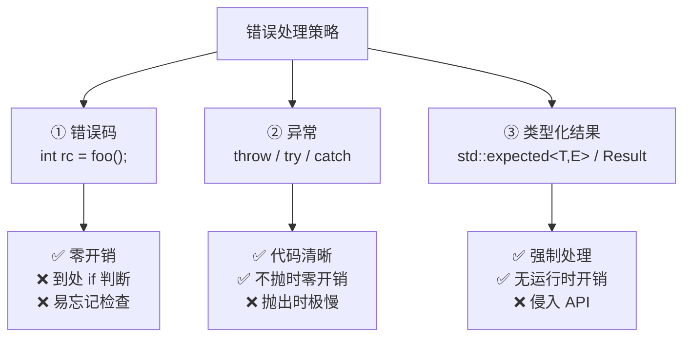
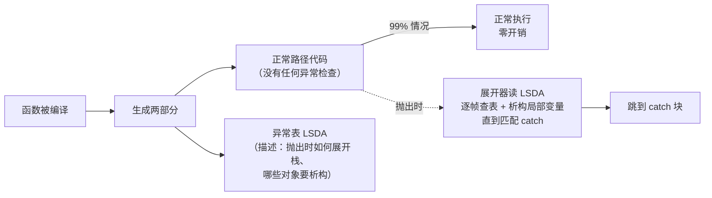

# 第12章：C++ 异常与错误处理

#### 目录介绍
- [引言](#引言)
- [2. 从C到C++：错误处理的演变](#一从c到c错误处理的演变)
- [3. 异常机制基础](#二异常机制基础)
- [4. 异常的底层实现原理](#三异常的底层实现原理)
- [5. 栈展开（Stack Unwinding）](#四栈展开stack-unwinding)
- [6. noexcept规范](#五noexcept规范)
- [7. 异常安全](#六异常安全)
- [8. 异常的性能分析](#七异常的性能分析)
- [9. 现代C++错误处理策略](#八现代c错误处理策略)
- [10. 异常使用的争议与指南](#九异常使用的争议与指南)
- [11. 异常与析构函数](#十异常与析构函数)
- [12. 异常与多线程](#十一异常与多线程)
- [13. 编译器对异常的优化](#十二编译器对异常的优化)
- [14. 实战：完整的错误处理框架](#十三实战完整的错误处理框架)
- [15. 常见异常编程错误](#十四常见异常编程错误)
- [16. 总结与最佳实践](#十五总结与最佳实践)

---

> **案例引入｜"加了一个 try/catch，性能居然没掉"**
>
> 资深架构师和新人的经典争论：
>
> - 新人："异常很慢，能不用就不用。"
> - 架构师："现代 C++ 的异常在**不抛出**时几乎零开销，你这是上世纪的印象。"
>
> 两人跑 benchmark——**不抛出时** `try/catch` 版本和返回错误码版本性能几乎无差别（差 <1%）；但**抛出时**异常版本慢了 **50 倍**。结论很反直觉：
>
> | 路径 | 错误码 | 异常 |
> |------|--------|------|
> | 正常路径 | 每次判断 `if (ret)` | 零开销 |
> | 错误路径 | `if (ret) return` 一下 | 极慢（查表+栈展开+RTTI） |
>
> 这就是现代 C++ 异常的**"零成本异常模型"**（zero-cost exception model）——编译器在编译时为每个函数生成一张"**异常表**"（LSDA），正常执行时根本不访问它；只有抛出时才去查表、执行栈展开。
>
> 本文要把这套机制**从 C 错误码开始**完整讲透，包括为什么 Google C++ Style 禁用异常、`noexcept` 到底省了什么、以及 C++23 引入的 `std::expected` 是什么"现代替代方案"。

---

## 00.案例元信息

| 项目 | 说明 |
|------|------|
| 难度 | ★★★★★ |
| 预估阅读 | 90 分钟 |
| 前置知识 | [09.智能指针与RAII](./09.智能指针与RAII.md)、[04.对象生命周期](./04.对象生命周期.md) |
| 覆盖要点 | C 错误码、异常基础、零成本异常模型、栈展开、`noexcept`、异常安全三级、`std::expected`/`std::optional`、析构异常、多线程异常 |
| 核心产出 | 能写出"强异常保证"的代码；能根据场景选错误码/异常/`expected` 三套方案 |

---

## 1. 引言

错误处理是软件工程最具挑战性的课题之一。C++ 提供了**异常**作为主要错误处理机制，但围绕它的争论从未停止：**什么时候该用**？**开销多大**？**底层怎么实现**？

本文从 C 的错误处理方式讲起，逐步推出 C++ 异常的**设计哲学**、**底层原理**（Itanium C++ ABI 的两阶段栈展开），再延伸到现代 C++ 的错误处理最佳实践。

### 1.1 三种错误处理模型对比



### 1.2 C++ 异常的"零成本"设计



**关键权衡**：**正常路径零开销**（编译后的机器码和没 try/catch 的版本**完全一样**）；代价是**抛出路径极慢**（需要读表、展开、匹配、RTTI）。这就是为什么异常**只应该用于真正异常的情况**，而不是普通控制流。

### 1.3 本文路线图


### 1.4 本文要回答的核心问题

- C++ 异常的"**零成本**"模型是如何实现的？异常表（LSDA）放在哪？
- `throw X()` 到 `catch (...)` 中间**执行了多少步**？
- `noexcept` 标记**具体省了什么**？为什么 `vector` 扩容时会"挑"`noexcept` 的移动构造？
- "**强异常保证**"的 copy-and-swap 模式，为什么能保证原子性？
- `std::expected<T, E>`（C++23）相比异常好在哪、差在哪？

---

## 2. 从 C 到 C++：错误处理的演变

### 2.1 C 语言的错误处理方式

C语言没有异常机制，常见的错误处理方式有以下几种：

**返回错误码**：

```c
// 方式一：返回错误码
int open_file(const char* filename, FILE** out) {
    *out = fopen(filename, "r");
    if (*out == NULL) {
        return -1;  // 错误
    }
    return 0;  // 成功
}

// 调用方必须检查返回值
int main() {
    FILE* fp;
    if (open_file("test.txt", &fp) != 0) {
        fprintf(stderr, "Failed to open file\n");
        return 1;
    }
    // 使用 fp...
    fclose(fp);
    return 0;
}
```

**全局errno**：

```c
#include <errno.h>
#include <string.h>

FILE* fp = fopen("nonexistent.txt", "r");
if (fp == NULL) {
    printf("Error: %s (errno=%d)\n", strerror(errno), errno);
}
```

**setjmp/longjmp**：

```c
#include <setjmp.h>

jmp_buf jump_buffer;

void dangerous_function() {
    // 发生错误时跳转
    longjmp(jump_buffer, 1);
}

int main() {
    if (setjmp(jump_buffer) == 0) {
        // 正常路径
        dangerous_function();
    } else {
        // 错误处理路径
        printf("An error occurred!\n");
    }
    return 0;
}
```

### 1.2 C语言错误处理的问题

```
问题一：错误码容易被忽略
    int result = some_function();  // 忘记检查返回值
    // 程序继续执行，但状态已经不一致

问题二：错误传播需要层层转发
    int func_a() {
        int ret = func_b();
        if (ret != 0) return ret;  // 转发
        ret = func_c();
        if (ret != 0) return ret;  // 转发
        return 0;
    }

问题三：setjmp/longjmp不会调用析构函数
    void foo() {
        std::string s = "hello";  // C++对象
        longjmp(buf, 1);          // s的析构函数不会被调用！
    }

问题四：构造函数没有返回值
    class File {
        File(const char* name) {
            fp_ = fopen(name, "r");
            // 如果失败，怎么告知调用方？
            // 没有返回值可用！
        }
    };
```

### 2.3 C++ 异常的设计目标

C++异常机制的设计解决了上述所有问题：

| 问题 | C错误码 | C++异常 |
|------|---------|---------|
| 可忽略性 | 容易被忽略 | 不能被忽略（不处理就终止） |
| 传播方式 | 需要手动层层转发 | 自动沿调用栈传播 |
| 资源清理 | 需要手动管理 | 自动调用析构函数（栈展开） |
| 构造函数报错 | 无法报告 | 可以抛出异常 |
| 返回值通道 | 被错误码占用 | 返回值保持纯净 |

---

## 3. 异常机制基础

### 2.1 try-catch-throw语法

```cpp
#include <iostream>
#include <stdexcept>

double divide(double a, double b) {
    if (b == 0.0) {
        throw std::invalid_argument("Division by zero");
    }
    return a / b;
}

int main() {
    try {
        double result = divide(10.0, 0.0);
        std::cout << "Result: " << result << std::endl;
    }
    catch (const std::invalid_argument& e) {
        std::cerr << "Invalid argument: " << e.what() << std::endl;
    }
    catch (const std::exception& e) {
        std::cerr << "Exception: " << e.what() << std::endl;
    }
    catch (...) {
        std::cerr << "Unknown exception" << std::endl;
    }
    return 0;
}
```

### 2.2 异常的抛出与捕获规则

**抛出规则**：

```cpp
// 可以抛出任何类型
throw 42;                          // int
throw "error";                     // const char*
throw std::runtime_error("msg");   // 标准异常对象
throw MyException();               // 自定义异常

// 抛出时会创建异常对象的副本
void foo() {
    std::runtime_error e("local error");
    throw e;  // 复制e到异常存储区
    // 也可以: throw std::runtime_error("local error");
}
```

**捕获规则**：

```cpp
// 按照从上到下的顺序匹配
try {
    throw std::runtime_error("test");
}
catch (const std::runtime_error& e) {
    // 精确匹配，优先捕获
}
catch (const std::exception& e) {
    // 基类匹配，次优先
}
catch (...) {
    // 捕获任何异常，最后兜底
}

// 注意：派生类catch必须放在基类catch前面
// 否则编译器会警告（派生类的catch永远不会执行）
```

**重新抛出**：

```cpp
void process() {
    try {
        risky_operation();
    }
    catch (const std::exception& e) {
        log_error(e.what());
        throw;  // 重新抛出当前异常（保持原始类型）
        // 注意：throw e; 会切片为std::exception！
    }
}
```

### 2.3 标准异常层次结构

```
std::exception
├── std::logic_error               // 程序逻辑错误
│   ├── std::invalid_argument      // 无效参数
│   ├── std::domain_error          // 域错误
│   ├── std::length_error          // 长度错误
│   ├── std::out_of_range          // 越界访问
│   └── std::future_error (C++11)  // future错误
├── std::runtime_error             // 运行时错误
│   ├── std::range_error           // 范围错误
│   ├── std::overflow_error        // 溢出错误
│   ├── std::underflow_error       // 下溢错误
│   ├── std::regex_error (C++11)   // 正则错误
│   └── std::system_error (C++11)  // 系统错误
│       └── std::ios_base::failure // IO错误
├── std::bad_alloc                 // new分配失败
│   └── std::bad_array_new_length  // 数组new失败
├── std::bad_cast                  // dynamic_cast失败
├── std::bad_typeid                // typeid空指针
├── std::bad_exception             // 意外异常
├── std::bad_function_call (C++11) // function调用失败
└── std::bad_weak_ptr (C++11)      // weak_ptr错误
```

### 2.4 自定义异常类

```cpp
#include <exception>
#include <string>
#include <sstream>

// 基础自定义异常
class AppException : public std::exception {
public:
    AppException(const std::string& msg, 
                 const char* file, int line)
        : message_(msg), file_(file), line_(line) 
    {
        std::ostringstream oss;
        oss << file_ << ":" << line_ << ": " << message_;
        full_message_ = oss.str();
    }
    
    const char* what() const noexcept override {
        return full_message_.c_str();
    }
    
    const std::string& message() const { return message_; }
    const char* file() const { return file_; }
    int line() const { return line_; }
    
private:
    std::string message_;
    const char* file_;
    int line_;
    std::string full_message_;
};

// 便捷宏
#define THROW_APP(msg) throw AppException(msg, __FILE__, __LINE__)

// 派生特定异常
class NetworkException : public AppException {
public:
    NetworkException(const std::string& msg, int error_code,
                     const char* file, int line)
        : AppException(msg, file, line), error_code_(error_code) {}
    
    int error_code() const { return error_code_; }
    
private:
    int error_code_;
};

class DatabaseException : public AppException {
public:
    DatabaseException(const std::string& msg, 
                      const std::string& query,
                      const char* file, int line)
        : AppException(msg, file, line), query_(query) {}
    
    const std::string& query() const { return query_; }
    
private:
    std::string query_;
};

// 使用
void connect_to_server() {
    // ...
    throw NetworkException("Connection refused", ECONNREFUSED,
                          __FILE__, __LINE__);
}

int main() {
    try {
        connect_to_server();
    }
    catch (const NetworkException& e) {
        std::cerr << "Network error [" << e.error_code() 
                  << "]: " << e.what() << std::endl;
    }
    catch (const AppException& e) {
        std::cerr << "App error: " << e.what() << std::endl;
    }
}
```

---

## 4. 异常的底层实现原理

### 3.1 两种实现方式

C++异常有两种主流的底层实现方式：

**方式一：setjmp/longjmp方式（SJLJ）**

```
原理：
1. 每个try块对应一次setjmp调用，保存当前寄存器状态
2. throw时调用longjmp跳转到最近的catch
3. 维护一个try块的链表

优点：简单、可移植
缺点：即使没有异常发生，每个try块也有固定开销（保存寄存器）

伪代码实现：
    void function_with_try() {
        jmp_buf buf;
        push_handler(&buf);       // 注册异常处理器
        if (setjmp(buf) == 0) {
            // try 块代码
            normal_code();
        } else {
            // catch 块代码
            handle_exception();
        }
        pop_handler();            // 注销异常处理器
    }
```

**方式二：表驱动方式（Zero-Cost Exception / Itanium ABI）**

```
原理：
1. 编译器生成异常处理表（.eh_frame 和 .gcc_except_table）
2. 正常执行路径没有任何额外指令开销
3. 异常发生时，通过查表确定如何展开栈

优点：正常路径零开销
缺点：异常抛出时开销较大、生成的代码体积更大

这是现代编译器（GCC、Clang）的默认实现方式
```

### 3.2 Itanium ABI异常处理详解

现代C++编译器普遍使用Itanium ABI的异常处理机制，分为两个阶段：

**Phase 1：搜索阶段（Search Phase）**

```
从throw点开始，沿调用栈向上搜索匹配的catch处理器

调用栈:
    main()
      └── func_a()
            └── func_b()
                  └── func_c()  ← throw发生在这里

搜索过程:
    1. 查找func_c()的异常表 → 没有匹配的catch
    2. 查找func_b()的异常表 → 没有匹配的catch
    3. 查找func_a()的异常表 → 找到匹配的catch！
    4. 记录找到的处理器位置
    
如果搜索到main()仍未找到 → 调用std::terminate()
```

**Phase 2：展开阶段（Cleanup Phase / Unwind Phase）**

```
从throw点开始，逐帧展开栈，调用每帧中局部对象的析构函数

展开过程:
    1. 展开func_c()的栈帧
       → 调用func_c()中所有局部对象的析构函数
    2. 展开func_b()的栈帧
       → 调用func_b()中所有局部对象的析构函数
    3. 到达func_a()中的catch块
       → 将控制权转移到catch处理器

关键函数:
    _Unwind_RaiseException()  → 启动异常传播
    __gxx_personality_v0()    → GCC的personality routine
    _Unwind_Resume()          → 继续展开
```

### 3.3 异常处理表结构

```cpp
// 编译器为每个函数生成异常处理信息
// 可以用 readelf -wf 或 objdump --dwarf=frames 查看

// .eh_frame 节：Call Frame Information (CFI)
// 描述如何恢复每个栈帧的寄存器状态
/*
CIE (Common Information Entry):
  - 代码对齐因子
  - 数据对齐因子  
  - 返回地址寄存器
  - 初始CFI指令

FDE (Frame Description Entry):
  - 对应的代码地址范围
  - CFI指令（描述如何恢复寄存器）
*/

// .gcc_except_table 节：Language Specific Data Area (LSDA)
// 描述try块范围和catch处理器
/*
LSDA:
  - Call Site Table: 哪些代码范围有异常处理
    [起始地址, 长度, Landing Pad偏移, Action]
  - Action Table: 需要匹配的异常类型
  - Type Table: 异常类型的type_info指针
*/
```

### 3.4 通过汇编观察异常处理

```cpp
// 源码
void may_throw() {
    throw std::runtime_error("error");
}

void caller() {
    std::string s = "hello";
    try {
        may_throw();
    }
    catch (const std::exception& e) {
        std::cout << e.what() << std::endl;
    }
}
```

```asm
; throw 的汇编（简化）
may_throw():
    ; 1. 分配异常对象内存
    mov     edi, 16                     ; sizeof(runtime_error)
    call    __cxa_allocate_exception    ; 分配异常存储
    
    ; 2. 在分配的内存中构造异常对象
    lea     rsi, [rip + .L.str]         ; "error"
    mov     rdi, rax                    ; 异常对象指针
    call    std::runtime_error::runtime_error(char const*)
    
    ; 3. 抛出异常
    mov     edx, offset typeinfo for std::runtime_error  ; 类型信息
    mov     esi, offset _ZNSt13runtime_errorD1Ev         ; 析构函数
    mov     rdi, rax                    ; 异常对象指针
    call    __cxa_throw                 ; 开始异常传播
    ; 注意：__cxa_throw永不返回

; caller 的汇编（简化）
caller():
    push    rbp
    sub     rsp, 48
    
    ; 构造 std::string s
    lea     rdi, [rbp-32]
    lea     rsi, [rip + .L.str.1]       ; "hello"
    call    std::string::string(char const*)
    
    ; try 块开始
.Ltry_begin:
    call    may_throw()
.Ltry_end:
    jmp     .Lnormal_path
    
    ; Landing pad（异常着陆点）
.Lcatch_handler:
    ; rax = 异常对象指针
    mov     rdi, rax
    call    __cxa_begin_catch          ; 开始处理异常
    
    ; 调用 e.what()
    mov     rdi, rax
    call    std::exception::what()
    ; ... 输出 ...
    
    call    __cxa_end_catch            ; 结束处理异常
    jmp     .Lnormal_path

    ; cleanup landing pad（用于析构s）
.Lcleanup:
    mov     rbx, rax                   ; 保存异常
    lea     rdi, [rbp-32]
    call    std::string::~string()     ; 析构s
    mov     rdi, rbx
    call    _Unwind_Resume             ; 继续展开
    
.Lnormal_path:
    lea     rdi, [rbp-32]
    call    std::string::~string()     ; 正常析构s
    add     rsp, 48
    pop     rbp
    ret
```

### 3.5 关键运行时函数

```cpp
// C++异常处理的底层API（定义在<cxxabi.h>）

// 分配异常对象的存储空间（通常使用紧急缓冲区或malloc）
void* __cxa_allocate_exception(size_t thrown_size);

// 释放异常对象的存储空间
void __cxa_free_exception(void* thrown_exception);

// 抛出异常：设置异常对象，启动栈展开
void __cxa_throw(void* thrown_exception,
                 std::type_info* tinfo,
                 void (*dest)(void*));

// 开始处理异常：增加引用计数，返回异常对象指针
void* __cxa_begin_catch(void* exceptionObject);

// 结束处理异常：减少引用计数，可能释放异常对象
void __cxa_end_catch();

// 重新抛出当前异常
void __cxa_rethrow();

// 获取当前异常信息
__cxa_eh_globals* __cxa_get_globals();
```

---

## 5. 栈展开（Stack Unwinding）

### 4.1 栈展开的过程

栈展开是C++异常机制最核心的特性——保证异常传播过程中局部对象被正确析构：

```cpp
#include <iostream>
#include <string>

class Resource {
public:
    Resource(const std::string& name) : name_(name) {
        std::cout << "  构造: " << name_ << std::endl;
    }
    ~Resource() {
        std::cout << "  析构: " << name_ << std::endl;
    }
private:
    std::string name_;
};

void func_c() {
    Resource r3("r3-in-func_c");
    std::cout << "func_c: 即将抛出异常..." << std::endl;
    throw std::runtime_error("error in func_c");
    // r3在这里被析构
}

void func_b() {
    Resource r2("r2-in-func_b");
    func_c();
    // r2在这里被析构
}

void func_a() {
    Resource r1("r1-in-func_a");
    try {
        func_b();
    }
    catch (const std::exception& e) {
        std::cout << "捕获异常: " << e.what() << std::endl;
    }
}

int main() {
    func_a();
    return 0;
}

/*
输出:
  构造: r1-in-func_a
  构造: r2-in-func_b
  构造: r3-in-func_c
func_c: 即将抛出异常...
  析构: r3-in-func_c    ← 栈展开: 析构func_c的局部对象
  析构: r2-in-func_b    ← 栈展开: 析构func_b的局部对象
捕获异常: error in func_c
  析构: r1-in-func_a    ← 正常析构
*/
```

### 4.2 部分构造对象的析构

```cpp
class Widget {
public:
    Widget() : a_(new int(1)), b_(new int(2)), c_(new int(3)) {
        // 如果b_的new抛出异常：
        //   a_已经分配 → 需要释放（但不会！因为Widget构造未完成）
        //   b_未分配
        //   c_未分配
        // 这就是内存泄漏！
    }
    ~Widget() {
        delete a_;
        delete b_;
        delete c_;
    }
    
private:
    int* a_;
    int* b_;
    int* c_;
};

// 解决方案：使用智能指针
class SafeWidget {
public:
    SafeWidget() 
        : a_(std::make_unique<int>(1))
        , b_(std::make_unique<int>(2))   // 如果这里抛异常
        , c_(std::make_unique<int>(3))   // a_会被自动销毁
    {}
    // 不需要自定义析构函数
    
private:
    std::unique_ptr<int> a_;
    std::unique_ptr<int> b_;
    std::unique_ptr<int> c_;
};
```

**初始化列表中的异常**：

```cpp
class Base {
public:
    Base() { std::cout << "Base constructed\n"; }
    ~Base() { std::cout << "Base destroyed\n"; }
};

class Member {
public:
    Member(int n) {
        if (n < 0) throw std::invalid_argument("negative");
        std::cout << "Member(" << n << ") constructed\n";
    }
    ~Member() { std::cout << "Member destroyed\n"; }
};

class Derived : public Base {
public:
    Derived(int a, int b)
        : Base()         // 1. 先构造基类
        , m1_(a)         // 2. 构造成员m1_
        , m2_(b)         // 3. 构造成员m2_ — 如果这里抛异常
    {}
    
    // 如果m2_构造抛异常：
    //   Base已构造 → Base::~Base()会被调用
    //   m1_已构造  → Member::~Member()会被调用
    //   m2_未完成  → 不调用析构
    //   Derived未完成 → Derived::~Derived()不调用
    
private:
    Member m1_;
    Member m2_;
};
```

### 4.3 function-try-block

```cpp
// 捕获初始化列表中的异常
class Connection {
public:
    Connection(const std::string& host, int port) try
        : socket_(connect(host, port))    // 可能抛异常
        , buffer_(allocate(1024))         // 可能抛异常
    {
        // 构造函数体
        initialize();
    }
    catch (const NetworkError& e) {
        // 处理初始化列表或构造函数体中的异常
        log("Connection failed: " + std::string(e.what()));
        // 注意：这里会自动重新抛出异常！
        // 因为对象未成功构造，不能假装成功
    }
    
private:
    Socket socket_;
    Buffer buffer_;
};

// function-try-block也可以用于普通函数
int main() try {
    // 整个main函数体
    run_application();
    return 0;
}
catch (const std::exception& e) {
    std::cerr << "Fatal: " << e.what() << std::endl;
    return 1;
}
```

---

## 6. noexcept规范

### 5.1 noexcept的语义

```cpp
// C++11引入noexcept替代了C++98的throw()异常规范

// 声明函数不会抛出异常
void safe_function() noexcept {
    // 如果这里实际抛出了异常 → 直接调用std::terminate()
    // 不进行栈展开！
}

// 条件noexcept
template<typename T>
void swap(T& a, T& b) noexcept(noexcept(T(std::move(a)))) {
    // 仅当T的移动构造不抛异常时，swap才是noexcept
    T tmp = std::move(a);
    a = std::move(b);
    b = std::move(tmp);
}

// noexcept运算符（编译期求值）
static_assert(noexcept(42 + 1));       // true：内置运算不抛异常
static_assert(!noexcept(std::string()));  // 可能取决于实现
```

### 5.2 noexcept的重要性

```cpp
#include <vector>
#include <iostream>

class MyClass {
public:
    MyClass() { std::cout << "default ctor\n"; }
    MyClass(const MyClass&) { std::cout << "copy ctor\n"; }
    
    // 关键：移动构造函数是否noexcept
    MyClass(MyClass&&) noexcept { std::cout << "move ctor\n"; }
    // 如果去掉noexcept → vector扩容时会用copy而非move！
};

int main() {
    std::vector<MyClass> vec;
    vec.reserve(2);
    
    vec.emplace_back();  // default ctor
    vec.emplace_back();  // default ctor
    
    std::cout << "--- 触发扩容 ---\n";
    vec.emplace_back();  // 扩容！如果move是noexcept → 移动旧元素
                         //        如果move可能抛异常 → 复制旧元素
}

/*
为什么vector这样设计？
假设vector扩容时使用move：
  1. 分配新内存
  2. 移动第1个元素到新位置 ✓
  3. 移动第2个元素到新位置 ✓  
  4. 移动第3个元素 → 抛出异常！
  
此时：
  - 旧内存中的元素已经被移动走了（状态已改变）
  - 新内存中的元素部分构造
  - 无法回滚！强异常安全保证被破坏
  
所以：如果move可能抛异常，vector选择安全的copy
     如果move保证noexcept，vector使用高效的move
*/
```

### 5.3 应该声明noexcept的函数

```cpp
class Container {
public:
    // 1. 析构函数（默认就是noexcept）
    ~Container() noexcept {
        // 析构函数抛异常 → std::terminate
    }
    
    // 2. 移动构造函数
    Container(Container&& other) noexcept 
        : data_(other.data_), size_(other.size_) 
    {
        other.data_ = nullptr;
        other.size_ = 0;
    }
    
    // 3. 移动赋值运算符
    Container& operator=(Container&& other) noexcept {
        if (this != &other) {
            delete[] data_;
            data_ = other.data_;
            size_ = other.size_;
            other.data_ = nullptr;
            other.size_ = 0;
        }
        return *this;
    }
    
    // 4. swap函数
    void swap(Container& other) noexcept {
        std::swap(data_, other.data_);
        std::swap(size_, other.size_);
    }
    
    // 5. 简单的访问器
    size_t size() const noexcept { return size_; }
    bool empty() const noexcept { return size_ == 0; }
    
private:
    int* data_ = nullptr;
    size_t size_ = 0;
};
```

---

## 7. 异常安全

### 6.1 异常安全的四个级别

```
1. 无保证（No guarantee）
   - 异常发生后程序状态不确定
   - 可能泄漏资源、破坏数据
   - 这是不可接受的

2. 基本保证（Basic guarantee）
   - 异常发生后，程序处于有效（但可能不同的）状态
   - 不泄漏资源
   - 所有不变量保持成立
   - 这是最低要求

3. 强保证（Strong guarantee / Commit-or-Rollback）
   - 操作要么完全成功，要么程序状态不变
   - 类似数据库事务的原子性
   - 常通过"copy-and-swap"实现

4. 不抛出保证（No-throw guarantee）
   - 操作保证不抛出异常
   - 用noexcept标记
   - 析构函数、swap、移动操作应该提供此保证
```

### 6.2 基本保证的实现

```cpp
class StringStack {
public:
    void push(const std::string& value) {
        // 基本保证：如果任何步骤失败，栈保持有效状态
        if (size_ == capacity_) {
            // 扩容可能抛异常（内存不足）
            grow();  // 如果失败，size_和data_不变
        }
        // 复制可能抛异常
        data_[size_] = value;  // 如果失败，size_不变
        ++size_;               // 只在上面成功后才增加
    }
    
    // 问题：为什么std::stack::pop()不返回值？
    // 答案：异常安全！
    
    // 反面例子：如果pop返回值
    std::string unsafe_pop() {
        if (size_ == 0) throw std::underflow_error("empty");
        --size_;
        return data_[size_];  // 复制构造可能抛异常！
        // 此时元素已经从栈中移除，但调用方没有收到它
        // → 元素丢失！违反强异常安全
    }
    
    // 正确做法：分离pop和top
    const std::string& top() const {
        if (size_ == 0) throw std::underflow_error("empty");
        return data_[size_ - 1];  // 不修改状态，安全
    }
    
    void pop() {
        if (size_ == 0) throw std::underflow_error("empty");
        --size_;  // 只修改计数，不抛异常
    }
    
private:
    void grow() {
        size_t new_capacity = capacity_ == 0 ? 1 : capacity_ * 2;
        auto new_data = std::make_unique<std::string[]>(new_capacity);
        for (size_t i = 0; i < size_; ++i) {
            new_data[i] = data_[i];
        }
        data_ = std::move(new_data);
        capacity_ = new_capacity;
    }
    
    std::unique_ptr<std::string[]> data_;
    size_t size_ = 0;
    size_t capacity_ = 0;
};
```

### 6.3 强保证的实现——Copy-and-Swap

```cpp
class Database {
public:
    Database(const Database& other) 
        : data_(other.data_) {}
    
    Database(Database&& other) noexcept
        : data_(std::move(other.data_)) {}
    
    // Copy-and-Swap惯用法实现强异常安全的赋值
    Database& operator=(Database other) {  // 注意：按值传递（复制/移动）
        swap(other);  // noexcept swap
        return *this;
    }
    // 如果复制阶段抛异常 → this不受影响（强保证）
    // 如果复制成功 → swap不抛异常 → 赋值完成
    
    void swap(Database& other) noexcept {
        data_.swap(other.data_);
    }
    
    // 强保证的事务操作
    void update_record(int id, const Record& new_record) {
        // Copy
        auto backup = data_;  // 完整复制（可能抛异常）
        
        // Modify（在副本上操作）
        backup[id] = new_record;  // 可能抛异常
        validate(backup);         // 可能抛异常
        
        // Swap（不抛异常）
        data_.swap(backup);  // commit
    }
    
private:
    std::map<int, Record> data_;
};
```

### 6.4 ScopeGuard模式

```cpp
#include <functional>
#include <utility>

// 通用的作用域守卫
class ScopeGuard {
public:
    template<typename Func>
    explicit ScopeGuard(Func&& func) 
        : cleanup_(std::forward<Func>(func)), active_(true) {}
    
    ~ScopeGuard() {
        if (active_) {
            try { cleanup_(); } catch (...) {}
        }
    }
    
    void dismiss() { active_ = false; }
    
    ScopeGuard(const ScopeGuard&) = delete;
    ScopeGuard& operator=(const ScopeGuard&) = delete;
    
    ScopeGuard(ScopeGuard&& other) noexcept
        : cleanup_(std::move(other.cleanup_)), active_(other.active_)
    {
        other.active_ = false;
    }
    
private:
    std::function<void()> cleanup_;
    bool active_;
};

// 辅助宏
#define SCOPE_EXIT_CAT2(x, y) x##y
#define SCOPE_EXIT_CAT(x, y) SCOPE_EXIT_CAT2(x, y)
#define SCOPE_EXIT auto SCOPE_EXIT_CAT(scope_exit_, __LINE__) = ScopeGuard

// 使用示例
void complex_operation() {
    FILE* f1 = fopen("file1.txt", "r");
    if (!f1) throw std::runtime_error("cannot open file1");
    ScopeGuard guard1([&]{ fclose(f1); });
    
    FILE* f2 = fopen("file2.txt", "r");
    if (!f2) throw std::runtime_error("cannot open file2");
    ScopeGuard guard2([&]{ fclose(f2); });
    
    // 操作文件...
    process(f1, f2);
    
    // 如果中间任何步骤抛异常，文件都会被正确关闭
    // 如果全部成功，析构时也会关闭
}
```

---

## 8. 异常的性能分析

### 7.1 零开销原则

```
现代编译器实现（表驱动方式）的性能特征：

正常路径（无异常抛出）：
  - 没有额外的运行时指令
  - 没有额外的分支跳转
  - 性能与不使用异常的代码完全相同
  - 但有代码体积增加（异常表、landing pad代码）

异常路径（抛出异常时）：
  - 调用__cxa_allocate_exception分配异常对象
  - 调用__cxa_throw启动异常传播
  - Phase 1：遍历调用栈搜索catch（查表）
  - Phase 2：展开栈帧，调用析构函数
  - 调用__cxa_begin_catch/__cxa_end_catch
  
  这个过程的开销是显著的：
    - 涉及大量表查询
    - 可能的DWARF信息解析
    - 多次函数调用
    - 缓存不友好（冷代码路径）
```

### 7.2 性能对比实验

```cpp
#include <chrono>
#include <iostream>
#include <stdexcept>

// 方式一：异常
int divide_exception(int a, int b) {
    if (b == 0) throw std::invalid_argument("zero");
    return a / b;
}

// 方式二：返回错误码
struct Result {
    int value;
    bool error;
};

Result divide_errorcode(int a, int b) {
    if (b == 0) return {0, true};
    return {a / b, false};
}

// 方式三：std::optional
#include <optional>
std::optional<int> divide_optional(int a, int b) {
    if (b == 0) return std::nullopt;
    return a / b;
}

void benchmark() {
    const int N = 10000000;
    
    // 测试正常路径性能（无错误发生）
    {
        auto start = std::chrono::high_resolution_clock::now();
        volatile int sum = 0;
        for (int i = 0; i < N; ++i) {
            sum += divide_exception(i, 1 + (i % 7));
        }
        auto end = std::chrono::high_resolution_clock::now();
        auto ms = std::chrono::duration_cast<std::chrono::milliseconds>(end - start);
        std::cout << "Exception (no throw): " << ms.count() << " ms\n";
    }
    
    {
        auto start = std::chrono::high_resolution_clock::now();
        volatile int sum = 0;
        for (int i = 0; i < N; ++i) {
            auto r = divide_errorcode(i, 1 + (i % 7));
            if (!r.error) sum += r.value;
        }
        auto end = std::chrono::high_resolution_clock::now();
        auto ms = std::chrono::duration_cast<std::chrono::milliseconds>(end - start);
        std::cout << "Error code: " << ms.count() << " ms\n";
    }
    
    // 测试异常路径性能
    {
        auto start = std::chrono::high_resolution_clock::now();
        volatile int count = 0;
        for (int i = 0; i < 10000; ++i) {
            try {
                divide_exception(1, 0);
            } catch (...) {
                ++count;
            }
        }
        auto end = std::chrono::high_resolution_clock::now();
        auto ms = std::chrono::duration_cast<std::chrono::milliseconds>(end - start);
        std::cout << "Exception (throw): " << ms.count() << " ms for 10000 throws\n";
    }
}
```

### 7.3 异常对代码体积的影响

```
实验：编译同一程序，对比有无异常的代码体积

$ g++ -O2 -o with_exceptions test.cpp
$ g++ -O2 -fno-exceptions -o without_exceptions test.cpp

$ ls -la with_exceptions without_exceptions
-rwxr-xr-x  1 user  staff  45632  with_exceptions
-rwxr-xr-x  1 user  staff  38400  without_exceptions

代码体积增加约15-20%（主要是异常处理表）

$ readelf -S with_exceptions | grep -E "eh_frame|except"
  [18] .eh_frame_hdr     PROGBITS   ...   00000234
  [19] .eh_frame         PROGBITS   ...   00000a78
  [20] .gcc_except_table PROGBITS   ...   000001f0
```

---

## 9. 现代C++错误处理策略

### 8.1 std::expected (C++23)

```cpp
#include <expected>
#include <string>
#include <system_error>

// std::expected<T, E>：要么持有成功值T，要么持有错误值E
enum class ParseError {
    InvalidFormat,
    OutOfRange,
    Empty
};

std::expected<int, ParseError> parse_int(const std::string& str) {
    if (str.empty()) {
        return std::unexpected(ParseError::Empty);
    }
    
    try {
        size_t pos;
        int value = std::stoi(str, &pos);
        if (pos != str.size()) {
            return std::unexpected(ParseError::InvalidFormat);
        }
        return value;
    }
    catch (const std::out_of_range&) {
        return std::unexpected(ParseError::OutOfRange);
    }
    catch (...) {
        return std::unexpected(ParseError::InvalidFormat);
    }
}

// 使用
void example() {
    auto result = parse_int("42");
    if (result) {
        std::cout << "Value: " << *result << std::endl;
    } else {
        switch (result.error()) {
            case ParseError::Empty: 
                std::cout << "Empty input\n"; break;
            case ParseError::InvalidFormat: 
                std::cout << "Invalid format\n"; break;
            case ParseError::OutOfRange: 
                std::cout << "Out of range\n"; break;
        }
    }
    
    // 链式操作（monadic operations）
    auto doubled = parse_int("21")
        .transform([](int v) { return v * 2; })
        .transform_error([](ParseError e) { 
            return std::string("parse failed"); 
        });
}
```

### 8.2 自定义Result类型（C++17前）

```cpp
#include <variant>
#include <string>

template<typename T, typename E = std::string>
class Result {
public:
    // 成功
    static Result Ok(T value) {
        Result r;
        r.data_ = std::move(value);
        return r;
    }
    
    // 失败
    static Result Err(E error) {
        Result r;
        r.data_ = std::move(error);
        return r;
    }
    
    bool is_ok() const { return std::holds_alternative<T>(data_); }
    bool is_err() const { return std::holds_alternative<E>(data_); }
    
    T& value() & { return std::get<T>(data_); }
    const T& value() const& { return std::get<T>(data_); }
    T&& value() && { return std::get<T>(std::move(data_)); }
    
    E& error() & { return std::get<E>(data_); }
    const E& error() const& { return std::get<E>(data_); }
    
    // value_or
    T value_or(T default_value) const {
        if (is_ok()) return std::get<T>(data_);
        return default_value;
    }
    
    // map / transform
    template<typename Func>
    auto map(Func&& f) -> Result<decltype(f(std::declval<T>())), E> {
        using U = decltype(f(std::declval<T>()));
        if (is_ok()) {
            return Result<U, E>::Ok(f(value()));
        }
        return Result<U, E>::Err(error());
    }
    
    // and_then / flat_map
    template<typename Func>
    auto and_then(Func&& f) -> decltype(f(std::declval<T>())) {
        if (is_ok()) {
            return f(value());
        }
        using RetType = decltype(f(std::declval<T>()));
        return RetType::Err(error());
    }
    
    // 隐式bool转换
    explicit operator bool() const { return is_ok(); }
    
private:
    std::variant<T, E> data_;
};

// 使用
Result<int, std::string> safe_divide(int a, int b) {
    if (b == 0) return Result<int, std::string>::Err("division by zero");
    return Result<int, std::string>::Ok(a / b);
}

void demo() {
    auto result = safe_divide(10, 3)
        .map([](int v) { return v * 2.0; })
        .map([](double v) { return std::to_string(v); });
    
    if (result) {
        std::cout << "Result: " << result.value() << std::endl;
    }
}
```

### 8.3 std::error_code系统

```cpp
#include <system_error>
#include <iostream>

// 定义自己的错误类别
enum class AppError {
    None = 0,
    FileNotFound,
    PermissionDenied,
    InvalidConfig,
    NetworkTimeout
};

// 使AppError成为error_code兼容类型
namespace std {
    template<>
    struct is_error_code_enum<AppError> : true_type {};
}

class AppErrorCategory : public std::error_category {
public:
    const char* name() const noexcept override {
        return "app";
    }
    
    std::string message(int ev) const override {
        switch (static_cast<AppError>(ev)) {
            case AppError::None: return "Success";
            case AppError::FileNotFound: return "File not found";
            case AppError::PermissionDenied: return "Permission denied";
            case AppError::InvalidConfig: return "Invalid configuration";
            case AppError::NetworkTimeout: return "Network timeout";
            default: return "Unknown error";
        }
    }
    
    // 与通用error_condition的映射
    std::error_condition default_error_condition(int ev) const noexcept override {
        switch (static_cast<AppError>(ev)) {
            case AppError::FileNotFound:
                return std::errc::no_such_file_or_directory;
            case AppError::PermissionDenied:
                return std::errc::permission_denied;
            default:
                return std::error_condition(ev, *this);
        }
    }
};

const AppErrorCategory& app_error_category() {
    static AppErrorCategory instance;
    return instance;
}

std::error_code make_error_code(AppError e) {
    return {static_cast<int>(e), app_error_category()};
}

// 使用
std::error_code load_config(const std::string& path) {
    if (path.empty()) return AppError::InvalidConfig;
    // ...
    return {};  // 成功
}

void demo() {
    std::error_code ec = load_config("");
    if (ec) {
        std::cout << "Error: " << ec.message() 
                  << " [" << ec.category().name() 
                  << ":" << ec.value() << "]" << std::endl;
        
        // 可以与通用条件比较
        if (ec == std::errc::permission_denied) {
            std::cout << "Need elevated permissions\n";
        }
    }
}
```

---

## 10. 异常使用的争议与指南

### 9.1 何时使用异常

```
适合使用异常的场景：
  ✅ 构造函数失败（没有返回值通道）
  ✅ 运算符重载失败（如operator[]越界）
  ✅ 真正的"异常"情况（内存不足、文件系统错误）
  ✅ 深层调用需要跨越多层报告错误
  ✅ 第三方库的回调中报告错误

不适合使用异常的场景：
  ❌ 正常的控制流（如查找失败、用户输入无效）
  ❌ 高频调用的性能关键路径
  ❌ 实时系统或硬实时约束
  ❌ 嵌入式系统（可能没有异常支持）
  ❌ 可以预期并直接处理的错误

经验法则：
  "异常应该用于异常情况"（Exceptional cases）
  如果一个错误发生的概率超过1%，考虑用返回值
  如果一个错误是调用方可以预见的，考虑用返回值
```

### 9.2 Google C++ Style Guide的立场

```
Google禁止在其C++代码中使用异常。理由：

1. 异常使控制流变得不透明
   - 函数可能在任何位置退出
   - 代码审查时难以追踪所有路径
   
2. 异常安全的代码难以编写和维证
   - 每个函数都需要考虑异常安全
   - 基本保证已经很难，强保证更难
   
3. 增加二进制体积
   - 异常处理表占用空间
   
4. 历史原因
   - Google大量既有代码不是异常安全的
   - 引入异常需要重新审查所有代码

但Google也承认：
   - 异常本身不是坏特性
   - 在新项目中使用异常是合理的
   - 这个规则更多是工程管理而非技术判断
```

### 9.3 混合错误处理策略

```cpp
// 实际项目中的混合策略

class FileSystem {
public:
    // 可能失败的操作 → 返回error_code + 输出参数
    std::error_code read_file(const std::string& path,
                              std::vector<char>& out) {
        std::ifstream file(path, std::ios::binary);
        if (!file) return make_error_code(std::errc::no_such_file_or_directory);
        
        out.assign(std::istreambuf_iterator<char>(file),
                   std::istreambuf_iterator<char>());
        return {};
    }
    
    // 提供异常版本（方便上层调用）
    std::vector<char> read_file_or_throw(const std::string& path) {
        std::vector<char> data;
        auto ec = read_file(path, data);
        if (ec) {
            throw std::system_error(ec, "reading " + path);
        }
        return data;
    }
    
    // 提供optional版本（忽略具体错误原因）
    std::optional<std::vector<char>> try_read_file(const std::string& path) {
        std::vector<char> data;
        if (read_file(path, data)) return std::nullopt;
        return data;
    }
};
```

---

## 11. 异常与析构函数

### 10.1 析构函数不应抛出异常

```cpp
class BadClass {
public:
    ~BadClass() {
        // 危险！析构函数抛异常
        throw std::runtime_error("destructor error");
    }
};

// 场景一：栈展开中析构抛异常 → std::terminate
void scenario1() {
    try {
        BadClass b;
        throw std::runtime_error("original error");
        // 栈展开时调用b的析构 → 析构又抛异常
        // 两个异常同时存在 → std::terminate()!
    }
    catch (...) {
        // 永远到不了这里
    }
}

// 场景二：容器析构
void scenario2() {
    std::vector<BadClass> vec(10);
    // vec析构时：析构第一个元素就抛异常
    // 剩余9个元素的析构函数永远不会被调用
    // → 资源泄漏
}
```

### 10.2 安全处理析构中的错误

```cpp
class Connection {
public:
    ~Connection() noexcept {
        // 方案一：吞掉异常
        try {
            close();
        } catch (const std::exception& e) {
            // 记录日志但不抛出
            log_error("Failed to close connection: " + 
                     std::string(e.what()));
        } catch (...) {
            log_error("Unknown error closing connection");
        }
    }
    
    // 提供显式关闭方法，让用户可以处理错误
    void close() {
        if (connected_) {
            int ret = ::close(fd_);
            if (ret != 0) {
                throw std::system_error(errno, std::system_category());
            }
            connected_ = false;
        }
    }
    
private:
    int fd_ = -1;
    bool connected_ = false;
};

// 使用模式：
void use_connection() {
    Connection conn;
    // ... 使用连接 ...
    
    // 显式关闭，可以处理错误
    try {
        conn.close();
    } catch (const std::exception& e) {
        std::cerr << "Error: " << e.what() << std::endl;
    }
    // 如果忘记显式关闭，析构函数会安全地关闭（忽略错误）
}
```

### 10.3 std::uncaught_exceptions (C++17)

```cpp
#include <exception>
#include <iostream>

// C++17: std::uncaught_exceptions() 返回当前未捕获异常的数量
class TransactionGuard {
public:
    TransactionGuard() : exceptions_on_entry_(std::uncaught_exceptions()) {
        begin_transaction();
    }
    
    ~TransactionGuard() {
        if (std::uncaught_exceptions() > exceptions_on_entry_) {
            // 有新的未捕获异常 → 说明正在栈展开 → 回滚
            rollback_transaction();
        } else {
            // 正常退出 → 提交
            commit_transaction();
        }
    }
    
private:
    int exceptions_on_entry_;
    
    void begin_transaction() { std::cout << "BEGIN\n"; }
    void commit_transaction() { std::cout << "COMMIT\n"; }
    void rollback_transaction() { std::cout << "ROLLBACK\n"; }
};

void do_work() {
    TransactionGuard guard;
    
    // 正常路径 → guard析构时COMMIT
    // 如果抛异常 → guard析构时ROLLBACK
    
    execute_query("UPDATE users SET name='foo' WHERE id=1");
    execute_query("UPDATE accounts SET balance=100 WHERE user_id=1");
    // 如果第二条失败抛异常，事务自动回滚
}
```

---

## 12. 异常与多线程

### 11.1 线程间传递异常

```cpp
#include <thread>
#include <exception>
#include <iostream>

// std::exception_ptr可以跨线程传递异常
std::exception_ptr thread_exception = nullptr;

void worker_function() {
    try {
        // 可能抛出异常的工作
        throw std::runtime_error("error in worker thread");
    }
    catch (...) {
        // 捕获并保存异常
        thread_exception = std::current_exception();
    }
}

int main() {
    std::thread t(worker_function);
    t.join();
    
    // 在主线程中重新抛出工作线程的异常
    if (thread_exception) {
        try {
            std::rethrow_exception(thread_exception);
        }
        catch (const std::exception& e) {
            std::cout << "Worker thread threw: " << e.what() << std::endl;
        }
    }
}
```

### 11.2 std::future的异常传播

```cpp
#include <future>
#include <iostream>

int compute(int x) {
    if (x < 0) throw std::invalid_argument("negative input");
    return x * x;
}

int main() {
    // std::async自动捕获异常并存储在future中
    auto fut1 = std::async(std::launch::async, compute, 5);
    auto fut2 = std::async(std::launch::async, compute, -1);
    
    try {
        std::cout << "Result 1: " << fut1.get() << std::endl;
        std::cout << "Result 2: " << fut2.get() << std::endl;  // 抛出异常
    }
    catch (const std::invalid_argument& e) {
        std::cout << "Error: " << e.what() << std::endl;
    }
    
    // std::promise也可以设置异常
    std::promise<int> promise;
    auto future = promise.get_future();
    
    std::thread t([&promise]() {
        try {
            // 工作...
            promise.set_exception(
                std::make_exception_ptr(std::runtime_error("failed")));
        }
        catch (...) {
            promise.set_exception(std::current_exception());
        }
    });
    
    try {
        future.get();  // 抛出工作线程中设置的异常
    }
    catch (const std::runtime_error& e) {
        std::cout << "Async error: " << e.what() << std::endl;
    }
    
    t.join();
}
```

### 11.3 异常安全的并发容器

```cpp
#include <mutex>
#include <stack>
#include <memory>

template<typename T>
class ThreadSafeStack {
public:
    void push(T value) {
        std::lock_guard<std::mutex> lock(mutex_);
        data_.push(std::move(value));
    }
    
    // 异常安全的pop：返回shared_ptr避免值复制的异常问题
    std::shared_ptr<T> pop() {
        std::lock_guard<std::mutex> lock(mutex_);
        if (data_.empty()) {
            throw std::runtime_error("empty stack");
        }
        // 先创建shared_ptr（分配内存可能抛异常）
        auto result = std::make_shared<T>(std::move(data_.top()));
        data_.pop();  // 不抛异常
        return result;
    }
    
    // 另一种方式：通过引用返回
    void pop(T& value) {
        std::lock_guard<std::mutex> lock(mutex_);
        if (data_.empty()) {
            throw std::runtime_error("empty stack");
        }
        value = std::move(data_.top());  // 移动赋值
        data_.pop();
    }
    
    bool empty() const {
        std::lock_guard<std::mutex> lock(mutex_);
        return data_.empty();
    }
    
private:
    mutable std::mutex mutex_;
    std::stack<T> data_;
};
```

---

## 13. 编译器对异常的优化

### 12.1 -fno-exceptions

```cpp
// 禁用异常后的影响：

// 1. throw语句变为编译错误
// 2. try-catch语句变为编译错误
// 3. 标准库的行为改变：
//    - new 失败时调用 std::abort() 而非抛 bad_alloc
//    - dynamic_cast 对引用类型失败时调用 std::abort()
//    - 标准容器的 at() 等函数行为未定义

// 通常与 -fno-rtti 配合使用以减小二进制体积
// 常见于游戏引擎、嵌入式系统
```

### 12.2 异常处理的编译器优化

```cpp
// 优化一：异常规范优化
void f() noexcept {
    // 编译器知道不需要生成异常处理代码
    // 可以省略landing pad和异常表条目
}

// 优化二：内联与异常
inline void small_func() {
    // 内联后，异常处理可以与外层合并
}

// 优化三：异常对象的移动
void throw_string() {
    std::string msg = "error message";
    throw std::runtime_error(std::move(msg));
    // 编译器可能应用RVO/NRVO到异常对象
}

// 优化四：确定性的异常处理
void known_no_throw() {
    int x = 1 + 2;  // 编译器知道不可能抛异常
    // 不需要为这段代码生成异常处理信息
}
```

---

## 14. 实战：完整的错误处理框架

### 13.1 设计一个错误处理框架

```cpp
#include <string>
#include <variant>
#include <optional>
#include <functional>
#include <source_location>
#include <iostream>

// 错误信息结构
struct ErrorInfo {
    int code;
    std::string message;
    std::string file;
    int line;
    std::string function;
    
    ErrorInfo(int c, std::string msg, 
              std::source_location loc = std::source_location::current())
        : code(c), message(std::move(msg))
        , file(loc.file_name()), line(loc.line())
        , function(loc.function_name()) {}
    
    std::string to_string() const {
        return "[" + std::to_string(code) + "] " + message + 
               " at " + file + ":" + std::to_string(line) + 
               " in " + function;
    }
};

// 通用结果类型
template<typename T>
class Expected {
public:
    // 成功构造
    Expected(T value) : data_(std::move(value)) {}
    
    // 错误构造
    Expected(ErrorInfo error) : data_(std::move(error)) {}
    
    bool ok() const { return std::holds_alternative<T>(data_); }
    bool failed() const { return !ok(); }
    
    T& value() { return std::get<T>(data_); }
    const T& value() const { return std::get<T>(data_); }
    
    ErrorInfo& error() { return std::get<ErrorInfo>(data_); }
    const ErrorInfo& error() const { return std::get<ErrorInfo>(data_); }
    
    T value_or(T default_val) const {
        if (ok()) return value();
        return default_val;
    }
    
    // Monadic operations
    template<typename Func>
    auto then(Func&& f) -> Expected<decltype(f(std::declval<T>()))> {
        if (ok()) return f(value());
        return error();
    }
    
    template<typename Func>
    Expected& on_error(Func&& f) {
        if (failed()) f(error());
        return *this;
    }
    
    // 转为异常
    T& or_throw() {
        if (failed()) {
            throw std::runtime_error(error().to_string());
        }
        return value();
    }
    
private:
    std::variant<T, ErrorInfo> data_;
};

// void特化
template<>
class Expected<void> {
public:
    Expected() : error_(std::nullopt) {}
    Expected(ErrorInfo error) : error_(std::move(error)) {}
    
    bool ok() const { return !error_.has_value(); }
    bool failed() const { return error_.has_value(); }
    
    ErrorInfo& error() { return *error_; }
    const ErrorInfo& error() const { return *error_; }
    
    void or_throw() {
        if (failed()) {
            throw std::runtime_error(error().to_string());
        }
    }
    
private:
    std::optional<ErrorInfo> error_;
};

// 便捷函数
inline Expected<void> success() { return Expected<void>(); }

template<typename T>
Expected<T> fail(int code, const std::string& msg) {
    return Expected<T>(ErrorInfo(code, msg));
}

// 使用示例
Expected<int> parse_number(const std::string& s) {
    if (s.empty()) return ErrorInfo(1, "empty string");
    
    try {
        return std::stoi(s);
    } catch (...) {
        return ErrorInfo(2, "invalid number: " + s);
    }
}

Expected<double> compute_ratio(const std::string& a_str, 
                                const std::string& b_str) {
    return parse_number(a_str).then([&](int a) -> Expected<double> {
        return parse_number(b_str).then([a](int b) -> Expected<double> {
            if (b == 0) return ErrorInfo(3, "division by zero");
            return static_cast<double>(a) / b;
        });
    });
}

int main() {
    compute_ratio("10", "3")
        .then([](double r) -> Expected<double> {
            std::cout << "Ratio: " << r << std::endl;
            return r;
        })
        .on_error([](const ErrorInfo& e) {
            std::cerr << "Error: " << e.to_string() << std::endl;
        });
    
    // 需要异常时
    try {
        double val = compute_ratio("10", "0").or_throw();
    } catch (const std::runtime_error& e) {
        std::cerr << e.what() << std::endl;
    }
}
```

### 13.2 错误处理策略选择指南

```
选择错误处理方式的决策树：

1. 这是构造函数中的错误？
   → 使用异常

2. 这是不可恢复的错误（如内存耗尽）？
   → 使用异常 或 std::terminate

3. 这个错误在正常控制流中会频繁发生？
   → 使用返回值（error_code, optional, expected）

4. 错误需要跨越多层调用传播？
   → 使用异常

5. 性能是关键考量？
   → 正常路径：异常零开销，可以用
   → 错误路径频繁：用返回值

6. 调用方需要知道错误的详细原因？
   → error_code 或 expected

7. 调用方只需要知道成功/失败？
   → optional

8. 在嵌入式/实时系统中？
   → 返回值（可能禁用了异常）

总结：
┌─────────────────────────────────────────────┐
│  场景              │  推荐方式               │
├─────────────────────────────────────────────┤
│  构造函数失败      │  异常                   │
│  运算符重载失败    │  异常                   │
│  不可恢复错误      │  异常 / terminate       │
│  深层调用错误传播  │  异常                   │
│  性能关键的预期错误│  error_code / expected  │
│  可选值            │  optional               │
│  通用错误报告      │  expected (C++23)       │
│  系统API包装       │  error_code             │
└─────────────────────────────────────────────┘
```

---

## 15. 常见异常编程错误

### 14.1 异常切片

```cpp
class DetailedException : public std::runtime_error {
public:
    DetailedException(const std::string& msg, int code)
        : std::runtime_error(msg), code_(code) {}
    int code() const { return code_; }
private:
    int code_;
};

void process() {
    try {
        throw DetailedException("error", 42);
    }
    catch (std::runtime_error e) {  // 按值捕获 → 切片！
        // e的动态类型是runtime_error，不是DetailedException
        // code_信息丢失了
    }
    catch (const std::runtime_error& e) {  // 正确：按引用捕获
        // e的动态类型保持为DetailedException
        auto* detail = dynamic_cast<const DetailedException*>(&e);
        if (detail) {
            std::cout << "Code: " << detail->code() << std::endl;
        }
    }
}

// 重新抛出时的切片
void rethrow_wrong() {
    try {
        throw DetailedException("error", 42);
    }
    catch (const std::runtime_error& e) {
        throw e;   // 错误！切片为runtime_error
        throw;     // 正确！保持原始类型
    }
}
```

### 14.2 异常与资源泄漏

```cpp
// 经典资源泄漏
void leaky() {
    int* p = new int[100];
    process(p);            // 如果抛异常 → p泄漏
    delete[] p;
}

// 修复：RAII
void safe() {
    auto p = std::make_unique<int[]>(100);
    process(p.get());      // 抛异常也没问题
}

// 经典锁泄漏
void leaky_lock(std::mutex& mtx) {
    mtx.lock();
    do_work();             // 如果抛异常 → 死锁
    mtx.unlock();
}

// 修复：lock_guard
void safe_lock(std::mutex& mtx) {
    std::lock_guard<std::mutex> lock(mtx);
    do_work();             // 抛异常时自动解锁
}
```

### 14.3 catch中的异常

```cpp
void tricky() {
    try {
        throw std::runtime_error("original");
    }
    catch (const std::exception& e) {
        // 在catch块中的操作也可能抛异常
        std::string msg = e.what();  // string构造可能抛bad_alloc
        log(msg);                     // log可能抛异常
        
        // 如果上面抛异常，原始异常会丢失
        
        // 安全的做法：
        try {
            std::string msg = e.what();
            log(msg);
        }
        catch (...) {
            // 日志失败不应该影响错误处理
        }
    }
}
```

---

## 16. 总结与最佳实践

### 15.1 异常使用的最佳实践清单

```
编写异常安全代码的黄金法则：

1. 构造获取，析构释放（RAII）
   - 永远用RAII管理资源
   - 不要有裸的new/delete、lock/unlock

2. 按引用捕获异常
   - catch (const std::exception& e) ✓
   - catch (std::exception e)        ✗

3. 析构函数永不抛出
   - 析构函数默认是noexcept
   - 析构中的错误要内部处理

4. 移动操作标记noexcept
   - 使容器操作更高效
   - 使异常安全保证更容易实现

5. 先写成功路径，后考虑异常安全
   - 使用RAII后，大多数代码自动异常安全

6. 重新抛出用throw;而非throw e;
   - 避免异常切片

7. 优先使用标准异常类
   - 自定义异常继承自std::exception

8. 不要用异常做正常的控制流

9. 考虑提供异常和非异常两种接口
   - 如 at() 抛异常 vs operator[] 不抛异常

10. 异常对象要小而简单
    - 避免在异常对象中分配内存（可能内存已耗尽）
```

### 15.2 各种错误处理机制对比

```
┌──────────────┬────────────┬────────────┬──────────────┐
│              │ 异常       │ error_code │ expected     │
├──────────────┼────────────┼────────────┼──────────────┤
│ 正常路径开销 │ 零         │ 检查开销    │ 检查开销     │
│ 错误路径开销 │ 高         │ 低          │ 低           │
│ 可忽略性     │ 不能忽略   │ 容易忽略    │ 较难忽略     │
│ 自动传播     │ 是         │ 否          │ 否           │
│ 栈展开       │ 是         │ 否          │ 否           │
│ 类型安全     │ 是         │ 弱          │ 是           │
│ 构造函数可用 │ 是         │ 否          │ 否           │
│ 编译期检查   │ 否         │ 否          │ 部分         │
│ 代码体积影响 │ 增加       │ 无          │ 轻微增加     │
│ 适合频率     │ 罕见错误   │ 任何频率    │ 任何频率     │
│ C++版本      │ C++98      │ C++11      │ C++23        │
└──────────────┴────────────┴────────────┴──────────────┘
```

### 15.3 异常处理的演进

```
C++98/03:
  - throw() 异常规范（弃用）
  - 基本的try-catch-throw
  - 标准异常层次

C++11:
  - noexcept关键字替代throw()
  - std::exception_ptr（异常跨线程传递）
  - std::current_exception() / std::rethrow_exception()
  - std::nested_exception

C++14:
  - 无重大变化

C++17:
  - std::uncaught_exceptions()（注意是复数）
  - 移除throw()异常规范
  - noexcept成为类型系统的一部分
    void (*fp)() noexcept;  // 与 void(*)() 是不同类型

C++20:
  - 协程中的异常处理
  - std::source_location

C++23:
  - std::expected<T, E>
  - Monadic operations on expected
  
未来方向:
  - 静态异常（P0709）- 零开销的值异常
  - Herbceptions提案
  - 模式匹配与错误处理的结合
```

---

## 参考资源

1. **Itanium C++ ABI Exception Handling** - 异常处理的标准ABI规范
2. **"Exceptional C++" by Herb Sutter** - 异常安全编程的经典著作
3. **C++ Core Guidelines: Error Handling** - 现代C++错误处理指南
4. **P0709 "Zero-overhead deterministic exceptions"** - 未来异常机制提案
5. **GCC __cxa_throw源码** - libstdc++中的异常处理实现
6. **LLVM libunwind** - 栈展开库的参考实现

---

## 附录：深挖——异常机制里那些"一讲就绕"的问题

异常是 C++ 里争议最大、代码最复杂、理解门槛也最高的特性之一。前文讲清了"怎么用"，这里用纯文字补上"为什么这么复杂"的几个关键问题，帮你把前面的代码串成一张完整的图。

### A.1 为什么 C++ 要设计"零成本异常模型"

C 时代的错误处理（`errno`、返回码、`setjmp/longjmp`）在非错误路径上都要付代价——每一次函数返回都要检查一次。而 C++ 的抉择是：**让绝大多数代码永远不为异常付钱，只让真的抛了异常的那一次付高代价**。

这就是"零成本"的真正含义：它不是"抛异常 0 成本"，而是"**不抛异常 = 0 成本**"。实现方式是编译期生成静态的异常表（`.eh_frame`、`.gcc_except_table`），记录"每个 try 块覆盖哪些地址、对应 catch 在哪"。正常执行路径完全不访问这张表，零开销；抛异常时栈展开程序从这张表逐帧查询、调用析构函数、找到匹配的 catch，代价可达数十微秒。

这个取舍对游戏、高频交易、硬实时系统是问题（抛异常的延迟不可预测），但对绝大多数业务代码是合算的——这也是 Google、LLVM、WebKit 等项目在"禁用异常"和"启用异常"之间长期分裂的根源。

### A.2 栈展开过程到底做了什么

抛异常不是"立刻跳到 catch"，而是一次精心协调的"两阶段查找 + 清理"：

1. **第一阶段：向上查找匹配的 catch**。从 throw 点开始逐帧扫描 `.eh_frame`，每帧询问它的"个性函数（personality routine，一般是 `__gxx_personality_v0`）"：你这里有匹配的 catch 吗？只读，不改栈。
2. **第二阶段：真正展开**。确定目标帧后，再次从 throw 点往目标帧走，每一帧调用注册的清理动作（析构局部对象、执行 try 块的 catch(...)、etc），直到到达 catch。

为什么分两阶段？因为"如果根本没人接，是否展开栈"是实现定义行为——某些编译器会直接 `terminate()` 并保留原始栈（方便调试），有些则会先展开。分两阶段让这个行为可控。

### A.3 析构函数为什么绝不应该抛异常

看似"抛一下也没事"，但放在异常展开的语境里就是灾难。规则是：**栈展开过程中，如果某个析构函数抛出新异常，系统直接调用 `std::terminate()`**。原因很简单——现在同时存在两个"未处理异常"，语言不知道该先清理哪个、该被哪个 catch 接住。

C++11 进一步：所有析构函数**默认都是 `noexcept(true)`**，除非成员的析构是 `noexcept(false)`。意味着你就算不写 `noexcept`，析构抛异常也会调 terminate。这不是"保险栓"，是"定时炸弹"。

正确的做法是：**析构函数里把所有可能抛异常的操作吞掉**（比如 RAII 关闭文件时，用 `try { fclose(fp); } catch (...) { /* log */ }`）。这也是为什么 `std::fstream` 的析构不抛异常，而它的 `close()` 会——让用户自己选是否检查错误。

### A.4 `noexcept` 为什么不是"文档"而是"契约"

很多人把 `noexcept` 当成注释。其实它有两个硬核作用：

1. **参与重载决议 / type traits**：标准库很多地方用 `is_nothrow_move_constructible<T>` 来决定是"走移动"还是"走拷贝"（见 10 章）。你的 move 构造不加 noexcept，vector 扩容就会偷偷退化到拷贝，性能可能差几倍。
2. **违反契约直接 terminate**：如果声明 `noexcept` 的函数抛了异常，运行时**不调用任何 catch，直接 terminate**。这看起来很暴力，但是保证"noexcept 不会泄漏异常"这一契约的唯一方式。

所以 `noexcept` 不是"我认为不会抛"，而是"我向调用方保证不会抛，如果抛了，宁可让程序死，也不允许异常继续传播"。

### A.5 异常 vs 错误码 vs std::expected：三种模型的工程取舍

三种模型不是"谁好谁坏"，而是"适用场景不同"：

| 模型 | 快路径开销 | 错误路径开销 | 接口清晰度 | 可忽略性 |
|------|------|------|------|------|
| 异常 | 0 | 高（10 μs 级） | 高（无污染签名） | 不可忽略（编译期强制） |
| 错误码 | 一次 if | 一次 if | 低（污染签名） | 可忽略（ignored return） |
| `expected<T,E>` | 一次 if | 一次 if | 中（Monadic） | 默认不可忽略（C++23 `[[nodiscard]]`） |

工程里常见分工：
- **构造函数 / 运算符 / 不能改签名的地方** → 异常；
- **API 边界、系统调用封装、性能敏感路径** → 错误码；
- **业务逻辑、可组合的多级错误** → `expected`。

混用不是错误，关键是团队内有明确约定——比如 "project 内部用异常，跨 ABI 边界统一转错误码"。

### A.6 为什么大型项目（Google / LLVM）要禁用异常

不是因为"异常慢"，而是因为**异常使"代码的可执行路径数量爆炸"**：

- 每一个可能抛异常的函数调用，都隐式地增加了两条路径：抛 or 不抛。
- 代码评审时必须验证**每一个中间状态都是异常安全的**（至少满足基本保证）。
- 模板代码里的 "哪个操作可能抛" 很难判断，RAII 保证的正确性依赖全链路 `noexcept` 的一致性。

对于百万行代码、几千人协作的项目，这个审查成本太高。Google C++ Style Guide 当年选择禁异常的真正原因是**已有代码不是异常安全的，批量改造成本太大**——而不是"异常本质上是个坏设计"。新项目如果从 0 开始且团队有纪律，异常是非常好的默认选择。

### A.7 小结：什么时候应该用异常

一句话：**当"错误"对当前函数来说是"无法就地处理、必须向上传播到调用方"的情况时，用异常**。三个典型场景：

1. 构造函数失败（构造失败唯一的合理结果就是抛异常）。
2. 跨多层函数需要中止的失败（文件解析、网络协议错误）。
3. 编程错误（数组越界、逻辑断言）——但这种最好走 `std::terminate` 或 `std::abort`，让 crash 更直接。

**不要用异常**的场景：
- 可以就地处理的错误（`open()` 失败可以试另一条路径）。
- 性能敏感的热路径（异常展开的延迟不可预测）。
- 需要和 C 接口交互的边界（异常跨 `extern "C"` 是 UB）。

把异常当作"一种特殊的控制流原语"而不是"万能的错误处理机制"，它就会为你所用而不是反噬你。
