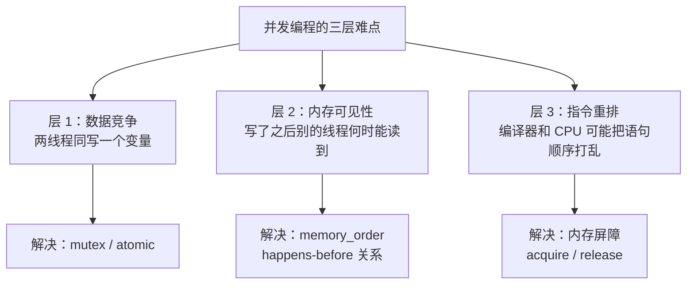

# 并发与内存序

#### 目录介绍
- [引言](#引言)
- [2. 为什么需要并发编程？](#一为什么需要并发编程)
- [3. C++线程基础](#二c线程基础)
- [4. 互斥量与锁](#三互斥量与锁)
- [5. 条件变量](#四条件变量)
- [6. 原子操作](#五原子操作)
- [7. 内存模型](#六内存模型)
- [8. 高级同步原语](#七高级同步原语)
- [9. 线程池实现](#八线程池实现)
- [10. 并发编程中的常见问题](#九并发编程中的常见问题)
- [11. std::async与std::future](#十stdasync与stdfuture)
- [12. 协程与并发 (C++20)](#十一协程与并发-c20)
- [13. 总结](#十二总结)

---

> **案例引入｜"两个 `x++` 竟然最终是 1 而不是 2"**
>
> 经典"看上去对其实错"的并发代码：
>
> ```cpp
> int counter = 0;
> std::thread t1([] { for (int i=0; i<100000; ++i) counter++; });
> std::thread t2([] { for (int i=0; i<100000; ++i) counter++; });
> t1.join(); t2.join();
> std::cout << counter;    // 期望 200000，实际可能 137264
> ```
>
> 新手第一反应："加个 mutex 不就好了？"架构师反问："**为什么会错**？硬件不是保证 `x++` 是原子的吗？" 然后抛出更深的问题：
>
> 1. `counter++` 在汇编是 **3 条指令**（load → add → store），两线程交错执行时丢更新
> 2. 就算用了 `std::atomic<int>` 修了上面的问题，**另一个线程看到的顺序**又和写入顺序可能不一样——这就是**"内存重排"**
> 3. `memory_order_relaxed` / `acquire` / `release` / `seq_cst` 六种内存序——该选哪个？
>
> 这三个问题层层递进，从"**看得见的数据竞争**"到"**看不见的内存可见性**"再到"**CPU/编译器的重排自由度**"。本文把这三层完整讲清。

---

## 00.案例元信息

| 项目 | 说明 |
|------|------|
| 难度 | ★★★★★ |
| 预估阅读 | 100 分钟 |
| 前置知识 | 卷一第 15 章（线程和锁）、[09.智能指针与RAII](./09.智能指针与RAII.md) |
| 覆盖要点 | 数据竞争、`std::thread`、`mutex`、`condition_variable`、`std::atomic`、MESI 缓存一致性、6 种 memory_order、happens-before、伪共享 |
| 核心产出 | 能写出 lock-free 单生产者单消费者队列；能解释每种 memory_order 的使用场景 |

---

## 1. 引言

在多核处理器时代，并发编程已经从"可选技能"变成了"必备能力"。C++11 开始引入了完整的并发支持——**线程、互斥量、条件变量、原子操作、内存模型**。其中最难理解、也最容易出错的是**内存序（memory order）**：它涉及 CPU 架构、缓存一致性、编译器优化三方的交互。本文从硬件层面出发，由浅入深拆解。

### 1.1 并发编程难在哪



### 1.2 本文路线图


### 1.3 本文要回答的核心问题

- 为什么 `x++` 不是原子的？加了 `std::atomic<int>` 之后**底层指令**发生了什么变化？
- **MESI 协议**是什么？它如何保证多核间缓存一致？**false sharing**又是怎么来的？
- `memory_order_acquire`/`release` 的"**单方向屏障**"为什么能保证同步？
- `seq_cst` 比 `acquire/release` 强在哪、慢多少？什么场景必须用？
- C++20 **协程**和传统线程的关系？它是"用户态线程"吗？

---

## 2. 为什么需要并发编程？

### 1.1 摩尔定律的终结与多核时代

```
单核时代（~2005年前）：
  - CPU频率每18个月翻一番
  - 程序自动变快（不需要修改代码）
  - 并发编程是"加分项"

多核时代（2005年至今）：
  - 单核频率基本停滞（3-5GHz）
  - 核心数量持续增长（4/8/16/64核+）
  - 必须利用多核才能提升性能
  - 并发编程变成"必修课"

CPU性能增长方式的变化：
  Year   | Freq(GHz) | Cores | Total Throughput
  --------|-----------|-------|----------------
  2000   | 1.0       | 1     | 1x
  2005   | 3.0       | 1     | 3x  
  2010   | 3.0       | 4     | 12x (理论)
  2020   | 4.0       | 8     | 32x (理论)
  2024   | 5.0       | 16    | 80x (理论)
  
  实际加速比远低于理论值（Amdahl定律）
```

### 1.2 Amdahl定律

```
加速比 S = 1 / ((1 - P) + P/N)

P = 可并行化的比例
N = 核心数
(1 - P) = 串行部分的比例

例子：
  如果90%的代码可以并行化（P = 0.9）
  N = 2:  S = 1/(0.1 + 0.45) = 1.82x
  N = 4:  S = 1/(0.1 + 0.225) = 3.08x
  N = 8:  S = 1/(0.1 + 0.1125) = 4.71x
  N = ∞:  S = 1/0.1 = 10x（上限！）

  即使有无限多的核，加速比上限是 1/(1-P)
  
教训：优化串行部分比增加核心数更重要！
```

---

## 3. C++线程基础

### 2.1 std::thread

```cpp
#include <thread>
#include <iostream>
#include <string>

// 函数作为线程入口
void hello() {
    std::cout << "Hello from thread " 
              << std::this_thread::get_id() << std::endl;
}

// 带参数的线程
void greet(const std::string& name, int times) {
    for (int i = 0; i < times; ++i) {
        std::cout << "Hello, " << name << "!" << std::endl;
    }
}

// 类的成员函数
class Worker {
public:
    void do_work(int id) {
        std::cout << "Worker " << id << " working\n";
    }
};

int main() {
    // 基本用法
    std::thread t1(hello);
    t1.join();  // 等待线程结束
    
    // 带参数（参数按值复制到线程中）
    std::string name = "World";
    std::thread t2(greet, name, 3);
    t2.join();
    
    // 传递引用需要std::ref
    int result = 0;
    std::thread t3([&result]() { result = 42; });
    t3.join();
    std::cout << "Result: " << result << std::endl;
    
    // 成员函数
    Worker w;
    std::thread t4(&Worker::do_work, &w, 1);
    t4.join();
    
    // Lambda
    std::thread t5([]() {
        std::cout << "Lambda thread\n";
    });
    t5.join();
    
    // detach（分离线程）
    std::thread t6(hello);
    t6.detach();  // 线程独立运行，不能再join
    // 注意：主线程结束后，detach的线程也会被终止
    
    return 0;
}
```

### 2.2 线程的生命周期管理

```cpp
#include <thread>
#include <stdexcept>

// RAII线程包装器
class JoinThread {
public:
    explicit JoinThread(std::thread t) : thread_(std::move(t)) {
        if (!thread_.joinable()) {
            throw std::logic_error("No thread");
        }
    }
    
    ~JoinThread() {
        if (thread_.joinable()) {
            thread_.join();
        }
    }
    
    JoinThread(const JoinThread&) = delete;
    JoinThread& operator=(const JoinThread&) = delete;
    
    JoinThread(JoinThread&&) = default;
    JoinThread& operator=(JoinThread&&) = default;
    
private:
    std::thread thread_;
};

// C++20: std::jthread（自动join + 支持取消）
#include <stop_token>  // C++20

void worker(std::stop_token stoken) {
    while (!stoken.stop_requested()) {
        // 工作...
        std::this_thread::sleep_for(std::chrono::milliseconds(100));
    }
    std::cout << "Worker stopped\n";
}

void demo_jthread() {
    std::jthread t(worker);
    // jthread析构时自动请求停止并join
    std::this_thread::sleep_for(std::chrono::seconds(1));
    // t自动析构 → 请求停止 → join
}
```

---

## 4. 互斥量与锁

### 3.1 竞态条件

```cpp
#include <thread>
#include <iostream>
#include <vector>

int counter = 0;

void increment(int n) {
    for (int i = 0; i < n; ++i) {
        ++counter;  // 不是原子操作！
        // 实际上是：
        // 1. 从内存读取counter到寄存器
        // 2. 寄存器+1
        // 3. 将结果写回内存
        // 线程可能在任何步骤之间被打断
    }
}

int main() {
    const int N = 1000000;
    std::thread t1(increment, N);
    std::thread t2(increment, N);
    t1.join();
    t2.join();
    
    // 预期：2000000
    // 实际：可能是1500000、1800000等任意值
    std::cout << "Counter: " << counter << std::endl;
    return 0;
}
```

### 3.2 std::mutex

```cpp
#include <mutex>

std::mutex mtx;
int counter = 0;

void safe_increment(int n) {
    for (int i = 0; i < n; ++i) {
        mtx.lock();
        ++counter;
        mtx.unlock();
    }
}

// RAII锁
void better_increment(int n) {
    for (int i = 0; i < n; ++i) {
        std::lock_guard<std::mutex> lock(mtx);  // 构造时锁定
        ++counter;
        // 析构时自动解锁（即使发生异常）
    }
}

// C++17: 类模板参数推导
void modern_increment(int n) {
    for (int i = 0; i < n; ++i) {
        std::lock_guard lock(mtx);  // 自动推导类型
        ++counter;
    }
}
```

### 3.3 各种互斥量类型

```cpp
#include <mutex>
#include <shared_mutex>

// 1. std::mutex - 基本互斥量
std::mutex basic_mutex;

// 2. std::recursive_mutex - 可递归锁
std::recursive_mutex rec_mutex;
void recursive_func(int n) {
    std::lock_guard lock(rec_mutex);
    if (n > 0) recursive_func(n - 1);  // 同一线程可以重复加锁
}

// 3. std::timed_mutex - 支持超时的互斥量
std::timed_mutex timed_mtx;
void try_with_timeout() {
    if (timed_mtx.try_lock_for(std::chrono::milliseconds(100))) {
        // 获得锁
        timed_mtx.unlock();
    } else {
        // 超时，未获得锁
    }
}

// 4. std::shared_mutex (C++17) - 读写锁
std::shared_mutex rw_mutex;
int shared_data = 0;

void reader() {
    std::shared_lock lock(rw_mutex);  // 共享锁（多个读者可以同时持有）
    std::cout << shared_data << std::endl;
}

void writer(int value) {
    std::unique_lock lock(rw_mutex);  // 独占锁（写者独占）
    shared_data = value;
}
```

### 3.4 避免死锁

```cpp
#include <mutex>

class Account {
public:
    Account(int id, double balance) : id_(id), balance_(balance) {}
    
    int id() const { return id_; }
    double balance() const { return balance_; }
    
    // 死锁风险的转账实现
    void transfer_deadlock(Account& to, double amount) {
        std::lock_guard lock1(mutex_);       // 锁A
        std::lock_guard lock2(to.mutex_);    // 锁B
        // 如果另一个线程同时调用 to.transfer(this)
        // 它会先锁B再锁A → 死锁！
        balance_ -= amount;
        to.balance_ += amount;
    }
    
    // 安全的转账实现 - 方法一：std::lock
    void transfer_safe(Account& to, double amount) {
        // std::lock同时锁定多个互斥量，避免死锁
        std::lock(mutex_, to.mutex_);
        std::lock_guard lock1(mutex_, std::adopt_lock);
        std::lock_guard lock2(to.mutex_, std::adopt_lock);
        balance_ -= amount;
        to.balance_ += amount;
    }
    
    // 安全的转账实现 - 方法二：std::scoped_lock (C++17)
    void transfer_modern(Account& to, double amount) {
        std::scoped_lock lock(mutex_, to.mutex_);  // 一次锁定多个
        balance_ -= amount;
        to.balance_ += amount;
    }
    
    // 安全的转账实现 - 方法三：固定锁定顺序
    void transfer_ordered(Account& to, double amount) {
        // 总是先锁id小的账户
        Account& first  = (id_ < to.id_) ? *this : to;
        Account& second = (id_ < to.id_) ? to : *this;
        std::lock_guard lock1(first.mutex_);
        std::lock_guard lock2(second.mutex_);
        balance_ -= amount;
        to.balance_ += amount;
    }
    
private:
    int id_;
    double balance_;
    mutable std::mutex mutex_;
};
```

---

## 5. 条件变量

### 4.1 生产者-消费者模型

```cpp
#include <mutex>
#include <condition_variable>
#include <queue>
#include <thread>
#include <iostream>

template<typename T>
class BlockingQueue {
public:
    explicit BlockingQueue(size_t max_size = 0) 
        : max_size_(max_size) {}
    
    void push(T item) {
        std::unique_lock lock(mutex_);
        if (max_size_ > 0) {
            // 等待队列不满
            not_full_.wait(lock, [this] { 
                return queue_.size() < max_size_; 
            });
        }
        queue_.push(std::move(item));
        not_empty_.notify_one();  // 通知消费者
    }
    
    T pop() {
        std::unique_lock lock(mutex_);
        // 等待队列不空
        not_empty_.wait(lock, [this] { return !queue_.empty(); });
        T item = std::move(queue_.front());
        queue_.pop();
        if (max_size_ > 0) {
            not_full_.notify_one();  // 通知生产者
        }
        return item;
    }
    
    bool try_pop(T& item, std::chrono::milliseconds timeout) {
        std::unique_lock lock(mutex_);
        if (!not_empty_.wait_for(lock, timeout, 
            [this] { return !queue_.empty(); })) {
            return false;  // 超时
        }
        item = std::move(queue_.front());
        queue_.pop();
        return true;
    }
    
    size_t size() const {
        std::lock_guard lock(mutex_);
        return queue_.size();
    }
    
private:
    mutable std::mutex mutex_;
    std::condition_variable not_empty_;
    std::condition_variable not_full_;
    std::queue<T> queue_;
    size_t max_size_;
};

// 使用
void producer_consumer_demo() {
    BlockingQueue<int> queue(10);  // 最大容量10
    
    // 生产者
    std::thread producer([&queue]() {
        for (int i = 0; i < 100; ++i) {
            queue.push(i);
            std::cout << "Produced: " << i << std::endl;
        }
        queue.push(-1);  // 结束信号
    });
    
    // 消费者
    std::thread consumer([&queue]() {
        while (true) {
            int item = queue.pop();
            if (item == -1) break;
            std::cout << "Consumed: " << item << std::endl;
        }
    });
    
    producer.join();
    consumer.join();
}
```

### 4.2 条件变量的虚假唤醒

```cpp
// 为什么条件变量必须在循环中检查条件？

// 错误用法
void wrong_wait() {
    std::unique_lock lock(mutex_);
    cond_.wait(lock);  // 没有检查条件！
    // 可能被虚假唤醒，数据实际上还没准备好
    process_data();
}

// 正确用法
void correct_wait() {
    std::unique_lock lock(mutex_);
    cond_.wait(lock, [this] { return data_ready_; });
    // 等价于：
    // while (!data_ready_) {
    //     cond_.wait(lock);
    // }
    process_data();
}

/*
虚假唤醒的原因：
1. 操作系统信号中断
2. 某些平台的pthread实现特性
3. notify_all可能唤醒多个线程，但只有一个能获取资源
4. 编译器优化

因此必须总是在循环中（或用带谓词的wait）检查条件
*/
```

---

## 6. 原子操作

### 5.1 std::atomic基础

```cpp
#include <atomic>
#include <thread>
#include <iostream>

// 原子计数器
std::atomic<int> counter{0};

void atomic_increment(int n) {
    for (int i = 0; i < n; ++i) {
        counter.fetch_add(1, std::memory_order_relaxed);
        // 或简写：++counter;（默认memory_order_seq_cst）
    }
}

int main() {
    const int N = 1000000;
    std::thread t1(atomic_increment, N);
    std::thread t2(atomic_increment, N);
    t1.join();
    t2.join();
    
    std::cout << "Counter: " << counter.load() << std::endl;
    // 一定是2000000
}
```

### 5.2 原子操作的底层实现

```cpp
// 原子操作在x86上的实现

// std::atomic<int>::fetch_add(1)
// 编译为：
//   lock xadd [memory], reg
// lock前缀保证操作的原子性

// std::atomic<int>::store(value)
// 编译为：
//   mov [memory], value
// 在x86上，对齐的store本身就是原子的

// std::atomic<int>::load()
// 编译为：
//   mov reg, [memory]
// 在x86上，对齐的load本身就是原子的

// std::atomic<bool>::compare_exchange
// 编译为：
//   lock cmpxchg [memory], new_value
// CAS（Compare-And-Swap）操作

// 验证原子操作是否是无锁的
void check_lock_free() {
    std::cout << "int: " << std::atomic<int>::is_always_lock_free << std::endl;
    std::cout << "long: " << std::atomic<long>::is_always_lock_free << std::endl;
    std::cout << "double: " << std::atomic<double>::is_always_lock_free << std::endl;
    
    struct Big { int data[100]; };
    std::cout << "Big: " << std::atomic<Big>::is_always_lock_free << std::endl;
    // Big太大，可能使用互斥量实现（lock-based）
}
```

### 5.3 CAS操作与无锁编程

```cpp
#include <atomic>

// CAS (Compare-And-Swap) 是无锁编程的基础

// 自旋锁实现
class SpinLock {
public:
    void lock() {
        while (flag_.test_and_set(std::memory_order_acquire)) {
            // 自旋等待
            // 优化：使用pause指令减少CPU资源消耗
            #if defined(__x86_64__)
            __builtin_ia32_pause();
            #endif
        }
    }
    
    void unlock() {
        flag_.clear(std::memory_order_release);
    }
    
private:
    std::atomic_flag flag_ = ATOMIC_FLAG_INIT;
};

// 无锁栈实现
template<typename T>
class LockFreeStack {
public:
    void push(T value) {
        Node* new_node = new Node{std::move(value), nullptr};
        new_node->next = head_.load(std::memory_order_relaxed);
        
        // CAS：如果head_仍然等于new_node->next，就更新为new_node
        while (!head_.compare_exchange_weak(
            new_node->next,          // expected（如果CAS失败，更新为当前值）
            new_node,                // desired
            std::memory_order_release,
            std::memory_order_relaxed
        )) {
            // CAS失败（有其他线程修改了head_）
            // new_node->next已经被更新为最新的head_，重试
        }
    }
    
    bool pop(T& result) {
        Node* old_head = head_.load(std::memory_order_relaxed);
        
        while (old_head && !head_.compare_exchange_weak(
            old_head,
            old_head->next,
            std::memory_order_acquire,
            std::memory_order_relaxed
        )) {
            // CAS失败，old_head已更新，重试
        }
        
        if (!old_head) return false;
        
        result = std::move(old_head->value);
        // 注意：这里有ABA问题和内存回收问题
        // 实际实现需要使用Hazard Pointer或RCU
        delete old_head;
        return true;
    }
    
private:
    struct Node {
        T value;
        Node* next;
    };
    
    std::atomic<Node*> head_{nullptr};
};
```

---

## 7. 内存模型

### 6.1 为什么需要内存模型？

```
问题的根源：编译器和CPU都会对指令进行重排序

源代码：
    int a = 0, b = 0;
    
    // 线程1               // 线程2
    a = 1;                 while (b == 0) ;
    b = 1;                 assert(a == 1);  // 可能失败！

为什么assert可能失败？

原因一：编译器重排序
  编译器认为 a = 1 和 b = 1 没有数据依赖
  可能把它们重排为：
    b = 1;    // 先写b
    a = 1;    // 后写a

原因二：CPU重排序（Store Buffer）
  CPU有写缓冲区（Store Buffer），写操作不会立即可见
  
    CPU1的Store Buffer:
    +--------+
    | a = 1  |  ← 还在缓冲区中，其他CPU看不到
    +--------+
    | b = 1  |  ← 可能先刷出（先被其他CPU看到）
    +--------+

原因三：缓存一致性协议的延迟
  即使使用了MESI协议，Invalidate消息的传播也需要时间
```

### 6.2 硬件内存模型

```
不同架构的内存模型强度：

强模型 ←─────────────────────────── 弱模型
  x86/x64        ARM/POWER        Alpha
  (TSO)          (弱序)          (最弱)

x86 TSO (Total Store Order):
  - Load-Load:   不重排 ✓
  - Load-Store:  不重排 ✓  
  - Store-Store: 不重排 ✓
  - Store-Load:  可能重排 ✗ （唯一允许的重排）
  
ARM/POWER 弱序:
  - 所有组合都可能重排
  - 需要显式的内存屏障

内存屏障指令：
  x86:    mfence, sfence, lfence
  ARM:    dmb, dsb, isb
  POWER:  sync, lwsync, isync
```

### 6.3 C++内存模型的六种内存序

```cpp
// C++11定义了6种内存序，从弱到强：

enum memory_order {
    memory_order_relaxed,    // 最弱：只保证原子性
    memory_order_consume,    // 数据依赖序（实际很少用）
    memory_order_acquire,    // 获取语义
    memory_order_release,    // 释放语义
    memory_order_acq_rel,    // 获取+释放
    memory_order_seq_cst     // 最强：顺序一致性（默认）
};
```

### 6.4 Relaxed Ordering

```cpp
#include <atomic>
#include <thread>
#include <cassert>

std::atomic<int> x{0}, y{0};

void thread1() {
    x.store(1, std::memory_order_relaxed);
    y.store(1, std::memory_order_relaxed);
}

void thread2() {
    while (y.load(std::memory_order_relaxed) != 1) ;
    // y已经是1，但x可能还不是1！
    assert(x.load(std::memory_order_relaxed) == 1);  // 可能失败
}

// relaxed只保证单个原子变量的操作是原子的
// 不保证不同原子变量之间的操作顺序

// 适用场景：简单的计数器
std::atomic<int> counter{0};
void count() {
    counter.fetch_add(1, std::memory_order_relaxed);
    // 不关心其他变量，只需要计数准确
}
```

### 6.5 Acquire-Release Ordering

```cpp
#include <atomic>
#include <thread>
#include <cassert>
#include <string>

std::atomic<bool> ready{false};
std::string data;

// Release-Acquire配对：建立happens-before关系
void producer() {
    data = "Hello, World!";                        // (A)
    ready.store(true, std::memory_order_release);  // (B) Release
    // Release保证：(A) happens-before (B)
    // 即：Release之前的所有写操作在Release之前完成
}

void consumer() {
    while (!ready.load(std::memory_order_acquire)) ;  // (C) Acquire
    std::cout << data << std::endl;                    // (D)
    // Acquire保证：(C) happens-before (D)
    // 由于(B) synchronizes-with (C)：
    //   (A) happens-before (D)
    // 因此data的写入对consumer可见
}

/*
Acquire-Release的语义：

Release（释放）：
  - "释放"之前的所有写操作
  - 保证Release之前的操作不会被重排到Release之后
  - 类比：发布一个版本，确保所有修改都包含在内

Acquire（获取）：
  - "获取"之前的所有写操作的可见性
  - 保证Acquire之后的操作不会被重排到Acquire之前
  - 类比：获取一个版本，能看到该版本的所有修改

配对关系：
  Thread1: [write A] [write B] [Release store X]
                                     ↓ synchronizes-with
  Thread2:              [Acquire load X] [read A] [read B]
  
  Thread2能看到Thread1在Release之前的所有写操作
*/
```

### 6.6 Sequential Consistency（顺序一致性）

```cpp
#include <atomic>
#include <thread>
#include <cassert>

std::atomic<bool> x{false}, y{false};
std::atomic<int> z{0};

void write_x() {
    x.store(true, std::memory_order_seq_cst);
}

void write_y() {
    y.store(true, std::memory_order_seq_cst);
}

void read_x_then_y() {
    while (!x.load(std::memory_order_seq_cst)) ;
    if (y.load(std::memory_order_seq_cst)) {
        ++z;
    }
}

void read_y_then_x() {
    while (!y.load(std::memory_order_seq_cst)) ;
    if (x.load(std::memory_order_seq_cst)) {
        ++z;
    }
}

int main() {
    std::thread t1(write_x);
    std::thread t2(write_y);
    std::thread t3(read_x_then_y);
    std::thread t4(read_y_then_x);
    t1.join(); t2.join(); t3.join(); t4.join();
    
    assert(z.load() != 0);  // 在seq_cst下，z一定不为0
    // 如果用relaxed，z可能为0
}

/*
顺序一致性保证：
所有线程看到的操作顺序是一致的（存在一个全局总序）

如果x先于y被写入（在全局序中）：
  - read_y_then_x 看到y=true时，一定能看到x=true → z++
如果y先于x被写入：
  - read_x_then_y 看到x=true时，一定能看到y=true → z++
无论哪种情况，至少有一个线程会让z++

seq_cst是默认的内存序，最容易推理正确性
但在某些架构（如ARM）上开销最大
*/
```

### 6.7 内存序的选择指南

```
┌────────────────────┬──────────────────────────────┐
│ 场景               │ 推荐内存序                    │
├────────────────────┼──────────────────────────────┤
│ 简单计数器         │ relaxed                      │
│ 自旋锁             │ acquire(lock)/release(unlock)│
│ 一次性初始化标志   │ acquire/release              │
│ 无锁数据结构       │ acquire/release              │
│ 需要全局顺序       │ seq_cst                      │
│ 不确定该用哪个     │ seq_cst（默认，最安全）       │
└────────────────────┴──────────────────────────────┘

性能差异（x86上）：
  relaxed  → 普通mov指令
  acquire  → 普通mov指令（x86的load自带acquire语义）
  release  → 普通mov指令（x86的store自带release语义）
  seq_cst  → store需要mfence或lock xchg（有额外开销）

性能差异（ARM上）：
  relaxed  → 普通ldr/str指令
  acquire  → ldar指令
  release  → stlr指令
  seq_cst  → ldar/stlr + dmb指令
```

---

## 8. 高级同步原语

### 7.1 std::call_once与单例模式

```cpp
#include <mutex>
#include <memory>

class Singleton {
public:
    static Singleton& instance() {
        // C++11保证局部静态变量的线程安全初始化
        static Singleton inst;
        return inst;
    }
    
    Singleton(const Singleton&) = delete;
    Singleton& operator=(const Singleton&) = delete;
    
private:
    Singleton() = default;
};

// 使用std::call_once
class SingletonOnce {
public:
    static SingletonOnce& instance() {
        std::call_once(init_flag_, []() {
            instance_.reset(new SingletonOnce());
        });
        return *instance_;
    }
    
private:
    SingletonOnce() = default;
    static std::once_flag init_flag_;
    static std::unique_ptr<SingletonOnce> instance_;
};

std::once_flag SingletonOnce::init_flag_;
std::unique_ptr<SingletonOnce> SingletonOnce::instance_;
```

### 7.2 std::latch和std::barrier (C++20)

```cpp
#include <latch>
#include <barrier>
#include <thread>
#include <iostream>
#include <vector>

// latch: 一次性倒计数器
void latch_demo() {
    const int num_threads = 4;
    std::latch ready(num_threads);   // 所有线程就绪
    std::latch done(num_threads);    // 所有线程完成
    
    std::vector<std::thread> threads;
    for (int i = 0; i < num_threads; ++i) {
        threads.emplace_back([&, i]() {
            // 准备阶段
            std::cout << "Thread " << i << " ready\n";
            ready.count_down();      // 通知就绪
            ready.wait();            // 等待所有线程就绪
            
            // 工作阶段（所有线程同时开始）
            std::cout << "Thread " << i << " working\n";
            
            done.count_down();       // 通知完成
        });
    }
    
    done.wait();  // 等待所有线程完成
    std::cout << "All done!\n";
    
    for (auto& t : threads) t.join();
}

// barrier: 可重用的同步点
void barrier_demo() {
    const int num_threads = 3;
    int iteration = 0;
    
    std::barrier sync_point(num_threads, [&]() noexcept {
        // 完成回调：在所有线程到达后、释放前调用
        ++iteration;
        std::cout << "=== Iteration " << iteration << " complete ===\n";
    });
    
    auto worker = [&](int id) {
        for (int i = 0; i < 3; ++i) {
            std::cout << "Thread " << id << " phase " << i << "\n";
            sync_point.arrive_and_wait();  // 等待所有线程到达
        }
    };
    
    std::vector<std::thread> threads;
    for (int i = 0; i < num_threads; ++i) {
        threads.emplace_back(worker, i);
    }
    for (auto& t : threads) t.join();
}
```

### 7.3 std::semaphore (C++20)

```cpp
#include <semaphore>
#include <thread>
#include <iostream>

// counting_semaphore: 限制并发数
std::counting_semaphore<3> pool(3);  // 最多3个并发

void limited_resource(int id) {
    pool.acquire();  // P操作（等待信号量>0然后减1）
    std::cout << "Thread " << id << " acquired resource\n";
    std::this_thread::sleep_for(std::chrono::seconds(1));
    std::cout << "Thread " << id << " releasing resource\n";
    pool.release();  // V操作（增加信号量）
}

// binary_semaphore: 二值信号量（类似mutex但不要求同一线程释放）
std::binary_semaphore signal(0);

void sender() {
    std::cout << "Preparing data...\n";
    std::this_thread::sleep_for(std::chrono::seconds(1));
    std::cout << "Data ready, signaling\n";
    signal.release();  // 发送信号
}

void receiver() {
    std::cout << "Waiting for signal...\n";
    signal.acquire();  // 等待信号
    std::cout << "Signal received!\n";
}
```

---

## 9. 线程池实现

### 8.1 简易线程池

```cpp
#include <thread>
#include <mutex>
#include <condition_variable>
#include <queue>
#include <functional>
#include <vector>
#include <future>
#include <memory>
#include <stdexcept>

class ThreadPool {
public:
    explicit ThreadPool(size_t num_threads) {
        for (size_t i = 0; i < num_threads; ++i) {
            workers_.emplace_back([this]() {
                while (true) {
                    std::function<void()> task;
                    {
                        std::unique_lock lock(mutex_);
                        condition_.wait(lock, [this] {
                            return stop_ || !tasks_.empty();
                        });
                        if (stop_ && tasks_.empty()) return;
                        task = std::move(tasks_.front());
                        tasks_.pop();
                    }
                    task();  // 执行任务
                }
            });
        }
    }
    
    // 提交任务
    template<typename F, typename... Args>
    auto submit(F&& f, Args&&... args) 
        -> std::future<std::invoke_result_t<F, Args...>> 
    {
        using return_type = std::invoke_result_t<F, Args...>;
        
        auto task = std::make_shared<std::packaged_task<return_type()>>(
            std::bind(std::forward<F>(f), std::forward<Args>(args)...)
        );
        
        std::future<return_type> result = task->get_future();
        
        {
            std::lock_guard lock(mutex_);
            if (stop_) {
                throw std::runtime_error("submit on stopped ThreadPool");
            }
            tasks_.emplace([task]() { (*task)(); });
        }
        condition_.notify_one();
        
        return result;
    }
    
    ~ThreadPool() {
        {
            std::lock_guard lock(mutex_);
            stop_ = true;
        }
        condition_.notify_all();
        for (auto& worker : workers_) {
            worker.join();
        }
    }
    
private:
    std::vector<std::thread> workers_;
    std::queue<std::function<void()>> tasks_;
    std::mutex mutex_;
    std::condition_variable condition_;
    bool stop_ = false;
};

// 使用
void thread_pool_demo() {
    ThreadPool pool(4);
    
    // 提交多个任务
    std::vector<std::future<int>> results;
    for (int i = 0; i < 8; ++i) {
        results.push_back(pool.submit([i]() {
            std::this_thread::sleep_for(std::chrono::milliseconds(100));
            return i * i;
        }));
    }
    
    // 获取结果
    for (auto& f : results) {
        std::cout << f.get() << " ";
    }
    std::cout << std::endl;
}
```

---

## 10. 并发编程中的常见问题

### 9.1 ABA问题

```cpp
/*
ABA问题：CAS操作看到值从A变成A，但中间经历了A→B→A

场景：
  时间点1: 线程1读取head = A, head->next = B
  时间点2: 线程2弹出A
  时间点3: 线程2弹出B
  时间点4: 线程2重新压入A（可能是同一个地址，从内存池分配）
  时间点5: 线程1的CAS：head仍然是A → 成功！
           但此时head->next = B已经被释放了 → 悬垂指针！

解决方案：
1. 使用版本号/计数器（tagged pointer）
2. 使用Hazard Pointer
3. 使用RCU (Read-Copy-Update)
4. 使用epoch-based回收
*/

// 方案一：Tagged Pointer
#include <atomic>
#include <cstdint>

template<typename T>
class TaggedPtr {
public:
    struct Packed {
        T* ptr;
        uintptr_t tag;  // 版本号
    };
    
    TaggedPtr() : data_{0} {}
    
    Packed load() const {
        auto val = data_.load(std::memory_order_acquire);
        return {reinterpret_cast<T*>(val & PTR_MASK), 
                static_cast<uintptr_t>(val >> TAG_SHIFT)};
    }
    
    bool compare_exchange(Packed& expected, Packed desired) {
        auto exp_val = pack(expected);
        auto des_val = pack(desired);
        bool success = data_.compare_exchange_strong(
            exp_val, des_val,
            std::memory_order_acq_rel);
        if (!success) {
            expected = unpack(exp_val);
        }
        return success;
    }
    
private:
    static constexpr int TAG_SHIFT = 48;
    static constexpr uintptr_t PTR_MASK = (1ULL << TAG_SHIFT) - 1;
    
    uintptr_t pack(Packed p) {
        return reinterpret_cast<uintptr_t>(p.ptr) | (p.tag << TAG_SHIFT);
    }
    
    Packed unpack(uintptr_t val) {
        return {reinterpret_cast<T*>(val & PTR_MASK),
                static_cast<uintptr_t>(val >> TAG_SHIFT)};
    }
    
    std::atomic<uintptr_t> data_;
};
```

### 9.2 False Sharing（伪共享）

```cpp
#include <atomic>
#include <thread>
#include <chrono>
#include <iostream>

// 伪共享问题
struct BadAlignment {
    std::atomic<int> counter1;  // 可能和counter2在同一cache line
    std::atomic<int> counter2;
};

// 解决方案：对齐到cache line
struct GoodAlignment {
    alignas(64) std::atomic<int> counter1;  // 独占一条cache line
    alignas(64) std::atomic<int> counter2;  // 独占一条cache line
};

// C++17: std::hardware_destructive_interference_size
#ifdef __cpp_lib_hardware_interference_size
struct BestAlignment {
    alignas(std::hardware_destructive_interference_size) 
        std::atomic<int> counter1;
    alignas(std::hardware_destructive_interference_size) 
        std::atomic<int> counter2;
};
#endif

template<typename T>
void benchmark(T& data, const char* name) {
    const int N = 100000000;
    auto start = std::chrono::high_resolution_clock::now();
    
    std::thread t1([&]() {
        for (int i = 0; i < N; ++i) {
            data.counter1.fetch_add(1, std::memory_order_relaxed);
        }
    });
    
    std::thread t2([&]() {
        for (int i = 0; i < N; ++i) {
            data.counter2.fetch_add(1, std::memory_order_relaxed);
        }
    });
    
    t1.join();
    t2.join();
    
    auto end = std::chrono::high_resolution_clock::now();
    auto ms = std::chrono::duration_cast<std::chrono::milliseconds>(end - start);
    std::cout << name << ": " << ms.count() << " ms\n";
}
```

---

## 11. std::async与std::future

### 10.1 异步任务

```cpp
#include <future>
#include <iostream>
#include <vector>
#include <numeric>

// std::async: 高级异步执行
long long parallel_sum(const std::vector<int>& data, 
                       size_t start, size_t end) {
    if (end - start < 10000) {
        // 小任务直接计算
        return std::accumulate(data.begin() + start, 
                              data.begin() + end, 0LL);
    }
    
    size_t mid = start + (end - start) / 2;
    
    // 异步计算左半部分
    auto left = std::async(std::launch::async, 
                          parallel_sum, std::ref(data), start, mid);
    
    // 当前线程计算右半部分
    long long right_sum = parallel_sum(data, mid, end);
    
    // 获取左半部分的结果
    return left.get() + right_sum;
}

// std::packaged_task: 包装可调用对象
void packaged_task_demo() {
    std::packaged_task<int(int, int)> task([](int a, int b) {
        return a + b;
    });
    
    std::future<int> result = task.get_future();
    
    // 可以在另一个线程中执行
    std::thread t(std::move(task), 10, 20);
    t.join();
    
    std::cout << "Result: " << result.get() << std::endl;
}

// std::shared_future: 多个消费者
void shared_future_demo() {
    std::promise<int> promise;
    std::shared_future<int> future = promise.get_future().share();
    
    // 多个线程可以等待同一个结果
    auto consumer = [](std::shared_future<int> f, int id) {
        std::cout << "Consumer " << id << ": " << f.get() << std::endl;
    };
    
    std::thread t1(consumer, future, 1);
    std::thread t2(consumer, future, 2);
    std::thread t3(consumer, future, 3);
    
    promise.set_value(42);  // 所有消费者都能获取到42
    
    t1.join(); t2.join(); t3.join();
}
```

---

## 12. 协程与并发 (C++20)

### 11.1 协程基础

```cpp
#include <coroutine>
#include <iostream>

// 简单的生成器协程
template<typename T>
class Generator {
public:
    struct promise_type {
        T current_value;
        
        Generator get_return_object() {
            return Generator{
                std::coroutine_handle<promise_type>::from_promise(*this)
            };
        }
        
        std::suspend_always initial_suspend() { return {}; }
        std::suspend_always final_suspend() noexcept { return {}; }
        void unhandled_exception() { std::terminate(); }
        void return_void() {}
        
        std::suspend_always yield_value(T value) {
            current_value = std::move(value);
            return {};
        }
    };
    
    using handle_type = std::coroutine_handle<promise_type>;
    
    explicit Generator(handle_type h) : handle_(h) {}
    ~Generator() { if (handle_) handle_.destroy(); }
    
    Generator(Generator&& other) noexcept : handle_(other.handle_) {
        other.handle_ = nullptr;
    }
    
    bool next() {
        handle_.resume();
        return !handle_.done();
    }
    
    T value() const { return handle_.promise().current_value; }
    
private:
    handle_type handle_;
};

// 使用
Generator<int> fibonacci() {
    int a = 0, b = 1;
    while (true) {
        co_yield a;
        int temp = a + b;
        a = b;
        b = temp;
    }
}

void coroutine_demo() {
    auto gen = fibonacci();
    for (int i = 0; i < 10; ++i) {
        gen.next();
        std::cout << gen.value() << " ";
    }
    std::cout << std::endl;
    // 输出: 0 1 1 2 3 5 8 13 21 34
}
```

---

## 13. 总结

### 12.1 并发编程核心知识图谱

```
C++并发编程
├── 线程管理
│   ├── std::thread / std::jthread
│   ├── 线程生命周期（join/detach）
│   └── 线程局部存储 (thread_local)
├── 互斥与同步
│   ├── std::mutex / shared_mutex
│   ├── std::lock_guard / unique_lock / shared_lock / scoped_lock
│   ├── std::condition_variable
│   ├── std::latch / barrier / semaphore (C++20)
│   └── std::call_once / once_flag
├── 原子操作
│   ├── std::atomic<T>
│   ├── CAS操作
│   ├── 无锁数据结构
│   └── std::atomic_flag
├── 内存模型
│   ├── happens-before关系
│   ├── memory_order_relaxed
│   ├── memory_order_acquire/release
│   ├── memory_order_seq_cst
│   └── memory_order_consume (弃用趋势)
├── 异步任务
│   ├── std::async / std::future
│   ├── std::promise
│   ├── std::packaged_task
│   └── std::shared_future
├── 协程 (C++20)
│   ├── co_await / co_yield / co_return
│   ├── promise_type
│   └── coroutine_handle
└── 常见问题
    ├── 竞态条件
    ├── 死锁
    ├── ABA问题
    ├── 伪共享
    └── 优先级反转
```

### 12.2 最佳实践

```
1. 优先使用高级抽象
   std::async > std::thread
   std::scoped_lock > 手动lock/unlock
   
2. 避免共享状态
   消息传递 > 共享内存
   线程局部 > 全局共享
   
3. 如果必须共享，用最小的同步
   atomic > mutex（如果可以）
   shared_mutex > mutex（读多写少时）
   
4. 内存序选择
   不确定 → seq_cst（安全第一）
   确定 → acquire/release（性能优化）
   
5. 避免常见陷阱
   总是join或detach线程
   条件变量总是用循环等待
   析构函数中不抛异常
   注意false sharing
```

---

## 参考资源

1. **"C++ Concurrency in Action" by Anthony Williams** - C++并发编程的权威著作
2. **C++ Memory Model** - cppreference.com上的内存模型文档
3. **Herb Sutter "atomic Weapons"** - C++原子操作的深入讲解视频
4. **Jeff Preshing's Blog** - 内存模型和无锁编程的经典文章
5. **Intel x86 Memory Ordering White Paper** - x86内存模型的官方文档
6. **P2300 std::execution** - C++26的异步执行框架提案
