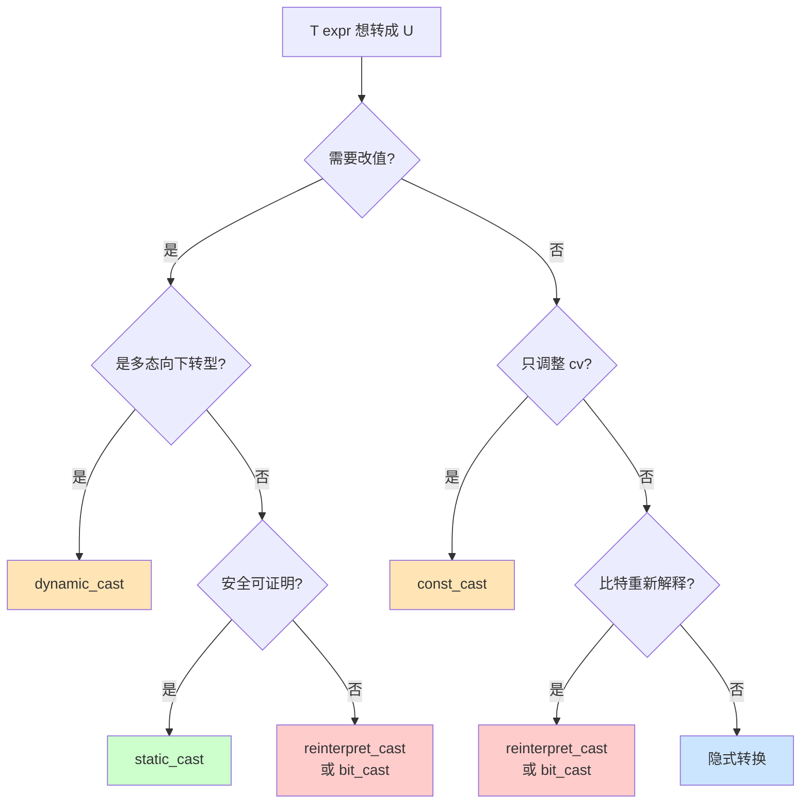
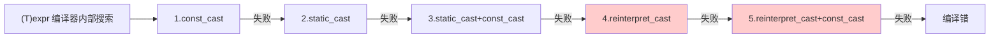
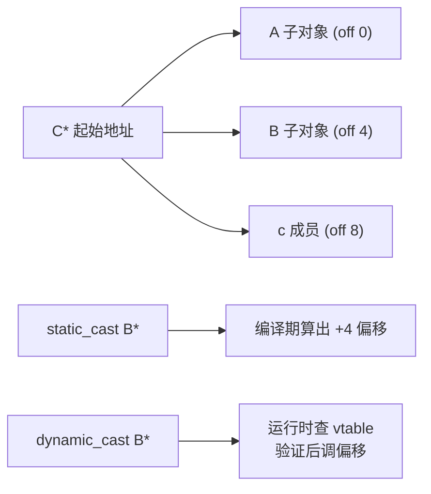
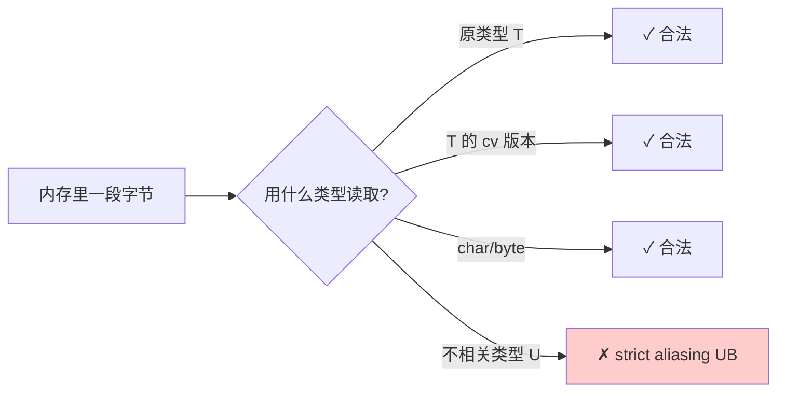
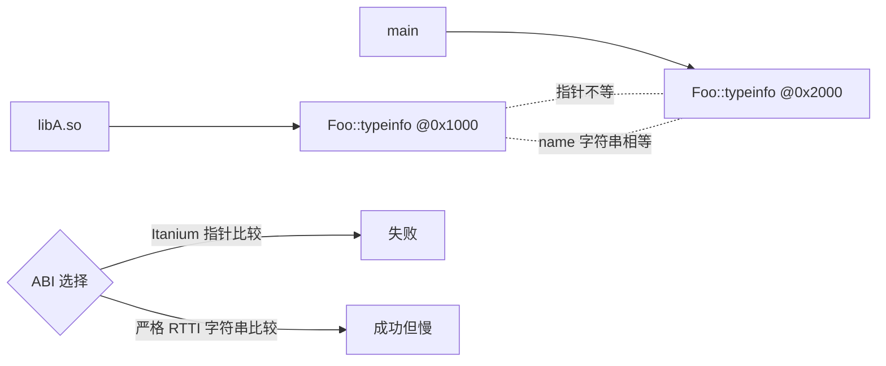
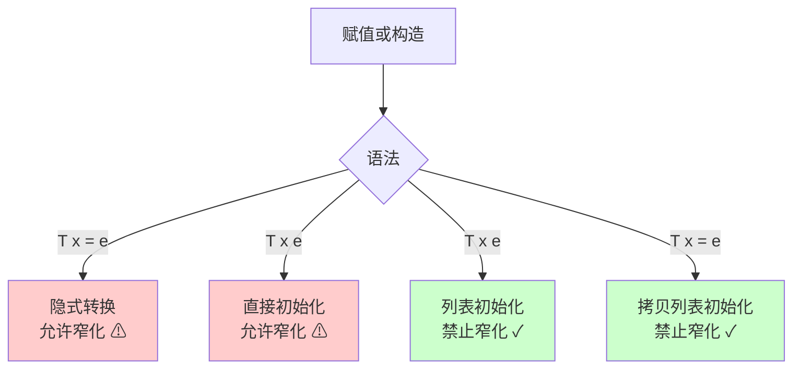
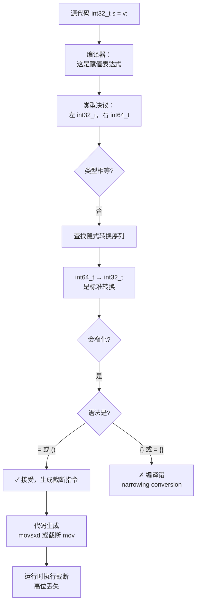
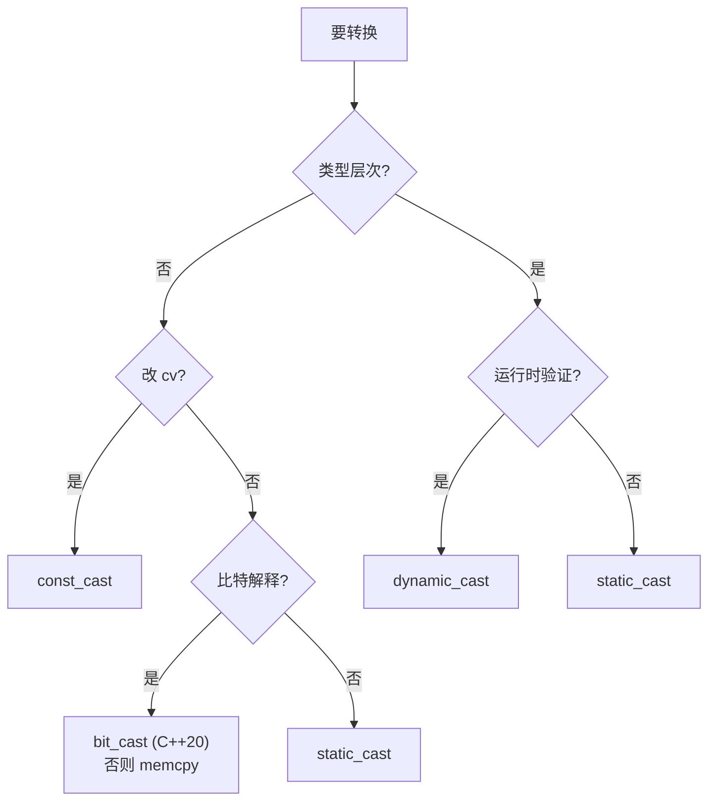

# 13.类型转换与隐式构造

#### 目录介绍
- [1. 案例引入](#1-案例引入)
  - [1.1 一行赋值的安全事故](#11-一行赋值的安全事故)
  - [1.2 reinterpret_cast的UB陷阱](#12-reinterpret_cast的ub陷阱)
  - [1.3 八大灵魂拷问](#13-八大灵魂拷问)
- [2. 架构概览](#2-架构概览)
  - [2.1 类型转换的两大维度](#21-类型转换的两大维度)
  - [2.2 五种cast的关系图](#22-五种cast的关系图)
- [3. C风格cast的原罪](#3-c风格cast的原罪)
  - [3.1 一个语法五种语义](#31-一个语法五种语义)
  - [3.2 编译器的搜索顺序](#32-编译器的搜索顺序)
  - [3.3 为什么必须被替代](#33-为什么必须被替代)
- [4. static_cast的本分](#4-static_cast的本分)
  - [4.1 编译期可证明的转换](#41-编译期可证明的转换)
  - [4.2 数值与枚举的转换](#42-数值与枚举的转换)
  - [4.3 上下转型的差异](#43-上下转型的差异)
  - [4.4 void指针的还原](#44-void指针的还原)
- [5. const_cast的窄边界](#5-const_cast的窄边界)
  - [5.1 仅能改顶层cv](#51-仅能改顶层cv)
  - [5.2 改原本const的UB](#52-改原本const的ub)
  - [5.3 合法使用的两个场景](#53-合法使用的两个场景)
- [6. reinterpret_cast的雷区](#6-reinterpret_cast的雷区)
  - [6.1 比特位重新解释](#61-比特位重新解释)
  - [6.2 严格别名规则](#62-严格别名规则)
  - [6.3 std-bit_cast的救赎](#63-std-bit_cast的救赎)
- [7. dynamic_cast运行时机制](#7-dynamic_cast运行时机制)
  - [7.1 RTTI的代价](#71-rtti的代价)
  - [7.2 失败时的两种语义](#72-失败时的两种语义)
  - [7.3 跨so边界的失效](#73-跨so边界的失效)
- [8. 隐式转换与explicit](#8-隐式转换与explicit)
  - [8.1 用户定义转换的两扇门](#81-用户定义转换的两扇门)
  - [8.2 隐式转换的传染性](#82-隐式转换的传染性)
  - [8.3 explicit的精准防御](#83-explicit的精准防御)
  - [8.4 C++20-explicit_bool](#84-c20-explicit_bool)
- [9. 列表初始化与窄化](#9-列表初始化与窄化)
  - [9.1 三种初始化对比](#91-三种初始化对比)
  - [9.2 花括号禁止窄化](#92-花括号禁止窄化)
  - [9.3 most-vexing-parse解决](#93-most-vexing-parse解决)
  - [9.4 工程默认花括号](#94-工程默认花括号)
- [10. 综合案例串讲](#10-综合案例串讲)
  - [10.1 案例真相揭晓](#101-案例真相揭晓)
  - [10.2 一次转换的全生命周期](#102-一次转换的全生命周期)
  - [10.3 设计哲学回扣](#103-设计哲学回扣)
  - [10.4 速查表合集](#104-速查表合集)


## 1. 案例引入

### 1.1 一行赋值的安全事故

某金融风控系统的日志写入模块，在升级到一台新机器后开始**间歇性丢日志**——每天大约 0.3% 的日志条目"凭空消失"，但程序日志里一条 error 都没有。代码 review 锁定到一段看似无害的统计代码：

```cpp
// 业务计数器，全局状态
struct RiskCounter {
    int64_t total_events;
    int32_t window_seq;     // 时间窗口序号
};

void on_event(const Event& e, RiskCounter& c) {
    c.total_events++;
    c.window_seq = e.timestamp_ms() / 1000;     // ← bug 在这里
    persist_to_disk(c);
}
```

`Event::timestamp_ms()` 返回 `int64_t`（毫秒级 Unix 时间戳），除以 1000 得到秒级时间戳——这显然是个能塞进 `int32_t` 的数字（Unix 时间戳 2038 年才会溢出 int32）。代码上线 8 个月，相安无事。

**直到某天日志开始丢失**——丢失的条目，全部是写入磁盘时 `window_seq < 0` 的记录。新机器跑了一段时间后，**`timestamp_ms() / 1000` 偶尔会返回大于 `INT32_MAX` 的值**——不是因为时间过了 2038，而是因为这台机器的 `Event::timestamp_ms` 实现错乱，偶发返回了一个巨大的"非时间戳"值（可能是未初始化内存、可能是 race condition）。

但**编译器一声不响地把它截断**——`int64_t → int32_t` 是 C++ 允许的隐式窄化转换，编译器既不警告也不报错。窄化后高 32 位被丢弃，低 32 位的最高 bit 偶尔为 1，于是 window_seq 变成了一个**负数**。下游的 `if (c.window_seq >= 0)` 判定就会过滤掉这条日志。

修复方案有四种，每种背后都是一个完整的设计哲学：

```cpp
// 方案A：显式 static_cast（明示意图，但仍是截断）
c.window_seq = static_cast<int32_t>(e.timestamp_ms() / 1000);

// 方案B：花括号初始化（C++11 禁止窄化，编译期拦住）
c.window_seq = {e.timestamp_ms() / 1000};       // ⚠ 编译错——这是最大的胜利

// 方案C：std::narrow（GSL 库，运行期检查后抛异常）
c.window_seq = gsl::narrow<int32_t>(e.timestamp_ms() / 1000);

// 方案D：扩字段（最根本，把 window_seq 改成 int64_t）
```

复盘会议上 leader 抛出了三个问题：
1. **为什么 C 风格的 `int32_t x = int64_value` 会"静默截断"？编译器不该警告吗？**
2. **C++11 的 `int32_t x{int64_value}` 为什么能编译期阻止？这种"窄化检查"是哪里来的？**
3. **`static_cast`、C 风格 cast、函数式 cast `int32_t(x)` 三者在汇编层有差异吗？**

第三个问题答案是：**汇编层完全相同**——但**人类读代码时的心智负担截然不同**。C++ 把 cast 拆成五种，不是为了机器，而是为了人。

### 1.2 reinterpret_cast的UB陷阱

第二个真实事故来自一个网络协议的解析代码：

```cpp
struct PacketHeader {
    uint16_t magic;
    uint16_t length;
    uint32_t crc;
};

void on_recv(const char* buf, size_t len) {
    if (len < sizeof(PacketHeader)) return;
    auto* hdr = reinterpret_cast<const PacketHeader*>(buf);
    if (hdr->magic != 0xABCD) return;       // ← 偶发误判
    process(hdr);
}
```

这段代码在 `-O0` 下完美运行，**升级到 `-O2` 之后偶发"协议头校验失败"**——同一段 buf 数据，debug 版本能解析，release 版本不能。

**真相是严格别名规则（strict aliasing）**：C++ 允许编译器假设"`char*` 与 `PacketHeader*` 不会指向同一块内存"——所以编译器在 `-O2` 下把 `hdr->magic` 的读取**优化到了 buf 写入之前**（指令重排），结果读到的是过期数据。

`reinterpret_cast<const PacketHeader*>(buf)` 在标准里是 **UB**（除非 buf 本来就是 PacketHeader 起源的内存）。`-O0` 不做激进优化所以"看起来正确"，但代码本身早已在 UB 的悬崖边。

修复方案：

```cpp
// 方案A：std::memcpy（合法、零开销，编译器会优化掉 memcpy 调用）
PacketHeader hdr;
std::memcpy(&hdr, buf, sizeof(hdr));
if (hdr.magic != 0xABCD) return;

// 方案B：std::bit_cast（C++20，编译期可执行）
auto hdr = std::bit_cast<PacketHeader>(*reinterpret_cast<const std::array<char, 8>*>(buf));

// 方案C：std::start_lifetime_as（C++23，最新加入）
auto* hdr = std::start_lifetime_as<PacketHeader>(buf);
```

**`reinterpret_cast` 不是真的"重新解释"**——它只是告诉编译器"我知道我在干什么"，但**编译器仍然按它自己的别名规则优化**。这种"看起来能用，其实是 UB"的特性，是 C++ 转换里最阴险的一种。

### 1.3 八大灵魂拷问

把上面两个事故串起来，本篇要回答的核心问题：

1. **C++ 为什么要把"一个 cast"拆成五种命名 cast？这种"啰嗦"换来了什么？**
2. **`static_cast` 能做什么、不能做什么？它和 C 风格 cast 的边界在哪？**
3. **`reinterpret_cast` 能"重新解释比特位"吗？为什么实际上不行？`std::bit_cast` 凭什么救场？**
4. **`dynamic_cast` 怎么在运行时知道"这个指针真的是子类"？这个开销有多大？**
5. **`std::string s = "hi"` 为什么能工作？背后调用了什么？为什么 `std::string s = 5` 不行？**
6. **`explicit` 关键字到底防止什么？为什么 `vector<int> v = 10` 现在编译错而以前能编译？**
7. **用户自定义 `operator T()` 转换函数为什么"危险"？为什么 STL 几乎不用它？**
8. **C++11 列表初始化 `{}` 禁止窄化，是怎么做到"编译期检查"的？什么场景下会失效？**

回答这八个问题，等于把 C++ 类型系统的"写"——也就是"在类型间穿梭"的全部规则——全部讲清。这就是接下来 9 章的取证过程。

---

## 2. 架构概览

### 2.1 类型转换的两大维度

C++ 的类型转换世界，可以用两个正交的维度切开：

```
                  显式 (named cast)              隐式 (implicit)
                  ──────────────────────         ──────────────────
   值的转换       static_cast<int>(x)            int x = double_y;
   (value-changing)                              T t = u;     ← 触发用户转换
   ──────────────

   引用解释      reinterpret_cast<T*>(p)        — （隐式不允许跨类型 alias）
   (bit-level)   std::bit_cast<T>(u)
   ──────────────

   cv 调整       const_cast<T*>(p)              T* → const T*  （隐式可加 const）
   (cv-adjust)
   ──────────────

   多态向下转型   dynamic_cast<D*>(b)            — （隐式只能向上转）
   (RTTI runtime)
```

横向看是"是否需要程序员写出来"，纵向看是"转换的本质是什么"——值变了？比特解释变了？只是 cv 调整？还是要查 RTTI？**每种 cast 各占一格**，互不重叠：

| Cast | 值变？ | 比特变？ | cv 调整？ | RTTI？ | 编译期/运行期 |
|---|---|---|---|---|---|
| `static_cast` | 可能 | 否 | 可能 | 否 | 编译期 |
| `const_cast` | 否 | 否 | 是 | 否 | 编译期 |
| `reinterpret_cast` | 否 | 否（保 bit） | 否 | 否 | 编译期 |
| `dynamic_cast` | 否（仅指针调整偏移） | 否 | 否 | 是 | 运行期 |
| `bit_cast`（C++20） | 否 | 是（按字节复制） | 否 | 否 | 编译期 |

### 2.2 为什么这么切

**疑惑**：C 语言只有一个 `(T)expr` 就能搞定一切，为什么 C++ 偏要拆成五种？

**论证**：

1. **语义维度不同**——`(T)x` 在 C 里至少包含三种独立操作：`int → double` 是值转换、`int* → char*` 是别名、`(int)0xFFFFFFFF` 是符号转换。C 风格用一个语法承担多种语义，**人类读代码时无法立刻判断作者意图**。
2. **可搜索性**——拆开后，`grep "reinterpret_cast"` 能立刻列出代码库中所有"危险的比特操作"位置。code review 时这是无价的。C 风格 cast 完全不可搜——`(T)x` 这种语法元素遍地都是。
3. **能力分级**——五种 cast 形成"能力金字塔"：`const_cast` 最弱（只能动 cv），`static_cast` 中等（值/上下转型），`dynamic_cast` 高（运行时检查），`reinterpret_cast` 最危险（直接重写比特解释）。**每种 cast 只能做与其名字匹配的事**——想把 `int*` 变 `char*` 必须用 `reinterpret_cast`，不能用 `static_cast`。这就把"危险操作"从"看起来普通的语法"中**显式标记出来**。
4. **编译期可证伪**——拆开后，`static_cast` 的合法性可以编译期检查（如不能 `static_cast<char*>(int*)`）。C 风格 cast 编译器只能"全力一试"——按 `const_cast → static_cast → reinterpret_cast` 的顺序逐个尝试，挑第一个不报错的，这种"模糊匹配"是 bug 的温床。
5. **反向验证**——Google C++ Style Guide 直接禁止 C 风格 cast、Microsoft Core Guidelines `Type.4` 同样规定使用 named cast、cppcoreguidelines-pro-type-cstyle-cast 是 clang-tidy 的默认警告——业界的共识就是"C 风格 cast 是历史遗物"。

**结论**：五种 cast 不是语法冗余，是 **"语义维度的显式化"**——把"做什么"与"用什么 cast 做"绑定，用语法本身阻止误用、用关键字本身辅助 review。



---

## 3. C风格cast的原罪

### 3.1 一个语法五种语义

C 风格 cast `(T)expr` 在 C++ 里**等价于尝试以下五种语义中的"第一个能编译过的"**：

```cpp
double d = 3.14;
int i = (int)d;            // → static_cast<int>(d)        值转换

const int* cp = ...;
int* p = (int*)cp;         // → const_cast<int*>(cp)       去 const

char c = 'A';
int* p = (int*)&c;         // → reinterpret_cast<int*>(&c) 别名

Base* b = ...;
Derived* d = (Derived*)b;  // → static_cast<Derived*>(b)   ⚠ 即使应该用 dynamic_cast
                           //   编译器不会自动选 dynamic_cast

void* v = ...;
int* pi = (int*)v;         // → static_cast<int*>(v)       void* 还原
```

**最危险的是第四个**——把 `Base*` 强制转成 `Derived*`，C 风格 cast 选了 `static_cast`，**不会做运行时检查**。如果 b 实际不指向 Derived，后续访问就是 UB。如果作者写 `dynamic_cast<Derived*>(b)`，至少能拿到 nullptr 检测出来。

### 3.2 编译器的搜索顺序

**疑惑**：(T)expr 在 C++ 里到底走的什么路径？

**论证**：标准 [expr.cast] 规定 C 风格 cast 等价于以下顺序的第一个合法转换：

```
1. const_cast<T>(expr)
2. static_cast<T>(expr)
3. static_cast<T>(expr) + const_cast 调整  ← 隐含组合
4. reinterpret_cast<T>(expr)
5. reinterpret_cast<T>(expr) + const_cast 调整  ← 隐含组合
```

举个魔鬼例子：

```cpp
struct A { int x; };
struct B { double y; };

A a;
B* pb = (B*)&a;       // 这是哪个 cast？
```

答案是 `reinterpret_cast<B*>(&a)`——因为 `static_cast` 不允许两个不相关类之间的指针转换，编译器跳到第 4 步成功。但**作者大概率不知道自己写了 reinterpret_cast**——这就是 C 风格 cast 的"暗渡陈仓"。



**结论**：C 风格 cast 的实质是"让编译器在五种 cast 中盲选"——**作者表达的是"我要转"，编译器决定的是"怎么转"**。意图与实现脱节，是 bug 的温床。

### 3.3 为什么必须被替代

| 维度 | C 风格 cast | named cast |
|---|---|---|
| 意图表达 | 模糊（一个语法五种语义） | 精确（每种 cast 一种语义） |
| 可搜索性 | `(T)` 不可搜（语法歧义） | `static_cast` `grep` 即可定位 |
| code review | 难以定位危险点 | reinterpret_cast 一眼可见 |
| 编译期检查 | 弱（盲选第一个能编） | 强（每种 cast 有明确规则） |
| 运行时安全 | 可能误选 static_cast 跳过 dynamic_cast | dynamic_cast 显式可见 |
| 工具兼容 | clang-tidy 警告 | 推荐写法 |

工程红线：**新代码全部用 named cast，旧代码用 clang-tidy 的 `cppcoreguidelines-pro-type-cstyle-cast` 批量改造**。

---

## 4. static_cast的本分

### 4.1 编译期可证明的转换

`static_cast` 的核心定位：**编译期可证明合法的"值"或"安全指针"转换**。它不能做的事情：

- 跨无关类型的指针转换（如 `int*` ↔ `double*`）—— 用 reinterpret_cast
- 去掉 const/volatile —— 用 const_cast
- 多态向下转型 + 运行时检查 —— 用 dynamic_cast
- 比特解释（如 float ↔ uint32_t 同位） —— 用 bit_cast

它能做的核心场景：

```cpp
// 1. 数值类型间转换（包括窄化、有符号性）
double d = 3.7;
int i = static_cast<int>(d);          // 截断 → 3

// 2. 枚举与整型相互转
enum class Color { Red, Green };
int c = static_cast<int>(Color::Red); // 0
Color c2 = static_cast<Color>(1);     // Green

// 3. 类层次结构内的指针/引用上下转型（不查 RTTI）
Derived d;
Base* pb = static_cast<Base*>(&d);    // 上转：永远安全
Derived* pd = static_cast<Derived*>(pb);  // 下转：作者保证！

// 4. void* 还原
int x;
void* p = &x;
int* pi = static_cast<int*>(p);       // 还原成原类型

// 5. 显式触发用户转换（绕过 explicit 限制）
explicit operator bool() const;
if (static_cast<bool>(obj)) { ... }    // 显式调
```

### 4.2 数值与枚举的转换

**疑惑**：`static_cast<int>(3.7)` 截断为 3，`static_cast<int>(-3.7)` 是 -3 还是 -4？汇编层做了什么？

**论证**：

```cpp
int f(double d) { return static_cast<int>(d); }
```

x86-64 godbolt 反汇编（gcc 13 -O2）：

```asm
f(double):
    cvttsd2si eax, xmm0       ; 截断（trunc）转换 double → int
    ret
```

`cvttsd2si` 是 SSE2 指令，**向零截断**——`-3.7` → `-3`，`3.7` → `3`，与 C++ 标准 [conv.fpint] 一致："the fractional part is discarded"。

**enum class 的转换更严格**：

```cpp
enum class Status { OK, Error };

Status s = Status::OK;
int i = s;                        // ❌ 编译错！enum class 禁止隐式转换
int i = static_cast<int>(s);      // ✓ 必须显式

// 老式 enum
enum LegacyColor { Red, Green };
int n = Red;                      // ✓ 老式 enum 可隐式转 int
```

C++11 引入 `enum class` 就是要堵住"老式 enum 隐式转 int"的漏洞。**结论**：static_cast 在数值领域是"显式说我接受截断 / 转换"——把潜在风险从隐式提升到显式。

### 4.3 上下转型的差异

**疑惑**：多继承场景下，`static_cast<Base*>(derived_ptr)` 真的"什么都不做"吗？

**论证**：

```cpp
struct A { int a; };
struct B { int b; };
struct C : A, B { int c; };

C c{};
A* pa = static_cast<A*>(&c);     // A 在 C 内偏移 0
B* pb = static_cast<B*>(&c);     // B 在 C 内偏移 sizeof(A) = 4
```

C 的内存布局：

```
    C 对象起始 ──┬──> A 子对象 (offset 0,  4 bytes)
                 ├──> B 子对象 (offset 4,  4 bytes)
                 └──> c 成员   (offset 8,  4 bytes)
```

汇编层：

```asm
; A* pa = static_cast<A*>(&c);
mov rax, rdi             ; pa = &c + 0  → 不动

; B* pb = static_cast<B*>(&c);
lea rax, [rdi + 4]       ; pb = &c + 4  → 加偏移！
```

**static_cast 在多继承上转型时会自动调整指针偏移**——这是编译期就知道的（layout 已知），不需要 RTTI。**反向下转 `static_cast<C*>(pb)` 也会减回 4 个字节**，但**前提是程序员保证 pb 真的指向一个 C 对象**——否则 UB。



**结论**：`static_cast` 在层次结构里**做指针的偏移调整，但不做类型验证**——能做的事比 `dynamic_cast` 少（不验证），但开销更低（无 RTTI 查询）。

### 4.4 void指针的还原

`void*` 是 C 留下来的"类型擦除"工具，static_cast 把它还原成具体类型：

```cpp
void* alloc = std::malloc(sizeof(MyType));
auto* obj = static_cast<MyType*>(alloc);     // 还原指针类型
new (obj) MyType{};                          // placement new 启动生命周期
```

**核心规则**：`void* → T*` 只在指针**原本起源于 T*** 时才安全。如果原本是 `int*`，`static_cast<double*>(void_p)` 是 UB（除非 int 与 double 二进制兼容，并满足生命周期规则——这通常做不到）。

---

## 5. const_cast的窄边界

### 5.1 仅能改顶层cv

`const_cast` 是五种 cast 中**最窄的**——它只做一件事：增减 cv 限定符（const、volatile）。它**不能**：
- 跨类型转换（不能 `const int*` → `double*`）
- 改变指针等级（不能 `int**` → `int*`）
- 跳过私有继承等访问控制

```cpp
const int x = 10;
int* p = const_cast<int*>(&x);       // ✓ 语法合法
*p = 20;                             // ⚠ UB！x 原本就是 const

int y = 10;
const int* cp = &y;
int* p2 = const_cast<int*>(cp);      // ✓ 合法
*p2 = 20;                            // ✓ y 原本不是 const，写入 OK
```

### 5.2 改原本const的UB

**疑惑**：const_cast 既然语法合法，为什么写入会 UB？

**论证**：标准 [dcl.type.cv]：**"any attempt to modify a const object during its lifetime results in undefined behavior"**——const 对象在其生命周期内被修改是 UB，无论你用什么手段绕过。

更深的原因是**编译器优化假设**：

```cpp
const int N = 10;
int arr[N];

void f(const int* p, int* q) {
    int x = *p;        // 读 *p
    *q = 42;
    int y = *p;        // 编译器可优化为 y = x（const 不会变）
}
```

如果 q 是 `const_cast<int*>(p)` 来的，且原对象就是 const——编译器仍按"`*p` 不会变"优化，导致 y 读到旧值。**这种"读了和没读一样"的优化是 const_cast 写真 const 对象 UB 的根源**。

实测：

```cpp
const int x = 10;
int* p = const_cast<int*>(&x);
*p = 20;
std::cout << x << " " << *p;     // 可能输出 "10 20"——x 读优化、*p 读真实内存
```

### 5.3 合法使用的两个场景

const_cast 只在两种情况下合法：

**场景 1：原对象不是 const，只是经过 const 接口拿到**

```cpp
void process(std::vector<int>& v) {
    const int* p = v.data();             // const 视图
    int* writable = const_cast<int*>(p); // ✓ v 本身不是 const
    writable[0] = 42;                    // ✓ 合法
}
```

**场景 2：与 C 老接口对接**

```cpp
// 老 C API，签名忘加 const
extern "C" int strlen_legacy(char* s);

void f(const char* s) {
    int n = strlen_legacy(const_cast<char*>(s));  // 已知 strlen 不会写
}
```

**结论**：const_cast 是 "**我知道这里不该是 const，让我绕过类型系统**"的精确表达。其他场景一律是设计缺陷——应该改函数签名加 const，而不是 const_cast。

| 反模式 | 修复 |
|---|---|
| const_cast 后写真 const 对象 | 不要这样做，改设计 |
| 用 const_cast "缓存" 修改 mutable 状态 | 用 `mutable` 关键字 |
| const_cast 绕过 const 成员函数限制 | mutable 成员 / 重新设计 |

---

## 6. reinterpret_cast的雷区

### 6.1 比特位重新解释

`reinterpret_cast` 是五种 cast 中**最危险的**——它做"比特位重新解释"：

```cpp
float f = 3.14f;
uint32_t* p = reinterpret_cast<uint32_t*>(&f);  // ⚠ 别名 UB
uint32_t bits = *p;                              // ⚠ 严格别名违规
```

合法的能力清单：

```cpp
// 1. 任意指针 ↔ 整数（足够大的整数）
int x = 0;
uintptr_t addr = reinterpret_cast<uintptr_t>(&x);   // ✓
int* p = reinterpret_cast<int*>(addr);              // ✓

// 2. 函数指针互转
using FN1 = void(*)();
using FN2 = int(*)(double);
FN1 f1 = ...;
FN2 f2 = reinterpret_cast<FN2>(f1);                 // 语法 OK，调用是 UB

// 3. 不相关类的指针互转（语法 OK，访问是 UB）
struct A { int a; };
struct B { double b; };
A a;
B* pb = reinterpret_cast<B*>(&a);                   // 语法 OK
double d = pb->b;                                   // ⚠ UB——别名违规
```

### 6.2 严格别名规则

**疑惑**：reinterpret_cast 既然能转，为什么转完不能用？

**论证**：C++ 标准 [basic.lval]/11 规定：通过 `glvalue` 访问对象，**该 glvalue 的类型必须是以下之一**：
- 对象的动态类型
- 对象动态类型的 cv 限定版本
- 与上述类型 layout 兼容的有符号/无符号版本
- `char` / `unsigned char` / `std::byte`
- 对象动态类型的基类
- 包含上述类型的聚合体或 union

**这就是"严格别名规则"（Strict Aliasing Rule）**——不在白名单上的别名访问就是 UB。

```cpp
int x = 0x12345678;
float f = *reinterpret_cast<float*>(&x);  // ⚠ float 不在 int 的白名单，UB
```

编译器以 strict aliasing 为前提做激进优化：

```cpp
void f(int* p, float* q) {
    *p = 1;
    *q = 2.0f;
    int v = *p;        // 编译器认为 q 与 p 不可能别名
                       // 直接返回 1，不会去重新读 *p
}
```

如果调用 `f((int*)&data, (float*)&data)`，看起来 `*p` 应该被 `*q = 2.0` 改了，但编译器**根据 strict aliasing 假设没有别名**——返回 1。**这就是 1.2 节那个 PacketHeader UB 在 -O2 下显形的根因**。



### 6.3 std-bit_cast的救赎

C++20 引入 `std::bit_cast`，**合法地做"比特位重新解释"**：

```cpp
#include <bit>

float f = 3.14f;
uint32_t bits = std::bit_cast<uint32_t>(f);    // ✓ 完全合法
                                                // 编译期可执行（constexpr）
```

`bit_cast` 的实现等价于：

```cpp
template<class To, class From>
constexpr To bit_cast(const From& src) noexcept {
    static_assert(sizeof(To) == sizeof(From));
    static_assert(std::is_trivially_copyable_v<To>);
    static_assert(std::is_trivially_copyable_v<From>);
    To dst;
    std::memcpy(&dst, &src, sizeof(To));
    return dst;
}
```

**为什么 memcpy 合法、reinterpret_cast 不合法？**——因为 memcpy 是按字节复制，相当于走 `unsigned char*` 路径，**永远在白名单内**；而 reinterpret_cast 直接以新类型 alias，**不在白名单**。

| 场景 | C++17 及之前 | C++20+ |
|---|---|---|
| float ↔ int 同位 | `memcpy` | `std::bit_cast`（更优雅） |
| 网络协议头解析 | `memcpy + struct` | `std::bit_cast` 或 `start_lifetime_as`（C++23） |
| 动态库句柄编码 | `reinterpret_cast<uintptr_t>` | 同（这是合法用法） |

**结论**：reinterpret_cast 的合法领地极小——**指针 ↔ 整数、相同对象不同类型表示之间的"视为"**。其他"重新解释"全部用 `bit_cast` 或 `memcpy`。

---

## 7. dynamic_cast运行时机制

### 7.1 RTTI的代价

`dynamic_cast` 是**唯一在运行时工作的 cast**——它通过 RTTI（Runtime Type Information）验证"这个指针真的指向那个子类吗"。

```cpp
struct Base { virtual ~Base() = default; };
struct D1 : Base { int a; };
struct D2 : Base { double b; };

Base* pb = ...;
D1* p1 = dynamic_cast<D1*>(pb);    // 失败返回 nullptr
D1& r1 = dynamic_cast<D1&>(*pb);   // 失败抛 std::bad_cast
```

**底层机制**：每个有虚函数的类都有 `vtable`，vtable 里包含一个指向 `type_info` 的指针。dynamic_cast 通过：

```
对象 → vptr → vtable → type_info
```

链式查询，并对比目标类的 type_info、向上回溯继承链验证。

```mermaid
flowchart TD
    A[Base* pb] --> B[读 *pb 的 vptr]
    B --> C[找到 vtable]
    C --> D[读 vtable[-1] 的 typeinfo*]
    D --> E{typeinfo == D1?}
    E -- 是 --> F[返回调整后的 D1*]
    E -- 否 --> G{D1 是当前类的基类?}
    G -- 是 --> F
    G -- 否 --> H[返回 nullptr / 抛 bad_cast]
```

**开销**：每次 dynamic_cast 至少 3 次内存访问 + 一次字符串比较（typeinfo name），在热点路径上是显著开销——**约比 static_cast 慢 50-200 倍**（具体数字依赖编译器与继承深度）。

### 7.2 失败时的两种语义

```cpp
Base* pb = make_base();              // 不一定是 D1
D1* p = dynamic_cast<D1*>(pb);       // pb 不是 D1 → p == nullptr
if (!p) { /* 失败处理 */ }

D1& r = dynamic_cast<D1&>(*pb);      // 失败抛 std::bad_cast
                                     // 因为引用不能"为空"
```

**指针失败给 nullptr，引用失败抛异常**——这是一致的设计：引用语义保证"始终指向有效对象"，所以失败必须用异常打断。

### 7.3 跨so边界的失效

**疑惑**：为什么有些项目 dynamic_cast 在跨动态库时返回 nullptr，明明类型是对的？

**论证**：dynamic_cast 比较 typeinfo，标准并未规定 typeinfo 是按 **指针相等** 还是 **字符串相等** 比较。Itanium ABI（Linux/macOS）默认按**指针相等**比较——但跨 so 时，每个 so 可能有自己的 typeinfo 副本（取决于符号可见性 `-fvisibility`）。

```cpp
// libA.so 内
class Foo { virtual void f(); };
auto* p = new Foo;     // p 的 typeinfo 在 libA 内

// 主程序内
Foo* p2 = ...;          // 假设主程序有自己的 Foo typeinfo（隐藏可见性）
dynamic_cast<Foo*>(p2_as_base);  // ⚠ 可能返回 nullptr
                                  // 即使运行时类型确实是 Foo
```

**修复**：
1. `-fvisibility=default`（不推荐，污染符号表）
2. 关键 typeinfo 显式 `__attribute__((visibility("default")))`
3. 用接口类 + dlopen 的项目避免跨 so dynamic_cast，改用 enum tag 或自定义 typeid



**结论**：dynamic_cast 是"运行时类型检查"的官方工具，但 **在性能敏感路径与跨 so 边界要慎用**。替代方案：tagged enum、`std::variant`、CRTP 静态多态、自定义 type id（hash<string>）。

---

## 8. 隐式转换与explicit

### 8.1 用户定义转换的两扇门

C++ 允许**用户定义类型加入隐式转换大军**，有两扇门：

**门 1：单参数构造函数（converting constructor）**

```cpp
class String {
public:
    String(const char* s) { /* ... */ }     // ⚠ 隐式构造！
};

String s = "hello";          // 等同 String s("hello");
void f(String x);
f("hello");                   // 隐式构造一个临时 String 传入
```

**门 2：转换函数（conversion operator）**

```cpp
class Wrapper {
    int v_;
public:
    operator int() const { return v_; }     // ⚠ 隐式转换为 int！
};

Wrapper w{42};
int x = w;                    // 隐式调 operator int()
```

### 8.2 隐式转换的传染性

**疑惑**：隐式转换看起来很方便，为什么 STL 几乎不用 `operator T()`？

**论证**：隐式转换有**传染性**——一旦开门，编译器会在每个表达式中尝试它：

```cpp
class Smart {
    int* p_;
public:
    operator int*() const { return p_; }    // 暗藏杀机
    operator bool() const { return p_; }    // 看起来无害
};

Smart a, b;
if (a == b) { ... }            // 比较的是什么？！
                                // 编译器：a 转 int* 与 b 转 int* 比指针
                                //   或   a 转 bool 与 b 转 bool 比布尔
                                //   决议规则复杂

if (a) { ... }                  // operator bool() 调
int n = a + 5;                  // operator int*() 调，指针 + 整数 ⚠
```

**std::shared_ptr 的教训**：早期接口 `if (sp) { ... }` 期望走 bool，但如果定义 `operator bool()`，则 `int x = sp + 1`、`sp == 5` 都能编译——是 bug 的温床。所以 C++11 加了 `explicit operator bool()`。

### 8.3 explicit的精准防御

`explicit` 关键字可加在构造函数和转换函数前，**禁止它们参与隐式转换**：

```cpp
class String {
public:
    explicit String(const char* s) { /* ... */ }
};

String s1 = "hi";              // ⚠ 编译错——禁止隐式
String s2{"hi"};                // ✓ 直接初始化
String s3("hi");                // ✓ 直接初始化
String s4 = String("hi");       // ✓ 显式构造再赋值

void f(String x);
f("hi");                        // ⚠ 编译错
f(String("hi"));                // ✓ 显式
f({"hi"});                      // ✓ 直接初始化（可读性最差，C++17 起允许）
```

**经验法则**：

| 构造函数情况 | explicit? |
|---|---|
| 单参数 / 多参数有默认值（实际可单参数调） | **几乎总加 explicit** |
| 拷贝/移动构造 | 不加（要支持隐式拷贝） |
| 表达"从某个值构造"（如 `vector(size_t n)`） | 加（vector(10) 不能写成 vector v = 10） |
| 表达"从某个聚合体构造" | 不加（如 `pair`、`tuple`） |

**反向验证**：`std::vector` 的 `explicit vector(size_type n)`、`std::shared_ptr` 的 `explicit shared_ptr(T*)`、`std::function` 的 `function(F&&)` 不加 explicit（鼓励 lambda 直接传入）——每个 explicit 决策都对应一个具体的"误用场景需要拦住"。

```cpp
std::vector<int> v = 10;        // ⚠ 编译错——vector 构造是 explicit
std::vector<int> v(10);          // ✓ 10 个默认值

std::shared_ptr<int> sp = new int(5);  // ⚠ 编译错——shared_ptr ctor 是 explicit
std::shared_ptr<int> sp{new int(5)};   // ✓
auto sp = std::make_shared<int>(5);    // ✓ 推荐
```

### 8.4 C++20-explicit_bool

C++20 进一步增强 explicit：

```cpp
template<bool B>
class Wrapper {
public:
    explicit(B) Wrapper(int);     // C++20：条件 explicit
};

Wrapper<true> a = 5;              // ⚠ 编译错
Wrapper<false> b = 5;             // ✓
```

应用场景：`std::optional<T>` 在 T 自己是 explicit 时也要 explicit、`std::pair` 在元素类型是 explicit 时也要 explicit——无 explicit(B) 之前要写两份模板特化，现在一份搞定。

**结论**：explicit 是 C++ 给"用户定义类型"提供的"**类型安全开关**"——默认应该开（即默认加 explicit），只在确定要支持隐式转换时才关。

---

## 9. 列表初始化与窄化

### 9.1 三种初始化对比

C++ 至少有三种初始化语法（这里只讨论非聚合类型的简单情形）：

```cpp
int x1 = 3.14;        // 拷贝初始化 (copy-init)
int x2(3.14);          // 直接初始化 (direct-init)
int x3{3.14};          // 列表初始化 (list-init / brace-init)
int x4 = {3.14};       // 拷贝列表初始化 (copy-list-init)
```

差异：

| 语法 | 允许 explicit? | 允许窄化? | 触发 initializer_list? |
|---|---|---|---|
| `T x = e` | ✗ | ✓ | ✗ |
| `T x(e)` | ✓ | ✓ | ✗ |
| `T x{e}` | ✓ | ✗ | 可能 ✓ |
| `T x = {e}` | ✗ | ✗ | 可能 ✓ |

### 9.2 花括号禁止窄化

**疑惑**：`int x{3.14}` 编译错（窄化），但 `int x = 3.14` 编译过——同一个值、同一个目标类型，为什么差异这么大？

**论证**：C++11 标准 [dcl.init.list]/7 规定：**列表初始化不允许窄化转换（narrowing conversion）**——

> A narrowing conversion is an implicit conversion
> - from a floating-point type to an integer type, or
> - from `long double` to `double` or `float`, or `double` to `float`, except where the source is a constant expression and the actual value can be represented exactly in the destination type, or
> - from an integer type to a floating-point type, except where the source is a constant expression whose value can be represented exactly, or
> - from an integer or unscoped enumeration type to an integer type that cannot represent all values of the original type, except where the source is a constant expression whose value can be represented exactly.

简言之：**会丢精度的转换都禁止**。回到 1.1 节的金融日志事故：

```cpp
int64_t v = e.timestamp_ms() / 1000;
int32_t s1 = v;                 // ✓ 编译过（C 风格隐式截断）
int32_t s2 = (int32_t)v;        // ✓ 编译过（C 风格 cast）
int32_t s3 = static_cast<int32_t>(v);  // ✓ 编译过（显式同意截断）
int32_t s4{v};                   // ⚠ 编译错——禁止窄化
int32_t s5 = {v};                // ⚠ 编译错——同上
```

**`{}` 是 C++11 给 C++ 类型系统打的最大补丁**——把"静默截断"从默认行为变成编译错。



### 9.3 most-vexing-parse解决

`{}` 还顺手解决了 C++ 著名的 "most vexing parse"：

```cpp
struct Timer { Timer(int seconds); };

Timer t1();                  // ⚠ 这是函数声明！返回 Timer，无参数
Timer t2(5);                 // ✓ 对象，调 Timer(5)
Timer t3{};                   // ✓ 对象，默认构造
Timer t4{5};                  // ✓ 对象，调 Timer(5)
```

`Timer t1()` 看起来像默认构造一个对象，但 C++ 语法规则**优先解析为函数声明**——这是从 C 继承的"声明可以省略形参名"的副作用。`{}` 不会被解析成函数，从根本上解决了这个问题。

### 9.4 工程默认花括号

**Scott Meyers 在《Effective Modern C++》中倡导"几乎处处用 `{}`"（"AAA" + "Item 7: Distinguish between () and {} when creating objects"）**——但有两个例外：

**例外 1：std::initializer_list 优先级陷阱**

```cpp
std::vector<int> v1(10, 5);     // 10 个 5
std::vector<int> v2{10, 5};     // 2 个元素：10 和 5
                                 // 因为 vector 有 initializer_list ctor
```

**例外 2：用 auto 推 initializer_list**

```cpp
auto x{1};            // C++17 起：x 是 int（前面是 initializer_list<int>）
auto y = {1, 2};      // y 是 initializer_list<int>
```

工程红线：

| 场景 | 推荐 |
|---|---|
| 默认初始化 | `T x{};` |
| 单值/多值构造 | `T x{a, b};` 但**容器要谨慎**（initializer_list 优先） |
| 容器构造（指定大小） | 仍用 `vector v(10);`（小括号） |
| 防止窄化 | 强制 `{}` |
| 模板里的"通用初始化" | `T()` 或 `T{}` 视情况 |

**结论**：`{}` 是 C++11 给类型系统的最佳赠礼——**禁止窄化、消除 most vexing parse、统一初始化语法**。代价是 initializer_list 的优先级特例需要警惕。

---

## 10. 综合案例串讲

### 10.1 案例真相揭晓

回到第 1 章的两个事故，逐条作答：

**事故 1：金融风控 int64 → int32 静默截断丢日志**

```cpp
c.window_seq = e.timestamp_ms() / 1000;     // bug 行
```

| 疑问 | 答案 |
|---|---|
| 为什么 C 风格隐式截断不警告？ | C++ 继承 C 的"算术转换"规则，允许 int64→int32 隐式转——这是历史包袱 |
| 编译器开 `-Wconversion` 能查出来吗？ | 能，但 -Wconversion 噪声极大，多数项目不开 |
| 花括号 `{}` 怎么编译期阻止？ | C++11 [dcl.init.list]/7 明确禁止窄化转换 |
| 三种 cast 汇编差异？ | static_cast、C 风格 cast、`int32_t(x)` 函数式语法**汇编完全相同**，差异仅在源码可读性 |

正确写法：

```cpp
struct RiskCounter {
    int64_t total_events;
    int64_t window_seq;       // 直接扩字段（最根本）
};

// 或：
c.window_seq = gsl::narrow<int32_t>(e.timestamp_ms() / 1000);  // 运行时检查
```

**事故 2：网络协议 reinterpret_cast 在 -O2 下失效**

```cpp
auto* hdr = reinterpret_cast<const PacketHeader*>(buf);
if (hdr->magic != 0xABCD) return;
```

| 疑问 | 答案 |
|---|---|
| 为什么 -O0 正常 -O2 出错？ | -O2 启用 strict aliasing 优化，-O0 不开 |
| reinterpret_cast 不就是"重新解释"吗？ | 语法上是，但标准不保证你能用 reinterpret_cast 后的指针 alias 访问内存 |
| 怎么修？ | 用 `memcpy` / `bit_cast`（C++20）/ `start_lifetime_as`（C++23） |
| `-fno-strict-aliasing` 算修吗？ | 算补救，不算修——会拖慢全局优化，不推荐 |

正确写法：

```cpp
PacketHeader hdr;
std::memcpy(&hdr, buf, sizeof(hdr));     // C++17 通用方案
// 或 C++20：
auto hdr = std::bit_cast<PacketHeader>(*reinterpret_cast<const std::array<char, 8>*>(buf));
```

### 10.2 一次转换的全生命周期

把一次"看似普通的赋值" `int32_t s = int64_value;` 拆解成完整的转换链：



**截断指令汇编**（gcc 13 -O2）：

```cpp
int32_t f(int64_t v) { return static_cast<int32_t>(v); }
```

```asm
f(long):
    mov eax, edi      ; 32 位 mov 自动只保留低 32 位（高位归零）
    ret               ; 1 指令，零开销
```

**完整生命周期 7 步**：
1. **词法**：`int32_t s = v;` 解析成赋值表达式
2. **类型推导**：左侧 int32_t，右侧 int64_t
3. **隐式转换序列匹配**：找标准转换"int64_t → int32_t"
4. **窄化检查**：根据语法判断是否禁止
5. **代码生成**：64→32 截断对应 `mov eax, edi`
6. **运行时执行**：CPU 1 周期完成
7. **下游使用**：截断后的值进入业务逻辑——**bug 在这一步显形**

### 10.3 设计哲学回扣

第 13 篇折射的 5 条 C++ 设计哲学：

**① 显式优于隐式——五种 cast 是"危险的可视化"**

C 用 `(T)x` 一统天下，看起来简洁，实则把"做什么"与"怎么做"混在一起。C++ 拆成五种 named cast，**用语法本身标记危险等级**：看到 `reinterpret_cast` 就知道作者在动 bit、看到 `dynamic_cast` 就知道有运行时开销。这种"语法即文档"的思想贯穿现代 C++ 全部——`override`、`final`、`noexcept`、`[[nodiscard]]` 都是同一哲学的不同表达：**关键约束要写在代码里，而不是注释里**。

**② 类型安全应当默认开启——explicit 与 {} 的双重防御**

C++03 时代，用户定义类型默认参与所有隐式转换、初始化时默认允许窄化——这是 C 的传统。C++11 同时引入 `explicit operator bool()` 和列表初始化禁止窄化——**两个特性看似无关，本质是同一目标**：**让类型系统的安全检查从"opt-in"变成"opt-out"**。新代码默认 explicit、默认 `{}` 初始化，工程上能消除大量"看起来无害的转换 bug"。

**③ 编译期可表达的，永远不放在运行期——bit_cast vs reinterpret_cast 的进化**

reinterpret_cast 是编译期语法、运行期 UB——这是 C++ 早期"语法可达，语义未定义"的妥协。bit_cast 把"位级转换"提升为 **constexpr 函数**——编译期就能算 `bit_cast<uint32_t>(1.0f) == 0x3f800000`，且语义在标准里精确定义。这种"把 UB 改造成 constexpr"是 C++20 的核心走向：`std::is_constant_evaluated`、`consteval`、`constexpr new` 都是同一方向。

**④ 兼容旧世界 + 提供新工具——C++ 的"父爱主义"**

C++ 不去 break C 风格 cast、不去 break 隐式转换、不去 break 老式 enum——但**提供更安全的替代**（named cast、explicit、enum class、`{}`）+ **配合工具链推动迁移**（clang-tidy modernize-* 系列）。这种"老代码不破坏，新代码加固"是 C++ 与 Python（强行 2→3）、Go（不兼容旧模块）截然不同的演进路径。代价是语言越来越复杂，收益是工业代码可平滑升级。

**⑤ 类型转换是"接口契约"的一部分**

一个类是否提供 `operator int()`、构造函数是否 explicit、是否定义 `operator T()` ——这些不是"实现细节"，是 **类的对外契约**。决定 `String s = "hi"` 能不能编译的，是 String 作者的设计意图。**API 设计者要思考"我希望用户怎么用"**——`std::string` 不加 explicit 是为了 `s = "hi"` 流畅、`std::vector` 加 explicit 是为了堵住 `vector v = 10` 的歧义。每一个 explicit/non-explicit 决策都是一次"认真的设计选择"，不是默认值。

### 10.4 速查表合集

#### 五种 cast 决策树



#### 五种 cast 能力对比

| Cast | 改值 | 改 cv | 改类型 | 改 layout | RTTI | 编译期 |
|---|---|---|---|---|---|---|
| `static_cast` | ✓ | 部分 | 上下转型/数值 | 偏移调整 | ✗ | ✓ |
| `const_cast` | ✗ | ✓（仅 cv） | ✗ | ✗ | ✗ | ✓ |
| `reinterpret_cast` | ✗ | ✗ | ✓（重新解释） | ✗ | ✗ | ✓（语法上） |
| `dynamic_cast` | ✗ | ✗ | 上下转型 | 偏移调整 | ✓ | 否（运行时） |
| `bit_cast`（C++20） | 是（按字节） | ✗ | ✓ | ✗ | ✗ | ✓ |

#### 隐式转换闸门

```
触发用户隐式转换的语法门：
1. 单参数构造函数 (无 explicit)         T t = u;
2. 转换函数 operator U()                U u = t;

关上闸门：
1. explicit 关键字（构造函数 / 转换函数）
2. C++20 explicit(B)：条件 explicit
3. 删除式禁用：T(U) = delete;
```

#### 列表初始化窄化禁止规则

```
{} 拒绝以下转换：
  浮点 → 整数         （除非常量表达式精确表示）
  long double → double / float  （同上）
  double → float       （同上）
  整数 → 浮点          （除非常量表达式精确表示）
  大整数 → 小整数      （除非常量表达式精确表示）
```

#### 三种初始化对比

```
T x = e;        copy-init       拒绝 explicit、允许窄化
T x(e);         direct-init     接受 explicit、允许窄化
T x{e};         list-init       接受 explicit、禁止窄化 ✓
T x = {e};      copy-list-init  拒绝 explicit、禁止窄化
```

#### 工程红线 12 条

1. **新代码全部用 named cast**——禁用 C 风格 `(T)x`，clang-tidy `cppcoreguidelines-pro-type-cstyle-cast` 拦截。
2. **`reinterpret_cast` 仅用于指针 ↔ 整数**——其他重新解释一律 `bit_cast` 或 `memcpy`。
3. **`const_cast` 仅在原对象非 const 时合法**——其他场景视为设计缺陷，改函数签名加 const。
4. **`dynamic_cast` 在热点路径慎用**——考虑 enum tag、`std::variant`、CRTP 替代。
5. **跨 so 边界禁用 dynamic_cast**——RTTI 比较可能因符号可见性失败。
6. **单参数构造函数默认加 explicit**——除非是"聚合"或"包装器"语义。
7. **转换函数 `operator T()` 默认加 explicit**——尤其 `operator bool()`。
8. **统一使用 `{}` 初始化**——但容器要警惕 `initializer_list` 优先级。
9. **数值赋值优先 `{}`**——`int32_t s{v};` 比 `int32_t s = v;` 安全。
10. **`memcpy` 解析协议头**——零开销且合法（编译器会优化掉调用），优于 `reinterpret_cast`。
11. **CI 开 `-Wconversion -Wnarrowing -Wold-style-cast`**——配合代码 review 拦截。
12. **跨语言边界（C ABI）用 `extern "C"` + 简单类型**——不要在 ABI 边界上玩 cast 魔术。

#### 编译器/工具诊断速查

| 工具 | 检测 |
|---|---|
| `-Wold-style-cast` | C 风格 cast 警告 |
| `-Wconversion` | 隐式窄化警告（噪声大，按需开） |
| `-Wnarrowing` | 列表初始化窄化（默认开） |
| `-Wstrict-aliasing` | reinterpret_cast 别名违规 |
| `-fno-strict-aliasing` | 关闭别名优化（救火，不推荐长期） |
| clang-tidy `cppcoreguidelines-pro-type-cstyle-cast` | C 风格 cast 改造 |
| clang-tidy `cppcoreguidelines-pro-type-reinterpret-cast` | reinterpret_cast 警告 |
| clang-tidy `google-explicit-constructor` | 单参 ctor 缺 explicit |
| clang-tidy `modernize-use-bit-cast` | 推荐 bit_cast 替代 |
| UBSan `-fsanitize=undefined` | 运行时检测 cast 后 UB |

#### 五种 cast 一句话记忆

```
static_cast       ── 安全的"我知道这是合法的"
const_cast        ── 仅动 cv，原对象不能真 const
reinterpret_cast  ── 比特解释，几乎都是 UB，能不用就不用
dynamic_cast      ── 跨多态层次的运行时验证
bit_cast (C++20)  ── 安全的"把这堆字节当成另一类型看"
```

---

> **下一篇**：本篇梳理了 C++ 在类型间穿梭的完整规则——但还有一个隐藏的"修饰符"主导着类型系统：**const 与 volatile**。下一篇 [14.const与volatile真相](14.const与volatile真相.md) 揭晓：**`const` 真的是"不可变"吗？为什么 `mutable` 能让 const 成员函数修改成员？`const_cast` 在并发代码里为什么是反模式？`volatile` 不是用于多线程同步的，那它到底是干什么的？为什么 Linus Torvalds 说 "C++ 的 `const` 是设计错误" 却又承认它有用？顶层 const 与底层 const 的边界在哪里？** 类型转换让你"在类型间穿梭"，cv 限定让你"在可变性间穿梭"——两者合流，C++ 类型系统的"读 / 写 / 锁"三面才完整。
