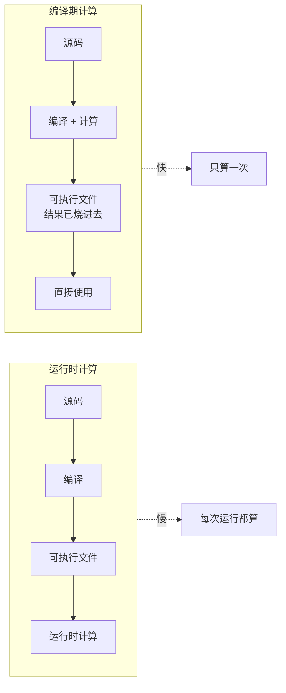
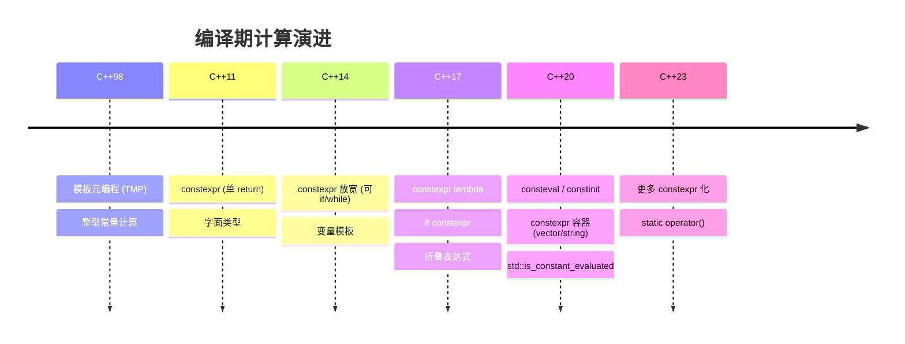

# 第15章：C++ 编译期计算原理

#### 目录介绍
- [引言](#引言)
- [2. 为什么需要编译期计算？](#一为什么需要编译期计算)
- [3. 模板元编程（TMP）](#二模板元编程tmp)
- [4. constexpr函数](#三constexpr函数)
- [5. constexpr变量与对象](#四constexpr变量与对象)
- [6. if constexpr（编译期分支）](#五if-constexpr编译期分支)
- [7. consteval和constinit (C++20)](#六consteval和constinit-c20)
- [8. C++20的constexpr增强](#七c20的constexpr增强)
- [9. 折叠表达式 (C++17)](#八折叠表达式-c17)
- [10. 编译期字符串与反射](#九编译期字符串与反射)
- [11. 编译期计算的实际应用](#十编译期计算的实际应用)
- [12. 用户自定义字面量](#十一用户自定义字面量)
- [13. 编译期计算的性能影响](#十二编译期计算的性能影响)
- [14. 总结](#十三总结)

---

> **案例引入｜"一个表在编译期就算好了，启动快了 300ms"**
>
> 游戏引擎有一段初始化代码：
>
> ```cpp
> std::array<float, 4096> sin_table;
> for (int i = 0; i < 4096; ++i)
>     sin_table[i] = std::sin(i * 2 * PI / 4096);
> ```
>
> 启动时要跑约 300ms（4096 次 sin 调用 + 内存访问）。架构师把它改成：
>
> ```cpp
> constexpr std::array<float, 4096> sin_table = []{
>     std::array<float, 4096> arr{};
>     for (int i = 0; i < 4096; ++i)
>         arr[i] = /* 编译期 sin 近似 */ ...;
>     return arr;
> }();
> ```
>
> 结果：**启动瞬间完成**（表已经烧进可执行文件的只读段）。这就是 `constexpr` 的威力——**把能在编译期做的事全部挪到编译期**。
>
> 从 C++11 的 `constexpr`（只允许单条 return 的函数）到 C++20 的 `consteval`/`constinit`/`constexpr 容器`，C++ 的编译期计算能力已经从"算个常量"演进到了"**编译期写完整程序**"。这篇把十年演进完整串起来。

---

## 00.案例元信息

| 项目 | 说明 |
|------|------|
| 难度 | ★★★★★ |
| 预估阅读 | 80 分钟 |
| 前置知识 | [06.模板与泛型](./06.模板与泛型.md)、[14.类型系统与推导](./14.类型系统与推导.md) |
| 覆盖要点 | TMP 模板元编程、`constexpr` 函数演进、`consteval` / `constinit`、`if constexpr`、折叠表达式、编译期容器、用户自定义字面量、static_assert |
| 核心产出 | 能判断一段代码"能否在编译期执行"；能写出编译期查表、编译期字符串处理 |

---

## 1. 引言

C++ 的一个独特优势是能够在**编译期**完成大量计算。从 C++11 的 `constexpr`（首次允许用户代码在编译期跑）到 C++20 的 `consteval` / `constinit` / constexpr 容器，**编译期计算能力经历了革命性增强**。

### 1.1 编译期 vs 运行时



### 1.2 C++ 编译期计算的演进时间线



### 1.3 本文路线图


### 1.4 本文要回答的核心问题

- `constexpr` / `consteval` / `constinit` 三者**各自强制什么**？使用场景如何区分？
- TMP（模板元编程）和 `constexpr`——**老派 vs 新派**，为什么 C++20 后 TMP 逐渐让位给 `constexpr`？
- `if constexpr` 相比普通 `if` 能做什么额外的事？它的"**编译期分支删除**"原理是什么？
- C++20 `std::is_constant_evaluated()` 是如何"同一份代码、编译期/运行时走不同分支"的？
- **编译期计算无限度扩张**会带来什么后果？（提示：编译时间、二进制大小）

---

## 2. 为什么需要编译期计算？

### 1.1 运行时计算 vs 编译期计算

```
传统方式（运行时计算）：
  源码 → 编译 → 可执行文件 → 运行时计算结果
  
编译期计算：
  源码 → 编译（同时计算）→ 可执行文件（结果已内置）→ 直接使用结果
  
优势：
  1. 零运行时开销：结果在编译时就已确定
  2. 类型安全：错误在编译时暴露
  3. 代码生成优化：编译器可以生成更优的代码
  4. 模板元编程：实现强大的泛型编程
```

### 1.2 C++编译期计算的演进

```
C++98/03: 模板元编程（唯一方式）
  - 利用模板特化进行计算
  - 极其复杂的语法
  - 编译错误信息难以理解

C++11: constexpr 初步引入
  - constexpr函数（严格限制：只能有return语句）
  - constexpr变量
  - 静态断言 static_assert

C++14: constexpr 大幅放宽
  - constexpr函数可以有多条语句、循环、分支
  - constexpr成员函数可以非const

C++17: 更多constexpr能力
  - if constexpr（编译期分支）
  - constexpr lambda
  - 折叠表达式
  - std::array在constexpr中可用

C++20: constexpr 全面升级
  - consteval（强制编译期求值）
  - constinit（强制编译期初始化）
  - constexpr虚函数
  - constexpr动态分配（new/delete）
  - constexpr std::string和std::vector
  - std::is_constant_evaluated()

C++23: 更多constexpr支持
  - constexpr std::unique_ptr
  - if consteval
```

---

## 3. 模板元编程（TMP）

### 2.1 编译期计算的先驱

```cpp
// 在constexpr之前，模板元编程是唯一的编译期计算方式

// 编译期阶乘
template<int N>
struct Factorial {
    static constexpr int value = N * Factorial<N - 1>::value;
};

template<>
struct Factorial<0> {
    static constexpr int value = 1;
};

static_assert(Factorial<5>::value == 120);
static_assert(Factorial<10>::value == 3628800);

// 编译期斐波那契
template<int N>
struct Fibonacci {
    static constexpr int value = 
        Fibonacci<N-1>::value + Fibonacci<N-2>::value;
};

template<> struct Fibonacci<0> { static constexpr int value = 0; };
template<> struct Fibonacci<1> { static constexpr int value = 1; };

static_assert(Fibonacci<10>::value == 55);

// 编译期判断素数
template<int N, int D = N - 1>
struct IsPrime {
    static constexpr bool value = (N % D != 0) && IsPrime<N, D - 1>::value;
};

template<int N>
struct IsPrime<N, 1> {
    static constexpr bool value = true;
};

template<>
struct IsPrime<1, 0> {
    static constexpr bool value = false;
};

static_assert(IsPrime<7>::value);
static_assert(!IsPrime<6>::value);
static_assert(IsPrime<97>::value);
```

### 2.2 模板元编程的类型计算

```cpp
// 类型列表操作
template<typename... Ts>
struct TypeList {};

// 追加类型
template<typename List, typename T>
struct Append;

template<typename... Ts, typename T>
struct Append<TypeList<Ts...>, T> {
    using type = TypeList<Ts..., T>;
};

// 反转类型列表
template<typename List>
struct Reverse;

template<>
struct Reverse<TypeList<>> {
    using type = TypeList<>;
};

template<typename Head, typename... Tail>
struct Reverse<TypeList<Head, Tail...>> {
    using type = typename Append<
        typename Reverse<TypeList<Tail...>>::type, 
        Head
    >::type;
};

// 按索引获取类型
template<typename List, int Index>
struct At;

template<typename Head, typename... Tail>
struct At<TypeList<Head, Tail...>, 0> {
    using type = Head;
};

template<typename Head, typename... Tail, int Index>
struct At<TypeList<Head, Tail...>, Index> {
    using type = typename At<TypeList<Tail...>, Index - 1>::type;
};

// 使用
using Original = TypeList<int, double, char>;
using Reversed = Reverse<Original>::type;
// Reversed = TypeList<char, double, int>

using Second = At<Original, 1>::type;
// Second = double
```

### 2.3 TMP的问题

```
模板元编程的缺点：

1. 语法极其复杂
   - 递归特化模拟循环
   - 偏特化模拟分支
   - 类型别名模拟变量

2. 编译错误信息令人绝望
   - 模板实例化导致极长的错误信息
   - 错误定位困难

3. 编译时间长
   - 每次递归实例化一个新的模板
   - 编译器需要维护大量模板实例

4. 调试困难
   - 无法使用debugger
   - 无法添加printf

5. 代码可读性差
   - 即使是简单的计算也需要大量代码
   - 维护成本高

constexpr的出现大大缓解了这些问题
```

---

## 4. constexpr函数

### 3.1 C++11的constexpr函数

```cpp
// C++11：严格限制
// 只能有一条return语句（可以使用三元运算符和递归）

constexpr int factorial_11(int n) {
    return n <= 1 ? 1 : n * factorial_11(n - 1);
}

constexpr int fibonacci_11(int n) {
    return n <= 1 ? n : fibonacci_11(n - 1) + fibonacci_11(n - 2);
}

// 编译期使用
static_assert(factorial_11(5) == 120);
constexpr int fib10 = fibonacci_11(10);  // 编译期求值

// 运行时也可以使用
int n;
std::cin >> n;
int result = factorial_11(n);  // 运行时求值
```

### 3.2 C++14的constexpr函数

```cpp
// C++14：大幅放宽限制
// 可以有：局部变量、循环、分支、多条语句

constexpr int factorial_14(int n) {
    int result = 1;
    for (int i = 2; i <= n; ++i) {
        result *= i;
    }
    return result;
}

constexpr bool is_prime(int n) {
    if (n < 2) return false;
    if (n == 2) return true;
    if (n % 2 == 0) return false;
    for (int i = 3; i * i <= n; i += 2) {
        if (n % i == 0) return false;
    }
    return true;
}

static_assert(factorial_14(10) == 3628800);
static_assert(is_prime(97));
static_assert(!is_prime(100));

// constexpr排序！
constexpr auto create_sorted_array() {
    std::array<int, 10> arr = {5, 3, 8, 1, 9, 2, 7, 4, 6, 0};
    // 冒泡排序（编译期执行）
    for (size_t i = 0; i < arr.size(); ++i) {
        for (size_t j = 0; j < arr.size() - 1 - i; ++j) {
            if (arr[j] > arr[j + 1]) {
                int temp = arr[j];
                arr[j] = arr[j + 1];
                arr[j + 1] = temp;
            }
        }
    }
    return arr;
}

constexpr auto sorted = create_sorted_array();
// sorted = {0, 1, 2, 3, 4, 5, 6, 7, 8, 9}（在编译期排好序）
```

### 3.3 constexpr中的限制（C++14/17）

```cpp
// C++14/17中constexpr函数不能包含：
// 1. asm语句
// 2. goto语句
// 3. 非constexpr函数调用
// 4. 动态内存分配（C++20之前）
// 5. reinterpret_cast
// 6. 修改全局变量
// 7. try-catch块（C++20之前）

// 但可以包含：
constexpr int example(int n) {
    int x = n;                    // 局部变量 ✓
    if (x > 10) x = 10;         // 分支 ✓
    for (int i = 0; i < x; ++i) {} // 循环 ✓
    int arr[5] = {};             // 局部数组 ✓
    return x;
}
```

---

## 5. constexpr变量与对象

### 4.1 constexpr变量

```cpp
// constexpr变量必须在编译期初始化
constexpr int MAX_SIZE = 100;
constexpr double PI = 3.14159265358979;
constexpr int ARRAY_SIZE = MAX_SIZE * 2;

// 可以用constexpr函数初始化
constexpr int fac5 = factorial_14(5);

// constexpr数组
constexpr int primes[] = {2, 3, 5, 7, 11, 13, 17, 19};
constexpr int num_primes = sizeof(primes) / sizeof(primes[0]);

// const vs constexpr
const int a = 42;           // 编译期常量（如果初始值是常量表达式）
const int b = get_value();   // 运行时常量（初始值不是常量表达式）
constexpr int c = 42;       // 保证编译期常量
// constexpr int d = get_value();  // 错误！（如果get_value不是constexpr）
```

### 4.2 constexpr对象

```cpp
class Point {
public:
    constexpr Point(double x = 0, double y = 0) : x_(x), y_(y) {}
    
    constexpr double x() const { return x_; }
    constexpr double y() const { return y_; }
    
    constexpr double distance_to_origin() const {
        return x_ * x_ + y_ * y_;  // 注意：sqrt不是constexpr
    }
    
    constexpr Point operator+(const Point& other) const {
        return Point(x_ + other.x_, y_ + other.y_);
    }
    
    constexpr bool operator==(const Point& other) const {
        return x_ == other.x_ && y_ == other.y_;
    }
    
private:
    double x_, y_;
};

// 编译期创建和计算
constexpr Point origin(0, 0);
constexpr Point p1(3, 4);
constexpr Point p2(1, 2);
constexpr Point p3 = p1 + p2;
static_assert(p3.x() == 4.0);
static_assert(p3.y() == 6.0);

// 编译期构建查找表
constexpr auto make_squares_table() {
    std::array<int, 100> table{};
    for (int i = 0; i < 100; ++i) {
        table[i] = i * i;
    }
    return table;
}

constexpr auto squares = make_squares_table();
static_assert(squares[9] == 81);
static_assert(squares[12] == 144);
```

---

## 6. if constexpr（编译期分支）

### 5.1 基本用法

```cpp
#include <type_traits>
#include <string>

// if constexpr在编译期决定执行哪个分支
// 未选中的分支不会被实例化（不需要是合法代码）

template<typename T>
auto convert_to_string(T value) {
    if constexpr (std::is_same_v<T, std::string>) {
        return value;  // T是string，直接返回
    } else if constexpr (std::is_arithmetic_v<T>) {
        return std::to_string(value);  // 数值类型转string
    } else if constexpr (std::is_same_v<T, const char*>) {
        return std::string(value);  // C字符串转string
    } else {
        // 对于其他类型，调用to_string成员函数
        return value.to_string();
    }
}

// 对比C++17之前的做法（SFINAE）
// C++17之前需要多个重载和enable_if

// if constexpr消除不可达分支
template<typename T>
void process(T& container) {
    if constexpr (requires { container.reserve(10); }) {
        container.reserve(10);  // 只在有reserve方法时编译
    }
    // 对std::list，上面的分支会被完全丢弃
}
```

### 5.2 if constexpr与模板展开

```cpp
// 编译期遍历元组
template<typename Tuple, size_t... Is>
void print_tuple_impl(const Tuple& t, std::index_sequence<Is...>) {
    ((std::cout << (Is == 0 ? "" : ", ") << std::get<Is>(t)), ...);
}

template<typename... Args>
void print_tuple(const std::tuple<Args...>& t) {
    std::cout << "(";
    print_tuple_impl(t, std::index_sequence_for<Args...>{});
    std::cout << ")\n";
}

// 编译期递归处理变参
template<typename T, typename... Rest>
void print_all(const T& first, const Rest&... rest) {
    std::cout << first;
    if constexpr (sizeof...(rest) > 0) {
        std::cout << ", ";
        print_all(rest...);  // 递归展开
    }
    // 当sizeof...(rest) == 0时，递归在编译期终止
}

// 使用
void demo() {
    print_tuple(std::make_tuple(1, 2.0, "three"));
    // 输出: (1, 2, three)
    
    print_all(1, 2.0, "three", 'A');
    // 输出: 1, 2, three, A
}
```

### 5.3 编译期分支在实际中的应用

```cpp
// 序列化框架
template<typename T>
std::string serialize(const T& value) {
    if constexpr (std::is_integral_v<T>) {
        return "int:" + std::to_string(value);
    } else if constexpr (std::is_floating_point_v<T>) {
        return "float:" + std::to_string(value);
    } else if constexpr (std::is_same_v<T, std::string>) {
        return "string:" + value;
    } else if constexpr (requires { value.begin(); value.end(); }) {
        std::string result = "array:[";
        bool first = true;
        for (const auto& elem : value) {
            if (!first) result += ",";
            result += serialize(elem);
            first = false;
        }
        return result + "]";
    } else {
        static_assert(always_false_v<T>, "Unsupported type");
    }
}

template<typename>
inline constexpr bool always_false_v = false;
```

---

## 7. consteval和constinit (C++20)

### 6.1 consteval：强制编译期求值

```cpp
// consteval函数只能在编译期调用
// 如果不能在编译期求值，会产生编译错误

consteval int compile_time_square(int n) {
    return n * n;
}

constexpr int a = compile_time_square(5);  // OK: 编译期
// int n = 5;
// int b = compile_time_square(n);  // 错误！n不是编译期常量

// 对比constexpr：
constexpr int square(int n) { return n * n; }
int n = 5;
int c = square(n);    // OK: constexpr函数可以在运行时调用
int d = square(5);    // OK: 也可以在编译期调用

// consteval的用途：确保编译期求值
consteval auto make_lookup_table() {
    std::array<int, 256> table{};
    for (int i = 0; i < 256; ++i) {
        table[i] = (i * i) % 256;
    }
    return table;
}

// 保证这个表在编译期构建
constexpr auto lookup = make_lookup_table();
```

### 6.2 constinit：强制编译期初始化

```cpp
// constinit确保变量在编译期初始化
// 但变量本身不一定是const（可以在运行时修改）

// 解决Static Initialization Order Fiasco

// 问题场景：
// file_a.cpp
// int init_a();
// int global_a = init_a();  // 动态初始化，顺序不确定

// file_b.cpp
// extern int global_a;
// int global_b = global_a + 1;  // global_a可能还没初始化！

// 解决方案：constinit
constinit int safe_global = 42;  // 保证编译期初始化
// constinit int bad = runtime_func();  // 错误！不能编译期求值

// constinit + thread_local
constinit thread_local int tl_counter = 0;

// constinit vs constexpr vs const
constexpr int a = 42;  // 编译期常量，不能修改
const int b = 42;       // 常量，不能修改（可能运行时初始化）
constinit int c = 42;   // 编译期初始化，但可以修改！

void modify() {
    // a = 100;  // 错误：constexpr变量不能修改
    // b = 100;  // 错误：const变量不能修改
    c = 100;     // OK：constinit变量可以修改
}
```

### 6.3 std::is_constant_evaluated()

```cpp
#include <type_traits>

constexpr int compute(int n) {
    if (std::is_constant_evaluated()) {
        // 编译期路径：使用简单但安全的算法
        int result = 0;
        for (int i = 0; i < n; ++i) {
            result += i;
        }
        return result;
    } else {
        // 运行时路径：可以使用SIMD等优化
        return n * (n - 1) / 2;
    }
}

// C++23: if consteval
constexpr int compute_23(int n) {
    if consteval {
        // 编译期路径
        int result = 0;
        for (int i = 0; i < n; ++i) result += i;
        return result;
    } else {
        // 运行时路径
        return n * (n - 1) / 2;
    }
}
```

---

## 8. C++20的constexpr增强

### 7.1 constexpr动态内存

```cpp
// C++20允许在constexpr函数中使用new/delete
// 但所有分配的内存必须在同一个constexpr求值中释放

constexpr int compute_with_allocation() {
    int* p = new int(42);     // 编译期new
    int result = *p + 8;
    delete p;                  // 必须在编译期delete
    return result;
}

static_assert(compute_with_allocation() == 50);

// constexpr std::vector（C++20）
constexpr int sum_of_primes() {
    std::vector<int> primes;
    for (int n = 2; n < 50; ++n) {
        bool is_prime = true;
        for (int i = 2; i * i <= n; ++i) {
            if (n % i == 0) { is_prime = false; break; }
        }
        if (is_prime) primes.push_back(n);
    }
    int sum = 0;
    for (int p : primes) sum += p;
    return sum;
    // vector在函数返回前自动销毁，内存被释放
}

static_assert(sum_of_primes() == 328);

// 注意：constexpr中分配的内存不能"泄漏"到运行时
// constexpr std::vector<int> global_vec = {1, 2, 3};  
// 这在某些编译器上可能不支持（transient allocation限制）
```

### 7.2 constexpr std::string

```cpp
// C++20允许constexpr中使用std::string
constexpr std::string make_greeting(const char* name) {
    std::string result = "Hello, ";
    result += name;
    result += "!";
    return result;
}

// 在编译期使用
constexpr auto greeting = make_greeting("World");
// 注意：结果可能作为编译期常量存储

// 编译期字符串处理
constexpr bool starts_with(std::string_view str, std::string_view prefix) {
    return str.substr(0, prefix.size()) == prefix;
}

static_assert(starts_with("Hello, World!", "Hello"));
static_assert(!starts_with("Hello, World!", "World"));

// string_view在constexpr中非常有用（不涉及动态分配）
constexpr std::string_view trim(std::string_view sv) {
    while (!sv.empty() && sv.front() == ' ') sv.remove_prefix(1);
    while (!sv.empty() && sv.back() == ' ') sv.remove_suffix(1);
    return sv;
}

static_assert(trim("  hello  ") == "hello");
```

### 7.3 constexpr虚函数

```cpp
// C++20允许虚函数被声明为constexpr

class Shape {
public:
    constexpr virtual double area() const = 0;
    constexpr virtual ~Shape() = default;
};

class Circle : public Shape {
public:
    constexpr Circle(double r) : radius_(r) {}
    constexpr double area() const override {
        return 3.14159265 * radius_ * radius_;
    }
private:
    double radius_;
};

class Rectangle : public Shape {
public:
    constexpr Rectangle(double w, double h) : width_(w), height_(h) {}
    constexpr double area() const override {
        return width_ * height_;
    }
private:
    double width_, height_;
};

constexpr double compute_area(const Shape& s) {
    return s.area();  // 编译期虚函数调用！
}

// 编译期多态
constexpr Circle c(5.0);
constexpr Rectangle r(3.0, 4.0);
static_assert(compute_area(c) > 78.0);
static_assert(compute_area(r) == 12.0);
```

---

## 9. 折叠表达式 (C++17)

### 8.1 四种折叠形式

```cpp
// 折叠表达式对参数包进行"折叠"操作

// 一元右折叠: (pack op ...)
// 展开为: E1 op (E2 op (... op EN))
template<typename... Args>
auto sum_right(Args... args) {
    return (args + ...);
}
// sum_right(1, 2, 3, 4) → 1 + (2 + (3 + 4)) = 10

// 一元左折叠: (... op pack)
// 展开为: ((E1 op E2) op ...) op EN
template<typename... Args>
auto sum_left(Args... args) {
    return (... + args);
}
// sum_left(1, 2, 3, 4) → ((1 + 2) + 3) + 4 = 10

// 二元右折叠: (pack op ... op init)
template<typename... Args>
auto sum_with_init_right(Args... args) {
    return (args + ... + 0);
}

// 二元左折叠: (init op ... op pack)
template<typename... Args>
auto sum_with_init_left(Args... args) {
    return (0 + ... + args);
}

// 空包处理
template<typename... Args>
auto safe_sum(Args... args) {
    return (args + ... + 0);  // 二元折叠：空包时返回0
}
// safe_sum() = 0
```

### 8.2 折叠表达式的高级应用

```cpp
// 打印所有参数
template<typename... Args>
void print(Args&&... args) {
    (std::cout << ... << args) << std::endl;
}
// print(1, " + ", 2, " = ", 3) → "1 + 2 = 3\n"

// 带分隔符的打印
template<typename... Args>
void print_with_sep(const std::string& sep, Args&&... args) {
    size_t n = 0;
    ((std::cout << (n++ ? sep : "") << args), ...);
    std::cout << std::endl;
}
// print_with_sep(", ", 1, 2, 3) → "1, 2, 3\n"

// 编译期逻辑运算
template<typename... Ts>
constexpr bool all_integral() {
    return (std::is_integral_v<Ts> && ...);
}

template<typename... Ts>
constexpr bool any_floating() {
    return (std::is_floating_point_v<Ts> || ...);
}

static_assert(all_integral<int, short, long>());
static_assert(!all_integral<int, double, long>());
static_assert(any_floating<int, double, long>());

// push_back多个元素
template<typename Container, typename... Args>
void push_all(Container& c, Args&&... args) {
    (c.push_back(std::forward<Args>(args)), ...);
}

// 调用多个函数
template<typename... Funcs>
void call_all(Funcs&&... funcs) {
    (std::forward<Funcs>(funcs)(), ...);
}
```

---

## 10. 编译期字符串与反射

### 9.1 编译期字符串

```cpp
// 固定长度编译期字符串
template<size_t N>
struct FixedString {
    char data[N];
    
    constexpr FixedString(const char (&str)[N]) {
        for (size_t i = 0; i < N; ++i) {
            data[i] = str[i];
        }
    }
    
    constexpr size_t size() const { return N - 1; }
    constexpr char operator[](size_t i) const { return data[i]; }
    
    constexpr bool operator==(const FixedString& other) const {
        for (size_t i = 0; i < N; ++i) {
            if (data[i] != other.data[i]) return false;
        }
        return true;
    }
    
    // 作为非类型模板参数（C++20）
    constexpr operator const char*() const { return data; }
};

// C++20: 类类型的非类型模板参数
template<FixedString Name>
struct NamedEntity {
    static constexpr auto name = Name;
    
    void print() const {
        std::cout << static_cast<const char*>(name) << std::endl;
    }
};

NamedEntity<"Player"> player;
NamedEntity<"Enemy"> enemy;
// "Player"和"Enemy"是不同的模板实例
```

### 9.2 编译期格式检查

```cpp
// 利用consteval在编译期检查格式字符串
template<size_t N>
struct FormatString {
    const char data[N];
    int num_placeholders;
    
    consteval FormatString(const char (&str)[N]) : data{}, num_placeholders(0) {
        for (size_t i = 0; i < N; ++i) {
            data[i] = str[i];
        }
        for (size_t i = 0; i < N - 1; ++i) {
            if (data[i] == '{' && data[i + 1] == '}') {
                ++num_placeholders;
            }
        }
    }
};

template<FormatString Fmt, typename... Args>
void safe_print(Args&&... args) {
    static_assert(Fmt.num_placeholders == sizeof...(Args),
                  "Number of arguments doesn't match format string");
    // 实际格式化和输出...
}

// safe_print<"Hello {} and {}">("Alice", "Bob");  // OK
// safe_print<"Hello {}">("Alice", "Bob");          // 编译错误！
```

---

## 11. 编译期计算的实际应用

### 10.1 编译期查找表

```cpp
// 编译期生成CRC32查找表
constexpr auto make_crc32_table() {
    std::array<uint32_t, 256> table{};
    for (uint32_t i = 0; i < 256; ++i) {
        uint32_t crc = i;
        for (int j = 0; j < 8; ++j) {
            if (crc & 1)
                crc = (crc >> 1) ^ 0xEDB88320;
            else
                crc >>= 1;
        }
        table[i] = crc;
    }
    return table;
}

constexpr auto crc32_table = make_crc32_table();

constexpr uint32_t crc32(const char* data, size_t len) {
    uint32_t crc = 0xFFFFFFFF;
    for (size_t i = 0; i < len; ++i) {
        uint8_t byte = static_cast<uint8_t>(data[i]);
        crc = (crc >> 8) ^ crc32_table[(crc ^ byte) & 0xFF];
    }
    return crc ^ 0xFFFFFFFF;
}

// 编译期计算字符串的CRC32
constexpr uint32_t hash = crc32("Hello, World!", 13);
static_assert(hash == 0xEC4AC3D0);  // 编译期验证

// 用于编译期字符串哈希（switch-case中使用字符串）
constexpr uint32_t operator""_hash(const char* str, size_t len) {
    return crc32(str, len);
}

void handle_command(const std::string& cmd) {
    switch (crc32(cmd.c_str(), cmd.size())) {
        case "help"_hash:
            show_help();
            break;
        case "quit"_hash:
            quit();
            break;
        case "load"_hash:
            load();
            break;
    }
}
```

### 10.2 编译期正则表达式

```cpp
// 简化版：编译期正则匹配器

template<size_t N>
struct Pattern {
    char data[N];
    constexpr Pattern(const char (&str)[N]) {
        for (size_t i = 0; i < N; ++i) data[i] = str[i];
    }
};

// 编译期匹配简单的模式
constexpr bool match(const char* text, const char* pattern) {
    if (*pattern == '\0') return *text == '\0';
    if (*pattern == '*') {
        // '*' 匹配任意数量的字符
        return match(text, pattern + 1) || 
               (*text != '\0' && match(text + 1, pattern));
    }
    if (*pattern == '?' || *pattern == *text) {
        return *text != '\0' && match(text + 1, pattern + 1);
    }
    return false;
}

static_assert(match("hello", "h*o"));
static_assert(match("hello", "h?llo"));
static_assert(!match("hello", "h?lo"));
static_assert(match("test.cpp", "*.cpp"));
```

### 10.3 编译期状态机

```cpp
// 编译期有限状态机
enum class State { Start, InNumber, InString, Error, End };
enum class Token { Number, String, Unknown };

struct LexResult {
    Token token;
    int start;
    int end;
};

constexpr LexResult lex_next(const char* input, int pos) {
    State state = State::Start;
    int start = pos;
    
    while (input[pos] != '\0') {
        char c = input[pos];
        
        switch (state) {
            case State::Start:
                if (c >= '0' && c <= '9') {
                    state = State::InNumber;
                    start = pos;
                } else if (c >= 'a' && c <= 'z') {
                    state = State::InString;
                    start = pos;
                } else if (c == ' ') {
                    ++pos;
                    continue;
                } else {
                    return {Token::Unknown, pos, pos + 1};
                }
                break;
            case State::InNumber:
                if (!(c >= '0' && c <= '9')) {
                    return {Token::Number, start, pos};
                }
                break;
            case State::InString:
                if (!(c >= 'a' && c <= 'z')) {
                    return {Token::String, start, pos};
                }
                break;
            default:
                break;
        }
        ++pos;
    }
    
    if (state == State::InNumber) return {Token::Number, start, pos};
    if (state == State::InString) return {Token::String, start, pos};
    return {Token::Unknown, pos, pos};
}

// 编译期词法分析
constexpr auto result = lex_next("42 hello", 0);
static_assert(result.token == Token::Number);
static_assert(result.start == 0);
static_assert(result.end == 2);
```

---

## 12. 用户自定义字面量

### 11.1 字面量运算符

```cpp
// 用户自定义字面量

// 整数字面量
constexpr long long operator""_KB(unsigned long long n) {
    return n * 1024;
}

constexpr long long operator""_MB(unsigned long long n) {
    return n * 1024 * 1024;
}

constexpr long long operator""_GB(unsigned long long n) {
    return n * 1024LL * 1024 * 1024;
}

static_assert(64_KB == 65536);
static_assert(1_MB == 1048576);
static_assert(2_GB == 2147483648LL);

// 浮点字面量
constexpr long double operator""_deg(long double d) {
    return d * 3.14159265358979L / 180.0L;
}

constexpr auto right_angle = 90.0_deg;  // π/2

// 字符串字面量
std::string operator""_s(const char* str, size_t len) {
    return std::string(str, len);
}

auto greeting = "Hello"_s;  // std::string

// 标准库的字面量
using namespace std::chrono_literals;
auto duration = 100ms;    // std::chrono::milliseconds(100)
auto timeout = 5s;        // std::chrono::seconds(5)

using namespace std::string_literals;
auto str = "hello"s;      // std::string("hello")

using namespace std::string_view_literals;
auto sv = "hello"sv;      // std::string_view("hello")
```

---

## 13. 编译期计算的性能影响

### 12.1 编译时间 vs 运行时间

```
权衡：
  - 编译期计算增加编译时间
  - 但减少运行时间
  - 最终的可执行文件可能更小（因为计算被折叠为常量）

编译时间的影响因素：
  1. 模板实例化的深度和数量
  2. constexpr函数的复杂度
  3. 编译器的constexpr求值限制
  
GCC/Clang的限制：
  - constexpr求值步数限制（默认约100万步）
  - 可以通过编译选项调整：
    -fconstexpr-steps=N（GCC）
    -fconstexpr-steps=N（Clang）
  - 模板递归深度限制（默认约1024层）
    -ftemplate-depth=N

最佳实践：
  - 查找表等一次性计算 → 非常适合编译期
  - 复杂的数据处理 → 权衡编译时间
  - 频繁变化的计算逻辑 → 可能不适合（每次改动都要重新编译）
```

### 12.2 编译期 vs 运行时的选择

```
适合编译期计算的：
  ✅ 常量表达式（数学常量、查找表）
  ✅ 类型检查和约束验证
  ✅ 格式字符串检查
  ✅ 配置文件解析（如果是编译期已知的）
  ✅ 哈希计算（用于switch-case）
  ✅ 小型数据结构的初始化
  
不适合编译期计算的：
  ❌ 需要用户输入的计算
  ❌ 需要IO操作的计算
  ❌ 极其复杂的算法（编译时间过长）
  ❌ 需要频繁修改的逻辑
  ❌ 涉及操作系统API的操作
```

---

## 14. 总结

### 13.1 编译期计算能力图谱

```
C++编译期计算
├── 模板元编程 (C++98)
│   ├── 模板特化计算
│   ├── 类型列表操作
│   └── SFINAE
├── constexpr (C++11/14/17/20)
│   ├── constexpr变量
│   ├── constexpr函数
│   ├── constexpr if (C++17)
│   ├── consteval (C++20)
│   ├── constinit (C++20)
│   └── constexpr new/delete (C++20)
├── static_assert (C++11)
├── 折叠表达式 (C++17)
├── Concepts (C++20)
├── 用户自定义字面量 (C++11)
└── NTTP (Non-Type Template Parameters)
    ├── 整数/枚举 (C++98)
    ├── 指针/引用 (C++98)
    ├── auto (C++17)
    └── 类类型 (C++20)
```

### 13.2 最佳实践

```
1. 优先使用constexpr而非模板元编程
   - constexpr函数更易读、易写、易调试
   - 模板元编程仅用于类型计算

2. 合理使用consteval
   - 对于必须在编译期完成的计算
   - 防止意外的运行时调用

3. 使用if constexpr替代SFINAE
   - 更清晰的条件分支
   - 更好的错误信息

4. 利用编译期查找表
   - CRC表、三角函数表等
   - 零运行时开销

5. 编译期验证
   - static_assert检查约束
   - consteval函数检查输入合法性

6. 注意编译时间
   - 复杂的编译期计算会增加编译时间
   - 使用编译缓存和增量编译缓解
```

---

## 参考资源

1. **"C++ Templates: The Complete Guide (2nd Edition)"** - 模板元编程的权威参考
2. **Jason Turner "constexpr Everything"** - CppCon演讲
3. **Ben Deane & Jason Turner "constexpr ALL the things!"** - CppCon演讲
4. **cppreference.com constexpr** - constexpr的完整规范
5. **P1073 "constexpr! functions"** - consteval提案
6. **P1143 "constinit"** - constinit提案

---

## 附录：深挖——编译期计算的机制拾遗

### Z.1 constexpr 从"建议"到"契约"的演化

C++11 的 `constexpr` 函数有严格限制：单条 `return` 语句、没有局部变量、没有循环。那时它更像是"受限的内联函数"。

C++14 放开：允许局部变量、循环、`if/switch`——可以写"几乎任意算法"。C++17 加入 `if constexpr`（编译期分支），彻底解锁。C++20 加入动态内存（`std::vector` 在 constexpr 里可用）和虚函数，让编译期能运行"几乎完整的 C++"。

这个渐进过程背后的哲学转变：**从"让编译器生成常量"到"让编译期成为完整的语言"**。今天你可以在编译期解析 JSON、构造正则表达式自动机、生成查找表。constexpr 不再是优化手段，是一种**编程范式**。

### Z.2 constexpr、consteval、constinit 的三角关系

C++20 把 `constexpr` 的单一概念拆成了三个正交维度：

- **`constexpr`**：**可以**在编译期求值，也可以在运行期求值。
- **`consteval`**：**必须**在编译期求值（immediate function），运行期调用是编译错误。
- **`constinit`**：**变量**必须在编译期初始化（避免"静态初始化顺序地狱"），但之后可修改。

选择指南：
- 写普通编译期工具函数 → `constexpr`（最灵活）；
- 写必须在编译期完成的东西（如类型信息生成器）→ `consteval`；
- 声明全局/静态变量 → `constinit`（保证零初始化开销）。

这三个关键字看起来重复，实际上精确表达了三种不同的**编译期契约**。

### Z.3 为什么 `constexpr` 不等于"更快"

常见误解："加 `constexpr` 能让代码更快。"

事实是：`constexpr` 函数**在运行期被调用时**，和普通函数没有任何区别。它更快的唯一可能是——编译器决定在编译期求值了它的某次调用，把结果"内联"成一个常量。

所以加 `constexpr` 的真正价值是：
1. **能被用在常量表达式里**（数组大小、模板参数、`static_assert`）；
2. **让编译器有机会优化**（它不保证优化）。

但代价是：**限制了你能写的代码**（C++20 之前不能用动态内存、不能抛异常等）。所以"能 `constexpr` 就 `constexpr`"不是万能真理——要看是否真的有编译期使用场景。

### Z.4 `if constexpr` 为什么是革命性的

C++17 之前，模板里的"条件编译"要靠 SFINAE 或 tag dispatch：

```cpp
// 旧：需要两个重载 + 类型判断
template<class T>
void print(T x, std::true_type) { /* 整型版本 */ }
template<class T>
void print(T x, std::false_type) { /* 其他版本 */ }
```

C++17 起：

```cpp
template<class T>
void print(T x) {
    if constexpr (std::is_integral_v<T>) { /* 整型版本 */ }
    else                                  { /* 其他版本 */ }
}
```

不同在于：`if constexpr` 会让**未走到的分支彻底从实例化中消失**——即使那个分支在运行期 if 里会编译错误，也没问题。这让模板代码的"分支"真正等价于"独立函数"，写法和可读性完全升级。

这是 C++17 最被低估的特性之一——它让模板元编程从"专家技能"降到了"普通人能写"的水平。

### Z.5 编译期反射在路上，但现在能做什么

完整的反射（像 Java 的 `Class.getMethods`）还在 C++26 路上，但今天我们能用类型系统 + `constexpr` 做**受限的反射**：

- 检查类型特性（`is_aggregate`、`is_standard_layout`）；
- 运行时获取类型名（`typeid(T).name()`，但结果是 mangled）；
- 编译期获取字符串（`std::source_location::file_name()`）；
- 用 `std::is_detected`（非标准但很有用）检查"T 是否有 foo() 成员"。

这些组合起来能覆盖大部分"反射式"需求——比如序列化库 `nlohmann/json`、测试框架 `doctest` 都是靠编译期技巧做到了"反射式 API"。

### Z.6 编译期计算的成本：编译时间

所有编译期计算都有一个隐形代价：**编译时间**。每一个 `constexpr` 函数的求值都要启动一个小型解释器（编译器内嵌的 constexpr evaluator）。重度使用编译期计算的项目，编译时间可能是"普通 C++"的 3-10 倍。

缓解方式：
- **模块化编译**：把重度 constexpr 代码隔离在单独 .cpp，避免每次改都重编一堆头文件；
- **C++20 Modules**：比头文件快很多；
- **显式实例化**：大模板实例放到专门的 .cpp；
- **ccache / distcc**：加速重复编译。

所以编译期计算是个工具不是银弹——用在合适的地方是质的飞跃，泛滥使用会把编译时间拖垮。
