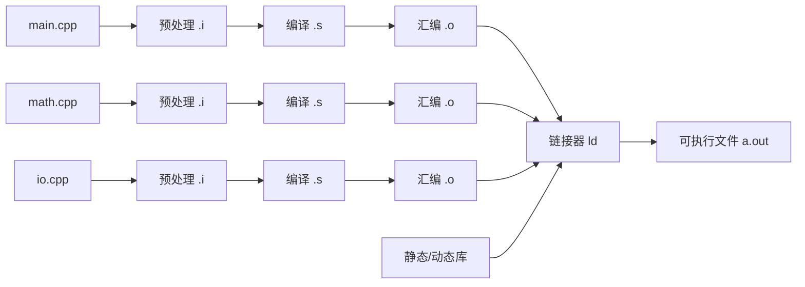

# 第16章：C++ 编译链接与演进

#### 目录介绍
- [1. 引言：从源码到可执行文件的旅程](#一引言从源码到可执行文件的旅程)
- [2. 预处理阶段：宏与条件编译](#二预处理阶段宏与条件编译)
- [3. 编译阶段：从源码到目标文件](#三编译阶段从源码到目标文件)
- [4. 链接阶段：符号解析与重定位](#四链接阶段符号解析与重定位)
- [5. 名字修饰与ABI兼容性](#五名字修饰与abi兼容性)
- [6. 头文件包含模型的演进](#六头文件包含模型的演进)
- [7. ODR规则与内联机制](#七odr规则与内联机制)
- [8. 静态库与动态库原理](#八静态库与动态库原理)
- [9. 命名空间与作用域设计](#九命名空间与作用域设计)
- [10. C++17核心新特性原理](#十c17核心新特性原理)
- [11. C++20核心新特性原理](#十一c20核心新特性原理)
- [12. C++23及未来演进方向](#十二c23及未来演进方向)
- [13. Modules模块系统深度解析](#十三modules模块系统深度解析)
- [14. Concepts概念约束原理](#十四concepts概念约束原理)
- [15. Ranges与协程的设计哲学](#十五ranges与协程的设计哲学)
- [16. C++工程实践与编译优化](#十六c工程实践与编译优化)
- [17. 总结与C++全景知识图谱](#十七总结与c全景知识图谱)

---

> **案例引入｜"`hello.cpp` 里一行 `#include <iostream>` 竟然等价于 3 万行代码"**
>
> 新人小 B 写了一个 `hello.cpp`——就打印一句 "Hello"。`g++ -E hello.cpp | wc -l` 一看：**28,456 行**。他震惊："我就写了 7 行代码，怎么展开成了三万行？"
>
> 更大的困惑来自隔壁文件：明明 `main.cpp` 里只写了 `extern int add(int, int);`，为什么编译链接后能找到 `math.cpp` 里的 `add` 函数？`undefined reference` 又是从哪一步冒出来的？
>
> 这些问题的答案都在 C++ 的 "**分离编译模型**"里——它继承自 C 语言，是 C++ 和 Java / Python 最大的**工程模型差异**：每个 `.cpp` 独立编译、链接器负责"拼装"。这个模型带来了极致的效率，也带来了 ODR、模板实例化、ABI 兼容这些独特话题。
>
> 本文是第三卷**收官之作**，把"从源码到可执行文件"的全流程与"C++11-23 十年特性演进"放在一起——帮你建立对"**C++ 作为一门工程语言**"的完整图像。

---

## 00.案例元信息

| 项目 | 说明 |
|------|------|
| 难度 | ★★★★★ |
| 预估阅读 | 120 分钟 |
| 前置知识 | 本卷前 15 篇的核心概念 |
| 覆盖要点 | 预处理 / 编译 / 汇编 / 链接四阶段、ODR、名字修饰、静态库 / 动态库、C++17/20/23 特性总览、Modules、Concepts、Ranges、协程 |
| 核心产出 | 能独立排查任意链接错误；能解释 C++ 每个版本的核心特性在解决什么问题 |

---

## 1. 引言：从源码到可执行文件

### 1.1 一段代码引发的思考

```cpp
// main.cpp
#include <iostream>

extern int add(int a, int b);  // 声明在别处定义的函数

int main() {
    std::cout << add(3, 4) << std::endl;
    return 0;
}
```

```cpp
// math.cpp
int add(int a, int b) {
    return a + b;
}
```

**疑惑**：当我们写下 `#include <iostream>` 时，编译器到底做了什么？`extern` 声明的函数如何在链接时找到？为什么有时候会出现"undefined reference"错误？多个 `.cpp` 文件是如何最终合并成一个可执行文件的？

### 1.2 C++ 分离编译模型全景



每个 `.cpp` 独立经历 **4 个阶段**：

| 阶段 | 工具 | 输入 | 输出 | 职责 |
|------|------|------|------|------|
| 预处理 | `cpp` | `.cpp` | `.i` | `#include` 展开、`#define` 替换、条件编译 |
| 编译 | `cc1plus` | `.i` | `.s` | 语法分析、类型检查、优化、生成汇编 |
| 汇编 | `as` | `.s` | `.o` | 汇编指令 → 机器码 |
| 链接 | `ld` | 多个 `.o` | `a.out` | 符号解析、重定位、合并段 |

### 1.3 本文路线图


### 1.4 本文要回答的核心问题

- `#include` 到底做了什么？为什么"`#include` 一行展开出几万行"、这个代价能不能省？
- **ODR**（One Definition Rule）的完整三条规则是什么？为什么模板/内联函数能出现在多个 TU？
- `undefined reference` 有几种**根本原因**？每种如何排查？
- C++20 的 **Modules** 和 C++17 相比，到底解决了头文件模型的什么痛点？实战为什么还没普及？
- Concepts / Ranges / 协程——**三者对编程范式的影响**和使用边界？

### 1.5 一段代码引发的思考（续）

```cpp
// main.cpp
#include <iostream>

extern int add(int a, int b);  // 声明在别处定义的函数

int main() {
    std::cout << add(3, 4) << std::endl;
    return 0;
}
```

```cpp
// math.cpp
int add(int a, int b) {
    return a + b;
}
```

**疑惑**：当我们写下 `#include <iostream>` 时，编译器到底做了什么？`extern` 声明的函数如何在链接时找到？为什么有时候会出现"undefined reference"错误？多个 `.cpp` 文件是如何最终合并成一个可执行文件的？

### 1.2 C++编译模型的独特之处

C++继承了C语言的**分离编译模型（Separate Compilation Model）**，这是它区别于Java、Python等语言的关键特征：

```
源文件(.cpp) → 预处理 → 编译 → 汇编 → 目标文件(.o) → 链接 → 可执行文件
```

这个模型的核心思想是**编译单元（Translation Unit）**的独立性——每个 `.cpp` 文件被独立编译，最后由链接器合并：

```
main.cpp  →  预处理  →  编译  →  main.o  ─┐
                                              ├→  链接器  →  a.out
math.cpp  →  预处理  →  编译  →  math.o  ─┘
```

### 1.3 编译过程全景图

```
┌─────────────────────────────────────────────────────────┐
│                    C++ 编译全景流程                        │
│                                                         │
│  ┌──────────┐    ┌──────────┐    ┌──────────┐          │
│  │ .cpp文件  │    │ .h/.hpp  │    │ 标准库头  │          │
│  └────┬─────┘    └────┬─────┘    └────┬─────┘          │
│       │               │               │                 │
│       └───────────────┼───────────────┘                 │
│                       ▼                                 │
│              ┌────────────────┐                         │
│              │  预处理器(cpp)  │   宏展开/头文件包含       │
│              └───────┬────────┘                         │
│                      ▼                                  │
│              ┌────────────────┐                         │
│              │  编译器前端     │   词法/语法/语义分析       │
│              └───────┬────────┘                         │
│                      ▼                                  │
│              ┌────────────────┐                         │
│              │  编译器后端     │   优化 + 代码生成         │
│              └───────┬────────┘                         │
│                      ▼                                  │
│              ┌────────────────┐                         │
│              │  汇编器(as)    │   生成目标文件.o          │
│              └───────┬────────┘                         │
│                      ▼                                  │
│     ┌────────────────────────────────┐                  │
│     │          链接器(ld)            │                  │
│     │  符号解析 + 重定位 + 合并段     │                  │
│     └───────────────┬────────────────┘                  │
│                     ▼                                   │
│              ┌────────────────┐                         │
│              │  可执行文件     │   ELF / Mach-O / PE     │
│              └────────────────┘                         │
└─────────────────────────────────────────────────────────┘
```

### 1.4 用命令行观察每个阶段

```bash
# 1. 仅预处理（-E）
g++ -E main.cpp -o main.i

# 2. 预处理 + 编译（-S）
g++ -S main.cpp -o main.s

# 3. 预处理 + 编译 + 汇编（-c）
g++ -c main.cpp -o main.o

# 4. 完整流程
g++ main.cpp math.cpp -o program

# 查看详细过程
g++ -v main.cpp math.cpp -o program
```

**结果展示**：预处理后的 `main.i` 文件通常有数万行（因为展开了 `<iostream>`），而原始 `main.cpp` 只有几行，这直观展示了预处理的工作量。

---

## 2. 预处理阶段：宏与条件编译

### 2.1 预处理器的工作原理

预处理器是一个**文本替换引擎**，它在编译器真正开始语法分析之前工作：

```cpp
// 预处理器主要做以下工作：
// 1. 头文件包含（#include）
// 2. 宏定义与展开（#define）
// 3. 条件编译（#if / #ifdef / #ifndef）
// 4. 行号控制（#line）
// 5. 错误生成（#error）
// 6. 编译器指令（#pragma）
```

### 2.2 #include 的本质：文本替换

```cpp
// utils.h
#ifndef UTILS_H
#define UTILS_H
inline int square(int x) { return x * x; }
#endif
```

```cpp
// main.cpp
#include "utils.h"
int main() {
    return square(5);
}
```

**预处理后的实际内容**：`utils.h` 的所有内容被复制粘贴到 `#include` 所在位置。如果两个头文件互相包含且没有Include Guard，就会导致无限递归编译错误。

### 2.3 宏展开的完整过程

```cpp
// 对象宏
#define PI 3.14159265358979
#define MAX_SIZE 1024

// 函数宏
#define MAX(a, b) ((a) > (b) ? (a) : (b))
#define SQUARE(x) ((x) * (x))

// 字符串化
#define STRINGIFY(x) #x
#define TO_STRING(x) STRINGIFY(x)

// 连接
#define CONCAT(a, b) a##b

// 可变参数宏
#define LOG(fmt, ...) printf("[LOG] " fmt "\n", ##__VA_ARGS__)

int main() {
    double area = PI * SQUARE(5.0);
    // 展开为: 3.14159265358979 * ((5.0) * (5.0))
    
    int m = MAX(3, 7);
    // 展开为: ((3) > (7) ? (3) : (7))
    
    const char* name = STRINGIFY(hello);
    // 展开为: "hello"
    
    int CONCAT(var, 1) = 42;
    // 展开为: int var1 = 42;
}
```

### 2.4 宏的陷阱与规避

```cpp
// 陷阱1：副作用
#define SQUARE(x) ((x) * (x))
int a = 5;
int result = SQUARE(a++);
// 展开为: ((a++) * (a++))  → 未定义行为！

// 陷阱2：运算符优先级
#define BAD_MULTIPLY(a, b) a * b
int r = BAD_MULTIPLY(2 + 3, 4 + 5);
// 展开为: 2 + 3 * 4 + 5 = 19（期望45）
// 正确写法
#define GOOD_MULTIPLY(a, b) ((a) * (b))

// 陷阱3：多语句宏
#define BAD_SWAP(a, b) { int t = a; a = b; b = t; }
if (condition)
    BAD_SWAP(x, y);   // if-else匹配出错
else
    doSomething();
// do-while-0 惯用法解决
#define SAFE_SWAP(a, b) do { int t = (a); (a) = (b); (b) = t; } while(0)
```

### 2.5 条件编译的实际应用

```cpp
// 平台适配
#if defined(_WIN32) || defined(_WIN64)
    #define PLATFORM_WINDOWS
    #include <windows.h>
#elif defined(__linux__)
    #define PLATFORM_LINUX
    #include <unistd.h>
#elif defined(__APPLE__)
    #define PLATFORM_MACOS
    #include <TargetConditionals.h>
#endif

// 调试开关
#ifdef DEBUG
    #define ASSERT(expr) \
        do { \
            if (!(expr)) { \
                fprintf(stderr, "Assertion failed: %s\n  File: %s, Line: %d\n", \
                        #expr, __FILE__, __LINE__); \
                abort(); \
            } \
        } while(0)
#else
    #define ASSERT(expr) ((void)0)
#endif

// C++标准版本检测
#if __cplusplus >= 202002L
    #include <concepts>
    #include <ranges>
#elif __cplusplus >= 201703L
    #include <optional>
    #include <variant>
#endif

// 特性检测宏（C++20起标准化）
#if __has_include(<filesystem>)
    #include <filesystem>
    namespace fs = std::filesystem;
#elif __has_include(<experimental/filesystem>)
    #include <experimental/filesystem>
    namespace fs = std::experimental::filesystem;
#endif
```

### 2.6 预定义宏

```cpp
#include <cstdio>
int main() {
    printf("文件: %s\n", __FILE__);
    printf("行号: %d\n", __LINE__);
    printf("函数: %s\n", __func__);
    printf("日期: %s\n", __DATE__);
    printf("时间: %s\n", __TIME__);
    printf("C++标准: %ld\n", __cplusplus);
    // 201103L=C++11, 201402L=C++14, 201703L=C++17
    // 202002L=C++20, 202302L=C++23
}
```

---

## 3. 编译阶段：从源码到目标文件

### 3.1 编译器前端：词法与语法分析

```
源代码文本
    │
    ▼
┌─────────────────┐
│   词法分析器     │  字符流 → Token流
│   (Lexer)       │  int → 关键字, x → 标识符, = → 运算符
└────────┬────────┘
         ▼
┌─────────────────┐
│   语法分析器     │  Token流 → AST（抽象语法树）
│   (Parser)      │
└────────┬────────┘
         ▼
┌─────────────────┐
│   语义分析器     │  类型检查、名字查找、重载决议
│   (Sema)        │
└────────┬────────┘
         ▼
┌─────────────────┐
│   中间表示(IR)   │  LLVM IR / GCC GIMPLE
└────────┬────────┘
         ▼
┌─────────────────┐
│   优化器         │  多轮优化Pass
└────────┬────────┘
         ▼
┌─────────────────┐
│   代码生成器     │  生成目标平台机器码
└─────────────────┘
```

### 3.2 用Clang观察AST

```cpp
// example.cpp
int factorial(int n) {
    if (n <= 1) return 1;
    return n * factorial(n - 1);
}
```

```bash
clang -Xclang -ast-dump -fsyntax-only example.cpp
```

**输出（简化）**：

```
TranslationUnitDecl
└─FunctionDecl 'factorial' 'int (int)'
  ├─ParmVarDecl 'n' 'int'
  └─CompoundStmt
    ├─IfStmt
    │  ├─BinaryOperator '<='
    │  │  ├─DeclRefExpr 'n'
    │  │  └─IntegerLiteral 1
    │  └─ReturnStmt
    │    └─IntegerLiteral 1
    └─ReturnStmt
      └─BinaryOperator '*'
        ├─DeclRefExpr 'n'
        └─CallExpr 'factorial'
```

### 3.3 编译器优化级别

```bash
g++ -O0 main.cpp -o main   # 无优化（调试友好）
g++ -O1 main.cpp -o main   # 基本优化
g++ -O2 main.cpp -o main   # 推荐优化级别
g++ -O3 main.cpp -o main   # 激进优化
g++ -Os main.cpp -o main   # 优化代码大小
g++ -Ofast main.cpp -o main # 最激进（可能违反标准）
```

**主要优化技术**：

| 优化技术 | 说明 |
|---------|------|
| 常量折叠 | `int x = 3 + 5` → `int x = 8` |
| 死代码消除 | `if(false){...}` → 删除 |
| 内联展开 | 调用处替换为函数体 |
| 循环展开 | 减少循环控制开销 |
| 尾调用优化 | 尾递归转为循环 |
| 向量化(SIMD) | 利用CPU并行计算指令 |
| 链接时优化(LTO) | 跨编译单元全局优化 |

### 3.4 目标文件的结构

```
┌──────────────────────┐
│    ELF Header        │  文件类型、架构、入口点
├──────────────────────┤
│    .text             │  机器代码（函数体）
├──────────────────────┤
│    .rodata           │  只读数据（字符串常量等）
├──────────────────────┤
│    .data             │  已初始化的全局/静态变量
├──────────────────────┤
│    .bss              │  未初始化的全局/静态变量
├──────────────────────┤
│    .symtab           │  符号表
├──────────────────────┤
│    .rel.text         │  重定位信息
├──────────────────────┤
│    .debug_info       │  调试信息（-g 时生成）
└──────────────────────┘
```

```bash
# 查看段信息
objdump -h main.o
# 查看符号表
nm main.o
# 查看反汇编
objdump -d main.o
```

---

## 4. 链接阶段：符号解析与重定位

### 4.1 链接器的核心任务

```
1. 符号解析（Symbol Resolution）
   → 将每个符号引用关联到唯一的符号定义

2. 重定位（Relocation）
   → 合并段 + 修正地址引用

3. 段合并（Section Merging）
   → 将所有.o文件的同名段合并
```

```
main.o:          math.o:          最终可执行文件:
┌────────┐      ┌────────┐      ┌─────────┐
│ .text  │      │ .text  │      │ .text   │
│ main() │  +   │ add()  │  →   │ main()  │
├────────┤      ├────────┤      │ add()   │
│ .data  │      │ .data  │      ├─────────┤
│ g1     │      │ g2     │      │ .data   │
└────────┘      └────────┘      │ g1, g2  │
                                └─────────┘
```

### 4.2 符号的分类

```cpp
// 1. 强符号：函数定义、已初始化的全局变量
int global_init = 42;           // 强符号
void func() { }                 // 强符号

// 2. 弱符号：未初始化的全局变量（C语言中）
int global_uninit;              // 弱符号

// 3. 外部符号引用
extern int external_var;        // 引用
extern void external_func();    // 引用

// 4. 局部符号：static修饰，不参与链接
static int local_var = 10;      // 局部符号
static void helper() { }        // 局部符号
```

**链接器符号解析规则**：

```
规则1: 不允许多个同名强符号 → "multiple definition of ..."
规则2: 一个强符号 + 多个弱符号 → 选择强符号
规则3: 多个弱符号 → 随机选择一个（危险！）
```

### 4.3 经典链接错误分析

```cpp
// 错误1: undefined reference
extern void foo();
int main() { foo(); }
// 链接错误: undefined reference to 'foo()'
// 原因: 声明了但没有定义，也没有链接包含foo的库

// 错误2: multiple definition
// a.cpp:  int counter = 0;    // 强符号
// b.cpp:  int counter = 0;    // 又一个强符号
// 链接时: multiple definition of 'counter'

// 错误3: 头文件中定义了非内联函数
// utils.h
int helper(int x) { return x * 2; }
// a.cpp: #include "utils.h"  → helper编译进a.o
// b.cpp: #include "utils.h"  → helper又编译进b.o
// 链接时: multiple definition of 'helper(int)'
// 解决: 加inline、加static、或只在头文件中声明
```

### 4.4 重定位过程详解

编译 `main.cpp` 时，编译器不知道 `add` 函数的最终地址，所以在目标文件中留下"占位符"并记录重定位条目。链接时，链接器确定 `add()` 的最终地址（例如 `0x401030`），用实际地址替换占位符。

```bash
# 实验：观察符号
g++ -c demo_a.cpp -o demo_a.o
nm demo_a.o
# U _Z12print_from_bv    ← U=Undefined（需要链接时解析）
# T _Z12print_from_av    ← T=在.text段中已定义
```

---

## 5. 名字修饰与ABI兼容性

### 5.1 为什么需要名字修饰

**疑惑**：C语言没有名字修饰，为什么C++需要？

**答疑**：因为C++支持**函数重载**、**命名空间**和**类成员函数**——多个函数可以同名但参数不同，链接器需要区分它们。

```cpp
int func(int x);          // 修饰后: _Z4funci
int func(double x);       // 修饰后: _Z4funcd
int func(int x, int y);   // 修饰后: _Z4funcii

namespace math {
    int func(int x);      // 修饰后: _ZN4math4funcEi
}

class MyClass {
    int func(int x);      // 修饰后: _ZN7MyClass4funcEi
};
```

### 5.2 Itanium ABI名字修饰规则

```
修饰后的名字结构:
_Z + [嵌套名前缀N] + 名字长度 + 名字 + [嵌套名后缀E] + 参数类型编码

类型编码:
  v=void  b=bool  c=char  i=int  l=long  f=float  d=double
  P=指针  R=左值引用  O=右值引用  K=const
```

### 5.3 extern "C"：桥接C和C++

```cpp
// C++代码调用C库
extern "C" {
    int c_function(int x);
    void c_callback(void* data);
}

// 常见的头文件保护模式
#ifdef __cplusplus
extern "C" {
#endif
    int lib_init(void);
    void lib_cleanup(void);
#ifdef __cplusplus
}
#endif
```

`extern "C"` 告诉编译器使用C的链接约定——不进行名字修饰，使得C++和C代码可以互相调用。

### 5.4 ABI兼容性问题

```
ABI（Application Binary Interface）定义了：
  1. 名字修饰规则        4. 异常处理机制
  2. 调用约定            5. 对象内存布局
  3. 虚函数表布局        6. 标准库实现
```

**常见ABI不兼容场景**：不同编译器版本编译的库链接（如GCC 5改变了`std::string`实现从COW到SSO）、不同编译选项导致结构体大小不一致等。

```bash
# 用c++filt还原修饰名
echo "_Z3foov" | c++filt        # foo()
echo "_ZN6Widget6methodEi" | c++filt  # Widget::method(int)
nm -C main.o                   # 显示还原后的可读函数名
```

---

## 6. 头文件包含模型的演进

### 6.1 传统头文件模型的问题

```
1. 编译时间灾难: <iostream> 展开后数万行，每个包含它的.cpp都重新编译
2. 宏污染: #include <windows.h> 后 min/max 宏污染全局
3. 包含顺序依赖: 某些头文件必须按特定顺序包含
4. 循环依赖: A.h包含B.h，B.h包含A.h
```

### 6.2 Include Guard vs #pragma once

```cpp
// 方式1: 传统 Include Guard（标准，100%可靠）
#ifndef MY_HEADER_H
#define MY_HEADER_H
// 头文件内容...
#endif

// 方式2: #pragma once（编译器扩展，广泛支持）
#pragma once
// 头文件内容...
```

两者功能类似，Include Guard是标准的、更可靠（尤其在符号链接场景），`#pragma once`更简洁。

### 6.3 前置声明与PIMPL

**前置声明**减少头文件依赖——如果只用到指针或引用，不需要完整类型定义：

```cpp
// widget.h — 用前置声明代替#include
class Engine;     // 前置声明
class Renderer;

class Widget {
    Engine* engine;       // 只用指针，不需要完整定义
    Renderer* renderer;
public:
    void init();          // 实现在.cpp中
};
```

**PIMPL（Pointer to Implementation）**——编译防火墙：

```cpp
// widget.h — 公开头文件
#include <memory>
class Widget {
public:
    Widget();
    ~Widget();
    void doWork();
private:
    struct Impl;                    // 前置声明
    std::unique_ptr<Impl> pImpl;   // 指向实现的指针
};

// widget.cpp — 实现文件（复杂依赖只在这里引入）
#include "widget.h"
#include "engine.h"
#include "renderer.h"

struct Widget::Impl {
    Engine engine;
    Renderer renderer;
    void doWorkImpl() { engine.process(); renderer.render(); }
};

Widget::Widget() : pImpl(std::make_unique<Impl>()) {}
Widget::~Widget() = default;
void Widget::doWork() { pImpl->doWorkImpl(); }
```

PIMPL优点：修改Impl不需要重新编译使用Widget的代码；保持ABI稳定；隐藏实现细节。

### 6.4 预编译头文件（PCH）

```cpp
// pch.h — 包含常用且稳定的头文件
#pragma once
#include <iostream>
#include <vector>
#include <string>
#include <map>
#include <memory>
#include <algorithm>
```

```bash
# 预编译
g++ -x c++-header pch.h -o pch.h.gch
# 使用
g++ -include pch.h main.cpp -o main
```

---

## 7. ODR规则与内联机制

### 7.1 ODR（One Definition Rule）

```
层次1: 在一个编译单元内 → 变量、函数、类只能定义一次
层次2: 在整个程序中 → 非inline函数和变量只能定义一次
层次3: inline函数、类定义、模板可在多个编译单元中定义
       → 但所有定义必须完全相同（token-by-token identical）
```

### 7.2 inline的本质

**疑惑**：`inline` 真的是"内联展开"的意思吗？

**答疑**：现代C++中，`inline` 的主要作用是**放松ODR约束**，而不是要求编译器内联展开。编译器会自主决定是否内联。

```cpp
// 类内定义的成员函数隐式inline
class Widget {
public:
    int getValue() const { return value; }  // 隐式inline
private:
    int value;
};
```

### 7.3 C++17 inline变量

```cpp
// C++17之前：在头文件中定义全局常量很困难
// C++17: inline变量
inline constexpr int MAX_SIZE = 1024;  // 可在头文件中定义

struct Constants {
    static inline constexpr int MAX_SIZE = 1024;  // 不再需要类外定义
    static inline const std::string NAME = "App";
};
```

### 7.4 链接器如何处理inline

inline函数在多个.o文件中以**弱符号**存在，链接器选择一个定义、丢弃其他重复定义。所有定义必须相同，否则是未定义行为。

---

## 8. 静态库与动态库原理

### 8.1 库的本质

```
静态库 (.a/.lib): 多个.o文件打包的归档，链接时复制进可执行文件
动态库 (.so/.dll/.dylib): 独立可加载模块，运行时加载
```

### 8.2 静态库的创建与使用

```bash
# 编译为目标文件
g++ -c math_add.cpp math_mul.cpp math_pow.cpp
# 创建静态库
ar rcs libmath.a math_add.o math_mul.o math_pow.o
# 使用
g++ main.cpp -L. -lmath -o program
```

**重要特性**：静态库只提取用到的.o文件。如果只调用了 `add()`，只有 `math_add.o` 被链接。

### 8.3 动态库的创建与使用

```bash
# 编译为位置无关代码
g++ -c -fPIC math_add.cpp math_mul.cpp math_pow.cpp
# 创建动态库
g++ -shared -o libmath.so math_add.o math_mul.o math_pow.o
# 使用
g++ main.cpp -L. -lmath -o program
# 运行时需要设置库搜索路径
export LD_LIBRARY_PATH=.:$LD_LIBRARY_PATH
```

### 8.4 PIC与延迟绑定

**PIC（Position Independent Code）** 通过GOT（全局偏移表）间接访问全局数据和函数，使动态库可加载到任意地址。**PLT（过程链接表）** 实现延迟绑定——第一次调用时才解析符号。

### 8.5 动态加载（dlopen/dlsym）

```cpp
#include <dlfcn.h>
void* handle = dlopen("./libplugin.so", RTLD_LAZY);
if (!handle) { /* 错误处理 */ }

using CreateFunc = void* (*)();
CreateFunc create = (CreateFunc)dlsym(handle, "create_plugin");
void* plugin = create();
// ... 使用plugin ...
dlclose(handle);
```

### 8.6 对比总结

| 特性 | 静态库 | 动态库 |
|-----|--------|--------|
| 文件大小 | 程序较大 | 程序较小 |
| 运行时依赖 | 无（自包含） | 需要.so/.dll |
| 更新方式 | 重新编译链接 | 替换.so即可 |
| 内存占用 | 每进程一份 | 多进程共享 |
| 典型使用 | 嵌入式/部署简单 | 大型系统/插件 |

---

## 9. 命名空间与作用域设计

### 9.1 命名空间的本质

命名空间是**逻辑分组机制**，解决**名字冲突**问题：

```cpp
namespace myapp { void init() { /* ... */ } }
namespace libA  { void init() { /* ... */ } }
int main() {
    myapp::init();  // 明确调用
    libA::init();
}
```

### 9.2 高级用法

```cpp
// 嵌套命名空间（C++17简化语法）
namespace company::project::module {
    void func() {}
}

// 匿名命名空间（internal linkage）
namespace {
    int helper_count = 0;       // 仅当前编译单元可见
    void internal_helper() {}   // 等效于static函数
}

// 内联命名空间（API版本控制）
namespace mylib {
    namespace v1 { struct Widget { int x; }; }
    inline namespace v2 { struct Widget { int x; int y; }; }
}
// mylib::Widget 默认使用v2版本

// 命名空间别名
namespace fs = std::filesystem;
```

### 9.3 ADL（Argument-Dependent Lookup）

```cpp
namespace graphics {
    struct Point { double x, y; };
    double distance(const Point& a, const Point& b) { /* ... */ }
    std::ostream& operator<<(std::ostream& os, const Point& p) { /* ... */ }
}

int main() {
    graphics::Point a{1, 2}, b{4, 6};
    double d = distance(a, b);    // ADL: 在参数类型的命名空间中查找
    std::cout << a << std::endl;  // ADL: 找到graphics::operator<<
}
```

**swap惯用法**利用ADL优先调用自定义swap：

```cpp
template<typename T>
void generic_sort(T& a, T& b) {
    using std::swap;     // 作为候选
    if (b < a) swap(a, b);  // ADL优先找到自定义版本
}
```

### 9.4 名字查找顺序

```
当前块 → 外层块 → 类作用域 → 命名空间 → 全局作用域
```

可用 `this->x`（类成员）、`ns::x`（命名空间）、`::x`（全局）显式访问被遮蔽的名字。

---

## 10. C++17核心新特性原理

### 10.1 结构化绑定

```cpp
// 绑定到tuple
auto [id, name, score] = getUserInfo();

// 绑定到map遍历
std::map<std::string, int> ages = {{"Alice", 30}, {"Bob", 25}};
for (const auto& [name, age] : ages) {
    std::cout << name << ": " << age << std::endl;
}

// 绑定到pair（insert返回值）
auto [iter, success] = ages.insert({"Charlie", 35});
```

### 10.2 std::optional / std::variant / std::any

```cpp
// optional: 可能没有值
std::optional<int> findUser(const std::string& name) {
    if (name == "Alice") return 42;
    return std::nullopt;
}
int id = findUser("Unknown").value_or(-1);

// variant: 类型安全的union
using JsonValue = std::variant<std::nullptr_t, bool, int, double, std::string>;
std::visit([](auto&& arg) {
    using T = std::decay_t<decltype(arg)>;
    if constexpr (std::is_same_v<T, int>)
        std::cout << "int: " << arg << std::endl;
}, json_val);

// any: 类型擦除容器
std::any value = 42;
std::cout << std::any_cast<int>(value) << std::endl;
```

### 10.3 if constexpr — 编译期分支

```cpp
template<typename T>
std::string to_string_impl(const T& value) {
    if constexpr (std::is_arithmetic_v<T>)
        return std::to_string(value);
    else if constexpr (std::is_same_v<T, std::string>)
        return value;
    else
        static_assert(sizeof(T) == 0, "Unsupported type");
}
```

不满足条件的分支不会被编译（不仅不执行，也不进行类型检查），极大简化了SFINAE模板代码。

### 10.4 折叠表达式

```cpp
template<typename... Args>
auto sum(Args... args) { return (... + args); }
// sum(1,2,3,4) → ((1+2)+3)+4 = 10

template<typename... Args>
void print_all(Args... args) {
    (std::cout << ... << args) << std::endl;
}

template<typename... Args>
bool all_true(Args... args) { return (... && args); }
```

### 10.5 其他C++17特性

```cpp
// string_view: 非拥有的字符串视图（零拷贝）
void process(std::string_view sv) { /* ... */ }

// CTAD: 类模板参数推导
std::pair p{1, 2.0};    // → std::pair<int, double>
std::vector v{1, 2, 3}; // → std::vector<int>

// if初始化语句
if (auto it = map.find(key); it != map.end()) { /* ... */ }

// filesystem
namespace fs = std::filesystem;
for (const auto& entry : fs::directory_iterator(dir)) { /* ... */ }

// 并行算法
std::sort(std::execution::par, data.begin(), data.end());
```

---

## 11. C++20核心新特性原理

### 11.1 四大支柱

```
1. Concepts（概念）    → 约束模板参数
2. Ranges（范围）      → 革新STL算法和视图
3. Coroutines（协程）  → 异步编程新范式
4. Modules（模块）     → 取代头文件包含模型
```

### 11.2 三路比较运算符（<=>）

```cpp
#include <compare>
struct Version {
    int major, minor, patch;
    auto operator<=>(const Version&) const = default;
    // 自动生成所有6个比较运算符
};

Version v1{1, 2, 3}, v2{1, 3, 0};
bool b = (v1 < v2);  // true
```

三种返回类型：`strong_ordering`（相等即不可区分）、`weak_ordering`（等价但可区分）、`partial_ordering`（可能不可比较，如NaN）。

### 11.3 std::span

```cpp
#include <span>
void print_data(std::span<const int> data) {
    for (int val : data) std::cout << val << " ";
}
// 统一接受 vector、array、C数组
std::vector<int> vec = {1, 2, 3};
print_data(vec);
print_data(std::span{vec}.subspan(1, 2));  // 子视图
```

### 11.4 指定初始化器

```cpp
struct Config {
    int width = 800;
    int height = 600;
    bool fullscreen = false;
};
Config cfg{.width = 1920, .height = 1080, .fullscreen = true};
```

### 11.5 consteval与constinit

```cpp
// consteval: 函数必须在编译期求值
consteval int compile_time_square(int n) { return n * n; }

// constinit: 变量必须在编译期初始化（防止static init order fiasco）
constinit int global_value = 42;
```

---

## 12. C++23及未来演进方向

### 12.1 C++23核心特性

```cpp
// std::expected — 比optional更强大，可携带错误信息
std::expected<int, ParseError> parse_int(const std::string& str) {
    if (str.empty()) return std::unexpected(ParseError::EmptyInput);
    try { return std::stoi(str); }
    catch (...) { return std::unexpected(ParseError::InvalidFormat); }
}

// std::print / std::println
std::println("Hello, {}!", "World");

// 推导this参数（Deducing this）
struct Widget {
    template<typename Self>
    auto&& getValue(this Self&& self) {
        return std::forward<Self>(self).value;
    }
    int value = 42;
};

// std::mdspan — 多维数组视图
std::vector<double> data(12);
auto matrix = std::mdspan(data.data(), 3, 4);
matrix[1, 2] = 3.14;  // 多维下标

// std::generator
std::generator<int> fibonacci() {
    int a = 0, b = 1;
    while (true) {
        co_yield a;
        auto temp = a + b; a = b; b = temp;
    }
}
```

### 12.2 C++26展望

```
反射（Reflection）         → 编译期获取类型信息
模式匹配（Pattern Matching）→ 类似Rust的match
契约（Contracts）          → 前置/后置条件
std::execution             → 标准化异步框架
Profiles（安全子集）        → 内存安全保证
```

### 12.3 C++标准演进时间线

| 年份 | 标准 | 核心特性 |
|------|------|---------|
| 1998 | C++98 | 第一个ISO标准，STL |
| 2011 | C++11 | auto, lambda, move, smart_ptr, thread |
| 2014 | C++14 | generic lambda, constexpr增强 |
| 2017 | C++17 | structured bindings, optional, variant, filesystem |
| 2020 | C++20 | Concepts, Ranges, Coroutines, Modules |
| 2023 | C++23 | expected, print, mdspan, generator |
| 2026 | C++26 | Reflection?, Contracts?, Execution? |

---

## 13. Modules模块系统深度解析

### 13.1 为什么需要Modules

头文件基于文本替换，导致编译慢、宏污染、ODR风险。Modules编译一次生成二进制缓存（BMI），没有宏泄露，显式export控制可见性。

### 13.2 Module基本语法

```cpp
// ========= 模块接口文件 (math.cppm) =========
export module math;

namespace detail {
    int helper(int x) { return x * x; }  // 不导出
}

export int add(int a, int b) { return a + b; }

export int square(int x) { return detail::helper(x); }

export class Calculator {
public:
    int compute(int a, int b) const { return add(a, b); }
};

// ========= 使用模块 (main.cpp) =========
import math;
#include <iostream>

int main() {
    std::cout << add(3, 4) << std::endl;
    Calculator calc;
    std::cout << calc.compute(10, 20) << std::endl;
    // detail::helper(5);  // 错误！未导出
}
```

### 13.3 模块分区

```cpp
// math-add.cppm — 模块分区
export module math:add;
export int add(int a, int b) { return a + b; }

// math-mul.cppm — 模块分区
export module math:mul;
export int multiply(int a, int b) { return a * b; }

// math.cppm — 主接口，整合分区
export module math;
export import :add;
export import :mul;
```

### 13.4 编译与使用

```bash
# GCC示例
g++ -std=c++20 -fmodules-ts -c math.cppm
g++ -std=c++20 -fmodules-ts main.cpp -o program

# MSVC示例
cl /std:c++20 /c math.cppm
cl /std:c++20 main.cpp
```

---

## 14. Concepts概念约束原理

### 14.1 从SFINAE到Concepts

```cpp
// C++11 SFINAE — 晦涩难懂
template<typename T, std::enable_if_t<std::is_integral_v<T>, int> = 0>
T gcd(T a, T b) { return b == 0 ? a : gcd(b, a % b); }

// C++20 Concepts — 清晰直观
template<std::integral T>
T gcd(T a, T b) { return b == 0 ? a : gcd(b, a % b); }
```

### 14.2 定义Concept

```cpp
#include <concepts>
#include <type_traits>

// 基本concept
template<typename T>
concept Addable = requires(T a, T b) {
    { a + b } -> std::same_as<T>;
};

// 复合concept
template<typename T>
concept Arithmetic = requires(T a, T b) {
    { a + b } -> std::convertible_to<T>;
    { a - b } -> std::convertible_to<T>;
    { a * b } -> std::convertible_to<T>;
    { a / b } -> std::convertible_to<T>;
};

// 组合concept
template<typename T>
concept Sortable = std::movable<T> && std::totally_ordered<T>;

// 嵌套要求
template<typename C>
concept Container = requires(C c) {
    typename C::value_type;
    typename C::iterator;
    { c.begin() } -> std::same_as<typename C::iterator>;
    { c.end() } -> std::same_as<typename C::iterator>;
    { c.size() } -> std::convertible_to<std::size_t>;
};
```

### 14.3 四种使用语法

```cpp
// 语法1: requires子句
template<typename T> requires std::integral<T>
T func1(T x) { return x * 2; }

// 语法2: 简写模板语法
template<std::integral T>
T func2(T x) { return x * 2; }

// 语法3: 尾requires子句
template<typename T>
T func3(T x) requires std::integral<T> { return x * 2; }

// 语法4: 缩写函数模板
auto func4(std::integral auto x) { return x * 2; }
```

### 14.4 约束的偏序

```cpp
template<typename T>
concept Printable = requires(T t) { std::cout << t; };

template<typename T>
concept PrintableAndComparable = Printable<T> && std::totally_ordered<T>;

// 编译器会选择约束更强的重载
template<Printable T>
void process(T t) { std::cout << "Printable" << std::endl; }

template<PrintableAndComparable T>
void process(T t) { std::cout << "PrintableAndComparable" << std::endl; }

process(42);  // 选择PrintableAndComparable（更具体）
```

---

## 15. Ranges与协程的设计哲学

### 15.1 Ranges：组合式数据处理

```cpp
#include <ranges>
#include <vector>
#include <iostream>

int main() {
    std::vector<int> data = {1, 2, 3, 4, 5, 6, 7, 8, 9, 10};
    
    // 管道式操作（惰性求值）
    auto result = data
        | std::views::filter([](int x) { return x % 2 == 0; })
        | std::views::transform([](int x) { return x * x; })
        | std::views::take(3);
    
    for (int val : result) {
        std::cout << val << " ";  // 4 16 36
    }
}
```

**Ranges的核心优势**：

```
1. 惰性求值: 不创建中间容器，按需计算
2. 可组合: 视图可以自由组合形成管道
3. 安全: 范围概念保证操作有效
4. 简洁: 消除了begin/end样板代码
```

### 15.2 自定义视图

```cpp
// iota: 生成序列
auto numbers = std::views::iota(1, 100);      // 1到99
auto infinite = std::views::iota(1);           // 无穷序列

// 组合
auto primes = std::views::iota(2)
    | std::views::filter([](int n) {
        for (int i = 2; i * i <= n; ++i)
            if (n % i == 0) return false;
        return true;
    })
    | std::views::take(20);

for (int p : primes) std::cout << p << " ";
// 2 3 5 7 11 13 17 19 23 29 31 37 41 43 47 53 59 61 67 71
```

### 15.3 协程基础

```cpp
#include <coroutine>
#include <iostream>

// 协程是可以暂停和恢复的函数
// 三个关键字: co_await, co_yield, co_return

// 简单的生成器
struct Generator {
    struct promise_type {
        int current_value;
        Generator get_return_object() {
            return Generator{std::coroutine_handle<promise_type>::from_promise(*this)};
        }
        std::suspend_always initial_suspend() { return {}; }
        std::suspend_always final_suspend() noexcept { return {}; }
        std::suspend_always yield_value(int value) {
            current_value = value;
            return {};
        }
        void return_void() {}
        void unhandled_exception() { std::terminate(); }
    };
    
    std::coroutine_handle<promise_type> handle;
    
    explicit Generator(std::coroutine_handle<promise_type> h) : handle(h) {}
    ~Generator() { if (handle) handle.destroy(); }
    
    bool next() {
        handle.resume();
        return !handle.done();
    }
    int value() const { return handle.promise().current_value; }
};

Generator range(int start, int end) {
    for (int i = start; i < end; ++i) {
        co_yield i;  // 暂停并产出值
    }
}

int main() {
    auto gen = range(1, 5);
    while (gen.next()) {
        std::cout << gen.value() << " ";  // 1 2 3 4
    }
}
```

### 15.4 协程的底层原理

```
协程状态（Coroutine State）— 编译器在堆上分配：
┌──────────────────────┐
│  promise对象          │  控制协程行为
├──────────────────────┤
│  形参副本             │  协程参数的拷贝
├──────────────────────┤
│  挂起点信息           │  当前暂停的位置
├──────────────────────┤
│  局部变量             │  需要跨挂起点保存的变量
└──────────────────────┘

协程执行流程：
1. 分配协程状态（堆内存）
2. 构造promise对象
3. 调用 get_return_object() 获取返回值
4. 执行 initial_suspend()
5. 执行协程体
6. 遇到co_yield/co_await → 暂停
7. 被resume() → 从暂停点继续
8. co_return → 结束
9. 执行 final_suspend()
10. 销毁协程状态
```

---

## 16. C++工程实践与编译优化

### 16.1 编译时间优化策略

```
策略                        效果         难度
───────────────────────────────────────────
预编译头文件（PCH）          ★★★★       ★★
前置声明减少依赖              ★★★        ★★
PIMPL隔离实现               ★★★        ★★★
Modules（C++20）            ★★★★★     ★★★★
Unity Build（合并编译）       ★★★★       ★★
分布式编译（distcc/icecream） ★★★★★     ★★★
ccache（编译缓存）           ★★★★       ★
链接时优化（LTO）            ★★          ★
```

### 16.2 常见编译警告与安全

```bash
# 推荐的编译选项
g++ -std=c++20 \
    -Wall -Wextra -Wpedantic \  # 基础警告
    -Werror \                    # 警告当作错误
    -Wshadow \                   # 变量遮蔽
    -Wnon-virtual-dtor \         # 非虚析构
    -Wold-style-cast \           # C风格转换
    -Woverloaded-virtual \       # 虚函数隐藏
    -Wnull-dereference \         # 空指针解引用
    -Wformat=2 \                 # 格式化字符串
    -O2 -g \
    main.cpp -o program
```

### 16.3 Sanitizer工具

```bash
# AddressSanitizer: 内存错误检测
g++ -fsanitize=address -fno-omit-frame-pointer -g main.cpp -o main

# UndefinedBehaviorSanitizer: 未定义行为检测
g++ -fsanitize=undefined -g main.cpp -o main

# ThreadSanitizer: 数据竞争检测
g++ -fsanitize=thread -g main.cpp -o main

# MemorySanitizer: 未初始化内存读取检测（Clang）
clang++ -fsanitize=memory -g main.cpp -o main
```

### 16.4 CMake最佳实践

```cmake
cmake_minimum_required(VERSION 3.20)
project(MyProject LANGUAGES CXX)

set(CMAKE_CXX_STANDARD 20)
set(CMAKE_CXX_STANDARD_REQUIRED ON)
set(CMAKE_CXX_EXTENSIONS OFF)

# 主目标
add_executable(app src/main.cpp src/widget.cpp)
target_include_directories(app PRIVATE include)

# 预编译头
target_precompile_headers(app PRIVATE include/pch.h)

# 编译选项
target_compile_options(app PRIVATE
    $<$<CXX_COMPILER_ID:GNU,Clang>:-Wall -Wextra -Wpedantic>
    $<$<CXX_COMPILER_ID:MSVC>:/W4>
)

# 链接时优化
set_property(TARGET app PROPERTY INTERPROCEDURAL_OPTIMIZATION TRUE)

# Sanitizer（Debug模式）
if(CMAKE_BUILD_TYPE STREQUAL "Debug")
    target_compile_options(app PRIVATE -fsanitize=address,undefined)
    target_link_options(app PRIVATE -fsanitize=address,undefined)
endif()
```

---

## 17. 总结与C++全景知识图谱

### 17.1 本系列16篇文章全景回顾

```
┌─────────────────────────────────────────────────────────────┐
│                   C++ 核心原理知识体系                         │
│                                                             │
│  ┌─── 底层基础 ─────────────────────────────────┐           │
│  │  01.内存模型与对象布局   02.引用与指针底层原理   │           │
│  └──────────────────────────────────────────────┘           │
│                                                             │
│  ┌─── 面向对象 ─────────────────────────────────┐           │
│  │  03.类与面向对象底层     04.构造析构与生命周期   │           │
│  │  05.继承与多态底层实现                         │           │
│  └──────────────────────────────────────────────┘           │
│                                                             │
│  ┌─── 泛型编程 ─────────────────────────────────┐           │
│  │  06.模板元编程与泛型     14.类型系统与类型推导   │           │
│  │  15.编译期计算与constexpr                      │           │
│  └──────────────────────────────────────────────┘           │
│                                                             │
│  ┌─── 标准库 ──────────────────────────────────┐            │
│  │  07.STL容器设计原理      08.STL算法与迭代器    │            │
│  │  09.智能指针与RAII                            │            │
│  └──────────────────────────────────────────────┘           │
│                                                             │
│  ┌─── 现代C++特性 ─────────────────────────────┐            │
│  │  10.右值引用与移动语义   11.Lambda与函数式      │            │
│  │  12.异常处理与错误设计   13.并发编程与内存序     │            │
│  └──────────────────────────────────────────────┘           │
│                                                             │
│  ┌─── 工程与演进 ──────────────────────────────┐            │
│  │  16.编译链接模型与现代特性演进（本文）           │            │
│  │     预处理/编译/链接/ABI/Modules/Concepts      │            │
│  │     C++17/20/23新特性/Ranges/协程              │            │
│  └──────────────────────────────────────────────┘           │
└─────────────────────────────────────────────────────────────┘
```

### 17.2 C++学习路线建议

```
阶段一：基础语法与内存模型
  → 第01篇：内存模型与对象布局
  → 第02篇：引用与指针底层原理
  → 第04篇：构造析构与生命周期

阶段二：面向对象与设计
  → 第03篇：类与面向对象底层机制
  → 第05篇：继承与多态底层实现
  → 第12篇：异常处理与错误设计

阶段三：泛型编程与标准库
  → 第06篇：模板元编程与泛型原理
  → 第07篇：STL容器设计原理
  → 第08篇：STL算法与迭代器设计

阶段四：现代C++精髓
  → 第09篇：智能指针与RAII
  → 第10篇：右值引用与移动语义
  → 第11篇：Lambda与函数式编程

阶段五：高级主题
  → 第13篇：并发编程与内存序
  → 第14篇：类型系统与类型推导
  → 第15篇：编译期计算与constexpr

阶段六：工程实践
  → 第16篇：编译链接模型与现代特性演进
```

### 17.3 C++核心设计哲学

```
1. 零开销抽象（Zero-overhead Abstraction）
   "What you don't use, you don't pay for."
   "What you do use, you couldn't hand code any better."

2. 值语义优先（Value Semantics First）
   对象默认是值类型，拷贝产生独立副本
   移动语义优化性能关键路径

3. RAII（Resource Acquisition Is Initialization）
   资源获取即初始化，析构保证释放
   智能指针、lock_guard等都是RAII的体现

4. 编译期计算优于运行时计算
   模板、constexpr、concepts把工作移到编译期
   运行时开销为零

5. 类型安全
   强类型系统防止隐式错误
   variant替代union，optional替代空指针
   concepts替代SFINAE

6. 向后兼容
   C++98代码今天仍能编译
   每个新标准都是增量演进
```

### 17.4 面试高频问题总结

**编译链接相关**：
1. C++程序从源代码到可执行文件经历了哪些阶段？
2. 什么是名字修饰？为什么C++需要但C不需要？
3. `extern "C"` 的作用是什么？
4. 静态库和动态库的区别？
5. 什么是ODR？违反ODR会怎样？
6. inline关键字的真正作用是什么？

**现代C++特性**：
1. C++17的结构化绑定怎么用？
2. `std::optional` 和 `std::variant` 解决了什么问题？
3. `if constexpr` 和普通 `if` 的区别？
4. C++20的Concepts如何替代SFINAE？
5. Modules相比头文件有什么优势？
6. 协程的底层原理是什么？

**工程实践**：
1. 如何优化C++的编译时间？
2. 什么是PIMPL惯用法？有什么好处？
3. 什么是ABI兼容性？为什么重要？
4. 推荐的编译器警告选项有哪些？
5. AddressSanitizer能检测哪些内存错误？
6. 如何设计一个插件系统？

---

> **全系列完结**。本系列16篇文章从底层内存模型到现代C++最新特性，涵盖了C++语言核心原理的方方面面。C++是一门需要长期积累的语言，建议在理解原理的基础上多写代码、多读源码，逐步构建起完整的知识体系。

---

## 18. 深挖：编译链接背后的七个根本问题

本章代码多、阶段多、工具多，容易让人"知道每一步但不知道整体"。这里用纯文字补齐七个核心问题，把编译链接从"操作步骤"升级到"系统设计"。

### 18.1 为什么 C++ 采用"编译单元 + 链接"而不是"整体编译"

Python / Java / C# 的模型是"整体加载再编译"或 JIT——解释器/VM 可以在运行时看到所有代码。C++ 却坚持"每个 .cpp 独立编译成 .o，最后用链接器拼起来"。

这个 1970 年代从 C 继承来的模型在今天看来有三个好处：

1. **增量编译**：改一个文件只重编一个文件，再链接。在大型项目（内核、浏览器）这是唯一可行的工程模式。
2. **ABI 分离**：编译好的 .o / .a / .so 可以被不同版本的代码使用（只要签名兼容），这让系统库、第三方库成为可能。
3. **并行编译**：每个编译单元独立，`make -j` 可以完整利用多核。

代价是两个著名痛点：

- **头文件重复编译**：一个模板或 inline 函数的定义要在每个包含它的 .cpp 里重复展开、重复编译；这也是 C++ 编译比 Go / Rust 慢几倍的主要原因。
- **ODR 黑洞**：同一个函数/类型在不同 .cpp 里的定义必须字节级一致，否则是 UB。链接器很多时候**不报错**，只是选了其中一个版本，导致诡异 bug。

C++20 的 Modules 就是为解决这两个痛点而生——把"头文件的文本展开"换成"一次编译的 BMI（binary module interface）"。

### 18.2 "头文件"到底是什么：一种历史包袱还是精心设计

头文件本质是**让多个编译单元共享声明**的机制。`#include` 不是魔法，它就是"把这个文件的内容原封不动粘贴进来"——所以一个十行的 C++ 文件 `#include <iostream>` 后，实际要编译几万行代码。

这个"文本替换"的机制为什么没被早期的 C 标准淘汰？因为它**极其简单**：

- 不需要工具链支持复杂的模块系统；
- 可以让 `#define` 影响后续头文件（虽然这带来了宏地狱）；
- 可以条件编译适配不同平台（`#ifdef _WIN32`）。

但代价在现代工程里越来越重：重复展开、顺序敏感、循环依赖、编译时间爆炸。这也是为什么 Go、Rust 选择了完全不同的模型——"没有头文件，定义就是接口"。C++ 用 40 年证明了头文件的**可行**，也证明了它的**极限**。

### 18.3 inline 的三重身份：从"函数展开"到"允许多定义"

早期 C 的 `inline` 只是"建议展开"，是优化提示。但 C++ 里 `inline` 已经发展出三个含义：

1. **优化提示（最弱）**：编译器可以在调用点展开函数。实际上所有现代编译器都**不看** `inline` 关键字来决定是否内联——它们基于函数大小、调用频率、inlining heuristic 自己决定。
2. **允许多个 .cpp 有相同定义（ODR 豁免）**：这是 `inline` 在现代 C++ 里的**主要作用**。模板、constexpr 函数、类内定义的成员函数都隐式 inline，因此可以放在头文件里。
3. **C++17 inline variable**：同样为了解决 ODR——让"头文件里定义的全局变量"合法化。之前必须用 `extern` + 单独 .cpp，现在可以直接 `inline constexpr int kMaxSize = 100;` 放头文件。

理解这三重身份，就能回答这些常见困惑：为什么模板定义必须在头文件？（隐式 inline，ODR 豁免）；为什么 header-only 库能工作？（全部 inline）；为什么 `inline` 对性能没影响？（编译器有自己的判断）。

### 18.4 模板实例化是"编译期计算"还是"代码生成"

两者都是。模板本质上是**一个生成程序的程序**——编译器看到 `std::vector<int>` 时，不是在查找一个已存在的类，而是在**按模板规则合成一个全新的类**。

这个合成过程：

1. **模板参数推导**：从调用上下文推断 T（SFINAE、重载决议在此发生）。
2. **实例化**：把模板里每一个 T 替换成实际类型，生成具体代码。
3. **代码生成**：把实例化后的代码作为普通函数/类编译。

关键的工程问题是：**同一个实例化可能在多个编译单元里发生**（比如 5 个 .cpp 都用了 `std::vector<int>`）。编译器的策略是**每个 .cpp 各自实例化一份**（生成 COMDAT 符号），链接器再**合并为一份**。这就是为什么 C++ 编译慢——一份 `std::vector<std::string>` 的实例化代码可能被 50 个 .o 各生成一遍，链接时再去重。

显式实例化（`template class std::vector<int>;`）和 `extern template` 是解决这个问题的工具：告诉编译器"这个实例化在别的 .cpp 里，你别生成"。大型项目（Qt、LLVM）广泛使用这个技术把编译时间从小时级压到分钟级。

### 18.5 链接器做的事比你以为的多

很多人以为链接器只是"把 .o 拼起来"。实际上它至少要做六件事：

1. **符号解析**：为每个 .o 里的未决符号（undefined）找到定义。只能**单遍扫描**，顺序敏感（这是"库在命令行末尾"的原因）。
2. **段合并**：把所有 .o 的 `.text` 合并成可执行文件的 `.text`，`.data` / `.bss` / `.rodata` 同理。
3. **重定位**：段合并后地址变了，所有引用这些段的地方（函数调用、全局变量访问）都要修正。这就是 ELF 里 `.rela.text` / `.rela.data` 的作用。
4. **PLT/GOT 生成**（动态链接）：共享库里调用外部符号时，不能硬编码地址（ASLR、库加载地址不固定），要走 PLT（procedure linkage table）间接跳转 + GOT（global offset table）存实际地址。
5. **COMDAT 去重**：多个 .o 里相同的 inline 函数/模板实例化，链接器只保留一份。
6. **符号剥离 / debug 链接**：strip 掉符号表减小二进制，或生成独立的 debug info（`.gnu_debuglink`）。

这六件事里任何一件出错都会导致"编译 OK 但链接失败"。理解它们能让你读懂 `undefined reference`、`multiple definition`、`relocation R_X86_64_PC32 against symbol can not be used when making a shared object` 这些让新手头疼的错误。

### 18.6 静态库和动态库的真正差别：时间点

表面差别是"打包方式"，本质差别是**符号解析的时间点**：

- **静态库（.a / .lib）**：在**链接时**解析符号、复制到可执行文件。优点是零运行时依赖；缺点是体积大、升级要重编译。
- **动态库（.so / .dll / .dylib）**：链接时只检查符号存在，**运行时**由 ld.so / dyld 加载库、解析符号。优点是多进程共享、可单独升级；缺点是 DLL Hell、启动稍慢、调试复杂。

另一个常被忽略的维度是**内联**：静态库里的 inline 函数可以被调用方真正 inline；动态库跨边界的调用不能 inline（因为地址要在加载时才确定）。这就是为什么高性能库往往选 header-only 或静态库——为了让编译器看到完整信息。

### 18.7 C++ 的"演进"为什么越来越激进

C++98 到 C++11 相隔 13 年；此后 C++14/17/20/23 每 3 年一版，每版都有实质性新特性。这个加速不是偶然：

- **语言委员会模型**：从 Bjarne 单人决策到 ISO WG21 多工作组并行，提案可以同时推进。
- **"不破坏旧代码"的底线**：每次新特性都在**不改变旧语义**的前提下加，所以可以放心引入 Concepts、Coroutines、Modules 这种重量级特性。
- **竞争压力**：Rust、Go、Swift 的出现让 C++ 必须加快步伐——否则会失去系统编程的主导地位。

这也意味着 C++ 已经不是一门小语言——它是一个**经过 40 年累积、每年都在扩大的生态**。建议学习策略是：**以 C++17 为基线吃透，按项目需要增量学习 C++20/23**，而不是追着每一版标准跑。

**到这里，16 章的所有内容就串成一条完整的线了**：从内存布局 → 对象模型 → STL → 智能指针 → 移动语义 → 异常 → 并发 → 编译期 → 编译链接。每一章都在回答不同层次的"为什么"。读完这些，C++ 对你来说就不再是一门"难学的语言"，而是一套**设计一致、权衡明确、可以被理解**的系统工具。
