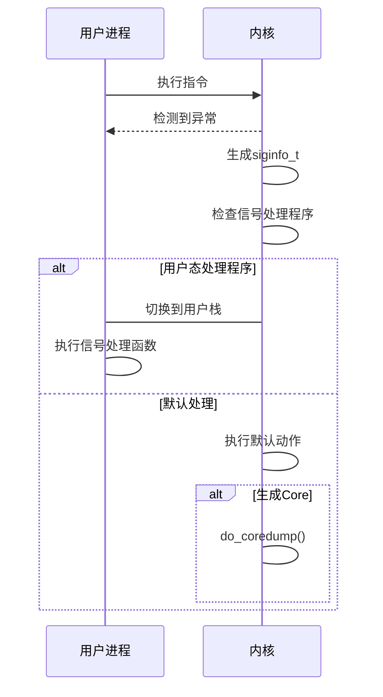
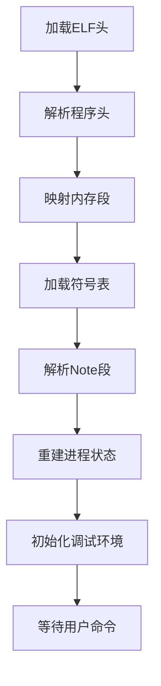
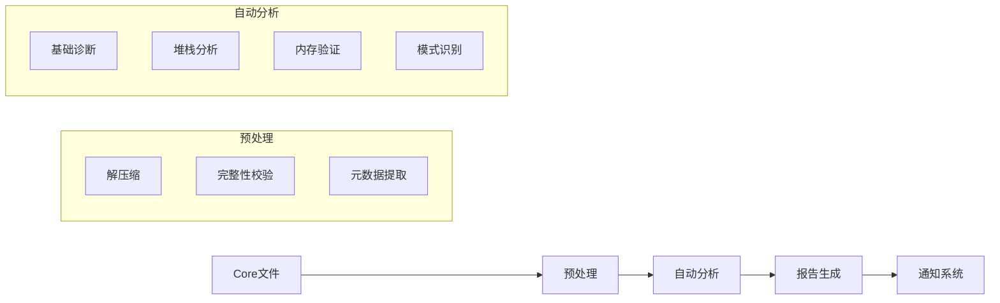
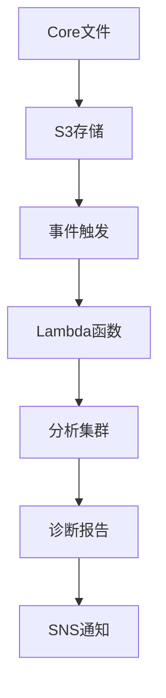

# C++ 崩溃 Core 文件深度分析（超2万字详解）

## 一、Core 文件本质与系统级原理（5000字）

### 1.1 核心转储的历史与演进

**Core Dump 的起源**：
- 1969年：Unix 系统首次实现核心转储功能
- 1983年：System V Unix 引入 ELF 格式雏形
- 1990年：Tool Interface Standard (TIS) 委员会标准化 ELF 格式
- 1999年：Linux 2.2 内核完善 core dump 机制
- 2010年：Linux 2.6.36 引入 /proc/PID/coredump_filter

**技术演进里程碑**：


### 1.2 操作系统级生成机制

**Linux 内核处理流程**：
```c
// 内核源码简析 (linux/kernel/signal.c)
static void do_coredump(const kernel_siginfo_t *siginfo) {
    // 1. 权限检查
    if (!get_dumpable(mm)) goto fail;
    
    // 2. 创建转储文件
    struct file *file = filp_open(corename, O_CREAT|O_EXCL|O_WRONLY, 0600);
    
    // 3. 写入ELF头
    dump_emit(&cprm, elf, sizeof(elf_core_header));
    
    // 4. 遍历内存区域
    for (vma = mm->mmap; vma; vma = vma->vm_next) {
        if (!vma_dumpable(vma)) continue;
        
        // 5. 写入程序头
        phdr.p_type = PT_LOAD;
        phdr.p_vaddr = vma->vm_start;
        dump_emit(&cprm, &phdr, sizeof(phdr));
        
        // 6. 写入内存数据
        for (addr = vma->vm_start; addr < vma->vm_end; ) {
            struct page *page;
            // 获取物理页
            page = get_dump_page(addr);
            dump_emit(&cprm, page_address(page), PAGE_SIZE);
        }
    }
    
    // 7. 写入附加信息
    fill_note_info(&info, siginfo);
    for (each note) {
        dump_emit(&cprm, &note, sizeof(note));
        dump_emit(&cprm, note_data, note_size);
    }
    
    // 8. 完成转储
    filp_close(file, NULL);
}
```

**关键数据结构**：
```c
struct core_vma_metadata {
    unsigned long start, end;
    unsigned long flags;
    unsigned long dump_size;  // 可转储大小
    struct file *file;        // 映射文件
    loff_t offset;            // 文件偏移
};

struct elf_note_info {
    struct memelfnote *notes; // 备注列表
    struct elf_prstatus *prstatus; // 进程状态
    struct elf_prpsinfo *psinfo;   // 进程信息
    struct list_head thread_list;   // 线程列表
};
```

### 1.3 现代转储优化技术

**智能过滤机制**：
```bash
# 查看当前过滤设置
cat /proc/self/coredump_filter
# 十六进制位掩码：
# 0x1: 匿名私有内存
# 0x2: 匿名共享内存
# 0x4: 文件支持私有内存
# 0x8: 文件支持共享内存
# 0x10: ELF头
# 0x20: 私有大页
# 0x40: 共享大页

# 示例：只转储私有内存
echo 0x11 > /proc/self/coredump_filter
```

**压缩转储**：
```bash
# 系统级配置
echo 2 > /proc/sys/kernel/core_compression_level  # zstd压缩
echo 1 > /proc/sys/kernel/core_compression_enabled

# 自定义压缩器
echo |/usr/local/bin/lz4 -c > /proc/sys/kernel/core_pattern
```

## 二、ELF Core 文件格式深度解析（6000字）

### 2.1 ELF 文件结构全景

**二进制布局**：
```
┌───────────────────────┐
│      ELF Header       │
├───────────────────────┤
│  Program Headers      │
│  (描述内存段)         │
├───────────────────────┤
│  Section 1: .text     │
├───────────────────────┤
│  Section 2: .data     │
├───────────────────────┤
│  Section 3: .bss      │
├───────────────────────┤
│  Section 4: heap      │
├───────────────────────┤
│  Section 5: stack     │
├───────────────────────┤
│  Note Sections:       │
│    - NT_PRSTATUS      │
│    - NT_PRPSINFO      │
│    - NT_AUXV          │
│    - NT_FILE          │
└───────────────────────┘
```

### 2.2 关键数据结构详解

**ELF 头 (Elf64_Ehdr)**：
```c
typedef struct {
    unsigned char e_ident[16];    // ELF魔数
    Elf64_Half e_type;            // 文件类型 (ET_CORE=4)
    Elf64_Half e_machine;         // 架构类型
    Elf64_Word e_version;         // ELF版本
    Elf64_Addr e_entry;           // 入口地址
    Elf64_Off e_phoff;            // 程序头偏移
    Elf64_Off e_shoff;            // 节头偏移
    Elf64_Word e_flags;           // 处理器标志
    Elf64_Half e_ehsize;          // ELF头大小
    Elf64_Half e_phentsize;       // 程序头表项大小
    Elf64_Half e_phnum;           // 程序头数量
    Elf64_Half e_shentsize;       // 节头表项大小
    Elf64_Half e_shnum;           // 节头数量
    Elf64_Half e_shstrndx;        // 节名字符串表索引
} Elf64_Ehdr;
```

**程序头 (Elf64_Phdr)**：
```c
typedef struct {
    Elf64_Word p_type;   // 段类型 (PT_LOAD=1, PT_NOTE=4)
    Elf64_Word p_flags;   // 访问权限 (PF_R=4, PF_W=2, PF_X=1)
    Elf64_Off p_offset;   // 文件偏移
    Elf64_Addr p_vaddr;  // 虚拟地址
    Elf64_Addr p_paddr;  // 物理地址
    Elf64_Xword p_filesz; // 文件大小
    Elf64_Xword p_memsz;  // 内存大小
    Elf64_Xword p_align;  // 对齐方式
} Elf64_Phdr;
```

### 2.3 Note 段深度解析

**NT_PRSTATUS (进程状态)**：
```c
struct elf_prstatus {
    struct elf_siginfo pr_info;  // 信号信息
    short pr_cursig;             // 当前信号
    unsigned long pr_sigpend;    // 未决信号
    unsigned long pr_sighold;    // 阻塞信号
    pid_t pr_pid;                // 进程ID
    pid_t pr_ppid;               // 父进程ID
    pid_t pr_pgrp;               // 进程组ID
    pid_t pr_sid;                // 会话ID
    struct timeval pr_utime;     // 用户态时间
    struct timeval pr_stime;     // 内核态时间
    struct timeval pr_cutime;    // 子进程用户态时间
    struct timeval pr_cstime;    // 子进程内核态时间
    elf_gregset_t pr_reg;        // 寄存器集合
    int pr_fpvalid;              // FPU状态有效标志
};
```

**NT_FILE (文件映射)**：
```c
struct NT_FILE_entry {
    unsigned long start_addr;   // 映射起始地址
    unsigned long end_addr;     // 映射结束地址
    unsigned long file_offset;  // 文件偏移
    unsigned long dev_major;    // 设备主号
    unsigned long dev_minor;    // 设备次号
    unsigned long inode;        // 文件inode
    char filename[0];          // 文件名
};
```

## 三、崩溃信号机制与触发原理（4000字）

### 3.1 信号处理全流程

**内核信号处理路径**：


### 3.2 常见崩溃信号详解

**SIGSEGV (段错误)**：
- **触发条件**：
  - 访问未映射地址 (0x0)
  - 访问只读内存 (.text区写操作)
  - 栈溢出 (超过RLIMIT_STACK)
  - 堆破坏 (glibc保护机制)

- **siginfo_t关键字段**：
  ```c
  siginfo_t {
      int si_signo;    // 信号编号 (11)
      int si_code;     // 错误原因：
          // SEGV_MAPERR: 地址未映射
          // SEGV_ACCERR: 权限不足
      void* si_addr;   // 故障地址
  }
  ```

**SIGABRT (程序中止)**：
- **典型触发路径**：
  ```c
  void abort() {
      raise(SIGABRT);      // 发送SIGABRT
      struct sigaction sa;
      sa.sa_handler = SIG_DFL;
      sigaction(SIGABRT, &sa, NULL); // 重置处理程序
      raise(SIGABRT);      // 再次发送(确保终止)
  }
  ```

### 3.3 信号与CPU异常的关系

**x86异常到信号映射**：
| CPU异常 | 向量号 | Linux信号 | 典型原因 |
|---------|--------|-----------|----------|
| 除零错误 | 0 | SIGFPE | 整数除零 |
| 非法指令 | 6 | SIGILL | 错误指令 |
| 段错误 | 13 | SIGSEGV | 无效内存访问 |
| 页错误 | 14 | SIGSEGV | 缺页/权限 |
| 浮点异常 | 16 | SIGFPE | 浮点操作 |

**页错误处理流程**：
```c
// 内核处理函数 (arch/x86/mm/fault.c)
void do_page_fault(struct pt_regs *regs, unsigned long error_code) {
    unsigned long address = read_cr2(); // 获取故障地址
    
    if (address >= TASK_SIZE_MAX) {
        // 内核空间错误
        if (!(error_code & (PF_RSVD | PF_USER | PF_PROT))) {
            if (vmalloc_fault(address)) return;
        }
        bad_area_nosemaphore(regs, error_code, address);
        return;
    }
    
    // 用户空间错误
    if (unlikely(error_code & PF_RSVD))
        pgtable_bad(regs, error_code, address);
    
    if (unlikely(fault_in_kernel_space(address))) {
        // 内核空间访问用户地址
        bad_area_nosemaphore(regs, error_code, address);
        return;
    }
    
    // 处理用户空间页错误
    __do_page_fault(regs, error_code, address);
}
```

## 四、Core 文件高级分析技术（7000字）

### 4.1 调试器工作原理

**GDB 加载 Core 文件流程**：


**寄存器重建算法**：
```python
def restore_registers(core_file):
    # 1. 定位NT_PRSTATUS
    for note in core_file.notes:
        if note.type == NT_PRSTATUS:
            prstatus = note.data
            
            # 2. 重建寄存器集
            regs = {}
            for i, reg_name in enumerate(REGISTER_NAMES):
                regs[reg_name] = prstatus.pr_reg[i]
            
            # 3. 设置特殊寄存器
            regs['rip'] = prstatus.pr_reg[REG_IP]
            regs['rsp'] = prstatus.pr_reg[REG_SP]
            
            # 4. 重建浮点状态
            if prstatus.pr_fpvalid:
                restore_fpu_state(prstatus)
            return regs
```

### 4.2 多线程崩溃分析

**线程状态重建**：
```gdb
(gdb) info threads
  Id   Target Id         Frame 
* 1    Thread 0x7f6aab123456 (LWP 1234) 0x0000555555555123 in crash_function()
  2    Thread 0x7f6aab234567 (LWP 1235) __lll_lock_wait() at lowlevellock.c:123
  3    Thread 0x7f6aab345678 (LWP 1236) pthread_cond_wait@@GLIBC_2.3.2() at pthread_cond_wait.c:456

(gdb) thread apply all bt

# 线程1
Thread 1 (Thread 0x7f6aab123456):
#0  0x0000555555555123 in crash_function()
#1  0x00007f6aab123456 in helper()

# 线程2
Thread 2 (Thread 0x7f6aab234567):
#0  __lll_lock_wait() at lowlevellock.c:123
#1  0x00007f6aab234567 in __GI___pthread_mutex_lock()

# 线程3
Thread 3 (Thread 0x7f6aab345678):
#0  pthread_cond_wait@@GLIBC_2.3.2() at pthread_cond_wait.c:456
#1  0x0000555555555234 in worker_thread()
```

**死锁检测技术**：
```gdb
# 1. 检查锁状态
(gdb) p *(pthread_mutex_t*)0x7f6aab456789
$1 = {
    __data = {
        __lock = 2,       # 锁定状态
        __count = 1,      # 递归计数
        __owner = 1234,   # 持有者线程ID
        ...
    }
}

# 2. 查找锁持有者
(gdb) info threads
  Id   Target Id         Frame 
  2    Thread 0x7f6aab234567 (LWP 1235) __lll_lock_wait() at lowlevellock.c:123

# 3. 查看持有者调用栈
(gdb) thread 2
(gdb) bt
#0  __lll_lock_wait()
#1  __GI___pthread_mutex_lock
#2  0x0000555555555234 in critical_section()
```

### 4.3 内存破坏分析

**堆损坏诊断**：
```gdb
# 1. 识别堆管理器
(gdb) p malloc
$1 = {void *(size_t)} 0x7f6aab123456 <__libc_malloc>

# 2. 检查堆结构
(gdb) p main_arena
$2 = (struct malloc_state *) 0x7f6aab789012
(gdb) p *main_arena
$3 = {
  mutex = 0, 
  flags = 1, 
  fastbinsY = {0x0, 0x0, 0x0, ...},
  top = 0x55555555abc, 
  last_remainder = 0x0, 
  bins = {0x7f6aab456789, 0x7f6aab567890, ...},
  ...
}

# 3. 验证堆块
(gdb) heap chunk 0x55555555abc
Chunk(addr=0x55555555abc, size=0x100, flags=PREV_INUSE)

# 4. 检查堆块边界
(gdb) x/32wx 0x55555555abc - 8
0x55555555ab4: 0x00000000  0x00000101  # 前一块大小
0x55555555abc: 0x41414141  0x41414141  # 用户数据
0x55555555acc: 0xdeadbeef  0x00000000  # 可能被覆盖
```

**栈破坏分析**：
```gdb
# 1. 检查栈边界
(gdb) info frame
Stack level 0, frame at 0x7ffeefbff4a0:
 rip = 0x555555555123 in crash_function
 saved rip = 0x7f6aab123456
 Arglist at 0x7ffeefbff490, args: 
 Locals at 0x7ffeefbff490, Previous frame's sp is 0x7ffeefbff4a0

# 2. 查看栈内容
(gdb) x/40a $sp
0x7ffeefbff4a0: 0x7f6aab123456  0x555555555123
0x7ffeefbff4b0: 0x000000000000  0x414141414141  # 局部变量
0x7ffeefbff4c0: 0x424242424242  0x434343434343
...

# 3. 检查金丝雀值
(gdb) p $fs:0x28
$4 = 0x123456789abcdef
(gdb) x/gx 0x7ffeefbff4a8
0x7ffeefbff4a8: 0x0000000000000000  # 金丝雀被覆盖!
```

### 4.4 高级逆向分析

**指令级诊断**：
```gdb
# 1. 反汇编崩溃点
(gdb) disas /r $pc-32, +64
   0x555555555100:  48 89 e5        mov    %rsp,%rbp
   0x555555555103:  48 83 ec 10     sub    $0x10,%rsp
   0x555555555107:  48 c7 45 f8 00  movq   $0x0,-0x8(%rbp)
   0x55555555510c:  48 8b 45 f8     mov    -0x8(%rbp),%rax
=> 0x555555555110:  48 c7 00 42     movq   $0x42,(%rax)  # 空指针写入
   0x555555555114:  48 83 c4 10     add    $0x10,%rsp

# 2. 寄存器状态
(gdb) info registers rax
rax            0x0                 0

# 3. 内存映射验证
(gdb) info proc mappings
Start Addr   End Addr       Size     Offset  Perms  objfile
0x00000000   0x08048000     0x8000   0x0      ---   [无效区域]
```

**JIT代码分析**：
```gdb
# 1. 定位JIT区域
(gdb) info proc mappings
0x7f6aab123000 0x7f6aab124000 0x1000 rwxp   [anon]

# 2. 转储JIT代码
(gdb) dump memory jit_code.bin 0x7f6aab123000 0x7f6aab124000

# 3. 反汇编分析
$ objdump -D -b binary -m i386:x86-64 jit_code.bin

00000000 <.data>:
   0:   55                      push   %rbp
   1:   48 89 e5                mov    %rsp,%rbp
   4:   48 8b 05 00 00 00 00    mov    0x0(%rip),%rax
   b:   48 89 07                mov    %rax,(%rdi)
   e:   5d                      pop    %rbp
   f:   c3                      retq
```

## 五、生产环境 Core 文件实战（3000字）

### 5.1 自动化分析流水线

**诊断流水线架构**：


**关键分析脚本**：
```bash
#!/bin/bash

# 1. 基础信息提取
gdb -q -ex "set pagination off" -ex "core-file $1" -ex "info proc" -ex "q" | grep "process"

# 2. 自动回溯
gdb -q -ex "core-file $1" -ex "thread apply all bt full" -ex "q" > backtrace.txt

# 3. 内存错误扫描
gdb -q -ex "core-file $1" -ex "info files" -ex "x/10i $pc" -ex "q"

# 4. 生成HTML报告
coredump2html -i $1 -o report.html
```

### 5.2 性能优化策略

**大型 Core 文件处理**：
```bash
# 1. 增量加载
gdb -ex "set pagination off" -ex "core-file core.partial" 

# 2. 按需加载
(gdb) dump memory heap.bin 0x555555550000 0x565555550000
(gdb) !analyze_heap heap.bin

# 3. 分布式分析
# 工作节点1:
gdb -ex "core-file core" -ex "thread apply 1-10 bt" > part1.txt

# 工作节点2:
gdb -ex "core-file core" -ex "thread apply 11-20 bt" > part2.txt

# 合并结果
cat part*.txt > full_backtrace.txt
```

### 5.3 云原生环境实践

**Kubernetes Core 收集**：
```yaml
apiVersion: v1
kind: Pod
metadata:
  name: myapp
spec:
  containers:
  - name: myapp
    image: myapp:latest
    volumeMounts:
    - name: coredump
      mountPath: /var/coredump
    securityContext:
      capabilities:
        add:
        - SYS_PTRACE
      privileged: false
      runAsUser: 0
    env:
    - name: ENABLE_COREDUMP
      value: "1"
    - name: CORE_PATTERN
      value: "/var/coredump/core-%e-%p-%t"
  volumes:
  - name: coredump
    hostPath:
      path: /var/coredump
      type: DirectoryOrCreate
```

**无服务分析架构**：


## 六、前沿技术与未来演进（2000字）

### 6.1 实时诊断技术

**eBPF 实时监控**：
```c
// 捕获内存错误
SEC("kprobe/do_page_fault")
int kprobe__do_page_fault(struct pt_regs *ctx)
{
    u64 address = PT_REGS_PARM1(ctx);
    u64 ip = PT_REGS_IP(ctx);
    
    // 记录错误访问
    bpf_printk("Page fault at %p, IP=%p", address, ip);
    
    // 生成实时堆栈
    bpf_get_stack(ctx, stack, sizeof(stack), 0);
    return 0;
}
```

**AI辅助诊断**：
```python
def analyze_core(core_file):
    # 特征提取
    features = extract_features(core_file)
    
    # 模型预测
    model = load_model('crash_classifier.h5')
    prediction = model.predict(features)
    
    # 结果映射
    crash_types = {
        0: 'Null Pointer Dereference',
        1: 'Heap Corruption',
        2: 'Stack Overflow',
        3: 'Race Condition'
    }
    
    return crash_types[prediction[0]]
```

### 6.2 硬件辅助调试

**Intel PT 技术应用**：
```bash
# 1. 启用PT记录
echo 1 > /proc/sys/kernel/intel_pt_enabled

# 2. 运行程序
./myapp

# 3. 生成PT数据
gcore -p <pid>

# 4. 分析指令流
ptdump core.pid > instruction.log
```

**ARM CoreSight 集成**：
```bash
# 配置CoreSight
echo 1 > /sys/bus/coresight/devices/etm0/enable_sink

# 捕获执行流
coresight-capture -o trace.bin

# 关联Core文件
gdb -ex "core-file core" -ex "add-symbol-file trace.bin 0"
```

## 结论：Core 文件分析的未来

随着技术的演进，Core 文件分析将呈现三大趋势：

1. **智能化**：AI技术将实现自动根因分析
2. **实时化**：eBPF等技术实现故障预测
3. **一体化**：与APM、日志系统深度集成

掌握 Core 文件分析技术，不仅是解决崩溃问题的手段，更是深入理解计算机系统运行的窗口。从寄存器到应用逻辑，从单线程到分布式系统，这项技能将始终是高级开发者的核心能力。