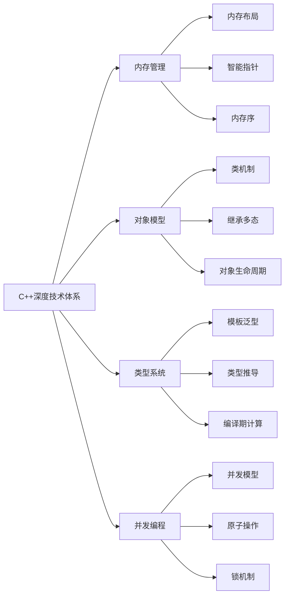

# 🚀 C++深度技术原理专栏

> 深入解析C++语言核心机制与现代特性，构建完整的C++知识体系

## 📖 专栏概览

| 模块 | 文章数量 | 难度 | 重点内容 |
|------|----------|------|----------|
| 核心语言机制 | 6篇 | ★★★★☆ | 内存模型、对象机制、类型系统 |
| 标准库深入解析 | 4篇 | ★★★★☆ | STL容器、算法、智能指针 |
| 现代C++特性 | 3篇 | ★★★★☆ | 右值、Lambda、编译期计算 |
| 系统级编程 | 3篇 | ★★★★★ | 并发、编译链接、异常处理 |

## 🎯 学习路径

### 基础入门 → 进阶掌握 → 专家深度

## 📚 文章目录

### 模块一：核心语言机制

- [01.内存模型与布局](01.内存模型与布局.md) ⭐⭐⭐⭐⭐
  - 进程地址空间、对象内存排列、虚函数表、内存对齐、缓存优化

- [02.引用与指针原理](02.引用与指针原理.md) ⭐⭐⭐⭐
  - 引用汇编实现、右值引用、引用折叠、const引用生命周期

- [03.类与对象机制](03.类与对象机制.md) ⭐⭐⭐⭐
  - this指针机制、成员函数翻译、访问控制、运算符重载

- [04.对象生命周期](04.对象生命周期.md) ⭐⭐⭐⭐
  - 构造析构顺序、初始化列表、委托构造、存储期管理

- [05.继承与多态](05.继承与多态.md) ⭐⭐⭐⭐⭐
  - 单多继承内存模型、虚函数表、菱形继承、RTTI机制

- [14.类型系统与推导](14.类型系统与推导.md) ⭐⭐⭐⭐
  - auto/decltype推导、模板参数推导、类型转换、type_traits

### 模块二：标准库深入解析

- [07.STL容器原理](07.STL容器原理.md) ⭐⭐⭐⭐
  - vector扩容、deque分段、红黑树map、哈希表、分配器

- [08.STL算法与迭代器](08.STL算法与迭代器.md) ⭐⭐⭐⭐
  - 迭代器类别、traits萃取、算法设计、sort混合排序

- [09.智能指针与RAII](09.智能指针与RAII.md) ⭐⭐⭐⭐
  - RAII哲学、unique_ptr、shared_ptr引用计数、weak_ptr

- [11.Lambda与函数式](11.Lambda与函数式.md) ⭐⭐⭐⭐
  - Lambda匿名类、捕获列表、std::function类型擦除

### 模块三：现代C++特性

- [10.右值与移动语义](10.右值与移动语义.md) ⭐⭐⭐⭐⭐
  - 值类别分类、移动构造、完美转发、RVO/NRVO优化

- [15.编译期计算原理](15.编译期计算原理.md) ⭐⭐⭐⭐
  - constexpr演进、consteval、编译期容器、if constexpr

- [06.模板与泛型](06.模板与泛型.md) ⭐⭐⭐⭐⭐
  - 模板实例化、特化、SFINAE、可变参数模板

### 模块四：系统级编程

- [13.并发与内存序](13.并发与内存序.md) ⭐⭐⭐⭐⭐
  - CPU缓存、MESI协议、内存屏障、原子操作、mutex实现

- [16.编译链接与演进](16.编译链接与演进.md) ⭐⭐⭐⭐⭐
  - 编译链接流程、ODR规则、模块化、ABI兼容性

- [12.异常与错误处理](12.异常与错误处理.md) ⭐⭐⭐⭐
  - 异常表机制、栈展开、noexcept、现代错误处理方案

## 🎓 知识图谱

## 📈 学习建议

1. **按模块顺序学习**：建议从核心语言机制开始，逐步深入到系统级编程
2. **实践结合理论**：每篇文章都包含代码示例，建议动手实践
3. **深度思考**：关注技术背后的设计哲学和权衡考量
4. **延伸阅读**：每篇文章末尾提供相关参考资料

## 🔮 未来扩展

- C++20/23新特性深度解析
- 元编程与编译期编程进阶
- 性能优化与缓存友好设计
- 跨平台开发与ABI兼容性

---

> 本专栏持续更新中，欢迎关注和贡献！
