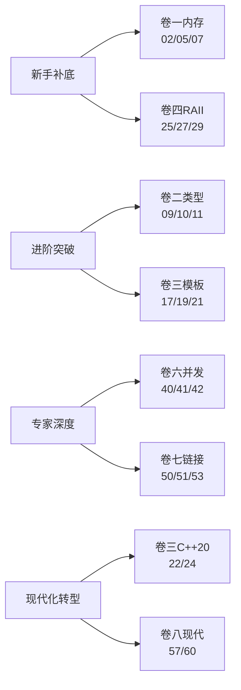
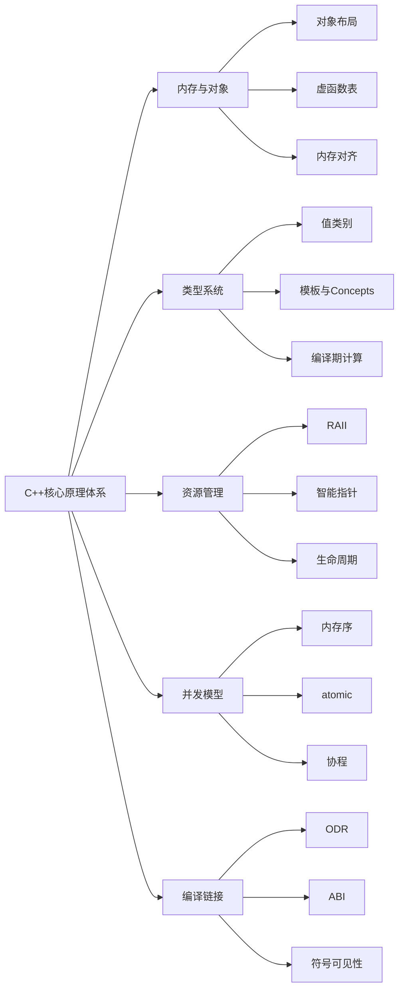

# 🚀 C++ 核心原理深度专栏

> C++ 核心原理深度专栏，自下而上贯穿 **内存与对象 → 类型与值类别 → 模板与编译期 → 资源管理 → STL → 并发 → 编译链接 → 设计哲学** 八大原理域，共计 **60 篇**，体系化拆解 C++ 的每一根骨头与每一种设计哲学。
>
> 🚧 **全册 60 篇编排中** ⏳ 已完成 23/60（✅ 卷一 · ✅ 卷二 · 🚀 卷三 7/8）
>
> 📌 最新一篇：**第 23 篇《元编程模板技巧》** ✅（CRTP 虚析构性能事故 + 80 型编译爆炸双事故引入、CRTP 静态多态 vs 虚函数性能实测（1.8ns vs 2.9~18.7ns）、构造期 static_cast 陷阱与两阶段初始化、TypeList 嵌套 vs 可变参两种表示与现代重写对比、Loki/Boost.MPL → 现代 C++ 迁移路径（编译 1.88s→0.27s）、编译期斐波那契三条路实测、编译期排序/变换 pipeline、integral_constant 基因设计 + ratio 有理数 + index_sequence 再审视、CRTP + mixin 叠加模式、现代替代决策树（constexpr 替模板递归 / concept 替 enable_if / 折叠替递归）、实例化爆炸四病根 + 五瘦身策略）

## 📐 设计理念

C++ 与 Java 最大的不同在于：**它没有虚拟机这一层抽象**——直接面对编译器、链接器、CPU 缓存、操作系统内存。所以本专栏的纵深顺着这条路径展开：

> **预处理 → 编译 → 链接 → 运行时 → 操作系统 → 硬件**

每一层都有 C++ 独有的"刀尖在跳舞"的设计。

---

## 📕 卷一 · 内存模型与对象布局（8 篇）

把"虚拟机？我们没有，自己上"的底层揭开。

- ✅ [01.进程地址空间布局](01.进程地址空间布局.md)：text/data/bss/heap/stack五段、虚拟内存映射、ASLR、mmap与brk、栈底栈顶生长方向、Linux pmap实战
- ✅ [02.对象内存布局原理](02.对象内存布局原理.md)：成员排列规则、内存对齐与pragma pack、空类大小1字节、EBO空基类优化、[[no_unique_address]]、cache line对齐
- ✅ [03.引用与指针本质](03.引用与指针本质.md)：引用汇编实现即指针、引用vs指针七大对比、悬空引用、const引用延长生命周期、引用折叠规则
- ✅ [04.this指针与成员函数](04.this指针与成员函数.md)：成员函数→普通函数翻译、隐式this、const成员函数本质、this是右值、cv限定符在ABI层的体现
- ✅ [05.虚函数表深度剖析](05.虚函数表深度剖析.md)：vptr在对象头部、vtable在只读段、单继承vtable布局、多继承thunk、虚继承vbtable、构造析构期间虚函数行为
- ✅ [06.多重继承内存模型](06.多重继承内存模型.md)：多继承对象布局、菱形继承数据冗余、虚继承vbptr、向上转型的指针偏移、dynamic_cast运行时机制
- ✅ [07.内存对齐与缓存行](07.内存对齐与缓存行.md)：False sharing假共享、alignas/alignof、SIMD对齐要求、cache line padding实战、perf c2c检测假共享
- ✅ [08.内存分配器演进史](08.内存分配器演进史.md)：malloc/free历史、ptmalloc arena、tcmalloc thread cache、jemalloc、operator new重载、内存池设计

## 📗 卷二 · 类型系统与值类别（8 篇）

把"C++ 为什么有左值/右值/将亡值"这种刀尖问题彻底讲清。

- ✅ [09.五大值类别详解](09.五大值类别详解.md)：lvalue/xvalue/prvalue/glvalue/rvalue、值类别决策树、decltype判定值类别、表达式值类别速查
- ✅ [10.右值引用与移动语义](10.右值引用与移动语义.md)：std::move本质是static_cast、移动构造与移动赋值、移动后对象状态、noexcept移动的关键性、unique_ptr移动
- ✅ [11.完美转发与引用折叠](11.完美转发与引用折叠.md)：万能引用T&&、std::forward实现、引用折叠四规则、转发失败八大场景、SFINAE辅助
- ✅ [12.类型推导三大规则](12.类型推导三大规则.md)：auto推导、decltype推导、模板参数推导、AAA原则、auto&与auto&&差异、decltype(auto)出现原因
- ✅ [13.类型转换与隐式构造](13.类型转换与隐式构造.md)：五大cast（static/const/reinterpret/dynamic/bit_cast）、C风格cast的盲选搜索顺序、严格别名规则、explicit关键字、单参ctor与operator T()两扇隐式门、列表初始化禁止窄化、most vexing parse
- ✅ [14.const与volatile真相](14.const与volatile真相.md)：const三层语义（语法/API/实现）、按位常量vs逻辑常量、mutable的合法逃逸与并发反模式、顶层底层const边界、const_cast在并发代码的反模式、volatile真正用途（MMIO/信号/setjmp）、volatile为何不是同步工具、std::atomic的ARM stlr/ldar屏障对比、ref-qualifier三件套、propagate_const、跨语言const对比
- ✅ [15.RTTI与dynamic_cast](15.RTTI与dynamic_cast.md)：两个跨SO事故引入、typeid双模行为、5种转换方向、vtable查找、Itanium vs MSVC ABI、-fno-rtti代价、跨边界陷阱、三套替代方案、决策树
- ✅ [16.类型擦除技术原理](16.类型擦除技术原理.md)：日志格式化器类爆炸与lambda悬垂引用事故、手工Concept+Model、function三元SBO结构、any的void*+type_info、SBO准入三条件、variant vs any 18×性能差、Sean Parent遗产、lambda从捕获到调用4步生涯

## 📘 卷三 · 模板与编译期计算（8 篇）

把"编译期是另一个图灵机"全部展开。

- ✅ [17.模板实例化机制](17.模板实例化机制.md)：嵌入式flash溢出事故引入、两阶段名称查找+ADL、POI规则、extern template vs 显式实例化、Thin Template模式、export失败史、ODR COMDAT折叠、vector<int>从源码到机器码7步生涯
- ✅ [18.模板特化与偏特化](18.模板特化与偏特化.md)：序列化库偏特化蝴蝶效应、全特化强符号ODR陷阱、偏序算法三步推演、函数模板无偏特化的设计原因、tag dispatch/enable_if替代、vector<bool>争议全特化
- ✅ [19.SFINAE与enable_if](19.SFINAE与enable_if.md)：序列化 17000 行错误与默认模板实参重定义两大事故引入、立即上下文边界、enable_if 偏特化把戏、void_t 五行通用探测器、detection idiom 框架、四种插桩位置（位置②首选）、优先级标签 priority 继承链构造偏序、表达式 SFINAE、类模板成员模板 SFINAE 正确写法、C++20 requires 蕴含关系（subsumption）三大碾压
- ✅ [20.可变参数模板原理](20.可变参数模板原理.md)：高频交易日志库 14GB 内存爆炸事故引入、pack 是 AST 占位符不是对象、pattern... 模式与展开分离、七大展开位置、折叠表达式四式 + 32 运算符、递归 vs if constexpr vs 折叠编译耗时对比、tuple 递归多继承 + EBO、apply 五行源码、emplace 完美转发链路、类型擦除收口工程范式
- ✅ [21.constexpr编译期计算](21.constexpr编译期计算.md)：四代演进全景、consteval 立即函数与 if consteval、constinit SIOF 根治、C++20 瞬态与 C++23 持久分配、constexpr 虚函数与编译期多态、编译器字节码虚拟机内幕、编译期 LUT/正则/JSON 实战、前移即优化性能证据
- ✅ [22.Concepts深度剖析](22.Concepts深度剖析.md)：subsumption 蕴含断裂与 requires 位置屠杀双事故引入、concept 定义四配方 + requires 表达式四检查、requires clause vs expression 同名陷阱、四种悬挂位置与偏序规则、三步裁决法、原子约束归一化与 subsumption 精算、SFINAE→Concepts 逐行翻译对比、错误信息 17000→3 行与编译时间 4.2s→0.9s、类模板陷阱、四步迁移路径
- ✅ [23.元编程模板技巧](23.元编程模板技巧.md)：CRTP 虚析构性能事故与 80 型编译爆炸双事故引入、静态多态 vs 虚函数实测、构造期陷阱、TypeList 嵌套 vs 可变参对比与迁移、编译期算法三路实测、integral_constant 设计基因与 ratio/index_sequence、mixin + policy 组合、现代替代决策树、实例化膨胀五瘦身策略
- ⏳ [24.Modules模块化设计](24.Modules模块化设计.md)：模块vs头文件、import/export、二进制接口BMI、构建系统支持、为什么20年才落地

## 📙 卷四 · 资源管理与生命周期（7 篇）

把"RAII 哲学"贯穿到底。

- ⏳ [25.RAII的设计哲学](25.RAII的设计哲学.md)：构造获取析构释放、栈展开自动清理、RAII vs GC对比、Drop in Rust、scope_guard惯用法
- ⏳ [26.对象构造与析构](26.对象构造与析构.md)：构造顺序基类→成员→子类、析构反向、初始化列表vs赋值、委托构造、继承构造
- ⏳ [27.拷贝与移动控制](27.拷贝与移动控制.md)：三五法则Rule of Five、=default/=delete、拷贝省略copy elision、强制RVO、特殊成员函数生成规则
- ⏳ [28.unique_ptr原理剖析](28.unique_ptr原理剖析.md)：独占语义、deleter定制、make_unique为什么晚、unique_ptr<T[]>、嵌入式智能指针
- ⏳ [29.shared_ptr底层剖析](29.shared_ptr底层剖析.md)：控制块结构、引用计数原子操作、make_shared一次分配、weak_ptr不增加strong count、循环引用
- ⏳ [30.weak_ptr与this增强](30.weak_ptr与this增强.md)：weak_from_this、enable_shared_from_this CRTP、二级指针失效检测、Observer场景
- ⏳ [31.五种存储期管理](31.五种存储期管理.md)：static/thread/automatic/dynamic/temporary、static局部变量线程安全初始化、TLS实现

## 📒 卷五 · STL 与泛型库设计（8 篇）

把"标准库每一根骨头"摸一遍。

- ⏳ [32.vector扩容真相](32.vector扩容真相.md)：growth factor 1.5/2、capacity与size、迭代器失效规则、emplace_back与push_back、reserve最佳实践
- ⏳ [33.deque分段连续设计](33.deque分段连续设计.md)：map+chunk两级、随机访问代价、front/back O(1)插入、为什么不是queue的默认
- ⏳ [34.list与forward_list](34.list与forward_list.md)：双向链表节点布局、splice O(1)、不需要随机访问的场景、节点级分配器
- ⏳ [35.关联容器红黑树](35.关联容器红黑树.md)：map/set/multimap底层、红黑树五性质、节点重用extract/insert(node_type)、heterogeneous lookup
- ⏳ [36.哈希容器深度剖析](36.哈希容器深度剖析.md)：unordered_map拉链法、load_factor、reserve避免rehash、哈希函数定制、abseil flat_hash_map
- ⏳ [37.迭代器五大类别](37.迭代器五大类别.md)：input/output/forward/bidirectional/random、tag dispatch分派、ranges视图、迭代器失效族谱
- ⏳ [38.STL算法设计哲学](38.STL算法设计哲学.md)：算法+迭代器+容器三分天下、sort混合算法（introsort）、stable_sort归并、partition三路
- ⏳ [39.Allocator分配器机制](39.Allocator分配器机制.md)：std::allocator、polymorphic allocator (PMR)、memory_resource、scoped_allocator、按场景定制

## 📔 卷六 · 并发与内存模型（8 篇）

把"从原子到协程"全部串起来。

- ⏳ [40.C++内存模型基石](40.C++内存模型基石.md)：多核CPU缓存架构、MESI协议、Store Buffer、Invalidate Queue、为什么需要内存模型
- ⏳ [41.六大内存序详解](41.六大内存序详解.md)：relaxed/consume/acquire/release/acq_rel/seq_cst、happens-before、synchronizes-with、acquire-release配对
- ⏳ [42.atomic原子操作原理](42.atomic原子操作原理.md)：std::atomic实现、lock-free vs wait-free、CAS与ABA问题、atomic<T>对T的要求、atomic_ref
- ⏳ [43.mutex与条件变量](43.mutex与条件变量.md)：mutex底层futex、自旋vs阻塞、recursive_mutex、shared_mutex读写锁、condition_variable spurious wakeup
- ⏳ [44.thread与jthread机制](44.thread与jthread机制.md)：thread构造销毁规则、为什么不能拷贝、jthread自动join、stop_token协作取消、thread_local初始化时机
- ⏳ [45.异步编程future家族](45.异步编程future家族.md)：future/promise/packaged_task三件套、std::async启动策略陷阱、shared_future、future链式叠加
- ⏳ [46.无锁数据结构设计](46.无锁数据结构设计.md)：lock-free队列实现、Treiber stack、Michael-Scott queue、内存回收hazard pointer/RCU
- ⏳ [47.协程coroutine原理](47.协程coroutine原理.md)：C++20协程三角（promise_type/awaiter/handle）、栈less协程、co_await/co_yield/co_return、生成器与异步

## 📓 卷七 · 编译链接与 ABI（7 篇）

把"二进制如何诞生与协作"打通。

- ⏳ [48.翻译单元与预处理](48.翻译单元与预处理.md)：TU边界、宏展开规则、#include搜索路径、预编译头PCH、Unity Build、include-what-you-use
- ⏳ [49.编译期符号生成](49.编译期符号生成.md)：name mangling规则、Itanium ABI命名、extern "C"边界、重载在符号层的体现、demangle工具
- ⏳ [50.链接器工作原理](50.链接器工作原理.md)：符号解析、重定位、强弱符号、静态库.a vs 动态库.so、--gc-sections、链接顺序坑
- ⏳ [51.ODR规则与陷阱](51.ODR规则与陷阱.md)：一次定义规则、inline变量C++17、模板与ODR、跨TU的static与匿名命名空间、UB典型场景
- ⏳ [52.动态库与符号可见性](52.动态库与符号可见性.md)：-fvisibility=hidden、__attribute__((visibility))、PLT/GOT、dlopen/dlsym、符号污染治理
- ⏳ [53.C++ ABI兼容性](53.C++ ABI兼容性.md)：Itanium ABI、std::string ABI dual（_GLIBCXX_USE_CXX11_ABI）、跨编译器边界、版本治理
- ⏳ [54.LTO与PGO优化](54.LTO与PGO优化.md)：LTO/ThinLTO原理、PGO插桩与采样、跨TU内联、二进制瘦身实战、Bolt后链接优化

## 📑 卷八 · 现代特性与设计哲学（6 篇）

把"为什么 C++ 这么写"的灵魂还原。

- ⏳ [55.异常机制底层原理](55.异常机制底层原理.md)：异常表.eh_frame、栈展开unwind、Itanium异常ABI、零开销原则、noexcept价值、为什么很多公司禁用异常
- ⏳ [56.错误处理多元方案](56.错误处理多元方案.md)：异常 vs 错误码 vs std::expected vs std::optional、Outcome库、决策树、Google C++风格的取舍
- ⏳ [57.Ranges革命与管道](57.Ranges革命与管道.md)：views惰性求值、管道|操作符、ranges算法、投影projection、与Boost.Range演进
- ⏳ [58.format与print体系](58.format与print体系.md)：std::format语法、扩展格式化、locale无关、与printf/iostream性能对比、std::println
- ⏳ [59.UB未定义行为图鉴](59.UB未定义行为图鉴.md)：UB分类（核心/库/IB）、有符号溢出、严格别名strict aliasing、生命周期外访问、编译器如何利用UB
- ⏳ [60.C++设计哲学回望](60.C++设计哲学回望.md)：零开销抽象、Don't pay for what you don't use、values-based vs reference-based、与Rust/Go对比、未来C++26

---

## 📚 学习路径推荐

| 你的目标 | 推荐主攻卷 | 优先篇目 |
|---|---|---|
| 面试冲刺 | 卷一 + 卷四 + 卷六 | 02 / 05 / 10 / 27 / 29 / 41 |
| 中间件源码阅读 | 卷三 + 卷五 + 卷六 | 17 / 32 / 36 / 42 / 46 |
| 系统底层开发 | 卷一 + 卷六 + 卷七 | 01 / 07 / 40 / 50 / 53 |
| 拥抱现代 C++ | 卷二 + 卷三 + 卷八 | 09 / 11 / 22 / 57 / 60 |

---

## 📐 统一写作模板

每篇文章按 **10 章法** 展开，详见 [00.写作模板.md](00.写作模板.md)：

1. **案例引入**：一段真实代码或线上事故引出问题，列出 5~7 个待解疑问
2. **架构概览**：一张总图 + 反向论证「为什么这么切」
3~9. **核心原理拆解**：5~7 章，每章「疑惑 → 论证 → 结论」三段式
10. **综合案例串讲**：回扣第 1 章、串生命周期、提炼设计哲学、给速查表

---

## 📊 进度总览

| 卷 | 主题 | 篇数 | 已完成 |
|---|---|---|---|
| 卷一 | 内存模型与对象布局 | 8 | 8 ✅ |
| 卷二 | 类型系统与值类别 | 8 | 8 ✅ |
| 卷三 | 模板与编译期计算 | 8 | 7 ⏳ |
| 卷四 | 资源管理与生命周期 | 7 | 0 ⏳ |
| 卷五 | STL 与泛型库设计 | 8 | 0 ⏳ |
| 卷六 | 并发与内存模型 | 8 | 0 ⏳ |
| 卷七 | 编译链接与 ABI | 7 | 0 ⏳ |
| 卷八 | 现代特性与设计哲学 | 6 | 0 ⏳ |
| **合计** | — | **60** | **23 ⏳** |

> 📁 旧版 16 篇已归档至 [archive/](archive/)，作为新专栏写作参考。

---

## 🗺️ 知识图谱

