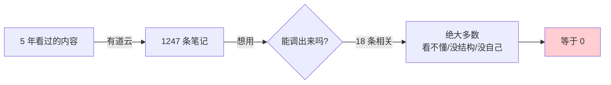
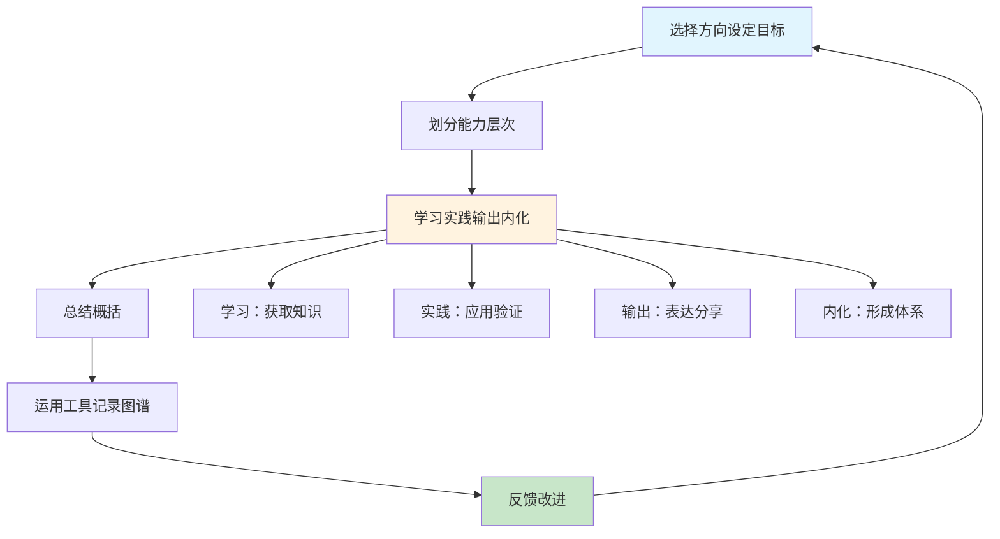
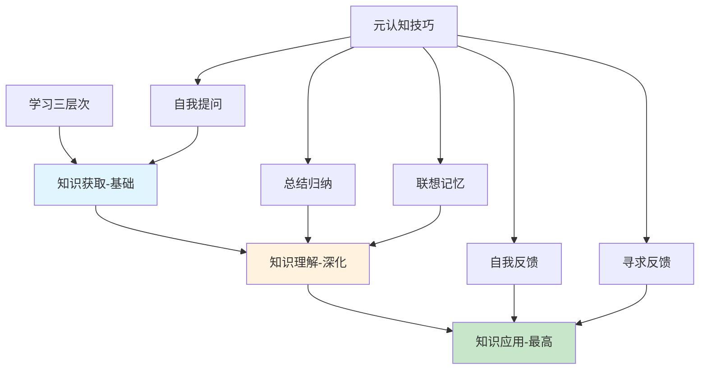
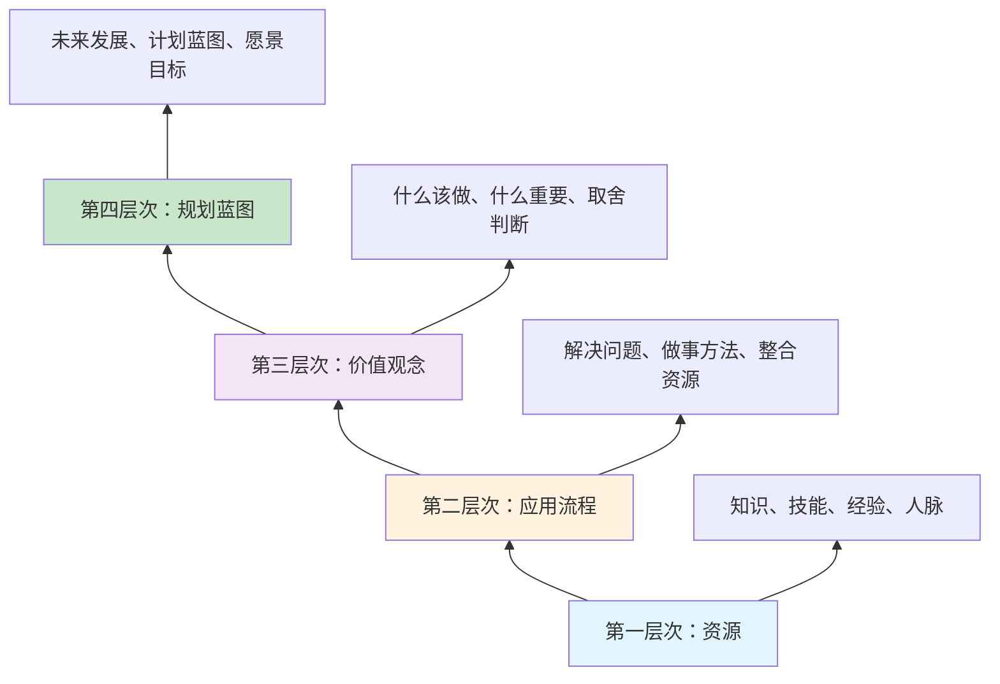
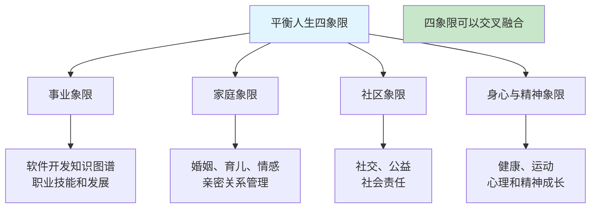
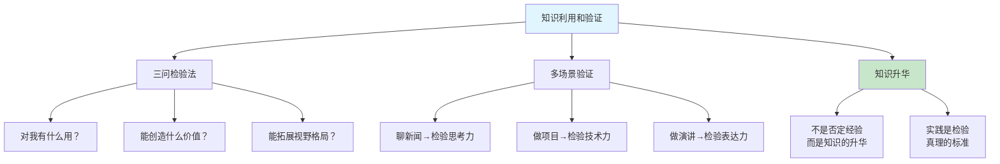
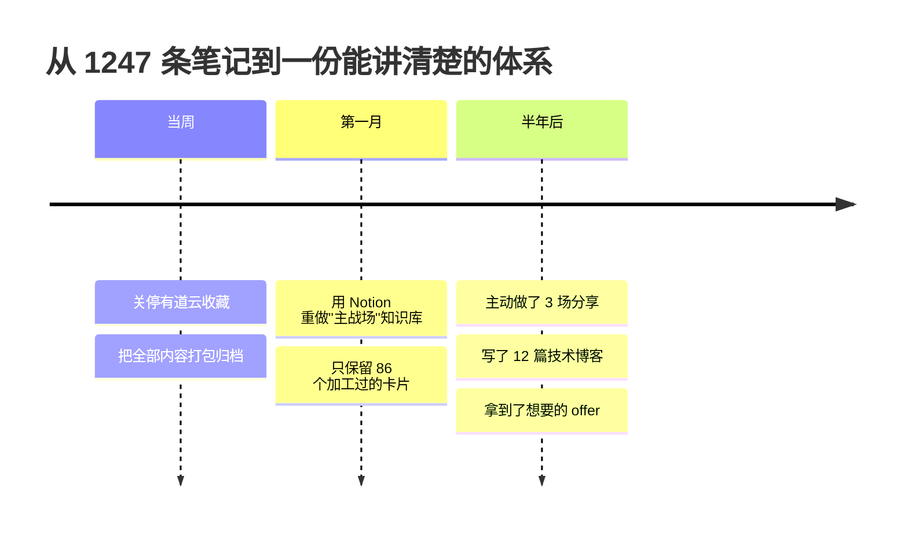
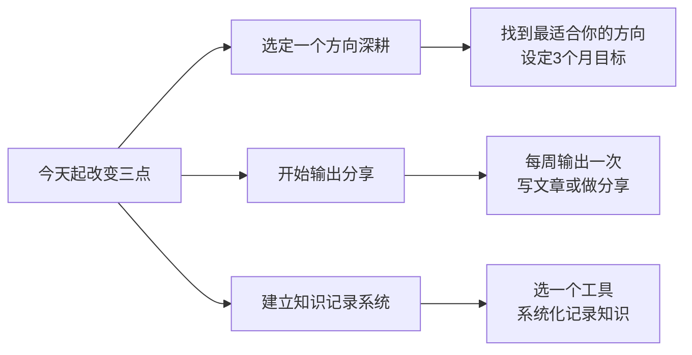

# 2.3构建知识的体系
#### 目录介绍
- [01.看一个真实案例](#01看一个真实案例)
- [02.构造知识的图谱](#02构造知识的图谱)
- [03.如何去构建体系](#03如何去构建体系)
- [04.举一个案例分析](#04举一个案例分析)
- [05.五种重要元认知](#05五种重要元认知)
- [06.选择方向设目标](#06选择方向设目标)
- [07.划分能力的层次](#07划分能力的层次)
- [08.用工具记录图谱](#08用工具记录图谱)
- [09.平衡人生四象限](#09平衡人生四象限)
- [10.反馈是十分重要](#10反馈是十分重要)
- [11.知识利用和验证](#11知识利用和验证)
- [12.总结回顾本章节](#12总结回顾本章节)
- [13.后来发生的改变](#13后来发生的改变)
- [14.今天起改变三点](#14今天起改变三点)
- [15.课后作业思考下](#15课后作业思考下)

## 01.看一个真实案例

去年我换工作，需要做一份"过往项目复盘"。我兴致勃勃打开有道云笔记——里面躺着 1247 条笔记，是我过去 5 年陆陆续续记下来的。我心想这下稳了，5 年的积累，写复盘还不是手到擒来。

结果搜索框敲下"线上故障排查"——出来 18 条笔记，点开一看：5 条是别人文章的复制粘贴，没有我自己的总结；7 条是几个零散的截图，时间地点都没标；4 条只有标题，正文是空的；剩下 2 条勉强算我写的，但读完一脸懵：**当初的上下文是什么？为什么这么处理？我自己都看不懂。**

我抱着 1247 条笔记，**复盘文档却写了一整个周末，写不出一条像样的方法论**。

我盯着那张笔记列表很久，第一次承认一件事：**这 1247 条不是"知识体系"，只是一个"信息坟场"。**

知识没有经过我的"选择 → 加工 → 内化 → 关联"，它就只是别人的字。

**真正的知识体系，必须是我能随时调取、随时讲清楚、随时拿来创造价值的东西。** 接下来这套构建方法，是那次彻底反思之后我重做的——它把我从"信息囤积者"变成了"体系建造者"。

## 02.构造知识的图谱

我们的职场核心竞争力真的有么？我们怎么建立起来？身处的行业或者公司即使最大，也随时可能倒闭，如果组织靠不住，你是否具备了不依赖的能力？

当下时代，各种信息极为丰富，各种学习途径也是层出不穷。人每时每刻都被各种各样的知识、信息轰炸着。如何有效的选择对自己有价值的知识，如何构建一个独属于自己的知识体系并让它为自己创造价值，变得越来越重要。

只有知识经过了你的选择和应用，内化为自己的隐性经验，纳入到你的知识体系中，才能真正地为你创造财富。

不仅仅要知道许多知识和常识，还需要内化成自己的东西，如果没有内化而仅仅停留在表面上，那样可能会导致这种情况，自己看上去懂得很多，但就是无法彰显自己知识的价值。

建立知识体系需要我们具备以下几个要素：

1.广度：涉猎多个领域，拓宽视野。 

2.深度：对某一领域进行深入学习，形成自己的见解。 

3.关联：将不同领域的知识进行关联和整合，形成自己的知识网络。 

4.更新：不断学习和更新知识，保持知识体系的活力和前瞻性。

## 03.如何去构建体系

**先有体系的念想**。感觉有好多东西要学习，现在听到最多的也是，需要不断的学习，那么学习那些又对我们有价值呢？

学习的方式有很多，而且现在时间也很碎片化，如何才能吸收能多的知识呢？东西太多了，信息量也太大了，所以经常要做出许多学习的选择。

有些东西是需要了解，有些是需要理解，有些则需要掌握，有些是需要吃透。而如果想进一步提高，对待知识和体系，那么就必须要琢磨呢……

那么如何建立自己的知识体系呢？我整理了一些然后用自己的语言描述出来如何建立自己的知识体系，当然我也一直是它的实践者，一直都在路上。

**构建知识体系的六个步骤**：

| 步骤 | 动作 | 要点 |
|------|------|------|
| **第一步** | 选择方向，设定目标 | 找到最适合你的方向 |
| **第二步** | 划分能力的层次 | 知道自己在哪，要去哪 |
| **第三步** | 学习、实践、输出、内化 | 核心环节，缺一不可 |
| **第四步** | 总结，概括 | 提炼方法论 |
| **第五步** | 运用工具整理记录知识图谱 | 让知识可视化 |
| **第六步** | 反馈 | 检验效果，持续优化 |

**这六步不是线性的"做完一步做下一步"，而是一个循环——做完第六步后回到第一步，开始新一轮的迭代升级**。每一轮循环，你的知识体系就更加完善一层。

## 04.举一个案例分析

1. 第一步：明确自己关注的方向。Android技术，产品经理，架构之路，写作技巧，数据分析。
2. 第二步：建立自己知识库，分类汇总保留。用笔记做笔记管理。
3. 第三步：定义整理，归纳。这个一直都在进行中，只不过有的时候不知道自己归纳如何，不知道质量是否有提高。
4. 第四步：有效输出观点，分享。比如，遇到什么难题，解决办法是什么，怎么做的，记录下来，下次就有经验呢；比如，针对某个话题，是否能够形成自己的见解，即能否表达出来；比如，对于工作，有哪些感触，有哪些提高效率的办法，是否可以整理出来，发表博客；输出的方式有很多，就像读书时考试一样，要想知道自己究竟掌握怎样，考一考不就知道了吗
5. 第五步：实践，检验。我是做Android开发的，开发这块知识点众多，需要自己不断学习，那么在遇到新的需求，新的功能，需要自己去思考解决问题的办法，看书，看博客，查资料等都可以。或者之前遇到过类似的，这个时候就检验自己知识点是否扎实。
6. 第六步：持续的改进，质变。这个我一直在路上，质变是一个长期坚持的结果。

## 05.五种重要元认知

### 5.1 什么是元认知

元认知是关于认知的认知，即对自己的学习过程进行反思和调节的能力。**简单来说，元认知就是"知道自己知道什么，不知道什么"的能力**。拥有强元认知能力的人，能在学习过程中随时监控自己的理解程度，及时调整学习策略。

### 5.2 五种元认知技巧

以下是五种重要的元认知技巧：

| 技巧 | 定义 | 具体做法 | 对应学习层次 |
|------|------|----------|-------------|
| **自我提问** | 不断提问检验理解 | 学完一段就问"为什么？""如果…会怎样？" | 知识获取 |
| **总结归纳** | 将知识系统化 | 用自己的话重新组织要点 | 知识理解 |
| **联想记忆** | 通过联想和比喻理解 | 把新知识和已有经验做类比 | 知识理解 |
| **自我反馈** | 定期回顾学习成果 | 每周复盘：学了什么、掌握了多少 | 知识应用 |
| **寻求反馈** | 向他人请教 | 主动分享观点，接受建议和批评 | 知识应用 |

### 5.3 学习的三个层次

学习可以分为三个层次：知识获取、知识理解和知识应用。知识获取是基础，但仅有获取是不够的；知识理解是深化，需要我们将所学知识内化为自己的思想；知识应用是最高层次，只有将所学知识运用到实际中，才能真正体现其价值。

**大多数人的学习止步于第一层"知识获取"——看了、听了、收藏了，但从未进入第二层"理解"和第三层"应用"**。元认知技巧的价值就在于：它能帮你主动推进学习从第一层向第三层跃迁。

## 06.选择方向设目标

### 6.1 方向选择的重要性

如果你不知道自己的方向，那么你可以多做一些尝试；如果只能选择一个方向，你希望在什么方向上做到出类拔萃?

对于方向这个问题的思考，是十分的重要。好的方向不一定具有最流行的趋势或者最大众化的，但一定是最适合你的。多思考这个问题，会帮助你找到自己的方向，进而有效地去学习知识。

### 6.2 如何找到适合自己的方向

**找方向不是拍脑袋决定的，它需要三个维度的交叉验证**：

| 维度 | 核心问题 | 判断依据 |
|------|----------|----------|
| **兴趣** | 你做什么事情的时候最有干劲？ | 不用外部激励也愿意投入时间 |
| **能力** | 你在什么方向上有天然的优势？ | 同样的投入，你比别人进步更快 |
| **市场** | 这个方向在市场上有需求吗？ | 有人愿意为这个能力买单 |

三者的交集，就是你的最佳方向。只有兴趣没有市场，你会"饿着肚子追梦"；只有市场没有兴趣，你会"赚着钱却不快乐"；只有能力没有市场，你会"怀才不遇"。

### 6.3 长期目标与短期目标的关系

在构建自己的知识体系之前，首先要做的是在自己的方向上给自己定位和指定目标。

当然，目标也分为长期目标和短期目标。而创建知识体系，也和个人目标和关注点有关系。

**长期目标是方向，短期目标是阶梯**。长期目标不需要太具体，它给你指明方向；短期目标必须足够具体，它帮你迈出每一步。比如长期目标可以是"成为架构师"，短期目标则是"这个季度读完《设计模式》并在项目中应用 3 种模式"。

## 07.划分能力的层次

### 7.1 能力的四个层次

等到选择了方向和设定了目标。接下来，我们就要看看能力划分层次呢……

先来思考一个问题，为什么有的人什么都知道，但是却一无是处，没有自己的核心竞争力，更加无法彰显自己的价值。**能力划分四层次**：

| 层次 | 内容 | 举例 |
|------|------|------|
| **第一层：资源** | 知识，技能，经验，人脉等 | 学了Java、会写SQL |
| **第二层：应用流程** | 解决问题的能力，做事方法 | 能独立排查线上故障 |
| **第三层：价值观念** | 什么该做、什么不该做 | 知道什么需求该拒绝 |
| **第四层：规划蓝图** | 未来发展的方向和计划 | 有清晰的3年职业路径 |

### 7.2 各层次的深度解读

**第一层次（资源）**：许多人都具备知识，技能，比如我们大专院校刚出来的学生。虽然在学校学习的技术不是那么深入，但是已经具备了基础知识和基础技能，拥有最基础的能力资源。

**第二层次（应用流程）**：在第一个层次上努力上进，日积月累终于可以形成自己的做事方式方法，知道如何避免错误，如何才能更加高效，这个时候对知识的运用就是实战中总结的解决问题的能力。

**第三层次（价值观念）**：在第二个层次上，理解公司的业务，熟悉公司的运作模式，并且有较好的成绩。于是便做到管理层，有了协调资源和动用资源的能力后，就要知道什么该做，什么不该做；什么主动做，什么放弃做；什么重点做，什么省略做。

**第四层次（规划蓝图）**：许多人都在追求达到这个层次，可是这个层次也是充满挑战和未知。

### 7.3 知识必须经过内化

知识是一种资源，是固化的，必须经过你的应用流程，才能内化为自己的经验，帮助你解决工作与生活中的问题，为你创造价值。然后你通过规划，实现自己的梦想。

只有知识，没有内化，那结果不堪一击。这种现象我们可以在小说中看到：

- 像神仙姐姐**王语嫣**，牢记每一种武林秘籍，但是一招也打不出来，与人对战是不具备实战经验的。
- 像《围城》里的**方鸿渐**，也学习了很多乱七八糟的知识，但赵辛楣评价他说："你是个好人，但一无是处"，这也是因为他涉猎很多都不能落地应用创造价值。

**别做"王语嫣"式的学习者——知道很多但用不出来。要做"张无忌"式的学习者——学了九阳神功后，什么武功都能快速上手**。

## 08.用工具记录图谱

### 8.1 记录方式的演进

其实对于我们来说，记录的方式有许多种。在我们传统的印象中，许多人喜欢用写日记笔记的形式来记录知识或者心得，比如读书的时候就常常这样做。到后来，记录的工作已经不再局限于纸质媒介了，出现了许多网络工具类的记录方式。

大脑容量有限，必须借助工具将我们的知识系统记录下来。有非常多的工具可以使用，比如：笔记类软件，博客，wiki，图书，电子书，思维导图软件工具。

### 8.2 选择工具的原则

那么在选择工具时需要注意什么问题呢？简单易用，多终端同步，而且编辑方便。便于检索，查找。能呈现知识系统的结构。不必追求与别人一致，只要适合自己的就行。

**选择工具最容易犯的错误是"为了工具而工具"**——花大量时间研究哪个笔记软件最好、哪个思维导图最漂亮，结果真正用来记录知识的时间反而很少。记住：**工具只是容器，内容才是核心**。最好的工具就是你用得最顺手、能坚持用下去的那个。

| 工具类型 | 适合场景 | 代表工具 | 优缺点 |
|----------|----------|----------|--------|
| **笔记软件** | 日常积累、碎片知识 | 有道云、Notion | 方便快捷，但不利于结构化 |
| **博客** | 系统输出、知识分享 | CSDN、掘金 | 倒逼深度理解，但门槛较高 |
| **思维导图** | 知识结构梳理 | XMind、飞书 | 结构清晰，但细节不足 |
| **代码仓库** | 技术笔记、项目沉淀 | GitHub、GitLab | 版本管理好，但非技术内容不适合 |

### 8.3 知识的迭代更新

而对于思维导图，脑图的好处是你可以很方便的记录、分支、补充，也能很好体现知识的关联。但它不方便的地方在于，你往往只能记录一些关键词，大量的知识或者系统化的文章不太方便体现。

对于迭代，相信程序员不会陌生。比如，我是做Android开发的，那么App便会经常迭代，而迭代的主要作用是更新功能，修复bug，添加新的功能，也就是因为无数次的迭代，才会让App逐渐趋向完善和强大。

当我们将自己某方面知识构建成库、系统化之后，记录在某个载体上，接下来面临的就是知识的更新。

每一种知识都可能会不断发展、更新，都可能随着时代的发展而变得过时，所以我们要不断更新自己的知识体系。

**建议设定一个固定的知识迭代节奏**：每月做一次小迭代（补充新学到的知识点），每半年做一次大迭代（重新审视整个知识体系的结构、删除过时内容、调整优先级）。就像软件迭代一样，你的知识体系也需要"版本管理"。

## 09.平衡人生四象限

### 9.1 知识体系不只是工作

构建某个领域知识库的过程，那其实呢，一个人可能会在很多领域建立自己的知识体系，因为我们的生活本来就是多元中心的。

一个平衡的人生包含四个象限：**事业、家庭、社区、身心与精神**。

### 9.2 四象限的知识图谱

我们应当在每个象限中都确立一些关键目标，为这些关键目标配置资源(时间、精力、金钱、人脉等)，在每个象限中建立自己的知识图谱。

比如你是软件开发工程师，在事业领域，你构建软件开发相关的知识图谱，你还有家庭，可能会围绕夫妻、婚姻、育儿、情感管理、亲密关系等构建出面向家庭的知识体系。再进一步，不同象限的知识，其实是可以交叉融合的。

**很多人把所有精力都投在"事业"象限上，导致其他三个象限严重失衡**。一个只有工作没有生活的人，即使事业再成功，人生也是残缺的。好的知识体系应该是多维度的，覆盖你人生的各个重要方面。

## 10.反馈是十分重要

### 10.1 反馈的两种类型

对于反馈可以分为长期的反馈和短期的反馈，一般来说如果做好了短期的反馈，那么经过不断坚持的积累，就自然就可以得到长期的反馈。

一件事情或者目标，有了反馈之后，可以考核自己完成的情况。对质量或者进度有了一个度量……

| 反馈类型 | 时间跨度 | 具体形式 | 作用 |
|----------|----------|----------|------|
| **短期反馈** | 每天/每周 | 写日志、做笔记、小测验 | 及时发现问题，快速调整 |
| **长期反馈** | 每月/每季 | 阶段总结、技能认证、项目成果 | 验证方向正确，增强信心 |

### 10.2 分享是最好的反馈

反馈是个难题。就像小时候读书，考试就是一种反馈，可以检验自己的学习水平及存在的问题。那么生活或者工作中，分享和知识技能的运用则是对自己所学所思的一种有效反馈！

教是最好的学习，实现90%的知识转化，分享是最好的方式。那有小伙伴会说，哎，我自己都没学好，哪敢提什么分享呀。

你一定要等到自己学富五车，饱腹经纶之后你才有勇气做分享吗？我在简书上分享了40几篇读书笔记，每一篇都廖有人问津，给赞的都没有。这样也是一种分享啊，分享的过程我们强调的是输出，你只要能找到输出的地方，就一定会有人回应你的。

**公司内部培训，部门内部分享，网络分享，文章分享，知乎问答，百度知道，能分享的地方太多了。对，这些都是检验你到底懂不懂的真正战场**。

### 10.3 学到就要用起来

任何知识如果对你无用，就是浪费时间。通过收集，整理和分享之后，你已经将隐性知识转化为显性的知识了，不光你的大脑里有，你还能SHOW出来，工作当中不正需要你这样的伙伴么？

学到就要用，在工作中利用你所学到的东西，既能让验证所学，还能提高工作效率，何乐而不为呢。不要忘咯，我们成人学的最终目的就是为了工作嘛。

**建立一个"学-用-验"的闭环**：学到新知识后，在一周内找到至少一个场景去应用它；应用之后记录效果，看看是否真的有效。这个闭环转得越快，你的知识体系就越扎实。不要让知识停留在"我知道了"的阶段，要推进到"我用过了""我验证过了"的阶段。

## 11.知识利用和验证

### 11.1 知识价值的三问检验

这个知识对我有什么用？对我可以创造什么价值？能否拓展我们的视野或者格局？

我过往的工作与生活中，哪些经历、经验可以和这个知识关联起来？在将来，这个知识能怎样帮助我提高工作效率？能怎样帮助我改善自己的工作？

### 11.2 在不同场景中验证

学到的东西，当然要用上，而用则是可以检验所学习的东西：

| 验证场景 | 检验的能力 | 具体表现 |
|----------|-----------|----------|
| **聊时局新闻** | 思考力和主见 | 是否有独立分析和判断 |
| **做开发项目** | 技术能力 | 是否学到了真正的知识 |
| **与人聊天谈心** | 沟通和倾听能力 | 是否真正融入对话 |
| **做演讲分享** | 知识缝合和表达力 | 是否能清晰传达观点 |
| **晋升考核** | 管理和视野 | 做事效率是否提升 |

### 11.3 从实践中升华知识

在知识总结的时候，看看能够做的更好，或者说是创新。这不是否定以前的经验，而是一种知识的升华。而知识的升华不是看书或者阅读出来的，而是你在实践中，根据当前环境做出来更好的行为。

比如，你看一堆创新类的书籍是没有办法实现创新的，就像你看完外科手术的教学视频，你还是不会动手术一样。所以说实践是检验真理的标准。

当然，这里想借用一句话：**愿每个人都可以像一个U盘一样，自带系统随处插拔**。这就是知识体系的终极价值——不管你去到哪里，你的知识体系都跟着你，让你在任何环境下都能快速适应、创造价值。

## 12.总结回顾本章节

### 12.1 一句话核心

**知识不是收集回来的，是被你"加工 → 应用 → 验证 → 沉淀"四步打磨出来的**——没经过这四步的，不叫知识体系，叫信息坟场。

### 12.2 你应该带走的三件事

1. **先选方向再选内容**：兴趣、能力、市场三角交集，找出你的主战场。
2. **每条知识必须有"用过"的痕迹**：用过、写过、讲过的，才算是你的；只是收藏的，不算。
3. **每月小迭代、每半年大迭代**：把知识体系当软件做版本管理，活的体系才有复利。

## 13.后来发生的改变

### 13.1 把 1247 条笔记打包归档

复盘那个周末之后，我做了一个让人心疼的决定——把整个有道云笔记打包导出成 ZIP，扔进硬盘里命名为"01-旧坟场"，**然后再也不打开**。

我不是删，但我承认它对我没用。Notion 里我只新建了一个空白工作区。

### 13.2 86 张"加工过的卡片"

接下来一个月，我只做一件事：**每学一个东西，都按"问题 → 我的理解 → 一个真实场景 → 下次怎么用"四段式写成一张卡片**。

一个月下来 86 张，全部是我自己说人话写出来的。区别立竿见影——同事问我 数据 持久化怎么选，我直接打开 Notion，30 秒拉出对比表。

### 13.3 从囤积者到输出者

半年后我重新写复盘，**两个小时写完一份 6000 字、带架构图、带代码片段、带踩坑记录的文档**。

这份文档帮我拿到了想要的 offer。更意外的是，我开始主动做分享：内部 3 场，外部博客 12 篇。**我从一个"懂很多但讲不出"的人，变成了一个"讲得出别人愿意听"的人**——这就是体系的价值，它让你的知识第一次开始为你赚钱。

## 14.今天起改变三点

### 14.1 选定一个方向并设定目标

如果你还在多个方向之间摇摆不定，今天就做一个决定——选择一个最适合你、最有发展潜力的方向，设定一个 3 个月的学习目标。记住，好的方向不一定是最热门的，但一定是最适合你的。与其在多个方向上浅尝辄止，不如在一个方向上深入扎根。

### 14.2 开始你的第一次知识输出

从今天起，每周至少做一次知识输出——写一篇技术博客、做一次内部分享、回答一个知乎问题，甚至在朋友圈分享你的学习心得都算。教是最好的学习方式，实现 90% 的知识转化。不要等到学富五车才敢分享，把分享当成学习的检验工具。

### 14.3 建立你的知识记录系统

选择一个适合你的工具（笔记软件、博客、思维导图），从今天起系统化记录你学习的每一个知识点。记录时注意：打上分类标签、标注能力层次（了解/掌握/熟练/精通）、关联已有知识。每月做一次"知识体系迭代"，更新和完善你的知识图谱。

## 15.课后作业思考下

### 15.1 自检类作业

**1. 知识体系盘点**：画一张你当前的个人知识图谱，包含事业、家庭、身心、社区四个象限。每个象限里你有哪些知识储备？哪个象限最充实？哪个最薄弱？这种不平衡是否反映了你生活中的某些问题？

**2. 能力层次自评**：对照文中的四层能力模型（资源→应用流程→价值观念→规划蓝图），评估你目前在哪个层次。你是否像"王语嫣"一样知道很多但用不出来？还是像"方鸿渐"一样涉猎广泛但一无是处？如何从当前层次突破到下一个层次？

### 15.2 实践类作业

**3. 元认知训练**：在你下一次学习新知识时，有意识地运用五种元认知技巧（自我提问、总结归纳、联想记忆、自我反馈、寻求反馈）。学完后对比以往的学习效果，看看哪种元认知技巧对你最有效。

**4. 知识应用挑战**：选择你知识体系中一个"了解但未掌握"的知识点，用一周时间通过实践将它提升到"掌握"级别。记录整个过程中你遇到的困难、解决方法和最终效果，这就是知识内化的完整体验。
