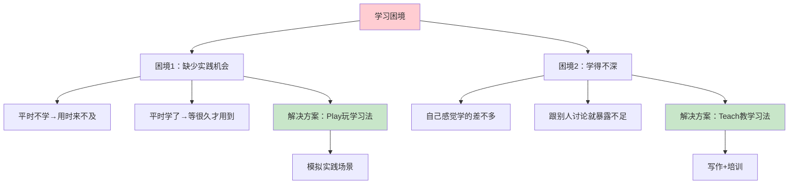
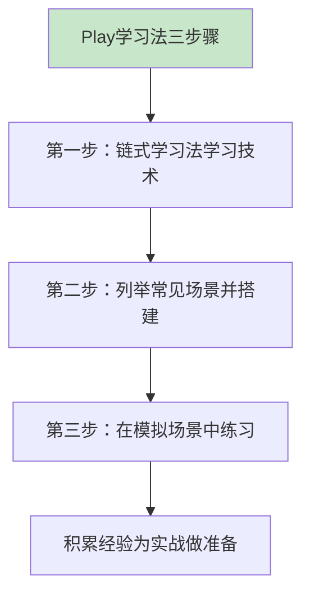
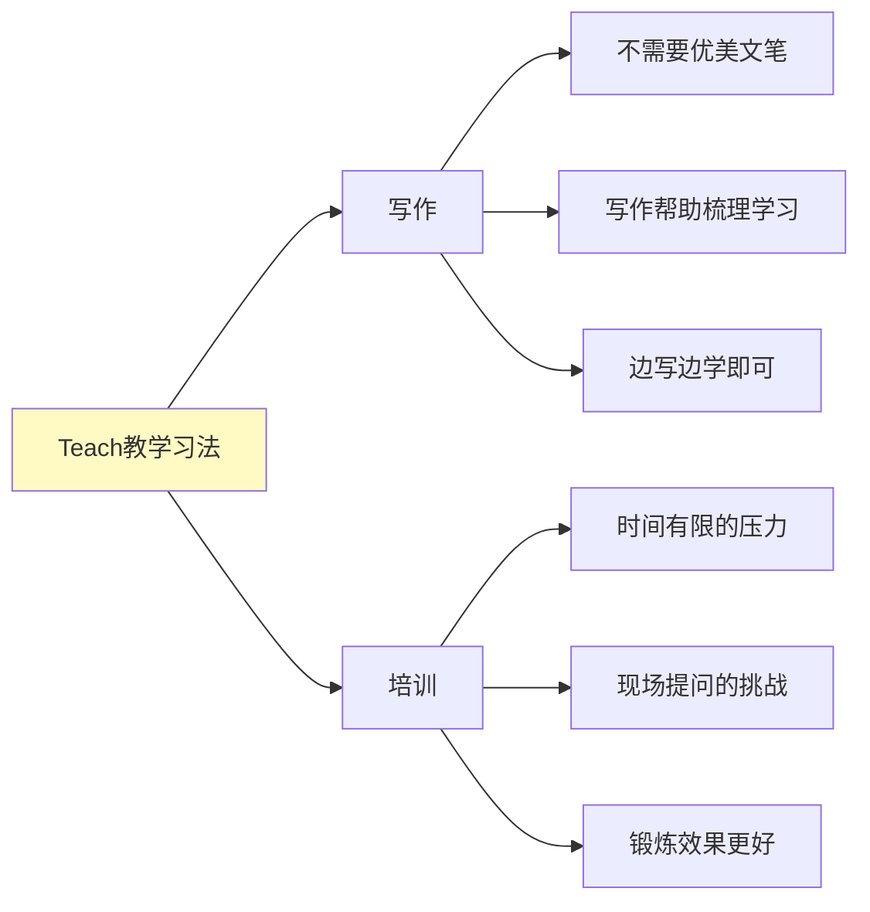
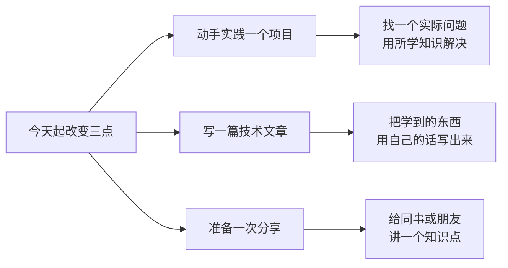

# 3.5玩和教保证效果
#### 目录介绍
- [01.看一个真实案例](#01看一个真实案例)
- [02.学习遇到的困境](#02学习遇到的困境)
- [03.未能深入地理解](#03未能深入地理解)
- [04.学习后要会输出](#04学习后要会输出)
- [05.实践学习法介绍](#05实践学习法介绍)
- [06.模拟实践学习法](#06模拟实践学习法)
- [07.教学学习法介绍](#07教学学习法介绍)
- [08.教学学习法使用](#08教学学习法使用)
- [09.后来发生的改变](#09后来发生的改变)
- [10.今天起改变三点](#10今天起改变三点)
- [11.课后作业思考下](#11课后作业思考下)

## 01.看一个真实案例

那年公司开始全面切 Kotlin，我提前 3 个月就买课、看书、刷文章。每次有人问我："会协程吗？" 我都自信地点头："会会会，看了两本书。"

直到组里来了一个新人，他端着电脑问我："这个 `withContext` 切线程后，**协程的状态是怎么挂起的**？挂起以后**线程做什么去了**？" 我张了张嘴——

> "嗯……就是、它会把任务……扔到另一个线程……然后……"

我说不下去了。新人挠了挠头，回工位自己去查了。**那一刻我比他还尴尬**。

更打击我的是当周晋升答辩，评委问了一句几乎一样的问题："协程的挂起和阻塞的本质区别？" 我答了 30 秒就被打断："你这是网上的标准答案，我想听**你自己理解的版本**。"

那场答辩我**没过**。评语里有一句话：

> "学习投入可见，但**输出能力薄弱、缺乏自己的实践与思考**。"

答辩后我去找带过我的一位前辈复盘。她听完我的描述，没说什么，只递了我一张纸：

> "你回去**找你一个身边朋友**，把协程讲给他听 30 分钟。朋友听不懂技术，但你必须让他**至少能复述出 3 个要点**。如果做不到，说明你根本没学过。"

我后来抽时间试了。讲了 5 分钟我就卡住了——我嘴里全是"挂起函数 / 协程作用域 / 调度器"，朋友一脸懵："你说的这些字我都认识，连起来我一个字都不懂。"

我突然意识到：**我不是没学，我是只会'输入'，没'输出'过**。

那天我把 OkHttp 那张分层图的经验拿过来，强迫自己用大白话重新组织协程：**"协程就像一个任务标签，标签可以从一根线挪到另一根线上接着干，期间这根线可以去干别的活儿。"** 朋友听完点头："这个我懂。"

下面这套**Play 玩学习法 + Teach 教学习法**，就是从那次"教朋友"开始，我一遍遍打磨、最后让我把"看过"真正变成"会了"的方法。

## 02.学习遇到的困境

针对不同维度的学习目标，可以分别采用不同的学习方法。不过就算你用对了方法，在学习过程中往往还是会遇到一些难以解决的困难，导致学习变成了"从入门到忘记"。

明明在课堂上听得津津有味，一做题却错漏百出；明明脑袋里涌动着万千思绪，却在需要表达时哑口无言。这其中的原因何在？

为何我们对知识的输入总是热情高涨，而对知识的输出却显得如此冷淡？那么，怎么摆脱这种的学习困境，如何保证我们的学习效果呢？

**根本原因在于：我们过于依赖"输入型学习"（看、听、读），而忽略了"输出型学习"（做、写、教）**。研究表明，主动输出的学习效果是被动输入的5-10倍。

## 03.未能深入地理解

真正的理解并不仅仅停留在"听过"或"看过"的层面。很多时候，我们过于依赖表面的理解，没有深入地去思考知识背后的逻辑和原理。

如果没有真正地将知识内化为自己的东西，将其转化为自己的思考方式和行为方式。**这种浅尝辄止的学习方式，就是在走马观花，虽然看似浏览了很多，但却没有留下深刻的印象**。

以学习数学为例，很多人可能觉得数学概念和公式很枯燥，但只要稍加思考，就会发现其中蕴含的深刻智慧。如果我们只是机械地记忆公式，而不去探究其背后的数学原理，那么在做题时就很容易出错。因为题目往往会变换形式，考验我们对知识的灵活运用能力。

**判断自己是否真正理解一个知识点，有三个递进的检验标准**：

| 检验层次 | 检验方式 | 通过标准 |
|----------|----------|----------|
| **能复述** | 用自己的话说一遍 | 不看资料能说出核心要点 |
| **能解释** | 给不懂的人讲清楚 | 对方听完能理解 |
| **能运用** | 在新场景中应用 | 遇到变化的问题也能解决 |

很多人在第一层"能复述"就认为自己懂了，实际上只有达到第三层"能运用"，知识才算真正被你掌握。

## 04.学习后要会输出

知识的输入和输出是一个相互促进的过程。通过不断地输出，我们可以发现自己的不足之处，进而有针对性地进行输入。同时，通过输入新的知识，我们又可以为输出提供更多的素材和灵感。这种良性循环，可以帮助我们不断地提升自己的学习能力。

因此，我们需要更加注重知识的输出，通过写作、演讲、分享等方式，将所学知识转化为自己的语言，进一步加深对其的理解和运用。

| 输出方式 | 难度 | 效果 | 适合场景 |
|---------|------|------|---------|
| 写作 | 中 | 帮助梳理思路 | 随时可做，无时间压力 |
| 演讲/培训 | 高 | 锻炼效果最好 | 团队分享、技术沙龙 |
| 教别人 | 高 | 倒逼深度理解 | 带新人、做导师 |
| 做项目 | 中高 | 理论转实践 | 有实践场景时 |

## 05.实践学习法介绍

从科学学习的角度来看，学以致用的效果是最好的，光学不练学得不深，时间一长可能就忘记了。

在实践中会遇到一个常见的困难，那就是团队当前的工作任务当中并没有相关的实践机会。这种情况下，你学习某个技术就会陷入两难的困境：如果学的话，得不到实践，学得不深；如果不学的话，真的要用的时候又来不及。这时候怎么办呢？

完全放弃肯定是不可取的，因为机会都是留给有准备的人，如果来了一个新的任务正好要用到某个技术，到时候肯定是团队内谁有准备就安排谁，不会等到某个人学习完了再安排任务给他。

**所以，需要找到一种方法，在暂时没有实践机会的情况下也能学好技术，这就是 Play 学习法**。

## 06.模拟实践学习法

Play 学习法，就是通过模拟实践中的场景来进行学习和训练。主动创造 Do 的机会来提升自己对新技能的理解和记忆。

Play 步骤做法比较简单，主要分为三个步骤：第一步按照链式学习法的方式学习某项技术；第二步列举常见的场景，搭建模拟场景；第三步在模拟场景进行测试、体验和练习。

**Play 学习法能够帮助我们更好的学习技术，但这并不意味着它能够完全取代工作中的实践**，工作中的实践仍然是非常重要的提升自己的方式。Play 学习法的价值在于：让你在机会来临之前就做好准备。

## 07.教学学习法介绍

除了缺少实践机会之外，在学习的时候还会遇到另一个常见的困难，那就是学得不深，理解不够透彻。

很多人都有类似的经历：自己学习某项技术的时候感觉学的差不多，甚至都已经在工作中具体实践了，但是一旦跟别人讨论，或者在晋升的时候面对评委的提问，又会感觉很多东西都没有完全掌握。

这种现象背后的原因是，每个人的知识和技能都是有一定局限性的，不同的人理解会不一样，关注点会不一样，所以在讨论或者 PK 的时候自然会遇到各种各样的问题。

**就算你有实践机会，也不太可能一两次就把一项技术相关的知识全部用到，总会有认知的盲区存在**。Teach 学习法就是帮你发现和填补这些盲区的利器。

## 08.教学学习法使用

总结出学习的四个主要方法：Read、Write、Do、Teach。前面介绍的 Play 学习法是关于 Do 的，而 Teach 学习法对应的则是 Write 和 Teach。

教别人有两种方式，一种当面给别人进行培训，另一种是写成资料给别人阅读，比如书籍和在线课程。所以，Teach 学习法包括两种形式：写作和培训。

技术文章的写作不是文学创作，不需要优美的文笔和有吸引力的情节，看技术文章的读者关注的也不是文字是否优美，情节是否吸引人，而是讲得清不清楚，讲得对不对。是不是一定要等到把某个技术彻底搞明白后才能动笔呢？其实不需要，因为写作本身就是帮助我们学习和梳理的一个过程。

**写作的价值不仅在于产出一篇文章，更在于写作过程中对知识的重新整理和深度思考**。当你试图把一个知识点写清楚的时候，你会发现那些"以为自己懂了"的地方其实漏洞百出。这就是写作最大的价值——帮你发现认知盲区。

| 写作阶段 | 核心动作 | 检验标准 |
|----------|----------|----------|
| **选题** | 选择一个你正在学的知识点 | 自己有话想说、有经验可分享 |
| **列大纲** | 梳理知识的结构和逻辑 | 大纲能独立表达完整思路 |
| **填内容** | 用自己的话解释每个要点 | 不抄专业术语，用大白话说清楚 |
| **自检** | 读一遍看是否通顺 | 一个不懂的人能看懂 |

写作的时候，我们没有时间要求，没有现场压力，一句没写好可以重写，今天写不出来可以等到明天再写。但是培训就不同，培训的时间是有限的，有现场压力，听众可能会提出各种意想不到的问题，所以培训对你的能力要求更高，但是锻炼效果也更好。

培训需要你在有限的时间内讲清楚一个主题，你必须对这个主题掌握到一定的程度才可以做到，这就会强迫你去思考跟主题有关的各种信息和可能的问题。

**培训比写作更有挑战的三个原因**：一是时间有限，你必须在规定时间内讲完；二是现场互动，听众的问题你无法提前预知；三是表达压力，你不能像写文章那样反复修改，说出口的话就是最终版。正是这些压力，让培训成为了比写作更强的学习加速器。

**最有效的 Teach 学习法，是"先写后讲"**——先把知识写成文章，梳理清楚逻辑和要点，然后以这篇文章为基础做一次培训分享。写作帮你整理思路，培训帮你查漏补缺，两者结合效果最佳。

实际操作建议：每学完一个知识模块，先花 1–2 天写一篇总结文章；然后基于文章准备一个 15–20 分钟的分享；分享后收集听众的反馈和问题，回去修改和完善文章。这样一轮下来，你对这个知识点的理解深度会远超只看不写、只写不讲的人。

> **看过 ≠ 学过，学过 ≠ 学会。**只有用 Play 在模拟场景里跑过、再用 Teach 把它讲给别人听过，知识才真的"长在你身上"。

你应该带走的三件事：

1. **每一个新技术，都欠它一个"小 Demo"**：不动手就只是"知道"，永远到不了"会用"。
2. **每一段学习，都欠它一篇文章**：写不出来 = 没真正理解，写作是最便宜的"自我体检"。
3. **每一篇文章，都欠它一次分享**：能讲到一个外行听懂，就到了费曼说的"真正会了"。

## 09.后来发生的改变

那次答辩失败之后，我每天花 20 分钟给朋友讲一个协程的概念，**用他能懂的比喻**。"协程像快递员，挂起 = 把包裹放在驿站，自己先去送别的；恢复 = 回来取，继续送。""线程像快递车，一辆车上可以拉多个包裹（协程），车不会因为一个包裹卡住就停掉。"

讲第 5 次的时候，朋友居然能反向问我："那如果驿站爆仓了怎么办？" 我愣了一下，认真回答："那就是协程的'背压'问题。" 然后我自己在脑子里也"叮"了一下——**这正是我之前没想清楚的地方**。

我把每次讲给朋友听的那些类比，整理成 6 篇博客。每篇大概 1500 字，全部不用术语，开头都是大白话。其中一篇《用送快递理解 Kotlin 协程》在公司内部技术站点上拿到了那一周的"最佳新手文章"，被推到了首页。更意外的收获是——**写第 4 篇的时候，我自己把"挂起函数到底为什么不阻塞线程"这个问题彻底搞懂了**，是被我前 3 篇文章里"模糊的地方"逼出来的。

半年后部门组织技术沙龙，主管直接点名："这一场让小杨来讲 Kotlin 协程，他写的那 6 篇文章我看过，讲得最清楚。" 那场分享 60 分钟，现场坐了 40 多人，**没有一个问题把我问住**。

下来主管拍了我一下："半年前那个答辩崩盘的小伙子和今天这个，**是同一个人**？" 我笑了笑，没说话——其实我心里有答案：**只是中间多了 6 篇文章 + N 次"假装教朋友"而已**。

## 10.今天起改变三点

选一个你最近学习的知识点，找一个实际的场景来动手实践。可以是做一个小 Demo、优化一段代码、解决一个实际 Bug。**关键是要"玩起来"**——不是照搬教程，而是带着好奇心去探索、去试错。只有通过实践，知识才能从"听过"变成"会用"。

把你最近掌握的一个知识点，用自己的语言写成一篇文章。写的时候要求自己：**不抄专业术语，用大白话解释清楚**。如果发现某个地方写不清楚，说明你还没有真正理解，回去继续学习。写完后发布到你的博客、知乎或内部知识库。

给你的同事、朋友或团队做一次 15 分钟的分享。不需要等到完全精通才开始，分享本身就是学习的过程。在准备分享的过程中，你会被迫系统地梳理知识，思考听众可能提出的问题。这种"输出倒逼输入"的方式，是保证学习效果最有力的武器。

## 11.课后作业思考下

**自检类**：

1. **输入输出比例检测**：回顾你过去一个月的学习活动，统计输入（看书、听课、读文章）和输出（写文章、做分享、做项目）的时间比例。如果输出不到 20%，你的学习效果很可能大打折扣。思考如何把输出比例提升到至少 30%。
2. **费曼测试**：选一个你认为自己已经掌握的知识点，尝试用大白话向一个完全不懂技术的朋友解释清楚。如果你做不到，说明你的理解还停留在表面。找出你解释不清楚的部分，重新学习直到能够流畅地用简单语言说明白。

**实践类**：

3. **Play 学习法实践**：选一个你目前只是"了解"但还不"掌握"的知识点，用 Play 学习法进行实践。具体做法：设定一个实际问题→尝试用这个知识点解决→遇到困难回去补课→再次尝试直到解决。记录整个过程，对比实践前后你对这个知识点的理解深度。
4. **写作+培训双重挑战**：选一个你擅长的技术主题，先写一篇 1000 字以上的技术文章，然后基于这篇文章准备一个 15 分钟的分享。完成后对比：写作和讲述对你的理解分别产生了什么帮助？哪种方式对你的提升更大？
