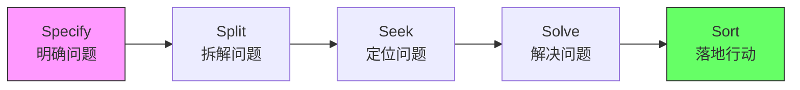
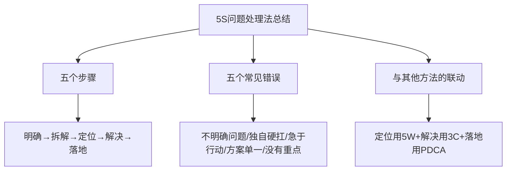
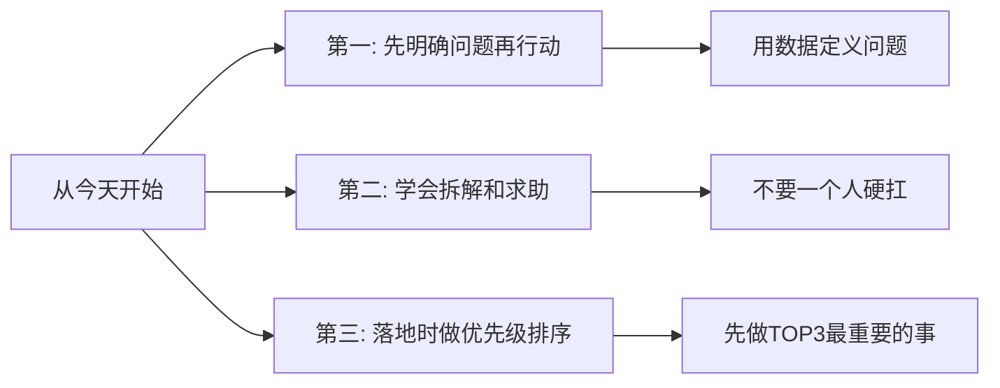

# 5.15 五步问题处理法
#### 目录介绍
- [01.看一个真实案例](#01看一个真实案例)
- [02.前言简单的介绍](#02前言简单的介绍)
- [03.第一步明确问题](#03第一步明确问题)
- [04.第二步拆解问题](#04第二步拆解问题)
- [05.第三步定位问题](#05第三步定位问题)
- [06.第四步解决问题](#06第四步解决问题)
- [07.第五步落地行动](#07第五步落地行动)
- [08.总结一下重点内容](#08总结一下重点内容)
- [09.后来发生的改变](#09后来发生的改变)
- [10.今天起改变三点](#10今天起改变三点)
- [11.课后作业思考下](#11课后作业思考下)

## 01.看一个真实案例

那年我刚被提为小组长，老板交给我一句话："最近团队效率好像不太行，你想想办法。"

我兴冲冲接下来后，连夜列了一堆动作：搞团建、改周会节奏、推代码规范、加自动化脚本、引入新工具、做内部分享……一口气干了 3 个月，自我感觉爆棚。结果季度复盘那天，老板一脸认真地问我："那你说说，这 3 个月之后，'效率低'这个事情有没有变好？变好了多少？"

我沉默了 5 秒，憋出一句："感觉……应该好了一点？" 老板没笑，反问我："**你连'效率低'到底是什么意思都没定义清楚，你怎么知道有没有变好？**"

那一刻我才意识到，过去 3 个月我做了一大堆事，但这些事**没有任何一个能被衡量、能被验证、能被回答"问题真的解决了吗"。**

老板在白板上写下 5 个字：明、拆、定、解、落，然后告诉我——**"任何一个问题，缺一步都不行：先把问题明确下来（明），再把它拆成能下手的子问题（拆），追到根因（定），用 3C 给方案（解），最后挑 TOP3 落地（落）。"**

后来我把这 5 个字记在工位上整整一年。再做"团队效率低"这件事，我先用调查问卷把"效率低"量化成"会议占比 35%、需求变更率 50%、发布耗时 4 小时"3 条具体数字，再分别拆解、定位、给方案、落地。3 个月后这 3 个数字分别变成了 18%、22%、1 小时。**这一次，老板没再问"有没有变好"。**

后面这一节我要分享的，就是把那 5 个字真正用起来的方法——5S 问题处理法。

## 02.前言简单的介绍

找到原因不等于解决问题。这就好比大夫看病，光是看出来患者的病根在心脏还不够，还要明确心脏到底出了什么毛病，是只用服药还是需要做手术，如果要安排手术，具体要怎么操刀。

处理问题也是这样，它是一个复杂的系统工程，既能够反映你的专业能力，又能够反映出你的综合能力。所以问题既有可能成为拖垮你绩效的陷阱，也有可能成为你晋升的机遇，关键在于你如何有效地去处理。

无论是工作还是生活，其过程就是遇到问题，分析问题，解决问题，然后再遇到下一个问题。这是一个递归的过程，永无休止。

如何解决问题呢？很多人的步骤是这样的：尝试一种解决方案失败了，再尝试另一种又失败了，然后再重复尝试。这种方式是比较低效的。最好的方式是建立一个思维框架，然后在这个框架上不断练习自己解决问题的能力。

那么问题到底要怎么处理呢？总结了一个 5S 问题处理法，也就是把处理问题的过程分为 5 个步骤：

明确问题（Specify）、拆解问题（Split）、定位问题（Seek）、解决问题（Solve）和落地行动（Sort），从而化危为机。

## 03.第一步明确问题

有个朋友曾经遇到过这样的情况：领导跟他说，最近团队士气好像不高。他立刻分析了 8 点原因，并提出了针对性的改进意见，还觉得自己反应很快，能力很强。

然后领导就让他负责提升士气，于是他组织培训和团队活动，搞各种评奖，推出各种新制度……干了一大堆事儿。结果半年后，老板说，感觉士气还是没什么变化。

这其实是很多人都会犯的第一个错误：问题本身都没有明确定义，就直接开始采取行动。结果很可能就是，你做了很多事情，但无法衡量。

所以你一定要提醒自己，在解决问题之前，先要明确问题。（这本来是不言而喻的道理，但是在实际工作中我们往往容易忘记。）

首先，对于已经用数据量化的问题，关键在于确认数据是否准确。通过数据来展现问题是比较直观的，而且很多人认为"数据不会撒谎"，所以他们看到数据之后就直接开始处理。

其实这种情况也是需要明确问题的。因为数据可能出错，出错的原因有很多种，可能是源数据出错，也可能是计算时出错。

一类是可以量化但是还没量化的，比如"业务增长放缓"，其中的"放缓"到底是什么意思，是增长速度从 100% 下降到 60%，还是增长速度从 10% 下降到 6%？不同的人理解可能千差万别。对于这一类问题，你把量化的环节补上就行了。比如老板说："我对当前的利润增长速度不满意，希望更快一点。"你就要明确，老板关注的指标是季度增长率还是月增长率？更快一些具体是多快，20% 还是 50% 还是 200%？

一类是无法简单量化的，比如"团队士气不高"，其中的"士气"只是一种主观感受，很难量化。所以这类问题是最棘手的，一是士气不高也许只是领导自己的感受有问题，并不是真的存在这个现象；二是就算真的士气不高，改善的效果也很难衡量。你怎么证明你提高了士气，又怎么证明士气到底提高了多少呢？直接用数据来衡量肯定是不现实的。经过实践摸索，我发现调查问卷是一种比较有效的方法。既然是主观感受，那我们就综合大多数人的主观感受来得到一个相对客观的评价。

## 04.第二步拆解问题

明确问题之后，你是不是就准备急着去分析原因了呢？毕竟你是负责人，领导还等着你的答案呢。这就是很多人都会犯的第二个错误：把自己当成拯救世界的超级英雄，以为可以一个人搞定所有的事情。

如果问题很简单，那么确实可以这样做。但大部分问题其实是比较复杂的，甚至有的问题看起来很简单，实际上可能涉及很多方面，如果你只靠自己一个人去分析，也许花了很长时间都搞不定。

所以为了能够更高效地分析问题和更快地给出解决方案，你要学会拆解问题。**具体的做法是，对问题进行初步的分析，将大问题拆解为几个独立的子问题，然后再根据子问题的数量和规模，看看是否需要申请更多人力资源来一起参与问题处理。**

这就和问题本身有关了。业务类的问题，可以按照业务类型来拆解，也可以按照客户群体来拆解；管理类的问题可以按照流程来拆解，也可以按照事项分类来拆解。

拆解问题有几个常见的小技巧：拆解出来的子问题数量 2～5 个，拆太多了就很难保证互相独立。拆解出来的子问题尽量互相独立。明确子问题负责人，组成工作组，定期向上汇报进展。

比如电商业务的"订单数下降 30%"，你可以按照业务类型来拆解，看看不同品类各自下降了多少。经过分析，你可能会发现，"男装下降了 20%"、"鞋类下降了 30%"、"食品下降了 20%"，其它品类的数据还是增长的。于是，"订单数下降 30%"这个大问题拆解成了 3 个子问题，你可以分别协调对应的运营负责人来一起处理。

又比如"团队研发效率不高"，经过调研发现，团队反馈最多的前 4 个问题是"会议太多""测试环境不足""发布太麻烦了"和"需求变更太频繁"。如果你一个人搞不定这 4 个子问题，你可以分别协调项目经理、测试负责人、运维负责人和产品负责人来一起处理。

## 05.第三步定位问题

半年的业务买量数据不升反降，老板让运营负责人赶紧想办法。于是他连夜构思解决方案，提出了几个大展拳脚的方案，比如 SEO 优化、增加更多渠道等。

老板大手一挥批准其中 3 个方案，半年后一看，投入多了几千万，买量的数据却没有多大起色，老板脸色很难看。这就是很多人都会犯第三个错误：没有找到根本原因的情况下，就急于给出解决方案。如果你只找到了表层原因，那么后续提出的方案就是无法从根本上解决问题，只能白白浪费时间和资源。

比如"加班太多导致士气不高"，我们也许可以得到两个根本原因："市面上的 Go 程序员较少"和"没有项目经理"。

第一种原因过程分析：

1. 问题 1：为什么士气不高？答：因为加班太多。
2. 问题 2：为什么加班太多？答：因为人力不够。
3. 问题 3：为什么人力不够？答：因为招聘困难。
4. 问题 4：为什么招聘困难？答：因为市面上的 Go 程序员太少。针对"市面上的 Go 程序员太少"这个根本原因，对应的解决方案可以是"招聘 C/C++ 程序员然后培养成 Go 程序员"。

沿着另一条线索追问的情况：

1. 问题 1：为什么士气不高？答：因为加班太多。
2. 问题 2：为什么加班太多？答：因为项目执行混乱。
3. 问题 3：为什么项目执行混乱？答：因为没有项目经理。针对"没有项目经理"这个根本原因，对应的解决方案可以是"招聘专职项目经理"。

## 06.第四步解决问题

针对问题提出解决方案。定位出问题的根本原因之后，你就需要提出问题的解决方案。解决方案往往涉及资源的投入（增加广告投入预算）、组织的调整（成立专项小组）和系统的增强（增加配置检查功能防止运营配置出错）等，所以你需要得到上级的认可和支持。这时很多人都会犯第四个错误：思维比较局限，只做了一个方案提交给上级。

你信心满满地把自己的解决方案提交上去，本来希望得到赞赏，结果却发现上级有更多的想法或不同的方案，反而认为你考虑得不够周全。那么，怎么做才能很快得到上级的认可和支持呢？你需要提供多个方案，并且给出你建议的方案和原因，最终让上级来挑选和拍板。这就是需要用到 3C 方案设计法。

## 07.第五步落地行动

方案得到批准后，你就要落地执行，真正解决问题。很多人在这一步容易犯问题处理的第五个错误：做事没有重点和优先级，眉毛胡子一把抓。

在前面的步骤中，你可能拆解出了 3 个子问题，然后每个子问题分析出 2～3 个根因，每个根因分别给出了对应的解决方案，接着每个解决方案又可以分成 3～5 件事情来做。最后你发现，可以做的事情有几十件。

你可能会认为这些事情都是有价值的，所以用一张 Excel 表格全部记录下来，然后从第一件开始一件一件地去做。

但是这样做的结果很可能是，你做了几个月，但是却看不到什么效果。因为每件事情的价值有大有小，见效时间有快有慢，你的领导并不关心你做了多少件事，他们关心的是，问题有没有真正解决。如果看不到明显的效果，就算你做得很辛苦，也很难得到认可。

挑选优先级 TOP N 的事情去做，尽快看到成效，让问题不断地改善。

优先级排序的技巧总结如下：可以按照阶段来进行优先级排序，并且顺序是可以调整的。比如前 3 个月 TOP 3 的事情是 ABC，后 3 个月 TOP 3 的事情是 XYZ。

如果只有一个团队来做，建议挑选 TOP3 ～ TOP5 的事情来落地；如果多个团队合作，那么可以选 TOP 10，每个团队负责其中 2～3 件事。

短期按照紧急程度来挑选 TOP N，长期按照重要程度来挑选 TOP N。比如"运营配置 URL 出错"这个问题，短期内的 TOP 事项可以是"上线流程优化"，让测试来检查运营配置的内容；长期 TOP 事项可以是"后台管理系统优化"，增加配置 URL 合法性和有效性检查功能。

在过程中你需要不断的练习练习练习。如果你想成为一个解决问题的专家，那么你就需要解决足够多的问题。

## 08.总结一下重点内容

| 步骤 | 核心动作 | 常见错误 | 关键技巧 |
|------|----------|----------|----------|
| 明确问题 | 用数据量化问题 | 不定义就行动 | 确认数据准确性/调查问卷 |
| 拆解问题 | 大问题拆为子问题 | 一个人硬扛 | 拆2-5个+指定负责人 |
| 定位问题 | 找到根本原因 | 只看表面原因 | 使用5W根因分析法 |
| 解决问题 | 提出多个方案 | 只给一个方案 | 使用3C方案设计法 |
| 落地行动 | 按优先级执行 | 眉毛胡子一把抓 | TOP3-5优先级排序 |

5S 问题处理法 = **明、拆、定、解、落**——5 个字一字不能少，少哪一步，问题在那一步原地复活。

- 千万不要在"明"还没做完的时候就开始"解"，所有的瞎忙都从这里开始。
- 5S 不是孤立工具，它是 5W + 3C + PDCA 三件套的"上层调度框架"。
- 落地永远 TOP3，不要列 30 件事——你做不到，老板也不关心。

5S 问题处理法就是把处理问题的过程分为 5 个步骤：明确问题（Specify）、拆解问题（Split）、定位问题（Seek）、解决问题（Solve）和落地行动（Sort），从而化危为机。处理问题时容易犯的 5 个错误是：（1）问题本身都没有明确定义，就直接开始采取行动；（2）把自己当成拯救世界的超级英雄，期望可以一个人搞定所有的事情；（3）没有找到根本原因的情况下，就急于给出解决方案；（4）思维比较局限，只做了一个方案提交给上级；（5）做事没有重点和优先级，眉毛胡子一把抓。

## 09.后来发生的改变

那次复盘之后的第一周，我给自己定了一条铁律——**所有交到我手里的"问题"，第一步必须先回答 3 件事**：这个问题用什么指标衡量？现在的数值是多少？目标值是多少？如果三件事我自己回答不上来，就一定先回去找老板/相关方对齐，再开工。

第一周里我推掉了 2 个原本要急着开工的任务，反而花了一整天去做"明确问题"。组员一开始很疑惑："这都没动手，你天天在干嘛？" 后来这两个任务的方案出得又快又准，老板第一次说："这次方案讲完，**我没什么问题问你。**"

接下来一整个月，我把所有手上的事都按 5S 五步走了一遍：从"团队效率低"、到"客诉率上升"、再到"上线故障率高"——三件大事，每件都先量化、再拆解、再追根因、再 3C 给方案、最后挑 TOP3 落地。

奇迹的事情发生了：以前我手忙脚乱处理 10 件事都没人记得，现在我专心处理 3 件事，每一件**都有明确的"前后对比数字"可以拿出来汇报**。月底周会上，老板第一次说："本月你的输出是组里最有质感的。"

半年之后，部门做内部分享，老板让我给新来的两位组长分享"如何接老板交代的问题"。我把那 5 个字写在白板上，从"明"讲到"落"，讲到"明确问题"那一步时，台下一位老组长笑着插了一句：**"这不就是把所有人最容易跳过的一步逼出来了吗？"**

那一刻我意识到——5S 真正改变我的，不是教会我多少招式，而是逼我**戒掉"听完老板一句话就开干"的本能反应**。从一个 3 个月没动静的菜鸟组长到能给别人讲方法的人，差的从来不是聪明，而是"做之前先想清楚"这一道工序。

## 10.今天起改变三点

下次遇到问题时，先花 10 分钟明确问题。不要着急给方案，先问自己：这个问题到底是什么？能不能用数据来量化？影响范围有多大？只有把问题定义清楚了，后面的分析和解决才有意义。

如果一个问题你分析了半小时还没有头绪，说明这个问题比你想象的复杂。试着把大问题拆成 2-3 个子问题，看看是否需要拉其他人一起来分析。记住：**会借力的人不是能力弱，而是更高效。**

落地执行时一定要做优先级排序。当你列出了一堆要做的事情后，不要从第一条开始按顺序做。先挑出 TOP3 最重要且最紧急的事情集中突破，让领导和团队尽快看到效果。剩下的事情可以在后续迭代中逐步完成。

## 11.课后作业思考下

1. 你职业生涯中处理过的最棘手的问题是什么？用 5S 问题处理法的框架重新分析：你在哪个步骤做得好，哪个步骤犯了上述 5 个错误之一？
2. 回忆一次你"急于给方案"的经历——方案最终效果如何？如果当时先做了问题定位和根因分析，结果可能会有什么不同？

1. 选择一个你当前正在面对的工作问题，严格按照 5S 的五个步骤来处理：先明确问题→拆解子问题→定位根因→提出方案→优先级落地。记录全过程。
2. 思考一下：在你的团队中，哪些步骤经常被跳过？你认为可以采取什么措施来改善？
