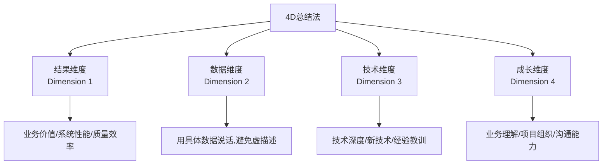
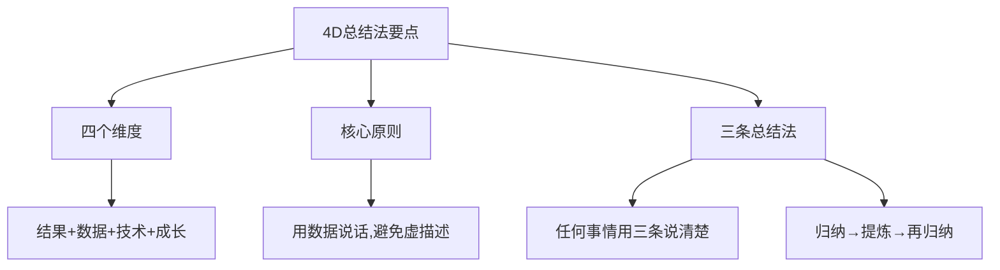
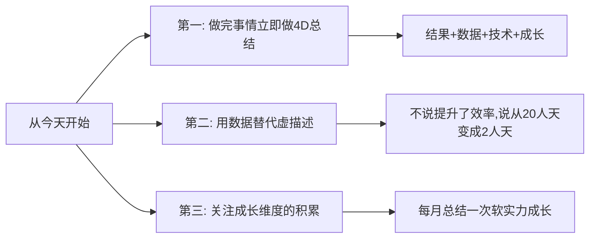

# 5.6 四维度总结分析
#### 目录介绍
- [01.看一个真实案例](#01看一个真实案例)
- [02.前言简单的介绍](#02前言简单的介绍)
- [03.总结常见的误区](#03总结常见的误区)
- [04.如何去展现亮点](#04如何去展现亮点)
- [05.从结果维度分析](#05从结果维度分析)
- [06.从数据维度分析](#06从数据维度分析)
- [07.从技术维度分析](#07从技术维度分析)
- [08.从成长维度分析](#08从成长维度分析)
- [09.三条总结说事情](#09三条总结说事情)
- [10.最后要总结一下](#10最后要总结一下)
- [11.后来发生的改变](#11后来发生的改变)
- [12.今天起改变三点](#12今天起改变三点)
- [13.课后作业思考下](#13课后作业思考下)

## 01.看一个真实案例

### 1.1 我的晋升答辩，被一句话问得当场卡壳

第一次晋升答辩那天我有 90% 的把握能过——准备了 60 页 PPT、列了一年里做的 11 个项目、加班记录都在邮件里翻得到。前 15 分钟我讲得行云流水，自我感觉炸裂。

直到一位评委放下笔，问了我一句话："你这一年做的事情我都看到了，**但是我没看到结果。** 你说做了一个'高可用架构升级'，我想问——升级前后系统可用性是多少？故障数从几次降到几次？带来了什么业务收益？"

我当场卡住了。我说"系统更稳了""业务方反馈很好"——评委追问："具体多稳？反馈具体是什么？" 我答不上来。再问下一个项目，再卡。第三个项目，我已经满头是汗。**那场答辩我没过。**

### 1.2 师父一句话点醒：你做的事不少，但你"讲不出来"

晋升结果出来那晚我喝了点酒，给我师父打了电话。师父没安慰我，他只问我："你那 11 个项目，**有几个你是从结果、数据、技术、成长这 4 个维度都能说清楚的？**"

我沉默了很久——一个都没有。师父说："你不是没做事，是你做完之后从来没有'按维度复盘'过。下次开始，每件事做完都按 4 个维度写下来：结果是什么、数据怎么变、技术上学到什么、个人能力涨了什么。这叫 4D 总结法，是你晋升以后的'弹药库'。"

后面这一年我严格按 4D 跑下来，第二次答辩 35 分钟讲了 3 个项目、每个项目都有"前后对比数字 + 技术沉淀 + 个人成长"，**全票通过**。今天这一节，就把那一年我走过的路，完整教给你。

## 02.前言简单的介绍

### 2.1 影响结果因素多

工作中，好方法能够提升你拿到好结果的概率，但是不能保证让你一定拿到好的结果，因为影响最终结果的因素太多了。

就算大量使用方案设计法，决策过程仍然有可能有失误。比如讨论备选方案的时候漏了一个重要的方案；或者决策时采用的判断标准有问题，多方面原因造成结果未达标。

就算使用罗列执行计划，执行过程仍然有可能出现偏差。对任务进行规划和跟踪，具体执行的时候，可能会受到使用者的水平和投入资源等因素的限制。

### 2.2 做事结果很重要

不但做事的方法很重要，而且做事的结果也重要。在汇报或答辩的时候，评委除了考察规划和执行相关的"为什么"之外，还会考察和做事结果相关的"为什么"。

比如：你认为这个结果怎么样？你怎么评价这个结果？为什么你认为这个结果不好？为什么你的方法挺好但是结果不好？你从这个结果得到什么经验和教训？

结果好的事情讲起来就很容易了，结果不好才需要包装一下。其实不是这样的，结果不好的事情，需要分析原因，总结经验教训；结果好的事情，更需要讲清楚你对结果的贡献。

## 03.总结常见的误区

### 3.1 拔高自己的贡献

讲的贡献是团队的总贡献，没有讲清楚自己对结果的贡献，或者拔高了自己对结果的贡献。

只讲自己的做事方法多么高大上，却不提最终的效果，比如说自己引入了某某算法，但却不说到底带来了什么好处。

### 3.2 描绘的结果虚

虽然提了一下效果，但都是比较虚的描述，比如高可用、高性能、用户转化率大大提升之类的话，评委听完也不知道到底有多高、有多大提升。

虽然描述效果的时候列出了数据（能列出数据已经超出了 60% 的人），但对于数据没有自己的理解和判断，评委针对数据问的问题都答不上来。

## 04.如何去展现亮点

总结的时候到底要怎么说才能充分展示出自己的工作亮点呢？这就要用到 4D 总结法了！

也就是从结果、数据、技术和成长这 4 个维度（Dimension）来整理自己的做事收获，从而涵盖事情的重点难点核心点，有效地应对晋升答辩时可能遇到的各种问题。

## 05.从结果维度分析

结果这个维度重点关注的是事情带来的价值，不同类型的团队在结果价值方面表现会有一些差异。

### 5.1 业务开发团队

不管是业务开发项目，技术优化方案，还是管理措施，我都建议从业务角度进行结果总结：

对于业务开发项目来说，从业务的维度总结是自然而然的，例如某个业务用户日活是多少。

对于技术优化方案来说，主要看技术方案给业务带来的价值是什么，例如高可用方案让业务 P1 故障从 5 次减少到 0 次。

对于管理措施来说，主要看管理措施带来的效率和质量的提升，例如同样的人员支撑了更多业务。

### 5.2 中间件开发团队

结果建议从系统的性能、可用性和成本等方面进行总结；如果中间件系统已经产品化，也可以从销售量或者流量等方面进行总结。

### 5.3 技术支撑团队

也就是运维和测试之类的部门，结果建议从质量、效率和成本方面进行总结。

比如测试做了一个自动化测试平台，可以降低 5000 人日测试工作量，使用了这个自动化测试平台的某业务线上年度故障数量从 20 个降低为 5 个。

## 06.从数据维度分析

### 6.1 不要描述虚的

像"提升了开发效率"这种比较虚的描述，应该改成"开发一个功能从 20 人天提升为 2 人天"这种使用具体数据的描述。

通过数据来描述结果，不但要列出相关的数据，而且对于这些数据背后的含义也要有自己的理解，尤其是对数据的评价以及评价的标准。通过评价数据的方式，你可以培养自己的业务思维和理解力。

### 6.2 没有数据怎么办

很多人在一开始尝试的时候都会遇到一个疑问：感觉这个事情好像没办法用数据来描述啊？这个时候怎么办呢？

其实大部分的情况，不是真的不能用数据来描述，而是你没有去搜集数据，没有养成用数据来说明的习惯。**结论是：先搜集，再表达。** 哪怕只能拿到"用户调研得分""问卷反馈分布""主观打分平均值"这种"半数据"，也比纯虚的描述强 10 倍。

## 07.从技术维度分析

### 7.1 技术深度的提升

对于技术人员来说，做完一个项目或者方案之后，技术上有哪些提升、学到了什么新的技术、对哪些技术有了更深或者更全面的理解等，都可以在总结的时候系统地梳理一下。

虽然我们在设计方案的时候已经采用了 3C 方案设计法对领域进行了全面地分析和研究，但并不代表这样就可以完全掌握所有相关的知识和技能。

### 7.2 经验教训的沉淀

在具体落地的过程中肯定还会遇到很多细节或者之前没有注意的地方。在事情做完后，统一地整理和总结一下经验教训，能够进一步提升技术深度。

把每个项目里"踩过的坑、用过的偏方、读过的源码、改过的边界"沉淀成笔记，3 个项目之后你就会发现自己在这块技术上的"信息密度"已经远超别人。

## 08.从成长维度分析

### 8.1 关注综合能力

除了关注技术上的提升之外，你还需要关注个人综合能力成长，也就是软实力提升，比如对业务的理解能力、项目组织能力、带领团队的能力、沟通能力和做事方法等。

这些能力在 P5/P6 晋升的时候可能没那么重要，但是到了 P7 以后就会变得越来越重要，而且综合能力很难靠突击来提升，只能在平时工作中逐步积累。

### 8.2 业务理解能力

做完一个项目后，可以从以下角度去总结：业务的适应场景是什么？目标用户是谁？目标用户有什么特点？解决了目标用户的什么问题？实际的效果如何？用户为什么喜欢或者不喜欢这个功能？

随着做的项目越来越多，你通过总结得到的业务理解信息和能力也越积越多，到了一定阶段就可以量变导致质变，业务理解能力大大提升。

## 09.三条总结说事情

### 9.1 如何快速说总结

做总结可以说是我们日常工作中非常重要的事情了，但却不是人人都能做得好，毕竟这个世界上，把简单问题复杂化很容易，而把复杂问题简单化很难。

那究竟如何做好总结呢？不管是什么总结，大到公司三年战略规划，小到如何接客服电话，一律要求用三条说清楚。三条总结，不是总结出最重要的三点，而是用三点把所有的事情说清楚。

### 9.2 三条总结法

第一，唯有简单，才能被理解；唯有被理解，才能被记忆；唯有被记忆，才能被执行。

现代社会是一个信息爆炸的社会，也是一个快节奏的社会，没有人有耐心花十分钟看完一篇文章，也没有人有兴趣去记忆十几、几十条原则。所以注定，唯有简单，才能有效。

第二，任何事情，如果你不能用三条说明白，说明你还没有想清楚。

有人会认为，简单的问题可以三条总结，复杂的问题做不到三条总结。这恰恰是我们要解决的问题，我们追求的就是把最复杂的问题能用三条说清楚。

第三，我们说的三条总结，是只用三条说清楚所有问题。

而不是总结了十条然后选取其中最重要的三条，后面还有七条八条，合起来才能够把问题说清楚。

### 9.3 如何做到三条总结

有人会认为，简单的问题可以三条总结，复杂的问题做不到三条总结。这恰恰是我们要解决的问题，我们追求的就是把最复杂的问题能用三条说清楚。

那如何才能做到三条总结呢？非常重要的一点就是，归纳、总结、提炼，再归纳、再总结、再提炼。

把问题总结为十几条之后，再进行分析，看是否可以进一步进行总结，如果站在更高些的高度，哪些问题属于细枝末节哪些属于核心问题，核心问题中是否有些问题还是属于同类项，可以合并？

再进行分析，让自己再向后退站到更高的高度进行归纳、总结和提炼，看看哪些问题属于细枝末节，哪些属于核心问题，核心问题中是否可以进一步合并同类项，最终形成三条总结。

这三条涵盖了问题的所有方面，是我们理解这个问题以及掌握这个问题的关键。掌握了这三条，就掌握了这个问题。

归纳、总结、提炼，这是非常重要的逻辑分析能力，它们的基础是常识和逻辑。而常识和逻辑是我们一切思维的基础，超越常识就是骗局，不合逻辑必有问题。

### 9.4 三条总结法收益

三条总结的过程，也是一个逼迫自己不断向上攀登认知更高峰的过程，对越复杂问题进行三条总结，越需要你站在更高的高度，进行更高水平的归纳总结和提炼。

完成了对越复杂问题的三条总结，也就完成了一次自己认知的越大飞跃。

## 10.最后要总结一下

| 维度 | 核心问题 | 具体展现方式 | 常见误区 |
|------|----------|-------------|----------|
| 结果维度 | 带来了什么价值？ | 业务指标/系统性能/效率质量 | 只说做了什么，不说效果 |
| 数据维度 | 能用数据量化吗？ | 具体数字+评价标准 | 用"大大提升"等虚描述 |
| 技术维度 | 技术上有什么收获？ | 新技术/深度理解/经验教训 | 只讲方法不讲效果 |
| 成长维度 | 综合能力提升了什么？ | 业务理解/项目组织/沟通能力 | 只关注技术忽略软实力 |

### 10.1 一句话核心

总结不是"事后追忆"，是"对未来你的子弹库扩容"。**4D = 结果 + 数据 + 技术 + 成长，缺一不可。**

### 10.2 你应该带走的三件事

- 没有数据的总结都是给自己挖坑——晋升答辩第一个被问倒的就是它。
- 4 个维度逐个写完之后，再用三条总结法压成 3 句话，这才叫"讲得出来"。
- 总结的真正受益人，不是别人，是 1 年后等着用素材的你自己。

汇报工作成果时有四个常见的误区：只有结果没有效果；效果只有很虚的描述，没有具体数据；对给出来的数据没有自己的理解和判断。4D 总结法就是从结果、数据、技术和成长这 4 个维度（Dimension）来整理自己的做事收获，展示工作上的亮点。当总结数量积累到一定程度的时候，还可以再系统地整理一下，写成文章发表或者拿去给团队做培训，那样效果会更好。

## 11.后来发生的改变

### 11.1 第一周：每个项目结束都强制写 4D

师父电话挂断的当晚，我打开有道云笔记建了一个"4D 总结库"。规则很简单：从今天起，每做完一个项目（哪怕只是一个小需求），第二天必须填一份 4D 卡片：

- 结果：业务指标/系统指标前后对比；
- 数据：具体数字 + 我的解读；
- 技术：踩坑和沉淀，至少 3 条；
- 成长：我个人能力上长了什么。

第一周写得特别痛苦，几乎每一项都要回头去找数据、翻聊天记录、问产品要 dashboard 截图。但写完的那一刻有种"踏实感"——**这件事我是真的'装到口袋里了'**。

### 11.2 第一个月：周报开始有"前后对比数字"

一个月之后，我的周报模板自动进化了——开头永远是"本周关键产出"3 行，每一行都带"前→后"对比数字。比如："发布耗时 45min → 12min"，"用例覆盖率 62% → 81%"。

最神奇的事情是：**老板回我周报的频率显著提升**。以前他基本只回"收到"，现在他会追问："发布耗时怎么压下来的？" "覆盖率提升后线上 bug 数据有没有变化？" 这些追问反过来又帮助我把数据沉淀得更细。一个月之内我的"4D 总结库"已经累积了 14 张卡片。

### 11.3 第二次答辩：35 分钟讲了 3 件事，全票通过

第二次晋升答辩那天，我打开 PPT，没有再讲 11 个项目，**只讲了 3 件事**——但每件事都按 4D 摆得整整齐齐：结果有前后对比、数据有具体数字、技术有沉淀文档、成长有具体场景。

整场 35 分钟，评委一共问了 6 个问题，5 个我都能直接翻 4D 卡片回答出来。最后那位上次问倒我的评委这次说了一句："你这次讲的事虽然少，**但每一件我都听明白了。**" 当晚结果出来——全票通过。

那一刻我真的明白：**4D 不是为答辩准备的，4D 是让你这一年的所有努力'能被看见'**。

## 12.今天起改变三点

### 12.1 做完事情立即做4D总结

从下一个做完的任务开始，用 4D 总结法做一次总结。哪怕只花 10 分钟，也要从结果、数据、技术、成长四个维度各写一条。坚持积累，到了年终总结或者晋升答辩时，你会发现自己手里有大量的素材可以用。

### 12.2 用数据替代虚描述

养成用数据说话的习惯。从今天起，凡是涉及工作效果的描述，都逼自己找到具体数据。不说"提升了开发效率"，而说"开发一个功能从 20 人天缩减为 2 人天"；不说"系统更稳定了"，而说"P1 故障从每季度 5 次降低为 0 次"。

### 12.3 关注成长维度的积累

除了技术成长，开始关注你的综合能力成长。每做完一个项目，问自己：我的业务理解是否更深入了？项目组织能力有没有提升？沟通协作有没有更顺畅？**这些软实力在 P7 以后会变得越来越重要。**

## 13.课后作业思考下

### 13.1 自检类作业

1. 选择你最近完成的一个项目，用 4D 总结法从结果、数据、技术、成长四个维度各写 2-3 条总结，看看能否覆盖这个项目的核心亮点。
2. 检查你最近的一次工作汇报或总结，看看有多少处使用了"虚描述"（大大提升、显著优化等），试着把它们全部替换为具体的数据表述。

### 13.2 实践类作业

1. 用三条总结法概括你过去一年的工作——只用三条，把所有重要的事情说清楚。这个过程会逼迫你进行高度抽象和提炼。
2. 回顾你的综合能力成长：过去一年，你在业务理解、项目组织、沟通协作等方面分别有什么进步？如果不明显，思考一下原因和改进计划。
