# 6.6学会高效的提问
#### 目录介绍
- [01.被关掉的对话框](#01被关掉的对话框)
- [02.先来看两个案例](#02先来看两个案例)
- [03.看几个提问案例](#03看几个提问案例)
- [04.先尝试自己解决](#04先尝试自己解决)
- [05.提问前要做什么](#05提问前要做什么)
- [06.如何问有效问题](#06如何问有效问题)
- [07.一句话概括问题](#07一句话概括问题)
- [08.较为详细的描述](#08较为详细的描述)
- [09.不排斥不同观点](#09不排斥不同观点)
- [10.有效提问四步骤](#10有效提问四步骤)
- [11.提问高手的特点](#11提问高手的特点)
- [12.场景化提问训练](#12场景化提问训练)
- [13.总结回顾这一节](#13总结回顾这一节)
- [14.后来发生的改变](#14后来发生的改变)
- [15.今天起改变三点](#15今天起改变三点)
- [16.课后作业思考下](#16课后作业思考下)

## 01.被关掉的对话框

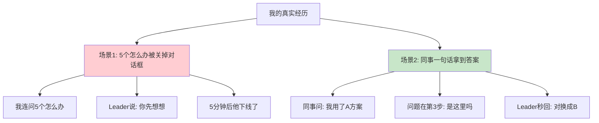

### 1.1 我连问 5 个"怎么办"

去年我接手一个新模块，遇到一个奇怪的报错。我直接在企业微信上找技术 Leader："这个怎么办？" 他没回。我又问："那个怎么解决？""有没有思路？""能帮我看看吗？""老大你在吗？"——5 个"怎么办"发出去。

5 分钟后我看到他的状态变成"离线"。后来组长悄悄告诉我：**"Leader 不是没空，是被你的提问劝退了。你一句背景没讲，他怎么帮你？"**

### 1.2 同事一句话拿到答案

同一周，组里另一个同事也找这位 Leader 求助，他是这样写的：**"老大，我在做 XX 模块，调用 API 时第 3 步报 500，环境是 macOS+Node 18，我已经检查了参数和权限都没问题，怀疑是 X 配置问题，是不是这里需要改 B？"**

Leader 30 秒回复："对，换成 B，再看下日志里 trace_id。" 问题解决。

### 1.3 一个反差让我醒悟

同样一位 Leader，我连问 5 个问题没人理，他一句话拿到答案。差距不在 Leader 的态度，而在**我把"提问"当成了"求救"，他把"提问"当成了"协作"**。从那以后，我开始系统学习如何提问，下面是我整理的方法论。

## 02.先来看两个案例

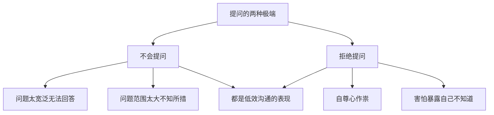

### 2.1 不知道怎么问

第一个案例：不知道怎么问。问问题前没有好好思考，问的问题要么很宽泛让人无法回答，要么问题范围很大让人不知所措。

比如问一个前辈"怎么才能做好工作？"——这个问题范围太大了，前辈只能给出大众化的建议，对你没有针对性的帮助。

### 2.2 万事不求人

第二个案例：万事不求人，拒绝寻求帮助。这个在学习和工作场景中都还蛮常见的。我们很多人都不愿意主动寻求帮助。为什么呢？主要的原因无非是自尊心作祟，害怕别人知道自己不知道。

这其实是一种认知误区——提问不是暴露无知，而是展示学习意愿。真正让人看不起的不是"不知道"，而是"不知道还不愿意学"。

### 2.3 提问是核心能力

提问能力是一项被严重低估的核心能力。好的提问能够：节省大量试错时间、快速获取关键信息、展示你的思考深度、建立与他人的信任关系。

爱因斯坦说过："如果我有一个小时来解决一个问题，我会花55分钟来想这个问题，花5分钟来想解决方案。"问对问题，往往比找到答案更重要。

## 03.看几个提问案例

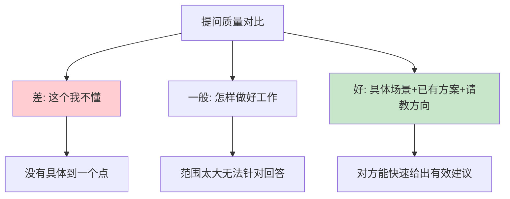

先想一想，如果你是被问的那个人，你希望听到怎样的问题。对某个事物的认识，总是"由浅到深"。虽然同样是由浅到深，但每个人思考的深度却千差万别。

### 3.1 低质量提问

**案例一**：在培训学习算法的时候，有学生遇到不懂的章节，想请教老师，于是便对老师说，"这个我不懂"。老师听了很诧异，于是问他究竟哪里不懂，要具体到一个点。这个学生最后说，"我也不知道我哪里不懂，反正我就是不懂。"

**案例二**：有人希望前辈在工作上给点建议，于是问前辈"我怎样才能做好工作"。由于范围太大，导致最后别人说出大众式的建议，对于自己又没有太大的作用。

### 3.2 高质量提问

**案例三**：有人问大牛"运营怎么做？"这是一种问法。还有另外一种问法："我们这个投资界App资讯平台目前大概有10万用户，我们想提高用户的活跃度，想做一个激励体系，现在我们考虑了A、B、C等几个方案，不知道您觉得这方面是否有遗漏。"

| 提问要素 | 差的提问 | 好的提问 |
|----------|----------|----------|
| 背景信息 | 无 | 10万用户的资讯平台 |
| 具体目标 | "运营怎么做" | 提高用户活跃度 |
| 已有思考 | 无 | 已考虑A、B、C方案 |
| 精准问题 | 无 | 方案是否有遗漏 |

以前我也不会提问，现在想想，感觉那不是提问，而是希望别人直接帮我把问题解决啊……许多问题刚开始不知道好与否，其实，你可以换位思考下，也许就不一样呢！

## 04.先尝试自己解决

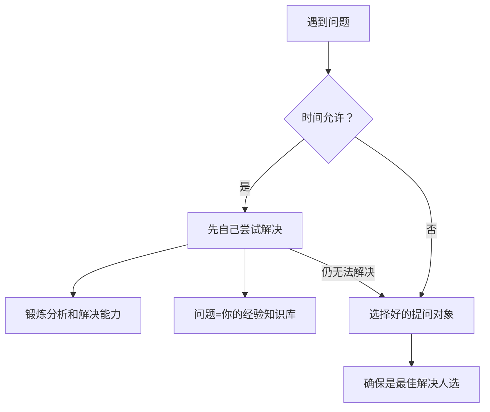

遇到问题不要急着问别人，时间允许的情况下，先看看靠自己是否能够解决。这样，一方面能锻炼自己分析问题和解决问题的能力；另一方面一旦问题解决了，问题就是你的经验和知识库。

### 4.1 自己先研究

现在互联网上有那么多的技术资料和各类问答网站，想碰到一个别人没碰到过的问题，已经非常困难了。在搜索引擎上搜索一下，主要要定位问题的点，然后对得到的信息进行分析、过滤和取舍。

### 4.2 选择合适的提问对象

如果做了努力依然不能解决，或者客观条件不允许你自己解决了，那么要做的就是选择一个好的提问对象。不管是现实中的大神，还是网络上的牛人，确保他是你所知道的最佳解决人选。

不要随便找人问——找一个领域不对口的人问，既浪费对方时间，你也得不到有效答案。

## 05.提问前要做什么

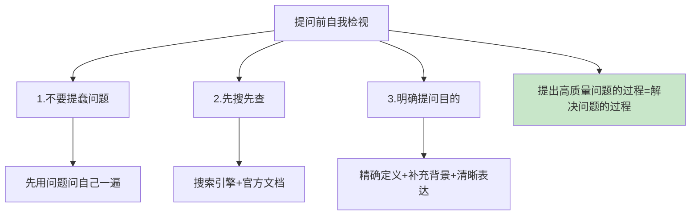

在提问之前，你一定要做好如下3点自我检视，只要有任何1点没做，就极有可能引起被提问者的不满。

### 5.1 不要提蠢问题

问问题前，建议你先用这个问题问自己一遍，因为草率的发问最终只能得到草率的回答，或者根本得不到任何有效的答案。

### 5.2 先搜先查

只要是搜索引擎和官方文档能回答的就别问别人，因为你自己去搜索问题相关的资料要比直接把答案灌输给你会让你学到更多。

### 5.3 明确提问目的

你对目的的定义要足够精确，要让别人有足够的着力点来回答。拿出现阶段最好的问题，补充背景，清晰准确表达语句。

记住这一点：**提出高质量问题的过程，其实就是解决问题的过程**。在程序员的世界里面，有时候发现、定义问题的能力比解决问题的能力更重要。

## 06.如何问有效问题

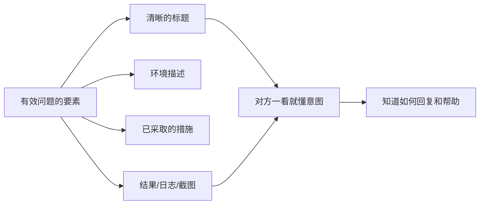

### 6.1 一个有效问题的样板

如何问一个有效的问题呢？这里面是有技巧的。提问和回答是交流中最重要的部分，一个好的问题能够让提问者和回答者同时获益。

举一个例子。当时我就发现同事A提问题或报bug都非常规范，每个bug都有清晰的标题，正文是环境描述、已经采取了什么措施、结果、日志、截图等等。读完邮件，你就能很清楚对方想要表达的意图和希望你能提供的帮助，而且你也知道该做什么、如何回复。

### 6.2 有效问题的四要素

一个有效问题应该包含：**问题概述（一句话）+ 背景信息 + 已尝试的方案 + 期望的帮助**。

## 07.一句话概括问题

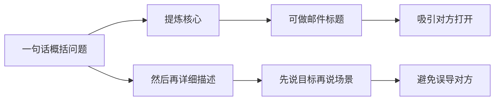

### 7.1 一句话提炼核心

用一句话准确概括你遇到的问题，提炼出问题的核心。如果是邮件沟通的话，你可以把它作为标题，更能吸引你的求助对象打开你的邮件。

### 7.2 先说目标再说场景

然后，要用清晰的语言描述你遇到的问题。注意要先在开头说明你想达到的目标，再去详细描述你问题的具体场景、阻碍你的特定步骤等等。因为很有可能你之前的思路、过程就走了弯路，避免误导其他人。

## 08.较为详细的描述

### 8.1 提供必要的环境信息

在描述具体问题的时候，要注意提供相关场景和信息，比如所用的操作系统、数据库等相关软件及其版本号等；同时尽可能地提供问题相关的可分析文件，包括日志、截图等。

### 8.2 描述已尝试的方案

另外，你也要说一下自己已经尝试采用了什么措施来解决问题，最终结果是什么样的，问题是否可以重现，采用什么方式重现等等。

虽然提供的信息看起来很多，但还是注意不要长篇大论，尽量简明扼要，描述主要问题。一个实用的结构是：

| 描述要素 | 内容 | 示例 |
|----------|------|------|
| 环境信息 | 系统/版本/配置 | macOS 14.0, Node.js 18.0 |
| 问题描述 | 发生了什么 | 运行XX命令后报XX错误 |
| 复现步骤 | 怎么触发的 | 步骤1→步骤2→步骤3 |
| 已尝试方案 | 你做了什么 | 尝试了A方法无效、B方法无效 |
| 期望结果 | 你想达到什么 | 期望XX正常运行 |

## 09.不排斥不同观点

对不同的观点，不要排斥。站在不同的角度去思考问题，当然会有不同见解，要慢慢学会理解。如果尚未思考就直接排斥，很有可能会走偏。

### 9.1 为什么要接纳不同观点

当你提出一个问题后，得到的回答可能不是你期望的——对方可能指出你的前提假设就有问题，或者建议你换一个完全不同的方向。这时候不要急着反驳，先想想：他为什么这么说？他看到了什么我没看到的？

很多时候，最有价值的回答恰恰是那些"打破你固有思维"的回答。如果你只接受符合自己预期的答案，那你的提问就失去了意义。

### 9.2 如何从不同观点中获益

- **记录下来**：把不同的观点都记下来，不急于判断对错
- **追问原因**：问一句"你为什么这么认为？"往往能获得更深层的见解
- **综合思考**：把多个不同观点放在一起对比分析，形成更全面的认知

## 10.有效提问四步骤

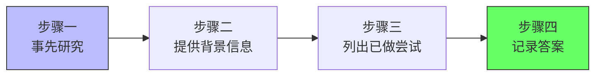

### 10.1 步骤一与二：研究和背景

**步骤一：事先研究。** 在寻求他人帮助之前，先自己尝试寻找解决方案。不是要你花数小时或数天时间去研究，而是给自己一个限定的研究时间，比如30分钟左右。

**步骤二：提供背景信息。** 当你决定要向他人提问后，要尽可能多地向请教的人提供背景信息，让对方能迅速了解背景，快速给予帮助。

### 10.2 步骤三与四：尝试和记录

**步骤三：列出目前所做的尝试。** 告诉对方自己已经做了哪些尝试，帮对方省去一些重复尝试。这样可以让对方迅速排除无效方法，把精力投入到寻找其他有效方法上。

**步骤四：记录答案。** 当你得到答案后，一定要迅速把答案记下来，形成方法论。以后再遇到同一个问题，也可以从中做下参考。

## 11.提问高手的特点

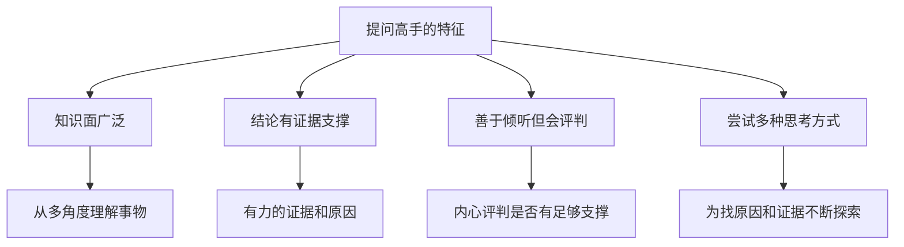

真正的提问高手，都是批判性思维之大成者。在《提问的艺术》一书中提到，一个优秀的批判性思维者必备的4个特征：

### 11.1 知识广和重证据

1. **知识面广泛**，能够从多个角度去理解事物。知识面越广，提问的角度就越多，问题的质量就越高。
2. **任何结论都有强有力的证据和原因**。好的提问者不会问"这对不对"，而是问"你有什么证据支撑这个结论"。

### 11.2 善倾听和换思路

3. **善于倾听他人的想法，但会从内心评判该想法是否有足够的支撑**。他们不会盲目接受，也不会盲目否定。
4. **为了找到原因和证据，会尝试多种思考方式**。当一条路走不通时，他们会换角度、换方法继续探索。

## 12.场景化提问训练

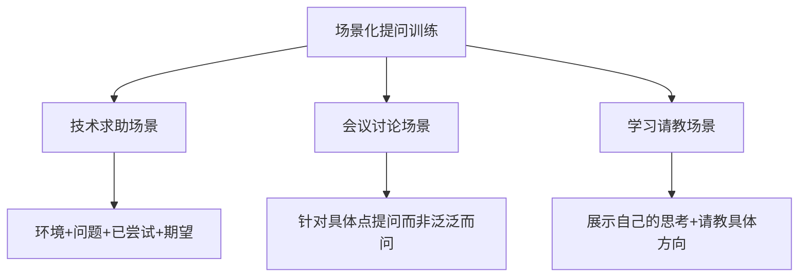

### 12.1 技术求助场景

向同事请教技术问题时，用这个模板："我在做XX的时候遇到了XX问题（简述），环境是XX（关键信息），我已经尝试了XX和XX但没有解决（已做尝试），你能帮我看看是什么原因吗？"

### 12.2 会议讨论场景

在会议中提问时，避免"我有个问题"然后抛出一个大而泛的问题。好的做法是："关于刚才提到的XX方案，我有一个疑问——如果在XX场景下，是否会出现XX问题？"针对具体的点提问，而非泛泛而问。

### 12.3 学习请教场景

向前辈请教时，展示你的思考过程："关于XX问题，我目前的理解是XX，我也查了XX资料，但是在XX这个点上还不太确定，您能给些指导吗？"这种提问方式既展示了你的努力，又精准定位了困惑点。

## 13.总结回顾这一节

### 13.1 一句话核心

**好的提问 = 自己先查 30 分钟 + 一句话目标 + 背景信息 + 已尝试方案 + 期望帮助；提问的过程，本身就是解决问题的过程。**

### 13.2 你应该带走的三件事

1. **30 分钟原则**：提问前先自己研究 30 分钟，能解决一半的问题。
2. **四要素结构**：背景 + 问题 + 已尝试 + 期望，缺一不可。
3. **答案沉淀**：每次得到答案要记录下来，形成自己的知识库。

## 14.后来发生的改变

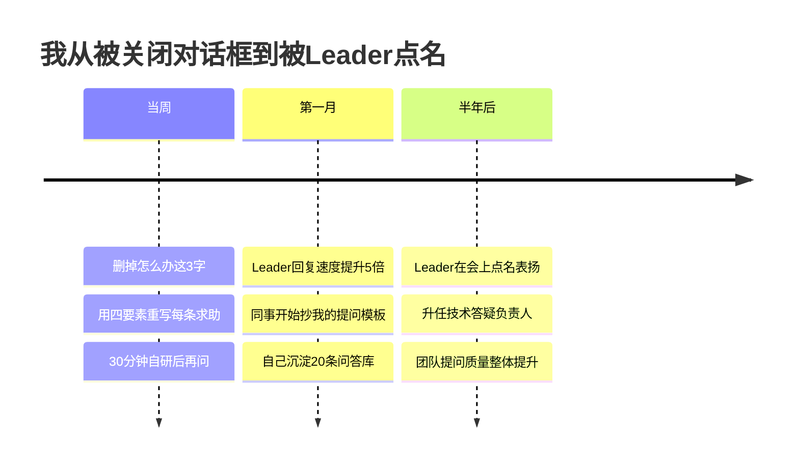

### 14.1 当周：删掉"怎么办"

第二天我做的第一件事就是把企业微信里"怎么办"这个词从我的输入法里删掉。之后每次提问前我强制自己先做 30 分钟自研：搜索、查文档、看源码。然后用"我做 XX 遇到 XX 问题，环境是 XX，已尝试 A/B，怀疑是 XX，是否方向对？"的模板写。

### 14.2 第一个月：回复速度提升 5 倍

一个月后效果非常明显——Leader 平均回复时间从"不回"变成"3 分钟内"。组里几个新同事开始私聊我："你怎么写求助信息这么有效？" 我把模板共享给他们。同时我建了一个"问答库.md"，每解决一个问题就记一条，一个月攒了 20 多条。

### 14.3 半年后：被点名表扬

半年后部门月会上，Leader 公开表扬："**XX 同学的提问质量是组里最高的，每次问问题都让人想立刻帮他。**" 后来我被任命为组里的技术答疑负责人，负责整理团队的常见问题文档。**那个曾经被关掉对话框的人，现在成了"提问范本"。**

## 15.今天起改变三点

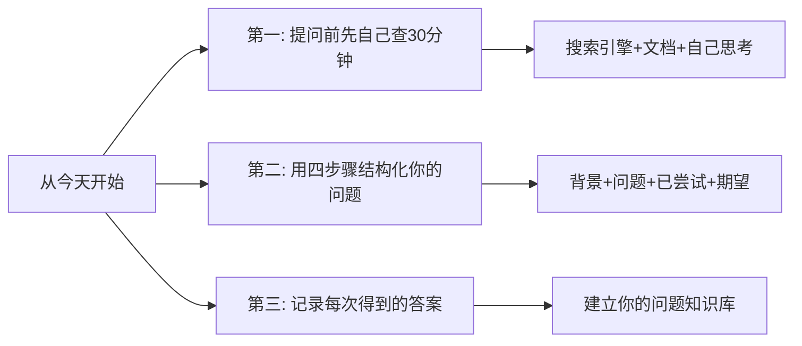

### 15.1 提问前先自己查 30 分钟

遇到问题不要第一时间就问别人，先自己搜索、查文档、思考一下。这30分钟的投入，一方面可能直接解决问题，另一方面即使没解决，你也对问题有了更深的理解，提出的问题质量会更高。

### 15.2 用四要素结构化提问

不要再说"这个我不懂"或"怎么才能做好XX"这种无效问题。每次提问前，用30秒时间在心里过一遍"背景+问题+已尝试+期望"这个结构，你会发现问题的质量立刻提升一个档次。

### 15.3 建立"问题答案库"

每次得到有价值的回答后，立刻记录下来——问题是什么、答案是什么、关键点是什么。用笔记软件或文档管理，按主题分类。日积月累，这个知识库会成为你最宝贵的资产。

## 16.课后作业思考下

### 16.1 自检类

1. 回顾你最近一次向别人提问的经历，用本章的标准评估一下：你的问题质量如何？有没有提供足够的背景信息？有没有说明已做的尝试？
2. 选一个你感兴趣的领域，尝试列出5个高质量的问题。好的问题应该是具体的、有深度的、能引发思考的。

### 16.2 实践类

1. 把你最近遇到的一个问题，用"有效提问四步骤"重新组织一遍，看看和你最初的问法有什么区别。
2. 在接下来一周内，每次提问前都用"背景+问题+已尝试+期望"的结构来准备，记录下对方的反馈质量是否有提升。

